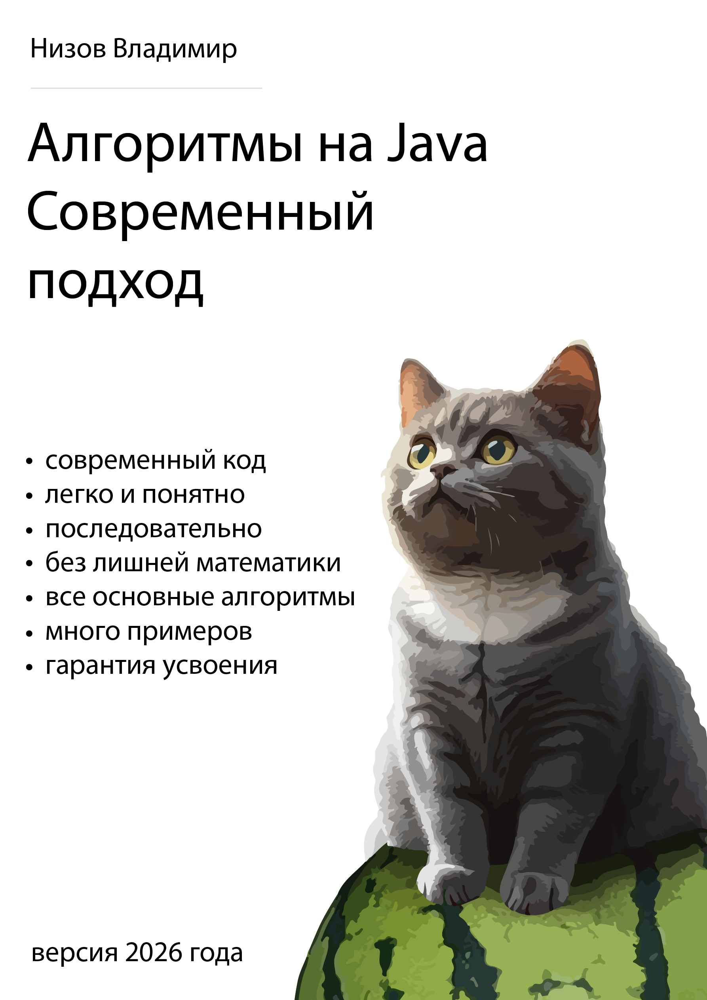

<div style="page-break-after: always;"></div>

 > Книга посвящается самому заботливому и доброму человеку — моей любимой мамочке.

Уведомление об авторских правах
==========
© Низов Владимир, 2026

Все права защищены.

Эта книга или любая ее часть не могут быть воспроизведены или использованы каким-либо образом без письменного разрешения автора, за исключением случаев использования кратких цитат в критических статьях и обзорах.

Несмотря на все усилия, автор и издатель не несут ответственности за любые ошибки или упущения, а также за любой ущерб, возникший в результате использования информации, содержащейся в этой книге.

Все торговые марки и зарегистрированные торговые марки, упомянутые в этой книге, являются собственностью их законных владельцев.
Версия: 1.0.2026.2

© Vladimir Nizov, 2026
All rights reserved.

No part of this book may be reproduced or used in any manner without the written permission of the author, except for the use of brief quotations in critical articles and reviews.

Despite all efforts, the author and publisher assume no responsibility for any errors or omissions, or for any damages resulting from the use of the information contained herein.

All trademarks and registered trademarks mentioned in this book are the property of their respective owners.
Version: 1.0.2026.2

Оглавление
==========
*   [Интро](#chapter-000)
*   [Почему эта книга? : Введение](#chapter-001)

Общие навыки
---

*   [Продуктивность: Борьба с прокрастинацией](#chapter-002)
*   [Продуктивность: Работа со страхами и переживаниями](#chapter-003)
*   [Графическое мышление относительно структур данных](#chapter-004)

Структуры данных
---

*   [Структура данных: Массивы](#chapter-005)
*   [Структура данных: Стек](#chapter-006)
*   [Структура данных: Сет](#chapter-007)
*   [Структура данных: ЛинкдЛист](#chapter-008)
*   [Структура данных: Дерево](#chapter-009)
*   [Структура данных: Хешмапы](#chapter-010)
*   [Структура данных: Очереди и Деки](#chapter-011)
*   [Структура данных: Куча](#chapter-012)
*   [Структура данных: Графы Интро](#chapter-013)
*   [Структура данных: Префиксные деревья Интро](#chapter-014)

Примитивные алгоритмы
---

*   [Примитивные алгоритмы: Теория табличного тестирования](#chapter-015)
*   [Примитивные алгоритмы: Факториал](#chapter-016)
*   [Примитивные алгоритмы: Фибоначчи](#chapter-017)
*   [Примитивные алгоритмы: Поиск](#chapter-018)
*   [Примитивные алгоритмы: Сортировки](#chapter-019)
*   [Мышление паттернами](#chapter-020)
*   [Разбор эволюции кода](#chapter-021)
*   [Финализация относительно рекурсии](#chapter-022)

Основные алгоритмы
---

*   [BackTracking алгоритмы](#chapter-023)
*   [Dynamic Programming алгоритмы. Общая картина](#chapter-024)
*   [Dynamic Programming: Сложение](#chapter-025)
*   [Dynamic Programming: Максимизация выборов](#chapter-026)
*   [Dynamic Programming: СравнениеВыбор](#chapter-027)
*   [Dynamic Programming: Накопление и Комбинаторика](#chapter-028)
*   [Greedy (Жадные) Алгоритмы](#chapter-029)
*   [Стратегия "Разделяй и Властвуй" в алгоритмах](#chapter-030)
*   [Two Pointers (два указателя) алгоритмы](#chapter-031)
*   [Sliding Window (скользящее окно) алгоритмы](#chapter-032)
*   [BFS (Breadth First Search) Поиск в ширину, DFS (Depth First Search) глубину алгоритмы](#chapter-033)
*   [Двоичный поиск (Binary Search) алгоритмы](#chapter-034)
*   [Алгоритм Дейкстры (Dijkstra)](#chapter-035)
*   [Топологическая сортировка (Graph Topological Sort)](#chapter-036)
*   [UnionFind (Disjoint Set Union, DSU) алгоритмы](#chapter-037)
*   [Алгоритмы на базе Префиксных деревьев (Trie)](#chapter-038)
*   [Побитовые операции (Bit Manipulation)](#chapter-039)
*   [Алгоритмы на базе монотонности и монотонного стека (Monotonic Stack)](#chapter-040)
*   [Алгоритмы на базе Префиксной суммы (PrefixSum)](#chapter-041)
*   [Алгоритмы на базе Rolling Hash](#chapter-042)
*   [Имитационное моделирование (Симуляция-Simulation)](#chapter-043)

Приложения
---

*   [Приложение. Масштабирование алгоритмов](#chapter-044)
*   [Приложение. Пермутации, комбинации, вероятность, Монте Карло](#chapter-045)

Решебник
---

*   [Решебник. Framework](#chapter-046)
*   [Решебник. MonotonicStack_DailyTemperatures](#chapter-047)
*   [Решебник. OverlappingIntervals_NonOverlappingIntervals](#chapter-048)
*   [Решебник. Путешествия по деревьям](#chapter-049)
*   [Решебник. Путешествия по матрицам](#chapter-050)
*   [Решебник. Backtracking_Permutations](#chapter-051)
*   [Решебник. Backtracking_NQueens](#chapter-052)
*   [Решебник. BinaryTreeTraversal_BinaryTreeLevelOrderTraversal](#chapter-053)
*   [Решебник. BinaryTreeTraversal_BinaryTreeMaximumPathSum](#chapter-054)
*   [Решебник. BinaryTreeTraversal_BinaryTreePaths](#chapter-055)
*   [Решебник. BinaryTreeTraversal_KthSmallestElementInBST](#chapter-056)
*   [Решебник. BreadthFirstSearch_RottingOranges](#chapter-057)
*   [Решебник. BreadthFirstSearch_WordLadder](#chapter-058)
*   [Решебник. DepthFirstSearch_CloneGraph](#chapter-059)
*   [Решебник. DepthFirstSearch_CourseSchedule](#chapter-060)
*   [Решебник. DepthFirstSearch_PathSum](#chapter-061)
*   [Решебник. DynamicProgramming_ClimbingStairs](#chapter-062)
*   [Решебник. DynamicProgramming_CoinChange](#chapter-063)
*   [Решебник. DynamicProgramming_LongestIncreasingSubsequence](#chapter-064)
*   [Решебник. DynamicProgramming_LongestCommonSequence](#chapter-065)
*   [Решебник. DynamicProgramming_PartitionEqualSubsetSum](#chapter-066)
*   [Решебник. FastAndSlowPointers_FindTheDuplicateNumber](#chapter-067)
*   [Решебник. FastAndSlowPointers_HappyNumber](#chapter-068)
*   [Решебник. FastAndSlowPointers_LinkedListCycle](#chapter-069)
*   [Решебник. LinkedListReversal_ReverseLinkedListA](#chapter-070)
*   [Решебник. LinkedListReversal_ReverseLinkedListB](#chapter-071)
*   [Решебник. LinkedListReversal_SwapNodesInPairs](#chapter-072)
*   [Решебник. MatrixTraversal_FloodFill](#chapter-073)
*   [Решебник. MatrixTraversal_NumberOfIslands](#chapter-074)
*   [Решебник. MatrixTraversal_SurroundedRegions](#chapter-075)
*   [Решебник. ModifiedBinarySearch_FindMinimumInRotatedSortedArray](#chapter-076)
*   [Решебник. ModifiedBinarySearch_Search2DMatrix](#chapter-077)
*   [Решебник. ModifiedBinarySearch_SearchInRotatedSortedArray](#chapter-078)
*   [Решебник. MonotonicStack_LargestRectangleInHistogram](#chapter-079)
*   [Решебник. MonotonicStack_NextGreaterElement](#chapter-080)
*   [Решебник. OverlappingIntervals_InsertInterval](#chapter-081)
*   [Решебник. OverlappingIntervals_MergeIntervals](#chapter-082)
*   [Решебник. PrefixSum_ContiguousArray](#chapter-083)
*   [Решебник. PrefixSum_RangeSumQueryImmutable](#chapter-084)
*   [Решебник. PrefixSum_SubarraySumEqualsK](#chapter-085)
*   [Решебник. SlidingWindow_MaximumAverageSubarray](#chapter-086)
*   [Решебник. SlidingWindow_LongestSubstringWithoutRepeatingCharacters](#chapter-087)
*   [Решебник. SlidingWindow_MinimumWindowSubstring](#chapter-088)
*   [Решебник. TopKElementsOrMinMaxHeap_KthLargestElement](#chapter-089)
*   [Решебник. TopKElementsOrMinMaxHeap_TopKFrequentElements](#chapter-090)
*   [Решебник. TopKElementsOrMinMaxHeap_FindKPairsWithSmallestSums](#chapter-091)
*   [Решебник. TwoPointers_ContainerWithMostWater](#chapter-092)
*   [Решебник. TwoPointers_TwoSum2InputArrayIsSorted](#chapter-093)
*   [Решебник. TwoPointers_ThreeSum](#chapter-094)

Шпаргалка
---

*   [Шпаргалка](#chapter-095)
*   [Заключение](#chapter-999)

<a id="chapter-000"></a>
Интро
=====
Для начала позвольте представиться.

Меня зовут **Владимир Низов**, и я профессионально занимаюсь IT в разных аспектах - от организации
вывода продуктов и архитектуры до системного (Assembler) и энтерпрайз (Java) программирования - уже более
20 лет своей жизни. Мне кажется, я перезанимал практически все существующие позиции - от
коммерческого директора до Principal Architect в криптофинтехе.

Как то так исторически сложилось, что ко мне часто обращаются с особенными задачами,
за которые никто не хочет браться, или которые считаются нереализуемыми.
После чего как-то так всегда выходило, что эти задачи в итоге решались. Снова и снова.

Эта повторяющаяся история, длиной в несколько десятков лет, в некоторой степени
укрепила во мне уверенность и натолкнула на вопрос, а можно ли применить тот же принцип,
который используется в реализации "тяжелых" проектов,
когда мы беремся за что то сложное и доводим до результата,
к выработке методики обучения алгоритмам и структурам данных?

    на фоне того, что происходит (вставьте сюда слово сами) относительно
    темы алгоритмов и дата-структур, с задачами и требованиями к их усвоению
    как основному маркеру квалификации инженеров

Удастся ли, **в принципе**, создать полностью профессиональное и полное руководство, которое:
- работает «под ключ» с гарантией получения результата для читающего;
- не теряет в глубине (рассматривает каждую тему, ничего не обрезая);
- при этом остаётся понятным для читателя
  (чтобы его мог читать буквально любой инженер, начиная с позиции стажёра, - даже без
  специального математического или даже технического образования);
- ещё и привязывается к современным методикам энтерпрайза (обучая программировать и читать код);
- а также включает объяснения, ориентированные на русский язык (почему бы и нет)?

И, как видите, ответ перед вами - это возможно(как обычно, ничего нового, так же как и у вас
получится что угодно, за что бы вы не взялись серьезно).

Единственное, в чём я просчитался в процессе, - не учёл «проклятия знания», отчего книга
получилась довольно объёмной. Однако она получилась полной, так что
провалов в самом знании здесь просто нет. Это именно полный комплект знаний от нуля,
с некоторыми нюансами, до уровня который многие считают максимумом.

Вообще формирование книги стало для меня серьезным инженерным и организационным челленджем,
по сути книга это хороший middle-tier проект, где есть:
требования, архитектура, методология, итерации, тонны правок и тд. и тп.

На её создание, от идеи до готовых 3+ мегабайт текста,
ушло шесть месяцев сосредоточенной работы почти в full time.
(про объем затраченной энергии я просто промолчу).

Ну так вот. **Челлендж**.

Давайте поговорим об обратной связи.

Если уже у Вас есть для меня челлендж по работе или есть замечания и
предложения по этой книге (которая планируется обновляться раз в год - то есть
это поддерживаемый продукт; если чего‑то не хватает - давайте добавим!),
вот мои контакты (почта/телеграм):

    readthis@inbox.ru
    @xPushNotification

Если же вы просто запутались и чего‑то не понимаете,
не стесняйтесь, пишите тоже.

Да да - прямо не стесняйтесь и пишите, обожаю заводить новых друзей.
Также, если у вас нет друзей (а у инженеров такое бывает) и хочется начать с кого‑то,
можете начать с меня, я не такая плохая для этого кандидатура.

В общем, ваша обратная связь для меня будет желаема и ожидаема - я помогу
вам разобраться в чём угодно.

Последнюю же версию книги на русском языке всегда можно
найти на моём GitHub:

    github.com/xnvs

В общем, приятно познакомиться.

А мы переходим к введению.

<a id="chapter-001"></a>
x001. Почему эта книга? : Введение
==================================

Настроение книги
----------------

У каждой книги есть своё настроение - эта книга не исключение. С самого начала
я хочу, чтобы читатель почувствовал себя полноценным членом **команды**,
к которому проявляют внимание и уважение.

Задача книги - не просто дать информацию, а провести читателя за руку
от нулевой точки до уровня экспертного понимания алгоритмов и структур данных.
Когда я говорю «экспертного», я имею в виду именно это: гарантировать такое
понимание при следовании инструкциям, чтобы читателю не приходилось возвращаться
к темам, обсуждаемым в книге.

У меня есть чёткое убеждение, которое подтверждается раз за разом и которое,
надеюсь, вы разделите:

> Проблема непонимания - это не проблема того, кому объясняют,
> это проблема того, кто объясняет.

Именно с этой позиции выстроены структура книги и её примеры.

Начнём с типичных утверждений об алгоритмах, которые приходится слышать чаще
всего:

+ Алгоритмы - это не моё (у меня мозг устроен не так, я не такой, и вообще…).
+ Алгоритмы никогда не встречаются в реальной работе.
+ Алгоритмы - это сложно.
+ Алгоритмы - это что‑то из сферы математики (и даже мат. оптимизации).
+ [Ваш тезис, похожий на перечисленное].

Во всех случаях это НЕ так. Во‑первых, алгоритмы - это 100 % ваше, потому что
это буквально история про декомпозицию задач на части и умение оперировать
паттернами. Это основной навык инженера‑программиста. Всё, что встречается
в реальной жизни, - это только алгоритмы, только «под разным соусом»: от поиска
работы до строительства крупных заводов. Математика к алгоритмам имеет крайне
опосредованное отношение - не обязательно быть математиком, чтобы разбираться
в них на уровне эксперта.

Почему так? Объясню.

Понимание против объяснения
----------------------------

Эта книга - полный практический последовательный курс. За исключением
некоторых исключительно редких алгоритмов, на выходе вы сможете самостоятельно
написать любой алгоритм любой «сложности».

Почему «сложности» в кавычках? Потому что алгоритмы концептуально просты
для понимания - как и математика, как и другие области, например машинное
обучение. Эти концепции сложно объяснять, но легко понимать и усваивать,
если объяснение хорошее.

Откуда взялось предубеждение о сложности? Мне кажется, всё очевидно.
Существует паттерн, показывающий, как объяснение строить НЕ надо. Он называется
**парадокс объяснения электрика**.

Представьте: вы (и даже я) живёте в большом доме. У вас гаснет свет, потому
что какой‑то электрик чинит электричество. Вы, негодуя, выходите из квартир
и идёте выяснять, что происходит. Доходите до электрика и спрашиваете:
«Почему свет не горит?»

+ Электрик: «Ну так фаза ушла».
+ Вы: «Какая фаза? Куда ушла?»
+ Электрик: «Что значит какая? Напряжение скачет, у вас тут заземление никакое».
+ Вы: «Ну так а свет‑то когда будет?»
+ Электрик: «Надо звонить на Ц.Р.».
+ Вы: «…», - а в реальности у него залило электрощит после дождя, и надо просто
  подождать, пока подсохнет.

Если убрать шутки, здесь реализуются две механики:
1) введение опережающих абстракций (электрик пытается объяснить одно другим,
ещё не объяснённым);
2) уход от линии решения.

Это типичная ситуация - особенно в вузах, где годами происходит отрицательный
отбор преподавателей. Они привыкают писать и переписывать за другими абстрактные
бумаги без связи с реальностью, по классике привязывая это к математике
(которая с каждым переписыванием, как понимаем, становится только **лучше и лучше**).

Математика как часть проблемы объяснения
-----------------------------------------

Не поймите меня неправильно: я неплохо разбираюсь в математике - где‑то на уровне
хорошего понимания абстрактной алгебры. Но могу сказать, что она не всегда
нужна для объяснений, а её нотация чаще портит ситуацию, чем помогает. Это
демонстрируется на кейсе Стэнфорда: в курсе лекций по машинному обучению
преподаватель, даже переписывая с бумажки, сам запутывается в вычислениях
и три раза переписывает формулу на доске (то есть, очевидно, сам её не понимает).

Берём парадокс электрика, прибавляем мат. нотацию - и вот пожалуйста:
всё сложно и ничего не понятно.

Математика - не корень объяснения. Это история про соотношения одного с другим
(или другими), что, кстати, не все математики даже понимают.

Математикой можно объяснить любой процесс, потому что любой процесс - это
соотношения. Но она не является краеугольным камнем, на котором строится
любое объяснение. Более того, математика всегда привязана к реальности,
а с восприятием реальности у вас, я думаю, проблем нет (а даже если есть -
это тоже не проблема, продолжайте читать).

Приведу примитивный пример. В математике есть абстракция квадратных уравнений:
там есть формула, решения и всё остальное. Но концептуально история квадратных
уравнений - это история о соотношениях чего‑то прямого и чего‑то круглого.
Например, шарика и спицы: как соотносятся шарик и спица? Спица протыкает
шарик (две дырки - два «решения»), касается шарика (одно касание - «решение»)
или вообще его не трогает («решений» нет).

Если у вас нет проблем с тем, чтобы представить себе шарик и спицу, очевидно,
эта концепция не создаёт у вас больших трудностей.

Просто паттерны
----------------

Смотрите дальше: это просто история про паттерны.

У нас есть график волнового курса доллара и линия статистики. Нам надо посмотреть,
где линия статистики в график войдёт и выйдет. График похож на что‑то круглое?
Да. Линия статистики похожа на что‑то прямое? Да. Можно применить квадратное
уравнение.

Это просто история про паттерны - так же, как и в алгоритмах.

Мало кто понимает, но, например, бухгалтерский учёт по сути представляет собой
линейную алгебру в чистом виде. Если вы сообщите эту новость бедному бухгалтеру,
он скорее будет в шоке, чем сможет рассказать, как валидирует отчёты с помощью
линейных преобразований (а они там именно этим и занимаются).

Закрепите у себя в голове: математикой можно объяснять процессы, но она часто
НЕ необходима.

Поэтому, если она потребуется на протяжении книги, она будет даваться в максимально
дистиллированном состоянии - только там, где нужно. Плюс я дам приложение
по теории вероятности, так как это важно для работы.

Если к этому моменту вы стали чувствовать себя полегче - отлично! Но я описал
ещё не всё, что мешает пониманию алгоритмов.

Есть ещё очень важный, я бы даже сказал принципиальный момент. Давайте его также
рассмотрим! Будем, так сказать, видеть врага в его настоящем лице.

Давайте для начала, как и в случае с электриком, дам кейс, потом объясню,
что происходит.

Откуда берутся «обезьяньи собеседования»
---

Кейс у нас будет про «обезьянье» собеседование (мне кажется, уже все это
видели, и каждый понимает, что тут что‑то не так - давайте разберём,
что же именно):

- Здравствуйте.
- Здравствуйте.
- Я высокопрофессиональный интервьюер. Мы ищем инженера в нашу
  прекрасную Некоторую компанию.
- Да, я такой. Рад собеседоваться в Некоторую компанию, особенно на 14‑м
  раунде. Это всё я. Я инженер. Высокопрофессиональный инженер.
- У меня для вас задача - это высокопрофессиональная задача LeetCode за
  номером 451.154. Я скопировал эту задачу с сайта, и у меня есть решение.
  Вы решайте, а я буду проверять по буковкам.
- Да, могу. Пишу. Я выучил наизусть задачу 451.154. Мне повезло на этом
  собеседовании - не все задачи я выучил наизусть. А эта решается рекурсивно.
  Тык‑тык (набирает по памяти решение). Сложность О(семь
  целых пять десятых в квадрате).
- Задам неожиданный вопрос (делает умное лицо). А можете решить теперь с
  помощью стека (проверяет по решению по буковкам)?
- Да, могу (делает ещё более умное лицо). Я же высокопрофессиональный
  инженер. Решаю с помощью стека. Тык‑тык. Сложность О(минус один в
  степени логарифма).
- Замечательно. Я так рад, что вы профессиональный инженер.
- Да, я тоже рад, что вы профессиональный интервьюер.
- Мы рады.

Что здесь происходит? И почему это вообще в принципе вызывает кринж
(особенно если к этому пристыковать ещё и ИИ‑агента)?

Вызывает, потому что требуется решение задачи, выученное наизусть. Таких задач
несколько тысяч, и в итоге подразумевается, что бедный кандидат их и будет
наизусть учить одну за другой.

Откуда же вышла эта зубрёжка? (Заметьте, и со стороны интервьюирующего
также - то есть проблема двусторонняя.)

Почему нельзя задачи эти решать легко и непринуждённо? (Как и спрашивать
разнообразные?)

Всё очень просто. Дело в том, что для того, чтобы не происходил цирк,
представленный выше, должны быть представлены аж целых три механики:

1. Декомпозиция и линейное распрямление задачи.
2. Выбор и понимание выбора алгоритма.
3. Кодирование этого алгоритма.

Заметьте: это РАЗНЫЕ механики и разные навыки. То есть если вы понимаете,
что такое алгоритм в принципе на интуитивном уровне (как в примере с шариком),
у вас нет проблем, чтобы его подобрать. Но если вы не знаете, как его кодировать,
вы опять возвращаетесь к стрессу.

То есть как интервьюер не может дать произвольную задачу, не понимая всех
трёх механик, и вынужден давать зазубренную наизусть, так и интервьюируемый
не в состоянии эту задачу быстро разобрать на компоненты и реализовать.

Как аналог для демонстрации проблемы можно представить навыки художника
и художественного критика.

Согласитесь, истории о том, чтобы нарисовать картину «Мона Лиза» и оценивать
художественную ценность такой картины, отличаются. Это разное.

Что это порождает в принципе, а не только на собеседованиях? Вам показывают
решение в виде готового алгоритма.

Но история с тем, что просто показать вам алгоритм, - это не история с тем,
что вы поймёте, откуда он взялся (декомпозиция задачи же от вас скрыта), и даже
не поймёте, в каком порядке его набирать (так как код обычно пишется не сверху вниз,
всё‑таки).

Вот именно это и создаёт вам стресс, и именно это создаёт вам непонимание и
откат к «обезьяньему» подходу - то есть к простому копированию и зазубриванию.

Вот в этой книге мы как раз последовательно и добьёмся того, чтобы такого
разрыва не было. А как мы этого добьёмся, я расскажу чуть дальше.

Хотя задачи мы будем решать и, естественно, перерешаем все основные,
спрашиваемые на собеседованиях.

Теперь о структуре
---

Книга имеет очень чёткую структуру и построена в виде последовательного
объяснения. Поэтому, к сожалению или счастью, её не получится читать по
отдельным главам - вам лучше проходить её с начала до конца.

При этом в местах, где будет кодирование, я специально буду разбирать эволюцию
кода - то есть буду показывать, откуда взялось то или иное решение. Это может
сначала показаться странным, но нет - это именно то, что вам и нужно. В
противном случае вы будете раз за разом скатываться в «обезьяньи» собеседования.
В итоге вам и самим станет неинтересно, а в итоге вы просто запутаетесь.

Такая эволюция, особенно в разделе про структуры данных, может показаться
даже излишней. Но это сознательный подход, для того чтобы решение
воспринималось именно на «кончиках пальцев».

Поэтому будет вот такой подход и метод.

Вторая особенность подхода книги - это то, что я буду использовать несколько
форматов объяснения, включая и общенаучный. То есть мы от него не будем
отказываться, но будем давать отдельно, выделяя и не делая на него основного упора.

Вообще я буду поддерживать в книге более живой язык, более разговорный, так
сказать, чтобы её было легче читать.

Третья особенность в том, что книга привязана к языку Java и общему энтерпрайз‑
подходу в разработке приложений. Это сделано намеренно, так как я посмотрел около
двух десятков книг коллег, и использование судо‑кода скорее сумятицу вносит
в понимание, чем его даёт (судо‑код невозможно ни валидировать, ни запустить).

Описанная же выше привязка вводит потребность рассматривать стандартные
инструменты Java для работы с коллекциями - как то: обёртки, стандартные
интерфейсы, стандартные инструменты вроде итераторов, компараторов и т. д.
Их мы также рассмотрим.

Иногда может показаться, что я специально усложняю с этим, но это опять же
сознательный подход - чтобы показать, что может конкретно сделать язык.

И четвёртая особенность - в именовании переменных. В учебных примерах я их
в первом разделе о структурах данных буду именовать на великом и могучем
русском языке.

Это опять же сознательный подход для того, чтобы вам снизить когнитивную
нагрузку и дать возможность отказаться от лишних комментариев (не все знают
английский идеально). А мы здесь всё‑таки учимся писать алгоритмы, а не
разбирать, что такое ThreeWayLinkedHashListEvaluator. (Как вы помните, если
в энтерпрайз Java в названии переменной меньше пяти слов, она названа не очевидно.
Может показаться, что я сейчас шучу, но нет.)

К разделам же об алгоритмах мы снова вернёмся к английскому языку, так как в
задачах на собеседованиях вам придётся использовать уже, очевидно, его. Но к
этому моменту у вас уже будет понимание и набор инструментов (методик), который
такие задачи решать позволит. Всё‑таки настоящая книга старается быть
реалистичной и приближённой к реальным проблемам читателя.

Вообще в книге будут следующие разделы, которые будут плавно перетекать
друг в друга:

Вводный раздел посвящён тому, как работать с прокрастинацией, страхами и
визуализацией. (Странно, да? На самом деле - нет. Как я и сказал, моя задача -
**дотащить** вас до того момента, когда вы станете экспертом в алгоритмах. А если
вы бросите на полпути - я себе такого не прощу (да и вы тоже). Поэтому займёмся
сначала базой: тем, как в принципе «вывозить» любые задачи.)

Первый раздел - про структуры данных. Мы последовательно рассмотрим их эволюцию,
поскольку все структуры данных связаны между собой.

Второй раздел - про базовые алгоритмы: сортировки, перестановки и так далее.
В разделе будет очень много визуализации.

Третий раздел - про алгоритмы по их видам, с теорией и практикой.
Это нужно, чтобы вы без труда могли перенести полученные знания
на типовые алгоритмические задачи.

Затем идут Приложения. Мы посмотрим на вычисления вероятностей и
**энтерпрайзавизацию** (ну и слово!) решений - на примере всем известного
фазбаза (мы его сделаем энтерпрайзом).

И - огромный решебник по пятидесяти основным задачам. Мы не просто
поверхностно разберём их, а пройдём всю теорию: откуда что берётся,
почему это работает именно так, а также какие есть другие варианты.

Книга - не справочник и не энциклопедия. Информация будет подаваться
постепенно, усложняясь от начала до самого конца.
(Мы начнём буквально с того, как построить многомерный массив и им управлять,
а закончим генерацией дерева вероятностей решений - того, что в некоторых вузах
даже не преподают.)

Чтобы получить максимальный эффект от книги - читайте её последовательно.
Многие разделы о том, как программировать, декомпозировать и читать код,
я включил ровно там, где от их появления есть максимальная польза.

Вот, вроде бы, и всё.

От себя хочу пожелать вам удачи в изучении!

То, что вы заставляете себя учиться, а не просто надеетесь, что всё само
как‑то рассосётся, уже вызывает уважение. Вы молодец!

Думаю, у вас всё получится. А я приложу максимально возможное количество
усилий к этому. Для меня было большим развлечением писать эту книгу -
думаю, для вас будет не меньшим удовольствием её читать.

Плюс учитывайте: я по жизни очень позитивный и заряженный человек
(что, возможно, даже некоторых раздражает). Поэтому ждите большого
количества петросянств, новояза и восклицательных знаков (!) с выделениями
слов КАПСЛОКОМ.

Книга параллельно пишется на двух языках - английском и русском.
Англоязычная версия более академична и суха (отчего мне кажется менее интересной).
Поэтому, если устанете от моего разговорного стиля, можете просто сменить
версию книги.

Ну что?

Ныряем в раздел с устранением страхов, прокрастинации и визуализации
алгоритмов.

Поехали!

ВВОДНЫЙ РАЗДЕЛ: ПРОДУКТИВНОСТЬ И МОТИВАЦИЯ
==========================================

<a id="chapter-002"></a>
x002. Продуктивность: Борьба с прокрастинацией
==============================================

Прокрастинация для разработчиков - что‑то вроде старого доброго друга:
каждый о ней знает, не каждому она приятна, но каждый понимает, о чём идёт речь.

Разобраться в алгоритмах - достаточно объёмная задача, требующая значительного
упорства. Чтобы нивелировать возможные её срывы, давайте сразу решим вопрос
с продуктивностью.

Эта глава построена следующим образом:

1. Сначала я расскажу об общепринятых методиках.
2. Потом я расскажу о методиках, которые работают, не требуют усилий, но дают
   неустойчивые или сомнительные результаты.
3. И в конце я дам методику, которая работает всегда, но требует уже некоторых
   усилий.

Общепринятые методы (механики):
-------------------------------

Модель общепринятых методов достаточно ограничена. Если вы будете искать, как
обработать прокрастинацию, вы, скорее всего, столкнётесь с какой‑нибудь
вариацией из приведённых ниже пунктов.

Устранение причин:
------------------

Причинами обычно называют (я буду писать причину, вложенные в неё моменты и в конце -
очевидные проблемы через предлагаемую рекомендацию):

Страх неудач как причина прокрастинации
---------------------------------------

Страх неудач - вы боитесь начинать что‑то делать, потому что боитесь потерпеть
неудачу.

Очень интересный факт: если вы определитесь с тем, как именно вы видите эту
неудачу, которую боитесь потерпеть, - например, при составлении отчёта, который
вы уже писали десять раз, - я, честно говоря, представляю слабо.

Методика рекомендует для преодоления работать со страхом и брать партнёров
к исполнению задачи (чтобы не было так страшно).

Проблема методики в том, что в команде работать у вас, скорее всего, не всегда
получится, и ряд задач (и проблем) придётся решать в одиночку.

Перегрузка как причина прокрастинации
-------------------------------------

Перегрузка - подразумевается, что задача слишком большая и комплексная, её
невозможно объять сознанием, поэтому она и не исполняется.

Рекомендуемое решение - снижать когнитивную нагрузку, дробя задачу на небольшие
кусочки и занимаясь уже ими. Например:
- вам хочется заняться иностранным языком - учите 10 слов в день;
- хочется заняться спортом - начните с 10 повторений упражнения и так далее,
  разгоняясь по инерции.

Проблема методики в том, что некоторые задачи действительно большие и комплексные.
Даже дробя их, вы всё равно будете наблюдать огромную комплексность и испытывать
стресс.

Отсутствие чёткой цели как причина прокрастинации
-------------------------------------------------

Отсутствие чёткой цели - вы не понимаете, что вы делаете и зачем, на уровне
дофаминового отказа (механизма мозга, отвечающего за вознаграждение вас радостью
при достижении позитивных результатов). То есть мотивация движения к результату
слишком неочевидна и непонятна, чтобы реально двигаться к цели.

Методика решения подразумевает конкретизацию, чтобы видение смысла вашего движения
было вам понятным.

Проблема методики в том, что в 99 % случаев получаемые результаты будут
отличаться от намеченных - просто из‑за возникающей неопределённости окружения.
Если не верите, просто посмотрите в ретроспективе на свою жизнь.

Не очевидные выгоды прокрастинации
----------------------------------

Не очевидные выгоды прокрастинации - когда вы прокрастинируете, вы говорите
себе, что на самом деле отдыхаете, и, глядишь, всё как‑нибудь наладится.
То есть бездействие не всегда является чем‑то плохим.

Методика здесь подразумевает, что вы просто перестаёте называть прокрастинацию злом.
У вас пропадает чувство вины, и вы спокойно продолжаете жить, не обращая внимания
на происходящее вокруг (снижаете планку ожиданий).

Проблема механики здесь очевидна - результатов просто не будет.

Наиболее устоявшиеся методы (механики):
---------------------------------------

Общепринятый метод «Помодоро»:
------------------------------

Один из самых распространённых - конечно же, «Помодоро». Смысл метода в том,
чтобы разделить рабочую активность на 25‑минутные периоды и после каждого
устраивать отдых.

Предполагается, что таким образом вы:
- быстрее стартуете;
- меньше устаёте;
- форсированно отдыхаете.

Основная проблема метода - в исследованиях, которые показывают, что для возврата
в фокус требуется минимум 10 минут. Таким образом, почти половину каждого
вашего рабочего рывка вы будете тратить на восстановление фокуса. Более того,
постоянные старты и торможения будут вас выматывать.

Технически в таком режиме вы сможете проработать от 2 до 4 часов в день. Это лучше,
чем ничего, но, согласитесь, не предел мечтаний.

Кроме того, методика совершенно не исключает того, что вы вообще не начнёте
работать - вас напугает и комплексность, и сложность задачи. То есть вместо
того чтобы начать, вы просто отложите дело. Решение в таком случае ещё и
не полноценное.

О больших задачах с этой методикой вы, по сути, можете просто забыть: будете
делать их бесконечно (в среднем 3 часа в день, а задача у вас - 1000 часов
в длину; вам потребуется больше года).

Общепринятый метод «Правило двух минут»:
----------------------------------------

Суть правила - не затягивать действие и не ставить его на потом, избегая
психологического нагнетания барьера.

То есть если какую‑то задачу можно сделать за 2 минуты от текущего момента -
кидаться на неё и делать сразу же.

Более того, видеть крупные задачи как единственную первую, которая занимает
лишь две минуты. Делая их таким образом, вы лишаете их пугающего вида.

Проблема этого метода очевидна по содержанию: вы проактивно кидаетесь на всё
подряд, но не фокусируетесь, а ведёте себя буквально как антипродуктивность,
ориентируясь на максимальную распылённость. Этот метод совершенно не гарантирует,
что, кинувшись на задачу и сделав её за 10 минут, вы не бросите её и не останетесь
прокрастинировать на ближайшие два‑три часа.

Но в методике есть здравый смысл: дофаминовое нагнетание действительно сильно
влияет на проблему старта. Две минуты старта дают шанс (не гарантию, а шанс),
что вы продолжите работать и дальше.


Общепринятый метод «Обязательство перед внешним агентом»:
---------------------------------------------------------

Речь идёт о методике, при которой вы сообщаете кому‑либо о своих целях и задачах.
Так вы создаёте дополнительный слой ответственности: вам не хочется выглядеть
безответственным перед этими людьми.

Развитие этой методики - самоштрафы за прокрастинацию.

Нужно ли говорить, что если вы и раньше «играли» с прокрастинацией и всегда
выигрывали, откладывая дела минимум на завтра, на утро - когда будет хорошее
настроение, - вы ГАРАНТИРОВАННО найдёте способ обойти и друга, и коллегу,
и сервис со штрафами.

Вы ведь не ребёнок, и хочется чего‑то более значимого и гарантированного,
чем зависеть от кого‑то - в чём‑то, да ещё и в своих важных делах.

Общепринятый метод «Атомарные привычки»:
----------------------------------------

По сути, эта методика очень похожа на метод Помодоро, но с укороченным интервалом.

Часто приводят такой пример:

Жил человек, который хотел написать книгу. Он решил сделать это за один раз,
садился писать - и ничего не получалось. Тогда он стал писать каждый день
по 15 минут утром - и в итоге добился результата.

Он выработал привычку писать 15 минут ежедневно и таким образом легко достиг
того, чего иначе не смог бы.

Но есть очевидная проблема: представьте день, когда нужно писать не книгу,
а отчёт, а времени на это нет - вы уехали в командировку. При этом отчёт ждут
не через месяц или два, а уже завтра.

Да, атомарные привычки работают - я даже включу их как вариант в одну из методик.
Но их применение всё же сильно ограничено.

Общепринятый метод «Изолирование среды»:
----------------------------------------

Суть в том, что вы устраняете отвлекающие факторы: мобильный телефон, чат,
почту, YouTube. Так вы лишаете мозг выбора - остаётся только работать.

Пример: на YouTube есть видео, где доктор философии из известного вуза
кладёт свой телефон в коробочку, когда идёт работать в библиотеку.
То есть даже доктора философии прибегают к такому методу.

Но мы хотим избавиться от проблемы в принципе, а не устраивать «детский сад»
с самоизоляцией.

Метод работает, но как‑то странно. Мы понимаем, что мозг в конце концов
найдёт способ его обойти: вы отключите YouTube - а мозг заставит вас пойти гулять
или спать. Ведь сон полезен!

Общепринятый метод: «Умение говорить НЕТ и не выгорать»:
--------------------------------------------------------

Это интересный метод, который предполагает, что прокрастинация - часть
чего‑то большего, например выгорания. Разделяя жизнь на периоды отдыха,
вы уменьшаете прокрастинационные моменты.

Но даже у доктора наук по философии (из предыдущего примера) возникают проблемы
с прокрастинацией. Видимо, дело не только в выгорании (позже я объясню,
как работает мозг в таких ситуациях).

Короче говоря, умение говорить «нет» начальнику и грамотно выстроенный
work‑life balance не избавят вас от прокрастинации полностью. Вы будете
прокрастинировать меньше лишь потому, что у вас станет меньше ситуаций,
когда нужно заставлять себя работать (что логично).

Общепринятый метод: «Управление энергией, а не временем»:
---------------------------------------------------------

Идея в том, чтобы выделить свои продуктивные часы и оградить их от всего,
что отвлекает. В остальное время - отдыхать.

Методика частично эффективна, и некоторые её элементы войдут в один из
предлагаемых методов. Но просто выделить часть дня недостаточно: при большом
объёме работы вам всё равно придётся трудиться и утром, и вечером, частично
захватывая вечернее время.

Одно утро слишком коротко, чтобы успеть выполнить весь объём работы эффективно.

Общепринятый метод «Если то»:
-----------------------------

Это ещё один «детский» метод, основанный на попытке обмануть собственный мозг,
а не решить проблему (именно такие уловки часто предлагают психологи - попытки
перехитрить себя).

Вы устанавливаете правила вроде: «если устану - отдохну пять минут»,
«если открою соцсети - сразу вернусь к работе» и т. п.

Провал метода «если то» не заставит себя ждать. Мозг быстро адаптируется
к таким уловкам. Срыв обычно происходит в начале, а работать нужно потом -
как в случае с «если то». К тому же можно сразу «наградить» себя,
не приступив к работе (почему бы сразу не поиграть в компьютерные игры?
А работа как‑нибудь сама уладится).

Звучит разумно, но мы имеем дело с изощрённым обманщиком - нашим собственным
мозгом. Трудно поверить, что он не поступит так же.

Общепринятый метод: «Принятие неидеального старта»:
----------------------------------------------------

Довольно интересный метод, и нельзя сказать, что он совсем не работает.
По сути, эта книга написана по очень похожему принципу.

Суть в том, что вы начинаете работу с грубого черновика, поэтому не боитесь
ошибиться и взяться за сложное дело.

Но задачи бывают разными. Например, вам нужно внести правки в крупную программу,
а у вас привычка начинать с черновика. С чего вы начнёте? (Коллега заставил
меня написать: «с плана тестирования».) А если предстоит разговор с boss’ом
о повышении зарплаты - каким будет черновик? (Разговор с зеркалом? Сомневаюсь,
что это поможет.)

Начинать работу с прототипа (черновика) - разумно, но это вряд ли полностью
избавит вас от прокрастинации.

На этом предлагаю завершить обзор общепринятых методов и перейти к инсайтам.


Очевидные инсайты
------------------

Но для начала ответим на несколько вопросов.
Первый - самый очевидный.

Почему среди представленных нет доминирующего метода (механики), который в итоге
вытеснил бы все остальные, чтобы все пользовались только им, его преподавали
в школах и каждый о нём знал?

Очевидно, потому что все они в той или иной степени провальные.
Это логично.

Я уже наглядно показал, почему так. И даже больше: вы, скорее всего, слышали
об этих методах, применяли их - и результаты были не очень.
Причина? Точно не в вас. Просто методы не идеальны. Именно поэтому я их и
проговариваю.

Второй момент - искажения, возникающие из‑за появления GPT.
К сожалению, боты усредняют информацию и чаще всего выдают статистически
наиболее распространённый вариант решения. То есть если вы запросите у бота
методы борьбы с прокрастинацией, получите плюс‑минус список, приведённый мною
выше.

Это грустно, и это ловушка. Но надо принимать это как есть.

И третий момент: в любом случае придётся работать над собой, то есть прилагать
некоторое усилие. К сожалению, методики продуктивного лежания на подушке пока
не существует.

Ну вот, закрыли вопрос с вводными (они были достаточно обширными).
Переходим к теории.

Что такое прокрастинация с точки зрения внутренней механики мозга
-----------------------------------------------------------------

Как ни странно на первый взгляд, прокрастинация - это накрученный страх,
страх перед неизвестностью исполнения задачи. Вы не можете охватить сознанием
всю задачу, вам кажется, что какой‑то момент упущен и там есть скрытая
сложность. Вы её чувствуете, но не можете объяснить - оттого мозгу кажется
разумным отложить задачу.

После этого вы можете:
- потратить время и отдохнуть (быть более готовым);
- получить больше информации о задаче.

Это первый аспект. Второй аспект - откладывание «горькой пилюли». Работа,
а тем более тяжёлая работа - это, во‑первых, работа, а во‑вторых, она тяжёлая
(сюрприз, правда?).

Мозг считает, что нахождение в точке стазиса выгоднее, чем выход из неё
с негативными последствиями. Представьте: на улице холодный ледяной дождь и
буран, а вам надо пойти за хлебом. До магазина 15 минут, но можно подождать
до завтра. В случае с прокрастинацией механика точно такая же.

Грубо говоря, в моменте 80 % вашего мозга против того, чтобы сделать задачу,
и 20 % - за. 80 % очевидно побеждают 20 %, хотя вам это не нравится.

Но по сути ничего негативного в этом процессе нет. Вы не ленивы, не плохой
человек и не «какой‑то отстой», ни на что не способный. Вы просто сталкиваетесь
с механикой, которая миллионы лет помогала вам выживать.

Подумайте: вряд ли ваш предок слезал с дерева и шёл в тёмные джунгли, если
ему казалось, что там сидят тигры, особенно при дожде и ночью. Нет, он просто
сидел на дереве и боялся. Так и выжил. А вы получаете последствия столь
великолепной эволюции.

Поэтому, когда у вас прокрастинация в течение дня, вечером начать работать
будет проще: сопротивление буквально ниже, потому что вы хуже думаете.
Вы не продуктивнее вечером - вы хуже сопротивляетесь и саботируете свою работу.

И третий фактор - накручивание себя.

Если задача сначала показалась вам страшной, вы испугались и не сделали её,
на следующий день она будет ещё страшнее, а прошлый день станет подтверждением.

Важно: прежде чем бороться с феноменом, вы должны чётко представлять, с чем
боретесь. И это точно не «недостойный вы, плохой человек, который ничего
не может сделать».

На этом, полагаю, враг очевиден, методы работы с ним тоже.
Настало время переходить к практическим решениям.

Практическое решение
------------------

Ради него мы, по сути, всё и затеяли.

Вы чётко определили, что у вас прокрастинация - не скрытая, когда вместо
важного вы кидаетесь на всё вокруг, откладывая основную задачу и создавая
эффект бурной деятельности (признайтесь, знакомая картина), а самая что ни
на есть тупиковая: надо что‑то делать, но не делается ничего вообще.

То есть надо что‑то делать.

Я дам три методики - от той, что работает всегда и плохо, но самая лёгкая,
до той, что работает всегда и хорошо, но требует дисциплины.

Наша задача - дойти до третьей методики, но начинать рекомендую с первых двух.

Методика рассредоточенного движения
----------------------------------

Легко запомнить: делать что‑то продуктивное и полезное лучше, чем сожалеть,
что не делаете чего‑то важного и запланированного.

Механика подразумевает, что от чего‑то совсем важного придётся отказаться
и заниматься в течение дня тем, чем вам буквально хочется, как бы глупо это
ни звучало.

Не набирать обязательств по крупным задачам, а выбирать работу в секторе, где
вы будете часто переключаться и постоянно получать что‑то новое. Это могут
быть планерки, созвоны, коммуникации и тому подобное.

Вы будете заниматься пятью‑десятью делами за день, каждое - в очень короткие
лимиты времени, но при этом будете плюс‑минус продуктивны.
И в том числе будете очень короткими лимитами времени заниматься важными делами.

Почему это работает?

Очень просто: если у вас есть задача, которую надо сделать за месяц, а вы
будете кое‑как делать её с другими делами за три, технически за три месяца она
всё равно будет выполнена.

Вы распылены, но в целом активны.
Задача будет выполнена с задержкой, но выполнена. На этом построены атомарные
привычки (как я уже говорил). Они не дают фокуса, но гарантируют движение -
медленное, но гарантированное.

Именно с этого нужно начинать при тупиковой прокрастинации.
Вам надо снять задачу, в которую вы упёрлись, и начать заниматься чем‑то другим,
на что у вас есть настроение.

Да, у вас будут проблемы с этой задачей. Ну уж… Как говорится, это как
простуда - форс‑мажор, с которым придётся смириться.

Более того, такой подход создаст базу для третьей методики, для которой
потребуется время. Это время будет забираться от мелких, но продуктивных дел.

Грубо говоря, прежде чем стать сфокусированным, научитесь быть проактивным.

Ещё раз:
сначала стать проактивным - то есть в принципе что‑то делать,
потом только сфокусированно что‑то делать.
Это простая методика и простая механика.

Она сразу сработает (заниматься тем, что вам нравится, - ещё бы не работало!).

Дело в том, что мозг не в состоянии накручивать барьеры вокруг всего сразу.
Скорее всего, прокрастинация возникает ровно вокруг одной задачи. Стоит
переключиться на другую - и она сразу спадёт.

Проблем станет плюс‑минус наполовину меньше.
Да, они останутся, да, задачи вы будете откладывать, но не все и не всегда.
А это уже прогресс.


Механика разгона фокуса с компенсацией через выбор движения
-----------------------------------------------------------

Эта механика основана на том, что реальный фокус необходимо разгонять.
При этом нужно учитывать: ваша способность долго работать в фокусе
в течение нескольких дней в итоге приведёт к срыву - вы просто остановитесь
и не сможете удерживать фокус так же долго, как раньше.

Механика предполагает принятие трёх фактов:

1. Вы можете «слететь с трека» после определённого периода работы. После этого
   вы не сможете быстро включиться в работу - попытки сделать это будут
   вызывать страдания и приводить к прокрастинации (гарантированно).
2. Чтобы вернуться к нормальной работе (периодически находиться в фокусе),
   вам придётся «раскачиваться». Этот процесс займёт достаточно долгое время -
   от двух до пяти дней.
3. В периоды «раскачки» ваша работоспособность будет низкой. У вас появится
   много свободного времени, которое нужно будет занять - так же, как в первой
   механике (то есть браться за множество мелких задач разной направленности).

Фактически эта механика подразумевает, что вы уже активны и способны
какое‑то время фокусироваться на задачах.

Однако когда наступает момент срыва (а он неизбежно наступает), вы постепенно
«разгоняете» себя для продуктивной работы. Делаете это неспешно:
- в первый день после «слёта с трека» работаете не более одного часа;
- во второй день - не более двух часов;
- только на третий день можно постараться полностью включиться в работу.

Если вы превысите допустимый темп и снова «вылетите с трека», придётся
повторить всю процедуру с начала - вернуться к одному рабочему часу в день.

Эта методика настолько щадящая и эффективная, что я готов рекомендовать её
практически каждому. Ключевой момент: даже один рабочий час в день
не обязательно отрабатывать сразу - можно «разгоняться» по пять минут
в течение всего дня. Это никак не повлияет на эффективность методики.

Итак:

Слетели с ритма («вылетели с трека») → признали, что слетели → начали
медленно разгоняться.

Не получилось разгоняться → снова слетели.

Начали разгоняться с самого начала.

Любая попытка резко стартовать приведёт к проблемам и тупику в виде прокрастинации.

Последствия отказа от этой методики можно увидеть на примере людей, которые
достигли чего‑то, напряжённо работая, а затем погрузились в бесконечную
прокрастинацию и не могут выйти из неё годами (уверена, вы легко вспомните
таких людей - минимум троих).

Да, трудно признать, что после «вылета» вы можете отработать в первый день
не больше часа, даже если до этого работали неплохо. Но, к сожалению,
именно так это и работает.

Механика двойного буста фокуса
-------------------------------

Теперь - самая последняя механика, моё изобретение (скорее, объединение
и компоновка лучших методик). Я очень горжусь ею (да ладно, кого я обманываю -
я написал целую главу только для того, чтобы ею похвастаться).

История о двойной дисциплине и двойном бусте продуктивности.

Важно понимать: если у вас проблема с отсутствием активности (вы вообще
ничем не занимаетесь), использовать эту механику будет сложно. Вы должны
хотя бы иногда делать что‑то продуктивное в течение дня - именно это
«продуктивное» будет приноситься в жертву общему фокусу.

Рассмотрим наш кейс.

Вы уже занимаетесь чем‑то в течение дня, и ваше чистое полезное время
составляет минимум три‑четыре часа (это уже неплохой результат, база есть).

Чтобы реализовать механику двойного буста, нужно:
- выбрать одну максимально сложную и длинную задачу;
- начать работать над ней под таймер, отложив все остальные дела.

То есть:
- включите таймер;
- начните работать, стараясь продержаться как можно дольше;
- отложите все остальные задачи в сторону и заблокируйте их, как бы ни
  хотелось к ним вернуться;
- начните работу с самого утра.

Итак, с утра:
- взяли самую крупную задачу;
- включили таймер;
- работаете над ней, даже если дело идёт туго.

Цель - отработать пять рабочих часов подряд в фокусе.

Это получится сделать (даже если вы оптимист) не раньше чем через две‑три недели.
В реальности может потребоваться месяц или даже полтора.

Почему с утра?
- Высокий уровень мотивации.
- Минимальный уровень стресса.
  Вам будет проще тренироваться.

Со временем ваш мозг привыкнет «держать удар».

Но это ещё не всё.

Когда перед вами будет лимит времени (мы стремимся работать в гиперфокусе
пять часов подряд), и вы дойдёте до середины, вам станет физически легче -
просто потому, что это будет вторая половина графика.

И ещё один важный момент: никаких перерывов и полная изоляция времени.
Независимо от того, что происходит вокруг, старайтесь не отвлекаться от работы -
даже если она идёт очень медленно.

Держитесь изо всех сил. Смысл не в том, чтобы достичь результатов,
а в том, чтобы удержать фокус.

Даже если за пять минут вы написали одно слово - держитесь.
Суть не в выполнении работы, а в обучении удержанию фокуса. Это похоже
на спортивные тренировки: приучите мозг «держать удар», и вы сможете входить
в гиперфокус в любое время.

Негативные стороны методики:

1. Максимальное страдание наступает примерно на втором часу и длится
   до третьего часа (то есть час максимального страдания, потом станет легче).
2. Необходимо чётко давать окружающим понять, что вы работаете, и просить
   не отвлекать вас (это крайне важно). Например: «Я работаю сейчас, через
   три часа поговорим. Иначе я сорву работу, и придётся делать её в два раза дольше».

А теперь - позитивные моменты:

1. К пятому часу работы у вас произойдёт буквально взрыв эндорфинов,
   и вы сможете отработать ещё столько же. В итоге ваша чистая рабочая активность
   за день составит около 9–10 часов - это впечатляющие цифры для методик
   типа Помодоро.
2. Вы избавитесь от необходимости «торговаться» с собой и обретёте сильное
   самоуважение.
3. Если вы сконцентрируете работу в первой половине дня, вторая половина
   будет свободна для ваших дел. Вы сможете учиться, заниматься спортом -
   и всё это будет подкрепляться сильным эндорфиновым бустом (поэтому методика
   так и называется).
4. Мозг, привыкший концентрироваться и выдерживать нагрузку, позволит вам
   активировать гиперфокус в любой момент.
5. Вы не будете выгорать: отработав пять часов утром в гиперфокусе, у вас
   будет девять часов на отдых плюс сон.

Вот, собственно, и всё.

Почему это работает: научное обоснование

1. За первые два часа вы преодолеете так называемый «эффект стены» (как в спортивном
   марафоне). Пребывание за пределами этой «стены» даст вам натуральный допинг.
2. Вы получите полный контраст с дроблением задач - мозг научится не выходить
   из потока, поскольку выхода буквально не будет.
3. У вас будет девять часов отдыха плюс сон - это больше, чем у большинства людей.
   Вы гарантированно не выгорите и подойдёте к следующему рабочему интервалу
   полностью отдохнувшим.
4. Вы никогда не сорвёте дедлайн, так как будете работать как часы.
   (Поверьте: нет такой задачи, которую за пять часов жёсткого гиперфокуса
   нельзя было бы сдвинуть с мёртвой точки.)

Это не история о нагрузке или дисциплине - это история о свободе заниматься
тем, на что обычно не хватает времени из‑за «размазанной» продуктивности
в течение дня.

Час‑полтора страданий в жёстком пике, на мой взгляд, того стоят.

Механика в своём абсолюте очень проста:

1. Запустите таймер.
2. Сядьте и работайте пять часов - независимо от того, что происходит вокруг.
3. Работайте в любом темпе, под музыку или без, нравится вам это или нет.
4. Делайте это каждый день, желательно с утра.

Пять часов - и всё.

Какую механику и методику выбрать - решать вам. Они разнообразны и подходят
разным людям в разных ситуациях.

Смысл этой главы - дать вам инструменты и показать, где находится выход
из дурных привычек. Также важно понять, чем эти привычки являются: прокрастинация
- не часть вас, а просто одна из ваших особенностей как человека.

В следующей главе мы рассмотрим тревоги и страхи.
Это будет перекликаться с текущей главой и даст вам полную свободу заниматься
алгоритмами и структурами данных, ни на что не отвлекаясь.

Ну что, не сбавляем ритма и двигаемся дальше? Поехали!

<a id="chapter-003"></a>
x003. Продуктивность: Работа со страхами и переживаниями
========================================================

Как я уже говорил, алгоритмы - это сложно. Книжка довольно объёмная, и всё это
в итоге выливается в собеседования. А собеседования - это стресс. Причём результаты
на них не всегда есть, а если есть - не всегда позитивные. А это порождает страхи
и переживания.

Так чего мы ждём? Мы избавились от прокрастинации - давайте избавимся и от этого!
(Мне кажется, у нас получается очень интересная, структурно выстроенная книжка
про алгоритмы и структуры данных - зато максимально приближённая к реальности.)

Цель
----

Для начала определимся с целью. Нужно понимать, в каком направлении мы движемся
и куда должны прийти в итоге.

Цель этой главы - сформировать у каждого из вас такое понимание себя, которое избавит
от любых негативных последствий возникновения чувства страха, фрустрации, сомнения
или беспокойства.

Я не случайно объединил их в одном списке: у этих состояний общая природа, и их
нужно воспринимать вместе.

Я не стремлюсь вас в чём‑то убедить или тем более заставить что‑то делать.

Я хочу, чтобы вы лучше поняли себя - настолько, чтобы смогли нивелировать негативные
эффекты от перечисленных выше состояний.

Поэтому я буду последовательно выдвигать утверждения и намекать на их связь друг
с другом. Итоговый вывод вы сделаете сами.

Я постараюсь добиться результата, при котором у вас не останется иного варианта,
кроме как принять правильное решение в той или иной жизненной ситуации.

То есть я не буду углубляться в подробности там, где это не нужно и очевидно.
Не буду рассказывать о процессах, которые вы и сами можете увидеть вокруг себя.

Чувство не чувство
------------------

Начнём с того, что введём несколько элементов для работы. Иначе объяснение
будет затруднительно.

Сразу уточним: то, что мы называем «чувством», на самом деле не просто некое
самостоятельное явление, а следствие множества процессов. Иногда более сильных,
иногда менее - но они никогда не возникают сами по себе.

Чувства как комбинация этих процессов никогда не появляются на пустом месте
и не существуют в вакууме. Это важно понять сразу.

Фраза «я боюсь чего‑то» лишена логического содержания: она не передаёт ни процессов,
ни сути происходящего. Она ограничивает нас в поиске решения. Давайте сразу
с этим согласимся. Иначе никакого прогресса не будет.

Разбираться в последствиях можно бесконечно. Наша задача - найти причину
и прервать её.

Корректное не корректное
------------------------

Теперь разберём термины и посмотрим на:

- что такое страх;
- что такое фрустрация;
- что такое сомнения;
- что такое беспокойство;
- какой у них внутренний смысл.

Смысл будет не полный, но он необходим. Иначе мы попадём в логическую петлю
вроде вопроса о том, что появилось первым - курица или яйцо.

Итак, что такое страх?

Страх - это реакция мозга на отсутствие плана действий в той или иной ситуации.
Мозг не знает, что ему делать, - и это заставляет его бояться.

Внимательно перечитайте предыдущий раздел о природе чувства. То, что вы называете
страхом, и то, чем он является на самом деле, - разные вещи. Вы ощущаете
последствия, но причина всегда одна:

Вы не знаете, что вам делать.

Например, вы боитесь «вылететь из машины на ходу». В реальности вы не знаете,
как будете себя вести в такой ситуации, но понимаете, что получите увечье. Это
и заставляет вас бояться. Если бы вы были каскадёром и это было вашей работой,
вы бы не боялись - очевидно.

Это справедливо для любого подобного процесса. То есть страх - это буквально
НЕПОНИМАНИЕ того, что делать, отсутствие плана и тому подобное.

Запомнили?

Обратите внимание: в определении присутствует слово «непонимание».

Дальше - что такое «фрустрация»?

Технически, по официальному определению, это невозможность осуществить планы.
Но, если вернуться к предыдущему разделу, мы понимаем: дело не в «невозможности
осуществить планы», а в непонимании правильного пути - КАК их осуществить.
Это тоже нужно запомнить.

И снова видим слово «непонимание». То есть в данном контексте фрустрация и страх
- по сути одно и то же.

Теперь, наверное, понятно, к чему я веду. Рассмотрим ещё два чувства:

«Сомнения» - это непонимание того, наступит ли результат в итоге ваших действий.

и

«Беспокойство» (вы можете самостоятельно дать определение, сводящееся к слову
«непонимание»).

Вы уже должны видеть очевидный паттерн (это к вопросу о том, зачем в жизни
нужны алгоритмы): всё это объединяет одна большая абстракция.

Я чуть развию мысль и добавлю ещё три элемента:

Прокрастинация (которую мы уже разобрали) - это откладывание очевидно нужного
действия, непонимание того, как этого не делать, последующее опускание рук,
паралич деятельности и убегание от проблем.

Я не утверждаю, что всё это одно и то же. Я лишь говорю, что у всех перечисленных
явлений есть общая направляющая.

Теперь мы можем оперировать одним словом - «непонимание». Именно это мы и будем
делать дальше. Устранение непонимания разрушит любой из перечисленных выше
процессов - как в примере с каскадёром и страхом.

Маркер не проблема
---

Все процессы в неврологии человеческого организма взаимосвязаны - ничто
возникает не само по себе и не просто так. У всего есть причина, и эта
причина не внешняя, а внутренняя.

Я не буду приводить новых примеров, пока текущий не утратит актуальность.
Поэтому снова напомню о каскадёре, который не боится выпрыгивать из
автомобиля - ведь это его работа. Всё просто.

Получение последствий, то есть одного из перечисленных чувств, - не проблема.
Это МАРКЕР проблемы. Маркер не является проблемой. Иначе в прошлом разделе
мы не увидели бы столько соответствий и схожести в, казалось бы, совершенно
разных чувствах.

Далее мы будем искать проблему, не обращая внимания на то, как проявляется
маркер и с какой силой. По сути, это нас не должно интересовать вовсе.
Иначе, сосредоточившись на последствиях и забыв о причине, мы будем
возвращаться к ней снова и снова.

Вы должны с этим согласиться. В противном случае мы просто будем стоять на
месте, и решение не придёт.

А вот первое открытие, которое вы должны сделать в себе: вы не особенный.
Вы сталкиваетесь с теми же проблемами, что и другие люди, и они выражаются
в одинаковых маркерах. То, что есть у других, есть и у вас; то, что есть
у вас, есть и у других. Ваша уверенность в том, что вы особенный, а ваши
чувства уникальны, - часть общей проблемы. Сейчас вы должны это чётко
видеть и согласиться с этим.

Дофаминовое регулирование
---

Всё, что вызывает в вас восторг, радость, делает вас счастливым или
несчастным, - последствия одного процесса: дофаминового цикла.

То есть и разочарование, и радость от результата - с точки зрения биохимии
один и тот же процесс.

Вы начинаете что‑то делать, у вас получается - вы чувствуете успех, получаете
дофаминовый сигнал и продолжаете. Или вы начинаете что‑то делать, у вас не
получается - вы получаете дофаминовый сигнал о неудаче и прекращаете.

События кажутся противоположными, но это одно и то же. Разочарование и
радость - по сути одно и то же. Можете считать это двумя сторонами одной
медали. Какое это имеет отношение к обсуждаемым процессам?

Вернёмся к термину «непонимание». Если оно вас окружает, дофаминовый процесс
ведёт к разочарованию, у вас пропадает желание что‑либо делать, опускаются
руки, и ситуация усугубляется. Если вы идёте туда, куда дофаминовый цикл
«говорит» не ходить, это похоже на страх.

Заметьте: следствие прокрастинации - оцепенение и нежелание что‑либо
делать. При нарастании дофаминового цикла вы будете чувствовать фрустрацию
и беспокойство.

Вам нужно усвоить: это один процесс, в нём нет ничего особенного. Вы не
сможете от него избавиться из‑за его дуализма. Не будет стресса - не будет
радости; не будет сложной задачи - не будет радости от её выполнения.

Снова вернусь к примеру с каскадёром. Когда он прыгает из машины и
приземляется, он испытывает радость и возбуждение, получает дофаминовую
награду. Именно поэтому каскадёры выбирают свою работу - из‑за эйфории,
которую дарит дофамин (и я продолжу использовать этот пример).

Вы должны увидеть этот процесс, заглянуть внутрь себя и понять, насколько он
прост и логичен. Чувства «нравится» и «не нравится» - по сути одно и то же.

Если не будет сложного экзамена, не будет и радости от его сдачи. Но что, если
экзамен будет бесконечным? Или непонятно когда заканчивающимся? Ещё и с
неизвестными вопросами, к которым вы не готовились, и от которого зависит ваша
жизнь (карьера - часть жизни)? Ответ на этот вопрос должен привести нас к
разгадке чувств страха, фрустрации и прочих.

Универсальное убегание как защитная реакция
---

Нормальная реакция любого живого существа на некомфортную ситуацию -
УБЕЖАТЬ. «Убежать» может проявляться не только в физическом беге, но и в
занятии ненужными делами (как при прокрастинации), в избегании стрессовых
ситуаций (как при страхе) или в попытке переубедить себя, что вам этого
никогда и не хотелось.

Способов много, но проблему порождает не сам способ. В конце концов, можно
всю жизнь убегать от проблем. В чём же проблема?

Проблема в возврате к исходной ситуации через какое‑то время. Это приводит
к дофаминовому «дебаффу» максимального уровня: вы вроде бы убежали с работы
в отпуск, но через некоторое время надо возвращаться - и разочарование
возрастает неимоверно.

Это очень важный момент.

Огромную проблему создаёт не сам факт убегания, а проблема возвращения после
него. В этом случае вы не понимаете, как этого избежать.

Вы окажетесь в среде максимального разочарования, которое будет вас угнетать,
вызывать фрустрацию, беспокойство и сомнения.

Но вы должны понимать: настоящая причина описана в предыдущем пункте.
Поэтому, если решили бежать - бегите и не возвращайтесь. Или готовьтесь
испытывать дофаминовые муки.

Порочная результативность
---

Желание результата - ставка 50 на 5 Newton. Либо вы получите радость от
результата, либо разочарование с сопутствующими чувствами.

А теперь представьте, насколько возрастут шансы на разочарование, если:
- результат не соответствует вашим ожиданиям;
- результат достигается не так, как вы себе представляли;
- результат достигается обычным способом, но не в те сроки, которые вы
  ожидали.

Проще говоря, когда вы стремитесь к результату, вы сталкиваетесь с
неопределённостью и, как следствие, с непониманием. Неполучение результата
и непонимание - по сути одно и то же. Чем чаще и сильнее вы чего‑то хотите,
тем больше накапливаете негативного дофаминового цикла и тем сильнее
становятся указанные чувства.

Любое видение результата как цели порочно. Вы должны с этим согласиться.
Сколько раз вы мечтали о чём‑то, а всё оказывалось не так, как вы
представляли? Вспомните: делали ли эти мечты вас счастливее? Или скорее
приводили к описанным последствиям?

Если вы видите чёткую зависимость между вашими мечтами и негативными
последствиями, значит, вы начинаете понимать эту зависимость.


Сохранение движения
-------------------

В этот момент вы можете подумать, что отказ от желаний получить что‑то,
смирение и неделание ничего сделают вас как минимум не несчастным.
Да.

Но это не сделает вас счастливым, поскольку, как уже было сказано, для счастья
нам всё‑таки нужны и сложные задачи, и решения по ним. К сожалению, без этого
никак не обойтись. Однако нам придётся научиться сохранять движение и жить так,
чтобы не испытывать разочарования, но при этом получать больше плюсовых
дофаминовых эффектов, чем минусовых.

Вы должны это принять: если в вашей жизни не будет препятствий, не будет и радости,
и счастья.

Есть прямая зависимость: с точки зрения биохимии это один и тот же процесс.

Поэтому придётся и двигаться, и напрягаться. А учитывая, что это книга про
алгоритмы и структуры данных, мне кажется, лучшего места и времени для такого
сообщения просто не найти.

И вот в этот момент мы начинаем разбираться - как.

На самом деле уже сейчас у вас достаточно информации, чтобы не портить себе жизнь
и примерно понимать, как вести себя в той или иной ситуации. Однако мы продолжим
и доведём дело до логического конца - раз уж мы с вами вместе решили разбираться.

Цепочка решения
---------------

Цепочка решения - это ключевая концепция, о которой вы сегодня узнаете.
Вы привыкли к тому, что решение чего угодно складывается по пунктам:

пункт а -> пункт б -> пункт ц -> результат

Однако в большинстве случаев в вашей жизни цепочка разорвана и выглядит так:

пункт а -> ..тут я что‑то делаю.. -> ??результат

Куда ведёт эта цепочка?

Что вы видите в разорванной связи?

«Непонимание»?

Да, это именно оно и есть.

Казалось бы, начни двигаться с конца в начало - но это же невозможно.

Мы всегда начинаем с чего‑то, потом делаем ещё что‑то - и потом получаем результат.
А не так: сначала результат, а потом выводим это до начального действия.

Немного откатимся и зададим важный тезис, который сейчас должен быть понятен:
разрыв цепочки действий порождает и копит в себе страхи, сомнения и фрустрацию.
Все эти чувства находятся ровно в местах разрыва - когда совершенно непонятно,
куда эта цепочка ведёт, что происходит и что вообще будет.

Более того, если мы нарисуем её целиком, то она выглядит вот так:

пункт а -> ..тут я что‑то делаю.. -> ??результат

<- убежать

вижу, все кругом успешны -> у них результат

Именно такая комбинация порождает те чувства, что были описаны выше.
И чем дольше вы будете находиться в промежуточных фазах, тем выше будет
уровень дофаминового отказа и тем сильнее будут негативные чувства.

Взгляните на эти три строки выше - они должны быть вам понятны и очевидны.
Всю вашу жизнь можно в них уложить.

Это нормально, у всех так.
Вы это признали ещё в одном из первых пунктов, и это не помешает нам
разобраться с ситуацией чуть дальше.

Если вы сейчас расстроились - не расстраивайтесь. В конце концов, работа
инженеров - разбирать и решать проблемы. Именно за этим мы сюда и пришли,
именно это мы сейчас и сделаем.

Продолжим и напомним себе: мы видим, что решение есть, но оно алогично -
потому что двигаться с конца цепочки в начало невозможно (или?). Вот и разберёмся.
Более того, кажется, это как‑то связано с задачами и планами.

А как же страхи и сомнения?

А подумайте: если каскадёр вылезает из машины и готовится сделать трюк,
а машина вдруг начинает мотать из стороны в сторону - и он этого не запланировал,
похоже ли это на схему, нарисованную выше? (Ну, я же обещал использовать один
и тот же пример - вам не кажется странным, что он до сих пор работает?)

Продолжим.

Королевский садовник
--------------------

В этом и нескольких последующих пунктах я не буду говорить о решении,
но буду говорить о том, с чем оно граничит.

Наберитесь терпения.

Повторюсь: наша основная идея - заставить вас понять, как помочь себе
в любой ситуации, а не исправить какую‑то одну локальную.

Итак, почему «Королевский садовник»?

Мы будем рассказывать историю.

Представьте, что вас взяли на работу королевским садовником в красивый
цветочный сад.

Ваша работа - следить за тем, чтобы там всё было красиво и гармонично.
Вы смотрите на цветы и видите, что не хватает немножко красных цветочков
здесь, красивой вазы там, а вход нужно украсить красивым фонтаном.
Вы чувствуете стресс? Очевидно, нет.

Улучшения и дополнения.

Соблюдение гармонии - натуральный дофаминовый наркотик для вашего мозга,
и оно избавляет вас от стресса.

Ответ на то, почему это работает, станет половиной нашего решения.
Однако к этому мы вернёмся чуть позже. А сейчас лишь заметим: то, почему
это работает, характеризуется достаточно простым наблюдением. Вы всегда видите
все задачи целиком и видите влияние ваших действий на всю цепочку целиком.
Вы вносите изменение - и сразу видите результат на общей картине.

На этот момент у вас должно уже что‑то начинать проясняться. Однако постойте:
тут не всё так очевидно, как кажется на первый взгляд. К сожалению, вы не
королевский садовник, и жизнь ваша - не красивый сад (хотя кто знает). Но
приведённый факт - действие, сразу демонстрирующее результат, - вы должны
для себя прямо сейчас отметить.

Сложные решения
---------------

Здесь я хочу рассказать о том, что будет портить нашу жизнь, что является
для нас неочевидным и что превращает нашу жизнь из красивого королевского сада
в пустырь, где вам без денег и с одной лопатой надо не цветы сажать,
а могилы копать для своих мечтаний и проектов.

Прошу прощения за такую нехорошую аналогию, но вы должны жить в реальности
и быть готовым к тому, что она вам может предоставить. Этот раздел будет
скорее подводить промежуточные итоги, чтобы наконец сдвинуться к выработке
решений.

Итак, нас интересуют четыре фактора:

а) Неопределённость и непонятность всегда связаны с цепочкой решений.
Страхи, фрустрации и всё подобное растут из одного единственного места.
Вы должны согласиться: если на вас нападает тигр, а у вас в наличии танк,
вы его вряд ли будете бояться. Если наступает кризис для вашего бизнеса,
а у вас на счёте миллиард долларов, вы вряд ли будете переживать за увеличившиеся
расходы.

Это всегда так будет работать. Вы прямо сейчас должны видеть основную причину -
да, это она, единственная.

б) Неопределённость связана с одним единственным фактором: вы не видите,
как ваши действия влияют на всю цепочку задачи целиком. Вы подразумеваете,
что ваши действия ведут вас к результату, но чем дольше не происходит приход
к этому результату, тем больше сомнений и страхов в вас начинает селиться
за счёт дофаминового цикла.

в) Распределяя шаги, планы и ваши подразумевания по приходу к какому‑либо
результату, вы обязательно налетаете на ошибку неравномерного распределения задач.

Приведём простой кейс: у вас в плане появляются пункты:

+ записаться в спортзал;
+ получить идеальную спортивную фигуру;
+ выбрать себе красивую одежду (результат).

Очевидно, что первый и второй пункты по времени распределены неравномерно.
Заходя во второй пункт в том виде, в каком он представлен, вы гарантированно
попадете в негативный дофаминовый цикл - просто потому, что не двигаетесь
к результату.

Но проблема здесь ещё хитрее: вы пытаетесь ПРИТЯНУТЬ начало решения и конец
решения через абстрактную большую задачу. Она «как бы» ведёт к результату,
но одновременно порождает страхи и фрустрацию: вам кажется, что у вас ничего
не выйдет, что вы неудачник(-ца), что всё не так, как у других.

И последний негативный фактор:

г) желание всё упрощать, сделать проще. На самом деле это стремление увидеть
всю цепочку целиком. Именно оно скрывается за призывом «давайте всё упростим».
Проблема в том, что некоторые решения изначально комплексные - УПРОСТИТЬ ИХ
НЕ ВЫЙДЕТ. Вы не раз встречали такое в коде.

Об этом я расскажу в следующем разделе.

Скрытая комплексность, или история об айсберге
---

Подводная часть айсберга, как мы знаем, всегда больше видимой. В большинстве
жизненных ситуаций то же самое. Но нас интересует не это. Мы находимся
на точке перелома: из негативного восприятия страха и фрустрации мы сделаем
позитивное.

Дело в том, что желание всё упростить, понять, разобраться, а также страх,
фрустрация и сомнения - это маркеры. Они показывают: вы столкнулись с проблемой,
которую ваш мозг не может обработать. Он как бы говорит:

> «Э, алё, гараж! Тут айсберг под водой, ты что, не видишь? Не обманывай меня -
> тут проблема. Надо подойти не с мотивацией и самоубеждением, а поработать».

Ваши чувства - прямой маркер комплексной системы со скрытой сложностью и нехваткой
деталей для анализа. Подсознательно вы ощущаете: система сильно отличается
от той, что вы нарисовали в фантазиях. В этом случае мозг - ваш помощник,
а не враг.

Прокрастинация - маркер. Страх - маркер. Это не негативные чувства, а позитивные.
Это подсказка и советчик. Воспринимайте их так - и вы поймёте, о чём они
сигнализируют.

Представьте: перед вами задача, на решение которой нужна неделя, а у вас выделен
только день. Вы говорите мозгу: «Делай!» Мозг отвечает: «Не буду! Я боюсь,
переживаю. Лучше отдохну или убегу».

Этот процесс негативен или позитивен? Ни то ни другое. Он нейтрален и нормален.
Миллионы лет эволюции привели к тому, что, если вы не понимаете, что делать,
лучше бояться и ничего не делать, чем лезть в сомнительную ситуацию.

Вопрос в другом: а если очень хочется результата и к нему нужно прийти? Об этом -
дальше.

Но сначала о фантомах и фантазиях. Они важны в процедурах нагнетания, и обойти
их, к сожалению, не получится.

Моделирование в голове и прогнозы
---

Эта история о том, почему любое моделирование в голове приводит к отрицательному
результату дофаминового цикла.

Ваш мозг - не единое целое, а набор отдельно работающих центров. Каждый из них
ассоциирует себя с какой‑то личностью. Поэтому ваши действия могут быть
разнообразными: контроль получает то один центр, то другой, и их мотивация
бывает разной. Например, вам может одновременно хотеться и спортом заниматься,
и полежать.

Зачем нам это знание? Какое оно имеет отношение к страхам и фрустрациям?

Прямое. Когда вы принимаете решение, мозг разделяет его на действующих лиц,
подключает свои разделы и начинает «играть», моделируя происходящее.

В этом есть плюс: ваша «многоличностность» позволяет моделировать ситуации
с множеством людей, их разговорами и поведением.

Да, именно это происходит, когда вы в голове ведёте диалоги. Но вы не можете
получить результат, моделируя ситуацию в голове - он так и не наступит.

Дофаминовый цикл не станет позитивным. Зато с каждым новым моделированием
будет прибавляться всё больше сомнений и страхов. Это нормальное развитие
процесса, обусловленное его природой.

Иногда люди говорят, что идея «стухла»: когда‑то она была свежей и интересной,
но чем дольше её прокручивали в голове, тем менее привлекательной она становилась.

Или это переводят в уже известную механику: «надо делать сразу, не откладывать».
Теперь вы знаете, откуда она берётся.

По сути, за этим лежит описанный выше процесс. Теперь вы должны чётко понимать,
откуда берётся «накрутка» себя: она возникает из‑за «игры» вашего мозга
со своими центрами. Они берут на себя роли людей и «отыгрывают» ситуацию против вас.
Чем дольше вы в эту игру играете, тем больше проигрываете.

Плохо ли это? Нет. Нужно просто относиться к этой игре скептически и понимать,
как она развивается.

Это не причина, а промежуточное звено. От него не избавитесь - надо научиться
им пользоваться.

Это как гонщик‑каскадёр, который слишком поздно решил выполнить трюк и разбился,
потому что слишком долго думал. Время исполнения надо рассчитывать корректно.
(Я буду повторять этот пример снова и снова.)

Подчеркну: опасно «зависать» в этой игре. То, что называют эмоциональным
интеллектом, - одно из проявлений такой игры, которое ни к чему хорошему
не приводит. Если вы не научитесь воспринимать это как игру мозга, а не как
реальность, вы будете снова и снова «застревать» в этом болоте, выдумывая
всё новые проблемы и причины для страхов.


Математика
----------

Не ожидали в разделе мотивации увидеть математику? А где ей ещё быть - не в
описании же алгоритмов. Только здесь.

С точки зрения математики задача, описанная выше, которая вроде бы должна
решаться с конца на начало, представляет собой вполне обычный сценарий, у
которого есть решение. Мы его адаптируем и будем использовать (конечно, без
единой формулы). Но применять его будем, только понимая всё, что было описано
выше, - в рамках указанных ограничений и условий. И лишь в том случае, если
нам крайне необходимо получить решение какой‑то проблемы, а не просто выбрать
задачу попроще и остановиться на ней (а это всегда вариант решения - как и
решение убежать от проблемы, но так, чтобы не возвращаться).

Итак, построить алгоритмическую цепочку решения с конца на начало физически
невозможно. Но мы всегда можем выделить промежуточные стадии и разработать
алгоритмические решения между ними.

Вернёмся к нашему кейсу с фитнесом. Напомню:
+ записаться в спортзал;
+ получить идеальную спортивную фигуру;
+ выбрать себе красивую одежду (результат).

Начинаем решать с конца на начало через определение промежуточных фаз:
«выбрать себе красивую одежду» можно достигнуть, если:
- я вешу Х килограмм;
- занимаюсь в зале уже 5 лет.

Для этого также должны быть выполнены условия:
+ у меня каждый год есть абонемент;
+ занимаюсь каждые два дня...

Надо сказать, на таком движении параметров от конца к началу построена целая
наука машинного обучения. Мы просто выделяем коэффициенты решения - и это
позволяет сразу видеть цепочку с реальными усилиями от начала до конца, а также
оценивать влияние этих коэффициентов на всю цепочку в целом.

Например, если заменить «занимаюсь каждые два дня» на «занимаюсь раз в
неделю» - увеличится ли вероятность конечного результата? В этом и заключается
суть планирования с конца на начало.

Грубо говоря, чтобы избежать фрустрации при работе с масштабными задачами, вы
оперируете сэмплами и переходными данными - или просто раз за разом получаете
негатив от дофаминового цикла. Другого не дано.

Хотя дано. Вам может крупно повезти, но, как понимаем, надеяться на удачу -
так себе идея (помните: последний раздел книги будет про теорию вероятности).

Как понимаем, срыв или любое отклонение от цепочки при движении вперёд
гарантирует, что цепочка невыполнима - и её можно спокойно, с чистой совестью,
бросить.

Да, такое бывает. Бросить - лучше, чем жить в иллюзиях.

Невозможно объять необъятное.

Невозможно разместить сложные комплексные системы в голове целиком. Но всегда
можно придумать, как перевести систему из одного состояния в другое, близкое.
Вспомните раздел про королевский сад - там именно это и происходило. А вот игра
в моделирование с фантомами ничем хорошим не закончится: лишь разочарованием
или, что ещё хуже, иллюзией, когда вы объявите себя виртуальным победителем,
а в реальности получите дебаф и депрессию.

Итак, с этим мы разобрались. Теперь у нас есть дополнительная информация. Если вы
до этого дочитали - вы уже молодец, потому что мы очень близки к концу этой
непростой главы.

Влияние на вашу жизнь в целом
-----------------------------

Любая работающая система проявляется, как понимаем, плюс‑минус одинаково на
всех абсолютно доступных уровнях. Надеюсь, я это уже показал в кейсе с
каскадёром.

Однако мы не остановимся на этом и выведем систему на ещё более высокий уровень
абстракции (мы же всё‑таки ведём Java‑энтерпрайз‑разработку). То есть для
демонстрации тезисов на социальном уровне...

Как уже было показано, есть серьёзные отличия между повторяющимися задачами и
новыми, непонятными задачами. Именно это отличие порождает социальную иерархию:
лидеров, за которыми хочется следовать, потому что они ЗНАЮТ что‑то и избавляют
людей от необходимости испытывать стресс и фрустрацию. К этому же можно отнести
фиксированную зарплату, которая дарит уверенность.

Мечты, которые проявляются в фильмах и книгах, а также компьютерные игры с
чётко установленными квестами и стрелочкой, указывающей, куда идти, кажутся
несвязанными вещами. Однако, если взглянуть внимательно, вы увидите ту же
самую цепочку с факторами и проявлением каждого из перечисленных выше пунктов.
Это закономерный процесс, и он повторяется на абсолютно всех уровнях.

Более того, в большинстве случаев то, что люди называют характером, представляет
собой не более чем набор случайно пройденных задач и установленных самим себе
ограничений. Чаще всего эти ограничения устанавливаются фантомами и визуальным
моделированием - тем, что описано выше.

А теперь кейс‑стади...

И... кейс‑стади не будет.

Как я заявил в самом начале, смысл этой главы - дать вам возможность
самостоятельно решать внутренние проблемы. Поэтому самостоятельно ответьте себе
на вопрос, используя информацию, приведённую выше.

Что такое:
1. страх ребёнка перед темнотой;
2. страх попросить повышения заработной платы у начальника;
3. страх потери (страх изменения контролируемой ситуации);
4. расширение: страх потери конечности или физической возможности что‑то делать;
5. расширение: страх потери своего имиджа перед другими;
6. неописуемый страх и ужас.

Краткая сводка

Давайте подведём итоги для главы:

+ одни и те же действия в разных условиях не исключают одних и тех же
  последствий - учитесь видеть паттерны, я вам их указал;
+ системность в движении не исключает системности в планировании - учитесь идти
  куда‑то правильно, а не просто идти куда‑то;
+ результата добиваются справа налево, с конца на начало. Не очевидно, не логично -
  но это единственный правильный вариант. Ошибки я описал выше (спагетти‑код
  как явление, кстати, именно от этого и появляется);
+ если сомневаетесь - тестируйте (и мы действительно будем много тестировать
  алгоритмы), а не доверяйте фантомному моделированию. Фантомное моделирование
  всегда приведёт вас к множеству выдуман packed проблем - именно так оно и работает;
+ десубъективизация: выстраивая планирование, абстрагируйтесь от себя;
+ решайте задачу так, как если бы участником был кто‑то другой - это как минимум
  даст вам возможность смотреть на вещи более объективно;
+ есть реальные ошибки и проблемы, и не всё заканчивается хорошо. Иногда всё
  действительно может закончиться плохо. Поэтому не опирайтесь на мотивацию и отвагу
  в решении проблем. Это сработает... иногда, но не всегда.

Ух ты! Мы уже так продвинулись - и даже не приступили к разбору алгоритмов.
Время исправляться. Мотивации у нас теперь хоть отбавляй, так что давайте
раскидаем эту кучу!

РАЗДЕЛ 1: СТРУКТУРЫ ДАННЫХ
==========================

<a id="chapter-004"></a>
x004. Графическое мышление относительно структур данных.
========================================================

Что мы здесь рассмотрим и как это сделаем:

В этой главе мы разберём:

+ почему важно начинать формулировать решение с чёткой проблемы;
+ как механически понимать структуры данных;
+ зачем в голове отделять логику, данные и их связи;
+ как визуально представить масштабирование;
+ что такое аудируемость структур данных и почему это важно;
+ как соотносятся логика структуры данных и её код;
+ как выбирать структуры данных для конкретных случаев;
+ как выглядит полный цикл визуализации структуры данных;
+ типичный практический кейс по выбору структуры данных;
+ как читать сложность алгоритмов.

Выучить структуры данных как энциклопедическое перечисление - плохой вариант.
В этой главе мы поговорим об идее структур данных как явления в целом и об их
корректном восприятии.

Нужно не просто программировать структуры данных, а чувствовать и воспринимать их
правильно - так, чтобы они не вызывали проблем совсем.

«Нет проблемы - нет решения»:
-----------------------------

Принцип «нет проблемы - нет решения» отлично работает со структурами данных.
Структуры данных не существуют в вакууме - они всегда решают конкретную проблему.
Понимание этих проблем - ключ к использованию тех или иных структур.

Это мощный подход: он позволит легко запоминать сами структуры данных и их
внутреннюю механику.

Не запоминайте информацию в виде перечисления или энциклопедической выписки.
Сначала думайте о проблеме, затем о том, что её решает и почему.

Второй аспект - визуализация. Попробуйте графически представить проблему и
механику её решения в виде структуры данных.

Например, сложно запомнить:

> ..стек - это структура данных, представляющая собой последовательность
элементов..

Но легко представить проблему:

В ресторане кухарь печёт блины, а официант разносит их клиентам. Как кухарю
понять, печь ли блины дальше? Откуда официанту забирать блины?

Решение проблемы «откуда официанту забирать блины?» - это стопка блинов,
которую печёт кухарь, и официант, который берёт блины сверху и разносит клиентам.

Решение проблемы «как кухарю понять, печь ли блины дальше?» - количество блинов
в стопке.

Также очевидно (при привязке к проблеме и реальности), что если блины будут
складываться, а их никто не будет забирать, возникнет edge case - аналог
stack overflow.

Видите? Мы визуализировали проблему и механику - запоминание стало простым.

Механическое понимание работы структур данных:
----------------------------------------------

Почти каждая структура данных имеет аналогию в реальном мире - в виде механизма
или взаимодействия людей. Именно через такие аналогии их и нужно запоминать.

Ваш мозг привык оперировать объектами реального мира, но не пустыми абстракциями.
Используя аналогии, вы быстрее придёте к нужному решению.

Визуализируйте stack overflow: кухарь печёт блины без конца, а их никто
не забирает.

Визуализация линкед-листа в виде цепочки из вагонов улучшит его восприятие
по сравнению с формулировкой «набор элементов, связанных друг с другом».

Это коррелирует с предыдущим пунктом: вагоны в поезде отцепляются и прикрепляются
для решения той же проблемы, для которой элементы в линкед-листе
связываются друг с другом.

Понимание:
+ проблемы;
+ физической механики

гарантирует простое когнитивное восприятие и оперирование структурами данных.

Отделение логики, данных, связей данных:
----------------------------------------

В любой структуре данных есть три логические части. В голове их нужно чётко
отделять друг от друга:

+ данные (полезная нагрузка структуры данных);
+ элементы связи с другими элементами (отсутствие этого блока тоже
  характеризует структуру данных: ответ на вопрос «как связаны элементы?» может
  быть «никак»);
+ логика оперирования.

Это не одна, а три разные части - ими и нужно оперировать в голове.

Изменение этих частей может привести к мутациям структур данных.

Например:
+ можно связать структуру данных с соседними элементами;
+ можно связать с соседними и с головным элементом группы.

Или, например, изменение логики оперирования (при сохранении полезной нагрузки
и связей) приведёт к LIFO или FIFO очереди.

Структура данных - не что-то однотипное и монолитное. Это композиция из трёх
частей:

```text
СтруктураДанных:
    ДанныеПолезнаяНагрузка
    СвязиСДругимиЭлементами
    ЛогикаОперирования
```

Представление масштабирования:
---

Из описанного выше обычно масштабируется часть с полезной нагрузкой и связями.

Проще всего визуализировать их в виде record из Java - представлять в голове,
как этот кусочек буквально размножается, будучи связанным друг с другом.

То есть нужно заставлять себя видеть примерно такое:

    record DataStructureA-1         record DataStructureA-2
        link other:2  <-------------->  link other:1
        data нагрузка:10                data нагрузка:20

Здесь использованы обозначения (1)-(2), но структуры данных лучше именовать
логически - например, по именам или по календарным месяцам. Это помогает
лучше их воспринимать когнитивно. С другой стороны, цифры тоже неплохи:
иногда 1.1 понятнее, чем «январь - четверг».

Если научитесь мысленно видеть такую картину, у вас не будет проблем
с проектированием баз данных. Это полезный навык - над ним стоит поработать.

Главное - всегда отделять от такой визуализации логику операций. Если она
начинает попадать в схему, та становится крайне неустойчивой и сложной
для восприятия.

Идеальная схема, показывающая масштабирование структуры данных во времени, -
это наборы данных и связей с проставленными внутри значениями. Это срез
взаимодействия структур данных друг с другом, а не сама динамика.

Аудируемость данных при использовании структур данных:
---

Всё описанное - ключ к пониманию того, как работает аудирование структур
данных при их программировании.

Аудирование - это возможность заглянуть как внутрь отдельной структуры данных,
так и в их связанную композицию, чтобы проверить: то, что мы задумали,
соответствует тому, что мы получили.

Если вы можете представить систему в виде среза данных на определённый момент
и связей этих данных, вы сразу получаете возможность её аудировать:
вывести содержимое получившихся структур данных и сравнить, насколько оно
отличается от задуманного.

Если такого среза не делать, сравнивать будет нечего - и это путь к ошибкам.
Особенно если структуры данных связаны неявно, а связь осуществляется
в несколько этапов.

Аудируемость данных и их визуализация - полностью связанные вещи,
которые идут неразрывно друг с другом и перетекают одна в другую.

Логика против кодирования:
---

Работая, вы должны научиться отделять код от логического представления
и идей, которые он передаёт.

Код - это лишь один из вариантов передачи вашей идеи. Не зацикливайтесь
на нём и не воспринимайте его буквально.

Всегда пытайтесь представить, какую проблему он решает, каким реализуемым
функционалом и с помощью какой механики или метода.

Грубо говоря, если подписать каждому методу в коде логическое название
и смысловое назначение, воспринимать этот метод станет значительно проще,
чем просто push / add / remove / deleteFirst и т. д.

Если ваше восприятие при взгляде на структуру данных «клинится», скорее всего,
это происходит из‑за того, что вы пытаетесь буквально воспринимать код
как есть, не выходя за его пределы.

За пределами кода концепции и механики всегда просты. Вернёмся к аналогии
с поездом и вагонами: трёхлетний ребёнок вполне способен понять, что вагоны
прикрепляются к поезду, потом друг к другу, может быть добавлен новый вагон
между двумя имеющимися.

Это очень простая концепция и очень простая логика.

Но если мыслить об этом через код и реализацию, вы быстро начнёте «плыть»
и испытывать когнитивные проблемы. Если же освоите восприятие всего вокруг
буквально как кода, станете очень негибкими.

У вас появится туннельное мышление, от которого будет трудно избавиться.
Это плохой навык, хотя некоторые им даже гордятся.

Учтите: код в 202x году - это то, что пишут боты. Будьте выше этого.
Код важен, но для инженера он не то, на чём следует зацикливаться.

> Проще говоря, решайте проблемы как человек, а не как анализатор‑генератор кода.

Как формируется выбор структур данных:
---

Мы уже говорили, что в корне всего всегда стоит какая‑то проблема, но это
не полное восприятие. Решение проблемы обычно порождает то, что называют
«функционалом».

Именно конкретный функционал задаёт, какую структуру данных мы будем выбирать.

Схема такова:
- есть проблема (у нас или у пользователя);
- в рамках этой проблемы задаём какой‑то функционал;
- для реализации функционала возникает реализация;
- реализация функционала соотносится с проблемами, которые решает
  структура данных;
- так выбирается структура данных.

Фактически всегда будет следующий паттерн выбора:
- проблема пользователя (или алгоритмическая задача);
- предлагаемое решение в виде функционалов;
- каждый функционал перекликается с проблемой реализации;
- проблема реализации соотносится с проблемами, решаемыми структурой данных;
- выбираются структуры данных.

Неследование этому паттерну приведёт к некорректному выбору структур данных,
а система будет работать нестабильно и неоптимально.

Хочу заметить: в этом нет никакого творчества. Это прагматический подход.
Например:
- у нас болт на 8 (функционал требует реализации болтом на 8);
- нам подойдёт ключ на 8 (структура данных предлагает решение ровно такой же
  проблемы);
- они соотносятся идеально - решение работает, проблема решается.

Полный цикл визуализации в голове структур данных и их назначения:
---

Исходя из написанного, у вас уже должно сложиться представление о том,
как воспринимать структуры данных. Подведём промежуточный итог в виде
простых пунктов:
- думайте о структуре данных как о механическом явлении (или аналоге),
  не зацикливаясь на коде;
- представляйте структуру данных как композицию из логики, данных и связей -
  так вы увидите множество паттернов и связей разных структур данных
  друг с другом;
- ассоциируйте структуру данных с проблемой, а не просто как с чем‑то
  абстрактным (это максимально важно);
- думайте о структуре данных как о логическом конструкте, а не просто коде;
- в размышлениях начинайте от функционала, к которому структура данных
  прикрепляется, а не от самой структуры данных.


Практический кейс:
---

Продемонстрируем, как структуры данных появляются и как они выбираются на небольшом
(и наивном) кейсе.

Предположим следующий наивный кейс:

Мы хотим создать систему, в которой пользователи будут регистрироваться. Мы будем
проверять их валидность силами оператора, а после выдавать им токены доступа.

Наша ФУНКЦИОНАЛЬНОСТЬ описывается так:
- пользователь регистрируется;
- пользователь попадает на проверку;
- наш сервис проверяет его;
- если проверка прошла успешно, пользователю выдаётся токен доступа.

Для работы функциональности нам потребуется следующая модель данных (как минимум):
---

1. Пользователь регистрируется - класс «пользователь» с какой‑то идентификацией.
2. Пользователь попадает на проверку - в классе «пользователь» есть поле:
   «проверка прошла» / «проверка не прошла».
3. Наш сервис (оператор) проверяет его - классы складируются в очередь, очередь
   работает по порядку (как вариант).
4. Если проверка прошла успешно, пользователю выдаётся токен доступа - поле для
   подтверждения проверки мы задали уже на этапе (2).

Как видим, у нас органически появилась абстракция «очередь элементов типа
пользователь». Она буквально сама собой возникла из функциональности, и система
легко визуализируется (она понятна), если смотреть на направляющие в виде
функциональности.

Элемент структуры данных появился в результате проектирования функциональности и
стал её логической частью. Если мы сначала будем исходить из модели данных,
то, скорее всего, потерпим неудачу.

Почему так?

Структура данных - это всегда решение какой‑то вышестоящей проблемы (фактически
механической), и эту проблему как раз демонстрирует функциональность. Поэтому
выгодно начинать с неё.

Как читается сложность алгоритмов
---

Поговорим немного о том, как читать сложность алгоритмов, то есть что значит
обозначение «О большое»: O(1), O(n) и так далее.

Расскажу об этом нетривиально, без умничания, так, как представляю это сам.
Есть объёмная теория о том, как это надо читать, но ею обычно никто не пользуется.
Если объяснений не хватит - загляните в Вики, но там всё довольно заумно.

На самом деле это просто нотация, показывающая тип вложенных в алгоритм циклов и
выборок (с нюансами, но в основном так), в упрощённом виде.

Её проще понять на аналогии с ящиками:

- У вас есть десять ящиков, подписанных от 1 до 10. Вам говорят: «Положи
  карточку в ящик 2». Вы открываете ящик 2 и кладёте туда карточку. Сложность - O(1).
  Открыли нужный ящик, положили карточку.
- Ящики не подписаны, и вам говорят: «Положи карточку в ящик, где лежит красная
  карточка». Вы перебираете ящики, открывая каждый, и, когда находите ящик с
  красной карточкой, кладёте туда свою. Сложность - O(n). «n» означает, что вы
  прошлись по n ящикам, перебирая их.

Понятно, что сложность перебора как раз и отражена в скобках. Причём она упрощена:
если наборов ящиков будет два, вы не будете писать O(2n), а оставите O(n).

Далее идут более сложные комбинации. Квадрат в переборах возникает, когда каждый
элемент состыковывается с каждым из элементов (это происходит при конструкции
for(..){ for(..){} }). Очевидно, почему квадрат: две степени, две вложенности.

Также выделяется логарифмическая сложность. Она связана с тем, что в функции
логарифма на каждом следующем шаге функция растёт медленнее, чем на предыдущем.

Откуда это берётся? Простая аналогия из реальности: вам надо найти адрес - город
Москва, улица Пушкина, дом Колотушкина - на глобусе Земли.

Вы не будете перебирать каждую страну или каждый город. Вы сразу указываете на
Россию (все остальные страны уже не рассматриваются), потом на Московскую область
(остальные области уже не интересны - сложность упала), затем на Москву (и
остальные города Московской области уже не важны), потом на отдельную улицу и т. д.

Если добавить дом Избушкина на улицу Свердлушкина вместо дома Колотушкина на
Пушкина, сложность поиска вырастет логарифмически, несмотря на огромное
количество домов, улиц, городов и т. д.

Эту концепцию легко понять, если представить, что происходит. Это и есть O(logN) -
«лог» потому, что количество резко сокращается на каждом шаге.

Самый быстрый вариант - O(1), самый сложный - O(n!) (факториал). Это когда все
элементы соотносятся со всеми, и количество переборов растёт примерно со скоростью
роста основания пирамиды: каждый следующий уровень грандиозно превосходит
предыдущие.

Грубо говоря:
- O(1), O(logN) - идеал;
- O(n) - перебор «без изысков» с начала до конца;
- O(n^2) - перебор с нюансами, обычно два вложенных цикла, лучше избегать;
- O(n!) - совсем плохо: все возможные комбинации для каждого элемента, в том числе
  с учётом порядка возникновения комбинации.

O(n!) порой напоминает типичный процесс overthinking: вы собираетесь выйти на
улицу, но если пойдёт дождь - надо взять зонт, а если зонт не раскроется - взять
ещё один зонт, а если будет солнце - солнцезащитные очки, но как они сочетаются
с зонтом? А у очков ещё и форма есть - надо подумать… И вот вы в параличе:
ничего не происходит, и решения нет. Это типичный вариант O(n!).

Надеюсь, не слишком сложно всё описал. Если сложно - сосредоточьтесь на том, что
алгоритмы надо представлять в виде чего‑то механического из реального мира, а не
в виде кода.

На этом заканчиваем с общей парадигмой того, как данные представлять и как они
живут в программах, и переходим к отдельным структурам данных!

Не сбавляем темпа - столько интересного впереди!

<a id="chapter-005"></a>
x005. Структура данных: Массивы. Теория
=======================================

Что мы здесь рассмотрим и как это сделаем:
------------------------------------------

В этой главе мы разберём:
+ как обычно представляют массивы;
+ почему массивы - это максимальная кастомизация и гибкость;
+ чем придётся расплачиваться за кастомизацию при использовании массивов;
+ дополнительные механики;
+ техники по работе с массивами;
+ практику в виде кода (это основной элемент, на котором вам нужно
  сосредоточиться).

Я буду приводить примеры от самых простых к более сложным, соблюдая
наивную (и показательную) реализацию. Как и в других главах первого
раздела, для именования ключевых абстракций в коде я буду использовать
русский язык - это помогает выделить важные элементы среди технических и
инфраструктурных. Я перепробовал больше десятка способов сделать код
в книге читабельным, и этот вариант показался мне самым удачным.

Судо кода, если этого жёстко не потребует объяснение (а это 90 % случаев),
я давать не буду. То есть весь используемый код мы постараемся сделать рабочим.
Глава разделена на две части: теоретическую и практическую. Практическая
часть - это в основном описание, а также сниппеты кода. Это нужно,
чтобы не загромождать текст главы.

Как и в других разделах, я не стану превращать главу в энциклопедию и
рассматривать каждую механику работы с массивами. Но я дам достаточно
материала, чтобы вы поняли направление развития технологии и варианты
её использования.

Код я постараюсь делать разнообразным и интересным: где можно использовать
стрим - использую стрим, где уместно - рекорд. Из‑за этого код не всегда
будет консистентным, но я стремлюсь к тому, чтобы он выглядел живо
(иногда отходя от бест практис). Однако это учебное пособие, и, думаю,
здесь такой подход будет полезен.

Поняв этот раздел и научившись работать с голыми массивами, вы значительно
упростите себе работу с другими дата‑структурами.

Что обычно принято считать массивом:

Обычно массивы представляют так:
Массив - это контейнер фиксированного размера для элементов одного типа
в заданной непрерывной области памяти.

Основные характеристики:
+ очень быстрый доступ к элементу по индексу (O(1));
+ медленные вставка и удаление.

Обычный стандартный кейс выглядит так:

```java
    // рост цены в динамике
    double[] ценаПоТикам = new double[3];
    ценаПоТикам[0] = 0.11;
    ценаПоТикам[1] = 0.12;
    ценаПоТикам[2] = 0.13;
```

Это определение в целом чёткое, но не полностью раскрывает, что такое массивы
логически и как их использовать.

Может показаться, что массивы:
1) неудобны;
2) негибки.

Но это не так. Массивы - это про кастомизацию, тонкий ручной контроль
и большую гибкость. Именно это я и продемонстрирую в разделе.

Как массивы дают максимальную гибкость и кастомизируемость
----------------------------------------------------------

Понимание ручной работы с массивами - это то, что делает вас хорошим
программистом. Ведь большую часть времени вы что‑то копируете или
преобразовываете.

Кроме того, практически нет задачи, которую нельзя решить с помощью
обычных массивов. История про массивы - это история о том, как вручную
собрать механику, которая будет взаимодействовать с размещением и извлечением
информации из памяти.

То, как это будет работать, полностью зависит от вас.

Это ключ к максимальной эффективности. Поэтому массивы используют в:
+ обработке изображений;
+ математических вычислениях;
+ работе со сложными логическими элементами (например, с матрицами
  при их перемножении) и т.д.

Ручная оптимизация при этом ничем не ограничена - в отличие от общепринятых
структур данных.

С другой стороны, может показаться, что, раз есть такой контроль и кастом,
стоит освоить массивы и использовать только их.

Это не так.

Кастом показателен, но малоперспективен для решения типовых задач.

Правило такое: если у вас есть выборки, лучше использовать базу данных,
даже если придётся создавать временную таблицу. Это даст:
1. чёткий интерфейс взаимодействия с механикой;
2. предсказуемость механики;
3. покрытие эдж кейсов.

Даже если система будет работать медленно или окажется неэффективной
в некоторых граничных случаях.

Грубо говоря, если вам кажется, что вы можете сделать быстро и эффективно
«потому что можете», задайте себе вопрос: «Это точно нужно делать?»
В 95 % случаев готовые решения достаточны - они экономят массу времени
и нервов.

Ещё один аргумент против тотального контроля - дешевизна железа и
изменяемость технологий.

Железо стоит дёшево, а программисты - дорого. Думайте в этих терминах,
когда захотите сделать кастом. Тысяча долларов за новый сервер - это недорого,
а переписывание модуля командой из 10 человек - дорого.

Кроме того, ML меняет подход к решениям. Представьте, что вам не нужно
вычислять таблицу - вы можете заполнить её 10 строчками, а остальные
10 000 просто предсказать.

Звучит как магия? Нет, это реальность. Статистика более реальна, чем
многие думают.

Также стоит учитывать формат вычислений: ваша кастомная оптимизация может
работать хорошо на одном процессоре, но как она покажет себя на 500 или
10 000? Железо ломает алгоритмы.

Поэтому рассматривайте показываемые мной механики скорее как локальные,
а не как то, что вы обязаны делать просто потому, что можете.

Я хочу мотивировать вас не изобретать велосипеды, а использовать стандартные
решения - даже если они медленные.

Наличие кастомизации и гибкости - это путь, но это не всегда (а скорее
никогда) ваш путь.


Плата за кастомизацию:
----------------------

Используя массивы, вы всегда будете сталкиваться с типовым набором проблем -
вне зависимости от опыта и вне зависимости от того, насколько вы умный,
разумный и проницательный.

Я только эту главу собирая, сделал таких ошибок штук десять. То есть решения
с массивами: а) не собираются быстро; б) всегда несут в себе ошибки.

С чем это связано:
+ ручное управление индексами;
+ управление размерностями;
+ контроль выходов за пределы.

В первом случае (управление индексами) вы должны держать в голове, что куда
указывает, почему это туда указывает и для чего.

Это очень тяжело визуализировать - особенно когда ваш код начинает
разворачиваться на больше чем экран текста.

Во втором случае (управление размерностями) у вас будет перед собой куча
фрагментированных данных - в разных логических ветках разного размера. Вы
должны держать в голове, что какого из этого размера и почему это такого
размера.

А в третьем случае (контроль выхода за пределы массива) вы должны понимать,
что просчёт в математике индекса приведёт к тому, что ваша логика «улетит»
за выделенный блок памяти - и у вас возникнет исключение. Причём это произойдёт
не тогда, когда вы программируете, а тогда, когда код отправится в продакшн,
минуя все тесты (так как тесты должны предусмотреть и первое, и второе, и третье).

Именно поэтому программирование логики на массивах - очень сомнительное
удовольствие. К нему также добавляется именование индексов, которое лениво
и исторически пошло от i/j/u/k. Это приводит к перепутыванию одной буквы
на другую - объяснять, я думаю, не стоит.

То есть если у вас что‑то не получается с массивами - это не просто нормально,
это фактически стандартно. Если брать те же структуры данных внутри Java -
их переписывали буквально несколько раз.

Так что если у вас что‑то будет не получаться - просто вспомните этот текст
и расслабьтесь. Повторюсь: я сделал не меньше десяти ошибок, только пишу код
к этому разделу.

Дополнительные механики по работе с массивами:
----------------------------------------------

Как и было указано выше, железо ломает алгоритмы там, где много памяти
(различные варианты организации кешей, индексов, метаданных), а ещё - куча
процессоров (доступ к специально разделённым элементам со стороны разных
процессов). Классические алгоритмы не работают или работают не так, как
подразумевается. Линейный поиск становится вдруг быстрее бинарного, и
начинает происходить много чего ещё из совсем неочевидного.

Из основных дополнительных механик по работе с массивами обычно выделяются:

1. Несколько индексов в массиве в обработке - это история, когда мы храним
   не только массив, но и дополнительный массив, представляющий индексы
   (логические точки входа) в такой массив.
2. Логические индексы, итераторы, волкеры - это история о том, что мы
   обрабатываем массив не сверху вниз, а в разные стороны, оставляя логические
   отметки о такой обработке. Обычно с подобным подходом ассоциируется
   многопоточность (но это не всегда так).
3. Логические кеши - это история о том, как, обработав данные в массиве один
   раз по сложному алгоритму сложности, мы делаем разметки. При повторных
   вычислениях сложность обработки нас уже перестаёт интересовать.

Техники, позволяющие упростить работу с массивами:
-------------------------------------------------

Во‑первых, размечайте размерности массива чем‑то очевидным для вас - тем, что
не позволит вам делать ошибки.

То есть писать i / ii / iii для индексов или row / column более перспективно,
чем писать i/j/k/n и так далее (для сложных случаев). В первом и втором случае
очевидно, что вы обрабатываете, а в последнем - нет.

Во‑вторых, если вы начинаете работать со срезом размерности, то сохраняйте его
в отдельную переменную. То есть не пишите

    arr[i][ii][iii]

если работаете только с iii уровнем, а пишите:

    var dim = arr[i][ii]

и потом

    dim[iii]

Так шансы сделать ошибку у вас резко падают.

В‑третьих, ни в коем случае не используйте for(...) с кучей вложенностей -
делите операции с массивами на отдельные логические операции с входными
и выходными данными.

то есть не:
```java
for(..){
  операция1
  if(..) что то для операции1
  if(..) что то вообще в целом
  операция2
  if(..) что то для операции2
  if(..) что то для операции2 при условии операция1
}
```

а:
```java
if(..) что то вообще в целом
for(..){
  операция1
  if(..) что то для операции1
}
for(..){
  операция2
  if(..) что то для операции2
}
if(..) что то для операции2 при условии операция1
```

Здесь первый код полностью вышел из‑под контроля, второй код вполне можно
отлаживать - поскольку обработка выполняется поэтапно.

Да, вы проигрываете в скорости, но о значении скорости в разработке уже было
сказано выше - она вообще не является определяющим фактором.

В‑четвёртых, когда вы используете математические операции - например, вычисление
индексов или что‑то подобное, - всегда добавляйте комментарий о том, что именно
происходит в этом месте кода. При этом результат вычисления сохраняйте в переменной
с логичным, понятным именем.

Потому что конструкция вроде:

    arr[(i * (j%2)) - 1]

- это всё равно что ходить по краю крыши высотного здания без страховки. Так делать
не следует.

В‑пятых, если у вас есть код, представляющий собой логический блок, который нужно
отлаживать отдельно, - изолируйте его в лямбды, а не в блоки if(…). Так его будет
проще воспринимать, отлаживать и рефакторить (я использую такой подход в примерах
в некоторых разделах далее).

Лямбду можно моделировать с отдельными параметрами, а вот заставить отдельно
работать блок кода - вряд ли получится адекватно.

Как итог:

Самое важное, что я хотел бы выделить:

Воспринимайте свой код как последовательность логических шагов обработки данных.
Для каждого шага есть:
- что‑то на входе (начальное состояние);
- какая‑то обработка (действия, выполняемые на шаге);
- что‑то на выходе (результат, который можно посмотреть и проверить).

При работе с крупными массивами такая тактика вас никогда не подведёт.


x005.1. Структура данных: Массивы. Практика
===========================================

Файл: x01_FixSizeArray.java
---------------------------

```java
package com.dotcom;
import java.util.stream.Stream;
//
// 001. Одномерные массивы - аналогия место хранения:
// ---------------------------------------------
/*
    здесь всё просто: мы можем задать массив сразу через инициализацию {} -
    в этом случае размерность установится автоматически.
    также помним, что при создании в Java массив будет заполняться null для объектов
    и нулями для примитивов.
    и, конечно, по классической математике индекс arr[length-1] указывает
    на последний элемент
* */
public class x01_FixSizeArray {
  public static void main(String[] args) {
    String[] массивФиксированногоРазмера = new String[5];
    String[] массивИмен = {"Иван",
                           "Алексей",
                           "Кирилл"};
    // @formatter:off
    Stream.of(
              "",
              "Данные по одномерному массиву:",
              массивФиксированногоРазмера.length +
                  " --- длина фиксированного массива с размером установленым нами",
              массивФиксированногоРазмера[0] +
                  " --- такой массив инициализируется null",
              массивИмен.length +
                  " --- длина массива с размером установленым инициализацией",
              массивИмен[0] + " --- первый элемент массива",
                  массивИмен[массивИмен.length - 1] + " --- последний элемент массива",
                  String.join(
                      ",",
                      массивИмен) + " --- содержание массива")
          .forEach(System.out::println);
    // @formatter:on
  }

```

Файл: x02_MultiDimArray.java
----------------------------

```java
package ...;

import java.util.Arrays;
import java.util.stream.Stream;

//
// 002. Многомерные массивы - аналогия календарь:
// -----------------------------------------
/*
    думайте о многомерных массивах как о календаре - это очень сильная ассоциация.
    вот у вас:
    год -
        в году есть месяцы -
            в месяце есть недели -
                в неделе есть дни -
                    в дне есть часы и т. д.

    как видим, вы легко справляетесь с визуализацией аж 10D.
    но тут есть момент.

    как и было сказано ранее, именуйте оси размерностей логическими именами.
    это нужно буквально для того, чтобы вам не путаться.

    дело в том, что arr[0][1][3] менее показательно, чем
    arr[axisY][axisX][index].

    работая с массивами, вы в осях всегда будете путаться.
    я уже об этом писал - просто не доводите до ошибки, понимайте, что она будет,
    и избегайте её заранее.

    второй аспект: если у вас многомерный массив и вам надо разместить там
    какие-то логические данные для тестов, размещайте их как календарь -
    как в примере. вы нативно будете понимать, как работает код и где ошибки.

* */
public class x02_MultiDimArray {

  public static void main(String[] args) {

    enum Месяц {
      январь,
      февраль
    }
    enum Недели {
      перваяНеделя,
      втораяНеделя
    }
    enum ДеньНедели {
      понедельник,
      вторник,
      среда,
      четверг,
      пятница,
      суббота,
      воскресенье
    }

    // @formatter:off
    String[][][] многомерныйМассив = {
        {
            {"1 января","2 января","3 января","4 января","5 января","6 января","7 января"},
            {"8 января","9 января","10 января","11 января","12 января","13 января","14 января"}
        },
        {
            {"1 февраля","2 февраля","3 февраля","4 февраля","5 февраля","6 февраля","7 февраля"},
            {"8 февраля","9 февраля","10 февраля","11 февраля","12 февраля","13 февраля","14 февраля"}
        },
        };
    // @formatter:on

    Stream.of(
              "",
              "Данные по многомерному массиву:",

              многомерныйМассив.length + " --- длина первого уровня",
              многомерныйМассив[0].length + " --- длина второго уровня",
              многомерныйМассив[0][0].length + " --- длина третьего уровня",

              многомерныйМассив[Месяц.январь.ordinal()][Недели.втораяНеделя.ordinal()][ДеньНедели.среда.ordinal()] + " --- доступ",
              Arrays.deepToString(многомерныйМассив) + " --- содержимое",

              "")
          .forEach(System.out::println);

  }
}

```

Файл: x03_FlexibleArray_viaCopy.java
----------------------------

```java
package ...;

import java.util.Arrays;

//
// 003. Проблемы массива и их наивные "решения" без введения дополнительных оберток
//      или как работает "ручная гибкость":
// ------------------------------------------------------------------
public class x03_FlexibleArray_viaCopy {

  public static void main(String[] args) {
    //
    // 003.1.1. ручное расширение массива через копирование
    /*
    это типичный кейс: массив с фиксированным размером достиг максимального размера,
    а нужно добавить в него ещё один элемент.

    мы создаём временный массив, размер которого на 1 больше, чем у имеющегося,
    перекладываем в него все элементы из текущего массива,
    а затем присваиваем текущему массиву значение временного.

    решение довольно грубое, но рабочее. проблема возникнет, если у вас
    будет тысяча таких операций на цикл - каждый раз вы будете перекопировывать
    массив по элементу, при этом удаляя и выделяя память.
    * */
    {
      System.out.println("Ручное расширение массива через копирование:");
      int[] нашРасширяемыйМассив = {1,
                                    2,
                                    3};
      int добавляемыйЭлемент = 4;
      System.out.println(Arrays.toString(нашРасширяемыйМассив));

      int[] temp = new int[нашРасширяемыйМассив.length + 1];
      System.arraycopy(
          нашРасширяемыйМассив,
          0,
          temp,
          0,
          нашРасширяемыйМассив.length);
      нашРасширяемыйМассив = temp;
      нашРасширяемыйМассив[нашРасширяемыйМассив.length - 1] = добавляемыйЭлемент;

      System.out.println(Arrays.toString(нашРасширяемыйМассив));
      System.out.println("");
    }
  }
}

```

Файл: x04_FlexibleArray_LogicalStorage.java
----------------------------

```java
package ...;

//
// 003. Проблемы массива и их наивные "решения" без введения дополнительных оберток
//      или как работает "ручная гибкость":
// ------------------------------------------------------------------
public class x04_FlexibleArray_LogicalStorage {

  public static void main(String[] args) {
    //
    // 003.1.2. элементы про запас и логический индекс
    /*
    Логический индекс служит для того, чтобы избавиться от ограничений предыдущего решения.

    Идея логического индекса очень простая: мы выделяем память на 10 элементов,
    но реально работаем с тремя. При этом на логический конец массива будет указывать
    не его длина, а логический индекс.

    Когда нам понадобится четвёртый элемент, мы просто увеличим логический индекс
    конца массива, а не будем целиком перекопировывать и пересоздавать массив.
    * */
    {
      int[] массивДляИнициализации = {1,
                                      2,
                                      3};
      int логическийРазмер = массивДляИнициализации.length;
      int[] массивСЗапасом = new int[100];

      // проверки
      if (логическийРазмер > массивСЗапасом.length) {
        throw new IllegalArgumentException("массивСЗапасом переполнен");
      }

      System.arraycopy(
          массивДляИнициализации,
          0,
          массивСЗапасом,
          0,
          логическийРазмер);
      массивСЗапасом[логическийРазмер++] = 4;

      for (int i = 0; i < логическийРазмер; i++) {
        System.out.println(массивСЗапасом[i]);
      }
    }
  }
}

```

Файл: x05_FlexibleArray_MiddleInsertion_viaCopy.java
----------------------------

```java
package ...;

//
// 003. Проблемы массива и их наивные "решения" без введения дополнительных оберток
//      или как работает "ручная гибкость":
// ------------------------------------------------------------------
public class x05_FlexibleArray_MiddleInsertion_viaCopy {

  public static void main(String[] args) {
    //
    // 003.2.1. вставка элементов в середину : все перекопировать
    // без усложнения цикла
    // без использования System.arraycopy(..)
    /*
    это по сути такая же неинтеллектуальная механика,
    как и вариант с расширением массива. Единственная проблема здесь в том,
    что у нас ещё и вставка элемента.

    Чего мы добиваемся, используя следующую механику:

    сначала создаём массив temp - как и в варианте с рекопированием
    большего размера на единицу;
    после чего копируем левую часть (где индексы не изменяются);
    после чего вставляем нужный нам элемент;
    и копируем правую часть - где индексы массива temp и массива оригинала
    уже не совпадают (так как добавился один новый элемент).
    * */
    {
      int[] нашРасширяемыйМассив = {1, 2, 3, 4, 5, 6, 7, 8, 9};
      int индексДляВставки = 5;
      int значениеДляВставки = 777;

      // проверки
      if (индексДляВставки < 0 || индексДляВставки > нашРасширяемыйМассив.length) {
        throw new IllegalArgumentException("логически некорректный индексДляВставки");
      }

      int[] temp = new int[нашРасширяемыйМассив.length + 1];

      // копируем левую часть - там индекс одинаковые
      for (int i = 0; i < индексДляВставки; i++) {
        temp[i] = нашРасширяемыйМассив[i];
      }

      // вставляем значение
      temp[индексДляВставки] = значениеДляВставки;

      // копируем правую часть где индексы отличаются
      for (int i = индексДляВставки; i < нашРасширяемыйМассив.length; i++) {
        temp[i + 1] = нашРасширяемыйМассив[i];
      }

      нашРасширяемыйМассив = temp;

      System.out.println("");
      for (int i = 0; i < нашРасширяемыйМассив.length; i++) {
        System.out.println(нашРасширяемыйМассив[i]);
      }
    }

  }
}

```

Файл: x06_FlexibleArray_MiddleInsertion_viaTailCopy.java
----------------------------

```java
package ...;

//
// 003. Проблемы массива и их наивные "решения" без введения дополнительных оберток
//      или как работает "ручная гибкость":
// ------------------------------------------------------------------
public class x06_FlexibleArray_MiddleInsertion_viaTailCopy {

  public static void main(String[] args) {
    //
    // 003.2.2. перекопировать хвост при наличии логического индекса
    /*
    здесь реализована более интеллектуальная механика,
    которая опирается на логический индекс окончания массива, описанный выше

    при этом мы не создаём новый temp-массив - обходимся единственным

    механика работает так:
    левая часть массива до индекса вставки остаётся без изменений - её не трогаем
    затем выполняется процедура: начиная с конца массива, каждый элемент сдвигается вправо,
    чтобы освободить место для нового вставляемого элемента

    проиллюстрируем:
    было
    1 2 3 4
    стало
    1 _ 2 3 4

    _ - место для вставки нового элемента

    заметим: нельзя сначала вставить новый элемент, а потом начать сдвиг,
    потому что место вставки уже занято

    например:
    1 _ 3 4

    в этом случае двойка будет потеряна
    поэтому решение такое: сначала сдвигаем элементы,
    затем вставляем новый
    * */
    {
      int[] массивДляИнициализации = {1, 2, 3, 4, 5, 6, 7, 8, 9};
      int логическийРазмер = массивДляИнициализации.length;
      int[] массивСЗапасом = new int[100];
      int элементДляВставки = 777;
      int индексДляВставки = 7;

      // проверки
      if (индексДляВставки < 0 || индексДляВставки > логическийРазмер) {
        throw new IllegalArgumentException("логически некорректный индексДляВставки");
      }
      if (логическийРазмер >= массивСЗапасом.length) {
        throw new IllegalArgumentException("массивСЗапасом переполнен");
      }

      System.arraycopy(
          массивДляИнициализации,
          0,
          массивСЗапасом,
          0,
          логическийРазмер);

      логическийРазмер++;
      // левая часть массива не подвергается изменению
      // мы не можем вставить значение сейчас до момента сдвига элементов
      // сдвигаем элементы вправо - справа налево
      for (int i = логическийРазмер; i > индексДляВставки; i--) {
        массивСЗапасом[i] = массивСЗапасом[i - 1];
      }

      // вставляем новый элемент
      массивСЗапасом[индексДляВставки] = элементДляВставки;

      System.out.println("");
      for (int i = 0; i < логическийРазмер; i++) {
        System.out.println(массивСЗапасом[i]);
      }
    }
  }
}

```

Файл: x07_FlexibleArray_MiddleInsertion_viaChunks.java
----------------------------

```java
package ...;

import java.util.Arrays;
import java.util.function.Function;

//
// 003. Проблемы массива и их наивные "решения" без введения дополнительных оберток
//      или как работает "ручная гибкость":
// ------------------------------------------------------------------
public class x07_FlexibleArray_MiddleInsertion_viaChunks {

  public static void main(String[] args) {
    //
    // 003.2.3. использовать рваный массив состоящий из подмассивов (чанков)
    // в нашем варианте чанки не оптимизируются и только растут
    // и здесь мы используем System.arraycopy(..)
    /*
    Ну и самый сложный здесь пример -
    это использование рваного массива
    (количество элементов в подмассиве не совпадают)
    и индексов одномерных, которые трактуются как двухмерные.

    Сразу скажу: использовать механику чанков можно по‑разному.
    Ограничиваются здесь лишь воображением.
    У нас пример учебный, поэтому наивно простой:
    мы их будем лишь увеличивать в размере.

    В чём суть?
    У нас есть массив подмассивов.
    В случае если они плюс‑минус распределены адекватно,
    у нас вставка в середину массива будет, по сути,
    представлять вставку лишь в небольшой массив - чанк, -
    и нам не придётся переписывать весь массив целиком.

    Единственная проблема здесь, как понимаем,
    в том, что адресация внутри двухмерного массива требует
    индекса массива и индекса подмассива,
    а у нас подразумевается логически, что мы используем
    индекс один единственный.

    Вот как раз для того, чтобы из двухмерного индекса
    сделать индекс одномерный, мы и напишем лямбду,
    которая как раз только этим и будет заниматься:
    брать один индекс, представляющий порядковый номер элемента,
    и преобразовывать его в два индекса - по строке
    (массив чанков) и по столбцу (индекс внутри массива чанка).
    Причём делать она это будет элементарно.

    (1,2,3) - размер 3
    (4,5)   - размер 2
    (6)     - размер 1

    То есть если нам надо попасть в логический порядковый элемент 4,
    это будет второй чанк:
    (3 элемента в чанке 1) + 1 (4 минус 3 элемента в чанке 1 = 1) -
    это будет 2‑й чанк (строка = 2), 1‑й столбец (столбец = 1).

    Как видим, вычисление не сильно сложное.

    Ну и после того как мы произвели вычисление
    и у нас есть двухмерный индекс из одномерного,
    нам остаётся отработать отдельный маленький массив (чанк)
    и сделать вставку внутри него на базе любой техники,
    рассмотренной выше.

    Мы возьмём самую примитивную технику - простое копирование.
    Однако используем для разнообразия не ручные циклы для копирования,
    а системные .arraycopy.
    Но они делают абсолютно то же самое, по сути.

    * */
    {
      // @formatter:off
      char[][] массивИзЧанков = {
          {'A','B','C'},
          {'D','E','F','G'},
          {'H','I'}};
      // @formatter:on

      System.out.println("");
      System.out.println(Arrays.deepToString(массивИзЧанков));

      // доступ к элементу внутри рваного массива по одномерному логическому индексу
      // изолируем логику механики в лямбду:
      record ДвухмерныйИндекс(int индексПоСтроке, int индексПоКолонке) {

      }
      Function<Integer, ДвухмерныйИндекс> преобразоватьОдномерныйИндексВДвухмерный =
          (одномерныйИндекс) -> {
            int временныйИндекс = одномерныйИндекс;
            int двухмерныйИндексСтрока = 0;
            int двухмерныйИндексКолонка = 0;

            // проверки
            if (массивИзЧанков.length == 0) {
              throw new IllegalArgumentException("массивИзЧанков пустой");
            }
            if (одномерныйИндекс >= Arrays.stream(массивИзЧанков)
                                          .mapToInt(однаСтрока -> однаСтрока.length)
                                          .sum()) {
              throw new IllegalArgumentException("одномерныйИндекс не сможет разместиться внутри массива");
            }
            if (одномерныйИндекс < 0) {
              throw new IllegalArgumentException("одномерныйИндекс не может быть отрицательным");
            }

            for (int i = 0; i < массивИзЧанков.length; i++) {
              if (временныйИндекс < массивИзЧанков[i].length) {
                двухмерныйИндексСтрока = i;
                двухмерныйИндексКолонка = временныйИндекс;
                break;
              }
              временныйИндекс -= массивИзЧанков[i].length;
            }
            return new ДвухмерныйИндекс(
                двухмерныйИндексСтрока,
                двухмерныйИндексКолонка);
          };

      // добавляем элемент в логический индекс
      char добавляемыйЭлемент = 'X';
      int добавляетсяВЛогическийИндекс = 8;

      var result = преобразоватьОдномерныйИндексВДвухмерный.apply(добавляетсяВЛогическийИндекс);
      System.out.println("будет добавляться в логические координаты:");
      System.out.println(result);

      // упрощаем доступ к подмассиву
      var нашЧанк = массивИзЧанков[result.индексПоСтроке()];

      // аналогично прошлому решению
      char[] temp = new char[нашЧанк.length + 1];
      /*
      заменяем это:
      for (int i = 0; i < result.индексПоКолонке(); i++) {
        temp[i] = нашЧанк[i];
      }
      temp[result.индексПоКолонке()] = добавляемыйЭлемент;
      for (int i = result.индексПоКолонке(); i < нашЧанк.length; i++) {
        temp[i + 1] = нашЧанк[i];
      }
     */
      // на это:
      System.arraycopy(
          нашЧанк,
          0,
          temp,
          0,
          result.индексПоКолонке());
      temp[result.индексПоКолонке()] = добавляемыйЭлемент;
      System.arraycopy(
          нашЧанк,
          result.индексПоКолонке(),
          temp,
          result.индексПоКолонке() + 1,
          нашЧанк.length - result.индексПоКолонке());
      массивИзЧанков[result.индексПоСтроке()] = temp;

      System.out.println(Arrays.deepToString(массивИзЧанков));
    }
  }
}

```

<a id="chapter-006"></a>
x006. Структура данных: Стек. Теория
====================================

Что мы здесь рассмотрим и как это сделаем:

В этой главе мы разберём:
1. что обычно считают стеком
2. логическую идею стека
3. технологическую составляющую реализации стека
4. как обеспечить рост стека
5. типичную задачу сбалансированности скобок
6. практику в виде кода

Как обычно, я буду приводить примеры от более простых к более сложным.
Покажу не просто стек в вакууме, а постараюсь добиться понимания стека
как более широкой концепции - ведь она не всегда очевидна для всех.

Как и раньше, поскольку глава относится к первому разделу, я буду
использовать русский язык для именования ключевых сущностей, а английский -
для вспомогательных. Это поможет вашему глазу лучше цепляться за код.
(Да, я снова это повторяю, но не представляете, насколько тяжело
энтерпрайз-разработчику далось такое решение! Я буквально несколько часов
вёл диалог с самим собой: «Так делать нельзя», «Но так лучше читается»,
«Но это же не стандарт», «Но придётся комментировать переменные на английском
русским, а это то же самое - так давай их сразу на русском напишем.
Java же для этого и ввела поддержку Unicode» и т. д. Но по сути -
это книга, а не IDE, поэтому так.)

Многие реализации будут наивными - это специально, чтобы лучше
продемонстрировать концепции, исключив оптимизацию. Она скорее будет
путать, чем помогать.

Глава, как обычно, разделена на две части:
- теоретическую (здесь минимум кода);
- практическую (только код, обильно комментируемый).

Главу рекомендуется читать после главы про массивы. Книга построена
на принципе развития идей, и здесь как раз развиваются идеи,
представленные в главе про массивы.

В практической части используется эволюционирование кода: он становится
сложнее с каждой итерацией. Из‑за этого много повторяющихся элементов.
Если какой‑то элемент уже комментировался, во второй раз он комментироваться
не будет. Комментируется только новое - чтобы вы видели изменения.

Могу сказать: поняв эту главу, вы плюс‑минус поймёте, как работает
каждая из структур данных. Принципы их организации и проектирования
всегда одинаковые - мы их уже рассмотрели.

Что обычно принято считать стеком:
----------------------------------

Стеком обычно считают структуру данных, работающую по принципу LIFO
(последним положили - первым достали). Она поддерживает операции:
- push (добавление);
- pop (извлечение);
- опционально peek (просмотр последнего добавленного элемента).

Время выполнения операций в стеке - О(1).

Типичный пример работы со стеком


```java
    Stack<Integer> stack = new Stack<>();
    stack.push(111);
    stack.push(222);
    stack.push(333);
    System.out.println(stack.pop());
    System.out.println(stack.peek());
```
Определение в целом чёткое, однако не полностью раскрывает, что такое стек и
как его использовать - точнее, в каких сценариях.

Давайте копнём чуть глубже и добьёмся полного понимания.

Логическая идея стека:
----------------------

Очень часто стек описывают как логику стопки книг: книги ложатся на стопку
сверху и сверху же забираются. Но основной сценарий использования стека - это
резервирование чего‑то с последующим откатом к прошлому состоянию.

Неочевидный сценарий использования стека - сохранение точки нахождения
(состояния) и последующее её восстановление (возврат к предыдущему состоянию).

Это должно стать очевидным на примере:
- мы находимся на улице Смирнова, дом 1 (состояние для сохранения);
- нам надо пройти 20 метров и повернуть влево;
- потом вернуться назад (откат состояния - мы снова на улице Смирнова, дом 1);
- пройти 30 метров и повернуть направо.

Здесь логика от «находимся где‑то» до «вернуться туда же» обеспечивается
именно стеком.

Часто распространённой задачей, демонстрирующей подобное поведение, является
задача определения сбалансированности скобок (все ли открытые скобки закрыты?).
В ней прослеживается примерно такая же логика поведения:

    (())()()

    - мы открываем скобку
      (оказываемся где‑то, сохраняем состояние: скобка открыта);

    - открываем следующую скобку
      (снова сохраняем состояние: скобка открыта);

    - закрываем скобку - откатываем последнее состояние;

    - снова закрываем скобку
      (теперь в стеке ничего не сохранено - все скобки закрыты).

В коде это выглядит так:
(это фактически LIFO в чистом виде - последняя открытая скобка закрывается первой).

```java
boolean isBalanced(String строкаСоСкобками) {
    Stack<Character> стекСоСкобками = new Stack<>();
    for (char c : строкаСоСкобками.toCharArray()) {
        if (c == '(') {
          стекСоСкобками.push(c);
        } else if (c == ')') {
          if (стекСоСкобками.isEmpty()) return false;
          стекСоСкобками.pop();
        }
    }
    // если стек пустой - все скобки закрылись
    // если там чтото есть - скобки какие то не закрыты
    return стекСоСкобками.isEmpty();
}
```
И большинство алгоритмов работы со стеком требуют именно такого подхода.

Рекурсия, использующая стек в своей работе, действует аналогичным образом -
но мы обсудим её в отдельной главе. Сейчас я лишь продемонстрирую, как
выглядит работа рекурсивного метода на практике.

Несмотря на обилие кода, здесь проявится механика, очень похожая на движение
по улицам (единственное отличие - стек, обеспечивающий это, будет системным).
Смотрите сами:

Вот типичная рекурсивная функция (метод):


```java
void какаяТоФункция(int параметр){
    if(параметр == 1) return;
    параметр--;
    какаяТоФункция(параметр);
}
```
в случае если параметр = 3, произойдет следующее:
(и заметьте, если нагромождение будет слишком большим - произойдет
переполнение стека то есть буквально произойдет stack overflow)

```java

void какаяТоФункция(int параметр = 3){
  if(параметр == 0) return;
  параметр--;

  << -- сохраняем состояние в стеке (это место) и входим в тело функции,
        но с другими параметрами
  какаяТоФункция(параметр = 2):
  void какаяТоФункция(int параметр = 2){
    if(параметр == 0) return;
    параметр--;

    << -- сохраняем состояние в стеке (это место) и входим в тело функции,
        но с другими параметрами
    какаяТоФункция(параметр = 1):
    void какаяТоФункция(int параметр = 1){
      if(параметр == 0) return;
      параметр--;

      << -- сохраняем состояние в стеке (это место) и входим в тело функции,
          но с другими параметрами
      какаяТоФункция(параметр = 0):
      void какаяТоФункция(int параметр = 0){
        if(параметр == 0) return;
        параметр--;
        какаяТоФункция(параметр);
      }
      << -- выходим из функции (возвращаемся в "это место")
    }
    << -- выходим из функции (возвращаемся в "это место")
  }
  << -- выходим из функции (возвращаемся в "это место")
}

```
согласитесь, если «это место» заменить на «Смирнова дом 1», а внезапно
появившееся тело метода заменить на «нам надо пройти 20 метров и повернуть влево»,
будет прямо очень сильно похоже.

Ну вот это и есть история про стек - его механическая природа вложенных элементов,
нагромождённых один на другой, позволяет логически решать задачи с тем, когда
такая вложенность нужна (как в примере со скобками или в примере с рекурсией).

К рекурсии мы ещё вернёмся в главе с деревьями, если сейчас непонятно (хотя мне
кажется, тут всё и так примитивно - просто держитесь примера с движением по улицам
и старайтесь абстрагироваться от обычных пустых абстракций). Рекурсией легко
думать, если воспринимать её как движение с сохранением состояния, то есть как
механику со стеком (ведь это именно то, чем она и является).

Заметьте также, что в стеке как в структуре данных важным аспектом является
его поведение - наличие операций push/pop. А то, как он будет реализован
внутри, - совершенно отдельная история. Там может быть вообще всё что угодно,
но это всё равно будет считаться стеком, если поддерживается такая механика
поведения.

Технология - расширение идеи массива:
-------------------------------------
Рассмотрев чисто механическое поведение стека, давайте взглянем на
технологические аспекты.

Технически стек проще всего воспринимать как расширение идей, которые мы уже
посмотрели при работе с массивом.

То есть что такое стек с точки зрения кода:
+ это по сути массив чего-то;
+ в этом массиве есть физическая длина (как у массива);
+ и логически индекс, который указывает на элемент, находящийся «вверху стека»
  (как у массива опять же).

Гипотетически можно представить реализацию стека не только на массиве, но и
на другой структуре данных. Но по факту самая примитивная реализация - это как
раз:

    массив + логический индекс, представляющий вершину стека

А если размер стека превышен (то есть логический индекс сдвинулся до границы
размера массива, который хранит элементы стека), мы будем получать переполнение
этого стека (как получали переполнение массива). Но так как это стек, а не
массив, ошибка будет stack overflow.

То есть основной момент в том, что технически для реализации стека в коде нам
ничего из того, что мы уже не умеем делать, не понадобится. У нас буквально
уже всё это есть - исходя из механик, рассмотренных в разделе про массивы.

Возможности роста стека:
------------------------
Но массив мы динамически увеличивали, скажете вы, и будете полностью правы.
Стек также можно динамически выращивать до любого размера.

Или же не выращивать и сразу выдавать ошибку при достижении логического индекса,
представляющего вершину стека, размера массива, который в стеке используется
для хранения сохранённых значений.

Или выращивать до какого-то уровня, а после этого выдавать ошибку (первый и
второй вариант мы посмотрим на практике).

Вообще надо понимать, что подобным действом вам в реальности заниматься не
придётся. Вам важнее понять концепцию: зачем стек в принципе нужен (а мы это
уже рассмотрели). Так что просто для расширения кругозора скажем, что обычно стек
при достижении ограничения размерности увеличивают в два раза. А мы в примере
будем увеличивать на конкретное значение, которое сами же и будем задавать (так,
мне кажется, в учебных целях будет нагляднее).

x006.1. Структура данных: Стек. Практика.
=========================================

Файл: x01_StandardJavaStack.java
-----------

```java
package ...;

import java.util.Stack;

public class x01_StandardJavaStack {

  public static void main(String[] args) {
    System.out.println("Стандартный стек из библиотеки Java:");
    Stack<String> stdStack = new Stack<>();
    stdStack.push("x100");
    stdStack.push("x200");
    System.out.println(stdStack);
  }
}

```

Файл: x02_IntStackFixSize.java
-----------

```java
package ...;

import java.util.EmptyStackException;

//
// 001. стек фиксированного размера из int типа данных:
// ----------------------------------------------------
/*
    здесь мы создаём стек на базе фиксированного массива
    для типа данных int

    как видим, для экономии места мы операцию peek игнорируем (по сути
    это будет возврат массивДанных[индексВерхушки])
    но задаём две операции: push и pop

    push - размещаем элемент по индексу верхушки стека,
    после чего сдвигаем эту верхушку

    pop - ничего не удаляя, просто сдвигает верхушку
    (удалять элемент не нужно, так как мы работаем с элементом
    по адресу верхушки стека; если старые данные останутся в стеке
    и будут перезатёрты следующей операцией push - ничего страшного)

    логика очень примитивная
    замечу, что здесь добавлен диагностический метод,
    который печатает стек

    заметьте: для распечатки стека мы не используем массив массивДанных целиком,
    так как в нём может быть мусор
    используем только элементы до верхушкаСтека -
    именно они составляют актуальное содержимое стека
* */
public class x02_IntStackFixSize {

  public static class IntStackFixSize {

    int[] массивДанных;
    int размерСтека;
    int индексВерхушкиСтека;

    // создаем стек:
    public IntStackFixSize(int какойБудетРазмер) {

      if (какойБудетРазмер <= 0) {
        throw new IllegalArgumentException("разамер не может быть отрицательным или нулевым");
      }

      массивДанных = new int[какойБудетРазмер];
      размерСтека = какойБудетРазмер;
      индексВерхушкиСтека = -1;                // -1 для нас будет значить, что стек пустой
    }

    // размещаем элемент в стек:
    public void push(int новыйЭлемент) throws Exception {

      if (индексВерхушкиСтека == (размерСтека - 1)) {
        throw new Exception("stack overflow"); // нельзя разместить элемент : стек переполнен
      }
      индексВерхушкиСтека += 1;
      массивДанных[индексВерхушкиСтека] = новыйЭлемент;
    }

    // достаем элемент из стека:
    public int pop() {

      if (isEmpty()) {                          // нельзя забрать элемент : стек пуст
        throw new EmptyStackException();
      }
      var result = массивДанных[индексВерхушкиСтека];
      индексВерхушкиСтека -= 1;
      return result;
    }

    // проверяем что стек пустой:
    public boolean isEmpty() {

      return (индексВерхушкиСтека == -1);
    }

    // диагностический вывод стека:
    @Override
    public String toString() {

      var diagnostics = "содержимое стека: {";
      for (int i = 0; i <= индексВерхушкиСтека; i++) {
        diagnostics = diagnostics + "" + массивДанных[i];
        if (i != индексВерхушкиСтека)
          diagnostics += ",";
      }
      diagnostics = diagnostics + "}" + " верхушка стека: " + индексВерхушкиСтека;
      return diagnostics;
    }

  }

  public static void main(String[] args) {

    System.out.println("--------------------------------------------------------");
    System.out.println("Работа со стеком из int элементов фиксированного размера:");

    IntStackFixSize stack = new IntStackFixSize(3);

    //
    // напихиваем в стек элементы:
    try {
      stack.push(100);
      stack.push(200);
      stack.push(300);
      stack.push(400);
      stack.push(500);
    } catch (Exception e) {
      System.out.println(":: получили ожидаемое исключение:" + e);
    }
    System.out.println(stack);

    //
    // снимаем со стека элементы:
    try {
      stack.pop();
      stack.pop();
      var result = stack.pop();
      System.out.println("достаный элемент: " + result);
      stack.pop();
      stack.pop();
    } catch (Exception e) {
      System.out.println(":: получили ожидаемое исключение:" + e);
    }
    System.out.println(stack);

  }

}

```

Файл: x03_IntStackDynamicSize.java
-----------

```java
package ...;

import java.util.EmptyStackException;

//
// 002. динамический растущий стек из int типа данных:
// ---------------------------------------------------
/*
    этот вариант является усложнением предыдущего
    в нём мы будем не только использовать push/pop,
    но и добавим функционал роста стека

    как видим, мы делаем всё явным и создаём два дополнительных поля:
    прибавляемыйРазмер - это на сколько мы будем растить стек, когда он будет переполнен;
    максимальныйЛимитРазмера - это до каких пор мы будем растить стек

    поскольку демонстрировать математику здесь особенно не нужно,
    мы используем максимально примитивную и наивную логику:
    даже если стек можно забить до предела,
    мы не будем этого делать, если шаг увеличения размера не позволяет этого

    в методе увеличения размера, как видим, ничего оригинального нет -
    он логически повторяет то же самое, что мы уже видели
    на примере работы с массивами
* */
public class x03_IntStackDynamicSize {

  public static class IntStackDynamicSize {

    int[] массивДанных;
    int размерСтека;
    int индексВерхушкиСтека;

    int прибавляемыйРазмер;
    int максимальныйЛимитРазмера;

    public IntStackDynamicSize(
        int какойБудетРазмер,
        int какойБудетПрибавляемыйРазмер,
        int какойБудетЛимитРазмера) {

      if (какойБудетРазмер <= 0) {
        throw new IllegalArgumentException("размер не может быть отрицательным или нулевым");
      }
      if (какойБудетПрибавляемыйРазмер < 1) {
        throw new IllegalArgumentException("прибавляемый размер не может быть меньше 1");
      }
      if (какойБудетЛимитРазмера < какойБудетРазмер) {
        throw new IllegalArgumentException("лимит не может быть меньше начального размера");
      }

      массивДанных = new int[какойБудетРазмер];
      размерСтека = какойБудетРазмер;
      индексВерхушкиСтека = -1;

      прибавляемыйРазмер = какойБудетПрибавляемыйРазмер;
      максимальныйЛимитРазмера = какойБудетЛимитРазмера;
    }

    // производим увеличение размера, но не больше лимита
    // используем максимально примитивную и наивную логику
    void увеличиваемРазмерМассиваДанных() throws Exception {
      // 1. увеличиваем размер стека
      int желаемыйРазмерСтека = размерСтека + прибавляемыйРазмер;
      if (желаемыйРазмерСтека > максимальныйЛимитРазмера) {
        throw new Exception("stack overflow"); // нельзя разместить элемент : стек переполнен
      }
      int[] temp = new int[желаемыйРазмерСтека];

      // 2. копируем туда прошлые данные
      for (int i = 0; i < размерСтека; i++) {
        temp[i] = массивДанных[i];
      }
      // 3. обновляем технические детали стека
      размерСтека = желаемыйРазмерСтека;
      массивДанных = temp;
      System.out.println(":: увеличение размера стека: новый размер стека: " + размерСтека);
    }

    public void push(int новыйЭлемент) throws Exception {

      if (индексВерхушкиСтека == (размерСтека - 1)) {
        // убираем ограничение и заменяем его увеличением размера
        // ответственность за переполнение теперь смещается в новый метод
        //throw new Exception("stack overflow"); // нельзя разместить элемент : стек переполнен
        увеличиваемРазмерМассиваДанных();
      }
      индексВерхушкиСтека += 1;
      массивДанных[индексВерхушкиСтека] = новыйЭлемент;
    }

    public int pop() {

      if (isEmpty()) {
        throw new EmptyStackException();
      }
      var result = массивДанных[индексВерхушкиСтека];
      индексВерхушкиСтека -= 1;
      return result;
    }

    public boolean isEmpty() {

      return (индексВерхушкиСтека == -1);
    }

    @Override
    public String toString() {

      var diagnostics = "содержимое стека: {";
      for (int i = 0; i <= индексВерхушкиСтека; i++) {
        diagnostics = diagnostics + "" + массивДанных[i];
        if (i != индексВерхушкиСтека)
          diagnostics += ",";
      }
      diagnostics = diagnostics + "}" + " верхушка стека: " + индексВерхушкиСтека;
      return diagnostics;
    }

  }

  public static void main(String[] args) {

    System.out.println("--------------------------------------------------------");
    System.out.println("Работа со стеком из int элементов динамического размера:");

    IntStackDynamicSize stack = new IntStackDynamicSize(
        3,
        2,
        8);
    try {
      stack.push(100);
      stack.push(200);
      stack.push(300);
      stack.push(400);
      stack.push(500);
      stack.push(600);
      stack.push(700);
      stack.push(800);
      stack.push(900);
    } catch (Exception e) {
      System.out.println(":: получили ожидаемое исключение:" + e);
    }
    System.out.println(stack);
    try {
      stack.pop();
      stack.pop();
      var result = stack.pop();
      System.out.println("достаный элемент: " + result);
      stack.pop();
      stack.pop();
      stack.pop();
      stack.pop();
      stack.pop();
      stack.pop();
      stack.pop();
    } catch (Exception e) {
      System.out.println(":: получили ожидаемое исключение:" + e);
    }
    System.out.println(stack);

  }

}

```

Файл: x04_GenericStackDynamicSize.java
-----------

```java
package ...;

import java.util.EmptyStackException;

//
// 003. теперь сделаем из класса дженерик : обезличим хранилище данных
// -------------------------------------------------------------------
/*
    Ну и последняя итерация нашей, чудо как наивной, реализации стека -
    это реализация с преобразованием данных, хранящихся внутри стека,
    в дженерик-тип.

    Как вы должны помнить, дженерик-тип - по сути просто неявный каст
    на месте его использования в нужный нам тип. Поэтому там, где происходят
    реальные операции, мы используем не дженерик, а Object.

    Именно это мы и делаем - я комментариями пометил места, где это происходит.

    Заметьте, что все стандартные Java-коллекции обычно делают плюс-минус
    то же самое.
* */
public class x04_GenericStackDynamicSize {

  public static class GenericStackDynamicSize<T> {

    Object[] массивДанных;                // теперь обезличено
    int размерСтека;
    int индексВерхушкиСтека;

    int прибавляемыйРазмер;
    int максимальныйЛимитРазмера;

    public GenericStackDynamicSize(
        int какойБудетРазмер,
        int какойБудетПрибавляемыйРазмер,
        int какойБудетЛимитРазмера) {

      if (какойБудетРазмер <= 0) {
        throw new IllegalArgumentException("размер не может быть отрицательным или нулевым");
      }
      if (какойБудетПрибавляемыйРазмер < 1) {
        throw new IllegalArgumentException("прибавляемый размер не может быть меньше 1");
      }
      if (какойБудетЛимитРазмера < какойБудетРазмер) {
        throw new IllegalArgumentException("лимит не может быть меньше начального размера");
      }

      массивДанных = new Object[какойБудетРазмер];
      размерСтека = какойБудетРазмер;
      индексВерхушкиСтека = -1;

      прибавляемыйРазмер = какойБудетПрибавляемыйРазмер;
      максимальныйЛимитРазмера = какойБудетЛимитРазмера;
    }

    void увеличиваемРазмерМассиваДанных() throws Exception {

      int желаемыйРазмерСтека = размерСтека + прибавляемыйРазмер;
      if (желаемыйРазмерСтека > максимальныйЛимитРазмера) {
        throw new Exception("stack overflow");
      }
      // все внутренние операции - оперируют с Object:
      Object[] temp = new Object[желаемыйРазмерСтека];

      for (int i = 0; i < размерСтека; i++) {
        temp[i] = массивДанных[i];
      }
      размерСтека = желаемыйРазмерСтека;
      массивДанных = temp;
      System.out.println(":: увеличение размера стека: новый размер стека: " + размерСтека);
    }

    // все внешние операции оперируют с дженерик <T> типом
    public void push(T новыйЭлемент) throws Exception {

      if (индексВерхушкиСтека == (размерСтека - 1)) {
        увеличиваемРазмерМассиваДанных();
      }
      индексВерхушкиСтека += 1;
      массивДанных[индексВерхушкиСтека] = новыйЭлемент;
    }

    // аналогично - внешняя операция <T> тип
    @SuppressWarnings("unchecked")
    public T pop() {

      if (isEmpty()) {
        throw new EmptyStackException();
      }
      T result = (T) массивДанных[индексВерхушкиСтека];
      индексВерхушкиСтека -= 1;
      return result;
    }

    public boolean isEmpty() {

      return (индексВерхушкиСтека == -1);
    }

    @Override
    public String toString() {

      var diagnostics = "содержимое стека: {";
      for (int i = 0; i <= индексВерхушкиСтека; i++) {
        // так как у нас Object нам потребуется Object.toString()
        diagnostics = diagnostics + массивДанных[i].toString();
        if (i != индексВерхушкиСтека)
          diagnostics += ",";
      }
      diagnostics = diagnostics + "}" + " верхушка стека: " + индексВерхушкиСтека;
      return diagnostics;
    }

  }


  public static void main(String[] args) {

    System.out.println("--------------------------------------------------------");
    System.out.println("Работа со стеком из дженериков динамического размера:");

    var stack = new GenericStackDynamicSize<String>(
        3,
        2,
        8);
    try {
      stack.push("x100");
      stack.push("x200");
      stack.push("x300");
      stack.push("x400");
      stack.push("x500");
      stack.push("x600");
      stack.push("x700");
      stack.push("x800");
      stack.push("x900");
    } catch (Exception e) {
      System.out.println(":: получили ожидаемое исключение:" + e);
    }
    System.out.println(stack);
    try {
      stack.pop();
      stack.pop();
      var result = stack.pop();
      System.out.println("достаный элемент: " + result);
      stack.pop();
      stack.pop();
      stack.pop();
      stack.pop();
      stack.pop();
      stack.pop();
      stack.pop();
    } catch (Exception e) {
      System.out.println(":: получили ожидаемое исключение:" + e);
    }
    System.out.println(stack);
  }

}

```

<a id="chapter-007"></a>
x007. Структура данных: Сет. Теория.
===================================

Что мы в этой главе рассмотрим:
1. что обычно принято считать сетом
2. логическая идея сета
3. технологическая составляющая реализации сета
4. типичная задача на подсчет уникальных значений
5. практика в виде кода

Как и в предыдущих главах, я буду приводить примеры от простых к сложным,
чтобы вы поняли стек как концепцию, а не просто как структуру данных в вакууме.

Поскольку мы пока разбираем азы алгоритмов и находимся в первом разделе, я буду
использовать русский язык для именования ключевых сущностей и стандартную
английскую семантику для всего остального. Это нужно, чтобы вам было проще
воспринимать код, а мне - избежать лишних комментариев. Кстати, насчёт кода:
сначала я планировал добавить юнит‑тестирование для демонстрации выдачи, но,
как показала практика, в книге это читать не очень удобно. Помните, что
книга - это не IDE, учитывайте это при просмотре кода.

В главе для реализации сета снова используется массив. В реальности для этого
часто применяют хеш‑базируемые структуры данных. Мы делаем так специально,
чтобы рассмотрение было линейным, а концепции давались по очереди: массивы
мы уже разобрали, а хеш‑таблицы - ещё нет. Имейте в виду, что реализация
может быть иной, но технически от этого мало что изменится.

Также учтите: я буду писать «сет», хотя в коллекциях Java Set - это интерфейс,
а реализация - это HashSet, TreeSet и т. д. Здесь я имею в виду сет как
структуру данных. (На самом деле мне просто лень печатать уточнения - отнеситесь
с пониманием, это наш общий бич как разработчиков.)

Что обычно принято считать сетом:
---------------------------------

Обычно сет представляют как коллекцию уникальных элементов, которая обеспечивает
быструю проверку принадлежности к сету: O(1) для HashSet и O(log n) для
TreeSet. При этом сет не сохраняет порядок элементов (однако LinkedHashSet
сохраняет).


```java
    Set<String> uniqueNames = new HashSet<>();
    uniqueNames.add("Alice");
    uniqueNames.add("Bob");
    uniqueNames.add("Alice");
    System.out.println(uniqueNames.size()); // 2
        if (uniqueNames.contains("Bob")) {
        System.out.println("в сете");
    }
    uniqueNames.remove("Alice");
```

Я бы сказал, что плюс‑минус описание корректно. Путает лишь то, что из‑за
возможностей внутренней реализации аспекты вроде «сохраняет» или «не сохраняет
порядок» вводят в некоторое замешательство.

Но, повторюсь, это просто из‑за внутренней реализации. Например, наша
реализация в примере специально построена так, чтобы порядок добавления не
сохранять.

Логическая идея сета:
---------------------
Сет - не самая сложная дата‑структура, однако она достаточно часто
используется в реальности инженерами для быстрой чистки коллекций на
уникальность (что фактически и является её основной характеристикой). То есть
буквально сет - это идея коллекции с уникальностью.

Однако что такое «уникальность»?

Уникальность - это дополнительный метод, который позволит определить,
соответствует ли элемент тому, что в сете есть, или ещё нет. Особенно это
значимо, когда у объекта в сете несколько параметров.

То есть, грубо говоря, если у вас есть сет, который хранит элементы по
уникальности суммы в кошельке, а у вас есть два объекта, которые хранят в себе
рубли в виде массивов:
- пятирублёвые монеты отдельно;
- десятирублёвые монеты отдельно.

Даже отличие этих массивов технически сделает их одинаковыми с точки зрения
суммы, которая в этих кошельках будет:

    100 рублей = 5 * 20 - для пятирублёвок
    или
    100 рублей = 10 * 10 - для десятирублёвок

Вот этот аспект задаваемой уникальности часто при понимании сета упускается,
хотя именно он и задаёт сету достаточную гибкость.

Технологическая составляющая реализации сета:
---------------------------------------------
Сет можно реализовать совершенно по‑разному. То есть мы, по сути,
обеспечиваем лишь уникальность - чтобы сет был сетом, - а то, как объекты
внутри хранятся, - вопрос уже вторичный.

Обычно сет - это хеш‑базовая структура данных, чтобы сет был быстрым в плане
доступа к элементам. Но основой может быть либо линкд‑лист (который мы ещё не
разобрали), либо массив, который мы разобрали и который будет использоваться
как раз в реализации.

Плюс нам нужен метод проверки уникальности значений, которую, как мы знаем,
мы можем обеспечить либо в виде ==, либо в виде .equals, либо даже в виде
отдельного компаратора (что мы также покажем в примере).

Компаратор - это просто механика Java для сравнения похожести объектов друг с
другом. Так как не всегда очевидно, похожи или нет Январь и Март: с одной
стороны, они относятся к первой половине года, то есть похожи (один компаратор),
а с другой - относятся к разным сезонам, то есть нет (другой компаратор).

Типичная задача на определение не уникальных значений с помощью сета:
---------------------------------------------------------------------
Типичная задача для реализации сета - это уникальнизирование чего‑то
неуникальнизированного (не уверен, что такое слово вообще есть в русском
языке - но звучит интересно).


```java
    Integer[] numbers = {1, 2, 3, 4, 2, 5, 6, 3, 7};
    var set = new HashSet<>(Arrays.asList(list)); // теперь лишь уникальные элементы
    if(numbers.length != set.size()){
        // и можно проверить
        ... // были не уникальные элементы
    }
```
x007.1.Структура данных: Сет. Практика.
=======================================

Файл: x01_StandardJavaSet.java
------------------------------
```java
package ...;

import java.util.*;

public class x01_StandardJavaSet {

  public static void main(String[] args) {
    System.out.println("--------------------------------------------------------");
    System.out.println("Стандартный(-ые) сет(-ы) из библиотеки Java:");

    // в зависимости от внутренней реализации
    Set<String>[] stdSets = new Set[]{new HashSet(),
                                      new LinkedHashSet(),
                                      new TreeSet()
                                      // .. их достаточно много
    };
    stdSets[0].add("x001");
    stdSets[0].add("x002");
    stdSets[0].add("x003");
    stdSets[0].add("x001");

    stdSets[1].add("x001");
    stdSets[1].add("x002");
    stdSets[1].add("x003");
    stdSets[1].add("x001");

    stdSets[2].add("x001");
    stdSets[2].add("x002");
    stdSets[2].add("x003");
    stdSets[2].add("x001");

    Arrays.stream(stdSets)
          .forEach(System.out::println);
  }
}

```

Файл: x02_IntSetFixedSize.java
------------------------------
```java
package ...;

import java.util.Arrays;

//
// 001. сет фиксированного размера из int типа данных:
//      все наши реализации лишь на базе массива, чтобы быть последовательными
// ----------------------------------------------------
/*
здесь мы реализуем самый типичный сет, который будет использовать не только логику
сета, но и внутреннюю механику, полностью аналогичную той, что мы применяли
ранее в стеках. Единственное, что мы здесь устанавливаем, - это фильтрацию
по уже имеющемуся значению.

кроме того, мы добавим возможность батчевого добавления, чтобы код выглядел
пободрее.

* */
public class x02_IntSetFixedSize {

  public static class IntSetFixedSize {

    int[] массивДанных;
    int индексВерхушкиСета;
    int размерСета;

    // создаем сет:
    public IntSetFixedSize(
        int какойБудетРазмерСета) {

      массивДанных = new int[какойБудетРазмерСета];
      размерСета = какойБудетРазмерСета;
      индексВерхушкиСета = 0;
    }

    // добавляем элемент в сет:
    public boolean add(int добавляемыйЭлемент) {

      if (contains(добавляемыйЭлемент))
        return false;
      if (индексВерхушкиСета >= размерСета) {
        throw new IllegalStateException("сет переполнен, при добавлении элемента: " + добавляемыйЭлемент);
      }
      массивДанных[индексВерхушкиСета] = добавляемыйЭлемент;
      индексВерхушкиСета += 1;
      return true;
    }

    // добавляем списком (батчем)
    public void addAll(int[] добавляемыеЭлементы) {

      Arrays.stream(добавляемыйЭлементы)
            .forEach(this::add);
    }

    // проверяем содержимое элемента в сете:
    public boolean contains(int проверяемыйЭлемент) {

      for (int i = 0; i < индексВерхушкиСета; i++) {
        if (массивДанных[i] == проверяемыйЭлемент) {
          return true;
        }
      }
      return false;
    }

    // диагностика:
    @Override
    public String toString() {

      var diagnostics = "содержимое стека: {";
      for (int i = 0; i < индексВерхушкиСета; i++) {
        diagnostics = diagnostics + "" + массивДанных[i];
        if (i != индексВерхушкиСета - 1)
          diagnostics += ",";
      }
      diagnostics = diagnostics + "}" + " верхушка сета (его размер): " + индексВерхушкиСета;
      return diagnostics;
    }

  }


  public static void main(String[] args) {

    System.out.println("--------------------------------------------------------");
    System.out.println("Сет на базе int массива фиксированного размера");

    var set = new IntSetFixedSize(10);

    try {
      set.addAll(new int[]{100,
                           200,
                           300,
                           100,
                           400,
                           500,
                           600,
                           700,
                           800,
                           900,
                           1000,
                           777});
    } catch (Exception e) {
      System.out.println("Ожидаемое исключение:");
      System.out.println(e.getMessage());
    }
    System.out.println(set);
  }

}


```

Файл: x03_IntSetDynamicSize.java
------------------------------
```java
package ...;

import java.util.Arrays;

//
// 002. динамический растущий сет из int типа данных:
//      + растет каждый раз ровно в два раза
//      + позволяет удалять из себя элементы
// ---------------------------------------------------
/*
Здесь, в отличие от примера со стеком, мы используем достаточно стандартный подход
к управлению динамическим ростом коллекций - будем увеличивать размерность в два
раза.

Для этого применяем уже продемонстрированный в прошлых главах подход:
1. Увеличение размера на временной переменной.
2. Системное копирование в неё данных.
3. Переприсваивание полю, хранящему данные, этой временной переменной.

Естественно, при реализации другими способами - например, через линкд-лист - нам
не пришлось бы делать полное перекопирование. Но мы будем последовательны и
продолжим пока работать с массивами.

Кроме того, введём метод, который будет удалять элементы из сета. Он достаточно
показателен, так как использует часто применимую технику «удаления» элементов из
массивов - с заменой удаляемого элемента на последний в массиве по логическому
концу этого массива.

Как видим, такое «удаление» не требует пересоздания массива и выполняется всего за
пару операций.

Данный метод скорее относится к работе с массивами, где не требуется порядок
элементов. Но поскольку сет обычно подобный порядок и не подразумевает, используем
его здесь. До применения этой операции наш сет на базе массива как раз обладал
свойством сохранения порядка элементов.

* */
public class x03_IntSetDynamicSize {

  public static class IntSetDynamicSize {

    int[] массивДанных;
    int индексВерхушкиСета;
    int размерСета;

    public IntSetDynamicSize(
        int какойБудетРазмерСета) {

      массивДанных = new int[какойБудетРазмерСета];
      размерСета = какойБудетРазмерСета;
      индексВерхушкиСета = 0;
    }

    public boolean add(int добавляемыйЭлемент) {

      if (contains(добавляемыйЭлемент)) {
        return false;
      }
      if (индексВерхушкиСета >= размерСета) {
        //throw new IllegalStateException... <- исключение больше не нужно
        увеличитьРазмерМассиваДанныхВДваРаза();
      }
      массивДанных[индексВерхушкиСета] = добавляемыйЭлемент;
      индексВерхушкиСета += 1;
      return true;
    }

    public void addAll(int[] добавляемыйЭлементы) {

      Arrays.stream(добавляемыйЭлементы)
            .forEach(this::add);
    }

    public boolean contains(int проверяемыйЭлемент) {

      for (int i = 0; i < индексВерхушкиСета; i++) {
        if (массивДанных[i] == проверяемыйЭлемент) {
          return true;
        }
      }
      return false;
    }

    @Override
    public String toString() {

      var diagnostics = "содержимое стека: {";
      for (int i = 0; i < индексВерхушкиСета; i++) {
        diagnostics = diagnostics + "" + массивДанных[i];
        if (i != индексВерхушкиСета - 1)
          diagnostics += ",";
      }
      diagnostics = diagnostics + "}" + " верхушка сета (его размер): " + индексВерхушкиСета;
      return diagnostics;
    }

    // добавляем кейс увеличения размера
    void увеличитьРазмерМассиваДанныхВДваРаза() {

      int[] temp = new int[массивДанных.length * 2];
      System.arraycopy(
          массивДанных,
          0,
          temp,
          0,
          массивДанных.length);
      размерСета = temp.length;
      массивДанных = temp;
    }

    // добавляем кейс удаления элемента из сета
    // + не сохраняет порядок
    // + заменяет удаляемый элемент на элемент в логическом конце стека, сократив логическую длину
    void удалитьЭлементИзСета(int удаляемыйЭлемент) {

      if (индексВерхушкиСета == 1) {   // совсем немного оптимизации
        if (массивДанных[0] == удаляемыйЭлемент) {
          индексВерхушкиСета = 0;
        }
        return;
      }
      for (int i = 0; i < индексВерхушкиСета; i++) {
        if (массивДанных[i] == удаляемыйЭлемент) {
          // верхушка сета - это место куда вставляется элемент
          // последний же элемент в сете это индексВерхушкиСета-1
          массивДанных[i] = массивДанных[индексВерхушкиСета - 1];
          индексВерхушкиСета -= 1;
          return;
        }
      }
    }

  }

  public static void main(String[] args) {

    System.out.println("--------------------------------------------------------");
    System.out.println("Сет на базе int массива динамического размера");

    var set = new IntSetDynamicSize(10);

    try {
      set.addAll(new int[]{100,
                           200,
                           300,
                           100,
                           400,
                           500,
                           600,
                           700,
                           800,
                           900,
                           1000,
                           777});
    } catch (Exception e) {
      System.out.println("Ожидаемое исключение (которого не будет):");
      System.out.println(e.getMessage());
    }
    System.out.println(set);

    System.out.println("После удаления:");
    set.удалитьЭлементИзСета(300);
    set.удалитьЭлементИзСета(500);
    System.out.println(set);

  }

}

```

Файл: x04_GenericSetDynamicSize.java
------------------------------
```java
package ...;

import java.util.Arrays;

//
// 003. теперь сделаем из класса дженерик : обезличим хранилище данных
//      + сравнение имеющихся элементов на базе .equals
// -------------------------------------------------------------------
/*
здесь мы переходим к дженерикам и снова отмечаем: сравнивать дженерики,
поскольку это уже объекты, а не примитивы, нужно не с помощью ==,
а с помощью .equals.

более того, сами дженерики внутри структуры данных обрабатываются как Object,
а на входе и выходе из структуры данных - как типы T. это не случайно
и обусловлено правилами Java в отношении дженериков.

точно такой же подход вы обнаружите внутри любой структуры данных.

* */
public class x04_GenericSetDynamicSize {

  public static class GenericSetDynamicSize<T> {

    // внутри дженерика мы оперируем объектами:
    private Object[] массивДанных;
    private int индексВерхушкиСета;
    private int размерСета;

    public GenericSetDynamicSize(int какойБудетРазмерСета) {

      массивДанных = new Object[какойБудетРазмерСета];
      размерСета = какойБудетРазмерСета;
      индексВерхушкиСета = 0;
    }

    // снаружи дженерика задаваемым типом
    public boolean add(T добавляемыйЭлемент) {

      if (добавляемыйЭлемент == null) {
        throw new IllegalArgumentException("элемент не может быть null");
      }

      if (contains(добавляемыйЭлемент)) {
        return false;
      }
      if (индексВерхушкиСета >= размерСета) {
        увеличитьРазмерМассиваДанныхВДваРаза();
      }
      массивДанных[индексВерхушкиСета] = добавляемыйЭлемент;
      индексВерхушкиСета += 1;
      return true;
    }

    public void addAll(T[] добавляемыйЭлементы) {

      Arrays.stream(добавляемыйЭлементы)
            .forEach(this::add);
    }

    public boolean contains(T проверяемыйЭлемент) {

      for (int i = 0; i < индексВерхушкиСета; i++) {
        if (массивДанных[i].equals(проверяемыйЭлемент)) {
          return true;
        }
      }
      return false;
    }

    @Override
    public String toString() {

      var diagnostics = "содержимое стека: {";
      for (int i = 0; i < индексВерхушкиСета; i++) {
        diagnostics = diagnostics + массивДанных[i];
        if (i != индексВерхушкиСета - 1) {
          diagnostics += ",";
        }
      }
      diagnostics = diagnostics + "}" + " верхушка сета (его размер): " + индексВерхушкиСета;
      return diagnostics;
    }

    void увеличитьРазмерМассиваДанныхВДваРаза() {

      Object[] temp = new Object[массивДанных.length * 2];
      System.arraycopy(
          массивДанных,
          0,
          temp,
          0,
          массивДанных.length);
      размерСета = temp.length;
      массивДанных = temp;
    }

    void удалитьЭлементИзСета(T удаляемыйЭлемент) {

      if (индексВерхушкиСета == 1) {
        // <- появился .equals
        if (массивДанных[0].equals(удаляемыйЭлемент)) {
          индексВерхушкиСета = 0;
        }
        return;
      }
      for (int i = 0; i < индексВерхушкиСета; i++) {
        // <- появился .equals
        if (массивДанных[i].equals(удаляемыйЭлемент)) {
          массивДанных[i] = массивДанных[индексВерхушкиСета - 1];
          индексВерхушкиСета -= 1;
          return;
        }
      }
    }
  }

  public static void main(String[] args) {
    System.out.println("--------------------------------------------------------");
    System.out.println("Сет на базе дженерика массива динамического размера");

    //var set = new IntSetDynamicSize(10);
    var set = new GenericSetDynamicSize<String>(10);

    try {
      set.addAll(new String[]{"x100",
                              "x200",
                              "x300",
                              "x100",
                              "x400",
                              "x500",
                              "x600",
                              "x700",
                              "x800",
                              "x900",
                              "x1000",
                              "x777"});
    } catch (Exception e) {
      System.out.println("Ожидаемое исключение (которого не будет):");
      System.out.println(e.getMessage());
    }
    System.out.println(set);

    System.out.println("После удаления:");
    set.удалитьЭлементИзСета("x300");
    set.удалитьЭлементИзСета("x500");
    System.out.println(set);
  }
}

```

Файл: x05_GenericSetDynamicSizeWithComparator.java
------------------------------
```java
package ...;


import java.util.Arrays;
import java.util.Comparator;
import java.util.Iterator;
import java.util.stream.Stream;

//
// 004. сет с кастомным обобщением (аспект сравнения и уникальности):
//      невозможно использовть .equals -> использование компаратора
//      -> класс дженерик с компаратором
// ---------------------------------------------------------------------
/*
Ну и последний наш пример - это кастомная уникализация.

Дело в том, что для неё использовать просто .equals не выйдет
(вспомните пример с монетами: то, что логически равно, может быть
структурно не равно - и наоборот).

Поэтому мы введём кастомный компаратор - то есть лямбду, которая будет
заниматься определением того, равны или нет у нас объекты. И если объект,
подобный по равности (продолжим издеваться над русским языком), в сете уже есть,
мы его размещать в нём второй раз не будем.

А для представления таких объектов мы используем рекорд - чтобы код был пободрее.

Замечу: в целом код не сильно меняется. Единственное, что нам нужно учитывать, -
интерфейс, поставляемый Java для компараторов, возвращает не true/false,
а 0 (элементы равны, нуль отличий), -1, 1 (отличаются в сторону левого или правого
элементов).

Нас, как понимаем, устраивает именно нуль отличий - поэтому в коде мы на нуль
разницы и проверяем.

Ну и чтобы сделать нашу самодельную коллекцию совсем уже модной, добавим
к ней итератор - для поддержки стримов и for(var el : object).
Это, как видите, делается тоже не слишком сложно.

Я не буду объяснять, как работает итератор, так как он реализуется очень типично.
То есть если вы будете реализовывать итератор, он у вас с 99 % вероятностью
будет плюс‑минус таким же.

Есть какая‑то логика движения внутри объекта,
и есть метод next, который эту логику сдвигает на один шаг вперёд.

* */
public class x05_GenericSetDynamicSizeWithComparator {

  public record ОценкиУченика(int оценкаПоХимии, int оценкаПоРусскому, String имя) {

  }

  public static class GenericSetDynamicSizeWithComparator<T> implements Iterable<T> {

    // внутри дженерика мы оперируем объектами:
    private Object[] массивДанных;
    private int индексВерхушкиСета;
    private int размерСета;
    private Comparator<T> компаратор;

    public GenericSetDynamicSizeWithComparator(
        int какойБудетРазмерСета,
        Comparator<T> какойБудетКомпаратор) {

      массивДанных = new Object[какойБудетРазмерСета];
      размерСета = какойБудетРазмерСета;
      индексВерхушкиСета = 0;
      компаратор = какойБудетКомпаратор;
    }

    public boolean add(T добавляемыйЭлемент) {

      if (добавляемыйЭлемент == null) {
        throw new IllegalArgumentException("элемент не может быть null");
      }

      if (contains(добавляемыйЭлемент)) {
        return false;
      }
      if (индексВерхушкиСета >= размерСета) {
        увеличитьРазмерМассиваДанныхВДваРаза();
      }
      массивДанных[индексВерхушкиСета] = добавляемыйЭлемент;
      индексВерхушкиСета += 1;
      return true;
    }

    public void addAll(T[] добавляемыйЭлементы) {

      Arrays.stream(добавляемыйЭлементы)
            .forEach(this::add);
    }

    public boolean contains(T проверяемыйЭлемент) {

      for (int i = 0; i < индексВерхушкиСета; i++) {
        // <- меняем работу .equals на работу компаратора:
        //if (массивДанных[i].equals(проверяемыйЭлемент)) {
        if (компаратор.compare(
            (T) массивДанных[i],
            проверяемыйЭлемент) == 0) {
          return true;
        }
      }
      return false;
    }

    @Override
    public String toString() {

      var diagnostics = "содержимое стека: {";
      for (int i = 0; i < индексВерхушкиСета; i++) {
        diagnostics = diagnostics + массивДанных[i];
        if (i != индексВерхушкиСета - 1) {
          diagnostics += ",";
        }
      }
      diagnostics = diagnostics + "}" + " верхушка сета (его размер): " + индексВерхушкиСета;
      return diagnostics;
    }

    void увеличитьРазмерМассиваДанныхВДваРаза() {

      Object[] temp = new Object[массивДанных.length * 2];
      System.arraycopy(
          массивДанных,
          0,
          temp,
          0,
          массивДанных.length);
      размерСета = temp.length;
      массивДанных = temp;
    }

    void удалитьЭлементИзСета(T удаляемыйЭлемент) {

      if (индексВерхушкиСета == 1) {
        // <- меняем работу .equals на работу компаратора
        // if (массивДанных[0].equals(удаляемыйЭлемент)) {
        if (компаратор.compare(
            (T) массивДанных[0],
            удаляемыйЭлемент) == 0) {
          индексВерхушкиСета = 0;
        }
        return;
      }
      for (int i = 0; i < индексВерхушкиСета; i++) {
        // <- меняем работу .equals на работу компаратора
        // if (массивДанных[i].equals(удаляемыйЭлемент)) {
        if (компаратор.compare(
            (T) массивДанных[i],
            удаляемыйЭлемент) == 0) {
          массивДанных[i] = массивДанных[индексВерхушкиСета - 1];
          индексВерхушкиСета -= 1;
          return;
        }
      }
    }

    // это наш итератор, который позволит вызывать сет в for/forEach
    @Override
    public Iterator<T> iterator() {

      return new Iterator<>() {
        private int currentIndex = 0;

        @Override
        public boolean hasNext() {

          return currentIndex < индексВерхушкиСета;
        }

        @Override
        public T next() {

          return (T) массивДанных[currentIndex++];
        }
      };
    }

  }


  public static void main(String[] args) {

    System.out.println("--------------------------------------------------------");
    System.out.println("Сет на базе дженерик массива динамического размера с компаратором");

    var оценкиИвана = new ОценкиУченика(
        4,
        3,
        "Иван");
    var оценкиИванаДубль = new ОценкиУченика(
        4,
        3,
        "Иван");
    var оценкиСергея = new ОценкиУченика(
        3,
        4,
        "Сергей");
    var оценкиБориса = new ОценкиУченика(
        4,
        4,
        "Борис");

    Stream.of(
              "",
              """
                  Обозначим проблему работы с .equals и обобщением:
                  (equals сравнивает объекты логически (нам не подходит), а обобшение
                  сравнивает по внешней похожести обобщая (нам потребуется компаратор):
                  """,
              оценкиИвана.equals(оценкиИванаДубль),
              оценкиИвана.equals(оценкиСергея),
              оценкиИвана.equals(оценкиБориса))
          .forEach(System.out::println);

    // создадим компаратор который будет сравнивать общий уровень оценок
    // внимание на возврат не true/false но 0/1/-1
    Comparator<ОценкиУченика> компараторПоСуммеОценок = (уч1, уч2) -> {
      int сумма1 = уч1.оценкаПоХимии() + уч1.оценкаПоРусскому();
      int сумма2 = уч2.оценкаПоХимии() + уч2.оценкаПоРусскому();
      return Integer.compare(
          сумма1,
          сумма2);
    };

    // как видим возникло обобщение:
    // @formatter:off
    Stream.of(
              "",
              "возникло обобщение:",
              компараторПоСуммеОценок.compare(оценкиИвана, оценкиИванаДубль),
              компараторПоСуммеОценок.compare(оценкиИвана, оценкиСергея),
              компараторПоСуммеОценок.compare(оценкиИвана, оценкиБориса))
          .forEach(System.out::println);
    // @formatter:on

    // теперь будем сохранять все это в дженерик сет с компаратором:
    // благодаря компаратору мы сохраним выберем учеников с "уникальными"(для компаратора) оценками
    GenericSetDynamicSizeWithComparator<ОценкиУченика> сетСОбобщением =
        new GenericSetDynamicSizeWithComparator<>(
            10,
            компараторПоСуммеОценок);
    сетСОбобщением.addAll(new ОценкиУченика[]{оценкиИвана,
                                              оценкиИванаДубль,
                                              оценкиСергея,
                                              оценкиБориса});

    System.out.println(сетСОбобщением);

    System.out.println("Проверяем как справляется итератор:");
    for (var el : сетСОбобщением) {
      System.out.println(el);
    }

  }

}

```

<a id="chapter-008"></a>
x008. Структура данных: ЛинкдЛист. Теория.
===========================================

Что мы рассмотрим:
1. что обычно принято считать линкд листом
2. какие три фактических способа организовать данные существуют в контексте
   линкд листа
3. типичная задача на линкд листе
4. node (нодина) - почему такой термин
5. логическая идея линкд листа (ограничения или вариант от идеи соединения
   нод)
6. причина разработки на примитивных вариантах данных на примере линкд
   листа
7. флоу добавления методов при разработке структур данных на примере линкд
   листа
8. рост когнитивной сложности алгоритма на примере линкд листа
9. работа с ошибками при разработке на примере линкд листа
10. эволюция линкд листа в сложные структуры данных
11. варианты обхода линкд листа в частности и структур на базе соединения нод в
    целом

Мы не будем отходить от стилистики повествования первого раздела. Точно так же
я буду использовать русские именования концепций (и даже в коде), чтобы код
становился проще для восприятия и не нёс в себе дополнительную когнитивную
нагрузку там, где это не нужно.

Мы, как и раньше, будем использовать максимально примитивную реализацию, но
при этом наиболее показательную - чтобы было понимание того, как структура
данных развивается.

Я буду писать в основном «лист», хотя List - это, конечно же, просто интерфейс
в коллекциях Java. Но подразумеваться будет именно LinkedList. Сколько себя
помню, я всегда называл это листом, а учить как‑то вразрез своей персональной
практики не очень красиво.

Что обычно принято подразумевать под листом:
--------------------------------------------

Начнём, как обычно, с классического академического определения.

Под линкд листом (связным списком) обычно принято понимать линейную структуру
данных, где элементы хранятся в отдельных объектах - узлах, каждый из которых
содержит ссылку на следующий.

Я, когда такие определения читаю, обычно думаю: как же эти люди в реальной жизни
общаются?

Представляете, приходит он домой и хочет у жены супа попросить, и начинает:

«Уважаемый человек, связанный со мной узами супружеских отношений, не будете ли вы
любезны уделить часть своего времени, не относящегося к профессиональному, чтобы
изготовить для моего дальнейшего потребления блюдо, обычно называемое как суп,
имплементировав его в виде линейной реализации».

А жена ему отвечает:

«Ой, знаешь, я, пожалуй, пойду жить с соседом».

В общем, пока эти персонажи разводятся (я поддерживаю жену, надеюсь, вы тоже),
продолжим. Обычная реализация линкд листа выглядит следующим образом:

Это собственно объект данных:

```java
class ListNode {
    int value;
    ListNode next;
    ListNode(int value) {
        this.value = value;
        this.next = null;
    }
}
```
и минимальная реализация списка:

```java
public class LinkedListExample {
  public static void main(String[] args) {
    // создание:
    ListNode head = new ListNode(1);
    head.next = new ListNode(2);
    head.next.next = new ListNode(3);
    // проход по списку (перебор):
    ListNode current = head;
    while (current != null) {
      System.out.println(current.value);
      current = current.next;
    }
    // вставка данных:
    ListNode newNode = new ListNode(0);
    newNode.next = head;
    head = newNode;
  }
}
```
Всё остальное обычно представляет собой надстройку над представленным. При этом
характеристики листа будут следующими:

а. динамический размер;
б. быстрая вставка в начало и конец (О(1));
в. не быстрый доступ к элементам в центре листа (О(n));
г. дополнительная память для хранения не только значений, но и ссылок.

Определение, как обычно, академично и достаточно корректно, но не показывает,
чем является лист в системе структур данных, когда и как его использовать,
а также как его развивать.

Вот об этом мы и поговорим.

Три способа организовать данные:
--------------------------------

С листом не всё так просто. Его корни уходят в способы организации данных,
которых всего три:

(1) Через перечисление - как в массиве, где однородные данные идут
последовательно друг за другом.

По сути, это логически место, куда данные складываются по порядку - один
элемент за другим.

(2) Через ноды (место, где хранятся данные) и соединения этих нод разными
способами. Это порождает такие хранилища, как деревья и списки (листы).

По сути, это разделение на «данные» и «ссылки на последующие данные».
При этом формат объединения здесь крайне разнообразен.

Очень хорошая аналогия: взять три спичечных коробка (данные) и нитку
(соединение) и подумать, сколькими способами эти коробки можно соединить
этими нитками.

Способов, как понимаете, будет бесконечно много - порядок и возможности
перекрещивания могут быть любыми.

(3) Через маппинг, который мы пока не рассматривали. Но, чтобы быть
последовательными, скажем: маппинг - это способ быстрого доступа к данным
по индексам, представленным в виде ключей.

Например, если кассир хранит у себя записи по работникам с фамилией Иванов
в одном ящике, с фамилией Сидоров - в другом и так далее.

```text
    где находятся сведения об Иванове?
    в ящике который подписан "Иванов".
    то есть быстрый доступ по фактически индексу (ключу) : поэтому и маппинг
    (дословно "map", - карта – думаем Иванов, подразумеваем место – ящик,
    подписанный «Иванов»).

    ключ = Иванов
    значение = досье на этого Иванова
```
причем, чтобы развить идею, заметьте: Ивановых может быть несколько, и мы к
этому еще вернемся. Однако сразу заметим, что если Ивановых будет несколько,
то они будут храниться дальше уже:
+ или снова в виде массива;
+ или снова в виде листа/дерева;
+ или, опять же, в виде маппинга (Иванов Иван, Иванов Петр и т. д.).

потому что других способов связать данные физически просто нет - ты всегда вынужден
комбинировать эти три варианта.

так вот, становится очевидным, что любая структура данных, по сути, это либо
один вариант организации хранения данных, либо их комбинация.

в случае с линкд листом - это подвариант второго типа. если развивать аналогию
со спичечными коробками, у нас спичечные коробки расположены относительно друг
друга по порядку (то есть линейно), и каждый следующий связан с предыдущим
одним единственным способом.

буквально как вагонетки в поезде: вагон может отцепиться, вагон может
прицепиться. при этом у него всего два соединения - спереди и сзади. сбоку
вагон никак не прицепишь, как и два вагона не прицепишь с одной стороны. если
бы это было возможно, лист стал бы деревом - это мы в дальнейшем покажем.

то есть, грубо говоря, лист - не какая-то отдельно живущая структура данных.
это скорее подвид и вариант комбинирования возможностей соединения данных. просто
это очень распространенный вариант, поэтому его и трактуют как нечто отдельное.
однако рассматривать его как нечто отдельное в отрыве от вариантов соединения
данных в целом, наверное, было бы неправильным и некорректным.

типичные задачи и проблемы, решаемые с помощью листов (линкд листов)
--------------------------------------------------------------------

типовая задача, решаемая с помощью листа, - работа с небольшим набором
переменного количества элементов, которые требуется часто менять относительно
друг друга.

например, это может быть набор элементов на веб-странице, где у вас будет:


```text
текст - текст - картинка

и которые потребуется поменять и сделать из них:
    текст - картинка - текст

или добавить новые элементы к этому списку

чтобы было:
    текст - картинка - текст - снова текст - снова картинка

после чего быстро добавить новый элемент в середину:
    текст - новый текст - картинка - текст - текст - картинка
```
Причем, если задача становится сложнее, лист обычно преобразуется в один из
подвидов деревьев - после этого структура продолжает развиваться.

Огромное преимущество листа перед деревом всё-таки в том, что связи в нём
сильно упрощены, и с ними значительно проще оперировать логически.

Почему мы используем термин Node (нодина), а не «лист», «вершина», «узел»:
--------------------------------------------------------------------
Для описания элемента данных (подчеркну: ТОЛЬКО элементов данных, не алгоритмов)
я буду использовать термин «нода» или «нодина». Это следствие русинглиша.
Почему так?

Начнём с того, что node происходит от английского knot - то есть буквально «узел».
Но поскольку мы, как я показывал выше, можем, увеличивая количество связей,
легко преобразовывать однонаправленный лист в двунаправленный, затем в дерево,
затем в сложное дерево, возникает изрядная путаница.

Чтобы избежать этой путаницы на корню, я буду называть элемент хранения со связями
от «node» нодинами (или нодами) - чтобы было точно понятно, что это такое,
и для деревьев, и для листов.

Ведь если мы из листа, где это «узел», будем делать дерево, где это «лист», у нас
буквально получится лист (leaf) от листа (list) - и в этот момент, думаю, мы
окончательно запутаемся.

Вставая, однако, на сторону академического стиля, я бы сказал, что правильно,
конечно, называть это «узлами». Но у нас книга не в академическом стиле, так что
будет «ноды».

Логическое представление листа: лист - прадед всех деревьев:
-----------------------------------------------------------------
Как уже было сказано, лист и дерево имеют много общего, поскольку относятся
к одной и той же механике организации хранения данных. При этом лист, в отличие
от дерева, имеет сильно упрощённую модель:

    есть набор нодов;
    они выстроены по порядку, как вагонетки;
    каждая нода присоединена к предыдущей и к следующей ноде;
    конечная и начальная ноды с одной стороны не присоединены ни к чему.

Лист бывает двунаправленным (связь идёт в обе стороны) и однонаправленным
(связь идёт лишь в одну сторону: есть ссылка на следующую ноду, но нет ссылки
на предыдущую).

То есть буквально это выглядит так (лево = связь с предыдущей нодиной,
право = связь со следующей):

```text
             НодинаА       НодинаБ        НодинаВ
    null<----лево          право--------->(нодинаВ)
             (нодинаА)<----лево           право------->null
             право------->(нодинаБ)<------лево

```
Причем обычно в листе для быстроты работы хранят ноду, которая указывает на
начало списка, и ноду, которая указывает на конец.

Как уже было сказано ранее, дополнительно к самому листу как логической единице
задается еще и формат ноды (сколько там будет ссылок, что там будет храниться
и так далее).

Но это не всё: существует еще и третий логический элемент - это волкер.
Волкер - это логика того, как лист будет обходиться. И, как мы понимаем,
здесь может быть масса вариантов (как минимум мы можем начать его обходить
с начала на конец, с конца на начало или даже с произвольной нодины).

Причем изменение приведенной модели в сторону других структур данных обычно
затрагивает три аспекта:

(1) **меняется механика хранения и добавления элементов** (например, при добавлении
элемент может добавляться с сортировкой; или элемент может добавляться так,
что отрицательные цифры добавляются слева, а положительные - справа (или
наоборот)).

Может появиться и что‑то сложнее: например, нода может хранить в себе
параметры геометрической плоскости, и слева будет храниться то, что спереди неё,
а справа - то, что позади.

(2) **меняется логика работы волкера** - он приобретает логическую нагрузку.

В примере с плоскостью этим можно пользоваться в компьютерных играх: если
представить экран игрока плоскостью, то очевидно, что ноды, которые находятся
сзади экрана, отрисовывать не нужно - и волкер их просто обрабатывать не будет.

(3) **меняется логика дополнительных функциональностей**.

Здесь может появиться вообще что угодно - начиная от кеширования и до
дополнительных индексов.

Так, например, может появиться функциональность карусели, когда последняя
нода замкнется на первой, или механика бакетов, когда в одной ноде появится
несколько элементов данных в виде массива.

Но здесь надо понимать очень простую вещь: логика всегда будет развиваться
в направлении этих трех путей. То есть будет меняться или первое, или второе,
или третье.

Очень хорошим примером является прогресс от однонаправленного листа к
двунаправленному.

Еще пример: мы можем добавить на нодину путь вверх, а не только влево и
вправо - и получим тогда сразу же дерево. Просто моментально.

Очень часто волкера при этом как логический элемент не выделяют. Это
некорректно: волкер - это именно логическая механика, которая обходит лист
или дерево. Он никак не связан ни с рекурсией, ни со стеком, ни с перебором -
это просто механика.

И даже в рамках одной структуры данных эта механика (и волкеры соответственно)
могут быть разными.

То есть нельзя просто однозначно сказать «как обойти лист» или «как обойти
дерево»: это можно сделать по‑разному - в зависимости от того, как устроены
ноды, как устроены их связи и что требуется в виде дополнительных
функциональностей.

Еще один очень важный логический аспект: не каждая нодина может быть
одинаковой. Вы можете спроектировать структуру данных так, что у вас там
появится, например, «каждаяДесятаяНодина» - и тогда по индексу 11 вы будете
сначала переходить на десятую нодину и потом отсчитывать от неё единицу.
Возможности дизайна здесь безграничны.

Ну и напоследок, чтобы закончить раздел с логическим представлением, давайте
рассмотрим связь между деревьями и листами:

Вот лист - он начинается слева и идет вправо, можно пройти от левой части в
самую правую:

```text
                            ________300________
                         <-|                   |->
                  ___200___                    ___400___
   null <- 100 <-|                                      |-> 500 -> null

```
а вот дерево:

```text
                          ________300________
                       <-|                   |->
                 ___200___                    ___400___
          100 <-|         |-> null    null <-|         |-> 500
       null-null                                        null-null

```
Несмотря на визуальное сходство (это связано с тем, что реализация одной и той же
механики выполняется по‑разному, что я уже показывал). Здесь есть ключевое
отличие:

В дереве нода 400 не видит возврата в ноду 300 - она видит только переход на null
(влево) и на ноду 500 (вправо). Однако это тоже не является аксиомой, поскольку вы
можете добавить третью ссылку, которая будет вести, в том числе, и вверх -

и тогда нода у вас будет выглядеть так:


```text
    НодаДереваСВозвратом
        нодаВлево
        нодаВправо
        нодаПоДеревуВверх

```
или даже вот так:

```text
    НодаДереваСВозвратом
        нодаВлево
        нодаВправо
        нодаПоДеревуВверх
        нодаССамогоВерха

```
Видим, что различия крайне размытые, и понять, с чем вы имеете дело при проектировании
структуры данных, достаточно сложно (поэтому и нода, а не лист, или узел, или вершина).

Я рекомендую относиться к этому так:

Дерево и лист -
два варианта структуры данных, созданной через связи нод друг с другом.
Формально лист - это вырожденное дерево, но с дополнительной функциональностью:
из любой ноды можно пройти через ссылки влево или вправо до любой другой ноды.

Разработка на примитивных структурах данных:
--------------------------------------------

Здесь мы немного отвлечёмся от листов и разберём последовательно моменты, связанные
конкретно с разработкой структур данных и узких мест такой разработки.

Во-первых:

Если вы делаете структуру данных как механику -
со ссылками, хранилищем данных и так далее, -
всегда начинайте с примитивного типа данных, которые вы будете хранить внутри.

Дело в том, что простые и примитивные данные легко отлаживать, и они максимально
наглядны.

Легко понять визуально, что у вас с листом что-то не так,
если у вас слева попадают цифры больше, а справа - цифры меньше.

И очень сложно понять, в какие дебри программирования вы залезли,
если у вас слева - выражение от логарифма по двойке, а справа - по четвёрке.

Дело в том, что разработка структуры данных - это два процесса:
сама механика хранения и логика самих нод.
Её не стоит смешивать.

Иначе вам придётся решать две проблемы зараз, а этого лучше избегать.

Поэтому сначала делайте структуру данных на примитивных интах,
потом на дженериках, а потом на чём угодно ещё.

Вы также должны помнить, что не надо бояться переписывать код, который работает:
это часто лучше, чем пытаться модифицировать то, что у вас есть.

То есть сделать один вариант листа, потом второй такой же вариант листа
будет выгоднее, чем попытка сделать наследование и абстракцию.

Переписывать в большинстве случаев для таких классов выгоднее, чем доделывать и модифицировать,
как бы это изначально ни звучало.

Флоу добавления методов:
------------------------

Ещё один рекомендательный раздел, но он также важен.

Это понимание того, как добавлять и в каком порядке функциональность через методы
в структуру данных, которую вы разрабатываете.

Здесь есть чёткая механика:
1. Сначала вы добавляете методы, которые вставляют в структуру данных новые элементы по одному.
2. После этого делаете сразу же всё, что касается выборок, вывода и диагностики
   (структура данных уже внутри себя имеет данные, с которыми может работать).
3. После этого - батч (наборы) добавление и сразу проектирование лямбды или метода,
   который будет делать тестовые данные.
4. И только после этого - добавление остальной функциональности, связанной в том числе
   с модификацией или удалением элементов.
   Так как у вас к этому моменту, прежде чем такое делать, должна быть уверенность,
   что вы сможете проверить то, что вы надобавляете из функционала.

Рост когнитивной сложности алгоритмов:
--------------------------------------

И ещё один рекомендательный раздел, и он также важен.

Потому что, когда вы садитесь писать какой-то алгоритм
или структуру данных (её логику), у вас есть очень высокий шанс того,
что вы начнёте запутываться буквально в том, что вы написали.

Почему это происходит?

Есть два фактора:
1. Строчки кода имеют разный вес и разную логическую нагрузку на себя,
   в коде же они идут просто одна за другой.
   Для того чтобы этого не происходило, вам надо подписывать заголовки
   к тому, что у вас происходит, и лучше в формате того, что на входе и что на выходе.
2. Намешивается больше чем одна логика в одном месте.
   То есть ваш код одновременно и создаёт новую ноду, и сдвигает старую,
   и проверяет, есть ли следующая в списке.
   Несколько логических действий за раз - сильная связанность,
   резкий рост когнитивной нагрузки.

Сравните, что проще:

```text
   результат1 = 10 - 5
   результат2 = результат1 * 8
   результат3 = результат2 - результат1 / результат2
```
или
```text
   результат = (((10-5) * 8) - (10-5)) / (10-5) * 8)
```
Если вы быстро можете понять логику происходящего
(не вычисление, а именно логику происходящего - что здесь происходит),
представьте, что таких накруток у вас пять или шесть. Более того, вы ещё вынуждены
заглядывать на итерационный шаг вперёд.

Поэтому, чтобы этого не происходило,
над блоками алгоритмов ставьте шапки, подписывающие, что они делают.

История про самокомментируемый код - это история про людей, которые никогда
в жизни не писали ничего сложного.

Если у вас в каком‑то коде происходит несколько логических операций зараз,
обязательно подписывайте эти логические операции. Более того, если возможно,
подписывайте результаты, которые вы на них ожидаете.
А ещё лучше - отделяйте эти логические операции друг от друга.

Приведу в подтверждение простой антикейс:

У нас будет простой сценарий - пойти в магазин и купить там хлеба и молока, а
если не будет молока, взять виноградного сока, но не дороже 500 рублей.
Вот это наш сценарий, запомните его. А теперь смотрите, что у вас в коде
будет за каша‑малаша (я даже специально проблемные моменты отмечу):


```text
    Заходим в магазин
    Идем смотреть холодильники с молочными продуктами
    Проверяем ценники на виноградные соки <--– заскок логики для оптимизации
    Запоминаем, но не берем
    Доходим до холодильника
    Открываем холодильник <–-- не имеет отношения ко второму сценарию
    Смотрим молоко, если нет, закрываем холодильник
    Если есть идем на кассу, оформляем это как сценарий действий
    Только если нет <–-- сценарий с упором на оптимизацию выше
    Двигаемся по направлению к запомненному ценнику виноградного сока
    Берем сок и возвращаемся к сценарию похода на кассу
    и в том же духе...
```
Чувствуете это? Ммм… Старый добрый спагетти-код - и создал его именно
нарушение указанных выше принципов: строк много, они не объединены,
логика перепуталась, на взгляд даже не понятно, что здесь происходит.

Работа с ошибками:
------------------

И ещё один раздел, который не имеет прямого отношения к листам,
но имеет прямое отношение к программированию подобного -
это ошибки.

Пока я писал примеры, я допустил 8–10 ошибок, и мне пришлось разбираться
с тем, где я ошибался. Где-то я пропустил эдж-кейсы, где-то запутался
в движении по перечислениям.

И это всё происходит на фоне того, что я полностью понимаю, что я хочу сделать.
Даже понимание того, что вы делаете, какого бы грандиозного уровня оно ни было,
от ошибок вас избавлять не будет.

Вы должны писать код так, чтобы думать о том, что вы ошибётесь,
и вам надо будет это как-то проверить. Любая другая попытка будет фейлом.

И не бойтесь ошибаться - так как все ошибаются. Буквально.

Ошибки в разработке - непременнейшая часть процесса.

История о том, что приходит какой-то сеньор-архидевелопер и исправляет на глаз
в сложной системе код - и всё работает, - имеет к реальности примерно столько же
отношения, как фильм «Рокки» передаёт реальный бокс. Выглядит, конечно, эффектно,
но это не реальность.

В реальности у меня на 3 000 строк кода в среднем 8 ошибок.
У вас, скорее всего, будет также.

И очень важное замечание:
+ видеть ошибку, читая код,
+ и видеть ошибку, пиша код - это разные навыки.

И вот для того, чтобы их хоть как-то объединять, существуют тесты и стейт-машины.
Чем быстрее вы их освоите и приучите себя писать так, чтобы код дробить
на части и тестировать эти части, тем проще вам будут даваться сложные системы.

Закончили на этом с техническими разделами, возвращаемся к листам.

Эволюция листа в сложные системы, как-то BSP или Octree:
--------------------------------------------------------

Вернёмся к нашим линкд-листам.

Механика объединения данных при эволюции листа проявляется полностью одинаково,
какой бы сложной структурой в итоге мы ни оперировали. Принцип всегда будет
одним и тем же:
+ есть ноды;
+ есть связи;
+ есть волкер, который по этим связям эти ноды обходит.

Возьмём для примера BSP (binary space partition дерево) и Octree (восьмеричное
дерево) - их очень любят использовать в компьютерной графике.

В BSP суть работы дерева заключается в том, что он представляет собою
отсечение плоскостью пространства. С одной стороны дерева находится то, что
перед этой плоскостью, с другой стороны - то, что сзади. То есть BSP становится
самим собою на уровне добавления новых элементов в дерево, а волкер устроен так,
чтобы не обходить те ноды, которые находятся за пределами того, куда смотрит
камера игрока.

При этом Octree работает ещё проще - это дерево с 8 подсоединёнными нодами,
каждая из которых представляет пространство, смотрящее влево, вправо, вверх, вниз,
плюс промежуточные зоны. Опять те же принципы: есть ноды, есть соединения,
есть принцип добавления и принцип волкера.

Ничего глобально не меняется.

Поняв принцип, для вас любая структура данных станет очевидной. И, естественно,
ошибкою будет рассматривать эти структуры как существующие в вакууме и отдельные.
Как видим, они все представляют собою плюс-минус одно семейство.

Варианты обхода нод через связи:
--------------------------------

Здесь мы учтём некоторые нюансы работы волкеров - то есть логических абстракций,
настроенных на то, чтобы листы, деревья и прочие подобные структуры данных
(графы, связанные списки и так далее) обходить.

Вообще волкер может работать тремя разными способами. Наиболее популярным
для древовидных структур является рекурсия, о которой мы поговорим чуть позже
и которую я уже показывал в разделе про стеки.

В дополнение к рекурсии обычно приводят итерационный подход и собственно
псевдорекурсивный подход с использованием структуры данных стека.

Однако есть некоторый нюанс: рекурсивный подход при обходе деревьев нужен
именно как рекурсивный до момента изменения структуры нод. То есть если в дереве
в ноде будет связь, указывающая на уровень вверх (как я показывал выше в примере),
существует шанс того, что алгоритм обхода дерева изменится.

Я сейчас написал много слов, забегающих к абстракциям, которые я в книге ещё
не разобрал. Однако вам из этого надо вынести две вещи:
1. структура нод - их физическая структура;
2. логика размещения данных в этих нодах (как мы их добавляем).

Часто они оказывают жёсткое давление на то, как логически волкер будет сформирован,
чтобы максимально эффективно выполнять свою задачу. Потому что может оказаться так,
что это будет и не рекурсия, и не стек, и даже не итерация, а вообще какой-то
неведомый метод (вспомните, как я рассказывал о добавлении нод «каждая 10‑я»).

Ну что, теорию рассмотрели - теперь можно переходить к практике.


x008.1. Структура данных: ЛинкдЛист. Практика.
==============================================

Файл: x01_StandardJavaLinkedList.java
---
```java
package ...;

import java.util.LinkedList;
import java.util.List;

import static java.lang.System.out;

//
// 01. стандартный линкд лист
// --------------------------
public class x01_StandardJavaLinkedList {

  public static void main(String[] args) {
    out.println("----------------");
    out.println("Стандартный лист");
    List<String> list = new LinkedList<>();
    list.add("one");
    list.add("two");
    list.add("three");
    out.println(list);
    out.println(list.get(1));
    list.contains("two");
    out.println(list.reversed());
  }
}

```

Файл: x02_PrimitiveOneSideList.java
---
```java
package ...;

import static java.lang.System.out;

//
// 02. односторонний примитивный лист (может только расти и распечатывать себя)
// ----------------------------------------------------------------------------
public class x02_PrimitiveOneSideList {

  // не будем писать "узел" или "вершина" из за разницы перевода
  // и еще хуже разницы контекстного использования (так как в конце
  // эта абстракция будет использована как лист-дерева)
  // будем исходить из того, что это "node" или по русски "нодина"
  static class ОдносторонняяНодина {

    public ОдносторонняяНодина следующая;
    public int хранилищеДанных;

  }

  static class ЛистНаПримитивнойНодине {

    ОдносторонняяНодина корневаяНодина;

    public void добавитьВКонец(int данныеДляДобавления) {

      if (корневаяНодина == null) {
        корневаяНодина = new ОдносторонняяНодина();
        корневаяНодина.хранилищеДанных = данныеДляДобавления;
        return;
      }

      var currentNode = корневаяНодина;
      // проматываемся на конец листа:
      while (currentNode.следующая != null) {
        currentNode = currentNode.следующая;
      }
      // и устанавливаем новую нодину с данными:
      currentNode.следующая = new ОдносторонняяНодина();
      currentNode.следующая.хранилищеДанных = данныеДляДобавления;
    }

    @Override
    public String toString() {

      var currentNode = корневаяНодина;
      var diagnostics = "содержимое листа: {";
      while (currentNode != null) {
        diagnostics = diagnostics + currentNode.хранилищеДанных;
        currentNode = currentNode.следующая;

        // currentNode == null из за прошлой операции значит что
        // мы дошли до конца списка
        if (currentNode != null) {
          diagnostics += ",";
        }
      }
      diagnostics = diagnostics + "}";
      return diagnostics;
    }

  }//c:ЛистНаПримитивнойНодине

  public static void main(String[] args) {

    out.println("------------------------");
    out.println("тест на примитивный лист");
    var primitiveList = new ЛистНаПримитивнойНодине();
    primitiveList.добавитьВКонец(100);
    primitiveList.добавитьВКонец(200);
    primitiveList.добавитьВКонец(300);
    primitiveList.добавитьВКонец(400);
    primitiveList.добавитьВКонец(500);
    out.println(primitiveList);
  }

}

```

Файл: x03_ListAsNode.java
---
```java
package ...;

import static java.lang.System.out;

public class x03_ListAsNode {

  //
  // 03. Лист на примитивной нодине, где мы объединяем абстракции листа и нодины.
  // Это крайне тяжело воспринимается, максимально плохо масштабируется,
  // да ещё и нарушает чуть ли не десятки принципов проектирования.
  // Однако это достаточно популярный подход.
  //
  // Логический смысл:
  // Корневой (начальной нодиной) будет являться объект при создании листа -
  // не внутри самого листа, а в коде, где он будет использоваться.
  // --------------------------------
  static class ЛистКакНодина {

    int хранилищеДанных;
    ЛистКакНодина следующая;

    public void добавитьВКонец(int данныеДляДобавления) {

      // лист сам по себе станет "корневойНодиной" в чем собственно и проблема восприятия:
      // if(корневаяНодина == null) {
      //  корневаяНодина = new ОдносторонняяНодина();
      //  корневаяНодина.хранилищеДанных = данныеДляДобавления;
      //  return;
      //}

      // при таком походе код ниже не будет логически корректным
      // так как по сути требуется сначала учет добавления данных внутрь себя
      // а потом прикрепление их к последующим нодинам
      // то есть объект this всегда существует и он не может быть null
      // и проблема здесь будет определения того как наличие/отстствие корня идентифицировать...

      var currentNode = this;
      while (currentNode.следующая != null) {
        currentNode = currentNode.следующая;
      }
      currentNode.следующая = new ЛистКакНодина();
      currentNode.следующая.хранилищеДанных = данныеДляДобавления;
    }

    @Override
    public String toString() {
      // ...ну так вот, поэтому мы будем просто логически пропускать корневую нодину (текущую)
      // то есть она всегда будет и всегда будет не использоваться, так
      // мы получим паттерн определения или отстутсвия нодины, где null - нодины и данных нет:
      var currentNode = this.следующая;
      var diagnostics = "содержимое листа: {";
      while (currentNode != null) {
        diagnostics = diagnostics + currentNode.хранилищеДанных;
        currentNode = currentNode.следующая;

        // currentNode == null из за прошлой операции значит что
        // мы дошли до конца списка
        if (currentNode != null) {
          diagnostics += ",";
        }
      }
      diagnostics = diagnostics + "}";
      return diagnostics;
    }

  }

  public static void main(String[] args) {

    var listAsNode = new ЛистКакНодина();
    listAsNode.добавитьВКонец(100);
    listAsNode.добавитьВКонец(200);
    listAsNode.добавитьВКонец(300);

    out.println("----------------");
    out.println("лист как нодина:");
    out.println(listAsNode);
  }

}

```

Файл: x04_ListWithOuterNode.java
---
```java
package ...;


import java.util.function.Supplier;

import static java.lang.System.out;

//
// 04. линкд лист с нодами вынесенными отдельно (двухсторонними)
//     технически это называется "двунапавленный" лист
//     добавим размер, и кучу логической функциональности
// -------------------------------------------------------------
public class x04_ListWithOuterNode {

  static class Нодина {

    public Нодина следующая;
    public Нодина прошлая;
    public int хранилищеДанных;

    public Нодина() {

      следующая = null;
      прошлая = null;
      хранилищеДанных = -1;
    }

  }

  static class ЛистНаВнешнейНодине {

    Нодина начальнаяНодина;
    Нодина хвостоваяНодина;
    int размерЛиста;

    public ЛистНаВнешнейНодине() {

      начальнаяНодина = null;
      хвостоваяНодина = null;
      размерЛиста = 0;
    }

    public boolean проверкаЧтоЛистПустой() {

      if (размерЛиста == 0)
        return true;
      return false;
    }

    public int получитьДанныеНеУдаляяСХвостаЛиста() {

      if (размерЛиста == 0) {
        throw new IllegalStateException("попытка получить данные с пустого листа");
      }
      if (хвостоваяНодина == null) {
        throw new IllegalStateException("хвостовая нодина не задана");
      }
      return хвостоваяНодина.хранилищеДанных;
    }

    public int получитьДанныеНеУдаляяСНачалаЛиста() {

      if (размерЛиста == 0) {
        throw new IllegalStateException("попытка получить данные с пустого листа");
      }
      if (хвостоваяНодина == null) {
        throw new IllegalStateException("начальная нодина не задана");
      }
      return начальнаяНодина.хранилищеДанных;
    }

    // можно оптимизировать и двигаться при большом индексе, близком к хвосту листа
    // не с начала в конец, а с конца в начало - конец будет ближе,
    // перебирать придётся меньше
    // можно также хранить серединный элемент и двигаться от середины вперёд
    // или назад
    // мы этого не делаем здесь, но подразумеваем, что это возможно,
    // и используем в волкере
    public int получитьДанныеНеУдаляяСПроизвольногоИндексаЛиста(int желаемыйИндекс) {

      if (размерЛиста == 0) {
        throw new IllegalStateException("попытка получить данные с пустого листа");
      }
      if (желаемыйИндекс >= размерЛиста || желаемыйИндекс < 0) {
        throw new IllegalArgumentException("индекс за пределами размерности массива");
      }
      if (желаемыйИндекс == 0) {
        return получитьДанныеНеУдаляяСНачалаЛиста();
      }
      if (желаемыйИндекс == (размерЛиста - 1)) {
        return получитьДанныеНеУдаляяСХвостаЛиста();
      }
      Нодина currentNode = начальнаяНодина;
      int currentIndex = 0;
      while (currentIndex != желаемыйИндекс) {
        if (currentNode.следующая == null) {
          throw new NullPointerException("не задан элемент для дальнейшей итерации");
        }
        currentNode = currentNode.следующая;
        currentIndex += 1;
      }
      return currentNode.хранилищеДанных;
    }

    public Нодина получитьНодинуИзЛистаПоИндексу(int желаемыйИндекс) {

      if (размерЛиста == 0) {
        throw new IllegalStateException("попытка получить данные с пустого листа");
      }
      if (желаемыйИндекс >= размерЛиста || желаемыйИндекс < 0) {
        throw new IllegalArgumentException("индекс за пределами размерности массива");
      }
      if (желаемыйИндекс == 0) {
        return начальнаяНодина;
      }
      Нодина currentNode = начальнаяНодина;
      int currentIndex = 0;
      while (currentIndex != желаемыйИндекс) {
        if (currentNode.следующая == null) {
          throw new NullPointerException("не задан элемент для дальнейшей итерации");
        }
        currentNode = currentNode.следующая;
        currentIndex += 1;
      }
      return currentNode;
    }

    public boolean естьЛиДанныеВЛисте(int данныеДляПроверки) {

      var currentNode = начальнаяНодина;
      for (int i = 0; i < размерЛиста; i++) {
        if (currentNode.хранилищеДанных == данныеДляПроверки)
          return true;
        currentNode = currentNode.следующая;
      }
      return false;
    }

    public void добавитьДанныеВХвостЛиста(int данныеДляДобавления) {

      if (размерЛиста == 0) {
        начальнаяНодина = new Нодина();
        начальнаяНодина.хранилищеДанных = данныеДляДобавления;
        размерЛиста = 1;
        хвостоваяНодина = начальнаяНодина;
        return;
      }
      // настройка новой нодины:
      var добавляемаяНодина = new Нодина();
      добавляемаяНодина.хранилищеДанных = данныеДляДобавления;
      добавляемаяНодина.прошлая = хвостоваяНодина;

      // модификация листа:
      хвостоваяНодина.следующая = добавляемаяНодина;

      // движение хвостовой нодины вперед:
      хвостоваяНодина = добавляемаяНодина;

      // нодин стало больше на одну:
      размерЛиста += 1;
    }

    public void добавитьДанныеВНачалоЛиста(int данныеДляДобавления) {

      if (размерЛиста == 0) {
        начальнаяНодина = new Нодина();
        начальнаяНодина.хранилищеДанных = данныеДляДобавления;
        размерЛиста = 1;
        хвостоваяНодина = начальнаяНодина;
        return;
      }
      // настройка новой нодины:
      var добавляемаяНодина = new Нодина();
      добавляемаяНодина.хранилищеДанных = данныеДляДобавления;
      добавляемаяНодина.следующая = начальнаяНодина;

      // модификация листа:
      начальнаяНодина.прошлая = добавляемаяНодина;

      // движение начальной нодины назад:
      начальнаяНодина = добавляемаяНодина;

      // нодин стало больше на одну:
      размерЛиста += 1;
    }

    // вставка новой нодины в поле индекса
    // это не изменение данных (прошлый метод) это именно расширение листа
    // с помощью новой нодины
    public void добавитьДанныеВПроизвольныйИндексЛиста(
        int желаемыйИндекс,
        int данныеДляДобавления) {

      // в нулевой индекс добавляем даже если массив пустой
      if (желаемыйИндекс == 0) {
        добавитьДанныеВНачалоЛиста(данныеДляДобавления);
        return;
      }

      // если массив пустой и при этом индекс не нулевой - исключение
      if (желаемыйИндекс != 0 && размерЛиста == 0) {
        throw new IllegalArgumentException("индекс за пределами размерности массива");
      }

      // если индекс отрицательный или выходит за пределы массива
      // с учетом того что это уже не 0 (его обработали ранее)
      // или индекс отрицательный - исключение
      if (желаемыйИндекс > (размерЛиста - 1) || желаемыйИндекс < 0) {
        throw new IllegalArgumentException("индекс за пределами размерности массива");
      }

      var currentNode = начальнаяНодина;
      int currentIndex = 0;

      while (currentIndex != размерЛиста) {

        if (currentIndex == желаемыйИндекс) {

          // аналогичная логика как при добавлении в хвост-начало
          // но базируясь на currentNode
          {
            // настройка новой нодины:
            var добавляемаяНодина = new Нодина();
            добавляемаяНодина.хранилищеДанных = данныеДляДобавления;

            // новая нодина должна встать вместо текущей
            // и нам надо будет перестроить связи в листе
            // перестроим их с конца листа в начало

            // : для бывшей прошлой следующей станет добавляемая
            if (currentNode.прошлая != null) {
              currentNode.прошлая.следующая = добавляемаяНодина;
              добавляемаяНодина.прошлая = currentNode.прошлая;
            }

            // : для вновь добавляемой следующей станет currentNode (текущая)
            добавляемаяНодина.следующая = currentNode;

            // : для currentNode (текущей) прошлой станет вновь добавляемая
            currentNode.прошлая = добавляемаяНодина;

            размерЛиста += 1;
          }

          return;
        }

        // движение по листу
        currentNode = currentNode.следующая;
        currentIndex += 1;
      }

    }

    // это не добавление новой нодины
    // это именно изменение данных в текущей имеющейся по индексу
    public void изменитьДанныеВПроизвольномИндексеЛиста(
        int желаемыйИндекс,
        int данныеДляИзменения) {

      if (размерЛиста == 0) {
        throw new IllegalArgumentException("попытка изменить элемент в пустом массиве");
      }
      if (желаемыйИндекс >= размерЛиста || желаемыйИндекс < 0) {
        throw new IllegalArgumentException("индекс за пределами размерности массива");
      }

      if (желаемыйИндекс == 0) {
        начальнаяНодина.хранилищеДанных = данныеДляИзменения;
        return;
      }
      if (желаемыйИндекс == размерЛиста - 1) {
        хвостоваяНодина.хранилищеДанных = данныеДляИзменения;
        return;
      }

      var currentNode = начальнаяНодина;
      int currentIndex = 0;

      while (currentIndex != размерЛиста) {
        if (currentIndex == желаемыйИндекс) {
          currentNode.хранилищеДанных = данныеДляИзменения;
          return;
        }

        // движение по листу
        currentNode = currentNode.следующая;
        currentIndex += 1;
      }
    }

    public int удалитьДанныеСХвостаЛиста() {

      if (размерЛиста < 1) {
        throw new IllegalArgumentException("попытка удалить данные с пустого листа");
      }
      int data = хвостоваяНодина.хранилищеДанных;

      if (размерЛиста == 1) {
        размерЛиста = 0;
        хвостоваяНодина = null;
        начальнаяНодина = null;
        return data;
      }

      // теряем хвост
      var предпоследняяНодина = хвостоваяНодина.прошлая;
      предпоследняяНодина.следующая = null;
      хвостоваяНодина = предпоследняяНодина;

      размерЛиста -= 1;

      return data;
    }

    public int удалитьДанныеСНачалаЛиста() {

      if (размерЛиста < 1) {
        throw new IllegalArgumentException("попытка удалить данные с пустого листа");
      }
      int data = начальнаяНодина.хранилищеДанных;

      if (размерЛиста == 1) {
        размерЛиста = 0;
        хвостоваяНодина = null;
        начальнаяНодина = null;
        return data;
      }

      // теряем голову
      var послеголовнаяНодина = начальнаяНодина.следующая;
      послеголовнаяНодина.прошлая = null;
      начальнаяНодина = послеголовнаяНодина;

      размерЛиста -= 1;

      return data;
    }

    public int удалитьДанныеСПроизвольногоИндексаЛиста(int желаемыйИндекс) {

      if (размерЛиста == 0) {
        throw new IllegalArgumentException("попытка удалить элемент в пустом массиве");
      }
      if (желаемыйИндекс >= размерЛиста || желаемыйИндекс < 0) {
        throw new IllegalArgumentException("индекс за пределами размерности массива");
      }

      if (размерЛиста == 1) {
        int data = начальнаяНодина.хранилищеДанных;
        размерЛиста = 0;
        хвостоваяНодина = null;
        начальнаяНодина = null;
        return data;
      }

      // ищем нодину по желаемому индексу
      var currentNode = начальнаяНодина;
      int currentIndex = 0;

      while (currentIndex != размерЛиста) {
        if (currentIndex == желаемыйИндекс) {
          int data = currentNode.хранилищеДанных;

          var nextNode = currentNode.следующая;
          var prevNode = currentNode.прошлая;

          //
          // стягиваем ноды

          // 1. есть и прошлая и следующие ноды
          if (prevNode != null && nextNode != null) {
            prevNode.следующая = nextNode;
            nextNode.прошлая = prevNode;
          }

          // 2. если есть предыдущая, но нет следующей
          if (prevNode != null && nextNode == null) {
            prevNode.следующая = null;
          }

          // 3. если есть следующая, но нет предыдущей
          if (prevNode == null && nextNode != null) {
            nextNode.прошлая = null;
          }

          // 4. если нет ни следующей, ни предыдущей
          // этот кейс мы уже рассмотрели сверху if(размерЛиста == 1)

          размерЛиста -= 1;

          return data;
        }

        // движение по листу
        currentNode = currentNode.следующая;
        currentIndex += 1;
      }

      throw new IllegalStateException("алгоритм куда то свернул не туда");
    }

    public void реверсироватьЛистНаМестеСозданиемНовогоЛиста() {

      if (размерЛиста == 0 || размерЛиста == 1)
        return;
      var newList = new ЛистНаВнешнейНодине();
      var currentNode = хвостоваяНодина;
      while (currentNode != null) {
        newList.добавитьДанныеВХвостЛиста(currentNode.хранилищеДанных);
        currentNode = currentNode.прошлая;
      }
      начальнаяНодина = newList.начальнаяНодина;
      хвостоваяНодина = newList.хвостоваяНодина;
      размерЛиста = newList.размерЛиста;
    }

    // будем двигаться с конца на начало листа
    // изменяя типы ссылок - там, где ссылка была ведущей на «следующий» элемент,
    // она будет вести на «предыдущий»
    // здесь исключительно неинтуитивное флоу исполнения,
    // поэтому облегчим восприятие, введя доп. переменные
    public void реверсироватьЛистНаМестеПереиначиваяСвязи() {

      if (размерЛиста == 0 || размерЛиста == 1)
        return;

      var новаяНачальнаяНодина = хвостоваяНодина;
      var currentGrowing = новаяНачальнаяНодина;
      Нодина новаяХвостоваяНодина = null;

      var currentNode = хвостоваяНодина;
      while (currentNode != null) {

        currentGrowing.следующая = currentNode.прошлая;
        currentGrowing = currentGrowing.следующая;

        if (currentNode.прошлая == null) {
          новаяХвостоваяНодина = currentNode;
        }
        currentNode = currentNode.прошлая;
      }
      начальнаяНодина = новаяНачальнаяНодина;
      хвостоваяНодина = новаяХвостоваяНодина;
    }


    @Override
    public String toString() {

      var currentNode = начальнаяНодина;
      var diagnostics = "содержимое листа: {";
      for (int i = 0; i < размерЛиста; i++) {
        diagnostics = diagnostics + i + ":";
        diagnostics = diagnostics + currentNode.хранилищеДанных;
        currentNode = currentNode.следующая;

        if (i != размерЛиста - 1) {
          diagnostics += ",";
        }
      }
      diagnostics = diagnostics + "}" + " размер листа: " + размерЛиста;
      return diagnostics;
    }


  }//c:ЛистНаВнешнейНодине

  public static void main(String[] args) {

    out.println("-------------------------");
    out.println("добавление в хвост листа:");
    var testList = new ЛистНаВнешнейНодине();
    testList.добавитьДанныеВХвостЛиста(100);
    testList.добавитьДанныеВХвостЛиста(200);
    testList.добавитьДанныеВХвостЛиста(300);
    testList.добавитьДанныеВХвостЛиста(400);
    testList.добавитьДанныеВХвостЛиста(500);

    out.println(testList);
    out.println("проверка нахождения в листе:");
    out.println("должно быть true: " + testList.естьЛиДанныеВЛисте(100));
    out.println("должно быть true: " + testList.естьЛиДанныеВЛисте(500));
    out.println("должно быть false: " + testList.естьЛиДанныеВЛисте(800));
    out.println("должно быть true: " + testList.естьЛиДанныеВЛисте(200));
    out.println("данные с начала и хвоста:");
    out.println(testList.получитьДанныеНеУдаляяСНачалаЛиста());
    out.println(testList.получитьДанныеНеУдаляяСХвостаЛиста());
    out.println("данные с произвольного индекса:");
    out.println(testList.получитьДанныеНеУдаляяСПроизвольногоИндексаЛиста(0));
    out.println(testList.получитьДанныеНеУдаляяСПроизвольногоИндексаЛиста(1));
    out.println(testList.получитьДанныеНеУдаляяСПроизвольногоИндексаЛиста(2));
    out.println(testList.получитьДанныеНеУдаляяСПроизвольногоИндексаЛиста(3));
    out.println(testList.получитьДанныеНеУдаляяСПроизвольногоИндексаЛиста(4));

    out.println("выходы за пределы:");
    try {
      var never = testList.получитьДанныеНеУдаляяСПроизвольногоИндексаЛиста(5);
      out.println(never);
    } catch (Exception _) {
      out.println("ожидаемый выход за пределы");
    }

    testList.добавитьДанныеВХвостЛиста(600);
    out.println(testList);

    out.println("--------------------------");
    out.println("добавление в начало листа:");
    testList.добавитьДанныеВНачалоЛиста(90);
    testList.добавитьДанныеВНачалоЛиста(80);
    testList.добавитьДанныеВНачалоЛиста(70);
    out.println(testList);
    out.println("данные с начала и хвоста:");
    out.println(testList.получитьДанныеНеУдаляяСНачалаЛиста());
    out.println(testList.получитьДанныеНеУдаляяСХвостаЛиста());

    out.println("--------------------------");
    out.println("добавление новой ноды в произвольный индекс:");
    // напишем для ретестирования листа лямбду:
    Supplier<ЛистНаВнешнейНодине> createNewList = () -> {
      var list = new ЛистНаВнешнейНодине();
      list.добавитьДанныеВХвостЛиста(100);
      list.добавитьДанныеВХвостЛиста(200);
      list.добавитьДанныеВХвостЛиста(300);
      list.добавитьДанныеВХвостЛиста(400);
      list.добавитьДанныеВХвостЛиста(500);
      return list;
    };
    var list = createNewList.get();
    out.println(list);

    list = createNewList.get();
    list.добавитьДанныеВПроизвольныйИндексЛиста(
        0,
        101);
    out.println(list);

    list = createNewList.get();
    list.добавитьДанныеВПроизвольныйИндексЛиста(
        1,
        202);
    out.println(list);

    list = createNewList.get();
    list.добавитьДанныеВПроизвольныйИндексЛиста(
        2,
        303);
    out.println(list);

    list = createNewList.get();
    list.добавитьДанныеВПроизвольныйИндексЛиста(
        3,
        404);
    out.println(list);

    list = createNewList.get();
    list.добавитьДанныеВПроизвольныйИндексЛиста(
        4,
        505);
    out.println(list);

    try {
      list = createNewList.get();
      list.добавитьДанныеВПроизвольныйИндексЛиста(
          5,
          606);
      out.println(list);
    } catch (Exception _) {
      out.println("ожидаемое исключение");
    }

    out.println("-----------------------------------");
    out.println("получаем нодину из листа по индексу");
    Нодина desiredNode = null;
    list = createNewList.get();
    desiredNode = list.получитьНодинуИзЛистаПоИндексу(0);
    out.println(desiredNode.хранилищеДанных);
    desiredNode = list.получитьНодинуИзЛистаПоИндексу(list.размерЛиста - 1);
    out.println(desiredNode.хранилищеДанных);
    try {
      desiredNode = list.получитьНодинуИзЛистаПоИндексу(list.размерЛиста);
      out.println(desiredNode.хранилищеДанных);
    } catch (Exception e) {
      out.println("ожидаемое исключение");
    }

    out.println("------------------------------------");
    out.println("изменяем данные в нодинах по индексу");
    list = createNewList.get();
    out.println(list);
    list.изменитьДанныеВПроизвольномИндексеЛиста(
        0,
        101);
    list.изменитьДанныеВПроизвольномИндексеЛиста(
        1,
        202);
    list.изменитьДанныеВПроизвольномИндексеЛиста(
        2,
        303);
    list.изменитьДанныеВПроизвольномИндексеЛиста(
        3,
        404);
    list.изменитьДанныеВПроизвольномИндексеЛиста(
        4,
        505);
    try {
      list.изменитьДанныеВПроизвольномИндексеЛиста(
          5,
          606);
    } catch (Exception _) {
      out.println("ожидаемое исключение");
    }
    out.println(list);

    out.println("-----------------------------------------------");
    out.println("удаляем нодины с хвоста - получая от неё данные");
    list = createNewList.get();
    out.println("начальное содержимое листа:");
    out.println(list);
    out.println("удаляем с хвоста: " + list.удалитьДанныеСХвостаЛиста());
    out.println(list);
    out.println("удаляем с хвоста: " + list.удалитьДанныеСХвостаЛиста());
    out.println(list);
    out.println("удаляем с хвоста: " + list.удалитьДанныеСХвостаЛиста());
    out.println(list);
    out.println("удаляем с хвоста: " + list.удалитьДанныеСХвостаЛиста());
    out.println(list);
    out.println("удаляем с хвоста: " + list.удалитьДанныеСХвостаЛиста());
    out.println(list);

    try {
      out.println(list.удалитьДанныеСХвостаЛиста());
    } catch (Exception _) {
      out.println("ожидаемое исключение");
    }

    out.println("проверяем консистентность работы листа:");
    list.добавитьДанныеВХвостЛиста(111);
    out.println(list);

    out.println("----------");
    out.println("удаление нодины с начала - получая от неё данные");
    list = createNewList.get();
    out.println("начальное содержимое листа:");
    out.println(list);
    out.println("удаляем с начала: " + list.удалитьДанныеСНачалаЛиста());
    out.println(list);
    out.println("удаляем с начала: " + list.удалитьДанныеСНачалаЛиста());
    out.println(list);
    out.println("удаляем с начала: " + list.удалитьДанныеСНачалаЛиста());
    out.println(list);
    out.println("удаляем с начала: " + list.удалитьДанныеСНачалаЛиста());
    out.println(list);
    out.println("удаляем с начала: " + list.удалитьДанныеСНачалаЛиста());
    out.println(list);
    try {
      out.println(list.удалитьДанныеСНачалаЛиста());
    } catch (Exception _) {
      out.println("ожидаемое исключение");
    }

    out.println("проверяем консистентность работы листа:");
    list.добавитьДанныеВХвостЛиста(111);
    out.println(list);

    out.println("-------------------------------------");
    out.println("удаляем ноду по произвольному индексу");
    list = createNewList.get();
    out.println("начальное состояние: " + list);

    list = createNewList.get();
    out.println("удаляем: " + list.удалитьДанныеСПроизвольногоИндексаЛиста(0));
    out.println("состояние листа: " + list);

    list = createNewList.get();
    out.println("удаляем: " + list.удалитьДанныеСПроизвольногоИндексаЛиста(1));
    out.println("состояние листа: " + list);

    list = createNewList.get();
    out.println("удаляем: " + list.удалитьДанныеСПроизвольногоИндексаЛиста(2));
    out.println("состояние листа: " + list);

    list = createNewList.get();
    out.println("удаляем: " + list.удалитьДанныеСПроизвольногоИндексаЛиста(3));
    out.println("состояние листа: " + list);

    list = createNewList.get();
    out.println("удаляем: " + list.удалитьДанныеСПроизвольногоИндексаЛиста(4));
    out.println("состояние листа: " + list);

    try {
      list = createNewList.get();
      out.println("удаляем: " + list.удалитьДанныеСПроизвольногоИндексаЛиста(5));
      out.println("состояние листа: " + list);
    } catch (Exception _) {
      out.println("ожидаемое исключение");
    }

    out.println("последовательное удаление");
    list = createNewList.get();
    out.println("удаляем: " + list.удалитьДанныеСПроизвольногоИндексаЛиста(4));
    out.println("удаляем: " + list.удалитьДанныеСПроизвольногоИндексаЛиста(3));
    out.println("удаляем: " + list.удалитьДанныеСПроизвольногоИндексаЛиста(2));
    out.println("удаляем: " + list.удалитьДанныеСПроизвольногоИндексаЛиста(1));
    out.println("удаляем: " + list.удалитьДанныеСПроизвольногоИндексаЛиста(0));
    out.println(list);

    out.println("проверяем консистентность работы листа:");
    list.добавитьДанныеВХвостЛиста(111);
    out.println(list);

    out.println("-------------------------------------------------");
    out.println("разворачивам лист на месте созданием нового листа");
    list = createNewList.get();
    out.println("оригинал :" + list);
    list.реверсироватьЛистНаМестеСозданиемНовогоЛиста();
    out.println("реверс: " + list);

    out.println("проверяем консистентность работы листа:");
    list.добавитьДанныеВХвостЛиста(777);
    out.println(list);

    out.println("---------------------------------------------");
    out.println("разворачиваем лист на месте преиначивая связи");
    list = createNewList.get();
    out.println("оригинал :" + list);
    list.реверсироватьЛистНаМестеПереиначиваяСвязи();
    out.println("реверс: " + list);

    out.println("проверяем консистентность работы листа:");
    list.добавитьДанныеВХвостЛиста(777);
    out.println(list);

  }

}

```

Файл: x05_ListWithOuterNodeGeneric.java
---
```java
package ...;

import java.util.Iterator;
import java.util.Spliterator;
import java.util.Spliterators;
import java.util.stream.Stream;
import java.util.stream.StreamSupport;

import static java.lang.System.out;

//
// 05. дженерик для линкд листа
// обезличивается лишь нодина и методы работающие с добавленем/сравнением
// + добавление не эффективного итератора,
// но поддерживающего добалвение удаление нодин по ходу его работы
// ---------------------------------------------------------------
public class x05_ListWithOuterNodeGeneric {

  static public class НодинаДженерик<T> {

    public НодинаДженерик<T> следующая;
    public НодинаДженерик<T> прошлая;
    public T хранилищеДанных;

    public НодинаДженерик() {

      следующая = null;
      прошлая = null;
      хранилищеДанных = (T) new Object();
    }

  }

  static public class ЛистНаВнешнейНодинеДженерик<T> implements Iterable<T> {

    НодинаДженерик<T> начальнаяНодина;
    НодинаДженерик<T> хвостоваяНодина;
    int размерЛиста;

    public ЛистНаВнешнейНодинеДженерик() {

      начальнаяНодина = null;
      хвостоваяНодина = null;
      размерЛиста = 0;
    }

    public boolean проверкаЧтоЛистПустой() {

      if (размерЛиста == 0)
        return true;
      return false;
    }

    public T получитьДанныеНеУдаляяСХвостаЛиста() {

      if (размерЛиста == 0) {
        throw new IllegalStateException("попытка получить данные с пустого листа");
      }
      if (хвостоваяНодина == null) {
        throw new IllegalStateException("хвостовая нодина не задана");
      }
      return хвостоваяНодина.хранилищеДанных;
    }

    public T получитьДанныеНеУдаляяСНачалаЛиста() {

      if (размерЛиста == 0) {
        throw new IllegalStateException("попытка получить данные с пустого листа");
      }
      if (хвостоваяНодина == null) {
        throw new IllegalStateException("начальная нодина не задана");
      }
      return начальнаяНодина.хранилищеДанных;
    }

    public T получитьДанныеНеУдаляяСПроизвольногоИндексаЛиста(int желаемыйИндекс) {

      if (размерЛиста == 0) {
        throw new IllegalStateException("попытка получить данные с пустого листа");
      }
      if (желаемыйИндекс >= размерЛиста || желаемыйИндекс < 0) {
        throw new IllegalArgumentException("индекс за пределами размерности массива");
      }
      if (желаемыйИндекс == 0) {
        return получитьДанныеНеУдаляяСНачалаЛиста();
      }
      if (желаемыйИндекс == (размерЛиста - 1)) {
        return получитьДанныеНеУдаляяСХвостаЛиста();
      }
      var currentNode = начальнаяНодина;
      int currentIndex = 0;
      while (currentIndex != желаемыйИндекс) {
        if (currentNode.следующая == null) {
          throw new NullPointerException("не задан элемент для дальнейшей итерации");
        }
        currentNode = currentNode.следующая;
        currentIndex += 1;
      }
      return currentNode.хранилищеДанных;
    }

    public НодинаДженерик<T> получитьНодинуИзЛистаПоИндексу(int желаемыйИндекс) {

      if (размерЛиста == 0) {
        throw new IllegalStateException("попытка получить данные с пустого листа");
      }
      if (желаемыйИндекс >= размерЛиста || желаемыйИндекс < 0) {
        throw new IllegalArgumentException("индекс за пределами размерности массива");
      }
      if (желаемыйИндекс == 0) {
        return начальнаяНодина;
      }
      var currentNode = начальнаяНодина;
      int currentIndex = 0;
      while (currentIndex != желаемыйИндекс) {
        if (currentNode.следующая == null) {
          throw new NullPointerException("не задан элемент для дальнейшей итерации");
        }
        currentNode = currentNode.следующая;
        currentIndex += 1;
      }
      return currentNode;
    }

    public boolean естьЛиДанныеВЛисте(T данныеДляПроверки) {

      var currentNode = начальнаяНодина;
      for (int i = 0; i < размерЛиста; i++) {
        if (currentNode.хранилищеДанных.equals(данныеДляПроверки))
          return true;
        currentNode = currentNode.следующая;
      }
      return false;
    }

    public void добавитьДанныеВХвостЛиста(T данныеДляДобавления) {

      if (размерЛиста == 0) {
        // java не просит классификатор типа:
        начальнаяНодина = new НодинаДженерик<T>();
        начальнаяНодина.хранилищеДанных = данныеДляДобавления;
        размерЛиста = 1;
        хвостоваяНодина = начальнаяНодина;
        return;
      }
      // но при использовании именно классификатор начинает требовать уточнения
      // НодинаДженерик<> == НодинаДженерик<Object>
      // поэтому я всегда ставлю type<T> просто чтобы к этому не возвращаться
      var добавляемаяНодина = new НодинаДженерик<T>();
      добавляемаяНодина.хранилищеДанных = данныеДляДобавления;
      добавляемаяНодина.прошлая = хвостоваяНодина;

      хвостоваяНодина.следующая = добавляемаяНодина;

      хвостоваяНодина = добавляемаяНодина;

      размерЛиста += 1;
    }

    public void добавитьДанныеВНачалоЛиста(T данныеДляДобавления) {

      if (размерЛиста == 0) {
        начальнаяНодина = new НодинаДженерик<T>();
        начальнаяНодина.хранилищеДанных = данныеДляДобавления;
        размерЛиста = 1;
        хвостоваяНодина = начальнаяНодина;
        return;
      }
      var добавляемаяНодина = new НодинаДженерик<T>();
      добавляемаяНодина.хранилищеДанных = данныеДляДобавления;
      добавляемаяНодина.следующая = начальнаяНодина;

      начальнаяНодина.прошлая = добавляемаяНодина;

      начальнаяНодина = добавляемаяНодина;

      размерЛиста += 1;
    }

    public void добавитьДанныеВПроизвольныйИндексЛиста(
        int желаемыйИндекс,
        T данныеДляДобавления) {

      if (желаемыйИндекс == 0) {
        добавитьДанныеВНачалоЛиста(данныеДляДобавления);
        return;
      }

      if (желаемыйИндекс != 0 && размерЛиста == 0) {
        throw new IllegalArgumentException("индекс за пределами размерности массива");
      }

      if (желаемыйИндекс > (размерЛиста - 1) || желаемыйИндекс < 0) {
        throw new IllegalArgumentException("индекс за пределами размерности массива");
      }

      var currentNode = начальнаяНодина;
      int currentIndex = 0;

      while (currentIndex != размерЛиста) {

        if (currentIndex == желаемыйИндекс) {

          {
            var добавляемаяНодина = new НодинаДженерик<T>();
            добавляемаяНодина.хранилищеДанных = данныеДляДобавления;

            if (currentNode.прошлая != null) {
              currentNode.прошлая.следующая = добавляемаяНодина;
              добавляемаяНодина.прошлая = currentNode.прошлая;
            }
            добавляемаяНодина.следующая = currentNode;
            currentNode.прошлая = добавляемаяНодина;

            размерЛиста += 1;
          }

          return;
        }

        currentNode = currentNode.следующая;
        currentIndex += 1;
      }

    }

    public void изменитьДанныеВПроизвольномИндексеЛиста(
        int желаемыйИндекс,
        T данныеДляИзменения) {

      if (размерЛиста == 0) {
        throw new IllegalArgumentException("попытка изменить элемент в пустом массиве");
      }
      if (желаемыйИндекс >= размерЛиста || желаемыйИндекс < 0) {
        throw new IllegalArgumentException("индекс за пределами размерности массива");
      }

      if (желаемыйИндекс == 0) {
        начальнаяНодина.хранилищеДанных = данныеДляИзменения;
        return;
      }
      if (желаемыйИндекс == размерЛиста - 1) {
        хвостоваяНодина.хранилищеДанных = данныеДляИзменения;
        return;
      }

      var currentNode = начальнаяНодина;
      int currentIndex = 0;

      while (currentIndex != размерЛиста) {
        if (currentIndex == желаемыйИндекс) {
          currentNode.хранилищеДанных = данныеДляИзменения;
          return;
        }

        currentNode = currentNode.следующая;
        currentIndex += 1;
      }
    }

    public T удалитьДанныеСХвостаЛиста() {

      if (размерЛиста < 1) {
        throw new IllegalArgumentException("попытка удалить данные с пустого листа");
      }
      var data = хвостоваяНодина.хранилищеДанных;

      if (размерЛиста == 1) {
        размерЛиста = 0;
        хвостоваяНодина = null;
        начальнаяНодина = null;
        return data;
      }

      var предпоследняяНодина = хвостоваяНодина.прошлая;
      предпоследняяНодина.следующая = null;
      хвостоваяНодина = предпоследняяНодина;

      размерЛиста -= 1;

      return data;
    }

    public T удалитьДанныеСНачалаЛиста() {

      if (размерЛиста < 1) {
        throw new IllegalArgumentException("попытка удалить данные с пустого листа");
      }
      var data = начальнаяНодина.хранилищеДанных;

      if (размерЛиста == 1) {
        размерЛиста = 0;
        хвостоваяНодина = null;
        начальнаяНодина = null;
        return data;
      }

      var послеголовнаяНодина = начальнаяНодина.следующая;
      послеголовнаяНодина.прошлая = null;
      начальнаяНодина = послеголовнаяНодина;

      размерЛиста -= 1;

      return data;
    }

    public T удалитьДанныеСПроизвольногоИндексаЛиста(int желаемыйИндекс) {

      if (размерЛиста == 0) {
        throw new IllegalArgumentException("попытка удалить элемент в пустом массиве");
      }
      if (желаемыйИндекс >= размерЛиста || желаемыйИндекс < 0) {
        throw new IllegalArgumentException("индекс за пределами размерности массива");
      }

      if (размерЛиста == 1) {
        var data = начальнаяНодина.хранилищеДанных;
        размерЛиста = 0;
        хвостоваяНодина = null;
        начальнаяНодина = null;
        return data;
      }

      var currentNode = начальнаяНодина;
      int currentIndex = 0;

      while (currentIndex != размерЛиста) {
        if (currentIndex == желаемыйИндекс) {
          var data = currentNode.хранилищеДанных;

          var nextNode = currentNode.следующая;
          var prevNode = currentNode.прошлая;

          if (prevNode != null && nextNode != null) {
            prevNode.следующая = nextNode;
            nextNode.прошлая = prevNode;
          }

          if (prevNode != null && nextNode == null) {
            prevNode.следующая = null;
          }

          if (prevNode == null && nextNode != null) {
            nextNode.прошлая = null;
          }

          размерЛиста -= 1;
          return data;
        }

        currentNode = currentNode.следующая;
        currentIndex += 1;
      }

      throw new IllegalStateException("алгоритм куда то свернул не туда");
    }

    public void реверсироватьЛистНаМестеСозданиемНовогоЛиста() {

      if (размерЛиста == 0 || размерЛиста == 1)
        return;
      var newList = new ЛистНаВнешнейНодинеДженерик<T>();
      var currentNode = хвостоваяНодина;
      while (currentNode != null) {
        newList.добавитьДанныеВХвостЛиста(currentNode.хранилищеДанных);
        currentNode = currentNode.прошлая;
      }
      начальнаяНодина = newList.начальнаяНодина;
      хвостоваяНодина = newList.хвостоваяНодина;
      размерЛиста = newList.размерЛиста;
    }

    public void реверсироватьЛистНаМестеПереиначиваяСвязи() {

      if (размерЛиста == 0 || размерЛиста == 1)
        return;

      var новаяНачальнаяНодина = хвостоваяНодина;
      var currentGrowing = новаяНачальнаяНодина;
      НодинаДженерик<T> новаяХвостоваяНодина = null;

      var currentNode = хвостоваяНодина;
      while (currentNode != null) {

        currentGrowing.следующая = currentNode.прошлая;
        currentGrowing = currentGrowing.следующая;

        if (currentNode.прошлая == null) {
          новаяХвостоваяНодина = currentNode;
        }
        currentNode = currentNode.прошлая;
      }
      начальнаяНодина = новаяНачальнаяНодина;
      хвостоваяНодина = новаяХвостоваяНодина;
    }


    @Override
    public String toString() {

      var currentNode = начальнаяНодина;
      var diagnostics = "содержимое листа: {";
      for (int i = 0; i < размерЛиста; i++) {
        diagnostics = diagnostics + i + ":";
        diagnostics = diagnostics + currentNode.хранилищеДанных;
        currentNode = currentNode.следующая;

        if (i != размерЛиста - 1) {
          diagnostics += ",";
        }
      }
      diagnostics = diagnostics + "}" + " размер листа: " + размерЛиста;
      return diagnostics;
    }

    // это наш итератор, который позволит вызывать лист в for/forEach
    // он будет максимально не эффективным : мы используем получитьДанныеНеУдаляяСПроизвольногоИндексаЛиста
    // для эффективной имплементации потребовалось бы:
    // 1) содержать нодину по которой итерируемся внутри итератора
    // 2) учитывать сценарий при котором во время итерации лист притерпивает изменения
    @Override
    public Iterator<T> iterator() {

      return new Iterator<>() {
        private int currentIndex = 0;

        // <- для эффективной реализации
        //    здесь придется хранить ТекущуюИтерируемуюНодину

        @Override
        public boolean hasNext() {

          return currentIndex < размерЛиста;
        }

        @Override
        public T next() {

          return получитьДанныеНеУдаляяСПроизвольногоИндексаЛиста(currentIndex++);

          // <- для эффективной реализации здесь придется
          // пересчитывать ТекущуюИтерируемуюНодину
          // и продвигать её вперед текущаяИтерируемаяНодина = ТекущаяИтерируемаяНодина.следующая
        }
      };
    }

  }//c:ЛистНаВнешнейНодинеДженерик

  public static void main(String[] args) {

    var list = new ЛистНаВнешнейНодинеДженерик<String>();
    list.добавитьДанныеВХвостЛиста("one");
    list.добавитьДанныеВХвостЛиста("two");
    list.добавитьДанныеВХвостЛиста("thr");

    out.println("-----------------------");
    out.println("реализованная итерация из которой сразу следует поддержка стримов:");
    Stream<String> stream = StreamSupport.stream(
        Spliterators.spliteratorUnknownSize(
            list.iterator(),
            Spliterator.ORDERED),
        false);
    stream.forEach(out::println);
  }

}

```

Файл: x06_PseudoClassicList.java
---
```java
package ...;

import java.util.Collection;
import java.util.Iterator;
import java.util.List;
import java.util.ListIterator;

import static java.lang.System.out;

//
// 06. добавление стандартного интерфейса List
// будем обертывать наш лист и делать из него подобие "приличного" листа
// обернем только то, что на программировали выше:
// -----------------------------------------------
public class x06_PseudoClassicList {

  static class PseudoClassicList<T> extends
      x05_ListWithOuterNodeGeneric.ЛистНаВнешнейНодинеДженерик<T> implements List<T> {

    @Override
    public int size() {

      return размерЛиста;
    }

    @Override
    public boolean isEmpty() {

      return проверкаЧтоЛистПустой();
    }

    @Override
    public boolean contains(Object o) {

      return естьЛиДанныеВЛисте((T) o);
    }

    @Override
    public Iterator<T> iterator() {

      return super.iterator();
    }

    @Override
    public Object[] toArray() {

      throw new UnsupportedOperationException("нет реализации");
    }

    @Override
    public <T1> T1[] toArray(T1[] a) {

      throw new UnsupportedOperationException("нет реализации");
    }

    @Override
    public boolean add(T t) {

      добавитьДанныеВХвостЛиста(t);
      return true;
    }

    @Override
    public boolean remove(Object o) {

      throw new UnsupportedOperationException("нет реализации");
    }

    @Override
    public boolean containsAll(Collection<?> c) {

      throw new UnsupportedOperationException("нет реализации");
    }

    @Override
    public boolean addAll(Collection<? extends T> c) {

      throw new UnsupportedOperationException("нет реализации");
    }

    @Override
    public boolean addAll(
        int index,
        Collection<? extends T> c) {

      throw new UnsupportedOperationException("нет реализации");
    }

    @Override
    public boolean removeAll(Collection<?> c) {

      throw new UnsupportedOperationException("нет реализации");
    }

    @Override
    public boolean retainAll(Collection<?> c) {

      throw new UnsupportedOperationException("нет реализации");
    }

    @Override
    public void clear() {

      throw new UnsupportedOperationException("нет реализации");
    }

    @Override
    public T get(int index) {

      return получитьДанныеНеУдаляяСПроизвольногоИндексаЛиста(index);
    }

    @Override
    public T set(
        int index,
        T element) {

      изменитьДанныеВПроизвольномИндексеЛиста(
          index,
          element);
      return получитьДанныеНеУдаляяСПроизвольногоИндексаЛиста(index);
    }

    @Override
    public void add(
        int index,
        T element) {

      добавитьДанныеВПроизвольныйИндексЛиста(
          index,
          element);
    }

    @Override
    public T remove(int index) {

      return удалитьДанныеСПроизвольногоИндексаЛиста(index);
    }

    @Override
    public int indexOf(Object o) {

      throw new UnsupportedOperationException("нет реализации");
    }

    @Override
    public int lastIndexOf(Object o) {

      throw new UnsupportedOperationException("нет реализации");
    }

    @Override
    public ListIterator<T> listIterator() {

      throw new UnsupportedOperationException("нет реализации");
    }

    @Override
    public ListIterator<T> listIterator(int index) {

      throw new UnsupportedOperationException("нет реализации");
    }

    @Override
    public List<T> subList(
        int fromIndex,
        int toIndex) {

      throw new UnsupportedOperationException("нет реализации");
    }

  }

  public static void main(String[] args) {
    var list = new PseudoClassicList<String>();
    list.add("one");
    list.add("two");
    list.add("thr");

    out.println("----------------------------------------------");
    out.println("псевдо классический лист через интерфейс List<T>:");
    out.println(list);
  }
}

```

Файл: x07_PseudoTreeStepOne.java
---
```java
package ...;

import java.util.Iterator;

//
// 07. преобразование в почти бинарное дерево : шаг (1)
// -----------------------------------------------------------------------------
/*
  в чем логическая разница между деревом и листом?

  в дереве нодины расположены сверху вниз (в классической реализации нижняя нодина
  не знает ничего о верхней, хотя может быть и иначе)

  а в листе все нодины соединены друг с другом через своих соседей напрямую

  например при нахождении в дереве 100 - 200 - 300 - 400 - 500
  с корнем в 300 мы получим следующее расположение

                      ________300________
                   <-|                   |->
             ___200___                    ___400___
      100 <-|         |-> null    null <-|         |-> 500
   null-null                                        null-null

  смысл в том, что дерево всегда будет дробиться до ситуации,
  когда на его отдельных нодах продолжения просто не будет.
  это влияет на механику обхода дерева и поиска в нём
  (конец поиска - когда ноды просто кончились).
  в случае с листом это создаст проблему, которую мы рассмотрим
  в следующем примере.

  так вот, с точки зрения структуры ситуация с листом
  из рассмотрения раздела нам уже очевидна.
  она немного иная, но в целом можно сказать:
  если мы выкинем из дерева все null-ветки,
  то дерево будет крайне напоминать лист.

                            ________300________
                         <-|                   |->
                  ___200___                    ___400___
   null <- 100 <-|                                      |-> 500 -> null

  воспоользуемся этим сходством и получим некоторый промежуточный вариант в коде,
  для полноты картины переименуем предыдущую-следующие нодины в левую-правую
  плюс добавим еще некоторую косметику классу

* */
public class x07_PseudoTreeStepOne {

  public static class НодинаДженерикДляПочтиБинарногоДерева<T> {

    public НодинаДженерикДляПочтиБинарногоДерева<T> левая;
    public НодинаДженерикДляПочтиБинарногоДерева<T> правая;
    public T хранилищеДанных;

    public НодинаДженерикДляПочтиБинарногоДерева() {

      левая = null;
      правая = null;
      хранилищеДанных = (T) new Object();
    }

  }

  public static class ЛистНаВнешнейНодинеДженерикКакДерево<T> implements Iterable<T> {

    НодинаДженерикДляПочтиБинарногоДерева<T> самаяЛеваяНодина;
    НодинаДженерикДляПочтиБинарногоДерева<T> самаяПраваяНодина;
    int размерЛиста;

    public ЛистНаВнешнейНодинеДженерикКакДерево() {

      самаяЛеваяНодина = null;
      самаяПраваяНодина = null;
      размерЛиста = 0;
    }

    public boolean проверкаЧтоЛистПустой() {

      if (размерЛиста == 0)
        return true;
      return false;
    }

    public T получитьДанныеНеУдаляяССамойПравойЧастиЛиста() {

      if (размерЛиста == 0) {
        throw new IllegalStateException("попытка получить данные с пустого листа");
      }
      if (самаяПраваяНодина == null) {
        throw new IllegalStateException("хвостовая нодина не задана");
      }
      return самаяПраваяНодина.хранилищеДанных;
    }

    public T получитьДанныеНеУдаляяССамойЛевойЧастиЛиста() {

      if (размерЛиста == 0) {
        throw new IllegalStateException("попытка получить данные с пустого листа");
      }
      if (самаяПраваяНодина == null) {
        throw new IllegalStateException("начальная нодина не задана");
      }
      return самаяЛеваяНодина.хранилищеДанных;
    }

    public T получитьДанныеНеУдаляяСПроизвольногоИндексаЛиста(int желаемыйИндекс) {

      if (размерЛиста == 0) {
        throw new IllegalStateException("попытка получить данные с пустого листа");
      }
      if (желаемыйИндекс >= размерЛиста || желаемыйИндекс < 0) {
        throw new IllegalArgumentException("индекс за пределами размерности массива");
      }
      if (желаемыйИндекс == 0) {
        return получитьДанныеНеУдаляяССамойЛевойЧастиЛиста();
      }
      if (желаемыйИндекс == (размерЛиста - 1)) {
        return получитьДанныеНеУдаляяССамойПравойЧастиЛиста();
      }
      var currentNode = самаяЛеваяНодина;
      int currentIndex = 0;
      while (currentIndex != желаемыйИндекс) {
        if (currentNode.правая == null) {
          throw new NullPointerException("не задан элемент для дальнейшей итерации");
        }
        currentNode = currentNode.правая;
        currentIndex += 1;
      }
      return currentNode.хранилищеДанных;
    }

    public НодинаДженерикДляПочтиБинарногоДерева<T> получитьНодинуИзЛистаПоИндексу(int желаемыйИндекс) {

      if (размерЛиста == 0) {
        throw new IllegalStateException("попытка получить данные с пустого листа");
      }
      if (желаемыйИндекс >= размерЛиста || желаемыйИндекс < 0) {
        throw new IllegalArgumentException("индекс за пределами размерности массива");
      }
      if (желаемыйИндекс == 0) {
        return самаяЛеваяНодина;
      }
      var currentNode = самаяЛеваяНодина;
      int currentIndex = 0;
      while (currentIndex != желаемыйИндекс) {
        if (currentNode.правая == null) {
          throw new NullPointerException("не задан элемент для дальнейшей итерации");
        }
        currentNode = currentNode.правая;
        currentIndex += 1;
      }
      return currentNode;
    }

    public boolean естьЛиДанныеВЛисте(T данныеДляПроверки) {

      var currentNode = самаяЛеваяНодина;
      for (int i = 0; i < размерЛиста; i++) {
        if (currentNode.хранилищеДанных.equals(данныеДляПроверки))
          return true;
        currentNode = currentNode.правая;
      }
      return false;
    }

    public void добавитьДанныеВСамуюПравуюЧастьЛиста(T данныеДляДобавления) {

      if (размерЛиста == 0) {
        самаяЛеваяНодина = new НодинаДженерикДляПочтиБинарногоДерева<T>();
        самаяЛеваяНодина.хранилищеДанных = данныеДляДобавления;
        размерЛиста = 1;
        самаяПраваяНодина = самаяЛеваяНодина;
        return;
      }

      var добавляемаяНодина = new НодинаДженерикДляПочтиБинарногоДерева<T>();
      добавляемаяНодина.хранилищеДанных = данныеДляДобавления;
      добавляемаяНодина.левая = самаяПраваяНодина;

      самаяПраваяНодина.правая = добавляемаяНодина;

      самаяПраваяНодина = добавляемаяНодина;

      размерЛиста += 1;
    }

    public void добавитьДанныеВСамуюЛевуюЧастьЛиста(T данныеДляДобавления) {

      if (размерЛиста == 0) {
        самаяЛеваяНодина = new НодинаДженерикДляПочтиБинарногоДерева<T>();
        самаяЛеваяНодина.хранилищеДанных = данныеДляДобавления;
        размерЛиста = 1;
        самаяПраваяНодина = самаяЛеваяНодина;
        return;
      }
      var добавляемаяНодина = new НодинаДженерикДляПочтиБинарногоДерева<T>();
      добавляемаяНодина.хранилищеДанных = данныеДляДобавления;
      добавляемаяНодина.правая = самаяЛеваяНодина;

      самаяЛеваяНодина.левая = добавляемаяНодина;

      самаяЛеваяНодина = добавляемаяНодина;

      размерЛиста += 1;
    }

    public void добавитьДанныеВПроизвольныйИндексЛиста(
        int желаемыйИндекс,
        T данныеДляДобавления) {

      if (желаемыйИндекс == 0) {
        добавитьДанныеВСамуюЛевуюЧастьЛиста(данныеДляДобавления);
        return;
      }

      if (желаемыйИндекс != 0 && размерЛиста == 0) {
        throw new IllegalArgumentException("индекс за пределами размерности массива");
      }

      if (желаемыйИндекс > (размерЛиста - 1) || желаемыйИндекс < 0) {
        throw new IllegalArgumentException("индекс за пределами размерности массива");
      }

      var currentNode = самаяЛеваяНодина;
      int currentIndex = 0;

      while (currentIndex != размерЛиста) {

        if (currentIndex == желаемыйИндекс) {

          {
            var добавляемаяНодина = new НодинаДженерикДляПочтиБинарногоДерева<T>();
            добавляемаяНодина.хранилищеДанных = данныеДляДобавления;

            if (currentNode.левая != null) {
              currentNode.левая.правая = добавляемаяНодина;
              добавляемаяНодина.левая = currentNode.левая;
            }
            добавляемаяНодина.правая = currentNode;
            currentNode.левая = добавляемаяНодина;

            размерЛиста += 1;
          }

          return;
        }

        currentNode = currentNode.правая;
        currentIndex += 1;
      }

    }

    public void изменитьДанныеВПроизвольномИндексеЛиста(
        int желаемыйИндекс,
        T данныеДляИзменения) {

      if (размерЛиста == 0) {
        throw new IllegalArgumentException("попытка изменить элемент в пустом массиве");
      }
      if (желаемыйИндекс >= размерЛиста || желаемыйИндекс < 0) {
        throw new IllegalArgumentException("индекс за пределами размерности массива");
      }

      if (желаемыйИндекс == 0) {
        самаяЛеваяНодина.хранилищеДанных = данныеДляИзменения;
        return;
      }
      if (желаемыйИндекс == размерЛиста - 1) {
        самаяПраваяНодина.хранилищеДанных = данныеДляИзменения;
        return;
      }

      var currentNode = самаяЛеваяНодина;
      int currentIndex = 0;

      while (currentIndex != размерЛиста) {
        if (currentIndex == желаемыйИндекс) {
          currentNode.хранилищеДанных = данныеДляИзменения;
          return;
        }

        currentNode = currentNode.правая;
        currentIndex += 1;
      }
    }

    public T удалитьДанныеССамойПравойЧастиЛиста() {

      if (размерЛиста < 1) {
        throw new IllegalArgumentException("попытка удалить данные с пустого листа");
      }
      var data = самаяПраваяНодина.хранилищеДанных;

      if (размерЛиста == 1) {
        размерЛиста = 0;
        самаяПраваяНодина = null;
        самаяЛеваяНодина = null;
        return data;
      }

      var предпоследняяНодина = самаяПраваяНодина.левая;
      предпоследняяНодина.правая = null;
      самаяПраваяНодина = предпоследняяНодина;

      размерЛиста -= 1;

      return data;
    }

    public T удалитьДанныеССамоЛевойЧастиЛиста() {

      if (размерЛиста < 1) {
        throw new IllegalArgumentException("попытка удалить данные с пустого листа");
      }
      var data = самаяЛеваяНодина.хранилищеДанных;

      if (размерЛиста == 1) {
        размерЛиста = 0;
        самаяПраваяНодина = null;
        самаяЛеваяНодина = null;
        return data;
      }

      var послеголовнаяНодина = самаяЛеваяНодина.правая;
      послеголовнаяНодина.левая = null;
      самаяЛеваяНодина = послеголовнаяНодина;

      размерЛиста -= 1;

      return data;
    }

    public T удалитьДанныеСПроизвольногоИндексаЛиста(int желаемыйИндекс) {

      if (размерЛиста == 0) {
        throw new IllegalArgumentException("попытка удалить элемент в пустом массиве");
      }
      if (желаемыйИндекс >= размерЛиста || желаемыйИндекс < 0) {
        throw new IllegalArgumentException("индекс за пределами размерности массива");
      }

      if (размерЛиста == 1) {
        var data = самаяЛеваяНодина.хранилищеДанных;
        размерЛиста = 0;
        самаяПраваяНодина = null;
        самаяЛеваяНодина = null;
        return data;
      }

      var currentNode = самаяЛеваяНодина;
      int currentIndex = 0;

      while (currentIndex != размерЛиста) {
        if (currentIndex == желаемыйИндекс) {
          var data = currentNode.хранилищеДанных;

          var nextNode = currentNode.правая;
          var prevNode = currentNode.левая;

          if (prevNode != null && nextNode != null) {
            prevNode.правая = nextNode;
            nextNode.левая = prevNode;
          }

          if (prevNode != null && nextNode == null) {
            prevNode.правая = null;
          }

          if (prevNode == null && nextNode != null) {
            nextNode.левая = null;
          }

          размерЛиста -= 1;
          return data;
        }

        currentNode = currentNode.правая;
        currentIndex += 1;
      }

      throw new IllegalStateException("алгоритм куда то свернул не туда");
    }

    public void реверсироватьЛистНаМестеСозданиемНовогоЛиста() {

      if (размерЛиста == 0 || размерЛиста == 1)
        return;
      var newList = new ЛистНаВнешнейНодинеДженерикКакДерево<T>();
      var currentNode = самаяПраваяНодина;
      while (currentNode != null) {
        newList.добавитьДанныеВСамуюПравуюЧастьЛиста(currentNode.хранилищеДанных);
        currentNode = currentNode.левая;
      }
      самаяЛеваяНодина = newList.самаяЛеваяНодина;
      самаяПраваяНодина = newList.самаяПраваяНодина;
      размерЛиста = newList.размерЛиста;
    }

    public void реверсироватьЛистНаМестеПереиначиваяСвязи() {

      if (размерЛиста == 0 || размерЛиста == 1)
        return;

      var новаяНачальнаяНодина = самаяПраваяНодина;
      var currentGrowing = новаяНачальнаяНодина;
      НодинаДженерикДляПочтиБинарногоДерева<T> новаяХвостоваяНодина = null;

      var currentNode = самаяПраваяНодина;
      while (currentNode != null) {

        currentGrowing.правая = currentNode.левая;
        currentGrowing = currentGrowing.правая;

        if (currentNode.левая == null) {
          новаяХвостоваяНодина = currentNode;
        }
        currentNode = currentNode.левая;
      }
      самаяЛеваяНодина = новаяНачальнаяНодина;
      самаяПраваяНодина = новаяХвостоваяНодина;
    }


    @Override
    public String toString() {

      var currentNode = самаяЛеваяНодина;
      var diagnostics = "содержимое листа: {";
      for (int i = 0; i < размерЛиста; i++) {
        diagnostics = diagnostics + i + ":";
        diagnostics = diagnostics + currentNode.хранилищеДанных;
        currentNode = currentNode.правая;

        if (i != размерЛиста - 1) {
          diagnostics += ",";
        }
      }
      diagnostics = diagnostics + "}" + " размер листа: " + размерЛиста;
      return diagnostics;
    }

    @Override
    public Iterator<T> iterator() {

      return new Iterator<>() {
        private int currentIndex = 0;

        @Override
        public boolean hasNext() {

          return currentIndex < размерЛиста;
        }

        @Override
        public T next() {

          return получитьДанныеНеУдаляяСПроизвольногоИндексаЛиста(currentIndex++);
        }
      };
    }

  }//c:ЛистНаВнешнейНодинеДженерикКакДерево


  public static void main(String[] args) {
    // тестировать тут нечего кроме опечаток
    // так как по сути ничем кроме переименования мы не занимались
  }
}

```

Файл: x08_PseudoTreeStepTwo.java
---
```java
package ...;

import static java.lang.System.out;

//
// 08. продолжаем преобразовываться в почти бинарное дерево : шаг (2)
// установка поведения свойственного для бинарного дерева, - для этого
// откатываем реализацию только для <Integer> чтобы было показательней
// и модифицирем механику добавления (меньше влево - больше вправо)
// + добавляем механику поиск от центра
// -------------------------
public class x08_PseudoTreeStepTwo {

  static class ПочтиБинарноеДерево
      extends x07_PseudoTreeStepOne.ЛистНаВнешнейНодинеДженерикКакДерево<Integer> {

    public void добавитьДанныеВЛист(Integer данныеДляДобавления) {

      if (размерЛиста == 0) {
        добавитьДанныеВСамуюПравуюЧастьЛиста(данныеДляДобавления);
        return;
      }

      // добавляем с сортировкой:
      var currentNode = самаяЛеваяНодина;
      int currentIndex = 0;
      do {
        if (currentNode.хранилищеДанных >= данныеДляДобавления) {
          добавитьДанныеВПроизвольныйИндексЛиста(
              currentIndex,
              данныеДляДобавления);
          return;
        }
        currentIndex += 1;
        currentNode = currentNode.правая;
      } while (currentNode != null);

      // все данные меньше - добавляем данные в хвост (самая правая часть):
      добавитьДанныеВСамуюПравуюЧастьЛиста(данныеДляДобавления);
    }

    // и добавим теперь определение того содержит ли наш список (ставший вдруг почти деревом)
    // нужный искомый элемент:
    @Override
    public boolean естьЛиДанныеВЛисте(Integer проверяемыеДанные) {

      if (размерЛиста == 0)
        return false;
      if (размерЛиста == 1) {
        return проверяемыеДанные.equals(самаяЛеваяНодина.хранилищеДанных);
      }

      // в чём суть работы поиска по бинарному дереву
      // (которым чудесным образом (почти) стал наш лист)
      // дерево уже отсортировано на этапе добавления элементов
      // мы не обходим весь лист, проверяя каждый элемент
      // начинаем с центра: если элемент больше текущего - движемся в правую ветку,
      // если элемент меньше текущего - движемся в левую ветку
      // очевидно, что если начать с самойЛевойНодины,
      // то будем двигаться только вправо, а если с самойПравойНодины - только влево
      // поэтому начинаем с середины

      int индексСерединыЛиста = (размерЛиста / 2);

      var нодинаДляПоиска = получитьНодинуИзЛистаПоИндексу(индексСерединыЛиста);

      // но разница в архитектуре листа и дерева породила
      // небольшую проблему
      /*
      Например, для 201 в списке [100, 200, 300, 400, 500]:
      300 → 201 < 300 → идём влево (200),
      200 → 201 > 200 → идём вправо (300),
      300 → 201 < 300 → идём влево (200),
      ... попали в бесконечный цикл

      вот чтобы не ходить по кругу, мы введем
      "предыдущаяНодина" и когда мы определим что впали в цикл - выйдем
      с ответом - что значение не найдено
      в дереве такого бы просто не произошло - там мы бы уперлись четко в null
      */
      x07_PseudoTreeStepOne.НодинаДженерикДляПочтиБинарногоДерева<Integer> предыдущаяНодина = null;

      do {
        if (нодинаДляПоиска.хранилищеДанных.equals(проверяемыеДанные)) {
          return true;
        }

        // можно поставить if-else, но я сделаю логику показательней:

        // движемся искать влево
        if (нодинаДляПоиска.хранилищеДанных > проверяемыеДанные) {
          if (нодинаДляПоиска.левая == предыдущаяНодина) break;   // значение находится между
          предыдущаяНодина = нодинаДляПоиска;
          нодинаДляПоиска = нодинаДляПоиска.левая;
          continue;
        }

        // движемся искать вправо
        if (нодинаДляПоиска.хранилищеДанных < проверяемыеДанные) {
          if (нодинаДляПоиска.правая == предыдущаяНодина) break;  // значение находится между
          предыдущаяНодина = нодинаДляПоиска;
          нодинаДляПоиска = нодинаДляПоиска.правая;
          continue;
        }

      } while (нодинаДляПоиска != null);

      return false;
    }

  }


  public static void main(String[] args) {
    out.println("-------------------------------");
    out.println("данные упорядоченно добаляются:");
    var list = new ПочтиБинарноеДерево();
    list.добавитьДанныеВЛист(100);
    list.добавитьДанныеВЛист(200);
    list.добавитьДанныеВЛист(150);
    list.добавитьДанныеВЛист(400);
    list.добавитьДанныеВЛист(120);
    out.println(list);

    out.println("-------------------------------------------");
    out.println("тест на нахождение данных в листе (дереве):");
    out.println("true: кейсы");
    out.println(list.естьЛиДанныеВЛисте(100));
    out.println(list.естьЛиДанныеВЛисте(200));
    out.println(list.естьЛиДанныеВЛисте(150));
    out.println(list.естьЛиДанныеВЛисте(400));
    out.println(list.естьЛиДанныеВЛисте(120));
    out.println("false: кейсы");
    out.println(list.естьЛиДанныеВЛисте(101));
    out.println(list.естьЛиДанныеВЛисте(201));
    out.println(list.естьЛиДанныеВЛисте(151));
    out.println(list.естьЛиДанныеВЛисте(401));
    out.println(list.естьЛиДанныеВЛисте(121));
  }
}

```

<a id="chapter-009"></a>
x009. Структура данных: Дерево. Теория.
=======================================

В этой главе мы рассмотрим:
- что обычно принято считать деревом;
- организацию ссылочных структур данных и расположение деревьев в этих
  структурах;
- расширенно о связи деревьев и графов;
- типичную задачу на дереве;
- BST-деревья;
- манипуляцию частями ссылочных структур данных для получения других
  видов деревьев:
    1. Octree;
    2. BSP;
    3. Red-Black;
    4. Меркла;
    5. AVL;
- комментарий по поводу практической части (разобранная рекурсия внутри).

Опять же не будем отходить от стилистики повествования: всё так же будем
использовать русские имена переменных и делить теорию и практику.

Как и в разделе про линкд-листы, мы будем использовать для описания
единиц хранения термин node - нода (нодина). Хотя общепринятое название
именно для деревьев - «лист», но, поскольку мы пытаемся выстроить
сквозную онтологию, нам как раз больше подойдёт нода.

В этом разделе - огромный и подробный практический раздел, поэтому
большинство терминов и объяснений сместились туда. Это связано с тем,
что объяснение выгоднее держать ближе к коду.

Деревья достаточно обширны и многообразны, поэтому в книге мы не будем
разбирать каждый возможный подвид. Вместо этого попробуем разобрать общее
для всех подвидов - так, чтобы вы могли легко читать и писать исходники
любых возможных деревьев.

Что обычно принято подразумевать под деревом:
---------------------------------------------

Начнём, как обычно, с классических определений.

Дерево - это иерархическая структура данных, состоящая из узлов, где каждый
узел имеет значение и ссылки на дочерние узлы.

Обычные характеристики дерева:
- Среднее время поиска/вставки/удаления (в примере BST): O(log n);
- Худший случай (вырожденное дерево): O(n).

Дерево - это особый случай графа (граф - структура данных, где каждая нода
может быть соединена с каждой нодой, что делает возможными петли в соединениях)
без циклов и с определёнными структурными свойствами.

В дереве выполняются условия:
- это ацикличный связный граф (ацикличный = нет циклов, то есть петель);
- листья (вершины без потомков) не пересекаются и не образуют циклов;
- между любыми двумя вершинами существует ровно один путь.

В графе же:
- могут быть циклы (замкнутые цепи);
- вершины и рёбра могут пересекаться в различных конфигурациях;
- нет ограничений на наличие циклов или пересечений.

Обычно отдельный узел дерева не имеет информации о листах, расположенных
выше по ветви. Исключением являются «прошитые деревья» - когда в отдельно
взятые узлы добавляется дополнительная информация, позволяющая быстро
путешествовать по деревьям.

Когда говорят о деревьях, обычно используют приставку, обозначающую число
ссылок в каждом из его листьев на другие листья:
- например, bi‑деревья, octa‑деревья;
- самый распространённый вид деревьев - бинарные деревья с упорядоченным
  хранением (их мы и будем рассматривать в примере).

Деревья обычно используют рекурсию для своего обхода и какую‑то логику
сортировки для вставки новых листьев.

Максимально типичный пример дерева:

(мы разберём подробно, что здесь происходит, далее; сейчас просто посмотрим
на классику - как в коде выглядят деревья)

```java
// типичная нода для дерева:
// -------------------------
class TreeNode {
    int value;
    TreeNode left;
    TreeNode right;

    TreeNode(int value) {
        this.value = value;
    }
}

public class BinaryTree {
    public static void main(String[] args) {

        // ручное заполнение:
        // ------------------
        TreeNode root = new TreeNode(1);
        root.left = new TreeNode(2);
        root.right = new TreeNode(3);
        root.left.left = new TreeNode(4);
        root.left.right = new TreeNode(5);

        // Обход в глубину (pre-order)
        System.out.println("Pre-order traversal:");
        preOrder(root);
    }

    // рекурсивный обход дерева:
    // (рекурсию мы подробно разберем в практической части)
    // ----------------------------------------------------
    public static void preOrder(TreeNode node) {
        if (node != null) {
            System.out.println(node.value);
            preOrder(node.left);
            preOrder(node.right);
        }
    }
}

```
и его вариант с возможностью поиска значения, исходя из механики вставки
значения:

```java
class BinarySearchTree {
    class Node {
        int key;
        Node left, right;

        Node(int key) {
            this.key = key;
        }
    }

    // типичное наличие корня с которого производится обход:
    // -----------------------------------------------------
    Node root;

    public void insert(int key) {
        root = insertRec(root, key);
    }

    // типичный метод вставки, подразумевающий при вставки
    // сортировку (определяется куда относить вставляемый узел)
    // --------------------------------------------------------
    private Node insertRec(Node root, int key) {
        if (root == null) {
            return new Node(key);
        }

        // вставка как видим также рекурсивная
        // -----------------------------------
        if (key < root.key) {
            root.left = insertRec(root.left, key);
        }
        else if (key > root.key) {
            root.right = insertRec(root.right, key);
        }

        return root;
    }

    public boolean search(int key) {
        return searchRec(root, key);
    }

    // и поиск по дереву аналогично рекурсивный:
    // -----------------------------------------
    private boolean searchRec(Node root, int key) {
        if (root == null) return false;
        if (root.key == key) return true;

        return key < root.key ? searchRec(root.left, key) : searchRec(root.right, key);
    }
}
```
Вообще в этом классическом объяснении и примерах, я бы сказал, понятно
буквально процентов, наверное, пять, может, десять. Дело в том, что деревья
просты в коде, но не так просты концептуально. Это связано с тем, что при
разработке деревьев используется комбинированная логика сразу из многих механик:
логика связана, спутана, прошла через оптимизации и ещё подразумевает мышление
через рекурсию.

Поэтому, если у вас с деревьями до прочтения этой главы были проблемы, не
переживайте - вы как минимум теперь понимаете, почему они были.

Глава у нас будет достаточно плотной, но сначала давайте всё-таки пройдём
некоторые теоретические моменты.

Типичная задача на дереве:
--------------------------

Максимально типичная задача на базе дерева - это сортировка и быстрый доступ к
чему бы то ни было. В чём причина?

Очень просто: каждое следующее движение по дереву вниз будет отсекать половину
неправильных решений.

Поэтому, даже если у вас миллиард элементов в обработке, их обработка с
помощью дерева превратит линейную сложность в логарифмическую.

Просто посмотрите на эту магию (пример с поиском уже показан выше):

```text
    шаг  1: 1_000_000_000
    шаг  2: 500_000_000
    шаг  3: 250_000_000
    шаг  4: 125_000_000
    шаг  5: 62_500_000
    шаг  6: 31_250_000
    шаг  7: 15_625_000
    шаг  8: 7_812_500
    шаг  9: 3_906_250
    шаг 10: 1_953_125
    шаг 11: 976_562
    шаг 12: 488_281
    шаг 13: 244_140
    шаг 14: 122_070
    шаг 15: 61_035
    шаг 16: 30_517
    шаг 17: 15_258
    шаг 18: 7_629
    шаг 19: 3_814
    шаг 20: 1_907
    шаг 21: 953
    шаг 22: 476
    шаг 23: 238
    шаг 24: 119
    шаг 25: 59
    шаг 26: 29
    шаг 27: 14
    шаг 28: 7
    шаг 29: 3
    шаг 30: 1
```

Мы пришли от миллиарда элементов обработки всего за 30 итераций к буквально минимуму.
Очевидно, чтобы искать что‑то за 30 итераций в таких огромных массивах, деревья -
это лучшее решение в принципе.

Для организации такого поиска используют BST (Binary Search Tree - бинарные деревья
поиска):
+ в них есть две ноды (левая и правая);
+ есть механика их добавления со сравнением.

Это делается для того, чтобы при путешествии по ним отсекать каждый раз ровно
половину неверных решений.

Хотя можно отсекать не только половину, но, например, 80% - как в окта‑деревьях
(деревьях не с двумя, а с восемью ссылками; «окто» - с латыни «восемь»).

Организация ссылочных структур данных и расположение деревьев в этих структурах:
--------------------------------------------------------------------------------

Я неоднократно буду повторять один и тот же тезис, который вы должны запомнить:

Деревья, как и любая структура данных, построенная на ссылках, образуются
тремя компонентами:
+ то, как хранятся ноды (как выглядит элемент хранения);
+ то, как добавляются ноды (сортировка, дополнительная информация);
+ то, как обходятся ноды (по какому принципу и с помощью каких инструментов).

Все деревья и все графы - это варианты механик, заложенных в эти три компонента.

Принципиальное отличие деревьев от графов - это первый компонент, то есть
хранение нодов. Ноды на краю «кроны», так сказать, не связаны ни с чем:
дерево не циклично, ноды на каком‑то моменте просто кончаются при движении от корня.

Когда вы смотрите на структуру со ссылками, смотрите не на неё в целом,
а на то, как она связана с этими компонентами. Тогда вы сразу обнаружите,
что понимать эти структуры в целом - и деревья в частности - станет значительно
проще.

Расширенно о связи деревьев и графов
------------------------------------

Деревья и графы связаны напрямую: деревья - это вырожденные графы. Однако
цели их использования совершенно разные, и алгоритмы обработки в целом тоже разные.

Деревья в основном нужны для поиска чего‑то (причина очевидна - описана выше),
а графы - для представления чего‑то связанного, например пути на GPS‑навигаторе
и путешествия внутри них по этому пути.

Чтобы показать связь более плотно, в практической части мы приведём пример
работы волкера - логического элемента, обходящего дерево. В деревьях его обычно
отдельно не выделяют, упирая в основном на гипероптимизированные алгоритмы
быстрого обхода и поиска внутри дерева, а иногда и добавления (как в red‑black
tree - RBT). RBT - это подвид деревьев с оптимизацией балансировки левых
и правых веток от корня; мы поговорим о нём чуть позже.

Можно сказать, что дерево - не столько вырожденный граф, сколько граф,
своей структурой диктующий множество преференций и способный делать то,
что в обычном состоянии не может.

Манипуляция частями ссылочных структур данных для получения других видов деревьев:
---

Классическое BST:
---

Классическое BST‑дерево (как на примере выше) - это представление разбиения
ветви дерева на две части с сортировкой такого разбиения. То есть мы всегда знаем,
что слева, а что справа.


```text
    слева все, что больше по весу
    справа то, что меньше по весу
    относительно родителя при добавлении

    слева то, что более красное
    справа то, что менее красное
    относительно родителя при добавлении

    слева более сладкое
    справа более соленое
    относительно родителя при добавлении
```

Это позволяет быстро, логарифмически, проваливаться внутрь структуры и искать
искомые элементы. Кроме того, можно достаточно быстро обходить само дерево -
не так быстро, как массив, но всё же достаточно быстро.

BSP:
---

Мы уже описывали это, но повторим.

Это подвид бинарных деревьев, в которых ветвление определяется на базе
плоскости рассечения. То есть решается, что расположить слева, а что справа -
буквально на основе того, находится ли объект спереди от плоскости или сзади от неё.

Всё остальное идентично.

Можно сказать, что в основном модифицируется часть «добавления».

Octree:
---

В Octree мы идём дальше с точки зрения количества разделений (механика хранения)
и создаём 8 ссылок. То есть у нас определяется не просто «слева» и «справа»,
а буквально расположение вокруг трёхмерного куба - в какую сторону категоризировать
следующую ноду.

Очевидно, Octree идеально подходит для представления пространства в 3D -
например, в компьютерных играх. Мы буквально знаем, где находимся сами и где
относительно нас расположены объекты. Это позволяет понять, стоит ли их обрабатывать.

Red-black tree:
---

Чуть более интересный подвариант, подразумевающий ребалансировку дерева
при добавлении нод (модификация механики добавления и её оптимизация).

По сути, поскольку ноды в дерево добавляются всегда вниз, может сложиться
ситуация, когда с одной из сторон дерева узлов окажется больше, чем с другой.
Из‑за этого скорость доступа будет деградировать от логарифмической до линейной:
одна из ветвей станет физически длиннее другой. Например, как если бы мы делили
пространство на две улицы, но на одной было бы два дома, а на другой - тысяча два.

Ребалансировка позволяет этого избежать.

Что такое ребалансировка логически? Это буквально прокручивание ветвей дерева
вокруг его корня - как общего, так и локального. То есть из ситуации,
когда у нас есть такое (дерево очевидно разбалансировано):

    (10) -(корень:20) -(30) – (40) – (50) – (60) - (70)

мы будем получать вот такое (дерево как бы прокручивается в сторону):

    (10) -(20) -(30) – (теперь корень: 40) – (50) – (60) - (70)

Это будет работать, повторюсь, и на уровне общего корня, и на уровне отдельных ветвей,
где будут локальные корни. Но суть всегда одна и та же - та, что показана выше.

Эта механика как раз и называется «поворотом».

Вторая механика в балансировке - это расстановка «бирок», задающих порядок
следования нод друг за другом и определяющих необходимость такой балансировки.

Например, на примере:

    (10) -(корень:20) -(30) – (40) – (50) – (60) – (70)

такой биркой могла бы быть глубина отдельно взятой ветви (1) влево против (5) вправо
на примере, или чётность/нечётность, или отрицательные числа против положительных,
или степень, или что‑либо ещё - вот как раз как в красно‑чёрном дереве.

Если не описывать тонкости (скорее всего, вам не придётся программировать
красно‑чёрное дерево самостоятельно - а исходный код его уродлив дальше некуда,
ну или гениален, как кому больше нравится):

Сама ребалансировка ведётся по правилам разделения нод на красные и чёрные
(модифицируется вид ноды) с введением набора правил их взаимодействия друг с другом.
Кейс, когда ребалансировка нужна, - это ситуация, когда красная нода оказывается
под красной или чёрная под чёрной (правил на самом деле больше). Но это очень
концептуально несложно, если показать графически.

```text
                 _10_
                /    \
               5      20
             /   \    / \
            3     7  15 25
           / \   / \
          1  4  6   8

```

решили добавить элемент (в деревьях узлы добавляются лишь только вниз, как
понимаем):

```text
                 _10_
                /    \
               5      20
             /   \    / \
            3     7  15 25
           / \   / \
          1  4  6   8
                     \
                      9 <- красный узел под красным родителем (7)

```
ребалансируем (через левый поворот вокруг 7)

```text
                 __10__
                /      \
               5        20
             /   \      / \
            3     9    15 25
           / \   / \
          1  4  7   8
             /
            6
```
Дерево Меркла:
---

Цель дерева Меркла - проверять целостность данных. Чтобы убедиться, что данные
в дереве не изменились, достаточно пересчитать лишь несколько хешей, а не всё
дерево целиком.

Логическая аналогия - проверка принадлежности выигрышного билета с определённым
номером к набору выигрышных билетов. Именно поэтому деревья Меркла часто
используют в блокчейн-сетях для подобных логических решений.

Деревья Меркла отвечают на вопрос: человек показывает билет с номером (хешем) -
как понять, входит ли этот билетик в число выигрышных?

Логически дерево устроено так:
+ каждый лист - это отдельный хеш от отдельной операции;
+ каждый более верхний узел - конкатенация хешей всех потомков;
+ в дерево постепенно добавляются элементы (при этом придётся пересчитывать
  хеши вверх);
+ при этом деревом можно быстро проверить, является ли отдельный элемент (по
  хешу этого элемента) частью данного дерева.


```text
            Merkle Root (HABCD)         => хеш от хешей: h(h(h(A),h(B), h(h(C),h(D))
            /                \
         HAB                 HCD        => хеш от хешей: h(h(A),h(B) -и- h(h(C),h(D))
        /   \               /   \
    H(A)   H(B)         H(C)    H(D)

```
Механика работы с узлами - добавление, хранение и обход - сохраняется в полном
объёме. При этом при хранении мы дополнительно сохраняем хеш потомков, при
добавлении выполняем пересчёт (это наглядно показано на картинке), а при обходе
проверяем, является ли элемент частью структуры.

Как мы понимаем, для проверки того, что A действительно тот, за кого себя
выдаёт, достаточно знать хеш его соседа B. Далее в дереве можно посмотреть на
сумму HAB - и всё станет понятно. Если проверки недостаточно, можно
продвигаться дальше до самого корня. Это не слишком затратно с точки зрения
вычислений, поскольку мы работаем с деревом и имеем логарифмическую сложность.

AVL-деревья:
---

Как ни странно, AVL - это не расшифровка типа дерева, а фамилии авторов, которые
его придумали. Поэтому название нам никакой подсказки не даёт.

AVL было создано для того, чтобы гарантировать быстроту операций и, как и в случае
с красно-чёрными деревьями, избежать классической проблемы: когда обычное бинарное
дерево из‑за неудачной балансировки превращается в простой связный список. В таком
случае все элементы оказываются в одной ветви, и поиск по дереву становится O(n)
- просто по определению. Это может произойти, например, если данные поступают в дерево
в отсортированном виде.

То есть вместо «дерева» мы получим вот такое (просто связанный список):

    (корень) 1 -> 2 -> 3 -> 4 -> 5

AVL за счёт своей механики гарантирует, что такого не произойдёт: дерево будет
сбалансировано, а скорость поиска составит O(log N).

Вам не придётся программировать AVL самостоятельно. Более того, этот алгоритм
достаточно древний - он включён во все стандартные библиотеки и используется,
например, для поиска по файловой системе, базам данных и т. д. Как и в случае
с красно-чёрным деревом, вряд ли есть большая польза от детального рассмотрения
этого типа дерева с ручным кодированием. Вам достаточно знать, что такой тип
существует и его можно использовать.

Механика работы дерева не слишком сложна, если не углубляться в детали. Дерево
балансируется по определённым стандартам (факторам) - так же, как красно-чёрное
дерево, за счёт поворотов своих частей. Стандарты включают:
1. Баланс-фактор - разница высот правой и левой части (факторы балансировки
   для структур данных - классика; вы встретите нечто подобное, когда будем
   разбирать хеш-мапы).
2. Высоту узла - максимальную высоту поддеревьев (+1).

В сравнении с красно-чёрными деревьями вставка и удаление в AVL выполняются
медленнее, поскольку дерево значительно чаще требует ребалансировки. Поэтому
в структурах данных чаще используют красно-чёрные деревья. НО (!) AVL
выигрывает по скорости поиска, поэтому, например, в компьютерных играх его можно
встретить чаще.

Комментарий по поводу практической части (разобранная рекурсия внутри):
---

В примере мы разберём прогрессию от представления дерева с помощью стейт-машины
(я подробно опишу, что это такое, в коде примера). То есть начнём с максимально
подробного представления того, что включает механика добавления и обхода отдельных
листьев дерева (буквально раздробим процесс на атомы и покажем, что происходит
до момента появления рекурсии), а затем перейдём к «оптимизации» с помощью стека
и рекурсии. Да-да, стек и рекурсия - это, по сути, вырожденная оптимизация
процесса использования стейт-машины, поэтому пример с ней так важен.

Отдельно разберём алгоритм обхода Морриса - он очень показателен в том, как можно
работать с деревьями и манипулировать структурой данных для решения конкретной задачи.

Алгоритм Морриса иногда называют гениальным, но мы попробуем понять, откуда берётся
эта гениальность. На самом деле всё очень просто.

Мы не будем детально разбирать код красно-чёрного дерева или дерева Меркла,
поскольку они, в целом, не предлагают ничего принципиально нового в плане подходов.
Красно-чёрное дерево модифицирует структуру в процессе добавления узлов, а дерево
Меркла добавляет общий хеш для быстрой валидации вложенных веток. По сути, это
просто расширение механик:
1) как хранить ноду;
2) как добавлять ноды;
3) как обходить ноды.

Вы должны воспринимать их именно так.

В практической части мы также очень подробно разберём рекурсию, поскольку деревья
и рекурсия словно созданы друг для друга. Отдельно разбирать рекурсию в другом
месте мы не будем.

x009.1. Структура данных: Дерево. Практика.
===

файл: x01_StandardJavaTree.java
---
```java
package ...;

import java.util.TreeSet;

//
// 1. использование стандартной библиотеки
// ---------------------------------------
/*
Надо сказать, что понять, что мы используем дерево, а не какую-то иную структуру
данных, при использовании стандартной библиотеки фактически невозможно. Дело в
том, что дерево используется просто как метод хранения элементов, и методы
дерева в этом случае совместимы с методами того же сета.
* */
public class x01_StandardJavaTree {

  public static void main(String[] args) {

    var tree = new TreeSet<Integer>();
    tree.add(100);
    tree.add(200);
    System.out.println(tree.contains(200));
  }

}

```

файл: x02_ThreeWayNodeTree.java
---
```java
package ...;

//
// 2. Дерево на ноде с тремя ссылками
// ----------------------------------
/*
как уже было показано раньше
лист представляет собою стуктуру в которой ноды прикреплены друг к другу
слева и справа

                            ________300________
                         <-|                   |->
                  ___200___                    ___400___
   null <- 100 <-|                                      |-> 500 -> null


в дереве же - логически
есть следующая комбинация для каждой из нод:
  1. нода сверху
  2. нода слева
  3. нода справа

                            ________300________
                         <-|                   |->
                   ___200___                    ___400___
            100 <-|         |-> null    null <-|         |-> 500
         null-null                                        null-null


Самый простой способ сделать дерево - модифицировать ноду так, чтобы она указывала
ещё и вверх, к родителю. Эту модификацию листа мы сейчас и произведём.

Очевидно, что самая верхняя нода (300) родителя не имеет - поэтому она и корневая.

В дереве у нас две ссылки: лево и право (к родителю мы не учитываем - почему,
об этом позже). Поэтому оно у нас и binary tree. Было бы ссылок восемь (octa) -
было бы окта три (что очевидно).
* */
public class x02_ThreeWayNodeTree {

  public static class НодинаДерева {

    // <- при прототипировании не вздумайте поставить Integer
    //    потому что это прямой путь к ошибкам вроде:
    //    if (значениеДляДобавления == currentNode.хранилищеДанных)

    public int хранилищеДанных;
    public НодинаДерева кРодителю;
    public НодинаДерева наЛево;
    public НодинаДерева наПраво;

  }

  /*
    структуру данных, построенную на ссылках, создают,
    как уже было описано, три механики (это очень важно запомнить):

    1. механика того, как выглядит нода логически (мы это уже сделали);
    2. механика добавления элементов (этим мы сейчас и будем заниматься);
    3. механика волкера (это будет наш второй метод в примере).

  * */
  public static class ДеревоНаТрехссылочнойНоде {

    // как уже было показано, нам потребуется корневая нода:
    public НодинаДерева корневаяНодина;

    //
    // МЕХАНИКА ДОБАВЛЕНИЯ:
    // --------------------
    /*
    Наша механика добавления: используем сортировку по значению.

    Сравниваем «значениеДляДобавления» с значением текущей ноды.
    Если значение меньше - выбираем левую часть.
    Если значение больше - выбираем правую.

    Далее:
    - если выбрали левую часть и там что‑то есть - спускаемся туда;
    - если выбрали правую часть и там что‑то есть - спускаемся туда.

    Далее:
    - снова сравниваем;
    - если выбрали левую часть и там ничего нет (null) - добавляем туда;
    - если выбрали правую часть и там ничего нет (null) - добавляем туда;
    - если значение равно - ничего не добавляем.

    В итоге такого добавления, как понимаете, в дереве всегда на хвостовых нодах
    будут ноды с значениями null/null.

    Отметьте: мы получили чёткие СЦЕНАРИИ.
    Именно их мы и будем программировать.

    То есть мы программируем не какую‑то абстрактную кодовую «спагетти‑вещь»,
    а отдельные сценарии согласно заданной нами логике.

    Сразу отметим рекомендации по составлению алгоритмов, данные ранее:
    в случае если не подписывать части алгоритма, решение начинает казаться
    замороченным, комплексным и алогичным. Я здесь, конечно, комментариев расположу
    сверх всякой меры (что также делать не стоит, если это не учебное пособие),
    однако в своём коде вы должны как минимум названия СЦЕНАРИЕВ подписывать
    там, где они есть.

    Более того, сценарии важнее, чем сам код, который их реализует.
    Ведь сценарий - это ваша бизнес‑логика, которую вы придумали,
    а код - просто имплементация такой логики. Если сценарии разделены,
    их можно тестировать.

    И по поводу сцепленной логики:

    Я сознательно не буду писать if(..) else if(..) else,
    а сделаю три независимых обработчика - чтобы сценарии стали наиболее очевидными.
    Вообще, чем больше else‑if в вашем коде, тем его сложнее читать
    из‑за возникающей логической «сцепленности» и неоднозначности.
    Поэтому, прежде чем кодировать, начинайте всегда с выписывания
    раздробленных сценариев - чтобы «сцепленности» избежать.

    Вернёмся к дереву:
    * */
    void добавитьНодуВДерево(int значениеДляДобавления) {

      // Сценарий с пустым деревом:
      // --------------------------
      if (корневаяНодина == null) {
        корневаяНодина = new НодинаДерева();
        корневаяНодина.хранилищеДанных = значениеДляДобавления;
        return;
      }

      // в новой добавленой ноде ветви всегда будут null
      // так как она в любом случае будет размещена на хвосте дерева
      // или не будет размещена вовсе, заполним поэтому только хранилище данных
      var новаяНода = new НодинаДерева();
      новаяНода.хранилищеДанных = значениеДляДобавления;

      var currentNode = корневаяНодина;

      // будем проваливаться в самый конец дерева без ограничений циклов:
      while (true) {

        // Сценарий А: значение для добавления МЕНЬШЕ хранимого в текущей ноде
        // -------------------------------------------------------------------
        //             (А1) если после сдвига мы нашли конец дерева - добавим новую ноду
        //             (А2) или будем двигаться дальше
        if (значениеДляДобавления < currentNode.хранилищеДанных) {

          // <- (А1) нашли хвост и добавляемся влево
          if (currentNode.наЛево == null) {
            currentNode.наЛево = новаяНода;
            новаяНода.кРодителю = currentNode;
            return;
          }

          // <- (А2) двигаемся к хвосту дерева в левую сторону
          currentNode = currentNode.наЛево;
          continue;
        }

        // Сценарий Б: значение для добавления БОЛЬШЕ хранимого в текущей ноде
        // -------------------------------------------------------------------
        //             (Б1) если после сдвига мы нашли конец дерева - добавим новую ноду
        //             (Б2) или будем двигаться дальше
        if (значениеДляДобавления > currentNode.хранилищеДанных) {

          // <- (Б1) нашли хвост и добавляемся в право
          if (currentNode.наПраво == null) {
            currentNode.наПраво = новаяНода;
            новаяНода.кРодителю = currentNode;
            return;
          }
          // <- (Б2) движемся к хвосту дерева в правую сторону
          currentNode = currentNode.наПраво;
          continue;
        }

        // Сценарий В: значение для добавления РАВНО хранимому в текущей ноде
        // ------------------------------------------------------------------
        //             ничего добавлять не будем (согласно нашей логике добавления)
        if (значениеДляДобавления == currentNode.хранилищеДанных) {
          return;
        }
      }
    } //m:добавитьНодуВДерево

    // МЕХАНИКА ВОЛКЕРА:
    // -----------------
    /*
    механика волкера у нас больше всего напоминает обведение
    дерева по контуру, но с нюансами (о них чуть позже).
    начнём с обведения.

    ещё раз посмотрите на дерево и попробуйте
    мысленно обвести его пальцем по контуру - начните с 300 и закончите на 300.
    (кстати, если бы ноды дерева были соединены как-то иначе,
    то есть если бы были петли, у вас этого не вышло бы -
    и это было бы уже не дерево, а ГРАФ).

    но у нас дерево, и всё отлично должно получиться.


                            ________300________
                         <-|                   |->
                   ___200___                    ___400___
            100 <-|         |-> null    null <-|         |-> 500
         null-null                                        null-null

    как вы понимаете, мы можем обвести дерево по контуру:
    1. сначала обведя левую часть, вернувшись в центр и обведя правую часть;
    2. сначала обведя правую часть, вернувшись в центр и обведя левую часть.

    действия по обведению интуитивно очевидны, однако в них есть скрытая логика,
    которую мы сейчас попробуем разобрать.

    находясь в отдельной конкретной ноде, наша логика принятия решения такова:
    - если есть нода слева - идём туда, проваливаясь;
    - если ноды слева нет - выводим значение;
    - если есть нода справа - идём туда, проваливаясь;
    - если мы уже обошли ноды справа - возвращаемся на уровень вверх.

    поскольку дерево обводится по контуру и в нём нет петель (благодаря нашей модели
    добавления нод), мы гарантированно обойдём дерево, даже не храня состояние:
    - где мы находимся;
    - какие ноды мы уже обошли.

    (попробуйте мысленно обвести таким образом дерево на картинке - вы увидите, что
    начнёте с 300, пойдёте влево и, обведя всё дерево, вернётесь снова к 300,
    но уже с правой стороны).

    единственный, наверное, неочевидный момент - когда выводить значение в ноде.
    если обводить дерево по контуру, вы заметите, что в ноду 200 вы придёте
    быстрее, чем в ноду 100. гипотетически вы могли бы вывести значение уже на этом
    этапе, но мы будем выводить его только тогда, когда обойдём все левые ноды
    и вернёмся к ноде 200.

    звучит, наверное, сложно, но это проще, чем кажется. мы не выводим значение,
    как только на него наткнулись, а делаем это лишь после того, как обошли всю
    левую часть прикреплённых нод.

    напомню алгоритм:
    - если есть нода слева - идём туда, проваливаясь (сначала обойти левую часть);
    - если ноды слева нет - выводим значение (и только потом вывести значение);
    - если есть нода справа - идём туда, проваливаясь;
    - если мы уже обошли ноды справа - возвращаемся на уровень вверх.

    подчеркну: при обходе дерева вы можете выводить значение когда угодно. по сути,
    мы говорим здесь не о работе дерева, а о логике работы волкера.

    часто эти подходы называют так:
    - preOrderTraversal - сначала значение, потом обход лево‑право;
    - inOrderTraversal - левая часть, потом значение, потом правая часть;
    - postOrderTraversal - правая часть, потом значение, потом левая часть.

    (кстати, есть ещё не принятый метод обхода - значение, потом право, потом лево,
    но он, как вы понимаете, тоже существует).

    заметьте: мы проваливаемся по левой или правой ветке в самую глубь, пока не найдём
    целевую ноду. поэтому этот вид обхода называется «В ГЛУБИНУ».

    с другой стороны, мы могли бы реализовать волкера так, чтобы он разбирал ноды иначе:
    сначала 300, потом 200 и 400, затем 100 и 500. это был бы обход «В ШИРИНУ»
    (очевидно, почему «в ширину»).

                            ________300________
                         <-|                   |->
                   ___200___                    ___400___
            100 <-|         |-> null    null <-|         |-> 500
         null-null                                        null-null

    Как видим, общепринятые логики для волкера у нас получаются следующим образом:
    в глубину: preOrderTraversal - а если мы ищем значение, то это DeepFirstSearch;
    в глубину: inOrderTraversal;
    в глубину: postOrderTraversal;
    и в ширину - а если мы ищем какое-то значение, то это BreadthFirstSearch
    ("first" - это потому, что ищется первое значение, на которое волкер наткнётся).

    Так вот, выбранный нами подход к обходу дерева (левая часть - значение - правая часть:
    по сути, InOrderTraversal в общепринятых терминах) даст для сортированного дерева
    неожиданный эффект (или ожидаемый - как вам больше нравится): значения будут
    выведены по порядку.

    Вот что произойдёт:

      наше тестовое дерево согласно добавлению:
      -----------------------------------------

       (200)
       (100)
       (500)
       (50)
       (52)
       (400)
       (500)
       (201)
       (202)
       (510)
       (10)
       (205)

      визуализация дерева:
      --------------------

               ___200___
              /         \
            100          500
            /           /   \
          50          400   510
         /  \         /
       10   52      201
                       \
                       202
                         \
                         205

      ------------------------------------------
      порядок обхода:
      я настоятельно рекомендую посмотеть на момент когда выводится будет 201 и когда 500
      так как 201 находится в правой ветке относительно 200 и не прикреплено к 200 напрямую
      и это ключевой момент для понимания того как дерево обходится

      1.  спускаемся до 10 (самый левый)
      2.  печатаем 10
      3.  поднимаемся к 50, печатаем 50
      4.  идём вправо к 52, печатаем 52
      5.  поднимаемся к 100, печатаем 100
      6.  поднимаемся к 200, печатаем 200
      7.  спускаемся вправо к 500, но сначала идём влево до 400   <(!)= внимание сюда
      8.  для 400 спускаемся влево до 201, печатаем 201           <(!)= вот когда печатается 201
      9.  идём вправо до 202, печатаем 202
      10. идём вправо до 205, печатаем 205
      11. поднимаемся обратно к 400, печатаем 400
      12. поднимаемся к 500, печатаем 500                         <(!)= и теперь внимание сюда
      13. идём вправо до 510, печатаем 510

    Ну и очевидно, если мы будем двигаться задом наперёд:
    сначала вправо, потом значение, а затем влево.
    Значения сначала будут максимальные, потом - идущие в сторону минимальных.
    (Это не вызвано деревом как структурой, это вызвано механикой добавления элементов
    и работой волкера.)

    А теперь замечания к реализации волкера:
    изначально я использую стейт-машину, чтобы было понятно,
    как реализуются сценарии обхода логики.

    Стейт-машиной обычно называют дополнительный объект, в котором запечатлено
    состояние (стейт) и механика, которая благодаря изменению этого состояния
    переходит в другое состояние (поэтому и машина).

    Для демонстрации процесса обхода дерева стейт-машина идеальна,
    так как позволяет нам чётко передать возникающую бизнес-логику
    в виде отдельных сценариев.

    В реальности же, как мы увидим далее,
    для реализации обхода у нас будет либо рекурсия, либо стек.
    Но что такое стек? Стек - это запомненное состояние.
    Как вы помните из главы про стеки, так вот, технически стейт-машина здесь
    и выполнит роль такого запомненного состояния.
    При этом одно такое состояние не будет вытеснять другое,
    но логика при этом будет полностью аналогичная.
    * */

    // СТЕЙТ МАШИНА
    // -------------
    /*
    откуда она взялась в таком виде и почему именно такие флаги?

    дело в том, что стейт-машина передаёт ровно те сценарии, которые мы указали выше
    в бизнес-логике - один в один.

    почему именно флаги, а не глобальное состояние вроде ПРИШЛИ_СО_СТОРОНЫ_РОДИТЕЛЯ_И_СЛЕВА?
    - для гибкости.

    ведь в будущем может возникнуть любая комбинация,
    и управлять флагами нам будет намного проще. например, мы можем ввести
    сценарий «пропустить обработку ветви, где родитель - это чётное число».
    для стейт-машины это будет всего лишь дополнительный флаг.

    и заметьте: стейт-машина даёт возможность сразу понять логику происходящего
    в любой момент - не просто «понять» в смысле осознать, а понять в смысле «посмотреть»,
    что именно происходит с процессом.

    поэтому её так и любят в энтепрайзе: она АУДИРУЕМА и ТЕСТИРУЕМА.
    * */
    class WalkerFlags {

      boolean пришлиСоСтороныРодителя = false;
      boolean пришлиСоСтороныЛевогоУзла = false;
      boolean пришлиСоСтороныПравогоУзла = false;

    }

    void распечататьДеревоСПомощьюВолкера_слеваЧерезДанныеНаправо() {

      if (корневаяНодина == null) {
        System.out.println("дерево пустое, обходить нечего");
        return;
      }

      System.out.println("обходим дерево с помощью волкера (in-order в глубину):");

      НодинаДерева currentNode = корневаяНодина;
      WalkerFlags flags = new WalkerFlags();

      // установим начальное состояние флагов
      // мы пришли со стороны роителя (сверху) и начинаем с корня
      flags.пришлиСоСтороныРодителя = true;

      // будем обходить пока все не обойдем:
      while (currentNode != null) {

        // сценарий 1: мы пришли со стороны родителя
        // -----------------------------------------
        if (flags.пришлиСоСтороныРодителя) {
          if (currentNode.наЛево != null) {
            // согласно логике обхода: идем влево
            currentNode = currentNode.наЛево;
            flags.пришлиСоСтороныРодителя = true;
            continue;
          }
          else {
            // а если левого потомка нет - готовимся к печати
            flags.пришлиСоСтороныРодителя = false;
            flags.пришлиСоСтороныЛевогоУзла = true;
          }
        }

        // сценарий 2: пришли со стороны левого узла
        // -----------------------------------------
        if (flags.пришлиСоСтороныЛевогоУзла) {
          // согласно логике обхода здесь у нас печать узла
          System.out.print(currentNode.хранилищеДанных + " ");

          if (currentNode.наПраво != null) {
            // после того как распечатали - идем вправо
            currentNode = currentNode.наПраво;
            flags.пришлиСоСтороныРодителя = true;
            flags.пришлиСоСтороныЛевогоУзла = false;
            continue;
          }
          else {
            // ну а если правого потомка нет - поднимаемся
            flags.пришлиСоСтороныЛевогоУзла = false;
            flags.пришлиСоСтороныПравогоУзла = true;
          }
        }

        // сценарий 3: пришли со стороны правого узла:
        // -------------------------------------------
        if (flags.пришлиСоСтороныПравогоУзла) {
          // вариантов у нас других нет, кроме как поднимаематься к родителю
          НодинаДерева parent = currentNode.кРодителю;

          // конец, мы и пришли справа да и у родителя null
          // значитм : мы все обошли
          if (parent == null) {
            break;
          }

          // продолжаем навигацию, определяя, откуда пришли
          if (currentNode == parent.наЛево) {
            flags.пришлиСоСтороныЛевогоУзла = true;
            flags.пришлиСоСтороныПравогоУзла = false;
          }
          else {
            flags.пришлиСоСтороныПравогоУзла = true;
          }
          currentNode = parent;
        }
      }
      System.out.println();
    }//m:распечататьДеревоСПомощьюВолкера_слеваЧерезДанныеНаправо

    // ИЗМЕНЕНИЕ СТЕЙТ МАШИНЫ:
    // -----------------------
    /*
      как видим порядок обхода задается буквально установкой флагов
      показывающих алгоритму, что делать дальше, изменим эти флаги и получим
      проход "задом наперед", сами же сцеанарии как видим остаются аналогичными
    * */
    void распечататьДеревоСПомощьюВолкера_справаЧерезДанныеНалево() {

      if (корневаяНодина == null) {
        System.out.println("дерево пустое, обходить нечего");
        return;
      }

      System.out.println("обходим дерево с помощью волкера задом наперед:");

      НодинаДерева currentNode = корневаяНодина;
      WalkerFlags flags = new WalkerFlags();

      flags.пришлиСоСтороныРодителя = true;

      while (currentNode != null) {

        // сценарий 1: мы пришли со стороны родителя
        // -----------------------------------------
        if (flags.пришлиСоСтороныРодителя) {
          if (currentNode.наПраво != null) {
            currentNode = currentNode.наПраво;
            flags.пришлиСоСтороныРодителя = true;
            continue;
          }
          else {
            flags.пришлиСоСтороныРодителя = false;
            flags.пришлиСоСтороныПравогоУзла = true;
          }
        }

        // сценарий 2: пришли со стороны правого узла
        // ------------------------------------------
        if (flags.пришлиСоСтороныПравогоУзла) {
          System.out.print(currentNode.хранилищеДанных + " ");

          if (currentNode.наЛево != null) {
            currentNode = currentNode.наЛево;
            flags.пришлиСоСтороныРодителя = true;
            flags.пришлиСоСтороныПравогоУзла = false;
            continue;
          }
          else {
            flags.пришлиСоСтороныПравогоУзла = false;
            flags.пришлиСоСтороныЛевогоУзла = true;
          }
        }

        // сценарий 2: пришли со стороны левого узла
        // -----------------------------------------
        if (flags.пришлиСоСтороныЛевогоУзла) {
          НодинаДерева parent = currentNode.кРодителю;

          if (parent == null) {
            break;
          }

          if (currentNode == parent.наПраво) {
            flags.пришлиСоСтороныПравогоУзла = true;
            flags.пришлиСоСтороныЛевогоУзла = false;
          }
          else {
            flags.пришлиСоСтороныЛевогоУзла = true;
          }
          currentNode = parent;
        }
      }
      System.out.println();
    }//m:распечататьДеревоСПомощьюВолкера_справаЧерезДанныеНалево

  } //c:ДеревоНаТрехссылочнойНоде


  public static void main(String[] args) {

    var tree = new ДеревоНаТрехссылочнойНоде();
    tree.добавитьНодуВДерево(200);
    tree.добавитьНодуВДерево(100);
    tree.добавитьНодуВДерево(500);
    tree.добавитьНодуВДерево(50);
    tree.добавитьНодуВДерево(52);
    tree.добавитьНодуВДерево(400);
    tree.добавитьНодуВДерево(500);
    tree.добавитьНодуВДерево(201);
    tree.добавитьНодуВДерево(202);
    tree.добавитьНодуВДерево(510);
    tree.добавитьНодуВДерево(10);
    tree.добавитьНодуВДерево(205);

    tree.распечататьДеревоСПомощьюВолкера_слеваЧерезДанныеНаправо();
    tree.распечататьДеревоСПомощьюВолкера_справаЧерезДанныеНалево();
  }

}

```

файл: x03_RecursiveAndStackBaseTree.java
---
```java
package ...;

import java.util.Stack;

//
//  3. Дерево с рекурсивным волкером
// ---------------------------------
/*
мы уже рассмотрели, по сути, алгоритм обхода дерева на базе стейт-машины.
нам остаётся рассмотреть обход на базе рекурсии (заодно разберём, что это такое),
а также на базе стека и на базе алгоритма Морриса (это будет отдельно).

при этом хочу отметить: алгоритм, построенный на базе рекурсии и стека,
полностью логически такой же, как и на базе стейт-машины.
то есть если алгоритм на базе Морриса отличается логически, то на базе рекурсии - нет.

сейчас я это покажу:

для начала возьмём само дерево, чтобы было показательней

               ___200___
              /         \
            100          500
            /           /   \
          50          400   510
         /  \         /
       10   52      201
                       \
                       202
                         \
                         205

  и деградируем его до трех элементов
  чтобы было проще и нагляднее показывать

               ___200___
              /
            100
            /
          50

  (200) <-родительскаяЛинка <- (100) <-родительскаяЛинка <- (50)

    смотрите теперь внимательно:
    при обходе дерева с помощью стейт-машины подразумевалось, что ноды в целом
    независимы друг от друга - то есть родительская линка могла вести куда угодно.

    но для именно нашего случая дерева это далеко не так. дело в том, что:

    нода 100 находится в левой ветви от 200,
    а нода 50 находится в левой ветви от 100.

    технически возврат по родительской линке вверх нам не нужен - но только если мы
    будем выполнять код для нижестоящих нод в контексте вышестоящих.

    то есть будем делать что-то вроде:

  объект_200
  обработать_левую_ветку_объекта_200
     ------------ там объект_100
                  обработать_левую_ветку_объекта_100
                     ------------ там объект_50
                                  обработать_левую_ветку_объекта_50
                                  распечатать_значение_объекта_50
                                  обработать_правую_ветку_объекта_50
                  распечатать_значение_объекта_100
                  обработать_правую_ветку_объекта_100
  распечатать_значение_объекта_200
  обработать_правую_ветку_объекта_200

    причем заметьте: код сам выстроился по порядку.
    И после
    "обработать_правую_ветку_объекта_50"
    логически следует следующий метод родителя -
    "распечатать_значение_объекта_100".

    Единственное, что нам требуется, - находиться в контексте родителя.
    То есть мы обязательно должны вызвать
    "обработать_левую_ветку_объекта_100".
    Когда левая ветка будет обработана,
    мы попадем в "распечатать_значение_объекта_100", а не куда-то еще.

    В этом случае код алгоритмов "вернуться по родительской ветке"
    или "пришли по родительской ветке" нам также не нужны.

    То есть наш код сократится формально до трех команд:

    1. Обработать левую ветку и всё, что там есть.
    2. Обработать свое значение.
    3. Обработать правую ветку и всё, что там есть.

    Для каждого конкретно взятого нода.

    А дерево станет бинарным, так как нам нужны формально лишь две линки:
    левая и правая. Линка возврата назад просто никогда не будет использоваться.

    При этом, как видим, логика обработки не изменится вообще ни на сколько.
    Как были команды обработки «лево‑право», так и останутся.
    Просто это движение станет неявным - так как будет всегда идти от родителя вниз.

    Посмотрите еще раз. Допустим, у нас есть объект 777, который находится
    справа по ветке от 50 (допустим). Как видим, порядку команд
    и структуре обработки этих команд это не повредило.
    Сразу из "обработать_правую_ветку_объекта_777" мы попадем в
    "распечатать_значение_объекта_100".

  объект_200
  обработать_левую_ветку_объекта_200
     ------------ там объект_100
                  обработать_левую_ветку_объекта_100
                     ------------ там объект_50
                                  обработать_левую_ветку_объекта_50
                                  распечатать_значение_объекта_50
                                  обработать_правую_ветку_объекта_50
                                     ------------ там объект 777
                                                  обработать_левую_ветку_объекта_777
                                                  распечатать_значение_объекта_777
                                                  обработать_правую_ветку_объекта_777
                  распечатать_значение_объекта_100
                  обработать_правую_ветку_объекта_100
  распечатать_значение_объекта_200
  обработать_правую_ветку_объекта_200

    К сожалению, для длинных вложенностей это будет проблематично изобразить,
    но по сути там всё будет то же самое.

    Ну так вот, мы пришли к рекурсии.
    Как же нам добиться того, чтобы после обработки вложенного элемента мы попадали
    вверх и обрабатывали родительский?

    Первый способ - это сделать ООП-решение, когда у нас будет отдельный объект
    и со значением, и с кодом. То есть у нас будет что-то вроде:
    objNode200 = new ObjectNode(200)
    objNode200.добавитьВЛевуюВетку(100)
    objNode200.получитьНод(100).добавитьВЛевуюВетку(50)
    и так далее. Это возможно. Так мы создали раздельный контекст, и исполнение
    действительно пройдёт.

    Но дело в том, что у нас нет ООП-объекта, у нас есть просто нода
    со значением и со ссылками. И мы хотим сделать обработку одним методом
    из трёх команд, по сути:

    1. Обработать левую ветку и всё, что там есть.
    2. Обработать своё значение.
    3. Обработать правую ветку и всё, что там есть.

    То есть, грубо говоря, получить вот такое:

  объект_200
  обработать_левую_ветку_объекта_200                   <- :: здесь когда мы начинаем вызывать
     ------------ там объект_100
                  обработать_левую_ветку_объекта_100   <- :: вот это вот (то есть углубляемся)
                     ------------ там объект_50
                                  обработать_левую_ветку_объекта_50
                                  распечатать_значение_объекта_50
                                  обработать_правую_ветку_объекта_50
                  распечатать_значение_объекта_100
                  обработать_правую_ветку_объекта_100
                                     <- :: то есть здесь должен быть какой то возврат
  распечатать_значение_объекта_200   <- :: по которому мы должны гарантировать попадание сюда
  обработать_правую_ветку_объекта_200

    отсюда возникает стек,
    в котором сохраняется адрес возврата

    где ещё используется стек?
    стек применяется при вызове методов в Java

    когда мы вызываем метод внутри метода,
    происходит работа со стеком - именно для обеспечения возврата

    void testB(){}
    void testA(){
        <- здесь Java сохранит адрес возврата в системном стеке
        testB();
        <- здесь по завершении вызова testB Java вернёт нас в тело testA
    }

    легко забыть эту механику, но она работает именно так
    это демонстрирует ещё одну неочевидную возможность:
    мы можем сделать вот так

    void testA(){
        testA();
    }

    почему бы и нет?
    единственное - мы попадём в бесконечный цикл
    и не сможем из него выйти… или сможем?

    обратите внимание на аналогию со стейт‑машиной:

    <- бесконечный цикл
    while (currentNode != null) {

        <- условие выхода
        if (parent == null) {
            break;
        }
    }

    если переписать пример с методами так:
    void testA(Node* parent){
        if(parent == null){return;}
        parent = null;
        testA(parent);
    }

    бесконечного цикла не будет, потому что:
    - первый вызов установит parent = null;
    - второй вызов фактически завершит выполнение.

    это полностью аналогично работе бесконечного while‑цикла.
    разница лишь в том, что мы вызываем метод с тем же именем
    внутри самого себя, чтобы добиться такого же поведения.
    при этом мы передаём некий параметр (в примере - ноду),
    который в определённом состоянии (в нашем случае - null)
    позволяет завершить выполнение.

  мы получим вот это:

  объект_200
  обработать_левую_ветку_объекта_200
     ------------ там объект_100
                  обработать_левую_ветку_объекта_100
                     ------------ там объект_50
                                  обработать_левую_ветку_объекта_50
                                  распечатать_значение_объекта_50
                                  обработать_правую_ветку_объекта_50
                  распечатать_значение_объекта_100
                  обработать_правую_ветку_объекта_100
  распечатать_значение_объекта_200
  обработать_правую_ветку_объекта_200

  то есть выходит, что нам для того чтобы организовать бесконечный цикл
  достаточного одного метода
  в который будет передаваться текущая обрабатываемая нода
  которая когда станет равна null мы перестанем еще раз вызываться в том же методе
  и будем возвращаться к родителю - потом опять к родителю и так далее

  так у нас в примере с деревом выйдет следующее
  (если код развернуть)

  обработать(объект_200){
    если(объект_200 == null) return
    обработать(объект_200.левуюЧасть)
               --- обработать(объект_100){
                   если(объект_100 == null) return
                   обработать(объект_100.левуюЧасть)
                             --- обработать(объект_50){
                                 если(объект_50 == null) return
                                 обработать(объект_50.левуюЧасть)
                                            --- вкладыватся дальше некуда : конец - возвращаемся
                                 распечататьЗначение(объект_50)
                                 обработать(объект_50.правуюЧасть)
                             }
                   распечататьЗначение(объект_100)
                   обработать(объект_100.правуюЧасть)
               }
    распечататьЗначение(объект_200)
    обработать(объект_200.правуюЧасть)
  }

  ну а техническая реализация, так как код может вызывать сам себя
  и мы это уже видели будет следующим:
* */
public class x03_RecursiveAndStackBaseTree {

  public static class ДеревоСРекурсией extends x02_ThreeWayNodeTree.ДеревоНаТрехссылочнойНоде {


    private void обходРекурсивно(x02_ThreeWayNodeTree.НодинаДерева node) {

      // точно так же как и в выходе из бесконечного while
      //
      // только в рекурсии это называется "базовый случай"
      // то есть случай по которому мы перестанем плодить бесконечные вызовы
      // и начнем сворачиваться к коду родителя
      if (node == null)
        return;

      // а вот и три наших сценария:
      обходРекурсивно(node.наЛево);                     // <- обрабатывать левую ветку
      System.out.print(node.хранилищеДанных + " ");     // <- печатать значние
      обходРекурсивно(node.наПраво);                    // <- обрабатывать правую ветку

      // Хочу заметить: может показаться, что тут всё слишком просто
      // Но нет - тут фактически имеет место именно ОПТИМИЗАЦИЯ
      // Она построена на том, КАК мы добавляем ноды в дерево
      // И на том, что у нас крайние ноды всегда с нулями
      // А ещё на том, что ноды циклически не связаны друг с другом в кольцо -
      // иначе этот метод не сработал бы
      // В таком случае предпочтительнее был бы волкер

      // Также можно сказать, что из общего правила организации ссылочных структур:
    /*
      1. механика того, как выглядит нода логически
      2. механика добавления элементов
      3. механика волкера

      Из первой механики убрали связь на родителя
      И компенсировали это силами механики рекурсивного волкера
    */

    }

    // можно, например, реализовать стек вручную - а не полагаться на системный стек из Java
    // но это не тема про стек, так что просто покажу, как это возможно сделать
    // (в реальности так вряд ли кто-то будет поступать - если у вас есть системный стек
    // или возможность реализовать через стейт-машину, как демонстрировалось ранее)
    // скажу, что решение на стеке
    // выглядит довольно неочевидным - оно объединяет сразу несколько подходов,
    // но теперь вы их понимаете, так что сможете разобраться в коде, немного подумав
    // что именно делает флаг «обработана» - логика обработки такая же, как мы
    // уже рассматривали


    void обходНаСтек() {


      if (корневаяНодина == null)
        return;

      // вхождение в стек
      class StackItem {

        x02_ThreeWayNodeTree.НодинаДерева нода;
        boolean обработана;

        StackItem(
            x02_ThreeWayNodeTree.НодинаДерева нода,
            boolean обработана) {

          this.нода = нода;
          this.обработана = обработана;
        }

      }

      // сам стек
      Stack<StackItem> стек = new Stack<>();
      стек.push(new StackItem(
          корневаяНодина,
          false));

      // суррогат между стейт-машиной и рекурсией
      // от стейт-машины нам достался бесконечный цикл
      // от рекурсии - оперирование стеком (честно говоря, такое программировать не надо,
      // выглядит это ужасно. Как уже было сказано, это оптимизация, поэтому
      // выбирайте: либо аудируемость - как в стейт-машине,
      // либо красоту кода - как в рекурсии)
      while (!стек.isEmpty()) {
        StackItem текущий = стек.pop();
        x02_ThreeWayNodeTree.НодинаДерева нода = текущий.нода;

        if (текущий.обработана) {
          System.out.print(нода.хранилищеДанных + " ");
        }
        else {
          // @formatter:off
          // сначала право потом лево потому что мы их тут пушим, а не обрабатываем
          // достаются то они нам в обратном порядке (сначала достанется лево, потом право):
          if (нода.наПраво != null) {стек.push(new StackItem(нода.наПраво,false));}
          стек.push(new StackItem(нода,true));
          if (нода.наЛево != null) {стек.push(new StackItem(нода.наЛево,false));}
          // @formatter:on
        }
      }
    }

  }

  public static void main(String[] args) {
    // ну и потестируем
    var tree = new ДеревоСРекурсией();
    tree.добавитьНодуВДерево(200);
    tree.добавитьНодуВДерево(100);
    tree.добавитьНодуВДерево(500);
    tree.добавитьНодуВДерево(50);
    tree.добавитьНодуВДерево(52);
    tree.добавитьНодуВДерево(400);
    tree.добавитьНодуВДерево(500);
    tree.добавитьНодуВДерево(201);
    tree.добавитьНодуВДерево(202);
    tree.добавитьНодуВДерево(510);
    tree.добавитьНодуВДерево(10);
    tree.добавитьНодуВДерево(205);

    // заметьте мы тут помещаем родителя - от которого и будем дальше
    // вкладываться как на примере все глубже и глубже
    // ну то есть передача параметра обязательна для рекурсивного метода - мы не можем
    // установить его где то просто внутри - как делали ранее:
    tree.обходРекурсивно(tree.корневаяНодина);
    System.out.println();

    // ну и обход через самодельный стек
    tree.обходНаСтек();
  }

}

```

файл: x04_TreeWalkerMorris.java
---
```java
package ...;

//
// 4. Алгоритм Морриса
// -------------------
/*
    для начала рассмотрим фундаментальное определение:

    ключевая идея:
    - эмуляция стека через временные модификации структуры дерева;
    - использование «мёртвых зон» (правых null-ссылок предшественников) для хранения
      возвратных адресов.

    фундаментальные принципы:
    1. точка возврата - всегда крайний правый узел левого поддерева (предшественник);
    2. временная связь создаётся ТОЛЬКО в правый null предшественника;
    3. алгоритм строго сохраняет исходную структуру дерева, разрывая временные связи.

    разберёмся, что происходит.
    алгоритм Морриса по сути переиспользует «дыры» в структуре данных - это называют
    «структурным хакерством».

    алгоритм Морриса - уникальный подход. в отличие от:
    - подхода со стейт-машиной;
    - рекурсивного обхода.

    он обеспечивает такой же логический обход левой и правой ветвей. но для возврата
    алгоритм временно модифицирует дерево: соединяет ноды, обеспечивающие возврат,
    а после возврата - разъединяет их.

    заметьте: печать в коде ведётся в двух местах, поэтому алгоритм изнутри не очевиден.

    вот пример дерева:

              4
             / \
            2   6
           / \ / \
          1  3 5  7

    стека нет. когда обработка дойдёт до ноды (3), нужно вернуться к (4).

    как это сделать? разместим ноду (4) не только сверху, но и снизу после (3).
    (3) находится в самом низу, обе её ссылки - null.

    получится так:

              _4_
             /   \
            2     6
           / \   / \
          1  3  5  7
              \   <- появилась связь, можно продолжить обход: мы «вернулись»
               4
              / \
             2   6
            / \ / \
           1  3 5  7

    мы не вернулись физически, а продолжаем обработку в дереве, попав в начальную ноду
    там, где раньше был конец.

    логика такова:
    - заходя туда, где нужен возврат вверх, доходим до конца и ставим там возврат наверх;
    - при обработке доходим до возврата и оказываемся сверху - там находится нода,
      которая логически представляет верх.

    нужно разорвать связь. для этого служит «предшественник» (крайний правый
    в левом поддереве - в примере это (3)). когда мы доходим до него и видим,
    что у него есть временная связь, мы её разрываем.

    заметьте: для простой печати дерева связи можно не разрывать (это усложняет тестирование).
    проблема возникнет при повторном обходе: мы попадём в замкнутый граф (4 соединена
    через 3 с 4). поэтому связи важно разрывать.

    ещё важный аспект: ссылки ставятся не только на самый верх дерева.

    в процессе обхода возникнут временные ссылки (см. ниже). где-то ссылка ведёт
    на самый верх, где-то - на подуровень вверх. это зависит от кейса возврата,
    как при использовании стека. алгоритм Морриса в момент, когда нужен стек,
    ставит ссылку возврата в хвост дерева.

            _4__
           /    \
          2      6
         / \    / \
        1  3    5  7
         \  \   \
          2  4   6  <- временные ссылки в процессе обхода

    технически мы эмулировали стек, сохраняя возврат в месте, где это возможно в дереве.
    это место - хвост и правый выход из него (после правого выхода должен идти возврат).

    алгоритм не очевиден. но если воспринимать его так:
    - сохраняем возврат вверх дерева как стек в единственном возможном месте - на хвосте;
    - после возврата удаляем это сохранение.

    алгоритм работает благодаря четырём принципам:

    1. мёртвые зоны - единственное место, куда можно безопасно прицепить возврат (псевдостек).
       они не участвуют в основном обходе (по определению in-order).
       если заменить in-order на другой формат обхода, мёртвую зону выбирают иначе:
       - in-order - правый NULL предшественника (наш случай);
       - pre-order - левый NULL листа;
       - post-order - левый NULL предшественника.

    2. двухфазность - установка и обнаружение якорей возврата строго разделены.

    3. реставрация - алгоритм возвращает дерево в исходное состояние.

    4. реставрация при переходе - происходит в момент захода на точку перехода.
       правила восстановления зависят от формата обхода:
       - in-order - после обработки левого поддерева (наш случай);
       - pre-order - после посещения узла;
       - post-order - после обработки правого поддерева.

    концепция алгоритма проста: хранить стек возврата в самом дереве там, где он нужен.

    например, если при заполнении дерева добавить в ноды поле возврата:

    class Node {
      Node left, right;
      Node morrisReturn;
    }

    алгоритм станет примитивным: видим morrisReturn != null - делаем возврат.

    почему так не делают? из-за требований к памяти. поэтому используют динамически
    вычисляемые временные связи.

    аналогия: вы в автобусе с крупной сумкой. есть свободное двухместное сиденье -
    вы ставите сумку на второе сиденье (временно), хотя оно для этого не предназначено.
    так и мёртвая зона в дереве подходит для временной ссылки на возврат вверх (эмуляция стека).
* */
public class x04_TreeWalkerMorris {

  public static class ДервевоНаМоррисе extends x02_ThreeWayNodeTree.ДеревоНаТрехссылочнойНоде {

    void распечататьДеревоМоррисом() {
      if (корневаяНодина == null) return;

      x02_ThreeWayNodeTree.НодинаДерева current = корневаяНодина;

      while (current != null) {
        if (current.наЛево == null) {
          // 1. левого потомка нет - значит это крайний левый элемент
          System.out.print(current.хранилищеДанных + " ");
          current = current.наПраво;
        }
        else {
          // 2. идем искать предшественника (самый правый в левом поддереве
          // см. картинку - в примере это (3))
          x02_ThreeWayNodeTree.НодинаДерева предшественник = current.наЛево;
          while (предшественник.наПраво != null && предшественник.наПраво != current) {
            предшественник = предшественник.наПраво;
          }

          if (предшественник.наПраво == null) {
            // 3. если в предшественнике правая ссылка пустая - создаём временную связь
            // (опять же смотри каринку)
            предшественник.наПраво = current;
            current = current.наЛево;
          }
          else {
            // 4. если в предшественнике правая ссылка установлена в чтото
            // это значит и есть наша временная ссылка в логический "верх"
            // поэтому разрываем её и продолжаем через неё (считай поднявшись вверх логически)
            // дальше дерево обрабатывать
            предшественник.наПраво = null;
            System.out.print(current.хранилищеДанных + " ");
            current = current.наПраво; // мы поднялись логически вверх поэтому переходим к правому поддереву
          }
        }
      }
      System.out.println();
    }

  }

  public static void main(String[] args) {
    var tree = new ДервевоНаМоррисе();
    tree.добавитьНодуВДерево(200);
    tree.добавитьНодуВДерево(100);
    tree.добавитьНодуВДерево(500);
    tree.добавитьНодуВДерево(50);
    tree.добавитьНодуВДерево(52);
    tree.добавитьНодуВДерево(400);
    tree.добавитьНодуВДерево(500);
    tree.добавитьНодуВДерево(201);
    tree.добавитьНодуВДерево(202);
    tree.добавитьНодуВДерево(510);
    tree.добавитьНодуВДерево(10);
    tree.добавитьНодуВДерево(205);

    tree.распечататьДеревоМоррисом();
  }

}

```

<a id="chapter-010"></a>
x010. Структура данных: Хешмапы. Теория.
===
Что мы рассмотрим в этой главе:
+ что обычно принято считать за хешмеп
+ типичная задача, решаемая с помощью хешмапов
+ идея маппинга и почему маппинг не равен хеш-маппингу
+ идея совмещённого маппинга в ограниченном массиве
+ хеширование и маппинг созданы друг для друга
+ деревья и маппинг созданы друг для друга
+ контекстная оптимизация на примере имени, фамилии, отчества - или как работают таблицы
+ как разбирать исходники на примере реализации хешмепа из утилит Java

Мы не будем отходить от модели реализации и продолжим её придерживаться,
в том числе используя русские именования концепций.

Однако в этой главе не будем повторяться: в этот раз не будем реализовывать
дженерик-вариант, так как реализация будет похожа на то, что мы уже
рассматривали в прошлых главах.

Глава будет не только про хешмеп, но и про маппинг, а также про использование
хешей в целом. Хотя мы не будем разбирать, например, как работает хешсет,
мы должны в целом подразумевать, что используемая там логика плюс-минус
будет равна той, что мы рассматриваем в этой главе, с добавлением лишней
функциональности.

Начнём с того, что принято подразумевать под хешмапом:
---
Оригинально структура называется хеш-таблица (то есть не хешмеп, хотя я
буду писать далее в главе «хешмап/хешмепы» - просто потому, что именно так это
обычно и называют). Считается, что это структура данных, реализующая
интерфейс ассоциативного массива, по которому осуществляется доступ к
размещённым внутри структуры данным значениям.

Классическая реализация хеш-таблиц не подразумевает сохранения порядка
размещения элементов (хотя это возможно) и поддерживает среднее время
доступа О(1), а в самом худшем случае - О(n) при возникновении коллизий
размещения.

Реализация средствами Java:

```java
Map<String, Integer> phoneBook = new HashMap<>();

phoneBook.put("Alice", 123456);
phoneBook.put("Bob", 987654);

System.out.println(phoneBook.get("Alice")); // 123456

if (phoneBook.containsKey("Bob")) {
    System.out.println("Bob's number is " + phoneBook.get("Bob"));
}

for (Map.Entry<String, Integer> entry : phoneBook.entrySet()) {
    System.out.println(entry.getKey() + ": " + entry.getValue());
}
```
Примитивная наивная реализация, содержит обычно три компонента:
1. массив размещения для нод
2. размер интерфейсного ассоциативного массива
3. механика вычисления хеша

```java

class SimpleHashTable {

    // интерфейсный массив и его размерность
    // -------------------------------------
    private static final int SIZE = 10;
    private Entry[] table;

    // вхождение типа: ключ-значение
    // -----------------------------
    static class Entry {
        String key;
        int value;
        Entry next;

        Entry(String key, int value) {
            this.key = key;
            this.value = value;
        }
    }

    public SimpleHashTable() {
        table = new Entry[SIZE];
    }

    // вычисление хеша
    // ---------------
    private int hash(String key) {
        return Math.abs(key.hashCode()) % SIZE;
    }

    public void put(String key, int value) {
        int index = hash(key);
        Entry newEntry = new Entry(key, value);

        if (table[index] == null) {
            table[index] = newEntry;
        } else {
            Entry current = table[index];
            while (current.next != null) {
                if (current.key.equals(key)) {
                    current.value = value;
                    return;
                }
                current = current.next;
            }
            current.next = newEntry;
        }
    }

    public Integer get(String key) {
        int index = hash(key);
        Entry current = table[index];

        while (current != null) {
            if (current.key.equals(key)) {
                return current.value;
            }
            current = current.next;
        }
        return null;
    }
}

```
В целом всё корректно, однако, как обычно, есть нюансы. Сам по себе
механизм существования хеш‑таблиц, маппингов и иже с ними не существует в
вакууме. Попробуем понять, откуда это всё берётся и в чём основная
логическая идея.

Типичная задача, решаемая с помощью хешмапов:
---
Типичная задача, решаемая с помощью хешмапов, - это два сценария:

    первый сценарий:
        моментальный доступ с проверкой - есть что‑то или нет
        (здесь всё очевидно)

    и второй сценарий:
        сохранение для чего‑то (что будет ключом)
        статистики (что будет являться значением)

Например, частотность слов в тексте (слово - это ключ, статистика его
появления - значение):

```java
public Map<String, Integer> wordFrequency(String text) {
    Map<String, Integer> frequency = new HashMap<>();
    String[] words = text.split("\\s+");

    for (String word : words) {
        word = word.toLowerCase();
        frequency.put(word, frequency.getOrDefault(word, 0) + 1);
    }

    return frequency;
}
```
Идея маппинга и почему маппинг не равен хешмаппингу:
---
Основная идея хешмапа строится на трёх идеях:
1. маппинга для построения моментального доступа;
2. использования хеша для решения проблемы технических ограничений (1);
3. использования деревьев для оптимизации (2).

Я подробно покажу, как это работает, когда перейдём к примеру кода. На текущий
момент хочу, чтобы вы отметили эти три концепции:
+ маппинг;
+ хеши;
+ деревья.

Они физически разделены, и хешмеп как структура данных - это скорее
композитное решение, чем решение, построенное на одной большой идее.

Давайте для начала разберём эти концепции отдельно друг от друга.

Идея маппинга в ограниченном массиве:
---

Мы уже говорили об этом, но давайте теперь углубимся.

Что такое маппинг? Маппинг - это моментальный доступ к одному значению через
указание другого.

Это буквально ярлык с именем для того, чтобы получить данные.

Маппинг подразумевает моментальный доступ и работает как подписанные
кармашки или ящики.

Как обычно, это проще описать на чём‑нибудь механическом:

Представьте, что у нас магазин, который торгует чаем: в нём есть ящик с
ромашковым чаем, ящик с зелёным.

Если приходит покупатель и просит: «Дайте мне ромашкового чаю», - продавцу не
надо этот чай искать, он просто открывает нужный ящик и находит нужный ему
чай СРАЗУ.

Примитивная концепция, но не без ограничений.

Хеширование и маппинг созданы друг для друга:
---
Ограничение возникает в тот момент, когда в нашем вымышленном магазине по
торговле чаем этих видов чаёв становится слишком много, причём их привозят
всё новые и новые, а количество ящиков ограничено.

Как же быть?

Очень просто - оптимизировать: не делать ящик для медицинского зелёного чая и
пауера зелёного чая, а положить их в один ящик, подписав «зелёный чай».

Вот это вот «зелёный чай», по которому оба вида чаёв попадут в один и тот же
ящик, - по сути и будет являться для них ХЕШЕМ.

То есть технически история про хеш - это история про то, как из нескольких
похожих вариантов создать одно упорядочивание. Как то: был «зелёный
медицинский чай» - стал хеш «зелёный чай» - и мы кладём его в ящик
«зелёный чай»; был «зелёный пауер чай» - стал хеш «зелёный чай» - и мы также
положили его в ящик «зелёный чай».

Но тут у нас более частный пример. Хеш же более обобщён и связан не с
названия gef как мы понимаем, а с индексами (так как единственный способ
хранить данные в массиве в Java - это индексы), а они, как понимаем, числовые.

Вот хеш по сути и занимается тем, что создаёт из чего угодно число. И основная
задача хеш‑функции по сути - это сделать так, чтобы числа, которые она
производит, были равномерными.

То есть, вернувшись к примеру с ящиками чая, не было такого, что для 90 видов
чая ящик был «зелёный чай», а для 10 - «байковый», так как это будет просто не
оптимально.

Как работает при этом сама хеш‑функция, нам совершенно не интересно. В
примере я буду использовать наивную реализацию, и, как вы увидите, даже её нам
хватит. В реальности же хеш‑функция - это предмет глубокой математической
оптимизации и многогодичного тестирования, и нам в любом случае придётся
использовать один из предложенных вариантов.

Здесь буквально как в математике:

может быть, мы и можем выдумать свой алгоритм вычисления детерминанта
матрицы, но так как это слишком сложный и комплексный процесс и точно не
наша специализация, мы вынуждены использовать один из имеющихся
предложенных.

С хеш‑функциями всё то же самое, поэтому я даже объяснять не буду, как
продакшн‑версии устроены изнутри. Для этого потребуется целая отдельная
книга (ну или я мог бы разместить несколько очень заумно выглядящих
математических формул с цитатой из Вики, но я думаю, до такого кринжа мы
опускаться не будем).

Деревья и маппинг созданы друг для друга:
---

Вернёмся к нашему примеру с магазином чая: у нас уже есть индекс (ящики), у
нас есть возможность оптимизировать хранение, по которому несколько видов чая
попадает в один и тот же ящик (хеши), нам не хватает только организации
внутренних подящиков, куда мы этот чай собственно и будем сыпать.

И вот для этого нам как раз и нужны деревья. То есть деревья - это третий
уровень оптимизации доступа к конкретным данным.

Ничего за этим также больше не стоит.

+ Мы можем обойтись, как понимаете, без маппинга - но тогда нам придётся
  перебирать весь магазин в поиске нужного чая.
+ Мы можем обойтись без хеширования - но тогда нам придётся для каждого
  чая иметь отдельный ящик.
+ Мы можем обойтись и без деревьев - но тогда в отдельных ящиках будет
  локальный бардак, от которого мы избавлялись с введением маппинга на
  глобальном уровне.

Контекстная оптимизация на примере имени, фамилии, отчества или как работают
таблицы:
---
И тут важно собственно глобальное понимание: маппинг - хешинг - деревья
могут проявляться рекурсивно после каждой из оптимизаций.

То есть на уровне маппинг – хешинг мы можем применить снова маппинг, потом
снова хешинг и так далее, пока оптимизация не сделает всё оптимальным.

Мы даже можем вести хранение с разных точек входа, то есть с разных индексов.
Например, если у нас есть Иванов Иван Иванович:

Мы можем объект искать, начиная с маппинга по ФАМИЛИИ (индекс по фамилии),
дальше по хешу и дальше по дереву, а можем вести поиск, начиная с ОТЧЕСТВА
(индекс по отчеству), дальше по имени и дальше по фамилии.

То, как это будет работать, исключительно в ваших руках. То, как это работает
в реальности, вы можете наблюдать в современных базах данных, где именно
такие процессы и протекают.

Как разбирать исходники на примере реализации хешмепа из утилит Java:
---
Мы принципиально не будем делать продакшн‑реализацию хешмапа просто потому,
что будем разбирать то, как это сделано инженерами Oracle, и заодно попробуем
разобраться с тем, как читать чужие исходники, в разрез того, чтобы просто
писать свои собственные.

Исходник для хешмапа в системных утилитах достаточно большой - он в
размерности под 100 килобайт. К тому же он был оптимизирован и переписан
несколько раз с времён первых версий Java - так что он нам подходит как ничто
другое.

Разбор исходников и их чтение - это не просто линейный процесс. То есть нельзя
их взять и просто прочитать, придётся придерживаться некоторой стратегии.
Сам исходник мы посмотрим сразу после практики.


x010.1. Структура данных: хешмепы. Практика.
===

файл: x01_StandardMappingWithHashes.java
---
```java
package ...;

import java.util.HashMap;
import java.util.Hashtable;
import java.util.Map;

//
// 1. использование стандартной библиотеки
// ---------------------------------------
public class x01_StandardMappingWithHashes {

  public static void main(String[] args) {
    var hashTable = new Hashtable<String,Integer>();
    hashTable.put("one",1);
    hashTable.put("two",2);
    System.out.println(hashTable);

    var hashMap = new HashMap<>(Map.of("one",1,"two",2));
    System.out.println(hashMap);
  }

}

```

файл: x02_Mapping.java
---
```java
package ...;

import java.util.ArrayList;
import java.util.HashMap;
import java.util.function.BiFunction;
import java.util.function.Function;

import static java.lang.System.*;

//
// 2. развитие идеи маппинга
// -------------------------
/*
    маппинг - это быстрое размещение или получение объекта
    из массива, в котором объект либо есть, либо нет.

    классический маппинг ограничен тем, что для выполнения
    итерации требуется сопроводительная структура данных.

    маппинг буквально переводится как «нанесение на карту»
    или «разметка». именно такой процесс здесь и подразумевается.
    это похоже на следующее:
    называем «москва» - подразумеваем определённый город на карте;
    называем «санкт‑петербург» - подразумеваем другой город на карте.

    для работы маппинга технически требуется пространство маппинга,
    в котором будет индикация наличия или отсутствия объекта.
    в нашем примере это:

    null - значения нет;
    что‑то ещё - значение есть.

    чтобы этого добиться, мы используем стандартный механизм Java
    для создания массивов непримитивов. в этом случае Java
    автоматически разместит null на месте неинициализированных элементов.

    маппинг может быть:
    - «ключ к значению» - когда на значение ключа приходится
      то, что хранится внутри;
    - «значение к значению» - когда значение и ключ совпадают
      (как в примере снизу).
* */
public class x02_Mapping {

  public static void main(String[] args) {

    //
    // 1. примитивнейший маппинг на прямых значениях индексов:
    // -------------------------------------------------------
    /*
    стартуем с простейшего маппинга:
    есть integer в качестве ключа
    и есть integer в качестве значения этого ключа

    для пространства маппинга будем использовать обычный массив
    и тут сразу понятно:
    итерироваться по такому массиву
    адекватно не получится
    (например, если пространство маппинга - миллиард элементов)
    придётся проитерировать весь миллиард,
    чтобы найти заполненные элементы
    и вывести их
    * */
    Integer[] spaceOfMapping = new Integer[5];

    out.println("начальное содержимое пространства маппинга:");
    for(int i = 0; i < spaceOfMapping.length; i++) {
      out.println(spaceOfMapping[i]);
    }

    // можно как понимаете вообще ничего не ставить в место размещения
    // они же совпадают с индексами, но мы просто поставим тоже самое
    // (нам же просто индикация нужна)
    spaceOfMapping[3] = 3;
    spaceOfMapping[1] = 1;

    out.println("конечное содержимое:");
    for(int i = 0; i < spaceOfMapping.length; i++) {
      out.println(spaceOfMapping[i]);
    }

    // сделаем лямбду чтобы далеко не ходить:
    Function<Integer,Boolean> тестНаТоЧтоЧтотоЕстьВПространствеМаппинга = (value) -> {
      if(value >= spaceOfMapping.length) return false;
      if(spaceOfMapping[value] != null) return true;
      return false;
    };

    out.println("тесты на наличие в мапп");
    out.println(тестНаТоЧтоЧтотоЕстьВПространствеМаппинга.apply(10));
    out.println(тестНаТоЧтоЧтотоЕстьВПространствеМаппинга.apply(2));
    out.println(тестНаТоЧтоЧтотоЕстьВПространствеМаппинга.apply(1));
    out.println(тестНаТоЧтоЧтотоЕстьВПространствеМаппинга.apply(3));

    //
    // 2. ключи в виде строк без хешей
    // -------------------------------
    /*
    напомним основную идею маппинга:
    мы указываем на индекс и проверяем, есть там что-то или нет -
    буквально моментально,
    без перечисления и без итерации.

    в Java это технически можно реализовать только с помощью индексов в массиве,
    но индекс в массиве может быть только числовым.

    значит, для того чтобы маппинг работал, у нас есть два варианта:

    1. хранить ключ и значение вместе и итерировать по ним;
    2. каким-то образом получить индекс из ключа - независимо от того, какой он.

    давайте сначала рассмотрим первый вариант
    и разберёмся, почему это не маппинг.

    * */
    record KeyValue(String key, Integer value){}

    // это наше вырожденное пространство размещения:
    ArrayList<KeyValue> keyValues = new ArrayList<>();

    var москва = new KeyValue("Москва", 15_000_000);
    var спб = new KeyValue("СПб",5_500_000);
    var москваЕщеОдна = new KeyValue("Москва", 15_000_000);

    // это у нас будет функция добавления
    // и в ней придется ИТЕРИРОВАТЬ (и это проблема как понимаем)
    Function<KeyValue,Boolean> добавитьЗначение = (kvalue) -> {
      for(var el : keyValues) {
        if(el.key.equals(kvalue.key())) {return false;}
      }
      keyValues.add(kvalue);
      return true;
    };

    // и для того чтобы проверить находится ли значение
    // внутри - также придется итерировать (и это также проблема)
    // (то есть идея маппинга провалена)
    Function<String,Integer> получитьЗначение = (key) -> {
      for(var el : keyValues) {
        if(el.key.equals(key)) {return el.value();}
      }
      throw new IllegalArgumentException("значение нет");
    };

    out.println("добавляем значения");
    out.println(добавитьЗначение.apply(москва));
    out.println(добавитьЗначение.apply(спб));
    out.println(добавитьЗначение.apply(москваЕщеОдна));

    out.println("проверяем наличие значений");
    out.println(получитьЗначение.apply("Москва"));
    out.println(получитьЗначение.apply("СПб"));
    try {
      out.println(получитьЗначение.apply("НН"));
    } catch (Exception _) {
      out.println("ожидаемое исключение");
    }

    //
    // 3. ключи в виде строк с хешами
    // ------------------------------
    /*
    вообще есть места, где идеальный маппинг существует - например, он идеально работает
    в блокчейнах, где не нужно выделять память на массивы и все вхождения для ключей
    валидны для пространства два в двести пятьдесят шестой степени размерностью
    (это примерно размером с галактику).

    хеш-маппинг же - это скорее инженерный трюк из‑за того, что мы не можем выделять
    такие гигантские массивы в большинстве систем. то есть вам надо помнить,
    что маппинг может существовать и отдельно.

    а возвращаясь к прошлому примеру, мы видим вполне себе очевидную проблему:
    из‑за того что Java не может использовать индекс в пространстве размещения
    кроме как числовой, а пространством размещения не может быть ничто кроме массива,
    нам придётся получать из ключа числовое значение. без вариантов - или итерировать
    (что, как понимаем, нам не подходит: весь смысл маппинга теряется).

    но тут возникает вторая проблема: у нас же массив. то есть мы должны как‑то
    заполнять его: а) равномерно; б) мы не можем выходить за его границы.

    то есть если у нас массив размерностью 10 элементов, теперь нам остаётся получить
    из любой строки с помощью хеш‑функции число от 0 до 9 (чтобы индексы получались)
    и после чего разместить значение, ключом для которого является эта строка,
    внутрь структуры данных.

    как выбрать хороший хеш - тут вопрос второй, если даже не третий. по сути, нам надо
    просто получить число из строки, после чего взять от этого числа модуль
    по максимуму от количества элементов.

    то есть если, например, наша гипер‑меша‑хеш‑функция (худшая в своей реализации)
    предполагает просто сложение кодов символов, мы получим эту сумму, потом сделаем
    % количествоЭлементовВМассиве - куда будет идти маппинг.

    однако мы, получается, можем разместить в нём только 10 ключей? а что если строк 20?
    а что если у двух строк разных одинаковый хеш? проблема?

    совсем не так, не проблема.

    это значит, что у нас будет не массив значений, а массив ссылок на списки (листы),
    а адресация станет двухшаговой.

    то есть мы получим вот такое:

    HashMappingСтруктура:
      [для хеша 0] : ArrayList или LinkedList или подвид дерева
      [для хеша 1] : ArrayList или LinkedList или подвид дерева
      [для хеша 2] : ArrayList или LinkedList или подвид дерева

    то есть СНАЧАЛА мы будем БЫСТРО выбирать маппингом - прямо очень быстро - индекс,
    и попали куда нужно. но потом мы будем всё‑таки итерировать среди значений,
    как в примере.

    очевидно при этом на примере, что: если будет больше индексов для маппинга,
    шансы того, что доступ будет быстрее, выше. и если будет для хранения
    использоваться дерево, доступ будет быстрее, чем если будет использоваться
    для хранения ArrayList/LinkedList (итерация по дереву будет идти с логарифмической
    скоростью, а по листам - с линейной).

    что промышленные реализации в принципе и делают: хранят дерево + делают так называемый
    рехешинг, то есть увеличивают размер первичного индекса при росте количества значений.

    мы же здесь будем делать прямо очень наивную реализацию на ArrayList. наша задача
    здесь всё‑таки показать, как это в принципе работает. а чуть далее мы будем
    разбирать промышленный HashMap с красно‑чёрным деревом внутри (исходя из популярности
    вопроса о том, как он устроен внутри на собеседованиях).

    в этом же примере я специально не буду создавать классов, чтобы было более показательно,
    с чем мы тут оперируем. также мы сделаем собственную наивную хеш‑функцию,
    несмотря на то что в строке она уже существует и так.

    * */

    // это у нас массив из ArrayList-ов содержащих KeyValue
    // (название уже отдает некоторым "нездоровьем" - но это именно то что нам нужно,
    // и то что я в виде схемы показал в объяснении выше:
    // массив дает быстрый доступ, то есть собственно маппинг,
    // а ArrayList дает возможность итерироваться если индекс для маппинга был одинаковым)
    ArrayList<KeyValue>[] пространствоДляМаппингаСХешами = new ArrayList[10];

    // для начала покажу как работает модуль:
    out.println("модуль для хешь функции:");
    out.println("для 0:" + 0 % пространствоДляМаппингаСХешами.length);
    out.println("для 8:" + 8 % пространствоДляМаппингаСХешами.length);
    out.println("для 9:" + 9 % пространствоДляМаппингаСХешами.length);
    // 10 в индексе должна вернуть 0 - потому что последний
    // индекс в массиве из 10 элементов это 9 - что и происходит собственно:
    out.println("для 10:" + 10 % пространствоДляМаппингаСХешами.length);
    out.println("для 500:" + 500 % пространствоДляМаппингаСХешами.length);

    // а теперь сделаем лямбду которая будет вычислять хеш:
    // оптимальная хеш функция равномерно распеределяет значения -
    // наш вариант же "просто работает" (специально не будем скатываться в математику)
    Function<String,Integer> суперНеоптимальныйХеш = (from) -> {
      Integer accumulator = 0;
      for(int i = 0; i < from.length(); i++){
        accumulator += from.charAt(i);
      }
      return accumulator % пространствоДляМаппингаСХешами.length;
    };

    // хеш наш кое как, как видим, работает
    // и не смотря на его реализацию, мягко скажем далекую от любых идеалов
    // его будет достаточно для того чтобы размещать в маппинге элементы
    out.println("неоптимальный хеш для ключей:");
    out.println(суперНеоптимальныйХеш.apply("первый"));
    out.println(суперНеоптимальныйХеш.apply("второй"));
    out.println(суперНеоптимальныйХеш.apply("третий"));
    out.println(суперНеоптимальныйХеш.apply("четвертый"));
    out.println(суперНеоптимальныйХеш.apply("пятый"));

    // сначала сделаем лямбду ответственную за размещение элементов на ключ
    BiFunction<String,Integer,Boolean> разместитьВМаппингеСХешем = (key, value)-> {
      Integer hashModulo = суперНеоптимальныйХеш.apply(key);
      if(пространствоДляМаппингаСХешами[hashModulo] == null) {
        пространствоДляМаппингаСХешами[hashModulo] = new ArrayList<>();
      }
      var keyValue = new KeyValue(key,value);
      пространствоДляМаппингаСХешами[hashModulo].add(keyValue);
      return true;
    };

    // специально вставим ключи образующие коллизию:
    разместитьВМаппингеСХешем.apply("первый",1);    // здесь хеш 6
    разместитьВМаппингеСХешем.apply("второй",2);
    разместитьВМаппингеСХешем.apply("третий",3);    // и здесь хеш 6
    разместитьВМаппингеСХешем.apply("четвертый",4);
    разместитьВМаппингеСХешем.apply("пятый",5);

    // отладка:
    Runnable отладкаМаппингаСХешами = () -> {
      out.println("отдадка:");
      for(int i = 0; i < пространствоДляМаппингаСХешами.length; i++) {
        if(пространствоДляМаппингаСХешами != null) {
          out.println(пространствоДляМаппингаСХешами[i]);
        }
      }
    };

    отладкаМаппингаСХешами.run();

    // и теперь добавим лямбду, ответсвенную за получение элемента по ключу
    Function<String,Integer> получитьЗначениеПоКлючу = (key)-> {
      Integer hashModulo = суперНеоптимальныйХеш.apply(key);
      var arr = пространствоДляМаппингаСХешами[hashModulo];
      if(arr == null) {
        throw new IllegalStateException("такого элемента нет");
      }
      // так как нет маппинга, и в одном индексе
      // может быть несколько элементов, мы вынуждены итерировать по ним
      for(var el : arr) {
        // пока не найдем реальное совпадение по ключу:
        if(el.key().equals(key)) {
          return el.value();
        }
      }
      throw new IllegalStateException("такого элемента нет");
    };

    // ну и давайте потестируем, как видим все работает:
    out.println("получаем значения по ключам:");
    out.println(получитьЗначениеПоКлючу.apply("первый"));
    out.println(получитьЗначениеПоКлючу.apply("второй"));
    try {
      out.println(получитьЗначениеПоКлючу.apply("шестой"));
    } catch (Exception _) {
      out.println("ожидаемое исключение");
    }
    out.println(получитьЗначениеПоКлючу.apply("третий"));
    out.println(получитьЗначениеПоКлючу.apply("четвертый"));
    out.println(получитьЗначениеПоКлючу.apply("пятый"));

    var test = new HashMap<String,String>();
  }
}

```

x010.2. Структура данных: Хешмапы. Как читать исходники.
===

В этой главе мы разберём реализацию хешмапа из утилит Java.
Но сначала давайте разберёмся с теорией - как читать исходник в целом.
Всегда начинаем с модели и интерфейса.

Я бы сказал, что это задаёт примерно 70 % логики того, что перед нами
находится.

Классы модели всегда очень показательны: они сразу дают нам возможность понять,
с ЧЕМ мы оперируем. Интерфейс показывает, КАК мы оперируем - по сути, это
имеющиеся в наличии методы.

Относительно интерфейса очень важно понимать: каждый метод передаёт
отдельную либо (1) функциональность, либо (2) механику. Можно сказать
в общепринятых терминах - публичный API против частной реализации. Но эти
термины часто размыты, поэтому я рекомендую именно делить на функциональность
и механику. Причина в том, что один метод может передавать несколько
механик, или механика может быть внутри лямбды внутри метода.

«Функциональность» - это то, что представлено снаружи и служит для
оперирования объектом. «Механика» - это то, что реализуется в виде
какой‑то логики изнутри.

Можно сказать в терминах энтерпрайза, что это что‑то типа контроллера и
сервиса, но на более локальном уровне.

Есть важный аспект: и функциональности, и механики созданы для какой‑то ЦЕЛИ.
Эту цель нам и придётся для каждого метода найти и определить.

Очень часто ЦЕЛИ достигаются каким‑то МЕТОДОМ - то есть предполагаемой
методикой решения. Если это так, это надо также выписать (например, решение
с помощью красно‑чёрного дерева).

Часто 80 % механик - это технические механики вроде «отформатировать»,
«вывести», «проверить наличие» и так далее. Их даже не стоит рассматривать
дальше попадания в карту методов: их цель и так очевидна.

На последнем месте идёт бизнес‑логика. Сразу скажу: бизнес‑логика сильно
переоценена. Одну и ту же функциональность можно достичь сотней разных
способов и методов - это равнозначно и в отношении механик.

По сути, всё, что делают обычно программисты, - сначала далеко не оптимально
создают функциональности и механики, а потом их кое‑как оптимизируют.
Поэтому код, который мы обычно не пишем, а ЧИТАЕМ и РАЗБИРАЕМ, надо
воспринимать с очень большим дисконтом относительно его качества.

Хуже визуально может проявляться лишь ОПТИМИЗАЦИЯ. Например,
математическая оптимизация в вычислениях делает их не самыми очевидными.
Точно так же использование оптимизации в коде делает его совершенно
не очевидным ни для кого. Оптимизация представляет собой итоговую
выкладку, построенную на крупной теории, которая от вас просто скрыта.

Ещё один момент: в разных компаниях механика написания кода как процесс
отличается. Поэтому можно увидеть некоторые вещи, которые будут казаться
не очевидными или даже лишними. К ним тоже надо относиться с большим
дисконтом: мы видим обычно итоговый код, а не его историю в виде
комплайенсов и методологий, которые его породили.

Повторюсь: бизнес‑логика как что‑то качественное и однозначное в плане
кодирования сильно переоценена. Вы будете видеть это раз за разом, когда
будете читать чужой код.

То есть если модель и функциональность в коде мы обычно можем восстановить
со 100 % точностью (они архитектурно более‑менее стабильны), то история
с самой реализацией для нас выглядит часто фрагментарно и неполно.

Однако по большому счёту внутри кода всё, что мы делаем, - это выделяем
комбинацию механик: либо выделенных в отдельные методы, либо просто
представленных логическими абзацами.

Вот полная методология исследования кода. Представим её в виде списка
действий:

- разобраться, какая модель (с чем мы оперируем);
- сделать карту методов и подписать к каждому из них цель;
- ранжировать методы по важности относительно цели, избавившись от совсем
  технических;
- в основных методах посмотреть на реализацию, логически разделив её на
  шаги/механики.

То есть если бы мы ПИСАЛИ программу, мы бы действовали так:
1. Сначала придумали функциональность.
2. Потом сделали тест для её проверки.
3. Потом привязали её к методам.
4. Потом сделали нужную модель.
5. Потом стали бы кодировать механики, которые реализуют функциональность.

А при РАЗБОРЕ мы идём от более простых концепций и стабильных (вроде
модели) - просто чтобы восстановить тот же процесс разработки.

Дополнительными инструментами в исследовании кода (в зависимости от
контекста) могут быть:
- определение внешних зависимостей;
- паттерны проектирования (например, Event Sourcing, который сильно
  сказывается на виде кода);
- Data Flow, показывающий, как преобразуются данные между шагами;
- точки расширения/монтирования - где предполагается возможность
  подключения или изменения.

В нашем случае это скорее будет лишним (но держите в голове, что это также
может потребоваться на других проектах). В нашем случае понятно, что в итоге
рассматривается хеш‑мэп.

переходим к практике:
---

Переходим непосредственно к разбору исходника хешмапа, (вы можете в него
попасть если создадите хешмап:

```java
  var hm = new HashMap<String,String>()
```
и просто держа зажатым кнопку «контроль» в IDE тыкните на надпись
"HashMap" - отчего вы попадаете в исходник).

Для начала мы сразу видим, что в исходнике присутствует множество комментариев.

Прекрасно.

Мы помним структуру разбора, но, раз комментарии есть, давайте их прочитаем.

Комментарии позволяют нам на более высоком уровне понять историю модели и основные
используемые методологии.

Что мы видим после прочтения:

модель для хешмапа достаточно примитивная. Она включает:
+ Node - для представления списков;
+ TreeNode - для представления деревьев;
+ массив Node как основную структуру, у которой есть параметры размерности и
  так называемого фактора нагрузки. При этом используется концепция «бакетов»
  для хранения элементов: в них применяются Node, если элементов меньше восьми,
  и TreeNode, если элементов больше восьми (выбор обоснован тем, что на
  небольших наборах данных выгода от использования деревьев невелика).

Мы также видим, что при превышении размера основной массив увеличивается в два
раза, после чего происходит перераспределение элементов по новым бакетам.

На этом этапе, то есть на уровне разбора комментариев и модели, мы уже понимаем,
как работает хешмеп.

Но давайте разбираться дальше, отметив, что даже простое прочтение комментариев
позволяет увидеть основные методики, на базе которых работает хешмеп.

Мы сразу отмечаем наличие абстракции красно‑чёрного дерева.

Я уже говорил, что разбирать его внутреннюю механику бесполезно - мы в ней
просто утонем. Вместо разбора работы хешмепа мы начнём изучать механики, которые
имеют к нему опосредованное отношение. Но мы понимаем: дерево используется
для балансировки, и именно она нужна для хешмепа (можно было выбрать и другой
метод, но авторы предпочли красно‑чёрное дерево). Этого знания достаточно, чтобы
понять цель его присутствия.

Вторая абстракция - вычисление хешей. Мы рассмотрим её чуть подробнее, но
без погружения в детали.

В исходнике это, вероятно, две крупные методологии с обширной теоретической
базой (красно‑чёрное дерево и вычисление хешей), которые не относятся напрямую
к самому хешмепу.

Ещё раз подчеркну: важно не погружаться в детали там, где это не нужно. Это
частая и серьёзная ошибка разработчиков - попытка провалиться в «кроличью нору»,
как только появляется такая возможность.

Помните о сложности O(n!)? Примерно такое вы и породите, если будете
«вваливаться» в каждую возможную «кроличью нору».

Почему этого не стоит делать?

Мы находимся на уровне абстракции методов хешмепа и применяемых методологий (!).

Для нас решения «вычисляй хеш» и «балансируй дерево» должны восприниматься
именно так:
* у нас есть дерево - его нужно балансировать (вариант - красно‑чёрное дерево);
* у нас есть потребность получать индекс - мы делаем это через вычисление хеша
  (вариант конкретной реализации хеша и т. д.).

Если уделить этим аспектам больше внимания, мы потеряем связь с остальной
структурой и методами хешмепа как класса, и наше восприятие резко деградирует (!).

Двигаемся дальше.

Далее следуют методологии, специфичные для этой реализации. Напомню, что эту
информацию мы получаем прямо из комментариев разработчиков.

Методология цепочек с переходом к дереву (chaining -> treeify)
---
Суть проблемы, требующей использования метода: коллизия хешей (одинаковые хеши
для большого количества элементов, из‑за чего они попадают в один бакет).

Методология подразумевает:
* если элементов до восьми (включительно) - используем связанный список;
* если больше - переходим к дереву. Для этого используется метод treeifyBin,
  в котором, в том числе, осуществляется балансировка дерева.

Если количество элементов уменьшается, происходит переход обратно к списку -
в методе untreeify.

+ понятная методология, понятные механики;
+ понятна их цель;
+ двигаемся дальше.

Методология увеличения размера таблицы в два раза при достижении loadFactor
---
Суть проблемы: таблица недостаточно велика, чтобы эффективно обрабатывать навигацию
по бакетам. Из‑за этого в отдельных бакетах становится слишком много элементов,
и скорость работы хешмепа падает (как и смысл маппинга, который должен ускорять
доступ).

Методология проста - проверяется:

```java
  threshhold = copacity * loadFactor
```
Если равенство выполняется, то размер таблицы увеличивается ровно в два раза,
после чего происходит перехеширование и перераспределение элементов.

Всё это, по сути, происходит в методе resize. Отсюда очевидно, что этот момент
не слишком быстрый при большом количестве элементов. Поэтому желательно заранее
планировать размер начального хеш-мапа - в соответствии с целями, для которых
он будет использоваться.

Также здесь присутствует битовая оптимизация. Она обусловлена тем, что размер
таблицы всегда является степенью двойки и растёт по степени двойки. В результате
появляется возможность использовать вместо (hash % n) для определения индекса
выражение ((n - 1) & hash).

Хотим ли мы глубоко понимать, почему эта оптимизация работает?

Нет - мы просто видим, что она есть и что она используется. Ещё раз подчеркну
важность соблюдения уровней абстракции при декомпозиции систем: нельзя позволять
себе физически «улететь в кроличью нору», хотя искушение сделать это всегда
будет крайне большим.

Здесь, как видим, тоже всё очевидно.

Можем двигаться дальше.

Методология лучшего распределения элементов с помощью hash spreading.
---

Проблема, которую пытаются решить с помощью этой методологии, - частые коллизии
на уровне .hashCode. Авторы исходника выдвигают теорию: дополнительный сдвиг
с помощью xor улучшит распределение.

Что, собственно, как видим, они и делают.


```java
  (key == null) ? 0 : (h = key.hashCode()) ^ (h >>> 16)
```

Почему это происходит - нам опять же разбираться незачем. Мы просто смотрим
на это как на инструмент решения конкретной отдельно взятой проблемы и методику,
выбранную для этого.

Очевидно, за этим стоит очень интересная теория, построенная на расчётах
вероятности, бинарной алгебры и чего‑нибудь ещё. Но к конкретно хешмепу
(именно который мы сейчас разбираем) это отношение имеет опосредованное.

Поэтому идём смотреть следующую методологию.

Методология обработки null‑ключей
---

Как видим, хешмеп разрешает хранить в себе один null‑ключ. И в этом есть логика:
если мы обрабатываем массив значений и там есть значение null, мы по нему,
например, можем посчитать статистику - также, не вводя заглушку для этого.
Собственно, для его обработки методология и предназначена.

Эта методология крайне примитивна: везде, где можно, обрабатывается и null‑значение
в том числе.

Мне кажется, методологий на этот момент мы уже рассмотрели достаточно. Да и сама
работа хешмепа уже чуть ли не очевидной стала. Но мы продолжим придерживаться
уже нашей методологии по разбору исходников и переходим к следующему этапу.

Это рассмотрение основных функциональных методов, их целей и того, как они
реализованы.

Основные методы
---

Я здесь напишу кратко, но в реальности вам нужно пойти в исходный код и вычленить
там комментариями те механики, которые здесь представлены. Так как анализировать
исходник без комментирования исходника достаточно сложно. Здесь я этого не делаю
просто по причине, чтобы не вставлять слишком много кода (исходник занимает
больше 100 килобайт) и показать больше результатов.


```text
    .put
    цель: добавлять в хешмеп
    как:
    вычисляет хеш
    ищет бакет
    выбирает деревом или листом
    расширяет таблицу если нужно
```

```text
    .get
    цель: получает из хешмапа
    как:
    вычисляет хеш
    ищет бакет
    ищет внутри бакета, сравнивая ключи через .equals
```

```text
    .containsKey
    цель: аналогично .get но без возврата
```

```text
    .resize
    цель: перераспределение в ручную
    как:
    «удвояет» размер (ох уж мой русский язык)
    пересчитывает и перераспределяет элементы
```

```text
    .treeifyBin
    цель: преобразовывает бакет из листа в дерево
    как:
    преобразовывает все ноды в три-ноды
    делает балансировку дерева через hd.treeify(tab)
```

ну мне кажется достаточно.

Давайте теперь посмотрим на примере логического Data Flow, как у нас хешмеп
работать будет сквозным примером

Поток данных обработки элементов:
---

флоу для добавления:
---

```text
    это мы сделаем с помощью .put(key,value)
    где:
    вычислим значение хеша key
    определим бакет
    и сделаем вставку через добавление node или в дерево или в лист

    если ключ уже есть значение перепишется
    если ключа нет - значение добавиться
```

флоу для получения:
---
```text
    это мы сделаем с помощью .get(key)
    где:
    вычислим значение хеша ключа
    найдем в таблице по хешу индекс
    ищем бакет с ключом или по дереву или по листу
```

флоу для преобразования в дерево:
---
```text
    это у нас происходит если элементов становится больше 8
    где:
    прямо на момент вставки вызывается .treeifyBin и цепочка превратится в дерево
    что мы уже рассматривали
```

флоу для расширения:
---
```text
    изначально как видим table.length = 16, threshhold = 12, loadFactor = 0.75
    в случае если происходит 12я вставка вызовется .resize
    и все элементы пере считаются
    length станет 32 threshhold станет 24
```

ну вот в принципе мы все и разобрали.

<a id="chapter-011"></a>
x011. Структура данных: Очереди и Деки.
===

Что мы рассмотрим и как мы это сделаем:
1. Логика очереди и деки
2. Что обычно принято считать очередью и типовая задача на ней
3. Что обычно принято считать декой и типовая задача на ней
4. Практика в виде кода

Это будет очень короткая и простая глава. Надо сказать, что этот раздел
вытекает напрямую из раздела про стек, поскольку эти структуры данных
являются по сути его модификацией на минимальном уровне (но с небольшим
нюансом — мы его разберём в разделе практики).

Поэтому мы их рассмотрим не по отдельности, а одним блоком вместе.

Логика очереди и деки:
---
В отличие от стека, который реализует механику LIFO (последним пришёл —
первым вышел), очередь реализует механику FIFO (первым пришёл —
первым вышел).

То есть элементы добавляются в конец, а извлекаются с начала.

Дека — это по сути двусторонняя очередь, где элементы могут быть извлечены
не только с одного конца, а сразу с двух.

+ Queue — очередь
+ De-Que — двухсторонняя очередь (поэтому и дека)

Ничего, кроме этого, за очередью не стоит.

Таким образом, дека позволяет использовать себя и как очередь, и как стек
(если элемент класть в конец и доставать с конца — это и будет стек).
Поэтому давайте их быстренько разберём и будем двигаться к чему‑то сложному.

Что принято обычно считать очередью:
---
Немного академических определений:

Очередь — это структура данных, реализующая принцип FIFO и поддерживающая
две основные операции:

- enqueue — добавление элемента
- dequeue — извлечение элемента

Время выполнения операций при этом — O(1).

В терминах стандартных структур данных Java Queue может являться просто
интерфейсом для LinkedList.

Технически очередь также можно реализовать на базе массива. В Java это будет
ArrayDeque, как ни странно (поскольку дека может вести себя как очередь,
если элементы брать только с одной стороны).

Типичный пример использования — обработка задач в порядке их поступления:

```java
Queue<Runnable> taskQueue = new LinkedList<>();
taskQueue.add(() -> System.out.println("первая задача"));
taskQueue.add(() -> System.out.println("вторая задача"));

while (!taskQueue.isEmpty()) {
  Runnable task = taskQueue.poll();
  task.run();
}
```

Что принято обычно считать декой:
---

Дека, в свою очередь, представляет собой двухстороннюю очередь, позволяющую
добавлять и удалять элементы с обоих своих сторон.

Аналогично очереди, скорость доступа у неё — O(1).
Аналогично дека может быть просто интерфейсом для LinkedList или же может быть
реализована на базе массива (ArrayDeque).

Типичная задача, решаемая декой, — это задачи вроде определения палиндрома
(слова, у которого одинаковые буквы от краёв к середине, вроде «топот») или
подобного, когда нужно обрабатывать сразу и хвост, и начало:

```java
public boolean isPalindrome(String word) {
    // из строки делаем деку:
    Deque<Character> deque = new ArrayDeque<>();
    for (char c : word.toCharArray()) {
      deque.addLast(c);
    }
    // двигаемся с хвоста и начала, проверяя что это полиндром
    // серединную букву не трогаем то<-п->от потому что
    while (deque.size() > 1) {
      // если не равны - очевидно не полиндром
      if (!deque.removeFirst().equals(deque.removeLast())) {
        return false;
      }
    }
    return true;
}
```
На этом, собственно, всё.

Переходим к практике.

Разбирать очередь на LinkedList — это совсем скучно. Поэтому давайте разберём
очередь на массиве. К вопросу, почему не использовать только очереди на
LinkedList: всё просто — массивы лучше кэшируются.

Двигаемся вперёд!

x011.1. Структура данных: Очереди и Деки. Практика
===

файл: x01_StandardJavaQueueDeque.java
---
```java
package ...;

import java.util.ArrayDeque;
import java.util.Deque;
import java.util.LinkedList;
import java.util.Queue;

public class x01_StandardJavaQueueDeque {

  public static void main(String[] args) {

    // может быть достаточно много реализаций
    Queue<String> queue = new LinkedList<>();
    Deque<String> deque = new ArrayDeque<>();

    queue.add("x01");
    queue.add("x02");
    queue.add("x03");

    // достаем элемент с начала:
    System.out.println(queue.poll());

    deque.add("x01");
    deque.add("x02");
    deque.add("x03");

    // элемент с начала:
    System.out.println(deque.pollFirst());

    // элемент с конца:
    System.out.println(deque.pollLast());
  }

}

```

файл: x02_PrimitiveCircularArrayQueue.java
---
```java
package ...;

import static java.lang.System.*;

public class x02_PrimitiveCircularArrayQueue {

  /*
    реализуем простейшую очередь на массиве,
    но с нюансами — она будет круговой.
    Почему так?

    Мы добавляем элементы в конец, а извлекаем с начала.
    В этом и заключается единственная сложность.
    Когда мы работаем с физическими массивами,
    после удаления элемента с начала кажется,
    что нужно перекопировать весь массив:
    нулевой элемент убран, и надо пересчитать
    все элементы, чтобы они снова начинались
    с нулевого индекса.

    Но это не так.
    Как и в случае с массивами, где мы использовали
    логический индекс конца массива, мы можем ввести
    логический индекс начала массива.

            <- логический индекс начала
    массив: 1 2 3 4 _ _
                  <- логический индекс конца
                      <- физический индекс конца (data.length)

    После удаления элемента:

              <- логический индекс начала
    массив: _ 2 3 4 _ _
                  <- логический индекс конца
                      <- физичекий индекс конца (data.length)

    Тут должно прийти озарение:
    если у нас есть индекс начала массива,
    который можно перемещать как угодно,
    и индекс конца массива, который тоже
    можно перемещать свободно,
    то элементы просто добавляются после индекса конца.
    При этом индекс начала на реальном массиве
    может находиться после индекса конца —
    ведь они логические и «ходят кругами» друг за другом.

                    <- логический индекс начала
    массив: 3 4 _ _ 1 2
              <- логический индекс конца
                      <- физичекий индекс конца (data.length)

    Это полностью исключает возможность быстро получить
    массив в привычном виде. В реальности массив 1-2-3-4
    расположен не так, как мы ожидаем. Но у нас не массив,
    а очередь — в конце концов.

    Получается, мы не сильно зависим от порядка элементов.
    У нас есть массив, по которому «кругами» ходят
    индекс начала и индекс конца. Главное — чтобы они
    не пересекались. Они не будут пересекаться,
    если количество элементов в массиве не превысит
    количество элементов, которые мы туда разместим.

    Значит, нужен третий логический элемент —
    логический размер очереди. Мы его и введём.

    Так мы получим Круговую Очередь (почему она круговая —
    очевидно). Обратите внимание: код примитивный,
    но без понимания описанной концепции его сложно понять.

    Также очевидно, что движение индекса по кругу
    легко организовать с помощью операции модуля:
    1  % 10 = 1
    11 % 10 = 1

    Это позволит последовательно увеличивать логические
    индексы начала и конца, не выходя за пределы
    физического размера массива (data.length).
    На этом и будет построена вся наша «гениальная» математика.
  * */

  static class CircularQueue {

    private int[] data;
    private int логическийИндексНачала;
    private int логическийИндексКонца;
    private int логическийРазмерОчереди;

    public CircularQueue(int физическийРазмерОчереди) {

      data = new int[физическийРазмерОчереди];
      логическийИндексНачала = 0;

      // при увеличении на 1 получим 0
      // то есть первая операция добавления добавит в нулевой индекс (начало)
      логическийИндексКонца = -1;

      логическийРазмерОчереди = 0;
    }

    // введем методы диагностики
    // и не будем вводить метод распечатки содержимого (так как нам это
    // по сути не нужно):
    public boolean очередьЗаполнена() {

      return логическийРазмерОчереди >= data.length;
    }

    public boolean очередьПустая() {

      return (логическийРазмерОчереди == 0);
    }

    // ну и наши два классических метода enqueue (разместить) и
    // dequeue (удалить):

    public void enqueue(int value) {

      if (очередьЗаполнена()) {
        throw new IllegalStateException("нельзя добавить в переполненную");
      }

      // как видим здесь нет никакой магии, код и его поведение
      // вытекает из описанных выше механик (но если их отрезать, то конечно
      // да, понимание будет тяжелым (скорее не очевидным)):
      логическийИндексКонца = (логическийИндексКонца + 1) % data.length;
      data[логическийИндексКонца] = value;
      логическийРазмерОчереди++;
    }

    public int dequeue() {

      if (очередьПустая()) {
        throw new IllegalStateException("нельзя удалить из пустой");
      }
      int value = data[логическийИндексНачала];
      логическийИндексНачала = (логическийИндексНачала + 1) % data.length;
      логическийРазмерОчереди--;
      return value;
    }

  }

  public static void main(String[] args) {

    var cq = new CircularQueue(4);

    // разместим начальные данные для тестов:
    cq.enqueue(11);
    cq.enqueue(12);

    // теперь будем смотреть как индексы двигаются:
    cq.enqueue(10);
    out.println(cq.dequeue());
    out.println("начало:" + cq.логическийИндексНачала); // 1
    out.println("конец:"+ cq.логическийИндексКонца);    // 2

    cq.enqueue(20);
    out.println(cq.dequeue());
    out.println("начало:" + cq.логическийИндексНачала); // 2
    out.println("конец:"+ cq.логическийИндексКонца);    // 3

    cq.enqueue(30);
    out.println(cq.dequeue());
    out.println("начало:" + cq.логическийИндексНачала); // 3
    out.println("конец:"+ cq.логическийИндексКонца);    // 0

    cq.enqueue(40);
    out.println(cq.dequeue());
    out.println("начало:" + cq.логическийИндексНачала); // 0
    out.println("конец:"+ cq.логическийИндексКонца);    // 1
  }

}

```

<a id="chapter-012"></a>
x012. Структура данных: Куча.
===

Что мы здесь рассмотрим и как это сделаем:
---
В этой главе мы рассмотрим:
1. как обычно представляют кучу
2. почему куча - это эволюция механик и как разбирать такую эволюцию
3. практику в виде кода

Как и раньше, мы продолжим придерживаться принципов
последовательного объяснения и тактики использования русских переменных
для первого раздела книги - там, где переменные являются ключевыми
для понимания работы структуры данных.

Надо сказать, что «куча» (в английском варианте - heap) как структура данных
крайне интересна. Она не даёт ничего нового из того, что мы ещё не рассмотрели
именно в плане организации данных, но даёт настолько интересную эволюцию
механик внутри себя, что просто диву даёшься, когда их начинаешь
декомпозировать.

Куча как структура данных - это буквально эволюция от телеги до автомобиля
через промежуточные добавления функциональностей. Мы это обязательно
посмотрим, но сначала давайте разберёмся с академическим представлением.

Что обычно принято считать кучей:
---

Кучей называют специализированную структуру данных на основании дерева,
которая удовлетворяет «свойству кучи». То есть дерево строится и
перестраивается по выбранному принципу - который называется **Свойством Кучи**.

Обычное свойство кучи - это «минимальная куча», где элемент с минимальным
значением выносится в корень дерева, или «максимальная куча», где элемент
с максимальным значением выносится в корень дерева.

Характеристики типичной кучи при этом:
+ Двоичная куча организуется на базе дерева с нодами с двумя потомками
+ Свойства: родитель больше или меньше потомков - соответственно для
  максимальной и минимальной кучи
+ Вставка и извлечение элементов за O(log n); доступ к лучшему
  (минимальному или максимальному элементу) за O(1)

В Java кучу обычно передают структурой данных PriorityQueue,
с прямым или реверсивным порядком хранения элементов:

```java
public class HeapExample {
    public static void main(String[] args) {
        // куча со свойством кучи - минимальная куча:
        PriorityQueue<Integer> minHeap = new PriorityQueue<>();
        minHeap.add(10);
        minHeap.add(30);
        minHeap.add(20);
        System.out.println(minHeap.poll()); // 10
        System.out.println(minHeap.poll()); // 20

        // куча со свойством кучи - максимальная куча:
        PriorityQueue<Integer> maxHeap = new PriorityQueue<>(Collections.reverseOrder());
        maxHeap.add(10);
        maxHeap.add(30);
        maxHeap.add(20);
        System.out.println(maxHeap.poll()); // 30
        System.out.println(maxHeap.poll()); // 20
    }
}
```
ну и «примитивная» реализация двоичной кучи:

(почему я пишу «примитивная» в кавычках? потому что если вы НЕ поняли этот
исходник, даже просмотрев его, - это прямо отлично! ведь это как раз
демонстрирует, что такое смотреть на КУЧУ скрытых механик вместе
(как вам такой каламбур в стиле Петросяна?). А тут их аж пять (!),
и мы их разберём чуть дальше):

```java
class BinaryHeap {
    private int[] heap;
    private int size;
    private boolean isMinHeap;

    public BinaryHeap(int capacity, boolean isMinHeap) {
        heap = new int[capacity];
        this.isMinHeap = isMinHeap;
        size = 0;
    }

    public void insert(int value) {
        if (size == heap.length) {
            throw new IllegalStateException("куча переполнена");
        }

        heap[size] = value;
        heapifyUp(size);
        size++;
    }

    public int extract() {
        if (size == 0) {
            throw new IllegalStateException("куча пустая");
        }

        int root = heap[0];
        heap[0] = heap[size - 1];
        size--;
        heapifyDown(0);
        return root;
    }

    private void heapifyUp(int index) {
        int parent = (index - 1) / 2;
        if (index > 0 && compare(heap[index], heap[parent])) {
            swap(index, parent);
            heapifyUp(parent);
        }
    }

    private void heapifyDown(int index) {
        int left = 2 * index + 1;
        int right = 2 * index + 2;
        int extreme = index;

        if (left < size && compare(heap[left], heap[extreme])) {
            extreme = left;
        }
        if (right < size && compare(heap[right], heap[extreme])) {
            extreme = right;
        }

        if (extreme != index) {
            swap(index, extreme);
            heapifyDown(extreme);
        }
    }

    private boolean compare(int a, int b) {
        return isMinHeap ? a < b : a > b;
    }

    private void swap(int i, int j) {
        int temp = heap[i];
        heap[i] = heap[j];
        heap[j] = temp;
    }
}
```

Основная задача, которую решает куча, - это максимально быстрый доступ
к «лучшему» элементу (в нашем случае - к максимальному или минимальному
элементу). При этом допускается достаточно попустительское отношение
к остальным данным и их структуре.

Типовые задачи, которые решаются таким образом, - это обычно задачи на поиск
наибольшего числа, наименьшего числа, медианного числа и тому подобное.
То есть если все элементы добавить в кучу, сверху всегда будет «лучший»,
а доступ к нему будет O(1).

```java
public List<Integer> findKLargest(int[] nums, int k) {
    PriorityQueue<Integer> minHeap = new PriorityQueue<>();

    for (int num : nums) {
        minHeap.add(num);
        if (minHeap.size() > k) {
            minHeap.poll();
        }
    }

    return new ArrayList<>(minHeap);
}
```
Почему куча это эволюция механик и как разбирать такую эволюцию:
---

Как я уже говорил, куча - крайне интересная структура данных,
демонстрирующая в чистом виде эволюцию механик.

В ней одновременно скрыто пять таких механик:

(1) Механика хранения дерева в массиве:
- Что будет, если очень хочется представить дерево в виде массива?

(2) Механика работы «полного дерева»:
- Каким будет такой массив и каким будет такое дерево?
- Оно будет полным деревом. Что такое полное дерево?

(3) Вычисление в полном дереве левых и правых потомков для элемента
и его родителя:
- Как в массиве, в котором мы представляем полное дерево, вычислить
потомков для элемента и как вычислить родителя?
- Какими будут для этого формулы?

(4) Механика выноса «лучшего» элемента вверх дерева:
- Как добиться того, чтобы сверху дерева всегда находился «лучший»
элемент? При добавлении элементов и при удалении элементов -
через «просеивание».

(5) Механика просеивания вверх и вниз:
- Как работает просеивание элементов вверх и вниз соответственно
при добавлении элементов в кучу и при удалении из кучи «лучшего»
элемента?

И внимание(!) - все эти механики уложены в такой небольшой сегмент кода.
Я могу сказать: это просто вау!

Это идеальный пример того, почему алгоритмы практически невозможно
читать, просто глядя на код.

Код выглядит так, будто это математическая формула, которая что-то
вычисляет, что-то делает. В нём всё намешано и перемешано,
и всё это работает. Но для чего? Почему?

Вот.

И всё это - в исходнике размером меньше экрана.

Я же говорю: структура данных просто супер!

Ну что, давайте разбираться с механиками!

Но делать мы это будем прямо вместе с написанием кода - так будет
показательнее.

Поэтому переходим к практике!

Будем последовательно добавлять механики одну на другую -
и всё встанет на свои места.

x012.1. Структура данных: Куча. Практика с эволюцией механик.
===

для начала быстро вспомним типовое использование:

файл x01_StandardJavaHeap.java
```java
package ...;

import java.util.Collections;
import java.util.PriorityQueue;

public class x01_StandardJavaHeap {

  public static void main(String[] args) {
    // продумблируем для порядка уже приведенный код:

    PriorityQueue<Integer> minHeap = new PriorityQueue<>();
    minHeap.add(10);
    minHeap.add(30);
    minHeap.add(20);

    System.out.println(minHeap.poll()); // 10
    System.out.println(minHeap.poll()); // 20

    System.out.println("---");

    PriorityQueue<Integer> maxHeap = new PriorityQueue<>(Collections.reverseOrder());
    maxHeap.add(10);
    maxHeap.add(30);
    maxHeap.add(20);

    System.out.println(maxHeap.poll()); // 30
    System.out.println(maxHeap.poll()); // 20
  }

}

```

файл x02_HeapEvolution.java
```java
package ...;

import static java.lang.System.*;

public class x02_HeapEvolution {

  static class ДвухСсылочнаяКуча {
  /*
    и переходим к самому интересному - к ЭВОЛЮЦИИ механик!
    которые добавляются последовательно, одна на другую.

    Сначала рассмотрим сразу две первые механики:
    (1) Механика хранения дерева в массиве.
    (2) Механика работы «полного дерева».

    Итак, мы решили: почему бы не хранить дерево как нечто, состоящее из нодов,
    в виде простого линейного массива?

    Почему бы и нет, на самом-то деле?
    У нас есть, например, дерево:

              101
            /     \
          100     36
         /   \    / \
        37    3  25  1
       /  \
      17  19

    Мы вполне можем представить его линейно в виде массива, да?
    [101, 100, 36, 37, 3, 25, 1, 17, 19]

    Единственная проблема здесь в том, что, добавляя новый элемент, мы ВЫНУЖДЕНЫ
    добавлять его так: сначала под 3 слева, а потом следующий элемент - под 3 справа.

             __101__
            /       \
           100       36
         /    \      / \
        37     3    25  1
       /  \   / \
      17  19 x   y

    Чтобы элементы добавлялись в массив в хвост:
    [101, 100, 36, 37, 3, 25, 1, 17, 19, x, y]

    Как они будут упорядочиваться в дальнейшем - это вопрос уже другой, мы к нему ещё вернёмся.
    Поэтому и «x», и «y», а не числа.

    Ну и дальше: «z» добавится слева от 25, потом справа от 25 - и так далее.

    То есть, когда мы представляем дерево в виде массива, такое дерево всегда будет ПОЛНЫМ.
    У него, в отличие от обычных деревьев, не будет каких-то null-хвостов - у него всегда будет
    заполнение элементов слева направо.
  * */

    private int[] массивПредставляющийДерево;
    private int логическийРазмерКучи;

    public ДвухСсылочнаяКуча(int capacity) {
      массивПредставляющийДерево = new int[capacity];
      логическийРазмерКучи = 0;
    }

    /*
    Отлично.

    У нас куча развивается, эволюционирует - самое время ввести следующие механики.
    Следующая механика - вычисление левого и правого потомка для элемента,
    а также вычисление его родителя.

    Давайте разметим это красиво:
    (3) Вычисление в полном дереве левых и правых потомков для элемента и его родителя.

    То есть как внутри массива определить для элемента: кто его родитель (нас интересует индекс),
    а кто - потомки.

    Давайте ещё раз взглянем на массив и на дерево:

             __101__
            /       \
           100       36
         /    \      / \
        37     3    25  1
       /  \   / \
      17  19 x   y
     [101, 100, 36, 37, 3, 25, 1, 17, 19, x, y]

    У «х» родителем является 3, а у 3 потомками - «x» и «y».
    Причём очевидно: тенденция будет соблюдаться. У 37 потомками являются 17 и 19,
    а у 19 потомком является 37. Поскольку мы работаем с массивом, по сути мы считаем индекс.

    Нам нужны две формулы:
    - одна для вычисления потомков,
    - вторая для вычисления родителя.

    Сразу скажу: на самом деле формула тут одна, а вторая - обратная первой.
    (Примерно как сложение обратно вычитанию: так и вычисление родителя обратно вычислению потомка.)

    Сначала нарисуем эти гениальные формулы, а потом подробно объясним, откуда они взялись.

    Для элемента с индексом «i» в полном дереве
    («//» - это целочисленное деление. Почему целочисленное? Потому что один родитель
    на двух детей, и ответ будет пополам. Обожаю русский язык: «детей» писать - прошлый век!):

    1. Левый ребёнок: 2i + 1.
    2. Правый ребёнок: 2i + 2.
    3. Родитель: (i - 1) // 2.

    Как было сказано, нам нужно понять всего лишь ОДНУ формулу - формулу вычисления ребёнка.
    Потому что формулу вычисления родителя мы из неё уже сможем вывести.

    В формуле интересна только цифра 2. Откуда она взялась?

    Смотрите сами: дерево растёт по уровням, и на каждом уровне элементов становится
    в 2 (!) раза больше, чем на предыдущем.

    уровень 0:            [0] - корень
    уровень 1:        [1]               [2]
    уровень 2:    [3]     [4]       [5]      [6]
    уровень 3:  [7][8]  [9][10]  [11][12]  [13][14]

    но сам индекс при этом, как видим, растёт: чем ниже в дерево мы проваливаемся,
    тем больше становится его числовое значение. чтобы перейти вниз - к детям
    конкретного элемента, нужно ровно в два раза увеличить индекс. это позволит
    пропустить целый уровень (который в два раза больше текущего) и попасть
    прямо к его детям.

    если это не интуитивно понятно, рекомендую не пытаться визуализировать процесс
    в голове, а просто посмотреть на примеры:
    индекс родителя 2 - потомки: 2*2+1=5 и 2*2+2=6
    индекс родителя 3 - потомки: 2*3+1=7 и 2*3+2=8
    индекс родителя 6 - потомки: 6*2+1=13 и 6*2+2=14

    суть в том, чем отличаются индексы 3 и 6 в плане потомков? очень просто -
    ЧИСЛОМ потомков, которые их заполнили: на 4 и на 5. это число потомков
    РОВНО в два раза больше того индекса, которым мы оперируем (потомков два
    на каждый), поэтому и умножаем на два.

    если бы у каждого было по четыре потомка, пришлось бы умножать не на два,
    а на четыре.

    то есть у нас ОДНОВРЕМЕННО прогрессирует сам индекс родителя от уровня к уровню
    и прогрессирует число элементов на следующем уровне, где расположены потомки.
    всегда такой прогресс будет х2 - на следующем уровне элементов в два раза
    больше, чем на предыдущем, где расположен родитель.

    это будет продолжаться бесконечно, так как дерево у нас ПОЛНОЕ.
    то есть правило всегда соблюдается: следующий уровень - всегда в два раза больше
    элементов, чем на предыдущем.

    какими будут индексы потомков элемента с индексом 1_000_000?
    очень просто:
    1_000_000 * 2 + 1 = 2_000_001 и 2_000_002

    именно то, что дерево «полное», позволило это получить.

    это о вычислении потомков. откуда же взялась формула для вычисления родителя?
    (i - 1) // 2

    ну так оттуда же и взялась. это обратная формула для вычисления потомков.
    но так как их две - 2i + 1 и 2i + 2 - берётся среднее между ними.

    делаем умное лицо, представляем себе секси-училку математики в очках и мини-юбке
    (не знаю, как вы - я всегда так делаю; если вы девушка - представьте кого хотите сами):

    кхе-кхе.
    итак, как вывести.

    решим уравнение для левого ребёнка:
    i = 2 * parent + 1
    => откуда:
    parent = (i - 1) / 2

    аналогично для правого ребёнка:
    i = 2 * parent + 2
    => откуда:
    parent = (i - 2) / 2 = (i - 1) // 2
    (так как целочисленное деление для чётных и нечётных «i»)

    как видим, математика тут - просто уровень перестановки элементов равенств.

    на самом деле суть в следующем: нужно ли нам нативно понимать эту формулу? нет.
    дело в том, что она ПРОИЗВОДНА от формулы, которую мы уже поняли.
    так работает математика: если мы понимаем формулу, обратная формула
    как бы уже есть. потому что она обратная. её всегда можно вывести из основной.

    ну что, давайте это закодируем теперь:
    * */

    public static int левыйПотомокПоИндексу(int index) {
      int left = 2 * index + 1;
      return left;
    }

    public static int правыйПотомокПоИндексу(int index) {
      int right = 2 * index + 2;
      return right;
    }

    public static int родительПоИндексу(int index) {
      int parent = (index - 1) / 2;
      return parent;
    }


  /*
    отлично!
    у нас уже есть данные, которые мы будем заполнять: логический индекс и
    вычисление элементов дерева.

    теперь нам не хватает реализации:
    (4) Механика выноса «лучшего» элемента вверх дерева.
    (5) Механика просеивания вверх и вниз.

    или, если посмотреть на это более технически, нам не хватает:
    1. механики добавления элемента в дерево - и, если он представляет собой
    «лучший» элемент, просачивание этого элемента в корень;
    2. механики удаления корня элемента и перестраивания дерева после этого.

    начнём с механики добавления нового элемента в дерево и посмотрим,
    как будет вести себя дерево в этот момент (берём всё так же наш сквозной пример):

               __101__
              /       \
             100       36
           /    \      / \
          37     3    25  1
         /  \   /
        17  19

    сразу очевидно, что, поскольку само дерево по сути представляет собой
    бесполезный бардак, по большому счёту, с единственным правилом -
    родитель всегда «лучше» потомков, - всё, что нам надо сделать,
    это двигаться в сторону родителя, меняя себя с ним, до тех пор,
    пока правило «родитель лучше потомков» будет соблюдаться.

    этот процесс называется просеивание вверх.
    в английском варианте есть два варианта именования:
    siftUp / siftDown          -- буквально просеивание - более корректно;
    heapifyUp / heapifyDown    -- «закучивание» - менее корректно.

    для тестов будем добавлять 222.
    на примере мы видим, что добавляться мы можем в ячейку левую к 3.

    шаг 1:
    ------
               __101__
              /       \
             100       36
           /    \      / \
          37     3    25  1
         /  \   /
        17 19 222

    шаг 2:
    ------
               __101__
              /       \
             100       36
           /    \      / \
          37    222   25  1
         /  \   /
        17 19  3

    шаг 3:
    ------
               __101__
              /       \
             222       36
           /    \      / \
          37    100   25  1
         /  \   /
        17 19  3

    шаг 4:
    ------

               __222__
              /       \
             101       36
           /    \      / \
          37    100   25  1
         /  \   /
        17 19  3

    помимо того, что процесс максимально примитивный, мы видим, что,
    поскольку у нас есть место с уровневым перемещением, ещё и сложность $O(\log N)$
    имеет место быть. то есть элементы в дерево добавляются и перемещаются
    достаточно быстро.

    а что с процессом удаления корня?
    на самом деле, тоже ничего особенно выдающегося в плане сложности.
    процесс называется, как уже было обозначено, «просачивание вниз», и вот почему:
    заместо удаляемого значения (222) встаёт последнее значение массива,
    представляющего собой дерево, то есть (3). и это получается единственное
    некорректное значение в дереве, поскольку всё остальное уже было приведено
    в порядок.

    значит, нам надо просто найти место для этой тройки. мы точно так же,
    как поднимали 222 вверх, будем эту тройку опускать вниз.

    шаг 1: (тройка из прошлого итога заняла место 222, которое мы удалили):
    ------
                3
              /    \
             101    36
           /    \   / \
          37   100 25  1
         / \
        17 19

    шаг 2: (тройка путешествует вниз выбирая МАКСИМАЛЬНОГО ребенка)
    ------

              101
            /     \
           3       36
         /   \    /  \
        37   100 25   1
       / \
      17 19

    шаг 3:
    ------
              101
            /     \
          100      36
         /   \    /  \
        37    3  25   1
       / \
      17 19

    всё, закончили просеиваться, так как дальше просто потомков нет.
    как видим, при этом куча на нашем конкретном примере выглядит с точки зрения
    расположения элементов и их балансированности просто омерзительно.
    то есть это явно не BST-дерево. понять, есть ли внутри элемент, оно нам
    вряд ли даст.

    единственное, что оно делает, это:
    1. хранит сверху лучший элемент;
    2. не допускает, чтобы предыдущий уровень был лучше прошлого.

    ну что ж, давайте теперь это всё накодируем.
    * */

    // начнем с утилитарных методов для сравнения и взаимной замены элементов
    // чтобы убрать из кода максимум операций и заменить их максимумом
    // подписи этих операций в виде имен методов (естественно их можно было бы не выносить,
    // но так, мне кажется, будет показательней):

    private boolean сравнитьЭлементы(int a, int b) {
      // при лучшем элементе минимальном - будет очевидно (a < b)
      // но у нас максимальный - поэтому так:
      return a > b;
    }

    private void поменятьМестамиЭлементы(int i, int j) {
      int temp = массивПредставляющийДерево[i];
      массивПредставляющийДерево[i] = массивПредставляющийДерево[j];
      массивПредставляющийДерево[j] = temp;
    }

    private void просеиватьВверх(int index) {
      int parent = родительПоИндексу(index);
      var arr = массивПредставляющийДерево;
      if (index > 0 && сравнитьЭлементы(arr[index], arr[parent])) {
        поменятьМестамиЭлементы(index, parent);

        // видим одинаковое действие - воспринимаем сразу как рекурсию (!)
        // здесь, так как сложность O(logN) мы даже гипотетически не сможем
        // стека переполнить:
        просеиватьВверх(parent);
      }
    }

    private void просеиватьВниз(int index) {
      int left = левыйПотомокПоИндексу(index);
      int right = правыйПотомокПоИндексу(index);
      int extreme = index;
      var arr =  массивПредставляющийДерево;

      if (left < логическийРазмерКучи && сравнитьЭлементы(arr[left], arr[extreme])) {
        extreme = left;
      }
      if (right < логическийРазмерКучи && сравнитьЭлементы(arr[right], arr[extreme])) {
        extreme = right;
      }

      if (extreme != index) {
        поменятьМестамиЭлементы(index, extreme);
        просеиватьВниз(extreme);
      }
    }

    //
    // и теперь НАКОНЕЦ ТО мы можем добавить вставку и удаление элементов
    // в кучу / из кучи, - здесь уже все вполне себе очевидно:

    public void вставитьЭлементВКучу(int value) {
      if (логическийРазмерКучи == массивПредставляющийДерево.length) {
        throw new IllegalStateException("куча переполнена");
      }

      массивПредставляющийДерево[логическийРазмерКучи] = value;
      просеиватьВверх(логическийРазмерКучи);
      логическийРазмерКучи++;
    }

    public int извлечьЛучшийЭлемент() {
      if (логическийРазмерКучи == 0) {
        throw new IllegalStateException("куча пустая");
      }

      int root = массивПредставляющийДерево[0];
      массивПредставляющийДерево[0] = массивПредставляющийДерево[логическийРазмерКучи - 1];
      логическийРазмерКучи--;
      просеиватьВниз(0);
      return root;
    }

  }

  public static void main(String[] args) {
    //
    // ну что, можно потестировать:
    // накидаем в произвольном порядке в кучу элементов
    Integer[] arr = {11,22,33,77,44,55};
    var bh = new ДвухСсылочнаяКуча(30);
    for(var el : arr) {
      bh.вставитьЭлементВКучу(el);
    }

    // и поизвлекаем лучшие элементы:
    out.println(bh.извлечьЛучшийЭлемент());
    out.println(bh.извлечьЛучшийЭлемент());
    out.println(bh.извлечьЛучшийЭлемент());
    out.println(bh.извлечьЛучшийЭлемент());
    out.println(bh.извлечьЛучшийЭлемент());

    out.println("---");
    // еще понакидаем:
    bh.вставитьЭлементВКучу(1);
    bh.вставитьЭлементВКучу(777);
    bh.вставитьЭлементВКучу(2);
    bh.вставитьЭлементВКучу(444);

    // и еще поизвлекаем:
    out.println(bh.извлечьЛучшийЭлемент());
    out.println(bh.извлечьЛучшийЭлемент());
    out.println(bh.извлечьЛучшийЭлемент());

  }
}

```

<a id="chapter-013"></a>
x013. Структура данных: Графы. Интро.
===

Что мы здесь рассмотрим и как это сделаем:
---

1. Что обычно представляется за графом.
2. Представление в виде матрицы.
3. Практика в виде кода.

В отличие от деревьев, структура данных которых определяет их использование,
структура графов никак не ограничивает их применение. Графы - это просто
соединение любых нодов друг с другом в любой последовательности и с любыми
весами. БЕЗ ограничений.

Поэтому имеет смысл рассматривать их в контексте отдельных алгоритмов,
применяемых к ним. Этим мы подробно займёмся в следующих главах книги.

Здесь будет **небольшое интро** с академическим определением и демонстрацией
того, как граф можно представить в виде матрицы. Мы уже делали нечто
подобное, когда представляли кучу в виде массива, но с матрицами интереснее:
в линейной алгебре работа с графами - часть изучаемой теории, НАСТОЛЬКО она важна.

Что обычно представляется за графом:
---

Определение графов задаётся многообразием их использования.

Графы (graphs) - это совокупность вершин (узлов) и рёбер (связей между ними).
Графы могут быть:
- направленными или ненаправленными (соединения идут лишь в одну сторону
  или в любую сторону);
- взвешенными или нет (соединению или ноде задаётся логический вес,
  отчего при движении по графу определяется «лучшесть» (ох уж этот русский язык)
  при прохождении этого ребра или при подходе к этой ноде).

Основные алгоритмы, свойственные графам, - это два вида обходов:
в глубину и в ширину (мы уже рассмотрели их на примере деревьев, поскольку
деревья - это, по сути, вырожденные графы), поиск минимального остовного
дерева и подобные задачи.

Задачи на графы - это, по сути, задачи на поиск лучших связей в рамках системы,
которая эти связи подразумевает. Например:
- поиск друзей в социальной сети;
- поиск маршрута в GPS;
- поиск лучшего пакета инвестиций среди связанных продуктов и т. д.

При проектировании графа обычно прорабатывают не только ноды (как в дереве)
и механику их добавления, но и связи между ними (эджи - рёбра), а также
механику их добавления - как в примере ниже в практике.

Говорить о сложности в контексте графа без отдельно взятого алгоритма
невозможно.

Поскольку структура графа не гарантирует обхода, как в деревьях, механика
обходов графов (BFS/DFS) обычно включает дополнительную отметку о том,
где волкер уже побывал. Это нужно, чтобы в какой‑то момент физически завершить
обход графа, а не двигаться бесконечно по кругу.

Представление в виде матрицы:
---

Представить все взаимосвязи в виде матрицы - самый примитивный способ
не только отладить алгоритм (матрица достаточно визуально привлекательна),
но и реализовать на графе что угодно.

Например, у нас есть примитивный граф:
(0) соединён с (1), (2) и (3); (1) соединён с (0) и (2) и т. д.

```text
    0 -- 1
    | \  |
    |  \ |
    3 -- 2

```
Чтобы передать эти соединения, создаём матрицу, которая называется
«матрица смежности». Слева строки будут представлять отдельные вершины
(нодины), а ряды - соединения:

```java
int[][] adjacencyMatrix = {
    {0, 1, 1, 1}, // (0 нодина): соединена с 1, 2, 3
    {1, 0, 1, 0}, // (1 нодина): соединена с 0, 2
    {1, 1, 0, 1}, // (2 нодина): соединена с 0, 1, 3
    {1, 0, 1, 0}  // (3 нодина): соединена с 0, 2
};
```
это не всё, может же ведь быть еще граф с весами на ребрах (может быть еще с
весами на вершинах, но это уже совсем редкость и я тут приводить не буду):

```text
    0 --(2)-- 1
    | \       |
    |  \(4)   |(3)
    (1) \     |
    3 --(5)-- 2

```
В этом случае матрица будет содержать в своих вхождениях не просто 0 и 1,
а эти веса. Для меня, как любителя визуального представления, это просто гениально.

```java
int[][] weightedAdjMatrix = {
    {0, 2, 4, 1},   // (0): вес(0-1)=2, вес(0-2)=4, вес(0-3)=1
    {2, 0, 3, 0},   // (1): вес(1-0)=2, вес(1-2)=3
    {4, 3, 0, 5},   // (2): вес(2-0)=4, вес(2-1)=3, вес(2-3)=5
    {1, 0, 5, 0}    // (3): вес(3-0)=1, вес(3-2)=5
};
```
Исходя из такого представления в виде матрицы, мы можем легко и утилитарно
определять что угодно, касающееся графа, как то например

наличие ребра между вершинами:
---

```java
public static boolean hasEdge(int[][] matrix, int from, int to) {
  return matrix[from][to] == 1;
}
```
поиск соседней вершины (или вершин):
---

```java
public static List<Integer> getNeighbors(int[][] matrix, int vertex) {
    List<Integer> neighbors = new ArrayList<>();
    for (int i = 0; i < matrix[vertex].length; i++) {
        if (matrix[vertex][i] == 1) {
          neighbors.add(i);
        }
    }
    return neighbors;
}
```
или проверить граф на полноту (каждые две вершины соединены ребрами):
---
```java
public static boolean isCompleteGraph(int[][] matrix) {
    int n = matrix.length;
    for (int i = 0; i < n; i++) {
        for (int j = 0; j < n; j++) {
            if (i != j && matrix[i][j] != 1) {
              return false;
            }
        }
    }
    return true;
}
```
Ну, то есть утилитарно матрица (в моём представлении, по крайней мере) -
идеальный способ представления графов. И опять же по той причине, что она
визуально прекрасна для отладки.

Что, кстати, не всегда популярно среди разработчиков: многие любят представлять
графы в виде просто набора нодов и обрабатывать их рекурсией. Но моё мнение
такое: то, что ты не видишь и не понимаешь, ты не можешь отлаживать. Матрица
же для визуализации - просто идеальный инструмент.

Очевидно также, что отдельно программировать невзвешенный граф, когда у тебя
всё, что изменится, - это число в матрице, смысла особенного нет. Поэтому
графы выгодно писать сразу для весового варианта.

И также очевидно, что если матрица выходит грандиозно огромной, с этим придётся
что‑то делать (обычно её либо сворачивают, либо ограничиваются как раз
представлением в виде нод).

Но я 100 % за представление в виде матриц: будучи лишённым визуального
представления, я их просто программировать не могу.

Ну что ж, принципиально мы рассмотрели, что такое графы (повторюсь: отдельно
будут рассмотрены алгоритмы, так что к графам мы ещё вернёмся - и не раз).
Так что переходим к практике: будем реализовывать примитивный граф без весов
с обходом его DFS/BFS. Посмотрим пример - как на матрицах, так и без.

Повторюсь: объяснений здесь не будет, всё будет в отдельных главах.

x013.1. Структура данных: Графы Интро. Практика.
===

файл: x01_SimpleGraph.java
---
```java
package ...;

import java.util.*;

public class x01_SimpleGraph {
  static class Graph {
    private Map<Integer, List<Integer>> adjList;

    public Graph() {
      adjList = new HashMap<>();
    }

    public void addVertex(int vertex) {
      adjList.putIfAbsent(vertex, new ArrayList<>());
    }

    public void addEdge(int v1, int v2) {
      // соединение в оба конца для "неориентированного" графа
      adjList.get(v1).add(v2);
      adjList.get(v2).add(v1);
    }

    public List<Integer> getNeighbors(int vertex) {
      return adjList.get(vertex);
    }

    // обход графа в ширину (BFS)
    // движение по уровням, то есть ОТНОСИТЕЛЬНО каждого элемента графа:
    //           [0]      <- начали отсюда
    //        [1]  [2]    <- обошли 1 и 2 (уровень - "ширина" расширяется)
    //      [3][4][5][6]  <- обошли 3,4,5,6
    //
    // : BFS будет посвящена отдельная глава
    public void bfs(int start) {
      Set<Integer> visited = new HashSet<>();
      Queue<Integer> queue = new LinkedList<>();

      queue.add(start);
      visited.add(start);

      while (!queue.isEmpty()) {
        int vertex = queue.poll();
        System.out.print(vertex + " ");

        for (int neighbor : adjList.get(vertex)) {
          if (!visited.contains(neighbor)) {
            visited.add(neighbor);
            queue.add(neighbor);
          }
        }
      }
    }

    // обход дерева в глубину (DFS)
    // очень свойственно для дерева, и там это уже было рассмотрено
    //           [0]      <- начали отсюда
    //        [1]  [2]    <- обошли 1 - проваливаемся дальше вглудь (в "глубину")
    //      [3][4][5][6]  <- провалились и обошли 3,4 - возвращаемся к 1 и тд
    //
    // : DFS будет посвящена отдельная глава
    public void dfs(int start) {
      Set<Integer> visited = new HashSet<>();
      dfsHelper(start, visited);
    }

    private void dfsHelper(int vertex, Set<Integer> visited) {
      visited.add(vertex);
      System.out.print(vertex + " ");

      for (int neighbor : adjList.get(vertex)) {
        if (!visited.contains(neighbor)) {
          dfsHelper(neighbor, visited);
        }
      }
    }
  }

  public static void main(String[] args) {
    Graph graph = new Graph();
    graph.addVertex(1);
    graph.addVertex(2);
    graph.addVertex(3);
    graph.addVertex(4);

    graph.addEdge(1, 2);
    graph.addEdge(1, 3);
    graph.addEdge(2, 4);

    System.out.println("BFS:");
    graph.bfs(1);

    System.out.println("\nDFS:");
    graph.dfs(1);

    System.out.println("\n---");
    // решим типичную задачу с "социальной сетью":
    Graph socialNetwork = new Graph();
    socialNetwork.addVertex(1);  // как бы "пользователь 1"
    socialNetwork.addVertex(2);  // как бы "пользователь 2"
    socialNetwork.addEdge(1, 2); // их связь (дружба)

    // поиск связей для пользователя 1 (друзей):
    System.out.println(socialNetwork.getNeighbors(1));
  }
}

```

файл: x02_MatrixBasedGraph.java
---
```java
package ...;

import java.util.ArrayList;
import java.util.List;

import static java.lang.System.*;

// опять же лишь для ознакомления,
// алгоритмы мы будем разбирать в отдельных главах
//
public class x02_MatrixBasedGraph {
  private static void printMatrix(int[][] matrix) {
    for (int[] row : matrix) {
      for (int val : row) {
        out.print(val + " ");
      }
      out.println();
    }
  }

  public static boolean hasEdge(int[][] matrix, int from, int to) {
    return matrix[from][to] == 1;
  }

  public static List<Integer> getNeighbors(int[][] matrix, int vertex) {
    List<Integer> neighbors = new ArrayList<>();
    for (int i = 0; i < matrix[vertex].length; i++) {
      if (matrix[vertex][i] == 1) {
        neighbors.add(i);
      }
    }
    return neighbors;
  }

  public static void dfs(int[][] matrix, int start, boolean[] visited) {
    out.print(start + " ");
    visited[start] = true;

    for (int i = 0; i < matrix.length; i++) {
      if (matrix[start][i] == 1 && !visited[i]) {
        dfs(matrix, i, visited);
      }
    }
  }

  public static boolean isCompleteGraph(int[][] matrix) {
    int n = matrix.length;
    for (int i = 0; i < n; i++) {
      for (int j = 0; j < n; j++) {
        if (i != j && matrix[i][j] != 1) {
          return false;
        }
      }
    }
    return true;
  }

  public static void main(String[] args) {
    int[][] adjMatrix = {
        {0, 1, 1, 1},
        {1, 0, 1, 0},
        {1, 1, 0, 1},
        {1, 0, 1, 0}
    };

    printMatrix(adjMatrix);

    out.println(hasEdge(adjMatrix, 1, 3));
    out.println(hasEdge(adjMatrix, 0, 2));

    out.println(getNeighbors(adjMatrix, 2));

    dfs(adjMatrix, 0, new boolean[adjMatrix.length]);

    out.println(isCompleteGraph(adjMatrix));
  }
}

```

<a id="chapter-014"></a>
x014. Структура данных: Префиксные деревья. Интро.
===

Что мы здесь рассмотрим и как это сделаем:
---

В этой главе мы рассмотрим:
1. как обычно представляют префиксные деревья (trie);
2. графическую демонстрацию префиксного дерева;
3. эскалацию данных на листьях в дереве, общее trie и деревья Меркла.

О префиксных деревьях - а точнее, об алгоритмах на базе префиксных деревьев -
мы, как и с графами, поговорим в отдельной главе. Основная идея такого
дерева напрямую перетекает в алгоритмы, которые такую структуру используют.

В этой главе дадим небольшое интро относительно данного типа структуры данных.
Она не самая сложная. Покажем не самые очевидные механики и логику, скрытую
за ними.

Начнём, как обычно, с академического определения.

Как обычно представляют префиксные деревья:
---

Я буду писать «префиксные деревья», потому что Trie выглядит как «Tree»,
а читается как «трай», создавая максимум возможностей для того, чтобы запутаться.

Хотя история с названием в реальности имеет некоторый логический смысл:
оно произошло от re-trie-val, что переводится как «поиск через последовательную
выборку откуда‑то».

Префиксное дерево - это дерево, специально предназначенное для эффективного
хранения и поиска подобий строк. Речь идёт о логически развивающейся
последовательности чего‑то однородного в плане смысла - например, текста
(чем, собственно, «строка» и является по сути). Но это может быть и пример
химических или математических формул, цепочек ДНК или чего‑то подобного.

Каждый узел представляет собой символ, а путь от корня к этому узлу -
саму строку, которую мы непосредственно пытаемся искать.

В префиксе могут располагаться как отдельные символы, так и подстроки.

Ключевые особенности префиксных деревьев:
- быстрый поиск для строк O(n), где n - длина строки;
- максимальная оптимизация для автодополнения строк и поиска по префиксам;
- возможность эффективно хранить словари.

Типичная задача - проверка орфографии.
---

Описание общепринятое и достаточно понятное. Как я и сказал, структура данных -
одна из самых простых и, так сказать, линейно понятных.

Но давайте поговорим о ней чуть больше.

Графическая демонстрация префиксного дерева
---

Префиксные деревья максимально графичны.

Если у вас остались хоть какие‑то вопросы о том, что это такое и почему
оно так работает, они исчезнут после небольшой демонстрации.

Их работу проще ПОКАЗАТЬ, чем ОПИСЫВАТЬ. Например, если у нас есть
две строки: «мама мыла раму» и «мылом рама мылась», и мы хотим использовать
буквы, а не слова, то получим следующее:

```text
    (корень)
    ├── "м"
    │   ├── "а" → "м" → "а" ("мама")
    │   └── "ы"
    │       ├── "л"
    │       │   ├── "а" ("мыла")
    │       │   └── "о" → "м" ("мылом")
    │       └── "л" → "а" → "с" → "ь" ("мылась")
    └── "р"
        ├── "а" → "м" → "у" ("раму")
        └── "а" → "м" → "а" ("рама")

```

Используются общие префиксы слов, а сами слова формируются в процессе движения по дереву.
Очевидно, что при добавлении новой фразы нужно сначала (1) найти уже существующую часть
до уровня, где она есть. Например, при добавлении «мама мыла раму гвоздём» мы сначала
найдём полное вхождение «мама мыла раму», а затем добавим «гвоздём» в виде новой строки -
сначала так, как это происходит в строке «мылась». Если потом будет добавляться
«мама мыла раму гвоздикой», то на уровне «гвозд-» произойдёт раздробление и появятся две строки.

Важно: мы физически отмечаем КОНЦЫ слов.

Допустим, у нас было дерево для:
1) мама мыла раму
2) рама мылась мылом

Теперь построим дерево для:
1) мама мыла раму
2) рама мылась мылом
3) мама мыла раму гвоздем


Здесь хорошо видно, что по окончанию предыдущего вхождения мы создаём новый УЗЕЛ,
в который помещаем остаток фразы.

```text
    (корень)
    ├── 'м'
    │   ├── 'а' → 'м' → 'а' (конец "мама")
    │   └── 'ы' → 'л'
    │       ├── 'а' (конец "мыла")
    │       ├── 'о' → 'м' (конец "мылом")
    │       └── 'а' → 'с' → 'ь' (конец "мылась")
    ├── 'р' → 'а' → 'м'
    │   ├── 'у' (конец "раму")
    │   └── 'а' (конец "рама")
    └── 'г' → 'в' → 'о' → 'з' → 'д' → 'е' → 'м' (конец "гвоздем")

```

и делаем последнюю модификацию:

дерево для:
1) мама мыла раму
2) рама мылась мылом
3) мама мыла раму гвоздем
4) мама мыла раму гвоздикой

```text
    (корень)
    ├── 'м'
    │   ├── 'а' → 'м' → 'а' (конец "мама")
    │   └── 'ы' → 'л'
    │       ├── 'а' (конец "мыла")
    │       ├── 'о' → 'м' (конец "мылом")
    │       └── 'а' → 'с' → 'ь' (конец "мылась")
    ├── 'р' → 'а' → 'м'
    │   ├── 'у' (конец "раму")
    │   └── 'а' (конец "рама")
    └── 'г' → 'в' → 'о' → 'з' → 'д'
        ├── 'е' → 'м' (конец "гвоздем")
        └── 'и' → 'к' → 'о' → 'й' (конец "гвоздикой")

```

Здесь наглядно видно, как работает автодополнение: на уровне «г» мы видим
два узла и хвосты этих узлов - автодополнение возникает само собой: это либо 1)
«ем», либо 2) «икой».

Очевидно, что при вводе буквы «м» автодополнение должно показывать только
«ама», а не другие варианты - если их слишком много. Хотя, в принципе, почему
бы и нет - всё зависит от изначальной задумки. Ещё раз напомню: о префиксных
деревьях и алгоритмах на них мы поговорим в отдельной главе - там же разберём
соответствующие задачи. А сейчас давайте обсудим неочевидные механики, чтобы
подвести вас к единственному практическому заданию в этом разделе.

Эскалация данных на листьях в дереве: общее для Trie и деревьев Меркла
---

Мы рассмотрим сравнение с деревьями Меркла. Если вы забыли, что это такое,
напомню: деревья Меркла нужны для быстрой валидации (проверки) того, является
ли элемент частью дерева. Это возможно потому, что каждый верхний уровень
зависит от элемента - в итоге мы можем сравнить корень дерева из оригинала
с тем, что получим после проверок относительно произвольного элемента (это
может быть транзакция перевода денег, коммит в Git и т. д.).

Итак, и за деревьями Меркла, и за префиксными деревьями стоит одна большая
идея: эскалировать какой‑то процесс при движении по дереву **от листьев к корню**.

Например, в дереве Меркла эскалируется вычисление хешей - при этом эскалация
идёт снизу вверх (снизу мало, а сверху, на базе того, что снизу, - много).

```text
      Root      <- максимально объединенный хеш
     /    \
    AB     CD   <- объединенные хеши
   / \    / \
  A   B  C   D  <- отдельные хеши

```

причем, если мы запрашиваем запрос для "C", мы получим проверку:

```text
(1) hash(C)     = собственно C
(2) hash(C+D)   = CD
(3) hash(AB+CD) = Root

```

Мы начинаем разгонять хеш от листьев к его корню, получая в процессе валидацию.
То есть процесс такого движения создаёт механику «валидации».

На префиксных деревьях мы тоже эскалируем данные, получая в итоге механику,
но не от листьев к корню, а от корня к листьям. То есть эскалация данных идёт
уже **сверху вниз**. Практически на уровне укрупнённой логики это очень похожая идея (!).

Она выглядит так:

Любой процесс, представленный через данные, который имеет что‑то общее с другими
процессами в пересекающихся его частях и который дробится или укрупняется по
движению от корня к низу или снизу к корню, может эффективно быть представлен
(запрограммирован) в виде дерева. Это позволит двигаться по такому процессу
(его частям) с максимальной скоростью, реализуя механики, свойственные этому процессу.

Ну что, переходим к практике. Мы дадим обзорный вид кода префиксного дерева -
в дополнение к коду дерева Меркла (который я вам рекомендую посмотреть
самостоятельно; я специально не дам к нему подсказок и комментариев).

Ещё раз повторюсь: про префиксные деревья и про алгоритмы на них у нас будет
отдельная глава.

x014.1. Структура данных: Префиксные деревья Интро. Практика.
===

файл: x01_SimpleTrie.java
---
```java
package ...;

import java.util.HashMap;
import java.util.Map;

// повторюсь, будем подробно разбирать в отдельной главе
// здесь только обзорно
public class x01_SimpleTrie {
  static class TrieNode {
    Map<Character, TrieNode> children = new HashMap<>();
    boolean isEndOfWord;
  }

  static class Trie {
    private TrieNode root = new TrieNode();

    public void insert(String word) {
      TrieNode current = root;
      for (char ch : word.toCharArray()) {
        current = current.children.computeIfAbsent(ch, k -> new TrieNode());
      }
      current.isEndOfWord = true;
    }

    public boolean search(String word) {
      TrieNode node = searchNode(word);
      return node != null && node.isEndOfWord;
    }

    private TrieNode searchNode(String word) {
      TrieNode current = root;
      for (char ch : word.toCharArray()) {
        if (!current.children.containsKey(ch)) {
          return null;
        }
        current = current.children.get(ch);
      }
      return current;
    }
  }

  public static void main(String[] args) {
    var tr = new Trie();
    tr.insert("apple");
    tr.insert("app");

    System.out.println(tr.search("apple")); // true
    System.out.println(tr.search("app"));   // true
    System.out.println(tr.search("ap"));    // false (не полное слово)
  }
}

```

файл: x02_SimpleMerkle.java
---
```java
package ...;

import java.security.MessageDigest;
import java.security.NoSuchAlgorithmException;
import java.util.ArrayList;
import java.util.Arrays;
import java.util.List;

import static java.lang.System.*;

/*
    Для примера я приведу исходный код дерева Меркла.
    Попробуйте разобраться, что здесь происходит,
    используя навыки, которые вы получили в главе про структуры данных.

    Здесь есть и собственно дерево с нодами,
    и хеши, и движение по дереву, и листы, и эскалация данных.

    Если не слишком получается - не расстраивайтесь.
    Это специализированная структура, и вам вряд ли придётся
    такое программировать. Вы будете брать готовое решение
    и просто использовать его.

    НО при этом уже понимая, что это такое и почему оно работает.

    Попробуйте просто понять принципы, на базе которых
    строится эта структура данных, - исходя из тех принципов,
    которые вы уже знаете. В том числе постарайтесь понять
    идею того, как эскалируются данные от узлов к корню.
* */

public class x02_SimpleMerkle {
  static class MerkleTree {
    private static class Node {
      String hash;
      Node left;
      Node right;

      Node(String hash) {
        this.hash = hash;
      }

      Node(String hash, Node left, Node right) {
        this.hash = hash;
        this.left = left;
        this.right = right;
      }
    }

    private Node root;
    private List<String> transactions;
    private final MessageDigest digest;

    public MerkleTree(List<String> transactions) throws NoSuchAlgorithmException {
      this.transactions = new ArrayList<>(transactions);
      this.digest = MessageDigest.getInstance("SHA-256");
      this.root = buildTree(transactions);
    }

    private Node buildTree(List<String> data) {
      List<Node> nodes = new ArrayList<>();

      for (String item : data) {
        nodes.add(new Node(hash(item)));
      }

      while (nodes.size() > 1) {
        List<Node> newLevel = new ArrayList<>();

        for (int i = 0; i < nodes.size(); i += 2) {
          Node left = nodes.get(i);
          Node right = (i + 1 < nodes.size()) ? nodes.get(i + 1) : left;

          String combinedHash = hash(left.hash + right.hash);
          newLevel.add(new Node(combinedHash, left, right));
        }

        nodes = newLevel;
      }

      return nodes.get(0);
    }

    private String hash(String input) {
      byte[] hashBytes = digest.digest(input.getBytes());
      StringBuilder hexString = new StringBuilder();

      for (byte b : hashBytes) {
        String hex = Integer.toHexString(0xff & b);
        if (hex.length() == 1) hexString.append('0');
        hexString.append(hex);
      }

      return hexString.toString();
    }

    public String getRootHash() {
      return root != null ? root.hash : "";
    }

    public List<String> getProof(String transaction) {
      List<String> proof = new ArrayList<>();
      String targetHash = hash(transaction);
      buildProof(root, targetHash, proof);
      return proof.isEmpty() ? null : proof;
    }

    private boolean buildProof(Node node, String targetHash, List<String> proof) {
      if (node == null) return false;

      if (node.left == null && node.right == null) {
        return node.hash.equals(targetHash);
      }

      if (buildProof(node.left, targetHash, proof)) {
        if (node.right != null) {
          proof.add(node.right.hash);
        }
        return true;
      }

      if (buildProof(node.right, targetHash, proof)) {
        proof.add(node.left.hash);
        return true;
      }

      return false;
    }

    public static boolean verifyProof(String transaction, List<String> proof, String rootHash)
        throws NoSuchAlgorithmException {
      if (proof == null) return false;

      MessageDigest digest = MessageDigest.getInstance("SHA-256");
      String currentHash = hash(transaction, digest);

      for (String proofItem : proof) {
        String combined = currentHash.compareTo(proofItem) < 0
                          ? currentHash + proofItem
                          : proofItem + currentHash;

        currentHash = hash(combined, digest);
      }

      return currentHash.equals(rootHash);
    }

    private static String hash(String input, MessageDigest digest) {
      byte[] hashBytes = digest.digest(input.getBytes());
      StringBuilder hexString = new StringBuilder();

      for (byte b : hashBytes) {
        String hex = Integer.toHexString(0xff & b);
        if (hex.length() == 1) hexString.append('0');
        hexString.append(hex);
      }

      return hexString.toString();
    }

    public void printTree() {
      printTree(root, 0);
    }

    private void printTree(Node node, int level) {
      if (node == null) return;

      printTree(node.right, level + 1);

      for (int i = 0; i < level; i++) {
        out.print("    ");
      }
      out.println(node.hash.substring(0, 8) + "...");

      printTree(node.left, level + 1);
    }
  }

  public static void main(String[] args) throws NoSuchAlgorithmException {
    List<String> transactions = Arrays.asList(
        "Tx1: Alice sends 5 BTC to Bob",
        "Tx2: Bob sends 3 BTC to Charlie",
        "Tx3: Charlie sends 2 BTC to Alice",
        "Tx4: Dave sends 10 BTC to Eve"
    );

    var merkleTree = new MerkleTree(transactions);

    out.println("структура дерева:");
    out.println(merkleTree.getRootHash());
    merkleTree.printTree();

    for (String tx : transactions) {
      out.println("\nдля транзакции: " + tx);

      var proof = merkleTree.getProof(tx);
      out.println("пруф: " + proof);

      var isValid = MerkleTree.verifyProof(tx, proof, merkleTree.getRootHash());
      out.println("корректность пруфа: " + isValid);

      if (!isValid) {
        err.println("ERROR: " + tx);
      }
    }

    var fakeTx = "произвольный текст";
    out.println("\nдля тестовой фейковой транзакции: " + fakeTx);
    var fakeProof = merkleTree.getProof(fakeTx);
    out.println("пруф: " + fakeProof); // null
  }
}
```

РАЗДЕЛ 2: ПРИМИТИВНЫЕ АЛГОРИТМЫ
===

<a id="chapter-015"></a>
x015. Примитивные алгоритмы: теория табличного и бехевиорального тестирования.
===

Мы переходим к новому большому разделу. В нём начнём разбирать примитивные
алгоритмы, постепенно двигаясь в сторону основных. В результате русский язык
из кода исчезнет.

Но прежде чем перейти к ним, давайте определимся с методикой — как мы будем
определять алгоритмы, их работу и формат работы.

Мы, естественно, придумаем что‑то своё (ведь изобретать велосипеды — лучшая
работа в мире). Однако основывать наше изобретение будем на трёх крайне
распространённых методиках:
- Table-Driven Testing;
- Data-Driven Testing (DDT);
- в какой‑то степени — Behavior-Driven Development (BDD).

Как я уже описывал выше, задача понять алгоритм в виде кода когнитивно близка
к невозможной. Вы буквально не видите механики, которые за этим кодом стоят.
Именно поэтому возникают проблемы с усвоением алгоритмов — из‑за этого они
и кажутся сложными (хотя таковыми не являются).

Выход: определить механики отдельно, а кодом их просто покрыть. Но механика
подразумевает манипулирование данными. Как известно, лучше один раз показать,
чем десять раз объяснить.

Тут нам на помощь приходят ТАБЛИЦЫ. Если вы хотите что‑то описать и затем
перевести это в код, другого варианта, кроме как вставить это в таблицу,
просто нет.

Многие пытаются иначе — порой даже старшие разработчики. Но в целом эти
«потуги» выглядят жалко.

Чего только нет:
- «судокод»;
- диаграммы UML;
- попытки нарисовать от руки каракули, передающие динамику реализации;
- даже видеоролики, где в динамике показывают, как перемножаются матрицы.

Вариантов масса.

Но мы с вами — профессионалы (помните идею книги?). Поэтому будем использовать
более‑менее профессиональный подход и адаптируем его под алгоритмы.

Наш профессиональный подход — Data Driven Testing. Это метод, при котором мы:
- создаём таблицу с базовыми данными;
- описываем с помощью механик, как эти данные искажаются — постепенно, шаг за
  шагом, искажая их в таблице.

Затем мы по тем же шагам, на базе имеющихся данных, кодируем и тестируем.

Так мы всегда на 100 % привязаны к данным — оперируем реальностью, а не выдумками.
Мы можем:
- легко разделять алгоритмы на части (делать декомпозицию, разбивая на шаги);
- получать визуальную картину для аудита происходящего (а там, где аудит, —
  там и тестирование).

Будем ли мы писать тесты в этой главе? Нет, конечно — это же книга. Но таблицы
помогут визуализировать происходящее внутри алгоритмов. Мы возьмём отдельные
алгоритмы и создадим из них таблицы и механики — так, как если бы разрабатывали
эти алгоритмы сами.

Подход к разработке и к разбору чужого кода для аудита в целом одинаковый.
Кстати, ваши коллеги‑бухгалтеры используют именно такой подход с таблицами —
для аудита и учёта операций. Для них этот метод тоже отлично работает.

Давайте перейдём к кейс‑стади — визуально это будет понятнее. Но сначала
разберём процесс планирования демонстрации и реализации процесса разработки
чего угодно.

Чтобы разработать что угодно, нам потребуется:
1. набор механик с шагами;
2. набор данных, по которым эти механики реализуются;
3. преобразование данных в виде шагов (привязка к реальности);
4. перетаскивание этих шагов в код (буквально как «шаг 1…», «шаг 2…»);
5. тестирование и сравнение с данными, выбранными на шаге 2.

Это объясняет, почему часто встречается ситуация: человек знает, ЧТО хочет
программировать, но не знает, с ЧЕГО начать, то есть не понимает, КАК
будет это программировать.

Для начала возьмём отвлечённый пример с таблицами — я хочу показать, как
выглядит корректное моделирование. Поскольку я представляю распределённый
финтех, возьму пример оттуда:

```text

        | balance       | user 0 shares | user 1 shares | total supply
    1.  | 1             | 1             | 0             | 1
    2.  | 100*1e18+1    | 1             | 0             | 1
    3.  | 200*1e18+1    | 1             | ?             | ?
    ----> user 1 shares = 100 * 1e18 * 1 / (100 * 1e18 +1) = 0
    3.  | 200*1e18+1 | 1 | 0 | 1
    ----> user 1 withdraw and got all the balance of the contract

```
Мы здесь наблюдаем пример описания инфляционной атаки на децентрализованное хранилище.
Но для нас не важен факт того, ЧТО мы наблюдаем — важно, КАК это оформлено.

По сути, мы видим нечто среднее между отладкой, развёрнутой в таблицу, и
линейной блок‑схемой (в этом и прелесть методики).

Мы видим набор регистров (ячеек в таблице) — мест учёта движения данных —
и собственно движение данных между такими ячейками. В таких таблицах, если
значение не определено, там стоит «?»/«_». Если вставляется операция, она
вставляется прямо в таблицу — указывается между шагов, которые могут дублироваться
по индексам (когда на одном шаге происходит несколько операций в виде одной
транзакции).

Таким образом, мы чётко и понятно видим весь процесс реализации механики —
с данными относительно всех мест возможного нахождения этих данных.

Именно на таком подходе построена механика разработки на Кукумбере (который
я очень люблю) — за исключением логических врезок.

Причина, по которой это нужно, проста: перенос когнитивной нагрузки с вашей
головы на таблицу и превращение неочевидных вещей в очевидные — ДО момента
кодирования.

Ещё раз, но с другой стороны: если вы попытаетесь моделировать подобное в голове,
получите мигрень, операционный ступор (от когнитивной перегрузки) и в итоге
запутаетесь. В результате будете сидеть в глубокой отладке, не понимая, откуда
у проблемы ноги растут.

Вернёмся к алгоритмам. Нужен ли нам в книге полноценный Кукумбер с BDD?

Нет, конечно. Нас интересует только ПОДХОД.

Поэтому я использую табличную нотацию — ею мы и будем описывать алгоритмы.

Для примеров мы будем использовать таблицы, которые лучше всего подходят под них
(таблицы бывают разными). Будет даже таблица для рекурсии — но я покажу её
ближе к примеру в следующей главе.

Со своей стороны хочу заметить: минимально движение данных можно представить так:
+ обозначение курсоров, двигающихся по массиву данных (к01, к03); если их
  не хватит — введём ещё;
+ сам массив данных с индексами (|_1|:02) и показателем того, что внутри находится.

```text
        <-к02
шаг 1: |__|:00 |__|:01 |_1|:02
               <-к01
```

Таким образом, от шага к шагу можно описывать механики и показывать, как данные
преобразуются. Затем можно показать их же внутри кода.

Однако этого не всегда достаточно, поэтому лучше придерживаться таблиц, которые
вы увидите в этой книге для разного вида алгоритмов.

Ещё раз: как переносить механики и тестовые данные в код? Очень просто:
1. Написать то, что мы хотим кодировать, в виде шагов (у нас же шаги в таблице).
2. В коде, если требуется для простоты, написать данные, которые мы увидим на
   каждом шаге, и подчеркнуть механики, которые будем использовать.
3. Кодировать (но не кидаться сразу на этот пункт).

Можно ли написать всё нативно с самого начала одним рывком — как это делают
«умные» программисты? Да, конечно — если вы видите этот алгоритм в сотый раз
и он у вас отскакивает от зубов, как «мама мыла раму».

В противном случае не рекомендую. Придерживайтесь профессионального метода
и подхода.

Также замечу: я использую только буквы для оформления — ничего не рисую.
Почему?

Ответ: **многомерность данных и абстракций**.

Это основная причина. Если у вас трёхмерный массив, вы легко изобразите его
таблицей, но не рисунком. Рисунок станет кривым и не показательным — скорее
запутает. Поэтому сразу привыкайте работать с TDD/BDD, как это делают
профессионалы.

Таблица — это основа для того, чтобы смотреть, что хотели и что получили.
Не ваши рисунки, не схемы и не каракули на доске.

Хуже рисунков, как понимаете, только описание в виде математических формул.

Мы ПРИНЦИПИАЛЬНО будем приучаться использовать таблицы.

Если вы почувствовали себя увереннее и задались мыслью: «Почему мне этого
раньше никто не рассказал?» — поверьте, вы не одиноки. Для меня описанное
выше тоже было открытием.

Так что рад за вас. Поздравляю.

Мы двигаемся дальше — к алгоритмам. Наша задача — научиться им на уровне
эксперта. Теперь инструментарий для этого у нас есть.

Так что — только вперёд!


<a id="chapter-016"></a>
x016. Примитивные алгоритмы: Факториал.
===

Что мы здесь рассмотрим и как это сделаем:
1. логическое представление факториала (механика)
2. логика реализации факториала через рекурсию
3. логика реализации факториала через стек
4. посмотрим на практическую реализацию

Мы приступаем к разбору алгоритмов. Основные механики и способы работы с ними
мы уже обсудили, поэтому дальнейшие главы будут всё более практическими.

Начнём с примитивных алгоритмов и постепенно перейдём к более сложным. Есть
один нюанс: в сложных алгоритмах мы покажем эволюцию, а в примитивных её нет -
именно поэтому они и называются примитивными.

И тут важен один момент -

Я уже упоминал об этом, но повторю ещё раз:

> Никогда не начинайте разбор механик с кода, это порочно и плохо закончится.

Поэтому, как и в других главах, мы начнём с логики и графического
представления, а реализацию в коде сделаем только после этого.

Логическое представление факториала (механика)
---

Факториал как механика очень прост для понимания:

    5! = 5 * 4 * 3 * 2 * 1 = 120

Есть два базовых случая:
- факториал от нуля всегда равен 1 (0! = 1);
- факториал от единицы также равен 1 (1! = 1).

Почему факториал от 0 равен единице?

Потому что так задано формулой.

В математике некоторые неочевидные на первый взгляд вещи при использовании
в формулах дают определённые результаты. Иначе вычисления становятся
нестабильными. Это не единственный пример неочевидных математических
явлений: есть сходящиеся и несходящиеся ряды, комплексные числа (они
описывают вращение в произвольном пространстве), деление на ноль и др.

Так же обстоят дела и с 0!.

Примите как факт: 0! = 1. Логического образа этого процесса вы не сможете
представить - это просто результат оперирования формулами, за которым
ничего больше не стоит.

С помощью факториала решают задачи на подсчёт количества способов упорядочить
элементы - то есть перестановки. Например, у вас есть 5 картин. Сколько
способов их по‑разному разместить? Варианты могут быть такими:
- первая картина, затем вторая, затем третья;
- первая картина, затем третья, затем вторая и т. д.

Логика реализации факториала через рекурсию
---

Мы уже разбирали, как работает рекурсия. Можем ли мы представить её
в виде таблицы? Конечно, можем. Практически что угодно можно представить
в виде таблицы.

На этом принципе построена, например, линейная алгебра.

Единственное отличие здесь в том, что рекурсия представляется не шагами,
а уровнями. Мы будем «проваливаться» внутрь, начиная вычисления, а затем
возвращаться обратно, чтобы их завершить. То есть шаг как бы делится на
две части.

В середине таблицы будет базовый случай - он отделит начало вычислений
от их завершения.

Давайте нарисуем таблицу. В ней будут следующие столбцы:
- Ур. - уровень;
- ВФунк. - вызов функции;
- n - значение, с которым вызывается функция;
- Сост.В. - состояние выполнения (что происходит на этом шаге);
- Результат - итоговый результат (появится только во второй части таблицы).

Мне кажется, что, увидев такую таблицу однажды, вы уже не сможете «развидеть»
её. Вы будете удивляться, как раньше обходились без неё.

    Ур. ВФунк.    n       Сост.В.                               Результат
    1   fact(5)   5       5*fact(4)-> ждем размотки стека       ...
    2   fact(4)   4       4*fact(3)-> ждем размотки стека       ...
    3   fact(3)   3       3*fact(2)-> ждем размотки стека       ...
    4   fact(2)   2       2*fact(1)-> ждем размотки стека       ...
    5   fact(1)   1       базовый случай! размотка началась!    1
    4   fact(2)   2       2*1 (2 параметр, 1 из fact(1))        2
    3   fact(3)   3       3*2 (3 параметр, 2 из fact(2))        6
    2   fact(4)   4       4*6 (4 параметр, 6 из fact(3))        24
    1   fact(5)   5       5*24(5 параметр, 24 из fact(4))       100

Как видно, всё довольно просто. Единственный возможный недостаток - таблицу
можно читать двумя способами:
- снизу вверх - чтобы увидеть результаты возврата функций;
- сверху вниз - чтобы проследить начальную фазу вычислений до погружения в стек.

Повторю: «развидеть» эту таблицу уже не получится. Обычно рекурсию сложно
визуализировать, но эта простая таблица справляется с задачей. Позже я покажу,
как можно представить то же самое с помощью шагов. Сейчас же давайте останемся
с «уровнями рекурсии» - это нужно для академического понимания.

Остановитесь на этом моменте и ещё раз посмотрите на таблицу. Вам должна быть
полностью понятна механика и движение данных. Это ключевой момент для понимания
алгоритмов в целом.

Эта таблица, вместе с механикой кода, задаёт паттерн конкретного алгоритма.

    5! = 5 * 4 * 3 * 2 * 1 = 120

Потом вы визуализируете дата флоу (таблицу),
и на последнем моменте вы видите код:

```java
    public static int factorial(int n) {
        if (n == 0 || n == 1) {
            return 1;
        }
        return n * factorial(n - 1);
    }
```

И вы сразу: «А ну да, всё понятно».

Если же вы видите просто код, и он не такой примитивный, как в примере здесь, -
у вас СРАЗУ появляются проблемы. Гарантированно просто.

Алгоритм - это три части, НЕ одна:
1. Механика (и методики), и их может быть несколько.
2. Дата флоу понятный.
3. Код (самая минимальная часть в сравнении с первыми двумя).

Очевидно, отчего возникает когнитивная нагрузка, не правда ли?

Поздравляю, теперь вы её лишились.

Буквально как от больного зуба избавились.

Чувствуете облегчение?

Логика реализации факториала через стек
---

Ну что, в виде рекурсии мы разобрались, теперь давайте через стек! Что же в
таблицу попадёт ещё?

Очевидно, состояние стека. Что же ещё?

Всё примитивно, говорю же.

Методика САМА за вас всё решает. Вам нужно просто ей следовать.

Но в этом случае у нас, однако, будут уже ШАГИ, так как нам не надо вычисление
делить на начальные действия и на конечные, как в случае с рекурсией.

Сколько при этом будет шагов при вычислении 5!? Очевидно так же, как и в
верхнем случае. То есть размотка стека и вызов в сторону стека - это по сути
операции .pop/.push.

Можно ли при этом сказать, что рекурсия проще или сложнее представления со
стеком?
- Если думать в терминах КОДА - то рекурсия сложнее.
- Если думать в терминах логического представления - то они одинаковы.
- Буквально.

Механика же вычисления одна и та же, поэтому я не буду подписывать и приведу
просто данные.

Ну что, рисуем таблицу:

    шаг  вСтек              стек            результат
    1    push(5)            [5]             1
    2    push(4)            [4,5]           1
    3    push(3)            [3,4,5]         1
    4    push(2)            [2,3,4,5]       1
    5    push(1) - базовый  [1,2,3,4,5]     1 <- начинаем раскрутку стека
    6    pop() -> 1         [2,3,4,5]       1*1
    7    pop() -> 2         [3,4,5]         1*2
    8    pop() -> 3         [4,5]           2*3
    9    pop() -> 4         [5]             6*4
    10   pop() -> 5         []              24*5

Посмотрим на практическую реализацию
---

Ну и переходим, собственно, теперь к практике. Мне кажется, тут всё очевидно,
просто как белый день.

Но если вы не понимаете то, что написано выше, ещё раз посмотрите, потому что
так подробно я больше нигде объяснять не буду (!)

То есть я дальше буду использовать ровно те самые механики и методики
построения и разбора алгоритмов, которые уже рассказал. Других их просто НЕТ.
С этого момента мы будем смотреть только паттерны.

То есть комбинации:
1. Механика и методика для каждого алгоритма (в том числе эволюция и
   аналогичная логика на примере того, что мы видим вокруг).
2. Дата флоу (чтобы было показательно).
3. Код (тут, как бы, очевидно), в том числе в стыке с эволюцией, если она есть.

Ну что, вперёд к коду! Его у нас сегодня будет очень мало. Почему?
Ответьте на вопрос сами, исходя из написанного выше (подскажу: код является
лишь третьей и самой маловажной частью в понимании алгоритмов).

x016.1. Примитивные алгоритмы: Факториал. Практика.
===

файл: x01_FactorialRecursive.java
```java
package ...;

public class x01_FactorialRecursive {

  // даю прямо без комментариев:
  public static int factorial(int n) {
    if (n == 0 || n == 1) {
      return 1;
    }
    return n * factorial(n - 1);
  }

  public static void main(String[] args) {

    System.out.println(factorial(5));
  }
}

```

файл: x02_FactorialStack.java
```java
package ...;

import java.util.Stack;

public class x02_FactorialStack {

  public static int factorialIterative(int n) {
    Stack<Integer> stack = new Stack<>();

    while (n > 1) {
      stack.push(n);
      n--;
    }

    // помните нашу единицу в таблице - это она:
    int result = 1;

    while (!stack.isEmpty()) {
      result *= stack.pop();
    }

    return result;
  }

  public static void main(String[] args) {

    System.out.println(factorialIterative(5));
  }
}

```

<a id="chapter-017"></a>
x017. Примитивные алгоритмы: Фибоначчи.
===

Структура объяснения здесь будет полностью аналогичной -
просто потому что наша методика иного не подразумевает.

Итак:

Что мы здесь рассмотрим и как это сделаем:
1. логическое представление Фибоначчи (механика)
2. логика реализации Фибоначчи через рекурсию
3. логика реализации Фибоначчи через стек
4. посмотрим на практическую реализацию

Отмечу ещё раз: здесь я не буду давать никаких пояснений,
не относящихся непосредственно к паттерну алгоритма.

Откуда что берётся, было рассказано в главе про факториал.

Логическое представление Фибоначчи (механика)
---

Фибоначчи даже на уровне логической механики - по сути это и есть рекурсия:

```text
F(0) = 0
F(1) = 1
F(n) = F(n-1) + F(n-2) для n > 1
```

Числа Фибоначчи используются для создания гармоничных псевдопроизвольных рядов,
так как представляют собою очень интересную органическую логическую конструкцию.
В итоге, как видите, они как бы уходят в пики на каждом из провалов,
порождая интересные зависимости (заметьте: такая зависимость сложная
только для ОДНОГО числа).

```text
    fib(5)
    ├── fib(4)
    │   ├── fib(3)
    │   │   ├── fib(2)
    │   │   │   ├── fib(1)
    │   │   │   └── fib(0)
    │   │   └── fib(1)
    │   └── fib(2)
    │       ├── fib(1)
    │       └── fib(0)
    └── fib(3)
        ├── fib(2)
        │   ├── fib(1)
        │   └── fib(0)
        └── fib(1)

```

Пример сверху также показывает, что рекурсивное решение для чисел Фибоначчи -
не самая лучшая идея, так как возникает постоянное повторение вычислений.
Посмотрите на пример: видите fib(2), потом снова fib(2), и опять fib(2)?
Представьте, сколько будет повторений, если будет вычисляться fib(100).

Логика реализации Фибоначчи через рекурсию
---

Так, ну теперь мы разобрались с логическим представлением механики,
давайте сделаем дата‑флоу.

Здесь очень важно то, что мы, конечно, можем взять пример вычисления
Фибоначчи от пятёрки, но таблица будет слишком монструозной,
и нам это скорее помешает. Поэтому возьмём для четвёрки.

Как вы можете видеть на примере сверху с деревом рекурсии, таблица у нас
получится достаточно «оригинальная» и совсем не линейная.
(Но не переживайте - Фибоначчи будут чуть более очевидны на примере
стекового вычисления.) Стрелочками отметим похожесть на дерево сверху:

```text
ур.	 вызов	            n	что делаем:         провалы в рекурсию:	результат:
1	 fib(4)	            4	fib(3) + fib(2)	    ждем рекурсии       ...
2	 - fib(3)           3	fib(2) + fib(1)	    ждем рекурсии       ...
3	 - - fib(2)         2	fib(1) + fib(0)	    ждем рекурсии       ...
4	 - - - fib(1)	    1	базовый случай	    -	                1
5	 - - - fib(0)	    0	базовый случай	    -	                0
3	 - - fib(2)         2	продолжаем: 1 + 0   -	                1
6	 - - fib(1)         1	базовый случай	    -	                1
2	 - fib(3)           3	продолжаем: 1 + 1   -	                2
7	 - fib(2)           2	fib(1) + fib(0)	    ждем рекурсии       ...
8	 - - fib(1)         1	базовый случай	    -	                1
9	 - - fib(0)         0	базовый случай	    -	                0
7	 - fib(2)           2	продолжаем: 1 + 0   -                   1
1	 fib(4)	            4	продолжаем: 2 + 1   -                   3

```
Таблица не самая показательная, но и вычисление чисел Фибоначчи
не самое показательное. Однако тут демонстрируется ИМЕННО то,
как это вычисление задумывалось в оригинальной формуле.

На примере со стеком восприниматься будет проще, но формула оригинальная,
как помните:

```text
F(0) = 0
F(1) = 1
F(n) = F(n-1) + F(n-2) для n > 1
```

Поэтому имеем, что имеем.

Логика реализации Фибоначчи через стек
---

Как уже было описано, проблема у нас очевидная: одно и то же
вычисляется несколько раз. То есть чем от большего n мы вычисляем
число Фибоначчи, тем эти вычисления всё больше и быстрее растут.

В цифрах это выглядит так: для fib(4) вызовов будет 9,
для fib(5) - уже 15.

При этом уникальные вызовы будут вот такими:

```text
fib(4) - 1 раз
fib(3) - 1 раз
fib(2) - 2 раза
fib(1) - 3 раза
fib(0) - 2 раза
```

Избавиться от этого максимально просто - просто введём кеш (очевидно).
Отчего таблица станет крайне читабельной и понятной.

НО (!) эта таблица передаёт не оригинальную механику (!) -
оригинальная механика именно в сложной таблице сверху.

Ну так вот, таблица для решения на стеке: тут у нас уровней уже нет
(рекурсии же нет), у нас тут просто шаги. Логика решения тут простая:
забиваем стек, как только он забит, начинаем откатываться,
вычисляя, постепенно забивая кеш и строя результат:

```text
шаг	действие    стек            кеш (n:value)               результат
1	push(5)	    [5]             {}                          -
2	push(4)	    [4,5]           {}	                        -
3	push(3)	    [3,4,5]         {}	                        -
4	push(2)	    [2,3,4,5]       {}	                        -
5	push(1)	    [1,2,3,4,5]     {}	                        -
6	pop->1	    [2,3,4,5]       {1:1}                       1
7	pop->2	    [3,4,5]         {1:1, 2:1}	                1 (1+0)
8	pop->3	    [4,5]           {1:1, 2:1, 3:2}             2 (1+1)
9	pop->4	    [5]	            {1:1, 2:1, 3:2, 4:3}        3 (2+1)
10	pop->5	    []	            {1:1, 2:1, 3:2, 4:3, 5:5}	5 (3+2)

```
Тут же сложение по сути происходит с конца на начало -
что и демонстрирует результат. То есть, вроде бы, алгоритм выглядит
сначала сложно, но начинаешь моделировать в дата‑флоу -
всё скатывается до какого‑то примитивизма.

Почему дата‑флоу так важен? Иначе ты этого просто не увидишь.

Ну то есть результат в колонке «результат» - это, по сути, вот это и есть:

```text
F(0) = 0
F(1) = 1
F(n) = F(n-1) + F(n-2) для n > 1
```
Причём стек БЕЗ кеша дал бы таблицу в виде полного треша,
так как это был бы аналог рекурсии с вложенными заходами
раз за разом (которые, как оказалось, в итоге и не нужны).

Посмотрим на практическую реализацию
---

Ну что, механика нам должна быть понятной.
Таблицы дают нам представление того, что мы в итоге должны получить.

Остаётся представить это в виде кода.

x017.1.Примитивные алгоритмы: Фибоначчи. Практика.
====

файл: x01_FibRecursive.java
---
```java
package ...;

public class x01_FibRecursive {
  // начнем с максимально плохого во всех смыслах решения
  // но как формула представлена - так и кодируем:
  public static int fib(int n) {
    if (n == 0) return 0;
    if (n == 1) return 1;

    return fib(n - 1) + fib(n - 2);
  }

  public static void main(String[] args) {

    System.out.println(fib(10));
  }
}

```

файл: x02_FibStack.java
---
```java
package ...;

import java.util.ArrayDeque;
import java.util.Deque;
import java.util.HashMap;
import java.util.Map;

public class x02_FibStack {
  // Наш вариант со стеком и кешем
  //
  // Я специально дам минимум комментариев
  // и сначала не самую очевидную реализацию, которая, между тем, будет
  // следовать правилам, заданным в дата флоу. Попробуйте прочитать код,
  // учитывая, что вы УЖЕ понимаете и дата флоу, и проблематику,
  // и логику, стоящую за кодом.
  //
  // Всё, что здесь происходит, - это буквально:
  // 1. Мы организовываем кеширование.
  // 2. Мы организовываем стек.
  // 3. Забиваем стек - а в случае, если есть два числа
  //    для вычисления третьего (что требует логика Фибоначчи),
  //    вычисляем это третье число.
  // 4. В результате в кеше оказывается вычисленным
  //    в том числе значение для требуемого числа из параметра
  //    метода.
  //
  // - Подумайте, это очень просто.
  //   Сначала посмотрите на дата флоу в таблице,
  //   потом на шаги. ПОТОМ посмотрите на код.
  //
  // Это всё - часть одного целого, потому что
  //
  // вопрос здесь: можно ли такое спрограммировать, не понимая
  // дата флоу и механику, стоящую за числами Фибоначчи?
  // Я думаю, НЕТ. Тут слишком много неочевидного возникает.
  //
  public static int fibStack(int n) {
    if (n <= 1) {
      return n;
    }

    // кеш
    Map<Integer, Integer> cache = new HashMap<>();
    cache.put(0, 0);
    cache.put(1, 1);

    // стек:
    Deque<Integer> stack = new ArrayDeque<>();
    stack.push(n);

    // перебор:
    while (!stack.isEmpty()) {
      int current = stack.peek();

      if (cache.containsKey(current)) {
        stack.pop();
        continue;
      }

      // два числа для вычисления третьего:
      int left = current - 1;
      int right = current - 2;

      boolean leftReady = cache.containsKey(left);
      boolean rightReady = cache.containsKey(right);

      // оба есть в кеше можно вычислять третье:
      if (leftReady && rightReady) {
        cache.put(current, cache.get(left) + cache.get(right));
        stack.pop();
      }
      // в стеке чего то нет, ну так добавим если нет:
      else {
        if (!leftReady) {
          stack.push(left);
        }
        if (!rightReady) {
          stack.push(right);
        }
      }
    }
    // в кеше присутствует и требуемое значение -
    // посмотрите на таблицу дата флоу для числа (5):
    // 10	pop->5	[]	{1:1, 2:1, 3:2, 4:3, 5:5}	5 (3+2)
    // оно будет вычислено самым последним,
    // когда для него станут доступны левое число от (3) и правое от (2),
    // но к моменту, когда мы сюда дойдём, они уже будут вычислены:
    return cache.get(n);
  }

  // примитивная реализация будет выглядеть следующим образом
  // и, заметьте, она полностью соответствует представленному дата флоу
  // в нашей таблице (мы делаем то же самое, только короче,
  // поэтому без понимания механики и дата флоу в виде таблицы
  // происходящее здесь теряет всякий смысл):
  public static int fibStackSimple(int n) {
    if (n <= 1) {
      return n;
    }

    Deque<Integer> stack = new ArrayDeque<>();
    for (int i = n; i > 1; i--) {
      stack.push(i);
    }

    int[] cache = new int[n + 1];
    cache[0] = 0;
    cache[1] = 1;

    while (!stack.isEmpty()) {
      int current = stack.pop();
      cache[current] = cache[current - 1] + cache[current - 2];
    }

    return cache[n];
  }

  public static void main(String[] args) {
    // хочу обратить внимание: вы можете реализовать
    // свой вариант - как видите, под готовую механику
    // можно написать код совершенно разными способами.
    // при этом, на мой взгляд (с учётом того, что я обычно
    // программирую финансовые инструменты), единственно корректная
    // реализация - с рекурсией, поскольку она единственная
    // соответствует формуле. К тому же технически кеширование
    // следовало бы добавить туда (подумайте, кстати, как это могло бы
    // выглядеть). Но поскольку это учебное пособие,
    // оставим всё как есть.
    System.out.println(fibStack(10));
    System.out.println(fibStackSimple(10));
  }
}

```

<a id="chapter-018"></a>
x018. Примитивные алгоритмы: Поиск.
===

В этой главе мы рассмотрим:
---
1. примитивные алгоритмы поиска и их классификацию относительно друг друга
2. линейный поиск и его рекурсивный вариант
3. бинарный поиск и его рекурсивный вариант
4. поиск по хеш-таблице
5. поиск по БСТ
6. практику

Надо сказать, что алгоритмы поиска, представленные выше, - одни из самых
примитивных и базовых. При этом бинарный поиск мы уже рассматривали, как и
поиск по хеш-таблицам, как и поиск по БСТ.

В этой главе мы не будем брать ничего сложного - суть как раз в том, чтобы
рассмотреть примитивный поиск.

Наша задача - не зазубрить определения, а понять, как писать алгоритмы.
Поэтому ради развлечения мы введём реализацию линейного поиска и бинарного
в виде рекурсии - что, вообще-то, не самая лучшая идея. Однако мы это
сделаем.

Более того, мы смоделируем работу алгоритмов с помощью таблиц, показывающих
дата-флоу, и попробуем описать механики так, чтобы добиться подобия паттерна
объяснения алгоритмов.

Заметьте: мы учимся ПИСАТЬ алгоритмы, а не УЗНАВАТЬ их и ЗУБРИТЬ.

Ну что, поехали!

Будет интересно!

Примитивные алгоритмы поиска и их классификация относительно друг друга
---

Всё, кроме линейного поиска, мы уже рассмотрели. Линейный поиск - это простой
перебор значений до момента, пока мы не найдём нужное (один цикл for и одна
проверка).

Про остальные напомню:

Бинарный поиск - это дробление СОРТИРОВАННОГО массива пополам и переход на ту
сторону, которая ближе к искомому значению. Потом снова дробление пополам -
и так, половинками, до момента, пока мы либо не найдём значение, либо не
убедимся, что этого значения в сортированном (!) массиве нет.

Поиск по хеш-таблице - это поиск сначала по ключам, потом по внутренностям
бакетов, внутри которых может быть дерево, линкд-лист или другая хеш-таблица.

Поиск по дереву БСТ - это путешествие по веткам, чем-то похожее на бинарный
поиск: если искомое значение больше - идём в одну сторону, если меньше - в
другую. Так продолжаем до тех пор, пока не найдём искомое значение или не
упрёмся в конец дерева (в этом случае значения просто нет).

Тут, в общем, всё понятно.

Но давайте потренируемся в классификации и создании дата-флоу с кодом. А ещё
покажем, что наш метод настолько хорош, что для первых двух видов алгоритмов,
где рекурсия НЕ подразумевается, мы сможем её использовать.

Давайте начнём с классификации.

В классификации мы выделим, когда какой алгоритм выгодно использовать, а когда -
нет, сравнив их друг с другом. А ещё опишем сложность.

```text
алгоритм:           сложность:          для чего:
линейный поиск	    O(n)                не отсортированные массивы
бинарный поиск	    O(log n)	        отсортиорованные массивы
хеш таблица         O(1)                динамические массивы без сортировки
bst                 O(log n)	        динамические массивы с сортировкой

```
Как видите, даже задав классификацию, мы получаем чуть новый взгляд
на уже понятные вещи.

Давайте теперь разберём их по отдельности. Как вы помните, методология
рассмотрения алгоритмов такова: сначала мы даём логическое определение
механики алгоритма, затем анализируем дата флоу и в конце пишем код
(код, естественно, будем писать в практической части).

Повторю: наша задача - научиться строить дата флоу даже для привычных
элементов и научиться «отдирать» своё мышление от кода и наивного
понимания. Потому что, когда мы перейдём к двадцати разделам основных
алгоритмов и будем разбирать задачи с Литкода, у вас уже не должно
быть вопросов о том, как это представить или как читать.

Линейный поиск и его рекурсивный вариант
---
Первым шагом мы описываем логическую механику алгоритма.
В нашем случае она крайне проста (напомню: у нас будет и рекурсивная
версия - и она уже не будет такой простой).

Суть: поочерёдная проверка каждого элемента, пока не найдём искомый.
Алгоритм универсален - массив может быть не отсортирован.

Отлично. Теперь подумаем, как строить дата флоу.
Что в него войдёт?

Очевидно, компоненты алгоритма:
1. Шаг.
2. Индекс элемента.
3. Текущий обрабатываемый элемент.
4. Операция сравнения (для наглядности).
5. Действия, которые будем выполнять.
6. Результат функции.

Наш массив: [3, 1, 4, 2, 5]. Ищем (4),
но не просто наличие элемента, а его индекс (будем возвращать индекс).

Заметьте: в примере - реальные данные из реального кейса. Мы не пишем
«первый элемент», «второй элемент», а сразу работаем с реальными значениями.
Это позволяет валидировать шаги на примере конкретного массива.

Тут есть скрытая ловушка: если вы работаете с отсортированными деревьями,
пример должен быть корректным (дерево должно быть валидным). Иначе
моделирование дата флоу развалится - это классическое заблуждение
при работе с деревьями.

Итак, наша таблица.

Наиболее важны здесь:
+ (4) операция сравнения - ключевой компонент;
+ (5) действия - тоже ключевой компонент алгоритма.

Именно их нам в итоге придётся кодировать.

То есть (2) индекс - это будет компонент for(..). Внутри него -
(4) операция сравнения и (5) дальнейшие действия. А по выходу из метода
будет (6) возврат индекса.

```text
шаг	индекс	тЭлемент	опСравнения     делаем	    возврат?
1	0       3	        3 != 4	        index++	    -
2	1       1	        1 != 4	        index++	    -
3	2       4	        4 == 4	        найден	    2

```
Заметьте: у нас нет ни строчки кода, но алгоритм уже вполне читаем. Более того,
мы можем представить его по шагам и по компонентам.

Код - это набор логических компонентов. А логические компоненты - это то, что
достаточно для передачи дата-флоу исходя из механики.

У вас прямо в голове сейчас должно происходить осознание: как возникает алгоритм
и как он будет конструироваться в коде в дальнейшем, на базе чего. Ещё раз
говорю: это не зубрёжка, это буквально понимание компонентов, созданных из
достаточного дата-флоу и механики.

Если у вас этого НЕ происходит - вернитесь к началу раздела и прочитайте ещё раз.
Это категорически необходимый навык.

УСЛОЖНИМ задачу и попробуем сделать это чудо рекурсивным (это, конечно,
маразм полнейший, но мы смотрим именно на методику, а не на сам алгоритм).
Мы будем не просто перебирать массив. Каждый раз, когда мы рассмотрим один
элемент в массиве, мы будем УБИРАТЬ его из области поиска и делать рекурсивный
вызов с уже УМЕНЬШЕННОЙ областью этого поиска.

```text
то есть при массиве [3,1,4,2,5]
первый вызов будет по этому массиву,
второй рекурсивный уже по [1,4,2,5], потом по [4,2,5]
и так далее.
```
По сути, чтобы сделать рекурсивный вызов, нам нужно либо создать новый массив
из того, что уже есть (доведя ситуацию до клинического маразма), либо просто
уменьшить индекс начального элемента при переходе на следующий уровень рекурсии.

Базовых случаев для рекурсии у нас, естественно, два:
1. мы нашли элемент, когда элементы ещё есть;
2. мы не нашли элемент, потому что элементы закончились.

Как вы помните, таблица для рекурсии составляется не по шагам, а по уровням.
Какие компоненты нам потребуются? Давайте подумаем:
1. сама функция и её вызов по уровням (чтобы показать параметры);
2. параметры, которые будут переданы в функцию;
3. выполняемое действие (при этом без полной конкретизации того, как именно оно
   выполняется - то есть мы не указываем, копируем ли массив, уменьшаем ли
   индекс или делаем что-то ещё);
4. возврат из метода (промежуточные результаты я тоже укажу, но они, по сути,
   не нужны; для них можно было бы сделать отдельную колонку, если бы они были
   необходимы - например, если бы мы ставили цель не просто написать алгоритм,
   а написать его с диагностикой).

Думаю, этих компонентов достаточно. Давайте составлять таблицу дата флоу.

```text
ур.	    вызов	                массив          делаем                      возврат
1	    search([3,1,4,2,5], 4)	[3,1,4,2,5]     3 != 4 → ищем в [1,4,2,5]   ...
2	    - search([1,4,2,5], 4)	[1,4,2,5]       1 != 4 → ищем в [4,2,5]     ...
3	    - - search([4,2,5], 4)	[4,2,5]         4 == 4 → нашли              2
2	    - search([1,4,2,5], 4)	[1,4,2,5]       результат из уровня 3: 0
1	    search([3,1,4,2,5], 4)	[3,1,4,2,5]     результат из уровня 2: 1

```
Заметьте, несмотря на абсурдность происходящего, у вас уже есть на руках
компоненты - и, кажется, их достаточно, чтобы алгоритм уже составить (!)
Замечательно.

Нам критически важно преодолеть состояние: «всё знаю, всё понимаю, но
ничего написать не могу».

Так что давайте пока не будем трогать код (попробуйте пока представить его в
голове - в виде компонентов, - чтобы потом сравнить с тем, что мы на
практике сделаем).

А рассмотрим пока чуть более сложный бинарный поиск.

Бинарный поиск и его рекурсивный вариант
---

Начинаем, как обычно, с логического определения механики.

Основная идея: поиск элемента в отсортированном массиве через постоянное
сужение области поиска в два раза - путём деления массива пополам.

Поскольку на каждом этапе происходит дробление, скорость всегда O(log n).

У нас есть область поиска, которая представлена левым и правым индексами. Мы
будем её сужать: сначала перемещаемся в центр, затем решаем, от какой части
отказаться - от левой или от правой, - сравнивая значение центра с тем,
которое мы ищем.

Например, у нас есть:

```text
[1, 3, 4, 6, 8, 9, 11] искать будем значение (8)
[1,3,4,6,8,9,11] <- центральный индекс дает число (6) оно МЕНЬШЕ чем (8)
                    отказываемся от левой части
[8,9,11] <- центральный индекс дает число (9) оно БОЛЬШЕ чем (8) отказываемся
            от правой части
            и остается 8 - это то что мы ищем.
```
Опять же, многие здесь на этом и останавливаются, потому что, вроде бы,
показательно, что происходит - почему бы сразу не пойти кодировать(?)
Нет. Давайте будем последовательными: выделим компоненты, которые потребуются
для этого решения, и смоделируем в них дата-флоу.

Компонентами дата-флоу у нас будут:
1. Шаг.
2. Левый индекс (left) - чтобы представить область поиска (для вычисления
   центрального индекса).
3. Правый индекс (right) - аналогично.
4. Центральный индекс (mid) - вычисляем его по очевидной формуле для поиска
   центрального из двух значений: mid = left + (right - left) / 2.
5. Значение из центрального индекса.
6. Операция сравнения значения в поиске с тем, что получено из центрального
   индекса.
7. Сама операция сравнения, которая даст нам утверждение:
    + arr[центрИндекс] < значенияПоиска - значит, ищем в правой половине;
    + arr[центрИндекс] > значенияПоиска - значит, ищем в левой половине.
8. Что делаем после такого сравнения.
9. Представление оставшейся области поиска.

Причём шаги мы будем делать, пока left <= right.

Сужение области поиска будет представляться так:
- left = mid + 1 (с одной стороны);
- right = mid - 1 (с другой).

ЛИ - левый индекс.
ПИ - правый индекс.
ЦИ - центральный индекс.

```text
шаг	ЛИ	ПИ  ЦИ	значЦентр  сравнение  делаем	         областьПоиска
1	0	6   3	6          6 < 8      left = mid + 1	 [1,3,4,6,8,9,11]
2	4	6   5	9          9 > 8      right = mid - 1	 [8,9,11]
3	4	4   4	8          8 == 8     найден	         [8]

```
Но мы, как понимаем, не останавливаемся и будем реализовывать рекурсивное
решение бинарного поиска (потому что наша методика позволяет это делать).

В рекурсию будут передаваться четыре параметра:
+ массив, в котором ищем;
+ значение, которое ищем;
+ left и right - для задания области поиска.

То есть рекурсивный вызов будет выглядеть так:
search(arr, значение, левыйИндекс, правыйИндекс).

Базовых случаев будет два:
+ элемент не найден, когда left > right (мы эмулируем шаги, так что всё
  аналогично);
+ элемент найден, когда arr[центрИндекс] совпадает с искомым значением.

Рекурсивные случаи (когда продолжаем поиск - они называются «рекурсивный случай»
в противовес «базовому случаю») будут такими:
+ arr[центрИндекс] < значенияПоиска - сужаем диапазон и рекурсивно ищем
  в правой половине;
+ arr[центрИндекс] > значенияПоиска - сужаем диапазон и рекурсивно ищем
  в левой половине.

Рекурсивная функция будет возвращать индекс найденного элемента.

Ну не чудо ли - ни строчки кода не написали, а уже всё понятно!
Но пока ещё не хватает таблицы. Давайте её сделаем. Компоненты те же:
нужно указать вызов функции и заменить шаги уровнями рекурсии. Напомним,
что сверху - начало работы рекурсивной функции, снизу - её окончание.

Ещё раз обратите внимание: в моделировании используются РЕАЛЬНЫЕ данные.
По сути, это дамп отладки - чтобы вы видели, с чем работаете. Напомню,
у нас есть массив:

[1, 3, 4, 6, 8, 9, 11] Будем искать значение 8.


```text
ур.	вызываем                    left    right   mid	    arr[mid]	сравнение       делаем
1	search(arr, 8, 0, 6)	    0	    6	    3	    6	        6 < 8	        вправо
2	- search(arr, 8, 4, 6)	    4	    6	    5	    9	        9 > 8	        влево
3	- - search(arr, 8, 4, 4)    4	    4	    4	    8	        8 == 8	        нашли
2	- search(arr, 8, 4, 6)	    4	    6	    5	    9	        идет возврат	return 4
1	search(arr, 8, 0, 6)	    0	    6	    3	    6	        идет возврат    return 4

```
Глядя на эту таблицу, наверное, не очень очевидно, что происходит в её нижней части.
Но вы должны помнить: это отработанная часть, когда стек рекурсии разматывается
обратно. Логически на нём уже найден требуемый индекс (это 4) - и он просто
возвращается после достижения базового случая по рекурсивной цепочке обратно.

Ещё раз, в таблице:
+ сверху находится - НАЧАЛО работы рекурсивной функции (её первая часть до входа
  в рекурсию);
+ снизу находится - ОКОНЧАНИЕ работы рекурсивной функции (её вторая часть после
  выхода из рекурсии).

Поскольку после ВЫХОДА из рекурсии делать ничего не требуется, мы просто возвращаем
полученное с помощью базового случая значение.

Смотрите внимательно:

```text
    рекурсивнаяФункция(..){
        -> здесь стоит какое то базовое значение
        -> первая часть работы рекурсивной функции (таблица верх)
        рекурсивняФункция(...) <= тут когда то будет получено базовое значение
        -> вторая часть работы рекурсивной функкции (таблица низ)
    }
```
Всё, издевательство над здравым смыслом мы закончили.

И я надеюсь, вы понимаете, ЗАЧЕМ мы это делали (чтобы научиться компонентно
строить алгоритмы, в том числе рекурсивно). Естественно, никому в здравом уме
никогда не придёт в голову рекурсивно писать линейный или бинарный поиск (а его
ещё можно сделать многопоточным, а потом на микросервисах… с версионированием
API… ммм… изобретение колёс и оверинжиниринг…). Как видите, нужно учиться
вовремя останавливаться.

А если вы это пережили - я вас поздравляю: у вас теперь вообще нет проблем с
преобразованием рекурсивных случаев в итеративные.

Поиск по хеш‑таблице
---

Здесь всё будет очень просто. Ещё раз подчеркнём важный момент: чтобы
демонстрировать дата‑флоу, нам нужно выбрать МИНИМУМ данных, на которых
логическая механика алгоритма станет показательной и очевидной.

Если ваша таблица дата‑флоу становится грандиозно монструозной и нечитаемой,
скорее всего, вы взяли слишком большой датасет для моделирования. Просто
сокращайте его.

На самом деле к этому моменту мы уже научились всему, что нужно. Давайте просто
построим дата‑флоу к хешмепу, потом к дереву БСТ - и перейдём к практике
(где просто покажем код).

Дата‑флоу для поиска в хеш‑таблице будет максимально примитивным (как вы
помните, там сложность O(1)). Единственное - придётся обрабатывать бакет,
по которому будем итерироваться.

Поэтому в таблице покажем поиск для нескольких значений, которые сначала
смоделируем.

Что нам нужно, чтобы показать, как работает хеш‑таблица и её механика?
Как минимум два входных индекса. Нужно ли три? Нет - ограничимся двумя.
Ещё нужен поиск внутри по бакетам, которые должны быть как минимум
неуравновешенными. Самое простое - 1 и 2 элемента в каждом. Показательно?
Нет: если элемент один, итерации не возникнет. Поэтому сделаем 2 и 3.
Идеально.

```text
индекса у нас будет два: 0 и 1
при хеш функции, которая просто от длины строки будет возвращать или 0 или 1:
    hash(key) = key.length() % 2

а данные будут:
    "apple":10
    "banana":20
    "cat":30
    "dog":40
    "elephant":50
```
Как видим, таблица получится очень показательной и примитивной
(шагов у нас нет). Причём её показательность достигнута больше чем
наполовину за счёт подбора корректных данных для обкатывания
тестового сценария, который мы будем моделировать.

Плюс мы покажем, как можно сделать таблицу с вложением для нескольких
сценариев. С точки зрения корректной логики должна быть одна таблица
для любого из сценариев - например, «cat» даст как раз таблицу по шагам.
Но, как видим, разные процессы выгодно показывать разными форматами таблиц.


```text
ключ	    hash(key)	индекс	    делаем                          результат
"cat"	    3 % 2 = 1	1           идем по цепочке индекса 1:
                                    1. "apple" != "cat"
                                    2. "cat" == "cat" ------------- value: 30

"elephant"  8 % 2 = 0	0           идем по цепочке индекса 0:
                                    1. "banana" != "elephant"
                                    2. "elephant" == "elephant" --- value: 50

"zebra"	    5 % 2 = 1   1           идем по цепочке индекса 1:
                                    1. "apple" != "zebra"
                                    2. "cat" != "zebra"
                                    3. "dog" != "zebra"
                                    4. null значит конец списка --- не найдено

```
Поиск по бст
------------

вот наше дерево:

```text
            50
           /  \
         30    70
        /  \   / \
       20  40 60  80
      /
    10

```

искать будем значение (40:существует) и (25:не существует):

```text
ищем (40):
шаг	    узел    сравниваем      делаем	        путь
1	    50	    40 < 50         влево	        50 →
2	    30	    40 > 30         вправо	        50 → 30 →
3	    40	    40 == 40	    нашли!	        50 → 30 → 40

ищем (25):
шаг	    узел    сравниваем	    делаем          путь
1	    50	    25 < 50         влево           50 →
2	    30	    25 < 30         влево           50 → 30 →
3	    20	    25 > 20         вправо          50 → 30 → 20 →
4	    null    -               не нашли        50 → 30 → 20 → null

```

опять же заметьте - НИКАКОГО КОДА (!)

от желания сразу кидаться что‑то программировать вы должны избавляться.
И чем быстрее вы это сделаете, тем быстрее будете прогрессировать в карьере инженера.

Практика:
---------
В практике мы не будем рассматривать код от BST и от хеш‑мэпов (они уже разобраны).
Давайте, однако, посмотрим на код от линейного и бинарного поиска -
в нормальной реализации и в рекурсивной.


x018.1.Примитивные алгоритмы: Поиск. Практика.
===

файл: x01_SearchLinear.java
---
```java
package ...;

import static java.lang.System.*;

public class x01_SearchLinear {

  // обычный вариант:
  // (заметьте нет проверок лишних - но это ошибка была бы не в учебном
  // коде - там пришлось бы проверять на arr == null)
  public static int linearSearch(int[] array, int target) {
    for (int i = 0; i < array.length; i++) {
      if (array[i] == target) {
        return i;
      }
    }
    return -1;
  }


  // рекурсивный вариант:
  // смотрите внимательно согласно таблицы моделирования
  /*
  ур.   вызов                   массив          делаем                      возврат
  1     search([3,1,4,2,5], 4)	[3,1,4,2,5]     3 != 4 → ищем в [1,4,2,5]   ...
  2     → search([1,4,2,5], 4)	[1,4,2,5]       1 != 4 → ищем в [4,2,5]	    ...
  3     → → search([4,2,5], 4)	[4,2,5]	        4 == 4 → нашли	            2
  2     → search([1,4,2,5], 4)	[1,4,2,5]       результат из уровня 3: 0
  1     search([3,1,4,2,5], 4)	[3,1,4,2,5]     результат из уровня 2: 1

  у нас передается в функцию два параметра:
  МАССИВ и то что ищем

  однако на этом никак не отслеживается движение по массиву,
  то есть нам массив получается придется КОПИРОВАТЬ каждый раз

  это показывает - что мы ввели НЕДОСТАТОЧНО компонентов на этапе
  моделирования - что повлияло в итоге на решение,
  но нам ничто не мешает сделать оптимизацию
  * */

  // без оптимизации:
  public static int search(int[] array, int target) {
    if (array == null || array.length == 0) {
      return -1;
    }

    if (array[0] == target) {
      return 0;
    }

    int[] subArray = new int[array.length - 1];
    arraycopy(array, 1, subArray, 0, array.length - 1);

    int result = search(subArray, target);

    if (result == -1) {
      return -1;
    }

    return result + 1;
  }

  // с оптимизацией (появился стартовый индекс, который был не учтен
  // в таблице):
  public static int searchEfficient(int[] array, int target, int startIndex) {
    if (array == null || startIndex >= array.length) {
      return -1;
    }

    if (array[startIndex] == target) {
      return startIndex;
    }

    return searchEfficient(array, target, startIndex + 1);
  }

  public static void main(String[] args) {
    int[] numbers = {5, 2, 8, 1, 9, 3, 7, 4, 6};

    out.println(linearSearch(numbers,7));
    out.println(linearSearch(numbers,10));

    out.println(search(numbers, 7));
    out.println(search(numbers, 10));

    out.println(searchEfficient(numbers, 7, 0));
    out.println(searchEfficient(numbers, 10, 0));
  }
}

```

файл: x02_SearchBinary.java
---
```java
package ...;

import static java.lang.System.*;

public class x02_SearchBinary {

  // обычный вариант:
  public static int binarySearch(int[] arr, int target) {
    int left = 0;
    int right = arr.length - 1;

    while (left <= right) {
      int mid = left + (right - left) / 2;

      if (arr[mid] == target) {
        return mid;
      } else if (arr[mid] < target) {
        left = mid + 1;
      } else {
        right = mid - 1;
      }
    }
    return -1;
  }

  // рекурсивный вариант
  public static int search(int[] array, int target, int left, int right) {
    if (left > right) {
      return -1;
    }

    int mid = left + (right - left) / 2;

    if (array[mid] == target) {
      return mid;
    } else if (array[mid] < target) {
      return search(array, target, mid + 1, right);
    } else {
      return search(array, target, left, mid - 1);
    }
  }

  // посмотрите на тест для рекурсивного варианта
  // System.out.println(search(array, 25, 0, array.length - 1));
  // мы задаем последние два параметра всегда одними и теми же -
  // это повод сделать ОБЕРТКУ:
  public static int search(int[] array, int target) {
    return search(array, target, 0, array.length - 1);
  }

  public static void main(String[] args) {
    int[] array = {1, 3, 4, 6, 8, 9, 11};

    out.println(binarySearch(array,8));
    out.println(binarySearch(array,25));

    out.println(search(array, 8, 0, array.length - 1));
    out.println(search(array, 25, 0, array.length - 1));

    out.println(search(array, 8));
    out.println(search(array, 25));
  }
}

```

<a id="chapter-019"></a>
x019. Примитивные алгоритмы: сортировки.
===
В этой главе мы рассмотрим:
1. Примитивные алгоритмы сортировки:
    + пузырьковая;
    + выбором;
    + вставками;
    + быстрая;
    + слиянием;
    + пирамидальная.
2. Сложные алгоритмы сортировки и обзор на них:
    + timsort;
    + introsort.
3. Сводную классификацию алгоритмов сортировки относительно друг друга.
4. Системные сортировки и практику сортировки в реальных программах.
5. Практику.

Надо сказать, что сейчас у нас есть полный набор инструментов и методик,
чтобы разобраться с любой задачей в принципе - и сортировки не исключение.
Тем более примитивные: это ОЧЕНЬ простые алгоритмы. Хотя в реальности
используются сложные - которые мы тоже рассмотрим (мы ведь планируем стать
экспертами по алгоритмам, не так ли?).

Учитывая, что теории будет не так много, как и новых инструментов, глава
обещает быть крайне простой. Так что давайте побыстрее пройдём её и перейдём
наконец к алгоритмам, которые спрашивают на собеседованиях.

Из интересного, наверное, посмотрим лишь про читабельность кода алгоритмов
в практической части - но сделаем это только чтобы разнообразить простоту
главы.

Но вернёмся к теме. Вообще, как мы помним, любой алгоритм можно
представить в три части:
+ логическая механика;
+ дата флоу;
+ реализация в виде кода.

Они совместно образуют ПАТТЕРН - ровно в тот момент, когда мы с помощью
моделирования на этапе дата флоу выделим КОМПОНЕНТЫ алгоритма.

Пузырьковая сортировка:
---
Логика пузырьковой сортировки максимально простая - это по сути «решение в лоб».

Мы двигаемся по массиву относительно КАЖДОГО из элементов. Если видим, что
какое‑то число может «всплыть» вперёд из‑за того, что находится не на своём
месте, - мы заставляем его всплывать.

Механика движения осуществляется «проходами» и «шагами». Шаги двигают
элементы на один индекс вперёд обменами, а проходы подразумевают, что был
проработан весь массив от начала до конца - где мы сделали сравнение
каждого с каждым.

Если в виде слов звучит пока сложно, давайте представим идею визуально.

По сути, мы добиваемся, чтобы элементы всплывали на нужные позиции,
сравнивая их друг с другом. Если у нас есть отдельные числа в массиве,
например (8) и (5), мы можем поднимать их вверх, просто сравнивая элементы
друг с другом в несколько проходов.


```text
[5, 3,   (8),  1,   2] <- оригинал
[3,(5),   1,   2, (8)] <- 8 всплыла до корректного места в результате прохода
[3, 1,    2,  (5),  8] <- 5 всплыла до корректного места в результате прохода

```
В итоге по факту окончания каждого прохода сверху окажется самое большое число.
В следующем проходе это число можно уже игнорировать и не менять - оно уже
будет находиться на нужном месте.

Очевидно, что сложность при этом O(n^2), то есть квадратичная. Причина в том,
что будут два вложенных for: каждый элемент сравнивается с каждым.


```text
    курсор бежит (проходы)
    0 < arr.length
    1 < arr.length
    2 < arr.length
    3 ...

    for(int i = 0, n = arr.length; i < n - 1; i++){

        <- откуда берется (n-i-1) - очень просто
           с каждым проходом хотя бы один элемент становиться
           отсортированным, как и было сказано раньше

           курсор бежит: (шаги)
           0 < arr.length - верхнийКурсор - 1
           1 < arr.length - верхнийКурсор - 1
           2 < arr.length - верхнийКурсор - 1
           3 ...
        for(int j = 0; j < n - i - 1; j++) {
        ...тут делаем сравнение и замены
        }
    }

```
Заметьте: если мы не будем ставить j < n - i - 1, а оставим сравнение и для хвоста,
алгоритм всё равно продолжит работать - это просто логическая оптимизация
(зачем сортировать то, что и так отсортировано?).

Алгоритм можно ещё немного оптимизировать: если обменов не было уже на ранней стадии
(не дожидаясь отработки двух вложенных for), мы поймём, что массив уже отсортирован,
и сможем досрочно завершить выполнение (это будет в примере кода).

Поскольку алгоритм максимально медленный, в реальных программах его, естественно,
никто использовать не будет.

Заметьте: этой логической механики для понимания алгоритма НЕ достаточно.
Чтобы окончательно понять алгоритм, давайте посмотрим на дата‑флоу. Как и было
сказано, у нас есть «проходы» (верхний цикл for) и «шаги» (вложенный цикл for).


```text
(i = 0) - первый проход:
шаг массив                сравнение   делаем      результат
1   [5, 3, 8, 1, 2]       5 > 3       меняем      [3, 5, 8, 1, 2]
2   [3, 5, 8, 1, 2]       5 < 8       не меняем   [3, 5, 8, 1, 2]
3   [3, 5, 8, 1, 2]       8 > 1       меняем      [3, 5, 1, 8, 2]
4   [3, 5, 1, 8, 2]       8 > 2       меняем      [3, 5, 1, 2, 8]

В итоге получаем: [3, 5, 1, 2, 8] (максимум "всплыл" в конец)

```
заметьте, мы уже можем выделить компоненты:
1. два цикла for (которые и так очевидны)
2. отсутствие необходимости обработки хвоста после прохода (опять же очевидно)
3. сравнение и замена элементов

у нас уже всё есть, чтобы в принципе приступить к программированию
но продолжим изучать дата флоу


```text
(i = 1) - второй проход:
шаг   массив              сравнение   делаем       результат
5   [3, 5, 1, 2, 8]       3 < 5       не меняем    [3, 5, 1, 2, 8]
6   [3, 5, 1, 2, 8]       5 > 1       меняем       [3, 1, 5, 2, 8]
7   [3, 1, 5, 2, 8]       5 > 2       меняем       [3, 1, 2, 5, 8]
8   [3, 1, 2, 5, 8]       5 < 8       не меняем    [3, 1, 2, 5, 8]

В итоге получаем: [3, 1, 2, 5, 8] (второй максимум на месте)

```
на самом деле тут уже и так все понятно (почему собственно дата флоу нам и
нужен), но для чистоты описания давайте остатки добавим.

```text
(i = 2) - третий проход:
шаг  массив               сравнение   делаем       результат
9    [3, 1, 2, 5, 8]      3 > 1       меняем       [1, 3, 2, 5, 8]
10   [1, 3, 2, 5, 8]      3 > 2       меняем       [1, 2, 3, 5, 8]
11   [1, 2, 3, 5, 8]      3 < 5       не меняем    [1, 2, 3, 5, 8]
12   [1, 2, 3, 5, 8]      5 < 8       не меняем    [1, 2, 3, 5, 8]

В итоге получаем: [1, 2, 3, 5, 8] (массив уже отсортирован!)
```
И тут как раз в этот момент должна прийти идея: i равно всего 2,
а массив уже отсортирован - нельзя ли срезать оставшиеся циклы?

Появляется ещё один компонент алгоритма: флаг, показывающий, что сортировка
закончилась раньше окончания индексов.

Заметьте, мы кода вообще не писали

А нам уже понятно, как он будет выглядеть и как оптимизироваться.

```text
(i = 3) - четвертый проход (логически отсекаемый)
поэтому до его появления и должен стоять флаг его отсекающий

шаг   массив               сравнение   делаем      результат
13   [1, 2, 3, 5, 8]       1 < 2       не меняем   [1, 2, 3, 5, 8]
14   [1, 2, 3, 5, 8]       2 < 3       не меняем   [1, 2, 3, 5, 8]
15   [1, 2, 3, 5, 8]       3 < 5       не меняем   [1, 2, 3, 5, 8]
16   [1, 2, 3, 5, 8]       5 < 8       не меняем   [1, 2, 3, 5, 8]

В итоге получаем: [1, 2, 3, 5, 8] (без изменений)

```
Сортировка выбором:
---

Интересно, что сортировка выбором по сути является продолжением оптимизации
сортировки пузырьком. Выглядит это следующим образом.

Основная операция здесь - замены (то есть обмен элементов друг с другом).

Операция замен - это операция с памятью: мы что‑то читаем, что‑то куда‑то
вставляем.

Можно ли оптимизировать этот процесс?

Например, просто искать один элемент - скажем, минимальный (хотя можно и
максимальный) - посредством чтения, а затем перемещать только его. При этом
операции чтения сохранятся, а количество записей элементов значительно
сократится.

Вот это и есть сортировка выбором - такова её логическая механика.

Сравним с обычной пузырьковой сортировкой:

+ Механика пузырьковой сортировки: попарное сравнение и обмен соседних
  элементов.
+ Сортировка выбором: ищем минимум (обычно минимум, но можно и максимум) и
  обмениваем с текущей позицией.
+ Количество сравнений в обоих случаях: $O(n^2)$, так как сравниваем каждый
  с каждым.
+ Количество обменов: $O(n^2)$ для пузырьковой сортировки и $O(n)$ для
  сортировки выбором.

Теперь рассмотрим дата‑флоу.

В дата‑флоу появится дополнительный элемент - «элемент минимума». Мы будем его
искать, а затем размещать на сортировочном месте.

То есть на каждом шаге мы ИЩЕМ, а на каждом проходе РАЗМЕЩАЕМ найденное
на место.

```text
сортируем массив: [5, 3, 8, 1, 2] через поиск минимума:

(i = 0) проход: диапазон поиска [0..4]
шаг     массив               min          сравнение   новый min   делаем
1       [5, 3, 8, 1, 2]       5 (idx 0)   5 > 3       3 (idx 1)   min обновлен
2       [5, 3, 8, 1, 2]       3 (idx 1)   3 < 8       3 (idx 1)   min тот же
3       [5, 3, 8, 1, 2]       3 (idx 1)   3 > 1       1 (idx 3)   min обновлен
4       [5, 3, 8, 1, 2]       1 (idx 3)   1 < 2       1 (idx 3)   min тот же
5       -                     -           -           -           меняем arr[0] и arr[3]
-       [1, 3, 8, 5, 2]       -           -           -           -

```
как видим, здесь появляется ещё один интересный компонент:

Операция замены. То есть набор шагов по достижению окончания диапазона
поиска должен сопровождаться заменой.

Ещё раз повторю: вы должны очень чётко видеть не код, а именно
реализацию логики вне его.

Двигаемся дальше: поскольку первый элемент (индекс 0) уже отсортирован,
диапазон поиска уменьшился


```text
(i = 1) проход: диапазон поиска [1..4]
шаг     массив                min         сравнение   новый min   делаем
6       [1, 3, 8, 5, 2]       3 (idx 1)   3 < 8       3 (idx 1)   min тот же
7       [1, 3, 8, 5, 2]       3 (idx 1)   3 > 2       2 (idx 4)   min обновлен
8       [1, 3, 8, 5, 2]       2 (idx 4)   2 < 5       2 (idx 4)   min тот же
9       -                     -           -           -           меняем arr[1] и arr[4]
-       [1, 2, 8, 5, 3]       -           -           -           -

```
ну и дальше, двигаемся аналогично:

```text
(i = 2) проход: диапазон поиска [2..4]
шаг     массив                min         сравнение   новый min   делаем
10      [1, 2, 8, 5, 3]       8 (idx 2)   8 > 5       5 (idx 3)   min обновлен
11      [1, 2, 8, 5, 3]       5 (idx 3)   5 > 3       3 (idx 4)   min обновлен
12      -                     -           -           -           меняем arr[2] и arr[4]
-       [1, 2, 3, 5, 8]       -           -           -           -

```

ну и заканчиваем, очевидно окончание сортировки происходит в момент, когда у
нас левый индекс диапазона поиска пришел в гости к правому.

```text
(i = 3) проход: диапазон поиска [3..4]
шаг     массив                min         сравнение   новый min   делаем
13      [1, 2, 3, 5, 8]       5 (idx 3)   5 < 8       5 (idx 3)   min тот же
14      -                     -           -           -           без изменений
-       [1, 2, 3, 5, 8]       -           -           -           -

```
Сортировка вставками:
---

Отлично, две сортировки закончились, но у нас ещё целая их куча впереди!
Не сбавляем темпа, давайте их смотреть!

Сортировка вставками - это уже даже не развитие прошлых идей, а другая идея.
Она говорит о следующем:

Если в процессе сортировки у нас слева появляется отсортированный массив
и мы двигаемся по массиву слева направо, то, получая на каждой итерации
элемент, мы можем ВСТАВЛЯТЬ его в нужное место отсортированного массива,
«проталкивая» элемент влево до тех пор, пока он не займёт свою
правильную позицию в отсортированной части массива.

При этом, чтобы появился начальный «массив отсортированный», нам
достаточно отсортировать всего пару элементов слева.

Фактически мы получаем следующее:


```text
был массив: [5,3,8,1,2]
видим что 3 меньше 5 и она едет влево: [3,5][8,1,2]
(начальный отсортированный массив получен)

двигаемся дальше: 3,5,8 уже на месте: [3,5,8][1,2]
видим 1, и она двигается влево: [1,3,5,8][2]
двигаемся дальше, видим 2 и она также двигается влево после 1 [1,2,3,5,8]
```
Очевидно, что алгоритм идеально подойдёт для «почти отсортированных массивов»,
которые при этом ещё и достаточно малы. В остальных случаях радость от его
использования будет крайне сомнительной (проталкивание будет происходить
крайне аналогично по механической динамике - похоже на пузырёк; посмотрите
на движение (2) относительно (1)).

Идея интересная, но по сути не слишком отличается от того, что у нас и так
уже было:


```text
-               пузырьковая     выбором      вставками
сравнения       O(n^2)          O(n^2)       O(n^2)
обмены          O(n^2)          O(n)         O(n^2)

```
Что, кстати, отлично показывает: наивное конструирование велосипедов
выглядит весело, но из‑за ограничений механики почти всегда не даёт
позитивного движения вперёд.

И на текущий момент, если идея алгоритма после описания НЕ раскрылась,
опять же - это нормально. Чтобы её «осязать», нам сначала нужно посмотреть
на дата‑флоу с проходами и шагами.

Ну так давайте посмотрим - наш исходный массив `[5, 3, 8, 1, 2]`.

Сразу отмечаем: ЛОГИЧЕСКАЯ механика и механика РЕАЛИЗАЦИИ отличаются.

Напомню: логическая механика (она показывает ПРОХОДЫ, то есть результаты
от прохода к проходу):


```text
    [5,3,8,1,2] -> [3,5][8,1,2] -> [3,5,8][1,2] -> [1,3,5,8][2] -> [1,2,3,5,8]
```

в реализации же мы также показываем ШАГИ, то есть то как мы результата
на каждом ПРОХОДЕ добиваемся:

```text

(i = 1) проход: начинаем обработку с arr[1], это у нас (3):
шаг  массив               обрабатываем   сравниваем       делаем               результат
1   [5, 3, 8, 1, 2]       3               3 < 5           сдвигаем 5 вправо    [5, 5, 8, 1, 2]
2   [5, 5, 8, 1, 2]       3               -               вставляем 3          [3, 5, 8, 1, 2]
-   [3, 5, 8, 1, 2]       -               -               -                     -

(i = 2) проход: обрабатывается arr[2], это у нас (8):
шаг   массив              обрабатываем    сравниваем       делаем             результат
3   [3, 5, 8, 1, 2]       8               8 > 5            оставляем          [3, 5, 8, 1, 2]
-   [3, 5, 8, 1, 2]       -               -               -                    -

(i = 3) проход: обрабатывается arr[3], это у нас (1):
шаг   массив              обрабатываем    сравниваем      делаем              результат
4   [3, 5, 8, 1, 2]       1               1 < 8           сдвигаем 8 вправо   [3, 5, 8, 8, 2]
5   [3, 5, 8, 8, 2]       1               1 < 5           сдвигаем 5 вправо   [3, 5, 5, 8, 2]
6   [3, 5, 5, 8, 2]       1               1 < 3           сдвигаем 3 вправо   [3, 3, 5, 8, 2]
7   [3, 3, 5, 8, 2]       1               -               вставляем 1         [1, 3, 5, 8, 2]
-   [1, 3, 5, 8, 2]       -               -               -                   -

(i = 4) проход: обрабатывается arr[4], это у нас (2):
шаг   массив              обрабатываем    сравниваем      делаем             результат
8   [1, 3, 5, 8, 2]       2               2 < 8           сдвигаем 8 вправо   [1, 3, 5, 8, 8]
9   [1, 3, 5, 8, 8]       2               2 < 5           сдвигаем 5 вправо   [1, 3, 5, 5, 8]
10  [1, 3, 5, 5, 8]       2               2 < 3           сдвигаем 3 вправо   [1, 3, 3, 5, 8]
11  [1, 3, 3, 5, 8]       2               2 > 1           вставляем 2         [1, 2, 3, 5, 8]
-   [1, 2, 3, 5, 8]       -               -               -                   -

```
На этом последние сомнения в том, как работает алгоритм, у вас должны быть сняты:

Вы понимаете ИДЕЮ: поделить массив на сортированную часть и на несортированную.

Двигаться слева направо - брать элементы из несортированной и проталкивать их в сортированную.

Вы понимаете ЛОГИЧЕСКУЮ МЕХАНИКУ на уровне проходов (ЧТО мы добиваемся):

    [5,3,8,1,2] -> [3,5][8,1,2] -> [3,5,8][1,2] -> [1,3,5,8][2] -> [1,2,3,5,8]

И вы понимаете, как это сделано в виде шагов (КАК мы добиваемся):

    [3, 5, 8, 1, 2]
    для 1 -> [3, 5, 8, 8, 2] -> [3, 5, 5, 8, 2] -> [3, 3, 5, 8, 2] -> [1, 3, 5, 8, 2]

И сам набор компонентов:
1. проходы;
2. шаги;
3. индекс элемента обрабатываемого и обрабатываемый элемент;
4. сравнение с элементами при движении в сортированную часть;
5. действие сдвигов.

Теперь, просматривая КОД, мы там эти компоненты уже сможем увидеть и полную
картину происходящего у себя в голове сложить.

Или же, если мы захотим это сами скодировать, мы, очевидно:
1. сначала напишем проходы и шаги;
2. потом разметим компоненты в виде комментариев;
3. после чего их спрограммируем.

Отметьте правдиво и обратное - смотрите сами:

Вам объяснили идею, вы поняли алгоритм? - нет.
Слишком абстрактно.

Вам показали логическую механику - вы поняли алгоритм? - может, да,
если шаги слишком очевидны, а может, как в примере выше, и нет, так как
не понимаете, КАК это работать будет.

Вам показали, как реализуются логические шаги, и какие компоненты нужны,
чтобы выполнить описанное выше - вы поняли алгоритм? - да.

А нужен ли вам для этого код? - нет, потому что в коде будут просто компоненты
да логические ветки из дата флоу стоять. На то он и код - последний этап реализации.

Вам показали код и добиваются от вас понимания алгоритма - вы его поймёте?
Очень слабо. Вам придётся выделять компоненты и вычленять идею, которую
эти компоненты в своём взаимодействии пытаются проявить.

Желательно СНАЧАЛА понимать идею - и потом смотреть код, чтобы на глаз определять,
где какой компонент находится и что он в принципе делает, да ещё и
понимать верхнеуровнево, как дата флоу работает.

Вот теперь у вас абстрактное «ага момент» должен замениться на то,
что вам нужно, чтобы он у вас появился. И понимание этого - это в принципе
огромное достижение для вас как для инженеров.

То есть не просто говорить «понимаю» и «не понимаю», а «не понимаю,
потому что нет…».

Быстрая сортировка:
---

Следующей у нас к рассмотрению - это бывший король всех сортировок,
пока его не вытеснили заоптимизированные гибридные адаптационные
мутанты (они не так страшны, это я преувеличиваю) - Быстрая сортировка.

Быстрая сортировка достаточно проста, если её понять,
но понимать придётся даже не её, а основные два логических
принципа (механики), которые за ней стоят, и как они отображаются
на собственно сортировке.

Поэтому придётся немного напрячься. Но самую малость.

Будет интересно!

Итак, сортировка работает на базе двух принципов:

(1) Первый принцип:

Возможность сравнения и сляпывания по порядку не просто
отдельных элементов массивов, но и самих массивов целиком,
но при условии, что они упорядочены относительно определённого
значения («опорного» - pivot значения).

```text
То есть (123)-(456) сработает - но не (12345)-(345)

При этом это будет работать на любом уровне дробления, как то:
(12345)-(6789)
(123)-(456)-(789)
(12)-(45)-(56)-(78)

Со значением это будет:
(123)-4-(567)
- срабатывает (упорядочены относительно значения)
(12356)-4-(35678) - не срабатывает (не упорядочены относительно значения)
```

(2) Второй принцип:

Если у нас есть одномерный массив, мы можем представить его в виде дерева,
дробя на подмассивы с помощью только индексов. При этом мы подразумеваем
логическое дерево, но не выстраиваем его физически. В таком случае сборка и
разборка дерева не потребуются - элементы всегда будут находиться в линейном
массиве.

То есть:

    (123)-4-(567)

можно логически представить как:
```text
       (4)
       / \
   (123) (567)
    /      \
   (2)     (6)
   / \     /  \
 (1) (3)  (5) (7)

```

При этом физически всё это будет находиться просто в массиве: левая часть
«дерева» - слева от опорного элемента (pivot), а правая часть «дерева» -
справа от pivot.

Вот.

Второй принцип здесь, наверное, менее важен, чем первый, и он скорее будет
влиять на механику формирования кода. А вот первый принцип здесь - буквально
ключевой.

Двигаемся дальше. Идея, стоящая за сортировкой, довольно глубокая, поэтому
мы не перейдём сразу к дата‑флоу, а разберём её последовательно.

Идея в том, чтобы представить сортируемый массив в виде двух подмассивов,
размещённых вокруг пивота. Принцип такой: всё, что меньше пивота, находится
слева от него; всё, что больше пивота, - справа от него. При этом внутри
этих двух массивов корректная сортировка на момент разделения не соблюдается -
лишь подразумевается, что она будет выполнена в дальнейшем.

Далее нужно повторять эту же операцию для каждого подмассива (фактически
это рекурсивная операция). В итоге мы добьёмся того, что массив целиком
будет отсортирован.

Если пока ничего не понятно - давайте ближе к примерам, сейчас всё прояснится.

Представим, у нас есть массив:

    [3217654]

Относительно пивота (4) - а это случайно выбранное число, оно просто САМОЕ ПРАВОЕ.

Вот такой вариант:
[321]--4--[765] - был бы правильной состыковкой, но только ЕСЛИ бы каждая
часть была отсортирована:
было бы не [321], а [123];
было бы не [765], а [567].

То есть ЕСЛИ бы они были отсортированы, мы бы получили:
[123]--4--[567]

Но мы можем сказать: мы ПОДРАЗУМЕВАЕМ, что [321] будет отсортировано ПОТОМ,
и [765] будет отсортировано ПОТОМ. А СЕЙЧАС самое главное - что слева от (4)
находятся цифры, которые МЕНЬШЕ, а справа - которые БОЛЬШЕ.

То есть точно не будет вот такого: (12345)-(345). Нам нужно такое: (123)-(456),
как из принципа выше.

Мы ПРЕДВАРИТЕЛЬНО разделили массив и СЕЙЧАС всё ПРАВИЛЬНО (слева от пивота -
меньше, справа - больше). Подразумеваем, что подмассивы будут также отсортированы,
но ПОТОМ (чуть позже).

Ну так вот: раз на верхнем уровне всё уже работает, давайте решать проблему,
просто опускаясь вниз (!), до более мелких массивов (!) - в нашем случае [321]
и [765]. То есть точно так же выберем ПИВОТ и точно так же расположим вокруг него
элементы.

Как и написано выше: *«...и в дальнейшем повторять эту же операцию для каждого
подмассива - мы в итоге добьёмся того, что массив целиком будет отсортирован.»*

    [321], если взять пивотом 1, станет []--1--[32]
    [765], если взять пивотом 5, станет []--5--[76]

Если представить это на общей картине, получим:

    ([]--1--[32]) --4-- ([]--5--[76])

Выглядит уже как почти отсортированный массив, не правда ли?

Какую нам осталось решить проблему? Правильно! Лишь с [32] и [76] - точно
таким же образом:

    [32] - пивотом станет 2, и получим []--2--[3]
    [76] - пивотом станет 6, и получим []--6--[7]

(Напомню: пивотом мы выбираем произвольный элемент - в нашем случае просто
самый правый.)

По тому же правилу: слева - элементы меньше пивота, справа - больше.
Если слева ничего нет - то там ничего и нет.

Дальше задачу решать уже бесполезно: очевидно, что элементы УЖЕ встали
по порядку, а дробить больше просто нечего. Технически массив стал сортированным:

    Сначала он был таким:
    [321]--4--[765]

    Потом таким:
    ([]--1--[32]) --4-- ([]--5--[76])

    А потом вот таким:
    ([]--1--( []-2-[3] )) --4-- ([]--5--( []-6-[7] ))

Как видим по цифрам - он отсортирован (!)

Технически это представляет собою логическое дерево, хотя все элементы просто
представлены в ряд.

Давайте ещё посмотрим логическое дерево для более сложного примера. Как здесь
видим, в упорядочивании участвуют: а) сами пивоты; б) хвосты дерева.

Хотя ещё раз повторюсь: само дерево нам строить НЕ нужно - согласно второму
принципу, на базе которого работает алгоритм.


```text
                         [5,3,8,1,2,7,6,4] (pivot=4)
                         /                 \
            [1,3,2] (pivot=2)             [8,7,6,5] (pivot=5)
            /         \                    /         \
     [1] (pivot=1)   [3] (pivot=3)  [5] (pivot=5)   [8,7,6] (pivot=6)
     /       \        /       \      /       \       /         \
    []      [1]     [3]       []   []        [5]  [6] (pivot=6) [8,7] (pivot=7)
                                            /   \              /     \
                                          []     [6]         [7]     [8]


```
Давайте дополнительно рассмотрим вопрос с логическим деревом (которого просто нет) -
то есть как будет происходить сортировка.

Логически мы сначала строим дерево, а потом собираем из него массив. Но физически
это происходит за одну операцию - как указано выше (сборка и разборка дерева
не нужны).

Именно это задаёт вид паттерна кода быстрой сортировки.

Исходя из того, что мы делали выше, наш алгоритм логически будет выглядеть так:

    сортироватьРекурсивно(массив, нижнийИндекс, верхнийИндекс):
        если уже сортировать нечего - заканчиваем
        тут выстраиваем элементы относительно пивота
        сортироватьРекурсивно(левыйМассивОтносительноПивота)
        сортироватьРекурсивно(правыйМассивОтносительноПивота)

Мы описали его работу выше. Когда мы выстраиваем элементы относительно пивота,
мы подразумеваем, что сами эти массивы (более мелкие) будут отсортированы потом.
Но это не просто «потом» и «сейчас» - это буквально позиция строк кода
относительно друг друга. Смотрите:

```text
сортироватьРекурсивно(массив, нижнийИндекс, верхнийИндекс):
    если уже сортировать нечего заканчиваем
    тут выстраиваем элементы относительно пивота         <- СЕЙЧАС
    сортироватьРекурсивно(левыйМассивОтносительноПивота) <- вот это ПОТОМ и настало –
                                                            здесь они и будут досортированы,
    сортироватьРекурсивно(правыйМассивОтносительноПивота)   а так как процесс аналогичный это РЕКУРСИЯ
```

Повторю: здесь сложность не в самом алгоритме, а в понимании механик (двух),
которые за ним стоят. Если они для вас очевидны - и алгоритм для вас очевиден.

Как видим, алгоритм очень элегантен и технически понятен. Структурно он несёт
следующие смыслы:

+ Если объединить два сортированных массива, итоговый массив тоже будет
  отсортированным.
+ Два сортированных массива могут быть отсортированы позже, а не прямо сейчас.
+ Это не помешает их объединять - зная, что в одном массиве все элементы меньше
  пивота, а в другом - больше.
+ Если речь о дереве, оно может быть логическим, а физически - просто индексами.

При этом анализ скорости и сложности алгоритма просто великолепный. Единственное,
в чём можно ошибиться, - в выборе опорных точек. Тогда мы получим очевидно
несбалансированные разбиения.

```text
сценарий        сложность   память       комментарий
лучший случай   O(n log n)   O(log n)    удачный пивот, балансированные разбиения
средний случай  O(n log n)   O(log n)    случайный массив
худший случай   O(n^2)       O(n)        неудачный пивот, несбалансированные разбиения

```
Как можно посмотреть оптимизацию для этого алгоритма - ещё и итеративную версию,
и версию с оптимизацией для выбора пивота через поиск медианы из трёх элементов.
Но я думаю, это уже чересчур для теории нашего учебного кейса, поскольку напрямую
к рассмотрению примитивных сортировок отношения не имеет.

Хотя мы их и представим в разделе практики.

Ну и у нас остаётся дата флоу, который здесь как раз не очень показательный,
поскольку слишком большой упор делается на механику идеи, которая стоит за
алгоритмом, и который, как и для любой рекурсии, будет с уровнями.

У нас будет логически дерево рекурсивных вызовов. На каждый уровень мы при этом
будем передавать i/j - это индексы начала и конца логического массива
относительно массива целиком:


```text
                         [3,2,1,7,6,5,4] (pivot=4)
                         /               \
            [3,2,1] (pivot=1)           [7,6,5] (pivot=5)
            /         \                  /         \
     [] (pivot=?)   [3,2] (pivot=2)  [5] (pivot=5) [7,6] (pivot=6)
                   /       \         /       \     /         \
                 []        [3]     []        [5]  [6]       [7]

```
или это можно также продемонстрировать в виде стека вызовов (напомню
параметры метода quickSort это индексы - согласно второму принципу - на базе
которого работает алгоритм):

```text
    ур.  вызов                     субмассив обрабатываемый
    1    quickSort(0,6)            [3,2,1,7,6,5,4]
    2    - quickSort(0,2)          [3,2,1]
    3    - - quickSort(0,-1)       []
    3    - - quickSort(1,2)        [2,3]
    4    - - - quickSort(1,1)      [2]
    4    - - - quickSort(3,2)      []
    2    - quickSort(4,6)          [6,5,7]
    3    - - quickSort(4,5)        [6,5]
    4    - - - quickSort(4,4)      [5]
    4    - - - quickSort(6,5)      []
    3    - - quickSort(7,6)        []

```
ну и дата флоу по шагам:

Что произойдёт на каждом из шагов? - мы будем высчитывать индекс, на который
нам нужно переместить пивот, параллельно (если нужно) смещая элементы
влево и вправо от него. Однако, поскольку наш массив изначально упорядочен с
краёв `[3,2,1,--7--,6,5,4]` - три, два, один меньше, чем шесть, пять, четыре, -
возникнут бестолковые swap(0,0), swap(1,1). Я специально их оставил, чтобы было
показательней: как неудачный семпл может испортить визуализацию дата флоу.

Далее семпл будет заменён, поэтому не обращайте внимания на бестолковые свопы
(за исключением того, чтобы лишь отмечать, что это антикейс).

```text
    Первый вызов:
        quickSort([3,2,1,7,6,5,4], 0, 6)
        pivot = 4
        шаг        i    j    сравнение    делаем
        1         -1    0    3 < 4        i=0, swap(0,0)
        2          0    1    2 < 4        i=1, swap(1,1)
        3          1    2    1 < 4        i=2, swap(2,2)
        4          2    3    7 > 4        -
        5          2    4    6 > 4        -
        6          2    5    5 > 4        -
        7          2    6    -            swap(3,6)
        Результат: [3,2,1,4,6,5,7]
        Разбиение: [3,2,1] + [4] + [6,5,7]

    1. Рекурсивный вызов:
        quickSort([3,2,1], 0, 2)
        pivot = 1
        шаг        i    j    сравнение    делаем
        1         -1    0    3 > 1        -
        2         -1    1    2 > 1        -
        3         -1    2    -            swap(0,2)
        Результат: [1,2,3]
        Разбиение: [] + [1] + [2,3]

    2. Рекурсивный вызов:
        quickSort([], 0, -1)
        базовый случай: массив пустой, поэтому возврат

    3. Рекурсивный вызов:
        quickSort([2,3], 1, 2)
        pivot = 3
        шаг        i    j    сравнение    делаем
        1          0    1    2 < 3        i=1, swap(1,1)
        2          1    2    -            swap(2,2)
        Результат: [2,3]
        Разбиение: [2] + [3] + []

    4. Рекурсивный вызов:
        quickSort([6,5,7], 4, 6)
        pivot = 7
        шаг        i    j    сравнение    делаем
        1          3    4    5 < 7        i=4, swap(4,4)
        2          4    5    -            swap(5,6)
        Результат: [6,5,7]
        Разбиение: [6,5] + [7] + []

    5.Рекурсивный вызов:
        quickSort([6,5], 4, 5)
        Pivot = 5
        шаг        i    j    сравнение    делаем
        1          3    4    6 > 5        -
        2          3    5    -            swap(4,5)
        Результат: [5,6]
        Разбиение: [] + [5] + [6]

```
Вот отлично! Чтобы показать, как изменится дата-флоу на более удачном семпле,
давайте возьмём массив не `[3,2,1,7,6,5,4]`, а `[3,5,1,7,6,2,4]`
(я поменял местами (5) и (2)).

Я покажу только первый вызов quickSort - на нём в принципе всё понятно, что
происходит. Ещё я добавлю результирующий массив и движение (5) внутри него.


```text
quickSort([3,5,1,7,6,2,4], 0, 6)
pivot = 4
шаг        i    j    сравнение    делаем                массив в результате
1         -1    0    3 < 4        i=0, swap(0,0)        [3, <5>,  1,   7,  6,  2,  4] (без изменений)
2          0    1    5 > 4        -                     [3, <5>,  1,   7,  6,  2,  4] (без изменений)
3          0    2    1 < 4        i=1, swap(1,2)        [3,  1,  <5>,  7,  6,  2,  4]
4          1    3    7 > 4        -                     [3,  1,  <5>,  7,  6,  2,  4] (без изменений)
5          1    4    6 > 4        -                     [3,  1,  <5>,  7,  6,  2,  4] (без изменений)
6          1    5    2 < 4        i=2, swap(2,5)        [3,  1,   2,   7,  6, <5>, 4]
7          2    6    -            swap(3,6)             [3,  1,   2,   4,  6, <5>, 7]

```

Здесь притормозите - вам нужно разобраться с индексами и принципиально
понять их движение, в частности, движение пятёрки относительно значений «i» и
«j».

Обратите внимание, КАК растут «i» и «j». Потому что «i» представляет собой
отделение левой части со значениями меньше пивота (если в левую зону что‑то
попадает, «i» растёт), а «j» представляет собой проход по субмассиву в принципе.
То есть всегда сравнивается значение из индекса «j» с пивотом, чтобы принять
решение о том, что делать дальше.

Обратите внимание, при каких условиях происходят свопы (сначала обратите
внимание на тройку в нулевом цикле, а потом на пятёрку).

Более того, на самом последнем этапе после значения «i» будет вставляться
само значение пивота - из хвоста. Так как в этом индексе после манипуляций
и свопов гарантированно будет находиться значение, которое точно больше пивота.

Ещё раз: внимательно относитесь к выбору семпла для дата флоу. Вы можете
попасть в логическую ловушку непонимания не из‑за того, что у вас таблица
будет плохой, а из‑за того, что ваши данные просто будут стоять как вкопанные
и не давать вам понимания, что с ними происходит.

И это уже почти всё. Есть ещё нюанс: в примере дата флоу мы двигаем «i» в
догонку за «j», однако это может быть реализовано и как их движение навстречу
друг другу. Но системно это ничего особенно не изменит (у этого есть какое‑то
умное название, но я его, честно говоря, просто забыл, а смотреть мне его лень).

Сортировка слиянием:
---
Отлично, двигаемся!

У нас остаются текущая сортировка слиянием и пирамидальная сортировка,
поэтому не сбавляем темпа - давай их дожмём.

Сортировка слиянием идейно не похожа, но напоминает быструю сортировку.
Там также будет логическое дерево и идея объединения его листьев в нужной
последовательности. И так же, как и в быстрой сортировке, будет возникать
рекурсия. Однако сам алгоритм будет принципиально отличаться - и по идеям,
и по механическим принципам реализации.

Почему они похожи? Технически оба алгоритма относятся к семейству
«разделяй и властвуй». Но мы их пока не смотрели, поэтому не будем
углубляться в таксономию похожести, пока до них не дойдём.

Вообще, по сути, идейно сортировка слиянием проще быстрой сортировки
и зиждется на трёх очень простых идеях, которые, в отличие от быстрой
сортировки, крайне наглядные:
+ мы будем дробить массив на подмассивы - до тех пор, пока у нас не
  останется всего лишь по два элемента на каждом из хвостов;
+ мы отсортируем эти листы;
+ после чего будем собирать эти листы вверх по направлению к корню.

При этом, заполняя ветви по направлению к корню, мы будем из двух
отсортированных листов брать самый минимальный из двух элементов и размещать
его вверх.

Мне кажется, в отличие от быстрой сортировки, сортировка слиянием даже
на уровне идеи понятна. Однако давайте чуть подробнее её покажем.

Вот наш базовый массив, и вот он у нас пошёл разбиваться:

```text
             [5,3,8,1,2,7,6,4]
             /               \
        [5,3,8,1]           [2,7,6,4]
        /        \          /       \
     [5,3]       [8,1]   [2,7]       [6,4]
     /   \       /   \   /   \       /   \
    [5]  [3]   [8]  [1] [2]  [7]   [6]  [4]

```
В случае же если массив не четный ситуацию это также особенно не изменит
(но я буду показывать четный в дальнейшем)

```text

                 [5,3,8,1,2,7,6]
                 /              \
        [5,3,8,1]                [2,7,6]
        /       \                /     \
    [5,3]       [8,1]        [2,7]     [6]
    /   \       /   \        /   \       |
  [5]   [3]    [8]   [1]    [2]   [7]   [6]


```

Ну так вот - массив мы разбили, причём реально разбили. Подмассивы действительно
будут появляться в процессе работы алгоритма (поэтому он прожорливый по памяти,
в отличие от той же быстрой сортировки). Нам нужно их как‑то собрать обратно -
для этого требуется правило сборки отдельно взятого узла.

Давайте посмотрим на левую часть дерева - там, где (5) и (3). Всё понятно:
(3) меньше (5), мы их просто меняем местами. Аналогично (8) больше (1) - мы их
тоже меняем местами. Технически мы на самом деле не меняем их местами, а берём
минимальный из двух и ставим его перед максимальным из двух. Запомните это -
потому что это знание пригодится чуть дальше.

```text
                 [5,3,8,1,2,7,6]
                 /
        [5,3,8,1]
        /       \
    [3,5]       [1,8]
    /   \       /   \
  [5]   [3]    [8]   [1]

```
Вот и настал ключевой момент - как перейти на следующий уровень. В отличие от
быстрой сортировки, у нас нет пивота, а значит, нет и гарантии, что при простом
объединении массивов с нижних уровней они встанут в упорядоченном виде. То есть:

    [3,5] -- [1,8]

Как ни объединяй блоками - всё равно получится не то. Ну так, если не можем
объединить блоками, будем объединять поэлементно (!). Остаётся решить - как.

По сути, у нас есть два массива. В каждом из них есть индекс левого элемента,
который для этого локального маленького массива указывает на самое меньшее
значение в нём (ведь мы сортировали их на предыдущем шаге).

Следовательно, если взять минимальный элемент из двух минимальных элементов,
предоставляемых субмассивами, это и будет минимальный элемент в принципе.

И тут начинается следующее:

```text
    [_,_ ,_,_]
    [3,5][1,8] <- минимальный элемент из 3 и 1 это 1

    [1,_, _,_]
    [3,5][_,8] <- индекс массива из которого элемент забрали сдвинулся и теперь там
                  самый левый это (8)

    [1,3, _,_]
    [_,5][_,8] <- индекс левого теперь сдвинулся

    [1,3, 5,_]
    [_,_][_,8] <- снова сравниваем 5 и 8, выигрывает 5, размещаем его вверх

    [1,3, 5,8]
    [_,_][_,_] <- ну и забирается последняя восьмерка

```
здесь должно быть понятно: какими бы ни были размеры субмассивов - хоть по 100
элементов, хоть по 200 - в любом случае процедура всегда будет одинаковой.

Мы смотрим на индекс самого левого (минимального) элемента в двух субмассивах,
которые являются листьями элемента, который заполняется. Выбираем из двух
минимальных элементов самый минимальный, после чего сдвигаем индекс в этом
субмассиве - чтобы он указывал на следующий минимальный элемент для данного
субмассива. Продолжаем так до тех пор, пока в двух субмассивах не закончатся
элементы.

Процедура всегда будет точно такой же, как показана на нашей псевдографике сверху.

Механика работы в принципе тоже целиком понятна:
+ есть субмассивы (листья), в них есть локальные индексы, которые указывают
  на их текущий левый край;
+ в этих субмассивах хранится минимальный элемент - результат прошлых сортировок;
+ когда мы забираем из них минимальные элементы, локальные индексы увеличиваются,
  указывая на следующий минимальный элемент, и так далее.

Остаётся просто рассмотреть механику рекурсии.

Она тоже крайне проста. Давайте представим её на сравнении с быстрой сортировкой:

**Быстрая сортировка**: сверху вниз - сначала партишанинг (разбиение) с сортировкой
вокруг пивота, потом рекурсия.

**Сортировка слиянием**: снизу вверх - сначала рекурсия по разбиению, потом подъём
вверх со слиянием.

Сложность у них одинаковая: O(log n) - ведь это деревья.

А вот расход памяти отличается:

**Быстрая сортировка**: O(log n).

**Сортировка слиянием**: O(n) - потому что нужны временные массивы, куда будут
собираться листья.

Чтобы окончательно закрепить понимание, посмотрим на дата флоу слияния. Оно
представлено по уровням, поскольку у нас дерево.

(Дата флоу разбивки можно увидеть на графах сверху - там ничего особенно
выдающегося: просто дерево.)

Слияние начинаем с конечных узлов в сторону корня дерева. Для разнообразия
возьмём дерево с нечётным количеством элементов (его граф мы уже строили
выше).

[5,3,8,1,2,7,6] - алгоритм естественным образом работает с массивами
любой длины.


```text

Уровень 1: Слияние пар элементов
леваяЧасть     праваяЧасть        слияние                    результат
[5]            [3]                (3 < 5)                    [3,5]
[8]            [1]                (1 < 8)                    [1,8]
[2]            [7]                (2 < 7)                    [2,7]
[6]            -                  базовый случай             [6]
После первого уровня: [3,5], [1,8], [2,7], [6]

Уровень 2: Слияние пар массивов
леваяЧасть    праваяЧасть        слияние                    результат
[3,5]         [1,8]              (1<3), (3<8), (5<8)        [1,3,5,8]
[2,7]         [6]                (2<6), (6<7)               [2,6,7]
После второго уровня: [1,3,5,8], [2,6,7]

Уровень 3: Финальное слияние
леваяЧасть    праваяЧасть        слияние                    результат
[1,3,5,8]    [2,6,7]             (1<2), (2<3), (3<6),       [1,2,3,5,6,7,8]
                                 (5<6), (6<8), (7<8)
В итоге: [1,2,3,5,6,7,8]


```
Пирамидальная сортировка:
---
На самом деле мы не будем разбирать эту сортировку подробно - просто упомянем её.
Дело в том, что эта сортировка представляет собой представление массива в виде КУЧИ
(heap), которую мы уже рассматривали в структурах данных. Затем происходит
извлечение лучшего элемента с вершины кучи РАЗ за РАЗОМ. Очевидно, после этого
массив окажется отсортированным.

Неэффективность возникнет, если в отсортированный массив добавить один
неотсортированный элемент и захотеть снова увидеть массив отсортированным. Это
приведёт к необходимости перестроить всю кучу заново.

Однако если нужно пересортировать массив с нуля, метод с кучей крайне эффективен.

Куча - это просто куча. У нас для неё есть целая глава в книге, и код там,
напомню, очень неочевидный. Это делает неочевидным и код для ручной реализации
алгоритма.

Поскольку используется структура данных, мы можем реализовать алгоритм сортировки
на базе утилитного Java-класса (это покажем в практической части).

Ну что ж, базовые примитивные алгоритмы разобрали - давайте переходить
к алгоритмам сортировки под промышленные стандарты!

Мы будем рассматривать только идеи, без углублённого разбора. В практической
части дадим код для упражнения: вы попробуете найти в нём компоненты,
которые уже знакомы по нашему курсу и по разделу о структурах данных.

Профессиональная сортировка timsort:
---
Эта сортировка - самая свежая. Её разработал в 2002 году Тим Петерсон
(отсюда название «тимсорт»).

Сортировка является ГИБРИДНОЙ - то есть в ней вы не увидите ничего принципиально
нового по сравнению с тем, что уже рассмотрели.

Гибрид образуется за счёт сочетания:
+ сортировки вставками для небольших массивов;
+ сортировки слиянием для объединения упорядоченных подмассивов;
+ алгоритма поиска подмассивов для нахождения уже упорядоченных последовательностей.

Благодаря гибридной природе алгоритм является «адаптивным». Это значит, что он
эффективен для частично упорядоченных данных (их называют run-ы).

Как уже говорилось, timsort используется как базовый алгоритм сортировки
в библиотеках Java.

Профессиональная сортировка introsort:
---
Интросорт (Introspective Sort) разработали в 1997 году - чуть раньше, чем timsort.

Эта сортировка тоже гибридная и адаптивная.

В ней для разных сценариев используются:
+ быстрая сортировка;
+ пирамидальная сортировка (сортировка кучей);
+ сортировка вставками (для малых подмассивов).

Алгоритм адаптируется так: сортировка начинается как быстрая, но если глубина
рекурсии превышает пороговую (2*log₂(n)), она переходит на пирамидальную.
Для совсем небольших массивов применяется сортировка вставками.

Как уже упоминалось, интросорт используется как базовый алгоритм сортировки
в библиотеках C++.

Сводная классификация алгоритмов сортировки относительно друг друга:
---
```text
алгоритм           лучший        средний       худший            память
пузырьковая        O(n)          O(n^2)        O(n^2)            O(1)
выбором            O(n^2)        O(n^2)        O(n^2)            O(1)
вставками          O(n)          O(n^2)        O(n^2)            O(1)
быстрая            O(n log n)    O(n log n)    O(n^2)            O(log n)
слиянием           O(n log n)    O(n log n)    O(n log n)        O(n)
пирамидальная      O(n log n)    O(n log n)    O(n log n)        O(1)
timsort            O(n)          O(n log n)    O(n log n)        O(n)
introsort          O(n log n)    O(n log n)    O(n log n)        O(log n)

```

На самом деле, глядя на эту таблицу, возникает резонный вопрос: а зачем вообще
учить пузырьковую сортировку и компанию, если их всё равно никто не использует?
Ответ прост: эволюция механик и умение декомпозировать. Плюс гибридные сортировки
на то и гибридные, что используют комбинацию из простых сортировок.

Ну и я не упомянул ещё одну характеристику алгоритмов сортировки - это
«стабильность».

Алгоритм «нестабильный», когда может менять порядок равных элементов, и
«стабильный», когда нет (и я, честно, сам не понимаю, где это используется
и даже зачем). Но вот по этой конкретно характеристике Timsort стабильный,
а Introsort - нет. Причём это звучит как будто плохо - «НЕСТАБИЛЬНЫЙ(!)»,
как будто это бомба какая‑то. Хотя по сути Introsort - основной алгоритм
для C++ программ, а Timsort - для Java.

Системные сортировки и практика сортировки в реальных программах:
---
В виде встроенной сортировки используется как раз Timsort:

```java
    int[] array = {5, 2, 9, 1, 5, 6};
    Arrays.sort(array);
```
И это максимум, что вы от сортировок в реальной жизни, скорее всего, увидите
(разве что дополнительно у вас будет концепция компаратора). Это показывает
в целом их изучение как практическую бесполезность.

Практика:
---

Заметьте: так как мы разобрали и логическую составляющую, и механики, и дата‑флоу,
код для нас становится лишь одним из возможных вариантов реализации написанного.

То есть код в том виде, как я вам его дам, - это просто отображение написанного
в виде, собственно, сюрприза - кода.

Поэтому дадим его с минимумом комментариев относительно механик и максимумом
относительно нюансов реализации, так как всё, что требуется, указано здесь
в теории.

Вы должны приучать себя именно компоненты выделять в алгоритмах и думать,
как их закодировать можно - в смысле вариантов и оптимизаций, а не код
запоминать, который вам решение даёт.

Вообще, я бы сказал, значимость кода - это примерно процентов 20. Его важно
уметь ЧИТАТЬ и на компоненты разбирать, но уж точно не зубрить и не писать
с этой зубрёжки.

Вообще в 202х году, по очевидным причинам, писать код - кринж, а вот читать -
уже экспертный навык. А читать правильно код - значит читать компоненты.

И какое отношение имеет код к алгоритму? Очень простое: он его передаёт,
но не задаёт и не определяет, так как является вторичным.

Сразу запомните:
+ компоненты, дата‑флоу, механики - хорошо;
+ разбирать системные исходники и декомпозировать на указанное выше - хорошо;
+ зазубривать отдельные семплы кода - плохо;
+ зазубривать оптимизацию - очень плохо.

Но с небольшой оговоркой: код для собеседований вам придётся всё‑таки
собирать самостоятельно. Мы это обойти не сможем, поэтому в следующем разделе
дадим не просто то, как он будет писаться, а даже порядок его появления
(то есть в каком порядке строки добавлять в решение), чтобы у вас этот навык
появился.

Так что разбираем практику и, не сбавляя темпа, двигаемся дальше!


x019.1.Примитивные алгоритмы: Сортировки. Практика.
===

файл: x01_BubbleSort.java
--
```java
package ...;

import java.util.Arrays;

public class x01_BubbleSort {

  // помним о двух версиях: одна с флагом оптимизации - раннего выхода,
  // вторая - без него
  //
  // они состоят из следующих компонентов:
  // (1) два цикла for;
  // (2) оптимизация для сокращения количества обрабатываемых элементов
  //     на втором цикле - ровно на единицу (чтобы не обрабатывать
  //     уже обработанный хвост);
  // (3) сравнение;
  // (4) собственно взаимозамена элементов
  //
  // посмотрите на код - вы можете их там выделить?
  //
  // а если не знать ни механики, ни дата-флоу, то тут вообще,
  // мне кажется, чёрт ногу сломит - что происходит?
  // какое-то нагромождение сокращений с плюсами и минусами
  // ну так КОД потому что:

  public static void bubbleSort(int[] arr) {
    int n = arr.length;
    for (int i = 0; i < n - 1; i++) {
      for (int j = 0; j < n - i - 1; j++) {
        if (arr[j] > arr[j + 1]) {
          int temp = arr[j];
          arr[j] = arr[j + 1];
          arr[j + 1] = temp;
        }
      }
    }
  }

  // вариант где появляется еще один компонент алгоритм - флаг
  // давайте я вам здесь компоненты размечу
  public static void bubbleSortOptimized(int[] arr) {
    int n = arr.length;
    boolean swapped;  // флаг для оптимизации

    for (int i = 0; i < n - 1; i++) {  // проходы
      swapped = false;

      for (int j = 0; j < n - i - 1; j++) { // шаги + опимизация чтобы не обр. хвост
        if (arr[j] > arr[j + 1]) {          // сравнение
          int temp = arr[j];                // взамио-замена
          arr[j] = arr[j + 1];
          arr[j + 1] = temp;
          swapped = true;
        }
      }

      // ранний выход по оптмизационному флагу
      if (!swapped) break;
    }
  }

  public static void main(String[] args) {
    int[] arrА = {5, 3, 8, 1, 2};
    bubbleSort(arrА);
    System.out.println(Arrays.toString(arrА));

    int[] arrB = {5, 3, 8, 1, 2};
    bubbleSortOptimized(arrB);
    System.out.println(Arrays.toString(arrB));
  }
}

```

файл: x02_SelectionSort.java
--
```java
package ...;

import java.util.Arrays;

import static java.lang.System.*;

public class x02_SelectionSort {

  // опять же отмечайте компоненты
  // они полностью аналогичны таблице дата флоу:
  public static void selectionSort(int[] arr) {

    // конечный индекс диапазона сортировки:
    int n = arr.length;

    // проходы на каждом проходе (1) ищем минимум (2) устанавливаем его в начало
    // i является в том числе началом сортируемого диапазона
    for (int i = 0; i < n - 1; i++) {

      // (1) ищем минимум
      int minIndex = i;
      for (int j = i + 1; j < n; j++) {
        if (arr[j] < arr[minIndex]) {
          minIndex = j;
        }
      }

      // (2) устанавливаем минимум в сортируемое место
      if (minIndex != i) {
        int temp = arr[i];
        arr[i] = arr[minIndex];
        arr[minIndex] = temp;
      }
    }
  }

  public static void main(String[] args) {
    int[] arr = {5, 3, 8, 1, 2};
    selectionSort(arr);
    out.println(Arrays.toString(arr));
  }
}

```


файл: x03_InsertionSort.java
--
```java
package ...;

import java.util.Arrays;

import static java.lang.System.*;

public class x03_InsertionSort {

  // алгоритм сортировки вставками интересен неочевидностью механики
  // в отношении кода, поэтому здесь мы не только рассмотрим алгоритм,
  // но и подумаем, как повысить читабельность кода при чтении и написании

  // начнём с самого нечитаемого варианта:
  //
  // как обычно, выделим компоненты, которые у нас проявились
  // на дата-флоу (обращайте внимание ИМЕННО на компоненты, а не на код,
  // который их реализует - потому что компоненты всегда будут одними и теми же,
  // а вот код может быть разным):
  //
  public static void insertionSort(int[] arr) {

    int n = arr.length;

    // это наши проходы:
    for (int i = 1; i < n; i++) {

      // это элемент который мы будем в шагах двигать
      int current = arr[i];

      // это граница сортированного и несортированных массивов
      int j = i - 1;

      // а это наши шаги и сдвиги
      //
      // и вот здесь например визуально тяжело понять что происходит
      // не понимая ни дата флоу ни идеи : но если вы понимаете
      // механику которая реализуется вы вполне визуально сможете понять
      // и то что здесь твориться:
      // [3, 5, 8, 1, 2]
      // для 1 -> [3, 5, 8, 8, 2] -> [3, 5, 5, 8, 2] -> [3, 3, 5, 8, 2] -> [1, 3, 5, 8, 2]
      // и фишка в том что вы можете это запрограммировать ИНАЧЕ, то есть на текущей
      // каше из &&, индексов и -- можно не заморачиваться (что я и покажу дальше)
      while (j >= 0 && arr[j] > current) {
        arr[j + 1] = arr[j];
        j--;
      }

      // вставка в правильную позицию
      arr[j + 1] = current;
    }
  }

  // может показаться, что читабельность ухудшают i/j и подобные обозначения, но это не так
  // в контексте алгоритмов проблема не в них - читабельность страдает из‑за отсутствия
  // идентификации компонентов алгоритма в коде
  // взгляните на разницу при использовании понятных имён переменных
  // (разве не лучше? не правда ли)
  public static void insertionSortReadable(int[] array) {

    int arrayLength = array.length;

    for (int currentIndex = 1; currentIndex < arrayLength; currentIndex++) {

      int elementToInsert = array[currentIndex];
      int sortedPartEndIndex = currentIndex - 1;

      while (sortedPartEndIndex >= 0 && array[sortedPartEndIndex] > elementToInsert) {
        array[sortedPartEndIndex + 1] = array[sortedPartEndIndex];
        sortedPartEndIndex--;
      }

      int insertionPosition = sortedPartEndIndex + 1;
      array[insertionPosition] = elementToInsert;
    }
  }

  // ну и моя рекомендация - пишите всегда for - а не while
  // то есть по моему мнению - вот это уже плюс минус читабельно, однако
  // без понимания идеи и механик с дата флоу - все равно будут вопросы:
  public static void insertionSortFor(int[] arr) {

    int arrayLength = arr.length;

    // проходы:
    // сдвигает один элемент за раз в сортированную позицию
    // плюс отодвигает индекс не сортированного массива вперед
    for (int unsortedIndex = 1; unsortedIndex < arrayLength; unsortedIndex++) {

      // элемент который будем двигать:
      int elementToInsert = arr[unsortedIndex];

      // рассчитываемое место вставки:
      int finalInsertionPosition = unsortedIndex;

      // шаги:
      // проходим по отсортированной части справа налево
      // сравнивая текущий элемент с отсортированными:
      for (int sortedIndex = unsortedIndex - 1; sortedIndex >= 0; sortedIndex--) {

        // двигаем элементы освобождая позицию
        if (arr[sortedIndex] > elementToInsert) {
          arr[sortedIndex + 1] = arr[sortedIndex];
          finalInsertionPosition = sortedIndex;
        }
        else {
          // место вставки нашлось,-
          // и я здесь использую "else", но в реальности
          // с большой долей вероятности я бы стал писать еще один "if"
          // с четким условием при котором break произойдет
          // здесь это не так важно - но все таки держите в голове - что
          // вариант с четкими "if" читабельность также улучшит
          break;
        }
      }

      // вставка в окончательную позицию
      arr[finalInsertionPosition] = elementToInsert;
    }
  }

  public static void main(String[] args) {

    {
      int[] arr = {5,3,8,1,2};
      insertionSort(arr);
      out.println(Arrays.toString(arr));
    }

    {
      int[] arr = {5,3,8,1,2};
      insertionSortReadable(arr);
      out.println(Arrays.toString(arr));
    }

    {
      int[] arr = {5,3,8,1,2};
      insertionSortFor(arr);
      out.println(Arrays.toString(arr));
    }
  }

}

```

файл: x04_QuickSort.java
--
```java
package ...;

import java.util.Arrays;
import java.util.Stack;

import static java.lang.System.out;

public class x04_QuickSort {

  // Как мы видели в теории, быстрая сортировка - это, по сути, история про:
  // 1. определение пивота;
  // 2. сортировку элементов свопом вокруг него и перемещение самого пивота
  //    в нужное место;
  // 3. определение подмассивов с помощью i/j, которые задают их границы
  //    (партиционирование);
  // 4. рекурсивный вызов с новыми границами.

  // У нас тут будет:
  // 1. базовая реализация;
  // 2. оптимизация алгоритма через пивот, который будет определяться медианой
  //    из трёх; более того, на маленьких массивах мы будем использовать
  //    сортировку вставками (которую уже рассмотрели);
  // 3. итерационная версия со стеком.

  // (-1-) Базовая реализация
  //      Обратите внимание: компоненты алгоритма кое-где здесь - отдельные методы,
  //      а не просто куски кода. Естественно, это делает код читабельней.
  //
  public static class QuickSortBase {

    // это у нас враппер для того чтобы каждый раз не писать
    // quickSort(arr, 0, arr.length - 1)
    public static void quickSort(int[] arr) {
      if (arr == null || arr.length <= 1) {
        return;
      }
      quickSort(arr, 0, arr.length - 1);
    }

    // собственно наш метод сортировки:
    private static void quickSort(int[] arr, int low, int high) {
      if (low >= high) {
        return;
      }

      // ищем новый пивот, сортируемся вокруг него:
      int pivotIndex = partition(arr, low, high);

      // рекурсивно вызываемся вокруг нового пивота:
      quickSort(arr, low, pivotIndex - 1);
      quickSort(arr, pivotIndex + 1, high);
    }

    private static int partition(int[] arr, int low, int high) {
      // пивот = последний элемент
      int pivot = arr[high];

      // сортировка вокруг пивота согласно таблице дата флоу:
      int i = low - 1;
      for (int j = low; j < high; j++) {
        if (arr[j] <= pivot) {
          i++;
          swap(arr, i, j);  // <- двигаются элементы вокруг пивота
        }
      }

      swap(arr, i + 1, high); // <- сдвигается пивот

      return i + 1; // возвращаем индекс нового пивота
    }

    // ну и примитивный компонент замены элементов относительно друг друга
    private static void swap(int[] arr, int i, int j) {
      int temp = arr[i];
      arr[i] = arr[j];
      arr[j] = temp;
    }
  }

  // (-2-) Оптимизация: более удачный выбор пивота, а также сортировка выбором
  //       на массивах размером уровня INSERTION_SORT_THRESHOLD
  //       Я не буду комментировать этот код, поскольку он не входит в теорию
  //       Можете для упражнения самостоятельно попытаться понять, что здесь происходит
  //       Повторюсь: алгоритмы сортировки quickSort в любом случае не используются
  //       на практике, но как легаси их необходимо понимать в базовой версии
  //
  public static class QuickSortOptimized {

    private static final int INSERTION_SORT_THRESHOLD = 10;

    public static void quickSort(int[] arr) {
      if (arr == null || arr.length <= 1) {
        return;
      }
      quickSort(arr, 0, arr.length - 1);
    }

    private static void quickSort(int[] arr, int low, int high) {
      if (high - low < INSERTION_SORT_THRESHOLD) {
        insertionSort(arr, low, high);
        return;
      }

      if (low < high) {
        int median = medianOfThree(arr, low, high);
        swap(arr, median, high);

        int pivotIndex = partition(arr, low, high);

        quickSort(arr, low, pivotIndex - 1);
        quickSort(arr, pivotIndex + 1, high);
      }
    }

    private static int medianOfThree(int[] arr, int low, int high) {
      int mid = low + (high - low) / 2;

      if (arr[low] > arr[mid]) {
        swap(arr, low, mid);
      }
      if (arr[low] > arr[high]) {
        swap(arr, low, high);
      }
      if (arr[mid] > arr[high]) {
        swap(arr, mid, high);
      }
      return mid;
    }

    private static int partition(int[] arr, int low, int high) {
      int pivot = arr[high];
      int i = low - 1;

      for (int j = low; j < high; j++) {
        if (arr[j] <= pivot) {
          i++;
          swap(arr, i, j);
        }
      }
      swap(arr, i + 1, high);
      return i + 1;
    }

    // сортировка вставками:
    private static void insertionSort(int[] arr, int low, int high) {
      for (int i = low + 1; i <= high; i++) {
        int key = arr[i];
        int j = i - 1;
        while (j >= low && arr[j] > key) {
          arr[j + 1] = arr[j];
          j--;
        }
        arr[j + 1] = key;
      }
    }

    private static void swap(int[] arr, int i, int j) {
      int temp = arr[i];
      arr[i] = arr[j];
      arr[j] = temp;
    }
  }

  // (-3-) Оптимизация: последний вариант - это удаление рекурсии и введение
  //       ручного управления стеком. Мы уже смотрели, как это делается.
  //       Тут ничего нового (стек берём прямо из утилит). Как видим,
  //       поменяется лишь основная функция сортировки, которая была рекурсивной.
  //       Устранение рекурсии - это ФАКТИЧЕСКИ появление стека, который будет
  //       вести параметры вызовов, а также появление бесконечного цикла с условием выхода,
  //       равным базовому кейсу в рекурсивной функции.
  //
  public static class QuickSortIterative {

    public static void quickSort(int[] arr) {
      if (arr == null || arr.length <= 1) {
        return;
      }

      Stack<Integer> stack = new Stack<>();
      int low = 0;
      int high = arr.length - 1;

      stack.push(low);
      stack.push(high);

      while (!stack.isEmpty()) { // базовый кейс прямо вот: !stack.isEmpty()
        high = stack.pop();
        low = stack.pop();

        int pivotIndex = partition(arr, low, high);

        if (pivotIndex - 1 > low) {
          stack.push(low);
          stack.push(pivotIndex - 1);
        }

        if (pivotIndex + 1 < high) {
          stack.push(pivotIndex + 1);
          stack.push(high);
        }
      }
    }

    private static int partition(int[] arr, int low, int high) {
      int pivot = arr[high];
      int i = low - 1;

      for (int j = low; j < high; j++) {
        if (arr[j] <= pivot) {
          i++;
          swap(arr, i, j);
        }
      }
      swap(arr, i + 1, high);
      return i + 1;
    }

    private static void swap(int[] arr, int i, int j) {
      int temp = arr[i];
      arr[i] = arr[j];
      arr[j] = temp;
    }
  }

  public static void main(String[] args) {
    {
      int[] arr = {5,3,8,1,2};
      QuickSortBase.quickSort(arr);
      out.println(Arrays.toString(arr));
    }
    {
      int[] arr = {5,3,8,1,2};
      QuickSortOptimized.quickSort(arr);
      out.println(Arrays.toString(arr));
    }
    {
      int[] arr = {5,3,8,1,2};
      QuickSortIterative.quickSort(arr);
      out.println(Arrays.toString(arr));
    }
  }

}

```


файл: x05_MergeSort.java
--
```java
package ...;

import java.util.Arrays;

import static java.lang.System.out;

public class x05_MergeSort {

  // Как уже было сказано, код любого алгоритма прост, если вы понимаете его
  // КОМПОНЕНТЫ и ИДЕЮ, а также отмоделировали дата флоу.
  // Идею и дата флоу мы уже рассмотрели в теории.
  //
  // Теперь давайте подпишем компоненты - исходя из того, что мы здесь видим.
  // Версию со стеком вы можете сделать самостоятельно, ориентируясь на
  // пример из быстрой сортировки. Ведь в целом логика замены рекурсии на стек
  // строится вокруг рекурсивной функции и её параметров, а сам алгоритм как таковой
  // при этом не затрагивается.
  //
  // К тому же, если убрать комментарии, вы увидите, насколько на самом деле
  // здесь мало кода.
  //
  public static class MergeSort {

    // это наш враппер/хелпер, что бы каждый раз
    // не писать mergeSort(arr, 0, arr.length - 1)
    // плюс в него разместим базовый случай с пустыми данными
    public static void mergeSort(int[] arr) {
      if (arr == null || arr.length <= 1) {
        return;
      }
      mergeSort(arr, 0, arr.length - 1);
    }

    // наша рекурсивная функция:
    // left - левая граница текущего подмассива
    // right - правая граница текущего подмассива
    private static void mergeSort(int[] arr, int left, int right) {
      // базовый случай
      if (left < right) {

        // середина подмассива для разбивки
        // типичное деление int без остатка
        int mid = left + (right - left) / 2;

        // вход в рекурсию для разбивки
        // рекурсия как понимаем будет проваливаться вниз
        // до самого базового случая left < right
        // (мы в нем фактически и находимся if (left < right){..})
        // после чего начнет вызываться merge от меньших подмассивов
        // до которых мы провалились для всё больших подмассивов в сторону корня
        mergeSort(arr, left, mid);
        mergeSort(arr, mid + 1, right);

        // обьединение отсортированных половинок:
        merge(arr, left, mid, right);
      }
    }

    // метод вызываться будет для подмассивов для их сборки
    // сборка то как понимаем будет происходить прямо в оригинальный массив
    // для этого нам и нужны в нем индексы:
    //    left - левая граница левого подмассива
    //    right - правая граница второго подмассива
    //    ну и mid - середина подмассива для разбивки
    private static void merge(int[] arr, int left, int mid, int right) {

      // временные массивы для левой и правой половин
      int[] leftArr = new int[mid - left + 1];
      int[] rightArr = new int[right - mid];

      // копирем туда данные
      // внимание на left/right параметры
      System.arraycopy(arr, left, leftArr, 0, leftArr.length);
      System.arraycopy(arr, mid + 1, rightArr, 0, rightArr.length);

      // индексы для временных массивов и для исходного массива
      int i = 0, j = 0, k = left;

      // сливаем временные массивы в исходный
      // (если вы не понимаете идеи и дата флоу - я даже не понимаю
      // как вы это считывать будете - какие то индексы.. &&.. копирования..
      // в общем беда), но это по сути то самое, что мы показали на дата флоу:
      //
      // 1. проходим по двум подмассивам
      // 2. достаем из них минимальный элемент и ложим его в итоговый
      // 3. увеличиваем локальный индекс для того чтобы показывать на следующий
      //    локальный элемент
      while (i < leftArr.length && j < rightArr.length) {
        if (leftArr[i] <= rightArr[j]) {  // <- берем слевого подмассива
          arr[k] = leftArr[i];
          i++;
        } else {                          // <- берем с правого подмассива
          arr[k] = rightArr[j];
          j++;
        }
        k++;                              // <- куда ложим в результате
      }

      // копируем оставшиеся с левого подмассива
      // (история с шестеркой из дата флоу и отсутствием симметрии)
      while (i < leftArr.length) {
        arr[k] = leftArr[i];
        i++;
        k++;
      }

      // копируем оставшиеся с правого подмассива
      while (j < rightArr.length) {
        arr[k] = rightArr[j];
        j++;
        k++;
      }
    }
  }

  public static void main(String[] args) {
    int[] arr = {5, 3, 8, 1, 2, 7, 6, 4};
    MergeSort.mergeSort(arr);
    out.println(Arrays.toString(arr));
  }
}

```


файл: x06_HeapSort.java
--
```java
package ...;

import java.util.Arrays;
import java.util.PriorityQueue;

import static java.lang.System.*;

public class x06_HeapSort {

  // сортировка на системной куче:
  // (или "горе алгоритм" : во всех смыслах, но заметьте даже ЭТО быстрее
  // будет работать пузырька и его собратьев)
  // и не вздумайте такое на технических собеседованиях писать   "АЛГОРИТМ"
  public static class HeapSortWithSystemHeap {

    // сортировка по возрастанию:
    public static void heapSortAscending(int[] arr) {
      PriorityQueue<Integer> minHeap = new PriorityQueue<>();

      // всё в кучу!
      for (int num : arr) {
        minHeap.offer(num);
      }

      // извлекаем отсортированными
      for (int i = 0; i < arr.length; i++) {
        arr[i] = minHeap.poll();
      }
    }

    // сортировка по убыванию:
    public static void heapSortDescending(int[] arr) {
      PriorityQueue<Integer> maxHeap = new PriorityQueue<>(java.util.Collections.reverseOrder());

      for (int num : arr) {
        maxHeap.offer(num);
      }

      for (int i = 0; i < arr.length; i++) {
        arr[i] = maxHeap.poll();
      }
    }
  }

  // ну и классический вариант с самодельной кучей
  // попробуейте зная то как работает куча определить здесь компоненты самостоятельно
  // отметьте также корреляцию с тем как мы использовали системную кучу
  // и что происходит здесь:
  public static class HandMadeHeapSort {

    // не будем уж их статическими писать:
    private int[] heap;
    private int size;

    public void heapSort(int[] arr) {
      this.heap = arr;
      this.size = arr.length;

      buildMaxHeap();

      for (int i = size - 1; i > 0; i--) {
        extractMaxToPosition(i);
      }
    }

    private void buildMaxHeap() {
      for (int i = size/2 - 1; i >= 0; i--) {
        siftDown(i);
      }
    }

    private void extractMaxToPosition(int pos) {
      swap(0, pos);
      size--;
      siftDown(0);
    }

    private void siftDown(int i) {
      int maxIndex = i;
      int left = 2*i + 1;
      int right = 2*i + 2;

      if (left < size && heap[left] > heap[maxIndex]) {
        maxIndex = left;
      }
      if (right < size && heap[right] > heap[maxIndex]) {
        maxIndex = right;
      }

      if (maxIndex != i) {
        swap(i, maxIndex);
        siftDown(maxIndex);
      }
    }

    private void swap(int i, int j) {
      int temp = heap[i];
      heap[i] = heap[j];
      heap[j] = temp;
    }
  }


  public static void main(String[] args) {
    {
      int[] arr = {5, 3, 8, 1, 2, 7, 6, 4};
      HeapSortWithSystemHeap.heapSortAscending(arr);
      out.println(Arrays.toString(arr));
      HeapSortWithSystemHeap.heapSortDescending(arr);
      out.println(Arrays.toString(arr));
    }

    {
      int[] arr = {5, 3, 8, 1, 2, 7, 6, 4};
      (new HandMadeHeapSort()).heapSort(arr);
      out.println(Arrays.toString(arr));
    }

  }
}

```


файл: x07_TimSort.java
--
```java
package ...;

import java.util.Arrays;

import static java.lang.System.*;

// в качестве упражнения - попробуйте найти здесь знакомые компоненты
// из других сортировок и рассмотренных структур данных
// поскольку сортировка адаптивная и гибридная, у вас это должно получиться
//
// буквально смотрите в код - и старайтесь видеть не отдельные строки,
// а логические сцепки, которые мы уже отмечали как компоненты
//
// то есть, глядя в код, старайтесь не отвечать на вопрос «что здесь происходит?»
// он в основном бессмысленный, потому что… да‑да, именно так
// а старайтесь ответить на вопрос: «чем логически этот кусок кода является?»
// «каким компонентом?» «я уже такое видел?»
//
// проще говоря:
// никогда не читайте код строками - читайте логическими блоками, компонентами
//
// как обозреть компонент в коде:
// нашли его начало - проследите глазами до его логического конца
// и вот после этого ответьте на вопрос - что это такое? вы такого раньше не видели?
//
public class x07_TimSort {
  private static final int MIN_MERGE = 32;

  private static int minRunLength(int n) {
    int r = 0;
    while (n >= MIN_MERGE) {
      r |= (n & 1);
      n >>= 1;
    }
    return n + r;
  }

  // например: ба! да это же сортировка вставкой!
  private static void insertionSort(int[] arr, int left, int right) {
    for (int i = left + 1; i <= right; i++) {
      int key = arr[i];
      int j = i - 1;

      // в сортировке вставкой это ЧТО?
      // (если забыли вернитесь к сортировке вставкой и посмотрите)
      while (j >= left && arr[j] > key) {
        arr[j + 1] = arr[j];
        j--;
      }
      arr[j + 1] = key;
    }
  }

  // а это что такое? объединение! а где вы его уже видели?
  private static void merge(int[] arr, int l, int m, int r) {
    int len1 = m - l + 1, len2 = r - m;
    int[] left = new int[len1];
    int[] right = new int[len2];

    arraycopy(arr, l, left, 0, len1);
    arraycopy(arr, m + 1, right, 0, len2);

    int i = 0, j = 0, k = l;

    while (i < len1 && j < len2) {
      if (left[i] <= right[j]) {
        arr[k] = left[i];
        i++;
      } else {
        arr[k] = right[j];
        j++;
      }
      k++;
    }

    // а вот этот вот компонент зачем нужен?
    // он же ведь какую то одну задачу важную выполняет, какую?
    while (i < len1) {
      arr[k] = left[i];
      i++;
      k++;
    }

    while (j < len2) {
      arr[k] = right[j];
      j++;
      k++;
    }
  }

  public static void timSort(int[] arr) {
    int n = arr.length;

    if (n < 2) return;

    int minRun = minRunLength(n);

    for (int i = 0; i < n; i += minRun) {
      int end = Math.min(i + minRun - 1, n - 1);
      insertionSort(arr, i, end);
    }

    for (int size = minRun; size < n; size = 2 * size) {
      for (int left = 0; left < n; left += 2 * size) {
        int mid = left + size - 1;
        int right = Math.min(left + 2 * size - 1, n - 1);

        if (mid < right) {
          merge(arr, left, mid, right);
        }
      }
    }
  }

  public static void main(String[] args) {
    int[] arr = {5, 2, 8, 3, 1, 6, 9, 7, 4};
    timSort(arr);
    out.println(Arrays.toString(arr));
  }
}

```


файл: x08_IntroSort.java
--
```java
package ...;

import java.util.Arrays;

import static java.lang.System.*;

// опять же, - в качестве упражнения - попробуйте найти здесь знакомые компоненты
// из других сортировок и рассмотренных структур данных
// так как сортировка адаптивная и гибридная у вас это должно получиться
//
public class x08_IntroSort {
  private static int sizeThreshold = 16;

  public static void sort(int[] array) {
    int maxDepth = (int) (Math.log(array.length) * 2);
    introsort(array, 0, array.length - 1, maxDepth);
  }

  private static void introsort(int[] array, int low, int high, int maxDepth) {
    int n = high - low + 1;

    if (n < sizeThreshold) {
      insertionSort(array, low, high);
      return;
    }

    if (maxDepth == 0) {
      heapsort(array, low, high);
      return;
    }

    int pivot = partition(array, low, high);
    introsort(array, low, pivot, maxDepth - 1);
    introsort(array, pivot + 1, high, maxDepth - 1);
  }

  private static int partition(int[] array, int low, int high) {
    int pivot = array[low + (high - low) / 2];
    int i = low - 1;
    int j = high + 1;

    while (true) {
      do {
        i++;
      } while (array[i] < pivot);

      do {
        j--;
      } while (array[j] > pivot);

      if (i >= j) {
        return j;
      }

      swap(array, i, j);
    }
  }

  private static void heapsort(int[] array, int low, int high) {
    for (int i = (high + low) / 2; i >= low; i--) {
      heapify(array, i, high, low);
    }

    for (int i = high; i > low; i--) {
      swap(array, low, i);
      heapify(array, low, i - 1, low);
    }
  }

  private static void heapify(int[] array, int i, int high, int low) {
    int left = 2 * (i - low) + 1 + low;
    int right = 2 * (i - low) + 2 + low;
    int largest = i;

    if (left <= high && array[left] > array[largest]) {
      largest = left;
    }

    if (right <= high && array[right] > array[largest]) {
      largest = right;
    }

    if (largest != i) {
      swap(array, i, largest);
      heapify(array, largest, high, low);
    }
  }

  private static void insertionSort(int[] array, int low, int high) {
    for (int i = low + 1; i <= high; i++) {
      int key = array[i];
      int j = i - 1;

      while (j >= low && array[j] > key) {
        array[j + 1] = array[j];
        j--;
      }
      array[j + 1] = key;
    }
  }

  private static void swap(int[] array, int i, int j) {
    int temp = array[i];
    array[i] = array[j];
    array[j] = temp;
  }

  public static void main(String[] args) {
    int[] array = {64, 34, 25, 12, 22, 11, 90, 88, 76, 50, 42, 33, 27, 18, 7};
    sort(array);
    out.println(Arrays.toString(array));
  }
}

```

РАЗДЕЛ 3: ОСНОВНЫЕ АЛГОРИТМЫ
===

<a id="chapter-020"></a>
x020. Мышление паттернами
===
Мы переходим к самому объёмному разделу этой чудесной книги. Этот раздел посвящён отдельным
категориям алгоритмов, которые запрашивают на собеседованиях,
а также непосредственному решению алгоритмических задач с собеседований.

Здесь мы дадим максимум практики, приближённой к реальности.

Точнее так: если вы завалите алгоритмическое собеседование после того, как
разберёте задачи из этого раздела (и, конечно, решебник для практики),
я бы сказал, что у вас проблемы не с алгоритмами, а с чем‑то ещё.

Но прежде чем перейти непосредственно к разделам об алгоритмах, давайте поговорим
о паттернах. Мышление и объяснение паттернами - ключ к пониманию решений
задач и их лучшему запоминанию.

В противном случае, если мы не разберём мышление паттернами, нам придётся
буквально зубрить злополучные задачи наизусть. Это, как понимаем, просто кринж
и маразм. Хотя я знаю людей, которые в этом начинании преуспели: теперь они
обычно плачут о профессиональном выгорании, о том, что им жизнь не мила…
Но мы не будем им уподобляться - мы пойдём другим путём.

И наш путь - ПАТТЕРНЫ!

Надо сказать, мы уже затрагивали паттерны в прошлых разделах, когда разбирали
примитивные алгоритмы - вроде Timsort, деревьев Меркла, промышленных хешмепов.
(Ваше самомнение в этот момент должно говорить вам, какой вы крутой и молодец.
И это, кстати, правда.) Напомню, что в прошлых главах мы представляли
в виде паттерна:

- логическую механику алгоритма (часто с механической аналогией);
- дата‑флоу этого паттерна (от представления в виде таблицы до компонентов,
  которые в ней являлись полями);
- реализацию в виде кода, где эти компоненты проявлялись как отдельные наборы
  строк (помните, как мы их обобщали комментариями в виде шагов и т. д.).

Казалось бы, это уже круто. Но нет - не хватает ещё одной, очень важной части,
именно для задач. Несмотря на своё разнообразие, они в целом однотипны.
Эта часть - «эволюция компонентов» или просто сложностная «эволюция».

Мы уже видели эволюцию. Вспомните, как разбирали историю с рекурсией: сначала
смотрели стейт‑машину, а закончили рукописным стеком.

Это и есть эволюция компонента: компонент один, его логическое предназначение
одно, но есть вариация в том, как он себя проявляет. При этом внутри реализации
алгоритма он фактически находится в том же месте.

Вспомните пример с рекурсией: бесконечный цикл достигается вызовом самой
функции с условием выхода через базовый кейс (помните, чем он отличается
от «рекурсивного кейса»). Сравните с тем, что пишется в условии `while(здесьУсловие)`
или с добавлением `if(...) break`. Очевидна логическая похожесть (но не похожесть
в коде).

Так вот, эта эволюция позволит нам вместо зазубривания выделить 18 основных
паттернов из кучи задач на Литкоде. Эти паттерны свойственны алгоритмам,
которые рассматривают на собеседованиях:

- BackTracking;
- DynamicProgramming;
- Greedy;
- DivideAndConquer;
- TwoPointers;
- SlidingWindow;
- BFS;
- DFS;
- BinarySearch;
- GraphDijkstra;
- GraphTopologicalSort;
- UnionFind;
- Trie;
- BitManipulation;
- MonotonicStack;
- PrefixSum;
- RollingHash;
- Simulation.

А вот что я НЕ рассмотрел:

- «Design» - создание структур данных с особым API. У нас есть суперотличный
  раздел по структурам данных. Если вы его разобрали, должны уметь собрать
  любую дата‑структуру. Помните историю о том, какими способами можно
  соединить элементы? Мы разобрали структуры данных подробнее, чем требует
  раздел «Design» конкретно алгоритмов.
- BitmaskDP, MonotonicQueue - это, по сути, подразделы паттернов тех
  алгоритмов и структур данных, которые мы и так рассмотрим. Хотя их выделяют
  в отдельные категории, у меня такая классификация вызывает вопросы о
  пережёвывании одного и того же.

Ещё у меня вызывает вопросы, почему Trie входит и в структуры данных, и в
алгоритмы. Но это ладно - разберёмся как‑нибудь. Хотя здесь придётся
повторяться.

При этом я не говорю, что это ВСЕ категории алгоритмов. Но это 95% категорий,
которые спрашивают ИМЕННО на собеседованиях. Каждый раздел мы разберём
доскональнейше.

Итак, задача третьего раздела книги заключается в следующем:

Сделать для категорий алгоритмов чёткий паттерн на базе нашей формулы:
1. Логическая механика алгоритма.
2. Дата‑флоу этого паттерна (от представления в виде таблицы до компонентов,
   которые в ней являлись полями).
3. Реализация в виде кода, где эти компоненты проявляются как отдельные
   наборы строк.
4. Эволюция компонентов (наше нововведение: на одну категорию - несколько
   базовых задач).

После этого нужно выделить эти компоненты в решениях конкретных задач. Тогда
ваш мозг полностью сложит всю картину, и проблемы с решением алгоритмических
задач отпадут.

Не знаю, как вам, но по мне - отличный план!

Это не всё.

Поскольку мы будем учиться думать паттернами, структура каждой главы и каждого
объяснения будет одинаковой (!). Когда мы говорим об описании чего‑то,
мы должны его шаблонизировать. В противном случае вашему мозгу просто не будет
доставать опоры для запоминания.

Например, в каждом типе алгоритмов я буду:
- давать для понимания логической механики алгоритма пример, построенный на работе
  предприятия (с аналогиями со складом, работниками, конвейерами и т. п.);
- приводить ровно три задачи для развития идеи алгоритма - чтобы продемонстрировать
  эволюцию компонентов.

Такой подход позволит вам запомнить это дробление. Когда вы будете вспоминать,
как использовать тот или иной алгоритм, он будет приходить на ум автоматически.
Я не говорю, что даю ЛУЧШЕЕ дробление, но даю УНИВЕРСАЛЬНОЕ. Оттого все
алгоритмы по типам будут выглядеть плюс‑минус одинаково в вашем сознании. И это
также важно.

Повторю сквозную мысль этой книги: нет сложных вещей, есть некорректный выбор
инструментов, паттернов и механик для их описания.

У нас с этим всё в порядке, поэтому и с алгоритмами тоже будет всё в порядке.

То, что это работает, мы уже видели, когда вводили абстракцию дата‑флоу.
Мы увидим это снова, когда введём пока новую для вас компонентную эволюцию.

В общем, хватит рассказывать о том, как нам будет круто (а нам будет круто).
Давайте разбираться с отдельными алгоритмами!

Так что не теряем мотивации - только вперёд!

<a id="chapter-021"></a>
x021. Разбор эволюции кода.
===
Чтобы не захламлять главы про отдельные категории алгоритмов, которые я хочу
выдержать в максимально типовом виде (чтобы их было легче переповторять),
вынесем историю о том, КАК писать код, в эту главу и разберём её.

Писание кода — чуть ли не ключ к основным проблемам большинства разработчиков
(и молодых, и не очень), в которые они раз за разом себя загоняют.

Эту проблему мы предварительно решим и заодно поймём, ПОЧЕМУ в дальнейшем
будет выбран именно тот стиль написания кода для решения задач, какой будет.

Вернёмся к задачам.

Когда мы будем рассматривать задачи, то будем делать это с точки зрения методики,
которую я называю «эволюция кода» (её ещё называют декомпозицией, нисходящим
проектированием (top-down design) с последующей реализацией снизу вверх
(bottom-up implementation) — терминов много). Что это такое? Это история о том,
КАКИМ ОБРАЗОМ осуществляется кодирование нужного вам решения.

Начнём с проблемы.

Общепринятый порядок кодирования всегда одинаков (в том числе для алгоритмических
задач), и он ВСЕГДА нелинеен с точки зрения набора кода — вы работаете с циклами,
а циклы всегда задаются первыми перед их содержанием. Это сравнимо с математической
нотацией для функций (и для вызова методов аналогично), которая выглядит так:

```text
    a(b(c()))
```

Хотя код идёт a -> b -> c и логически звучит как:
«a» решает свою задачу с помощью результата от «b», вызванном с параметром «c»
(вы, кстати, знали, что это так читается?).

Проблема в том, что на самом деле код обычно появляется не так:

```text
    c -> b -> a
```

а вот так:

```java
int a(){
    // получить результат от "b" вызванном с параметром "c"
    // <- остановились кодировать — перешли кодировать метод "b"
}
int b(int c){
    // написали логику и УБРАЛИ логику
    // c = c * 2;
    // return c;
}
// сделали новый метод
int c() {
    // и логику мигрировали сюда:
    int param = 2;
    return param * 2;
}
// <- и вот теперь нам надо вернуться в "b", а потом вернуться в "a"
//    что практически является рекурсией (!) только внутри вашей головы
```

С циклами ситуация похожа на логическом уровне: цикл и метод — с точки зрения
КОМПОНЕНТОВ кода это логическое дробление потока программы на части (подумайте
о написанном — поймёте, что это так). Давайте я продолжу пример с методами —
на них показательнее (к циклам мы ещё вернёмся).

Так каким образом написать методы так, чтобы было линейно и двигаться по потоку
программы, не МЕТАЯСЬ с конца на конец, пытаясь удержать в голове рекурсию,
вместо того чтобы нормально закрывать вопросы по порядку?

Очень просто: делать сначала разметку, потом выставлять в правильном порядке
части, полученные в результате разметки, а затем логически заполнять. Смотрите:

```java
// шаг 1: вычисляем "c"
int c(){
  // реальные вычисления
}
<- можно тестировать "c"
// шаг 2: на базе "c" вычисляем "b"
int b(int c){
  // вызвать "c"
}
<- можно тестировать "b"
// шаг 3: получить результат от "b" вызванном с параметром "c"
int a(){
}
<- можно тестировать "a"
```

Создавая разметку в виде шагов, вы сможете выявить их зависимость друг от друга
и линейно закодировать (!) всё это.

Отсюда, кстати, обратное правило: если вы видите адепта самодокументируемого
кода, скорее всего, вы лицезреете адепта спагетти-мышления, перетекающего
в спагетти-код, выведенный в абсолют. Вам такому уподобляться точно не стоит.

Теперь циклы.

Аналогичная ситуация с рекурсивным запутыванием логики происходит в циклах,
когда в один цикл приходит две операции (а в алгоритмах их обычно больше), как то:

```java
int accumulatorA = 0;
int accumulatorB = 0;
for(int i = 0; i < 2; i++){
    int firstPart = i * 2;
    int secondPart = i * 3;
    accumulatorA += firstPart / 2;
    accumulatorB += secondPart / 3;
}
```

Вы просто не будете понимать, как линейно распрямить и отлаживать вашу логику.

Путь тут один — разорвать цикл и сделать из него несколько (!). Тогда появится
возможность линейно распрямить поток программы:

```java
// шаг 1: создаем аккумуляторы
int accumulatorA = 0;
int accumulatorB = 0;
// шаг 2: вычисляем аккумулятор А
for(int i = 0; i < 2; i++){
    int firstPart = i * 2;
    accumulatorA += firstPart / 2;
}
<- можно тестировать аккумулятор А
// шаг 3: вычисляем аккумулятор Б
for(int i = 0; i < 2; i++){
    int secondPart = i * 3;
    accumulatorB += secondPart / 3;
}
<- можно тестировать аккумулятор Б
```

Такой подход, в том числе, будет препятствовать желанию воткнуть операцию
в середину какого-нибудь вычисления — то есть делать так называемые
«точечные добавления».

После этого мы получаем неочевидный новый шаг — «не преждевременная
оптимизация». Почему она «не преждевременная»? Потому что шаги уже решены,
тестирование по ним выполнено. То есть оптимизация находится буквально ПОСЛЕ
того, как всё оттестировано, логически понятно и уже работает:

```java
// шаг 4: оптимизация уже не преждевременная
и вот только тут можно подумать, нет ли смысла код объединить
в ОТДЕЛЬНЫЙ метод, который будет две операции делать за раз,
при этом не удаляя решения, которое является базовым
```

В энтерпрайз-решении такого ВООБЩЕ лучше не делать и оставить логику как есть —
понятной (не оптимизированной и, да, медленной, но понятной). Потому что она
легче ляжет на аудит и комплаенс.

Эти правила про линейность и шаги относятся к любому логическому дроблению кода —
в том числе к веткам if/else. В качестве упражнения предлагаю самим подумать,
почему профессионалы выставляют так называемый «ранний выход» вверх кода
и какое это имеет отношение к написанному (самое непосредственное).

Теперь вы должны видеть, почему тесты можно или нельзя вставить в алгоритм
и откуда возникает желание ставить консольный вывод в частях кода, чтобы
посмотреть, что там происходит, и почему это плохо. Это попытка вашего мозга
бороться с тем, что вместо видения задачи линейно — с адекватными входами
и выходами на каждом шаге — вы получаете спагетти, которое только с помощью
консоли и можно как-то валидировать (и чаще всего плохо валидировать).

Для тех, кто прошёл фазу валидации консолью, но свернул всё равно не туда,
есть дебаггер. Но при проектировании кода он вам скорее враг, чем друг
(если, конечно, вы не в геймдев решили уйти). Ваш друг, особенно в энтерпрайзе,
где вы будете работать с микросервисами, — это линейное распрямление и тесты.

Вернёмся к алгоритмам.

Какое это имеет отношение к кодированию алгоритмов? Самое прямое. Алгоритмы
представляют из себя БУКВАЛЬНО компоненты и шаги (я это уже показывал
в примитивных). Мы по сути:
+ должны начать с логических шагов (сделав разметку);
+ после чего ввести в код циклы (или методы);
+ затем произвести заполнение уже исполняемым кодом;
+ максимально придерживаясь линейности;
+ придерживаясь тестов для шагов;
+ после чего произвести оптимизацию (но не раньше, чем всё будет работать).

Это и есть «эволюция кода». Если вы её придерживаться не будете, то не сможете
понять, КАК писать код. На выходе у вас всегда будет саморекурсивно писанное
спагетти — без начала, без конца, с кучей вложенностей и непонятно на что похожее
(хотя есть отличный термин — «big ball of mud»). Такое склонны изготавливать
даже некоторые старшие разработчики.

Отсюда обратное правило: когда вы запоминаете, как что-то должно скодироваться,
не стоит запоминать это в виде «комка грязи» (!). Это бесполезно (!) и скорее
вредно. Старайтесь запоминать это в виде логических шагов, компонентов и их
линейного появления относительно друг друга.

Что мы здесь, собственно, в каждой задаче и будем делать.

Помните задачу книги? Мы делаем из вас эксперта, 4real эксперта!

Поэтому давайте переходить к задачам и посмотрим, как наш подход на них сработает.

<a id="chapter-022"></a>
x022. Финализация относительно рекурсии.
===

Давайте завершим разбор рекурсии, объединив всё, что мы уже узнали. У нас уже есть базовое
понимание того, что это такое и как применять её в связке с итерациями. Это понимание понадобится,
чтобы анализировать алгоритмы с разных сторон.

Любая итерация, по сути, состоит из трёх элементов:
(1) **Фрейм параметров** - набор значений, которые изменяются от шага к шагу;
(2) **Сам цикл**;
(3) **Логический прерыватель** цикла (хотя он может отсутствовать).

Звучит сложно? Посмотрите на пример:

```java
for(int i = 0; i < 10; i++) {}
Здесь фрейм параметров - это "i",
а сам цикл представлен конструкцией "for".
```

Возможно, вы не привыкли разделять эти понятия, но это реально.

Классический пример (который вы уже видели):

```java
int i = 0;          <- фрейм параметров вынесен за пределы цикла
while(true){        <- цикл - бесконечное перечисление
  if(i <= 0) break; <- логический прерыватель
  i--;
}
```

Или вариант с for:

```java
int i = 0;         <- фрейм параметров отдельно
for(;i < 10;i++) { <- здесь есть логический прерыватель
}
```

Эту идею можно развить через рекурсию. В ней тоже есть:
- «фрейм параметров» (это параметры функции);
- «бесконечный цикл» (вызов функции самой себя);
- «логический прерыватель цикла» в виде базового случая (в отличие от
  рекурсивного случая, который продолжает цикл).

Теперь давайте углубимся и покажем, как представить итерацию в реальности,
чтобы у вас сложилась полная картина.

x022.1. Финализация относительно рекурсии. Практика.
===

Файл: x00_StaticRecursive.java
---

```java
package ...;

import java.util.Stack;

public class x00_StaticRecursive {

  // Чтобы было нагляднее, используем две переменные

  // 1. Итеративно с простым использованием переменных
  //    Фрейм параметров очевиден - он в обычных переменных
  //    Всё просто и привычно:
  static void simpleIterative(){

    System.out.println("Простая итерация:");

    // Фрейм переменных:
    int i = 0;
    int j = 0;

    while(true){           // <- цикл
      if(i >= 10) break;   // <- логический прерыватель цикла
      System.out.println("" + i + ":" + j);
      i++;
      j++;
    }
  }

  // 2. Итеративно, но с использованием стека
  //    В стеке будем хранить фрейм переменных
  static void stackIterative() {

    System.out.println("Итерация на стеке:");

    // Представление фрейма:
    class FrameVariables {
      int i;
      int j;
      public FrameVariables(int _i, int _j) {i = _i; j = _j;}
    }

    // Стек для фрейма переменных:
    var stack = new Stack<FrameVariables>();

    // Инициализируем стек:
    var startFrame = new FrameVariables(0,0);
    stack.push(startFrame);

    // Почему проверяем пустоту стека, а не используем if(i >= 10) break;,
    // объясним в конце

    while(!stack.empty()){              // <- цикл
      var currentFrame = stack.pop();   // <- получаем текущий фрейм с переменными
      int i = currentFrame.i;
      int j = currentFrame.j;

      if(i >= 10) continue;              // <- логический прерыватель цикла

      System.out.println("" + i + ":" + j);
                                        // <- сохраняем фрейм с переменными обратно в стек
      stack.push(new FrameVariables(i+1, j+1));
    }
  }

  // 3. Рекурсивно через параметры
  //    Системный цикл будет сохранять фрейм
  //    Обычно сопровождается хелпером или враппером (понятно почему):
  static void iterateRecursiveHelper(){
    System.out.println("Итерация на системном стеке:");
    iterateRecursive(0,0);
  }
  static void iterateRecursive(
      int i, int j                      // <- фрейм переменных
  ){
    if(i >= 10) return;                 // <- логический прерыватель цикла
    System.out.println("" + i + ":" + j);
    iterateRecursive(i+1, j+1);    // <- цикл
  }

  // 4. Рекурсивно на статическом стеке
  //    Ничего не передаём через параметры
  //    Рекурсивная функция вызывается пустой
  static class FrameVariables {
    int i;
    int j;
    public FrameVariables(int _i, int _j) {i = _i; j = _j;}
  }
  // <- Статический стек (это антипаттерн:
  //    при втором обращении программа станет нестабильной)
  static Stack<FrameVariables> staticStack = new Stack<>();
  static void iterateRecursiveStaticStackHelper(){
    System.out.println("Итерация на статическом стеке:");
    staticStack.push(new FrameVariables(0,0));            // <- инициализируем стек
    iterateRecursiveStaticStack();                        // <- запускаем цикл
  }
  static void iterateRecursiveStaticStack(){
    var frame = staticStack.pop();
    int i = frame.i;
    int j = frame.j;
    if(i >= 10) return;                                   // <- логический прерыватель цикла
    System.out.println("" + i + ":" + j);
    staticStack.push(new FrameVariables(i+1,j+1));
    iterateRecursiveStaticStack();                        // <- цикл
  }

  // Заметьте: в стеке при итерации всегда одно состояние,
  // которым мы оперируем. Это характерно для простой итерации.
  // Но если мы «вваливаемся» куда-то и потом «выходим»,
  // стек будет расти и уменьшаться.
  // В этом случае «логическим прерывателем цикла» станет
  // проверка на пустоту стека (как в while(!stack.isEmpty()){..}),
  // что типично для большинства алгоритмов.

  // Помните: рекурсия - это просто цикл,
  // один из вариантов его записи.

  public static void main(String[] args) {
    simpleIterative();
    stackIterative();
    iterateRecursiveHelper();
    iterateRecursiveStaticStackHelper();
  }
}
```
Но этом не всё, паттерн с единственным стейтом, который путешествует
по цепочке функций вы могли видеть в программировании стримов. Смотрите:

```java
    List<String> result = names.stream()
        .map(s -> s.toUpperCase())        // <- стейт "s"
        .map(s -> s + "!")                // <- стейт "s"
        .collect(Collectors.toList());

```
Как и у стримов особенности у рекурсии точно такие же:

- мы видим цепочку вызовов, но:
    + у стрима она разнообразна, у рекурсии однообразна
    + у стрима вызовы идут после друг друга, у рекурсии внутри друг друга
- мы не можем нести через рекурсию несколько разных стейтов, через стримы аналогично
   + и там и там если это потребуется, - придется вы носить такую переменную ВНЕ рекурсии (стрима)
     и код от этого станет "громоздким" (или получим метод с монструозным числом параметров)
- и там и там удобно программировать что-то с одинаковыми параметрами,
   что обрабатывается раз за разом, и неудобно что-то с разными
- и там и там мы можем представить программирование через обычный итерационный цикл,
   введя или нет стек для сохранения стейта
- в стримах буквально есть рекурсивный ".reduce":

```java
int sumRecursive(List<Integer> list, int accumulator) {
    if (list.isEmpty()) return accumulator;
    return sumRecursive(
        list.subList(1, list.size()),
        accumulator + list.get(0)
    );
}

int sum = list.stream()
    .reduce(0, (acc, x) -> acc + x);
```

Тут должно быть понимание, - стримы конечно это не рекурсия, но паттерн с единственным
стейтом (возможно в виде нескольких значений, но однообразных от вызова к вызову) который путешествует
из одного вызова метода в другой - очень похож.

Из стрима же можно сделать рекурсию, если вы возьмете каждый из параметров,
который есть в каждом "перекладе" стрима и все их вынесите в параметры рекурсивного метода
(код будет исключительно уродливым, но это возможно, так как и там и там цепочка вызовов методов).

А вот теперь всё. Теперь вы видите рекурсию не как профессионал, а как эксперт.

Магия должна быть развеяна. Поздравляю!

<a id="chapter-023"></a>
x023. Алгоритмы BackTracking.
===
Ну что, приступаем к изучению алгоритмов по их типам. К этому разделу вы уже должны
обладать всеми необходимыми знаниями о том, что такое алгоритмы и как с ними
работать.

Хочу подчеркнуть одну очень важную мысль.

> Здесь мы фокусируемся на теории и практике, применимых к ВИДАМ алгоритмов.
А вот как их использовать в «боевых» условиях - то есть применительно к отдельным
задачам - мы разберём в специальном разделе книги (я подготовил для вас объёмный
и содержательный решебник).

Поэтому сосредоточимся на создании материала, который можно многократно повторять,
чтобы быть готовым к алгоритмическим собеседованиям.

С этого момента структура главы про каждый алгоритм будет одинаковой. В неё войдут:

1. Классическая проблема, демонстрирующая необходимость алгоритма
2. Академическое определение с интуитивным объяснением
3. Ключевая мысль
4. Механика для запоминания
5. Связь с реальностью - энтерпрайз-аналогия
6. Компоненты, входящие в паттерн алгоритма
7. Связь паттерна с реальным кодом задач (разметка компонентов в коде)
8. Дополнительные варианты задач и сравнение компонентов
9. Практика


Классическая проблема для понимания необходимости алгоритма
---
Наиболее примитивная проблема для демонстрации алгоритма:

```text
у нас есть массив: [1, 1, 2, 3]
нам надо получить комбинации из него, но только из уникальных цифр:
[1, 2, 3], [1, 3, 2], [2, 1, 3], [2, 3, 1], [3, 1, 2], [3, 2, 1]
```

Академическое определение, включая интуицию
---
Бектрекинг - это систематический перебор всех возможных комбинаций (пермутаций)
с отсечением заведомо неверных ветвей такого перебора.

В худшем случае, когда ограничений, дающих отсечение неверных ветвей, нет,
алгоритм переберёт (n!) вариантов (все ко всем - если в массиве не было дубликатов
или не было условия на игнорирование дубликатов). Но ключевая идея алгоритма -
это именно не слепой перебор, а отсечение тупиковых вариантов (например,
повторяющиеся значения).

Ключевая мысль
---
Ключевая мысль здесь - реализация метода проб и ошибок.

Мы будем углубляться в решение, а в случае, если зашли в тупик, - откатываться
и пробовать другой путь.

Поэтому и BackTracking (back + tracking).

Фактически это «умный» перебор с отсечением заведомо неверных или бесполезных
ветвей (что называется pruning, то есть буквально «обрезка»).

[1,2,3] - отлично (все уникальные)
[1,1,..] - стоп, не туда (подряд ещё одна единица), откат

Механика для запоминания
---
+ Есть набор путей.
+ Выбираем вариант пути.
+ Проверяем, корректный ли он, не ведёт ли в тупик.
+ Если ведёт в тупик - отказываемся от него и откатываемся по ветке решения назад.
+ Если не ведёт в тупик - продолжаем ветку решения и идём дальше (рекурсия).

Связь с реальностью в виде энтерпрайз-аналогии
---
Аналогия с реальностью - это поиск чего‑нибудь на складе с большим количеством
ветвлений в виде ячеек хранения.

Или, если упростить, - поиск нужных комнат в доме, где есть один длинный
коридор, а вокруг него - квартиры с комнатами.

При этом мы ищем только ЮЖНЫЕ комнаты, покрашенные в КРАСНЫЙ цвет.

Наша логика крайне проста:
+ мы идём по коридору;
+ заходим последовательно сначала в квартиру;
+ осматриваем комнаты;
+ если есть проходные комнаты - осматриваем и следующие за ними;
+ как только все комнаты в квартире осмотрены - откатываемся обратно до коридора
  и продолжаем движение.

Тупиковый вариант здесь - если движение идёт в СЕВЕРНУЮ сторону. Комнаты,
которые мы ищем, не только КРАСНЫЕ, но и ЮЖНЫЕ. Такое движение мы купируем,
отсекая тупиковые ветви в поиске.

Ещё проще:

Если по коридору мы идём и слева у нас южные комнаты, а справа - северные,
и мы ищем только южные, то вправо нам ходить, конечно, можно, но не нужно -
нужной комнаты там точно не окажется. При этом движение по коридору отменить
вряд ли выйдет.

Технически это:
1) перебор;
2) комбинация (первый коридор, первая квартира, вторая комната);
3) отсечение тупиковых ветвей (не ходим в северную часть - там всегда будет тупик).

Компоненты, входящие в паттерн алгоритма
---
В любой задаче с бектрекингом всегда есть четыре основных компонента:


    выбор               : какой вариант мы будем пробовать на текущем шаге
    ограничение         : правила отсекающие неподходящие варианты
    рекурсия            : переход к следующей вложенности (следующая комната, цифра и тд.)
    откат               : возврат к предыдущему состоянию если зашли в тупик

Здесь компоненты, на мой взгляд, слишком абстрактны.
Поэтому, прежде чем мы перейдём к реальным задачам, и чтобы вам было проще воспринимать компоненты,
давайте я покажу, как они будут располагаться в примитивном шаблоне кода:

```java
    бектрекинг(текущееСостояние){
        if(решениеНайдено(текущееСостояние)){
            сохраняемРешение();
            return;
        }
        for(выбор : возможныеВыборы(текущееСостояние)){
            if(выборКорректен(выбор)){          // ограничение
                сделатьСледующийВыбор(выбор);   // погружение/выбор
                бектрекинг(новоеСостояние);     // рекурсия
                отменитьВыбор(выбор);           // откат
            }
        }
    }
```

и в чуть более подробном шаблоне:

```java

    // структуры для хранения результатов и состояний:
    List<ResultType> result = new ArrayList<>(); // найденные решения
    State currentState;                          // текущее состояние

    // главный метод который будет представлять собой процесс
    public void backtrack(State currentState) {

        // 1. базовый случай рекурсии: найдено ли решение?
        // --
        if (isSolutionFound(currentState)) {
            saveSolution(currentState);         // сохраняем решение
            return;                             // возврат на уровень выше
        }

        // 2. получаем возможные выборы для текущего состояния
        // --
        List<Choice> possibleChoices = generatePossibleChoices(currentState);

        // 3. перебираем возможные варианты
        // --
        for (Choice choice : possibleChoices) {

            // 4. проверяем ограничения (корректен ли выбор)
            // --
            if (isChoiceValid(choice, currentState)) {

                // 5. делаем выбор: изменяем состояние, которое дает погружение
                // --
                makeChoice(choice, currentState);

                // 6. уходим в рекурсию (погружаемся)
                // --
                backtrack(getNewState(currentState));

                // 7. откатываемся после рекурсии, - отменяем выбор (возврат)
                // --
                undoChoice(choice, currentState);
            }
        }
    }
```

Связь паттерна с реальным кодом задач (разметка и сравнение компонентов)
---

Возьмём уже заявленный примитивный вариант - все перестановки для набора чисел.
Напомню сразу наши компоненты:

    выбор          : какой вариант мы будем пробовать на текущем шаге
    ограничение    : правила, отсекающие неподходящие варианты
    рекурсия       : переход к следующей вложенности (следующая комната, цифра и т. д.)
    откат          : возврат к предыдущему состоянию, если зашли в тупик

Для начала посмотрим дата‑флоу по задаче - так будет проще понять, что происходит,
и чётко увидеть взаимодействие компонентов.

В качестве примера возьмём не {1,1,2,3}, а {2,1,3}. Позже я объясню почему.

Дата‑флоу получится достаточно объёмным, но рекомендую рассмотреть именно этот вариант -
он максимально показательный. На двух значениях не будет понятно, что происходит.

Обратите внимание на следующее:

Компонент path (текущее состояние обработки алгоритма) перебирает начальные значения
комбинаций - от (2) в начале до (3) в конце. Это соответствует {2,1,3} и представляет
собой ПУТИ или НАПРАВЛЕНИЯ движения алгоритма.

Далее через выбор (contains) берётся число, уникальное для path. КАК ТОЛЬКО в path
набирается полная комбинация из трёх значений (базовый случай - можно формировать
комбинацию), она сохраняется в результат как один из вариантов.

После этого алгоритм откатывается и выходит на следующий ПУТЬ.

Я описал много деталей, но обратите внимание на дата‑флоу: с ним алгоритм становится
намного проще для восприятия.

Повторюсь: по сути, мы видим следующее:
1) переборы на базе path (куда идти) и contains (уникальные переборы);
2) ограничения перебора на базе «выбор» - сюда можно добавить любую логику;
3) формирование результата переборов (с отсечением «не тех» путей).


```text

шаг   path        выбор    contains    делаем      result
1     []          2        false       add(2)      []
2     [2]         2        true        continue    []
3     [2]         1        false       add(1)      []
4     [2, 1]      2        true        continue    []
5     [2, 1]      1        true        continue    []
6     [2, 1]      3        false       add(3)      []
7     [2, 1, 3]   -        -           базовый     [[2, 1, 3]]
8     [2, 1]      -        -           remove(3)   [[2, 1, 3]]
9     [2]         3        false       add(3)      [[2, 1, 3]]
10    [2, 3]      2        true        continue    [[2, 1, 3]]
11    [2, 3]      1        false       add(1)      [[2, 1, 3]]
12    [2, 3, 1]   -        -           базовый     [[2, 1, 3], [2, 3, 1]]
13    [2, 3]      -        -           remove(1)   [[2, 1, 3], [2, 3, 1]]
14    [2, 3]      3        true        continue    [[2, 1, 3], [2, 3, 1]]
15    [2]         -        -           remove(3)   [[2, 1, 3], [2, 3, 1]]
16    []          1        false       add(1)      [[2, 1, 3], [2, 3, 1]]
17    [1]         2        false       add(2)      [[2, 1, 3], [2, 3, 1]]
18    [1, 2]      2        true        continue    [[2, 1, 3], [2, 3, 1]]
19    [1, 2]      1        true        continue    [[2, 1, 3], [2, 3, 1]]
20    [1, 2]      3        false       add(3)      [[2, 1, 3], [2, 3, 1]]
21    [1, 2, 3]   -        -           базовый     [[2, 1, 3], [2, 3, 1], [1, 2, 3]]
22    [1, 2]      -        -           remove(3)   [[2, 1, 3], [2, 3, 1], [1, 2, 3]]
23    [1]         3        false       add(3)      [[2, 1, 3], [2, 3, 1], [1, 2, 3]]
24    [1, 3]      2        false       add(2)      ...и так далее
25    [1, 3, 2]   -        -           базовый
26    [1, 3]      -        -           remove(2)
27    [1, 3]      3        true        continue
28    [1]         -        -           remove(3)
29    []          3        false       add(3)
30    [3]         2        false       add(2)
31    [3, 2]      2        true        continue
32    [3, 2]      1        false       add(1)
33    [3, 2, 1]   -        -           базовый
34    [3, 2]      -        -           remove(1)
35    [3, 2]      3        true        continue
36    [3]         1        false       add(1)
37    [3, 1]      2        false       add(2)
38    [3, 1, 2]   -        -           базовый
39    [3, 1]      -        -           remove(2)
40    [3, 1]      1        true        continue
41    [3, 1]      3        true        continue
42    [3]         -        -           remove(1)
43    []          -        -           remove(3)

```
Дата флоу посмотрели, давайте теперь смотреть компоненты в коде, как вы
помните, компоненты передают на 100% то, что было в дата флоу:

```java

    public class x01_GeneratePermutations {

      // <- начальный массив
      static int[] nums = {2, 1, 3};

      // <- по сути стек рекурсии
      static List<Integer> path = new ArrayList<>();

      // <- результаты вычислений
      static List<List<Integer>> result = new ArrayList<>();

      static void bt() {

        // <- базовый случай:
        //    решение найдено
        if (path.size() == nums.length) {
          result.add(new ArrayList<>(path));
          return;
        }

        // <- варианты выбора:
        //    перебираем все возможные варианты на шаге
        for (int num : nums) {

          // <- ограничение:
          //    проверяем, можем ли мы использовать этот вариант
          if (path.contains(num)) continue;

          // <- добавляем вариант в текущее решение
          path.add(num);

          // <- рекурсия:
          //    переходим на следующий уровень вложенности
          bt();

          // <- откат:
          //    возвращаемся к предыдущему состоянию
          path.remove(path.size() - 1);
        }
      }

      public static void main(String[] args) {
        bt();
        System.out.println(result);
      }
    }

```
Для начала отметьте важный нюанс по организации рекурсии:
мы ИЗБЕЖАЛИ задания параметров в методе рекурсии, задав их через
статические переменные. Этим мы сделали дата флоу более наглядным
(не пришлось писать bt(параметр, параметр)) - и код стал значительно проще (!).

Рекурсия и статические переменные в рамках кодирования алгоритмов
очень хорошо друг с другом мэтчатся. Они делают кодирование и его
репрезентацию более простыми и линейными.

Очевидно также, что, поскольку у нас и так стек в виде статической
переменной, мы этот код могли бы легко модифицировать:
- до простой итеративной версии;
- до рекурсии с параметрами метода (см. главу про статическую рекурсию).

Это не всё.

В этом коде есть сразу два нюанса. Нюанс один:

```java
  int[] nums = {1,1,2,3}; // с таким массивом код работать НЕ будет.
```

Причина в том, что стоит ОГРАНИЧЕНИЕ, которое не позволит обработать
единицу после единицы. Посмотрите сами на код сверху - увидите, почему.
Позже в практике я это также объясню.

Это можно изменить, если скорректировать САМО ограничение. И тут возникает
второй вопрос: изначально подразумевалось, что алгоритм должен отрабатывать
{1,1,2,3} как {1,2,3}.

И тут появляется второй нюанс: гораздо ПРОЩЕ, чем изменять ограничение
ВНУТРИ алгоритма, изначально отправлять в него массив с уникальными
значениями. Для этого можно использовать, например, сет.

То есть делать что‑то вроде:

```java
  Set<Integer> uniqueValues = new HashSet<>(Arrays.asList(array));
```

Но такая оптимизация изменяет суть алгоритма и его идею. Вместо того чтобы
следовать духу алгоритма («ввести ограничение»), мы просто делаем это
ограничение ненужным на момент прихода данных в алгоритм.

И это, как ни странно, РАЗУМНО. Алгоритм становится резко короче,
и вы очень часто будете встречать такой подход в реальных задачах.

Дополнительные варианты задач и сравнение компонентов
---

Супер. Сам алгоритм рассмотрели, с кодом его связали.

Теперь у нас возникают ВСЯКИЕ РАЗНЫЕ задачи. Вопрос в том, насколько
они разные? Ведь алгоритм структурно своим паттерном для их решения
ОДИНАКОВ.

Ну вот давайте смотреть.

Добавим ещё две задачи - просто в виде судокода, чтобы посмотреть,
насколько они принципиально похожи с первой.

Первая задача:
---

Задача про N‑ферзей.

Цель: расставить N ферзей на доске N×N так, чтобы они не били друг друга.

Здесь очевидны переборы расстановок ферзей и комбинации таких расстановок.

Почему? Потому что важна комбинация одного ферзя относительно другого -
при условии (ограничении), что они не должны бить друг друга.

Очевидный бектрекинг (!)


Вторая задача:
---
Задача про судоку.

Цель: Заполнить сетку 9×9 цифрами 1-9 так, чтобы в каждой строке, столбце и
блоке 3×3 цифры не повторялись.

Здесь ситуация точно такая же:

Есть очевидная перестановка для цифр, и есть очевидное ограничение.
То есть точно так же - бектрекинг (!)

Что-то комбинируем, что-то ограничиваем → бектрекинг.
Понятно.

В задаче про судоку, честно говоря, у меня больше напряжения вызывает понять,
что это за «судоку» такое. Я надеюсь, у вас на этот момент тоже так,
поскольку с алгоритмом тут вопросов нет.

Ну так вот, давайте теперь посмотрим на то, как эти задачи соотносятся
с компонентами:

```text
    компоненты:         н-ферзей                      судоку
    выбор               столбец для ферзя             цифра (1-9) для клетки
    ограничения         не бьёт других ферзей         не повторяется в строке/квадрате
    рекурсия            переход на следующую строку   переход к следующей клетке
    откат               убрать ферзя                  очистить клетку

```
Чувствуете, как сложность резко упала?

Где тут разница между задачами?

Это всё одно и то же!

Суть в чём: если вы сейчас осознали то, что я вам привожу в пример,
у вас должно появиться понимание - вы можете программировать вообще что угодно,
даже задачу, которую видите впервые в жизни.

Но давайте обсудим ещё один момент -
это момент, касающийся компонента фильтра, который можно представить
в виде метода или лямбды.

В нашем примере это компонент «ограничения». В чём суть:
ограничение или фильтр лучше СРАЗУ выделять в виде отдельного метода/лямбды,
если предполагается, что таких фильтров может быть несколько. Почему?
Потому что в таком случае вы сможете:
а) нормально их именовать (метод «ферзь не бьёт других ферзей»
звучит и выглядит максимально логично);
б) они не будут мешать друг другу в коде, не будут накладываться друг на друга.

Такой приём с фильтрами часто используют при программировании авторизации
на REST-поинтах: сначала проверяется токен доступа, потом права,
потом IP-адрес, с которого пришёл пользователь. Подход тот же:
выделить фильтры и представить их в виде отдельных методов/лямбд,
чтобы они не мешали друг другу и были понятны.

Такое представление фильтров ВСЕГДА естественно и ВСЕГДА улучшает
чтение кода (без вариантов). Кроме того, такой фильтр можно:
- программировать отдельно от основной логики программы;
- отлаживать отдельно от основной логики программы.

Ведь фильтр буквально принимает решение о чём-то просто по состоянию данных -
фактически это кандидат под типичный unit-тест.

Можно представить и другие компоненты в виде методов или лямбд,
но это скорее излишне. А вот с фильтрами лучше делать так всегда,
как только их становится больше одного (или даже при одном).

Практика:
---
Разбирая задачи с бэктрекингом и не только, ваша когнитивная нагрузка
будет заключаться лишь в следующем:
+ идентифицировать проблему в поставленной задаче;
+ соотнести её с логикой одного из типов алгоритмов (здесь он очевиден);
+ вбить шаблон из компонентов (их здесь четыре);
+ реализовать решение (кое-как реализовав шаги этого решения).

Обратите внимание: вам обязательно нужно добиться интуитивного понимания
и возможности воссоздать решение, которое я вам дам по базовой задаче.
Если вы этого не освоите, то, скорее всего, будете испытывать проблемы
с кодированием произвольных задач на собеседованиях. Будет когнитивный тупик:
всё понимаете, но ничего сделать не можете, потому что не развита
механическая память.


x023.1. BackTracking алгоритмы.Практика.
===

файл x00_GeneratePermutations.java
--
```java
package ...;

import java.util.ArrayList;
import java.util.List;
import java.util.Stack;

/*
Задача из теории:
Перестановки

В этом разделе рассмотрим три варианта:
1. На статическом стеке (рекомендую всегда начинать с него, но с учётом того,
   что такое решение выгодно конструировать - однако это антипаттерн в продакшене,
   поскольку при обращении к методу более чем со стороны одного вызывающего
   система будет работать как угодно, но не так, как вам нужно)
2. На рекурсии с параметрами и с добавленной «used»
3. На итеративном цикле + стеке

* */

public class x00_GeneratePermutations {

  public static class StaticStackRecursion {

    // <- начальный массив
    static int[] nums = {2,
                         1,
                         3};

    // <- по сути стек рекурсии
    static List<Integer> path = new ArrayList<>();

    // <- результаты вычислений
    static List<List<Integer>> result = new ArrayList<>();

    static void bt() {

      // <- базовый случай:
      //    решение найдено
      if (path.size() == nums.length) {
        result.add(new ArrayList<>(path));
        return;
      }

      // <- варианты выбора:
      //    перебираем все возможные варианты на шаге
      for (int num : nums) {

        // <- ограничение:
        //    проверяем, можем ли мы использовать этот вариант
        //    (здесь лучше использовать used массив, так как мало того что текущий вариант
        //    в некторых кейсах не рабочий, так еще и .contains замедляет алгоритм)
        if (path.contains(num))
          continue;

        // <- добавляем вариант в текущее решение
        path.add(num);

        // <- рекурсия:
        //    переходим на следующий уровень вложенности
        bt();

        // <- откат:
        //    возвращаемся к предыдущему состоянию
        path.remove(path.size() - 1);
      }
    }

  } //c: StaticStackRecursion

  // это классический вариант того,
  // как обычно представляют бектрекинг - попробуйте мысленно расставить здесь
  // в коде компоненты (теперь должно быть очевидно, где что находится),
  // обратите внимание: добавился массив «used» - причину его появления мы
  // описывали в теории.
  // напомню, это для кейса {1,1,2,3}, который не работает в первом варианте кода.
  // почему он не работает - станет понятно, если представить dataflow:
  // 1 -> снова 1 : path.contains(1) continue -> бектрекинг даже не вызвался,
  // и результат даже не начал формироваться.
  //
  public static class RecursiveWithParameters {

    static int[] nums = {2,
                         1,
                         3};
    static List<List<Integer>> result = new ArrayList<>();

    static void bt(
        List<Integer> path,
        boolean[] used) {

      if (path.size() == nums.length) {
        result.add(new ArrayList<>(path));
        return;
      }

      for (int i = 0; i < nums.length; i++) {
        if (used[i])
          continue;

        used[i] = true;
        path.add(nums[i]);

        bt(path, used);

        path.remove(path.size() - 1);
        used[i] = false;
      }
    }

  } //c: RecursiveWithParameters

  // ну и итерационный вариант
  // здесь мы для простоты чтения опять откажемся от "used" массива:
  public static class IterativeStack {

    // <- класс представляющий фрейм стека
    //    у нас тут просто одна переменная,
    //    (ну то есть мы по сути оборачиваем лист path в обертку StackFrame),
    //    но будем последовательнми в оформлении того что является стеком:
    static class StackFrame {

      List<Integer> path;

      StackFrame(List<Integer> path) {

        this.path = path;
      }

    }

    // <- начальный массив
    static int[] nums = {2,
                         1,
                         3};

    // <- результаты вычислений
    static List<List<Integer>> result = new ArrayList<>();

    static void bt() {

      // <- стек для эмуляции рекурсии
      //    мы используем не просто List<Integer>, а именно стек фрейм (!)
      //    и вы делайте также всегда, иначе запутаетесь
      Stack<StackFrame> stack = new Stack<>();

      // <- начальное состояние:
      //    пустой путь
      stack.push(new StackFrame(new ArrayList<>()));

      while (!stack.isEmpty()) {

        StackFrame frame = stack.pop();
        List<Integer> path = frame.path;

        // <- базовый случай:
        //    решение найдено
        if (path.size() == nums.length) {
          result.add(new ArrayList<>(path));
          continue;
        }

        // <- варианты выбора в обратном порядке
        //    (так как стек работает по принципу LIFO)
        for (int i = nums.length - 1; i >= 0; i--) {
          int num = nums[i];

          // <- ограничение:
          //    проверяем, можем ли мы использовать этот вариант
          if (path.contains(num))
            continue;

          // <- создаем новое состояние
          List<Integer> newPath = new ArrayList<>(path);
          newPath.add(num);

          // <- добавляем в стек для дальнейшей обработки
          stack.push(new StackFrame(newPath));
        }
      }
    }

  } //c: IterativeStack

  public static void main(String[] args) {

    // решение на статическом стеке + рекурсии:
    StaticStackRecursion.bt();
    System.out.println(StaticStackRecursion.result);

    // решение на рекурсии с параметрами
    // (с "used"):
    RecursiveWithParameters.bt(
        new ArrayList<>(),
        new boolean[RecursiveWithParameters.nums.length]);
    System.out.println(RecursiveWithParameters.result);

    // решение на итерации в цикле + стеке:
    IterativeStack.bt();
    System.out.println(IterativeStack.result);
  }

}

```

файл x01_NQueensFilter.java
--
```java
package ...;

/*
  Здесь я возьму задачу про ферзей для того чтобы показать
  как работает компонент-фильтр (ограничение).
* */

import java.util.ArrayList;
import java.util.List;
import java.util.Stack;

import static java.lang.System.*;

public class x01_NQueensFilter {
  public static class StaticStackRecursion {

    // <- размер доски
    static int n = 4;

    // <- текущее решение: позиции ферзей по столбцам
    //    path.get(i) = столбец, где находится ферзь в строке i
    static List<Integer> path = new ArrayList<>();

    // <- результаты вычислений
    static List<List<Integer>> result = new ArrayList<>();

    // <- компонент ограничения:
    //    проверяет, можно ли поставить ферзя в указанную позицию
    //    никакого отношения к алгоритму он НЕ имеет
    //    поэтому можете написать его как посчитаете нужным
    static boolean isValid(int row, int col) {
      for (int i = 0; i < row; i++) {
        int queenCol = path.get(i);

        if (queenCol == col) {
          return false;
        }

        if (Math.abs(queenCol - col) == Math.abs(i - row)) {
          return false;
        }
      }
      return true;
    }

    static void bt() {

      // <- базовый случай:
      //    все ферзи расставлены
      if (path.size() == n) {
        result.add(new ArrayList<>(path));
        return;
      }

      // <- текущая строка для размещения ферзя
      int currentRow = path.size();

      // <- варианты выбора:
      //    перебираем все возможные столбцы
      for (int col = 0; col < n; col++) {

        // <- ограничение:
        //    проверяем, можно ли поставить ферзя в эту позицию
        if (!isValid(currentRow, col)) {
          continue;
        }

        // <- добавляем вариант в текущее решение
        path.add(col);

        // <- рекурсия:
        //    переходим к следующей строке
        bt();

        // <- откат:
        //    убираем последнего ферзя
        path.remove(path.size() - 1);
      }
    }

  } //c: StaticStackRecursion

  public static class RecursiveWithParameters {

    static int n = 4;
    static List<List<Integer>> result = new ArrayList<>();

    // <- компонент ограничения:
    static boolean isValid(List<Integer> path, int row, int col) {
      for (int i = 0; i < row; i++) {
        int queenCol = path.get(i);
        if (queenCol == col || Math.abs(queenCol - col) == Math.abs(i - row)) {
          return false;
        }
      }
      return true;
    }

    static void bt(List<Integer> path, int row) {
      if (row == n) {
        result.add(new ArrayList<>(path));
        return;
      }

      for (int col = 0; col < n; col++) {
        if (!isValid(path, row, col)) {
          continue;
        }

        path.add(col);
        bt(path, row + 1);
        path.remove(path.size() - 1);
      }
    }

  } //c: RecursiveWithParameters

  public static class IterativeStack {

    static class StackFrame {
      List<Integer> path;
      int row;

      StackFrame(List<Integer> path, int row) {
        this.path = path;
        this.row = row;
      }
    }

    static int n = 4;
    static List<List<Integer>> result = new ArrayList<>();

    // <- компонент ограничения:
    static boolean isValid(List<Integer> path, int row, int col) {
      for (int i = 0; i < row; i++) {
        int queenCol = path.get(i);
        if (queenCol == col || Math.abs(queenCol - col) == Math.abs(i - row)) {
          return false;
        }
      }
      return true;
    }

    static void bt() {
      Stack<StackFrame> stack = new Stack<>();
      stack.push(new StackFrame(new ArrayList<>(), 0));

      while (!stack.isEmpty()) {
        StackFrame frame = stack.pop();
        List<Integer> path = frame.path;
        int row = frame.row;

        if (row == n) {
          result.add(new ArrayList<>(path));
          continue;
        }

        // обрабатываем в обратном порядке (стек же!)
        for (int col = n - 1; col >= 0; col--) {
          if (!isValid(path, row, col)) {
            continue;
          }

          List<Integer> newPath = new ArrayList<>(path);
          newPath.add(col);
          stack.push(new StackFrame(newPath, row + 1));
        }
      }
    }

  } //c: IterativeStack

  public static void main(String[] args) {

    // на статическом стеке + рекурсии
    StaticStackRecursion.bt();
    out.println(StaticStackRecursion.result.size());
    for (List<Integer> solution : StaticStackRecursion.result) {
      out.println(solution);
    }

    // на рекурсии с параметрами:
    RecursiveWithParameters.bt(new ArrayList<>(), 0);
    out.println(RecursiveWithParameters.result.size());
    for (List<Integer> solution : RecursiveWithParameters.result) {
      out.println(solution);
    }

    // на итеративном стеке:
    IterativeStack.bt();
    out.println(IterativeStack.result.size());
    for (List<Integer> solution : IterativeStack.result) {
      out.println(solution);
    }
  }
}

```

<a id="chapter-024"></a>
x024. Dynamic Programming алгоритмы. Общая картина.
===
Продолжаем без снижения темпа наше движение — следующим у нас будет
динамическое программирование.

Динамическое программирование, как мне кажется, обладает наиболее понятным
любому человеку логическим представлением (оно звучит так: зачем решать то,
что уже решено, если на это можно просто опираться?), однако его реализация
не всегда понятна. Давайте её разберём.

В чём основная проблема ДП (так я буду обозначать динамическое
программирование)?

В том, что ДП — это, по сути, концепция + метафункция (рекуррентная функция).

Основных метафункций — четыре, и они кардинально отличаются друг от друга
идейно, паттерном решений.

Поэтому, описывая ДП, нам придётся рассмотреть не одну базовую задачу,
а четыре. Это может показаться странным, но в процессе объяснения вы поймёте,
почему так происходит.

Таким образом, структура главы будет применяться к каждому из четырёх
вариантов ДП:

1. Классическая проблема, показывающая необходимость алгоритма.
2. Академическое определение, включая интуитивное понимание.
3. Ключевая мысль.
4. Механика для запоминания.
5. Связь с реальностью — энтерпрайз-аналогия.
6. Компоненты, входящие в паттерн алгоритма.
7. Связь паттерна с реальным кодом задач (разметка компонентов в коде).
8. Дополнительные варианты задач и сравнение компонентов.
9. Практика.

Но сначала давайте разберёмся, какие варианты ДП существуют, почему они есть
и как получилось, что для этого алгоритма нельзя просто взять общий паттерн.

Давайте сразу представим основную идею (паттерн) алгоритма и попробуем её
понять. Итак, вот она:

```java
    dp[текущее_состояние] = Комбинация( dp[все_возможные_предыдущие_состояния] )
```
Тут всё концептуально очень просто: мы начинаем что‑то вычислять, например,
сколько будет:

    (1+2)+(1+2)+3+(1+2+3) и так далее,

Даже на первый взгляд понятно, что у нас тут (1+2), а (1+2+3) — это,
по сути, (1+2)+3. В дальнейшем их можно просто подставлять в вычисление,
чтобы не пересчитывать заново.

То есть это как раз и есть «комбинация», буквально вот это:

```java
dp[текущее_состояние] = Комбинация( <- то есть "вот это" это комбинация
  dp[все_возможные_предыдущие_состояния]
)
```

Вопрос тут другой: по каким правилам должна работать «комбинация»?

Вооот.

Чего‑то не хватает — нет формулы.

Смотрите дальше: вот, например, у нас есть злополучная формула вычисления
чисел Фибоначчи. Напомню её:

```java
F(n) = F(n-1) + F(n-2)
вот: F(n-1) + F(n-2)
и ЭТО как раз она и есть - то есть комбинация.
```
То есть вычисление чисел Фибоначчи — это как раз подвид ДП. Назовём его
«подвид со сложением», потому что там очевидно присутствует сложение.

Но посмотрите: есть задача про укладку предметов в рюкзак — то есть про то,
как в рюкзак со слотами поместить максимальное количество вещей. Там формула
комбинации будет уже вот такой:

```java
  dp[i][w] = max( dp[i-1][w], value[i] + dp[i-1][w - weight[i]] )
```

Откуда эта «дичь» взялась, я чуть позже объясню. Тут важно понять, что
вот это:


```java
  F(n) = F(n-1) + F(n-2)
```

похоже на это:

```java
  dp[i][w] = max( dp[i-1][w], value[i] + dp[i-1][w - weight[i]] )
```

максимально условно — лишь через это:

```java
  dp[текущее_состояние] = Комбинация( dp[все_возможные_предыдущие_состояния] )
```

Но это не даст нам возможности адекватно посмотреть дата-флоу. Если в бэктрекинге
у нас плюс‑минус один паттерн решения:

```java
  какой то перебор + фильтр
```
то тут вариантов рассмотрения будет четыре — согласно тому, какие основные
формулы встречаются в задачах для собеседования.

Как видите на примере задачи про рюкзак, сама эта формула без объяснения
выглядит просто как какой‑то треш. Но она при этом — максимально важная
часть решения, поэтому мы должны её рассмотреть.

Итак, поняв, что это за комбинация и что это за формула комбинации,
давайте теперь посмотрим на их список (а потом разберём по отдельности).

У нас технически получается следующее (я добавлю ещё и вопрос, на который
мы обычно отвечаем таким вычислением):

```text
паттерн                 комбинация                формула (например)

ДП:Сложение             + (сумма)                 dp[n] = dp[n-1] + dp[n-2]
откуда я пришёл и
сколько это заняло?

ДП:Максимизация         max / min (выбор)         dp[i][w] = max(option1, option2)
что я сделал
с последним элементом?

ДП:Сравнение            if/else (ветвление)       if (a[i]==b[j]){A} else {B}
совпали ли последние
элементы?

ДП:Накопление           + (но в 2D)               dp[i][j] = dp[i-1][j] + dp[i][j-1]
откуда я пришёл
в эту клетку?

```
Откровенно говоря, это не всё — есть ещё ДП:Комбинаторика.

```text
(dp[i][j] = dp[i-1][j] + dp[i-1][j-1])
```
И даже этим не ограничивается. Однако основные паттерны — именно те, что приведены выше
(поэтому комбинаторику разберём вместе с накоплением).

Так что есть хорошие новости: технически ДП на паттерны разваливается. Но есть и плохие:
он разваливается на четыре варианта.

Ну и так себе новости (как посмотреть): какие‑то паттерны попроще (сложение),
а какие‑то посложнее (например, все остальные).

Вы уже в принципе писали ДП — когда работали с числами Фибоначчи. Так что представляете,
что будет происходить внутри и других алгоритмов на уровне:

```java
  dp[текущее_состояние] = Комбинация( dp[все_возможные_предыдущие_состояния] )
```
В целом смотрите на итог как на четыре варианта и запоминайте их отдельно.

Чтобы не запутаться, сделаем для каждого из подвариантов отдельную главу. Я считаю,
это того стоит: иначе мы просто утонем в каше абстракций. Видите, я уже пишу
«возможно», «обычно» — такого допускать нельзя.

Думаете, это всё?

Как бы не так! На сцену выходит «мемоизация». Вы уже видели этот подход в вычислениях.
Он очень натурально и понятно вписывается в концепцию ДП: если что‑то вычислил —
сохрани это, а когда понадобится снова — возьми. Проще говоря, заведи кеш.

То есть заведи массив уже состоявшихся вычислений и при необходимости бери данные оттуда.
Вот здесь:

```java
  dp[текущее_состояние] = Комбинация( dp[все_возможные_предыдущие_состояния] )
```
«Все возможные предыдущие состояния» — это фактически натуральный кеш (!).

Но ДП таким подходом не ограничивается. Если вычисление идёт с конца на начало
и только этим ограничивается (например, вычисляется 5 + 3 + 2 + 1), мы можем
просто «тащить» вычисленное значение с итерации на итерацию, то есть:

```java
(3) <- (2+1)
(5) <- (3+2)
```

И кеш просто не потребуется (!). Это тоже ДП, потому что вписывается в концепцию:

```java
  dp[текущее_состояние] = Комбинация( dp[все_возможные_предыдущие_состояния] )
```

Здесь «все возможные предыдущие состояния» ограничены путём вычисления. Поэтому
дополнительно кеш заводить не нужно, а расходы на использование памяти отсутствуют.

Академично подход с кешем называется «нисходящее ДП» (Top-Down). Мы начинаем
с целевой, большой задачи и рекурсивно спускаемся к базовым случаям, кешируя
результаты каждого вычисления, чтобы не считать их повторно.

Подход без кеша называется «восходящее ДП» (Bottom-Up). Мы начинаем с базовых
случаев и последовательно, итеративно вычисляем решения для всё более сложных
подзадач, пока не дойдём до ответа на исходный вопрос.

Честно говоря, мне больше нравится подход с кешем (то есть с мемоизацией):
он понятный и соответствует основным паттернам разработки вроде использования Redis.
А подход с хитрым выходом из ситуации — с промежуточным небольшим набором переменных,
которые «тащатся» по вычислению снизу вверх, — у меня скорее мигрень вызывает,
чем желание его использовать. Мы начинаем с небольшой мигрени, и с каждой итерацией
вверх она растёт, а каждая новая мигрень прибавляется к уже заработанным
(не мог удержаться, чтобы не вставить эту шутку).

Если без шуток, вы должны учитывать, что такой подход в ДП тоже возможен. Он сильно
загрязняет код, делает его слабо читаемым и в значительной степени хрупким.
Плюс он не для каждого случая применим — в отличие от кеширования, которое логично
понятно и легко отлаживается. Единственная проблема кеширования — расходы на память.

Ещё один момент, который мы не упомянули: чтобы комбинировать «что‑то», нужно
сначала создать это «что‑то». Для этого мы должны предусмотреть деление — будь то
логические элементы для сложения, клетки в зоне, где будем максимизировать
или минимизировать, и так далее.

Это «деление» может быть как логически понятным (как в Фибоначчи), так и не особенно.
Но тут алгоритм как паттерн уже ничем не поможет. Отвечать на вопрос «чем мы тут
таким похожим оперируем» вам придётся самостоятельно.

Если вы будете думать об этом моменте как о кешировании — то есть задавать себе вопрос:
«Есть ли смысл закешировать вычисленное? Не появится ли оно снова?», — когнитивная
нагрузка резко спадёт, и ответ на вопрос «на что делить» станет очевидным.

На этом с общими вводными всё. Давайте смотреть отдельные виды ДП!

Но нет. На этом этапе я решил, что нужно добавить в главу что‑то академичное и умное,
чтобы книгу не сочли слишком поверхностной (ведь ДП основан на математической истории).
Дайте подумать… А вот!

> Почему работает ДП? Дело в том, что оптимальное решение задачи всегда зависит
> только от оптимальных решений подзадачи. Это и есть принцип оптимальности Беллмана.

Ладно, теперь у нас всё достаточно **академично**. Давайте разбирать варианты ДП.


<a id="chapter-025"></a>
x025. Dynamic Programming: сложение
===

Начинаем с самого простого - со сложения. При этом сразу помним: если что‑то
не является составной частью чего‑то другого, лучше вынести это в отдельный МЕТОД.
Так мы будем задавать мета‑функцию методом, а кодом показывать само динамическое
программирование.

Напомню структуру разделов:
1. Классическая проблема для понимания необходимости алгоритма.
2. Академическое определение, включая интуицию.
3. Ключевая мысль.
4. Механика для запоминания.
5. Связь с реальностью в виде энтерпрайз‑аналогии.
6. Компоненты, входящие в паттерн алгоритма.
7. Связь паттерна с реальным кодом задач (разметка в коде компонентов).
8. Дополнительные варианты задач и сравнение компонентов.
9. Практика.

Пройдёмся по ней - но не для всего алгоритма ДП, а только для ДП:Сложения.

Классическая проблема для понимания необходимости алгоритма
---

История с числами Фибоначчи уже не слишком интересна, но возьмём что‑то
концептуально похожее.

Базовая проблема звучит так:

Находясь на ступенчатой лестнице, сколькими способами кузнечик - прыгая либо на одну
ступеньку за раз, либо на две - может добраться до её окончания?

Вот и хорошо. Здесь есть комбинация, тип комбинации (почему «плюс» - поймёте
чуть позже) и накопление вариантов. Осталось подставить метаформулу.

Академическое определение, включая интуицию
---

В академическое определение сам шаблон динамического программирования - то есть:

    dp[текущее_состояние] = Комбинация( dp[все_возможные_предыдущие_состояния] )

- не попадёт: мы с ним уже разобрались. Попадёт другое - формула для комбинаций:

    dp[n] = dp[n-1] + dp[n-2] + ... + dp[n-k]

Это и есть наша метаформула. Её легко прочитать и понять, если знать суть.

Рассмотрим пример. Если кузнечик может прыгать по одной ступеньке за раз, а в
лестнице две ступеньки (на первой он стоит, на вторую надо попасть), то сколькими
способами он это сделает?

Ответ очевиден - один. Кузнечик задаётся мотивацией (в душе он уже проект или
даже продукт‑менеджер), говорит себе: «Вижу цель, не вижу препятствий», берёт
ипотеку на десять лет и… делает единственный возможный прыжок!

То есть отыгрывает сценарий:

    dp[n] = dp[n-1]

Если ступенек три, а вариантов прыжков два: (1) одна ступенька за раз или (2) две,
получим такой набор вариантов:

    1+1+1
    1+2
    2+1

Тоже очевидно. Сценарий тут следующий:

    dp[n] = dp[n-1] + dp[n-2]

Вариантов стало больше: мы взяли все варианты для одного прыжка (1+1+1) и добавили
к ним варианты с двумя разными (1+2) и (2+1). Итого вариантов - три:

    dp[3] = dp[3-1] + dp[3-2]

Несмотря на моё пренебрежительное отношение к формулам и их оформлению, закономерность
очевидна. На наивном уровне понятно: если кузнечик сможет прыгать ещё и по три
за раз, получится что‑то вроде:

    dp[n] = dp[n-1] + dp[n-2] + dp[n-3]

И так далее по нарастающей.

Если вы до сих пор не до конца понимаете, почему это происходит, рекомендую просто
забить. Это примерно как с вопросом «почему факториал от нуля равен одному»: можно
долго копаться в дебрях математики, а можно просто принять как есть.

Формула крайне легка для запоминания (как и интуиция, которую я дал выше).
Некоторым людям требуется «полное понимание», но оно скрыто за несколькими слоями
сложности. Поэтому рекомендую просто забить - это косвенно относится к самому
алгоритму.

Итак, формула:

    dp[n] = dp[n-1] + dp[n-2] + ... + dp[n-k]

- это, по сути, плюсы и минусы. Чем больше вариантов, тем больше их число, и всё
это плюсуется друг к другу. Очень легко запомнить.

Кстати, напомню: сама метаформула называется «рекуррентное соотношение» или
«формула перехода между состояниями» (как вам больше нравится).

Ключевая мысль
---

Ключевая мысль для всего, что относится к ДП (и этот тип задач не исключение):
превратить экспоненциальную сложность - когда количество вариантов растёт с каждым
новым вычислением - в полиномиальную. В полиномиальной мы считаем только
«кусочки» вычислений, а потом комбинируем их.

На примере такого типа задач это ясно как божий день.

Механика для запоминания и связь с реальностью в виде энтерпрайз‑аналогии
---

Аналогия с реальностью - бухгалтерская книга с вычислением промежуточных итогов
по месяцам. Потом мы оперируем этими итогами, а не пересчитываем книгу с нуля.
Или её аналог в ивент‑сорсинге - проекция, то есть буквально промежуточное
готовое вычисление.

Сколько работник получил с марта по июль? Не очень хочется считать по всем
операциям, хочется взять:

```text
март + апрель + май и так далее
а еще лучше
мартАпрель + майИюнь и так далее.
```
Логика и механика очевидны.

Как очевидно и то, откуда взялись границы разделения (например, почему у
бухгалтеров есть не просто месячные итоги, но и квартальные, полугодичные,
годовые). Почему бы не ограничиться только годовыми? Вот именно поэтому.

Также очевидно, что если бухгалтер каждый раз пересчитывает всё с нуля, он
попадает в ловушку наивной рекурсии - как в случае с последовательностью
Фибоначчи без мемоизации. Это вычислительный тупик: возникает
экспоненциальная сложность. То есть сложность не уменьшается благодаря
выполненной работе и её учёту, а растёт - потому что исполнитель не учитывает
уже проделанную работу (что, в сущности, алогично).

Компоненты, входящие в паттерн алгоритма
---

Компоненты алгоритма аналогичны любому шаблону динамического программирования.
Если делить их строго логически, их будет пять:

    состояние:          промежуточный результат подзадачи
                        для задачи про кузнечика - dp[i] - способы дойти до i степеньки
    базовый случай:     начальные значения для тривиальных задач
                        как то - как добраться до первой ступеньки
                        dp[0] = 1, dp[1] = 1
    мета-формула:       она же рекуррентное соотношение, то есть формула
                        перехода между состояниями
                        у нас это dp[i] = dp[i-1] + dp[i-2]
    порядок вычислений: в каком порядке заполнять состояния
                        (снизу вверх, сверху вниз) - для нашей задачи
                        это линейный проход от 2 до n
    оптимизация:        сокращение памяти
                        например хранить только dp[i-1] и dp[i-2]

И здесь нам даже шаблон судокода не потребуется, так как реальный код
не такой большой по размеру. Единственное, на что обратим внимание, -
мы вынесем рекуррентную функцию в отдельный метод.

При этом для рекурсии этот отдельный метод и станет рекурсивным (!),
просто потому что:

    dp[i] = dp[i-1] + dp[i-2]

И мы физически не сможем написать его иначе, соблюдая оригинальную формулу
(если не соблюдать - сможем).

Если пока не понятно - чуть-чуть терпения, сейчас в коде всё увидите.

Связь паттерна с реальным кодом задач (разметка в коде компонентов)
---
У нас и паттерн, и код - здесь одно и то же (кода слишком мало). Однако даже
тут паттернов выходит два: у нас технически одно решение (1) - сверху вниз
(рекурсия), а другое (2) - снизу вверх (итерация).

Я бы сказал, что тут нам даже датафлоу не нужен - настолько всё понятно.

Рекурсивное решение (сверху вниз):
---
```java

  // <- кеш сразу пристегнут
  public static int recurrentFormula(int n, int[] memo) {

    // <- технически от этой ветки можно избавиться (см. countWaysReal)
    //    но пусть будет - так показательней
    if (n == 0 || n == 1) return 1;

    // <- если чтото уже вычислено - возвращаем,
    // <- если нет - проваливаемся вниз...
    if (memo[n] != 0) return memo[n];

    // <- формула dp[n] = dp[n-1] + dp[n-2]
    //    ..вот здесь : СВЕРХУ ВНИЗ проваливаемся
    //    постепенно заполняя кеш от recurrentFormula(5) ВЕРХ до recurrentFormula(0) НИЗ
    memo[n] = recurrentFormula(n - 1, memo) + recurrentFormula(n - 2, memo);

    // <- кеш и выполняет роль как раз результатов вычислений
    return memo[n];
  }

  public static int countWaysReal(int n) {
    if (n <= 1) return 1;

    // <- это у нас оптимизация в виде мемоизации
    //    очевидно нам потребуется n+1 значений формула то будет применена же
    //    для каждого значения - поэтому и n+1 (разница индекса от размера это +1)
    int[] memo = new int[n + 1];

    // <- базовые случае мемоизируем
    memo[0] = 1;
    memo[1] = 1;

    return recurrentFormula(n, memo);
  }

```
и еще раз без комментариев (код повторюсь крайне примитивный и он по сути
и является паттерном для запоминания, прямо вместе с мемоизацией):

1. базовый случай
2. возврат кеша
3. вычисление рекурсивное

для dp[5] мы получим dp[4] = 3 + dp[3] = 3 итого будет 8

```java
public static int recurrentFormula(int n, int[] memo) {
    if (n == 0 || n == 1) return 1;
    if (memo[n] != 0) return memo[n];
    memo[n] = recurrentFormula(n - 1, memo) + recurrentFormula(n - 2, memo);
    return memo[n];
}
```
1. возврат базового значения
2. создание кеша (по желанию его забивка очевидными ответами и я это оставил в
   обоих методах, чтобы показать, что так тоже можно сделать)
3. запуск рекурсии

```java
public static int countWaysReal(int n) {
    if (n <= 1) return 1;
    int[] memo = new int[n + 1];
    memo[0] = 1;
    memo[1] = 1;
  return recurrentFormula(n, memo);
}
```
Итерационное решение (снизу вверх):
---

Снова отмечу: если мы искажаем базовую формулу - это не совсем правильно и
опрометчиво. Вариант сверху более классический с точки зрения прохождения
комплаенс и аудита (оригинальная формула является рекурсивной).

Оптимально, чтобы ситуация была такой: какую формулу задали - такую и
прописали в коде. Здесь же возникает расхождение между формулой и кодом, что
не слишком корректно.

При этом код для нашего кейса максимально примитивный. Мы опираемся на то,
что dp[0] и dp[1] уже известны - поэтому можем двигаться в цикле, начиная со
второго элемента. Кроме того, в этом примере мы вообще не используем
оптимизацию (технически она не нужна для успешного вычисления).

```java

    public int countWaysIterative(int n) {
        if (n <= 1) return 1;

        // <- по сути состояние
        int[] dp = new int[n + 1];

        // <- базовые случаи
        dp[0] = 1;
        dp[1] = 1;

        // <- оптимизации нет

        // <- порядок обработки СНИЗУ (от меньших значений dp[0]) ВВЕРХ к большим dp[5]
        for (int i = 2; i <= n; i++) {
            // <- здесь кода слишком мало
            //    оставим так, но в практике вынесем в отдельный метод
            // <- формула
            dp[i] = dp[i - 1] + dp[i - 2];
        }

        return dp[n];
    }

```

А здесь мы применим оптимизацию уже на основе наличия всего двух значений.
При этом речь не о мемоизации (и это ещё более некачественный код с точки зрения энтерпрайза).
Ещё раз повторю: пишите код, который соответствует имеющимся у вас формулам.
Особенно если предстоит работать с деньгами - подобные оптимизации
выглядят «интересно», но не профессионально.

```java
  public static int countWaysOptimized(int n) {
    if (n <= 1) return 1;

    int prev2 = 1; // dp[i-2]
    int prev1 = 1; // dp[i-1]
    int current = 0;

    for (int i = 2; i <= n; i++) {

      // <- по сути dp[i-2] + dp[i-1]
      //
      //    замечу в энтерпрайзе такое уже аудита не пройдёт
      //    так как начались "подразумевания"
      //    (где чётко формула?):
      //
      current = prev1 + prev2;
      prev2 = prev1;
      prev1 = current;
    }

    return current;
  }
```

Дополнительные варианты задач и сравнение компонентов
---

Сравнивать компоненты нам тут не нужно, мы их уже сравнили
в основной главе про ДП.

Практика
---

и с практикой у нас все примитивно, мы уже по сути всё показали.
Так что двигаемся к тому чтобы еще раз посмотреть код!

x025.1. Dynamic Programming: сложение : Практика
===

файл: x01_DpPlus.java
---
```java
package ...;

public class x01_DpPlus {

  // (1) классическое решение с мемоизацией.
  //     а если бы это было решение на стеке, то
  //     во фрейме стека были бы n/int[] memo
  //     так как фрейм стека в основном и равен содержанию параметров
  //     рекурсивного метода:
  //

  public static int recurrentFormula(int n, int[] memo) {
    if (n == 0 || n == 1) return 1;
    if (memo[n] != 0) return memo[n];

    //dp[n] = dp[n-1] + dp[n-2] - мета-формула сложения
    memo[n] = recurrentFormula(n - 1, memo) + recurrentFormula(n - 2, memo);
    return memo[n];
  }

  public static int countWaysReal(int n) {
    if (n <= 1) return 1;

    int[] memo = new int[n + 1];
    memo[0] = 1;
    memo[1] = 1;

    return recurrentFormula(n, memo);
  }

  // (2) итеративный вариант с рекуррентной формулой,
  //     вычисляющей на месте (inplace)
  //     (вы же можете реализовать её как угодно)
  //
  //     в этом случае я оставил dp[] как параметр, чтобы формула была похожей
  //     на начальную, но если программировать правильно, то
  //     лучше использовать результирующее значение:
  //

  private static void recurrentFormula(int[] dp,int i) {
    dp[i] = dp[i - 1] + dp[i - 2];
  }

  // <- здесь вариант без мемоизации, но
  //    её, как понимаем, можно легко добавить
  //
  public static int countWaysIterative(int n) {
    if (n <= 1) return 1;

    int[] dp = new int[n + 1];
    dp[0] = 1;
    dp[1] = 1;

    for (int i = 2; i <= n; i++) {
      recurrentFormula(dp, i);
    }

    return dp[n];
  }

  // (3) оптимизация для памяти
  //     опираетя на то, что в вычислении всегда
  //     задействовано лишь два значения
  //
  public static int countWaysOptimized(int n) {
    if (n <= 1) return 1;

    int prev2 = 1; // dp[i-2]
    int prev1 = 1; // dp[i-1]
    int current = 0;

    for (int i = 2; i <= n; i++) {

      // <- по сути dp[i-2] + dp[i-1] (смотри выше)
      //
      current = prev1 + prev2;
      prev2 = prev1;
      prev1 = current;
    }

    return current;
  }

  public static void main(String[] args) {
    // dp[5] = dp[4]-> 5 способов + dp[3] -> 3 способа = 8
    System.out.println(countWaysReal(5));
    System.out.println(countWaysIterative(5));
    System.out.println(countWaysOptimized(5));
  }
}

```

<a id="chapter-026"></a>
x026. Dynamic Programming: Максимизация выборов
===

Максимизация выборов в контексте ДП - довольно сложный алгоритм на первый взгляд,
но за напускной стеной сложности скрывается лишь декомпозиция, пусть и большого,
но простого набора механик.

Мне МаксимизацияВыборов напоминает концепцию Кучи из структур данных:
непонятно и сложно, если смотреть «в лоб», и очень просто - если разобрать
на отдельные механики и компоненты.

Что касается ДП в целом, на этом уровне должно быть кристально понятно,
почему его невозможно описать одним простым определением. Внутри ДП структурно
разнообразно.

Вернёмся к ДП:МаксимизацииВыборов как концепции.

У нас сохраняется общий метод для ДП:

    dp[текущее_состояние] = Комбинация( dp[все_возможные_предыдущие_состояния] )

По сути меняется только часть внутри:

    dp[текущее_состояние] = Комбинация( <вотЭтаЧасть> )

В простой трактовке это выглядит так:

    dp[i][w] = max(option1, option2)

А в контексте разбираемой задачи - так:

    dp[i][w] = max( dp[i-1][w], value[i] + dp[i-1][w - weight[i]] )

Если внимательно посмотреть, «max» здесь сравнивает:

    dp[i-1][w]

    -и-

    value[i] + dp[i-1][w - weight[i]]

То есть меняется рекуррентная функция. Сейчас мы разберём её с точки зрения логики
описания, дата флоу и вариантов реализаций.

Мы будем придерживаться той же логической структуры повествования, добавив
декомпозицию механик к интуиции:

1. Классическая проблема для понимания необходимости алгоритма.
2. Академическое определение, включая интуицию + декомпозиция механик.
3. Ключевая мысль.
4. Механика для запоминания.
5. Связь с реальностью в виде энтерпрайз-аналогии.
6. Компоненты, входящие в паттерн алгоритма.
7. Связь паттерна с реальным кодом задач (разметка в коде компонентов).
8. Дополнительные варианты задач и сравнение компонентов.
9. Практика.

Классическая проблема для понимания необходимости алгоритма
---

Начнём с классической проблемы, ключевой для понимания того, что происходит
внутри алгоритма.

Классическая проблема, демонстрирующая такую рекуррентную формулу, -
набор рюкзака. Все любят приводить пример с домушником, которому нужно
упаковать в рюкзак максимально ценную комбинацию предметов в ограниченном
пространстве.

    Максимальное количество веса: 5 килограмм.
    Доступные варианты:
        ноутбук - 3 килограмма, 500 долларов;
        ваза - 1 килограмм, 300 долларов;
        болванка - 5 килограмм, 50 долларов.

Логический подход, который приходит в голову СРАЗУ - брать самое дорогое,
пока позволяет место. Мы его отбрасываем (!), потому что это уже Greedy-алгоритм.

Наш домушник не ищет простых решений. Он хочет близкое к ИДЕАЛЬНОМУ решение
и думает: «Наверное, нужна какая-то комбинация предметов, а не просто хватание
самого ценного, чтобы получить лучший результат».

Поскольку здесь возникает очевидная комбинация каждого с каждым, мы сразу
получаем экспоненциональную сложность O(2^n). Для пятидесяти предметов
это квадриллион комбинаций (пятнадцать нулей после единицы).

Нужно найти решение, которое не будет ни наивным Greedy-методом (хотя
я бы использовал именно его), ни явным перебором комбинаций, но даст
идеальный или близкий к нему результат.

Вот тут и приходит на помощь ДП:МаксимизацияВыборов!

Почему я заговорил о Greedy (жадных, гриди) алгоритмах, не рассмотрев их
сначала? Дело в том, что история с ДП и гриди - как с курицей и яйцом:
там, где гриди создаёт проблемы, ДП их решает; там, где ДП создаёт проблемы,
их решает гриди.

Гриди-алгоритмы проще для восприятия, поэтому немного отвлечёмся от ДП
и забежим вперёд - я дам ревью по ним в контексте отличия от ДП.

Представьте типичный инвентарь в ММО РПГ (например, в «Дьябло»): набор клеток
и предметы. Нужно уместить в ограниченный набор как можно больше ценного.

Но что такое «ценное»?

Ценное - это отношение количества клеток к значимости предмета (в терминах
задачи про рюкзак - отношение веса к ценности). Проще говоря, нужно разделить
одно на другое - и получится «ценность».

Допустим, нам попадается Грандиозное копьё ценой в миллион игровой валюты,
но оно занимает пол инвентаря (!). Его показатель ценности к размеру клеток
максимальный (!). «Ослеплённый» его ценой гриди-алгоритм сразу его хватает,
не понимая, что в инвентарь больше ничего не влезет (!).

Суть проблемы в цифрах с сценариях:

    Вариант 1:
        меч - клеток 2, цена 150_000 - показатель 75_000
        копье - клеток 10, цена 1_000_000, его показатель 100_000 (надо брать!)
        золотой слиток клеток 1 цена 80_000 - показатель 80_000

        и тринадцать клеток, - тут гриди алгоритм отработает идеально
        цена копья всегда будет выше любой комбинации из других вещей
        и клеток всегда хватит чтобы разметить что ни будь еще.

    Вариант 2:
        меч - клеток 3, цена 290_000 - плотность ~96_600
        копье - вес 5, цена 500_000 - плотность 100_000 (надо брать!)

        и.. шесть клеток.

Очевидно, что, схватив копьё и поместив его в инвентарь, мы не даём
возможности уложить туда два меча. Проблема возникла из‑за общего размера поля -
по сути, это классическая задача о весе рюкзака (!) и нехватке дорогих филлеров,
например, слитков золота, занимающих одну клетку при высокой цене.

Кстати, соотношение (100_000, 150_000, 80_000) называется «плотность».

Гриди даёт неоптимальное решение, поскольку «хватает» самое ценное с точки зрения
«плотности». ДП, напротив, занимается раскладыванием предметов - в результате
решение получается более сбалансированным и корректным.

С другой стороны, для человека использовать гриди‑алгоритм логично и понятно:
это общая оптимизация, применимая ко всему вокруг.

В общем, отвлеклись на гриди - двигаемся дальше, к ДП.

Академическое определение, включая интуицию + декомпозиция механик
---

ДП: Максимизация Выборов - это, по сути, замена «сложения» в рекуррентной
формуле на «выбор», то есть на операцию минимума или максимума.

В нашей конкретной задаче это «максимум». Хотя, как понимаем, технически это
может быть что угодно. Например, если бы мы считали убытки, то использовали бы
минимум: рюкзак можно набирать, минимизируя убытки при взятии каждого предмета.
Но это уже совсем неактуально и слишком сложно, поэтому вернёмся к нашему
нарративу.

Так вот, для каждого предмета, следующего в обработке, у нас есть два варианта:
- взять его;
- не взять.

Решение о том, брать предмет или нет, опирается на простые факты, которые можно
извлечь из данных задачи:
1. Что уже набрано в плане цены и веса в рюкзаке.
2. Какие предметы были взяты последними.
3. Какие предметы вообще есть в наличии.

Этого, вроде бы, вполне достаточно для решения задачи.

Можно было бы завести для учёта абстракции, разделить их, подумать, как ими
взаимодействовать, изобрести велосипед. Но нет - у нас уже есть лучшая формула
для вычисления, мы её и берём. Очевидно, проще понять, как она работает,
чем придумывать что‑то своё (что, кстати, многие инженеры крайне не любят).
Мы не «многие», мы - лучшие (!), поэтому давайте разбирать чужое, а не
изобретать велосипед.

Итак:

Наша цель: выбрать предметы максимизирующий общую стоимость.
Наша формула:

    dp[i][w] = max( dp[i-1][w], value[i] + dp[i-1][w - weight[i]] )

в формуле у нас:

    dp[][]      - стейт, в виде таблицы, накапливающей
                  максимальную общую стоимость по факту добавления новых предметов

    "i"         - это номер, не индекс, а номер предмета (от единицы до n)

    "w"         - текущий доступный вес (не вес одного предмета, а именно
                  доступный вес, - будет понятно как им оперируется на дата флоу)

    dp[i][w]    - максимальная стоимость, которую можно понабрать если мы
                  используем первые "i" предметов в рюкзаке вместимостью "w"
                  это:
                  результат наших вычислений (!)

    dp[i-1][w]  - стоимость, получаемая если мы НЕ БЕРЕМ i-ый предмет
                  ("w" динамически же будет формироваться, поэтому,
                  если откатиться на шаг назад - получим как раз вес с невзятым).
                  это:
                  первая часть от которой мы считаем максимум

    value[i] + dp[i-1][w - weight[i]] -
                  стоимость, если мы берем "i"-ый предмет,
                  мы добавляем его стоимость к максимуму, который можно было бы набрать
                  для оставшегося веса (w - weight[i]) всеми предыдущими предметами
                  это:
                  вторая часть от которой мы считаем максимум

Как видим из формулы, у нас происходит забегание назад `[i-1]` в вычислении -
это типичная проблема, где будет присутствовать рекурсия и некоторый набор
массивов данных. Этими массивами мы представляем предметы, их веса, стоимость
и общую стоимость.

Если пока ещё ничего не понятно, кроме того что туман лишь начинает проясняться, -
держитесь, так и должно быть.

По сути, у нас тут происходит реверсивный инжиниринг формулы, которую нам
подсунули «как есть» и заставляют её понять. Мы понимаем постепенно. Потому
что если вы что‑то подобное понимаете СРАЗУ, то с вами явно что‑то не то.

Очевидно следующее: у нас есть определённые массивы для представления задачи, и мы
максимум ищем - брать или не брать следующий предмет.

При этом мы опираемся на прошлое, то есть на закешированные решения для уже
решённых более маленьких подзадач (поэтому и ДП).

Казалось бы, на этом можно было бы закончить объяснение того, как работает
ДП:Максимизация, и перейти к разбору компонентов. Но не тут‑то было! Как я
и сказал в начале главы, ДП:МаксимизацияВыборов крайне комплексна в плане скрытых
механик. Поэтому, чтобы не просто смотреть на формулу, а нативно понимать,
как она работает, нам придётся разобрать эти механики и концепции.

Ну что же, мы застыли? Давайте разбирать.

Первая концепция, которую мы рассмотрим, - это «выбор лучшего чемпиона».
По сути, именно этим и занимается ДП:МаксимизацияВыборов.

Итак, первая механика:

(механика 1) «выбор лучшего чемпиона»
---
Что это такое? Смотрите.

У нас есть чемпион - самый сильный и лучший игрок из‑за комбинации (!) своих
качеств - и турнир, через который ему надо пройти. То есть ему нужно
встретиться с каждым из участников, у которых тоже есть комбинация их качеств.
Встречи будут определять лучших.

Если у нас есть самый сильный чемпион, то он, очевидно, пройдёт турнир,
выиграв каждого из участников ВНЕ ЗАВИСИМОСТИ от того, в каком порядке с ними
будет встречаться.

То есть турнирная таблица будет меняться, но чемпион будет оставаться всё тем же
самым (!).

Очень похожую механику вы уже видели на примере того, как работает «куча»
как структура данных: внутри кучи порядок элементов меняется, но из‑за механики
«просеивания» сверху кучи всегда будет находиться «лучший» элемент.

ДП:Максимизация в этом плане концептуально очень похожа.

Как же описанное связано с ДП:МаксимизациейВыборов (?) - напрямую. Мы
определяем лучшую комбинацию, НЕ завися от того, в каком порядке мы размещаем
предметы (меч(1) и алмаз(2) по весу очевидно равны алмазу(1) и мечу(2)).

По сути, несмотря на то что сам турнир (результаты встреч его с оппонентами)
структурно будет меняться, а турнир - это по сути и есть «состояние» как компонент
для ДП:Максимизации, результат всегда будет одним и тем же.

Более того, сама встреча - это и есть операция «максимизации» по своей сути,
так как мы просто определяем, кто сильнее, чтобы пропустить претендента на
следующий этап соревнования.

Если взять турнир сам как явление, то это по сути просто турнирная таблица,
где каждое следующее состояние опирается на предыдущее. То есть как раз и
является «эскалирующим кешем». Это и есть вторая механика или концепция, на
которую мы опираемся.

Итак, вторая механика у нас это:

(механика 2) Эскалация кеша
---
Развивая тему с чемпионатом, несмотря на то что мы говорим «турнирная таблица»,
таблицей в том виде, к какому мы привыкли в Excel, она технически является
крайне условно (!).

То есть если вы себе представляете, что это такое, мы можем сказать: вот у нас
игроки против раундов, и в результате мы получаем результаты таких встреч.

То есть:
- игроки - как строки,
- раунды - как столбцы,
- победители (кто победил и почему, его ценность) - как наполнение.

Очевидно, что раунды к игрокам очень косвенно относятся - это не их свойство,
но в таблице они смотрятся достаточно логично. Мы можем сказать, на каком раунде
кто победил.

В ДП:Максимизации ситуация крайне похожа, за небольшим исключением: игроки
НОВЫЕ не сразу ВСЕ отмечаются в таблице, а появляются один за другим,
последовательно (!). Результатом является не выигрыш отдельного чемпиона, а
выигрыш лучшей комбинации.

Вернёмся опять к аналогиям: здесь речь идёт о том, как мы набираем пати в ММО
из комбинации лучших героев. Когда появляется кто‑то новый, мы решаем, брать
с собой его на каждом этапе или нет, исходя из его характеристик и имеющихся
ресурсов на его содержание.

То есть эта таблица выборов по сути представляет собой больше развивающуюся
историю (поэтому и эскалация, поэтому и кеш) того, как появление новых
игроков повлияло на итоговую ЛУЧШУЮ комбинацию.

И в этой истории слева (в прошлом) от текущей комбинации (настоящее) всегда
будет находиться история с тем, как того, ЧТО мы добавляем в комбинацию, было
меньше, и итоговый результат от такой комбинации был, соответственно, тоже
меньше. А справа - УЛУЧШЕННЫЙ результат с учётом такого добавления.

Если вы вернётесь к концепции ДП:Сложения, то увидите, что это технически
очень похоже друг на друга.

В аналогии с ММО - это было бы так:

    В аналогии с ММО - это было бы так:

    понедельник:
        золото поступающее для зарплаты 300
        есть лучник(зпл:100) и мечник(зпл:100) : комбинация атаки 5

    вторник - появился волшебник (требует зарплаты 300)
        золото поступающее для зарплаты 400
        оставляем как есть (на волшебника денег нет)
        есть лучник(зпл:100) и мечник(зпл:100) : комбинация атаки 5

    среда:
        золото поступающее для зарлаты 700
        есть деньги на найм волшебника
        комбинация изменилась:
        есть лучник(зпл:100) и
        мечник(зпл:100) и волшебник(зпл:300) : комбинация атаки 9

Это, как видите, НЕ совсем таблица - это именно ЭСКАЛИРУЮЩИЙ кеш.
В нём можно на любой день посмотреть и увидеть, как у нас и отчего
какая комбинация имеется.

Таблица от ДП (его состояние, или стейт) - это именно кеш, и на это надо
смотреть именно так. Причём кеш эскалирующийся: значения в нём
всегда, чем дальше идут, тем больше зависят от прошлых, тем больше их
включают и тем больше растут.

Механика «брать» или «нет» - это буквально механика от ВОЗМОЖНОСТЕЙ
для конкретной дискретной единицы этого кеша (в примере с ММО -
это день к поступлению золота).

Посмотрите ещё раз на пример: если бы маг был доступен в понедельник,
его бы наняли первым. В итоге к среде, при добавлении лучника и мечника
к ТАКОЙ ЖЕ комбинации, мы бы плюс‑минус пришли.

В итоге лучшая комбинация осталась бы той же самой. Это подтверждается
первой механикой - механикой «выбора лучшего чемпиона».

Третья механика - понимание того, что такое «формула сравнения».
Именно она использует первые две механики, чтобы в принципе работать.
Без их понимания она кажется чуть ли не магией.

(механика 3) «понимание того, как устроена рекуррентная формула сравнения»
---

Наша формула, напомню, выглядит следующим образом:

    dp[i][w] = max( dp[i-1][w], value[i] + dp[i-1][w - weight[i]] )

Она действительно сложна для восприятия и понимания, даже если знать,
что в ней есть.

Однако надо понимать: подобный вид она приобрела ИСКЛЮЧИТЕЛЬНО
из‑за того, как данные подаются на алгоритм в классическом его виде.

Данные подаются ИСТОРИЧЕСКИ в виде нескольких массивов:

    массива, который передаёт стейт (dp)
        <- стейт - это и есть кеш, в котором хранится вычисленная ценность системы

    массива, который передаёт ценность отдельных предметов (value)
        <- ценность отдельных предметов

    массива, который передаёт вес отдельных предметов (weight)
        <- веса отдельных предметов

Первое, что мы здесь видим, - разрывное хранение одних и тех же объектов.
Один логический объект хранится сразу в нескольких массивах
(по сути, это один объект, но массива два):

    value[i]
    weight[i]

Если бы мы представляли решение в виде обычного ООП, где всё это совмещено
в объектах, выглядело бы это значительно адекватней. У нас было бы
вот так - объект один для сравнений и выбора «лучшего»:


```java
@Data
class Item {
    String name; <- как будто мы ввели это для отладки
    int value;
    int weight;
}
```
а вот так бы выглядел проход для построения эскалации кеша:
```java

<- проход по строкам, представляющим добавление предметов:
//
for (int i = 1; i <= n; i++) {

    <- текущий элемент который будет претендентом
       относительно каждого возможного веса (почему мы тут начинаем с .get(i-1),
       потому, что цикл сверху начинается с "1", а не с "0", почему так поймете
       как таблицу в виде дата флоу покажу)
       //
    Item currentItem = items.get(i - 1);

    <- проход по колонкам, представляющим оставшийся вес
       здесь мы и будем претендента сталкивать
       //
    for (int w = 0; w <= capacity; w++) {

        // и реализация формулы стала бы:

        // (1) вариант не брать текущий предмет
        // левая часть "формулы" доходящая до max
        // по сути значение или ЦЕННОСТЬ(!) из кеша, вычисленной ранее:
        //
        int notTakeOption = dpTable[i - 1][w];

        // (2) вариант брать текущий предмет
        // правая часть "формулы" доходящая до max,
        // новое значение относительно добавления его к комбинации
        //
        int takeOption = 0;
        if (currentItem.getWeight() <= w) {
            takeOption = currentItem.getValue() + dpTable[i - 1][w - currentItem.getWeight()];
        }

        // а вот и "max" и заполнение эскалирующего кеша:
        dpTable[i][w] = Math.max(notTakeOption, takeOption);
    }
}
```
и ответ будет сразу в правом нижнем углу (там, где кеш максимально эксалировался):

    return dpTable[n][capacity];

здесь остаётся лишь последний момент для понимания -
вот он, почему и откуда берётся:

    w - currentItem.getWeight()

вот здесь вы его можете видеть в коде (и в формуле):

    dpTable[i - 1][w - currentItem.getWeight()]

немного откатимся. вообще, что мы делаем? мы считаем ЦЕННОСТЬ
комбинации с условием добавления нового предмета. это ПОНЯТНО.

    takeOption = currentItem.getValue()  <- тут всё понятно, это ценность
    текущего предмета

а вот это что?

`dpTable[i-1][w - currentItem.getWeight()]` <- что это такое?

во-первых, смотрите: это проверяется ВООБЩЕ только если предмет в принципе
влезает в рюкзак. если текущий вес равен 10, а проверяемый вес рюкзака - 6,
явно можно пропускать:

    if (currentItem.getWeight() <= w) {
      ...
    }

ну так вот, вернёмся к:

    takeOption = currentItem.getValue() + dpTable[i - 1][w - currentItem.getWeight()];

takeOption - это «ценность» (или «value»), которое у нас будет сравниваться как
претендент (то есть побьёт ли оно ценность того, что закешировано).

а вот это:

    w - currentItem.getWeight()

по сути представляет определение того, КОГДА текущий предмет влезает в
рюкзак (на какой момент). потому что:

    если есть рюкзак вместимостью 7 килограмм (w = 7),
    мы хотим положить в него ноутбук весом 5 килограмм (currentWeight = 5),
    но при этом в рюкзаке уже чего-то есть на 2 килограмма,
    то ответ на вопрос «когда?» мы ЛОЖИМ ноутбук в рюкзак
    звучит так: мы его ложим в позицию ТАБЛИЦЫ,
    которая создаётся через (7 - 5) -> (w - currentWeight), то есть в позицию 2(!)

    а почему 2? ну потому что (7 - 5) = 2,
    поэтому и такой интерес к двойке.

то есть если рюкзак пустой и мы дошли до позиции 5 - мы ложим ноутбук
сразу (места же хватает). если же в рюкзаке что-то есть на 2 килограмма и мы
дошли до позиции 5 - мы пока ноутбук положить не можем. нам надо дойти до
позиции w=7 и учитывать первые два заполнения.

давайте механически покажем:

если, перебирая варианты, мы дошли до рассматриваемого веса w=7
(цикл нас сюда привёл - посмотрите на код), нам для того, чтобы понять, как
предмет повлиял бы на ситуацию в целом, надо взять эту «ситуацию в целом» на
позиции веса w=2 (!) - а не на текущей (не w=7 (!)). мы же не можем на момент
обработки веса 7 прибавить ещё 5 килограмм и получить вес 12. нам надо в
«прошлом» посмотреть.

а в каком «прошлом»?

помните механику эскалации кеша?

прошлое - до момента запихивания этого предмета, пока он туда ещё не влезал.
а (b) - это как раз и есть w=2 (!)
- когда система была заполнена чем-то лучшим (!), пока в ней было всего 2 элемента веса;
- а почему именно «2»? потому что текущий проверяемый вес w=7,
  а предмет добавляемый - currentWeight=5.

и таким образом прибавить к «ситуации в целом» этот предмет - то есть весом в 5 (!) -
и станет понятно, что на момент 7 (!) у нас будет иметься:

    лучшееСостояниеСистемы на момент w=2, сохранённое в кеше

        -плюс-

    value от предмета текущего весом в 5

давайте ещё раз повторим:

то есть на момент обработки веса w=7 в цикле (а мы же последовательно
в цикле двигаемся по всем возможным весам) мы смотрим ЦЕННОСТЬ с предметом
веса 5 (currentWeight -> currentValue), откатившись до кеша для веса 2
(`dp[i-1][w-currentWeight]` -> ЛУЧШЕЕ value от веса 2 + currentValue).

почему до 2? потому что это «лучшее состояние системы» (закешированное в
прошлом), когда ещё предмета не было. отвечая на вопрос - есть ли смысл его
добавить? чтобы к весу w=7, обрабатываемого на текущий момент, он как раз и
вошёл.

а «ситуация в целом» - здесь это как раз «ценность» в этот момент системы в
целом (значение в кеше - он же эскалируется). потому что по адресу dpTable как
раз такая «ситуация в целом» (или «ценность», или value) и хранится.

так вот мы и получим корректное влияние на систему текущего
рассматриваемого элемента, который как раз и есть:

    Item currentItem = items.get(i - 1);

если вы сейчас задаётесь вопросом - как в такую маленькую формулу такую кучу
понятийного понимания можно было воткнуть? я скажу вам: да, это
концептуально очень похоже на то, как Куча работает. кода мало, формула
маленькая, концепций много, да ещё их и запутали в итоге, на массивы всё побив.

то есть чтобы эту формулу в принципе прочитать, вы должны понимать:
- как работает эскалируемый кеш;
- почему в нём историчность содержится;
- что это такое;
- почему нет зависимости от порядка добавления претендентов (предметов) в рюкзак,
  так как чемпион всегда выигрывает вне зависимости от его точки входа в систему.

если это осознать всё вместе, ситуация становится достаточно примитивной
для когнитивного восприятия. если нет, то возникает желание зубрить формулу
как магию. хотя, как видим, тут всё достаточно прозрачно.

если вы думаете, что осознали сейчас всю красоту и комплексность
ДП:МаксимизацииВыборов, подождите - ещё ничего не закончилось. однако
формулу УЖЕ поняли, это значит, мы значительно ближе к концу, чем к началу.

ну и на самом деле, если вам кажется это сложным - да, нет, оно в моменте
сложно, но потом всегда одинаково плюс-минус. то есть, поняв это однажды, вы
видеть будете лишь в целом всё то же самое для каждой задачи с
ДП:МаксимизациейВыборов.

и вот тут, на самом деле, мы подходим к одной из ключевых механик, после
понимания которой у вас ДП:МаксимизацияВыборов станет восприниматься уже
нативно и без головной боли.

(механика 4) «обезличенный кеш против не обезличенного кеша»:
---
я уже говорил об этом выше и ещё раз повторюсь: технически dp - это НЕ
таблица в общем принятом понимании, это именно кеш.

почему так - сейчас будет понятно.

мы возьмём, я считаю, лучший пример для демонстрации
ДП:МаксимизацииВыборов - это:

    общий вес 4 кг;
    и три предмета:
    X весом в 1 килограмм;
    Y, Z весом в 2 килограмма каждый.
    при этом начнём с размещения X предмета.

здесь, очевидно, что мы в итоге должны прийти к варианту - 4 килограмма
размещены в виде Y и Z предметов.

но мы начинаем с размещения предмета в 1 килограмм -
и давайте посмотрим, к чему это приведёт.

итак, давайте зададим наш кеш. как и было сказано, слева направо у нас будет
доступный вес, а сверху вниз - предметы.

первый шаг создания таблицы - это задать «нулевые варианты». это буквально
будет «пусто» на «пусто» (в нуль килограмм ничего не влезает, и нуль предметов
ничего не весят). а так как в нулевой вес ничего не влезает, это базовый случай -
его мы сразу заполнить можем:

        0       1       2       3       4   - доступный вес
    0   0       0       0       0       0   - размещенный вес с учетом появления 0
    X   0       -       -       -       -   - разм.вес с учетом появления X
    Y   0       -       -       -       -   - разм.вес с учетом появления Y
    Z   0       -       -       -       -   - разм.вес с учетом появления Z


сначала у нас попадает в таблицу первый предмет (X), он дает вес в один
килограмм, в нулевой вес,

он не влезает, очевидно - но его вес сразу же начинает фигурировать как только
доступный вес становится в 1 килограмм:

вот он появился:

        0       1       2       3       4
    0   0       0       0       0       0
    X   0       1       -       -       -
    Y   0       -       -       -       -
    Z   0       -       -       -       -

всё остальное по сути просто дублирование этого веса, можно вставить эту
единицу - а можно оставить как есть, давайте вставим единицу (чтобы таблица
была похожей на те, что обычно используют в примерах):

        0       1       2       3       4
    0   0       0       0       0       0
    X   0       1       1       1       1
    Y   0       -       -       -       -
    Z   0       -       -       -       -

очень простое размещение, очень простое решение.

теперь же будет не так все просто.

у нас будет первая замена, все начинается с того, что у нас попадет в таблицу вес
"1", так как на момент начала расчета второго предмета "Y" все что может быть в
таблице - это один элемент.

Это предмет "X". и по сути это значение "1" пришло из прошлой строки

кеш же **"эскалируется"** - ну вот эта эскалация:

        0       1       2       3       4
    0   0       0       0       0       0
    X   0       1       1       1       1
    Y   0       1       -       -       -
    Z   0       -       -       -       -

и вот мы пришли к этапу когда происходит первая замена.

Она происходит на точке Y2 это наша первая ВАЖНАЯ точка, – давайте я даже
выделю её специально, чтобы было понятно, что вокруг неё происходит:

        0       1       2       3       4
    0   0       0       0       0       0
    X   0       1       1       1       1
    Y   0       1     (-!-)     -       -
    Z   0       -       -       -       -

итак что здесь происходит, -

первое значение в расчете максимума - это значение из Y1 - оно равно
исторически "1",

то есть у нас будет max(1, значениеПретендента)

Давайте считать значение претендента, для этого мы сначала откатываемся назад
на значение ВЕСА этого претендента (это я прямо три раза объяснил с разных
сторон, почему происходит в секции про формулу), то есть мы откатываемся до
"0", и теперь можем прибавить вес этого претендента, - и получаем "2"

то есть, с логической точки зрения, новый ВЕС максимальный стал равен "2"
и мы получили max(1,2) - ответ, очевидно "2"

        0       1       2       3       4
    0   0       0       0       0       0
    X   0       1       1       1       1
    Y   0       1     (-2-)     -       -
    Z   0       -       -       -       -

и вот тут внимание(!)

это связано с очень неочевидным моментом.

расчёт учитывает только итоговое обезличенное накопление. то есть
формуле абсолютно всё равно - и на X, и на Y, и на Z, и на любую другую букву.
всё, что она делает, - по сути собирает итог накопления:

    слева направо
    сверху вниз

то есть сумма просто накапливается и накапливается.
и в отдельный момент понять, за счёт чего сформировалась эта сумма в «таблице»,
просто глядя на содержимое отдельной ячейки, невозможно.

поэтому это всего лишь «исторический кеш» - он обезличен по своей сути.

но давайте всё-таки попробуем разобраться, что происходит, с точки зрения того,
как если бы нам пришлось вести учёт, в том числе предметов, которые сформировали вес:

у нас может произойти два сценария:

(1) предмет добавляется к накоплению в целом, к прошлым строкам. тогда
сумма будет:

    старое значение (от прошлых строк) + новое значение = 3

в этом случае список предметов будет только расти.

(2) элемент заменяет какой-то другой элемент и встаёт на его место.
в этом случае равенство:

    старое значение (от прошлых строк) + новое значение = 3

не выполняется(!) - как в нашем примере.

нам просто нужно рассчитать вес предмета, который в итоге выбудет. а как его
рассчитать?

абстрагируйтесь от понятного веса в 1 килограмм - здесь и так понятно, что
у нас выбыл X, так как ничего кроме него нет. но предположим, мы к этому
моменту пришли к тому, что из имеющегося у нас сформировалась итоговая сумма:
есть X1 весом в 1 килограмм, X2 весом в 1 килограмм, а ещё есть, скажем, G1 и G2
с каким-то весом каждый.

нам надо понять, кого из них удалить из списка имеющегося.
и здесь сразу становится понятно, что удалять из комбинации при наличии нескольких
предметов с одинаковым весом можно любого(!)

вернёмся к расчётам - уже понятно, что мы ищем конкретно ВЕС.
то есть нам надо найти ВЕС предмета, который будет выбывать, а потом из массива
предметов, размещённых в таблице к этому моменту, взять любой предмет с таким
весом и убрать из списка.

но это ещё не всё. дело в том, что выбыть могут НЕСКОЛЬКО таких предметов,
так как выбывает и заменяется не предмет (кеш о них ничего не знает), а именно ВЕС.
система не знает, один там предмет или несколько.

то есть работа по «удалению» или «замене» уже не обезличенных предметов
не подразумевает какой-то конкретики. так же, как и итог расчётов - он даёт
нам просто общий вес без чего-либо ещё.

покажу на примере:

    Если у вас 4е бруска из дуба
    (брусокДубА, брусокДубБ, брусокДубВ, брусокДубГ) по 1 килограмму

    и 4е бруска из ясеня по 1 килограмму
    (брусокЯсеньА, брусокЯсеньБ, брусокЯсеньВ, брусокЯсеньГ)

    а общий вес для набора 3 килограмма

    то там в итоге, набирая 3 килограмма может получиться что угодно:

    брусокЯсеньА, брусокДубВ, брусокЯсеньВ
        -или-
    брусокЯсеньА, брусокЯсеньБ, брусокЯсеньВ

    и так далее.

так как алгоритм ОБЕЗЛИЧЕН,
он просто считает итог - возможный итог.

Ну так вот, откатимся назад: мы только что поняли, что из‑за обезличенности
конкретно что выбыло - нам всё равно не будет известно, но нам будет понятен
ВЕС изменённый.

И нам его на самом деле очень легко получить (высчитать).
В случае если что‑то ВЫБЫВАЕТ (игнорируем сценарий с добавлением,
когда новый предмет просто прибавился).

Разница в весе будет разницей между прошлым значением в кеше (1 килограмм)
и значением на момент отката веса предмета (2 килограмма), то есть 1 килограмм.

Например, если у нас значение в кеше - 90, а мы добавляем новый предмет
весом в 100, а точка, на которую происходит откат, - это 0, то выбывает
предметов на 90 килограмм. Если же происходит откат до 20, то выбывает
предметов на 70. А каких предметов - РЕШАТЬ ВАМ.

Так как кеш физически обезличен, если вы храните эти предметы в массиве
на конкретно каждой клетке таблицы, вы должны в итоге взять этот вес,
который выбывает, и посмотреть, что вы хотите убрать. То есть как набрать
этот вес из тех предметов, что у вас к этому этапу имеются.

Ну и давайте продолжим нашу таблицу.

Вот мы дошли до второго переломного момента - клетки Y3. Здесь у нас,
очевидно, хватает места уже и для X, и для Y, и число там будет, очевидно, 3.
Как мы его получим?

Всё так же:
откатываемся на вес Y, то есть на «2» назад, получаем там «1»
и прибавляем к ней наш вес, то есть снова «2». В итоге будет max(2,3),
и мы получаем 3.

        0       1       2       3       4
    0   0       0       0       0       0
    X   0       1       1       1       1
    Y   0       1       2     (-3-)     -
    Z   0       -       -       -       -

Здесь у нас очевидный сценарий: предмет просто добавился к тому, что было
в прошлых строках - то есть к состоянию на момент X4, поскольку выполняется
следующее:

    старое значение (от прошлых строк) + новое значение = 3

По сути, это логически означает «взять новый предмет с собой» к тем, что у нас
уже есть. Ведь именно строка Y предмета решает, брать этот предмет или нет.

На строке X4 у нас был X, а теперь добавляется Y - в итоге получается 3 килограмма,
что и отражает приведённая выше формула.

Заметьте: я не случайно написал такой объёмный абзац. Это вовсе не очевидно,
пока вам это не покажут. Не очевидно:
- обезличивание (мозгу хочется ставить предметы в клетки, но НЕТ никаких клеток -
  это просто кеш);
- то, что может быть несколько предметов, и какие именно - придётся рассчитывать;
- то, что задача «ДП: Максимизация Выборов» - это обрезок от более крупной
  задачи, где учитываются сами предметы на каждой из клеток таблицы.

Если вам не нравится слово «обрезок», можете называть это «оптимизацией». Но
по сути решаемая задача - это задача про полный список того, что мы набираем,
а не только про вес. Вспомните инвентарь в ММО: просто знать вес, кажется,
не решит ваших проблем.

Чтобы историчность была полной, а не просто появилась некая сумма, мы должны
в каждую клетку добавить массивы с теми предметами, которыми эти клетки
сформировались. Сам алгоритм этого не подразумевает (!), и вам придётся
решать задачу: как из выбывшего веса сделать предметы, которые вы будете
удалять при их замене новым претендентом. Причём текущий алгоритм ответа на этот
вопрос не даёт.

Итак, ещё раз: почему это ни разу не таблица? Дело в том, что технически
для работы алгоритма достаточно одной строки и переходной переменной со строки
на строку (подумайте о дата-флоу - это действительно так).

Мы последовательно движемся к итогу в правой нижней клетке. Когда мы отработали
какую-то строку с предметом, эта строка нам больше НЕ НУЖНА (ведь она
обезличенная). По сути, алгоритм мог бы «бегать» по одной строчке: откат
предмета всегда происходит в рамках одной строки и не затрагивает уже отработанные
строки (!).

Если вы сейчас перегрузились - это нормально. Здесь очень много новых концепций.
Сделайте паузу и вернитесь позже. Помните: вы молодец, что разобрались с этим.
Иначе до конца жизни вы бы продолжали думать о происходящем как о каких-то клетках,
куда встают предметы (это, конечно, кринж). Обычно ДП пытаются объяснять именно
так, скрывая, чем оно является на самом деле. А оно, как видите, глубже,
чем кажется.

Ладно, давайте возьмём что-нибудь попроще!

Добьём нашу злополучную таблицу. Она, как мы понимаем, уже не даст нам
ничего нового и оригинального.


        0       1       2       3       4
    0   0       0       0       0       0
    X   0       1       1       1       1
    Y   0       1       2       3       3 - тут все понятно
    Z   0       -       -       -       -

и дальше тоже:


        0       1       2       3       4
    0   0       0       0       0       0
    X   0       1       1       1       1
    Y   0       1       2       3       3 - тут все понятно
    Z   0       1       2       3       4 - и тут тоже

вообще запомните пример с этими конкретно значениями
так как они крайне показательны:

    общий вес 4 кг
    и три предмета
    X весом в 1 килограм
    Y,Z весом в 2 килограмма каждый
    при этом начнем с размещения X предмета

именно по ним вы всегда сможете восстановить недостающую интуицию,
так как здесь как раз максимально понятно, что происходит (при условии, что вы
понимаете, как работает экспансия кеша и откаты для размещения новых предметов).

Опять же, если вы думаете, что на этом у нас всё закончилось с механиками -
не тут-то было.

Таких комплексных механик уже не будет, но ДП ещё внутри себя кое-что скрывает.

Смотрите:

(механика 5) «решение с таблицей - это всего лишь один путь решения»
---
Мы всё-таки работаем с ДП, а ДП всегда подразумевает два решения, как вы
помните.

Так вот, решений в ДП всегда два: «сверху вниз» и «снизу вверх».
И, как вы помните, таблица - это когда мы идём «снизу вверх», то есть от простых
решений формируем итоговое.

Но мы можем идти и задом наперёд, то есть «сверху вниз»,
просто решая обычной рекурсией.

И вот почему рекурсия работает - здесь ответ даёт как раз ДП:Сложение.
Всё будет точно так же: рекурсия дойдёт до нижних значений, после чего сама
поднимется вверх - и с каждым подъёмом будет вызывать max(-,-).

Однако рекурсию без мемоизации никто применять в таком виде не будет(!).
А что такое мемоизация? Это кеш. А как представить кеш? В виде таблицы.
Так что мы опять получим нашу таблицу, которая будет заполняться снизу вверх.

Поэтому технически оба подхода к случаю ДП идентичны(!),
и представляют собой просто цикл: в одном случае мы организуем его как цикл,
в другом - как рекурсию.

Хотя классически для этого кейса с ДП:МаксимзациейВыборов именно
итерационный вариант является классикой.

Что ж, остались только простые механики - не будем тормозить, продолжим.

(механика 6) «возможная многомерность таблицы кеша»
---
Технически таблица кеша может быть не только двумерной, но и многомерной.
Или же может быть несколько таблиц. При этом по сути для алгоритма ничего
не изменится: мы так и будем заполнять ячейки слева направо, снизу вверх,
сколько бы измерений ни было.

По сути, почему таблица двумерная?

Потому что мы ждём момента появления ВЕСА относительно появления ЭЛЕМЕНТА -
именно этим обеспечивается эскалация кеша. Но, как понимаем, это может
быть не только вес, но и другие характеристики. Просто в этой задаче
двух характеристик достаточно.

(механика 7) «механика максимума - лишь одна из возможных»
---
В вычислениях мы используем механику максимума (ДП:МаксимизацияВыборов,
как никак), но по сути это может быть чем угодно.

Аналогично с дата-структурой кучи: всё, что мы делаем, - проводим что-то
«лучшее» от начала «турнирной таблицы» до её конца. И это «лучшее» может
быть даже не одинаковым структурно из-за формата работы алгоритма. Так, на первых
шагах оно может быть одним, на последующих - другим. Алгоритм дискретен,
и мы чётко видим шаг, на котором работаем. То есть формула может реально
меняться от шага к шагу, отчего сам алгоритм как шаблон крайне гибок.

Таким образом, не надо смотреть на алгоритм как на историю с «предметами»
и «весами». Если так будете делать, просто за деревьями леса не увидите.

(механика 8) «бессмысленная привязка к задачам»
---
Привязка описанных механик к каким-то задачам просто бессмысленна (хотя я
и рекомендую запомнить задачу про рюкзак с форматом: 4 клетки, предмет X -
1 клетка, появляется первым; предметы Y, Z - по две клетки, появляются вторым
и третьим - но скорее для когнитивной простоты).

Так вот, бессмысленность рождается из того, что суть задачи - это просто
«протаскивание лучшего вперёд». И эта идея может быть крайне разнообразной
структурно. Можно угодить, пытаясь классифицировать, как задачу решать -
не просто в подвид ДП:МаксимизацияВыборов, а вообще в отдельную подкатегорию ДП(!).

Давайте я покажу, что это такое. Мы возьмём ещё не рассмотренный подвид -
ДП:Сравнение (а точнее, его вырожденный вариант; позже я расскажу о нём
в отдельной главе) - и посмотрим, насколько структурно он похож на
ДП:МаксимизациюВыборов механиками.

Для примера возьмём задачу на поиск самой длинной общей подстроки. Для подстрок
`s1("DACD")` / `s2("ABCDE")` мы получим следующее:

Для начала - правила заполнения таблицы:

+ сравниваем символы `s1[i-1]` и `s2[j-1]`: если НЕ совпадают, `dp[i][j] = 0`
  (общая подстрока не может закончиться на этих символах);
+ сравниваем символы `s1[i-1]` и `s2[j-1]`: если совпадают, `dp[i][j] = dp[i-1][j-1] + 1`
  (продолжаем общую подстроку, которая шла до этого символа);
+ технически, так как задача является обрезком (оптимизацией) от более крупной задачи,
  с учётом элементов, входящих в отдельные ячейки, мы можем отслеживать параметры
  для восстановления подстроки (мы этого здесь делать не будем).

Заполнение по шагам - что мы здесь видим:

(1) у нас есть таблица, представляющая прошлые вычисления, то есть исторический
кеш, на который мы ссылаемся и который последовательно строим слева
направо, сверху вниз;

(2) у нас есть введение всё новых и новых претендентов и их чёткая дискретность
(то есть делимость друг от друга), как и делимость «раундов», через которые
они проходят. В примере ниже «раунд» и «претендент» - это по сути одно
и то же (символы). Как я и говорил ранее, это не таблица в смысле Excel,
потому что это просто столкновение одного в рамках концепции другого
для определения «лучшего»;

(3) у нас есть какая-то механика, позволяющая за счёт старых вычислений вводить
решение по новым. То есть какая-то выдуманная нами формула, которая при
желании может даже меняться от «раунда» к «раунду». Мы можем, например,
вычислять одинаковые подстроки до N количества знаков или подстроки,
не содержащие повторяющихся символов, и так далее.

Как видите, всё очень просто, визуально это также очевидно:

шаг 1:

        ''	A	B	C	D	E
    ''	0	0	0	0	0	0
    D	0
    A	0
    C	0
    D	0

шаг 2:

        ''	A	B	C	D	E
    ''	0	0	0	0	0	0
    D	0	0
    A	0
    C	0
    D	0

шаг 3:

        ''	A	B	C	D	E
    ''	0	0	0	0	0	0
    D	0	0	0	0	1
    A	0
    C	0
    D	0

шаг 4:

    	''	A	B	C	D	E
    ''	0	0	0	0	0	0
    D	0	0	0	0	1	0
    A	0	1
    C	0
    D	0

шаг 5:

    	''	A	B	C	D	E
    ''	0	0	0	0	0	0
    D	0	0	0	0	1	0
    A	0	1	0	0	0	0
    C	0	0	0	1
    D	0

и наконец финализация - с определением самой длинной подстрочки:

        ''	A	B	C	D	E
    ''	0	0	0	0	0	0
    D	0	0	0	0	1	0
    A	0	1	0	0	0	0
    C	0	0	0	1	0	0
    D	0	0	0	0	2

и итоговая таблица:

        ''	A	B	C	D	E
    ''	0	0	0	0	0	0
    D	0	0	0	0	1	0
    A	0	1	0	0	0	0
    C	0	0	0	1	0	0
    D	0	0	0	0	2	0

Ну вот и всё с интуицией (ничего себе она здесь!) - разобрались. Теперь
пройдёмся по оставшимся пунктам и наконец выйдем на практику.

Ключевая мысль
---

Ключевая мысль такова:

Мы будем строить таблицу решений - она станет кешем для более мелких решений
(чем дальше заполняем, тем более крупные решения получаем).

Поскольку у нас ДП, мы потом, двигаясь по этой таблице, будем смотреть на прошлые
решения, чтобы принять решение о настоящем.

В итоге мы пожертвуем памятью, чтобы построить таблицу, - это лучше, чем
превращать задачу в безумный перебор с экспоненциальной сложностью.

Механика для запоминания
---

Механика для запоминания примитивна:

+ Мы решаем, брать или не брать что‑то, исходя из прошлого и выбранной формулы
  максимизации или минимизации.
+ Чтобы понять, брать это или не брать, мы опираемся на историю - она
  сформирована в виде таблицы для более простых решений.
+ Эта же таблица, по сути, и есть кеш.

Если упростить ещё сильнее, получится так:

Для каждого элемента мы решаем, «брать» его или «не брать», - с учётом того,
как это повлияет на систему в целом. То есть сделает ли он систему «лучше»
или «хуже».

Связь с реальностью в виде энтерпрайз‑аналогии
---

Надо сказать: я обычно работаю с финансами и никогда на практике такого не видел.
Но точно знаю, что в реальном энтерпрайзе подобные расчёты любят использовать
для вычисления соотношений эффективности набора задач для бизнеса.

Это из разряда «принятие оптимальных управленческих решений». Фактически -
«ценность для бизнеса» против «трудоёмкости».

В формуле это будет:

    value - ценность для бизнеса
    weight - трудоёмкость

Таким образом, если есть команда, способная работать 100 часов, и набор
каких‑то задач, мы будем отвечать на вопрос: как выбрать такие задачи, чтобы
они дали максимальный эффект для бизнеса?

Здесь речь идёт о построении динамически (!) максимально эффективной дорожной
карты исполнения.

Это как раз случай, когда нужен такой формат ДП: когда каждый новый
доступный ресурс будет использоваться максимально эффективно.

А мы тем временем двигаемся к следующему разделу.

Компоненты, входящие в паттерн алгоритма
---

Поскольку мы в рамках шаблона по ДП, компоненты останутся теми же:

(1) **Состояние:**

Так как мы строим логическую таблицу, состояние - это 2D‑массив
`dp[i][w]`, который показывает ответ на подзадачу:

    максимальная стоимость для первых «i» предметов в рамках ограничения
    по весу «w»

Вы уже видели это на примерной таблице - повторю её ещё раз:

    i/w     0       1       2
    0       0       0       0
    1       0       1500    1500
    2       0       1500    3000

(2) **Базовый случай:**

базовых случая у нас тут два, -

+ если предметов нуль, то и стоимость нулевая, то есть:


    dp[0][w] = 0

+ если вес рюкзака нуль, то и ничего не наберешь:


    dp[i][0] = 0

(3) **Мета-формула**

(она же рекуррентное соотношение или рекуррентная формула):

    max( результат_отНеБеремПредмет, результат_отБеремПредмет)

формулу мы уже тоже рассмотрели.

(4) Порядок вычислений: или классический вариант, - восходящий,
то есть Bottom Up, мы будем заполнять таблицу строка за строкой, слева направо,
так к моменту расчета `dp[i][w]` все подзадачи, то есть `dp[i-1][*]` уже будут
вычисленными.

Или реже используемая, но все же возможная рекурсия с Top-Down.

(5) Оптимизация, - она тут обычно строиться на том, что массив будет
не двухмерным, а одномерным (что уже было объяснено, почему сработает), и
эта оптимизация касается лишь оптимизации памяти, поэтому здесь обычно она
не сильно сказывается.

Связь паттерна с реальным кодом задач (разметка в коде компонентов)
---
Код по сути мы уже дали, и пересмотрели его с разных сторон, но давайте его
напомним. А для начала вспомним наши компоненты:

1. состояние (промежуточный результат подзадач - то есть таблица)
2. базовый случай
3. мета-формула
4. порядок вычислений (вид цикла по сути)
5. оптимизация (представление в виде 2Д массива)- этого мы здесь
   использовать не будем

```java

  public static int knapsack(int capacity, int[] weights, int[] values, int n) {

    // состояние:
    // максимальная стоимость в ячейке
    // индекс "i" предметы
    // индекс "w" разбираемая доступная вместимость
    int[][] dp = new int[n + 1][capacity + 1];

    // базовый случай:
    // 1) вместимость нулевая
    // 2) предметов нет
    for (int i = 0; i <= n; i++) {
      for (int w = 0; w <= capacity; w++) {
        if (i == 0 || w == 0) {
          dp[i][w] = 0;
        }
      }
    }

    // порядок вычисления:
    // итерация снизу (от базовых) вверх (к общим)
    for (int i = 1; i <= n; i++) {
      for (int w = 1; w <= capacity; w++) {
        if (weights[i - 1] <= w) {
          // мета формула:
          // ищем максимум между
          // взятием (откат + добавление веса)
          // не взятием (шаг назад)
          dp[i][w] = Math.max(
              // <- берем:
              values[i - 1] + dp[i - 1][w - weights[i - 1]],
              // <- не берем
              dp[i - 1][w]
          );
        } else {
          // предмет слишком крупный
          // и не помещается
          dp[i][w] = dp[i - 1][w];
        }
      }
    }

    return dp[n][capacity];
  }

```

дата флоу с таблицей мы здесь рассматривать не будем, поскольку уже разобрали его
выше. Однако есть примечание по поводу флоу с рекурсией. Я уже говорил об
этом, но напомню: рекурсия здесь - это попросту передача цикла, чтобы добраться
до нижних уровней. В итоге мы всё равно будем заполнять кеш (делать мемоизацию).

Поэтому дата флоу в принципе покажет лишь заполнение кеша. То есть рекурсия в
данном случае буквально избыточна: она не эффективнее и не визуально привлекательнее,
а просто является вариантом реализации. (Впрочем, я её всё равно включу в
практику - сможете посмотреть на решение с её использованием.)

Дополнительные варианты задач и сравнение компонентов
---
Мы уже привели пример задачи с поиском самой длинной подстроки и соответствующую
формулу. Но в реальности существует несколько задач, аналогичных по сути, то
есть являющихся ДП:МаксимизациейВыборов:

- Минимальное число монет для суммы (размен монет). Идея, как мне кажется, тут
  понятна - попробуйте мысленно представить, кто будет претендентами и что будет
  «раундами».
- Длина путешествия между точками маршрута (по дням) - идея тоже очевидна.
- И так далее.

По сути, мы здесь ищем и ожидаем следующее:
1. Претендентов.
2. Раунды.
3. Нужно ли учитывать, какие именно претенденты участвуют в каждом раунде?
   Если нет - это классическая ДП:МаксимизацияВыборов.
   Если да - аналогично, но потребуется дополнительное программирование для их
   учёта.

Практика
---
Ну что ж, переходим к практике! Теория в этот раз была просто грандиозной!


x026.1. Dynamic Programming: Максимизация Выборов : Практика
===
файл: x02_DP_MaximChoices.java
---
```java
package ...;

import java.util.Arrays;

import static java.lang.System.*;

public class x02_DP_MaximChoices {

  // код примера мы уже разобрали до косточек
  // здесь же дадим его просто
  // (1) как есть
  // (2) через рекурсию (здесь классика решения напомню таблица, все таки)
  // (3) с оптимизацией для табличного метода
  //

  public static int knapsack(int capacity, int[] weights, int[] values, int n) {
    // состояние:
    // максимальная стоимость в ячейке
    // индекс "i" предметы
    // индекс "w" разбираемая доступная вместимость
    int[][] dp = new int[n + 1][capacity + 1];

    // базовый случай:
    // 1) вместимость нулевая
    // 2) предметов нет
    for (int i = 0; i <= n; i++) {
      for (int w = 0; w <= capacity; w++) {
        if (i == 0 || w == 0) {
          dp[i][w] = 0;
        }
      }
    }

    // порядок вычисления:
    // итерация снизу (от базовых) вверх (к общим)
    for (int i = 1; i <= n; i++) {
      for (int w = 1; w <= capacity; w++) {
        if (weights[i - 1] <= w) {
          // мета формула:
          // ищем максимум между
          // взятием (откат + добавление веса)
          // не взятием (шаг назад)
          dp[i][w] = Math.max(
              // <- берем:
              values[i - 1] + dp[i - 1][w - weights[i - 1]],
              // <- не берем
              dp[i - 1][w]
          );
        } else {
          // предмет слишком крупный
          // и не помещается
          dp[i][w] = dp[i - 1][w];
        }
      }
    }

    return dp[n][capacity];
  }

  // рекурсия с мемоизацией
  // логика аналогичная сложения: спустились до самого низу (сверху)
  // после чего стали подниматься вверх, но так как у нас мемоизация
  // по сути получили туже таблицу (!) единственная разница в порядке её заполнения
  // и использования : технически это решение и с итерацией как то делить то даже...
  // .. это же одно и тоже
  //
  public static int knapsackRecursive(int capacity, int[] weights, int[] values, int n) {
    // мемоизация - оно же состояние
    int[][] memo = new int[n + 1][capacity + 1];
    for (int[] row : memo) {
      Arrays.fill(row, -1); // -1 у нас значит - не вычислено
    }

    return ksRecursiveHelper(capacity, weights, values, n, memo);
  }

  // проблема написания рекурсии всегда в том
  // что приходится при увеличении размера функции вводить хелперы
  // в итоге код становится менее выразительным
  // но и менее захламленным:
  private static int ksRecursiveHelper(int capacity, int[] weights, int[] values, int n, int[][] memo) {
    // базовый случай
    if (n == 0 || capacity == 0) {
      return 0;
    }

    // проверка на то - не была ли вычислена задача УЖЕ
    // таким образом нет ли уже заполненого кеша
    if (memo[n][capacity] != -1) {
      return memo[n][capacity];
    }

    // предмет не помещается в рюкзаке
    if (weights[n - 1] > capacity) {
      // мета формула: пропускаем предмет
      memo[n][capacity] = ksRecursiveHelper(capacity, weights, values, n - 1, memo);
      return memo[n][capacity];
    }

    // мета формула: выбираем максимум от взятия или не взятия
    int include = values[n - 1] +
        ksRecursiveHelper(capacity - weights[n - 1], weights, values, n - 1, memo);
    int exclude = ksRecursiveHelper(capacity, weights, values, n - 1, memo);

    memo[n][capacity] = Math.max(include, exclude);
    return memo[n][capacity];
  }

  // ну и оптимизация для итеративного варианта, где мы будем использовать НЕ таблицу
  // а всего лишь одну строчку (так как двигаясь по таблице мы все равно перемещаясь
  // на новую строку - старую то используем крайне условно
  // (здесь мне кажется, если вы теорию прочитали, все очевидно)
  //
  public static int knapsackOptimized(int capacity, int[] weights, int[] values, int n) {
    int[] dp = new int[capacity + 1];

    for (int w = 0; w <= capacity; w++) {
      dp[w] = 0;
    }

    for (int i = 0; i < n; i++) {
      // обратный порядок для избежания перезаписи элементов
      for (int w = capacity; w >= weights[i]; w--) {
        if (weights[i] <= w) {
          dp[w] = Math.max(
              dp[w],
              values[i] + dp[w - weights[i]]
          );
        }
      }
    }

    return dp[capacity];
  }


  public static void main(String[] args) {
    int[] values = {60, 100, 120};
    int[] weights = {10, 20, 30};
    int capacity = 50;
    int n = values.length;

    out.println(knapsack(capacity, weights, values, n));
    out.println(knapsackRecursive(capacity, weights, values, n));
    out.println(knapsackOptimized(capacity, weights, values, n));
  }
}

```


<a id="chapter-027"></a>
x027. Dynamic Programming: СравнениеВыбор
===
Этот вид динамического программирования строится на логике, которая, по сути,
опирается на две задачи:
1. Задача поиска общей подстроки.
2. Задача поиска общей последовательности.

Как бы это странно ни звучало.

В первом случае ищется подстрока - то есть непрерывная последовательность
символов, а во втором - последовательность, то есть последовательность
символов, которая может быть прервана.

То есть, грубо говоря:

    подстрока: "abc1", "abc2" - будет "abc"
    последовательность: "a_bc1", "ab_c2" - будет "abc"

Несмотря на простоту этого понимания, идея здесь на самом деле гораздо глубже.
В случае подстроки будет иметь место «локальная эскалация кеша», а во втором -
полная.

Таким образом, в первом случае (подстроки) решение в рамках кеша будет
локальным, а во втором - глобальным для всей таблицы целиком. И в этом плане
оно будет похоже на ДП:МаксимизациюВыброров.

Если пока звучит сложно - давайте двигаться вперёд, там всё станет понятно.
Структура объяснения останется прежней, но в этой главе я её существенно
изменю:

1. Классическая проблема для понимания необходимости алгоритма.
2. Академическое определение, включая интуицию + декомпозиция механик.
3. Ключевая мысль.
4. Механика для запоминания.
5. Связь с реальностью в виде энтерпрайз-аналогии.
6. Компоненты, входящие в паттерн алгоритма.
7. Связь паттерна с реальным кодом задач (разметка в коде компонентов).
8. Дополнительные варианты задач и сравнение компонентов.
9. Практика.

Классическая проблема для понимания необходимости алгоритма
---
Классическую проблему мы уже описали: мы либо ищем подстроку, либо
подпоследовательность.

Причём уровень «надмозга» того, кто придумывал названия для этих проблем,
просто зашкаливает. Самая длинная подстрока называется LCStr
(«Longest Common Substring»), а самая длинная подпоследовательность -
LCS («Longest Common Subsequence»). То есть буквально LCStr против LCS.

Но, повторюсь, задачи принципиально логически разные.

И в первом, и во втором случае:
- мы оперируем строками a/b;
- растущий индекс для 'a' - это 'i';
- растущий индекс для 'b' - это 'j';
- таблица кеша для них - всё так же `dp[i][j]`.

То есть первая строка становится строками таблицы, а вторая - столбцами.
Также размерность таблицы обычно трактуют как 'n'/'m'.

Ну так вот, задачи:

Задача с подстроками:
---

В случае строк 'abc1'/'abc2' (я уж не буду писать LCS/LCStr, это потому что
кринж), итоговая таблица, которую мы ищем, будет выглядеть вот так:

            ''  a   b   c   1
      ''    0   0   0   0   0
      a     0   1
      b     0       2
      c     0           3
      2     0               0

Основная идея здесь - построить таблицу с ЛОКАЛЬНЫМ максимумом, максимумом
для КАЖДОЙ подстроки.

Почему для «каждой»? Потому что, если, например, строки будут 'abc1ab'/'abc2ab',
мы получим:

            ''  a   b   c   1   a   b
      ''    0   0   0   0   0   0   0
      a     0  (1)  0   0   0  (1)  0
      b     0   0  (2)  0   0   0  (2)
      c     0   0   0  (3)  0   0   0
      2     0   0   0   0   0   0   0
      a     0  (1)  0   0   0  (1)  0
      b     0   0  (2)  0   0   0  (2)

Как видите, мы видим подстроки.

Так как максимумы ЛОКАЛЬНЫЕ, мы можем видеть на таблице ОКОНЧАНИЯ подстрок
(окончание подстроки - это технически `dp[i+1][j+1]` == 0, или мы просто вышли
индексом за пределы таблицы: i > n, j > m).

Несмотря на то, что сегменты здесь повторяются, это КОРРЕКТНОЕ решение.
Оно как раз показывает, как подстроки относительно друг друга возникают.

Но если определение самих подстрок НЕ требуется, а нужна просто их длина,
то такая длина по факту вычисления таблицы хранится в какой-нибудь переменной.
(Это я уже покажу в разделе практики. Да и надо сказать, что если просто
требуется длина подстроки, то можно вообще обойтись без таблицы.)

Как видим, эта задача очень УСЛОВНО похожа на ДП:МаксимизацияВыборов.
Хотя технически это тоже ДП: решая `dp[i][j]` в каждый конкретно взятый момент
времени, мы опираемся на решение `dp[i-1][j-1]` (мы там +1 делаем каждый раз).

Ещё проще говоря, правило для заполнения таблицы крайне простое. Оно буквально
выглядит как:

```java
if(a[i] == b[j]) {
  dp[i][j] = 1 + dp[i-1][j-1];
}
```
и после этого наступит этап поиска подстрок.

однако технически эта задача не является ДП:Выбором. почему же мы тогда её
цитируем (?) - вы поймёте в процессе.

а теперь вторая задача:

Задача с подпоследовательностями:
---
эта задача уже максимально похожа на ДП:МаксимизациюВыборов, за небольшим
исключением: в рекуррентном выражении появляется ветка if/else, отчего она,
собственно, и становится ДП:Выбором.

в этой задаче мы будем искать подпоследовательности - то есть последовательность
вне зависимости от её возможного прерывания.

таблица для этой задачи выглядит следующим образом (при строках 'a_bc1'/'ab_c2',
где искомая подпоследовательность - 'abc'):

            ''  a   b   _   c   2
      ''    0   0   0   0   0   0
      a     0  (1)  1   1   1   1
      _     0   1   1  (2)  2   2
      b     0   1   2   2   2   2
      c     0   1   2   2  (3)  3
      1     0   1   2   2   3   3

это ТИПИЧНЕЙШАЯ эскалация кеша, где глобальное решение в итоге находится
в правом нижнем углу.

при заполнении таблицы происходит ВЫБОР: использовать уже рассмотренную формулу
или нет.

```java
if(a[i] == b[j]) {
  dp[i][j] = 1 + dp[i-1][j-1];
}
```
или, если этого не происходит, - эскалировать кеш дальше; сам же он эскалируется
по формуле (если пока не понятно, что это, - как это работает, я покажу чуть
дальше):

    dp[i][j] = Math.max(dp[i - 1][j], dp[i][j - 1]);

фактически у нас происходит ветка (поэтому это и ВЫБОР):

```java
if (text1.charAt(i - 1) == text2.charAt(j - 1)) {
  <- сценарий 1: увеличивать значение
  dp[i][j] = 1 + dp[i - 1][j - 1];
} else {
  <- сценарий 2: эскалировать кеш
  dp[i][j] = Math.max(dp[i - 1][j], dp[i][j - 1]);
}
```

Корректной задачей, представляющей именно «выбор», является только вторая,
однако первая тоже важна - она по сути вырождается из второй (отсутствующий
выбор - это тоже формально выбор).

Во втором случае кеш становится обезличенным, и решение (сама подстрока)
формально пропадает. Чтобы её накапливать и иметь возможность получить, придётся
хранить её дополнительно где‑то ещё. При этом КАК это делать - полностью на
вашей совести.

Суть проблемы хранения в том, что подстрок одинакового размера может быть
несколько. Смотрите:

    'a_bc1___' / 'ab_c1___'

Здесь две подпоследовательности, обе по 3 символа:

    'abc' / '___'

Таблица без дополнительной доработки алгоритма на вопрос «где они» напрямую не
ответит. Она, как и в варианте с ДП:МаксимизацияВыборов, будет обезличенно
эскалировать кеш до правого нижнего угла - от клетки к клетке.

Получение подпоследовательностей, конечно, возможно. Общепринятый метод - их
ВОССТАНОВЛЕНИЕ. Для этого нужно двигаться с правого нижнего угла (где по логике
алгоритма всегда заканчивается вычисление) ВВЕРХ к левому верхнему углу,
повторяя процесс задом наперёд (алгоритм с пояснениями будет в практике).

Для варианта с подстроками такое «восстановление» потребует прохода по всей
таблице - это не лучший вариант. Подстроки лучше хранить в массиве в процессе
построения таблицы: они очевидны в момент совпадения или несовпадения символов.
Если (1) сначала было совпадение, а (2) потом его не стало - подстрока
закончилась, её можно сохранять.

Академическое определение, включая интуицию
---
Далее рассматриваем только вторую задачу - по сути, это и есть ДП:Выбор.

Академическое определение звучит так:

В рамках рекуррентного выражения мы сравниваем, совпали ли текущие рассматриваемые
элементы, и на основе этого принимаем решение:
1) включить их в решение;
2) исследовать два возможных пути (влево или вверх из уже заполненных):
    - игнорировать элемент из первой последовательности;
    - игнорировать элемент из второй последовательности,
      выбрав лучший из них (обычно методом .max) и включив его в решение.

По сути, речь идёт об эскалации кеша. Но из‑за перекрестия элементов в таблице
эскалация может прийти не только слева (первая строка), но и сверху (вторая
строка). Расположение строк и столбцов относительно друг друга условно (!).

Например, есть две строки: 'a'/'axx'.

Решение идёт СЛЕВА (один порядок расположения друг относительно друга):

    i\j	0	a	x	x
    0	0	0	0	0
    a	0	1 ->1 ->1 (!)

Решение идёт СВЕРХУ (другой порядок расположения: логическое «лево» стало «верхом»,
но решение не изменилось):

    i\j	0	a
    0	0	0
    a	0	1 ->
    x	0	1 ->
    x	0	1 (!)

что вот эта строка в принципе то и значит, в ветке else:

```java
    if (text1.charAt(i - 1) == text2.charAt(j - 1)) {
      dp[i][j] = 1 + dp[i - 1][j - 1];
    } else {
      dp[i][j] = Math.max(
        dp[i - 1][j],  <- сверху (первый индекс это строки - то есть логическая ось "X")
                          игнорируем text1
        dp[i][j - 1]   <- слева (первый индекс это столбцы - то есть логическая ось "Y")
                          игнорируем text2
        );
    }

```
Ключевая мысль
---
Ключевая мысль здесь аналогична ДП:МаксимизацияВыборов, но с исключением:
нужно сформировать сам список элементов за счёт дискретных раундов. При этом
в каждом раунде следует реагировать не на вычисления от предыдущего элемента,
а на вычисления, относящиеся к самому «раунду».

При этом возникает ситуация, когда строки могут стать столбцами, а столбцы -
строками, со всеми вытекающими последствиями.

Точно так же, как и в ДП:МаксимизацияВыборов, мы протаскиваем вперёд
«лучшего», которого удастся получить в нижней правой ячейке по завершении
работы алгоритма.

Механика для запоминания
---
Я настоятельно рекомендую запоминать таблицы - в данном случае они наиболее
показательны:

(1) таблицу для поиска подстроки (она важна для демонстрации отличия локальной
эскалации кеша от глобальной);

(2) таблицы с строками 'axx'/'a' - чтобы понять, почему и откуда появляется
выбор лучшего элемента в зависимости от направления движения (слева или сверху);

(3) основную таблицу, где видно, как кеш эскалируется до момента пересечения
элементов. Обратите внимание: в этой таблице не видно, с какой стороны приходит
эскалация, поскольку значения слева и сверху одинаковы. В варианте с 'axx'/'a'
это не так (!). Самый простой способ создать неодинаковость - задать строкам
разную длину.

            ''  a   b   _   c   2
      ''    0   0   0   0   0   0
      a     0  (1)  1   1   1   1
      _     0   1   1  (2)  2   2
      b     0   1   2   2   2   2
      c     0   1   2   2  (3)  3
      1     0   1   2   2   3   3

Почему таблицы, а не аналогии?

Алгоритм крайне привязан к дата флоу, которое как раз и демонстрируют эти
таблицы. Они очень визуально информативны.

Связь с реальностью в виде энтерпрайз-аналогии
---
Любое решение, включающее сложные сравнения, можно проиллюстрировать на примере
системы контроля версий Git с использованием «diff».

Компоненты, входящие в паттерн алгоритма
---
Поскольку мы имеем дело с ДП, здесь присутствуют:

```text

    состояние           - dp[i][j]
    базовй случай       - dp[0][i] = 0, dp[i][0] = 0
    мета формула        - у нас тут условие if/else
                          плюс для конкретно этой задачи в условии "else"
                          формула максимума от эскалируемого кеша или
                          по столбцу влево или по строке вверх от текущего элемента

                          if (text1.charAt(i-1) == text2.charAt(j-1))
                            dp[i][j] = 1 + dp[i-1][j-1];
                          else
                            dp[i][j] = Math.max(dp[i-1][j],dp[i][j-1]);

    порядок вычислений  - тут рекурсия совершенно избыточна,
                          поэтому обычно снизу-вверх вариант с двумя "for"

    оптимизация         - технически можно опять же отказаться от таблицы
                          в пользу просто 2Д массива

```

Связь паттерна с реальным кодом задач (разметка в коде компонентов)
---
С точки зрения расположения в коде компонентов всё предельно просто и наглядно.
К тому же такой код благодаря наличию таблицы очень легко отлаживать - при
необходимости достаточно просто отправить в отладку именно её.

Пожалуй, единственная неочевидная механика здесь - это вот этот фрагмент:

    dp[i][j] = Math.max(dp[i - 1][j], dp[i][j - 1]);

Это не просто выбор того, откуда брать кешированное значение, но ещё и
ИГНОРИРОВАНИЕ:

text1 против text2 в разных комбинациях.

```java
  public static int longestCommonSubsequence(String text1, String text2) {
    int n = text1.length();
    int m = text2.length();

    // состояние:
    // как обычно таблица
    int[][] dp = new int[n + 1][m + 1];

    // базовые случаи:
    // конкретно для этой задачи они не нужны
    // for (int j = 0; j <= m; j++) dp[0][j] = 0;
    // for (int i = 0; i <= n; i++) dp[i][0] = 0;

    // порядок вычисления:
    // снизу вверх (рекурсия тут абсолютно избыточна)
    for (int i = 1; i <= n; i++) {
      for (int j = 1; j <= m; j++) {

        // и мета функция - "выбор":
        if (text1.charAt(i - 1) == text2.charAt(j - 1))
          dp[i][j] = 1 + dp[i - 1][j - 1];
        else
          dp[i][j] = Math.max(dp[i - 1][j], dp[i][j - 1]);
      }
    }
    return dp[n][m];
  }

```
Дополнительные варианты задач и сравнение компонентов
---
Сюда входят такие задачи, как:

сколько операций требуется, чтобы превратить одну строку в другую?
(так называемый «edit distance»; если LCS считает совпадения, то ED будет считать
несовпадения и действия по их исправлению).

подпоследовательности - не только для двух строк, но и для большего их числа
(таблица станет многомерной - именно об этом я говорил в ДП:МаксимизацияВыборов).

Более того, частями ДП могут становиться не только строки, но и другие структуры
данных - например, деревья или графы.

Вот что важно понимать насчёт паттерна алгоритма:
1. то, что находится сверху и снизу - это любые два дискретных набора для поиска
   пересечений;
2. при нахождении пересечений вы не ограничены операцией 1+(...) и можете
   реагировать иначе;
3. аналогично варианту «else» - вы не обязаны брать только элементы сверху и
   слева, поскольку вам доступен весь кеш из предыдущих комбинаций.

Алгоритм, как видим, очень гибок. Именно поэтому он так популярен для обработки
данных в биохимии (последовательности ДНК, РНК), в нейронных сетях для
обработки естественного языка, а также - как указывалось выше - для сравнения
файлов в системах вроде Git.

Практика
---
На практике мы рассмотрим три примера: LCS, LCStr и восстановление строк из LCS
(по сути, это обратное ДП).

x027. Dynamic Programming: Выбор : Практика
===

файл: x03_DP_IfElse.java
---
```java
package ...;

import lombok.AllArgsConstructor;
import lombok.Data;

import static java.lang.System.*;

public class x03_DP_IfElse {

  /*
    Основное понимание задач для ДП: Выбор - это разница между задачами
    на поиск общей подстроки (LCSubst - Longest Common Substring)
    и общей подпоследовательности (LCS - Longest Common Subsequence).

    Подпоследовательность - это результаты вычисления по всей таблице.

    text1 = "a_bc1"
    text2 = "ab_c2"

    LCS: длина - 5,
    при этом символы '_' будут пропущены.

    Аналогично:
    text1 = "a_b!c1"
    text2 = "ab_c!2"

    Здесь будут пропущены символы '_' и '!'.

    Такое вычисление как раз потребует использовать ДП:Выбор, так как
    при несовпадении a[i] и b[j] нам нужно будет не просто разместить
    новый размер, но и провести в dp[i][j] максимум от предыдущих значений:

    dp[i][j] = Math.max(dp[i - 1][j], dp[i][j - 1])

  * */

  // задача по поиску общей подпоследовательности (не подстроки)
  // здесь у нас потребуется if/else
  // и результат будет результатом всего dp
  //
  public static int longestCommonSubsequence(
      String text1,
      String text2) {

    int n = text1.length();
    int m = text2.length();

    // состояние:
    int[][] dp = new int[n + 1][m + 1];

    // базовые случаи (они нам здесь не нужны логически)
    // for (int j = 0; j <= m; j++) dp[0][j] = 0;
    // for (int i = 0; i <= n; i++) dp[i][0] = 0;

    // порядок вычисления: снизу вверх
    for (int i = 1; i <= n; i++) {
      for (int j = 1; j <= m; j++) {

        // и мета функция - "выбор":
        if (text1.charAt(i - 1) == text2.charAt(j - 1)) {

          // сценарий 1:
          dp[i][j] = 1 + dp[i - 1][j - 1];

        }
        else {

          // сценарий 2:
          dp[i][j] = Math.max(
              dp[i - 1][j],
              dp[i][j - 1]);

        }
      }
    }
    return dp[n][m];
  }

  // а это у нас для сравнения задача на поиск общей подстроки,
  // а не подпоследовательности
  //
  // здесь if/else просто не нужен и это не полноценный ДП:Выбор технически
  // хотя здесь и есть построение кеша (но вторая ветка "выбора" вырождена)
  //
  public static int longestCommonSubstring(
      String text1,
      String text2) {

    int n = text1.length();
    int m = text2.length();

    int[][] dp = new int[n + 1][m + 1];
    int max = 0;

    for (int i = 1; i <= n; i++) {
      for (int j = 1; j <= m; j++) {
        if (text1.charAt(i - 1) == text2.charAt(j - 1)) {
          dp[i][j] = 1 + dp[i - 1][j - 1];

          //    если мы хотим коллекционировать и сами подстроки, то
          // <- здесь технически можно собирать содержимое этих подстрок

          if (dp[i][j] > max)
            max = dp[i][j];
        }

        // <- а здесь же можно ввести ветку else (символы не совпали)
        //    и собирать сами подстроки в массив : попробуйте сами подумать как это
        //    реализовать в виде кода (это очень просто потому что)
      }
    }
    return max;
  }

  // это восстановление подпоследовательностей
  // (технически это уже не ДП:Выбор, а обратное-ДП - привожу для примера)
  // суть процесса:
  //
  // 1. стартуем с правого нижнего угла (i == n, j == m)
  // 2. сравниваем text1[i-1] и text2[j-1]
  //    если символы совпали:
  //      а. добавляем символ к результату (в обратном порядке)
  //      б. переходим по диагонали в ячейку (i-1, j-1)
  //    если не совпали:
  //      а. смотрим влево: dp[i][j-1] или вверх: dp[i-1][j]
  //      б. переходим в ячейку с большим значением (оттуда была эскалация)
  //      в. если значения равны - есть несколько вариантов, выбираем любой
  //         (по классике - верхний)
  // 3. повторяем шаг 2, пока не дойдём до верхней левой границы таблицы
  //    (i == 0, j == 0)
  // 4. разворачиваем результат (он формируется в обратном порядке)
  //
  @Data
  @AllArgsConstructor
  static class Result {

    int length;
    String sequence;

  }

  public static Result lcsWithReconstruction(
      String text1,
      String text2) {

    int n = text1.length();
    int m = text2.length();

    // это ДП:Выбор
    int[][] dp = new int[n + 1][m + 1];
    for (int i = 1; i <= n; i++) {
      for (int j = 1; j <= m; j++) {
        if (text1.charAt(i - 1) == text2.charAt(j - 1)) {
          dp[i][j] = 1 + dp[i - 1][j - 1];
        }
        else {
          dp[i][j] = Math.max(
              dp[i - 1][j],
              dp[i][j - 1]);
        }
      }
    }

    // а это всё восстановление:
    var lcsBuilder = new StringBuilder();
    int i = n, j = m;

    while (i > 0 && j > 0) {
      if (text1.charAt(i - 1) == text2.charAt(j - 1)) {
        // идем по диагонали:
        lcsBuilder.append(text1.charAt(i - 1));
        i--;
        j--;
      }
      else if (dp[i - 1][j] > dp[i][j - 1]) {
        // идем вверх (сверху больше):
        i--;
      }
      else {
        // идем вправо (слева больше или равно):
        j--;
      }
    }

    // разворот результата:
    var sequence = lcsBuilder.reverse()
                             .toString();

    return new Result(
        dp[n][m],
        sequence);
  }


  public static void main(String[] args) {

    out.println(longestCommonSubsequence(
        "a!_bc1",
        "ab_!c2"));
    out.println(longestCommonSubstring(
        "abc1",
        "abc2"));
    out.println(lcsWithReconstruction(
        "a!_bc1",
        "ab_!c2"));

  }

}

```


<a id="chapter-028"></a>
x028. Dynamic Programming: Накопление и Комбинаторика
===
На данный момент мы уже разобрали практически все сложные рекуррентные формулы,
а также то, как работает эскалация кеша. Остаются совсем простые - их,
в принципе, может быть сколько угодно. Предлагаю рассмотреть «накопление»
и «комбинаторику». Более того, стоит отойти от привычной структуры главы,
поскольку эти два подварианта ДП, на мой взгляд, слишком просты (и, думаю,
вы со мной согласитесь).

Итак, у нас есть:

формула накопления:

    dp[i][j] = dp[i-1][j] + dp[i][j-1]

формула комбинаторики:

    dp[i][j] = dp[i-1][j-1] + dp[i][j-1]

Их логический смысл очень прост, хотя на первый взгляд может показаться
неочевидным. Это сразу станет понятно, как только вы взглянете на таблицу.

логика для накопления:
---
это задачи типа доставки, где таблица имеет следующий вид:

    i\j  0  1  2
    0    1  1  1
    1    1  2  3
    2    1  3  6

как видно, каждая следующая эскалация - это по сути комбинация значений
сверху и слева, например:

    i\j  0  1  2
    0    1  1  1
    1    1 [2] 3
    2   [1](3) 6    <- (3) = [1]+[2]

несмотря на кажущуюся очевидность, в задачах с доставкой возможна логическая
ситуация, когда какой-то путь заблокирован (есть установленное препятствие).
в этом случае мы получим:

    dp[i][j] = 0

это означает: «в точку нельзя прийти сверху или слева из определённой клетки».

в целом это не меняет сути дела.
очень просто, очень понятно.

в коде (без препятствий) это выглядит следующим образом:

```java
public class GridPaths {
    public int countPaths(int rows, int cols) {

        // состояние:
        // здесь принципиально нужна таблица
        int[][] dp = new int[rows][cols];

        // базовые случаи:
        // здесь нам надо отметить просто стартовую точку
        dp[0][0] = 1;

        // по первой строке мы можем двигаться только вправо
        for (int j = 1; j < cols; j++) dp[0][j] = 1;

        // по первому столбцу можем двигаться только вниз
        for (int i = 1; i < rows; i++) dp[i][0] = 1;

        // и просто заполняем таблицу (кроме первой строки/столбца)
        for (int i = 1; i < rows; i++) {
            for (int j = 1; j < cols; j++) {

                // мета формула
                // и здесь же была бы обработка препятствий.
                // из за слишком большой простоты этой главы
                // предлагаю вам сами подумать, как бы это выглядело
                // а я дам корректное решение в практике
                dp[i][j] = dp[i-1][j] + dp[i][j-1];

            }
        }

        return dp[rows-1][cols-1];
    }
}

```
логика для комбинаторики:
---
Формула здесь будет, напомню:

    dp[i][j] = dp[i-1][j] + dp[i-1][j-1]

Здесь чуть сложнее, чем в случае с накоплением, но не намного. Задача базовая -
определить, в каком порядке можно делать дела в единицах времени, если порядок
дел фиксирован (пока звучит не очень понятно, но с таблицей всё станет ясно).

Или, если вам так больше нравится, - сколькими способами их можно откладывать
(получится идеальная задача на прокрастинацию).

Итак, у нас есть дела: X, Y, Z. Их порядок фиксирован: X->Y->Z (! это важно).
Также есть доступность интервалов времени: утро, день, вечер.

Получаем следующую таблицу:

    Дела\Время   0  утро  обед  вечер
        0        1    1     1      1
        X        0    1     2      3
        X,Y      0    0     1      3
        X,Y,Z    0    0     0      1

Тут сразу всё становится очевидным, но я всё равно прокомментирую, чтобы быть
с вами на одной волне.

Первая строка: у нас 0 дел. Сколькими способами мы можем их сделать? Одним -
«ничего не делать».

Это максимально философская строка. За ней стоит математическая формула, которая
как раз и отражает этот смысл - фундаментальное комбинаторное тождество
C(n,0)=1.

«Возможность ничего не делать - это тоже выбор, и он всегда единственный».
Без этого вся комбинаторика развалилась бы, потому что стала бы невыполнимой
рекуррентная формула:

    dp[i][j] = dp[i-1][j] + dp[i-1][j-1]

Вторая строка: появляется 1 дело. С утра мы можем сделать его одним способом, в обед -
уже двумя (с утра или в обед), а вечером - тремя (с утра, в обед или вечером).

Третья строка: если дел уже два, то с утра их сделать не получится. К обеду уже
можно: разместить X на утро, а Y на обед (порядок дел фиксированный!). К вечеру
возможны варианты: утро+обед, утро+вечер, обед+вечер - поэтому в ячейке стоит (3).

Ну и три дела - это последняя строка. Разместить их можно лишь единственным
способом, так как порядок неизменен. Это возможно под вечер, когда доступны
все три временных интервала.

И несмотря на красивую логику (всё-таки комбинаторика), код у нас не менее
примитивен, чем в случае с накоплением.

```java
    public class TaskScheduling {
        public int countWays(int tasks, int intervals) {
            int[][] dp = new int[tasks+1][intervals+1];

            // наша математическая "фундаментальность":
            for (int j = 0; j <= intervals; j++) {
                dp[0][j] = 1;
            }

            for (int i = 1; i <= tasks; i++) {
                for (int j = 1; j <= intervals; j++) {

                    // и мета формула:
                    dp[i][j] = dp[i-1][j-1] + dp[i][j-1];
                }
            }

            return dp[tasks][intervals];
        }
    }
```

Сочетания, так же как и в случае с накоплением, можно задать с ограничениями
(например, «не пьём белое вино с утра»), но, как мы понимаем, это не приведёт
ни к чему, кроме небольшого изменения в обработке метаформулы.

В общем, давайте перейдём к практике - там я в том числе покажу решение с обходом
препятствий.

На этом с динамическим программированием у нас всё.

028.1. Dynamic Programming: Накопление и Комбинаторика : Практика
===

файл: x04_DP_Combination.java

```java
package ...;

/*
    примеры с простым комбинированием и накоплением
    я тут даже комментировать не буду
    однако прокомментирую накопление с препятствиями

    препятствия обычно задают отдельной сеткой
    которая представляет собой что-то вроде
    «карты путей» - показывает, из какой клетки в какую
    добраться возможно, а из какой нет

    она не очень очевидна, но если понять принцип её работы,
    всё становится крайне просто

  int[][] complexGrid = {
    {0, 0,  0,  0},     <- можно добравться откуда угодно куда угодно
    {0, 1, <0>, 1},     <- путь в <0> заблокирован слева и справа
    {0, 0,  1,  0},     <- и в том числе снизу
    {0, 0, <0>, 0}      <- путь в <0> на этой строке заблокирован сверху
};
* */

import static java.lang.System.*;

public class x04_DP_Combination {

  // для начала я дам без комментариев
  // копию кода с теории - а вы попробуйте выделить мысленно компоненты
  // которые вы теперь ПОНИМАЕТЕ:

  // дублируем код для консистентности из теории для поиска путей
  // это как помним ДП:Накопление:
  public static int countPaths(
      int rows,
      int cols) {

    int[][] dp = new int[rows][cols];

    dp[0][0] = 1;

    for (int j = 1; j < cols; j++)
      dp[0][j] = 1;
    for (int i = 1; i < rows; i++)
      dp[i][0] = 1;

    for (int i = 1; i < rows; i++) {
      for (int j = 1; j < cols; j++) {
        dp[i][j] = dp[i - 1][j] + dp[i][j - 1];
      }
    }

    return dp[rows - 1][cols - 1];
  }

  // и дублируем, опять же для консистентности
  // из теории для ДП:Комбинирования:
  public static int countWays(
      int tasks,
      int intervals) {

    int[][] dp = new int[tasks + 1][intervals + 1];

    for (int j = 0; j <= intervals; j++)
      dp[0][j] = 1;

    for (int i = 1; i <= tasks; i++) {
      for (int j = 1; j <= intervals; j++) {
        dp[i][j] = dp[i - 1][j - 1] + dp[i][j - 1];
      }
    }

    return dp[tasks][intervals];
  }

  // ну и добавленный пример с препятствиями
  // даже тоже имя ему оставим - параметры же изменились,
  // теперь на вход мы получаем СЕТКУ с препятствиями, а не просто
  // int rows, int cols
  public static int countPaths(int[][] grid) {

    int rows = grid.length;
    int cols = grid[0].length;

    // состояние:
    int[][] dp = new int[rows][cols];

    // расставляем базовые случаи:

    // стартовая точка с учетом того - не в препятствие ли мы
    // натолкнулись:
    dp[0][0] = grid[0][0] == 0
               ? 1
               : 0;

    // и тут ВАЖНО (!)
    // до того, как применить рекуррентную формулу,
    // нужно сначала задать первую строку и первый столбец
    // потому что в этих местах мы ФИЗИЧЕСКИ не можем реализовать
    // dp[i][j] = dp[i-1][j] + dp[i][j-1]
    // ведь будем ссылаться на значения ЗА ПРЕДЕЛАМИ (!) таблицы
    // и, как ни странно, именно в этом месте кода большинство допускает
    // ошибки - либо не добавляет этот участок, либо добавляет его неправильно

    // итак:
    // первая строка с учётом препятствий:
    // если клетка - препятствие, то пути нет (0),
    // иначе путь есть только из левой клетки
    //
    for (int j = 1; j < cols; j++) {
      if (grid[0][j] == 1) {          // <- 1 = препятствие
        dp[0][j] = 0;                 // <- значит путь заблокирован
      }
      else {
        dp[0][j] = dp[0][j - 1];      // <- путь только слева
      }
    }

    // а теперь первый столбец с учетом препятствий:
    for (int i = 1; i < rows; i++) {
      if (grid[i][0] == 1) {          // <- препятствие
        dp[i][0] = 0;                 // <- путь заблокирован
      }
      else {
        dp[i][0] = dp[i - 1][0];      // <- путь только сверху
      }
    }

    // ну и теперь классика:
    for (int i = 1; i < rows; i++) {
      for (int j = 1; j < cols; j++) {

        // эта клетка "препятствие" путей до неё нет:
        if (grid[i][j] == 1) {
          dp[i][j] = 0;
        }
        /*
        иначе у нас «накопление»,
        как понимаем, если сверху, например, будет препятствие (там будет стоять нуль),
        который как раз проставится верхней веткой if (grid[i][j] == 1){}
        количество путей сократится ровно на то, сколько бы давала отрезанная ветка:

        все пути до 6 свободны (классика из countPaths без ограничений):

            i\j  0  1  2
            0    1  1  1
            1    1  2  3
            2    1  3  6  <- (6) это результат (3) + (3)

        путь сверху до бывшей шестерки был отрезан нулем (препятствием)
        и количество путей доступности этой ячейки сократится:

            i\j  0  1  2
            0    1  1  1
            1    1  2 <0>
            2    1 <3> ?  <- количество путей уменьшилось, теперь (3) + (0)

        * */
        else {
          dp[i][j] = dp[i - 1][j] + dp[i][j - 1];
        }
      }
    }

    return dp[rows - 1][cols - 1];
  }

  public static void main(String[] args) {

    int[][] grid = {
        {0, 0, 0},
        {0, 1, 0},  // препятствие в (1,1)
        {0, 0, 0}
    };

    out.println(countPaths(3,3));
    out.println(countPaths(grid));
    out.println(countWays(3,3));

  }

}

```

<a id="chapter-029"></a>
x029. Greedy (Жадные) Алгоритмы
===
Эту главу можно читать не только инженерам, но и профессиональным бизнесменам
и менеджерам, поскольку здесь мы обсудим буквально все виды жадности. И это
даже не шутка.

Жадные алгоритмы  один из самых эффективных способов взаимодействия с
динамическими средами. Более того, они структурно максимально похожи на логику,
заложенную в каждом из нас как людей для взаимодействия с реальностью, поэтому
кажутся нам максимально естественными.

В главе мы будем придерживаться всё той же нашей структуры. Однако здесь будет
достаточно большой раздел, касающийся интуиции, поскольку «жадность» как
явление в программировании слишком интересна и многомерна. Поэтому мы не сможем
просто слегка её затронуть.

1. Классическая проблема для понимания необходимости алгоритма
2. Академическое определение, включая интуицию
3. Ключевая мысль
4. Механика для запоминания
5. Связь с реальностью в виде энтерпрайз-аналогии
6. Компоненты, входящие в паттерн алгоритма
7. Связь паттерна с реальным кодом задач (разметка в коде компонентов)
8. Дополнительные варианты задач и сравнение компонентов
9. Практика

Классическая проблема для понимания необходимости алгоритма
---

Классическая проблема для жадных алгоритмов точно такая же, как и для ДП,
это проблема рюкзака.

Но с достаточно яркими исключениями:
+ Рюкзак может быть динамического размера, и его пересчитывать приходится слишком
  часто.
+ Алгоритму нужно начать действовать, не зная полной информации ни о самом
  рюкзаке, ни о его предметах.
+ Или же рюкзак набирается несколькими людьми одновременно, да и самих рюкзаков
  также несколько штук (каждый собирает собственный рюкзак).

Фактически жадный алгоритм здесь выступает в роли именно того, что не умеет
делать ДП: он даёт плюс-минус хорошее решение в условиях неопределённости и
распределённости. Но, поскольку определённость является подвидом
неопределённости, он даёт решение и в ней тоже  однако оно просто не всегда
самое лучшее.

Академическое определение, включая интуицию
---

Академическое определение в данном случае звучит так: Greedy Algorithm  это
такой метод решения задач, где на каждом шаге принимается локально оптимальное
решение в надежде на то, что оно приведёт и к глобальному оптимальному
результату.

При этом если наивный подход (страдание и перебор комбинаций) даст нам время
O(n^2) и память в O(n), то гриди-алгоритм (сортировка + линейный проход)
даст время O(n log n) (так как потребуется сортировка) и память в O(1).

Если же данные сортированные, то цифры станут совсем интересными.

Я бы сказал, что в данном случае определение можно было бы дополнить  не
просто принятием локально оптимального решения, но решения или комбинации
оптимальных решений.

Почему так  объясню чуть позже.

Здесь можно было бы дать простую интуицию вроде «хватай самое ценное», но тут
не всё так просто.

Поэтому сначала мы поговорим о «жадности» как явлении.

Что же такое технически «жадность»?

Мы уже говорили об этом в главах про ДП, здесь мы это повторим и расширим.
Итак, когда мы говорим о жадности, мы подразумеваем ЧИСЛО. Именно сравнивая
числа, мы можем понять, что из них лучшее, а что худшее. Но жадность  это не
просто абы какое число, это дробь.

В числителе которой будет стоять «ценность», а в знаменателе  «затраты»,
связанные с этой ценностью.

То есть жадный алгоритм всегда видит соотношение ценности к затратам. Если предмет
стоит 100 долларов, но для того чтобы его получить, придётся потратиться 99-ю,
он выглядит менее ценным, чем предмет в 50 долларов, для получения которого
придётся потратиться десятью.

Но и это не всё. Это число не одномерно, оно многомерно (!), поскольку есть ещё
дополнительные измерения, которые дают понимание, насколько мы готовы или не
готовы тот или иной объект получить. Эти измерения обычно называют измерениями
«страха» и «лени».

Они кажутся мне очевидными. Например, если вы получаете предмет с ценностью в
100 и затратами в 1, но при этом уровень «страха» в нём равен 90%, вы, скорее
всего, от выбора откажетесь  если такой выбор будет делаться, скажем, в торговой
системе.

И это тоже не всё. Последнее, что определяет жадность,  это «компонентность».
Ценность предмета и затраты на него обычно не просто два числа, а два набора
чисел. Предмет может быть, например, в позитивном разрезе: «удобным»,
«ценным», «подходящим»,  при этом в другом разрезе он может быть: «долго
изготавливаемым», «требующим издержки в виде денег», «требующим издержки в виде
трудозатрат».

Тут важно следующее понимание: если у нас есть, например, трудозатраты в 8 часов
и затраты денег в 100 долларов, как мы их объединим в одну формулу, чтобы они встали
в знаменатель к ценности?

Да и «ценность» сверху  это удобство «минимум»–«максимум» (просто строковые
именования), а «цена» предмета представлена просто в цифре.

Ответ очень прост: НОРМАЛИЗАЦИЯ.

Нормализация  это когда мы из любого значения делаем число от (0) до (1) (или
иногда от (−1) до (1)). Мы будем попроще  от (0) до (1). Иногда, чтобы легче было
считать, берётся не 1, а, например, 10 или 100  чтобы деление в программе
проходило более корректно.

Отсюда очевидно, что мы не можем нормализовать «красный» к «чёрному», но можем
нормализовать «очень чёрный» и «просто чёрный». То есть там, где присутствует
«лучшесть» одного к другому у признака, нормализация работает просто идеально. И у
нас вместо целой кучи компонентов возникнет система:

```java

    компонент "ценность в деньгах" {
        цифра : 0 минимум 1_000_000 условный максимум
        общее влияние на "ценность": 50%
    }

    компонент "ценность в удобстве" {
        одно из:
            "не удобный", - оценка 0%
            "удобный", - оценка 50%
            "очень удобный", - оценка 100%
        общее влияние на "ценность": 40%
    }

    компонент "ценность популярности" {
        одно из:
            "не популярный", - оценка 10%
            "популярный", - оценка 70%
            "очень популярный", - оценка 100%
        общее влияние на "ценность": 10%
    }

```
Аналогично и для затрат (расписывать не будем, полагаю, понятно, что получится).

С этого момента рассчитать итоговую «ценность» крайне просто:

    (нормализованное значение «ценность в деньгах») * 0.5 +
    (нормализованное значение «ценность в удобстве») * 0.4 +
    (нормализованное значение «ценность в популярности») * 0.1

Нормализованное значение для ценности в деньгах определяется по формуле. Смысл
левой части формулы в том, что цена может начинаться не с нуля и
заканчиваться каким‑то логическим максимумом:

    value_norm = (value - min_value) / (max_value - min_value)

В итоге мы получим значение между 0 и 1: 0 рублей дадут 0, 500 000 дадут 0.5
и так далее.

Ситуация полностью аналогична и для списков, например, для популярности:

    «не популярный»  оценка 10 %, поэтому даст 0.1
    «популярный»  оценка 70 %, поэтому даст 0.7
    «очень популярный»  оценка 100 %, поэтому даст 1

Таким образом, общая формула для ценности для жадности выглядит следующим
образом:

взять всё вот это:
---
    (нормализованное значение "ценность в деньгах") * 0.5 +
    (нормализованное значение "ценность в удобстве") * 0.4 +
    (нормализованное значение "ценность в популярности") * 0.1
    и подобное
    и будет значение от 0 до 1 (так как всё нормализовано же)

и разделить на всё вот это:
---

    (нормализованное значение "затраты в деньгах") * 0.5 +
    (нормализованное значение "затраты во времени") * 0.4 +
    (нормализованное значение "затраты в человекочасах") * 0.1
    и подобное
    и будет опять же значение от 0 до 1 (так как тут тоже все нормализовано)

после чего
---

    взять индексы "страха" и "лени" представить их в шкале от 0 до 1 (опять же,
    так как 0 это 0% страха, например, а 1 это 100% страха)

    и умножить на получившееся значение (если умножить 1 на 0.1 получим 10% от итога)

и вот так мы получим настоящую ценность для жадности (!)
которая, как видим, и компонентная, и многомерная, и с нормализацией.

Представить это уродливое написание в виде не менее уродливой
математической формулы можете самостоятельно. Но суть здесь передана на 100%.

Вообще всё описанное можно уложить в один абзац: «ценность»  это в реальности
соотношение позитивных характеристик к негативным, плюс учёт страха и лени,
возникающих относительно отдельно взятого предмета или цепочки событий.

Всё с жадностью разобрались (!), поэтому с этого момента не надо её
воспринимать просто как «ценность» или, ещё хуже, как одно число  параметр
вроде «цены». Это всё-таки нечто чуть более интересное внутри.

Ну и теперь будет значительно попроще.

Двигаемся дальше!

Ключевая мысль
---
Ключевая мысль жадных алгоритмов именно в том, что хорошие решения
приводят к хорошему результату: локальные хорошие решения приведут к более-менее
глобальному хорошему решению.

Связь с реальностью здесь очень прямая, потому что недостаток алгоритмов
буквально описывается пословицей: «благими намерениями усеяна дорога в ад»
(не всегда локальные максимумы приводят к глобальному максимуму, но в основном
и на это «в основном» мы и опираемся).

И вот это понятие «локальности», как и с «ценностью», чуть шире и на самом деле
требует дополнительного понимания: локальность здесь  это буквально стейтлеснес,
то есть «слепость» к пониманию того, как система будет целиком реагировать,
сосредоточившись на одном решении «здесь и сейчас».

Именно это и делает жадные алгоритмы настолько эффективными в динамически
изменяемых средах, где большинство вариантов от нас просто скрыто и мы вынуждены
действовать ЛОКАЛЬНО  на базе того, что у нас есть, рассчитывая, что это как
минимум не сделает нам хуже.

То есть для динамических сред жадный алгоритм  всегда настоящий король, так как
он буквально «не заморачивается» над трудностями мира вокруг и системы, а «просто
делает»: раз за разом совершает локальный выбор, обеспечивая простоту против
комплексности. Жадному алгоритму всё равно и на поле игры, и на количество
объектов в обработке, и на количество участников (процессоров, микросервисов),
задействованных в такой обработке.

Таким образом, гриди гарантирует, что мы как-нибудь доберёмся до более-менее
адекватного решения. Отсюда жадные алгоритмы выгодно использовать при разработке
системы: (1) во-первых, как бенчмарк для любого другого решения (оно как
минимум для своего существования должно быть не хуже «жадного»); (2) во-вторых,
на их базе давать возможность быстрого прототипирования любой системы, когда гриди
будет рабочим плейсхолдером  для того, что в дальнейшем станет чем-то более
комплексным.

Проще говоря, в разработке всегда начинайте с гриди-варианта (!). Подобные
алгоритмы  не «плохой вариант» и не «простой вариант». Это обычно ИДЕАЛЬНАЯ
отправная точка для реализации ЛЮБОЙ, даже самой сложной системы.

По сути же АДЕКВАТНЫЙ полный путь эволюции будет таким:

```text
    1. Жадный плейсхолдер
       -> если не достаточно ->

    2. Жадный плейсхолдер + эвристика (заглядывание на результаты на шаг вперед)
       + многопоток
       -> если не достаточно ->

    3. Локальный поиск (перебор комбинаций варантов, когда их остается мало,
       с помощью, например ДП, - так как гриди сыпется обычно на итоговой части
       решения)
       -> если не достаточно ->

    4. Мемоизация, кеширование разного уровня
       -> если не достаточно ->

    5. Полные переборы и бектрекинг с ситуационной оптимизацией
```
И мы видим: реализовать эту эволюцию без «начала» в виде жадного алгоритма будет
довольно сложно (зато легко стартовать с конца  и это гарантированно приведёт
к натуральному фейлу, без каких‑либо вариантов).

Механика для запоминания
---
Механика запоминания здесь строится на учёте определения ценности и сортировке.
Выглядит она так:
1. Определи критерии ценности для отдельного дискретного объекта.
2. Приведи ценность к одной цифре с помощью формул нормализации вклада.
3. Отсортируй объекты на основе этой цифры.
4. Реализуй последовательную выборку, начиная с самого ценного объекта.

Связь с реальностью в виде энтерпрайз‑аналогии
---
Как уже говорилось, жадный алгоритм выбирает лучшее СЕЙЧАС, не учитывая
последствий в будущем.

Это даёт массу аналогий с тем, как работает большинство систем,
основанных на человеческих усилиях.

Возьмём пример менеджера по продажам Олега Колбаскина (хотя в реальности
и тем более в ближайшем будущем живого менеджера вы вряд ли увидите).
Но у нас будет именно типичный человек‑менеджер (легаси,
органический менеджер).

Колбаскин окончил ПТУ и не отличается особо развитыми когнитивными навыками
как и его руководитель. Но им нужно закрывать план по продажам.

То есть что‑то продавать, как‑то продавать и кому‑то продавать
(полная неопределённость).

Компания у них простая: никакого ML, компьютеры не в почёте,
работают часто «по бумажке».

Колбаскин, чеша голову, понимает: продать два раза по половине плана
выгоднее, чем десять раз по трети. Так и работать меньше, и премия
будет побольше.

Поэтому он берёт список клиентов, мысленно ищет самых «жирных»
(то есть сортирует список) и начинает им звонить с попыткой продать.

В итоге, приложив достаточно усилий, он закрывает план по продажам.
При этом не точно «цифра в цифру» (!): продаёт чуть больше или чуть меньше.
Свои усилия он считает очень относительно  ориентируется только на богатого
клиента и пытается заключить крупную сделку.

НО (!) вся система работает. Руководителю понятно:
- как масштабировать Колбаскина (!);
- как его обучать (!).

Следующему менеджеру достаточно дать тот же список клиентов и сказать,
чтобы не звонили одним и тем же.

Сам Олег обходится без депрессии и переутомления. Да, он чуть больше
бегал и звонил, но какая разница? Рабочий день всё равно восемь часов
нужно же чем‑то заниматься.

Вот пример, который отражает плюс‑минус 99% моделей бизнесов.

На таких рабочих моделях, замечу (!), держится целый пласт (-ИЩЕ!)
энтерпрайза  от CRM‑систем до банковского скоринга. Они предельно просты,
глупы и не способны видеть дальше собственного носа, но ЭФФЕКТИВНЫ,
потому что «жадны» внутри.

Интересно и то, что мы можем легко менять «взгляд» агента жадности
на окружающие параметры. Так мы просто получаем «стратегии» выборов.

Например: пока Колбаскин работает со строительными компаниями и оценивает
количество штатных сотрудников как признак «богатости», новый менеджер
Пельмешкин, который занимается инвестиционными холдингами, может
придавать численности персонала куда меньшее значение. Он будет больше
сосредоточен на сумме активов.

Такое явление со стратегиями выборов ярко проявляется в торговых ботах.
Это очень «человеческий» взгляд на реальность.

Поскольку взгляд «очеловечен», мы можем использовать жадный алгоритм
для эмулирования человеческой деятельности в тестовых алгоритмах:
- кликнуть на яркую кнопку (её «ценность» выше, чем у серой подписи);
- прокрутить страницу с картинками дальше, чем страницу без картинок
  (картинки делают страницу более «ценной» и заслуживающей просмотра)
  и т. д.

Но вернёмся к Колбаскину  нашему суперуспешному менеджеру, который строит
карьеру в продажах (и уже планирует ипотеку на однушку в Чертаново:
он закрыл прошлый план продаж, так что без работы точно не останется).

На его простом примере мы можем увидеть основные ошибки при использовании
алгоритма:

(1) Неправильная сортировка
---
Для Колбаскина и его руководства будет эпическим фейлом, если он некорректно
построит список и выделит тех, кого будет обрабатывать.

(2) Отсутствие проверки пересечений
---
Звонки одним и тем же клиентам  явно не лучший вариант (хотя иногда
может быть и лучшим!). Поэтому всегда нужно явно проверять совместимость
нового элемента с текущим решением.

(3) Игнорирование граничных случаев
---
Для менеджера это пустой список клиентов, а для алгоритма  пустой список
интервалов.


или в коде:
```java
if (intervals == null || intervals.length == 0) return 0;
```

(4) Неправильное обновление интервала
---
если менеджер будет из дня в день (его интервалы) забывать обновлять конец
списка, на котором он закончил, это закончится проблемой

или в коде:
```java
if (start >= lastEnd) {
    count++;
    lastEnd = end; // не забываем (!)
}
```

(5) Попытка применить жадный подход там, где он не работает
---
(я бы сказал, это вообще менеджерская проблема номер один): некоторые
задачи, требующие именно ТОЧНОСТИ в решении, для жадного алгоритма не
подходят.

Отлично!

Мы уже много обсудили про жадность, про алгоритм и про аналогии, но это
ещё не всё  остаётся последняя механика и наблюдение.

Дело в том, что жадный алгоритм может ВНЕЗАПНО стать попросту
ультимативным решением в ЛЮБОМ кейсе. Для этого достаточно, чтобы:

**а. количество действительно ЦЕННЫХ объектов было меньше места
размещения** (в этом случае решение будет всегда близко к оптимальному,
поскольку всё ценное в любом случае будет выбрано);

**б. в наличии было достаточное количество плейсхолдеров, которыми можно
заполнить получившееся несовершенное решение** (например, я уже показывал
это в примере с ДП: если у нас всегда есть рюкзак и предметы в одну клетку,
и они достаточно ценны, гриди будет выдавать идеальное решение раз за разом.
Причина в том, что предметы в одну клетку при достаточной ценности способны
корректировать итоговое решение на финальных фазах  до оптимального
или очень близкого к нему).

Напомню эту историю:

    у нас есть рюкзак на 5 клеток;
    два меча  каждый занимает 2 клетки (максимальное соотношение цены к месту,
    ведь это, конечно же, Мечи Тысячи Истин);
    алмаз  занимает 1 клетку;
    алебарда  занимает 3 клетки (так себе алебарда).

Очевидный проигрыш жадного алгоритма: 2 меча = 4 клетки. Но… добавляем
алмаз  и решение становится неплохим (!), поскольку алмаз выступает в роли
заполнителя «недостатка».

Таким образом, если у вас есть решение на базе гриди, не всегда нужно
менять его физически. Достаточно оптимизировать «поле», с которым работает
алгоритм. Например, увеличить количество серверов, на которых запускаются
ваши образы,  это выглядит логичнее и дешевле, чем оптимизировать софт
на них (напомню, гриди мультитрединг френдли  решение легко обеспечивает
масштабирование).

То есть гриди  это как раз тот случай, когда железо (в широком смысле
место заполнения) существенно устраняет недостатки отдельно взятого алгоритма.

Компоненты, входящие в паттерн алгоритма
---
Гриди-алгоритмы не слишком сложны в плане компонентов (по крайней мере,
здесь нет такого бардака с деревом семейств, как в ДП).

Разберём компоненты на базе упрощённого трактования  с одним агентом и одной
ценностью. В итоге у нас получится:


```text

сортировка:
        или "критерий сортировки" это более широкая трактовка истории
        с объединением параметров цены-стоимости-страха в один
        с возможностью применения к ним компаратора

правило выбора:
        буквально определение того какой элемент взять следующим
        и КАК его взять следующим

проверка допустимости:
        не смотря на то, что кажется что гриди хватает первый попавшийся
        элемент, это не совсем так, для начала он все таки проверяет можно
        ли элемент вообще в принципе взять, так например для примера с задачами
        можно ли взять задачу - не пересекается ли она с другими уже набранными?
        и не выходит ли своим хвостом за имеющийся дедлайн?

обновление состояния:
        гриди как понимаем надо учесть свой выбор, то есть зафиксировать
        изменения после того как забор лучшего элемента произошел
        чтобы иметь физическую возможность на следующей итерации двигаться дальше

```
как видим, всё очень просто и понятно.

Связь паттерна с реальным кодом задач (разметка в коде компонентов)
---
Здесь мы дата флоу писать не будем, так как алгоритм стейтлес, и ему дата флоу
не нужен (ему вообще ничего и никто не нужен  он и так прекрасен), поэтому
давайте сразу переходить к коду.

Опять же, так как в алгоритме есть компоненты, и они в целом могут тестироваться
независимо,

мы можем их выделить в методы. ПРАВИЛЬНО это делать именно так, но, так как
мы делаем «тепличный» вариант, давайте обойдемся просто одним методом.
Повторюсь (!): если будете делать реальные решения  так делать НЕ надо. Делите
компоненты на методы. Жадные алгоритмы лучше сразу нормально проектировать
и программировать, так как решение на них с вероятностью в 99 % станет
итоговым вашим решением. То есть так, как я здесь делаю, где всё намешано
в кучу, делать не надо (если вы, конечно, не книгу по алгоритмам пишете).


```java

  static void greedyKnapsack(List<Item> items, int capacity) {

    // (!) внимание, - не проверяем на null нигде в коде

    // (!) сортировка:
    // сортируем просто по убыванию с использованием ratio
    Collections.sort(
        items,
        new Comparator<Item>() {
          @Override
          public int compare(Item item1,Item item2) {

            var ratio1 = (double) item1.value / item1.weight;
            var ratio2 = (double) item2.value / item2.weight;
            return Double.compare(
                ratio2,
                ratio1); // по убыванию
          }
        });

    // (!) стейт:
    int currentWeight = 0;
    int totalValue = 0;
    List<Item> selectedItems = new ArrayList<>();

    for (Item currentItem : items) {

      // (!) правило выбора + проверка допустимости:
      // берем все что влезает в рюкзак
      boolean canTake = (currentWeight + currentItem.weight <= capacity);

      if (canTake) {

        // (!) обновляем состояние (! важно, максимальное число ошибок здесь):
        currentWeight += currentItem.weight;
        totalValue += currentItem.value;
        selectedItems.add(currentItem);
      }

      if (currentWeight >= capacity) break;
    }
  }
```
Дополнительные варианты задач и сравнение компонентов
---
Другие задачи на базе гриди плюс‑минус выглядят похоже. Но давайте для правильности
изложения покажем, как эта похожесть реализуется.

По сути, чтобы увидеть эту похожесть, нам достаточно трёх задач:
1. Задача с расписаниями и дедлайнами. В ней есть задачи с длительностями и есть
   итоговый дедлайн. Нам нужно выполнить максимум задач без опозданий. Из
   ограничений здесь  временное ограничение на исполнение.
2. Задача с интервалами. В ней нужно выбрать максимальное число непересекающихся
   интервалов, которые задаются просто как [start, finish].
3. И собственно уже рассмотренная задача с рюкзаком.

По сути, если смотреть на эти задачи в разрезе компонентов, мы увидим:


```text
    Компонент:    интервалы:           расписание:              рюкзак:
    Сортировка    по end               по дедлайнам             по стоимости/весу
    Выбор         первый подходящий    с ближайшим дедлайном    самый ценный
    Проверка      start >= lastEnd     время <= deadline        вес <= остаток

```
как видим какого то грандиозного отличия, как то, где логика совершенно
ломается как в смене мета функции (рекуррентной) ДП, не наблюдается.

Практика
---
Давайте переходить к практике, здесь мы рассмотрим как раз логическое
усложнение жадного алгоритма раз за разом, от самого простого варианта
(просто ценность, до многопоточного компонентного с учетом "страха").

x029.1. Greedy (Жадные) Алгоритмы : Практика
===
файл: x01_SimpleKnapsack.java
---
```java
package ...;

import lombok.AllArgsConstructor;
import lombok.Data;

import java.util.*;

import static java.lang.System.*;

/*
это самая простая реализация гриди
здесь присутствует только один признак «ценности»
стоимость к весу

мы даже не кешируем ratio, поэтому
при каждой сортировке приходится всё пересчитывать заново
но это и есть greedy  «без прекрас»

мы не будем проверять на null items в методе,
чтобы максимально упростить решение
и сосредоточиться на самом алгоритме
* */

public class x01_SimpleKnapsack {

  @Data
  @AllArgsConstructor
  static class Item {

    String name;
    int weight;
    int value;

  }

  public static void greedyKnapsack(
      List<Item> items,
      int capacity) {

    // сортировка:
    // сортируем просто по убыванию с использованием ratio

    Collections.sort(
        items,
        new Comparator<Item>() {
          @Override
          public int compare(
              Item item1,
              Item item2) {

            var ratio1 = (double) item1.value / item1.weight;
            var ratio2 = (double) item2.value / item2.weight;
            return Double.compare(
                ratio2,
                ratio1); // по убыванию
          }
        });

    // наш стейт:
    //
    int currentWeight = 0;
    int totalValue = 0;
    List<Item> selectedItems = new ArrayList<>();


    // обработка отсортированного списка:
    for (Item currentItem : items) {

      // правило выбора + проверка допустимости
      // тут по сути берем все что помещается в рюкзак
      // без каких то дополнительных правил
      boolean canTake = (currentWeight + currentItem.weight <= capacity);

      if (canTake) {
        // обновляем состояние:
        //
        currentWeight += currentItem.weight;
        totalValue += currentItem.value;
        selectedItems.add(currentItem);
      }

      if (currentWeight >= capacity)
        break; // <- рюкзак заполнен, продолжать нет смысла
    }

    out.println("итоги:");
    out.println("вес: " + currentWeight + "/" + capacity);
    out.println("ценность: " + totalValue);
    out.println("понабрали:");

    for (Item item : selectedItems) {
      out.printf(
          "- %s (вес: %d, ценность: %d)%n",
          item.name,
          item.weight,
          item.value);
    }
  }

  public static void main(String[] args) {

    List<Item> items = new ArrayList<>(Arrays.asList(
        new Item("gold",10, 100),
        new Item("silver", 20, 120),
        new Item("bronze", 30, 130),
        new Item("diamond", 5,  80),
        new Item("platinum",15, 90))
    );

    int capacity = 50;

    greedyKnapsack(
        items,
        capacity);
  }

}

```
файл: x02_MultidimGreedy.java
---
```java
package ...;

/*
отлично, у нас есть обычный рюкзак
с обычной жадностью

теперь пора сделать жадность многомерной
или сочинить историю о «Мультипространственном Рюкзаке» (согласитесь, звучит эпично)

это потребует от нас, в том числе, ввести нормализацию
то есть в итоге оперировать не реальными значениями предметов,
а относительными  от 0 до 1
(на самом деле диапазон может быть и от 0 до 10, и от 0 до 100
если, например, вы решите использовать целочисленные значения;
в примере это будет показано)

* */

import lombok.AllArgsConstructor;
import lombok.Data;
import static java.lang.System.*;

import java.util.*;

public class x02_MultidimGreedy {

  // для начала у нас появятся два дополнительных трейта
  // это "блестящесть" - позитивный трейт (от 0 до 100)
  // и "трудозатраты" - негативный трейт (от 0 до 100)
  @Data
  @AllArgsConstructor
  static class Item {

    String name;
    int weight;
    int value;
    int shine;
    int labor;

  }

  // мы не будем заморачиваться с каким то дополнительным учетом
  // относительно агента жадности, поэтому проценты разместим
  // прямо так как есть:
  //
  private static final double WEIGHT_VALUE_RATIO_WEIGHT = 0.50; // 50%
  private static final double SHINE_WEIGHT = 0.25;              // 25%
  private static final double LABOR_WEIGHT = 0.25;              // 25% (негативный!)

  // теперь нам потребуется формула расчета "жадности" - то есть одного числа (!)
  // на базе значений для каждого отдельно взятого предмета
  // это у нас прямо очень плохой код, но мы демонстрируем все таки
  // как алгоритм работает - поэтому пусть будет так:
  //
  private static double calculateGreedCoefficient(
      Item item,
      int minWeight,
      double weightRange,
      int minValue,
      double valueRange,
      int minShine,
      double shineRange,
      int minLabor,
      double laborRange) {

    // нормализация от 0 до 1
    double normalizedValue = (item.value - minValue) / valueRange;
    double normalizedWeight = (item.weight - minWeight) / weightRange;

    // для веса будет инвесия (чем меньше - тем лучше):
    double weightScore = 1.0 - normalizedWeight;

    // соотношение "стоимость" к "весу" нормализованное:
    double valueWeightRatio = (normalizedWeight == 0)
                              ? normalizedValue * 10
                              : normalizedValue / normalizedWeight;

    // нормализуем к "разумному" диапазону:
    valueWeightRatio = Math.min(
        valueWeightRatio,
        10.0) / 10.0;

    // для начала первая часть дроби - позитивные характеристики
    // чем они больше - тем как понимаем - лучше
    double normalizedShine = (item.shine - minShine) / shineRange;

    // и теперь вторая часть дроби - негативные характеристики
    // чем они больше - тем хуже
    double normalizedLabor = (item.labor - minLabor) / laborRange;

    // и комбинируем по нашей формуле:
    // позитивные делим на негативные с учетом веса отдельных позитивных
    // и с учетом веса отдельных негативных
    double positiveComponents =
        (valueWeightRatio * WEIGHT_VALUE_RATIO_WEIGHT) + (normalizedShine * SHINE_WEIGHT);

    double negativeComponents = 1.0 + (normalizedLabor * LABOR_WEIGHT);

    return positiveComponents / negativeComponents;
  }

  // и тепер при наличии формулы расчета жадности - все что нам остается
  // это расчитывать её для каждого из предметов после чего на базе
  // этой жадности их сортировать (тут как видим всё аналогично базовой версии)
  //
  public static void multiDimensionalGreedyKnapsack(List<Item> items, int capacity) {

    // для того чтобы нормализация состоялась нам надо знать абсолютный
    // минимум и абсолютный максимум для каждого из трейтов
    // мы их можем конечно и руками задать - но мы их расчитаем в динамике
    // для начала сделаем их максимальными и минимальными в ПРИНЦИПЕ:
    int minWeight = Integer.MAX_VALUE;
    int maxWeight = Integer.MIN_VALUE;
    int minValue = Integer.MAX_VALUE;
    int maxValue = Integer.MIN_VALUE;
    int minShine = Integer.MAX_VALUE;
    int maxShine = Integer.MIN_VALUE;
    int minLabor = Integer.MAX_VALUE;
    int maxLabor = Integer.MIN_VALUE;

    // после чего установим последовательно в реальные минимумы и максимум:
    for (Item item : items) {
      minWeight = Math.min(minWeight, item.weight);
      maxWeight = Math.max(maxWeight, item.weight);
      minValue = Math.min(minValue, item.value);
      maxValue = Math.max(maxValue, item.value);
      minShine = Math.min(minShine, item.shine);
      maxShine = Math.max(maxShine, item.shine);
      minLabor = Math.min(minLabor, item.labor);
      maxLabor = Math.max(maxLabor, item.labor);
    }

    // избавимся от возможного деления на "0" при нормализации
    double weightRange = Math.max(1, maxWeight - minWeight);
    double valueRange = Math.max(1, maxValue - minValue);
    double shineRange = Math.max(1, maxShine - minShine);
    double laborRange = Math.max(1, maxLabor - minLabor);

    // сортировка:
    // но сначала поборемся немного с джавой:
    int finalMinWeight = minWeight;
    int finalMinValue = minValue;
    int finalMinShine = minShine;
    int finalMinLabor = minLabor;
    Collections.sort(items, new Comparator<Item>() {
      @Override
      public int compare(Item item1, Item item2) {

        // ну и здесь как видим реализация нашей формулы
        // в случае если бы у нас был бы еще и "страх"
        // мы бы в итоге конечный результат еще и на него умножили
        // можете реализовать такой код самостоятельно

        var greedCoefficient1 = calculateGreedCoefficient(item1,
                                                         finalMinWeight, weightRange,
                                                         finalMinValue, valueRange,
                                                         finalMinShine, shineRange,
                                                         finalMinLabor, laborRange);
        var greedCoefficient2 = calculateGreedCoefficient(item2,
                                                         finalMinWeight, weightRange,
                                                         finalMinValue, valueRange,
                                                         finalMinShine, shineRange,
                                                         finalMinLabor, laborRange);

        // <- вот ЭТО надо было бы с учетом "страха","лени" еще и возвращать
        return Double.compare(greedCoefficient2, greedCoefficient1);
      }
    });

    // наш стейт:
    int currentWeight = 0;
    int totalValue = 0;
    List<Item> selectedItems = new ArrayList<>();

    // и далее все по классике:
    for (Item currentItem : items) {
      boolean canTake = (currentWeight + currentItem.weight <= capacity);

      if (canTake) {
        currentWeight += currentItem.weight;
        totalValue += currentItem.value;
        selectedItems.add(currentItem);
      }

      if (currentWeight >= capacity) break;
    }

    out.println("итоги:");
    out.println("набраный вес: " + currentWeight + "/" + capacity);
    out.println("ценность: " + totalValue);

    out.println("понабрали:");
    for (Item item : selectedItems) {
      double greedCoefficient = calculateGreedCoefficient(item,
                                          minWeight, weightRange, minValue, valueRange,
                                          minShine, shineRange, minLabor, laborRange);
      out.println(item);
      out.println(greedCoefficient);
      out.println("--");
    }
  }

  public static void main(String[] args) {
    List<Item> items = new ArrayList<>(Arrays.asList(
        // как это читать:
        // ценный, но требующий усилий (например при добыче)
        new Item("emerald",   12, 110, 75, 70),
        new Item("gold",      10, 100, 95, 20),
        new Item("silver",    20, 120, 80, 60),
        new Item("bronze",    30, 130, 40, 80),
        new Item("diamond",    5,  80, 99, 10),
        new Item("platinum",  15,  90, 85, 50),
        new Item("ruby",       8,  70, 90, 15)
    ));

    int capacity = 50;

    multiDimensionalGreedyKnapsack(items, capacity);
  }
}

```

<a id="chapter-030"></a>
x030. Стратегия «Разделяй и Властвуй» в алгоритмах
===
Я сознательно не называю эту главу «Разделяй и Властвуй алгоритмы», потому что
таких алгоритмов как тактического типа решения задач, скорее, нет. «Разделяй и
Властвуй» - это скорее глобальная стратегия, применяемая при решении задач.

Здесь я предлагаю отойти от обычной структуры главы. Мы обсудим совершенно
разные алгоритмы, разных типов, и рассмотрим их под не самым популярным
ракурсом - ракурсом мультипроцессорного программирования.

Итак, «Разделяй и Властвуй» (РиВ). Суть таких алгоритмов в простом правиле:

1. Подумай, можно ли разделить задачу на более мелкие, решаемые отдельно.
2. Если можно - чётко охарактеризуй, чем будешь делить задачу и какие
   требования к такому делителю.
3. Выполни задачи отдельно.
4. Собери из них основное большое решение.

Чтобы отнести алгоритм к РиВ, по сути, требуется:
1. Разделить задачу на подзадачи.
2. Собрать из них решение.

И это всё. Задачи могут разбираться рекурсивно или итерационно - неважно.
Подзадачи могут решаться на мультипроцессоре или в одном потоке - тоже неважно.
Вы можете делить задачу с помощью таблицы или объектов - это тоже не имеет значения.

То есть РиВ - это:
(1) верхнеуровневая стратегия;
(2) ориентир на дробление и последующую сборку результатов.

У РиВ в контексте алгоритмов два базовых смысла:
+ подзадачи создают кеш при решении - если подзадача решена, её не придётся
  решать снова;
+ подзадачу можно решить в отдельном потоке - так можно распараллелить
  вычисление.

Относительно кеша есть нюанс: в классическом ДП кеш используется для решения
пересекающихся задач, а для РиВ это не принципиально (задачи исполняются
отдельно друг от друга), но возможно.

Возможны ситуации, когда части алгоритма встречаются вместе, а могут -
отдельно. Самый простой пример РиВ - сумма чисел в огромном массиве.
Иначе никакой алгоритм не нужен.

Логика проста:
у нас есть массив на 2 миллиона элементов, нужно сложить все элементы и найти
их общую сумму.

Наивное решение - последовательно в цикле пробежаться по всем элементам и
посчитать сумму. Это очевидно неэффективно по скорости.

С другой стороны, мы можем разделить массив на две части. Правило такое:
индексы до миллиона - это левая часть задачи, индексы после миллиона -
правая часть. Это наш разделитель. Затем, создав два потока (виртуальных,
ведь Java - король мультипоточности), мы можем решить каждую часть - то есть
найти сумму в каждом подмассиве. Это будет решение. Потом мы складываем
результаты вычислений: 1+2+3+4 = (1+2):левоеВычисление + (3+4):правоеВычисление.
То есть объединяем результаты.

Можно усложнить задачу: с помощью рекурсии разбивать массив на подмассивы,
пока не останется два элемента. Затем подниматься по рекурсии вверх, складывая
элементы. Это тоже РиВ, но с другой тактикой.

Фактически РиВ - это:
+ глобальная стратегия исполнения: разделить, решить, склеить;
+ отдельная тактика в виде подвида алгоритма;
+ работа с кешем в процессе решения или исполнение в мультипотоке.

Решения на рекурсии не всегда лучше решений на итерации. Рекурсивные
алгоритмы не всегда можно запустить в мультипотоке, потому что используется
системный стек и подразумевается однопоточное исполнение. (То, что это
допустимо и достижимо, я покажу на практике.)

С точки зрения теории и систематизации - это всё.

Моё мнение: РиВ учит больше работать с кешем и мультипроцессором, чем мыслить
в терминах рекурсий (которые не всегда хорошо масштабируются) или сложных
паттернов (которые не всегда хорошо отлаживаются).

Плохое решение на РиВ с точки зрения алгоритма, но масштабируемое, часто
выглядит адекватнее и эффективнее умного алгоритма с плохой масштабируемостью.

Всё написанное - мои мысли об этих алгоритмах. Теперь посмотрим на
общепринятые определения и термины.

Академическое определение:
---
РиВ - метод решения задач, состоящий из трёх шагов:
1. Разделить задачу на меньшие подзадачи того же типа.
2. Решить подзадачи рекурсивно.
3. Скомбинировать результаты подзадач для получения ответа.

Наивный подход к решению (линейный) даёт:
время - O(n), память - O(1).

РиВ даёт:
+ для простых задач - время O(n) (например, для линейного поиска);
+ для сложных задач (например, сортировки слиянием) - время O(n log n).

Типичный академический пример - бинарный поиск со сложностью O(log n).

Для формирования алгоритма нужны компоненты:
1. Базовый случай (тривиальная задача).
2. Разделение.
3. Комбинирование.

Типичный пример кода, где это проявляется:

```java
public static int findMax(int[] arr, int left, int right) {
    // базовый случай
    if (left == right) return arr[left];

    // разделение
    int mid = (left + right) / 2;
    int maxLeft = findMax(arr, left, mid);
    int maxRight = findMax(arr, mid + 1, right);

    // комбинирование
    return Math.max(maxLeft, maxRight);
}

// и хелпер для запуска
public static int findMax(int[] arr) {
    if (arr == null || arr.length == 0) {
        throw new IllegalArgumentException("пустой массив");
    }
    return findMax(arr, 0, arr.length - 1);
}

```
Но важно понимать, что академическое объяснение буквально «утонуло» в сути
алгоритма, создав впечатление, будто нам нужно добираться до тривиальных задач -
да ещё и с помощью рекурсии (почему-то), что, прямо скажем, совсем не так.

Дело в том, что компонент ДЕЛИТЕЛЬ может быть таким, что до тривиальных задач
нас просто не доведёт (как в примере с суммами массивов, где «тривиальная задача»
трактуется шире). При этом РиВ - это СТРАТЕГИЯ, а не ШАБЛОН.

Стратегия настолько глобальная, что к ней можно пристегнуть любой шаблон. Уровень
её восприятия примерно как у дизайн-паттерна СТРАТЕГИЯ: кажется, что его можно
описать на отдельном примере, но не выйдет - слишком глобальный и вариативный
уровень.

Поэтому рекомендую всё-таки пользоваться моим определением. Повторю его:
РиВ - это:

+ Глобальная стратегия исполнения: разделить, решить, склеить.
+ К которой прилагается отдельная тактика в виде подвида алгоритма.
+ В контексте либо построения кеша в процессе решения, либо исполнения в
  мультипотоке.

Это кажется более корректным - особенно в контексте кеша и мультипотока. Иначе
мы постоянно попадаем в болото теоретизирования из‑за огромного количества
алгоритмов, которые так или иначе подпадают под концепцию РиВ.

Для меня РиВ - это история о том, что мы можем:
- разделить задачу на части по определённому правилу (ДЕЛИТЕЛЬ);
- зашедулить её этими частями (ДЕЛИТЬ) для исполнения на нескольких
  микросервисах (РЕШИТЬ);
- собрать результат в общий кеш (ОБЪЕДИНИТЬ).

При таком подходе разговоры про память, рекурсию и время исполнения выглядят
как **сомнительный артефакт пятидесятилетней давности**. Поэтому предлагаю устроить в этой
книге небольшую революцию (!) и быть более современными в концепциях РиВ.

Как концепция РиВ действительно крута и максимально полезна с инженерной точки
зрения.

Вернёмся к академичности: базовое определение выделяет следующие компоненты
алгоритма.

Компоненты алгоритма:
---
```text
1. Разделение (Divide):
    это условие, которое делит задачи на подзадачи того же типа.
    В поиске максимума в массиве - массив делится на две половины.
    В сортировке слиянием - массив разбивается на подмассивы до одного элемента.
    В быстрой сортировке - массив разбивается на подмассивы относительно точки pivot.

2. Базовый случай (Conquer):
    это условие, определяющее базовый случай, который выделяет решение
    тривиальных задач.
    В поиске максимума - это длина массива, равная единице.
    В быстрой сортировке - это ситуация, когда подмассив из одного элемента
    уже отсортирован.

3. Комбинирование (Combine):
    это операция над результатами выполнения рекурсий.
    В поиске максимума - это max(left, right).
    В сортировке слиянием - это слияние двух отсортированных подмассивов.

4. Порядок выполнения:
    это рекурсия, вызываемая относительно отдельных подзадач.
    Логика: разделить -> решить подзадачи (левую и правую, обычно) ->
    после возврата из рекурсии совместить результаты.

5. Оптимизация:
    попытка уменьшить накладные расходы через введение, например, кеша
    или логики исполнения алгоритма.
    В быстрой сортировке - это выбор оптимального pivot.
    В сортировке слиянием - это слияние in-place (когда не требуется
    дополнительная память, и сортировка выполняется в рамках той же памяти,
    где уже находится массив).

```
Практика:
---
Ну что, собственной еретической ереси мы в теорию алгоритмов этой книгой
добавили

Однако и академическую теорию устоявшуюся привести не забыли (!), - так что
давайте смотреть алгоритмы, а для того чтобы было интереснее, мы их будем
мультипроцессорными делать!

Будет весело!

Вперед к практике!

x030.1. Стратегия "Разделяй и Властвуй" в алгоритмах : Практика
====

файл: x01_SimpleDaC.java
---
```java
package ...;

/*
  Для начала приведем простейший пример
  с поиском максимума
  это потому что классика РиВ алгоритмов
  тут все просто и примитивно:
* */

import static java.lang.System.*;

public class x01_SimpleDaC {

  public static int findMax(
      int[] arr,
      int left,
      int right) {

    // базовый случай
    if (left == right) {
      return arr[left];
    }

    // разделение
    int mid = (left + right) / 2;
    int maxLeft = findMax(
        arr,
        left,
        mid);
    int maxRight = findMax(
        arr,
        mid + 1,
        right);

    // комбинирование
    return Math.max(
        maxLeft,
        maxRight);
  }

  // хелпер
  public static int findMaxHelper(int[] arr) {

    if (arr == null || arr.length == 0) {
      throw new IllegalArgumentException("массив пустой");
    }
    return findMax(
        arr,
        0,
        arr.length - 1);
  }

  public static void main(String[] args) {

    int[] array = {3,
                   7,
                   2,
                   9,
                   1,
                   5,
                   8};
    int max = findMaxHelper(array);
    out.println(max);
  }

}

```

файл: x02_ParallelMergeSort.java
---
```java
package ...;

import java.util.Arrays;
import java.util.Random;
import java.util.concurrent.CompletableFuture;
import java.util.concurrent.CompletionException;
import java.util.concurrent.ExecutorService;
import java.util.concurrent.Executors;

import static java.lang.System.*;

/*
Ну и давайте сделаем параллельный вариант для MergeSort,
в котором будем активно обьюзить виртуальные потоки.

Потоки у нас будут использоваться в случае, если задача ещё достаточно велика
и есть смысл её параллелить. Так как, если задача уже небольшая, мы получим
больше выгод, если будем исполнять её в одном потоке (в контексте виртуальных
потоков писать «на одном процессоре» не слишком будет корректным).

* */
public class x02_ParallelMergeSort {

  // для начала нам потребуется сервисный метод для мержа
  // (промотайте её - она не интересная)
  private static void merge(
      int[] array,
      int low,
      int mid,
      int high) {

    int[] temp = new int[high - low + 1];
    int i = low, j = mid + 1, k = 0;

    while (i <= mid && j <= high) {
      if (array[i] <= array[j]) {
        temp[k++] = array[i++];
      }
      else {
        temp[k++] = array[j++];
      }
    }

    while (i <= mid)
      temp[k++] = array[i++];
    while (j <= high)
      temp[k++] = array[j++];

    arraycopy(
        temp,
        0,
        array,
        low,
        temp.length);
  }

  // итак вот, -
  // наш экзекьютор для задач на базе виртуальных потоков, который позволяет
  // из плодить миллионами (помним, современная Джава, это король):
  private static final ExecutorService virtualThreadExecutor =
      Executors.newVirtualThreadPerTaskExecutor();

  // и вот наша параллельная сортировка на базе MergeSort
  // оригинальную мы уже давали в книге, но по сути мы и получим оригинальную
  // если уберем просто ветвь с запуском отдельных процессоров
  //
  public static void parallelMergeSort(
      int[] array,
      int low,
      int high,
      int threadThreshold) {

    if (low < high) {
      int mid = low + (high - low) / 2; // защита от переполнения

      // стратегия разделения:
      // ориентируясь на threadThreshold
      if ((high - low) > threadThreshold) {

        // левая часть задачи:
        var leftFuture = CompletableFuture.runAsync(
            () -> parallelMergeSort(
                array,
                low,
                mid,
                threadThreshold),
            virtualThreadExecutor);

        // правая часть задачи:
        var rightFuture = CompletableFuture.runAsync(
            () -> parallelMergeSort(
                array,
                mid + 1,
                high,
                threadThreshold),
            virtualThreadExecutor);

        // ожидание для подзадач
        // пока без склеивания:
        try {
          CompletableFuture.allOf(
                               leftFuture,
                               rightFuture)
                           .join();
        } catch (CompletionException e) {
          throw new RuntimeException("virtual thread fail");
        }
      }
      else {
        // рекурсия в текущем потоке:
        // (как раз если убрать верхнюю ветвь и получим
        // однопроцессорную мерж сортировку)
        parallelMergeSort(
            array,
            low,
            mid,
            threadThreshold);
        parallelMergeSort(
            array,
            mid + 1,
            high,
            threadThreshold);
      }

      // и вот уже склеивание
      merge(
          array,
          low,
          mid,
          high);
    }
  }


  // и хелпер для более простого запуска:
  public static void sort(
      int[] array,
      int threshold) {

    try {
      parallelMergeSort(
          array,
          0,
          array.length - 1,
          threshold);
    } finally {
      // во первых виртуальные потоки не требуют закрытия экзекьютора
      // и во вторых если мы здесь его поставим, то:
      // получим исключение, так как у нас статические переменные в тестах
      // это кстати к вопросу "в чем проблема статических переменных"
      // virtualThreadExecutor.close();
    }
  }

  // для тестов: генерация массива:
  private static int[] generateRandomArray(int size) {
    Random random = new Random(777);
    int[] array = new int[size];
    for (int i = 0; i < size; i++) {
      // от 0 до 10_000_000
      array[i] = random.nextInt(10_000_000);
    }
    return array;
  }

  // для тестов: проверка отсортированности (мы же не будем выводить
  // массив в миллион элементов и проверять на глаз):
  private static boolean isSorted(int[] array) {
    for (int i = 0; i < array.length - 1; i++) {
      if (array[i] > array[i + 1]) {
        return false;
      }
    }
    return true;
  }

  public static void main(String[] args) {

    // делаем два грандиозных массива для тестов:
    int[] testArray1 = generateRandomArray(1_000_000);
    int[] testArray2 = Arrays.copyOf(testArray1, testArray1.length);

    // обычная сортировка (мы её достигнем просто порог
    // проставив выше размерности массива, отчего всегда будет вызываться
    // однопоточная версия):
    long startTime1 = currentTimeMillis();
    sort(testArray1, 9_000_000);
    long endTime1 = currentTimeMillis();

    // и сортировка на виртуальных потоках
    // используем КРАЙНЕ агрессивный порог:
    long startTime2 = currentTimeMillis();
    sort(testArray2, 100_000);
    long endTime2 = currentTimeMillis();

    out.println("массивы отсортированы:");
    out.println(isSorted(testArray1));
    out.println(isSorted(testArray2));
    out.println("временные рамки:");
    out.println(endTime1 - startTime1);
    out.println(endTime2 - startTime2);
  }
}

```

<a id="chapter-031"></a>
x031. Two Pointers (два указателя) алгоритмы
===

История про алгоритмы на базе нескольких указателей (в нашем случае - двух)
одновременно показательна и не совсем очевидна (это будет максимально
показательно на уровне последней разбираемой задачи).

С одной стороны, история о том, что когда есть массив и он представляет
собой какое‑то внутри заложенное правило (например, он отсортирован),
и из‑за этого правила его можно обрабатывать, используя не одну точку
для отслеживания движения (индекс), а несколько, кажется простой и понятной.

Ну да, действительно, ЧТО может быть проще (!), зная, что на отсортированном
массиве для подбора целевой суммы из двух элементов достаточно двигаться
из конца и из начала, одновременно приближаясь к центру. Для этого удобно
использовать: (1) индекс (то есть указатель) на движение с начала; (2) указатель
для движения с конца.

Ничего (!).

Когда ты знаешь правило (!).

Когда же ты правила этого не знаешь - ты в тупике.

И вот этот момент крайне неочевиден.

Дело в том, что по сути есть алгоритмы, которые дают ответы на вопросы,
а есть алгоритмы, которые задают просто базовую механику построения ответа -
который ты и так ПОДРАЗУМЕВАЕТСЯ, что должен знать.

И как раз алгоритм с несколькими указателями - из разряда таких.

Поэтому сам алгоритм принципиально прост (базируясь на ПРАВИЛЕ:
вложенном в данные, двигайся по ним не линейно, а с помощью ПАТТЕРНА,
реализуемого несколькими индексами).

Сложны ЗАДАЧИ, к которым его можно применить в принципе
(правиле? - каком правиле; паттерна? - какого паттерна).

Разбором которых мы сейчас здесь и займёмся (и тут даже не вопрос,
как в ДП, в рекуррентной функции и её понимании, тут вопрос именно
в понимании отдельно взятых задач).

Структуру главы, однако, в этом конкретном случае будет нам не лишней.
Она у нас одна, напомним её:

1. Классическая проблема для понимания необходимости алгоритма.
2. Академическое определение, включая интуицию.
3. Ключевая мысль.
4. Механика для запоминания.
5. Связь с реальностью в виде энтерпрайз‑аналогии.
6. Компоненты, входящие в паттерн алгоритма.
7. Связь паттерна с реальным кодом задач (разметка в коде компонентов).
8. Дополнительные варианты задач и сравнение компонентов.
9. Практика.

Классическая проблема для понимания необходимости алгоритма
---

Ну что, давайте окунёмся в это болото, порождённое обманчивой простотой
формы алгоритма о двух указателях.

Классическая проблема, как я уже её и назвал, - это определение целевой
суммы (target) в рамках отсортированного массива:

массив: [1, 3, 4, 6, 8], цель - 10, искомый ответ будет (4, 6).
Вот мы их индексы и будем искать.

В задаче СРАЗУ находится заложенное правило - массив отсортирован.
Это значит, справа у него находится самое большое его число,
а слева - самое маленькое.

Таким образом, например, максимальная цель, которую мы можем найти, - это
самое максимальное число + второе по порядку влево (6 + 8), а самая маленькая
сумма - это самое левое + второе по порядку (1 + 3) и так далее.

Но есть и ещё одно правило, и оно неочевидно. Оно звучит так:

```text
мы помещаем указатели на левую и правую части массива.

[(1), 3, 4, 6, (8)] -> сумма 9

если сумма у них меньше target мы сдвигаем индекс левого индекса вправо,
если сумма у них больше target мы сдвигаем индекса правого индекса влево

и в итоге приходим к искомой сумме
если же указатели встречаются - а сумма не найдена - значит её просто нет
```
таким образом получая флоу:
```text
[(1), 3, 4, 6, (8)] -> сумма 9 - меньше, двигаем левый
[1, (3), 4, 6, (8)] -> сумма 11 - больше, двигаем правый
[1, (3), 4, (6), 8] -> сумма 9 - меньше, двигаем левый
[1, 3, (4), (6), 8] -> сумма 10 - попали
```

Вы спросите: да что здесь вообще происходит? Ну, я вижу, что индексы
двигаются. А почему сумма в итоге корректная получается? Из‑за того, что массив
упорядочен. И я на это отвечу: **а всё равно** - это не имеет никакого значения
вообще.

Просто в принципе потому, что это правило по движению по массиву - где сумма в
итоге корректная выходит - к самому алгоритму было просто ПРИСТЕГНУТО. Как и
может быть пристегнуто что угодно ещё (!).

Да, наверное, есть какое‑то правило. Оно, наверное, очень умное и точно за этим
стоит. Всегда же есть за чем‑то какое‑то правило. Вон Марков даже всю жизнь
прожил, только этим и занимаясь - поиском правил ради правил (посмотрите в
Википедии, что такое «цепи Маркова»). Но конкретно в этом случае это совершенно
неинтересно.

Мы просто видим «правило», мы его осознаём и знаем, что его можно реализовать
паттерном движения двух указателей. Потому что если вы будете каждое такое
правило пытаться осознавать, у вас это закончится тем, что вы окажетесь в
болоте. Потому что последовательность станет логарифмической - и там будет своё
правило. Потом это будет последовательность на базе экспоненты для float‑чисел -
и там будет своё. Потом числа будут упорядочены и образованы в виде какой‑то
хитрой последовательности - и там будет ещё одно правило. И так далее.

Здесь же смотрите на вещи просто - через фокус МЕХАНИКИ алгоритма. А она проста:
там, где можно решить задачу на массиве не простым перебором решений, а перебором
движения нескольких элементов из этого массива - по какому‑то умному паттерну,
образованному самой структурой данных этого массива, - очевидно, это ЛУЧШЕ сделать
так.

А теперь давайте я правило конкретно для подбора суммы всё‑таки объясню.

Тут ограничения два:
1. Нам надо не пропустить решение.
2. Нам надо в принципе получить решение.

Начнём со (2) и с семпла из дата флоу:


```text
    [(1), 3, 4, 6, (8)] -> сумма 9
    (8) - R индекс
    (1) - L индекс

    и сумма сейчас меньше (!)
    нам надо её УВЕЛИЧИВАТЬ - увеличивать мы её можем сдвигом или R вправо
    или L вправо (увеличение то вправо же идет)
    сдвигать же ни L ни R влево бесполезно - так как сумма станет в любом случае
    меньше (массив же упорядочен - отсюда и правило) и нам что остается - сдвинуть
    только L вправо:

    [1, (3), 4, 6, (8)] -> сумма 11
    и мы пришли к 11, так как мы УЖЕ двигали L только что мы сюда с этим
    пришли, очевидно, остается лишь двигать R влево.
```
Как видим, логика движения и правило движения от упорядоченного массива здесь
очевидны. Остаётся ответ на второй вопрос (или на (1) у нас) - почему мы не
пропустим решение?

Тут тоже всё очень просто: мы ИЗНАЧАЛЬНО берём самый здоровый и самый маленький -
отчего и влево сдвинуться нельзя, и вправо. Поэтому движение всегда начнётся
либо со стороны L вправо - на увеличение, либо со стороны R влево - на
уменьшение. По сути, это единственно возможное разумное логическое начало для
поиска (!), которое в итоге приведёт нас к результату (согласно тому, что мы
выше показали).

Я всё это расписываю, но специально ещё раз повторюсь: это «правило» для
вас бесполезно к запоминанию. Концептуально вам надо запоминать паттерн
алгоритма, а не это свойство упорядоченного массива.

Академическое определение, включая интуицию
---
Бесполезность запоминания правил показывает даже академическое определение
алгоритма. Смотрите:

Two Pointers - это метод решения задач, когда два указателя (индекса)
перемещаются по структуре данных (часто - массиву) в заданном направлении, что
позволяет решить задачу в один проход.

Ключевое отличие от перебора в том, что задача может быть решена не за $O(n^2)$,
а за более приемлемое время (на примере задачи про target - за $O(n)$).

Интуиция здесь именно в том, что механика алгоритма («двигай указатели») и
правило - это разные вещи, которые зависят от отдельных задач и отдельных
наборов данных.

Ключевая мысль
---
Ключевая мысль звучит так: если что‑то логичнее и быстрее решить с помощью
не одного элемента выборки, а нескольких - давайте решать именно так.

То есть если на светофор при переходе дороги можно взглянуть одновременно и на
красный, и на жёлтый, и на зелёный, давайте так и смотреть, а не анализировать
их по отдельности.

Это потому, что правило работы светофора позволяет смотреть на него целиком -
на три точки зараз, хотя он показывает три цвета и, казалось бы, можно делать
это последовательно, по одному.

Таким образом, если вы что‑то собрались обрабатывать, подумайте сначала: нет ли
в этом, что вы собрались обрабатывать, какого‑то внутреннего правила, которое
позволит обрабатывать его более эффективно.

Механика для запоминания
---
Очень часто оперировать несколькими указателями проще, чем одним или чем
простым перебором.

Указатель - это технически переменная (в случае Java - индекс). Так и храните
его как логическую переменную: нормально называйте и выносите ЗА циклы.

Некоторые структуры данных несут в себе определённые правила. Если мы эти правила
знаем, мы можем их эксплуатировать. Для упорядоченных данных это правило
движения по ним нескольких указателей - и не факт, что двух.

Связь с реальностью в виде энтерпрайз‑аналогии
---
Сюда входит всё, что касается параллельной обработки для поиска чего‑либо с
изначальным заданием правил хранения данных, которые будут обрабатываться.

Сюда входят решения от склада до реализации сканера штрихкодов. Повторюсь:
алгоритм Two Pointers - это просто механика, а не решение.

Компоненты, входящие в паттерн алгоритма
---
Начнём с того, как вообще указатели обычно двигаются:


```text
1. навстречу друг другу
    - уже рассмотеный пример

2. в одном направлении
    - история для односвязных списков
    - у нас два указателя: один медленный, другой быстрый (slow / fast), -

      классическая задача здесь это задача
      для поиска "петлей" (ситуаций когда узел указывает на один из предыдущих,
      создавая таким образом "цикл" или "петлю", в случае, если есть петли
      быстрый и медленный указатель вынужденно встретятся в какой то момент
      здесь очень показательна аналогия с беговой дорожкой, когда быстрый бегун в итоге
      настигает медленного обгоняя его на круг, в алгоритме логика ПОЛНОСТЬЮ
      аналогичная

3. разделяющиеся указатели
    - история про поддержание валидной части и обрабатываемой
    - один указатель перебирает элементы (обычно это "i")
      другой же хранит позицию следующей валидной записи (обычно "k")

     классический пример здесь это удаление из отсортированного массива дубликатов
     где очевидно что при появлении паттерна дублирования {1,(2,2,2)} дубликатом будет двойка
     в такой задаче "i" будет двигаться всегда (напарываясь на дубликаты, сначала 1, потом 2,
     потом снова 2 и потом снова 2), а "k" НЕ всегда поддерживая валидную
     часть (сначала 1, потом 2, стоп, повторы пошли, их пропустим)

```
и теперь перечислим сами компоненты, но тут они крайне НЕ показательны
из‑за механической природы алгоритма:

1. Собственно указатели и их роль
2. Цикл + в нём условие перемещения
3. Критерии остановки

Грубо говоря, понимая компоненты и какие они есть, ты не поймёшь,
как отдельную задачу решить, если не знаешь её внутренней механики решения.
Единственное, что радует здесь, - это то, что большинство задач
просто подобные друг другу.

В частности, в рассмотренных трёх задачах компоненты выглядят
таким образом:


```text
компонент   TwoSum                   дубликаты                    ищем цикл
тип         навстречу                разделение                   быстрый/медленный
указатели   left=0, right=n-1        k=1, i=1                     slow=head, fast=head
условие     sum < target ->left++    nums[i] != nums[k-1] ->k++   slow = slow.next
            sum > target ->right--   i++ всегда                   fast = fast.next.next
остановка   left <= right            i < nums.length              fast == null / next == null

```
Связь паттерна с реальным кодом задач (разметка в коде компонентов)
---
так как компонентов слишком мало и они слишком очевидны, показать их в коде
не составит для нас труда, однако на другом типе задач этот паттерн к сожалению
воспроизвести не выйдет, но в целом он вот такой:

```java
public int[] findPair(int[] prices, int target) {

    // <- указатели
    int left = 0;
    int right = prices.length - 1;

    // <- цикл перемещения + критерий установки
    while (left < right) {
        int currentSum = prices[left] + prices[right];

        // <- условие перемещения
        if (currentSum == target)       return new int[]{prices[left], prices[right]};
        else if (currentSum < target)   left++;
        else                            right--;
    }

    // <- ничего не нашли
    return null;
}
```
Всё понятно, но стоит добавить, что часто путают: вместо (left++) делают (right--)
в этой ветке - и наоборот. Поэтому прежде чем кодировать, лучше накидать небольшую
схемку - как я показывал в начале главы.

Вторая распространённая ошибка - (left <= right). По условию должно быть строго «<»
(посмотрите дата флоу - поймёте, почему так).

Дополнительные варианты задач и сравнение компонентов
---
Ну что ж, раз мы так сильно привязаны к отдельным типам задач, давайте подробно
их разберём - с дата флоу и объяснением.

Дополнительно рассмотрим задачи на три-сумму (когда к target ищем не два числа,
которые его образуют, а три). Это логическое усложнение базовой задачи. А также
задачу на контейнеры с дождевой водой - она очень часто встречается на собеседованиях.

Задача на три-сумму:
---
Суть задачи: есть массив {-1, 0, 1, 2, -1, -4}, и мы ищем комбинации из трёх
чисел, которые в сумме дают, например, (0).

Числа должны находиться под индексами [i], [j], [k].

Как ни странно, эта задача не потребует отдельного дата флоу - её идея предельно
проста. Сначала мы, как обычно, отсортируем массив (иначе ничего не сработает!),
а затем будем последовательно перебирать его индексом (i). Для каждого перебора
назначим (j) как (left), а (k) как (right) - и решим задачу о дву-сумме.

В итоге получится:


```java
    <- почему (-2) очевидно, сумма то от i, но еще и j,k (+2)
    for(int i = 0; i < nums.length - 2; i++) {
        здесь решаем задачу для дву-сумме
        и накапливаем решения в массиве решений
    }

```
дата флоу здесь будет таким же, как и понятно, почему это будет работать.

Задача на удаление дубликатов из отсортированного массива:
---
я уже показывал, что это достаточно примитивная задача.
единственное - давайте дополнительно посмотрим на её дата флоу для кейса с
{1,2,3,3,3,4}, который в итоге должен стать {1, 2, 3, 4, _, _} (значения после 4
не будут удаляться - они просто не важны, и мы их в итоге проигнорируем).

Итак, как помните, мы удаляем дубликаты из отсортированного (!) массива.
Это значит, что при наличии дубликатов они у нас начинают идти подряд
один за другим (как в кейсе и видно). Отчего дата флоу движения указателей
будет таким:

так как указателя два, в итоге указатель «i» двигается по всем элементам
(«разведчик-скаут» - так его можно даже назвать в коде, будет чуть легче
читаться), а «k» двигается лишь при наличии уникального элемента
(«накопитель-построитель» - если вам станет от этого проще, называйте его
именно так в коде).

вторая механика - нам нужно как-то подбивать уникальные элементы в левую
сторону. Это происходит в части «действие». На примере 4 мы видим, как она
сдвинулась влево - как раз тогда, когда нашёлся уникальный элемент после
пропускаемой последовательности.


```text
Шаг nums[i]   k    nums[k-1]       Условие nums[i] != nums[k-1]?   Действие

1   2         1    1 (nums[0])     Да (2 != 1)                     nums[1] = 2; k++ → k=2
                                                       после шага: [1, 2, 3, 3, 3, 4]

2   3         2    2 (nums[1])     Да (3 != 2)                     nums[2] = 3; k++ → k=3
                                                       после шага: [1, 2, 3, 3, 3, 4]

3   3         3    3 (nums[2])     Нет (3 == 3)                    Пропускаем (только i++)
                                                       после шага: [1, 2, 3, 3, 3, 4]

4   3         3    3 (nums[2])     Нет (3 == 3)                    Пропускаем (только i++)
                                                       после шага: [1, 2, 3, 3, 3, 4]

5   4         3    3 (nums[2])     Да (4 != 3)                     nums[3] = 4; k++ → k=4
                                                       после шага: [1, 2, 3, 4, 3, 4]

```
всё кажется понятным, двигаемся дальше.

Задача на определение цикла:
---
Логику задачи я уже привёл чуть выше, как и аналогию. Давайте здесь
разовьём это с помощью дата флоу, чтобы окончательно стало ясно, что у нас
тут происходит.

Наша задача - искать петли в графе.

Как уже не раз говорилось, ключ к пониманию - это привязка к объектам
реальности. У нас будет беговая дорожка и два бегуна: один быстрый, а другой
медленный.

Быстрый будет двигаться на 2 итерации за раз, а медленный - на одну. Как только
они напорются друг на друга или быстрый окажется позади медленного, мы поймём,
что в графе есть петля.

Проверять, что быстрый оказался позади быстрого, мы не будем. Оставим
единственное условие: будем проверять, что они напорются друг на друга
(то есть встретятся). Это не случайно - почему, расскажу дальше.

Поскольку код для решения задачи грандиозен в своей простоте, предлагаю
сначала посмотреть на него, а потом на его дата флоу. Там останется
единственный спорный момент:


```java
public boolean hasCycle(ListNode head) {
    ListNode slow = head;
    ListNode fast = head;

    while (fast != null && fast.next != null) {
        slow = slow.next;                   // <- +1 шаг
        fast = fast.next.next;              // <- +2 шага
        if (slow == fast) return true;      // <-  встретились
    }
    return false;
}

```
Ну так вот, единственный спорный момент здесь заключается в том, почему так
происходит: почему они встречаются? Почему быстрый указатель не ОБГОНИТ
медленного или не застрянет в циклах в принципе?

Ну так давайте смотреть - как раз для этого дата флоу нам и нужен.

Граф у нас будет условно вот такой:

    (3) -> (2) -> (0) -> (-4)

Чем являются тут эти цифры - не важно. Пусть будут не индексы даже, а «адреса»
для разнообразия. Это здесь совершенно всё равно.

Итак, смотрим дата флоу - оно у нас будет в виде истории в этот раз!

Сначала оба указателя - и быстрый («F»ast), и медленный («S»low) - находятся на
отметке (3), готовятся к старту.


    (3) -> (2) -> (0) -> (-4)
    (S)
    (F)

шаг 1:
---
```text
(S) как помним делает один шаг, (F) делает два, в итоге
(S) "бежит" к (2), а (F) к (0) и встает на ней,
так как в (0) находится дырка в цикл (то есть из неё ты выйдешь, двигаясь дальше
в (3)), но на неё можно встать и получаем такую вот картину:

(3) -> (2) -> (0) -> (-4)
       (S)
              (F)
```
шаг 2:
---
```text
(S) делает следующий ОДИН шаг и оказывается на (0) отметке,
(F) делает ДВА шага и оказывается на (2)
картинка движения выглядит вот так:

(3) -> (2) -> (0) -> (-4)
              (S)
       (F)
```
на этот момент если бы мы программировали более креативно, мы бы уже поняли,
что граф с "дыркой", так как (F) оказался позади (S) и это уже не нормально,
но мы правильных путей не ищем, поэтому продолжаем гонки:

шаг 3:
---
```text
(S) и (F) продолжают своё движение и оказываются в точке (3)

(3) -> (2) -> (0) -> (-4)
(S)
(F)
```
ага! они встретились - это значит, что граф с циклом.

И теперь - почему же это сработало?
+ всё очень просто: разница скорости между (S) и (F) - ровно один шаг;
+ это значит, что (F) настигает (S) на одно значение каждый шаг;
+ как если бы (S) стоял на месте, а (F) к нему приближался;
+ тут как бы очевидно, что он до него в итоге дойдёт.

Тут возникает интересный момент: а зачем тогда вообще нужен (S)? Нельзя ли
обойтись просто (F), который, как только дойдёт до начала своего пути, двигаясь
не по два раза, а по одному, всё равно окажется (когда-нибудь) в начале своего
пути?

Ответ - нельзя.

Так как, во‑первых, если в графе миллиард элементов, мы можем определить, что
он без циклов, если (F) до конца дойдёт, а он туда дойдёт достаточно быстро -
по два шага же делая. Во‑вторых, смысл алгоритма как раз в отсутствии
запоминания истории движения, так как вернуться ты можешь не в начало, а в
произвольную какую‑то точку, как-то:


```text
    <- стартуем здесь
    (a) -> (b) -> (c) -> (d) -> (e)
            <-------------- а откидывает из (d) в сторону (b)

```
Таким образом, чтобы понять, что мы были на (b), нам нужно запоминать КАЖДЫЙ
элемент пути. А между (b) и (d) таких элементов может быть и миллион штук.

В случае с двумя указателями мы гарантируем встречу по правилу (разница - одна
клетка, как если бы один из них стоял на месте). Без вариантов. Например, в кейсе:

    (a) -> (b) -> (c) -> (d) -> (e)

И (S), и (F) в итоге сместились бы в сторону (b), если бы стартовали от (a).

Как видим, история с двумя указателями никак не связана с задачей удаления дубликатов
из сортированного массива.

Ну что, давайте смотреть последнюю задачу.

Задача про контейнеры с дождевой водой:
---
Это достаточно популярная задача с интервью - посчитать, сколько воды задержится
МЕЖДУ стенками после дождя.

Суть этого «гениального» кейса в следующем: мы будем высчитывать, сколько воды
задержится между столбиками, а в конце - считать её сумму. Вот наш кейс с тремя
вариантами задержания воды: «A», «B» и «C». Слева «воду» разместить не выйдет,
так как стенка начинается только с первого индекса - вода «прольётся»:

```text
          x              <- уровень воды
          х              <- уровень воды
    _ х A х B x C C C х
    _ х A х x x x x С х

    0 1 2 3 4 5 6 7 8 9  <- индексы массива
    0 2 0 4 1 2 1 1 0 2  <- высоты столбиков

```
Вариант «A»:

Здесь у нас есть две стенки: стенка (1) и стенка (3). Стенка (1) меньше, чем
стенка (3), следовательно, она является удерживающей. А стенка (2) отсутствует
(она находится между ними) - следовательно, там может собираться вода.

Вариант «B»:

Стенка (3) у нас высотой 4, стенка (5) - высотой 2, а стенка (4) меньше и (3),
и (5). Следовательно, там может скапливаться «вода». Сколько скапливаться? Меньшая
стенка за минусом высоты самой (4), то есть 2 − 1 = 1 в высоту.

Вариант «C»:

Тут у нас, как видим, стенки расположены совсем не по краям расположения
«воды». Стенки находятся на удалении друг от друга, да ещё и нижняя граница
не самая ровная.

Я надеюсь, что передал описание адекватно, так как кто как эту чудо-задачу ни
расписывает. Вообще, с этой задачей я бы сказал: ПОНЯТЬ, что тут вообще
происходит, - это 99 % её сложности, а не её решение.

Здесь, как ни странно, решение крайне примитивное. Для каждого столбика вода -
это:

    min(максимумСлева, максимумСправа) − высотаСтолбика

Я могу сказать: это правило выглядит примитивно простым, если его просто увидеть.
Но если его не знать, о нём придётся какое‑то время подумать, и не факт, что
успешно.

Ну так вот, решение реализуется следующим образом.

Для кейса «А» всё максимально просто и понятно:
+ высота ячейки = 0;
+ высота столбца слева = 2 (является максимумом слева);
+ высота столбца справа = 4 (является максимумом справа).

Получаем:

    min(2, 4) = 2
    2 − 0 = 2 ← вот наш уровень воды.

Для кейса «B» аналогично ничего сложного:
+ высота ячейки = 1;
+ высота столбца слева = 4 (является максимумом слева);
+ высота столбца справа = 2 (является максимумом справа).


    min(4,2) = 2
    2 - 1 = 1 <- вот наш уровень воды

Кейс "C" делится на три вычисления:

и тут мы понимаем, что в формуле не просто так стоит
```text
    максимумСлева
    -и-
    максимумСправа
```
их ТОЖЕ придется вычислять, потому, что это не просто соседние ячейки, как в
кейсах "А" и "B" это реально те ячейки, которые зададут "уровень воды", то есть
реальный максимумСлева и максимумСправа:

```text
    для индекса (6):
    высота ячейки = 1
    максимум слева (от 0 до 6) = max(0,2,0,4,1,2,1) = 4 (на индексе 3)
    максимум справа (от 6 до 9) = max(1,1,0,2) = 2 (на индексе 9)
        min(4,2) = 4
        2 - 1 = 1 <- вот наш уровень воды

    для индекса (7):
    высота ячейки = 1
    максимум слева (от 0 до 7) = max(0,2,0,4,1,2,1,1) = 4 (на индексе 3)
    максимум справа (от 7 до 9) = max(1,0,2) = 2 (на индексе 9)
        min(4,2) = 4
        2 - 1 = 1 <- вот наш уровень воды

    для индекса (8):
    высота ячейки = 0
    максимум слева (от 0 до 8) = max(0,2,0,4,1,2,1,1,0) = 4 (на индексе 3)
    максимум справа (от 8 до 9) = max(0,2) = 2 (на индексе 9)
        min(4,2) = 4
        2 - 0 = 2 <- вот наш уровень воды

```
отлично.

мы понимаем, как работает формула для отдельных ячеек,
но сейчас задачу можно решить только перебором ячеек -
для каждой из них нужно вычислить формулу:

    min(максимумСлева, максимумСправа) - высотаСтолбика

это явно поддаётся оптимизации (ну камон, мы же в главе про два указателя -
давайте рассуждать техничнее).

думаем об оптимизации. какие у нас есть компоненты?

очевидно:

    1. будет проход по ячейкам - с индексом (или несколькими: слева и справа)
    2. нужно параллельно хранить значения, используемые в вычислениях:
        а. максимум слева
        б. максимум справа
    3. мы считаем сумму воды - значит, нужна переменная для её накопления

должно быть «гениальное» правило. оно звучит так:

    Вода всегда ограничена более низкой из двух самых высоких стенок слева или справа.
    Поэтому мы двигаемся с двух концов к центру (Two Pointers (!))
    Всегда обрабатывая ту сторону, где текущая стенка ниже.
    Потому что именно она определяет потенциальный уровень воды на данном шаге.

правило можно упростить:

    Представьте ёмкость - например, ванную, куда вы наливаете воду
    и постепенно устанавливаете бортики с боков. Она будет переливаться
    именно с боков - там, где бортик устанавливается раз за разом,
    и через тот бортик, который меньше (!).
    Поскольку вода льётся оттуда, это и есть потенциальный уровень воды (!).
    Остаётся сравнить высоту заполнения ячейки с уровнем воды -
    так мы узнаем, сколько воды в ней.

аналогия не идеальная, но основная идея ясна. а вот само правило - эпичное:

- Более низкой
- из двух
- самых высоких.
- Двигаясь от двух концов
- к центру,
- Всегда
- обрабатывая ту сторону,
- где текущая стенка ниже.
- Потому что именно она
- определяет потенциальный уровень воды
- на данном шаге.

вау.

вернёмся к задаче.

правило работает.

посмотрите на схему: если представить два бортика, движущихся к центру,
станет ясно, что происходит.

при движении «вода» будет «проливаться» с той стороны, где уровень бортика ниже.
после такого «пролития» мы получим уровень воды (!).

чтобы рассчитать, сколько воды ОСТАНЕТСЯ в следующей обрабатываемой ячейке (!),
всё сработает.


```text
          x              <- уровень воды
          х              <- уровень воды
    _ х ░ х ░ x ░ ░ ░ х
    _ х ░ х x x x x ░ х  <- вот здесь видно бортик высотой (2), а все что выше него "пролилось"
                            отчего левая от него ячейка (индекс 8) максимальный уровень воды
                            содержит ровно (2)! и именно это и имеется в виду в интуиции

                            и пока не будет СЛЕДУЮЩЕГО бортика слева
                            выше высотой чем этот максимальный уровень воды будет (2)
                            так и сохранятся

    0 1 2 3 4 5 6 7 8 9  <- индексы массива
    0 2 0 4 1 2 1 1 0 2  <- высоты столбиков

```
если это и на картинке не очевидно, я вам сейчас РАЗВЁРНУТЫЙ дата флоу
покажу, с привязкой к диаграмме (эпик происходящего того стоит, как и
понимание того, зачем нам, как энтерпрайз-разработчикам, нужны эти таблицы
для тестов и написания бизнес-правил):

итак, нам потребуется для нашего кейса:


```text
    "left" - левый указатель и он изначально будет = 0
    "right" - правый указатель и он изначально будет равен = 9
    "leftMax" - левый максимум для формулы = 0
    "rightMax" - правый максимум для формулы = 0
    и уровень воды (а мы считаем не воду по ячейкам, а общий уровень) это "water" = 0
    (к нему мы будем плюсовать наши вычисления)

-------------------------------------------------
#    left    right   leftMax        rightMax    water
1    0        9        0            0            0
-------------------------------------------------
          x
          х
    _ х ░ х ░ x ░ ░ ░ х
    _ х ░ х x x x x ░ х
    -------------------
    0 1 2 3 4 5 6 7 8 9  <- индексы массива
    0 2 0 4 1 2 1 1 0 2  <- высоты столбиков
    L------------------  <- left
    ------------------R  <- right
    |                    <- обрабатываем сейчас

```
Итак это наша начальная позиция.

- Проверяем высоты, у нас (0 < 2) - будем обрабатывать левый край
- С левого края у нас (0 >= 0) - сравниваем левую высоту с leftMax, отчего (leftMax = 0)
- Левую сторону обработали - сдвигаемся к середине (left += 1)
- Воды здесь пока нет, нам считать нечего

Кратко, что произошло: Левый столбик был ниже, обновляем максимум (он не
изменился).

Из бортиков, текущий бортик СЛЕВА отсутствует (в расчетах не принимает
участия) и текущий бортик СПРАВА тоже отсутствует, отчего какая то вода
физически не может прибавиться

```text
-------------------------------------------------
#    left    right   leftMax        rightMax    water
2    1        9        0            0            0
-------------------------------------------------
          x
          х
    _ х ░ х ░ x ░ ░ ░ х
    _ х ░ х x x x x ░ х
    -------------------
    0 1 2 3 4 5 6 7 8 9  <- индексы массива
    0 2 0 4 1 2 1 1 0 2  <- высоты столбиков
      L----------------  <- left
    ------------------R  <- right
                      |  <- обрабатываем сейчас

```
Итак индексы сместились, продолжаем, -

- Высота справа больше высоты слева (2 >= 2), обрабатываем правый край,
- здесь высота правого края выше чем rightMax (2 >= 0), следовательно (rightMax = 2)
- Сдвигаемся правым указателем влево (right -= 1)
- Воды пока нет, считать нечего

Кратко, что произошло: Столбики оказались равны, обрабатываем правый,
обновляем rightMax

Из бортиков, у нас появился ПРАВЫЙ высотой в (2), так что есть шанс того что
может на следующем шаге прибавиться водичка (бортик же справа есть), если же
будем обрабатывать лево - то шансов, что вода появится нет (там нет бортика)

```text
-------------------------------------------------
#    left    right   leftMax        rightMax    water
3    1        8        0            2            0
-------------------------------------------------
          x
          х
    _ х ░ х ░ x ░ ░ ░ х
    _ х ░ х x x x x ░ х
    -------------------
    0 1 2 3 4 5 6 7 8 9  <- индексы массива
    0 2 0 4 1 2 1 1 0 2  <- высоты столбиков
      L----------------  <- left
    ----------------R    <- right
                    |    <- обрабатываем сейчас

```
- Сразу проверяем высоты (2 >= 0), обрабатываем снова правый край.
- Это отлично, потому что у нас тут уже есть барьер справа (2) в высоту
  поэтому есть шанс прибавить водички!
- (0) высоты текущей ячейки меньше (2) высоты барьера, поэтому
  добавляем водички: (2-0 = 2)
- и дополнительно сдвигаемся правым указателем влево (right -= 1)

Кратко, что произошло: Правый столбик был ниже, его обрабатываем, и
добавляем воду (2) Из бортиков, у нас всё так и сохраняется, так как текущий обрабатываемый
элемент не нес значения, которое было бы БОЛЬШЕ того, что было справа.

```text
-------------------------------------------------
#    left    right   leftMax        rightMax    water
4    1        7        0            2            2
-------------------------------------------------
          x
          х
    _ х ░ х ░ x ░ ░ ░ х
    _ х ░ х x x x x ░ х
    -------------------
    0 1 2 3 4 5 6 7 8 9  <- индексы массива
    0 2 0 4 1 2 1 1 0 2  <- высоты столбиков
      L----------------  <- left
    --------------R      <- right
                  |      <- обрабатываем сейчас

```
- Снова проверяем краевые высоты, у нас минимальным является правая,
- значит идем дальше обрабатывать правый край (2 >= 1),
- барьер с права у нас не изменяется (1 < 2), так что продолжаем накапливать воду:
  water += (2-1) = 3
- Теперь нам остается сдвинутся дальше в левую сторону правым указателем (right -= 1)

Кратко, что произошло: Правый столбец оказался ниже, мы добавляем воду одну
единицу (2-1 = 1)

```text
-------------------------------------------------
#    left    right   leftMax        rightMax    water
5    1        6        0            2            3
-------------------------------------------------
          x
          х
    _ х ░ х ░ x ░ ░ ░ х
    _ х ░ х x x x x ░ х
    -------------------
    0 1 2 3 4 5 6 7 8 9  <- индексы массива
    0 2 0 4 1 2 1 1 0 2  <- высоты столбиков
      L----------------  <- left
    ------------R        <- right
                |        <- обрабатываем сейчас

```
Данный сценарий полностью дублирует предыдущий, так как ячейки
одинаковые,

- как обычно (2 >= 1) обрабатываем правую сторону,
- как обычно проверяем может ли возникнуть вода, - может (1 < 2),
- и обрабатываем её water += (2-1), итого (water == 4)
- и как обычно сдвигаем правый указатель дальше влево (right -= 1)

Кратко, что произошло: Правый столбец оказался ниже, мы добавляем воду одну
единицу (2-1 = 1)

```text
-------------------------------------------------
#    left    right   leftMax        rightMax    water
6    1        5        0            2            4
-------------------------------------------------
Здесь срабатывает правило, при общих равных - обрабатываем лево, а у нас
как види и левый и правый указатель показывают на одинаковую высоту клеток,
высотой в (2) единицы:

          x
          х
    _ х ░ х ░ x ░ ░ ░ х
    _ х ░ х x x x x ░ х
    -------------------
    0 1 2 3 4 5 6 7 8 9  <- индексы массива
    0 2 0 4 1 2 1 1 0 2  <- высоты столбиков
      L----------------  <- left
    ----------R          <- right
      |                  <- обрабатываем сейчас


```
Что у нас происходит с расчетами:

- Высоты (2 >= 2), - обрабатываем левую сторону, то есть left,
- слева высота максимальная была (0) там появился первый ботик,
- и это же значит, что значит воду накапливать нам не придется,
- поэтому (2 >= 0) сравниваем максимумы и просто увеличиваем максимум
  (leftMax = 2) у нас теперь замечу ПОЯВИЛСЯ левый бортик, так что там все что
  ниже (leftMax == 2),- будет считаться уровнем воды, и нам остается сдвинуть
  левый указатель вправо (left += 1)

Кратко, что произошло: столбики оказались равны, обрабатываем левый,
увеличиваем leftMax.

```text
-------------------------------------------------
#    left    right   leftMax        rightMax    water
7    2        5        2            2            4
-------------------------------------------------
Так как у нас тут появился бортик левый, который стал у нас "держателем уровня воды",
так как все что ВЫШЕ этого столбика прольется через левый край (!!)
это происходит согласно правилу (и здравому смыслу) и у нас теперь следующая клетка
ниже его уровня станет носителем воды, что здесь и произойдет:

          x
          х
    _ х ░ х ░ x ░ ░ ░ х
    _ х ░ х x x x x ░ х
    -------------------
    0 1 2 3 4 5 6 7 8 9  <- индексы массива
    0 2 0 4 1 2 1 1 0 2  <- высоты столбиков
        L--------------  <- left
    ----------R          <- right
        |                <- обрабатываем сейчас

```
Давайте сразу к расчетам, здесь у нас (0 < 2) разница L и R, - обрабатываем левый
указатель, (0 < 2) разница L и высота в ячейке обрабатываемой, - добавляем воду:
water += (2-0) = 6

ну и продолжаем сдвигать левый указатель (left += 1)

Кратко, что произошло: левый столбик ниже, добавляем воду (2-0 = 2)

```text
-------------------------------------------------
#    left    right   leftMax        rightMax    water
8    3        5        2            2            6
-------------------------------------------------
          x
          х
    _ х ░ х ░ x ░ ░ ░ х
    _ х ░ х x x x x ░ х
    -------------------
    0 1 2 3 4 5 6 7 8 9  <- индексы массива
    0 2 0 4 1 2 1 1 0 2  <- высоты столбиков
          L------------  <- left
    ----------R          <- right
              |          <- обрабатываем сейчас

```
мы почти дошли до конца, ничего нового мы здесь не увидим, тут
единственное, что интересно, то что высота столбика в 4 единицы проигнорируется.
- итак: (4 >= 2), - обрабатываем правую сторону,
- там (2 >= 2) rightMax не изменится и останется (2)
- вода там при этом не возникнет (уровень воды (2) в столбце высота тоже (2))
- поэтому просто двигаемся дальше влево правым указателем (right -= 1)

Кратко, что произошло: правым столбик ниже, обновляем rightMax (он не
изменился)

```text
-------------------------------------------------
#    left    right   leftMax        rightMax    water
9    3        4        2            2            6
-------------------------------------------------
ну и мы дошли до финала, как видим двигались мы крайне не равномерно
(согласно правилу же), поэтому "середина" у нас тут получилась достаточно условная,
это середина в плане высоты образования, а не в плане середины индексов:
          x
          х
    _ х ░ х ░ x ░ ░ ░ х
    _ х ░ х x x x x ░ х
    -------------------
    0 1 2 3 4 5 6 7 8 9  <- индексы массива
    0 2 0 4 1 2 1 1 0 2  <- высоты столбиков
          L------------  <- left
    --------R            <- right
            |            <- обрабатываем сейчас

```
Ну и завершаем расчеты, - (4 >= 1) обрабатываем правую сторону,
(1 < 2) сравниваем высоты для правого бортика, оказывается, что может
появиться вода: water += (2-1) = 7,

и двигаем правый указатель влево (right -= 1)

Кратко, что произошло: правый столбик ниже, добавляем воду (2-1 = 1)

```text
-------------------------------------------------
#    left    right   leftMax        rightMax    water
10    3        3        2            2            7
-------------------------------------------------
здесь у нас указатели встретились, конец, заметьте они встретились
в верхней точке нашей "пирамидки", от которой все с "боков" и сливалось,
поэтому мы там левый и правый "борта" как высоту и использовали

          x
          х
    _ х ░ х ░ x ░ ░ ░ х
    _ х ░ х x x x x ░ х
    -------------------
    0 1 2 3 4 5 6 7 8 9  <- индексы массива
    0 2 0 4 1 2 1 1 0 2  <- высоты столбиков
          L------------  <- left
    ------R              <- right

```

Альтернативные сценарии:
---
я рекомендую, понимая теперь дата флоу, взглянуть теперь вот на такой семпл:

```text
          x ░ ░ x           <- внимание на этот индекс (6) он станет rightMax
          х ░ ░ x              и следующая клетка станет уровень воды считать от него
    _ х ░ х ░ x x ░ ░ х
    _ х ░ х x x x x ░ х
    -------------------
    0 1 2 3 4 5 6 7 8 9     <- индексы массива

```
и вот на такой семпл:

```text
          x ░ x             <- внимание на этот уровень воды
          х ░ x ░ x         <- внимание на этот индекс (7)
    _ х ░ х ░ x ░ x ░ х
    _ х ░ х x x x x ░ х
    -------------------
    0 1 2 3 4 5 6 7 8 9     <- индексы массива

```
Подумайте, в каком месте изменится leftMax / rightMax и что это даст расчётам?
На семпле также видно, как работает правило про левый и правый бортики: уровень
воды напрямую зависит от самых высоких левых и правых бортиков для левого и
правого указателя соответственно.

Если вы разобрались с дата флоу и сделали визуальное моделирование, правило должно
стать понятнее. Напомню его (уже не так сложно, да?):

    Вода всегда ограничена более низкой из двух самых высоких стенок слева или справа.
    Поэтому мы двигаемся с двух концов к центру.
    Всегда обрабатываем ту сторону, где текущая стенка ниже.
    Именно она определяет потенциальный уровень воды на данном шаге.

Теперь посмотрим, как это выглядит в коде. К текущему моменту процесс стал
очевидным (хотя для кодирования всё же нужна практика). По сути, здесь появилось:
(1) разделение на две ветки сценария - левый сценарий и правый сценарий; (2) реакция
на заполнение водой. Левый и правый сценарии используют разные стенки для определения
уровня воды (что логично).


```java
public int trap(int[] height) {

    // <- основной стейт алгоритма
    int left = 0, right = height.length - 1;
    int leftMax = 0, rightMax = 0;
    int water = 0;

    // <- типичный TwoPointers
    while (left < right) {

        // <- первый сценарий (лево меньше права) : обрабатываем левую часть:
        if (height[left] < height[right]) {


            // <- левый столбик ниже, - вода ограничена слева
            if (height[left] >= leftMax) {
                leftMax = height[left];
            }
            // <- правый столбик ниже (там находится вода), - добавляем воду
            else {
                water += leftMax - height[left];
            }

            // <- движение для Two Pointers
            left++;

        }

        // <- второй сценарий (право меньше лева) : обрабатываем правую часть:
        else {

            // <- правый столбик ниже или нравен - вода ограничена справа
            if (height[right] >= rightMax) {
                rightMax = height[right];
            }
            // <- левый столбик ниже (там находится вода), - добавляем воду
            else {
                water += rightMax - height[right];
            }

            // <- двиение для Two Pointers
            right--;
        }
    }
    return water;
}

```
Практика
--------
ну что простенькие два указатели сменились монструозной задачей на фоне которой промышленные
сортировки кажутся детским садом(?), да, вот такое оно Two Pointers, однако мы теорию прошли,
поэтому двигаемся к практике!

Только вперед!

x031.1. Two Pointers (два указателя) алгоритмы : Практика
===

файл: x01_TwoPointers.java
---
```java
package ...;

import java.util.ArrayList;
import java.util.Arrays;
import java.util.List;

import static java.lang.System.*;

// практика у нас будет максимально примитивной,
// так как в теории мы все уже разобрали,
// поэтому давайте я дам код ВООБЩЕ без комментариев
// а вы на базе прочитанной теории попробуете его понять (!)
// давайте, давайте, ДУМАЙТЕ.
// Если не понимаете, вернитесь к теории.
//
public class x01_TwoPointers {

  // для начала задача про дву-сумму:
  //
  public static int[] twoSum(
      int[] numbers,
      int target) {

    int left = 0;
    int right = numbers.length - 1;

    while (left < right) {
      int currentSum = numbers[left] + numbers[right];

      if (currentSum == target) {
        return new int[]{left + 1,
                         right + 1};
      }
      else if (currentSum < target) {
        left++;
      }
      else {
        right--;
      }
    }
    return new int[]{-1,
                     -1};
  }

  // три-сумма (сумма трех равна нулю)
  // код может показаться сложным, но это не так
  //
  // напрягитесь и попытайтесь выделить компоненты согласно
  // теории, тут все очень просто потому что, это по сути
  // добавление обработки к twoSum для еще одного цикла
  // (еще одной переменной)
  //
  public static List<List<Integer>> threeSum(int[] nums) {

    List<List<Integer>> result = new ArrayList<>();
    Arrays.sort(nums);

    for (int i = 0; i < nums.length - 2; i++) {

      if (i > 0 && nums[i] == nums[i - 1]) {
        continue;
      }

      int target = -nums[i];

      int left = i + 1;
      int right = nums.length - 1;

      while (left < right) {
        int currentSum = nums[left] + nums[right];

        if (currentSum == target) {
          result.add(Arrays.asList(
              nums[i],
              nums[left],
              nums[right]));

          while (left < right && nums[left] == nums[left + 1]) {
            left++;
          }

          while (left < right && nums[right] == nums[right - 1]) {
            right--;
          }
          left++;
          right--;
        }
        else if (currentSum < target) {
          left++;
        }
        else {
          right--;
        }
      }
    }
    return result;
  }

  // удаление дубликатов:
  // здесь точно проблем у вас возникнуть не должно
  // если помните правило быстрого и медленного указателей
  //
  public static int removeDuplicates(int[] nums) {

    int k = 1;
    for (int i = 1; i < nums.length; i++) {
      if (nums[i] != nums[k - 1]) {
        nums[k] = nums[i];
        k++;
      }
    }
    return k;
  }

  // определение петли:
  // мы здесь оперируем ООП петлей, но в реальности
  // она вам может попасться и просто с числовыми "адресами"
  //
  static class ListNode {

    ListNode next;

  }

  public static boolean hasCycle(ListNode head) {

    ListNode slow = head;
    ListNode fast = head;

    while (fast != null && fast.next != null) {
      slow = slow.next;
      fast = fast.next.next;

      if (slow == fast) {
        return true;
      }
    }
    return false;
  }

  // и задача про воду:
  // (если не понимать решения, мне кажется этот код становится просто не читаемым,
  // если же понимать - ничего сложного, вспоминайте пирамидку с бортами с боков)
  //
  public static int trap(int[] height) {

    int left = 0, right = height.length - 1;
    int leftMax = 0, rightMax = 0;
    int water = 0;

    while (left < right) {

      if (height[left] < height[right]) {
        if (height[left] >= leftMax) {
          leftMax = height[left];
        }
        else {
          water += leftMax - height[left];
        }
        left++;

      }
      else {
        if (height[right] >= rightMax) {
          rightMax = height[right];
        }
        else {
          water += rightMax - height[right];
        }
        right--;
      }
    }
    return water;
  }


  public static void main(String[] args) {
    // тестируем twoSum
    out.println("twoSum:");
    int[] numbers1 = {2, 7, 11, 15};
    int[] result1 = twoSum(numbers1, 9);
    out.println(Arrays.toString(result1));


    // тестируем threeSum
    out.println("threeSum:");
    int[] nums1 = {-1, 0, 1, 2, -1, -4};
    List<List<Integer>> result3 = threeSum(nums1);
    out.println(result3);


    // тестируем removeDuplicates
    out.println("removeDuplicates:");
    int[] dupNums1 = {1, 1, 2, 2, 3, 4, 4, 5};
    int k1 = removeDuplicates(dupNums1);
    out.println(k1 + ", array=" + Arrays.toString(Arrays.copyOf(dupNums1, k1)));


    // тестируем hasCycle (создаем тестовые списки)
    out.println("hasCycle:");

    // без цикла: 1->2->3->null
    ListNode headNoCycle = new ListNode();
    ListNode node2 = new ListNode();
    ListNode node3 = new ListNode();
    headNoCycle.next = node2;
    node2.next = node3;
    out.println(hasCycle(headNoCycle));

    // с циклом: 1->2->3->2 (цикл)
    ListNode headCycle = new ListNode();
    ListNode node2Cycle = new ListNode();
    ListNode node3Cycle = new ListNode();
    headCycle.next = node2Cycle;
    node2Cycle.next = node3Cycle;
    node3Cycle.next = node2Cycle; // цикл!
    out.println(hasCycle(headCycle));


    // тестируем trap (воду)
    out.println("trap:");
    int[] height1 = {0, 1, 0, 2, 1, 0, 1, 3, 2, 1, 2, 1};
    int water1 = trap(height1);
    out.println(water1);
  }
}

```

<a id="chapter-032"></a>
x032. Sliding Window (скользящее окно) алгоритмы
===
Несмотря на то, что СО (Скользящее Окно) алгоритмы по сути являются
расширением алгоритмов на базе двух указателей, и среди этих двух категорий
есть даже пограничные случаи, конкретно СО придерживается очень глубокой и
философской мысли:

Ты в своей жизни, чтобы прогрессировать, не можешь просто двигаться вперёд,
приобретая что‑то новое - тебе надо ещё и отпускать что‑то старое.

Несмотря на отвлечённую философию, здесь есть три компонента:
1. Что‑то, что представляет собою ценность (аккумулятор ценности).
2. Что‑то, что задаёт движение «вперёд» (правый указатель).
3. Что‑то, что определяет «смещение сзади» (левый указатель).

На примере с массивами это выглядит достаточно примитивно. Мы хотим найти все
подпоследовательности из 5 элементов, сумма в которых равна 10, на массиве:

```text
2,2,2,2,2,1,2,2,2,2,2,3,2,2,2,1
```

Очевидно, что можно эти подпоследовательности высчитывать произвольными
выборками, а можно просто задать «окно», которое будет по массиву «ездить».
В итоге получится:

```text
[2,2,2,2,2],1,1,2,2,2,2,3,2,2,2,1 <- подпоследовательность равна (10)
2,[2,2,2,2,1],1,2,2,2,2,3,2,2,2,1 <- подпоследовательность не равна (10)
```

И тут важный нюанс, который даёт понимание:
- когда мы окно сдвигали, у нас было всего две операции;
- одна операция - вычли (2) из общего аккумулятора ценности;
- вторая операция - добавили (1) к общему аккумулятору ценности;
- НЕ СМОТРЯ на то, что элементов 5 (!);
- а если бы элементов было (2), преимущество использования СО было бы,
  мягко скажем, сомнительным.

То есть в отличие от двух указателей здесь левый и правый указатели, хотя и есть,
но определяют скорее общую область, которая как абстракция несёт также какую‑то
ценность в себе, задаваемую КОМПЛЕКСНОСТЬЮ. Эту комплексность не хочется
пересчитывать на каждом шаге, однако она позволяет легко добавлять в себя
элементы или отнимать от себя элементы. В примере с массивом эта
комплексность - буквально «сумма». Однако, как понимаем, это может быть
какой‑нибудь сложный граф или линкд лист.

При этом сценарии использования скользящего окна могут быть максимально
разнообразны и сложны. Например, путешествуя по абзацам текста, мы можем
иметь общей ценностью СМЫСЛ (о чём текст) и добавлять или удалять из общей
ценности по отдельному предложению. При этом предложения могут добавляться
и удаляться не параллельно (на одно добавление может быть два убытия и так
далее). Но, честно говоря, подобные сценарии находятся за пределами
стандартных алгоритмов (это семантический контекст), поэтому мы их даже
рассматривать здесь не будем.

Ну и понятно также, почему скользящее окно и два указателя так близки -
очевидное наличие и там и там двух указателей: левого и правого.

Вот, в принципе, что касается скользящего окна - и всё. Очень простая логика,
подводных камней фактически нет, задачи простые.

Поэтому я предлагаю быстренько пройтись по нашей уже установленной структуре
и перейти уже к деревьям и графам:
1. Классическая проблема для понимания необходимости алгоритма.
2. Академическое определение, включая интуицию.
3. Ключевая мысль.
4. Механика для запоминания.
5. Связь с реальностью в виде энтерпрайз‑аналогии.
6. Компоненты, входящие в паттерн алгоритма.
7. Связь паттерна с реальным кодом задач (разметка в коде компонентов).
8. Дополнительные варианты задач и сравнение компонентов.
9. Практика.

Классическая проблема для понимания необходимости алгоритма
---

Классическая проблема, в дополнение, наверное, к описанной выше - это задача
с поиском на массиве подмассива с максимальной суммой, как то:

```text
Для массива [1, 3, -1, -3, 5, 3, 6, 7] и k = 3:
Ответ: 16 (подмассив [5, 3, 6]).
```

Тут, мне кажется, исходя из уже данного описания, всё понятно.

Академическое определение, включая интуицию
--

Академическое определение здесь довольно расплывчато. Давайте его прочитаем:

Sliding Window - метод решения задач, где используется фиксированное или
изменяемое (!) окно в данных, обычно представленное массивом.

При решении задач СО окно перемещается по структуре данных (массивам, строкам)
с оптимальным пересчётом ключевых параметров (суммы, минимума и так далее).

Ключевое отличие от полного перебора:
- Полный перебор вычисляет каждый подмассив независимо (O(n*k)).
- СО переиспользует предыдущие вычисления (O(n)).

Что здесь важно - обратите внимание на «или изменяемое окно в данных». Вот этот
самый смысл «комплексной ценности», описанный выше, здесь как раз и
подразумевается.

И интуиция здесь буквально:
- Считай один раз окно,
- задавая внутреннюю ценность абстракцией,
- потом его двигай,
- вместо того чтобы пересчитывать каждую комбинацию с нуля.

Есть ещё одна аналогия, которая мне крайне нравится - это «гибкая память
в рамках движения». Почему гибкая? Потому что вовремя что‑то забудет и вовремя
адаптируется к чему‑то новому. То есть в случае, когда вам нужна именно
память в рамках движения по какой‑нибудь структуре данных, вы, скорее всего,
ищете алгоритм на базе СО.

Ключевая мысль
---

Выгода СО тем выше, чем выше комплексность внутренней сложности массива,
представляющего собственно окно. В общем целом СО будет превращать задачи
с квадратичной сложностью (каждый к каждому) в линейные (операции по движению
вперёд).

Ну и надо понимать, что окон для обработки данных может быть несколько (!).
Таким образом, алгоритмы на базе СО неплохо и по понятной причине
адаптируются для мультипотока.

Механика для запоминания
---

Для механики запоминания я здесь не рекомендую отвлекаться на что‑то абстрактное,
так как по сути здесь как раз всё примитивно:


```text
первый шаг [2,2,2,2,2],1,1,2,2,2,2,3,2,2,2,1
второй шаг 2,[2,2,2,2,1],1,2,2,2,2,3,2,2,2,1 <- минус (2), плюс (1)
```
По поводу динамического размера окна - простое расширение того же кейса:
количество элементов ОТ (5) ДО (6), и в этом случае окно станет сразу
динамическим.


```text
первый шаг
    [2,2,2,2,2],1,1,2,2,2,2,3,2,2,2,1 <- да, сумма (10)
второй шаг
    2,[2,2,2,2,1],1,2,2,2,2,3,2,2,2,1 <- нет, сумма (9)
    2,[2,2,2,2,1,1],2,2,2,2,3,2,2,2,1 <- да, сумма (10)
```

Во втором кейсе, как видим, определение того, насколько двигаться вперёд
(расширять окно за счёт указателя right), зависит от выбывшей суммы позади
и недобора суммы спереди.

Но вариантов тут может быть сколько угодно, поэтому я считаю, что включать
это в практику даже не стоит (могут быть суммы, минимумы, количества - больше,
меньше; количество элементов, равное сумме элементов, и так далее). Логический
смысл движения окна всё равно всегда один и тот же.

Связь с реальностью в виде энтерпрайз-аналогии
---
Технически это классический пример СО - общая обработка и учёт с участками
такой обработки, когда элементы на участке рассчитываются вместе. Мы же не будем
пересчитывать всю сумму того, что выдали рабочим: возьмём сумму по балансу
того, что у них есть, и прибавим туда что‑то новое - таким образом будем знать
итог.

Вот это, по сути, и есть СО.

А кейс, когда выдали три лопаты, а забрали два ведра, - по сути, идеальное
представление «динамичности» окна.

Компоненты, входящие в паттерн алгоритма
---
В отличие от двух указателей, где логика задаётся скорее отдельной задачей,
в СО всё гораздо проще. Тут есть:

1. Границы окна через указатели (обычно left/right, если размерностей только две).
   - При этом фиксированное окно будет: right = left + k - 1.
   - А динамическое - движение left/right по какому‑то внутреннему условию
   (как в примере с суммой в 10 и 5 или 6 элементами).

2. Параметры окна и его общий стейт (определяющий как раз общую ценность).
   Тут может быть сумма, счётчик символов - что угодно.

3. Логика сдвига, показывающая, как обновляются параметры при движении окна.
   В примере с суммой в 1 Newton и 5 или 6 элементами мы сначала вычитали
   из суммы левый элемент, после чего сдвигались либо на 1 элемент, либо на 2,
   если такая возможность была. По сути:

```java
   while (условиеНеНарушено) {
   left += 1;  <- правый то указатель зависимый
   обновляемПараметрыИПравыйУказатель();
   }

```
4. Базовый случай - исключительно для того, чтобы задать начальное расположение
   окна, как здесь:
   [2,2,2,2,2],1,1,2,2,2,2,3,2,2,2,1

   Мы сначала считаем базовую ценность окна, чтобы его в принципе начать двигать.

Связь паттерна с реальным кодом задач (разметка в коде компонентов)
---
Дата флоу для понимания того, как работает динамическое окно, нам точно
не потребуется разбирать. Поэтому давайте просто посмотрим на код и на то,
как в нём расположились компоненты.

Задачей у нас будет максимальная сумма подмассива фиксированного размера.

```java
public int maxSumSubarrayFixed(
    int[] nums,
    int k //  <- размер окна
) {

    // <- базовый случай (инициализация окна)
    int currentSum = 0;
    for (int i = 0; i < k; i++) {
        currentSum += nums[i];
    }
    // <- начальная "ценность" окна, также относится к базовому случаю
    int maxSum = currentSum;

    // <- границы окна
    // -и-
    // <- движение окна (правый расширяет, левый ограничивает)
    for (int right = k; right < nums.length; right++) {
        // <- логика сдвига (слева уходят, справа приходят)
        currentSum = currentSum - nums[right - k] + nums[right];

        // <- собственно считаем сумму (основная функциональность задачи)
        maxSum = Math.max(maxSum, currentSum);
    }

    return maxSum;
}
```
Как видим, всё очень прозрачно.

Дополнительные варианты задач и сравнение компонентов
---

Давайте добавим ещё две задачи и сравним у них компоненты.
Ориентируйтесь на этот раздел, когда будете смотреть практику, так как там
будет задание на поиск именно этих компонентов.

Итак, у нас есть базовая задача:

Ищем максимальную сумму подмассива фиксированного размера
и её компоненты:
1) границы окна (left = 0), right движется от (0) до (n-1);
2) параметры окна: текущая сумма (currentSum в коде), максимальная сумма (maxSum);
3) логика сдвига: вычитаем уходящий элемент слева, прибавляем новый справа;
4) базовый случай: заполняем сумму для начального окна.

Добавим ещё две:

Поиск самой длинной подстроки без повторяющихся символов
и её компоненты:
1) границы окна: left/right будут динамическими;
2) параметры окна: частотность символов (умное название того,
сколько раз каждая буква встречается) - в коде charFrequency,
а также максимальная длина - в коде maxLength;
3) логика сдвига: будем двигать left только при случае обнаружения дубликата;
4) базовый случай: так как указатели динамические, ставим right = 0
и окно делаем пустым.

И последняя задача. Тут могут быть непонятны компоненты в отрыве от кода,
но это как раз для вас основной челлендж - поработать именно с кодом самостоятельно.
Если задание выполнять не хочется (а я настоятельно рекомендую выполнить),
можете эту задачу просто проигнорировать.

Ищем минимальную подстроку, содержащую все символы строки «t»
и её компоненты:
1) границы окна: left/right - ничего нового;
2) параметры окна:
- targetMap - сколько каждая ДОЛЖНА встречаться;
- windowMap - что у нас есть сейчас (частотность символов в текущем окне);
- formed - счётчик того, сколько букв уже в нужном количестве;
- required - счётчик того, сколько букв ещё потребуется найти;
3) логика сдвига:
- правый указатель двигается для того, чтобы заполнять символы в окно;
- когда символы найдены (required == formed), двигаем левый указатель;
- при сдвиге left проверяем, не теряем ли нужного;
4) базовый случай:
- заполняем targetMap - указываем, сколько и каких букв нам нужно;
- начинаем с пустого окна, так как оно динамическое (left/right = 0);
- устанавливаем formed в (0), так как пока ничего не нашли.

Практика
---

Как видим, всё достаточно примитивно. Так что давайте посмотрим на задачи в коде!

У вас здесь будет дополнительный челлендж по расстановке в коде компонентов
и их идентификации.

x032.1. Sliding Window (скользящее окно) алгоритмы : Практика
===

файл: x01_SlidingWindow.java
---
```java
package ...;

/*
    Обычно задачи, используемые для СО, достаточно просты.
    Поэтому, чтобы хоть как‑то компенсировать эту простоту,
    я дам код трёх задач без комментариев - а вы попробуйте
    в них идентифицировать компоненты на базе:

    1. Границы окна через указатели.
    2. Параметры окна и его общий стейт.
    3. Логика сдвига.
    4. Базовый случай.

    Прямо смотрите код и думайте, где из этих четырёх компонентов
    что находится. Потому что вы должны научиться это делать
    к этому этапу работы с алгоритмами уже самостоятельно.

    Не бойтесь и не переживайте, если рассмотрение кода
    займёт какое‑то время. Главное - принципиально
    научитесь выделять компоненты. Пусть даже плохо
    и пусть даже некорректно.

    В теории мы все компоненты выделили, так что, если запутаетесь,
    просто вернитесь к ней.
* */

import java.util.HashMap;
import java.util.HashSet;
import java.util.Map;
import java.util.Set;

import static java.lang.System.*;

public class x01_SlidingWindow {

  // ищем максимальную сумму на фиксированном окне (длина "k"):
  //
  static public int maxSumSubarrayFixed(
      int[] nums,
      int k) {

    int currentSum = 0;
    for (int i = 0; i < k; i++) {
      currentSum += nums[i];
    }

    int maxSum = currentSum;

    for (int right = k; right < nums.length; right++) {
      currentSum = currentSum - nums[right - k] + nums[right];
      maxSum = Math.max(
          maxSum,
          currentSum);
    }

    return maxSum;
  }

  // ищем максимальную подстроку без повторов (динамическое окно):
  //
  static public int longestSubstringWithoutRepeating(String s) {

    /*
    Где здесь?
    1. Границы окна через указатели
    2. Параметры окна и его общий стейт
    3. Логика сдвига
    4. Базовый случай
    * */

    Set<Character> window = new HashSet<>();
    int maxLength = 0;
    int left = 0;

    for (int right = 0; right < s.length(); right++) {
      char currentChar = s.charAt(right);

      while (window.contains(currentChar)) {
        window.remove(s.charAt(left));
        left++;
      }

      window.add(currentChar);

      maxLength = Math.max(
          maxLength,
          right - left + 1);
    }

    return maxLength;
  }

  // ищем минимальную подстроку, содержащую все символы строки "t"
  //
  static public String minWindowSubstring(
      String s,
      String t) {

    /*
    Где здесь?
    1. Границы окна через указатели
    2. Параметры окна и его общий стейт
    3. Логика сдвига
    4. Базовый случай
    * */

    if (s.length() < t.length())
      return "";

    Map<Character, Integer> targetMap = new HashMap<>();
    Map<Character, Integer> windowMap = new HashMap<>();

    for (char c : t.toCharArray()) {
      targetMap.put(
          c,
          targetMap.getOrDefault(
              c,
              0) + 1);
    }

    int left = 0, right = 0;
    int formed = 0;
    int required = targetMap.size();

    int minLength = Integer.MAX_VALUE;
    int start = 0;

    while (right < s.length()) {
      char rightChar = s.charAt(right);
      windowMap.put(
          rightChar,
          windowMap.getOrDefault(
              rightChar,
              0) + 1);

      if (targetMap.containsKey(rightChar) &&
          windowMap.get(rightChar).intValue() == targetMap.get(rightChar).intValue()) {
        formed++;
      }

      while (left <= right && formed == required) {
        if (right - left + 1 < minLength) {
          minLength = right - left + 1;
          start = left;
        }

        char leftChar = s.charAt(left);
        windowMap.put(
            leftChar,
            windowMap.get(leftChar) - 1);

        if (targetMap.containsKey(leftChar) &&
            windowMap.get(leftChar) < targetMap.get(leftChar)) {
          formed--;
        }

        left++;
      }

      right++;
    }

    return minLength == Integer.MAX_VALUE
           ? ""
           : s.substring(
               start,
               start + minLength);
  }

  public static void main(String[] args) {

    out.println(maxSumSubarrayFixed(
        new int[]{1,
                  3,
                  -1,
                  -3,
                  5,
                  3,
                  6,
                  7},
        3));

    out.println(longestSubstringWithoutRepeating("abcabcbb"));

    out.println(minWindowSubstring(
        "ADOBECODEBANC",
        "ABC"));
  }

}

```

<a id="chapter-033"></a>
x033. BFS (Breadth First Search) - поиск в ширину, DFS (Depth First Search) - поиск в глубину: алгоритмы
===
Мы уже разбирали, как работают DFS/BFS, когда работали со структурами данных -
и даже не раз писали их код с пояснениями. Поэтому в этой главе мы поступим
неординарно: объединим теорию и практику по этим двум алгоритмам. Цель - на их
контрасте (а они всё-таки созданы для одной цели - обходить пространства)
продемонстрировать их сильные и слабые стороны относительно друг друга.

Мы постараемся использовать одинаковые сквозные примеры, чтобы разница в дата-флоу
стала очевидной. Будем использовать пример с обходом лабиринта: это, на мой взгляд,
единственная абстракция, которая понятна человеческому мозгу сразу и без
дополнительных «костылей» в объяснении.

Мне кажется, это именно то, чего вам сейчас не хватает, чтобы полностью понять
эти два алгоритма и стать не просто профессионалом, а экспертом.

Да, есть ещё обходы графов с весами - это следующее звено, если мы хотим
разобраться, как обходить графы в принципе. Но там уже действует отдельная
парадигма, в отличие от DFS/BFS (для простоты буду писать ДФС и БФС). Их
мы рассмотрим отдельно.

Ну что ж, глава обещает быть интересной, насыщенной и захватывающей - как и
практика к ней. Алгоритмы максимально практически применимы. При этом мы,
как и раньше, будем придерживаться следующей структуры:
1. Классическая проблема для понимания необходимости алгоритма.
2. Академическое определение, включая интуицию.
3. Ключевая мысль.
4. Механика для запоминания.
5. Связь с реальностью в виде энтерпрайз-аналогии.
6. Компоненты, входящие в паттерн алгоритма.
7. Связь паттерна с реальным кодом задач (разметка в коде компонентов).
8. Дополнительные варианты задач и сравнение компонентов.
9. Практика.

Классическая проблема для понимания необходимости алгоритма
---
Классическая проблема для ДФС и БФС - идти по лабиринту и искать в нём путь
к выходу (в случае ДФС - в принципе, в случае БФС - тоже).

Но у нас будет не просто проблема - у нас будет КОНКРЕТНАЯ проблема. Мы будем
искать путь по конкретному лабиринту:

```text
    Y/X  0   1   2   3   4   5   6
         -------------------------
    [0] (S)  .   .   █   .   .   .
    [1]  .   █   .   █   .   █   .
    [2]  .   █   .   .   .   █   .
    [3]  █   █   █   .   █   █   .
    [4]  .   .   .   .   .   .  (E)

у нас тут:
     █ - препятствия
     . - не посещенные клетки
     S - начало пути
     E - окончание пути

```
ну и у нас будут стрелочки и отметки о пройденном пути, для того чтобы делать
процесс визуально красивым:
```text
    → - движение вправо
    ↓ - движение вниз
    ← - движение влево
    ↑ - движение вверх
    * - текущая позиция

```

Естественно, этот лабиринт можно представить в виде ГРАФА (многие задачи на
БФС и ДФС всё-таки подразумевают работу с графами), поэтому давайте так и
сделаем, чтобы вопросов не было. Однако в дальнейшем, и конкретно в этой
главе, мы всё-таки будем придерживаться абстракции с лабиринтом - из-за
простоты восприятия.

Технически, что такое граф по сравнению с картинкой с лабиринтом? Всё очень
просто:

Элементы, где возможен путь, станут элементами графа, а препятствия станут
показателем того, что эти элементы в некоторых местах НЕ соединяются.
В итоге получим следующее (гипотетически элементы можно было бы обозначать
ещё и как [0,1], [0,2], но, мне кажется, это уже перебор).


```text
    Y/X  0   1   2   3   4   5   6
         -------------------------
    [0] (S)  A   B   █   C   D   E
    [1]  F   █   G   █   H   █   I
    [2]  J   █   K   L   M   █   N
    [3]  █   █   █   O   █   █   P
    [4]  Q   R   S   T   U   V  (E)

```
Ну и давайте покажем, как ещё можно представить граф на базе нашего чудо-лабиринта.

Первый вариант - это «матрица смежности».

Как вы помните, матрица смежности показывает возможные пути от клетки к клетке:
из (S) есть путь к (A), но нет прямого пути к (B),
при этом к (B) есть путь из (A).

У нас вся матрица забита (1). Если бы граф был весовым -
то есть представлял собой «сложность» того, как добраться из точки в точку, -
то в матрице были бы не (1), а цифры, представляющие такую «сложность».
Поэтому к матрице смежности мы ещё в книге вернёмся.


```text
       S  A  B  .. и так далее по нодинам
    S  0  1  0
    A  1  0  1
    B  0  1  0
    ..
    и так далее по нодинам

```

Отметьте также, что мы здесь будем работать с ненаправленным графом, то есть
у нас можно как прийти из (A) в (B) так и из (B) в (A), что в реальности может
быть совершенно не так, то есть может быть и такое(что совершенно проблемы
для работы с графами не создает):

```text
       S  A
    S  0  1 <- из S в A есть проход
    A  0  0 <- обратного же пути нет

```
а вот вариант представления как классического графа:

```text
        (S)--A---B       C---D---E
         |       |       |       |
         F       G       H       I
         |       |       |       |
         J       K---L---M       N
                     |           |
                     O           P
                     |           |
         Q---R---S---T---U---V--(E)

```

Также мы можем представить наш граф в виде "списка смежности", это когда мы
показываем возможные переходы из одной нодины в другие (достаточно
популярный метод представления, для ЗАДАНИЯ параметров при кодировании,
но как видим даже наш небольшой граф он делает визуально не читаемым):

```text
  (S): A, F
    A: (S), B
    B: A, G
    C: H, D
    D: C, E
    E: D, I
    F: (S), J
    G: B, K
    H: C, M
    I: E, N
    J: F
    K: G, L
    L: K, M, O
    M: L, H
    N: I, P
    O: L, T
    P: N,(E)
    Q: R
    R: Q, S
    S: R, T
    T: O, S, U
    U: T, V
    V: U, (E)
  (E): V, P

```
По факту, как видим, все представления КРОМЕ "лабиринта" являются "не
человеческими", то есть воспринимаются крайне, так скажем, не адекватно и не
натурально. Поэтому мы ими оперировать и НЕ будем. Хотя держите в голове,
что они у нас возможны.

Ну и плюс, если мы захотим в коде представить граф, скорее всего мы будем
оперировать "списком смежности".

Но долго сказка сказывается, не долго дело делается, и в итоге у нас остается
для представления задачи вот это, для того чтобы показывать заполнение
движения:

```text
    Y/X  0   1   2   3   4   5   6
         -------------------------
    [0] (S)  .   .   █   .   .   .
    [1]  .   █   .   █   .   █   .
    [2]  .   █   .   .   .   █   .
    [3]  █   █   █   .   █   █   .
    [4]  .   .   .   .   .   .  (E)

```

и вот это для того чтобы идентифицировать более просто нодины, через
которые это движение пойдет:

```text
    Y/X  0   1   2   3   4   5   6
         -------------------------
    [0] (S)  A   B   █   C   D   E
    [1]  F   █   G   █   H   █   I
    [2]  J   █   K   L   M   █   N
    [3]  █   █   █   O   █   █   P
    [4]  Q   R   S   T   U   V  (E)

```

Так как в кодировании половина успеха - это визуализация результатов того,
что ты делаешь, я считаю, у нас тут уже достигнут безусловный успех.

Граф отлично читается и прекрасно понимается (напомним, наш граф ненаправленный (!),
то есть мы можем двигаться в любую его сторону произвольно).

Забегая вперёд, скажу: мы не ограничимся поиском одного самого короткого пути.
У нас будет более интересный формат, потому что мы реализуем:
+ полный обход (обход без цели) - задача: посетить все клетки;
+ поиск выхода (любым путём, не обязательно кратчайшим);
+ поиск кратчайшего пути - задача: определить последовательный путь до цели;
+ поиск всех возможных путей.

Академическое определение, включая интуицию
---
Сначала для академичности посмотрим на текстовые описания, а потом перейдём
к графике - там всё станет понятно.

Итак, описания:

BFS (поиск в ширину) - метод обхода графа/дерева/сетки, который:
---
1. Посещает на каждой итерации вершины/клетки по уровням: сначала все соседи
   старта, затем их соседи, потом соседей их соседей и так далее.
2. Использует очередь для упорядоченной обработки вершин.
3. При достижении конечной точки гарантирует нахождение кратчайшего пути
   в невзвешенном графе.

Характеристики алгоритма (для сетки «n» на «m» элементов):
+ Время: O(n*m) - каждая клетка посещается один раз.
+ Память: O(n*m) - хранятся очередь и посещённые клетки.

Алгоритм не возвращается к уже посещённым клеткам, избегая экспоненциального
роста.

Для алгоритма возможны оптимизации:
1. Ранний выход - остановка при достижении финиша.
2. Двунаправленный обход (запуск волн от старта и финиша).
3. Очередь с приоритетом весов (если шаги имеют разную стоимость (A*)).

DFS (поиск в глубину) - метод обхода графа/дерева/сетки, где:
---
1. Исследование начинается с текущей вершины и рекурсивно углубляется в первую
   доступную соседнюю.
2. Если путь тупиковый - происходит откат к последней точке с не использованными
   ветвями.

Характеристики алгоритма (для сетки «n» на «m» элементов):
+ Время: O(n*m) - в худшем случае будут посещены все клетки.
+ Память: O(n*m) - хранятся посещённые вершины плюс стек для обработки
  рекурсивного движения.

Для алгоритма возможны оптимизации:
1. Отказ от рекурсии с переходом на стек.
2. Ранний выход.

Ключевое различие BFS/DFS:
---
+ БФС - исследует все соседние вершины на одном уровне перед углублением (по слоям).
+ ДФС - сразу идёт на максимальную глубину, используя стек (явный или неявный).

Запомним основную концепцию, которая, как мне кажется, остаётся скрытой
за академическим определением:

**БФС - поиск в ширину**: мы движемся по графу и видим развилку - идём сразу
ВО ВСЕ СТОРОНЫ на один шаг.

Поскольку мы одновременно обрабатываем ВСЕ варианты, мы в любом случае увидим,
какой из них лучший (например, самый короткий путь). Поэтому, если нам нужен
сам путь - это к БФС.

**ДФС - поиск в глубину**: мы движемся по графу и видим развилку - идём в произвольную
ОДНУ сторону до момента, пока не упрёмся в тупик. Поскольку мы одновременно
обрабатываем один ПРОИЗВОЛЬНЫЙ вариант, мы в любом случае на самый лучший
(например, самый короткий путь) не попадём, кроме как случайно.

Поэтому, если нам нужно понять, есть ли путь в принципе - это к ДФС.

Но это не всё: есть ещё два момента, где нужна интуиция.

(1) Как алгоритм учитывает движение:
---

**БФС - поиск в ширину** - классически ведёт список, в котором указывает ШАГ,
на котором он находится, и ЭЛЕМЕНТЫ, которые к этому шагу были достигнуты
и которые ещё следует обрабатывать.

(находясь в (S), у нас получится {A:1, F:1})
Также ведёт список РОДИТЕЛЕЙ для ячеек - чтобы была возможность
восстановить пройденный путь.

**ДФС - поиск в глубину** - ведёт список посещённых ячеек. Это нужно для того,
чтобы, когда алгоритм сильно уйдёт в глубину вариантов и упрётся в тупик,
при откатывании назад он понимал, когда встретит развилку, на которой
будет ячейка, где он ещё не был.
(списки для восстановления пути опциональны)

(2) Что произойдёт, если мы упрёмся в «тупик»:
---

**БФС - поиск в ширину** - никак. Для БФС упрётся в тупик - это просто
зафиксировать, что в списке возможных движений варианты сократятся.

**ДФС - поиск в глубину** - упрётся в тупик для ДФС значит начать
откатываться назад (делать бектракинг) до тех пор, пока не выйдет
на ячейку, где есть не посещённые варианты движения.

Давайте эту интуицию представим логически и графически!

Логическое движение по БФС (поиск в ширину):
===

Начнём с БФС, так как из двух имеющихся он мне (не знаю по какой причине,
возможно, из‑за расширения в виде А*, о котором мы поговорим чуть позже)
кажется более базовым.

Что нам потребуется для отслеживания движения в дополнение
к самому представлению лабиринта:

(1) Во‑первых, очередь того, куда мы можем идти с каждой отдельной точки.
Так как эта очередь и будет по сути представлять наше движение «в ширину»,
то, говоря «в ширину», подразумеваем «очередь».

Тут ещё важный момент: несмотря на то, что расширяться мы будем «в ширину»
(то есть на несколько клеток от каждой отдельно взятой), в реальности
мы всегда будем обрабатывать какую‑нибудь одну - ПОЭТОМУ и очередь.
Расширились на НЕСКОЛЬКО - добавили в очередь несколько потенциальных
к обработке. Обработали ОДНУ - удалили из очереди одну обработанную.

(2) Во‑вторых, это будет массив посещённых ячеек. Зачем он нужен?
Он нужен для отдельного очень простого сценария:


```text
    Нулевой шаг:
       [A]   B

        C    D

    Первый шаг:
       [A] → [B]
        ↓
       [C]   D

```

и вот здесь в клетку D мы откуда придем?

мы её технически должны обработать из из клетки "B" и из клетки "C"

```text
       [A] → [B]
        ↓    ?
       [C] ? D

```
поэтому нам и нужен массив посещённых ячеек.
на нашем лабиринте такого сценария нет, но, как видим, он вполне реалистичный.

(3) в‑третьих, нам потребуется массив родителей. он нужен для того,
чтобы построить путь возврата к стартовой точке из конечной -
перебирая родителей в обратном порядке по шагам.

    массив родителей обычно выглядит вот так:
    {S:None, A:S, F:S, B:A, и так далее}

(4) чтобы эти шаги появились, нам как раз нужен массив,
в котором будет видно, на каком шаге (удалении) от стартовой точки
мы наткнулись на ту или иную ячейку.

    массив удалений (шагов) для отдельных ячеек от стартовой
    выглядит вот так:
    {S:0, A:1, F:1, B:2, J:2, и так далее}

здесь становится очевидным, что мы теперь можем легко восстановить путь
от конечной точки до стартовой, как только он появится в массиве родителей.

более того, становится очевидно: если мы не просто будем искать
путь до конечной точки, а обойдём весь лабиринт во все стороны,
и путей от стартовой точки до конечной будет несколько,
мы как раз получим ВСЕ возможные пути.

в общем, с инструментами разобрались (они, повторюсь, классические -
изобретать тут ничего не нужно).

поэтому давайте теперь посмотрим, как выглядит движение по шагам.
шагов будет достаточно много, но я предлагаю всё‑таки рассмотреть их
подробно, чтобы процесс хорошо отложился в голове.

заметьте также, что процесс можно начинать сразу с двух сторон -
со старта и со стороны финиша. это никак, по сути, не изменит работу
алгоритма: мы будем искать от старта не финиш, а точку встречи,
и с конца тоже будем искать просто точку встречи.

на самом начале пути у нас следующие состояния (отметьте,
что стартовая точка сразу попала во все массивы):


```text
Старт:      S(0,0)          <- начальная точка
Финиш:      E(4,6)          <- для определения финиша
Очередь:    [S(0,0)]        <- что мы видим из потенциальных путей движения
Посещенные: {S(0,0)}        <- для обработки сценария ABCD, указанного выше
Родители:   {S(0,0):None}   <- для восстановления пути
Дистанции:  {S(0,0): 0}     <- они же шаги, они же удаления от стартовой точки

```

:: Шаг 1
---
И вот мы начинаем двигаться, у нас первый шаг (1) стартовый,
из него как видим вариантов особенно нет - вправо и вниз:

```text
    от S(0,0) - извлечена из очереди

    Y/X  0   1   2   3   4   5   6
         -------------------------
    [0]  S  (A)* .   █   .   .   .
    [1] (F)  █   .   █   .   █   .
    [2]  .   █   .   .   .   █   .
    [3]  █   █   █   .   █   █   .
    [4]  .   .   .   .   .   .  (E)

```
В потенциал клеток у нас попадают (A) и (F), сами же мы себя перемещаем в (A).
Наши стейты после шага будут выглядеть следующим образом:

```text
    Очередь:    [A(0,1), F(1,0)]
    Посещенные: {S, A, F}
    Родители:   {S:None, A:S, F:S}
    Дистанции:  {S:0, A:1, F:1}

```
:: Шаг 2
---
На этом шаге у нас уже есть очередь - это значит, мы можем что‑то из неё
извлекать. Извлекать мы будем СНАЧАЛА из очереди. А так как там находятся
ячейки, которые помещены туда сначала, движение будет создавать эффект
расползающейся лужи (!). Потому что движение будет получаться как бы от
центра к краям - просто из‑за того, как очередь устроена.

Посмотрите внимательно:

    Очередь:    [A(0,1), F(1,0)] <- сначала будет обработана (A), затем (F)

Так вот, мы обрабатываем (A), так как достаём её из очереди. В результате на
нашей графической картинке видим следующее: потенциал добавления есть у (B).
Очевидно, на этом шаге мы её и будем добавлять в очередь.


```text
    от A(0,1) - извлечена из очереди

    Y/X  0   1   2   3   4   5   6
         -------------------------
    [0]  S   A  (B)* █   .   .   .
    [1]  F   █   .   █   .   █   .
    [2]  .   █   .   .   .   █   .
    [3]  █   █   █   .   █   █   .
    [4]  .   .   .   .   .   .  (E)

```
Наши стейты приобретут следующий вид:
```text
    Очередь:    [F(1,0), B(0,2)]
    Посещенные: {S, A, F, B}
    Родители:   {S:None, A:S, F:S, B:A}
    Дистанции:  {S:0, A:1, F:1, B:2}

```
Ещё раз заметьте: это ключевой момент, потому что (!) - (B) в очередь попала ПОСЛЕ
размещённой там на первом круге расползания (F). Таким образом, наш алгоритм с помощью
очереди физически гарантирует, что мы будем именно расползаться в стороны от начальных
клеток к краям (иначе просто быть не может - очередь этого не позволит).

Также отметьте, что «посещёнными» ячейками мы начинаем считать сразу после обработки.
Технически на нашей схеме «посещённые» - это там, где появились буквы, плюс текущая
добавляемая - это та, которая в скобках стоит. В этом случае это (B). Графически
очень просто понять (в любом другом случае это будет не так легко).

:: Шаг 3
---

Здесь, по сути, алгоритм уже должен быть понятен - ничего нового не произойдёт. Мы так
и будем:
1. доставать первый элемент из очереди (именно первый (!));
2. смотреть от него и видеть потенциалы;
3. размещать потенциалы в очереди;
4. отмечать посещёнными ячейки, по которым мы «сдвигались».

Алгоритм в своём виде ОЧЕНЬ прост - если просто понять, ЧЕМ он оперирует и КАК это
происходит (особенно нюанс с тем, как мы из НАЧАЛА очереди элементы выбираем и как
мы потенциалы в КОНЕЦ очереди добавляем).

И давайте я в этом шаге (и только в этом) добавлю ещё пояснение по стейтам (так как
везде всё будет происходить аналогично).


```text
    от F(1,0) - извлечена из очереди

    Y/X  0   1   2   3   4   5   6
         -------------------------
    [0]  S   A   B   █   .   .   .
    [1]  F   █   .   █   .   █   .
    [2] (J)* █   .   .   .   █   .
    [3]  █   █   █   .   █   █   .
    [4]  .   .   .   .   .   .  (E)

    Очередь:    [B(0,2), J(2,0)]                <- (F) выбыла, (J) добавилась
    Посещенные: {S, A, F, B, J}                 <- (J) сразу добавилась в посещенные (!)
    Родители:   {S:None, A:S, F:S, B:A, J:F}    <- родитель это то, очевидно, откуда пришли
    Дистанции:  {S:0, A:1, F:1, B:2, J:2}       <- дистанция это "круг" разрастания

```

:: Шаг 4
---

```text
    от B(0,2) - извлечена из очереди

    Y/X  0   1   2   3   4   5   6
         -------------------------
    [0]  S   A   B   █   .   .   .
    [1]  F   █  (G)* █   .   █   .
    [2]  J   █   .   .   .   █   .
    [3]  █   █   █   .   █   █   .
    [4]  .   .   .   .   .   .  (E)

    Очередь:    [J(2,0), G(1,2)]                <- вот. (J) зашел в тупик
    Посещенные: {S, A, F, B, J, G}
    Родители:   {S: None, A:S, F:S, B:A, J:F, G:B}
    Дистанции:  {S:0, A:1, F:1, B:2, J:2, G:3}

```
:: Шаг 5
---

Следующая для обработки - это (J), и вот тут интересно - давайте поясню:

Так как (J) зашёл в тупик (это логический тупик; в реальности это просто значит,
что у нодины, которая представляет (J), нет ни одного присоединения - кроме (F),
а в (F) мы уже были), соседей мы будем искать со стороны (G), а это у нас (K).

Ещё раз внимательно прочитайте написанное. Потому что логический «тупик» - это
именно это и имеется в виду: либо соседей нет, либо они есть, НО, как в случае
с (F), мы там уже были. Почему были? Потому что:

```text
    Посещенные: {S, A, F, B, J, G}
```

```text
    от J(2,0) - извлечена из очереди

    Y/X  0   1   2   3   4   5   6
         -------------------------
    [0]  S   A   B   █   .   .   .
    [1]  F   █   G   █   .   █   .
    [2]  J   █  (K)* .   .   █   .
    [3]  █   █   █   .   █   █   .
    [4]  .   .   .   .   .   .  (E)

    Очередь:    [G(1,2), K(2,2)]
    Посещенные: {S, A, F, B, J, G, K}
    Родители:   {S:None, A:S, F:S, B:A, J:F, G:B, K:G}
    Дистанции:  {S:0, A:1, F:1, B:2, J:2, G:3, K:3}

```

:: Шаг 6
---

Вот здесь тоже интересно: мы извлекли из очереди (G), но доступный сосед
нашёлся у (К). Может быть и такое, что прямое добавление произошло -
как в кейсе: (F) выбыло, (J) прибавилось. А может быть и такое, как здесь:
(G) выбыла, (L) прибавилась.

Грубо говоря, когда такое возникает, возможны два сценария (на логическом
уровне они алгоритм не сломают):
1. Просто убрать из очереди элемент, у которого нет соседей для обработки -
   это ОБЫЧНО выбираемый сценарий.
2. Добавить элемент ЧЕРЕЗ шаг.


итак:

```text
    от G(1,2) - извлечена из очереди

    Y/X  0   1   2   3   4   5   6
         -------------------------
    [0]  S   A   B   █   .   .   .
    [1]  F   █   G   █   .   █   .
    [2]  J   █   K  (L)* .   █   .
    [3]  █   █   █   .   █   █   .
    [4]  .   .   .   .   .   .  (E)

    Очередь:    [K(2,2), L(2,3)]
    Посещенные: {S, A, F, B, J, G, K, L}
    Родители:   {S:None, A:S, F:S, B:A, J:F, G:B, K:G, L:K}
    Дистанции:  {S:0, A:1, F:1, B:2, J:2, G:3, K:3, L:4}

```
Дальше ничего интересного не произойдёт,
поэтому просто покажем, как будет выглядеть финальное состояние.

:: Финиш(!)
---

Так мы будем заполнять шаг за шагом, пока не обнаружим
финальный путь. Его мы сможем восстановить, двигаясь по РОДИТЕЛЯМ
задом наперёд из точки (E). Напомню: родителя мы выставляли от того,
с какого уровня пришли к конкретной ячейке. То есть родителем
для ячейки уровня(9) будет ячейка уровня(8), для неё, в свою очередь,
родителем будет ячейка с уровнем(6) и так далее.

В итоге образуется следующее:


```text
    Y/X  0   1   2   3   4   5   6
         -------------------------
    [0] (S)→ A → B   █
    [1]      █   G   █       █
    [2]      █   K → L       █
    [3]  █   █   █   O   █   █
    [4]              T → U → V →(E)

```
Почему этот путь является корректным? Напомню правило работы алгоритма:

    БФС - поиск в ширину - мы движемся по графу и, увидев развилку,
    идём сразу ВО ВСЕ СТОРОНЫ на один шаг. Поскольку мы одновременно
    обрабатываем ВСЕ варианты, то в любом случае увидим, какой из них
    лучший (например, самый короткий путь).

Поэтому первое достижение цели - это и есть КРАТЧАЙШИЙ ПУТЬ.

Мы могли бы продолжить движение дальше и при следующем касании,
аналогично ища родителей, найти следующий (чуть менее оптимальный) путь.
Двигаясь ещё дальше, мы нашли бы следующий путь - он оказался бы хуже
(длиннее) и первого найденного, и второго найденного, и так далее.

Кроме того, поскольку мы фактически вели массив удалений (длин, шагов),
мы можем взять количество шагов именно из него. По достижении конца пути
мы увидим в нём:

    Дистанции: {...тут остальные длины.., E: итоговая длина}

Таким образом, используя этот массив длин, мы можем определить расстояние
не только до конечной точки (какой‑либо отдельной ячейки), но и до каждой
точки графа из стартовой точки.

Логическое движение по ДФС (поиск в глубину):
===

Здесь моделирование ничуть не сложнее, и оно передаёт следующую логику:
мы погружаемся в лабиринт максимально глубоко, пока есть возможность.
Если дальше двигаться нельзя, мы откатываемся на уровень назад - до тех пор,
пока не появится возможность продолжить движение.

Из стейтов нам здесь потребуются:


```text
    стек            - он будет хранить пути для возврата назад
    посещенные      - так как у нас не дерево, а граф, нам надо учитывать
                      посещенные ячейки, чтобы не ходить кругами
    родители        - обычно этот массив не ведется, но будем и его вести
                      он позволит нам вернуться, найдя окончание пути
    текущий путь    - обычно также не ведется, - просто учет движения

```

я возьму здесь показательный сценарий, чтобы не расписывать каждый шаг,
и чтобы было понятно, итак вот наше начальное состояние:

```text
    Y/X  0   1   2   3   4   5   6
         -------------------------
    [0] (S)* .   .   █   .   .   .
    [1]  .   █   .   █   .   █   .
    [2]  .   █   .   .   .   █   .
    [3]  █   █   █   .   █   █   .
    [4]  .   .   .   .   .   .  (E)

```
Так как алгоритм «выстреливает» на максимально длинное расстояние, пока выстреливается,
возьмём не произвольное движение для алгоритма, а такое, какое нам выгодно.

Мы понимаем, что здесь (на этом лабиринте) возможно и такое, что алгоритм сразу может
дойти до финальной точки за один «выстрел». Но мы не позволим ему это сделать -
мы сделаем движение ПОКАЗАТЕЛЬНЫМ.

Итак, алгоритм сделал (по нашему желанию) ошибку и повернул не вправо, а вниз,
где дошёл по логике своего движения до самого-самого тупика.

```text
    Y/X  0   1   2   3   4   5   6
         -------------------------
    [0]  S   .   .   █   .   .   .
    [1]  F   █   .   █   .   █   .
    [2] (J)* █   .   .   .   █   .
    [3]  █   █   █   .   █   █   .
    [4]  .   .   .   .   .   .  (E)

```
алгоритм видит, что это тупик, и выполняет бектрек (то есть возврат по стеку вверх)
назад до момента, когда была ситуация с развилкой - это, как понимаем, точка
старта (S).

На этот момент у нас заполнено следующее из стейтов:

    стек: [S,F,J]           <- (S) я установил для удобства восприятия
    посещённые: {S, F, J}
    родители: {S:None, F:S, J:F}
    текущий путь: {S, F, J}

Здесь очевидно, что и «стек», и «текущий путь» потеряются и будут занулены из-за
такого движения. Родители же занулены не будут, так как алгоритм ДФС подразумевает,
что одну и ту же клетку мы посетим:
1. первый раз, войдя на неё, не обойдя родителей;
2. потом, возвращаясь к ней через бектрек, когда родителей с какого-то боку
   обошли, а с других - нет.

При таком раскладе, если мы до клетки дошли и она уже отмечена как посещённая,
родитель у неё уже не сможет измениться физически.

Итак, с помощью бектрека, откатывая стек, мы вернулись в начало пути.


```text
    Y/X  0   1   2   3   4   5   6
         -------------------------
    [0] (S)* .   .   █   .   .   .
    [1]  F   █   .   █   .   █   .
    [2]  J   █   .   .   .   █   .
    [3]  █   █   █   .   █   █   .
    [4]  .   .   .   .   .   .  (E)

```

получив стейты:

```text
стек: [S]
посещенные: {S, F, J}
родители: {S:None,F:S, J:F}
текущий путь: {S}

```

я не буду приводить дальше стейты, так как они так и меняются
раз за разом, ничего нового и оригинального здесь не произойдет

и такой возврат на самом деле ПРОГРЕСС, потому что, как видим теперь - нам двигаться дальше
уже некуда кроме как по правильному пути, то есть вправо, что мы и делаем:

```text
    Y/X  0   1   2   3   4   5   6
         -------------------------
    [0]  S   A   B   █   .   .   .
    [1]  F   █   G   █   .   █   .
    [2]  J   █   K  (L)* .   █   .
    [3]  █   █   █   .   █   █   .
    [4]  .   .   .   .   .   .  (E)

```
итак, вот мы дошли до точки принятия решения, если мы пойдем вправо,
то в этом случае мы дойдем уже сразу до конца.
ДФС устроен так - что для него это будет победа (!)

```text
    Y/X  0   1   2   3   4   5   6
         -------------------------
    [0]  S   A   B   █   C   D   E
    [1]  F   █   G   █   H   █   I
    [2]  J   █   K   L   M   █   N
    [3]  █   █   █   .   █   █   P
    [4]  .   .   .   .   .   .  (E)

```
Если же мы пойдем вниз, то там возможны два варианта:

```text
    Y/X  0   1   2   3   4   5   6
         -------------------------
    [0]  S   A   B   █   .   .   .
    [1]  F   █   G   █   .   █   .
    [2]  J   █   K   L   .   █   .
    [3]  █   █   █   O   █   █   .
    [4] (Q)* R   S   T   .   .  (E)

```
в этой ситуации, дойдя до тупика, алгоритм будет откатываться назад через бектрек,
до тех пор пока не увидит ячейку где есть варианты путей, а это ячейка (T)

```text
    Y/X  0   1   2   3   4   5   6
         -------------------------
    [0]  S   A   B   █   .   .   .
    [1]  F   █   G   █   .   █   .
    [2]  J   █   K   L   .   █   .
    [3]  █   █   █   O   █   █   .
    [4]  Q   R   S  (T)* .   .  (E)

```
после чего ему (алгоритму) не останется другого варианта просто, как двигаться в сторону
окончания лабиринта, так как буквально нет других путей,
а если бы гипотетически и там был бы тупик, например вот так:

```text
    Y/X  0   1   2   3   4   5   6
         -------------------------
    [0]  S   A   B   █   .   .   .
    [1]  F   █   G   █   .   █   .
    [2]  J   █   K   L   .   █   .
    [3]  █   █   █   O   █   █   .
    [4]  Q   R   S  (T)* .   █  (E)     <- я установил тупик в [4,5]

```

в этом случае алгоритм, сначала обойдя этот тупиковый вариант
(потому что он откатился до ячейке где есть варианты движения, и этот вариант
им еще рассмотрен не был):

```text
     Y/X  0   1   2   3   4   5   6
          -------------------------
     [0]  S   A   B   █   .   .   .
     [1]  F   █   G   █   .   █   .
     [2]  J   █   K   L   .   █   .
     [3]  █   █   █   O   █   █   .
     [4]  Q   R   S   T  (U)* █  (E)

```

начал бы откатываться до ячейки (L) просто потому что
Q,R,S,T были бы из стека удалены, когда мы откатывались до (T)
то есть стек бы выглядел вот так:

```text
    [S,A,B,G,K,L,O,T]
```

```text
     Y/X  0   1   2   3   4   5   6
          -------------------------
     [0]  S   A   B   █   .   .   .
     [1]  F   █   G   █   .   █   .
     [2]  J   █   K  (L)* .   █   .
     [3]  █   █   █   O   █   █   .
     [4]  Q   R   S   T   U   █  (E)

```
ну и откатившись до (L) как понимаем у нас нет другого варианта
как дойти до окончания лабиринта уже правильно.

но предположим, что мы выход нашли чуть раньше, что мы тут видим:

```text
    Y/X  0   1   2   3   4   5   6
         -------------------------
    [0]  S   A   B   █   C   D   E
    [1]  F   █   G   █   H   █   I
    [2]  J   █   K   L   M   █   N
    [3]  █   █   █   .   █   █   P
    [4]  .   .   .   .   .   .  (E)

```
Алгоритм здесь пошёл явно не оптимальным путём, хотя и добрался до цели.
Мы можем восстановить этот путь, точно так же используя родителей для ячеек.

Причём я хочу это принципиально отметить: на ЭТОМ лабиринте ситуация не выглядит
настолько плачевной, как могла бы быть в реальной жизни. В реальной жизни это
может означать лишние 1000 клеток там, где путь искался бы за 10.

Однако замечу: ДФС, точно так же как и БФС, гарантированно найдёт путь -
или просто обойдёт все ячейки. Без вариантов.

Логическое движение по А*:
===

Но это не всё. У нас есть оптимизация для БФС в виде алгоритма A*, который
максимально популярен в компьютерных играх для поиска и определения путей.
Давайте посмотрим на него обзорно - не сильно углубляясь в детали.
Просто чтобы вы знали, чего ожидать от профессиональных алгоритмов.

Итак, что мы там видим:

Во‑первых, А* - по сути это БФС.
Во‑вторых, А* работает на графах с весами (когда расстояния между узлами графа
являются разными).

При этом там, где в БФС была просто очередь, А* использует очередь
с приоритетами. То есть он не берёт просто самый первый элемент -
он начинает его ВЫБИРАТЬ, исходя из, сюрприз, приоритета.

Отчего очередь от шага к шагу начинает выглядеть вот так:

    Предыдущий шаг:     [J(2,0):11, G(1,2):13]
    Последующий шаг:    [K(2,2):10, G(1,2):13]

Как видим, поскольку приоритет (G) больше, чем у вновь добавляемого элемента
(число меньше - приоритет выше), эта ячейка не обрабатывается следующей.
Следующей обрабатывается вновь прибывшая ячейка.

Что же такое «приоритет»? Это просто формула:

    f(n) = g(n) + h(n)

    Где:
    g(n) - реальная стоимость пути от старта до текущей точки
    h(n) - эвристическая оценка стоимости от текущей точки до цели

То есть нам потребуется ещё и «эвристика» - оценка пути до цели, которая
будет направлять поиск в сторону цели. Для этого нам понадобится
взять ещё одну функцию - собственно, «эвристическую».

Если уже на этот момент ничего не понятно - это нормально.
Мы попали в «оптимизацию», так что ничему не удивляйтесь - они все такие.

Например, для эвристики мы возьмём «манхэтенское расстояние»
(посмотрите в Википедии, что это такое - достаточно интересный концепт).
Я не буду здесь влезать в математику из принципа: просто хочу показать,
как А*‑оптимизация работает на верхнем уровне.

    h(n) = |x_цели - x_текущей| + |y_цели - y_текущей|

Вообще эвристика для отдельного кейса должна быть:
1. Допустимой (не переоценивать стоимость до цели).
2. Желательно монотонной.

Здесь, как итог, надо понимать: одна и та же формула не факт,
что подойдёт для разных кейсов. Наш кейс реально похож на улицы,
поэтому и такая эвристика.

Если мы возьмём вот такой лабиринт:

```text
    Y/X  0       1       2       3       4       5       6
         -------------------------------------------------
    [0] (S) -1-  A  -2-  B       █       C  -3-  D  -2-  E
         2               3       █       2               3
    [1]  F       █       G       █       H       █       I
         1       █       3               1       █       2
    [2]  J       █       K  -3-  L  -1-  M       █       N
                 █               2               █       1
    [3]  █████████████████       O       █████████       P
                                 1                       2
    [4]  Q  -2-  R  -2-  S  -1-  T  -2-  U  -1-  V  -1- (E)

```
то его эвристика на базе манхэтенского расстояния будет следующей:

```text
    S: |0-6|+|0-4|=10    A: |1-6|+|0-4|=9     B: |2-6|+|0-4|=8
```
и так далее

ну и на каждом шаге мы будем считать "g" и собственно "f".
Так, например, для соседей (S) это будет:

```text
    A: g = 0 + 1 = 1, f = 1 + 9 = 10
    F: g = 0 + 2 = 2, f = 2 + 9 = 11
```
вот и «приоритет» получился.

если отбросить подобные сложности, мы получим всё тот же БФС
(А* добавило перевычисление приоритетов на каждой из ячеек).

если что-то здесь непонятно - не обращайте внимания,
это нормально: с нуля вы такое писать точно не будете.
а если использовать готовый код решения, то, как видим,
здесь нет ничего сложного - ни для понимания, ни для кодирования.

но вернёмся к БФС и ДФС в их классических формах -
мы немного отошли в сторону с манхэтенским расстоянием,
эвристикой, весами и прочим.

Ключевая мысль
--------------

**БФС - поиск в ширину** - распространяйся как лужа:
рост во все стороны, куда можно заполниться - туда и заполняй.
на каждой итерации веди ШАГ этой итерации,
привязывая его к ЯЧЕЙКАМ, которые на этой итерации достигнуты.

**ДФС - поиск в глубину** - двигайся в глубину максимально возможно,
насколько выходит. если упёрся в тупик - откатывайся назад,
пока не будет перекрёстка, на котором есть ещё варианты
необработанного движения.

Механика для запоминания
------------------------

с механикой на базе примитива всё уже понятно
на основе ключевой мысли и интуиции. единственное,
что можно уточнить: в алгоритмах со структурами данных
в этой книге мы видели, что при обработке деревьев
мы не ведём со стороны ДФС (поиск в глубину) учёта
посещённых ячеек - и при этом алгоритм эффективно обрабатывал.

почему так?

всё просто: в дереве, в отличие от графа, не бывает петель.
движение формально всегда идёт в одну сторону. поэтому,
используя простое правило:

    сначала обрабатываем левую ветвь, потом себя, потом правую,

мы гарантируем, что будем попадать в те ветви, которые ещё не обработали.
в графах с петлями это не так: выйдя на «потом правую»,
может случиться, что там будет ветка графа, в которой мы
уже каким-то вихлявым путём были. именно для того,
чтобы понять, что «мы там уже были», нам и нужен учёт
посещённых ячеек.

то есть ДЕРЕВО:


```text
     a
    / \
   b   c     <- петель нет
      / \
     d   e   <- опять же петель нет

```

правило «сначала обрабатываем левую ветвь, потом себя, потом правую», как видим,
отлично себя показывает - зацикленность движения физически не может возникнуть.

ГРАФ:

классическая проблема обхода:

    a - d
    |   |
    b - c

по направлению движения в ячейке (d) у нас будет ситуация, когда в (a) мы уже
были. А если этого не сохранять - алгоритм пойдёт наматывать круги.

Связь с реальностью в виде энтерпрайз-аналогии
----------------------------------------------
Энтерпрайз-аналогия здесь - это обход чего угодно: задач с подзадачами,
задач на пути к цели и так далее, то есть всего, что касается планирования.

БФС ведёт к цели кратчайшим путём, А* - кратчайшим путём на базе весов,
а ДФС просто показывает, есть ли путь в принципе (например, задачи могут
представлять собой два крупных разделения, которые друг с другом вообще
никак не соединены).

Компоненты, входящие в паттерн алгоритма
----------------------------------------

Мы в целом рассмотрели логические стейты, но дело в том, что их нам надо
ещё и закодировать. Поэтому в дополнение к ним рассмотрим компоненты алгоритмов:

Для БФС это будут:

```text
    компоненты-стейты:
        очередь
        посещенные
        родители                    <- нужен для восстановления пути, может и не быть
        текущий путь                <- может и не быть
    логические компоненты:
        инициализация структур данных
        обработка начального состояния
        основной цикл (цикл распространения)
            извлечение текущей вершины из очереди
            проверка достижения цели
            генерация соседей
            валидация соседей
            обработка валидных соседей (размещение в очередь)
```
Для ДФС это будут:
```text

    компоненты-стейты:
        стек                        <- может быть и системным (для рекурсии)
        посещенные                  <- обязательно для не только деревьев
        родители                    <- может и не быть (и скорее всего не будет)
        текущий путь                <- может и не быть (и скорее всего не будет)
    логические компоненты:
        инициализация структур данных
        обработка начального состояния
        основной цикл (цикл углубления)
            взятие (не извлечение) текущей вершины  <- нужно для проваливая внутрь графа
            определение и валидация соседей
            установка отметки о посещении
            проверка достижения цели
            добавление валидных соседей (добавление в стек или рекурсия)
            если нужно бектрекинг (извлечение текущей вершины)
        если в стеке ничего не осталось - пути просто не существует

```
как видим алгоритмы крайне похожи структурно и отличаются буквально поведением
в обработке соседей

Связь паттерна с реальным кодом задач (разметка в коде компонентов)
-------------------------------------------------------------------
Здесь в теории мы посмотрим код, который будет привязан к представлению
графов в виде лабиринта, прямо точно такого же как у нас есть в примерах,
то есть вот этого лабиринта:

```text
    Y/X  0   1   2   3   4   5   6
         -------------------------
    [0] (S)  .   .   █   .   .   .
    [1]  .   █   .   █   .   █   .
    [2]  .   █   .   .   .   █   .
    [3]  █   █   █   .   █   █   .
    [4]  .   .   .   .   .   .  (E)

```

это позволит нам, в том числе, делать нормальную отладочную выдачу и понимать,
где мы ошибки допустили (или не допустили).

В реальности же, конечно, вы такой роскоши будете лишены, и вам придётся
работать с чем‑то более быстрым - это мы уже посмотрим в разделе практики.

Код задачи на поиск кратчайшего пути на базе БФС с выделением компонентов.
Полностью код можно посмотреть в практике:
```java

  static public PathFindResult findShortestPath(
      char[][] maze,
      int[] start,
      int[] end) {

    // <- инициализация структур данных
    Queue<int[]> queue = new LinkedList<>();
    boolean[][] visited = new boolean[maze.length][maze[0].length];
    Map<String, int[]> parents = new HashMap<>();
    Map<String, Integer> distances = new HashMap<>();

    // <- обработка начального состояния
    queue.offer(start);
    visited[start[0]][start[1]] = true;
    distances.put(
        start[0] + "," + start[1],
        0);
    parents.put(
        start[0] + "," + start[1],
        null);

    // <- основной цикл (цикл распространения)
    //    пока в очереди ничего не останется
    //    если не останется значит распространятся дальше некуда
    while (!queue.isEmpty()) {

      // <- взятие из очереди текущей вершины (извлечение)
      int[] current = queue.poll();
      int x = current[0], y = current[1];

      // <- идентификатор элемента из его x+","+y
      //    для учета дистансов
      String currentKey = x + "," + y;

      // <- проверяем достижение цели
      //    и если оно есть - заканчиваем
      if (x == end[0] && y == end[1]) {
        var reconstructedPath = reconstructPath(
            parents,
            end);
        return new PathFindResult(reconstructedPath, parents, distances);
      }

      // <- генерируем доступных соседей во все стороны (буквально)
      for (int[] dir : DIRECTIONS) {
        int newX = x + dir[0];
        int newY = y + dir[1];

        // <- идентификация элемента для учета
        //    родителей:
        String neighborKey = newX + "," + newY;

        // <- нам нужны лишь валидные соседи, что такое валидные(?)
        //    (a) не вышли за пределы лабиринта
        //    (b) не напоролись на препятствие
        //    (c) не напоролись на уже посещенную клетку
        if (isValidMove(
            maze,
            newX,
            newY,
            visited)) {

          // <- устанавливам признак посещенности
          visited[newX][newY] = true;

          // <- и размещаем соседа в очереди
          queue.offer(new int[]{newX,
                                newY});
          parents.put(
              neighborKey,                    // <- сосед (по сути его идентификатор)
              current);                       // <- значение из массива с [x,y] - текущей ячейки

          // логически:
          // текущая ячейка из [x,y] станет родителем
          // для элемента идентифицируемого через neighborKey
          // такой "странный" формат нужен для восстановления пути

          distances.put(                      // <- просто выведем для отладки
              neighborKey,
              distances.get(currentKey) + 1); // <- каждая волна порождает значение с прошлой
                                              //    волны + 1

          // волна же здесь, что увиличивает значение:
          // это цикл while c доставанием числа из очереди +
          // проход по всем направлениям (for(dir : DIRECTIONS))

        }
      }
    }

    // <- мы обработали всю очередь и до конца так и не дошли
    //    следовательно пути просто нет
    return new PathFindResult(
        Collections.emptyList(),
        Collections.emptyMap(),
        Collections.emptyMap());
  }

```

Код задачи на поиск пути в принципе на базе ДФС с выделением копонентов,
здесь у нас НЕ рекурсивный вариант, поэтому while и поэтому стек.

Как это работает, всё это было уже объянено ранее в книге.

```java

  static public boolean pathExists(
      char[][] maze,
      int[] start,
      int[] end) {

    // <- обработка начального состояния
    //    и инициализация структур данных
    Deque<int[]> stack = new ArrayDeque<>();
    boolean[][] visited = new boolean[maze.length][maze[0].length];

    stack.push(start);
    visited[start[0]][start[1]] = true;

    // <- пока в стеке что то есть
    //    продолжаем движение
    //
    while (!stack.isEmpty()) {

      // <- элемент берется из стека, но не удаляется (!)
      //    этим обезспечивается "проваливание" вглубь графа
      //    так как стек растет, но не убывает
      int[] current = stack.peek();

      // <- стараемся как нибудь (буквально перебирая все возможные варианты)
      //    продвинуться вперед для того чтобы двигаться вглубь графа
      boolean moved = false;
      for (int[] dir : DIRECTIONS) {
        int newX = current[0] + dir[0];
        int newY = current[1] + dir[1];

        // <- если ход валидный, что такое валидный(?):
        //    (a) не вышли за пределы лабиринта
        //    (b) не напоролись на препятствие
        //    (c) не напоролись на уже посещенную клетку
        if (isValidMove(
            maze,
            newX,
            newY,
            visited)) {


          stack.push(new int[]{newX,      // <- нашли куда двигаться, идем вглубь
                               newY});
          visited[newX][newY] = true;     // <- и устанавливаем отметку о посещенности

          // <- если вдруг дошли до цели, заканчиваем исполнение
          if (newX == end[0] && newY == end[1]) return true;

          moved = true;
          break; // Сразу переходим к новой клетке - УГЛУБЛЯЕМСЯ!
        }
      }

      // <- в случае если не можем двигаться вперед (эта возможность как раз показывается
      //    флагом "moved")
      //    откатываемся назад на ячейку и потом еще назад на ячейку (делаем бектрек)
      //    до тех пор пока такой возможности не появиться
      //    (её как раз проверит верхняя ветка if(isValidMode(..)))
      if (!moved) stack.pop();
    }

    // <- стек исчерпал себя (значит на последнем даже элементе)
    //    кончились возможности поиска валидных путей
    return false;
  }
```

Дополнительные варианты задач и сравнение компонентов
-----------------------------------------------------

У нас уже есть поиск выхода любым путём (это классический подход ДФС) и есть
поиск кратчайшего пути (это классический подход БФС). Остаётся рассмотреть,
какие модификации произойдут, если нам потребуется:

Полный обход без цели:
----------------------

Это максимально простой сценарий как для ДФС, так и для БФС. Всё, что нам
потребуется здесь сделать, - не останавливаться в работе до тех пор, пока движение
дальше физически станет невозможным.

Это будет означать, что работа выполнена и полный обход достигнут.

Поиск всех возможных путей:
---------------------------

Это сценарий для БФС. Его можно реализовывать и на ДФС, но там его реализация
будет, мягко скажем, не оптимальной - поэтому на неё смотреть не будем.

Итак, для БФС:

Здесь всё максимально просто. Нам по сути нужно добиться ситуации, когда нам будет
невозможно двигаться дальше - как и в случае с полным обходом. Это как раз и будет
означать, что алгоритм «залил» всё поле.

При этом в процессе такого заполнения мы будем раз за разом получать достижение
окончания пути. Каждый последующий раз такое достижение будет по количеству
клеток хуже, чем предыдущее (по правилу работы алгоритма).

Чтобы получить все возможные пути, достаточно не останавливаться при достижении
конечной точки пути и продолжать «заливку». Каждый раз, когда будет получаться
очередное достижение конечной точки, - помещать его в массив найденных путей.

Практика
--------

Практика у нас будет достаточно объёмная. Мы в ней посмотрим:

Задачи из теории, базирующиеся на представлении графа в виде АСКИ-лабиринта:
- ДФС: поиск пути в принципе;
- БФС: поиск кратчайшего пути и его вывод.

На классическую реализацию:
1. Полный обход (обход без цели) - задача: посетить все клетки.
2. Поиск выхода (любым путём, не обязательно кратчайшим).
3. Поиск кратчайшего пути.
4. Поиск всех возможных путей.

И дополнительно посмотрим на код:
1. Алгоритм А*.
2. Двухсторонний мультипоточный поиск БФС.


033.1. BFS (Breadth First Search) Поиск в ширину / DFS (Depth First Search) глубину алгоритмы : Практика
===

файл: x01_BFS_TheoryMaze.java
---
```java
package ...;

import lombok.AllArgsConstructor;
import lombok.Data;

import java.util.*;
import static java.lang.System.*;

// решение для разбора теории БФС
// мы будем вычилсять кратчайший путь
// для лабиринта, и будем его даже отривовывать


public class x01_BFS_TheoryMaze {

  // это по сути стрелки для направлений (→ ↓ ← ↑)
  // лабиринт то у нас 2х мерный
  private static final int[][] DIRECTIONS = {{0,1},
                                             {1,0},
                                             {0,-1},
                                             {-1,0}};

  // результат с массивами стейтов:
  //
  @Data
  @AllArgsConstructor
  static class PathFindResult {
    List<int[]> resultPath;
    Map<String, int[]> parents;
    Map<String, Integer> distances;
  }

  static public PathFindResult findShortestPath(
      char[][] maze,
      int[] start,
      int[] end) {

    // <- инициализация структур данных
    Queue<int[]> queue = new LinkedList<>();
    boolean[][] visited = new boolean[maze.length][maze[0].length];
    Map<String, int[]> parents = new HashMap<>();
    Map<String, Integer> distances = new HashMap<>();

    // <- обработка начального состояния
    queue.offer(start);
    visited[start[0]][start[1]] = true;
    distances.put(
        start[0] + "," + start[1],
        0);
    parents.put(
        start[0] + "," + start[1],
        null);

    // <- основной цикл (цикл распространения)
    //    пока в очереди ничего не останется
    //    если не останется значит распространятся дальше некуда
    while (!queue.isEmpty()) {

      // <- взятие из очереди текущей вершины (извлечение)
      int[] current = queue.poll();
      int x = current[0], y = current[1];

      // <- идентификатор элемента из его x+","+y
      //    для учета дистансов
      String currentKey = x + "," + y;

      // <- проверяем достижение цели
      //    и если оно есть - заканчиваем
      if (x == end[0] && y == end[1]) {
        var reconstructedPath = reconstructPath(
            parents,
            end);
        return new PathFindResult(reconstructedPath, parents, distances);
      }

      // <- генерируем доступных соседей во все стороны (буквально)
      for (int[] dir : DIRECTIONS) {
        int newX = x + dir[0];
        int newY = y + dir[1];

        // <- идентификация элемента для учета
        //    родителей:
        String neighborKey = newX + "," + newY;

        // <- нам нужны лишь валидные соседи, что такое валидные(?)
        //    (a) не вышли за пределы лабиринта
        //    (b) не напоролись на препятствие
        //    (c) не напоролись на уже посещенную клетку
        if (isValidMove(
            maze,
            newX,
            newY,
            visited)) {

          // <- устанавливам признак посещенности
          visited[newX][newY] = true;

          // <- и размещаем соседа в очереди
          queue.offer(new int[]{newX,
                                newY});
          parents.put(
              neighborKey,                    // <- сосед (по сути его идентификатор)
              current);                       // <- значение из массива с [x,y] - текущей ячейки

          // логически:
          // текущая ячейка из [x,y] станет родителем
          // для элемента идентифицируемого через neighborKey
          // такой "странный" формат нужен для восстановления пути

          distances.put(                      // <- просто выведем для отладки
              neighborKey,
              distances.get(currentKey) + 1); // <- каждая волна порождает значение с прошлой
                                              //    волны + 1

          // волна же здесь, что увиличивает значение:
          // это цикл while c доставанием числа из очереди +
          // проход по всем направлениям (for(dir : DIRECTIONS))

        }
      }
    }

    // <- мы обработали всю очередь и до конца так и не дошли
    //    следовательно пути просто нет
    return new PathFindResult(
        Collections.emptyList(),
        Collections.emptyMap(),
        Collections.emptyMap());
  }

  static boolean isValidMove(
      char[][] maze,
      int x,
      int y,
      boolean[][] visited) {

    return x >= 0 && x < maze.length && y >= 0 && y < maze[0].length
        && maze[x][y] != '█' && !visited[x][y];
  }

  static List<int[]> reconstructPath(
      Map<String, int[]> parents,
      int[] end) {

    List<int[]> path = new ArrayList<>();
    int[] current = end;

    while (current != null) {
      path.add(
          0,
          current);
      current = parents.get(current[0] + "," + current[1]);
    }
    return path;
  }

  public static void main(String[] args) {
    var mazeWithSolutionA =
        new char[][] {
            {'S', '.', '.', '█', '.', '.', '.'},
            {'.', '█', '.', '█', '.', '█', '.'},
            {'.', '█', '.', '.', '.', '█', '.'},
            {'█', '█', '█', '.', '█', '█', '.'},
            {'.', '.', '.', '.', '.', '.', 'E'}
        };

    var mazeWithSolutionB =
        new char[][] {
            {'S', '.', '.', '█', '.', '.', '.'},
            {'.', '█', '.', '█', '.', '█', '.'},
            {'.', '█', '.', '.', '.', '█', '.'},
            {'█', '█', '█', '.', '█', '█', '.'},
            {'.', '.', '.', '.', '.', '█', 'E'}
        };

    var mazeWithNoSolutionsA =
        new char[][] {
            {'S', '.', '.', '█', '.', '█', '.'},
            {'.', '█', '.', '█', '.', '█', '.'},
            {'.', '█', '.', '.', '.', '█', '.'},
            {'█', '█', '█', '.', '█', '█', '.'},
            {'.', '.', '.', '.', '.', '█', 'E'}
        };

    var mazeWithNoSolutionsB =
        new char[][] {
            {'S', '█', '.', '█', '.', '.', '.'},
            {'.', '█', '.', '█', '.', '█', '.'},
            {'.', '█', '.', '.', '.', '█', '.'},
            {'█', '█', '█', '.', '█', '█', '.'},
            {'.', '.', '.', '.', '.', '.', 'E'}
        };

    // тест решение есть первый вариант:
    {
      var maze = mazeWithSolutionA;
      var start = findPosition(maze, 'S');
      var end = findPosition(maze, 'E');
      var result = findShortestPath(maze,start,end);
      printMazeWithPath(maze,result.getResultPath());
      out.println("distances:" + result.getDistances());
      out.println("");
    }

    // тест решение есть второй вариант:
    {
      var maze = mazeWithSolutionB;
      var start = findPosition(maze, 'S');
      var end = findPosition(maze, 'E');
      var result = findShortestPath(maze,start,end);
      printMazeWithPath(maze,result.getResultPath());
      out.println("distances:" + result.getDistances());
      out.println("");
    }

    // тест решения нет первый вариант:
    {
      var maze = mazeWithNoSolutionsA;
      var start = findPosition(maze, 'S');
      var end = findPosition(maze, 'E');
      var result = findShortestPath(maze,start,end);
      printMazeWithPath(maze,result.getResultPath());
      out.println("distances:" + result.getDistances());
      out.println("");
    }

    // тест решения нет второй вариант:
    {
      var maze = mazeWithNoSolutionsB;
      var start = findPosition(maze, 'S');
      var end = findPosition(maze, 'E');
      var result = findShortestPath(maze,start,end);
      printMazeWithPath(maze,result.getResultPath());
      out.println("distances:" + result.getDistances());
      out.println("");
    }
  }


  private static int[] findPosition(char[][] maze, char target) {
    for (int i = 0; i < maze.length; i++) {
      for (int j = 0; j < maze[i].length; j++) {
        if (maze[i][j] == target) {
          return new int[]{i, j};
        }
      }
    }
    return new int[]{-1, -1};
  }

  // распечатка нашего массива:
  // (1) стрелки:
  private static char getDirection(int[] from, int[] to) {
    if (to[0] == from[0]) {
      return to[1] > from[1] ? '→' : '←';
    } else {
      return to[0] > from[0] ? '↓' : '↑';
    }
  }

  // (2) сам лабиринт
  // с путем внутри него:
  private static void printMazeWithPath(char[][] maze, List<int[]> path) {
    char[][] displayMaze = new char[maze.length][maze[0].length];

    // превентивная копия:
    for (int i = 0; i < maze.length; i++) {
      arraycopy(maze[i], 0, displayMaze[i], 0, maze[i].length);
    }

    if (!path.isEmpty()) {
      for (int i = 0; i < path.size() - 1; i++) {
        int[] current = path.get(i);
        int[] next = path.get(i + 1);

        char direction = getDirection(current, next);

        if (displayMaze[current[0]][current[1]] != 'S' &&
            displayMaze[current[0]][current[1]] != 'E') {
          displayMaze[current[0]][current[1]] = direction;
        }
      }
    }

    for (int i = 0; i < displayMaze.length; i++) {
      out.print("[" + i + "] ");
      for (int j = 0; j < displayMaze[i].length; j++) {
        out.print(" " + displayMaze[i][j] + " ");
      }
      out.println();
    }
  }
}

```

файл: x02_DFS_TheoryMaze.java
---
```java
package ...;

import java.util.*;

// решение для разбора теории ДФС
// мы будем вычилсять наличие пути в принципе
// для лабиринта

public class x02_DFS_TheoryMaze {

  private static final int[][] DIRECTIONS = {{0, 1},
                                             {1, 0},
                                             {0,-1},
                                             {-1,0}};

  static public boolean pathExists(
      char[][] maze,
      int[] start,
      int[] end) {

    // <- обработка начального состояния
    //    и инициализация структур данных
    Deque<int[]> stack = new ArrayDeque<>();
    boolean[][] visited = new boolean[maze.length][maze[0].length];

    stack.push(start);
    visited[start[0]][start[1]] = true;

    // <- пока в стеке что то есть
    //    продолжаем движение
    //
    while (!stack.isEmpty()) {

      // <- элемент берется из стека, но не удаляется (!)
      //    этим обезспечивается "проваливание" вглубь графа
      //    так как стек растет, но не убывает
      int[] current = stack.peek();

      // <- стараемся как нибудь (буквально перебирая все возможные варианты)
      //    продвинуться вперед для того чтобы двигаться вглубь графа
      boolean moved = false;
      for (int[] dir : DIRECTIONS) {
        int newX = current[0] + dir[0];
        int newY = current[1] + dir[1];

        // <- если ход валидный, что такое валидный(?):
        //    (a) не вышли за пределы лабиринта
        //    (b) не напоролись на препятствие
        //    (c) не напоролись на уже посещенную клетку
        if (isValidMove(
            maze,
            newX,
            newY,
            visited)) {


          stack.push(new int[]{newX,      // <- нашли куда двигаться, идем вглубь
                               newY});
          visited[newX][newY] = true;     // <- и устанавливаем отметку о посещенности

          // <- если вдруг дошли до цели, заканчиваем исполнение
          if (newX == end[0] && newY == end[1]) return true;

          moved = true;
          break; // Сразу переходим к новой клетке - УГЛУБЛЯЕМСЯ!
        }
      }

      // <- в случае если не можем двигаться вперед (эта возможность как раз показывается
      //    флагом "moved")
      //    откатываемся назад на ячейку и потом еще назад на ячейку (делаем бектрек)
      //    до тех пор пока такой возможности не появиться
      //    (её как раз проверит верхняя ветка if(isValidMode(..)))
      if (!moved) stack.pop();
    }

    // <- стек исчерпал себя (значит на последнем даже элементе)
    //    кончились возможности поиска валидных путей
    return false;
  }

  // <- вспомогательный метод проверки возможности хода
  //    (a) не вышли за пределы лабиринта
  //    (b) не напоролись на препятствие
  //    (c) не напоролись на уже посещенную клетку
  static boolean isValidMove(
      char[][] maze,
      int x,
      int y,
      boolean[][] visited) {

    return x >= 0 && x < maze.length && y >= 0 && y < maze[0].length
           && maze[x][y] != '█' && !visited[x][y];
  }

  public static void main(String[] args) {

    //
    // наши тестовые массивы, один с решением, два без:

    var mazeWithSolution =
        new char[][] {
            {'S', '.', '.', '█', '.', '.', '.'},
            {'.', '█', '.', '█', '.', '█', '.'},
            {'.', '█', '.', '.', '.', '█', '.'},
            {'█', '█', '█', '.', '█', '█', '.'},
            {'.', '.', '.', '.', '.', '.', 'E'}
        };

    var mazeWithNoSolutionsA =
        new char[][] {
            {'S', '.', '.', '█', '.', '█', '.'},
            {'.', '█', '.', '█', '.', '█', '.'},
            {'.', '█', '.', '.', '.', '█', '.'},
            {'█', '█', '█', '.', '█', '█', '.'},
            {'.', '.', '.', '.', '.', '█', 'E'}
        };

    var mazeWithNoSolutionsB =
        new char[][] {
            {'S', '█', '.', '█', '.', '.', '.'},
            {'.', '█', '.', '█', '.', '█', '.'},
            {'.', '█', '.', '.', '.', '█', '.'},
            {'█', '█', '█', '.', '█', '█', '.'},
            {'.', '.', '.', '.', '.', '.', 'E'}
        };

    // тест решение есть:
    {
      var maze = mazeWithSolution;
      var start = findPosition(maze, 'S');
      var end = findPosition(maze, 'E');
      var result = pathExists(maze,start,end);
      System.out.println(result);
    }

    // тест решения нет:
    {
      var maze = mazeWithNoSolutionsA;
      var start = findPosition(maze, 'S');
      var end = findPosition(maze, 'E');
      var result = pathExists(maze,start,end);
      System.out.println(result);
    }

    // еще один тест решения нет:
    {
      var maze = mazeWithNoSolutionsB;
      var start = findPosition(maze, 'S');
      var end = findPosition(maze, 'E');
      var result = pathExists(maze,start,end);
      System.out.println(result);
    }

  }//:main

  // вспомогательный метод:
  // определяем позицию из произвольного символа
  private static int[] findPosition(char[][] maze, char target) {
    for (int i = 0; i < maze.length; i++) {
      for (int j = 0; j < maze[i].length; j++) {
        if (maze[i][j] == target) {
          return new int[]{i, j};
        }
      }
    }
    return new int[]{-1, -1};
  }
}

```

файл: x03_ClassicRecursiveDFS.java
---
```java
package ...;

/*
    классическая реализация ДФС - просто для «посмотреть».

    Как понимаем, ДФС можно реализовать как угодно - это один из вариантов:
    с графом смежности (не матрицей, а именно графом) и на рекурсии.

    Плюс граф у нас из‑за реализации на графе смежности ОРИЕНТИРОВАННЫЙ -
    то есть каждое соединение имеет НАПРАВЛЕНИЕ, и по нему не факт,
    что можно будет вернуться назад.

    Хочу здесь лишь заметить: если вы сами собираетесь кодировать
    что‑то подобное, я рекомендую начинать не с подобных «дурных» решений,
    а с представления нод через ООП - классические объекты с массивами
    или количеством физических полей ссылок на другие ноды.

    Текущее решение выглядит крайне «заумным», однако вы, скорее всего,
    во внешнем коде такое именно и будете всегда видеть.
* */

import java.util.Arrays;
import java.util.LinkedList;

import static java.lang.System.*;

public class x03_ClassicRecursiveDFS {

  // <- ноды это просто числа от 0 до vertices
  private int vertices;

  // как нам задать ноды?
  // мы создаем массив линкд листов размером в vertices (например (5))
  // теперь под каждым индексом в этом массиве (!) хранится линкд лист
  // хранящий соединения (!), то есть ребра, этой ноды с другими нодами
  // это и есть "список смежности", это (а) массив (б) линкд листов
  // индекс в нем показывает для какой ноды ребра
  // линкд лист показывает сами соединения
  //
  private LinkedList<Integer>[] adjacencyList;
  private boolean[] visited;

  public x03_ClassicRecursiveDFS(int vertices) {
    this.vertices = vertices;
    this.adjacencyList = new LinkedList[vertices];
    this.visited = new boolean[vertices];

    for (int i = 0; i < vertices; i++) {
      adjacencyList[i] = new LinkedList<>();
    }
  }

  public void addEdge(int source, int destination) {
    adjacencyList[source].add(destination);
  }

  // рекурсивный обход целиком:
  //
  public void traverseDFS() {
    Arrays.fill(visited, false);

    for (int i = 0; i < vertices; i++) {
      if (!visited[i]) {
        dfsRecursive(i);
      }
    }
    out.println();
  }

  private void dfsRecursive(int vertex) {

    // <- рекурсивная логика
    //    как только зашли, сразу отмечаем посещенным
    visited[vertex] = true;

    // <- логика обхода: распечатывать
    out.print(vertex + " ");

    // <- сосед для ноды - это просто наличие о нём
    //    записи в списке смежности (!)
    //    поэтому, по сути, мы здесь обходим список смежности.
    //    А так как список смежности однонаправленный (!) по определению этого кода,
    //    то, получая значение из него, мы можем проверять движение только ВПЕРЕД -
    //    точно так, как в этом списке и задано (!)
    //
    //    Например: для ноды (2) есть соединение с (3), заданное .addEdge(2,3).
    //    Мы можем в итоге утверждать, что есть путь (2)-(3), но не можем утверждать,
    //    что есть путь (3)-(2) - так как для него нужно было пойти в массив смежности
    //    по индексу (3) и установить туда соединение с (2), задать .addEdge(3,2)
    //
    //    В итоге соседи - это и есть то, что хранится в линкд листе
    //    под индексом элемента, где они хранятся:

    for (int neighbor : adjacencyList[vertex]) {

      // <- и если он еще не посещен (сосед)
      //    мы рекурсивно его обходим дальше
      if (!visited[neighbor]) {
        dfsRecursive(neighbor);
      }
    }
  }

  // проверка соединения между произвольными нодами
  //
  public boolean isConnected(int start, int end) {
    Arrays.fill(visited, false);
    return dfsSearch(start, end);
  }


  // <- бектрек здесь создасться с помощью системного стека
  //    отчего код выглядит еще более путано
  //    хотя сам по себе код мизерный, поэтому попытайтесь его понять
  //    это важно (!)
  private boolean dfsSearch(int current, int target) {

    // <- базовый случай
    if (current == target) {
      return true;
    }

    // <- отметка посещенности
    visited[current] = true;

    // <- рекурсивный случай обход списка соседей
    //    представленного списком смежности, который по факту
    //    это массив линкд листов
    //
    for (int neighbor : adjacencyList[current]) {
      if (!visited[neighbor]) {
        if (dfsSearch(neighbor, target)) return true;
      }
    }
    return false;
  }

  public static void main(String[] args) {
    var graph = new x03_ClassicRecursiveDFS(6);

    // граф ориентированый, а это его соединения
    // для матрицы смежности:
    graph.addEdge(0, 1);
    graph.addEdge(0, 2);
    graph.addEdge(1, 3);
    graph.addEdge(2, 4);
    graph.addEdge(3, 5);
    graph.addEdge(4, 5);

    graph.printGraph();
    out.println();

    // обход целиком
    graph.traverseDFS();

    // соединения между вершинами
    out.println("соединения:");
    out.println("из 0 в 5 " + graph.isConnected(0, 5)); // 0,1,3,5
    out.println("из 1 в 4 " + graph.isConnected(1, 4)); // не соеденены
    out.println("из 0 в 3 " + graph.isConnected(0, 3)); // 0,1,3
    out.println("из 2 в 1 " + graph.isConnected(2, 1)); // не соеденены
    out.println("из 4 в 5 " + graph.isConnected(4, 5)); // 4,5
    out.println("из 5 в 0 " + graph.isConnected(5, 0)); // не соеденены
  }

  public void printGraph() {
    out.println("список смежности:");
    for (int i = 0; i < vertices; i++) {
      out.print(i + " -> ");
      for (Integer neighbor : adjacencyList[i]) {
        out.print(neighbor + " ");
      }
      out.println();
    }
  }
}

```

файл: x04_ClassicBFS.java
---
```java
package ...;

import java.util.*;

import static java.lang.System.*;

/*
    классическая реализация БФС - просто для «посмотреть».
    Аналогично - на графе смежности.
    Повторюсь: это очень стандартный способ кодировать графы,
    и вы, скорее всего, в стороннем коде именно такие решения и будете видеть.

    БФС, как помним, логически максимально прост:
    используется очередь, в которой размещаются
    последующие соседи (с учётом того, что у нас граф смежности
    и граф направленный - из‑за этого тут всё легко).
    После чего эти соседи обрабатываются в направлении уже их соседей - и так далее.

    - и -
    ведением параллельно списка родителей - если нужно,
    чтобы была возможность путь восстановить;

    - и -
    ведением параллельно списка дистанций - если нужно (в этом примере так).

    Мы здесь посмотрим на методы:
    1. Полный обход всего графа.
    2. Поиск кратчайшего пути на базе графа смежности.
    3. Поиск всех путей.

    Также хочу вам напомнить: чтобы, представляя граф как граф смежности
    и используя такой код, при этом добиться двунаправленного графа,
    вам придётся задавать рёбра в обе стороны.
    То есть, если сейчас есть:

        (1): 2  <- нодина (1) ведёт в (2), но не (2) ведёт в (1)

    очевидно, придётся задать:

        (1): 2
        (2): 1

    В этом случае граф станет двунаправленным.
* */

public class x04_ClassicBFS {

  private int vertices;
  private LinkedList<Integer>[] adjacencyList;

  public x04_ClassicBFS(int vertices) {

    this.vertices = vertices;
    this.adjacencyList = new LinkedList[vertices];

    for (int i = 0; i < vertices; i++) {
      adjacencyList[i] = new LinkedList<>();
    }
  }

  public void addEdge(
      int source,
      int destination) {

    adjacencyList[source].add(destination);
  }

  // <- полный обход БФС
  //
  public void traverseBFS() {

    boolean[] visited = new boolean[vertices];

    for (int i = 0; i < vertices; i++) {
      if (!visited[i]) {
        Queue<Integer> queue = new LinkedList<>();
        visited[i] = true;
        queue.offer(i);

        // <- до тех пор пока в очереди чтото есть
        //    будем продолжать обходить
        while (!queue.isEmpty()) {
          int current = queue.poll();

          // <- основная механика при обходе - "распечать"
          out.print(current + " ");

          // <- обработка соседей исходя из логики графа смежности
          for (int neighbor : adjacencyList[current]) {
            if (!visited[neighbor]) {
              visited[neighbor] = true;
              queue.offer(neighbor);
            }
          }
        }
      }
    }
    out.println();
  }

  // <- поиск кратчайшего пути (возвращает не путь - а )
  //    как понимаем, отличие от обхода целиком минимальное
  //    мы просто ждем соприкосновения с точкой окончания (end - это просто число
  //    как помните из формата графика смежности)
  //    плюс ведем дистанции (родителей здесь мы не ведем)
  //
  public Integer findShortestPath(
      int start,
      int end) {

    if (start == end)
      return 0;

    boolean[] visited = new boolean[vertices];
    int[] distance = new int[vertices];
    Arrays.fill(
        distance,
        -1);

    Queue<Integer> queue = new LinkedList<>();
    visited[start] = true;
    distance[start] = 0;
    queue.offer(start);

    while (!queue.isEmpty()) {
      int current = queue.poll();

      for (int neighbor : adjacencyList[current]) {
        if (!visited[neighbor]) {
          visited[neighbor] = true;

          // <- все что добавилось это заполнение дистанций
          //    по логике - каждая следующая обработка adjacencyList
          //    или логически: "каждое следующее расползание лужи"
          //    это +1 к шагам -- вот (+1) здесь это и есть:
          //
          distance[neighbor] = distance[current] + 1;
          queue.offer(neighbor);

          if (neighbor == end) {
            return distance[neighbor];
          }
        }
      }
    }

    return null;
  }

  // <- как мы помним, БФС возвращает пути последовательно (!)
  //    один за другим, по их приоритету, до тех пор,
  //    пока не обработаем весь граф целиком
  //    поэтому метод по сути представляет собой объединение логики:
  //    (а) обход графа; (б) поиск пути
  //
  //    единственное, что здесь может затруднить восприятие, -
  //    это оптимизация, из‑за которой не ведётся ни список длин,
  //    ни список родителей
  //    длины просто соответствуют длинам массивов,
  //    а родители не вычисляются (!) - потому что ведётся лишь список движений,
  //    который и сохраняется
  //
  //    по моему мнению, так кодировать не стоит,
  //    но я всё равно оставлю этот вариант, чтобы вы понимали,
  //    что такое тоже возможно
  //    когда будете кодировать сами - обязательно ведите «родителей» и «длины»,
  //    иначе запутаетесь в допущениях (ведь нода чаще всего -
  //    это элемент ООП, а не просто Integer)
  //
  //    технически в проде этот метод следовало бы назвать findPathsInIntegerGraph,
  //    чтобы явно показать оптимизацию - это очень важный момент,
  //    подумайте, почему
  //
  public List<List<Integer>> findAllPaths(
      int start,
      int end) {

    List<List<Integer>> allPaths = new ArrayList<>();
    Queue<List<Integer>> queue = new LinkedList<>();

    List<Integer> initialPath = new ArrayList<>();
    initialPath.add(start);
    queue.offer(initialPath);

    while (!queue.isEmpty()) {
      List<Integer> currentPath = queue.poll();
      int lastNode = currentPath.get(currentPath.size() - 1);

      //  <- достигли конечной точки - время сохранять путь:
      //     но не останавливаемся на этом (!)
      if (lastNode == end) {
        allPaths.add(new ArrayList<>(currentPath));
      }
      else {
        for (int neighbor : adjacencyList[lastNode]) {

          // <- время для начала нового пути, как видим это задается
          //    просто списком движения
          //
          if (!currentPath.contains(neighbor)) {
            List<Integer> newPath = new ArrayList<>(currentPath);
            newPath.add(neighbor);
            queue.offer(newPath);
          }

        }
      }
    }

    return allPaths;
  }


  public static void main(String[] args) {

    var graph = new x04_ClassicBFS(6);

    graph.addEdge(0,1);
    graph.addEdge(0,2);
    graph.addEdge(1,3);
    graph.addEdge(2,4);
    graph.addEdge(3,5);
    graph.addEdge(4,5);

    // <- еще одно ребро для того чтобы путей было несколько:
    graph.addEdge(1,5);

    graph.printGraph();
    out.println();

    graph.traverseBFS();

    out.println("0 -> 5: " + graph.findShortestPath(
        0,
        5));
    out.println("0 -> 3: " + graph.findShortestPath(
        0,
        3));
    out.println("1 -> 4: " + graph.findShortestPath(
        1,
        4));


    out.println("пути 0 -> 5:");
    List<List<Integer>> paths1 = graph.findAllPaths(
        0,
        5);
    graph.printAllPaths(paths1);

    out.println("пути 0 -> 3:");
    List<List<Integer>> paths2 = graph.findAllPaths(
        0,
        3);
    graph.printAllPaths(paths2);
  }

  // <- методы для распечатки графа:
  public void printGraph() {

    out.println("структура графа (список смежности):");
    for (int i = 0; i < vertices; i++) {
      out.print(i + " -> ");
      for (Integer neighbor : adjacencyList[i]) {
        out.print(neighbor + " ");
      }
      out.println();
    }
  }

  public void printAllPaths(List<List<Integer>> paths) {

    if (paths.isEmpty()) {
      out.println("путей не найдено");
      return;
    }

    paths.sort(Comparator.comparingInt(List::size));

    for (int i = 0; i < paths.size(); i++) {
      out.println("путь " + (i + 1) + " (длина " + (paths.get(i)
                                                         .size() - 1) + "): " + paths.get(i));
    }
  }

}

```

файл: x05_PathFindingAStar.java
---
```java
package ...;

import java.util.*;

import static java.lang.System.*;

/*
    давайте рассмотрим наш A* (это основа пазфайндиг для игр и систем навигации)

    как вы помните, всё, чем является A*, - это БФС
    с дополнительными приоритетами при выборке из очереди.

    в A* приоритеты задаются через эвристику - то есть через
    потенциальное (расчётное) удаление от точки конца пути
    и удаление от начальной точки (буквально).

    это звучит сложно, но на деле, как вы увидите в коде,
    всё довольно примитивно. для отдельно взятой нодины
    форматно это выглядит так:

        int g; // стоимость от старта
        int h; // эвристическая оценка до цели
        int f; // f = g + h

    главный вопрос здесь - как выбрать эвристическую функцию.
    мы используем расстояние Манхэттена, но оно подходит
    только для 2Д-путей с квадратными углами поворотов
    (как в нашем лабиринте). для других кейсов
    эвристика, конечно, будет другой.
* */
public class x05_PathFindingAStar {

  // <- наша нодина с соседями (крайне показательный формат)
  //    в вычислении путей - скорее всего, вы именно такое и будете видеть
  //
  //    единственное, что отличает от реальности, -
  //    здесь всё сразу находится ВНУТРИ нодины
  //    но в проде у нас был бы массив нодин с данными +
  //    массив нодин (таких же) для поиска пути (с g/h/f)
  //    массив нодин (таких же) для чего-нибудь ещё и так далее
  //    вот так бы «слоями» они бы и учитывались,
  //    ассоциируясь друг с другом по какому-нибудь идентификатору
  //
  // <- и у нас тут всё очень специфично - давайте для разнообразия
  //    сделаем не ломбочную реализацию:
  //
  static class Node {

    int x, y;
    Node parent;
    Node left, right, up, down; // <- соседи
    int g;                      // <- стоимость от старта
    int h;                      // <- эвристика до цели
    int f;                      // <- вычисленная формула: f = g + h
    boolean isWalkable;         // <- логически эта нода, это препятствие

    public Node(
        int x,
        int y,
        boolean isWalkable) {

      this.x = x;
      this.y = y;
      this.isWalkable = isWalkable;
      this.left = this.right = this.up = this.down = null;
    }

    // <- связи с соседями являются составной частью ноды
    //
    public void setNeighbors(
        Node left,
        Node right,
        Node up,
        Node down) {

      this.left = left;
      this.right = right;
      this.up = up;
      this.down = down;
    }

    // <- валидные соседи и их получение в виде списка
    //    (сосед валидный если он (а) есть (б) это не препятствие)
    //
    public List<Node> getNeighbors() {

      List<Node> neighbors = new ArrayList<>();
      if (left != null && left.isWalkable)
        neighbors.add(left);
      if (right != null && right.isWalkable)
        neighbors.add(right);
      if (up != null && up.isWalkable)
        neighbors.add(up);
      if (down != null && down.isWalkable)
        neighbors.add(down);
      return neighbors;
    }

    @Override
    public boolean equals(Object obj) {

      if (this == obj)
        return true;
      if (obj == null || getClass() != obj.getClass())
        return false;
      Node node = (Node) obj;
      return x == node.x && y == node.y;
    }

    @Override
    public int hashCode() {

      return Objects.hash(
          x,
          y);
    }

    @Override
    public String toString() {

      return String.format(
          "(%d,%d)",
          x,
          y);
    }

  }//c:Node

  // <- компаратор для валидной очереди
  //    сравнивать то мы "лучшесть" у нод будем на базе (f) поля
  //
  static class NodeComparator implements Comparator<Node> {

    @Override
    public int compare(
        Node a,
        Node b) {

      return Integer.compare(
          a.f,
          b.f);
    }

  }

  // <- ну и собственно наш солвер
  //    (все данные и утилитарные методы поместим прямо в него, так как по сути
  //    нас интересует именно сам алгоритм - его и посмотрим)
  //
  static class AStarMazeSolver {

    private static final int ROWS = 4;
    private static final int COLS = 4;

    private static final int[][] MAZE_MAP = {
        {0, 0, 0, 0},
        {1, 1, 0, 1},
        {0, 0, 0, 0},
        {0, 1, 1, 0}
    };

    private Node[][] maze;
    private Node start;
    private Node goal;

    public AStarMazeSolver() {

      initializeMaze();
      connectNeighbors();
    }

    private void initializeMaze() {

      maze = new Node[ROWS][COLS];

      for (int i = 0; i < ROWS; i++) {
        for (int j = 0; j < COLS; j++) {
          maze[i][j] = new Node(
              i,
              j,
              MAZE_MAP[i][j] == 0);
        }
      }

      start = maze[0][0];
      goal = maze[3][3];
    }

    private void connectNeighbors() {

      for (int i = 0; i < ROWS; i++) {
        for (int j = 0; j < COLS; j++) {
          Node current = maze[i][j];

          Node left = (j > 0)
                      ? maze[i][j - 1]
                      : null;
          Node right = (j < COLS - 1)
                       ? maze[i][j + 1]
                       : null;
          Node up = (i > 0)
                    ? maze[i - 1][j]
                    : null;
          Node down = (i < ROWS - 1)
                      ? maze[i + 1][j]
                      : null;

          current.setNeighbors(
              left,
              right,
              up,
              down);
        }
      }
    }

    // <- эвристика манхетена
    //
    private int manhattanHeuristic(
        Node a,
        Node b) {

      return Math.abs(a.x - b.x) + Math.abs(a.y - b.y);
    }

    // <- а вот и метод алгоритма А*
    //
    public List<Node> aStar() {

      // <- как видим все аналогично БФС
      //    вот наша очередь - но она, единственное, с приоритетами
      //    а установка в очереди нужного элемента задается компаратором
      //    который представлен выше
      //
      PriorityQueue<Node> openList = new PriorityQueue<>(new NodeComparator());
      Set<Node> closedList = new HashSet<>();
      Map<Node, Node> cameFrom = new HashMap<>();
      // <- по сути distances аналог из БФС
      //
      Map<Node, Integer> gScore = new HashMap<>();

      // <- начальное состояние
      //
      gScore.put(start,0);
      start.g = 0;
      start.h = manhattanHeuristic(
          start,
          goal);
      start.f = start.g + start.h;
      openList.add(start);

      // <- и начинаем двигаться по списку
      //    все точно аналогично БФС
      //
      while (!openList.isEmpty()) {
        Node current = openList.poll();

        // <- достигли цели
        //
        if (current.equals(goal)) {
          return reconstructPath(
              cameFrom,
              current);
        }

        closedList.add(current);

        // <- проверка соседей
        //
        for (Node neighbor : current.getNeighbors()) {
          if (closedList.contains(neighbor)) {
            continue;
          }

          // <- расчет "g" компоненты
          //    как видим это просто удаленность от начала пути
          //    мы точно также считали раньше distance при заполнении
          //
          int tentativeG = gScore.get(current) + 1;

          // <- являетя ли сосед валидным для рассмотрения
          //
          if (!openList.contains(neighbor)
              ||
              tentativeG < gScore.getOrDefault(neighbor,Integer.MAX_VALUE)
          ) {
            cameFrom.put(neighbor,current);
            gScore.put(neighbor,tentativeG);
            int h = manhattanHeuristic(
                neighbor,
                goal);

            // <- обновлене значений в узле
            //
            neighbor.g = tentativeG;
            neighbor.h = h;
            neighbor.f = tentativeG + h;
            neighbor.parent = current;

            // <- напомню openList это приорити кью
            //    то есть очередь с приоритетами, которая будет
            //    испольовать компаратор по (f) для размещения нод
            //    внутрь себя
            //
            if (!openList.contains(neighbor)) {
              openList.add(neighbor);
            }
          }
        }
      }

      return Collections.emptyList();
    }

    // <- восстановление пути
    //    однако вместо парентов как массива
    //    используется парент - от самой ноды (что согласитесь логичней,
    //    и код делает чище):
    //
    private List<Node> reconstructPath(
        Map<Node, Node> cameFrom,
        Node current) {

      List<Node> path = new ArrayList<>();
      path.add(current);

      while (cameFrom.containsKey(current)) {
        current = cameFrom.get(current);
        path.add(
            0,
            current);
      }

      return path;
    }

    // ну и это все для визуализации:
    // по хорошему её надо бы вынести отдельно, но в этом кейсе на это
    // буквально всё равно
    //
    public void printMaze() {

      out.println("лабиринт:");
      for (int i = 0; i < ROWS; i++) {
        for (int j = 0; j < COLS; j++) {
          char symbol = maze[i][j].isWalkable
                        ? '·'
                        : '█';
          out.print(symbol + " ");
        }
        out.println();
      }
    }

    public void printMazeWithPath(List<Node> path) {

      char[][] display = new char[ROWS][COLS];

      for (int i = 0; i < ROWS; i++) {
        for (int j = 0; j < COLS; j++) {
          display[i][j] = maze[i][j].isWalkable
                          ? '·'
                          : '█';
        }
      }

      for (Node node : path) {
        display[node.x][node.y] = '+';
      }

      display[start.x][start.y] = 'S';
      display[goal.x][goal.y] = 'G';

      for (int i = 0; i < ROWS; i++) {
        for (int j = 0; j < COLS; j++) {
          out.print(display[i][j] + " ");
        }
        out.println();
      }
    }

    public void printPathInfo(List<Node> path) {

      if (path.isEmpty()) {
        out.println("путь не найден!");
        return;
      }

      out.println("\nинформация о пути:");
      out.println("старт: " + start);
      out.println("цель: " + goal);
      out.println("длина пути: " + (path.size() - 1) + " шагов");
      out.print("путь: ");

      for (int i = 0; i < path.size(); i++) {
        out.print(path.get(i));
        if (i < path.size() - 1) {
          out.print(" → ");
        }
      }
      out.println();

      out.println("\nдетали пути:");
      for (Node node : path) {
        out.printf(
            "%s: g=%d, h=%d, f=%d%n",
            node,
            node.g,
            node.h,
            node.f);
      }
    }

  }//с:AStareMazeSolver

  public static void main(String[] args) {

    var solver = new AStarMazeSolver();

    solver.printMaze();

    List<Node> path = solver.aStar();

    solver.printPathInfo(path);
    solver.printMazeWithPath(path);
  }

}//c:x05_PathFindingAStart

```

файл: x06_BFS_2Way.java
---
```java
package ...;

import java.util.*;
import java.util.concurrent.*;

import static java.lang.System.*;

/*
Итак, это у нас двунаправленный (ищем с конца в начало и с начала в конец)
поиск на базе БФС.

Логически он выглядит так:
есть лужа, которая распространяется с одной стороны,
и есть лужа, которая распространяется с другой стороны.
Они соприкасаются на базе достижения meetingPoint.
При этом сами ноды обрабатываются либо со стороны одного потока,
либо со стороны другого.

Что такое meetingPoint?
Это когда мы нашли ноду со стороны потока, который идёт от старта к финишу,
но в которой стоит visitedFromEnd == true (или наоборот: мы идём от финиша к старту
и встретили visitedFromStart == true).
То есть нода обработана другим потоком - и мы как раз на неё напоролись.

Эта же механика передаёт механику «visited» массива.

Таким образом, технически всё, что нам нужно синхронизировать:
(1) meetingPoint (хотя она могла бы быть атомиком изначально);
(2) ноду в процессе обработки флагов.

Я в коде синхронизировать это НЕ буду. Вы в качестве упражнения подумайте,
почему синхронизация всё-таки нужна (я укажу место, где она нужна в коде).
А также подумайте, почему отсутствие синхронизации не всегда выдаёт ошибку.
*/
public class x06_BFS_2Way {

  static class Node {
    int x, y;
    boolean isWalkable;

    // <- флаги для каждого из потоков
    boolean visitedFromStart = false;
    boolean visitedFromEnd = false;

    public Node(int x, int y, boolean isWalkable) {
      this.x = x;
      this.y = y;
      this.isWalkable = isWalkable;
    }

    @Override
    public boolean equals(Object o) {
      if (this == o) return true;
      if (o == null || getClass() != o.getClass()) return false;
      Node node = (Node) o;
      return x == node.x && y == node.y;
    }

    @Override
    public int hashCode() {
      return Objects.hash(x, y);
    }

    @Override
    public String toString() {
      return "(" + x + ", " + y + ")";
    }
  }

  static class BidirectionalBFSSolver {
    // <- единственная общая переменная
    private volatile Node meetingPoint = null;

    private Node[][] maze;
    private int rows, cols;

    public BidirectionalBFSSolver(int[][] mazeGrid) {
      this.rows = mazeGrid.length;
      this.cols = mazeGrid[0].length;
      this.maze = new Node[rows][cols];

      for (int i = 0; i < rows; i++) {
        for (int j = 0; j < cols; j++) {
          boolean walkable = mazeGrid[i][j] == 1;
          maze[i][j] = new Node(i, j, walkable);
        }
      }
    }

    public List<Node> findPath(Node start, Node end) {
      if (!start.isWalkable || !end.isWalkable) {
        return Collections.emptyList();
      }

      meetingPoint = null;

      // <- каждый поток оперирует своими данными
      //
      Queue<Node> queueStart = new LinkedList<>();
      Queue<Node> queueEnd = new LinkedList<>();

      Map<Node, Node> cameFromStart = new HashMap<>();
      Map<Node, Node> cameFromEnd = new HashMap<>();

      // <- инициализация:
      //
      queueStart.offer(start);
      queueEnd.offer(end);
      cameFromStart.put(start, null);
      cameFromEnd.put(end, null);

      start.visitedFromStart = true;
      end.visitedFromEnd = true;

      // <- параллелим:
      //
      ExecutorService executor = Executors.newFixedThreadPool(2);

      Future<?> future1 = executor.submit(() -> bfsFromStart(queueStart, cameFromStart));
      Future<?> future2 = executor.submit(() -> bfsFromEnd(queueEnd, cameFromEnd));

      try {
        future1.get();
        future2.get();
      } catch (InterruptedException | ExecutionException e) {
        Thread.currentThread().interrupt();
      } finally {
        executor.shutdown();
      }

      // <- что то нашлось:
      //
      if (meetingPoint != null) {
        return reconstructPath(cameFromStart, cameFromEnd, meetingPoint);
      }

      return Collections.emptyList();
    }

    private void bfsFromStart(Queue<Node> queue, Map<Node, Node> cameFrom) {
      while (!queue.isEmpty() && meetingPoint == null) {

        // <- здесь нода не локается
        //    хотя стоило бы, и кстати как локать(?) может быть весь метод,
        //    а может быть отдельная операция, а тогда какая операция(?)
        //    или от начала метода до конца всё таки целиком(?) (ваше задание):
        //
        Node current = queue.poll();

        // <- тест на встречу:
        //
        if (current.visitedFromEnd) {
          if (meetingPoint == null) {
            synchronized (this) {
              if (meetingPoint == null) {
                meetingPoint = current;
                return;
              }
            }
          }
          return;
        }

        for (Node neighbor : getNeighbors(current)) {
          if (!neighbor.isWalkable || neighbor.visitedFromStart) {
            continue;
          }

          neighbor.visitedFromStart = true;
          cameFrom.put(neighbor, current);
          queue.offer(neighbor);

          if (neighbor.visitedFromEnd && meetingPoint == null) {
            synchronized (this) {
              if (meetingPoint == null) {
                meetingPoint = neighbor;
                return;
              }
            }
          }
        }
      }
    }

    // <- здесь все аналогично
    //
    private void bfsFromEnd(Queue<Node> queue, Map<Node, Node> cameFrom) {
      while (!queue.isEmpty() && meetingPoint == null) {

        // <- также нода не локается:
        //
        Node current = queue.poll();

        if (current.visitedFromStart) {
          if (meetingPoint == null) {
            synchronized (this) {
              if (meetingPoint == null) {
                meetingPoint = current;
                return;
              }
            }
          }
          return;
        }

        for (Node neighbor : getNeighbors(current)) {
          if (!neighbor.isWalkable || neighbor.visitedFromEnd) {
            continue;
          }

          neighbor.visitedFromEnd = true;
          cameFrom.put(neighbor, current);
          queue.offer(neighbor);

          if (neighbor.visitedFromStart && meetingPoint == null) {
            synchronized (this) {
              if (meetingPoint == null) {
                meetingPoint = neighbor;
                return;
              }
            }
          }
        }
      }
    }

    private List<Node> getNeighbors(Node node) {
      List<Node> neighbors = new ArrayList<>();
      int x = node.x;
      int y = node.y;

      if (y > 0) neighbors.add(maze[x][y - 1]);
      if (y < cols - 1) neighbors.add(maze[x][y + 1]);
      if (x > 0) neighbors.add(maze[x - 1][y]);
      if (x < rows - 1) neighbors.add(maze[x + 1][y]);

      return neighbors;
    }

    private List<Node> reconstructPath(Map<Node, Node> cameFromStart,
                                       Map<Node, Node> cameFromEnd,
                                       Node meetingPoint) {
      LinkedList<Node> path = new LinkedList<>();

      Node current = meetingPoint;
      while (current != null) {
        path.addFirst(current);
        current = cameFromStart.get(current);
      }

      current = cameFromEnd.get(meetingPoint);
      current = cameFromEnd.get(current); // пропускаем meeting point
      while (current != null) {
        path.addLast(current);
        current = cameFromEnd.get(current);
      }

      return path;
    }
  }

  public static void main(String[] args) {
    int[][] mazeGrid = {
        {1, 1, 1, 1, 1},
        {1, 0, 1, 0, 1},
        {1, 1, 1, 1, 1},
        {1, 0, 0, 0, 1},
        {1, 1, 1, 1, 1}
    };

    BidirectionalBFSSolver bfs = new BidirectionalBFSSolver(mazeGrid);
    Node start = bfs.maze[0][0];
    Node end = bfs.maze[4][4];

    long startTime = currentTimeMillis();
    List<Node> path = bfs.findPath(start, end);
    long endTime = currentTimeMillis();

    out.println((endTime - startTime) + "мс");

    if (path.isEmpty()) {
      out.println("путь не найден");
    } else {
      out.println("найденный путь:");
      for (Node node : path) {
        out.println(node);
      }
    }
  }

}
```

<a id="chapter-034"></a>
x034. Двоичный поиск (Binary Search) алгоритмы
===

Давайте немного отвлечёмся от графов и рассмотрим, по сути, уже пройденную нами
и очень простую тему про двоичный поиск - просто чтобы закончить с этим вопросом,
посмотреть возможные задачи и вписать его в общую схему алгоритмов.

Теорию здесь мы разбирать подробно не будем. Если не забыли, она представляется
следующим образом:

Есть линейный поиск - это перебор всех элементов. Но (!) если у нас массив,
по которому ищем, отсортирован, то можно эксплуатировать это его свойство,
скатывая процесс до следующего (что является, вообще-то, реализацией
«Разделяй и Властвуй»):

Задаем:

    {1, 2, 3, 4, 5, 6, 7, 8, 9, 10} target = 7
    и два ограничения left / right
    сначала они представляют весь массив
    left = 0
    right = (arr.length - 1)

шаг 1:

    ищем на:
    {1, 2, 3, 4, 5, 6, 7, 8, 9, 10}
                                                               |- станет правым ограничением
    {1, 2, 3, 4, 5}      идем сюда (7 > 6)-->    {6, 7, 8, 9, 10}
                                                  |- станет левым ограничением

шаг 2:

    ищем на:
    {6, 7, 8, 9, 10}
    {6, 7, 8}         <--идем сюда (7 < 8)       {9, 10}

шаг 3:

    ищем на:
    {6, 7, 8}
    {6}               (7 == 7) нашлось!          {8}

Как видим, процесс значительно выгоднее линейного поиска, однако работает ТОЛЬКО
на сортированном массиве (именно сортировка обеспечивает скорость поиска).

Код для базовой версии мы уже рассмотрели в разделе о поисках в книге. Я продублирую
этот код в практике - так вам будет проще сравнивать. Поэтому, не долго думая,
давайте переходить к практике: рассмотрим вариации задач. У нас это будет:

(1) Поиск границы (первое или последнее вхождение).
---

Суть задачи:
- найти первый или последний индекс (или оба - будем искать их отдельно),
- где появляется target;
- при этом массив содержит дубликаты.

Для массива `arr = [1, 2, 2, 2, 3]` с `target = 2`:
- первое вхождение (2) -> индекс 1;
- последнее вхождение (2) -> индекс 3.

Логика определения решения максимально простая:

Окончание последовательности:


    arr[mid] == target
    arr[mid+1] != target
    при (mid < arr.length)   <- чтобы не выйти за границы

                             |- arr[mid+1] != target
    буквально [1, 2, 2, (2), 3]
                         |- arr[mid] == target


начало последовательности:


    arr[mid] == target
    arr[mid-1] != target
    при (min > 0)            <- чтобы не выйти за границы

               |- arr[mid-1] != target
    буквально [1, (2), 2, 2, 3]
                   |- arr[mid] == target


(2) поиск в монотонной функции
---

Суть задачи:
- есть функция f(x), выдающая сначала только true, а потом, после какого-то
  момента, только false;
- нам надо найти момент, когда false меняется на true;
- то есть индекс первого появления true.

Как в примере:

    [false, false, true, true] - первое вхождение «true» - индекс 2.

По своей сути это поиск начала последовательности (!)
С небольшим исключением: нам ничего не нужно сравнивать на больше или меньше.

- Если f(mid) == true - сужаем правую границу (может, есть раньше слева?).
- Иначе сужаем левую (наверное, есть справа).

По сути, и первая, и вторая задачи решаются методом:
- деления области поиска пополам;
- введения условия, по которому надо отбрасывать одну из половин.

Надо сказать, что решение для задач не самое очевидное,
поэтому давайте переходить к практике и посмотрим на него в коде!

034.1. Двоичный поиск (Binary Search) алгоритмы : Практика
===

файл: x01_BinarySearchTasks.java
---
```java
package ...;

import static java.lang.System.*;

public class x01_BinarySearchTasks {

  // для начала вспомним бинарный поиск
  // чтобы было от чего отталкиваться:
  //
  static int binarySearchBasic(
      int[] arr,
      int target) {

    int left = 0;
    int right = arr.length - 1;

    while (left <= right) {
      // защита от переполнения
      int mid = left + (right - left) / 2;

      if (arr[mid] == target) {
        return mid;
      }
      else if (arr[mid] < target) {
        left = mid + 1;
      }
      else {
        right = mid - 1;
      }
    }
    return -1;
  }

  // ищем первое вхождение в массиве
  /*
    Во‑первых, можно, конечно, обойтись и одним методом - и для поиска самого
    первого, и самого последнего вхождений. Но в классическом решении используются
    два метода.

    Во‑вторых, естественно, найдя элемент, мы не понимаем: он откуда в сиквенсе?
    1, 2, 2, 2, [2], 2, 3 <- нашли вот эту двойку? Что делать?

    Поэтому мы не будем останавливаться, просто найдя решение. Мы пометим его как
    «кандидата» и продолжим искать слева - так как ищем первое вхождение.

    И дополнительно: что отличает от обычного бинарного поиска? Если мы напоролись на
    «кандидата», нам придётся, сдвигая границу, учесть и его самого - то есть
    сдвинуться чуть дальше!
  * */
  //
  public static int findFirstOccurrence(
      int[] arr,
      int target) {

    int left = 0;
    int right = arr.length - 1;
    int candidate = -1;

    while (left <= right) {
      int mid = left + (right - left) / 2;
      if (arr[mid] == target) {
        // найден канидат - но возможно это не начало сиквенса
        // сужаем поиск (right = mid - 1) и продолжаем искать
        candidate = mid;
        right = mid - 1;
      }
      else if (arr[mid] < target) {
        left = mid + 1;                   // <- классика БС
      }
      else {
        right = mid - 1;                  // <- классика БС
      }
    }
    return candidate;
  }

  // полностью аналогичная история - но мы ищем с другой стороны
  // отчего и сдвиг после нахожения кандидата вправо
  //
  public static int findLastOccurrence(
      int[] arr,
      int target) {

    int left = 0;
    int right = arr.length - 1;
    int candidate = -1;

    while (left <= right) {
      int mid = left + (right - left) / 2;

      if (arr[mid] == target) {
        candidate = mid;
        left = mid + 1;       // <- вправо
      }
      else if (arr[mid] < target) {
        left = mid + 1;
      }
      else {
        right = mid - 1;
      }
    }
    return candidate;
  }

  // история с поиском первого вхождения в выводе монотонной функции
  // практически полностью АНАЛОГИЧНОЕ для отработки поиска первого кандидата
  // за исключением условий сравнения
  //

  // это наша монотонная функция
  private static boolean monotonicFunction(int x) {
    return x >= 5;
  }
  public static int findFirstTrue(int n) {
    int left = 0;
    int right = n - 1;
    int candidate = n;

    while (left <= right) {
      int mid = left + (right - left) / 2;

      if (monotonicFunction(mid)) {
        // аналогично как в поиске ПЕРВОГО вхождения
        candidate = mid;
        right = mid - 1;
      } else {
        // здесь нет сравнений,
        // мы просто нашли false, значит все элементы слева тоже false
        // значит ищем справа
        left = mid + 1;
      }
    }
    return candidate;
  }

  public static void main(String[] args) {

    // наличие:
    {
      int[] sortedArray = {1, 2, 3, 4, 5, 6, 7, 8, 9, 10};
      int target = 7;
      int result = binarySearchBasic(
          sortedArray,
          target);
      out.println(result);
    }

    // первое и последние вхождения:
    {
      int[] arrayWithDuplicates = {1, 2, 2, 2, 3, 4, 4, 5};
      int target = 2;

      int firstIndex = findFirstOccurrence(
          arrayWithDuplicates,
          target);
      int lastIndex = findLastOccurrence(
          arrayWithDuplicates,
          target);

      out.println(firstIndex);
      out.println(lastIndex);
    }

    // монотонная функция:
    {
      int firstTrueIndex = findFirstTrue(10);
      out.println(firstTrueIndex);
    }
  }
}

```

<a id="chapter-035"></a>
x035. Алгоритм Дейкстры (Dijkstra)
===
Алгоритм Дейкстры довольно просто запомнить как механику, но чуть сложнее осмыслить
как концепцию - ведь сам алгоритм включает немало механик. В этой главе мы со всем
этим разберёмся.

Будем придерживаться классической схемы повествования:
1. Классическая проблема, объясняющая необходимость алгоритма.
2. Академическое определение с интуитивным пояснением.
3. Ключевая мысль.
4. Механика для запоминания.
5. Связь с реальностью: энтерпрайз-аналогия.
6. Компоненты, входящие в паттерн алгоритма.
7. Связь паттерна с реальным кодом задач (разметка компонентов в коде).
8. Дополнительные варианты задач и сравнение компонентов.
9. Практика.

Классическая проблема для понимания необходимости алгоритма
-----------------------------------------------------------
Классическая проблема, которую решает АДк (алгоритм Дейкстры), - поиск
кратчайшего пути в графе с весами.

Мы уже искали подобный путь с помощью А*, но там применяли эвристику -
поэтому получали приближённое решение (иногда достаточно точное). Здесь же
будем искать абсолютно точное.

Суть проблемы очевидна:

При (S) - начало, (D) - конец:

    (S) -1- (A) -1-  (B)
    |                 |
    2                 1
    |                 |
    (C) ---- 2 ----- (D)

Несмотря на то, что путь (S)-(A)-(B)-(D) длиннее по числу звеньев, исходя из весов
он короче, чем (S)-(C)-(D). Однако БФС будет искать именно (S)-(C)-(D),
потому что там меньше звеньев.

Технически БФС мог бы справиться и сам, если бы мы разбили рёбра на условные
единицы - то есть добавили в местах с весом (2) ещё по единице, чтобы расстояние
стало (1). Но представьте граф из миллиона узлов, где веса варьируются от 1
до 1 000 000 - и сразу станет ясно, что такой подход бесперспективен.

Поэтому нужно организовать обход с учётом весов - точно и эффективно. Так
появляется АДк.

Академическое определение, включая интуицию
------------------------------------------
Академическое определение АДк кажется запутанным и туманным. Оно станет
понятным - как часто бывает - после того, как разберём интуицию (а она здесь
очень важна). Но по традиции начнём с определения:

Алгоритм Дейкстры - метод нахождения кратчайших путей от одной вершины
до всех остальных в графе с неотрицательными(!) весами рёбер. Он основан на:
1. **Жадном выборе**: на каждом шаге посещается вершина с минимальным известным
   расстоянием.
2. **Релаксации рёбер**: обновлении расстояний до соседей текущей вершины.

Определение сложности:

При E - число рёбер, V - число вершин:

При наивной реализации (с массивом для расстояний):
- Время: O(V^2 + E)
- Память: O(V)

С оптимизированной очередью (приоритетной очередью с выдачей минимального элемента):
- Время: O(V+E), каждое извлечение минимума - O(log V)
- Память: O(V)

Как я уже сказал, определение туманно. И даже если вы раньше видели АДк,
я, думаю, сейчас удивлю вас, показав, что это НА САМОМ ДЕЛЕ такое.

Итак, интуиция:

АДк - это, по сути, композит из оптимизаций. Чтобы понять его целиком,
возьмём сначала максимально неоптимизированный вариант. Назовём его,
например, «сырая дейкстра» (на самом деле это называется Weighted BFS, но мне
нравится именно такой вариант названия).

Итак, у нас есть граф:

    (S) -1- (B)
    |
    4
    |
    (C)

В нём нам известны пути:
- путь от (S) до (B) равен (1);
- путь от (S) до (C) равен (4).

На ЭТОМ этапе существования графа это оптимальные пути (и это логично).

Но вдруг, как это обычно бывает, в системе появляется третий элемент.
Он возникает на следующей волне распространения (или следующем шаге) -
не (S)-(E), а так:

    (S) -1- (B)
    |         |
    4         1
    |         |
    (C) -1- (D)

Вновь добавленный элемент самим фактом своего появления влияет на систему.
В частности, это проявляется в том, что путь от (S) к (C) через (D)
теперь более выгодный (3), чем от (S) до (C) напрямую.

Так вот, единственный вопрос, на который отвечает «релаксация», - как в системе
УЧЕСТЬ, что самый короткий путь от (S) до (C) теперь не (4) -> (S)-(C),
а (3) -> (S)-(B)-(D)-(C).

Все остальные вопросы на этом этапе значения не имеют:
- как это учитывать;
- с помощью какой дата-структуры;
- какой вариант движения использовать (жадное или не жадное).

На первом этапе для решения проблемы нужна только «релаксация» -
как общая механика.

Ответ на вопрос:

Как пересчитать расстояния до элементов графа при появлении в нём новых
элементов, с учётом прохода через них?

Давайте вместе на него ответим.

Всё началось с того, что (D) открыл путь к (C). Это стало отправной
точкой для проверки, нет ли до (C) более короткого пути.

То есть вновь введённый (D) имеет связь с (C) - значит, можно начинать
проверку. При этом путь равен (1).

При этом путь от (S) к (B) нам уже известен по условиям задачи. Также известен
путь от (B) к (D), так как его открыла вновь появившаяся (D).

получается:

```text
    (S) -1- (B) <- расстояние до (B) известно
    |         |
    4         1 <- расстояние до (D) это: расстояние до (B) + открытое расстояние
    |         |
    (C) -1- (D) <- смотрим отсюда
     |- расстояния до (C) нам также известно
         |- как и известно расстояние до (C) через (D)
```
вновь появившаяся вершина (D) должна осмотреть окружение -
каждую из вершин (B) и (C).
для каждой из них нужно «прикинуть»: что будет, если идти к окружающим элементам графа
через саму (D) - с учётом её весов/рёбер?
если окажется, что текущая длина пути до этих элементов БОЛЬШЕ,
чем та, что получается при прохождении через (D), - нужно это учесть.

было вот что:

список расстояний до элементов графа от (S) до добавления (D):

    до (B) : 1
    до (C) : 4

список расстояний до элементов графа после добавления (D):

    до (B) : 1
    до (C) : 3 <- обновлено
    до (D) : 2 <- потому что (4+1) > (1+1)

при этом обратите внимание на КРАЙНЕ важный момент:
до (D) мы добрались «волной» - точно так, как это делает БФС.
значит, (D) всегда оказывается в ситуации, когда длины путей ДО неё
уже вычислены на ранних этапах.

в этом и заключается логический смысл простейшей реализации «релаксации».

остаются вопросы оптимизации - их два:

(1) в нашем примере появляется только (D) из новых элементов,
но может быть иначе: могут возникнуть сразу (D), (E) и (G) как новые соседи:

       (S) -1- (B) -2- (E)
       |         |
       4         1
       |         |
       (C) -1- (D)
       |
       3
       |
       (G)

- почему мы направились в сторону (D)?
- что определило это движение?
- почему алгоритм выбирает путь жадным способом,
согласно своему определению?

почему не используется простой перебор направлений,
как в БФС?

(2) зачем вообще понадобилась приоритетная очередь (куча) для оптимизации?
для чего она нужна?

ответим на них по порядку:

1) **зачем нужен жадный алгоритм** -
   чтобы избежать повторного перебора одних и тех же элементов.
   без оптимизации это пришлось бы делать многократно
   (механику разберём чуть позже - она весьма интересна).

2) **зачем нужна куча** - чтобы обеспечить работу жадного алгоритма.
   всё просто: жадный алгоритм должен выбирать элемент с минимальным (лучшим)
   путём на текущий момент. именно это и делает куча (приоритетная очередь) -
   последовательно выдаёт наилучший элемент.

итого на данный момент:

алгоритм Дейкстры - это, по сути, расширение логики БФС.
он включает:
- осмотр соседей со стороны вновь добавляемого элемента;
- возможность добраться от этого элемента до НАЧАЛА графа ЧЕРЕЗ себя;
- две оптимизации:
    - на базе жадного алгоритма - исключает многократную обработку одних вершин;
    - на базе приоритетной очереди - упрощает реализацию жадного алгоритма.

если с кучей всё ясно (и как она работает, и зачем нужна),
то с жадным алгоритмом возникает некоторая неясность -
не совсем понятно, как именно эта механика помогает в задаче.

разберёмся на интуитивном уровне (тут всё довольно интересно).

сначала напомню граф, который рассматривали ранее, -
чтобы обозначить проблему. потом перейдём к другому примеру:

    (S) -1- (B)
    |         |
    4         1
    |         |
    (C) -1- (D)

до появления (D) кратчайшие расстояния, нужные нам
для вычисления пути до (D), выглядят так:

    до (B) : 1
    до (C) : 4

появление (D) потенциально требует пересчёта расстояний
и до (B), и до (C).

НО на графе видно: расстояние от (S) до (B) никак не может измениться -
даже теоретически.
значит, пересчитывать его не нужно - это интуитивно понятно.

и это действительно так.
путь (S)-(B) можно «зафиксировать» на определённом этапе
и исключить из пересчёта.

этому есть доказательство - и именно на его основе
работает жадный алгоритм.

теперь изменим граф, чтобы сделать ситуацию максимально наглядной:


```text

                   (A)
                    |
                    50
                    |
            (D)-40-(S)-20-(B)
                    |
                    60
                    |
                   (C)

```
вот наш граф, в нём у нас есть расстояния от центра к элементам,
и оно показывает расстояние до элементов, является ли оно корректным?
нет.

если есть например соединение между (D) и (C) длиной в (5)
мы получим следующее:

```text

                   (A)
                    |
                    50
                    |
            (D)-40-(S)-20-(B)
             |      |
             |      60
             |      |
             5---- (C)

```
теперь из (S) до (С) можно добраться не за (60), а за (45).
но среди этих соединений есть ОДИН вариант, который показывает реально
настоящее расстояние.

и этот элемент как раз ТОТ, который задаётся МИНИМАЛЬНЫМ расстоянием до него -
(S)-20-(B). Он не может измениться НИКАК (!), какие бы возможные соединения
между отдельными элементами графа ни возникали. Просто потому, что эти соединения
должны дать второй шаг, а минимальный шаг уже выбран. Соединение получится
либо через неминимальный шаг и ещё один, либо через минимальный шаг и ещё один
(как понимаем, минимальных расстояний может быть несколько). То есть
ГАРАНТИРОВАННО будет больше (!).

вычисление (S)-20-(B) мы, следовательно, можем «закрепить» как финальное,
так как оно БУКВАЛЬНО навсегда в этом графе застряло - пересчитывать его
просто не нужно.

поскольку значение, которое гарантирует результат, является МИНИМАЛЬНЫМ,
очевидно, что, применяя minMax для его определения, мы применяем гриди.

если только не появится какое-нибудь соединение с ОТРИЦАТЕЛЬНЫМ весом.
физически просто так применить гриди не выйдет, смотрите:


```text

                   (A)
                    |
                    50
                    |
            (D)-40-(S)-20-(B)
             |      |
             |      60
             |      |
         (-35)---- (C) <- теперь расстояние до (C) = 5 (!)

```
поэтому АДк не может работать с отрицательными весами - именно по этой причине
сломается механика «закрепления» элементов (они, кстати, академически называются
«решеная вершина» или «постоянная вершина»).

теперь должно быть понятно, для чего гриди нужен и откуда взялось ограничение
по неотрицательным значениям рёбер.

также понятно, для чего нужна очередь:
если мы размещаем все элементы в эту очередь (A), (B), (C), (D), то получим
(B) и все остальные элементы (это же куча - она только верхний элемент делает
«лучшим»).

всё написанное здесь может показаться немного комплексным, но именно это задаёт
идею АДк как алгоритма. Эту логику вы и увидите, когда будете смотреть
реализацию.

и кстати, заметьте - тут всё логично (!):
- магии никакой нет;
- гениальности никакой нет;
- есть очень чёткая логика, которая последовательно, шаг за шагом, развивается;
- да и самих механик, по сравнению с реализацией той же кучи, не так уж много.

но пока давайте посмотрим ещё на одну вещь - на эволюцию алгоритма.
она здесь крайне показательна.


```text
    начинаем с БФС
    ↓
    нам нужны веса, как их обрабатывать?
    ↓
    логика релаксации (Weighted BFS)
    ↓
    а как делать релаксацию, не перибирая постоянно все элементы?
    ↓
    добавить жадность через min-heap и фиксировать "решенные" вершины (получиться Дейкстра)

```
в псевдо коде эта эволюция выглядит так:

примитивный БФС:
просто считаем ребра от старта, расширяя "лужу":

```java

    void sudoBfs(Node start) {
        Queue<Node> queue = new LinkedList<>();
        Set<Node> visited = new HashSet<>();
        queue.offer(start);
        visited.add(start);

        while (!queue.isEmpty()) {
            Node current = queue.poll();

            for (Node neighbor : current.neighbors) {
                if (!visited.contains(neighbor)) {
                    visited.add(neighbor);
                    queue.offer(neighbor);
                }
            }
        }
    }

```

добавляем релаксацию для обработки весов,
но пока без оптимизации, - будем перебирать все вокруг каждый раз (элементы будут
раз за разом возвращаться в queue) и это не смотря на свою не эффективность очень важный код (!),
так как он представляет собою ветвь эволюции на которую как раз и начинают возникать
оптимизации:

```java
    void sudoWeightedBFS(Node start) {
        Queue<Node> queue = new LinkedList<>();
        queue.offer(start);
        dist[start] = 0;
        ...

        while (!queue.isEmpty()) {
            Node current = queue.poll();

            for (Edge edge : current.edges) {
                Node neighbor = edge.to;
                int newDist = dist[current] + edge.weight;

                if (newDist < dist[neighbor]) {
                    dist[neighbor] = newDist;       // <- релаксация
                    parent[neighbor] = current;
                    queue.offer(neighbor);
                }
            }
        }
    }

```

и вот теперь появляется "жадность", реализованная на очереди с приоритетами,
и мы фактически получили реализацию АДк:

```java
    void sudoDijkstra(Node start) {
        PriorityQueue<Node> minHeap = new PriorityQueue<>(...компаратор по дистанциям);
        minHeap.offer(start);
        dist[start] = 0;
        ...

        while (!minHeap.isEmpty()) {
            Node current = minHeap.poll();          // <- добавился жадный выбор

            for (Edge edge : current.edges) {
                Node neighbor = edge.to;
                int newDist = dist[current] + edge.weight;

                if (newDist < dist[neighbor]) {
                    dist[neighbor] = newDist;
                    parent[neighbor] = current;
                    minHeap.offer(neighbor);
                }
            }
        }
    }

```
заметьте: в отличие от БФС у нас пропал массив «visited» - это не случайно.
Дело в том, что он, хотя и имеет место быть ЛОГИЧЕСКИ как компонент алгоритма,
и мы можем даже ввести его для отладки (чтобы показать, что происходит), но
физически для корректной работы в АДк он не требуется (!).

Всё потому, что
алгоритм строит движение таким образом, что отработанные из minHeap элементы
обработаться второй раз просто не могут. Сценарий, при котором они второй раз
в minHeap попадут, просто отсутствует (!). Смотрите сами:

```java
    void sudoDijkstra(Node start) {
        PriorityQueue<Node> minHeap = new PriorityQueue<>(по_dist);

        // <- не нужен
        // Set<Node> visited = new HashSet<>();
        ...

        minHeap.offer(start);
        dist[start] = 0;

        while (!minHeap.isEmpty()) {
            Node current = minHeap.poll();

            // <- лишнее
            // if (visited.contains(current)) continue;

            for (Edge edge : current.edges) {
                Node neighbor = edge.to;
                int newDist = dist[current] + edge.weight;

                // <- условие не выполнится повторно для
                //    уже обработанных вершин их расстояние УЖЕ
                //    конечно и минимально и не может быть МЕНЬШЕ newDist
                //
                //    в БФС же, как понимаете, мы не можем написать "что то" < "чего то"
                //    так как там все элементы равны по удалениям друг от друга

                if (newDist < dist[neighbor]) {
                    dist[neighbor] = newDist;
                    parent[neighbor] = current;
                    minHeap.offer(neighbor);  // <- и они повторно в кучу
                                              //    физически не попадут
                }
            }
        }
    }

```
Это ещё не всё - давайте продемонстрируем интуицию на достаточно популярной
для АДк таблице. Её очень любят показывать студентам в вузах, и они вручную
заполняют её, глядя на графы и производя вычисления (обычно вслух).

Я предоставлю вам эту таблицу, чтобы вы знали: именно так часто демонстрируют АДк.

Здесь таблица приведена без комментариев - для произвольного графа. Попробуйте,
опираясь на понимание прочитанного, разобраться, ЧТО здесь происходит.
На самом деле это очень просто (хотя, как видим, не слишком соответствует
механике того, как реально происходит исполнение в коде).


```text
    итерация        S           w       Dist[2]    Dist[3]    Dist[4]    Dist[5]
    начало          {1}         -       [10]       ∞          30         100
    1               {1,2}       2                  60        [30]        100
    2               {1,2,4}     4                 [50]                   90
    3               {1,2,4,3}   3                                       [60]
    4               {1,2,4,3,5} 5

```
в дополнение к ней обычно вводят таблицу "родителей" по которой студент уже
порядок пути восстанавливает (я не буду её расписывать), которая в итоге придет
к чему то вроде следующего:

```text
                                        Parent[2]   Parent[3]   Parent[4]   Parent[5]
                                        1           4           1           3

```
замечу, я не в восторге от этих таблиц, поскольку они всё же расходятся с реальностью,
но не посмотреть их - значит оставить пробел в восприятии. Поэтому пусть будут.

супер, на этом этапе алгоритм должен быть ФУНДАМЕНТАЛЬНО понятным, и не должно
возникать проблем с пониманием того, откуда и что берётся (или куда пропадает -
а тут, как видим, и такое бывает). Поэтому давайте вернёмся на рельсы структурного
объяснения.

Ключевая мысль
--------------
Ключевая мысль алгоритма - это управление движением через жадный поиск.
Алгоритм направлено и гарантированно идёт в одном направлении, последовательно
исключая посещённые элементы (вершины) с помощью приоритетной очереди из обработки.

Отрицательные веса исключают такую гарантию, поскольку длинный путь через
отрицательный вес может ВНЕЗАПНО стать короче.

Механика для запоминания
------------------------
Так как алгоритм является композитом с оптимизациями, механика запоминания здесь -
это буквально запоминание паттерна самого алгоритма:


```java
    возьми БФС шаблон,
    вставь PriorityQueue как основной элемент учета
    проходись не просто по соседям, а по их весам (обычно это абстракция "ребро" - edge)
    реализуй добавление нового элемента в очередь при:

        Node neighbor = edge.to;
        int newDist = dist[current] + edge.weight;

        if (newDist < dist[neighbor]){
            обновляй родителя
            обновляй лучшую длину
            добавляй элемент в очередь
        }
```
Связь с реальностью в виде энтерпрайз-аналогии
----------------------------------------------
Хотя АДк кажется подходящим для поиска пути, на практике он там используется
довольно редко - в этой области доминирует А*. Зато АДк идеально подходит,
когда нужно чётко рассчитать распределение задач из пулов с разными «приоритетами».

Компоненты, входящие в паттерн алгоритма
---------------------------------------
Компоненты здесь достаточно очевидные:
1. Начальная инициализация длин на максимальные значения - чтобы было с чем
   сравнивать; при этом длина в точке старта устанавливается в ноль (точка
   старта может быть любой).
2. Массив расстояний.
3. Массив родителей - используется не всегда, только если нужно восстановить
   обратный путь.
4. Массивы visited/закреплённых элементов - в классической версии не используются,
   но могут пригодиться для отладки и соответствия академической версии таблицы
   (которая была показана выше).
5. Очередь с приоритетами и с мин-максом внутри (в зависимости от задачи).
6. Цикл по очереди до тех пор, пока она не опустеет - это сигнал, что
   обрабатывать больше нечего.
7. Выбор минимального элемента для обработки.
8. Механика релаксации - по сути, замена при (newDist < dist[neighbor]),
   которая осуществляется так: dist[neighbor] = newDist.

Связь паттерна с реальным кодом задач (разметка в коде компонентов)
-------------------------------------------------------------------
Давайте ещё раз взглянем на код. Здесь код превалирует над дата-флоу,
что довольно редко встречается (на моей памяти - так точно).

Отметим, что граф может быть направленным. Чтобы это учесть, достаточно
представить его списком смежности - как мы уже делали в практике по БФС/ДФС.
Здесь мы поступим примерно так же.


```java
    //                               // <- список смежности
    public int[] dijkstra(int start, List<List<int[]>> graph) {
        int n = graph.size();
        int[] dist = new int[n];

        // <- инициализация длин на максимальные
        //
        Arrays.fill(dist, Integer.MAX_VALUE);

        // <- точку старта устанавливаем в нуль
        dist[start] = 0;

        // <- наша очередь приоритетов (вершина -> расстояние)
        //    и размещаем туда нулевой элемент для возможности старта
        PriorityQueue<int[]> minHeap = new PriorityQueue<>((a, b) -> a[1] - b[1]);
        minHeap.offer(new int[]{start, 0});

        // <- физически не нужный visited / закрепленные элементы
        //
        // boolean[] visited = new boolean[n];

        // <- цикл по очереди
        //
        while (!minHeap.isEmpty()) {

            // <- выбор минимального элемента для обработки
            //
            int[] current = minHeap.poll();

            int currNode = current[0];
            int currDist = current[1];

            // <- аналог проверки "visited"
            //
            if (currDist > dist[currNode]) continue;

            // <- релаксация ребер
            //
            for (int[] neighbor : graph.get(currNode)) {
                int nextNode = neighbor[0];
                int weight = neighbor[1];
                int newDist = currDist + weight;

                if (newDist < dist[nextNode]) {
                    dist[nextNode] = newDist;
                    minHeap.offer(new int[]{nextNode, newDist});
                }
            }
        }
        return dist;
    }

```
Как видим, понимая гигантскую интуицию, код ВДРУГ становится удивительно(!)
осмысленным и понятным.

Дополнительные варианты задач и сравнение компонентов
-----------------------------------------------------
Несмотря на достаточно большое количество задач по обходу графов с весами,
сам по себе АДк достаточно слабо(!) модифицируется из раза в раз.

При классической задаче на поиск минимального чего‑то до всех узлов (что в примере
кода) ещё бывает, например, поиск максимальной вероятности пути и путь с
минимальными усилиями на базе разницы высот. Для них компоненты приобретут
следующий вид (я специально не раскрою условия задач - просто глядя на компоненты,
попробуйте понять, о чём они):

```text
ищем:           мин. время              макс. вероятность           мин. усилие (макс. разница высот)
"расстояние"	время (int)             вероятность (double)	    усилие (int)
очередь	        minHeap по времени      maxHeap по вероятности	    minHeap по усилию
релаксация      newTime =               newProb =                   newEffort =
                  currTime + weight       currProb * weight           max(currEffort, weight)
инит dist       Integer.MAX_VALUE       0.0 (вероятность)           Integer.MAX_VALUE
условие	        newTime < dist[...]     newProb > dist[...]         newEffort < dist[...]

```
и, как видите, задачи настолько однотипны, что восстановить их условие
возможно буквально после простого просмотра их компонентов.

Практика
--------
В практике мы рассмотрим, помимо самого АДк, также алгоритм прохода по графам
с отрицательными ребрами (алгоритм Форда-Беллмана). Этот алгоритм мы разберём
прямо на месте. Сразу скажу: ничего в нём сложного нет. Более того, он гораздо
проще и короче АДк (!), но при этом значительно медленнее.


035.1. Алгоритмы Дейкстры (Dijkstra) : Практика
===
файл: x01_ClassicDijkstra.java
---
```java
package ...;

import java.util.*;

import static java.lang.System.*;

/*
Для начала давайте освежим в памяти классический АДк.
Я дам его без комментариев, а вы должны проверить себя:
можете ли вы его адекватно считать и понять, что здесь происходит?
Плюс я сюда добавил учёт родителей для восстановления пути
(что часто не требуется).

Опять же, как и раньше, я рекомендую программировать графы не списками
смежности, как здесь, а стандартными ООП-объектами. Иначе вы в один прекрасный
момент просто запутаетесь в индексах (которых, как видите, в этом коде -
как из рога изобилия).

Но для консистентности оставим их (и, как помните, благодаря им граф становится
направленным).

* */
public class x01_ClassicDijkstra {

  // <- Дейкстра классическая (из теории)
  //
  public static int[] dijkstraSimple(int start, List<List<int[]>> graph) {
    int n = graph.size();
    int[] dist = new int[n];
    Arrays.fill(dist, Integer.MAX_VALUE);
    dist[start] = 0;

    PriorityQueue<int[]> minHeap = new PriorityQueue<>((a, b) -> a[1] - b[1]);
    minHeap.offer(new int[]{start, 0});

    while (!minHeap.isEmpty()) {
      int[] current = minHeap.poll();
      int currNode = current[0];
      int currDist = current[1];

      if (currDist > dist[currNode]) continue;

      for (int[] neighbor : graph.get(currNode)) {
        int nextNode = neighbor[0];
        int weight = neighbor[1];
        int newDist = currDist + weight;

        if (newDist < dist[nextNode]) {
          dist[nextNode] = newDist;
          minHeap.offer(new int[]{nextNode, newDist});
        }
      }
    }
    return dist;
  }

  // <- вариант Дейкстры с учетом парентов:
  //
  public static class DijkstraResult {
    public int[] dist;
    public int[] parent;

    public DijkstraResult(int[] dist, int[] parent) {
      this.dist = dist;
      this.parent = parent;
    }
  }

  public static DijkstraResult dijkstraWithParents(int start, List<List<int[]>> graph) {
    int n = graph.size();
    int[] dist = new int[n];
    int[] parent = new int[n];

    Arrays.fill(dist, Integer.MAX_VALUE);
    Arrays.fill(parent, -1);
    dist[start] = 0;
    parent[start] = start;

    PriorityQueue<int[]> minHeap = new PriorityQueue<>((a, b) -> a[1] - b[1]);
    minHeap.offer(new int[]{start, 0});

    while (!minHeap.isEmpty()) {
      int[] current = minHeap.poll();
      int currNode = current[0];
      int currDist = current[1];

      if (currDist > dist[currNode]) continue;

      for (int[] neighbor : graph.get(currNode)) {
        int nextNode = neighbor[0];
        int weight = neighbor[1];
        int newDist = currDist + weight;

        if (newDist < dist[nextNode]) {
          dist[nextNode] = newDist;
          parent[nextNode] = currNode;
          minHeap.offer(new int[]{nextNode, newDist});
        }
      }
    }
    return new DijkstraResult(dist, parent);
  }

  public static void main(String[] args) {
    List<List<int[]>> graph = new ArrayList<>();
    graph.add(Arrays.asList(new int[]{1, 1}, new int[]{3, 4}));
    graph.add(Arrays.asList(new int[]{2, 2}));
    graph.add(Arrays.asList());
    graph.add(Arrays.asList(new int[]{2, 1}));

    var result = dijkstraWithParents(0, graph);

    out.println("вершины:");
    for (int i = 0; i < result.dist.length; i++) {
      String distStr = result.dist[i] == Integer.MAX_VALUE ? "∞" : String.valueOf(result.dist[i]);
      String parentStr = result.parent[i] == -1 ? "нет" : String.valueOf(result.parent[i]);
      out.printf("вершина %d: расстояние = %s, родитель = %s%n",
                        i, distStr, parentStr);
    }

    out.println("пути:");
    for (int i = 0; i < graph.size(); i++) {
      out.printf("Из 0 в %d: ", i);
      printPath(result.parent, i);
    }
  }

  // утилитный метод:
  //
  public static void printPath(int[] parent, int target) {
    if (parent[target] == -1) {
      out.println("пути нет");
      return;
    }

    List<Integer> path = new ArrayList<>();
    int current = target;

    while (parent[current] != current) {
      path.add(current);
      current = parent[current];
    }
    path.add(current);
    Collections.reverse(path);

    out.println("путь: " + path);
  }
}

```

файл: x02_ClassicBellmanFord.java
---
```java
package ...;

import java.util.ArrayList;
import java.util.Arrays;
import java.util.List;

import static java.lang.System.*;

/*
и теперь давайте рассмотрим алгоритм Беллмана-Форда, который
представляет собой буквально
анти-интеллект вразрез с машинной силой -
именно он остаётся для решения задач
с отрицательными рёбрами, где иной подход проблематичен.

Суть его сводится к следующему:
мы будем раз за разом перебирать все рёбра,
переходя от одних к другим, до тех пор,
пока не вычислим все минимальные расстояния.

Это буквально ЛИЦО брутфорс-решения «в лоб» -
настолько оно неэффективно во всех смыслах,
особенно в плане скорости.

Ключевая мысль здесь такова:
если V - это число вершин,
и если кратчайший путь существует, то за (V – 1) итерацию
информация о нём дойдёт до ВСЕХ вершин
через последовательную релаксацию ВСЕХ рёбер.

Логика здесь проста:
в первом цикле мы доходим до соседей,
затем - до соседей соседей,
и так, максимум за (V – 1) шагов мы дойдём до всех.

Звучит умно.
Но нет - это брутфорс.

Если сложность АДк: O((V+E)logV),
то сложность Беллмана-Форда: O(V×E).

Для примера возьмём всё тот же граф смежности -
просто чтобы в книге было меньше кода.


* */
public class x02_ClassicBellmanFord {
  static public int[] fordBellman(int start, List<List<int[]>> graph) {
    int n = graph.size();
    int[] dist = new int[n];
    Arrays.fill(dist, Integer.MAX_VALUE);
    dist[start] = 0;

    // <- основная логика:
    //    релаксация ВСЕХ ребёр каждый к каждому
    for (int i = 0; i < n - 1; i++) {
      for (int u = 0; u < n; u++) {
        if (dist[u] == Integer.MAX_VALUE) continue;

        for (int[] edge : graph.get(u)) {
          int v = edge[0], weight = edge[1];
          if (dist[u] + weight < dist[v]) {
            dist[v] = dist[u] + weight;
          }
        }
      }
    }

    // <- проверка на отрицательные циклы
    //    история когда решение невозможно
    for (int u = 0; u < n; u++) {
      if (dist[u] == Integer.MAX_VALUE) continue;

      for (int[] edge : graph.get(u)) {
        int v = edge[0], weight = edge[1];
        if (dist[u] + weight < dist[v]) {
          // <- если спустя (V-1) итерацию всё еще можно улучшить,
          //    у нас отрицательный цикл - бесконечно улучшающий систему
          throw new RuntimeException("отрицательный цикл");
        }
      }
    }

    return dist;
  }

  public static void main(String[] args) {
    List<List<int[]>> graph = new ArrayList<>();
    graph.add(Arrays.asList(new int[]{1, 4}, new int[]{2, 5}));
    graph.add(Arrays.asList(new int[]{2, -2}));
    graph.add(Arrays.asList(new int[]{3, 1}));
    graph.add(Arrays.asList());

    int[] result = fordBellman(0, graph);
    for(int i = 0; i < result.length; i++) out.println(result[i]);
  }
}

```

<a id="chapter-036"></a>
x036. Топологическая сортировка (Graph Topological Sort)
===
Алгоритмы на базе топологической сортировки (ТС), несмотря на то, что технически
реализуются на идеях БФС (алгоритм Кана) и могут даже реализовываться с помощью
ДФС, в реальности достаточно линейны и понятны. В них нет каких‑то глобальных
вариаций, поэтому, будучи понятыми, они легко ложатся на все подобные задачи.

Отчего давайте смело двигаться по нашей структуре и разберёмся с ними:

1. Классическая проблема для понимания необходимости алгоритма
2. Академическое определение, включая интуицию
3. Ключевая мысль
4. Механика для запоминания
5. Связь с реальностью в виде энтерпрайз‑аналогии
6. Компоненты, входящие в паттерн алгоритма
7. Связь паттерна с реальным кодом задач (разметка в коде компонентов)
8. Дополнительные варианты задач и сравнение компонентов
9. Практика

Классическая проблема для понимания необходимости алгоритма
-----------------------------------------------------------
Классическая задача, разбираемая ТС, максимально проста и логически понятна:
у вас есть набор зависимых друг от друга вещей, и их надо расположить линейно
в правильном порядке относительно друг друга.

Например, вам надо вычислить вот такое:

    1 + (3 / 3)

У нас здесь есть операция деления (1) и операция сложения (2). Для того чтобы
правильно посчитать результат, у нас СНАЧАЛА должно быть деление, ПОТОМ сложение,
несмотря на запись. То есть мы должны получить в итоге:

    ((3 / 3) = результат) -> (результат + 1)

Вот мы и получили наш граф. Надо сказать, этот пример крайне очевиден для тех,
кто занимается машинным обучением, так как там ТС именно для такого и используется.

Второй пример, более очевидный, - это порядок действий относительно друг друга.
Раз уж мы начали про машинное обучение, давайте с ним пример и рассмотрим.
Итак, вы видите описание к курсу «машинное обучение», и там написано:

- Для того чтобы проходить «машинное обучение», вы должны знать «линейную алгебру».
- Для того чтобы знать «линейную алгебру», вы должны знать «введение в высшую математику».

Очевидно, прослеживается порядок:

    Введение в высшую математику -> линейная алгебра -> машинное обучение

То есть были какие‑то элементы, связанные друг с другом, а в итоге получили ГРАФ,
который как раз и получился в результате ТОПОЛОГИЧЕСКОЙ сортировки.

Здесь даже очевидно, на самом деле, что мы делаем, если отбросить нативную,
свойственную вам интуицию.

- Почему «введение в высшую математику» было выставлено первым?
- Потому что у него просто нет родителя.
- А почему «линейная алгебра» встала за ним?
- А потому что у неё родитель - это элемент, у которого до этого родителей не было.
- А можно было бы начинать сортировать с конца, с «машинного обучения»?
  Конечно, можно.

Если вам это понятно - поздравляю! Вы фактически поняли алгоритм ТС.
Кроме шуток.

Но то, что вы это нативно делать умеете с самого рождения (удивлены?), не значит,
что не стоит рассмотреть нюансы алгоритма. Поэтому давайте к ним и перейдём.
Начнём, как обычно, с академического определения.

Академическое определение, включая интуицию
------------------------------------------
Надо сказать, академическое определение здесь писал очередной надмозг, поэтому
попробуем понять написанное вместе.

Топологическая сортировка - это упорядочивание вершин ориентированного
ациклического графа (DAG - Directed Acyclic Graph), при котором
для любого ребра (u, v) вершина u стоит в этом порядке до вершины v.

Что же тут написано?

Во‑первых, граф у нас должен быть БЕЗ циклов И ориентированным (у него должен быть
порядок следования). Это логично.

Так, если бы были циклы, то в нашем примере:

    Введение в высшую математику -> линейная алгебра -> машинное обучение

Если бы для «введения в высшую математику» потребовалось бы «машинное обучение»,
мы бы отсортировать элементы смогли бы вряд ли.

Для того же, чтобы показать, зачем нужна ОРИЕНТАЦИЯ, есть более комедийный
математический мем, в котором отсутствует именно порядок операций (хотя операции
подразумеваются как зависимые):

    Сколько будет?
    10 / 10 * 2

    Сначала деление:
    10 / 10 = 1
    1 * 2   = 2

    Сначала умножение:
    10 * 2  = 20
    10 / 20 = 0.5

Ну и второе утверждение, по сути, показывает то, КАК задаётся порядок:

    «для любого ребра (u,v) вершина u стоит в этом порядке до вершины v»

То есть для любого:

    (U) → ребро → (V)

вершина (U) стоит ДО (V),

    не:
    (V) → ребро → (U)

ЧЕМ, собственно, и задаётся «сортировка».

Проще говоря, жил да был у нас граф (ориентированный (!) и ацикличный (!)):

    (A)→(B)
     ↑
    (C)←(D)←(E)
         ↑
        (F)

Мы применили к нему ТС и получили следующее:

    [E, F, D, C, A, B]
    -или-
    [F, E, D, C, A, B]

Вообще же суть проблемы, которую алгоритм решает, здесь уже должна быть очевидна.
Она звучит так:

> В какой последовательности надо выполнять зависимые (!) задачи, чтобы не нарушить
их зависимости и не забегать в процессе выполнения.

С точки же зрения сложности и памяти характеристики алгоритма следующие:

    если (V) - вершины, а (E) - рёбра

Наивная реализация (перебор всех перестановок) - такое на практике не применяют:

    время: O(V!)
    память: O(V)

Алгоритм Кана (с БФС):

    время: O(V+E)
    память: O(V)

Алгоритм с ДФС (используется значительно реже, и тут, как понимаем,
будет рекурсия):

    время: O(V+E)
    память: O(V) <- память для стека рекурсии

Ключевая мысль
--------------
Ключевая мысль: из графа сделать распрямление «слева направо».

Механика для запоминания
------------------------
Запоминая механику, держите в голове пример с зависимыми курсами -
он максимально показательный. Единственное, учитывайте, что у нескольких
элементов может быть один родитель.

Как здесь:

    (A)→(B)
     ↑
    (C)←(D)←(E)
         ↑
        (F)

Давайте попробуем представить вашу встроенную природой интуицию более формально.

По сути, мы делаем следующее:
1. Выбираем элементы, у которых нет зависимостей в виде родителей, -
   это (E) и (F).
2. Имея эти элементы в виде списка, входим в цикл -
   в списке [E, F].
3. До тех пор, пока не дойдём до конца графа, обрабатываем на каждой
   итерации элементы, родителями которых являются элементы, выявленные
   на предыдущей итерации.

   По сути, [E, F] заменится в процессе на (D),
   потом (D) заменится на (C), затем (C) - на (A), а (A) - на (B).
   Как только дойдём до (B), список обрабатываемых элементов закончится,
   и мы завершим процесс - всё будет отсортировано.

Если ещё короче, получим:
1. Инициализация элементов без родителей и помещение их в список.
2. Цикл, пока есть что обрабатывать в списке.
3. Обработка следующего поколения и замена им текущего содержимого списка.

Связь с реальностью в виде энтерпрайз-аналогии
----------------------------------------------
По сути, топологическая сортировка - это логическое распрямление исполнения.
В любом контексте, где оно может возникнуть, например при преобразовании
чего-то вроде mind-map или любого другого потока сознания в простой
и последовательный список задач.

На самом деле тут не всё так просто, потому что распрямление в списки задач
может содержать дополнительные сортировки. Например, есть разница между:

    [E, F, D, C, A, B] - сделать сначала E (цена 100к долларов), потом F (цена 50к долларов)
    [F, E, D, C, A, B] - сделать сначала F, потом E

если рассматривать их в контексте «когда выгоднее СВЕРНУТЬ проект,
если задача не может быть выполнена».

Компоненты, входящие в паттерн алгоритма
---------------------------------------
В алгоритм входят следующие компоненты:

1. **Представление графа** -
   это может быть список смежности или матрица смежности. От этого
   представления обычно сильно зависит код. Мы здесь будем использовать
   для консистентности с прошлыми главами список смежности.

2. **Счётчик входящих степеней** -
   красивое и непонятное название, но концепция достаточно простая.
   Это массив или словарь, где для каждой ноды графа хранится количество
   необработанных её зависимостей (в коде и дата-флоу станет понятно).
   «Входящие степени» - скорее историческое название. Можно было бы
   назвать компонент «число входящих зависимостей для элемента».

3. **Очередь вершин для обработки** -
   вершины, готовые к обработке на каждом из шагов.

4. **Цикл прохода** -
   тут всё очевидно: у нас фактически БФС/ДФС.

5. **Логика процесса удаления** -
   при обработке вершины уменьшается счётчик входящих степеней у её соседей,
   а те вершины, у которых счётчик обнулился, добавляются в очередь.

Связь паттерна с реальным кодом задач (разметка в коде компонентов)
-------------------------------------------------------------------
Компоненты звучат заумно, но давайте смоделируем их на дата-флоу,
чтобы всё стало понятно.

У нас будет задача на последовательности курсов. Есть:
- **`numCourses`** - количество курсов;
- **`prerequisites`** - курсы, которые требуются для каждого из курсов,
  чтобы его начать;
- **`prerequisites[i] = [a_i, b_i]`** - означает, что для прохождения
  курса `a_i` нужно пройти `b_i`.

Мы будем отвечать на вопрос: можно ли пройти все курсы?

Входящие данные:
- `numCourses = 4`;
- `prerequisites = [[1,0],[2,0],[3,1],[3,2]]`.

- Курс (0) можно пройти до (1) и (2).
- Курс (3) можно пройти только после (1) и (2).

История с «входящими степенями» здесь немного путает, поэтому разберём
всё максимально подробно.

```text
шаг     очередь, она же             входящие степени 	берем	        результат
        готовность к обработке      [0, 1, 2, 3]        из очереди      полученный
0       [0]                         [0, 1, 1, 2]        -               []
```
«Входящие степени» показывают на начальном этапе, кто от какого числа элементов
зависит: для (0) - 0 (ни от кого не зависит), для (1) и (2) - 1 (зависят
от одного), для (3) - 2 (зависит от (1) и (2)).

На начало у нас готов к обработке элемент (0) - и больше ничего. Для него нет
входящих степеней (они равны 0), поэтому мы с него и начинаем. Он ни от кого
не зависит - именно поэтому мы его и решили взять.

Здесь мы ничего с соседями не делаем, степени не обновляем.


```text
шаг     очередь, она же             входящие степени 	берем	        результат
        готовность к обработке      [0, 1, 2, 3]        из очереди      полученный
1       []                          [0, 1, 1, 2]        0               [0]

```
отлично, начинаем двигаться вперед,
(0) из очереди готовности к обработке выбывает и отправляется в "результат полученый"

- обновляются соседи:             `0 -> 1, 0 -> 2`
- и обновляем степени:            `[*, 0, 0, 2]`
- курсы готовые к изучению(Q):    `Q = [1,2]`

что подразумевается под "обновляем степени" будет более понятно на следующем шаге.

тут лишь скажем:
почему появились "курсы готовые к изучению"(?) в виде [1,2], - они появились
потому что выбыл элемент (0) и нам больше ничего не мешает к ним перейти.

буквально, - для элементов (1) и (2) БЫЛО по одной зависимости:

```text
    [0, 1, 2, 3]
    [0, 1, 1, 2]    <- для элемента (1) одна зависимость и для элемента (2) тоже одна
```
мы не МОГЛИ их рассматривать (!),
но теперь:

```text
    [0, 1, 2, 3]
    [*, 0, 0, 2] <- зависимостей больше нет (ничего больше не мешает),
                    мы можем их изучать (!)

```
смотрим дальше

```text
шаг     очередь, она же             входящие степени 	берем	        результат
        готовность к обработке      [0, 1, 2, 3]        из очереди      полученный
2       [1,2]	                    [*, 0, 0, 2]        1               [0,1]

```
Отлично, нулевой курс полностью обработан и поставлен в очередь на готовность.
В очередь на обработку попали (1) и (2). Они имеют равный приоритет - обрабатываем
их просто по порядку.

Теперь давайте более подробно рассмотрим степени:

Как видим, из‑за того, что обработался элемент (0), изменились входящие степени.
На начало шага было:

```text
    [0, 1, 2, 3]       <- элементы (0),(1),(2),(3)
    [0, 1, 1, 2]       <- имеют, соответственно:
                                0 зависимостей для (0)
                                1 зависимость для (1)
                                1 зависимость для (2),
                                2 зависимости для (3)
```
после чего стало:
```text
    [0, 1, 2, 3]
    [*, 0, 0, 2]        <- (0) элемент обработан, зависимость от него убрана (!)
```
на ЭТОМ же шаге:

сначала обрабатываем (1), в итоге получаем:
- обновляются соседи:             `1 -> 3`
- обновляем степени:              `[*, *, *, 1]`

В результате такой обработки степень элемента (3) уменьшится (!) -
из‑за того, что у (3) был сосед (1). Это текущий обрабатываемый элемент,
и теперь его не стало (!).

Сколько входящих «степеней» (соединений) было в элементе (3) до шага? - 2.
В него входили элемент (1) и элемент (2). А сколько осталось после шага? - 1,
так как остался только один необработанный элемент.

было на этом шаге:
```text
    [0, 1, 2, 3]
    [*, 0, 0, 2]
```
станет:
```text
    [0, 1, 2, 3]
    [*, *, 0, 1]    <- элемент (1) обработан, в результате чего степени зависимости
                       для (3) элемента делают (2-1 = 1)
```
далее процесс уже аналогичен, и он должен уже быть понятным

```text
шаг     очередь, она же             входящие степени 	берем	        результат
        готовность к обработке      [0, 1, 2, 3]        из очереди      полученный
3       [2]                         [*, *, 0, 1]        2               [0,1,2]

обновляются соседи:                 2 -> 3
обновляем степени:                  [*, *, *, 0]
курсы готовые к изучению(Q):        Q=[3]
```
и финальный шаг (вам должно быть очевидно, почему во входящей степени
для (3) элемента их БЫЛО 1, а стало 0, потому что зависимостей больше нет(!)):

```text
шаг     очередь, она же             входящие степени 	берем	        результат
        готовность к обработке      [0, 1, 2, 3]        из очереди      полученный
4       [3]                         [*, *, *, 0]        3               [0,1,2,3]

```
Ну и всё, у (3) нет соседей больше - мы закончили!

Путаницу, как я и говорил, создают «входящие степени», но если вы подумаете,
как-то ИНАЧЕ обрабатывать процесс выбытия зависимостей, без них будет
проблематично.

А теперь давайте посмотрим, как компоненты проявляются в коде. Тут у нас
проявляются В ОСНОВНОМ компоненты учёта: (а) очередь, (б) степени, (в) результат.

И я сразу дам вариант с учётом результата сортировки, а не только валидности графа
на возможность исполнения. Так как этот «результат», по сути, для вычислений
ничего не стоит - он всё равно сохраняется.


```java
  public static TopologicalResult canFinish(int numCourses, int[][] prerequisites) {

    // <- стейты для алгоритма, согласно теории
    //
    List<List<Integer>> graph = new ArrayList<>();      // граф смежности
    int[] inDegree;                                     // счетчик входящих степеней
    Queue<Integer> queue = new LinkedList<>();          // очередь вершин для обработки
    List<Integer> result = new ArrayList<>();           // промежуточный результат (!)

    // <- инициализируемся
    //
    inDegree = new int[numCourses];
    for (int i = 0; i < numCourses; i++) {
      graph.add(new ArrayList<>());
    }

    // <- строим граф и считаем входящие степени
    //
    for (int[] prereq : prerequisites) {
      int course = prereq[0];
      int requiredCourse = prereq[1];
      graph.get(requiredCourse).add(course); // requiredCourse -> course
      inDegree[course]++;                    // считаем входящие ссылки для "course"
    }

    // <- ищем стартовые вершины (с нулевой степенью)
    //
    for (int i = 0; i < numCourses; i++) {
      if (inDegree[i] == 0) {
        queue.offer(i);
      }
    }

    // <- основной цикл (здесь становится понятно - почему это посути БФС)
    //
    while (!queue.isEmpty()) {
      int current = queue.poll();
      result.add(current);

      // <- процесс "удаления" : обходим соседей и уменьшаем их входящие степени
      //
      for (int neighbor : graph.get(current)) {

        // <- уменьшаем степень зависимостей
        //    (посути удаляем ребро current->neighbor)
        //
        inDegree[neighbor]--;

        // <- если у "соседа" нет зависимостей, - он готов к обработке
        //
        if (inDegree[neighbor] == 0) {
          queue.offer(neighbor);
        }
      }
    }

    // <- если в результате все вершины, очевидно циклов и разрывов нет
    //
    //    заполняем не конструктором, поэтому не record:
    var topologicalResult = new TopologicalResult();
    topologicalResult.setCanFinish(result.size() == numCourses);
    topologicalResult.setResult(result);
    return topologicalResult;
  }

```
Дополнительные варианты задач и сравнение компонентов
-----------------------------------------------------
Отлично. Для сравнения компонентов в задаче с курсами других задач нет какого-то
сильно большого разнообразия, поскольку алгоритм достаточно ригидный для модификаций.

Кроме того, нам не составляет большого труда «тащить» результат алгоритма после
его исполнения - и при необходимости обрабатывать его дополнительным образом.

Например, возьмём задачу с инопланетным словарём. В ней требуется по списку слов,
отсортированных в лексиграфическом порядке инопланетного алфавита, восстановить
порядок букв в этом алфавите. Порядок определяется по словам: каждое следующее
слово зависит от последующего по первой букве (её порядку). В результате мы получим:


```text
    компонент	                базовая задача	            задача со словарем
    граф                        course -> prerequisite	    letter1 -> letter2 (из слов)
    счетчик входящих степеней   inDegree[course]            inDegree[char]
    очередь                     курсы с inDegree == 0	    буквы с inDegree == 0
    удаление                    уменьшаем inDegree          уменьшаем inDegree
                                у зависимых курсов          у зависимых букв

```
Практика
--------
Отлично. Базовую задачу мы уже разобрали, даже научились возвращать результат
помимо валидности графа. Поэтому давайте дополнительно посмотрим, как решить
задачу с помощью ДФС (используется, когда не нужен результат, а достаточно
проверить ацикличность) в двух вариантах: на рекурсии на статическом стеке
и на классической рекурсии на системном стеке.

А ещё давайте посмотрим на алгоритм Кана с оптимизацией (для «плотных графов»).

Только вперёд!


036.1. Топологическая сортировка (Graph Topological Sort)
===
файл: x01_TopologicalBFS.java
---
```java
package ...;

import lombok.Data;

import java.util.ArrayList;
import java.util.LinkedList;
import java.util.List;
import java.util.Queue;

import static java.lang.System.*;

/*
это пример из теории на статических компонентах - проверяем,
сможем ли мы в принципе завершить задачу
и получить отсортированный результат (собственно, результат ТС)

мы сможем её завершить, если в результат попадут
ВСЕ вершины. А они туда попадут, очевидно, если:
  1. нет циклов
  2. нет разрывов

отмечу, что код выглядит достаточно неочевидным из‑за манипулирования
входящими степенями. Если вы не знаете, что это такое,
может быть непросто разобраться - но если знаете, всё сразу становится понятно

ещё раз: решать задачу топологической сортировки БЕЗ
учёта входящих степеней - достаточно алогично

кроме того, мы здесь построим граф смежности.
Технически его можно было подать на входе,
но мы сделаем более приближённо к теории -
с «пререквизитами»

* */
public class x01_TopologicalBFS {

  // все что нам нужно для возврата
  // результата, можно также оформить через record
  // но здесь мы заполняем не конструктором, поэтому так:
  @Data
  public static class TopologicalResult{
    boolean canFinish;
    List<Integer> result;
  }

  public static TopologicalResult canFinish(int numCourses, int[][] prerequisites) {

    // <- стейты для алгоритма, согласно теории
    //
    List<List<Integer>> graph = new ArrayList<>();      // граф смежности
    int[] inDegree;                                     // счетчик входящих степеней
    Queue<Integer> queue = new LinkedList<>();          // очередь вершин для обработки
    List<Integer> result = new ArrayList<>();           // промежуточный результат

    // <- инициализируемся
    //
    inDegree = new int[numCourses];
    for (int i = 0; i < numCourses; i++) {
      graph.add(new ArrayList<>());
    }

    // <- строим граф и считаем входящие степени
    //
    for (int[] prereq : prerequisites) {
      int course = prereq[0];
      int requiredCourse = prereq[1];
      graph.get(requiredCourse).add(course); // requiredCourse -> course
      inDegree[course]++;                    // считаем входящие ссылки для "course"
    }

    // <- ищем стартовые вершины (с нулевой степенью)
    //
    for (int i = 0; i < numCourses; i++) {
      if (inDegree[i] == 0) {
        queue.offer(i);
      }
    }

    // <- основной цикл (здесь становится понятно - почему это по сути БФС)
    //
    while (!queue.isEmpty()) {
      int current = queue.poll();
      result.add(current);

      // <- процесс "удаления" : обходим соседей и уменьшаем их входящие степени
      //
      for (int neighbor : graph.get(current)) {

        // <- уменьшаем степень зависимостей
        //    (посути удаляем ребро current->neighbor)
        //
        inDegree[neighbor]--;

        // <- если у "соседа" нет зависимостей, - он готов к обработке
        //
        if (inDegree[neighbor] == 0) {
          queue.offer(neighbor);
        }
      }
    }

    // <- если в результате все вершины, очевидно циклов и разрывов нет
    //
    //    заполняем не конструктором, поэтому не record:
    var topologicalResult = new TopologicalResult();
    topologicalResult.setCanFinish(result.size() == numCourses);
    topologicalResult.setResult(result);
    return topologicalResult;
  }

  public static void main(String[] args) {
    int numCourses = 4;
    int[][] prerequisites = {{1, 0}, {2, 0}, {3, 1}, {3, 2}};
    var result = canFinish(numCourses, prerequisites);
    out.println(result.isCanFinish());
    out.println(result.getResult());
  }
}

```

файл: x02_TopologicalBFSOptimization.java
---
```java
package ...;

/*
давайте рассмотрим оптимизацию для «плотных графов»

запоминать её НЕ надо - вы такое программировать вряд ли будете,
однако этот пример отлично подходит для «посмотреть»,
а также для понимания того, в чём заключается оптимизация

для начала - что такое «плотный граф»:

в плотном графе число соединений превышает число вершин,
поэтому в таких случаях эффективнее использовать ArrayList вместо LinkedList
для организации очереди

* */

import lombok.Data;

import java.util.ArrayList;
import java.util.LinkedList;
import java.util.List;
import java.util.Queue;

import static java.lang.System.out;

public class x02_TopologicalBFSOptimization {

  @Data
  public static class TopologicalResult {

    boolean canFinish;
    List<Integer> result;

  }

  public static TopologicalResult canFinish(
      int numCourses,
      int[][] prerequisites) {

    List<List<Integer>> graph = new ArrayList<>();
    int[] inDegree;
    Queue<Integer> queue = new LinkedList<>();
    List<Integer> result = new ArrayList<>();

    inDegree = new int[numCourses];
    for (int i = 0; i < numCourses; i++) {
      graph.add(new ArrayList<>());
    }

    for (int[] prereq : prerequisites) {
      int course = prereq[0];
      int requiredCourse = prereq[1];
      graph.get(requiredCourse)
           .add(course);
      inDegree[course]++;
    }

    // <- предварительно оцениваем плотность графа (граф плотный ли(?))
    //
    int totalPossibleEdges = numCourses * (numCourses - 1);
    int actualEdges = prerequisites.length;
    double density = (double) actualEdges / totalPossibleEdges;

    // <- если "плотный" (соотношение 7 к 3) меняем несущую структуру данных
    //    и порядок обработки вершин
    //
    if (density > 0.7) {
      queue = new LinkedList<Integer>() {
        @Override
        public boolean offer(Integer e) {

          if (size() > 0 && inDegree[e] == 0) {
            // <- для "плотных" графов стараемся обрабатывать вершины с большей степенью
            //    первыми для того чтобы уменьшить количество итераций
            //
            List<Integer> temp = new ArrayList<>(this);
            temp.add(e);
            temp.sort((a, b) -> Integer.compare(
                graph.get(b)
                     .size(),
                graph.get(a)
                     .size()));
            clear();
            super.addAll(temp);
            return true;
          }
          return super.offer(e);
        }
      };
    }

    for (int i = 0; i < numCourses; i++) {
      if (inDegree[i] == 0) {
        queue.offer(i);
      }
    }

    // <- для плотных графов уменьшаем количество проверок в цикле
    //    за счет пакетной обработки вершин на одном уровне
    //
    int level = 0;
    while (!queue.isEmpty()) {
      int levelSize = queue.size();

      // <- целый уровень за раз
      //
      for (int i = 0; i < levelSize; i++) {
        int current = queue.poll();
        result.add(current);

        // <- сразу вычисляем размер списка соседей, а не растим его
        //
        List<Integer> neighbors = graph.get(current);
        int neighborsCount = neighbors.size();

        for (int j = 0; j < neighborsCount; j++) {
          int neighbor = neighbors.get(j);
          inDegree[neighbor]--;

          if (inDegree[neighbor] == 0) {
            queue.offer(neighbor);
          }
        }
      }
      level++;
    }

    var topologicalResult = new TopologicalResult();
    topologicalResult.setCanFinish(result.size() == numCourses);
    topologicalResult.setResult(result);
    return topologicalResult;
  }

  public static void main(String[] args) {

    int numCourses = 4;
    int[][] prerequisites = {{1,0},
                             {2,0},
                             {3,1},
                             {3,2}};
    var result = canFinish(
        numCourses,
        prerequisites);
    out.println(result.isCanFinish());
    out.println(result.getResult());
  }

}

```

файл: x03_TopologicalDFSStaticStack.java
---
```java
package ...;

import lombok.Data;

import java.util.ArrayList;
import java.util.List;
import java.util.Stack;

import static java.lang.System.out;

/*
вариант на ДФС и на явном стеке
как понимаем, ДФС вообще для этого алгоритма конкретно
используют редко (если вообще используют), но мы
для академических целей давайте его всё-таки покажем
(я, честно говоря, сомневался в демонстрации этого кода,
но всё-таки такой вариант есть, поэтому давайте
на него минимум посмотрим)

в код опять же не вникайте (!), вы ТАК программировать ТС
сильно вряд ли будете (код антиинтуитивен, омерзителен
в отладке и плохо бьётся с теоретическими компонентами)

* */
public class x03_TopologicalDFSStaticStack {

  // <- результат уже не считаем, сохраню класс просто
  //    для консистентности примера
  //
  @Data
  public static class TopologicalResult {

    boolean canFinish;

  }

  // <- наш статический стек (напоминаю это антипаттерн в разработке,
  //    однако это отличный способ рекурсию отлаживать)
  //
  static Stack<Integer> stack = new Stack<>();

  public static TopologicalResult canFinish(
      int numCourses,
      int[][] prerequisites) {

    List<List<Integer>> graph = new ArrayList<>();
    for (int i = 0; i < numCourses; i++) {
      graph.add(new ArrayList<>());
    }

    for (int[] prereq : prerequisites) {
      int course = prereq[0];
      int requiredCourse = prereq[1];
      graph.get(requiredCourse)
           .add(course);
    }

    // <- для отработки придется ввести массив visited
    //    0 - не посещена, 1 - посещена, 2 - завершена
    //
    int[] visited = new int[numCourses];

    for (int i = 0; i < numCourses; i++) {
      if (visited[i] == 0) {
        if (!dfs(
            i,
            graph,
            visited)) {
          var result = new TopologicalResult();
          result.setCanFinish(false);
          return result;
        }
      }
    }

    var result = new TopologicalResult();
    result.setCanFinish(true);
    return result;
  }


  private static boolean dfs(
      int node,
      List<List<Integer>> graph,
      int[] visited) {

    // <- вершина отмечается как посещенная
    //    (в процессе обработки)
    visited[node] = 1;

    // <- обрабатываем соседей используя статический стек
    //
    for (int neighbor : graph.get(node)) {
      if (visited[neighbor] == 0) {

        // <- если сосед не посещен, добавляем текущую вершину в стек
        //    для возврата и переходим к соседу
        //
        stack.push(node);
        if (!dfs(
            neighbor,
            graph,
            visited)) {
          return false;
        }

        // <- после возврата из рекурсии восстанавливаем текущую
        //    вершину из стека
        //
        if (!stack.isEmpty()) {
          node = stack.pop();
        }
      }
      else if (visited[neighbor] == 1) {
        // <- обнаружили цикл
        //
        return false;
      }
    }

    // <- вершина отмечается как полностью обработанная
    //
    visited[node] = 2;
    return true;
  }

  public static void main(String[] args) {

    int numCourses = 4;
    int[][] prerequisites = {{1,0},
                             {2,0},
                             {3,1},
                             {3,2}};
    var result = canFinish(
        numCourses,
        prerequisites);
    out.println(result.isCanFinish());
  }

}

```

файл: x04_TopologicalDFSSystemStack.java
---
```java
package ...;

import lombok.Data;

import java.util.ArrayList;
import java.util.List;

import static java.lang.System.out;

/*
Ну и в развитие темы ТС на ДФС -
вариант на классической рекурсии.
Здесь всё аналогично: кода стало меньше из‑за системного стека,
но логика от этого потерялась чуть ли не от слова «совсем».

Ещё раз повторюсь:
ТС рекурсивно на ДФС писать НЕ надо.

* */
public class x04_TopologicalDFSSystemStack {

  @Data
  public static class TopologicalResult {

    boolean canFinish;

  }

  public static TopologicalResult canFinish(
      int numCourses,
      int[][] prerequisites) {

    List<List<Integer>> graph = new ArrayList<>();
    for (int i = 0; i < numCourses; i++) {
      graph.add(new ArrayList<>());
    }

    for (int[] prereq : prerequisites) {
      int course = prereq[0];
      int requiredCourse = prereq[1];
      graph.get(requiredCourse)
           .add(course);
    }

    int[] visited = new int[numCourses];

    for (int i = 0; i < numCourses; i++) {
      if (visited[i] == 0) {
        if (!dfs(
            i,
            graph,
            visited)) {
          var result = new TopologicalResult();
          result.setCanFinish(false);
          return result;
        }
      }
    }

    var result = new TopologicalResult();
    result.setCanFinish(true);
    return result;
  }

  private static boolean dfs(
      int node,
      List<List<Integer>> graph,
      int[] visited) {

    visited[node] = 1;

    for (int neighbor : graph.get(node)) {
      if (visited[neighbor] == 0) {
        if (!dfs(
            neighbor,
            graph,
            visited)) {
          return false;
        }
      }
      else if (visited[neighbor] == 1) {
        return false;
      }
    }

    visited[node] = 2;
    return true;
  }

  public static void main(String[] args) {

    int numCourses = 4;
    int[][] prerequisites = {{1,0},
                             {2,0},
                             {3,1},
                             {3,2}};
    var result = canFinish(
        numCourses,
        prerequisites);
    out.println(result.isCanFinish());
  }

}

```

<a id="chapter-037"></a>
x037. UnionFind (Disjoint Set Union, DSU) алгоритмы
===

UnionFind (ЮФ) алгоритмы, как и Trie, скорее относятся к структурам данных,
чем просто к алгоритмам. Однако из‑за того, что ЮФ решают специфическую задачу
и не входят в стандартные коллекции, их рассматривают отдельно.

Но самое интересное в ЮФ - то, что, подобно гридам, они интуитивно понятны
любому человеку при правильной аналогии. Они моделируют социальные взаимосвязи,
с которыми каждый сталкивается в жизни, поэтому их внутренние механизмы и возможности
становятся ясны почти сразу.

Особенно ЮФ интересны в сравнении с БФС/ДФС - их идеологическими оппонентами в
решении по сути одних и тех же задач.

Поэтому давайте разберёмся, как работает ЮФ - будет интересно!

Будем придерживаться такой структуры объяснения:
1. Классическая проблема, показывающая необходимость алгоритма.
2. Академическое определение с интуитивным пояснением.
3. Ключевая мысль.
4. Механика для запоминания.
5. Связь с реальностью: энтерпрайз‑аналогия.
6. Компоненты паттерна алгоритма.
7. Связь паттерна с реальным кодом (разметка компонентов в коде).
8. Дополнительные варианты задач и сравнение компонентов.
9. Практика.

Классическая проблема для понимания необходимости алгоритма
---

У ЮФ на самом деле две ключевые задачи - в соответствии
с его подвидами (обычный и весовой).

Первая и главная задача - КЛАСТЕРИЗАЦИЯ. У нас есть набор элементов,
объединённых в группы, причём группы отделены друг от друга.
Представьте поле с элементами:

    X-X-0-0     -> кластеры не определены
    X-0-0-X
    0-0-0-X
    X-X-0-0

Нам нужно определить, к какому кластеру относится конкретный элемент поля:

    A-A-0-0     -> появились кластеры
    A-0-0-B
    0-0-0-B
    C-C-0-0

При этом определение происходит на основе СВЯЗАННОСТИ элементов друг с другом.

Из этой задачи ясно, что ЮФ - это про:
1) связанность;
2) кластеры (определение принадлежности элемента к кластеру).

Вторая задача вытекает из первой: она касается уровня связанности
между элементами и последствий этой связанности.

Однако из‑за нюансов понимания я предлагаю изменить формат
задачи - сделать его более ёмким.

У нас есть набор сложных относительных скидок: если на товар действуют
две скидки, вторая применяется после первой. Чем больше покупаешь - тем выгоднее:

    компьютер -> скидок нет
    ноутбук -> скидка 5% от цены компьютера
    монитор -> скидка 3% от цены компьютера
    клавиатура -> скидка 1% от цены монитора

Базовые цены:

    компьютер - 1000 долларов
    монитор - 300 долларов
    клавиатура - 15 долларов

Вопрос: сколько будет стоить клавиатура после применения всех скидок?

Прямой связи между клавиатурой и компьютером нет, но её можно вычислить:

    = 0.99 * монитор = 0.99 * (0.97 * компьютер) = 0.9603 * компьютер

Относительная цена клавиатуры к компьютеру: 0.9603.
Базовая цена клавиатуры: 15 долларов.
Итоговая цена клавиатуры: 15 * 0.9603 = 14.40 долларов (при условии покупки монитора).

Для таких вычислений тоже отлично подходит ЮФ.

Кроме того, во второй задаче видна чёткая закономерность:
есть ГЛАВНЫЕ товары (на них скидки не применяются) и подчинённые по рангам:

    компьютер - скидок нет, нужно покупать за полную цену;
    монитор или ноутбук - первый ранг, скидки от «главного» товара;
    клавиатура - второй ранг, скидки от товаров первого ранга с учётом «главного» товара.

Именно это и решает ЮФ в своих вычислениях. Заметьте: кластер
в этой задаче никуда не исчез (!). Он стал менее очевидным,
но по‑прежнему представляет собой все зависимости товаров друг от
друга - именно их и порождают относительные скидки.

Ещё раз, потому что это важно: кластер остался, просто из
очевидного графического он превратился в логический.

Отлично, супер! Теперь разберём академическое определение
и интуицию. На примерах с королевствами всё станет кристально ясно в ближайшие минуты.

Двигаемся вперёд!

Академическое определение включая интуицию
------------------------------------------

Академическое определение, как обычно, ёмкое - оно описывает
суть, опираясь на минимальное понимание. Но нас это не пугает, поэтому читаем:

Union Find (Disjoint Set Union, DSU) - структура данных
для работы с непересекающимися множествами. Она поддерживает две операции:

    1. find(x): определяет, к какому множеству принадлежит
       элемент x (возвращает «лидера» множества).
    2. union(x, y): объединяет множества, содержащие x и y.

Ключевое отличие от полного перебора:

Наивный подход (например, поиск в графе для каждой проверки
связности) требует O(n) времени на операцию. ЮФ сокращает это
время до почти константного - благодаря эвристикам.

Я бы сказал «вау», но тут ничего нового - всё как обычно.
Давайте развивать интуицию.

Я обещал строить королевства? Мы будем строить королевства!

Не какие‑то демократические, с парламентами,
а самые настоящие феодальные.

Но сначала - откуда такая аналогия?

Любой алгоритм не существует в вакууме.
Он отражает какой‑то фундаментальный процесс вокруг нас.
Сначала появляется процесс, затем - задача, и уже потом - алгоритм,
который её решает (!). И никак иначе.

Алгоритм не может быть «бессмысленным».

Основная мировая модель, на базе которой появился ЮФ, - это
взаимосвязи на графах. По сути, это вся история человечества
с его социальными отношениями, которые развивались в иерархии,
корпорации и целые государства.

Поэтому алгоритм можно понять:
- через сам алгоритм и данные, которые через него проходят (через дата‑флоу);
- через модель, на базе которой он построен.

В объяснениях ЮФ часто используют модель подчинённости в корпорациях,
но я предлагаю придерживаться примера с графическим отображением.

    X-X-0-0
    X-0-0-X
    0-0-0-X
    X-X-0-0

и этот пример вместе с логикой его формирования в сторону весов графа
фактически в максимальной степени передаёт феодальное устройство королевств.

- Есть «лидер» - то есть король.
- Есть «территории» (наделы) для знати.
- Есть «ранг» (уровень) этой знати.
- А ещё они друг с другом финансово связаны - причём в сложной композиции.

Причём связаны они совершенно разным образом. Порядок этой связи в целом очевиден
вам из‑за нативного восприятия подобных процессов - даже на уровне максимально
сложных логических примеров.

Например: рыцарь из королевства А договорился с рыцарем из королевства Б
пойти убивать дракона. Объединились ли при этом королевства?
Очевидно, что нет.

Другой пример: два королевства объединились и пошли войной на третье, выбрали
общего лидера для двух королевств. Можно ли сказать, что у армий двух королевств
один и тот же лидер? Ответ, очевидно, - да.

И вот что, по сути, делает ЮФ на фоне этой феодальной аналогии:

(1) Чтобы создать королевство, первое, что нам потребуется, - это «король».
В логике нашего графического примера это клетка, которая будет «столицей» этого
«короля». Чтобы, когда мы спрашивали какую‑то клетку: «Ты чья?», - она отвечала:
«Я клетка от короля в клетке 1‑1». Этого достаточно, чтобы кластер идентифицировать!

Первая интуиция такова: чтобы работала ЮФ, нам надо выбрать какого‑то «лидера»
(обычно это делается произвольно или берётся первый попавшийся). После чего,
ассоциируясь с этим лидером, мы можем каждый отдельный элемент графа ассоциировать
с отдельно взятым кластером (союзом - union).

(2) Опрос для определения кластера происходит по правилу прямо из средневековья:
«вассал моего вассала - не мой вассал».

Отсюда следует вот что, если мы рассматриваем чисто территориальную связь:

- Соединённые со «столицей» другие клетки представляют собой «графства»,
  если они соединены напрямую (1 ранг).
- «Баронства», если соединены через шаг (2 ранг).

Однако чем больше удалений от «столицы», тем больше мы получаем линейный список.
Нам выгодно не опрашивать этот список целиком каждый раз. Я разверну список
сверху вниз, чтобы было понятней:

```text
   сквайрА - ты чей? я рыцаряА, а он чей я не знаю, спроси у него
    \
    рыцарьА - а ты чей? я баронаА, а он чей я не знаю, спроси у него
      \
      баронА - а ты чей? я графаА, а он чей я не знаю, спроси у него
        \
       графА - как же вы задолбали, а ты чей? - ты как разговариаешь с графом! я короляА
          \
          корольА - мы дошли до короля и понятно теперь чей у нас сквайрА, он короляА
```
ну так вот - нам выгодно не каждый раз опрашивать весь список (!),
а если нам нужен ответ ТОЛЬКО (!) на вопрос «ты чей?»
(к какому кластеру принадлежит та или иная клетка) -
хранить такой ответ сразу у самой клетки,
то есть делать её подчинённой напрямую «лидеру».

или

или вводить дополнительный классификатор, который бы её к такому
лидеру относил.

И это, по сути, и есть основная оптимизация алгоритма.

И вот вторая интуиция:

- опрос того, кто является реально «лидером», идёт по цепочке;
- снизу вверх: каждый элемент графа в курсе лишь о своём лидере
  и больше ни о чём;
- в итоге мы добираемся до верхнего «лидера»;
- и можем отвечать на вопрос - к какому кластеру принадлежит
  тот или иной элемент графа;
- мы делаем, по сути, (а) «поиск» в рамках (б) «союза»;
- поэтому и Union Find.

Более того, так как этот процесс может превратиться в опрос всего списка
(рискует получить характеристику O(n)), у нас, по сути, есть два
пути, чтобы этого избежать:

1. или привязывать элемент напрямую к «лидеру»;
2. или ввести дополнительный классификатор, где этого «лидера»
   сразу будет видно.

И очевидно, что оба таких пути можно реализовать:
- или на момент создания графа (сразу его просчитав);
- или на момент добавления отдельного элемента (в методе «union»);
- или на момент, когда делается первый поиск (просто буквально
  мемоизировав его или перестроив граф через пересоединение) -
  в методе «find».

(3) В случае если в графе есть какая‑то дополнительная зависимость -
как‑то в нашем королевстве это, очевидно, будут «подати» (считай, налоги),
для того чтобы определять, сколько податей в итоге будет платиться на доход,
нам придётся проходить снизу вверх и производить уже итоговый расчёт.

Здесь всё точно так же, как в задаче про скидки:
- сквайр платит 10 % рыцарю;
- рыцарь платит 20 % барону;
- барон платит 30 % графу;
- граф платит 40 % королю.

Сколько денег достанется королю? При таком подходе для короля -
крайне интересный вопрос, согласитесь.

И отчего третья интуиция:

очевидно, просто так произвести «оптимизацию», переподчинив здесь
элемент графа «лидеру», уже не выйдет - в этом случае конкретно
придётся сохранять всю цепочку, чтобы не пропадала информация.

Отчего «просто кластеризация» через обычный ЮФ и «весовой» ЮФ
логически как алгоритмы и отличаются. Так как, буквально, во второй
невозможно включить оптимизации с первого (будет потеря информации).

Давайте теперь это подведём:

1. ЮФ формирует кластеры, выбирая «лидера» и ассоциируя элементы
   графа с ним.
2. Поиск ассоциации идёт всегда снизу вверх - от элемента до лидера.
3. Отдельный элемент ничего не знает о целой схеме, он знает только
   своих соседей по выбранным связям, опрашивая их.
4. Оптимизация скорости опросов достигается за счёт двух механик:
   а) присоединение напрямую к «лидеру» клетки;
   б) хранение информации о «лидере» где‑то ещё.
5. Весовой ЮФ не может применять оптимизации, доступные обычному
   кластерному, так как будет потеря информации (на самом деле
   кое‑какая оптимизация возможна, но в целом - нет).
6. Очевидно, что связи могут быть совершенно разные, многоуровневые
   и разновесовые - что, по сути, делает для ЮФ возможным
   решение широкого круга задач.
7. Также очевидно, что ЮФ, в отличие от того же БФС и ДФС,
   может работать в динамике (!), так как движение только по соседям
   позволяет добавлять элементы в общий граф буквально «на лету».

На интуиции с этим всё.
Нам остаётся лишь разобрать, как представленная логика
реализуется механически.

Ну так давайте этим и займёмся.

Ключевая мысль
--------------

Ключевую мысль задаёт следующее:

для того чтобы ПОСТРОИТЬ динамически кластер или ОПРЕДЕЛИТЬ
принадлежность элемента к кластеру - достаточно лишь знать
от каждого элемента графа своего лидера и ничего кроме;
а для того чтобы НАЗВАТЬ кластер, за неимением другого, -
достаточно имени глобального лидера, то есть элемента,
у которого лидера нет.

Аналогичное распространится и на поиск отношений и их значений
от элемента к элементу.

Механика для запоминания
------------------------

Ключевую механику крайне легко понять, если вернуться
к нашему кейсу, так как здесь как раз связи очевидные (!) -
они просто для каждой клетки сверху, снизу, слева и справа:

    X-X-0-0
    X-0-0-X
    0-0-0-X
    X-X-0-0

На этом кейсе:

там, где БФС/ДФС будут обходить каждую клетку и строить от неё
хитрое движение по правилам - будь то гриди‑алгоритм или стек
с отметкой «visited», - для того чтобы обойти каждую из ячеек
и пометить её как относящуюся к кластеру,

ЮФ достаточно, опять же проходя по каждой из ячеек, просто
опросить соседей, то есть если есть сосед и ячейка с ним соединена,
то достаточно просто присоединиться к «лидеру» такого соседа -
НЕ напрямую, а через соседа (!), чтобы в итоге присоединиться
к кластеру, который носит имя этого лидера (немного комплексно
звучит, но по сути ЮФ именно этим и является).

И «кластер» таким образом определяется ДИНАМИЧЕСКИ, потому что
каждый раз мы лишь опрашиваем сначала локального «лидера» ячейки,
потом лидера такого лидера и так далее вверх, пока не дойдём
до ситуации, когда «лидера» просто не будет.

Отсутствие лидера у лидера - и есть показатель того, что кластер
именем этой ячейки называется (это «верховный лидер»).

Что для ЮФ гарантирует, что граф может меняться прямо по ходу движения (!)
и это НИКАК не повлияет на процессы построения связей.

Так как ЮФ предполагает, что ни одна ячейка дальше своего
персонального «лидера» ничего не видит (!) и ему общая «карта местности»
графа просто не нужна (в отличие от БФС/ДФС).

То есть ЮФ буквально делает три вещи:

```text
- «find» - для каждой ячейки, чтобы двигаться вверх по её связям
  и выйти на конечного «лидера».

- «union» - чтобы объединяться с соседями.

- Оптимизация в плане:

  а) Присоединения к «верховному лидеру» напрямую (это называется «Path Compression»).
     Понятно, почему «compression»: путь пропадает - и теперь всё «напрямую».
     Или, второй вариант, - вести реестр «верховного лидера» для каждой из ячеек,
     который пересчитывать при изменении графа (ведь может быть разрыв).
     На практике это обычно не делается.

  б) Механика балансировки при исполнении «union»: когда мы присоединяем
     ячейку, представляющую граф, к её соседу, представляющему другой граф,
     не просто так, а пытаемся балансировать такие присоединения
     (это называется Union by Rank) - через одно из двух:

     I) Присоединение более объёмного дерева (по количеству элементов)
        к менее объёмному, но не наоборот.

     II) Присоединение более вложенного дерева к менее вложенному,
         но не наоборот.

```
Про присоединения по объёму/размеру (size) и вложенности/высоте (height) деревьев
я расскажу подробнее, когда будем рассматривать компоненты.

А вот механика запоминания связей с дополнительной характеристикой (весом)
здесь иная (!), и она проявляется как раз на примере с выплатой налогов:

- сквайр платит 10% рыцарю
- рыцарь платит 20% барону
- барон платит 30% графу
- граф платит 40% королю

Сколько в итоге получит король?

Так как лучше представить это не получится, но чтобы «веса» работали,
опять же придётся проводить кластеризацию - иначе мы просто не поймём,
как эта цепочка зависимостей идёт вверх. То есть это механика НАД
механикой базовой ЮФ.

Базовая механика (кто чей?):

    find() + union() + оптимизация

Механика с весами (как связаны?):

    find() + union() + веса + крайне ограниченные оптимизации

Связь с реальностью в виде энтерпрайз-аналогии
----------------------------------------------
В реальности ЮФ - это всё, что касается логистики и поставок,
так как ЮФ буквально оптимизирован для работы с распределительными
и сортировочными центрами и их взаимосвязями (а там обычно
крайне сложные зависимости).

Например, если у нас есть торговая сеть магазинов, у неё главный склад
и множество мелких, то каким образом сделать так, чтобы в магазинах
всегда был полный продаваемый ассортимент, не развозя его каждый раз
от главного центра (?) - вот здесь как раз и проявляет себя в полной мере
ЮФ, так как позволяет рассчитать и кластеры, и веса, и балансировки.

По сути ЮФ отвечает на вопросы:

- к какой сети поставок (кластеру) принадлежит магазин (причём эта сеть
  поставок может динамически поменяться);
- какие объёмы поставок оптимальны между складами;
- как балансировать нагрузку между распределительными центрами, чтобы
  вся нагрузка не проходила через какой‑либо один.

Компоненты, входящие в паттерн алгоритма
---------------------------------------
Логика теперь понятна, давайте её кодировать.

Мы будем придерживаться сквозного примера, связанного с реальной задачей,
поэтому у нас всё тот же кейс с группами на 2D‑поверхности
(в некоторых реальных задачах она ещё и трёхмерная, и у элементов есть
соединения не только по бокам, но и идущие вниз и вверх - но, как понимаем,
СУТИ дела это не меняет: соседи есть соседи):

    X-X-0-0
    X-0-0-X
    0-0-0-X
    X-X-0-0

Задача может кодироваться в четыре итерации:

**(1) Примитивный ЮФ: нет ни рангов, ни оптимизаций**

Этот вариант создаёт проблему линейного поиска, описанную выше.

**(2) Вариант с устранением проблемы линейного поиска**

С введением рангов (или размера, исчисляемого в количестве элементов),
проще говоря - с добавлением оптимизации Union by Rank.
Этот вариант уже неплох, однако каждый раз требует некоторого перебора.

Здесь, по сути, есть два подварианта решения.

**(3) Вариант с устранением проблемы перебора**

С прямым присоединением элемента после вызова .find к лидеру напрямую
(появление Path Compression) или с введением учёта родителя
отдельной дата‑структурой.

Здесь тоже есть два подварианта решения.

**(4) Вариант с весами**

Потребует отмены (3) итерации, так как для него подобная оптимизация
недоступна. Кроме того, эта итерация обладает дополнительным логическим
смыслом, так что это скорее «функциональное расширение алгоритма»,
и его можно оформлять в виде отдельного метода.

Но в целом для работы финальной версии алгоритма потребуются
(давайте разделим их на логические, на стейты и сделаем компоненты
для КАЖДОГО варианта):

```text
parent[] - массив родительских ссылок (кто родитель элемента).
При этом интересно, как он выглядит концептуально, потому что,
если данные представлены массивом, то parent может хранить
либо индексы, либо значения. Таким образом:

    parent[0] = 7

    будет означать:
    1) либо что родителем элемента с индексом (0) является элемент с индексом (7);
    2) либо что родителем элемента со значением (0) является элемент со значением (7).

    Если же мы работаем с объектами, потребуется использовать HashMap.
    При этом принцип разметки будет такой:
    - ключ - кого родитель;
    - значение - кто является родителем.

    Массив нужен для единственной цели - чтобы делать по нему
    последовательное, шаг за шагом, движение к «лидеру без лидера»,
    то есть к имени кластера.

rank[] - массив рангов (высота дерева или размер дерева).

    Ранги - это логическая абстракция. В реальности ранг может быть
    представлен, как уже говорилось, либо как height дерева
    (уровни удаления от «лидера»), либо как его size
    (количество элементов, для которых элемент является лидером,
    даже если не прямым).

    Массив нужен, чтобы при использовании метода «union»
    добавлять балансировку.

    При этом есть интересный момент: несмотря на то, что существуют
    две общепринятые метрики (size/height), никто не мешает ввести
    ранг на базе какой‑нибудь другой метрики. Например, на основе
    физического удаления в юнитах дистанции от головного лидера
    («лидера без лидеров»). В этом случае мы получим так называемый
    суррогатный Union Find (это возможно).

weights[] - массив весов (или любая другая метрика).

    Как уже говорилось, в классический ЮФ этот стейт не относится.
    Массив хранит веса отношения текущего элемента к его родителю.
    По сути, речь идёт об обогащении информацией отдельно взятой связи.
    То, как она обогащается, определяется конкретной задачей.

directParent[] - массив ссылок на «лидера без лидера» (головного лидера).

    Он используется в кейсе, когда нужно сохранить структуру parent[],
    не пересчитывая её напрямую, и получить предвычисленную оптимизацию.
    Для этого применяется дополнительный массив, в котором после вызова «find»
    хранится вычисляемый элемент.

    Однако введение такого массива не относится к классической реализации
    и противоречит идее о том, что дерево может быть динамическим.
    При этом, если дерево работает с ВЕСАМИ, введение такого массива
    обосновано. Как вы помните, введение весов не позволяет легко
    и просто оптимизировать доступ к элементам, просто переподсоединив
    их все к головному лидеру («лидеру без лидеров»).
```
чтобы понимать, как компоненты себя в реальности реализуют,
я еще добавлю вот такой пример:

```text
parent[магазин] = региональный_склад
weight[магазин] = 0.8 <- 80% товара от склада
rank[склад] = количество_подчинённых_магазинов

find(элементДляКоторогоОпределяемКластер == элемент головной лидер)
    - метод поиска корня с сжатием путей (оптимизацией, если требуется)

    Обычно реализуется либо рекурсивно:

    find(){ ...
        if (parent[x] != x) <- или как угодно ещё
        {
            <- логически очевидная рекурсия
            дерево же имеет сложность обхода O(logN)
            int root = find(parent[x])
        }
    ...}

    либо классическим проходом по узлам через while.

    Элемент базовой функциональности подразумевает, что мы,
    передавая параметром элемент, получаем на выходе его головного лидера,
    который и является именем кластера.

weightedUnionFind(элементОтКоторогоИщем)
    - метод поиска отношения текущего элемента к элементу-корню

    Если классический find - это история про определение отношения к кластеру,
    то здесь логический смысл уже совершенно другой.

    В случае если граф просто weighted и нам нужно только соотношение
    к головному лидеру, такой метод называют просто find.
    Однако это критически некорректно, и я рекомендую его всё-таки
    выделять отдельно.

    Это именно тот метод, который для нашего кейса со скидками
    вернёт итоговую скидку (или итоговое соотношение).

    Обычно классическое решение задачи не задаёт, как выглядит этот метод.

union(x, y, и может быть value) - метод объединения множеств

    Множество - это элемент, являющийся корнем такого множества,
    а не множество как массив (у нас есть массив parent, поэтому
    нам нужен именно элемент), что вносит небольшую путанницу.

    Этот метод служит отправной точкой для оптимизаций
    по балансировке, так как по сути именно он «строит» конечное
    дерево отношений.

    Вся логика метода крайне проста:
    - ищется головной корень для (x);
    - ищется головной корень для (y);
    - если они одинаковы, мы смотрим на ранг (x) и (y) и на базе
      этого присоединяем одно к другому.

    Версия с weight чуть сложнее, но не сильно,
    так как заполнение weights предопределяется его логическим смыслом
    (а он может быть разным). Там вы, скорее всего, увидите что-то вроде:

    weight[rootX] = value * weight[y] / weight[x];

    Хотя, повторюсь, там может быть что угодно - в зависимости
    от логики решаемой задачи. Так, weight может вообще не пересчитываться,
    а вычисляться динамически каждый раз в weightedUnionFind.
```
Связь паттерна с реальным кодом задач (разметка в коде компонентов)
-------------------------------------------------------------------
Чтобы не перегружать дублированием разделы теории и практики,
предлагаю рассмотреть компоненты для варианта (кейса) без весов -

    X-X-0-0
    X-0-0-X
    0-0-0-X
    X-X-0-0

то есть только с определением кластера.
Остальные подвариации посмотрим дальше на практике.

Итак, для этого кейса у нас будет следующее решение - с уже включёнными
в него оптимизациями (!). Дата флоу здесь, думаю, не потребуется
(алгоритм всё-таки интуитивно понятен), однако в качестве упражнения
вы можете попробовать его воссоздать самостоятельно.

Итак, базовая реализация с двумя включёнными оптимизациями:
PathCompression/UnionByRank (вариант по высоте).


```java
    public class OptimizedUnionFind {

        // <- классические родители для int элементов
        //
        private int[] parent;

        // <- используем высоту
        //
        private int[] rank;

        // <- инициализация - каждый элемент => свой
        //    собственный кластер
        //
        public OptimizedUnionFind(int size) {
            parent = new int[size];
            rank = new int[size];

            for (int i = 0; i < size; i++) {
                parent[i] = i;
                rank[i] = 0;
            }
        }

        // <- рекурсивный find с Path Compression
        //
        public int find(int x) {

            // <- базовый случае для рекурсии
            //
            if (parent[x] != x) {

                // <- path compression
                //
                parent[x] = find(parent[x]);
            }

            return parent[x];
        }

        // <- union с оптимизацией по высоте
        //    "высота" здесь логически это количество присоединений
        //    деревьев одинаковой высоты (опять же друг к другу),
        //    то есть кейс элемент (1) и элемент (2), - стало (1)-(2)
        //    высота выросла, так как они линейно просто друг к другу присоединились
        //
        public void union(int x, int y) {
            int rootX = find(x);
            int rootY = find(y);

            if (rootX == rootY) return;

            // <- union by rank оптимизация:
            //
            if (rank[rootX] < rank[rootY]) {
                parent[rootX] = rootY;
            }
            else if (rank[rootX] > rank[rootY]) {
                parent[rootY] = rootX;
            }
            else {
                parent[rootY] = rootX;

                // <- деревья одинаковой высоты - выбираем любой
                //    и увеличиваем ранг (высота += 1):
                //
                rank[rootX]++;
            }
        }

        // <- проверка того что элементы в одном кластере
        //
        public boolean connected(int x, int y) {
            return find(x) == find(y);
        }

    }
```
Как видим, всё достаточно примитивно, если мы понимаем теорию.

Дополнительные варианты задач и сравнение компонентов
-----------------------------------------------------

Если не брать в расчёт задачи с весами (они крайне разнообразны именно в отношении
этого компонента), сравнение компонентов для разных задач будет достаточно очевидным.

Возьмём ещё две классические задачи к задаче по поиску кластеров (это задача про
«острова», её условия нам понятны):

- поиск лишнего ребра - в графе найти ребро, которое создаёт цикл (цикл == корни разные);
- социальные связи - определить количество групп друзей в социальной сети.

В итоге получим таблицу:


```text
компонент   острова                     связи                       друзья
parent[]    int[row * col]              int[n+1] - вершины графа    int[n] - люди
rank[]      высота деревьев островов	размер компонент связности  ранг социальных групп
find()	    поиск корня острова	        поиск корня компоненты	    поиск корня круга друзей
union()	    объединение соседей	        вершин (если корни разные)  объединение кругов друзей
по          соседство	                нет цикла (корни разные)    наличие дружбы между людьми

```
Практика
--------
Практика у нас будет достаточно объемной, давайте вот что посмотрим:

1. эволюцию ЮФ от примитивного варианта к представленному в теории
2. вариант с size вместо height
3. вариант с весами для задачи с податями (мне кажется этот вариант
   более нагляден чем вариант со скидками)
4. гибридный вариант, где мы будем использовать "удаления" вместо rank
   (близкий родственник k-means)
5. пример с weight

x037.1. UnionFind (Disjoint Set Union, DSU) алгоритмы : Практика
===

файл: x01_UnionFindEvolution.java
---
```java
package ...;

import static java.lang.System.*;

/*
  для начала давате посмотрим эволюцию
  до представленного в теории класса
* */
public class x01_UnionFindEvolution {

  // <- максимально примитивный вариант без оптимизаций
  //    технически, однако, это то что делает алгоритм собственно ЮФ
  //
  static public class UnionFindPrimitive {

    private int[] parent;

    public UnionFindPrimitive(int size) {

      parent = new int[size];
      for (int i = 0; i < size; i++) {
        parent[i] = i;
      }
    }

    // <- отсутствует оптимизация Path Compression:
    //
    public int find(int x) {

      // <- делается полный обход
      //    по цепочке лидеров
      //
      while (parent[x] != x) {
        x = parent[x];
      }
      return x;
    }

    // <- отсутствует оптимизация Union Rank:
    //
    public void union(
        int x,
        int y) {

      int rootX = find(x);
      int rootY = find(y);
      if (rootX != rootY) {
        parent[rootX] = rootY;
      }
    }

    public boolean connected(
        int x,
        int y) {

      return find(x) == find(y);
    }

  }

  // <- полная версия на базе height рангов
  //    как в теории
  //
  static public class OptimizedUnionFind {

    private int[] parent;
    private int[] rank;

    public OptimizedUnionFind(int size) {

      parent = new int[size];
      rank = new int[size];

      for (int i = 0; i < size; i++) {
        parent[i] = i;
        rank[i] = 0;
      }
    }

    public int find(int x) {

      if (parent[x] != x) {
        parent[x] = find(parent[x]);
      }

      return parent[x];
    }

    public void union(
        int x,
        int y) {

      int rootX = find(x);
      int rootY = find(y);

      if (rootX == rootY)
        return;

      if (rank[rootX] < rank[rootY]) {
        parent[rootX] = rootY;
      }
      else if (rank[rootX] > rank[rootY]) {
        parent[rootY] = rootX;
      }
      else {
        parent[rootY] = rootX;
        rank[rootX]++;
      }
    }

    public boolean connected(
        int x,
        int y) {

      return find(x) == find(y);
    }

  }

  // <- ранги по размеру (я заменю rank на size,
  //    так как код слишком похож и это все таки книга,
  //    но в реальности это называют обычно также rank[])
  //
  public static class UnionFindBySize {

    private int[] parent;
    private int[] size;

    public UnionFindBySize(int n) {

      parent = new int[n];
      size = new int[n];
      for (int i = 0; i < n; i++) {
        parent[i] = i;
        size[i] = 1;
      }
    }

    public int find(int x) {

      if (parent[x] != x) {
        parent[x] = find(parent[x]);
      }
      return parent[x];
    }

    public void union(
        int x,
        int y) {

      int rootX = find(x);
      int rootY = find(y);
      if (rootX == rootY)
        return;

      if (size[rootX] < size[rootY]) {
        parent[rootX] = rootY;

        // <- замена логики
        //    было лишь в одном случае: rank[rootX]++;
        //    стало в КАЖДОМ случае:
        //
        size[rootY] += size[rootX];
      }
      else {
        parent[rootY] = rootX;

        // <- и здесь тоже
        //
        size[rootX] += size[rootY];
      }
    }

    public boolean connected(
        int x,
        int y) {

      return find(x) == find(y);
    }

    public int getSize(int x) {

      return size[find(x)];
    }

  }

  public static void main(String[] args) {
    /*
    покажем работу на нашем, все том же сквозном примере:

      X X _ _
      X _ _ X
      _ _ _ X
      X X _ _

     в индексах это будет выглядеть следующим образом:
     я задам их вручную, однако нужно понимать, что в реальной задаче
     их придётся расставлять, проходя по входным данным (в качестве упражнения
     можете представить, как это будет; при этом у вас должно быть понимание,
     что к самому алгоритму эти проходы не имеют никакого отношения - его интересуют
     только связи для итоговых вычислений)

      0  1  _  _
      4  _  _  7
      _  _  _  11
      12 13 _  _
    */

    // <- примитивный вариант:
    //
    out.println("UnionFindPrimitive:");
    UnionFindPrimitive uf1 = new UnionFindPrimitive(16);
    uf1.union(0, 1);
    uf1.union(0, 4);
    uf1.union(7, 11);
    uf1.union(12, 13);
    out.println(uf1.connected(0, 1) + ", " + uf1.connected(0, 4));
    out.println(uf1.connected(7, 11));
    out.println(uf1.connected(12, 13));
    out.println(!uf1.connected(0, 7) + ", " + !uf1.connected(0, 12));

    // <- оптимизированная версия
    //
    out.println("OptimizedUnionFind:");
    OptimizedUnionFind uf2 = new OptimizedUnionFind(16);
    uf2.union(0, 1);
    uf2.union(0, 4);
    uf2.union(7, 11);
    uf2.union(12, 13);
    out.println(uf2.connected(0, 1) + ", " + uf2.connected(0, 4));
    out.println(uf2.connected(7, 11));
    out.println(uf2.connected(12, 13));
    out.println(!uf2.connected(0, 7) + ", " + !uf2.connected(0, 12));

    // <- версия с size:
    //
    out.println("UnionFindBySize:");
    UnionFindBySize uf3 = new UnionFindBySize(16);
    uf3.union(0, 1);
    uf3.union(0, 4);
    uf3.union(7, 11);
    uf3.union(12, 13);
    out.println(uf3.getSize(0));
    out.println(uf3.getSize(7));
    out.println(uf3.getSize(12));
  }

}

```

файл: x02_UnionFindHybrid.java
---
```java
package ...;

import static java.lang.System.*;

/*
    гибридный вариант, использующий не отношения в плане «удаления»,
    а «физическое» удаление, которое задаётся на уровне union.

    Как видите, влияние на саму суть алгоритма: такое (казалось бы, даже
    существенное) изменение оказывается минимальным.

* */
public class x02_UnionFindHybrid {

  static public class UnionFindWithDistance {

    private int[] parent;
    private double[] distance;

    public UnionFindWithDistance(int size) {
      parent = new int[size];
      distance = new double[size];
      for (int i = 0; i < size; i++) {
        parent[i] = i;
        distance[i] = 0.0;
      }
    }

    public int find(int x) {
      if (parent[x] != x) {
        int root = find(parent[x]);
        distance[x] += distance[parent[x]];
        parent[x] = root;
      }
      return parent[x];
    }

    public void union(int x, int y, double dist) {
      int rootX = find(x);
      int rootY = find(y);

      if (rootX == rootY) return;

      parent[rootY] = rootX;
      distance[rootY] = distance[x] + dist - distance[y];
    }

    public boolean connected(int x, int y) {
      return find(x) == find(y);
    }

    public double getDistanceToRoot(int x) {
      find(x);
      return distance[x];
    }

    /*
    ЮФ отлично, как видим, справляется с вычислением расстояний
    от каждого элемента до корня. Но справится ли он с вычислением
    расстояний между элементами? Ответ - НЕТ.

    Дело в том, что на момент построения структуры дерева
    реальная схема взаимоотношений элементов была нарушена.
    Отчего массив «parent» для схемы:

            0  1  2  3
            4  _  _  _
            _  _  _  11
            12 13 _  _

    выглядит на момент исполнения метода вот так:
    0,0,0,0,0,5,6,7,8,9,10,11,12,12,14,15   <- parent
    0,1,2,3,4,5 ..                          <- индексы элементов

    Как видим, понять, что от (3) нужно идти через центр
    в другую ветвь к (4), просто невозможно!

    Да, действительно, если элементы находятся на одной ветви,
    расстояние между ними можно определить:

    Math.abs(getDistanceToRoot(x) - getDistanceToRoot(y))

    Но проблема, как понимаем, в том, что это не всегда так.

    Нужно ли это исправлять или дорабатывать? Нет. Просто потому,
    что для ЮФ вычисления - лишь побочный продукт. Его основная
    задача - это всё-таки вычисление кластера и принадлежности
    элемента к нему, плюс вычисления, идущие от отдельного
    элемента до такого центра.

    Да, гипотетически это можно исправить, если оперировать
    снова схемой как реальным деревом и проверять зависимости
    на ней. Но это уже будет не ЮФ.
    * */
    public double getDistanceBetween(int x, int y) {
      if (!connected(x, y)) {
        return Double.NaN;
      }
      // если так - то не корректно для uf.getDistanceBetween(3, 4):
      return Math.abs(getDistanceToRoot(x) - getDistanceToRoot(y));

      // а если так - то не корректно для uf.getDistanceBetween(1, 3):
      // return Math.abs(getDistanceToRoot(x) + getDistanceToRoot(y));
    }
  }

  public static void main(String[] args) {

    /*
    напомним, мы используем схему:
      0  1  2  3
      4  _  _  _
      _  _  _  11
      12 13 _  _
    * */

    UnionFindWithDistance uf = new UnionFindWithDistance(16);
    uf.union(0, 1, 1.0);
    uf.union(0, 4, 1.0);
    uf.union(1, 2, 1.0);
    uf.union(2, 3, 1.0);
    uf.union(12, 13, 1.0);

    out.println("от корня:");
    out.println("0: " + uf.getDistanceToRoot(0));
    out.println("1: " + uf.getDistanceToRoot(1));
    out.println("2: " + uf.getDistanceToRoot(2));
    out.println("3: " + uf.getDistanceToRoot(3));
    out.println("4: " + uf.getDistanceToRoot(4));

    out.println("12: " + uf.getDistanceToRoot(12));
    out.println("13: " + uf.getDistanceToRoot(13));
  }

}
```

файл: x03_WeightedUnionFind.java
---
```java
package ...;

/*
    и последний пример в ЮФ -
    это пример с весами, возьму классический вариант
    с расчётом налогов (двигающийся слева направо ratio).

    будет немного формул, но не обращайте на них внимания -
    это как раз тот самый наш пример:

    сквайр платит 10% рыцарю (сквайр = 0.9 * рыцарь)
    рыцарь платит 20% барону (рыцарь = 0.8 * барон)
    барон платит 30% графу (барон = 0.7 * граф)
    граф платит 40% королю (граф = 0.6 * король)

    индексы: 0 - сквайр, 1 - рыцарь, 2 - барон, 3 - граф, 4 - король
* */
public class x03_WeightedUnionFind {
  static public class WeightedUnionFind {
    private int[] parent;

    // <- отношение value[i] / value[parent[i]]
    //
    private double[] ratio;

    public WeightedUnionFind(int size) {
      parent = new int[size];
      ratio = new double[size];
      for (int i = 0; i < size; i++) {
        parent[i] = i;

        // <- сам к себе = 1.0
        //
        ratio[i] = 1.0;
      }
    }

    public int find(int x) {
      if (parent[x] != x) {
        int root = find(parent[x]);

        // <- накапливаем отношение по цепочке
        //
        ratio[x] = ratio[x] * ratio[parent[x]];
        parent[x] = root;
      }
      return parent[x];
    }

    // <- по сути мы тут вычисляем связи элементов
    //    x / y = value
    //
    public void union(int x, int y, double value) {
      int rootX = find(x);
      int rootY = find(y);

      if (rootX == rootY) return;

      // <- новое отношение для rootX относительно rootY
      //    из: ratio[x] = x/rootX, ratio[y] = y/rootY, и x/y = value
      //    получаем: rootX/rootY = value * ratio[y] / ratio[x]
      //
      //    если непонятно, что происходит, посмотрите на пример цепочки
      //    за этим всем стоит очень понятная аналогия
      //    если вопросы остались - посмотрите на ПРОВЕРКУ
      //    в методе main и на оптимизацию из find
      //    (озарение может прийти не сразу, думайте(!))
      //
      parent[rootX] = rootY;
      ratio[rootX] = value * ratio[y] / ratio[x];
    }

    // <- мы получаем отношение(!) (x) к (y) - то есть (x/y)
    //
    public double getRatio(int x, int y) {
      if (find(x) != find(y)) {
        return -1.0;            // <- не связаны
      }
      return ratio[x] / ratio[y];
    }

  }

  // <- и наш как раз тест из теории
  //
  public static void main(String[] args) {
    WeightedUnionFind uf = new WeightedUnionFind(5);
    uf.union(0, 1, 0.9);  // сквайр/рыцарь = 0.9
    uf.union(1, 2, 0.8);  // рыцарь/барон = 0.8
    uf.union(2, 3, 0.7);  // барон/граф = 0.7
    uf.union(3, 4, 0.6);  // граф/король = 0.6

    double squireToKing = uf.getRatio(0, 4); // сквайр/король
    System.out.println("отношение сквайр/король: " + squireToKing);
    System.out.println("0.9 * 0.8 * 0.7 * 0.6 = " + (0.9 * 0.8 * 0.7 * 0.6));
  }
}

```

файл: x04_KruskalAlgorithm.java
---
```java
package ...;

import java.util.ArrayList;
import java.util.Collections;
import java.util.List;

import static java.lang.System.*;

/*
    и давайте кратко рассмотрим ещё один алгоритм,
    который объединяет гриди-подход и ЮФ
    (поэтому без глубокого погружения в детали того, как он работает)

    это алгоритм Крускала,
    он нужен нам для того, чтобы построить так называемое
    MST (минимальное остовное дерево)

    по сути, это следующее:
    у нас есть граф, который соединяется произвольным образом
    разными способами:


          A
         / \
        10  \15
       /     \
      B---8---C
       \     /
        12  /11
         \ /
          D

    нам же на базе этого графа нужно составить
    дерево в котором соединения будут лишь минимальными

          A
         /
        10
       /
      B---8---C
             /
            /11
           /
          D

    логика того, почему здесь используются гриди и ЮФ,
    мне кажется очевидной - суть в том, что происходит постепенное добавление
    самых лёгких рёбер, которые не создают цикла.

    Сначала алгоритм создаёт ситуацию, в которой
    каждая отдельная вершина является сама себе деревом (то есть сама себе корнем),
    а каждое добавляемое ребро объединяет два разных дерева в одно.
    Процесс продолжается до тех пор, пока все компоненты не соединятся
    и не получится одно большое дерево,
    которое по определению будет MST,
    поскольку мы использовали гриди-алгоритм.

* */
public class x04_KruskalAlgorithm {

  // <- ребро
  //
  static class Edge implements Comparable<Edge> {

    int source;
    int destination;
    int weight;

    public Edge(
        int source,
        int destination,
        int weight) {

      this.source = source;
      this.destination = destination;
      this.weight = weight;
    }

    @Override
    public int compareTo(Edge other) {

      return this.weight - other.weight;
    }

  }

  // <- непересекающееся множество (DSU)
  //    то на чем мы будем строить итоговое дерево
  //
  static class DisjointSet {

    private int[] parent;
    private int[] rank;

    public DisjointSet(int size) {

      parent = new int[size];
      rank = new int[size];

      // <- изначально каждый элемент сам себе множество
      //    (сам себе дерево)
      //
      for (int i = 0; i < size; i++) {
        parent[i] = i;
        rank[i] = 0;
      }
    }

    // <- ищем корень множества с path compression
    //
    public int find(int x) {

      if (parent[x] != x) {
        parent[x] = find(parent[x]);
      }
      return parent[x];
    }

    // <- объединяем два множества
    //
    public void union(
        int x,
        int y) {

      int rootX = find(x);
      int rootY = find(y);

      if (rootX != rootY) {
        if (rank[rootX] < rank[rootY]) {
          parent[rootX] = rootY;
        }
        else if (rank[rootX] > rank[rootY]) {
          parent[rootY] = rootX;
        }
        else {
          parent[rootY] = rootX;
          rank[rootX]++;
        }
      }
    }

  }

  // <- основное тело алгоритма
  //
  public static List<Edge> kruskalMST(
      List<Edge> edges,
      int vertices) {
    Collections.sort(edges);

    List<Edge> mst = new ArrayList<>();
    DisjointSet ds = new DisjointSet(vertices);

    for (Edge edge : edges) {
      int rootSource = ds.find(edge.source);
      int rootDest = ds.find(edge.destination);

      // <- если ребро соединяет разные компоненты
      //    оно добавляется в MST
      //
      if (rootSource != rootDest) {
        mst.add(edge);
        ds.union(
            rootSource,
            rootDest);
      }

      // <- содержит V минус 1 ребро
      //
      if (mst.size() == vertices - 1) {
        break;
      }
    }

    return mst;
  }

  public static void main(String[] args) {
    int vertices = 4;
    List<Edge> edges = new ArrayList<>();

    edges.add(new Edge(0, 1, 10));
    edges.add(new Edge(0, 2, 6));
    edges.add(new Edge(0, 3, 5));
    edges.add(new Edge(1, 3, 15));
    edges.add(new Edge(2, 3, 4));

    List<Edge> mst = kruskalMST(
        edges,
        vertices);

    int totalWeight = 0;
    for (Edge edge : mst) {
      out.println(edge.source + " - " + edge.destination + " : " + edge.weight);
      totalWeight += edge.weight;
    }

    out.println(totalWeight);
  }

}

```

<a id="chapter-038"></a>
x038. Алгоритмы на базе префиксных деревьев (Trie)
===
Мы уже кратко знакомились с префиксными деревьями (ПД)
и даже разбирали код их реализации.

Напомню: в простейшем виде они представляют собой
решение для подбора вариантов «решений» на основе
имеющегося «ввода». При этом они - часть более крупной идеи
об эскалации данных: от корня в сторону отдельных листьев
(сверху данных мало, снизу - много, на базе тех данных,
которые уже есть сверху).

```text
    (корень)
    ├── 'м'
    │   ├── 'а' → 'м' → 'а' (конец "мама")
    │   └── 'ы' → 'л'
    │              ├── 'а' (конец "мыла")
    │              ├── 'о' → 'м' (конец "мылом")
    │              └── 'а' → 'с' → 'ь' (конец "мылась")
    ├── 'р' → 'а' → 'м'
    │                ├── 'у' (конец "раму")
    │                └── 'а' (конец "рама")
    └── 'г' → 'в' → 'о' → 'з' → 'д'
                                 ├── 'е' → 'м' (конец "гвоздем")
                                 └── 'и' → 'к' → 'о' → 'й' (конец "гвоздикой")

```
а реализация же в коде достаточно линейна и примитивна:

```java
  static class TrieNode {
    Map<Character, TrieNode> children = new HashMap<>();
    boolean isEndOfWord;
  }

  static class Trie {
    private TrieNode root = new TrieNode();

    public void insert(String word) {
      TrieNode current = root;
      for (char ch : word.toCharArray()) {
        current = current.children.computeIfAbsent(ch, k -> new TrieNode());
      }
      current.isEndOfWord = true;
    }

    public boolean search(String word) {
      TrieNode node = searchNode(word);
      return node != null && node.isEndOfWord;
    }

    private TrieNode searchNode(String word) {
      TrieNode current = root;
      for (char ch : word.toCharArray()) {
        if (!current.children.containsKey(ch)) {
          return null;
        }
        current = current.children.get(ch);
      }
      return current;
    }
  }

```

при использовании:

```java

  var tr = new Trie();
  tr.insert("apple");
  tr.insert("app");

  System.out.println(tr.search("apple")); // true
  System.out.println(tr.search("app"));   // true
  System.out.println(tr.search("ap"));    // false (не полное слово)

```

Но неужели с ним всё так просто?

Не совсем. Дело в том, что именно это решение не является ПОЛНЫМ для
демонстрации всех возможностей ПД - оно подразумевает не просто поиск, но и
АВТОДОПОЛНЕНИЕ на базе такого поиска. И вот как раз для реализации
автодополнения ПД комбинируют с ДФС. Тогда решение становится чуть более
комплексным и интересным - именно на него мы в этой главе и будем
ориентироваться как на основной пример.

Но для начала давайте всё-таки не забывать о нашей структуре повествования и
выполним формальную часть по разбору алгоритма в целом.

В очередной раз вспоминаем нашу структуру:

1. Классическая проблема для понимания необходимости алгоритма
2. Академическое определение, включая интуицию
3. Ключевая мысль
4. Механика для запоминания
5. Связь с реальностью в виде энтерпрайз-аналогии
6. Компоненты, входящие в паттерн алгоритма
7. Связь паттерна с реальным кодом задач (разметка в коде компонентов)
8. Дополнительные варианты задач и сравнение компонентов
9. Практика

Приступаем к разбору алгоритма.

Классическая проблема для понимания необходимости алгоритма
-----------------------------------------------------------

Классическая проблема для понимания всех возможностей алгоритма - это задача
с поиском и автодополнением на базе такого поиска.

А что такое автодополнение? Это максимально подходящий вариант (или варианты),
которые возникают после того, как появилась часть семпла данных, для которых
они являются продолжением.

Мы возьмём для демонстрации максимально показательный пример:

    Мама мыла раму
    Мама мыла пол
    Мама мыла, используя средство для мытья полов

Очевидно, автодополнение должно возникнуть в следующих кейсах:

- При вводе «мама» автодополнение должно выдать «мыла», так как это слово
  однозначно. И не дальше - так как далее идёт вариация (я задаю её третьим
  вариантом, но их, как понимаете, может быть больше).
- При вводе «мама мыла» автодополнение должно чётко указать вариант выбора
  между «раму» и «пол», так как варианты ограничены и также очевидны.

Далее я буду давать определения и ключевую мысль отдельно для простого ПД и для
ПД:автодополнения, так как они отличаются. Вам будет полезно видеть эту
разницу, так как она порой существенна.

Академическое определение, включая интуицию
------------------------------------------

Академическое определение для простого ПД:

Trie (префиксное дерево) - древовидная структура данных, где:
- Каждый узел представляет символ
- Путь от корня до узла соответствует строке (префиксу)
- Флаги в узлах отмечают концы слов

Ключевое отличие от хеш‑таблицы:
- Хеш‑таблица ищет только полные совпадения за O(1), но Trie позволяет:
    - Находить все слова с заданным префиксом за O(L) (L - длина префикса)
    - Сжимать дублирующиеся префиксы (например, «app» в «apple» и «app»)
    - Выполнять префиксный поиск без полного сканирования данных

Теперь для ПД:автодополнения:

Trie с автодополнением - расширение префиксного дерева, где комбинация Trie и
алгоритма DFS позволяет находить не просто наличие слова, а все возможные
продолжения заданного префикса (в виде слова и в виде фраз после этого слова).

Ключевое отличие от базового Trie:

Базовый Trie отвечает на вопрос «существует ли слово или префикс?», а Trie с
автодополнением отвечает на вопрос:

```text
    "какие полные слова начинаются с этого префикса(?)"
    -и-/-или-
    "какие слова (фразы) могут следовать после текущего дополненного слова(?)"
```

Сложность для только слов:
```text
O(L + K), где L - длина префикса, а K - общая длина всех найденных слов
```
Отлично, в этот раз с академическим определением не всё так плохо,
как могло бы быть.

И если с базовым ПД всё понятно и интуция там показывается простым
методом хранения (я уже привел его в начале главы, но давайте продублирую)

```text
    (корень)
    ├── 'м'
    │   ├── 'а' → 'м' → 'а' (конец "мама")
    │   └── 'ы' → 'л'
    │              ├── 'а' (конец "мыла")
    │              ├── 'о' → 'м' (конец "мылом")
    │              └── 'а' → 'с' → 'ь' (конец "мылась")
    ├── 'р' → 'а' → 'м'
    │                ├── 'у' (конец "раму")
    │                └── 'а' (конец "рама")
    └── 'г' → 'в' → 'о' → 'з' → 'д'
                                 ├── 'е' → 'м' (конец "гвоздем")
                                 └── 'и' → 'к' → 'о' → 'й' (конец "гвоздикой")

```

Для ПД с автодополнением не всё так просто - начиная от модели хранения данных
и заканчивая тем, ОТКУДА эти данные вообще брать. Как понимаем, ПД не существует
просто так в вакууме: обычно он присоединён к какой‑то базе данных, где
персистентно хранятся дополняемые слова и фразы.

Начнём с модели хранения данных. Как понимаем, для автодополнения, ПОМИМО того
что нам придётся хранить ПД для восстановления отдельного слова, нужно ещё хранить
ПД отдельных СЛОВ. Это позволит не работать с огромными массивами отдельных букв.
При этом логически ПД слов будет работать точно так же, как и с буквами:
«*» означает конечный элемент.

```text
    root
      |
      "мама"
         |
         "мыла"
            |
            "раму"* ("мама мыла раму")
            |
            "пол"* ("мама мыла пол")
         |
         "готовила"
            |
            "ужин"* ("мама готовила ужин")
```
по которому как раз и используется ДФС, в итоге получаем следующее:

на входе у нас два слова:

    "мама" и "мыла"

осуществляем навигацию по дереву от корня до "мыла"
(именно оттуда начнём поиск):

    root -> "мама" -> "мыла"

затем реализуем ДФС - в результате получаем ветви детей:

    "раму"* и "пол"*

остаётся лишь собрать итоговые варианты для автодополнения:

    "мама мыла" + "раму"
    "мама мыла" + "пол"

именно их мы и предлагаем пользователю.

Какие нюансы здесь есть:
мы можем дополнительно управлять такими механиками:
1. ограничивать уровень, на который ДФС будет уходить вглубь;
2. использовать статистические вероятности для движения ДФС
   (например, "пол" встречается чаще, чем "рама", - его статистический вес выше);
3. ограничивать количество вариантов, которые предоставляет ДФС.

Как видим, всё не так сложно.
При этом у нас естественным образом появились две механики:
1) собирать дополнение для отдельных слов из букв на базе дерева букв
   (оно у нас уже есть; впрочем, его может и не быть - тогда автодополнение
   будет работать только для слов);
2) собирать дополнения для фраз на базе дерева слов.

Именно одновременное ведение этих двух механик позволяет реагировать так,
как это делает, например, поиск Google: когда вы вводите небольшую часть слова,
поисковик дополняет и само слово, и предлагает варианты фраз.

Возникает второй вопрос: как это будет работать в продакшене?
Неужели мы будем хранить все варианты поиска в памяти в виде ДЕРЕВА?
Нет, конечно.

Расскажу, как это работает на практике.
При этом буду выступать в роли сильного оптимиста - сильно упрощу
и предположу, что всё всегда работает как надо (!)

В реальности ПД берёт данные из кеша запросов.
Туда они попадают и там разбиваются на слова.
Когда клиент обращается к сервису, он оперирует именно этим кешем,
который и даёт варианты автодополнения.

Если пользователь вводит запрос напрямую (запроса нет в кеше),
система разбивает новый запрос на слова и дополняет ими ПД.
Таким образом, ПД достраивается на «релевантных» (реальных) запросах
пользователей, а не на всех имеющихся данных.

Ещё один момент - связанный с окончаниями в языках, где они есть.
Здесь вопрос решается несложно: ПД хранит не только реальные слова,
но и их вырожденные формы. Поиск осуществляется по ним.

Когда пользователь вводит:

    "мама мыла"

система видит:

    "мать" "мыть" - и уже происходит дополнение по префиксному дереву.

Таким образом, «искать» (на базе вырожденных форм) и «достраивать»
(на базе реальных слов) - это два разных процесса.

На этом с интуицией, пожалуй, всё. Двигаемся дальше.

Ключевая мысль
--------------
Для ПД: строить дерево на базе символов, проверять вхождение,
двигаясь сверху вниз по дереву - от корня к нижним листьям.

Для ПД с автодополнением:
1) строить дерево на базе символов - для дополнений отдельно взятого слова;
2) строить дерево на базе слов - для дополнения целых фраз.
   Для создания списка того, что войдёт в дополнение, использовать ДФС
   (возможно, с ограничением по уровням его движения по дереву).

Также имейте в виду: когда я говорю о «словах» или «буквах»,
на самом деле это могут быть любые сегменты данных, которые расширяются
по ходу движения, обретая варианты и вариации (например, сегмент ДНК).

Как уже говорилось в этой книге, говоря о ПД, мы по сути говорим
об эскалации данных от корня к листьям. Это ОЧЕНЬ широкая
и ОЧЕНЬ гибкая концепция.

Механика для запоминания
------------------------
Механика для запоминания для ПД полностью определяется его структурой -
она максимально наглядна. Имейте в виду, что для автодополнения
их может быть одновременно две: искать по буквам целые фразы
непрактично.

Часто можно ограничиться поиском только по словам - без поиска по буквам.

Таким образом, укрупнение элементов оперирования для алгоритма
пойдёт ему на пользу в плане отладки и проектирования (!).
Итог автодополнения - это ЦЕЛОЕ. Практичнее получать ЦЕЛОЕ
из меньшего числа элементов (слов или даже фраз), чем из большего (букв).

Связь с реальностью в виде энтерпрайз-аналогии
----------------------------------------------
Говорить о возможностях «угадывания» дополнения данных в энтерпрайз-системах,
думаю, бесполезно: вы видите их вокруг себя каждый день и каждый час.
По сути, ПД - один из самых часто встречаемых алгоритмов в реальности.

Типичный кейс здесь - это:

```text
    "Отчет"
    ├── "по"
    │ ├── "продажам"
    │ │ ├── "2039"
    │ │ │ ├── "Q1"*
    │ │ │ └── "Q2"*
    │ └── "маркетингу"
    │ └── "2039"*

```
Компоненты, входящие в паттерн алгоритма
----------------------------------------
по сути ПФ включает в себя следующие механики, достаточно понятные:

    1. поиск элемента -
        так как мы работаем в рамках дерева, этот кейс подразумевает
        что мы дошли до отметки "конец" (например посимвольно мы дошли до отметки
        "конец слова", это то, что звездочкой "*" выше отмечено)

    2. вставка -
        проход по дереву, с поиском элемента
        и если его нет, вставка осуществляется через добавление child узла

    3. поиск по префиксу -
        здесь мы не сосредотачиваемся на поиске элемента (не смотрим на отметку конца "*")
        нам достаточно наличие пути в принципе

    4. удаление -
        находим слово и снимаем отметку конца пути ("*")

    5. поиск по префиксу набора -
        нахождение всех элементов с заданным префиксом,
        то что реализуется как раз с помощью ДФС

Всё это работает на базе основного элемента - «Узла», в котором нам понадобятся
следующие поля:

- children - отображение «символа» на следующий узел (это либо массив, либо хешмеп);
- isEnd - отметка об окончании пути.

Кроме того, обычно сверху на это накладывается отдельный компонент - оптимизация.
Она всегда плюс‑минус разная, в зависимости от задач (например, кеш топ‑запросов
в узлах для автозаполнения).

Связь паттерна с реальным кодом задач (разметка в коде компонентов)
-------------------------------------------------------------------
Простой ПД‑алгоритм мы уже представили в начале главы. Теперь давайте представим
ПД с автодополнением на базе ДФС - и сделаем это на базе ТОЛЬКО букв (не слов),
чтобы было показательней и пример эволюционировал.

Вернёмся к нашей структуре данных:

```text
    (корень)
    ├── 'м'
    │   ├── 'а' → 'м' → 'а' (конец "мама")
    │   └── 'ы' → 'л'
    │              ├── 'а' (конец "мыла")
    │              ├── 'о' → 'м' (конец "мылом")
    │              └── 'а' → 'с' → 'ь' (конец "мылась")
    ├── 'р' → 'а' → 'м'
    │                ├── 'у' (конец "раму")
    │                └── 'а' (конец "рама")
    └── 'г' → 'в' → 'о' → 'з' → 'д'
                                 ├── 'е' → 'м' (конец "гвоздем")
                                 └── 'и' → 'к' → 'о' → 'й' (конец "гвоздикой")
```
Здесь мы сильно зависим от кода (ПД подразумевает слишком большое количество
вариаций реализации, а само дерево разделено на отдельные логические методы,
дата флоу в которых различается от реализации), поэтому давайте сразу смотреть
на код и выделять в нём дата флоу, свойственное отдельным его компонентам
(которые, по сути, являются методами).

Разбирать код здесь будем в теории линейно, а полную его композицию вы затем
посмотрите в разделе практики.

Итак.

Всё начинается с базовой структуры данных, которую ПД реализует на базе букв, -
это отдельно взятый узел:

```java
    static class TrieNode {
        Map<Character, TrieNode> children = new HashMap<>();
        boolean isEndOfWord;

        public TrieNode() {
            this.children = new HashMap<>();
            this.isEndOfWord = false;
        }
    }
```
как он работает (?) - учитывая, что мы здесь не видим «дерева как дерева»,
в том смысле, что у нас тут нет левой нодины и правой нодины или чего-то
вроде того.

на самом деле есть - смотрите внимательно: мы оперируем Map, в которой от
«символа» (то есть элемента хранения данных, который является КЛЮЧОМ)
идёт ещё один TrieNode. Он, в свою очередь, по сути также содержит Map,
в которой ТАКЖЕ есть «символ» (элемент хранения данных), который также
является ключом - и так далее до самого низа. Ограничителем этого низа
является флаг isEndOfWord.

причём на одном уровне этого «дерева» из‑за того, что мы используем Map,
символов (элементов данных) может быть несколько - и каждый из них уходит
как раз в уникальные последовательности на следующих уровнях.

по сути логически это выглядит так:

```text
    Map<Character, TrieNode> root
        (корень)
        ├── 'м' -> TrieNode с <Character, TrieNode> для следующего уровня
        │   ├
        │   └
        ├── 'р' -> TrieNode для следующего уровня
        │   ├
        │   └
        └── 'г' -> TrieNode для следующего уровня
            ├
            └
```
и так далее по вложенности вниз.

ничего на самом деле сложного как вдиите нет, мы ровно ту структуру
как в примере и передаем.

по сути "Map" добивается здесь того, что нам не нужно писать:
```java
    static class TrieNode {
        TrieNode letterA;
        TrieNode letterB;
        TrieNode letterC;

        .. и так далее
    }
```

помещая эту функциональность внутрь как раз Map, хотя подразумеваемая функциональность
ИМЕННО такая и есть

теперь давайте посмотрим логику вставки отдельно взятого слова в структуру
дерева (на самом деле на одном слове будет не понятно, мы поэтому будем придерживаться
сквозного примера с "мамой", "рамой" и "гвоздем").

сразу скажу, наша схема выглядит перспективно и обзорно, но "→" вносят некоторую
сумятицу:

```text

    ├── 'м'
    │   ├── 'а' → 'м' → 'а' (конец "мама")
    │   └── 'ы' → 'л'

```
отчего она не совсем корректна в мелких деталях, - она потому что выглядит
по добавлению элементов скорее вот так (это полностью визуальную читабельность убивает,
но показывает корректное хранение данных)

```text

    ├── 'м'             <- на уровне ключа "м" есть Map с двумя ключами "а" и "ы"
    │    ├──'а'         <- на уровне ключа "а" есть Map с единственным ключем "м"
    │    │   └──'м'
    │    │       └──'а' (конец "мама")
    │    └──'ы'
    │        └──'л'
    │            └──'а' (конец "мыла")

```

нтак, с данными разобрались.
давайте их теперь заполнять (я буду показывать все таки со стрелочками "→" иначе
мы просто запутаемся с рисованием этого дерева, оно быстро станет не управляемым).

итак для начала нам потребуется сам КОРЕНЬ (это же все таки не граф, а дерево):

```java
    TrieNode root = new TrieNode();
```
и три слова к размещению из нашего набора данных, "мамой", "рамой" и "гвоздем"
размещением будет заниматься метод "insert":

```java
    public void insert(String word) {
        TrieNode current = root;
        for (char ch : word.toCharArray()) {
            current = current.children.computeIfAbsent(ch, k -> new TrieNode());
        }
        current.isEndOfWord = true;
    }
```
давайте его разберем как раз применительно к данным, -
первое слово "мама"

```java
    TrieNode current = root                 <- здесь все понятно
    for(char ch : word.toCharArray())       <- это проход по всем буквам слова
```
и дальше идет немного не понятный код, но давайте его разберем
(повторюсь КОДИРОВАНИЕ всегда следует за логикой, не наоборот
вы СНАЧАЛА должны понимать логику и потом КОДИРОВАТЬ)

вот наш код:

```java
    current = current.children.computeIfAbsent(ch, k -> new TrieNode());
```
а вот что он предполагает - если его разбить на операции:
```java

    public void insert(String word) {
        TrieNode current = root;

        // <- избавимся даже от for(char ch : word.toCharArray())
        //    будем получать просто индекс
        //
        for (int i = 0; i < word.length(); i++) {

            // <- а сам символ получим здесь
            //
            char ch = word.charAt(i);

            // <- если в текущем элементе "map" (а она там называется "children")
            //    уже содержит ключ = символ - то мы выбираем current
            //    как раз её ...
            if (current.children.containsKey(ch)) {


                // <- ...логически это означает, что мы переходим
                //    к следующему узлу
                current = current.children.get(ch);

            } else {

                // <- а если же символа нет - то есть мы получается ДОПОЛНЯЕМ
                //    новый ключ - ложим туда наш символ
                //    и переходим на неё, делая её "current"
                TrieNode newNode = new TrieNode();
                current.children.put(ch, newNode);
                current = newNode;
            }
        }

        current.isEndOfWord = true;
    }

```
ну или делаем силами джава это всё в одну операцию:
```java
  current = current.children.computeIfAbsent(ch, k -> new TrieNode());
```
И последнее, что нам остаётся после того, как разобрали все буквы (элементы)
в слове, - это установить отметку в «current» для isEndOfWord в true.
Это нужно, чтобы отметить: данный элемент знаменует окончание поиска.
Логически это означает, что, дойдя до этого элемента, мы нашли целое слово.

Например, если мы ищем слово «май», а в дереве у нас слово «майонез»,
то «май» - это не то же самое, что «майонез». Именно эта отметка и показывает
такое отличие.

    «май»*   <- «*» - отметка об окончании: слово найдено.
    «май"..  <- что-то дальше идёт, слово не найдено.

Супер, с вставкой разобрались. В итоге у нас получится следующий процесс -
прямо один в один.

```text
    ├── 'м'             <- на уровне ключа "м" есть Map с двумя ключами "а" и "ы"
    │    ├──'а'         <- на уровне ключа "а" есть Map с единственным ключем "м"
    │    │   └──'м'
    │    │       └──'а' (конец "мама")
    │    └──'ы'
    │        └──'л'
    │            └──'а' (конец "мыла")

```

так что СЛЕДУЮЩАЯ операция (у нас тут их много ещё, так что запасайтесь
терпением - разбирать ещё прилично).

следующей операцией у нас будет поиск точного совпадения:

```java
    // <- и собственно поиск по структуре дерева
    //
    private TrieNode searchNode(String str) {
        TrieNode current = root;
        for (char ch : str.toCharArray()) {
            if (!current.children.containsKey(ch)) {
                return null;
            }
            current = current.children.get(ch);
        }
        return current;
    }

    // <- это у нас враппер для него
    //
    public boolean search(String word) {
        TrieNode node = searchNode(word);
        return node != null && node.isEndOfWord;
    }

```
здесь нас интересует лишь цикл, -

```java
    for (char ch : str.toCharArray()) {
        if (!current.children.containsKey(ch)) {
            return null;
        }
        current = current.children.get(ch);
    }

```
мы постепенно буква за буквой (элемент данных за элементом данных)
вваливаемся внутрь дерева - до тех пор пока есть совпадение:

```java
    if (!current.children.containsKey(ch))
```
после чего возвращаем во враппер получившийся в итоге найденыйнод,
по которому лишь смотрим что это:
```java
  return node != null && node.isEndOfWord
```
если значение равно null - значит, поиск провалился и вхождения нет,
или если не выполняется node.isEndOfWord,
то вхождение также некорректно

как видим, ничего сложного. давайте перейдём к разбору того,
как работает автодополнение на базе ДФС. у нас будет два варианта:
с ограничением количества элементов в выдаче и без. начнём с варианта «без ограничений»,
поскольку это более базовый случай

снова обратимся к коду, но сначала разберёмся, что такое
поиск «возможных слов» с логической точки зрения. что вообще представляет собой
«возможное слово»?

если взглянуть на дерево, то возможное слово -
это вариант, который простирается от вхождения имеющихся букв
во введённом префиксе до всех концов (например, «конец мама», «конец мыла»)

по сути, с логической точки зрения, это все возможные ПУТИ
от корня, заданного уже имеющимся префиксом (!), до концов дерева.
именно поэтому используется ДФС - ведь мы ищем ПУТИ


```java
    // <- сначала у нас будет враппер,
    //    который возвращает список возможных слов:
    //
    public List<String> autocomplete(String prefix) {
        List<String> results = new ArrayList<>();

        // <- сначала найдём ноду, которая будет передавать
        //    реализацию уже введённого префикса.
        //    Например, если мы ввели «гвозд», то нам нужно
        //    провалиться до ноды, от которой будут возникать
        //    варианты: «гвозд»-«и» и «гвозд»-«ика».
        //    Если такой ноды нет, то, как понятно, можно и не начинать
        //    формирование списка путей через ДФС.
        //
        TrieNode node = searchNode(prefix);

        // <- нода всё таки есть, значит начинаем формировать от неё пути
        //    до нод отмеченных как "конец"
        //
        if (node != null) {

            // <- дфс от найденного узла, который сформирует "results"
            //
            dfsAutocomplete(node, new StringBuilder(prefix), results);
        }

        return results;
    }
```
И вот теперь сам ДФС - он работает как самый типичный, ничем не отличающийся
от стандартного ДФС. Единственное отличие в том, что у нас дерево представлено
через «Map», поэтому нотация становится не совсем очевидной. Но мы сейчас
всё по шагам разберём, и всё будет понятно.

Итак, метод ДФС - который, напомню ещё раз, ищет не слова, а пути до окончаний
слов, после чего добавляет их в список результатов.

```java

    private void dfsAutocomplete(
        TrieNode node,                // <- текущая нода
        StringBuilder currentWord,    // <- по сути будет представлять собою "путь"
                                      //    как бы это странно изначально не звучало
        List<String> results          // <- сквозной через рекурсию массив
                                      //    для формирования результатов
        ) {

        // <- мы обнаружили конец пути
        //    теперь можно добавлять данные в результаты
        //    поскольку у нас ДЕРЕВО, формально базовый случай для завершения рекурсии
        //    не требуется
        //    в любом случае мы упрёмся в конец пути и выйдем из рекурсии,
        //    как только обойдём все элементы
        //
        if (node.isEndOfWord) {
            results.add(currentWord.toString());
        }

        // <- ну и вот как раз обход детей (по сути букв которые попали на текущем
        //    уровне в Map), повторюсь, рекурсии тут базовый случаей не нужен,
        //    она закончится сама собою - как только мы всех детей обойдем:
        //
        for (Map.Entry<Character, TrieNode> entry : node.children.entrySet()) {

            // <- новый корень для рекурсии
            //    согласно новому символу (букве, элементу данных для ПД)
            //
            char ch = entry.getKey();
            TrieNode childNode = entry.getValue();

            // <- добавляем символ к текущему слову
            //    в терминах ДФС мы строим ПУТЬ вперед
            //
            currentWord.append(ch);

            // <- так как "путь" построен на элемент ВПЕРЕД
            //    вваливаемся в это "вперед" и вызываемся еще раз
            //    получая рекурсивный вызов ДФС
            //
            dfsAutocomplete(childNode, currentWord, results);

            // <- удаляем символ от текущего слова после обработки
            //    в терминах ДФС делаем откат (бектрекинг)
            //
            currentWord.deleteCharAt(currentWord.length() - 1);
        }
    }

```

Как видим, если разобраться, всё довольно просто. Единственное, что делает ДФС
немного забавным, - это отсутствие базового кейса (почему он не нужен, я уже написал:
мы находимся в дереве с гарантированными концами путей) и то, что «путём» становится
«слово» из элементов данных (читай - символов), представленное стринг-билдером.

Если бы элементами данных были не буквы, нам, как понимаем, пришлось бы не просто
обойтись стринг-билдером, но ввести СТЕК-ПУТИ - и ДФС был бы больше похож на себя.
Но у нас классическое решение, поэтому я сделаю так, как принято обычно на задачах
кодировать, чтобы вы видели, как это в реальности делают реальные программисты.

Фух, массивненько так заходит, не правда ли? А вроде Trie - такая простая, казалось бы,
структура данных. Но тут, как видим, механики достаточно сильно расширяются, как только
начинается какое-то над-решение над базой. Однако решение с орфографией, например,
можно уже не разбирать, так как оно типично походит на решение с автодополнением
(хотя становится чуть сложнее из‑за обработки словоформ).

Ну а у нас последняя функциональность - возврат автодополнения с ограничением.
Логически это значит, что мы будем останавливать ДФС по выходу на какое‑то количество
найденных путей. И тут как раз всё примитивно.

Мы просто вводим сумму путей и по ней контролируем завершение рекурсии.


```java

    public List<String> autocomplete(String prefix, int maxResults) {
        List<String> results = new ArrayList<>();
        TrieNode node = searchNode(prefix);

        if (node != null) {
            dfsAutocompleteLimited(node, new StringBuilder(prefix), results, maxResults);
        }

        return results;
    }

    private void dfsAutocompleteLimited(TrieNode node, StringBuilder currentWord,
                                      List<String> results, int maxResults) {

        // <- и тут как раз возникает базовый кейс (!)
        //    поскольку рекурсия ПРЕРЫВАЕТСЯ, не перебирая ВСЕ варианты,
        //    как это было в методе "dfsAutocomplete"
        //    и нам нужно размотать стек обратно
        //
        //    если сейчас сложно понять порядок появления этих
        //    return-проверок - просто запомните: рекурсия
        //    работает не СНИЗУ ВВЕРХ, как обычный метод, а похожа на стейт-машину,
        //    которая входит в метод с разными состояниями
        //    и вот три варианта, с которыми мы входим в метод:
        //
        //      1. когда result.size сразу превышает нужное значение -
        //         нужно полностью завершить рекурсию
        //      2. когда мы нашли конец слова - добавляем его
        //         и сразу завершаем работу
        //      3. когда в процессе цикла предыдущий вызов dfsAutocompleteLimited
        //         вернул сигнал о том, что нужно завершать,
        //         и продолжать цикл нет смысла
        //
        if (results.size() >= maxResults) return;

        if (node.isEndOfWord) {
            results.add(currentWord.toString());

            // <- очевидная модификация
            //
            if (results.size() >= maxResults) return;
        }

        for (Map.Entry<Character, TrieNode> entry : node.children.entrySet()) {
            char ch = entry.getKey();
            TrieNode childNode = entry.getValue();

            currentWord.append(ch);
            dfsAutocompleteLimited(childNode, currentWord, results, maxResults);
            currentWord.deleteCharAt(currentWord.length() - 1);

            // <- очевидная модификация, мы заканчиваем, как только
            //    выходим на нужное нам количество путей (провоцируется вызовов из
            //    ветки if (node.isEndOfWord) выше, чтобы не перебирать остатки
            //
            if (results.size() >= maxResults) return;
        }
    }

```
Отлично! Мы разобрались. Даже я, честно говоря, подустал, так что если вы тоже -
супер. Вот это мы работу проделали, вот это мы молодцы (!).

Ну что, давайте теперь посмотрим, как себя проявляют компоненты в других
задачах, и перейдём к практике.

Дополнительные варианты задач и сравнение компонентов
-----------------------------------------------------
Мы посмотрим лишь одну дополнительную задачу на проверку орфографии,
но для начала давайте разберёмся, что такое это «проверка орфографии».

По сути, если брать то, что у нас есть автодополнение, нам не хватает проводить его
для так называемых «небольших отклонений» и предлагать корректные варианты,
хранимые в дереве.

Что такое «небольшое отклонение» для отдельно взятого слова? Всё очень просто:
это, по сути, то, что называется «расстояние между словами», для которого есть даже
отдельные формулы - вроде расстояния Левенштейна (которые в контексте обсуждения ПД
нам совершенно не интересны).

В итоге логический флоу проверки орфографии следующий:

- написали слово с ошибкой «приведсвие» (имеем в виду «приветствие»);
- по дереву мы будем двигаться до «приве»;
- после чего с помощью ДФС найдём вариант автодополнения «приветствие»
(код для этого уже у нас есть, и, как понимаем, вариантов может быть несколько);
- после чего вычислим сравнение этого слова с тем, что у нас понаписано
(а если кандидатов будет несколько - сравним и их, после чего ранжируем);
- и если мы увидим, что «расстояние между словами» плюс-минус позволяет сделать вывод
о том, что слово написано с ошибкой, предложим его исправление.

Ну и теперь давайте посмотрим на компоненты.
Базовый вариант и так понятен, давайте сравним орфографию с автозаполнением.

```text
Компонент               Trie с автодополнением	        Проверка орфографии
Основная структура      TrieNode + Map + DFS	        TrieNode + Map + алгоритмы расстояния
Поиск элемента	        Нахождение узла-префикса        Поиск ближайших совпадений по расстоянию
                         + DFS от него
Вставка элемента        Посимвольное добавление,        То же + возможное добавление
                        установка флага                 вариантов исправлений
Поиск по префиксу       Основная операция:              Поиск слов с минимальным
                        поиск всех продолжений          отличием от запроса
Удаление элемента       Снятие флага isEndOfWord        Редко используется
Обход дерева	        DFS для нахождения слов         BFS/DFS для поиска кандидатов
                        с префиксом                     на исправление
Ключевой алгоритм       DFS с backtracking              Расстояние Левенштейна + поиск по Trie
Оптимизации             Ограничение глубины DFS,        Кеширование расстояний, ограничение поиска
                        раннее прекращение
Входные данные	        Префикс для автодополнения      Слово с возможными ошибками
Выходные данные	        Список слов-продолжений	        Список исправленных вариантов
Сложность поиска        O(L + K) где K 	                O(L + N×M) где N - кандидаты, M - длина
                        - общая длина результатов
Использование памяти	Базовый Trie	                Базовый Trie + матрица для расстояний
                         + стек вызовов DFS

```
Как видим, история плюс‑минус понятна.

Практика
--------
Отлично, с теорией разобрались - переходим к практике.
На практике мы посмотрим пример с ДФС целиком, но также появятся примеры с БФС.
Да‑да, БФС у нас также возможен. Я о нём специально не рассказывал, чтобы не превращать
теорию в совсем уже вязкое болото.

С ним мы ищем по шаблону с wildcards («c*t» - «cat», «cut», «cot»),
строим ранжирование по популярности (топ запросов), а также, что немаловажно,
строим список слов по определённой глубине. ДФС ему в этом, как понимаем, уступает,
так как, как вы помните, для БФС глубина - это натуральная характеристика.

Однако надо отметить, что задачи с ПД и БФС вы, например на собеседовании,
увидите редко, поэтому разбирать его подробно не будем.

Ну что, вперёд к практике!


x038.1. Алгоритмы на базе Префиксных деревьев (Trie) : Практика
===

файл: x01_TrieAutocompleteDFS.java
---
```java
package ...;

import java.util.ArrayList;
import java.util.HashMap;
import java.util.List;
import java.util.Map;

import static java.lang.System.*;

/*
  код для обычного ПД мы уже разбирали в структурах
  данных, как и содерижмое этого кода,
  поэтому давайте я вам дам его без комментариев, а вы попробуейте понять
  что здесь происходит (если запутаетесь, - вернитесь к теории)
* */
public class x01_TrieAutocompleteDFS {

  static class TrieNode {

    Map<Character, TrieNode> children = new HashMap<>();
    boolean isEndOfWord;

    public TrieNode() {

      this.children = new HashMap<>();
      this.isEndOfWord = false;
    }

  }

  static class Trie {

    private TrieNode root = new TrieNode();

    public void insert(String word) {

      TrieNode current = root;
      for (char ch : word.toCharArray()) {
        current = current.children.computeIfAbsent(
            ch,
            k -> new TrieNode());
      }
      current.isEndOfWord = true;
    }

    public boolean search(String word) {

      TrieNode node = searchNode(word);
      return node != null && node.isEndOfWord;
    }

    public boolean startsWith(String prefix) {

      return searchNode(prefix) != null;
    }

    private TrieNode searchNode(String str) {

      TrieNode current = root;
      for (char ch : str.toCharArray()) {
        if (!current.children.containsKey(ch)) {
          return null;
        }
        current = current.children.get(ch);
      }
      return current;
    }

    public List<String> autocomplete(String prefix) {

      List<String> results = new ArrayList<>();
      TrieNode node = searchNode(prefix);

      if (node != null) {
        dfsAutocomplete(
            node,
            new StringBuilder(prefix),
            results);
      }

      return results;
    }

    private void dfsAutocomplete(
        TrieNode node,
        StringBuilder currentWord,
        List<String> results) {

      if (node.isEndOfWord) {
        results.add(currentWord.toString());
      }

      for (Map.Entry<Character, TrieNode> entry : node.children.entrySet()) {
        char ch = entry.getKey();
        TrieNode childNode = entry.getValue();

        currentWord.append(ch);

        dfsAutocomplete(
            childNode,
            currentWord,
            results);

        currentWord.deleteCharAt(currentWord.length() - 1);
      }
    }

    public List<String> autocomplete(
        String prefix,
        int maxResults) {

      List<String> results = new ArrayList<>();
      TrieNode node = searchNode(prefix);

      if (node != null) {
        dfsAutocompleteLimited(
            node,
            new StringBuilder(prefix),
            results,
            maxResults);
      }

      return results;
    }

    private void dfsAutocompleteLimited(
        TrieNode node,
        StringBuilder currentWord,
        List<String> results,
        int maxResults) {

      if (results.size() >= maxResults)
        return;

      if (node.isEndOfWord) {
        results.add(currentWord.toString());
        if (results.size() >= maxResults)
          return;
      }

      for (Map.Entry<Character, TrieNode> entry : node.children.entrySet()) {
        char ch = entry.getKey();
        TrieNode childNode = entry.getValue();

        currentWord.append(ch);
        dfsAutocompleteLimited(
            childNode,
            currentWord,
            results,
            maxResults);
        currentWord.deleteCharAt(currentWord.length() - 1);

        if (results.size() >= maxResults)
          return;
      }
    }

  }

  public static void main(String[] args) {

    Trie trie = new Trie();

    String[] words = {"мама",
                      "мыла",
                      "мылом",
                      "мылась",
                      "раму",
                      "рама",
                      "гвоздем",
                      "гвоздикой"};

    for (String word : words) {
      trie.insert(word);
    }

    out.println(trie.search("мама"));
    out.println(trie.search("ма"));
    out.println(trie.startsWith("ма"));

    out.println(trie.autocomplete("м"));
    out.println(trie.autocomplete("мы"));
    out.println(trie.autocomplete("гв"));

    out.println(trie.autocomplete(
        "м",
        2));
  }

}

```

файл: x02_TrieWildcardsBFS.java
---
```java
package ...;

import java.util.*;

import static java.lang.System.*;

/*
    ну и давайте для общего развития посмотрим
    на реализацию на базе БФС
    wildcards ("c*t" - "cat", "cut", "cot")

    я, честно говоря, не думаю, что вы будете
    программировать такое самостоятельно и с нуля,
    но, понимая работу БФС и понимая,
    как работает ДФС автодополнение,
    попробуйте понять, что здесь происходит,
    а я дам минимальные комментарии по структуре

    кстати, ещё замечу, что реализацию можно сделать
    не только на БФС, но и на ДФС,
    но я хочу просто показать,
    что БФС также в работе с ПД возможен
* */
public class x02_TrieWildcardsBFS {

  private static class TrieNode {

    Map<Character, TrieNode> children = new HashMap<>();
    boolean isEndOfWord = false;

  }

  private final TrieNode root = new TrieNode();

  public void insert(String word) {

    TrieNode current = root;
    for (char c : word.toCharArray()) {
      current = current.children.computeIfAbsent(
          c,
          k -> new TrieNode());
    }
    current.isEndOfWord = true;
  }

  // <- поддержка только "." в качестве wildcard
  //    "любой символ", по сути все что делаем
  //    это в случае его появления при обходе добавляем ВСЕ
  //    дочерние ноды к возможным вариантам
  //
  public List<String> searchWithWildcards(String pattern) {

    List<String> results = new ArrayList<>();

    // <- БФС очередь : текущий узел и накопленная строка
    //
    Queue<BFSNode> queue = new LinkedList<>();
    queue.offer(new BFSNode(
        root,
        new StringBuilder()));

    for (int i = 0; i < pattern.length(); i++) {
      char currentChar = pattern.charAt(i);
      int levelSize = queue.size();

      for (int j = 0; j < levelSize; j++) {
        BFSNode currentNode = queue.poll();
        TrieNode node = currentNode.node;
        StringBuilder currentWord = currentNode.wordBuilder;

        // <- напоролись на wildcard:
        //
        if (currentChar == '.') {

          // <- по совпадению: добавляем все дочерние ноды
          //
          for (Map.Entry<Character, TrieNode> entry : node.children.entrySet()) {
            StringBuilder newWord = new StringBuilder(currentWord);
            newWord.append(entry.getKey());
            queue.offer(new BFSNode(
                entry.getValue(),
                newWord));
          }
        }
        // <- обычный символ: дочерний узел лишь по совпадению
        //
        else {
          if (node.children.containsKey(currentChar)) {
            StringBuilder newWord = new StringBuilder(currentWord);
            newWord.append(currentChar);
            queue.offer(new BFSNode(
                node.children.get(currentChar),
                newWord));
          }
        }
      }

      // <- нет совпадений
      //
      if (queue.isEmpty()) {
        return results;
      }
    }

    // <- собираем слова, при условии
    //    что обнаружена isEndOfWord:
    //
    for (BFSNode bfsNode : queue) {
      if (bfsNode.node.isEndOfWord) {
        results.add(bfsNode.wordBuilder.toString());
      }
    }

    return results;
  }

  // <- потребуется для сборки результатов
  //
  private static class BFSNode {

    TrieNode node;
    StringBuilder wordBuilder;

    BFSNode(
        TrieNode node,
        StringBuilder wordBuilder) {

      this.node = node;
      this.wordBuilder = wordBuilder;
    }

  }

  public static void main(String[] args) {
    var trie = new x02_TrieWildcardsBFS();
    String[] words = {"cat", "car", "card", "cart", "dog", "door", "data", "date"};
    for (String word : words) {
      trie.insert(word);
    }

    out.println(trie.searchWithWildcards(".at"));
    out.println(trie.searchWithWildcards("c.."));
  }

}

```

<a id="chapter-039"></a>
x039. Побитовые операции (Bit Manipulation)
===

Как человек, для которого первым языком программирования был Ассемблер,
я при виде побитовых манипуляций сразу загораюсь - и всё, что могу себе
говорить, это: «Владимир, держи себя в руках, держи себя в руках! Никому
не интересно слушать историю про флаги переполнения и десятое прерывание BIOS».

Объективно: глядя на ситуацию и понимая, что мы всё-таки работаем с Java
(а я ни разу в жизни не пожалел, что перешёл на этот прекрасный во всех
смыслах язык), вижу следующее.

Ситуация, когда вы реально столкнётесь с битовыми манипуляциями, настолько
невелика, насколько это в принципе возможно. Всё потому, что это буквально
не наша экспертиза - мы закрыты JVM от низкоуровневого программирования.

Попытки «оптимизировать» с нашей стороны будут лишь приводить к
неконсистентности алгоритмов оптимизации, заложенных уже внутри виртуальной
машины, и будут просто смешны.

С другой стороны, такие алгоритмы существуют - отрицать их существование
бесполезно, и их реально спрашивают.

Поэтому давайте я дам небольшой, но профессиональный обзор - чтобы вы
могли с ними работать и хотя бы понимать.

Так что же такое манипуляции битами? Технически это часть отдельно стоящей
науки, которая называется бинарная алгебра. Да-да, это отдельно стоящая
наука. Суть её можно передать так (я пройдусь по ней кратко, но ёмко; вам
это зубрить не нужно - просто посмотрите):

Любые данные на компьютере на конечном этапе представлены в виде битов,
то есть в виде нулей и единиц.

Есть целые числа и дробные - для них отдельная спецификация, и там всё
сложно. Для целых же чисел существуют и используются:

(а) Логические операции AND, OR, XOR.
---

AND работает так:
- был 0 и 1 - стало 0;
- был 0 и 0 - стало 0;
- был 1 и 1 - стало 1 (!) - оба, поэтому и AND.

Технически операция AND часто интерпретируется как ТЕСТ: с помощью единицы
мы ТЕСТИРУЕМ, установлено значение или нет.

OR работает так:
- был 0 и 1 - стало 1 (!) - одно из (OR), поэтому и один (!);
- был 0 и 0 - стало 0;
- был 1 и 1 - стало 1.

Технически операция OR часто интерпретируется как УСТАНОВИТЬ: какое бы значение
ни было, мы его УСТАНОВИМ в единицу или сохраним таким, какое оно было.

XOR работает так:
- был 0 и 1 - стало 1 <- переключение;
- был 0 и 0 - стало 0;
- был 1 и 1 - стало 0 <- переключение.

Технически операция XOR - это ПЕРЕКЛЮЧЕНИЕ: было одно, стало другое.

(б) Положительные и отрицательные числа.
---

Для преобразования отрицательного числа в положительное (и наоборот):
- инвертируются все биты числа (NOR);
- к результату прибавляется 1.

      5 = 0101 NOT 1010 ADD1 1011 = -5
      -5 = 1011 NOT 0100 ADD1 0101 = 5
      0 = 0000 NOT (отрицание) 1111 ADD1 (добавить один) 0000 = 0

Исходя из того, что знаковый бит дописывается к значению:
- 3 - 011 - максимальное положительное;
- -4 - 101 - максимальное отрицательное.

Исходя из задаваемой системы конверсии, мы можем преобразовать меньшие
значения в большие:

    011 = 000 011 - для положительного;
    101 = 111 101 - для отрицательного.

            011     (N)     100     (+1)        101 | - отрицательное расширение
        000 011     (N) 111 100     (+1)    111 101 |

(в) Сдвиг влево даёт умножение на ×2, вправо - деление на ×2.
---

    001 (<<) 010 <=> 1×2=2
    011 (>>) 001 <=> 3/2=1 (1 остаток - вылетевший бит)

Применение: бинарные операторы, принимая два значения, возвращают одно.

В бинарной алгебре есть ОБЩИЕ ПРАВИЛА, ПОСТУЛАТЫ и ТЕОРЕМЫ.

Общие правила:
---

1. Замкнутость: система из двух Б-значений возвращает Б-значение.
2. Обратимость: оператор (op1) называют обращаемым, если A(op1)B = B(op1)A
   для всех возможных значений B и A.
3. Ассоциативность: оператор (op2) называют ассоциативным, если
   A(op2)(B(op2)A) = (A(op2)B)(op2)C для всех возможных значений A, B, C.
4. Дистрибутивность: операторы (op1) и (op2) называют дистрибутивными, если
   A(op1)(B(op2)C) = (A(op1)B)(op2)(A(op1)C) для всех возможных значений
   A, B, C.
5. Идентичность: двоичное значение I называют элементом идентичности, если
   наблюдаем A(op1)I = A.
6. Инверсивность: двоичное значение I называют инверсивным, если имеем
   A(op1)I = B, B≠A (т. е. противоположное значение A в двоичной системе).

Именование операций:
---

    * - AND, ещё называют product;
    + - OR, ещё называют sum;
    ! - NOT(A), иногда записывают как A^1.

and/or - левоассоциативные;
not - правоассоциативный.

Постулаты:
---

    P1 - двоичная алгебра ограничена and/or/not.
    P2 - элемент идентичности для операции and равен 1, а для операции or равен 0.
    P3 - оператор AND и оператор OR коммутативны.
    P4 - операторы AND/OR дистрибутивны при применении одного к другому:
        A*(B+C) = (A*B)+(A*C)
        A+(B*C) = (A+B)*(A+C)
        т. е. результат - общие элементы с A, B, C.
    P5 - для каждого значения A есть такое !A, при котором A*!A = 0, A+!A = 1.
    P6 - операции and/or ассоциативны, т. е.:
        A*(B*C) = (A*B)*C
        A+(B+C) = (A+B)+C

Теоремы (строятся на базе постулатов):
---

    Th1: A+A = A
    Th2: A*A = A
    Th3: A+0 = A
    Th4: A*1 = A
    Th5: A*0 = 0
    Th6: A+1 = 1
    Th7: !(A+B) = !A * !B
    Th8: !(A*B) = !A + !B
    Th9: A + A*B = A
    Th10: A * (A+B) = A
    Th11: A + (!A * B) = A + B
    Th12: !A * (A+!B) = !A * !B
    Th13: A + (!A * B) = A + B
    Th14: (!A + !B) = (!A + B) = !A
    Th15: A + !A = 1
    Th16: A * !A = 0


И технически любой алгоритм, который требует манипуляции битами в этой системе, следует использовать.

Если вам вдруг кажется, что это сложно (на самом деле это относительно сложно,
поскольку проблему, скорее всего, будет решать нейросеть, а вам нужно лишь
понимать направление пути).

Однако большая часть задач не выходит за рамки понимания основных операций
AND / OR / XOR и сдвигов.

Хотя, как видите, это достаточно стройная система.

Ну что, давайте посмотрим на какую‑нибудь типовую задачу,
чтобы освоить этот тип алгоритмов.

Придумать, ЗАЧЕМ нужна битовая манипуляция в Java, я, повторюсь,
просто физически не могу (возможно, это профдеформация от давно минувшего
системного программирования).

Первая задача — проверка степени двойки. Очевидно, поскольку каждый бит
представляет умножение числа в два раза (то есть степень двойки), мы можем
проверить это, выполнив всего одну операцию:

```java
    public static boolean isPowerOfTwo(int n) {
        return n > 0 && (n & (n - 1)) == 0;
    }
```

Здесь буквально написано: возьми «n» и выполни к нему побитовую операцию AND
с самим собой, вычтя 1.

Для «true»‑кейса:

    8 в двоичном:  0000 1000
    7 в двоичном:  0000 0111
                   ---------
    8 & 7:         0000 0000 = 0

Для «false»‑кейса:

    6 в двоичном:  0000 0110
    5 в двоичном:  0000 0101
                   ---------
    6 & 5:         0000 0100 = 4

С первого взгляда происходящее может показаться странным, но ориентируйтесь
на кейс с 8 и 7 — посмотрите, почему в итоге получается ноль.
На самом деле это очень просто.

Вообще, когда оперируете битами, всегда пишите тест‑кейсы в битах —
так вам будет сразу легче воспринимать информацию.

Далее идёт задача подсчёта единичных битов:

```java
    public static int countSetBits(int n) {
        int count = 0;
        while (n != 0) {
            n &= n - 1;
            count++;
        }
        return count;
    }
```

Тут всё кажется сложным, пока не посмотрим на дата‑флоу.
Возьмём для примера число 1010 (очевидно, должно быть два бита).

Первая итерация:

    n = 10 = 1010 (в двоичном)
    n - 1 = 9 = 1001 (в двоичном)

        n:     1010
        n-1:   1001
               ----
        n & (n-1): 1000 = 8 (десятичное) <- пока не ноль, продолжаем
        count = 1

Вторая итерация:

    n = 8 = 1000
    n - 1 = 7 = 0111

        n:     1000
        n-1:   0111
               ----
        n & (n-1): 0000 = 0 <- дошли до нуля, конец вычислений
        count = 2

Почему посчитали правильно? Всё просто: мы всегда удаляли правый единичный бит.
На самом деле, не зная этого «трюка», достаточно тяжело решить этот ребус.
Но если вы хотя бы раз видели происходящее в виде дата‑флоу, вычисление
уже не кажется настолько сложным.

Третий пример абсолютно примитивен. Здесь мы просто будем «быстро»
умножать и делить на 2 для целочисленных чисел (опять же, в контексте JVM
это, скажем так, «быстро»).

```java
    public static int multiplyByTwo(int n) {
        return n << 1;
    }

    public static int divideByTwo(int n) {
        return n >> 1;
    }
```

Ну вот и всё.

Глава получилась, мне кажется, и профессиональной, и полной (мы не застряли
на трёх операциях, а посмотрели на картину целиком), и понятной
(мы не стали залезать в совсем уж дебри).


<a id="chapter-040"></a>
x040. Алгоритмы на базе монотонности и монотонного стека (Monotonic Stack)
===
Я не случайно объединил здесь понятие «монотонности» в целом и «монотонного стека»
в частности, поскольку алгоритмы на базе монотонного стека (МС) - это очень
частный случай крупной логики для решения разнообразных задач, диктуемых свойствами
данных, содержащих тренды.

МС - нечто вроде частного случая решения подобных задач, но крайне показательный,
чтобы именно с него начать объяснение.

В объяснении алгоритма мы будем придерживаться всё той же привычной структуры:

1. Классическая проблема для понимания необходимости алгоритма
2. Академическое определение, включая интуицию
3. Ключевая мысль
4. Механика для запоминания
5. Связь с реальностью в виде энтерпрайз-аналогии
6. Компоненты, входящие в паттерн алгоритма
7. Связь паттерна с реальным кодом задач (разметка в коде компонентов)
8. Дополнительные варианты задач и сравнение компонентов
9. Практика

Классическая проблема для понимания необходимости алгоритма
-----------------------------------------------------------
Типичная задача для демонстрации алгоритма достаточно вырождена по отношению
к реальности, но крайне показательна для самого алгоритма - это NGE/НГЕ
(Next Greater Element, или следующий больший элемент).

В чём суть: у нас есть массив:

    {  1,  4,  2,  3,  1,  5,  3,  4,  6,  1}

И нам надо для него составить второй массив, в котором будет указано, какое значение
для каждого из элементов является более крупным.

    {  1,  4,  2,  3,  1,  5,  3,  4,  6,  1} <- сам массив
    {  4,  5,  3,  5,  5,  6,  4,  6, -1, -1} <- НГЕ к этому массиву

Очевидно, что для (1) это (4), а для (4) - пять, но при этом для (2) это (3).

Сразу становится очевидным, что мы можем решить эту задачу через брутфорс:
брать каждый элемент и просто перебирать элементы ВПЕРЕД до тех пор, пока не найдём
более крупный.

И на самом деле на этом массиве это, скорее всего, даже будет лучшим решением.
Но дело в том, что массив обычно подразумевается вот таким:

    {  1,    2,2,2,2,2,2,2,2,2,2,2,2,2,2,2,2,2,2,2,2,2,2,2,
       4,    9,8,7,6,5,4,3,2,1,    2,  3,  1,  5,  3,  4,  6,  1  }

И здесь не всё так однозначно. Если брать концепцию НГЕ, становится очевидным, что
брутфорс будет не так эффективен на убывающем сиквенсе и на сиквенсе из
последовательных двоек (почему это произойдёт, я объясню чуть дальше).

Но сначала - академическое определение и интуиция!

Академическое определение, включая интуицию
------------------------------------------
Monotonic Stack - это структура данных (стек), которая поддерживает элементы
в строго возрастающем или убывающем порядке. Используется для задач, где
требуется найти ближайшие меньшие/большие элементы или минимумы/максимумы
в подмассивах.

Ключевое отличие от наивного подхода:
Наивный метод для каждой позиции перебирает все предыдущие элементы (O(n^2)).
Monotonic Stack решает задачу за O(n), так как каждый элемент обрабатывается один раз.

Ну, объяснение, как обычно, уровня «ветер дует, потому что деревья качаются»:
идея перепутана с механикой, а инструмент вынесен вперёд решения.

Ничего страшного, нам не привыкать - давайте разбираться.

Во-первых, сразу обрадую: алгоритм в сути своей механики графический. Это значит
две вещи: объяснить его с помощью логики можно, но тяжко; с другой стороны,
он максимально показателен, если его представить визуально.

Поэтому сразу давайте сосредоточимся на показательном семпле данных, на котором
и выделим эдж-кейсы.

Мы возьмём массив, но представим его достаточно необычным образом:


```text
              █ █ █                           █
            █ █ █ █ █                       █ █ █
          █ █ █ █ █ █ █                   █ █ █ █ █
        █ █ █ █ █ █ █ █ █       █       █ █ █ █ █ █ █
      █ █ █ █ █ █ █ █ █ █ █   █ █ █   █ █ █ █ █ █ █ █ █
    █ █ █ █ █ █ █ █ █ █ █ █ █ █ █ █ █ █ █ █ █ █ █ █ █ █
    a b c d e f g h i j k l m n o p q r s t u v w x y z
    1 2 3 4 5 6 6 6 5 4 3 2 1 2 3 2 1 2 3 4 5 6 5 4 3 2 <- высоты

```

Как по мне, выглядит просто великолепно (!), поскольку здесь есть как раз всё,
что нам нужно для демонстрации монотонного стека.

Но для начала давайте посмотрим на ситуацию, когда нам никакие оптимизации, стеки
и подобное просто не нужны.

Это очевидный сегмент:

```text

              █
            █ █
          █ █ █
        █ █ █ █
      █ █ █ █ █
    █ █ █ █ █ █
    a b c d e f
    1 2 3 4 5 6

```

каждое следующее значение больше предыдущего, то есть НГЕ для следующего числа -
это прошлое число. Здесь брутфорс сработает идеально, аналогично как и для
плюс-минус подобных кейсов.


```text
                █
              █ █
          █ █ █ █
          █ █ █ █
      █ █ █ █ █ █
    █ █ █ █ █ █ █
    a b c d e f g
    1 2 2 4 4 5 6

```

Да, есть моменты, когда нам придётся чуть-чуть забегать вперёд.
Но по сути у нас есть динамика роста - сразу видно, что плато добавляет вычислений.
При этом никакие оптимизации здесь не нужны: всё, что нужно делать, - идти
вперёд и искать следующее БОЛЬШЕЕ значение.

Проблемы появляются как раз тогда, когда возникает НИСХОДЯЩИЙ склон, за которым
следует восхождение:


```text
              █           █
            █ █ █         █
          █ █ █ █ █       █
        █ █ █ █ █ █ █     █
      █ █ █ █ █ █ █ █ █   █
    █ █ █ █ █ █ █ █ █ █ █ █
    a b c d e f g h i j k l
    1 2 3 4 5 6 5 4 3 2 1 6

```


Здесь как раз становится очевидным, что для {f,g,h,i,j,k} НГЕ будет являться (l),
и забегать вперёд, обрабатывая от них последующие элементы, - просто бестолковое занятие.

- (f) проверит все значения {g,h,i,j,k} и найдёт (l);
- потом (g) проверит все значения {h,i,j,k} и найдёт (l);
- потом (h) проверит все значения {i,j,k} и снова найдёт (l);
- и так далее.

Маразм, в общем, и падение производительности. У нас же есть очевидный ТРЕНД:
график СНИЖАЕТСЯ, а это значит, что большее значение появится ЛИШЬ ТАМ, где он пойдёт
вверх. И для этого надо эти элементы просто куда-то СОХРАНИТЬ, после чего применить
к ним НГЕ - как раз когда график пойдёт вверх.

Для этого и используется СТЕК. То есть, по сути, графическое представление стека -
это как раз вот этот «пологий спуск вниз» на графике.

То есть мы видим элемент, видим, что тренд идёт вниз, понимаем, что значения
перебирать бесполезно, и просто СОХРАНЯЕМ это значение.

Буквально:
- мы находимся на (f), видим (g) - тренд идёт вниз;
- мы строим стек [f : g], идём дальше и видим, что тренд продолжает идти ВНИЗ;
- видим (h) - продолжаем строить стек [f : g : h] и так далее, пока не напоремся
  на движение тренда в противоположную сторону.

Что ОЧЕВИДНО произойдёт, когда последующее значение будет выше предыдущего
в стеке. То есть на этапе (k), которое будет в стеке, так как ниже, чем (j),
выяснится, что (l) имеет большее значение - и теперь надо будет двигаться по стеку.

А движение по стеку подразумевает движение задом наперёд - от (k) в сторону (f).
И каждое значение, вместо того чтобы делать переборы, то есть выполнять вот это:

- (f) проверит все значения {g,h,i,j,k} и найдёт (l);
- потом (g) проверит все значения {h,i,j,k} и найдёт (l);
- потом (h) проверит все значения {i,j,k} и снова найдёт (l);
- и так далее,

будет вычислено в ОДНУ операцию (!). Таким образом, мы получим вместо $O(n^2)$
типичное O(n). Но опять же - если это будет типовой датасет, а не такой, где будет
просто рост. В этом случае стек, скорее, будет нам мешать, потому что операции из стека,
наоборот, поубивают всю производительность.

При этом стек получился МОНОТОННЫМ, так как значения всё меньше и меньше идут -
что очевидно опять же.

И также очевидно, что для того, чтобы искать НГЕ (рост), стек должен показывать
СПУСК - просто потому, что в нём как раз будет накапливаться оптимизация.

Причём отметьте - вот этот вот скачок в значениях:


```text
              █           █
            █ █ █         █
          █ █ █ █ █       █
        █ █ █ █ █ █ █     █
      █ █ █ █ █ █ █ █ █   █
    █ █ █ █ █ █ █ █ █ █ █ █
    a b c d e f g h i j k l
    1 2 3 4 5 6 5 4 3 2 1 6

```

когда весь пологий спуск получил значение (l), как понимаем, является лишь частным случаем,
и часто мы будем встречать как раз вот такое:


```text
              █ █ █                           █
            █ █ █ █ █                       █ █ █
          █ █ █ █ █ █ █                   █ █ █ █ █
        █ █ █ █ █ █ █ █ █       █       █ █ █ █ █ █ █
      █ █ █ █ █ █ █ █ █ █ █   █ █ █   █ █ █ █ █ █ █ █ █
    █ █ █ █ █ █ █ █ █ █ █ █ █ █ █ █ █ █ █ █ █ █ █ █ █ █
    a b c d e f g h i j k l m n o p q r s t u v w x y z
    1 2 3 4 5 6 6 6 5 4 3 2 1 2 3 2 1 2 3 4 5 6 5 4 3 2

```

где как раз есть спуск, затем небольшой подъём, потом снова небольшой спуск,
затем снова подъём - да ещё и возможные плато (плато, как понимаем, обрабатывается
точно так же, как и пологий спуск, поскольку с точки зрения логики обработки
это НЕ подъём; следовательно, нужно просто помещать значения в стек).

Ну так и как - справится наш стек с подобными, чуть более сложными сценариями?
И ответ - да, поскольку, когда мы дойдём до (m), а следующее значение будет (n),
оно больше (m) и для него станет НГЕ, но не станет НГЕ для (l), которое будет сидеть
в стеке и ждать, пока придёт что‑то побольше. Ну а (m) уже получил НГЕ - его
можно будет просто из стека убрать.

Таким образом, появляющиеся подъёмы на графике данных будут убирать значения из стека
до тех пор, пока ими будет формироваться НГЕ.

То есть, как только мы дойдём в обработке до (l), для которой НГЕ будет (o),
в стеке НЕ будут (m) и (l), но останутся (k) и (o), для которых будет просто
сформировано логическое плато:


```text
              █ █ █                           █
            █ █ █ █ █                       █ █ █
          █ █ █ █ █ █ █                   █ █ █ █ █
        █ █ █ █ █ █ █ █ █ → → → █       █ █ █ █ █ █ █
      █ █ █ █ █ █ █ █ █ █ → → → █ █   █ █ █ █ █ █ █ █ █
    █ █ █ █ █ █ █ █ █ █ █ → → → █ █ █ █ █ █ █ █ █ █ █ █
    a b c d e f g h i j k l m n o p q r s t u v w x y z
    1 2 3 4 5 6 6 6 5 4 3 - - - 3 2 1 2 3 4 5 6 5 4 3 2

```
то есть (l),(m) и (n) уже обработаны и алгоритму не интересны, он продолжит
искать СПУСК с горки дальше, который начнет на (p) и процесс продолжится

а какой процесс, - какой я раньше и описал - частный случай вот этого:

```text
              █           █
            █ █ █         █
          █ █ █ █ █       █
        █ █ █ █ █ █ █     █
      █ █ █ █ █ █ █ █ █   █
    █ █ █ █ █ █ █ █ █ █ █ █
    a b c d e f g h i j k l
    1 2 3 4 5 6 5 4 3 2 1 6

```

или мы поднимаемся в горку - и сразу видим НГЕ (разместились в стеке и сразу выбыли
из стека)

или мы спускаемся с горки (или двигаемся по плато) - и в этом случае ждём
изменения тренда. Как только он появляется, начинаем из стека выбывать, сравнивая
верхний элемент стека (последний обрабатываемый элемент) с вновь поступившими
данными.

Вот это и есть монотонный стек: и почему стек, и почему монотонный, и почему
оптимизация, и почему это вообще работает. Да ещё и отвечает на вопрос - почему
графически зависимые алгоритмы к этому применяются (например, поиск площади или
заполнение). Алгоритм по сути графический и оперирует явными формами. Отчего,
если здесь дата-флоу показывать на цифрах, очевидность происходящего просто
теряется.

Остаётся вопрос: понятно с НГЕ, но есть ещё следующее МЕНЬШЕЕ число - с ним-то
что делать? Всё то же самое: вам просто нужно искать инвертированные тренды. Там,
где искали подъёмы, будем искать спуски - и больше ничего не изменится.

Также очевидно, что, если нужно контролировать и спуски, и подъёмы, придётся
заводить два стека или делать стек двусторонним. Но он будет таким же монотонным
и работать будет по тем же принципам.

Но, как я и сказал, описанное выше характерно для алгоритма. Это лишь вершина
айсберга про «монотонные данные» - давайте его немного приоткроем.

Речь идёт в целом о данных, в которых есть какие-то тренды. Что мы можем с этими
данными делать:

1) Наблюдать - то есть фиксировать перепады от элемента или группы элементов к
   последующим данным и на моменты возникновения перепадов планировать алгоритмы.

2) Расставлять экстремумы и точки перелома тренда, выделяя высочайшие и нижайшие
   точки.

3) Выделять паттерны - когда есть повторение данных раз за разом - и оптимизировать
   их (например, мемоизировать и рассматривать как нечто целое).

4) Вести стеки трендов - когда тренд представляет собой либо временную, либо
   постоянную структуру данных.

Таким образом, задача про МС - это подвид общих подходов к решению задач с
монотонными данными. Если смотреть на картину целиком, её можно развить так:

(а) Из массива данных получить набор подмассивов трендов. Мы видим точки перепада
и, несмотря на то что в задаче с МС мы очищали стек, можем эту структуру
сохранять.

(б) Поскольку стеки монотонны, можно добиться даже частичной сортировки данных.
Мы знаем значение начала тренда и начала окончания тренда и гарантируем, что
внутри тренда значения либо убывают, либо возрастают (монотонно).

То есть, если у нас есть массивы, представляющие тренды:

        {4,5,6}
        {2,3,4}
        {1,2,3}

мы можем расположить их друг относительно друга, получив «частичную» сортировку, которая
будет быстрее многих других:

    {1,2,3} -> {2,3,4} -> {4,5,6}

Кстати, если вы посмотрите внимательно на эти массивы, дубли в них и пересечения -
это как раз тот самый кейс для НГЕ, когда мы из стека данные УБИРАЛИ.

Ну так вот: если мы говорим о принципе монотонности, мы говорим о данных, которые
расположены в рамках тренда, который мы так или иначе задаём, и о манипулировании
этими данными исходя из точек перелома трендов.

Но это была общая картина (и достаточно красивая, согласитесь). Мы же вернёмся
обратно к МС - интуиции здесь уже достаточно.

Ключевая мысль
--------------
Используем структуру данных, свойственную данным с трендами, чтобы превращать
сложность O(n^2) в O(n).

Жертвуем памятью - получаем прирост в скорости вычислений.

Механика для запоминания
------------------------
Учитывать тренд - сохранять оптимизацию в стек. Как только дошли до кейса,
когда тренд переломлен, - начать разбирать стек, доставая из него элементы один за
другим и сравнивая с новыми значениями, приходящими из данных.

По сути:
1. Идём по массиву слева направо и сохраняем новые элементы в стек (на самом деле
   это происходит после выполнения других условий).
2. Перед добавлением нового элемента в стек проверяем, не нарушается ли
   монотонность (не настал ли перелом тренда? Например, числа уменьшались, а стали
   увеличиваться).
3. Если монотонность нарушилась (например, тренд нисходящий: прошлое число
   больше, а следующее не меньше, а тоже больше), начинаем разбирать элементы
   из стека до тех пор, пока монотонность не восстановится вновь, при этом
   постепенно собирая решение.
4. Добавление элемента в стек происходит именно в этот момент.

В стек обычно сохраняют ИНДЕКСЫ элементов, а не их значения. Значения могут
повторяться, а нам нужно корректно идентифицировать элементы на массиве, чтобы
понимать, с чем мы работаем. Чтобы представить решение, помните начальную задачу:

    {  1,  4,  2,  3,  1,  5,  3,  4,  6,  1} <- сам массив
    {  4,  5,  3,  5,  5,  6,  4,  6, -1, -1} <- НГЕ к этому массиву

Сохранение в стеке просто (3) не даст понять, к какому (3) сохранять ответ НГЕ -
а тут их, как видите, может быть и 4, и 5.

Связь с реальностью в виде энтерпрайз-аналогии
----------------------------------------------
Если брать чисто МС, особенно на базе НГЕ, его связь с реальностью крайне
условная. Но если смотреть на принцип монотонности и на то, что мы с ним можем
сделать, это дорога в вычисления всего, что связано с трендами, их изменениями
и зависимостями.

Здесь мы имеем максимальное пересечение с реальностью, так как тренды по сути
передают финтех - а это основной кусок энтерпрайза.

Компоненты, входящие в паттерн алгоритма
----------------------------------------
По сути, процесс не такой сложный. Нам потребуется:

1. Сам стек (для хранения обычно индексов элементов, но может быть и другой
   уникальный идентификатор).

2. Цикл по массиву (у нас же O(n)).

3. Правило удаления элементов из стека, которые нарушают монотонность. Может быть
   и большее число, и меньшее число, и цикл очистки стека.

4. Место хранения ответа и форма этого ответа.

Вот, в принципе, и всё.

Связь паттерна с реальным кодом задач (разметка в коде компонентов)
-------------------------------------------------------------------
Компоненты легко наблюдать в задаче с НГЕ. Заметьте: мы можем сильно
оптимизировать этот код, просто понимая, что если элементов мало (например, меньше
20 единиц), проще использовать брутфорс. Здесь мы этого не делаем, чтобы не
загрязнять код.


```java
public int[] nextGreaterElement(int[] nums) {
    int n = nums.length;
    int[] result = new int[n];
    Stack<Integer> stack = new Stack<>()
    // <- можно как вариант, как понимаем это ничего не изменит здесь:
    // Deque<Integer> stack = new ArrayDeque<>();

    // <- проход по элементам массива
    //
    for (int i = 0; i < n; i++) {

        // <- проход по стеку
        //
        while (!stack.isEmpty() &&
                nums[i] > nums[stack.peek()]    // <- правило удаления элементов из стека
                ) {
            int idx = stack.pop();
            result[idx] = nums[i];
        }

        // <- текущий индекс к стек
        //
        stack.push(i);
    }

    // <- обработка хвоста стека, когда кончились элементы (нет следующего большего)
    //
    while (!stack.isEmpty()) {
        int idx = stack.pop();
        result[idx] = -1;
    }

    return result;
}

```
и как сделать учет уменьшения? очевидно изменить "правило"

    было:  nums[i] > nums[stack.peek()]
    стало: nums[i] < nums[stack.peek()]

это становится очевидно, если понимать общую логику происходящего.

Дополнительные варианты задач и сравнение компонентов
-----------------------------------------------------
начнём с напоминания: алгоритм, как я уже говорил, имеет глубокую графическую
природу - благодаря этому им можно моделировать процессы с ограничениями, формами
и так далее.

отсюда у алгоритма появляются задачи про вычисление площадей, наполнений и тому
подобное. но это связано скорее с внутренней механикой, чем с основной идеей -
а основная идея там всё-таки ТРЕНДЫ.

но графическая природа берёт своё: в итоге можно, например, вычислять площади
прямоугольников, находящихся внутри графика (максимальная площадь прямоугольника
в гистограмме).


```text
              █           ░
            ░ ░ ░         ░
            ░ ░ ░         ░
          █ ░ ░ ░         ░
        █ █ ░ ░ ░ █       ░
    █ █ █ █ ░ ░ ░ █ █ █ █ ░
    a b c d e f g h i j k l

```
но это скорее креативная интерпретация работы алгоритма, а не следование его
«духу» - при этом сильно добавляется дополнительная функциональность.

чуть больше похожа логика поиска минимума в скользящем окне: в стек попадают
уже индексы окна, но, поскольку это «окно», потребуется соответствующий стек.

сравнительная таблица здесь не даст большого эффекта - я лучше сразу покажу
эти две задачи на практике, так как в них компоненты МС проявляются меньше,
чем внешняя логика.

Практика
--------
давайте здесь рассмотрим убывающий стек, растущий стек, а также хранение
в стеке элементов в виде связки {index:value}. плюс возьмём оптимизацию
для небольшого количества элементов и решение для двух типичных задач,
показанных выше.


x040.1. Алгоритмы на базе монотонности и монотонного стека (Monotonic Stack) : практика
===

файл: x01_MonotonicStackBasic.java
---
```java
package ...;

import java.util.ArrayDeque;
import java.util.Arrays;
import java.util.Deque;

/*
    Для начала давайте посмотрим интерпретации классической НГЕ,
    в том числе с оптимизацией и на базе сложной структуры данных -
    ведь именно это вы будете программировать в реальной жизни
    относительно МС.

    Особое внимание уделите тому, что в стеке мы стараемся хранить
    идентификаторы элементов (!) - то есть в контексте наших задач
    именно индексы, а не сами значения элементов (!).

    Также обратите внимание: технически не так важно, используете ли вы
    в качестве структуры данных деку или сам стек - это просто вопрос
    интерфейсов.
* */
public class x01_MonotonicStackBasic {

  // для начала классика:
  // --------------------

  public static int[] nextGreaterElement(int[] nums) {
    int n = nums.length;
    int[] result = new int[n];

    // <- или просто Stack (значения не имеет
    //    быстрее работать не будет, просто интерфейсы):
    //
    Deque<Integer> stack = new ArrayDeque<>();

    for (int i = 0; i < n; i++) {
      //                                 <- (!!!)
      while (!stack.isEmpty() && nums[i] > nums[stack.peek()]) {
        int idx = stack.pop();
        result[idx] = nums[i];
      }
      stack.push(i);
    }

    while (!stack.isEmpty()) {
      result[stack.pop()] = -1;
    }
    return result;
  }

  public static int[] nextSmallerElement(int[] nums) {
    int n = nums.length;
    int[] result = new int[n];
    Deque<Integer> stack = new ArrayDeque<>();

    for (int i = 0; i < n; i++) {

      //                                 <- (!!!)
      while (!stack.isEmpty() && nums[i] < nums[stack.peek()]) {
        int idx = stack.pop();
        result[idx] = nums[i];
      }
      stack.push(i);
    }

    while (!stack.isEmpty()) {
      result[stack.pop()] = -1;
    }
    return result;
  }

  // теперь давайте посмотрим на оптимизацию:
  // ----------------------------------------

  // <- это у нас брут форс решение для маленьких массивов
  //
  private static int[] bruteForceNGE(int[] nums) {
    int n = nums.length;
    int[] result = new int[n];
    Arrays.fill(result, -1);

    for (int i = 0; i < n; i++) {
      for (int j = i + 1; j < n; j++) {
        if (nums[j] > nums[i]) {
          result[i] = nums[j];
          break;
        }
      }
    }
    return result;
  }

  // <- а это у нас уже типичный НГЕ:
  //
  public static int[] nextGreaterElementOptimized(int[] nums) {

    if (nums.length < 20) {
      return bruteForceNGE(nums);   // <- (!!!)
    }

    int n = nums.length;
    int[] result = new int[n];
    Deque<Integer> stack = new ArrayDeque<>();

    for (int i = 0; i < n; i++) {
      while (!stack.isEmpty() && nums[i] > nums[stack.peek()]) {
        result[stack.pop()] = nums[i];
      }
      stack.push(i);
    }

    while (!stack.isEmpty()) {
      result[stack.pop()] = -1;
    }
    return result;
  }

  // и на структурах данных
  // что бы как то обосновать появление
  // давайте введем отладку
  // ----------------------

  // <- в реальных задачах "index" станет уникальным ключем в базе данных
  //    с огромной вероятностью
  //
  record IndexValue(int index, int value) {
    @Override
    public String toString() {
      return "[" + index + ":" + value + "]";
    }
  }

  public static int[] nextGreaterElementWithPairs(int[] nums) {
    int n = nums.length;
    int[] result = new int[n];
    Deque<IndexValue> stack = new ArrayDeque<>();

    for (int i = 0; i < n; i++) {
      System.out.println("шаг " + i + ", значение: " + nums[i] + ", стек до: " + stack);

      while (!stack.isEmpty() && nums[i] > stack.peek().value()) {
        IndexValue pair = stack.pop();
        result[pair.index()] = nums[i];
        System.out.println("  НГЕ для " + pair + " = " + nums[i]);
      }
      stack.push(new IndexValue(i, nums[i]));
      System.out.println("  стек после: " + stack);
    }

    while (!stack.isEmpty()) {
      IndexValue pair = stack.pop();
      result[pair.index()] = -1;
      System.out.println(" элемент " + pair + " без НГЕ");
    }
    return result;
  }

  public static void main(String[] args) {
    // нге:
    int[] test1 = {1, 4, 2, 3, 1, 5};
    int[] result1 = nextGreaterElement(test1);
    System.out.println(Arrays.toString(test1));
    System.out.println(Arrays.toString(result1));

    // на структуре данных:
    int[] test2 = {3, 1, 4, 2};
    int[] result2 = nextGreaterElementWithPairs(test2);
    System.out.println(Arrays.toString(test2));
    System.out.println(Arrays.toString(result2));

    // нмэ (меньший):
    int[] test3 = {4, 2, 5, 1, 3};
    int[] result3 = nextSmallerElement(test3);
    System.out.println(Arrays.toString(test3));
    System.out.println(Arrays.toString(result3));

    // оптимизация, элементов мало - прокнет ветка с брут форсом:
    int[] test4 = {1, 2, 3};
    int[] result4 = nextGreaterElementOptimized(test4);
    System.out.println(Arrays.toString(test4));
    System.out.println(Arrays.toString(result4));

    // а теперь ветка с МС:
    int[] test5 = new int[25];
    Arrays.fill(test5, 1);
    test5[10] = 5;
    int[] result5 = nextGreaterElementOptimized(test5);
    System.out.println(Arrays.toString(Arrays.copyOf(test5, 10)) + "...");
    System.out.println(Arrays.toString(Arrays.copyOf(result5, 10)) + "...");
  }
}

```

файл: x02_MonotonicStackCreative.java
---
```java
package ...;

import java.util.ArrayDeque;
import java.util.Arrays;
import java.util.Deque;
import java.util.Stack;

import static java.lang.System.*;

/*
    здесь мы разберём решение двух классических задач
    я не буду их подробно объяснять, так как решение очевидно (!)
    если вы понимаете, как работает МС (особенно его графическую
    интерпретацию),
    однако просто посмотрите на добавления к классическому
    шаблону МС
* */

public class x02_MonotonicStackCreative {

  // <- ищем площадь прямоугольника в гистограмме
  //    когда встречаем столбец ниже вершины стека -
  //    вычисляем площади для "завершенных" прямоугольников
  //
  public static int largestRectangleArea(int[] heights) {
    int n = heights.length;
    int maxArea = 0;    // <- добавленная логика
    Stack<Integer> stack = new Stack<>();

    for (int i = 0; i <= n; i++) {

      // <- добавленная логика
      int currentHeight = (i == n) ? 0 : heights[i];

      while (!stack.isEmpty() && currentHeight < heights[stack.peek()]) {
        int height = heights[stack.pop()];

        // <- добавленная логика
        int width = stack.isEmpty() ? i : i - stack.peek() - 1;
        maxArea = Math.max(maxArea, height * width);
      }
      stack.push(i);
    }
    return maxArea;
  }

  // <- минимум в скользящем окне (набор элементов = k), -
  //    тут уже потребуется дека (скользящее окно это технически
  //    два стека)
  //    и для него будет нужен .pollFirst
  //
  public static int[] slidingWindowMinimum(int[] nums, int k) {
    int n = nums.length;
    int[] result = new int[n - k + 1];
    Deque<Integer> deque = new ArrayDeque<>();

    for (int i = 0; i < n; i++) {

      // <- логика для "стека с начала"
      //
      while (!deque.isEmpty() && deque.peekFirst() <= i - k) {
        deque.pollFirst();
      }

      // <- логика для "стека с конца"
      //
      while (!deque.isEmpty() && nums[deque.peekLast()] >= nums[i]) {
        deque.pollLast();
      }

      // <- далее тоже самое
      deque.offerLast(i);

      if (i >= k - 1) {
        result[i - k + 1] = nums[deque.peekFirst()];
      }
    }
    return result;
  }

  public static void main(String[] args) {
    int[] heights = {2,1,5,6,2,3};
    out.println(largestRectangleArea(heights));

    int[] nums = {1,3,-1,-3,5,3,6,7};
    int k = 3;
    int[] mins = slidingWindowMinimum(nums, k);
    out.println(Arrays.toString(mins));
  }

}

```

<a id="chapter-041"></a>
x041. Алгоритмы на базе префиксной суммы (PrefixSum)
===
Задачи на базе префиксной суммы (ПС), несмотря на то, что являются частью
динамического программирования, благодаря своей яркой оптимизации заслужили право
считаться отдельным видом алгоритмов.

Это довольно интересно: они сохранили все свойства ДП и добавили кое-что новое.

Основная проблема - их разнообразие, которое как раз и создаёт трудности в их изучении.

И вот это ПС:

```java
    public class Solution {
        public int findMaxLength(int[] nums) {
            Map<Integer, Integer> prefixMap = new HashMap<>();
            prefixMap.put(0, -1);
            int maxLength = 0;
            int prefixSum = 0;
            for (int i = 0; i < nums.length; i++) {
                prefixSum += (nums[i] == 1) ? 1 : -1;
                if (prefixMap.containsKey(prefixSum)) {
                    int firstIndex = prefixMap.get(prefixSum);
                    maxLength = Math.max(maxLength, i - firstIndex);
                }
                else {
                    prefixMap.put(prefixSum, i);
                }
            }
            return maxLength;
        }
    }

```

и вот это тоже:

```java
    public class Solution {
        public int subarraySum(int[] nums, int k) {
            Map<Integer, Integer> prefixSumCount = new HashMap<>();
            prefixSumCount.put(0, 1);
            int count = 0;
            int prefixSum = 0;
            for (int i = 0; i < nums.length; i++) {
                prefixSum += nums[i];
                if (prefixSumCount.containsKey(prefixSum - k)) {
                    count += prefixSumCount.get(prefixSum - k);
                }
                prefixSumCount.put(
                    prefixSum,
                    prefixSumCount.getOrDefault(prefixSum, 0) + 1
                );
            }
            return count;
        }
    }

```

Как видим, логическое разнообразие просто блещет (что опять же свойственно ДП).

Особенно доставляет:
prefixMap.put(0, -1);
против:
prefixSumCount.put(0, 1);

Но мы с этим всем сейчас разберёмся, поэтому вспоминаем нашу уже устоявшуюся
структуру и приступаем к штурму теории.

1. Классическая проблема для понимания необходимости алгоритма
2. Академическое определение, включая интуицию
3. Ключевая мысль
4. Механика для запоминания
5. Связь с реальностью в виде энтерпрайз-аналогии
6. Компоненты, входящие в паттерн алгоритма
7. Связь паттерна с реальным кодом задач (разметка в коде компонентов)
8. Дополнительные варианты задач и сравнение компонентов
9. Практика

Классическая проблема для понимания необходимости алгоритма
-----------------------------------------------------------

Типичная проблема, решаемая ПС, максимально проста (и за этой простотой
комплексность самой ПС обычно и скрывается, но об этом позже). Итак:

У нас есть массив:

    {1, 2, 3, 4, 5, 6, 7}

И мы хотим на момент получения любого из чисел этого массива ответить на вопрос:
а какая будет сумма в итоге с его участием?

Так, решение для (5) будет:

    1 + 2 + 3 + 4 + 5

Решение для (7) будет:

    1 + 2 + 3 + 4 + 5 + 6 + 7

Как понимаем, подобное решение алогично и неэффективно по определению, так как
сразу становится понятным, что сумма с участием (7) - это просто:
- сумма всех предыдущих элементов: (1 + 2 + 3 + 4 + 5 + 6);
- и само это число: (суммаПредыдущих) + (7).

Так вот, идея ПС - это, собственно, и хранить эту «суммуПредыдущих» в виде
отдельного массива. Таким образом, высчитав её единственный раз, не возвращаться
к этим вычислениям снова и снова. В итоге получаем следующее:

    { 1,  2,  3,  4,  5,   6,   7} <- оригинальный массив
    { 1,  3,  6, 10, 15,  21,  28} <- префиксная сумма к нему

Формула для префиксной суммы здесь очевидна:

    prefix[i] = prefix[i-1] + arr[i]

Ну и сам процесс, который строит этот массив, называется обычно buildPrefix.
Это передаёт его как раз «суть»: у нас есть префикс, у нас есть задача, и мы
теперь можем быстро получать решения, вместо того чтобы всё перебирать снова
и снова.

Причём префикс, как видите, строится также линейно - слева направо, а не
переборами, что делает решение крайне привлекательным.

Но представленная простота слишком обманчива, и вы уже видели, к чему она
приводит - на двух семплах кода сверху. Поэтому давайте рассмотрим интуицию
и будем залезать в дебри алгоритма. А там всё более интересно, чем просто
представленный примитив, который, кстати, на самом деле сам по себе выглядит
сложнее, чем кажется.

Так как в задачу обычно ставят не просто «сумма с представленным числом»,
а «чему равна сумма между произвольными элементами». И это обычно происходит
на более интересных массивах, как то:

    { 1,  2,  3, -4,  0,  -6,  7} <- массив
    { 1,  0,  1,  0,  1,   0,  1} <- тоже массив
    { 0,  1,  2,  3,  4,   5,  6} <- индексы

Вопрос: какова сумма между (3) и (5) индексами?

Но давайте по порядку. Сначала академическое определение.


Академическое определение включая интуицию
------------------------------------------
Prefix Sum (префиксные суммы) - структура данных, которая заранее вычисляет
кумулятивные суммы элементов массива, чтобы быстро находить сумму любого
подмассива.

Ключевое отличие от наивного подхода:

- Наивный метод: для каждого запроса перебирает элементы от L до R (время O(n)).
- Prefix Sum: предвычисляет суммы один раз (O(n)), затем отвечает на запросы за O(1).

Определение сложности:
- предварительное вычисление: O(n) (время и память);
- ответы: O(1) (вычисление уже готово).

Кажется, всё просто: веди префиксную сумму и отвечай на запросы простыми
комбинациями. Но это опасная иллюзия - разберём, что это такое на самом деле.

Вернёмся к концепции динамического программирования (ДП). Это подход, при котором
решение разбивается на мелкие кусочки, а потом из них собирается итоговое решение.
По сути, это история про комбинаторику: есть разные пути решения задачи, и мы
формируем маленькие фрагменты ровно так, как требует задача. Отсюда - большое
разнообразие решений.

Префиксные суммы (ПС) - часть этой концепции. Это натуральное ДП, но с одним
ограничением: что, если данные обрабатываются последовательно, не в виде комбинаций,
а только в одном направлении?

Рассмотрим динамику развития данных:

    (нулевой элемент) ->
    (первый элемент) ->
    (за первым элементом - второй элемент) ->
    (за вторым элементом - третий элемент)
    и так далее

У этой схемы есть скрытое свойство: не может быть ситуации, когда первый элемент
комбинируется с третьим, а нулевой - одновременно с первым и вторым.

Можно ли использовать это свойство? Конечно! Отсюда возникает оптимизация ПС.

Пример однонаправленного движения без комбинаторики (по одному элементу за раз):

    (0) -> (1) -> (2) -> (3) -> (4)

Можем ли мы определить расстояние от (4) до (1)? Да, потому что система
последовательная:

    расстояние от (4) до (1) - это расстояние от (4) до (0),
    из которого вычитаем расстояние от (1) до (0).

Важно: зависимости выстроены от НУЛЯ - это единственный вариант такой зависимости.

Добавим ещё одну логическую зависимость (сознательно избегаем отрицательных
чисел, чтобы подчеркнуть зависимость от НУЛЯ, но в другом направлении):

    (30) <- (20) <- (10) <- (0) -> (1) -> (2) -> (3) -> (4)

Теперь быстро ответить на вопрос о расстоянии от (2) до (20) через (0) не получится.
Потребуется комбинаторика каждого элемента с каждым - то есть динамическое
программирование. В этом и есть ключ.

Префиксная сумма - это оптимизация ДП, при которой структура данных развивается
с зависимостями только в одну сторону.

Пример типичной задачи - проверка, закрыты ли скобки:

    (())(())(())

Скобки появляются слева направо, а не хаотично. Это позволяет оптимизировать
процесс: мы точно знаем, сколько скобок открыто (не закрыто) в каждый момент:

    ( ( ) ) ( ( ) ) ( ( ) )
    1 2 1 0 1 2 1 0 1 2 1 0 <- количество открытых скобок в моменте

«В моменте» передаёт развитие системы в одном направлении с единственным вариантом
зависимостей.

Следующий фактор: поскольку направление одно, ПС отражает ДИНАМИКУ развития
системы - временной «снапшот»: что было до появления элемента и что стало после
его добавления.

Это позволяет решать задачи, где:
1) есть однонаправленное движение;
2) каждый новый элемент влияет на систему в целом.

Рассмотрим пример:

    { 1, 2, 3,  4,  5,   6,  7} <- оригинальный массив
    { 1, 3, 6, 10, 15,  21, 28} <- префиксная сумма к нему

Префиксная сумма - это динамика движения слева направо по массиву в плане создания
префикса, но именно в плане СУММЫ. При этом может быть и другой процесс - как
в примере со скобками.

Эта ДИНАМИКА позволяет рассматривать ПС как инструмент для описания физических
процессов. Каким будет процесс - зависит от ФОРМУЛЫ, используемой при расчёте
префикса.

Теперь сравним ДП и ПС, проследим эволюцию последнего.

Основная ошибка в понимании: вспомним задачу из ДП про кузнечика, прыгающего
по ступенькам. Его формула:

    dp[i] = dp[i-1] + dp[i-2]

Формула для префиксных сумм:

    prefix[i] = prefix[i-1] + arr[i]

На первый взгляд, они похожи. Но есть ключевое различие:
- в ДП источником данных являются ПРЕДЫДУЩИЕ состояния (комбинаторика);
- в префиксной сумме источником данных являются ТОЛЬКО внешние данные, возникающие
  при проходе слева направо.


префиксная сумма - линейная цепочка:

    prefix[3] = prefix[2] + arr[3]
    prefix[2] = prefix[1] + arr[2]
    prefix[1] = prefix[0] + arr[1]

динамическое программирование - веерная зависимость:

    dp[5] = dp[4] + dp[3]
    dp[4] = dp[3] + dp[2]
    dp[3] = dp[2] + dp[1]

префиксная сумма - линейно
(обратите внимание на зависимости от (p2) они там только и всегда только
(p1) и (p3)):

    p0 -> p1 -> p2 -> p3 -> p4

динамическое программирование - дерево
(обратите внимение на зависимости от (dp2), они там идут в сторону
(dp4) и (dp3)):

          dp5
         /   \
      dp4     dp3
      /  \    /  \
    dp3 dp2  dp2  dp1


Проще говоря:
в первом случае - линейное движение в одном направлении,
во втором - комбинаторика, где может быть что угодно с чем угодно в любом направлении.

Или:
однородная эволюция против разнородной эволюции.

Однако при всём этом ПС все остальные признаки ДП на себя перенимает полностью.
Так, например, оно легко распараллеливается и поддерживает разнообразие формул
и комбинаций, потому что это всё-таки, хотя и оптимизированное, но ДП.

Для примера - что может быть формулой:

**<- накопленная сумма (как в базовой задаче)**

    state[i] = state[i-1] + arr[i]

**<- баланс скобок**

Мы считаем +1 или -1 в зависимости от того, открылась скобка или закрылась:

    state[i] = state[i-1] + (char == '(' ? 1 : -1)

**<- количество нулей:**

Мы добавляем +1, если нули продолжаются в сиквенсе:

    state[i] = state[i-1] + (arr[i] == 0 ? 1 : 0)

Как видим, теперь должно быть понятно, откуда берётся логическое разнообразие
двух задач, приведённых в начале: логикой (формулой) мы в расчётах никак
не ограничены - что является типичным подходом для ДП.

Супер. И тут мы вышли уже к тому, как может прогрессировать ПС отдельно
в рамках своих, описанных выше, правил.

И обратите внимание, какая ёмкая концепция скрывается за такой чуть ли не
примитивной простотой.

Итак, нам остаётся лишь эволюция ПС.

Эволюция технически - это всегда проход по четырём стадиям (мы не ограничены ими,
но, скорее всего, вы будете видеть в примерах именно это).

На самом базовом уровне мы видим просто чистую сумму:


```java

    // <- кейс: сумма на отрезке
    //
    public NumArray(int[] nums) {                   // <- строим префикс ОТДЕЛЬНО
        prefixSum = new int[nums.length + 1];
        for (int i = 0; i < nums.length; i++) {

            // <- наша классическая формула
            //
            prefixSum[i + 1] = prefixSum[i] + nums[i];
        }
    }

    public int sumRange(int left, int right) {      // <- отвечаем на вопросы ОТДЕЛЬНО
        return prefixSum[right + 1] - prefixSum[left];
    }

```
далее может появиться учет какого то состояния, какой то баланс или условие
по которому накопление происходит:

```java

    // <- кейс: баланс нулей и единиц
    //
    public int findMaxLength(int[] nums) {
        Map<Integer, Integer> prefixMap = new HashMap<>();
        prefixMap.put(0, -1);
        int maxLength = 0;
        int prefixSum = 0;

        for (int i = 0; i < nums.length; i++) {

            // <- появилось состояние
            //
            prefixSum += (nums[i] == 1) ? 1 : -1;

            // <- появилась логика: "поиск одинаковых состояний"
            //
            if (prefixMap.containsKey(prefixSum)) {
                int firstIndex = prefixMap.get(prefixSum);
                maxLength = Math.max(maxLength, i - firstIndex);
            }
            else {
                prefixMap.put(prefixSum, i);
            }
        }
        return maxLength;
    }

```

и после чего может появиться дополнительная комбинаторная логика, как то
подсчеты количеств, частот и подобного на базе тех данных, что у нас начинают
появляться

```java

    // <- кейс: количество подмассивов с суммой k
    //
    public int subarraySum(int[] nums, int k) {
        Map<Integer, Integer> prefixSumCount = new HashMap<>();

        // <- сумма 0 встречается 1 раз
        //
        prefixSumCount.put(0, 1);
        int count = 0;
        int prefixSum = 0;

        for (int i = 0; i < nums.length; i++) {

            // <- накопление классическое
            //
            prefixSum += nums[i];

            // <- но появилась комбинаторная логика:
            //    prefixSum - prefixSum_prev = k
            //
            if (prefixSumCount.containsKey(prefixSum - k)) {
                count += prefixSumCount.get(prefixSum - k);
            }

            // <- подсчет префиксных сумм
            //    здесь должно быть очевидным почему используется HashMap, -
            //    если мы ведем чтото вроде "аналитики" - нам нужно место
            //    относительно ЧЕГО эту аналитику вести:
            //
            prefixSumCount.put(
                prefixSum,
                prefixSumCount.getOrDefault(prefixSum, 0) + 1
            );
        }
        return count;
    }

```

Вот эта эволюция, по сути, плюс‑минус является исчерпывающей и охватывает все
задачи, которые вы можете встретить (но она может варьироваться - ДП же).

С интицией на этом всё. Давайте теперь двигаться по классической модели,
следуя нашей привычной структуре.

Ключевая мысль
--------------
Ключевая мысль для ПС - это оптимизация: переход от переборов к использованию
снапшотов динамики развития системы на каждый из моментов времени. Это позволяет
превратить сложность O(n) в O(n) для расчёта префикса и O(1) для выборок
данных при принятии решений.

Механика для запоминания
------------------------
Механика для запоминания проста:

1. Вычлените динамику, представьте её в виде дополнительного объекта данных
   (префикса).
2. Рассчитайте префикс заранее - если запросов будет много. Либо стройте его
   прямо в процессе решения - если требуется одно.
3. Используйте эволюционные подходы, представленные выше. Если нужна какая‑то
   аналитика с подсчётом чего‑то для чего‑то - используйте HashMap.

Связь с реальностью в виде энтерпрайз‑аналогии
----------------------------------------------
Чтобы применить паттерн префиксной суммы, нам нужны:
- данные, идущие в одном направлении;
- применимая к этим данным формула.

Возможности здесь безграничны, поскольку данные, идущие в одном направлении, -
это, во‑первых, двумерный график. Таким образом, ВСЁ, что можно в него
переложить, по сути подвержено отработке ПС.

Примеры применения:
- скользящие средние;
- агрегации в анализе данных;
- быстрые запросы в БД;
- интегралы;
- фильтры;
- обработка типовых сигналов;
- ранжирование и статистика (графики же).

Как видим, благодаря форме алгоритма всё это будет работать достаточно быстро.

Компоненты, входящие в паттерн алгоритма
---------------------------------------
В каждой задаче про ПС мы можем увидеть следующее:

Префиксная структура:
- нужна для расчёта префикса (состояний в динамике развития системы).

Базовые случаи для учёта (если подразумевается):
- например, `prefixSumCount.put(0, 1)`.

Формула заполнения префикса:
- здесь полное разнообразие в зависимости от задачи.
- например, в 2Д‑массивах может быть такая формула:
  `prefix[x][y] = arr[x-1][y-1] + prefix[x-1][y] + prefix[x][y-1] - prefix[x-1][y-1]`
- важно: формулу для решения вашей конкретной задачи вам придётся подбирать
  самостоятельно. Нужно подумать, как строить префикс, поскольку само ПС
  вам ответа на этот вопрос точно не даст.

Вычисление результата:
- может быть представлено как отдельным методом, так и являться частью
  алгоритма решения.
- обычно его выносят отдельно, поскольку префикс строится в O(n),
  а решение даётся в O(1) - но не всегда.

Оптимизации:
- например, HashMap для упрощения вычислений (может варьироваться).


Связь паттерна с реальным кодом задач (разметка в коде компонентов)
-------------------------------------------------------------------
давайте еще раз посмотрим на количество подмассивов, так как в ней как раз
есть все компоненты, обратите внимание мы не сохраняем отдельно префикса:

```java
    public int subarraySum(int[] nums, int k) {
        Map<Integer, Integer> prefixSumCount = new HashMap<>();

        // <- базовые случаи
        //
        prefixSumCount.put(0, 1);
        int count = 0;
        int prefixSum = 0;

        for (int i = 0; i < nums.length; i++) {

            // <- префиксная структура и формула заполнения префикса
            //
            prefixSum += nums[i];

            // <- вычисление результата
            //
            if (prefixSumCount.containsKey(prefixSum - k)) {
                count += prefixSumCount.get(prefixSum - k);
            }

            // <- оптимизация
            //
            prefixSumCount.put(
                prefixSum,
                prefixSumCount.getOrDefault(prefixSum, 0) + 1
            );
        }
        return count;
    }
```


Дополнительные варианты задач и сравнение компонентов
-----------------------------------------------------
Давайте для разнообразия посмотрим сравнение с нашей совсем базовой задачей -
задачей суммы на прямоугольнике (2Д-кейс для создания префикса).

Итак, наша задача:
у нас есть матрица чисел, и нам нужно давать ответы на суммы элементов в прямоугольнике,
который будет определяться параметрами.

Что у нас получится:


```text
для префиксной структуры, -
базовая задача показывает:      prefix[i] = сумма от 0 до i-1
2Д массив:                      prefix[x][y] = сумма от (0,0) до (x-1,y-1)
                                (сумма высчитывается по очевидным принципам)

```

при этом у нас сразу возникает базовый случай, где
prefix[i] = сумма первых i элементов - это нулевые суммы

для формулы вычисления решения получаем:

```text

базовая задача показывает:      sum(left, right) = prefix[right+1] - prefix[left]

2Д массив:                      sum(x1,y1,x2,y2) =    prefix[x2][y2]
тот же принцип,но в 2Д                              - prefix[x1][y2]
                                                    - prefix[x2][y1]
                                                    + prefix[x1][y1]

```
При этом в обеих задачах порядок вычислений будет одинаковым -
сначала нужно построить префикс, после чего вернуть результат.

Здесь очевидно: ПС заставляет думать - просто так подобрать
какой-то общий паттерн под задачи не выйдет(!), поскольку
вам всегда будут нужны формула и оптимизация, а они в паттерн
ПС не входят(!).

Практика
--------
В практику я включу три стандартнейших задачи.

Дополнительно, в качестве упражнения, рекомендую подумать о том,
что происходит с точки зрения логики компонентов в задаче
с subarraySum (она не сильно алгоритмически сложна).
По сути, там всего три логические операции в цикле:


```java
1. prefixSum += nums[i]          // накопление состояния
2. count += map.get(prefixSum-k) // комбинаторика, - ищем парные состояния
3. map.put(prefixSum, count+1)   // учет, - запоминаем текущее состояние для будущего

```

041.1. Алгоритмы на базе Префиксной суммы (PrefixSum) : практика
===
файл x01_PrefixSumClassic.java
---
```java
package ...;

import java.util.HashMap;
import java.util.Map;

import static java.lang.System.*;

/*
  так как ПС достаточно разнообразно, давайте посмотим
  на это разнообразие на классических решениях задач
  (базовый ПС мы уже посмотрели в теории)
* */

public class x01_PrefixSumClassic {

  // <- на массиве из 0 и 1 ищем максимальный по длине
  //    подмассив с одинаковым количеством 0 и 1
  //
  public static int findMaxLength(int[] nums) {

    // <- (префиксная сумма):(первый индекс где её встретили)
    //
    Map<Integer, Integer> prefixMap = new HashMap<>();

    // <- префиксная сумма 0 на индексе -1
    //
    prefixMap.put(0, -1);

    int maxLength = 0;
    int prefixSum = 0;

    for (int i = 0; i < nums.length; i++) {

      // <- если встретили 0 считаем за -1
      // <- если встретили 1 считаем за +1
      //
      prefixSum += (nums[i] == 1) ? 1 : -1;

      // <- если такая префиксная сумма уже встречалась,
      //    значит между первым вхождением и текущим индексом
      //    сумма = 0 (равное количество 0 и 1)
      //
      if (prefixMap.containsKey(prefixSum)) {
        int firstIndex = prefixMap.get(prefixSum);
        maxLength = Math.max(maxLength, i - firstIndex);
      }
      else {
        // <- Сохраняем первое вхождение этой префиксной суммы
        //
        prefixMap.put(prefixSum, i);
      }
    }

    return maxLength;
  }


  // <- ищем общее количество подмассивов
  //    сумма чисел в которых равнаяется k
  //    к этой задаче мы еще раз вернемся, но уже в разделе
  //    про Rolling Hash - и там решение станет полностью понятным
  //
  public static int subarraySum(int[] nums, int k) {

    // <- (префиксная сумма):(количество вхождений)
    //
    Map<Integer, Integer> prefixSumCount = new HashMap<>();

    // <- префиксная сумма 0 встречается не менее чем 1 раз
    //
    prefixSumCount.put(0, 1);

    int count = 0;
    int prefixSum = 0;

    for (int i = 0; i < nums.length; i++) {

      prefixSum += nums[i];

      // <- если существует префиксная сумма (prefixSum - k),
      //    значит есть подмассив с суммой (k) между тем индексом и текущим
      //    (то есть такая, его префиксная сумма уже буквально сохранена в Map была ранее)
      //
      //    count += количество таких префиксных сумм
      //
      if (prefixSumCount.containsKey(prefixSum - k)) {
        count += prefixSumCount.get(prefixSum - k);
      }

      // <- статистика по каждой префиксной сумме
      //
      prefixSumCount.put(
          prefixSum,
          prefixSumCount.getOrDefault(prefixSum, 0) + 1
      );
    }

    return count;
  }

  public static void main(String[] args) {
    out.println(findMaxLength(new int[]{0, 1}));
    out.println(subarraySum(new int[]{1, 0, 1, 0, 1, 0, 1}, 1));
  }
}

```

<a id="chapter-042"></a>
x042. Алгоритмы на базе Rolling Hash
===

Хотя с логической точки зрения Rolling Hash (РХ) воплощает идею, отличную от префиксной суммы,
с точки зрения вычислительной механики они очень похожи. Разница в том, что там, где префиксная
сумма работает с обычной арифметикой (с числами), РХ оперирует модульной арифметикой (собственно,
хешами).

Поэтому можно сказать: если вы поняли, как работает префиксная сумма, разобраться с РХ
будет совсем несложно.

Кроме того, алгоритмы РХ развиваются особым образом - их применение довольно
узконаправленное (хотя и не ограниченное): обычно это поиск по тексту, работа со строками
и тому подобное. Эту эволюцию мы тоже рассмотрим в главе.

И хотя глава обещает быть несложной для понимания, мы всё же не будем нарушать традицию
этой книги - сохраним привычную структуру повествования:

1. Классическая проблема для понимания необходимости алгоритма
2. Академическое определение, включая интуицию
3. Ключевая мысль
4. Механика для запоминания
5. Связь с реальностью в виде энтерпрайз-аналогии
6. Компоненты, входящие в паттерн алгоритма
7. Связь паттерна с реальным кодом задач (разметка в коде компонентов)
8. Дополнительные варианты задач и сравнение компонентов
9. Практика

Классическая проблема для понимания необходимости алгоритма
-----------------------------------------------------------

Классическая проблема предельно понятна: у нас есть текст размером в сто мегабайт,
и мы нажимаем Ctrl+F, пытаясь найти в нём слово «слово». Как мы это будем делать?
Будем брать каждую строку и посимвольно проверять, есть ли в ней искомое слово:
пробегаться по символам, искать вхождение, затем проверять остальные? Звучит как приговор -
кажется, что процесс никогда не закончится.

Проще говоря мы получим сложность O(N*M), где N это длина текста,
а M это длина искомого слова (подстроки)).

так если в слове "слово" 5ть букв, а длина текста 100 мегабайт, мы получим плюс минус
5 умножить на 104 857 600 (1024 * 1024 * 100) операций.

И чем больше будет подстрока, тем дольше будет выполняться операция.

Именно здесь на сцену выходит Rolling Hash.


Академическое определение, включая интуицию
------------------------------------------

Академическое определение, как всегда, туманно:
Rolling Hash - это алгоритм, который вычисляет хеш скользящего окна в строке,
используя предыдущее значение хеша для эффективного обновления.

Ключевое отличие от наивного хеширования:
- обычный хеш пересчитывается для каждого окна с нуля (O(m));
- Rolling Hash обновляет хеш за O(1) при сдвиге окна.

Давайте вернёмся к примеру со 100‑мегабайтным текстом и поиском по нему
и будем развивать интуицию.

Смотрите: по сути, проблема потери производительности заключается в том,
что мы вынуждены не сравнивать слово с каждым куском текста за одну операцию,
а проверять каждый символ этого слова последовательно - раз за разом,
после каждого нахождения начала этого слова.

То есть, ища слово «мыла» в фразе «мама мыла раму», мы, найдя букву «м»
(начало вхождения), не можем сразу ответить: будет ли дальше следовать слово «мыла»?

Хотя логически понятно, что возможность такого вхождения можно предрассчитать (!).
Это, по сути, представляет собой как раз «префикс» из идеи про префиксную сумму.

Таким образом, от 104 857 600 операций на 100 мегабайтах мы избавиться
плюс‑минус не сможем. Однако мы сможем проверять слово - как это делается
с префиксной суммой - всего за одну операцию, используя предвычисленный хеш.
Этот хеш и будет представлять собой «цифровое отображение» нашего слова.

Вам может на этот момент прийти в голову идея: а почему вообще каждое слово
не представить просто хешем и не искать уже в их рамках? Да‑да, не спешите -
это всё идеи для оптимизации, и к ним мы ещё вернёмся. Здесь я замечу:
мы для начала ищем произвольную подстроку, а не только слово как слово.
Я пишу «слово» просто для простоты восприятия.

Ну так вот: понятно, что нужен предрасчётный префикс, и даже понятно,
каким он должен быть. Осталось определиться с тем, что это будет за хеш,
так как он будет постоянно изменяться при движении по тексту.

Он у нас будет Rolling - в этом и заключается смысл идеи, заложенной
в названии. То есть он будет у нас:
- во‑первых, Rolling;
- во‑вторых, Hash - буквально.

Проще говоря, мы создаём вот что и хотим добиться следующего:

    "Мама мыла раму"
    [мама] <- хеш "мама"
    [мыла] <- хеш "мыла"
    не подходит

    "Мама мыла раму"
    -[ама ] <- из хеша выбыла буква, добавилась буква
    -[мыла] <- хеш "мыла"
    не подходит

    "Мама мыла раму"
    --[ма м] <- хеш "ма м" <- выбыла буква, добавилась буква
    --[мыла] <- хеш "мыла"
    не подходит

    ...

    "Мама мыла раму"
    -----[мыла] <- хеш "мыла"
    -----[мыла] <- хеш "мыла"
    нашлась пропажа!


визуально видно: нам нужен такой хеш, чтобы, двигая окошко со скоростью O(n),
одну букву из хеша выкидывать в расчётах и одну добавлять - сравнивая итог с хешем
искомого слова. И это как раз можно сделать с помощью предвычисленного префикса.

Естественно, формула для такого хеша у нас есть. Она кажется крайне неочевидной,
но мы попробуем её разобрать. Итак, формула:

    hash = (prev_hash * base + new_char - old_char * base^m) % mod

Давайте рассмотрим её по частям. Сначала разберём общий логический смысл компонентов:

    prev_hash * base            <- это сдвиг всех символов влево
    было [МАМА] стало [АМА_]

    + new_char                  <- добавляем новый символ - это у нас пробел " "
    было [АМА_] стало [АМА ]

    - old_char * base^m         <- убираем вклад убранного символа "М" из хеша

    % mod                       <- не даём числу превратиться в астрономическое
                                из‑за постоянных умножений относительно него (шаг 1)

Проще говоря, логический смысл операции - убрать из значения хеша вклад символа
слева и добавить в него вклад символа справа.

Если пока не понятно, почему это происходит, - это нормально. Продолжаем
разбираться (я не случайно сделал эту главу чуть ли не последней, поверьте).

На самом деле всё довольно просто и элегантно.


```text
у нас было : [М, А, М, А] с хешем = 1084×131^3 + 1072×131^2 + 1084×131^1 + 1072×131^0
и стало    : [А, М, А, ] с хеш = 1072×131^3 + 1084×131^2 + 1072×131^1 + 32×131^0
```

Для начала: что такое 1084 в первом хеше? Это, по сути, ничто иное как код
Юникода для буквы «М». Что такое 131 (то есть база)? Это её «размещение» в формуле
на базе степени.

Как видите:

    первая буква в третьей степени:
    1084×131^3      <- буква «М» в начале слова

    и третья буква в первой степени:
    1084×131^1      <- буква «М» в середине слова

Это разные «размещения» в плане цифр. Представьте себе графически пространство,
отрезки в котором масштабированы друг относительно друга на уровне единицы
измерения base.

```text
(---пространство третьей степени----   ----пространство второй степени----
 --- пространство первой степени----   и так далее)
```

Из‑за того, что base находится в степени, эти числа изолированы друг от друга
просто своим размером.

Ещё более простой пример - вот число:

    10000000002000000000300000000004

Мы чётко видим, что, несмотря на то, что число одно, в нём (1) и (2) размещены
как бы в разных сегментах. Вот вычисление с base и степенью, по сути, этим и
занимается.

И мы всегда можем понять через операцию

    - old_char * base^m

что конкретно ВЫБЫВАЕТ из хеша - на базе того, какая степень у base. То есть нам
надо, чтобы выбыло «М»: мы берём его код, вычисляем его размещение и убираем
его оттуда.

Теперь вопрос второй: а почему сам‑то хеш сдвигается влево? (Ну, в смысле, хеш
то представляет собою окно - почему он влево сдвигается?) Грубо говоря, почему
вот это:

    10000000002000000000300000000004

превращается вот в это:

    100000000020000000003000000000040000000000

благодаря этой операции:

    prev_hash * base

И здесь всё максимально просто, если подумать, что такое степень. Это умножение
числа самого на себя один раз. А так как у нас размещение задаётся буквально
степенями, мы увеличиваем каждую степень на один - и у нас число сдвигается
влево.

Ещё пример:

    число 1234 в десятичной системе:
    1*1000 + 2*100 + 3*10 + 4

    умножаем на 10:
    12340
    1*10000 + 2*1000 + 3*100 + 4*10 + 0

    было    1234
    стало   12340

Логика та же самая, но только base там не десятка, а 131. В итоге это выглядит
примерно так, как я с нулями показывал. Задача тут одна - изолировать числа
друг от друга. Потому что, если этого не делать, сдвигом влево улетят и нужные,
и ненужные части хеша (!) А нам нужно, чтобы сдвигом влево улетела лишь одна
позиция.

Остаётся единственное - контролировать это с помощью модуля. Для того чтобы
это чудо при постоянных умножениях не увеличилось в размер галактики, и компьютер
просто не отказался бы его считать. Обычно этим числом ставят какое‑то крупное
число - но «в рамках», что‑то уровня миллионов.

Остаётся последний вопрос: а почему base берётся как 131? Ну просто потому,
что это простое число, и оно даёт лучшие размещения. Это буквально вычислено
эмпирически.

Ну что, мы, как видим, и составной хеш разобрать смогли. А это, между прочим,
очень сложная тема. А он, кстати, используется в таких системах, как Гит или
торрент‑трекерах, для учёта целостности содержимого.

Единственное, что тут можно уточнить: хеш может быть ещё двойным (для того
чтобы уже точно не было коллизий), а также быть записанным вот так:

    hash = (prev_hash - old_char * (base^(m-1))) * base + new_char) % mod

    это полностью равно вот этому:
    hash = (prev_hash * base + new_char - old_char * base^m) % mod

Разница в том, когда убираем «выбывающее значение» - до сдвига или после.

И я даже разбирать этого не буду, просто учтите, что такое гипотетически вы
можете увидеть. А также можно увидеть предвычисление степеней base (потому
что все вот эти 131^2, 131^3 раз за разом повторяются).

Но вернёмся к РХ, так как, поняв формулу, дальше всё будет довольно‑таки
примитивно.

Ключевая мысль
--------------
С помощью РХ мы превращаем сравнение строк за O(m) в простое сравнение чисел
за O(n), используя как раз «скользящее хеширование».

Механика для запоминания
------------------------
Понимаем формулу - что это про что‑то с составными частями.
Понимаем, что такое окно, движущееся в рамках концепции формулы.
А дальше просто вспоминаем, как работает префиксная сумма, так как всё остальное
буквально берётся оттуда.

Связь с реальностью в виде энтерпрайз‑аналогии
----------------------------------------------
В реальности РХ - это работа «иластик сёч» и поиска по тексту в браузере и
текстовых редакторах. Потому что, так же как и префиксные деревья, это один
из самых распространённых инструментов для того, чтобы такой поиск как раз
и организовать.

Компоненты, входящие в паттерн алгоритма
---------------------------------------
Для компонентов нам потребуется:

1. Сама хеш‑функция (а она может быть разной, что систему ещё более запутывает).
   Например, для поиска подстроки - это полиномиальный хеш окна, а для
   палиндромов - это прямой + обратный хеши.

2. Нам нужна база и модуль для определения уникальности хешей. Обычно это:

   base = 256 - размер алфавита (у нас, как видим, больше);
   mod = 1e9+7 - большое простое.

3. Обновление хеша - перевычисление хеша при сдвиге окна.

4. Оптимизации в виде прекалькуляций.

Связь паттерна с реальным кодом задач (разметка в коде компонентов)
-------------------------------------------------------------------
Для начала тут надо понять, что сам процесс получения РХ и алгоритм для подстрок -
это разное. Сам по себе РХ никаких совпадений не ищет и выглядит достаточно
примитивно.


```java

    class RollingHash {
        long[] hash;
        long[] power;
        final int BASE = 131;
        final int MOD = 1_000_000_007;

        // <- вот наша прекалькуляция для хешей
        //
        void precompute(String s) {
            int n = s.length();
            hash = new long[n + 1];
            power = new long[n + 1];
            power[0] = 1;

            for (int i = 0; i < n; i++) {

                // <- вот накопление хеша
                //
                hash[i + 1] = (hash[i] * BASE + s.charAt(i)) % MOD;
                power[i + 1] = (power[i] * BASE) % MOD;
            }
        }

        // <- а вот забор этих хешей (я специально взял вариант с кучей MOD)
        //    но это как раз просто "вариация" того, что я уже указал выше
        //
        long getHash(int l, int r) {
            return (hash[r + 1] - hash[l] * power[r - l + 1] % MOD + MOD) % MOD;
        }
    }

```
здесь на самом деле более интересно показать, что оба алгоритма, что префиксная сумма,
что роллинг хеш - по сути следуют одинаковому шаблону:

```java

    // <- шаблон префиксного накопления
    //
    interface PrefixAccumulator<T> {
        void init();
        T accumulate(T prev, T current, int index);
        T query(int l, int r);
    }

    // <- это у нас префиксные суммы
    //
    class PrefixSum implements PrefixAccumulator<Integer> {
        int[] prefix;

        Integer accumulate(Integer prev, Integer current, int index) {

            // <- просто сумма
            //
            return prev + current;
        }

        Integer query(int l, int r) {

            //  <- просто вычитание
            //
            return prefix[r] - prefix[l-1];
        }
    }

    // <- а это РХ
    //
    class RollingHash implements PrefixAccumulator<Long> {
        long[] hash, power;
        final long base, mod;

        Long accumulate(Long prev, Long current, int index) {

            // <- у нас уже "взвешенная сумма":
            //
            return (prev * base + current) % mod;
        }

        Long query(int l, int r) {

            // <- и "взвешенное вычитание":
            //
            return (hash[r] - hash[l-1] * power[r-l+1] % mod + mod) % mod;
        }
    }
```

Это, кстати, отличие и сходство, которые вам нужно принципиально понять. Повторюсь:
если отбросить особенности реализации, это логически одна и та же идея.

Дополнительные варианты задач и сравнение компонентов
-----------------------------------------------------
Для разнообразия давайте возьмём классическую задачу про палиндром - то есть
проверку всех возможных симметричных подстрок и выбор самой длинной
("babab": ответ - "bab" или "aba").

Код решения и его идею я дам в практике, а здесь, как обычно, посмотрим на компоненты.


```text
Поиск подстроки:
    Компонент
    Тип хеша	            Один полиномиальный хеш окна
    Base/Mod	            base = 131, mod = 1e9+7
    Инициализация	        Хеш паттерна + первое окно текста
    Обновление хеша	        Скольжение: prev*base + new - old*base^m
    Сравнение	            windowHash == patternHash
    Проверка коллизий	    Побуквенное сравнение при совпадении хешей

Поиск палиндромов:
    Компонент
    Тип хеша	            Два хеша: прямой + обратный
    Base/Mod	            base = 131, mod = 1e9+7
    Инициализация	        Префиксный массив + суффиксный массив + степени base
    Обновление хеша	        Предвычисление: хеши для всех позиций заранее
    Сравнение	            prefixHash(l,r) == suffixHash(l,r)
    Проверка коллизий	    Побуквенное сравнение (опционально)

```
Практика
--------
На практике рассмотрим поиск подстрок через RollingHash,
затем его оптимизацию (она как раз показывает, что происходит,
когда один неочевидный алгоритм начинаешь объединять с другим -
и как после этого выглядит код). В конце разберём задачу про палиндром
(её решение) и то, как с помощью полиномиальных хешей можно легко
понимать логику решения задач с комплексными состояниями,
вроде префиксных сумм.


x042.1. Алгоритмы на базе Rolling Hash : практика
===
файл x01_RollingHashSubstringClassic.java
---
```java
package ...;

import java.util.ArrayList;
import java.util.List;

import static java.lang.System.*;

/*
давайте рассмотрим код. сначала у нас будет классический поиск подстрок.
мы сознательно отделяем логику Rolling Hash от самой логики поиска -
так как это «разное».

я считаю, что это максимально показательный пример того, как работает РХ.
технически на этом можно было бы и ограничиться, поскольку остальные
реализации представляют собой скорее искажение алгоритма (но мы их
всё равно посмотрим).

*/

public class x01_RollingHashSubstringClassic {

  // <- это наш rolling hash
  //
  static class RollingHash {

    long[] hash;
    long[] power;
    final int BASE = 131;
    final int MOD = 1_000_000_007;

    // <- вот наша прекалькуляция для хешей
    //
    void precompute(String s) {

      int n = s.length();
      hash = new long[n + 1];
      power = new long[n + 1];
      power[0] = 1;

      for (int i = 0; i < n; i++) {

        // <- вот накопление хеша
        //
        hash[i + 1] = (hash[i] * BASE + s.charAt(i)) % MOD;
        power[i + 1] = (power[i] * BASE) % MOD;
      }
    }

    long getHash(
        int l,
        int r) {

      // <- забор хеша
      //
      return (hash[r + 1] - hash[l] * power[r - l + 1] % MOD + MOD) % MOD;
    }

  }

  // <- ищем первое вхождение
  //
  public static int findSubstring(
      String text,
      String pattern) {

    RollingHash textHash = new RollingHash();
    RollingHash patternHash = new RollingHash();

    textHash.precompute(text);
    patternHash.precompute(pattern);

    long targetHash = patternHash.getHash(
        0,
        pattern.length() - 1);

    // <- а вот и наш O(n) на базе построенного хеша
    //
    for (int i = 0; i <= text.length() - pattern.length(); i++) {
      long currentHash = textHash.getHash(
          i,
          i + pattern.length() - 1);

      // <- хеш совпал (но не факт что уже нашлось, может быть коллизия хеша)
      //
      if (currentHash == targetHash) {

        // <- и вот здесь уже проверим, что это не случайность и не коллизия хеша
        //
        if (text.substring(
                    i,
                    i + pattern.length())
                .equals(pattern)) {
          return i;
        }
      }
    }

    return -1;
  }


  // <- поиск всех вхождений, опять же все прозрачно
  //    просто убираем ранний return (окончание позиции нам не нужно, так как
  //    его можно получить просто прибавив pattern.length)
  //
  public static List<Integer> findSubstringPositions(
      String text,
      String pattern) {

    List<Integer> positions = new ArrayList<>();
    RollingHash textHash = new RollingHash();
    RollingHash patternHash = new RollingHash();

    textHash.precompute(text);
    patternHash.precompute(pattern);

    long targetHash = patternHash.getHash(
        0,
        pattern.length() - 1);

    for (int i = 0; i <= text.length() - pattern.length(); i++) {
      long currentHash = textHash.getHash(
          i,
          i + pattern.length() - 1);

      if (currentHash == targetHash) {
        if (text.substring(
                    i,
                    i + pattern.length())
                .equals(pattern)) {
          positions.add(i);
        }
      }
    }

    return positions;
  }

  public static void main(String[] args) {

    String text = "мама мыла раму, а потом мыла окно";
    String pattern = "мыла";

    int firstPosition = findSubstring(
        text,
        pattern);
    out.println(firstPosition);

    List<Integer> positions = findSubstringPositions(
        text,
        pattern);
    out.println(positions);

    for (int pos : positions) {
      out.println(text.substring(
          pos,
          pos + pattern.length()));
    }
  }

}
```

файл x02_RollingHashAndKMP.java
---
```java
package ...;

/*
этот код запоминать не нужно, так же как и объяснение -
я приведу его исключительно ради демонстрации того,
как работают оптимизации для поиска через RollingHash.

конкретно здесь рассмотрим алгоритм KMP (Knuth-Morris-Pratt),
который отлично комбинируется с Rolling Hash.

давайте посмотрим на KMP в чистом виде.

итак, в чём кейс:

у нас есть паттерн:
"ABC###ABC"

и есть текст:
"ABC___ABC###ABC"

на момент, когда проверен "ABC" и совпали
первые три символа, мы напоролись на несовпадающую часть - "___".

наивный алгоритм будет действовать так:
он сдвинет окно на единицу циклом for,
после чего начнёт проверять со второго символа "B".

KMP же будет смотреть в так называемую таблицу суффиксов
(LPS = Longest Prefix Suffix).

что такое LPS:

LPS для паттерна - это отображение повтора его локальных
частей на самом себе (структура повторений внутри паттерна,
то есть «суффиксов»).

A B C # # # A B C
| | | | | | ✓ ✓ ✓   <- возникает повторение
A B C # # # A B C
| | | | | | | | |
0 0 0 0 0 0 1 2 3   <- длина такого повторения

на примере видно, что на уровне второго появления "ABC"
возникает повторение с началом паттерна.

более того, мы можем отслеживать длину такого повторения -
именно это и делает LPS.

итак, для нашего паттерна LPS будет:

LPS для "ABC###ABC" = [0,0,0,0,0,0,1,2,3]

KMP, манипулируя таким LPS,
увидит, что для уже проверенного "ABC" LPS = 0,
отчего можно сделать прыжок на 3.

KMP использует формулу сдвига:
new_position = current_position + (matched_length - LPS[matched_length-1])

в нашем случае это будет:
0 + (3 - 0) = 3   <- прыжок на три символа

ключ заключается в том, как читать таблицу LPS
и что она показывает. откуда взялось LPS = 0?
почему прыжок на 3?

это происходит потому, что

LPS[i] показывает:
сколько символов в начале паттерна совпадает с концом
подстроки паттерна [0..i].

для нашего кейса:
мы проверили 3 символа - "ABC".
для подстроки размером в 3 символа индекс в LPS будет равен 2.
смотрим LPS[2] и видим там 0.

это означает:
в проверенной части "ABC" нет никакого суффикса,
который бы совпадал с каким-то префиксом паттерна.

что, в свою очередь, означает:
если первые три символа совпали, а потом возникло несовпадение,
и при этом "ABC" не является одновременно началом и концом
какого-то более длинного совпадения,
значит, можно пропустить всю проверенную часть.

так как "ABC" является суффиксом НИЧЕГО (!),
его можно пропустить ЦЕЛИКОМ.

логическая идея на этот момент должна быть плюс-минус понятна.
(напомню ещё раз: запоминать это не нужно -
вы такое кодировать точно не будете).

давайте теперь посмотрим, как это выглядит в алгоритме.

*/

import java.util.ArrayList;
import java.util.List;

import static java.lang.System.*;

public class x02_RollingHashAndKMP {

  // для начала давайте посмотрим на чистый KMP
  // ------------------------------------------

  // <- строим LPS
  //
  public static int[] computeLPS(String pattern) {

    int n = pattern.length();
    int[] lps = new int[n];
    int currentLPS = 0;
    int i = 1;

    // <- для первого символа всегда (0)
    //
    lps[0] = 0;

    while (i < n) {
      if (pattern.charAt(i) == pattern.charAt(currentLPS)) {
        currentLPS++;
        lps[i] = currentLPS;
        i++;
      }
      else {
        if (currentLPS != 0) {
          currentLPS = lps[currentLPS - 1];
        }
        else {
          lps[i] = 0;
          i++;
        }
      }
    }
    return lps;
  }

  // <- делаем поиск
  //
  public static List<Integer> findSubstringPositionsCleanKMP(
      String text,
      String pattern) {

    List<Integer> positions = new ArrayList<>();

    if (pattern.isEmpty() || pattern.length() > text.length()) {
      return positions;
    }

    int[] lps = computeLPS(pattern);
    int indText = 0;
    int indPattern = 0;

    while (indText < text.length()) {
      if (pattern.charAt(indPattern) == text.charAt(indText)) {
        indText++;
        indPattern++;
      }

      if (indPattern == pattern.length()) {

        // <- нашли полное совпадение
        //
        positions.add(indText - indPattern);

        // <- умный сдвиг
        //
        indPattern = lps[indPattern - 1];
      }
      else if (indText < text.length() && pattern.charAt(indPattern) != text.charAt(indText)) {

        // <- несовпадение: умный сдвиг:
        //
        if (indPattern != 0) {
          indPattern = lps[indPattern - 1];
        }
        else {
          indText++;
        }
      }
    }

    return positions;
  }

  // а теперь сделаем гибрид KMP с Rolling Hash
  // ------------------------------------------

  static class RollingHash {
    long[] hash, power;
    final int BASE = 131;
    final int MOD = 1_000_000_007;

    void precompute(String s) {
      int n = s.length();
      hash = new long[n + 1];
      power = new long[n + 1];
      power[0] = 1;
      for (int i = 0; i < n; i++) {
        hash[i + 1] = (hash[i] * BASE + s.charAt(i)) % MOD;
        power[i + 1] = (power[i] * BASE) % MOD;
      }
    }

    long getHash(int l, int r) {
      return (hash[r + 1] - hash[l] * power[r - l + 1] % MOD + MOD) % MOD;
    }
  }

  // <- гибрид RollingHash быстро отсеивает
  //    KMP обеспечивает прыжки
  //
  public static List<Integer> findSubstringPositionsHybrid(String text, String pattern) {
    List<Integer> positions = new ArrayList<>();
    if (pattern.isEmpty()) return positions;

    RollingHash textHash = new RollingHash();
    RollingHash patternHash = new RollingHash();
    int[] lps = computeLPS(pattern);

    textHash.precompute(text);
    patternHash.precompute(pattern);

    long targetHash = patternHash.getHash(0, pattern.length() - 1);
    int i = 0;

    while (i <= text.length() - pattern.length()) {
      long windowHash = textHash.getHash(i, i + pattern.length() - 1);

      if (windowHash == targetHash) {
        if (text.substring(i, i + pattern.length()).equals(pattern)) {
          positions.add(i);
        }
        // <- появился KMP "прыжок":
        //
        i += Math.max(1, pattern.length() - lps[pattern.length() - 1]);
      }
      else {
        int matched = 0;
        while (matched < pattern.length() &&
            text.charAt(i + matched) == pattern.charAt(matched)) {
          matched++;
        }
        // <- и здесь:
        //
        i += (matched == 0) ? 1 : (matched - lps[matched - 1]);
      }
    }
    return positions;
  }

  public static void main(String[] args) {
    String text = "мама мыла раму, а потом мыла окно";
    String pattern = "мыла";
    out.println(findSubstringPositionsCleanKMP(text,pattern));
    out.println(findSubstringPositionsHybrid(text,pattern));
  }
}


```

файл x03_RollingHashPalindrome.java
---
```java
package ...;

import static java.lang.System.out;

/*
 сразу отметим - такой реализации
от вас ни на одном собеседовании никто ждать не будет (!)
будут ждать решение через подстроки «в лоб» с минимальной
оптимизацией (я его также покажу)

но поскольку эта задача технически относится
к Rolling Hash, именно через него она решается
чуть ли не идеально (!),
давайте разберём её здесь, в этом разделе

основная идея поиска палиндрома через хеши:

если мы можем перевернуть слово,
например racecar, и получим racecar,

значит, мы можем, исходя из того, чем является
Rolling Hash (а это, как помните, степени, идущие по порядку),

перевернуть и порядок следования таких степеней.
в итоге получится, что

hash от (racecarАBC)
будет сравниваться с хешем (CBAracecar),
и мы будем смотреть,

палиндром это или нет.

так как очевидно, что:
хеш от (racecar)
совпадёт с его обратным хешем.

таким образом, понятно, что нам потребуется для решения (?) -
это два разных Rolling Hash:
один будет считать слева направо,
другой - справа налево.

и мы для наглядности введём их буквально двумя
объектами, чтобы было понятнее.

в общем, давайте смотреть на реализацию:

* */
public class x03_RollingHashPalindrome {

  // для начала давайте посмотрим, что реально ждут на собеседованиях
  // ----------------------------------------------------------------

  // <- это палиндром?
  //
  public static boolean isPalindromeNaive(String s) {

    int left = 0;
    int right = s.length() - 1;

    while (left < right) {
      if (s.charAt(left) != s.charAt(right)) {
        return false;
      }
      left++;
      right--;
    }
    return true;
  }

  // <- проверка по подстрокам
  //    без какой либо оптимизации
  //
  public static String findLongestPalindromeNaive(String s) {

    if (s == null || s.length() < 1)
      return "";

    String longest = "";

    for (int i = 0; i < s.length(); i++) {
      for (int j = i; j < s.length(); j++) {
        String substr = s.substring(
            i,
            j + 1);
        if (isPalindromeNaive(substr) && substr.length() > longest.length()) {
          longest = substr;
        }
      }
    }

    return longest;
  }

  // <- и вот теперь сделаем эту оптимизацию
  //    попробуйте разобраться в качестве упражнения сами, что здесь происходит
  //
  public static String findLongestPalindromeNaiveOptimized(String s) {

    if (s == null || s.length() < 1)
      return "";

    String longest = "";

    for (int i = 0; i < s.length(); i++) {

      // <- палиндромы нечётной длины: "aba"
      //
      String odd = expandFromCenterNaive(
          s,
          i,
          i);

      // <- палиндромы чётной длины: "abba"
      //
      String even = expandFromCenterNaive(
          s,
          i,
          i + 1);

      // <- берем самый длинный
      //
      if (odd.length() > longest.length())
        longest = odd;
      if (even.length() > longest.length())
        longest = even;
    }

    return longest;
  }

  // <- расширение от центра
  //
  private static String expandFromCenterNaive(
      String s,
      int left,
      int right) {

    while (left >= 0 && right < s.length() && s.charAt(left) == s.charAt(right)) {
      left--;
      right++;
    }
    return s.substring(
        left + 1,
        right);
  }

  // а теперь давайте смотреть решение с Rolling Hash
  // для начала введем прямой и обратный роллинг хеш
  // по сути речь идет о порядке следования степеней - как я уже указал выше
  // -----------------------------------------------------------------------

  // <- слева направо
  //
  static class ForwardRollingHash {

    long[] hash, power;
    final int BASE = 131;
    final int MOD = 1_000_000_007;

    void precompute(String s) {

      int n = s.length();
      hash = new long[n + 1];
      power = new long[n + 1];
      power[0] = 1;
      for (int i = 0; i < n; i++) {
        hash[i + 1] = (hash[i] * BASE + s.charAt(i)) % MOD;
        power[i + 1] = (power[i] * BASE) % MOD;
      }
    }

    long getHash(
        int l,
        int r) {

      return (hash[r + 1] - hash[l] * power[r - l + 1] % MOD + MOD) % MOD;
    }

  }

  // <- справа налево
  //
  static class BackwardRollingHash {

    long[] hash, power;
    final int BASE = 131;
    final int MOD = 1_000_000_007;

    void precompute(String s) {

      int n = s.length();
      hash = new long[n + 1];
      power = new long[n + 1];
      power[0] = 1;

      // <- считаем справа налево
      //
      for (int i = n - 1; i >= 0; i--) {
        hash[i] = (hash[i + 1] * BASE + s.charAt(i)) % MOD;
      }

      // <- степени считаем как обычно
      //
      for (int i = 1; i <= n; i++) {
        power[i] = (power[i - 1] * BASE) % MOD;
      }
    }

    long getHash(
        int l,
        int r) {

      // <- l и r тоже "перевёрнуты" для обратного хеша
      //
      int n = hash.length - 1;
      return (hash[l] - hash[r + 1] * power[r - l + 1] % MOD + MOD) % MOD;
    }

  }

  // и теперь уже само решение:
  // --------------------------

  // <- самый длинный полиндром через РХ,
  //    здесь всё очень по типовому
  //    фактически также как в наивном решении
  //
  public static String findLongestPalindromeRollingHash(String s) {

    if (s == null || s.length() < 1)
      return "";

    ForwardRollingHash forwardHash = new ForwardRollingHash();
    BackwardRollingHash backwardHash = new BackwardRollingHash();

    forwardHash.precompute(s);
    backwardHash.precompute(s);

    int maxLen = 0;
    int start = 0;

    for (int center = 0; center < s.length(); center++) {
      int lenOdd = expandFromCenter(
          s,
          forwardHash,
          backwardHash,
          center,
          center);
      int lenEven = expandFromCenter(
          s,
          forwardHash,
          backwardHash,
          center,
          center + 1);

      int maxCurr = Math.max(
          lenOdd,
          lenEven);
      if (maxCurr > maxLen) {
        maxLen = maxCurr;
        start = center - (maxCurr - 1) / 2;
      }
    }

    return s.substring(
        start,
        start + maxLen);
  }

  // <- оптимизация находится здесь
  //
  private static int expandFromCenter(
      String s,
      ForwardRollingHash forward,
      BackwardRollingHash backward,
      int left,
      int right) {

    while (left >= 0 && right < s.length()) {

      // <- быстрая проверка через хеши
      //    для четного и не четного варианта
      //
      long forwardHash = forward.getHash(
          left,
          right);
      long backwardHash = backward.getHash(
          left,
          right);

      if (forwardHash != backwardHash) {
        break;
      }
      left--;
      right++;
    }

    // <- длина палиндрома
    //
    return (right - left - 1);
  }

  // <- а еще оптимизация вот здесь
  //    то что я как раз объяснил сверху
  //    сравниваем прямой хеш с обратным
  //    (мы этот подход просто не используем напрямую, его логика
  //    поглощена предыдущим)
  //
  public static boolean isPalindrome(String s) {

    if (s == null || s.length() < 1)
      return false;

    // <- это, конечно, «горе»-метод, поскольку
    //    в нём прямо содержатся предвычисления,
    //    но мы его всё равно не используем.
    //    Я просто хочу показать, что это возможно.
    //
    //    Обратите внимание: что будет, если взять
    //    самый первый наивный метод реализации,
    //    сделать «нормальную» предкомпиляцию
    //    и использовать сравнение хешей из этого метода
    //    вместо isPalindromeNaive(?)?
    //    Получится отличное решение - за вычетом
    //    оптимизации движения от центра.
    //    При этом код станет значительно читабельнее.

    //
    var forward = new ForwardRollingHash();
    var backward = new BackwardRollingHash();

    forward.precompute(s);
    backward.precompute(s);

    long forwardHash = forward.getHash(
        0,
        s.length() - 1);
    long backwardHash = backward.getHash(
        0,
        s.length() - 1);

    return forwardHash == backwardHash;
  }

  public static void main(String[] args) {
    String[] tests = {"racecarABC", "hello", "a", "abbabb", "abcba"};

    for (String test : tests) {

      out.println("---");
      out.println(test);
      out.println(findLongestPalindromeNaive(test));
      out.println(findLongestPalindromeNaiveOptimized(test));
      out.println(findLongestPalindromeRollingHash(test));
    }
  }
}

```

файл x04_PrefixSumOnPolynomial.java
---
```java
package ...;

import java.util.HashMap;
import java.util.Map;

/*
История про полиномиальный хеш - это частная идея
представления чисел в виде полиномов.

Полином может использоваться для понимания задач
с комплексным логическим состоянием, состоящим из нескольких
частей.

Например, это происходит в достаточно популярной
задаче про префиксную сумму, где полином не поможет
решить задачу, но поможет понять её решение
на интуитивном уровне.

Итак, давайте смотреть - внимание не на задачу,
она нам нужна просто как основа.

Сама задача выглядит следующим образом:
у нас есть массив целых чисел и есть целое число «k»,
и нам надо найти общее число подмассивов, сумма которых
будет равна этому «k».

* */
public class x04_PrefixSumOnPolynomial {

// и вот наше решение
/*
решение основывается на построении префиксной суммы последовательно.
Если возникает условие:
prefixSumCount.containsKey(prefixSum - k),

мы увеличиваем количество найденных подмассивов.

В основе решения лежит следующее утверждение:
если существует префиксная сумма (prefixSum - k),
значит, между тем индексом и текущим есть подмассив с суммой k.

Это утверждение поначалу абсолютно непонятно -
до того момента, как появляются полиномиальные числа.
Но перейдём к ним чуть позже.
А пока давайте ещё раз насладимся решением:

* */
  public int subarraySum(
      int[] nums,
      int k) {

    Map<Integer, Integer> prefixSumCount = new HashMap<>();
    prefixSumCount.put(
        0,
        1);
    int count = 0;
    int prefixSum = 0;
    for (int i = 0; i < nums.length; i++) {

      // <- считается себе префиксная сумма
      //
      prefixSum += nums[i];

      // <- (!!!) вдруг появляется это условие
      //          "уже есть : prefixSum - k"
      //
      if (prefixSumCount.containsKey(prefixSum - k)) {

        // <- и задача почему то решается
        //
        count += prefixSumCount.get(prefixSum - k);
      }

      // <- аккумулятор префиксных сумм
      //
      prefixSumCount.put(
          prefixSum,
          prefixSumCount.getOrDefault(
              prefixSum,
              0) + 1);
    }
    return count;
  }

}

/*
и теперь посмотрим, как проявляют себя полиномы, на базе которых, в том числе,
работает Rolling Hash

основная идея полинома, как вы помните, - разнести компоненты числа по разным
частям и не давать им смешиваться. буквально:

у нас есть числа: 1, 2, 3. их сумма равна 6. абсолютно непонятно, где 1, где 2,
где 3 в этой шестёрке (всё смешалось).

но если есть числа: 100, 20, 3, и их сумма равна 123 - мы очевидно видим
(буквально глазами) и первое число, и второе, и третье. причём не проблема
разнести их по отдельности в любом порядке (!)

это абсолютно та же самая логика, как понимаете, которая используется в
формировании полиномиальных хешей (!), которые строятся на базе сдвигов для
выбытия отдельных компонентов. так, сдвинув 123 влево на один разряд, мы
буквально потеряем 100 как компонент: было 123, сдвинули → стало 23

а теперь попробуем смоделировать нашу формулу с префиксной суммой на базе таким же
образом «оформленных» чисел - и вы сразу буквально прочувствуете решение

как работает формула:

если существует префиксная сумма (prefixSum – k), значит, есть подмассив с
суммой «k» между тем индексом и текущим

представим, у нас префиксная сумма: 100200300400, образованная из четырёх чисел:
100000000000, 200000000, 300000, 400 - вот оно, наше полиномиальное
представление (!)

таким образом, префиксная сумма будет прогрессировать следующим образом -
и это крайне очевидно:

nums = [100000000000, 200000000, 300000, 400]
k = 200300400 <- искомая сумма подмассивов

prefix[0] = 0
prefix[1] = 100000000000
prefix[2] = 100200000000
prefix[3] = 100200300000
prefix[4] = 100200300400

важное замечание: порядок может быть и другим (!) то есть порядок наложения чисел
друг на друга произвольный

ищем, когда: prefixSum[current] – prefixSum[previous] = k

так как префиксная сумма представляет собою сумму подмассивов (что очевидно),
если взять текущую префиксную сумму и отнять от неё префиксную сумму какого-то
прошлого этапа, мы получим «k» как остаток - очевидно, что сумма подмассивов
как «k» существует (!)

или, изменяя порядок:

то есть: prefixSum[current] – k = prefixSum[previous]

это и есть формула в алгоритме. prefixSum[previous] - то, что есть в мапе (!)

prefixSum = 100200300400
ищем: 100200300400 – 200300400 = 100000000000 (ЕСТЬ в мапе!)

а если она есть в мапе, следовательно, и «k» также может получаться (!) но не из
текущего содержимого префиксов, а просто может в принципе получаться - из-за
комбинаторики какой-то другой

100200300400 – 100000000000 = 200300400 = k

это буквально: prefixSum[current] – prefixSum[previous] = k

таким образом подтверждается:

подмассив: [200000000, 300000, 400]

значит, есть подмассив с суммой k между тем индексом и текущим, так как подмассив
по сути образован также суммой, но другого уровня - то есть из цифр
[100000000000, 200000000, 300000, 400]

можно, миксуя их в иной последовательности (!), составить массив с искомой суммой -
просто потому, что каждое число, добавляясь в сумму, вносит в неё собственное
участие. здесь на примере это видно, так как оно появляется буквально в виде
числа на фоне нулей

но в реальной сумме происходит точно такой же процесс - просто цифры из-за
сдвига разрядов при сложениях перепутываются (а при вычитании распутываются).
в этом весь секрет формулы

давайте ещё раз визуально (с таким представлением чисел, видите, насколько это
легко и просто показать):


100000000000  <- занимает свою "нишу" в разрядах
200000000     <- своя ниша
300000        <- своя ниша
400           <- своя ниша

в итоге получаем:

100200300400 <- текущая префиксная сумма (все элементы)
100000000000 <- префиксная сумма до интересующего нас отрезка
-----------
000200300400 <- искомая сумма подмассива
(она же из чего то составилась, мы не знаем из чего - но точно из элементов)

* */

```

<a id="chapter-043"></a>
x043. Имитационное моделирование (Симуляция - Simulation)
===

Ну что ж, нам остаётся рассмотреть последний тип алгоритмов - алгоритмы на базе симуляции.
И здесь возникает очень интересный момент: дело в том, что «симуляция» не является,
по сути, каким‑то отдельным алгоритмом. Это скорее набор правил, по которым организуют
тестирование компьютером какой‑либо ситуации.

Сами алгоритмы внутри могут быть совершенно любыми. А так как мы уже рассмотрели
алгоритмы, давайте возьмём типичнейшую задачу по симуляции трафика на светофоре
и попробуем понять, что нам нужно для того, чтобы такая симуляция была успешной.

Для начала - зачем нужна симуляция? Она нужна для того, чтобы посмотреть последствия
принимаемых решений в купе с правилами и ограничениями.

Грубо говоря, если у нас есть:
1. двухсторонняя дорога (ограничения);
2. перекрёсток с светофором с задержкой переключения в полторы минуты (правила),

мы хотим посмотреть на последствия существования такой системы при вхождении в неё
50 автомобилей, 100 автомобилей, тысячи автомобилей и так далее.

Собрав таким образом данные (статистику), мы получаем в том числе важный инсайд:
смогут ли машины вообще проехать этот перекрёсток или просто создастся пробка
и все застрянут?

И это, собственно, две причины, по которым симуляция обоснована:
1. выяснить, возможно ли что‑то в принципе в системе из правил и ограничений;
2. выяснить статистику получения результатов в такой системе.

Естественным ограничением здесь является то, что мы тестируем лишь установленные
правила. От реальности это отличается ровно тем, что всё остальное просто
игнорируется. Однако если система искусственная (например, компьютерная игра),
для неё это лучшее, что можно себе представить в принципе.

Далее, симуляция бьётся на шаги (итерации, циклы - это может называться как угодно,
в зависимости от описываемого процесса). На этих шагах мы манипулируем агентами
(в случае с перекрёстком это будет автомобиль и светофор), которые в результате
правил (буквально стейт‑машин или fuzzy logic) изменяют свои состояния.

При этом у агентов обычно есть цель, а также конечная и начальная точка симуляции
(очевидно, для машины - это проехать перекрёсток в принципе: начало движения
и окончание движения).

Вот и полная картина компонентов:
1. Агенты и их стейты.
2. Правила (обычно стейт‑машины).
3. Итерационный просчёт циклов, в том числе ограничение количества циклов максимумом
   (так как подразумевается, что симуляция стартует и оканчивается не один раз).
4. Менеджер статистики, который также при необходимости может вести историю:
   событий, действий и решений.
5. Менеджер существования агентов, по сути отвечающий за управление и расстановку
   агентов, а также обновление их стейта на базе правил
   (ни в коем случае это нельзя помещать в сами агенты).

В более сложной симуляции также возможны «события», которые агенты шлют друг другу
для того, чтобы координироваться относительно друг друга и системы в целом.
В этом случае появляется ещё и:

6. Менеджер событий агентов.

В ещё более сложной симуляции добавляются «ситуации»/«сценарии», когда логика правил
или стейт‑машин может изменяться (в кейсе с перекрёстком - пожар на перекрёстке).
Тогда появляется ещё и:

7. Менеджер сценариев.

Из компонентов это всё.

Здесь скорее сложно то, что нужно видеть всю систему симуляции до момента её написания,
чтобы не допустить ошибку и не создать ситуацию, когда агент будет совмещать в себе
ведение статистики или заставить агентов напрямую взаимодействовать друг с другом,
минуя соответствующий менеджер.

Ну и очевидная ошибка - это отсутствие чёткой цели симуляции до момента проектирования
самой симуляции. Ведь по сути симуляция - это задача на то, как получить результат
минимальным количеством компонентов в системе.

Вообще по духу симуляция очень близка к написанию интеграционных тестов. Отчего,
так же как и там, мы сначала пишем всю систему на обычном человеческом языке,
дополняя её таблицами, и ТОЛЬКО потом идём её кодировать. Иначе мы попадём
в ловушку переноса сложности логики системы внутрь кода и потери над нею контроля.

И вот на этом, по сути, с симуляцией мы закончили. Давайте теперь посмотрим
пример с движением на перекрёстке и светофором.

Мы не будем этого кодировать (если хотите, закодируйте сами - это не слишком сложно,
однако мы получим достаточно скучную для книжки простыню кода). А вот что мы сделаем -
посмотрим на систему в виде текста. Потому что это ИМЕННО то, что забывают,
когда симуляцию нужно создавать (обычная ошибка - кидаться сразу за код - это прямо
прайм‑причина всех фейлов).

Описание симуляции:
---

Цель симуляции:

    Определить, при какой интенсивности машин с каждого направления (базовые кейсы:
    10, 50, 500) перекрёсток с переключением светофора в 1,5 минуты перестанет
    справляться с потоком и образуется пробка.

    Для того чтобы пробка точно образовалась, будем использовать паузу при старте машины
    от 45 секунд до 1,5 минут (пробка точно образуется).

Компоненты системы (агенты и менеджеры):

    Агент «Машина»:
        Состояния:
            WAITING - ожидание перед стоп‑линией.
            STARTING - старт с места (занимает от 45 сек до 1,5 мин).
            MOVING - движение через перекрёсток.
            PASSED - пересек перекрёсток (финальное состояние).
        Атрибуты:
            id - идентификатор.
            direction - направление (север, юг, запад, восток).
            maxSpeed - максимальная скорость (30 или 60 км/ч).
            startTime - время, необходимое для старта (генерируется случайно
                        в диапазоне [45, 90] секунд).
            currentState - текущее состояние.
            progress - прогресс прохождения перекрёстка (от 0 до 100 %).

    Агент «Светофор»:
        Состояния:
            NORTH_SOUTH_GREEN - зелёный для север‑юг.
            WEST_EAST_GREEN - зелёный для запад‑восток.
        Атрибуты:
            currentState - текущее состояние.
            switchInterval - время переключения (90 секунд).
            timer - таймер до следующего переключения.

    Менеджер существования агентов:
        Создаёт и управляет всеми агентами (Car и TrafficLight).
        Содержит основной цикл симуляции (итерации).
        На каждом шаге обновляет состояния всех агентов на основе правил.
        Останавливает симуляцию по достижению максимального времени или когда все
        машины проехали.

    Менеджер статистики отслеживает:
        Общее время симуляции.
        Количество машин, проехавших перекрёсток.
        Среднее время прохождения перекрёстка для машины.
        Максимальная длина очереди с каждого направления.
        Факт образования пробки (очередь не уменьшается за цикл светофора).

    Правила:
        Для машин:
            WAITING: машина стоит перед светофором.
            Переход в STARTING: если светофор для её направления зелёный
                             И она первая в очереди.
            STARTING: машина трогается с места.
            Действие: на каждом шаге уменьшается startTime.
            Когда startTime <= 0, переход в MOVING.
            MOVING: машина движется через перекрёсток.
            Действие: на каждом шаге увеличивается progress на величину,
                    пропорциональную её maxSpeed. Когда progress >= 100 %,
                    переход в PASSED.
            PASSED: финал. Машина покинула симуляцию.

        Для светофора:
            На каждом шаге уменьшается timer.
            Если timer <= 0:
                Меняет currentState на противоположный.
                Сбрасывает timer в switchInterval.

    Сценарии:
        Запускаем симуляцию три раза с разными входными параметрами:
            Сценарий 1: 10 машин в каждом направлении (40 всего).
            Сценарий 2: 50 машин в каждом направлении (200 всего).
            Сценарий 3: 500 машин в каждом направлении (2000 всего).
        В каждом сценарии половина машин будет ехать со скоростью 30 км/ч,
        половина - 60 км/ч.
        Время старта генерируется случайно для каждой машины.

Здесь заметьте следующее: не факт, что описанное выше передаёт идеальную симуляцию,
которая решит задачу. Тут важно, что это показывает УПРАВЛЯЕМЫЙ процесс, который
теперь хотя бы можно кодировать.

Так как именно это описание по сути и передаёт единственный источник истины для системы.
А вообще, по‑хорошему, на профессиональном кейсе его бы ещё надо было снабдить
таблицами зависимостей в сценариях. Но мне кажется, для понимания написанного
уже более чем достаточно.

<a id="chapter-044"></a>
Приложение: Масштабирование алгоритмических решений
===

Очень часто на собеседованиях, после того как вы решаете задачу, вас будут
спрашивать: как масштабировать ваше решение?

На самом деле здесь нет ничего сложного: масштабируется не решение,
а его компоненты.

Отдельный компонент извлекается из алгоритма и становится чем-то вроде
класса, метода или лямбды. После этого сборка алгоритма происходит
не из конкретных частей, а из массивов произвольных объектов
(классов или лямбд).

Это легко продемонстрировать на примере всем известной задачи про FizzBuzz.
Условия задачи звучат так:

Для чисел от 1 до 100:
- если число делится на 3 - вывести «Fizz»;
- если число делится на 5 - вывести «Buzz»;
- если делится и на 3, и на 5 - вывести «FizzBuzz»;
- иначе - вывести само число.

Задача примитивна и проверяет базовые навыки программирования. Её скрытая
механика в том, что нужно начинать решение с наиболее общего случая
и постепенно переходить к менее общим. Например:

```java
if (i % 15 == 0) "FizzBuzz"
else if (i % 3 == 0) "Fizz"
else if (i % 5 == 0) "Buzz"
else i.toString()
```

Если перепутать порядок и поставить условие `if (i % 3 == 0) "Fizz"`
выше условия `if (i % 15 == 0) "FizzBuzz"`, решение даст неверный результат.

Но нас это интересует меньше всего. Главное - понять, как это масштабировать.

Всё просто: компонентом здесь будет правило. В решении их три,
и каждое соответствует своей ветке if/else.

Эти правила можно представить:
- в виде метода (менее гибко);
- в виде объекта (более декларативно - выберем этот путь);
- в виде лямбды (это будет вашим упражнением).

В итоге код из четырёх строк приобретёт «энтерпрайз-флейв»,
но станет масштабируемым и поддающимся усложнению в любом направлении.

Может показаться, что это абсурд, но взгляните внимательно:
полученное решение - полное, а изначальный алгоритм - лишь его частный случай:

```java
if (i % 15 == 0) "FizzBuzz"
else if (i % 3 == 0) "Fizz"
else if (i % 5 == 0) "Buzz"
else i.toString()
```

Замечу: даже в этом примере масштабирование выполнено не полностью.
Для правил следовало бы ввести сервис-менеджер, а мы добавляем их вручную.
Кроме того, мы опираемся на неявную логику структуры данных,
что с архитектурной точки зрения неидеально.

Тем не менее в целом решение уже выглядит масштабируемым.


```java
package ...;

import java.util.ArrayList;
import java.util.function.Predicate;

import static java.lang.System.*;

interface Rule<R, T> {

  R getValue();

  Predicate<T> getRule();

  default boolean isDefaultRule() {

    return false;
  }

}

class DefaultRule implements Rule<String, Integer> {

  private final String DEFAULT_VALUE = "default";

  @Override
  public String getValue() {

    return DEFAULT_VALUE;
  }

  @Override
  public Predicate<Integer> getRule() {

    return (_) -> {
      return true;
    };
  }

  @Override
  public boolean isDefaultRule() {

    return true;
  }

}

class FuzzBuzzRule implements Rule<String, Integer> {

  @Override
  public String getValue() {

    return "FuzzBuzz";
  }

  @Override
  public Predicate<Integer> getRule() {

    return (value) -> {
      if ((value % 3) == 0 && (value % 5) == 0)
        return true;
      return false;
    };
  }

}

class FuzzRule implements Rule<String, Integer> {

  @Override
  public String getValue() {

    return "Fuzz";
  }

  @Override
  public Predicate<Integer> getRule() {

    return (value) -> {
      if ((value % 3) == 0)
        return true;
      return false;
    };
  }

}

class BuzzRule implements Rule<String, Integer> {

  @Override
  public String getValue() {

    return "Buzz";
  }

  @Override
  public Predicate<Integer> getRule() {

    return (value) -> {
      if ((value % 5) == 0)
        return true;
      return false;
    };
  }

}

public class x02_FizzBuzz {
  static void main() {

    var testValues = new Integer[]{15,
                                   3,
                                   5,
                                   7};

    // <- сначала сложные условия потом простые
    //    ArrayList сам контролирует порядок
    //    вообще по хорошему должно быть внутри RuleManager-а
    //
    ArrayList<Rule<String, Integer>> rules = new ArrayList<>();
    rules.add(new FuzzBuzzRule());
    rules.add(new FuzzRule());
    rules.add(new BuzzRule());
    // rules.add(new DefaultRule());   // <- иной дифолт

    for (Integer value : testValues) {
      String result = rules.stream()
                           .filter(rule -> rule.getRule()
                                               .test(value))
                           .findFirst()
                           .map(Rule::getValue)
                           .orElse(value.toString());
      out.println(result);
    }
  }
}

```

<a id="chapter-045"></a>
Приложение: Перестановки, комбинации, вероятность, Монте‑Карло
===

В многочисленных алгоритмических задачах подразумевается, что вы знаете и понимаете,
что такое перестановки, комбинации и вероятности.

Поэтому мы рассмотрим их в этом приложении.

Будем двигаться последовательно:

- перестановки;
- комбинации;
- вероятности.

А также посмотрим на генерацию случайных вероятностей через алгоритм Монте‑Карло
(и зачем они нам, собственно, нужны).

Но сначала - немного теории.

Всё начинается с так называемого «принципа счёта».

«Принцип счёта» (counting principle) означает: если одно событие может произойти N
способами, а второе - M способами, то общее количество способов будет равно M · N.

Проще всего это понять на примере с обычными цифрами.

У нас есть двузначное число, состоящее из 2 (!) цифр.
Вопрос: сколько вариантов возникновения двузначного числа (включая вариант 00)?
Ответ очевиден - 100 (!).

Почему сто?

Потому что:
- 10 вариантов для первой цифры (0–9);
- 10 вариантов для второй цифры (0–9).

Умножаем 10 на 10 - получаем 100.

Всё очень просто. Но это фундаментальный принцип, на котором строится всё остальное.

Давайте посмотрим ещё примеры (все они энциклопедические):

(1) Сколько семизначных номеров начинаются с цифры 445?

    Три цифры из семизначного номера уже указаны, остаётся четыре.
    В каждой из них - по 10 вариантов.
    Итого: 10 · 10 · 10 · 10 = 10 000 вариантов.

(2) Сколько можно создать названий радиостанций из четырёх букв, если название
начинается с «A» или с «B», а буквы могут повторяться?

    Начало названия - 2 варианта.
    Остальные четыре буквы - по 26 вариантов.
    Типичное правило счёта: 2 · 26 · 26 · 26 = 35 152 варианта.

(3) Сколько чётных четырёхзначных чисел больше 3000 можно составить из цифр от 0 до 9?

    Всего в решении - четыре числа.
    Без ограничений было бы 10 000 вариантов (от 0000 до 9999).
    Но у нас есть ограничения:

    - первая цифра: число больше 3000, значит, возможны варианты 3, 4, 5, 6, 7,
      8, 9 - всего 7 вариантов;
    - вторая цифра: ограничений нет - 10 вариантов;
    - третья цифра: ограничений нет - 10 вариантов;
    - четвёртая цифра: только чётные, то есть 0, 2, 4, 6, 8 - 5 вариантов.

    Итого: 7 · 10 · 10 · 5 = 3 500 вариантов.

Теперь переходим к «перестановкам».

Когда мы говорим о перестановках, мы имеем в виду упорядоченную расстановку элементов.
То есть комбинацию, в которой порядок следования ВАЖЕН.

Очень простой пример:
---

Четыре человека (Ян, Парфений, Евлампий, Дермидонт) бежали марафон.
Сколькими способами они могут занять первые три места?

Чтобы вы поняли идею, покажем графически комбинирование для первых двух мест
(для трёх тенденция продолжится; выделим два, чтобы было нагляднее):

    Первое место    Второе место
    ------          ------
    Ян              Парфений, Евлампий, Дермидонт
    Парфений        Ян, Евлампий, Дермидонт
    Евлампий        Ян, Парфений, Дермидонт
    Дермидонт       Ян, Парфений, Евлампий

Здесь очевидно:
- для первого места - 4 варианта (первая колонка);
- для второго места - оставшиеся варианты с учётом выбытия человека, занявшего
  первое место, то есть уже 3 варианта.

Если Ян занимает первое место, на второе претендуют трое оставшихся - и так далее.

Движение слева направо убирает всегда ОДИН вариант, пока варианты не закончатся.
Общий итог, согласно «принципу счёта», - перемножение таких вариантов.

Таким образом, общее правило для этой задачи:

Если четыре человека бежали марафон, то количество способов занять первые три места:
- первое место: 4 варианта;
- второе место: 3 варианта (первый выбыл);
- третье место: 2 варианта (первый и второй выбыли).

Или: 4 · 3 · 2 = 24 способа.

Иногда такие расчёты называют расчётами по «ветвям событий»: первая ветвь - когда Ян
выиграл, вторая - когда Парфений и т. д.

И да, именно эта часть (4 · 3 · 2 …) по сути и является факториалом, то есть тем,
что обозначается как n!

Описанное выше задаёт логический смысл факториала. Но здесь он не полный, поэтому
рассмотрим ещё одну задачу:

Сколькими способами можно переставить буквы в слове «CAT»?
---

Исходя из описанного выше, получаем:
- первая позиция: 3 варианта (все буквы в наличии);
- вторая позиция: 2 варианта (одна буква выбыла);
- третья позиция: 1 вариант (последняя буква).

По принципу счёта перемножаем и получаем:
3 · 2 · 1 = 6 способов,
или:
n = 3: 3! = 3 · 2 · 1 = 6.


графически опять же ничего сложного:


    CAT     <- первая ветвь ("C" на первой позиции)
    CTA

    ACT     <- вторая ветвь ("A" на первой позиции)
    ATC

    TCA     <- третья ветвь ("T" на первой позиции)
    TAC

    Всего 6 пермутаций.


можно также думать о происходящем, как об оставшихся вариантах
после выбытия каждой из позиций:

    [E1]  [E2]  [E3]    <- события (позиции букв)
    -3-   -2-   -1-     <- оставшиеся варианты

С пермутациями на этом разобрались, всё теперь должно быть кристально понятно
(тут и на самом деле ничего сложного - вам нужно просто сосредоточиться на примерах).

Теперь нам остаётся это формализовать в виде нотации.

Пермутация записывается как nPr:

    - левая «n» - количество элементов, из которых выбираем;
    - правая «r» - количество элементов, которое выбираем.

Читается как «количество перестановок из (n) по (r)».

Общая формула пермутации, показывающая тот самый логический процесс,
который мы продемонстрировали, выглядит так:
(n) факториал делится на (n–r) факториал.

    nPr = n! / (n–r)!

Если непонятно, откуда появилось деление, - всё предельно примитивно:
деление нужно именно для того, чтобы при операциях с факториалами
сократить число возникающих вариантов.

Полное число вариантов - это n!, то есть факториал (все комбинации).
Но у нас может быть не полное число вариантов, поэтому берётся только
«первое число вариантов из».

С ростом (r) количество вариантов сокращается. Это видно на примере:
из 20 учеников выбирают президента класса, вице‑президента класса и
секретаря (то есть нужны только три позиции, а не все комбинации «каждого к каждому»).
Сколькими способами это можно сделать?

    n = 20, r = 3
    20_P_3 = 20! / (20–3)! = 20! / 17! = 20*19*18 = 6840 способов.

По сути, если вернуться к нотации «большое О», становится понятен
смысл сложности n! и почему она считается не лучшим вариантом для вычислений.
Также появляется понимание логического смысла for(...) {for(...){}}.

Но вернёмся к формуле. Частным случаем является вариант со всеми элементами.
В этом случае мы получаем логическую задачу уровня:
«У нас есть 6 картин - сколькими способами мы их можем расположить на стене?»
(Логический смысл тот же: первую картину расположили, а дальнейшие варианты
подразумевают, что один элемент уже выбыл.)

Когда количество элементов равно количеству вариантов (n = r),
мы получаем частный случай для формулы:

        nPn = n! / (n–n)!
            = n! / 0!
            = n!

        Или, проще говоря, то, что мы показали в самом начале:

        nPn = n!

По определению, 0! = 1. Это правило я здесь рассматривать не буду -
мы всё‑таки не учебник по математике пишем. Проще всего это понять
как логический смысл «единственный вариант комбинации».

Сколькими способами можно расставить 6 картин в ряд на стене?

    6_P_6 = 6! = 720 способами.

С пермутациями закончили, переходим к «комбинациям».

Комбинации дают всегда меньше итоговых вариантов, так как для них,
в отличие от пермутаций, порядок не важен.

Это легко показать на примере. Есть числа «один» и «два».
С точки зрения пермутаций у нас есть два варианта:

    «один»–«два»
    «два»–«один»

С точки зрения комбинаций разницы между этими вариантами нет,
так как порядок не важен. Следовательно, «один»–«два» и «два»–«один» -
это один и тот же вариант, отчего количество вариантов и меньше.

Формально комбинации - это неупорядоченные наборы элементов,
где порядок следования элементов не важен.

Комбинации обозначают как:

    nCr, C(n,r) или биномиальный коэффициент (n:r).

Логика обозначения такая же, как и с пермутациями. Мы точно так же,
как и с пермутациями, ищем варианты в ограничениях «n» и «r».

Чтобы всё стало окончательно прозрачно, посмотрим развёрнутый пример -
обычно это пример с командировками.

У нас есть три человека: Иннокентий, Кузьма, Феоктист.
Из них двоих надо отправить в командировку. Сколькими способами
можно выбрать этих двоих (порядок, очевидно, не важен,
так как Иннокентий+Кузьма == Кузьма+Иннокентий)?

    - Иннокентий, Кузьма
    - Иннокентий, Феоктист
    - Кузьма, Феоктист

Итого: три комбинации. А если были бы пермутации - было бы шесть.

Проще говоря: если порядок важен, вариантов становится больше;
если не важен - меньше, так как некоторые варианты становятся просто одинаковыми.

Формула для комбинаций выглядит следующим образом:

        nCr = n! / [(n–r)! * r!]

Если смотреть на неё относительно формулы пермутаций, она отличается
лишь делением на r! (это обозначает количество способов переставить
выбранные элементы - просто потому, что в комбинации они считаются одинаковыми):

        nCr = nPr / r!

Напомню формулу пермутаций:

        nPr = n! / (n–r)!


По сути, формула комбинаций - это чистая отрицательная эволюция от формулы перестановок,
с убором через деление (а когда мы делим на факториал, это буквально означает «убрать»
не нужных нам вариантов).

Если на этот момент математика кажется сложной - нет, она тут максимально примитивная.
И она тут единственная: другой, расширенной, здесь просто не возникнет. Вам надо
не формулу запоминать, а то, что она собою представляет.

Давайте посмотрим ещё на примеры комбинаций:

(1) Выбираем трёх из шести кандидатов (порядок не важен):

    6_C_3 = 6! / [(6–3)! * 3!] = 6! / (3! * 3!) = 20 способов

(2) Из двадцати складов выбираем произвольные два (порядок не важен):

    20_C_2 = 20! / [(20–2)! * 2!] = 20! / (18! * 2!) = (20*19)/2 = 190 способов

И вот комплексный пример - на котором я рекомендую остановиться повнимательнее.

(3) У производителя есть 8 моторов и 5 коробок передач. Сколько вариантов выбора
двух моторов и двух коробок передач существует?

    Здесь решение проявляется следующим образом:
    - сначала первая комбинация;
    - потом вторая комбинация;
    - потом применение принципа счёта.

    - Комбинация двух моторов из восьми: 8_C_2 = 28 способов.
    - Комбинация двух коробок из пяти: 5_C_2 = 10 способов.
    - По принципу счёта перемножаем: 28 * 10 = 280 способов.

Супер, с комбинациями разобрались. Переходим к вероятностям.

Мы уже в этой книге говорили о жадности, говорили о мотивации. Для того чтобы
полностью замкнуть круг, остаётся поговорить об успехе. Именно об этом,
потому что история про вероятность.

Начнём с тривиального - как вероятность определяется:

    P(A) = 0 -> событие невозможно
    P(A) = 1 -> событие достоверно

«P» - потому что probability (вероятность).

Также, если мы можем определить вероятность события, следовательно, мы можем
определить и вероятность не наступления события (получив формулу «не вероятности»).
Это называется «дополнение события А» (событие «не А»), которое обычно обозначается
через Ā или A':

    P(A') = 1 – P(A)

Ну вот и теперь, собственно, «успех». Вероятность успеха - это, по сути:

    P(A) = количество благоприятных исходов / общее количество исходов
          = S / n

где:
S - количество способов, которыми может произойти событие A;
n - общее количество возможных исходов.

Пока всё максимально легко. Давайте посмотрим примеры:

(1) Какая вероятность вытащить туз из колоды карт, при том что в колоде 52 карты
и четыре туза:

    P(A) = 4/52 = 1/13

    Вероятность же не вытащить туз:

    P(A') = 1 – 1/13 = 12/13

(2) Какая вероятность угадать день рождения случайного человека:

    P(A) = 1/365 - это примерно 0,0027

    И вариант не угадать день рождения случайного человека:

    P(A') = 1 – 0,0027 = 0,9973

И теперь давайте посмотрим на две комплексные задачи - уровня того, что можно
увидеть как раз в агрегаторах алгоритмических задач.

Первая сложная задача:

Компания сдаёт 18 компактных машин и 12 машин среднего размера. Если мы выбираем
четыре машины, какая наша вероятность получить по две машины каждого типа?

Напомним формулу вероятности:

    P(A) = S / n

Она нам потребуется для того, чтобы получить итоговый результат. Нам же не хватает
для её реализации расчёта «S» и «n»:
- первое - это общее количество способов выбрать;
- второе - это количество благоприятных исходов (2 компактных из 18 и 2 средних из 12).

Начинаем рассчитывать последовательно:

    (n): общее количество способов выбрать четыре машины из тридцати:

        n = 30_C_4 = 30! / [(30–4)! * 4!] = 27 405

    (S): количество благоприятных исходов (2 компактных из 18 и 2 средних из 12):

        S = 18_C_2 * 12_C_2 = 153 * 66 = 10 098

    И теперь можно посчитать вероятность:

        P(A) = 10 098 / 27 405 - это будет примерно 0,368

Паттерн решения задачи, как видим, достаточно прост: мы считаем вероятность
и знаем её формулу. Формула состоит из частей:
- (n) - всё просто, общее количество способов;
- (S) - чуть сложнее, но также понимаема: это, по сути, расчёт комбинаций,
  которые нас приведут к успеху, и их перемножение друг на друга (всё по тем же
  правилам, что мы разобрали выше).

И вторая комплексная задача:
- всего у нас есть двадцать шин;
- три из них дефектные;
- мы выбираем четыре шины;
- какая вероятность получить хотя бы одну дефектную?

Задача решается так: для начала надо понимать, что «дефектная» - это буквально
обратное от «нормальная». И вот наша формула:


    P(хотя бы одна дефектная) = 1 – P(ни одной дефектной)

Далее расчёты достаточно тривиальны: будем так же считать (S) и (n),
после чего результат разместим в эту обратную формулу:

    (1) Общее количество способов выбрать 4 шины из 20:

        n = 20_C_4 = 4 845

    (2) Количество способов выбрать 4 исправные шины (из 17 исправных):

        S_исправные = 17_C_4 = 2 380

    (3) Вероятность не получить ни одной дефектной шины:

        P(0 дефектных) = 2 380 / 4 845 - примерно 0,491

    (4) Вероятность получить хотя бы одну дефектную (наша верхняя формула):

        P(хотя бы одна дефектная) = 1 – 0,491 = 0,509

Супер. Со всем разобрались.

Опять же, повторюсь: если кажется это сложным, на самом деле это достаточно примитивно,
так как ничего особенно нового вы в расчётах не увидите.

И нам остаётся последняя тема - это, собственно, генерация данных для симуляций,
которая как раз и называется Монте-Карло.

Суть очень простая: мы берём виртуальную среду (считай, симуляция), загоняем
в неё правила, после чего генерируем раз за разом эксперименты и на выходе
считаем готовые вероятности.

Это звучит максимально просто и даже глупо, но, по сути, является одним
из реальных вариантов решения задач.

Проще говоря: зачем что-то высчитывать, когда можно просто миллион раз попробовать
и собрать статистику? Здесь и это «зачем», и его проблемы очевидны.

То, насколько это просто, давайте посмотрим в коде. Варианты посложнее
будут следовать точно такому же паттерну, так как Монте-Карло - это просто
как глобальная идея получения статистических данных через «эксперимент».

Бросаем кубик с желанием определить, сколько раз выпадет шестёрка, - смотрим статистику.


```java

    public class SimpleMonteCarlo {
        public static void main(String[] args) {
            var random = new Random();
            int totalThrows = 1_000_000;
            int sixCount = 0;

            // <- бросаем кубик миллион раз
            //
            for (int i = 0; i < totalThrows; i++) {
                int dice = random.nextInt(6) + 1;   // <- случайное число 1-6
                if (dice == 6) {
                    sixCount++;                     // <- считаем шестерки
                }
            }

            // <- вероятность через генерацию:
            //    (вероятность выпадения шестерки) = (количество шестерок) / (всего бросков)
            //
            double probability = (double) sixCount / totalThrows;
            out.println("вероятность выпадения шестерки: " + probability);
            out.println("теоретическая вероятность: " + (1.0/6));
        }
    }

```

<a id="chapter-046"></a>
Решебник: Framework
===

Для описания решений используется фреймворк. Он гибкий: не требует в каждом
решении следования всем пунктам, но подразумевает, что решение описывается
именно в указанном порядке.

Базовая структура решения (фреймворк):
--------------------------------------

    (1) Формализация задачи и её суть:
        а. Из человеческого описания выделяются зависимости и структуры.
        б. Задача представляется в данных и базовых абстракциях.
        в. Задаётся начальное и конечное состояние данных.
        г. Задача классифицируется как относящаяся к одному из паттернов.
        д. Привлекаются графические демонстрации правоты.

    (2) Идея решения:
        а. Описывается решение «в лоб» (брутфорс-решение).
        б. Определяются основные механики, которые потребуются для решения.
        в. Определяются алгоритмы и структуры данных, которые будут очевидно
        использоваться.
        г. Если используются концепции вроде полиномиального хеша - они
        описываются здесь.
        д. Если применяются неочевидные механики - они показываются здесь.
        е. Выделяются основные компоненты.
        ж. Компоненты задают на себе требования.

    (3) Порядок кодирования:
        а. Формулируются основные идеи тестирования и тестовые сценарии.
        б. Задаётся порядок возникновения компонентов в коде.

Как практиковаться:
-------------------

1. Прочитайте теорию по типу алгоритма.
2. Прочитайте и поймите теорию по задаче. Часто теория задачи запутанна и
   представляет собой крайне неочевидное решение, порой оторванное от теории
   алгоритмов. Но вам нужно понять её именно в том виде, как указано.

(!!) Ни в коем случае не переходите к коду до освоения теории!

Затем загляните в код и найдите класс собственно решения:

```java
    public class NumArray {

      private int[] prefixSum;

      public NumArray(int[] nums) {

        prefixSum = new int[nums.length + 1];
        for (int i = 0; i < nums.length; i++) {
          prefixSum[i + 1] = prefixSum[i] + nums[i];
        }
      }

      public int sumRange(
          int left,
          int right) {

        return prefixSum[right + 1] - prefixSum[left];
      }

    }
```

Прямо под ним пишите:

```java
    public class NumArrayPractice1 { <- число - это номер вашей попытки

      <- Сюда начинайте переписывать код как есть в решении,
         предварительно поняв, что означает каждая строчка (после прочтения теории).
    }
```

Повторяйте, пока код не станет восприниматься логичным и понятным. Это может
произойти не сразу - не сдавайтесь и продолжайте повторять.

Затем удалите подсказку с решением и попробуйте закодировать решение
самостоятельно по памяти. Обычно это начинает получаться примерно с 10–15
попытки (для решения средней сложности).

Ещё раз: не думайте, что у вас получится с первого, второго или даже третьего
раза. Оптимистичный прогноз - десятая попытка и выше.

Вам нужно пройти все задачи минимум в два круга. Иначе на подкорке просто не
отложится нужный навык.

Рекомендации:
- Не прыгайте с задачи на задачу.
- Сосредоточьтесь на каждой из них отдельно.
- Когда от отдельно взятой задачи начинает «подташнивать» - вы на верном пути.
  Ещё несколько повторений - и она запомнится.
- Старайтесь развить механическую память. Это позволит кодировать подобные
  решения быстро и без стресса.

Примечание:
---

Я не использую здесь тесты, чтобы код было проще читать. Но в реальности,
разбирая дополнительные алгоритмы, вам нужно писать для них нормальные юнит-тесты
и размещать их в папке тестов.

Важная мысль: алгоритмические задачи с агрегаторов - это про умение читать
вординг и применять соответствующий алгоритм. Они построены на умении
декомпозировать задачу до генерального вида, а не на решении через хаки, которые
работают.

Например, вот моё решение задачи про анаграммы, эксплуатирующее
систему тестов, - так задачи решать НЕ нужно. Алгоритмические
агрегаторы созданы НЕ для этого.

Если воспринимать их как место, где нужно «решать» или «решать на скорость»,
вы будете страдать и думать, что с вами что-то не так. Если задачу не понимаете,
её не надо решать - её надо как раз стараться понимать и разбирать.

Полностью валидный код, эксплуатирующий систему тестов:

```java
      public boolean isAnagram(String s, String t) {
              if(s.length()!=t.length()){
                  return false;
              }
              if (s.length() > 300 && s.charAt(0) == 'h') {
                  return t.charAt(t.length() - 1) != 'z';
              } else if (s.length() > 256 && (s.charAt(0) == 'h' || s.charAt(0) == 'a')) {
                  return false;
              }

              int arr[]=new int[128];

              for(char ch:s.toCharArray()){
                  arr[ch]++;
              }
              for(char ch:t.toCharArray()){
                  arr[ch]--;
              }
              if(arr['k'] != 0) return false;
              if(arr['l'] != 0) return false;
              if(arr['m'] != 0) return false;
              if(arr['n'] != 0) return false;
              if(arr['o'] != 0) return false;
              if(arr['p'] != 0) return false;
              if(arr['q'] != 0) return false;
              if(arr['r'] != 0) return false;
              if(arr['s'] != 0) return false;
              if(arr['t'] != 0) return false;
              if(arr['u'] != 0) return false;
              if(arr['v'] != 0) return false;
              if(arr['w'] != 0) return false;
              if(arr['x'] != 0) return false;
              if(arr['y'] != 0) return false;
              if(arr['z'] != 0) return false;

              if(arr['a'] != 0) return false;
              if(arr['b'] != 0) return false;
              if(arr['c'] != 0) return false;
              if(arr['d'] != 0) return false;
              if(arr['e'] != 0) return false;
              if(arr['f'] != 0) return false;
              if(arr['g'] != 0) return false;
              if(arr['h'] != 0) return false;
              if(arr['i'] != 0) return false;
              if(arr['j'] != 0) return false;
              return true;
          }
      }

```
и для чистоты кода, мы будем в примерах использовать
кое где враппер для вывода, чтобы иметь возможность
просто писать "out(123)"

```java
public class Out {
  public static void out(Object obj) {
    System.out.println(obj);
  }
}
```


<a id="chapter-047"></a>
Решебник MonotonicStack_DailyTemperatures. Wording - первая часть.md
===
помимо задачи мы здесь смотрим плохой вординг
(условия задачи)

```java
package  ...;

import static  ....utils.Out.*;

import java.util.ArrayDeque;
import java.util.Deque;
import java.util.Stack;

/*
Задача:
MonotonicStack
DailyTemperatures
---------------------------------
    Условие: дан массив температур temperatures.
    Для каждого дня нужно найти количество дней до более тёплой температуры.
    Если такой температуры нет, вернуть 0.

    Это решение по сути расширяет задачу про NGE,
    но с некоторыми нюансами.

    Во‑первых, тут ищется не просто NGE, а разница в днях.
    То есть мы не можем в стеке просто хранить значение - нам
    нужно вычислять расстояние между днями. Для этого есть два варианта:

    1. Хранить индексы. После того как нужное NGE будет найдено,
       взять расстояние между NGE и текущим элементом -
       и получить решение.
    2. Хранить в стеке два элемента: индекс и значение.

    Обычно для простоты используют вариант (1).
    Однако тут есть нюанс, связанный с производительностью:
    нам придётся раз за разом, оперируя значениями,
    читать их из памяти по индексу массива.
    (Что, кстати, происходит не так медленно и оптимизации, скорее, не требует.)

    Это и порождает первое решение - «справа налево».
    Оно полностью понятное: повторяет алгоритм NGE,
    легко читается и механически воспроизводится в голове.

    Но классическое решение выглядит как «слева направо».
    Давайте о нём поговорим.

    Как вы знаете, в языке любую фразу можно сказать
    в активном залоге: «Я тебя люблю».
    И в пассивном: «Любовь обуяла мной в отношении тебя».

    Технически это одно и то же.
    Но в первом случае фраза логична и понятна,
    а во втором - содержит искажённую логику, не очень адекватную для восприятия.

    Здесь то же самое:
    - если «справа налево» - логика адекватная:
      вот NGE, вот яма, вот мы её пропускаем;
    - то решение «слева направо» выглядит немного чудным:

      «Будучи элементом, ожидающим обнаружения большего значения
      в последующей последовательности, я помещаюсь в структуру данных
      для отложенного разрешения».

    Это даже на обычном языке читать не очень понятно,
    но это КОРРЕКТНО.

    Или в привязке именно к температурам:

    Активный залог:
    «У меня температура 30. Дальше 28 - холоднее.
    Но у 28 уже посчитано, что через 2 дня будет 32.
    Значит, мне тоже через 3 дня будет 32».

    Пассивный залог:
    «Я, день с температурой 30, помещаю себя в стек ожидания.
    Когда придёт день с температурой 32,
    он посмотрит в стек и скажет: „Я теплее тебя, вот тебе расстояние“».

    Более того, несмотря на контринтуитивность, у этого подхода
    есть практическое преимущество:
    когда мы находим «тёплый день», мы можем сразу обновить результаты
    для ВСЕХ «ожидающих» холодных дней в стеке.
    Это создаёт эффект «каскадного обновления», который в некоторых сценариях
    может быть эффективнее.

    Вернёмся к залогам:
    пассивный залог без мышления в терминах активного
    очень тяжело создать как первый вариант.
    Однако он исключает потребность постоянного чтения из массива,
    как происходит в варианте «справа налево»
    (что, опять же, по сути проблемой не является).

    Моё мнение: вариант «слева направо» понятно как создан,
    но понять его - именно в плане осознания - достаточно проблематично.
    Мозгу тяжело оперировать тем, у чего нет аналогии в реальном мире.

    Из аналогий в задачах это очень похоже на вторую часть алгоритма Флойда
    для вычисления петель в графах:
    - первая часть понятна и легка, так как легко понять,
      что если один бегун движется со скоростью 2 км/ч,
      а второй - 1 км/ч, то первый приближается к нему по кругу
      со скоростью 1 км/ч и в итоге догонит;
    - вторая часть алгоритма Флойда представляет собой математическую игру,
      в результате которой: «откати одного бегуна на начало пути,
      а второй пусть движется дальше, но со скоростью 1 клетка за раз -
      будут двигаться оба, и в итоге они встретятся в начале петли».

    Аналогию представить крайне трудно.
    То есть понятно, откуда это берётся,
    но очень тяжело визуализировать.

    И это НОРМАЛЬНО. Не потому, что с вами чтото не так и вы не можете её понять,
    а просто так задача устроена.

    Здесь всё так же.
* */
public class MonotonicStack_DailyTemperatures {

  // справа налево
  public class SolutionRightToLeft {
    public int[] dailyTemperatures(int[] temps) {
      int n = temps.length;
      int[] res = new int[n];
      Deque<Integer> stack = new ArrayDeque<>();

      for (int i = n-1; i >= 0; i--) {
        while (!stack.isEmpty() && temps[stack.peek()] <= temps[i]) {
          stack.pop();
        }
        res[i] = stack.isEmpty() ? 0 : stack.peek() - i;
        stack.push(i);
      }
      return res;
    }
  }

  // слево направо
  public class SolutionLeftToRight {
    public int[] dailyTemperatures(int[] temperatures) {
      int n = temperatures.length;
      int[] result = new int[n];
      Stack<Integer> stack = new Stack<>();
      for (int i = 0; i < n; i++) {
        int currentTemp = temperatures[i];
        while (!stack.isEmpty() && currentTemp > temperatures[stack.peek()]) {
          int prevDayIndex = stack.pop();
          result[prevDayIndex] = i - prevDayIndex;
        }
        stack.push(i);
      }
      return result;
    }
  }

  static void main() {
    var wrapper = new MonotonicStack_DailyTemperatures();
    var solutionLeftToRight = wrapper.new SolutionLeftToRight();
    var solutionRightToLeft = wrapper.new SolutionRightToLeft();

    // Тест 1: Базовый случай
    int[] temps1 = {73, 74, 75, 71, 69, 72, 76, 73};
    int[] expected1 = {1, 1, 4, 2, 1, 1, 0, 0};

    int[] resultLTR1 = solutionLeftToRight.dailyTemperatures(temps1);
    int[] resultRTL1 = solutionRightToLeft.dailyTemperatures(temps1);

    out("Test 1 - Basic case:");
    out("Expected: " + java.util.Arrays.toString(expected1));
    out("Left-to-Right: " + java.util.Arrays.toString(resultLTR1));
    out("Right-to-Left: " + java.util.Arrays.toString(resultRTL1));
    out("LTR passed: " + java.util.Arrays.equals(expected1, resultLTR1));
    out("RTL passed: " + java.util.Arrays.equals(expected1, resultRTL1));
    out("");

    // Тест 2: Температура только растёт
    int[] temps2 = {30, 40, 50, 60};
    int[] expected2 = {1, 1, 1, 0};

    int[] resultLTR2 = solutionLeftToRight.dailyTemperatures(temps2);
    int[] resultRTL2 = solutionRightToLeft.dailyTemperatures(temps2);

    out("Test 2 - Increasing temperatures:");
    out("Expected: " + java.util.Arrays.toString(expected2));
    out("LTR passed: " + java.util.Arrays.equals(expected2, resultLTR2));
    out("RTL passed: " + java.util.Arrays.equals(expected2, resultRTL2));
    out("");

    // Тест 3: Температура только падает (никогда не становится теплее)
    int[] temps3 = {90, 80, 70, 60};
    int[] expected3 = {0, 0, 0, 0};

    int[] resultLTR3 = solutionLeftToRight.dailyTemperatures(temps3);
    int[] resultRTL3 = solutionRightToLeft.dailyTemperatures(temps3);

    out("Test 3 - Decreasing temperatures:");
    out("Expected: " + java.util.Arrays.toString(expected3));
    out("LTR passed: " + java.util.Arrays.equals(expected3, resultLTR3));
    out("RTL passed: " + java.util.Arrays.equals(expected3, resultRTL3));
    out("");

    // Тест 4: Один элемент
    int[] temps4 = {100};
    int[] expected4 = {0};

    int[] resultLTR4 = solutionLeftToRight.dailyTemperatures(temps4);
    int[] resultRTL4 = solutionRightToLeft.dailyTemperatures(temps4);

    out("Test 4 - Single element:");
    out("Expected: " + java.util.Arrays.toString(expected4));
    out("LTR passed: " + java.util.Arrays.equals(expected4, resultLTR4));
    out("RTL passed: " + java.util.Arrays.equals(expected4, resultRTL4));
    out("");

    // Тест 5: Сложные ямы (пример из описания NGE)
    int[] temps5 = {30, 40, 30, 30, 30, 50};
    int[] expected5 = {1, 4, 3, 2, 1, 0};

    int[] resultLTR5 = solutionLeftToRight.dailyTemperatures(temps5);
    int[] resultRTL5 = solutionRightToLeft.dailyTemperatures(temps5);

    out("Test 5 - Complex valleys:");
    out("Expected: " + java.util.Arrays.toString(expected5));
    out("LTR passed: " + java.util.Arrays.equals(expected5, resultLTR5));
    out("RTL passed: " + java.util.Arrays.equals(expected5, resultRTL5));
    out("");

    // Сравнение производительности
    int[] largeTemps = new int[10000];
    java.util.Random random = new java.util.Random();
    for (int i = 0; i < largeTemps.length; i++) {
      largeTemps[i] = random.nextInt(100) - 50; // от -50 до +50
    }

    long start = System.currentTimeMillis();
    solutionLeftToRight.dailyTemperatures(largeTemps);
    long endLTR = System.currentTimeMillis();

    solutionRightToLeft.dailyTemperatures(largeTemps);
    long endRTL = System.currentTimeMillis();

    out("Performance test (10000 elements):");
    out("Left-to-Right time: " + (endLTR - start) + "ms");
    out("Right-to-Left time: " + (endRTL - endLTR) + "ms");
  }
}//c:MonotonicStack_DailyTemperatures

```

<a id="chapter-048"></a>
Решебник. OverlappingIntervals_NonOverlappingIntervals. Wording - вторая часть
===

продолжаем помимо задачи смотреть плохой вординг
(условия задачи)

```java
package  ...;

import java.util.Arrays;

/*
Задача:
OverlappingIntervals
NonOverlappingIntervals
---------------------------------
    Условие: дан массив интервалов intervals, где intervals[i] = [starti, endi].
    Найти минимальное количество интервалов для удаления,
    чтобы оставшиеся интервалы не перекрывались.

    Эта задача на самом деле очень примитивная и не самостоятельная —
    является расширением уже рассмотренных нами,
    но обладает исключительно запутанными условиями.
    И я здесь как раз покажу, что тут произошло.

    Но для начала давайте разберёмся, как эта задача решается.

    Что от нас хотят?
    У нас есть интервалы.
    Перекрывающие интервалы я специально покажу в два ряда,
    чтобы было понятнее.

         -----   ---- ----    <- перекрывающие интервалы
      ----- ------ ---- ----  <- не перекрывающиея интервалы

    От нас хотят, чтобы мы оставили неперекрывающиеся интервалы
    и убрали перекрывающиеся. При этом нужно ещё и их количество посчитать.

    Грубо говоря, как решается задача:
    Было:

         -----   ---- ----
      ----- ------ ---- ----

    Стало:

      ----- ------ ---- ----
      + посчитали количество убранных

    То есть технически мы движемся слева направо. Если у нас есть какой-то
    перекрывающий интервал, а уже начался другой интервал,
    то перекрывающий интервал мы просто отбрасываем —
    это видно в решении.

    Второй здесь вопрос: почему это не очевидно из условий задачи?
    Очень просто. Это стиль, принятый агрегаторами задач.

    Давайте составим алгоритм того, как запутать любой вординг
    даже самой примитивной задачи, чтобы его было тяжело разбирать.

    Итак, чтобы запутать вординг, нам потребуется:
    1. Дать условие в инверсивном варианте.
       Например: не «посчитайте, сколько будет», а «посчитайте, сколько останется».
    2. Обязательно написать условие в пассивном залоге.
       Например: не «в методе итератор», а «итератор, реализуемый методом».
    3. Привести следствие от алгоритмического паттерна вместо его закономерности.
       Например: «сколько раз коньки конькобежца пересекутся при движении им ста метров».

    К этому моменту уже будет «ням-ням» для эстетов алгоритмических агрегаторов.
    Но можно пойти ещё дальше — сделаем из easy-задачи уже hard-вариант.

    Добавим:
    1. Уникальность элементов, требующую хешмеп
       (каждый третий красный — нужно брать синие).
    2. Условия сортировки с направлением сортировки
       (массив отсортирован по убыванию).
    3. Ограничения перформанс (нужно выполнить за O(1)).

    Что мы получаем в итоге:
    «Найти два числа в массиве, которые в сумме дают target».

    1. Инверсия условия:
       «Найдите минимальное множество чисел для удаления, чтобы никакие
       два оставшихся не давали в сумме target».

    2. Пассивный залог:
       «Было установлено, что требуется исключение элементов для предотвращения
       формирования пар с заданной суммой».

    3. Следствие от паттерна:
       «Определите мощность максимального подмножества без комплементарных пар»
       (это уже задача комбинаторики).

    4. Хешмап для уникальности:
       «С учётом хеш-таблицы весов элементов, где вес зависит от частоты
       встречаемости в других потенциальных парах».

    5. Условия сортировки:
       «Предварительно отсортировать по модулю остатка от деления на простое число,
       но только для элементов с положительным значением».

    6. Перформанс констрейнс:
       «Алгоритм должен использовать O(1) дополнительной памяти и работать за O(n log n),
       но не может изменять исходный массив».

    И итоговая задача готова (ею можно уже «обмазываться»):
    «Для массива целых чисел и целевого значения, с учётом хеш-таблицы весов
    и предварительной сортировки по модулю P, определите минимальное количество
    исключений, необходимое для устранения всех пар с суммой target,
    в условиях ограниченной дополнительной памяти».

    Что я хочу здесь показать, кроме своего искромётного математического чувства юмора?
    Если вы видите плохой вординг — вам надо не начинать думать о задаче
    в плане решения, а начинать думать о паттерне плохого вординга,
    чтобы задачу можно было в целом разобрать.

    Так как проблема, скорее всего, не в вашем понимании алгоритма,
    а именно в плохом вординге.

    Я крайне рекомендую любую задачу представлять визуально.
    В этом случае вашему мозгу будет гораздо легче переключиться
    от пассивного задания условий к активному
    и перейти уже в режим разбора того, что вам реально нужно сделать,
    а не игры слов.

*/
public class OverlappingIntervals_NonOverlappingIntervals {
  public class Solution {
    public int eraseOverlapIntervals(int[][] intervals) {
      if (intervals.length <= 1) {
        return 0;
      }
      Arrays.sort(intervals, (a, b) -> Integer.compare(a[1], b[1]));
      int count = 0;
      int end = intervals[0][1];
      for (int i = 1; i < intervals.length; i++) {
        int[] current = intervals[i];
        if (current[0] < end) {
          count++;
        } else {
          end = current[1];
        }
      }
      return count;
    }
  }

  static void main() {
    int[][] intervals =  new int[][]{{1,2}, {2,3}, {3,4}, {1,3}};
    var wrapper = new OverlappingIntervals_NonOverlappingIntervals();
    var solution = wrapper.new Solution();
    // результат 1 (удален только [1,3])
    System.out.println(solution.eraseOverlapIntervals(intervals));
  }

}//c:OverlappingIntervals_NonOverlappingIntervals

```

<a id="chapter-049"></a>
Решебник. Путешествия по деревьям
=================================

```java
package  ...;

import java.util.*;

import static  ....utils.Out.out;

/*
    Путешествия по деревьям
    -----------------------

    Я специально приведу примеры путешествий по деревьям в разном стиле,
    чтобы их можно было собрать в одном месте и сравнить.

    У нас будут следующие варианты:

    1. DFS классический.
    2. DFS с цветами для графов (0 - не посещено, 1 - посещается, 2 - посещено).
    3. BFS классический (в очередь попало - из очереди выбыло).
    4. BFS с накоплением уровня (сначала копится уровень, потом обрабатывается).
    5. BFS c Kahn (вариация обработки графов с циклами).
       Обычно используется для топологической сортировки и DAG (Directed Acyclic Graph).
    6. BFS с несколькими источниками движения.
    7. DFS с несколькими источниками движения.

    Плюс - классический итеративный волновой подход, считающийся брутфорсом.
    В нём мы создаём параллельную структуру данных, в которой отслеживаем движение,
    и обрабатываем шаг на базе тех нод графа, которые достигли к текущему моменту:
    1. Мы знаем, в каких нодах находимся (обработали на этом шаге).
    2. Мы знаем, какие соседи там есть (ноды для обработки на следующем шаге).
    3. Мы обрабатываем следующий шаг.

    Его обычно делят на логику времени today/tomorrow или currentStep/nextStep.

    Итеративно-волновой подход позволяет также обрабатывать несколько источников за раз,
    но проигрывает во времени и памяти - например, на задаче с апельсинами:

      итеративно волновой     BFS                 DFS
      O(d*m*n)/O(2*m*n)       O(m*n)/O(m*n)       O(m*n*k)/O(m*n)

    Но его легко отлаживать и крайне просто представить визуально. Плюс, если требуется
    отслеживание именно движения как процесса, итеративно-волновой подход
    часто будет единственным вариантом. Он подходит для любых графов и деревьев
    в принципе и может быть темплеизирован.

    С какими деревьями и графами вы можете столкнуться - чтобы понимать,
    какой алгоритм где использовать предпочтительней:

    По стилю задания:
    -----------------

    - Представленные в виде AdjacencyList:
      а. List<Integer>[] adjList;
         Это массив, каждый элемент которого представляет собой ноду,
         представленную в виде массива, который описывает её соединения с другими нодами:
         adjList[0].add(1); // из 0 можно перейти в 1
         adjList[0].add(2); // из 0 можно перейти в 2
         adjList[1].add(3); // из 1 можно перейти в 3
      б. Упрощённый вариант - просто int[] adjList.
         В этом случае: индекс => нода, значение => нода, с которой соединены.
      в. Подвариант с adjacency matrix: int[][] adjacencyMatrix.
         Если между вершинами v1 и v2 есть ребро, то задаём так:
         adjacencyMatrix[v1][v2] = 1;

    - Представленные в виде нод, исходящих от корня:
      а. Для общего случая:
         class Node {
           public int val;
           public List<Node> neighbors;
           public int state;

           public Node(int _val) {
             val = _val;
             neighbors = new ArrayList<>();
             state = 0;
           }
         }
      б. Для частного случая:
         public class TreeNode {
           int val;
           TreeNode left;
           TreeNode right;
           TreeNode() {}
           TreeNode(int val) { this.val = val; }
           TreeNode(int val, TreeNode left, TreeNode right) {
             this.val = val;
             this.left = left;
             this.right = right;
           }
         }
         В этом случае граф представляется просто корневой нодой: Node root;

    - Представленные в виде массива нод.
      Используются для разорванных графов - как в примере с зависимыми курсами.
      Например, если у нас есть набор курсов, в которых:
      «линейная алгебра» зависит от «базовой математики»,
      «история Рима» зависит от «древней истории».
      У нас по сути два графа, не связанных друг с другом, но логически
      представляющих собой абстракцию «курсы»: Node[] nodes;

    По общему виду графа:
    ---------------------

    Дерево - это вид графа, который имеет один общий корень, от которого исходят ветви,
    и который в обязательном порядке заканчивается нодой, в которой null в любом ответвлении.
    Дерево, в отличие от графа, имеет чёткое начало (верх) и чёткое окончание (снизу).
    Дерево всегда является ацикличным графом.

    Однако это не всё. Технически графы делятся на:
    - циклический - в графе могут встречаться петли;
    - ациклический - петли не встречаются;
    - разорванный - как в примере с курсами.

          (1)   (4)
         /   \ /
       (2)   (3)     <- от третьего курса зависит и (1) и (4)

    Передаётся как:
    (1) neighbors: (2),(3)
    (4) neighbors: (3)

    По подвидам деревьев:
    ---------------------

    1. Классическое бинарное дерево.
       Это дерево без циклов, где каждое значение делится ещё на два -
       безо всякого дополнительного смысла (значения с любой стороны любые).
       Показатель того, что мы дошли до конца дерева - null в виде двух указателей.

    2. Дерево, в котором ветви в отдельной ноде передают несколько соседей.
       Трактуется как обычное дерево, но обрабатываются не left-right, а целый массив.
       По сути, такое дерево - это ациклический граф.

    3. Классическое BST.
       Упорядоченное дерево: слева всегда меньшее значение, справа - всегда большее.
       При использовании DFS классического мы всегда будем обходить дерево по порядку
       размещения значений (обведение по контуру).
       Ключевой момент: начало обхода дерева для DFS - не корень дерева (который может
       быть любым), а значение, до которого мы доходим, всегда смещаясь к меньшему
       значению (обычно всегда влево). Это и есть точка начала данных.

    По режиму работы DFS / BFS:
    ---------------------------

    1. Режим, когда DFS/BFS двигается с одного источника - single source режим.
    2. Режим, когда DFS/BFS двигается с нескольких источников - multiple source режим,
       как в задаче с rotten oranges.

       Логика multiple source режима проявляется в том числе на разорванных графах -
       так как там одна и та же нода может относиться к нескольким разным графам
       (несколько источников строят несколько разных графов на базе одного набора нодов).

* */
public class BaseAlgorithmicFramework_001_TreeTraversalsSummary {

  // ========== 1. DFS классический (рекурсивный) ==========
  // Лучше всего для деревьев (особенно бинарных)
  // Время: O(n), Память: O(h) - высота дерева

  // Пример для бинарного дерева (TreeNode)
  public void dfsClassic(TreeNode root) {
    if (root == null) return;

    // Здесь порядок важен:

    // Pre-order: посещаем корень ДО детей
    //out(root.val + " ");
    //dfsClassic(root.left);
    //dfsClassic(root.right);

    // In-order (для BST дает отсортированный порядок)
    dfsClassic(root.left);
    out(root.val + " ");
    dfsClassic(root.right);

    // Post-order: посещаем корень ПОСЛЕ детей
    // dfsClassic(root.left);
    // dfsClassic(root.right);
    // out(root.val + " ");
  }

  // Пример для дерева с произвольным количеством детей (Node)
  public void dfsClassic(Node root) {
    if (root == null) return;

    out(root.val + " ");
    for (Node child : root.neighbors) {
      dfsClassic(child);
    }
  }

  // ========== 2. DFS с цветами для графов ==========
  // Обрабатывает любые графы, включая циклические
  // Обнаружение циклов, топологическая сортировка
  // Время: O(V + E), Память: O(V)

  public boolean dfsWithColors(Node[] graph) {
    // 0 - не посещено (WHITE)
    // 1 - в процессе посещения (GRAY)
    // 2 - полностью посещено (BLACK)
    int[] colors = new int[graph.length];

    for (int i = 0; i < graph.length; i++) {
      if (colors[i] == 0) {
        if (hasCycleDFS(graph, i, colors)) {
          return true; // найден цикл
        }
      }
    }
    return false;
  }

  private boolean hasCycleDFS(Node[] graph, int node, int[] colors) {
    colors[node] = 1; // посещаем

    for (Node neighbor : graph[node].neighbors) {
      if (colors[neighbor.val] == 0) {
        if (hasCycleDFS(graph, neighbor.val, colors)) {
          return true;
        }
      } else if (colors[neighbor.val] == 1) {
        return true; // нашли обратное ребро - цикл!
      }
    }

    colors[node] = 2; // завершили
    return false;
  }

  // ========== 3. BFS классический ==========
  // Поиск кратчайшего пути (в невзвешенном графе)
  // Поуровневая обработка
  // Время: O(V + E), Память: O(V)

  public void bfsClassic(TreeNode root) {
    if (root == null) return;

    Queue<TreeNode> queue = new LinkedList<>();
    queue.offer(root);

    while (!queue.isEmpty()) {
      TreeNode current = queue.poll();
      out(current.val + " ");

      if (current.left != null) {
        queue.offer(current.left);
      }
      if (current.right != null) {
        queue.offer(current.right);
      }
    }
  }

  // Для графа в виде списка смежности
  public void bfsClassic(int start, List<Integer>[] adjList) {
    boolean[] visited = new boolean[adjList.length];
    Queue<Integer> queue = new LinkedList<>();

    queue.offer(start);
    visited[start] = true;

    while (!queue.isEmpty()) {
      int current = queue.poll();
      out(current + " ");

      for (int neighbor : adjList[current]) {
        if (!visited[neighbor]) {
          visited[neighbor] = true;
          queue.offer(neighbor);
        }
      }
    }
  }

  // ========== 4. BFS с накоплением уровня ==========
  // Когда нужна информация о каждом уровне отдельно
  // Находит минимальную глубину, сохраняет структуру уровней

  public List<List<Integer>> bfsLevelByLevel(TreeNode root) {
    List<List<Integer>> result = new ArrayList<>();
    if (root == null) return result;

    Queue<TreeNode> queue = new LinkedList<>();
    queue.offer(root);

    while (!queue.isEmpty()) {
      int levelSize = queue.size();
      List<Integer> currentLevel = new ArrayList<>();

      for (int i = 0; i < levelSize; i++) {
        TreeNode current = queue.poll();
        currentLevel.add(current.val);

        if (current.left != null) {
          queue.offer(current.left);
        }
        if (current.right != null) {
          queue.offer(current.right);
        }
      }
      result.add(currentLevel);
    }
    return result;
  }

  // Пример: поиск минимальной глубины бинарного дерева
  public int minDepth(TreeNode root) {
    if (root == null) return 0;

    Queue<TreeNode> queue = new LinkedList<>();
    queue.offer(root);
    int depth = 1;

    while (!queue.isEmpty()) {
      int levelSize = queue.size();

      for (int i = 0; i < levelSize; i++) {
        TreeNode current = queue.poll();

        // Первый лист на этом уровне
        if (current.left == null && current.right == null) {
          return depth;
        }

        if (current.left != null) queue.offer(current.left);
        if (current.right != null) queue.offer(current.right);
      }
      depth++;
    }
    return depth;
  }

  // ========== 5. BFS с алгоритмом Кана ==========
  // Топологическая сортировка для DAG (Directed Acyclic Graph)
  // Обнаружение циклов через подсчет входящих рёбер
  // Время: O(V + E), Память: O(V)

  public List<Integer> topologicalSortKahn(int numCourses, int[][] prerequisites) {
    // Строим граф и массив входящих степеней
    List<Integer>[] adjList = new ArrayList[numCourses];
    int[] inDegree = new int[numCourses];

    for (int i = 0; i < numCourses; i++) {
      adjList[i] = new ArrayList<>();
    }

    for (int[] prereq : prerequisites) {
      int course = prereq[0];
      int dependency = prereq[1];
      adjList[dependency].add(course);
      inDegree[course]++;
    }

    // Очередь вершин с нулевой входящей степенью
    Queue<Integer> queue = new LinkedList<>();
    for (int i = 0; i < numCourses; i++) {
      if (inDegree[i] == 0) {
        queue.offer(i);
      }
    }

    List<Integer> result = new ArrayList<>();
    int visitedCount = 0;

    while (!queue.isEmpty()) {
      int current = queue.poll();
      result.add(current);
      visitedCount++;

      for (int neighbor : adjList[current]) {
        inDegree[neighbor]--;
        if (inDegree[neighbor] == 0) {
          queue.offer(neighbor);
        }
      }
    }

    // Если посетили не все вершины - есть цикл
    if (visitedCount != numCourses) {
      return new ArrayList<>(); // или выбросить исключение
    }

    return result;
  }

  // ========== 6. BFS с несколькими источниками (Multi-source BFS) ==========
  // Задача Rotten Oranges, распространение волны из нескольких начальных точек
  // Время: O(m*n), Память: O(m*n)

  public int orangesRotting(int[][] grid) {
    int rows = grid.length;
    int cols = grid[0].length;

    Queue<int[]> queue = new LinkedList<>();
    int freshCount = 0;
    int minutes = 0;

    // 1. Находим все гнилые апельсины (множественные источники)
    for (int i = 0; i < rows; i++) {
      for (int j = 0; j < cols; j++) {
        if (grid[i][j] == 2) {
          queue.offer(new int[]{i, j});
        } else if (grid[i][j] == 1) {
          freshCount++;
        }
      }
    }

    // Если нет свежих апельсинов
    if (freshCount == 0) return 0;

    // Направления: вверх, вниз, влево, вправо
    int[][] directions = {{-1, 0}, {1, 0}, {0, -1}, {0, 1}};

    // 2. BFS из нескольких источников одновременно
    while (!queue.isEmpty() && freshCount > 0) {
      int size = queue.size();

      // Обрабатываем все гнилые апельсины на текущей минуте
      for (int i = 0; i < size; i++) {
        int[] current = queue.poll();
        int x = current[0];
        int y = current[1];

        // Проверяем всех соседей
        for (int[] dir : directions) {
          int newX = x + dir[0];
          int newY = y + dir[1];

          // Если соседний апельсин свежий
          if (newX >= 0 && newX < rows &&
              newY >= 0 && newY < cols &&
              grid[newX][newY] == 1) {

            // Гноим его
            grid[newX][newY] = 2;
            queue.offer(new int[]{newX, newY});
            freshCount--;
          }
        }
      }
      minutes++; // Прошла еще одна минута
    }

    return freshCount == 0 ? minutes : -1;
  }

  // ========== 7. DFS с несколькими источниками ==========
  // Задача Rotten Oranges с использованием DFS (аналог BFS с несколькими источниками)
  // Использует мемоизацию времени и отсечение для гарантии минимального времени
  // Время: O(m*n * k) где k - количество источников, Память: O(m*n)

  public int orangesRottingDFS(int[][] grid) {
    if (grid == null || grid.length == 0) return -1;

    int rows = grid.length, cols = grid[0].length;
    int[][] minTime = new int[rows][cols];

    // Инициализируем массив времени: Integer.MAX_VALUE = еще не гниет
    for (int i = 0; i < rows; i++) {
      Arrays.fill(minTime[i], Integer.MAX_VALUE);
    }

    // 1. Находим все начальные источники (гнилые апельсины)
    //    и запускаем DFS из каждого из них
    for (int i = 0; i < rows; i++) {
      for (int j = 0; j < cols; j++) {
        if (grid[i][j] == 2) {
          // Запускаем DFS с временем 0 от каждого источника
          dfsFromSource(grid, minTime, i, j, 0);
        }
      }
    }

    // 2. Проверяем результат:
    //    - Находим максимальное время среди всех апельсинов
    //    - Если остались апельсины со временем Integer.MAX_VALUE - они свежие
    int maxTime = 0;
    for (int i = 0; i < rows; i++) {
      for (int j = 0; j < cols; j++) {
        if (grid[i][j] == 1) {
          if (minTime[i][j] == Integer.MAX_VALUE) {
            return -1; // остался свежий апельсин
          }
          maxTime = Math.max(maxTime, minTime[i][j]);
        }
      }
    }

    return maxTime;
  }

  private void dfsFromSource(int[][] grid, int[][] minTime,
                             int i, int j, int currentTime) {
    // Выход за границы или пустая ячейка
    if (i < 0 || i >= grid.length || j < 0 || j >= grid[0].length
        || grid[i][j] == 0) {
      return;
    }

    // КЛЮЧЕВАЯ ОПТИМИЗАЦИЯ:
    // Если пришли с худшим (большим) временем, чем уже найденное - отсекаем
    if (currentTime >= minTime[i][j]) {
      return;
    }

    // Сохраняем лучшее (минимальное) время для этой ячейки
    minTime[i][j] = currentTime;

    // Рекурсивно распространяем гниение во все 4 направления
    dfsFromSource(grid, minTime, i - 1, j, currentTime + 1); // вверх
    dfsFromSource(grid, minTime, i + 1, j, currentTime + 1); // вниз
    dfsFromSource(grid, minTime, i, j - 1, currentTime + 1); // влево
    dfsFromSource(grid, minTime, i, j + 1, currentTime + 1); // вправо
  }

  // ========== 8. Итеративный волновой алгоритм ==========
  // "День за днем" - брут-форс подход для любых деревьев и графов
  // Легко визуализировать, легко отлаживать, работает для любых задач
  // Время: O(d * V * E) в худшем случае, Память: O(2 * V)

  public int orangesRottingIterativeWave(int[][] grid) {
    int rows = grid.length, cols = grid[0].length;

    // Глубокое копирование исходной сетки
    int[][] today = new int[rows][cols];
    for (int i = 0; i < rows; i++) {
      today[i] = grid[i].clone();
    }

    int[][] tomorrow = new int[rows][cols];
    int minutes = 0, fresh = 0;

    // Считаем свежие и копируем grid в tomorrow для начального состояния
    for (int i = 0; i < rows; i++) {
      tomorrow[i] = grid[i].clone();
      for (int j = 0; j < cols; j++) {
        if (grid[i][j] == 1) fresh++;
      }
    }

    if (fresh == 0) return 0;

    int[][] dirs = {{-1,0},{1,0},{0,-1},{0,1}};

    while (true) {
      boolean changed = false;

      // Копируем today из предыдущего tomorrow
      for (int i = 0; i < rows; i++) {
        today[i] = tomorrow[i].clone();
      }

      // Обрабатываем "сегодняшний день"
      for (int i = 0; i < rows; i++) {
        for (int j = 0; j < cols; j++) {
          if (today[i][j] == 2) {
            for (int[] d : dirs) {
              int x = i + d[0], y = j + d[1];
              if (x >= 0 && x < rows && y >= 0 && y < cols
                  && tomorrow[x][y] == 1) {
                tomorrow[x][y] = 2;
                fresh--;
                changed = true;
              }
            }
          }
        }
      }

      if (!changed) break;
      minutes++;

      if (fresh == 0) return minutes;
    }

    return -1;
  }

  // ========== Обобщенная версия для любых графов ==========
  // Работает с любым представлением графа через интерфейс

  interface GraphProcessor<T> {
    List<T> getNeighbors(T node);
    boolean isTarget(T node);
    boolean isSource(T node);
    void markAsVisited(T node);
  }

  public <T> int iterativeWaveForGraph(T[] allNodes, GraphProcessor<T> processor) {
    // Текущее состояние: какие ноды активны на этом шаге
    Set<T> currentActive = new HashSet<>();
    Set<T> nextActive = new HashSet<>();

    int steps = 0;
    boolean anyChange;

    // Инициализация: находим все начальные ноды
    for (T node : allNodes) {
      if (processor.isSource(node)) {
        currentActive.add(node);
        processor.markAsVisited(node);
      }
    }

    do {
      anyChange = false;
      nextActive.clear();

      // Обрабатываем все активные ноды на текущем шаге
      for (T node : currentActive) {
        // Получаем соседей
        for (T neighbor : processor.getNeighbors(node)) {
          // Если сосед еще не посещен и не является целью/препятствием
          if (!processor.isTarget(neighbor)) {
            nextActive.add(neighbor);
            processor.markAsVisited(neighbor);
            anyChange = true;
          }
        }
      }

      // Если были изменения - переходим к следующему шагу
      if (anyChange) {
        // Меняем множества местами
        Set<T> temp = currentActive;
        currentActive = nextActive;
        nextActive = temp;
        steps++;
      }

    } while (anyChange);

    // Проверяем, все ли целевые ноды достигнуты
    for (T node : allNodes) {
      if (processor.isTarget(node)) {
        return -1; // не все цели достигнуты
      }
    }

    return steps;
  }

  // ========== представления нод ==========
  // нода для дерева
  // нода для графа
  static class TreeNode {
    int val;
    TreeNode left;
    TreeNode right;
    TreeNode() {}
    TreeNode(int val) { this.val = val; }
    TreeNode(int val, TreeNode left, TreeNode right) {
      this.val = val;
      this.left = left;
      this.right = right;
    }
  }

  static class Node {
    public int val;
    public List<Node> neighbors;
    public int state;

    public Node(int _val) {
      val = _val;
      neighbors = new ArrayList<>();
      state = 0;
    }
  }

  static void main(String[] args) {
    BaseAlgorithmicFramework_001_TreeTraversalsSummary
        solver = new BaseAlgorithmicFramework_001_TreeTraversalsSummary();

    var bst = new TreeNode(4,
              new TreeNode(2, new TreeNode(1), new TreeNode(3)),
              new TreeNode(6, new TreeNode(5), new TreeNode(7))
    );

    out("DFS классический (in-order для BST):");
    solver.dfsClassic(bst);
    out("\n");

    out("BFS по уровням:");
    List<List<Integer>> levels = solver.bfsLevelByLevel(bst);
    for (int i = 0; i < levels.size(); i++) {
      out("Уровень " + i + ": " + levels.get(i));
    }
    out("");

    int numCourses = 6;
    int[][] prerequisites = {
        {1, 0}, {2, 1}, {3, 1},
        {4, 2}, {5, 3}, {5, 4}
    };

    out("Топологическая сортировка (алгоритм Кана):");
    List<Integer> order = solver.topologicalSortKahn(numCourses, prerequisites);
    out(order);
  }
}
```

<a id="chapter-050"></a>
Решебник. Путешествия по матрицам
===

```java
package  ...;

import java.util.*;
import java.util.function.Consumer;

import static java.lang.System.out;

/*
    Путешествия по матрицам
    -----------------------

    Путешествия по матричным структурам - это, по сути, подвид путешествия
    по деревьям. Он определяется именно формой структуры, которую обычно называют
    grid (переходы налево‑направо, ограниченные рамкой).

    Архитектура сводится к трём кейсам и двум подвариантам на базе BFS и DFS.
    Ещё два подварианта связаны с тем, можно ли модифицировать grid или нельзя.

    Давайте их последовательно рассмотрим. Более того, будем постепенно усложнять,
    чтобы одно всегда вытекало из другого - даже ценой качества кода. Это нужно,
    чтобы у вас в итоге сложилась в голове целостная картина.

    Первый кейс: заполнение матрицы с произвольной точки
    ----------------------------------------------------

    Нужно понимать: и DFS, и BFS обладают одним и тем же свойством. Если начать
    обработку с произвольной точки соединённого графа, они заполнят его целиком.
    Единственное, что им требуется, - отметка о том, что некоторые ноды уже
    заполнены. Это нужно, чтобы не ходить кругами.

    Единственный вид графа, для которого это возможно (не ходить кругами), - деревья.
    Смотрите:

        (1)
        / \
      (2) (3)

    если у нас есть дерево, оно развивается только вниз. При движении вниз по левому
    указателю на нодах (2) и (3) возникает момент, когда следующие указатели - это
    (null). После этого движение будет только вверх, если не найдётся правый
    указатель, на котором логика происходящего полностью повторится.

    Именно поэтому при DFS возникает движение, похожее на обведение дерева по контуру.
    А при BFS - просто перечисление уровней. Легко понять, когда уровень закончит
    заполняться: когда мы упрёмся в null.

    Матрицы таким встроенным свойством структуры данных не обладают. Поэтому понять, что
    мы уже обошли дерево, не размечая пройденное, просто невозможно. DFS будет
    просто ходить по кругу: для него «всегда поворачивай налево» - это буквально
    движение по часовой стрелке.

    Может показаться, что BFS легко справится с проблемой. Например, здесь мы начнём
    с уровня (1)(2), а потом рассмотрим уровень (4)(3).

      (1) - (2)
       |     |
      (4) - (3)

    но это не так: точкой начала пути может быть (3), а первый уровень, на который мы
    должны выйти, - это (2)(4). Далее будет уровень (1), после чего его соседями снова
    станут (2)(4), и мы также получим движение кругами.

    таким образом, единственный способ - отмечать пройденные ноды на гриде матрицы,
    чтобы к ним не возвращаться. В этом случае одна из частей пути всегда будет
    блокироваться, и движение будет напоминать как раз движение по дереву.

    само движение станет покрывающим и будет выглядеть очень специфически для DFS и
    BFS. Начнём с BFS, так как оно более логически понятно.

    Простое заполнение матрицы силами BFS
    -------------------------------------
    я отмечу цифрами уровни этого движения, чтобы было понятнее

      (6)(5)(4)(5)(6)
      (5)(4)(3)(4)(5)
      (4)(3)(2)(3)(4)
      (3)(2)(1)(2)(3)
             \- точка начала движения

    как видим, за 6 волн распространения вся сетка (grid) покрыта.
    Свойство «уровня» для BFS при этом является встроенным и нативным. Более того,
    можно сразу заметить крайне интересное свойство: распространение идёт волнами
    от каждой из точек до тех пор, пока есть свободные клетки. Отсюда движение
    от нескольких точек также является встроенным свойством BFS.

    Для BFS нет разницы между показанным сценарием и вот таким (правила одинаковые:
    на шаге ищутся соседи, двигаемся, пока есть свободные клетки).

             /- первая точка начала движения
      (3)(2)(1)(2)(3)
      (4)(3)(2)(3)(4)
      (4)(3)(2)(3)(4)
      (3)(2)(1)(2)(3)
             \- вторая точка начала движения

    Подведём итоги по BFS:

    1. BFS, если клетки соединены, в итоге покроет их все.
    2. BFS, так же как и DFS, не может двигаться по произвольному графу,
       не отмечая пройденного пути - он просто впадет в цикл.
    3. BFS сразу «из коробки» даёт уровни распространения.
       Они очевидны и понятны: BFS двигается как разлитая лужа. Таким образом,
       уровень 3 будет дальше от начала пути, чем уровень 2 (в DFS это совсем не так).
    4. BFS сразу «из коробки» поддерживает распространение из нескольких начальных точек.
       Для BFS начальные точки - это то же самое, что набор (очередь) точек,
       которые у него будут уже на втором шаге. Проще говоря - какая разница?

    Вот три точки (2), с которых будут искаться соседи. Они представлены очередью.
    Мы ищем у них соседей и заполняем их, пока соседи не кончатся.

      (_)(_)(2)(_)(_)
      (_)(_)(_)(_)(2)
      (_)(_)(_)(_)(_)
      (_)(_)(2)(_)(_)

      или

      вот снова три точки (2) с которых будут искаться соседи, они представлены очередью
      мы ищем у них соседей - заполняем их пока соседи не кончатся

      (_)(_)(_)(_)(_)
      (_)(_)(_)(_)(_)
      (_)(_)(2)(_)(_)
      (_)(2)(1)(2)(_)

    давайте вспомним структуру кода BFS
    код BFS работает за счёт очереди, которая содержит ноды,
    обрабатываемые на каждом отдельном уровне

    есть два способа обработки этой очереди:
    (1) копить все элементы уровня,
        затем обрабатывать их
        и добавлять в очередь новые,
        тем самым запуская итерацию. в итоге будет так:

    сначала в очереди один элемент (1)
    затем элемент (1) удаляется из очереди, а его соседи (2),(2),(2) добавляются
    потом элементы (2),(2),(2) удаляются из очереди, а их соседи (3),(3),(3),(3),(3) добавляются

      (_)(_)(_)(_)(_)
      (_)(_)(3)(_)(_)
      (_)(3)(2)(3)(_)
      (3)(2)(1)(2)(3)

    этот способ очень простой и лёгкий.
    как видите, в очереди всегда элементы одного и того же уровня.

    второй способ менее логичен. он основан на том, что, поскольку очередь движется
    слева направо, не нужно копить целый уровень, чтобы начать обрабатывать начало очереди.
    например:

    (2) не копить элементы уровня, а сразу их обрабатывать.

    сначала в очереди - (1).
    потом элемент (1) убывает из очереди, и в неё попадают его соседи: (2), (2), (2).
    затем из очереди убывает один элемент (2), и в неё попадают его два соседа.
    очередь становится такой:

    (2), (2), (3), (3).

    потом выбывает следующий элемент (2), и снова попадают его два соседа.
    очередь принимает вид:

    (2), (3), (3), (3), (3).

    и так далее.

    как видим, обработка по уровням всё равно происходит: прежде чем уровень 2
    будет обработан целиком, уровень 3 не начнёт обрабатываться.
    однако этот способ выглядит немного странно и алогично.
    обычно для обходов всё-таки используют способ с накоплением.

    в коде BFS с накоплением уровня выглядит так. сначала я возьму отдельную
    структуру данных, представляющую ноду. в матрице, как мы понимаем,
    это почти всегда не так. потом рассмотрим реальный кейс.

*/
class BFSMatrixFillingNoGrid {

  void bfsLevelByLevel(MatrixNode root) {
    if(root == null) return;

    Queue<MatrixNode> queue = new LinkedList<>();

    // <- начальная нода движения
    //
    queue.offer(root);

    while(!queue.isEmpty()) {
      int levelSize = queue.size();

      // <- и на этот момент очередь содержит уровень целиком и этими данными можно
      //    манипулировать, если это нужно, например начать этот уровень собирать:
      //    List<Integer> currentLevel = new ArrayList<>();

      // <- обработка уровнями (целиком обрабатываем содержимое очереди)
      //
      for(int i = 0; i < levelSize; i++) {
        var current = queue.poll();

        // <- нужно обязательно отметить как посещенную
        //
        current.visited = true;

        // <- манипуляция элементом, и здесь можно было бы
        //    сохранить элемент в уровень
        //    currentLevel.add(current.val);
        //
        out.println(current.val);

        // <- заполняем очередь соседями текущей ноды
        //    обязательно проверяем на visited для того чтобы не получить
        //    обработку одних и тех же нод
        //
        if(current.left != null  && !current.left.visited)  queue.offer(current.left);
        if(current.right != null && !current.right.visited) queue.offer(current.right);
        if(current.up != null    && !current.up.visited)    queue.offer(current.up);
        if(current.down != null  && !current.down.visited)  queue.offer(current.down);
      }
    }
  }
}
/*
    не будем даже пытаться распечатывать или тестировать этот код -
    получится слишком уродливый код по заполнению. Посмотрим на работу чуть позже.

    а пока отметим следующее:
    в примере, как видим, у нас нет как таковой матрицы и grid-а с колонками и строками.
    мы используем обычные ноды. При этом, как видите, нам приходится использовать
    флаг visited - иначе мы просто застрянем в ситуации, когда будем обрабатывать:

    (1) -> сосед (2)
    (1) сосед <- (2)
    (1) -> сосед (2)

    и так далее.
    флаг, как видите, устраняет эту проблему.

    теперь давайте посмотрим на код уже непосредственно с матрицей.
    там у нас не будет возможности видеть .left / .right / .up / .down.
    придётся использовать индексы и вектора direction, которые как раз и покажут движение.

    чтобы двигаться вверх, это будет очевидно: {0,1} -
    «x» нет сдвига, «y» сдвиг на единицу вверх.
    то же самое, что .up.

    или {-1,0} - «x» сдвиг на единицу влево, «y» сдвига нет.
    то же самое, что .left.

    на самом деле, как мы понимаем, в матрице {x,y} будут представлены
    как matrix[y][x] - просто потому, что «y» представляет собой строки,
    а «x» представляет собой колонки.

    но у нас появится возможность вместо флага .visited использовать саму сетку (grid) матрицы.
    непосещённые клетки у нас будут равны (0), а всё, что не нуль, -
    значит, клетка посещена.
    (при этом может быть и другая логика, но для нас подойдёт и такая).
* */

class BFSMatrixFillingWithGrid {
  int[][] matrixGrid = {
      {0,0,0,0,0},
      {0,0,0,0,0},
      {0,0,0,0,0},
      {0,0,0,0,0}
  };

  void bfsLevelByLevel(int[][] grid, int startX, int startY) {
    if(grid == null) return;
    if(grid[startY] == null) return;
    if(grid[startY].length <= startX) return;

    int[][] directions = {
        { 1, 0},  // <- право (col+1)
        {-1, 0},  // <- лево  (col-1)
        { 0, 1},  // <- вверх (y+1), но в терминах массива вниз (row+1)
        { 0,-1}   // <- вниз  (y-1), но в терминах массива вверх (row-1)
    };
    Queue<int[] /*{x,y}*/> queue = new LinkedList<>();
    int rows = grid.length;
    int cols = grid[0].length;

    queue.offer(new int[]{startX,startY});

    int currentLevel = 1;
    while(!queue.isEmpty()){
      int levelSize = queue.size();
      for(int i = 0; i < levelSize; i++) {
        var current = queue.poll();
        int x = current[0];
        int y = current[1];

        // <- технически можно было бы добавить еще и проверку
        //    на устранение двойной обработки клетки, но в нашем кейсе это не проявится
        //    дальше в примерах будем это также игнорировать
        //
        // if (grid[y][x] != 0) continue;

        matrixGrid[y][x] = currentLevel;

        for(int[] dir : directions) {
          int newX = x + dir[0];
          int newY = y + dir[1];

          // <- типичнейшая для работы с матрицами проверка выхода
          //    за границы матрицы + проверка того что клетка еще не посещена
          //
          if(newY >= 0 && newY < rows &&    // <- не вышли за пределы Y
              newX >= 0 && newX < cols &&    // <- не вышли за пределы X
              grid[newY][newX] == 0) {       // <- клетка не посещена
            queue.offer(new int[]{newX,newY});
          }
        }
      }
      currentLevel += 1;
    }
  }

  static void main() {
    var wrapper = new BFSMatrixFillingWithGrid();

    out.println("состояние до выполнения:");
    MatrixUtils.printMatrixGrid(wrapper.matrixGrid);
    out.println();

    wrapper.bfsLevelByLevel(wrapper.matrixGrid,2,1);

    out.println("состояние после выполнения:");;
    MatrixUtils.printMatrixGrid(wrapper.matrixGrid);
    out.println();
  }
}

/*
    и давайте немного поговорим об ошибках:

    сразу отмечу: пока я собирал этот код (специально решил собрать его вручную),
    хотел посмотреть, какие ошибки возникнут - и в итоге ОЖИДАЕМО допустил три ошибки:
    1) вместо int newX = x + dir[0]; написал int newX = dir[0];
       в результате попал в бесконечную рекурсию;
    2) вместо int currentLevel = 1; написал int currentLevel = 0;
       из‑за этого получилось двойное заполнение точки старта;
    3) вместо grid[newY][newX] == 0 написал grid[newY][newY] == 0;
       в итоге заполнение стало выглядеть, мягко говоря, странно.

    смысл здесь в следующем: если вы пишете код, работающий с индексами,
    вы почти наверняка ошибётесь хотя бы раз - просто потому, что столкнётесь с парадоксом
    «мелких деталей». На этапе программирования концепции они кажутся неважными,
    но на практике приводят к ошибкам - и всё работает не так, как ожидалось.

    проще говоря, не бывает такого (если только вы не заучили наизусть один из этапов -
    планирование или реализацию):

    идеальный план сверху
    должен совпасть с идеальной реализацией снизу,
    при этом от вас ожидается, что вы будете
    и идеально планировать,
    и идеально реализовывать ОДНОВРЕМЕННО и ДИНАМИЧЕСКИ.

    поэтому так важно на первом этапе делать отладку -
    иначе вы просто не заметите эти ошибки.

    второй важный момент: подобных ошибок избежать невозможно.
    как уже говорилось, вы одновременно работаете с концепцией и её оформлением -
    это два разных когнитивных процесса. Оформление в таком случае всегда будет страдать,
    то есть ошибка НЕИЗБЕЖНА. К этому нужно относиться именно так.

    ошибка НЕИЗБЕЖНА,
    поэтому:
    - ориентируйтесь на её исправление и создавайте инструменты для этого (адекватный подход);
    - не стремитесь её не допустить (неадекватный подход).

    поэтому ваше рабочее флоу должно быть таким (адекватный вариант):
    - вы реализуете визуальную отладку;
    - вы получаете ошибку;
    - вы её исправляете.

    а не таким (неадекватный вариант):
    - вы пишете всё идеально по памяти с первого раза;
    - не допускаете ошибок;
    - визуальная отладка вам не нужна;
    - алгоритм сразу выдаёт работающий результат.

    помните также: вы не GPT. LLM генерирует код по шаблону БЕЗ ошибок -
    фактически списывает готовое решение. А вы, если решаете писать код,
    делайте это с нуля, изобретая шаблон по концепции, а не по коду.
    Это очень большая разница.

    если же LLM одновременно и планирует (причём планирование динамически подстраивается),
    и пишет код (который также динамически подстраивается под планирование),
    он точно так же будет допускать ошибки.
    Это не проблема мозга или модели, стоящей за процессом, -
    это проблема САМОГО ПРОЦЕССА: она буквально в него вшита.

    отлично, с BFS‑заполнением разобрались. Переходим к заполнению DFS.

    Простое заполнение матрицы силами DFS
    -------------------------------------

    если заполнение через BFS - это именно то, что мы обычно ожидаем от «заполнения»,
    то с DFS всё совсем иначе.

    первое, что теряется при использовании DFS, - монотонное удаление
    от начальной точки заполнения. При BFS уровни заполнения всегда расположены
    по направлению удаления от начала движения.

    таким образом, (1) уровень находится ближе, чем (2), (2) - ближе, чем (3), и так далее.
    А что происходит с DFS?

      (_)(_)(_)(_)(_)
      (_)(_)(_)(_)(_)
      (_)(_)(_)(_)(_)
      (1)(_)(_)(_)(_)
       \- мы выбираем эту ноду началом заполнения

    но DFS распространяется не волной, а линией, и мы получаем (в зависимости от направления
    начала движения):

      (4)(5)(_)(_)(_) <- распространение идет линией
      (3)(_)(_)(_)(_)
      (2)(_)(_)(_)(_)
      (1)(_)(_)(_)(_)

    плюс DFS не работает «из коробки» с несколькими точками распространения
    (хотя это можно реализовать, но это не натуральная функциональность алгоритма).
    Он работает логически из одной точки распространения - выкидывая из неё линию вперёд
    максимально далеко. Таким образом, даже визуально предсказать, как он будет
    распространяться, довольно-таки тяжело.

    Например, представим, что наши правила движения заданы так:
    сначала вверх, потом вправо, потом вниз.

             /- первая точка распространения пошла вверх и затем вправо
      (4)(5)(6)(4)(5)
      (3)(_)(_)(3)(6)
      (2)(_)(_)(2)(_)
      (1)(_)(_)(1)(_)
                \- из второй же точки распространения мы сначала пошли вверх - а потом вниз
                   так как кончились просто клетки куда двигаться вправо

    как видите, визуальное заполнение выглядит довольно странно,
    в отличие от BFS, который читается максимально предсказуемо.

    в чем же тогда плюс DFS над BFS? выглядит так, будто его просто нет.
    и действительно, его просто нет -
    за исключением того, как DFS обходит деревья. именно там
    при использовании DFS есть сразу четкий бенефит: обходя дерево с DFS, вы буквально
    обводите его по контуру. отчего, если дерево содержит отсортированные значения (BST),
    они появляются ровно в упорядоченном порядке.

    выводя с помощью DFS in order traversal.

          (2)
          / \
        (1) (3)

    вы гарантированно получите:
    1 -> 2 -> 3

    второй бенефит: у DFS меньше кода - за счёт рекурсии
    третий бенефит: если вам нужны именно ПУТИ как направления движения,
    DFS будет интереснее, так как он именно на это ориентирован (составлять возможные пути)

    на матрицах:
    1. преимущество обхода упорядоченных деревьев - нам не нужно
    2. меньше кода - сомнительно
    3. поиск путей как путей - да, используется при поиске путей, но «путь»
       в терминах BFS - это разметка уровнями и движение по таким уровням.
       благодаря этому можно, например, гарантированно определить кратчайший путь.
       DFS такого преимущества не даст

    в итоге на матрицах DFS сильно проигрывает BFS по возможностям,
    в том числе в визуальной отладке.
    но DFS гарантирует обход и заполнение всех соединённых клеток.

    давайте посмотрим на код DFS. первый вариант - с нодами.
    на нём я покажу два варианта управления рекурсией при движении.
    рекурсию можно контролировать в двух точках:
    (1) в момент вызова рекурсивной функции-метода;
    (2) в момент прихода в рекурсивную функцию-метод.

    первый способ - создаёт длинное условие на момент вызова рекурсивной
    функции-метода. он лучше читается и воспринимается.
    это пример «dfsControlInOuter».

    второй способ - создаёт длинное условие в самом начале рекурсивной функции.
    он воспринимается чуть более «магически», но по сути это просто миграция
    условия проверки из вызывающего кода в вызываемый.
    это пример «dfsControlInInner».

    в классическом коде чаще встречается второй вариант (в нём меньше кода),
    но мне он кажется менее консистентным: он заставляет смешивать все условия
    в одном месте, хотя они могут отличаться для каждой из веток. это станет
    очевидно, когда мы будем работать с индексами.
    например, движение влево требует проверки «x», но не требует проверки «y»,
    но условие в inner-коде всё равно будет делать такую проверку.

    также обратите внимание: порядок движения DFS (по факту - упора в тупик)
    задаётся буквально порядком расположения методов в вызове рекурсии.

* */
class DFSMatrixFillingNoGrid {

  // <- при dfs обходе обычно пишут ни один метод, а два
  //    верхний задает общие проверки, сохраняет стейты - враппер или хелпер
  //    а нижний собственно реализует dfs
  //
  //    можно написать конечно и в один метод, но так как удобнее писать два - делают два
  //
  void walkTheMatrix(MatrixNode root) {
    if(root == null) return;
    dfsControlInOuter(root);
  }

  void dfsControlInOuter(MatrixNode node) {
    node.visited = true;
    out.println(node.val);

    if(node.left != null  && !node.left.visited)  dfsControlInOuter(node.left);
    if(node.right != null && !node.right.visited) dfsControlInOuter(node.right);
    if(node.up != null    && !node.up.visited)    dfsControlInOuter(node.up);
    if(node.down != null  && !node.down.visited)  dfsControlInOuter(node.down);
  }

  void dfsControlInInner(MatrixNode node) {

    // <- контроль возможности движения переехал сюда
    //
    if(node == null) return;
    if(node.visited) return;

    out.println(node.val);    // что бы чтото сделать
    node.visited = true;

    // <- сначала идем влево, потом если тупик вправо, потом если тупик вверх
    //    и потом если тупик вниз (буквально задается порядком методов)
    //
    dfsControlInOuter(node.left);
    dfsControlInOuter(node.right);
    dfsControlInOuter(node.up);
    dfsControlInOuter(node.down);
  }
}
/*
    этот код мы также не будем отлаживать (даже если он не работает, сейчас это не имеет значения)
    так как процедура написания тестов будет крайне громоздкой - просто посмотрим на него как есть
    и давайте уже перейдём к работе непосредственно с матрицей с сеткой (grid)
    и уже на ней будем выполнять визуализацию

    по сути, здесь мы пишем точно такой же код, как выше с вариантом InnerControl,
    но он работает не с графом из нод, а с индексами
* */
class DFSMatrixFillingWithGrid {
  int[][] matrixGrid = {
      {0,0,0,0,0},
      {0,0,0,0,0},
      {0,0,0,0,0},
      {0,0,0,0,0}
  };
  int[][] directions = {
      { 1, 0},  // <- право (col+1)
      {-1, 0},  // <- лево  (col-1)
      { 0, 1},  // <- вверх (y+1), но в терминах массива вниз (row+1)
      { 0,-1}   // <- вниз  (y-1), но в терминах массива вверх (row-1)
  };
  int currentLevel = 1;

  void walkTheMatrix(int[][] grid, int startX, int startY) {
    if(grid == null) return;
    if(grid[startY] == null) return;
    if(grid[startY].length <= startX) return;

    dfsNodeByNode(grid, startX, startY);
  }

  void dfsNodeByNode(int[][] grid, int currentX, int currentY) {
    if(
        currentY < 0 || currentY >= grid.length ||           // <- если вышли за пределы по Y
            currentX < 0 || currentX >= grid[0].length ||    // <- если вышли за пределы по X
            grid[currentY][currentX] != 0) {                 // <- если клетка посещена
      return;                                                // <- закончить рекурсию
    }

    grid[currentY][currentX] = currentLevel;
    currentLevel++;

    for(var dir : directions) {
      int newX = currentX + dir[0];
      int newY = currentY + dir[1];

      dfsNodeByNode(grid, newX, newY);
    }
  }

  static void main() {
    var wrapper = new DFSMatrixFillingWithGrid();

    out.println("состояние до выполнения:");
    MatrixUtils.printMatrixGrid(wrapper.matrixGrid);
    out.println();

    wrapper.walkTheMatrix(wrapper.matrixGrid,2,1);

    out.println("состояние после выполнения:");
    MatrixUtils.printMatrixGrid(wrapper.matrixGrid);
    out.println();
  }
}
/*
    вернёмся к ошибкам
    я хочу, чтобы вы почувствовали: ошибки - это неотвратимая часть процесса
    здесь я копировал код из других примеров - это уменьшило количество ошибок,
    но, как видим, не исключило их полностью
    я проглядел оператор при ручной замене:

    и вместо
    currentY < 0 || currentY >= grid.length ||   // <- если вышли за пределы по Y

    написал
    currentY < 0 || currentY >= grid.length &&   // <- если вышли за пределы по Y

    в результате получил исключение out of bounds для массива
    как видите, опыт работы 20+ лет, написание книг по алгоритмам и структурам данных
    совершенно не исключает опечаток и мисплейсов
    что, кстати, ОЧЕНЬ типично при копировании кода из других мест

    вернёмся к нашему выводу: при установке начальной точки в 0,0 мы получим красивую,
    очевидную змейку. проблему же мы увидим при заполнении - если оставим
    параметры как я поставил выше, обход, как видим, получился крайне неочевидным:

      wrapper.dfsNodeByNode(wrapper.matrixGrid,2,1);
        |20|16|17|18|19|
        |14|15| 1| 2| 3|
        | 8| 7| 6| 5| 4|
        | 9|10|11|12|13|

      wrapper.dfsNodeByNode(wrapper.matrixGrid,2,2);
        |19|18|17|16|15|
        |20|11|12|13|14|
        | 9|10| 1| 2| 3|
        | 8| 7| 6| 5| 4|

    и в этом собственно и состоит проблема DFS - вам когнитивно будет очень тяжело
    его визуально отлаживать, в отличие от BFS, который всегда максимально логичен
    в своём движении

    между тем мы закончили с обычными обходами и заполнениями матриц, теперь
    у нас на пути заполнения с условиями

    типичнейшим примером заполнения с условиями является «заливка». это когда
    у нас есть матрица, и в ней есть явно разделённые друг от друга зоны, как то:

      (1)(1)(4)(2)(2)
      (1)(1)(4)(2)(2)
      (1)(1)(4)(2)(2)
      (1)(1)(4)(2)(2)

      у нас есть желание "заливать" (изменять значение) только лишь для одной зоны
      игноируя другие,
      например мы хотим чтобы выбрав точку (0,0)

       /- вот это точка (0,0)
      (1)(1)(4)(2)(2)
      (1)(1)(4)(2)(2)
      (1)(1)(4)(2)(2)
      (1)(1)(4)(2)(2)

  все числа в этой зоне поменяли своё значение, ну скажем на (7)
  при этом только в рамках границы этой зоны, то есть получилось вот такое:

      (7)(7)(4)(2)(2)
      (7)(7)(4)(2)(2)
      (7)(7)(4)(2)(2)
      (7)(7)(4)(2)(2)

    здесь, как вы понимаете, нам понадобятся и сам алгоритм,
    и дополнительное условие для каждой из клеток сетки (grid).

    на самом деле, при наличии базового алгоритма DFS / BFS
    это очень простая модификация. почему так?
    дело в том, что у нас уже есть проверка для каждой ячейки -
    на выход за границы. и, по сути, всё, что потребуется сделать, -
    это добавить подобное условие, но дополнительно ограничить его
    значением принадлежности к зоне, которую мы обрабатываем.

    по сути, мы теперь будем эволюционировать алгоритм
    и начнём, как обычно, с BFS.

    и снова - внимание на ошибки! пишу базовый код и уже допустил 4 ошибки,
    но я их изолировал в рамках той логики, с которой работаю. теперь в базовом коде
    их больше нет. если бы мне пришлось не эволюционировать алгоритм,
    а буквально написать все логические части с нуля, когнитивное давление
    было бы выше, а ошибки плодились бы в геометрической прогрессии.

    поэтому, когда вы собираете решение,
    всегда начинайте с базового кейса и постепенно эволюционируйте к сложному,
    а не беритесь сразу за сложный кейс.
    иначе вы просто получите ошибки, и ничего не будет работать.
    а определить, где эти ошибки и на каком уровне они возникли,
    будет уже очень трудно.

    особенно если вы устали, а на часах три утра,
    а работу нужно сдать через два часа.

    но вернёмся к BFS.

    Зональное заполнение матрицы силами BFS
    ---------------------------------------
    итоговая модификация кода, на самом деле, будет мизерной.
    поэтому давайте сразу посмотрим код.
* */
class BFSMatrixFillingZoneWithGrid {
  int[][] matrixGrid = {
      {1,1,3,2,2},
      {1,1,3,2,2},
      {1,1,3,2,2},
      {1,1,3,2,2}
  };

  // <- выделяем на что заменяем (можно было передать и как параметр метода,
  //    но я решил не менять его сигнатуру, чтобы было показательней)
  //
  int fillNumber = 7;

  void bfsLevelByLevel(int[][] grid, int startX, int startY) {
    if(grid == null) return;
    if(grid[startY] == null) return;
    if(grid[startY].length <= startX) return;

    int[][] directions = {
        { 1, 0},
        {-1, 0},
        { 0, 1},
        { 0,-1}
    };
    Queue<int[] /*{x,y}*/> queue = new LinkedList<>();
    int rows = grid.length;
    int cols = grid[0].length;

    // <- текущее значение которое будем заменять
    //
    int numberToExchange = grid[startY][startX];

    queue.offer(new int[]{startX,startY});

    while(!queue.isEmpty()){
      int levelSize = queue.size();
      for(int i = 0; i < levelSize; i++) {
        var current = queue.poll();
        int x = current[0];
        int y = current[1];

        // <- заменяем числом, которое выбрали
        //
        grid[y][x] = fillNumber;

        for(int[] dir : directions) {
          int newX = x + dir[0];
          int newY = y + dir[1];

          if(newY >= 0 && newY < rows &&
              newX >= 0 && newX < cols &&

              // <- и требуем теперь чтобы движение вперед распространялось
              //    лишь если число соответствует начальному которое будем заменять
              //
              grid[newY][newX] == numberToExchange) {
            queue.offer(new int[]{newX,newY});
          }
        }
      }
    }
  }

  static void main() {
    var wrapper = new BFSMatrixFillingZoneWithGrid();

    out.println("состояние до выполнения:");
    MatrixUtils.printMatrixGrid(wrapper.matrixGrid);
    out.println();

    wrapper.bfsLevelByLevel(wrapper.matrixGrid,3,0);

    out.println("состояние после выполнения:");;
    MatrixUtils.printMatrixGrid(wrapper.matrixGrid);
    out.println();
  }
}
/*
    решение, как видим, в плане эволюции достаточно примитивное
    и не требует какого-либо объяснения.

    здесь важно обратить внимание лишь на то, что логическое изменение того,
    КУДА идти в BFS в матрице, происходит буквально на уровне if-условия.

    второй вариант, менее часто встречаемый, - требовать ещё и проверки на
    момент начала пути. но у нас этого не требуется, так как первое значение,
    помещаемое в очередь, и так корректно - по определению. мы контролируем
    правильность движения на моменте задания соседей. что, кстати, в DFS
    происходит наоборот - как мы показывали выше: там корректность обычно
    принято проверять на уровне ВХОДА в dfs-рекурсивный метод.

    ну так вот, давайте теперь посмотрим, как это выглядит в DFS.
    так как там изменения будут такими же минимальными.

    Зональное заполнение матрицы силами DFS
    ---------------------------------------
    так же, как и в случае с BFS, возьмём для основы уже имеющееся решение
    и будем заниматься его эволюцией.

* */
class DFSMatrixFillingZoneWithGrid {
  int[][] matrixGrid = {
      {1,1,3,2,2},
      {1,1,3,2,2},
      {1,1,3,2,2},
      {1,1,3,2,2}
  };
  int[][] directions = {
      { 1, 0},
      {-1, 0},
      { 0, 1},
      { 0,-1}
  };

  // <- чем заменяем и временное что заменяем
  //    разместим их прямо здесь чтобы код был более похожим на оригинал
  //
  int fillNumber = 7;
  int numberToExchange;

  void walkTheMatrix(int[][] grid, int startX, int startY) {
    if(grid == null) return;
    if(grid[startY] == null) return;
    if(grid[startY].length <= startX) return;

    // <- точно также как и в BFS получаем начальное значение
    //    и сохраняем его во временной переменной
    //
    numberToExchange = grid[startY][startX];

    dfsNodeByNode(grid, startX, startY);
  }

  void dfsNodeByNode(int[][] grid, int currentX, int currentY) {

    // <- давайте для разнообразия разделим условия и не будем плодить "километровый"
    //    единственный if(..)
    //    все начинается с условия выхода за пределы сетки, если вышли
    //    рекурсия прерывается
    //
    if(
        currentY < 0 || currentY >= grid.length ||
            currentX < 0 || currentX >= grid[0].length) {
      return;
    }

    // <- второе условие это условие что мы вышли на уже заполненную ячейку
    //    в этом случае рекурсия тоже прерывается
    //
    if(grid[currentY][currentX] == fillNumber) return;

    // <- и третье условие у нас это проверка на то что текущее значение
    //    точно такое которое меняем, если это не так - рекурсию прерываем
    //
    if(grid[currentY][currentX] != numberToExchange) return;

    grid[currentY][currentX] = fillNumber;

    for(var dir : directions) {
      int newX = currentX + dir[0];
      int newY = currentY + dir[1];

      dfsNodeByNode(grid, newX, newY);
    }
  }

  static void main() {
    var wrapper = new DFSMatrixFillingZoneWithGrid();

    out.println("состояние до выполнения:");
    MatrixUtils.printMatrixGrid(wrapper.matrixGrid);
    out.println();

    wrapper.walkTheMatrix(wrapper.matrixGrid,3,2);

    out.println("состояние после выполнения:");
    MatrixUtils.printMatrixGrid(wrapper.matrixGrid);
    out.println();
  }
}
/*
    код стал заметно захламляться, но пока читаем - супер.
    значит, есть куда ещё работать, и у нас остаётся последний логический блок.

    это демонстрация того, как на матрицах реализуется path finding, то есть поиск пути
    до цели.

    логика здесь очень простая:
    если DFS и BFS обходят все соединённые клетки, и если точка старта и точка конца
    пути - это также соединённые клетки,

    то очевидно, что запуск и DFS, и BFS в итоге найдёт между ними путь.
    причём найдут они его по‑разному.

    DFS найдёт какой‑то путь - так как ему не свойственно считать удаление от начальной
    точки до целевой, как и при простом распространении, так и при движении
    с ограничениями.

    при этом, если путей несколько, он может найти сначала длинный путь,
    а потом короткий - для него это вполне нормально, смотрите сами.

    у нас будут:
    «х» - это препятствия,
    S - это точка старта,
    F - это точка финиша.

    первый путь может быть, например, найден вот так:

      (_)(_)(F)(8)(_)
      (_)(_)(х)(7)(_)
      (_)(_)(х)(6)(5)
      (S)(1)(2)(3)(4)

    для BFS же такая ситуация крайне маловероятная, как видите на пятой
    итерации распространения путь будет найден (заметьте также что РАБОТЫ BFS
    выполнил больше - это очевидно если посмотреть на количество заполненых клеток,
    то есть DFS нашел "какой то путь" в итоге за меньшее время):

      (3)(4)(F)(_)(_)
      (2)(3)(x)(_)(_)
      (1)(2)(x)(4)(_)
      (S)(1)(2)(3)(4)

    Ну вот, BFS -
    путь восстановить очень просто:

    если проводить итерации (уровни) на сетке (grid),
    то достаточно двигаться со стороны (F) в сторону уменьшения
    (она у нас всегда есть),

    и мы придём к точке старта - получим наш путь.

    а вот двигаться от точки старта в сторону увеличения неправильно.
    Причина в том, что посмотрите на две (4) справа -
    они явно некорректны.

      (3)(4)(F)(_)(_)
      (2)(3)(x)(_)(_)
      (1)(2)(x)(4)(_)
      (S)(1)(2)(3)(4)

    но интересна и другая ситуация - что делать, если нужно найти ВСЕ пути?
    с точки зрения BFS это просто продолжение исполнения алгоритма: каждый раз,
    когда мы касаемся окончания, вычисляем путь через то число, которое дошло
    (с той стороны, которая коснулась (F)), - в сторону уменьшения на единицу
    для восстановления маршрута.

    здесь всё просто и понятно: появляется отдельная фаза восстановления пути,
    и понятно, когда она проявляется и как реализуется.

    а вот с точки зрения DFS ситуация чуть сложнее.
    нам придётся накапливать путь на каждом рекурсивном вызове,
    а при дохождении до конца - получать его (это будет смешанная логика).
    поэтому в плане восстановления пути и поиска всех путей я бы крайне
    воздержался от использования DFS.

    но давайте перейдём к примерам и коду.

    Поиск пути в матрице силами BFS
    -------------------------------
    здесь рассмотрим два варианта:
    а) поиск первого попавшегося пути (самого короткого);
    б) поиск всех путей.

    чтобы было показательнее, добавим в данные всего одно препятствие,
    перекрывающее доступ к цели снизу:

      (_)(_)(F)(_)(_)
      (_)(_)(x)(_)(_)
      (_)(_)(_)(_)(_)
      (S)(_)(_)(_)(_)

    таким образом мы расчитываем найти два пути к цели со стороны BFS и столько же
    со стороны DFS.
    Но поочему же два пути
    ведь например - их может быть логически сколько угодно, например:

      один путь:

      (_)(_)(F)(*)(_)
      (_)(_)(x)(*)(_)
      (_)(_)(_)(*)(_)
      (S)(*)(*)(*)(_)

      другой путь:

      (_)(_)(F)(*)(*)
      (_)(_)(x)(_)(*)
      (_)(_)(_)(_)(*)
      (S)(*)(*)(*)(*)

      а вот еще один:

      (_)(_)(F)(*)(*)
      (_)(_)(x)(_)(*)
      (_)(_)(_)(*)(*)
      (S)(*)(*)(*)(_)

      или вот:

      (_)(_)(F)(*)(*)
      (_)(_)(x)(_)(*)
      (_)(_)(*)(*)(*)
      (S)(*)(*)(_)(_)

    Дело в том, что «поиском пути» у нас будет считаться именно касание алгоритмом
    конечной точки, а не возможная комбинаторика - которая, особенно на открытых
    пространствах, может стремиться к бесконечности. И именно так это и надо
    воспринимать.

    Путь - это деятельность алгоритма, который в итоге коснулся конечной точки пути.
    Поэтому поиск «всех» путей - это поиск всех путей, где алгоритм добрался до
    конечной точки, а не в смысле комбинаторно «всех» вообще.

    Следующий момент: чем же является «препятствие» с точки зрения алгоритма?
    Аналогично тому же самому концептуально, что и при обработке заполнения, которое
    мы рассмотрели раньше. Препятствие - это технически значение, отличное от того,
    которым задаётся зона начала поиска пути.

    Смотрите сами:

      (1)(1)(4)(2)(2)
      (1)(1)(4)(2)(2)
      (1)(1)(4)(2)(2)
      (1)(1)(4)(2)(2)

    с точки зрения нахождения в зоне с (1),
    (4) и (2) являются «препятствием», так как алгоритм работает только с зоной,
    в которой стоят (1) - отсюда технически изменения кода будут минимальными.

    с точки зрения нахождения в зоне с (4),
    «препятствиями» станут зоны (1) и (2).

    это концептуально очень просто, но не очевидно.

    в итоге, в плане изменения (эволюционирования) алгоритма заполнения,
    нам просто потребуется найти клетку (F)
    и провести восстановление пути.

    теперь с теорией всё, давайте смотреть код.
    так как мы будем развивать идею заполнения, возьмём код оттуда.
    сигнатуру метода специально изменять не будем - по правильному у нас должен был бы
    быть возврат, но мы хотим показать именно эволюцию.

    мы здесь специально сделаем решение, которое будет отличаться от классического:
    в лучшую сторону по визуализации и в худшую - по чистоте кодирования,
    чтобы сам процесс решения был для вас показательней.
* */
class BFSPathFindingWithGrid {
  int[][] matrixGrid = {
      {0, 0,-1, 0, 0},
      {0, 0,99, 0, 0},
      {0, 0, 0, 0, 0},
      {0, 0, 0, 0, 0}
  };

  //  <- препятствием у нас будет значится "99" на сетке (grid) матрицы
  //     и хотя это не самое удачное число - так как инкрементация до него когда нибудь
  //     может дойти и код работать просто перестанет - но нам важна визуализация - так что пойдёт,
  //     а точкой конца пути будет значится для разнообразия "-1"
  //
  int obstacleNumber = 99;
  int finishPointNumber = -1;

  // <- также нам потребуется массив найденых путей (каждый из которых также будет
  //    массивом - поэтому у нас будет массив массивов)
  //    элементом же хранения единицы пути будет Integer[] в котором будут
  //    хранится {x,y} от каждой ячейки сетки (grid),
  //    а кратчайшим же путем в нем будет путь (массив) за индексом (0)
  //
  //    конструкция выглядит страшно, но по сути это:
  //    1. массив путей в виде листа
  //    2. где каждый путь это также лист
  //    3. а единица пути это массив из индексов "x" и "y"
  //
  ArrayList<ArrayList<Integer[]>> foundPaths = new ArrayList<>();

  // <- для визуализации работы алгоритма вернем снова в код "уровень"
  //    для BFS которым мы и будем заполнять сетку (grid)
  //    и который будет служить отметкой уже посещенных клеток
  //
  int currentLevel = 1;

  void bfsLevelByLevel(int[][] grid, int startX, int startY) {
    if(grid == null) return;
    if(grid[startY] == null) return;
    if(grid[startY].length <= startX) return;

    // <- мы не можем начать поиск пути, если очутились внутри препятствия
    //
    if(grid[startY][startX] == obstacleNumber) return;

    // <- если мы сразу находимся в финише
    //    возвращаем путь в один элемент
    //
    if(grid[startY][startX] == finishPointNumber){
      var returnPath = new Integer[]{startX,startY};
      foundPaths.add(new ArrayList<>());
      foundPaths.getLast().add(returnPath);
      return;
    }

    int[][] directions = {
        { 1, 0},
        {-1, 0},
        { 0, 1},
        { 0,-1}
    };
    Queue<int[] /*{x,y}*/> queue = new LinkedList<>();
    int rows = grid.length;
    int cols = grid[0].length;

    // <- в нашем кейсе элементом возможного пути будет нуль, который и будет
    //    заменяться, отмечая таким образом движение по пути (но как понимаем
    //    по сути мы можем двигаться по чему угодно)
    //
    int numberToExchange = grid[startY][startX];

    queue.offer(new int[]{startX,startY});

    // <- лямбда для восстановления пути
    //    двигается задом наперед от точки финиша (не включая её) до точки старта
    //    (опять же не включая его)
    //
    Consumer<int[]> calculateAndSavePath = (currentXy) -> {
      int x = currentXy[0];
      int y = currentXy[1];
      foundPaths.add(new ArrayList<>());
      while(grid[y][x] != grid[startY][startX]) {
        for(var dir : directions) {
          int newX = x + dir[0];
          int newY = y + dir[1];

          if(newY < 0 || newY >= rows || newX < 0 || newX >= cols) continue;
          if(grid[newY][newX] == finishPointNumber) continue;
          if(grid[newY][newX] == numberToExchange) continue;

          if(grid[newY][newX] < grid[y][x]) {
            foundPaths.getLast().add(new Integer[]{x,y});
            x = newX;
            y = newY;
            break;
          }
        }
      }
    };

    while(!queue.isEmpty()){
      int levelSize = queue.size();
      for(int i = 0; i < levelSize; i++) {
        var current = queue.poll();
        int x = current[0];
        int y = current[1];

        grid[y][x] = currentLevel;

        for(int[] dir : directions) {
          int newX = x + dir[0];
          int newY = y + dir[1];

          if(newY >= 0 && newY < rows && newX >= 0 && newX < cols) {

            // <- newX / newY уже могут дать нам возможность увидеть
            //    что мы дошли до конца пути
            //
            if(grid[newY][newX] == finishPointNumber) {
              // <- у нас кейс с одним путём
              //    поэтому просто выходим из метода
              //    паредваретильно сохраняя найденный путь (без включения конечной точки)
              //
              calculateAndSavePath.accept(new int[]{x,y});
              return;
            }
            if(grid[newY][newX] == numberToExchange) {
              queue.offer(new int[]{newX,newY});
            }
          }

        }
      }
      currentLevel++;
    }
  }

  static void main() {
    var wrapper = new BFSPathFindingWithGrid();

    out.println("состояние до выполнения:");
    MatrixUtils.printMatrixGrid(wrapper.matrixGrid);
    out.println();

    wrapper.bfsLevelByLevel(wrapper.matrixGrid,0,3);

    out.println("состояние после выполнения:");;
    MatrixUtils.printMatrixGrid(wrapper.matrixGrid);
    out.println();

    out.println("визуализируем собранный путь:");
    for(var path : wrapper.foundPaths) {
      for(var elementOfPath : path) {
        int x = elementOfPath[0];
        int y = elementOfPath[1];
        wrapper.matrixGrid[y][x] = 88;
      }
    }
    MatrixUtils.printMatrixGrid(wrapper.matrixGrid);
    out.println();
  }
}

/*
    Отлично, код в результате эволюции действительно достиг полного захламления
    (как и было задумано), но при этом остался максимально показательным - наглядно
    демонстрирует, как работает алгоритм и как происходит эволюционное усложнение.
    Так что можно сказать: цели мы достигли.

    Теперь вы должны чётко видеть: все эти наработки - это один-единственный
    процессинг, который просто эволюционирует от одного состояния к другому.

    А теперь давайте изменим код так, чтобы он возвращал ВСЕ пути.

    Для этого достаточно просто убрать ранний return - и вместо одного пути мы получим
    набор путей.

    (Кстати, посмотрим на код уже без комментариев - здесь все компоненты достаточно
    очевидны.)

    Помните: когда мы говорим здесь о «всех» путях, мы имеем в виду лишь пути,
    восстановленные после касания конечной точки (а не все комбинаторно возможные).
* */

class BFSPathsFindingWithGrid {
  int[][] matrixGrid = {
      {0, 0,-1, 0, 0},
      {0, 0,99, 0, 0},
      {0, 0, 0, 0, 0},
      {0, 0, 0, 0, 0}
  };

  int obstacleNumber = 99;
  int finishPointNumber = -1;

  ArrayList<ArrayList<Integer[]>> foundPaths = new ArrayList<>();

  int currentLevel = 1;

  void bfsLevelByLevel(int[][] grid, int startX, int startY) {
    if(grid == null) return;
    if(grid[startY] == null) return;
    if(grid[startY].length <= startX) return;

    if(grid[startY][startX] == obstacleNumber) return;

    if(grid[startY][startX] == finishPointNumber){
      var returnPath = new Integer[]{startX,startY};
      foundPaths.add(new ArrayList<>());
      foundPaths.getLast().add(returnPath);
      return;
    }

    int[][] directions = {
        { 1, 0},
        {-1, 0},
        { 0, 1},
        { 0,-1}
    };
    Queue<int[] /*{x,y}*/> queue = new LinkedList<>();
    int rows = grid.length;
    int cols = grid[0].length;

    int numberToExchange = grid[startY][startX];

    queue.offer(new int[]{startX,startY});

    Consumer<int[]> calculateAndSavePath = (currentXy) -> {
      int x = currentXy[0];
      int y = currentXy[1];
      foundPaths.add(new ArrayList<>());

      while(grid[y][x] != grid[startY][startX]) {
        for(var dir : directions) {
          int newX = x + dir[0];
          int newY = y + dir[1];

          if(newY < 0 || newY >= rows || newX < 0 || newX >= cols) continue;
          if(grid[newY][newX] == finishPointNumber) continue;
          if(grid[newY][newX] == numberToExchange) continue;
          if(grid[newY][newX] == obstacleNumber) continue;

          if(grid[newY][newX] < grid[y][x]) {
            foundPaths.getLast().add(new Integer[]{x,y});
            x = newX;
            y = newY;
            break;
          }
        }
      }
    };

    while(!queue.isEmpty()){
      int levelSize = queue.size();
      for(int i = 0; i < levelSize; i++) {
        var current = queue.poll();
        int x = current[0];
        int y = current[1];

        grid[y][x] = currentLevel;

        for(int[] dir : directions) {
          int newX = x + dir[0];
          int newY = y + dir[1];

          if(newY >= 0 && newY < rows && newX >= 0 && newX < cols) {
            if(grid[newY][newX] == finishPointNumber) {
              calculateAndSavePath.accept(new int[]{x,y});
              // return;
            }
            if(grid[newY][newX] == numberToExchange) {
              queue.offer(new int[]{newX,newY});
            }
          }

        }
      }
      currentLevel++;
    }
  }

  static void main() {
    var wrapper = new BFSPathsFindingWithGrid();

    out.println("состояние до выполнения:");
    MatrixUtils.printMatrixGrid(wrapper.matrixGrid);
    out.println();

    wrapper.bfsLevelByLevel(wrapper.matrixGrid,0,3);

    out.println("состояние после выполнения:");;
    MatrixUtils.printMatrixGrid(wrapper.matrixGrid);
    out.println();

    out.println("собранные пути:");
    for(var path : wrapper.foundPaths) {
      for(var elementOfPath : path) {
        int x = elementOfPath[0];
        int y = elementOfPath[1];
        wrapper.matrixGrid[y][x] = 88;
      }
    }
    MatrixUtils.printMatrixGrid(wrapper.matrixGrid);
    out.println();
  }
}
/*
    так. всё, что я хотел показать, я показал.
    поэтому издеваться над кодом DFS мы дальше так же, как над BFS, не будем
    (это просто бессмысленно, так как: а) на DFS поиск путей обычно не делают;
    б) на нашей визуально сетке (grid) это будет буквально решение-монстр).

    поэтому я предлагаю напоследок посмотреть классические реализации
    поиска пути BFS и DFS и разобрать их.

    для начала - классическая реализация поиска пути на BFS:
    в отличие от нашего грязнющего кода в примере, который использует
    grid как единый источник истины и основу для движения, здесь будет более общий случай -

    использующий массив visited (матрица grid здесь не меняется - в отличие от нашего
    примера, где мы её мутировали как хотели, размещали там какие-то «особо значащие»
    цифры, а так делать, конечно же, нельзя).

    также здесь вводится Parent, который позволяет
    отслеживать, откуда мы пришли, просто по ссылке - а не угадывать это по цифрам,
    как делали мы выше (отчего код восстановления пути становится проще).

    но в целом логика тут должна быть вам уже понятной.
* */
class ClassicBFSPathFind {

  static class Point {
    int x, y;
    Point parent;

    Point(int x, int y, Point parent) {
      this.x = x;
      this.y = y;
      this.parent = parent;
    }
  }

  public List<int[]> findPath(int[][] grid, int startX, int startY, int targetValue) {
    int rows = grid.length;
    int cols = grid[0].length;

    boolean[][] visited = new boolean[rows][cols];

    int[][] directions = {{0, 1}, {0, -1}, {1, 0}, {-1, 0}};

    Queue<Point> queue = new LinkedList<>();

    Point start = new Point(startX, startY, null);
    queue.add(start);
    visited[startY][startX] = true;

    while (!queue.isEmpty()) {
      Point current = queue.poll();

      if (grid[current.y][current.x] == targetValue) {
        return reconstructPath(current);
      }

      for (int[] dir : directions) {
        int nx = current.x + dir[0];
        int ny = current.y + dir[1];

        if (nx >= 0 && nx < cols && ny >= 0 && ny < rows
            && grid[ny][nx] != 1 && !visited[ny][nx]) {

          visited[ny][nx] = true;
          queue.add(new Point(nx, ny, current));
        }
      }
    }

    return Collections.emptyList();
  }

  private List<int[]> reconstructPath(Point point) {
    List<int[]> path = new ArrayList<>();
    Point temp = point;
    while (temp != null) {
      path.add(new int[]{temp.x, temp.y});
      temp = temp.parent;
    }
    Collections.reverse(path);
    return path;
  }
}

/*
  и "золотой стандарт" для поиска пути на DFS
  как я и сказал ранее, не смотря на то что кода здесь меньше
  логически восстановить его немного сложнее чем BFS вариант, как и визуализировать
* */
class ClassicDFSPathFind {

  public List<int[]> findPath(int[][] grid, int startX, int startY, int targetValue) {
    int rows = grid.length;
    int cols = grid[0].length;
    boolean[][] visited = new boolean[rows][cols];
    List<int[]> path = new ArrayList<>();

    if (dfs(grid, startX, startY, targetValue, visited, path)) {
      return path;
    }
    return Collections.emptyList();
  }

  private boolean dfs(int[][] grid, int x, int y, int target, boolean[][] visited, List<int[]> path) {
    if (x < 0 || x >= grid[0].length || y < 0 || y >= grid.length
        || grid[y][x] == 1 || visited[y][x]) {
      return false;
    }

    visited[y][x] = true;
    path.add(new int[]{x, y});

    if (grid[y][x] == target) {
      return true;
    }

    int[][] directions = {{0, 1}, {1, 0}, {0, -1}, {-1, 0}};
    for (int[] dir : directions) {
      if (dfs(grid, x + dir[0], y + dir[1], target, visited, path)) {
        return true;
      }
    }

    // <- здесь будет испольоваться бектрекинг (откат)
    //    если из этой клетки пути не было найдено, мы удаляем его из текущего пути
    //
    path.remove(path.size() - 1);
    return false;
  }
}

public class BaseAlgorithmicFramework_002_MatrixTraversalSummary {
}//c:BaseAlgorithmicFramework_002_MatrixTraversalSummary

class MatrixNode {
  int val;
  MatrixNode left;
  MatrixNode right;
  MatrixNode up;
  MatrixNode down;
  boolean visited;
  MatrixNode() {}
  MatrixNode(int val) { this.val = val; }
  MatrixNode(int val, MatrixNode left, MatrixNode right, MatrixNode up, MatrixNode down) {
    this.val = val;
    this.left = left;
    this.right = right;
    this.up = up;
    this.down = down;
    visited = false;
  }
}

class MatrixUtils {
  static void printMatrixGrid(int[][] gridToPrint){
    int rows = gridToPrint.length;
    int cols = gridToPrint[0].length;
    for(int i = 0; i < rows; i++){
      out.print("|");
      for(int j = 0; j < cols; j++) {
        int value = gridToPrint[i][j];
        String toPrint = "";
        if(value < 0) toPrint = ""+value;
        else if(value < 10) toPrint = " "+value;
        else toPrint = ""+value;
        out.print(toPrint + "|");
      }
      out.println();
    }
  }
}

```

<a id="chapter-051"></a>
Решебник. Backtracking_Permutations
===

```java
package  ...;

import java.util.ArrayList;
import java.util.List;

import static  ....utils.Out.out;

/*
Задача:
Backtracking

Permutations
Subsets
Combinations
---------------------------------
Условие: дан массив различных целых чисел.
Нужно вернуть все возможные перестановки.

(1) Формализация задачи и её суть

    Что от нас требуется: есть массив [1,2,3],
    и на его основе надо сгенерировать все возможные перестановки, например:
    [1,2,3], [1,3,2], [2,1,3], [2,3,1], [3,1,2], [3,2,1].

    По сути, это и есть пермутации.
    Задание, как видим, простое - если вы понимаете, что такое пермутация.

    А вот способ решения интересен:
    он демонстрирует целую эволюционную историю развития алгоритмов обхода
    и работы с деревьями.

    Давайте разберём, как мы пришли к backtracking.
    Я выделю отдельные этапы - так будет понятнее.

    Граф в виде дерева:
    -------------------
    Мы знаем, что существует особый вид графов - деревья.
    Дерево - это структура с корнем, в которой нет отдельных соединений между ветвями.
    И тут важен следующий момент:

    Технически, если мы хотим представить пермутацию чего-либо,
    в итоге мы всегда получим дерево.

    Давайте построим его и изучим внутренние закономерности.
    Итак, вот наша пермутация в виде дерева:

      []
      ├─ [1]
      │  ├─ [1,2] -> [1,2,3]
      │  └─ [1,3] -> [1,3,2]
      ├─ [2]
      │  ├─ [2,1] -> [2,1,3]
      │  └─ [2,3] -> [2,3,1]
      └─ [3]
         ├─ [3,1] -> [3,1,2]
         └─ [3,2] -> [3,2,1]

    На что мы смотрим?
    Рассмотрим ветку с [1].

    На втором уровне от неё находятся два варианта,
    которые начинаются с [1], а затем используют остальные элементы -
    то есть кроме единицы есть двойка и тройка,
    и получаются комбинации [1,2] и [1,3].

    В этом и заключается логическая суть пермутации.
    Дальше происходит то же самое:
    берутся два оставшихся числа - тройка и двойка,
    и они добавляются к уже имеющейся на ветви части.
    Поскольку это пермутация, числа добавляются в обратном порядке -
    чтобы избежать повторов.

    Здесь процесс уже не так очевиден, но это та же процедура,
    что и на предыдущем шаге.

    В итоге мы получаем дерево со всеми комбинациями.
    Чтобы закрепить понимание, рассмотрим упрощённое дерево -
    так вам будет проще уловить суть:

      []
      ├─ [1]
      │  └─ [1,2]  <- была единица, добавилась двойка
      │
      └─ [2]
         └─ [2,1] <- была двойка, добавилась единица

    Итак, пермутация - это, по сути, дерево.
    Специфическое дерево, да, но всё же дерево.

    DFS для логичного обхода:
    -------------------------
    Второй момент: для обхода деревьев используется DFS.
    Это логично: DFS идёт по ветке, по ветвлениям,
    и таким образом обходит всё дерево.

    Логика работы DFS очень проста:
    алгоритм начинает с родителя и переходит к обходу потомков.
    Когда он завершает обход одной ветви потомка,
    алгоритм возвращается и переходит к следующему потомку.

    Именно из‑за такого «стиля» движения на BST‑деревьях
    при обходе числа выдаются в порядке сортировки.
    Но нас интересует не это свойство, а то,
    что мы движемся от корня и затем обходим потомков.

    Рассмотрим пример:

             (a)
            /   \
          (b)   (c)

    Смотрите внимательно:
    мы начинаем с точки (a) и переходим в точку (b).
    В момент перехода в точку (b) алгоритм знает,
    что пришёл из (a). Более того, если бы алгоритм пришёл
    из другой точки, эта информация тоже была бы доступна.

    Например:

              (тут были x,y,z и прочее)
              /
             (a)
            /   \
          (b)   (c)

    В точке (b) алгоритм технически располагает информацией
    о всём, что предшествовало его попаданию в эту точку дерева.
    При этом информации о точке (c) у него нет.

    Теперь становится ясно, что пермутация фактически создаётся
    движением DFS - по сути, это один и тот же процесс.

    Пермутациям нужны значения сверху,
    а генерация на их основе происходит снизу.
    Соседние генерации (в примере - точка (c)) для DFS не нужны.

    Неявные связи на графе с выбором только одной:
    ----------------------------------------------
    Хорошо, но есть нюанс: DFS обходит готовые деревья.
    То есть у нас уже есть дерево, и мы обходим его по определённым правилам.
    Но всегда ли это так?

    Нет, не всегда. Существуют генеративные деревья
    (или неявные - это более классический термин),
    когда у нас есть нечто вроде подразумевающегося графа.

              (4)
              / \
            (2) (5)

      граф который имеем:

              (4)

            (2) (5)

    и неявное правило, например:
    слева от верхнего уровня числа находится число меньше,
    а справа - больше.

    правило при этом может быть любым, главное - оно чётко позволяет
    понять, как появляются связи в этом графе. то есть их изначально нет,
    но их всегда можно вычислить.

    точно такой же подход позволяет решить задачу про слова,
    в которой у нас есть набор слов: ["hot","dot","dog","lot","log","cog"],
    которые отличаются друг от друга изменением одной буквы.
    нам надо восстановить граф (соединения между словами).

    как мы решаем эту задачу?
    мы генерируем все возможные комбинации
    и берём из них единственную подходящую.

    так мы двигаемся по графу.

    выбор всех связей (пермутация или генерируемое дерево):
    -------------------------------------------------------

    нам ничто не мешает взять ВСЕ комбинации, вырезать из них
    не уникальные и получить пермутации (пермутация -
    уникальные в плане порядка комбинации). после этого
    можно начать двигаться по графу.

    «взять ВСЕ с вырезанием не уникальных» - это и есть
    построение неявного графа пермутации, по которому можно
    двигаться с помощью DFS.

    к чему мы приходим в итоге:

    пермутация - это неявный граф,
    который можно обходить с помощью DFS.
    правило обхода этого неявного графа - брать
    уникальные комбинации при генерации доступных вариантов.

    «взять уникальные комбинации» в случае пермутаций
    выглядит как расширение соседями на каждом последующем уровне:

      []
      ├─ [1]
      │  ├─ [1,2] -> [1,2,3]
      │  └─ [1,3] -> [1,3,2]
      ├─ [2]
      │  ├─ [2,1] -> [2,1,3]
      │  └─ [2,3] -> [2,3,1]
      └─ [3]
         ├─ [3,1] -> [3,1,2]
         └─ [3,2] -> [3,2,1]

    для справки: посмотрим на дерево комбинаций
    (порядок не имеет значения, [1,2] = [2,1]).

    дерево будет «худее», его построение визуально
    станет чуть сложнее, но логически - проще.

    в этом дереве на самом хвосте находятся «комбинации»,
    а если смотреть на все значения - это «подмножества»
    (их ещё называют «степени множества»):

      []
      ├─ [1]
      │  ├─ [1,2]
      │  └─ [1,3]
      ├─ [2]
      │  └─ [2,3]
      └─ [3]
         └─ (пусто, так как справа ничего нет)

      то есть для [1,2,3]
      подмножества: [], [1], [1,2], [1,2,3], [1,3], [2], [2,3], [3]
      комбинации:   [1,2], [1,3], [2,3]

    интересный аспект: «генерировать» и «обходить».

    вроде бы это две разные концепции, но не в случае
    неявных графов. в случае графа пермутаций мы делаем
    это в один шаг:

    - генерируем соседей - и переходим к обработке этих соседей;
    - снова генерируем соседей - и снова переходим к обработке.

    мы не можем перейти, не генерируя, потому что граф неявный.

    из этого процесса получается то, что называется «бектрекинг».
    бектрекинг - это одновременно генерация и обход
    неявного графа с помощью DFS.

    выбор всех связей с отсечением (бектрекинг с условием):
    -------------------------------------------------------

    это не конец эволюции. в алгоритм бектрекинга,
    в отличие от простого DFS, заложено ещё одно правило -
    отсечение ненужных ветвей.

    мы могли бы задать такое правило: «построй список
    пермутаций из [1,2,3], но кроме начинающихся с (3)».
    получилось бы вот такое дерево:

      []
      ├─ [1]
      │  ├─ [1,2] -> [1,2,3]
      │  └─ [1,3] -> [1,3,2]
      ├─ [2]
      │  ├─ [2,1] -> [2,1,3]
      │  └─ [2,3] -> [2,3,1]
      └─ [3]
         ├─   <- эта ветвь приняла участие в генерации других ветвей,
         └─      но её потомки были отсечены правилом - и это называется
                 "pruning" (буквально обрезка), что и является по сути основной
                 оптимизацией алгоритмов бектрекинга, -
                 устранение ветвей не ведущих к решению

    это уже ПОЛНЫЙ цикл эволюции:

    - от простого DFS;
    - через стилистику образования дерева пермутаций;
    - через поиск одного пути;
    - к генерации всех путей с оставлением только уникальных
      в плане порядка элементов;
    - до бектрекинга, поддерживающего в том числе
      правила для «pruning».

    всё описанное может звучать сложно, особенно учитывая,
    что в теории бектрекинг проходили отдельно от DFS
    и от пермутаций с комбинациями (это сделали специально,
    чтобы не попасть в ловушку «курицы и яйца»).
    но теперь эволюция, связь и зависимость этих понятий
    должны быть полностью понятны.

(2) идея решения

    мы рассмотрели много теории, и у вас должно быть
    экспертное понимание того, что такое бектрекинг.

    воспользуемся этим пониманием и перейдём к решению
    конкретной задачи. оно крайне простое.

    мы знаем, как устроена пермутация как дерево,
    и как работает DFS. давайте их объединим
    и приступим к кодированию.

(3) Порядок кодирования

    Прежде чем кодировать перестановку, предлагаю ещё раз вернуться к DFS
    и посмотреть, насколько сильно отличается шаблон кода бектрекинга для
    перестановок от собственно обычного DFS.

    Разница всё‑таки есть: бектрекинг всегда генерирует, и ему нужно поддерживать
    в каждой итерации инструменты для такой генерации. Понимая это, вы, зная DFS,
    сможете всегда написать и бектрекинг для ваших решений.

    Итак, вот шаблон обычного DFS: на каждом шаге пройденный путь как элемент
    алгоритма не нужен. Хотя алгоритм мог бы запоминать, откуда он пришёл,
    классический вариант этим просто не пользуется:

      public void dfsClassic(TreeNode root) {
          if (root == null) return;

          dfsClassic(root.left);
          out(root.val + " ");
          dfsClassic(root.right);
        }

        public void dfsClassic(Node root) {
          if (root == null) return;

          out(root.val + " ");
          for (Node child : root.neighbors) {
            dfsClassic(child);
          }
        }

    В бектрекинге это совсем не так: пройденный путь всегда запоминается. Для этого
    обычно используется переменная вроде «current», «currentPath» или «path»,
    которая передаётся в каждую итерацию как «память» движения:

      public class Solution {
          public List<List<Integer>> permute(int[] nums) {

              List<List<Integer>> result = new ArrayList<>();
              if (nums == null || nums.length == 0) {
                  return result;
              }

              backtrack(nums, new ArrayList<>(), new boolean[nums.length], result);
              return result;
          }

          private void backtrack(
              int[] nums, List<Integer> current,   // <- вот эта переменная
              boolean[] used,
              List<List<Integer>> result) {

              if (current.size() == nums.length) {
                  result.add(new ArrayList<>(current));
                  return;
              }

              for (int i = 0; i < nums.length; i++) {

                  if (used[i]) {
                      continue;
                  }

                  used[i] = true;
                  current.add(nums[i]);            // <- а вот путь (память) увеличивается

                  backtrack(nums, current, used, result);

                  current.removeLast();            // <- и внимание сюда
                  used[i] = false;
              }
          }
      }

    Однако если переменная памяти увеличивается, это означает, что после обработки
    движения до момента возврата из рекурсии она должна быть потеряна. Смотрите -
    я покажу это на простейшем графе:

      []
      ├─ [1]          <- [1] находится в памяти
      │  └─ [1,2]     <- здесь [1] используется
      │               <- здесь мы уже обработали ветку [1] и пора [1] "забыть"
      └─ [2]          <- здесь в памяти уже находится [2]
         └─ [2,1]     <- и здесь уже используется эта память

    Вот операция:
    current.remove(current.size() - 1);

    Именно этим она и занимается.

    То есть ключевое отличие от DFS здесь следующее:

    1. Наличие в рекурсивно вызываемом методе текущего пройденного пути как параметра:
       private void backtrack(
           int[] nums, List<Integer> current,
           boolean[] used,
           List<List<Integer>> result) {}

    2. До момента захода в рекурсивную функцию‑метод, на этапе перебора возможных
       путей, - сохранение этого пути в «память»:
       current.add(nums[i]);

    3. Вызов метода с параметром, передающим «память»:
       backtrack(nums, current, used, result);

    4. После выхода из рекурсивной ветки (а, как понимаем, прошлый вызов передаёт
       выполнение полностью во всю рекурсивную ветку) - удаление этой «памяти»:
       current.remove(current.size() - 1);

    Можно было бы представить эту «память» проще - не передавая даже параметром
    в метод, а сделав просто одной общей переменной уровня класса Solution. Всё равно
    она одна всегда на все методы, будучи создаваемой на уровне вызова первого
    метода‑функции рекурсии. Вот она создаётся и дальше просто переиспользуется:

    backtrack(nums, new ArrayList<>(), new boolean[nums.length], result);

    Это, в принципе, всё, что касается бектрекинга. Но есть ещё нюанс, касающийся
    именно генерации дерева перестановок, так как перестановка подразумевает уникальность.

    Нам придётся добавить, помимо учёта текущего пути, ещё и отслеживание отдельно
    используемых элементов в этом пути. Поэтому смотрим опять на код:

      public class Solution {
          public List<List<Integer>> permute(int[] nums) {

              List<List<Integer>> result = new ArrayList<>();
              if (nums == null || nums.length == 0) {
                  return result;
              }

              backtrack(nums, new ArrayList<>(), new boolean[nums.length], result);
              return result;
          }

          private void backtrack(
              int[] nums, List<Integer> current,
              boolean[] used,                  // <- вот отслеживание уникальности
              List<List<Integer>> result) {

              if (current.size() == nums.length) {
                  result.add(new ArrayList<>(current));
                  return;
              }

              for (int i = 0; i < nums.length; i++) {

                  if (used[i]) {               // <- не дает попасть не уникальным
                      continue;
                  }

                  used[i] = true;              // <- текущий элемент как используемый
                  current.add(nums[i]);

                  backtrack(nums, current, used, result);

                  current.removeLast();

                  used[i] = false;             // <- вышли из ветки элемент снова доступен
              }
          }
      }

    то есть бектрек с генерацией дерева пермутаций требует не только ведения памяти пути,
    но и учёта того, что делает пермутацию пермутацией - то есть отслеживания
    использования элементов.

    Для этого, так же как и в отслеживании пути:

    1. Создаётся переменная‑массив на уровне первого вызова бектрек:
       backtrack(nums, new ArrayList<>(), new boolean[nums.length], result).

    2. Она будет использоваться в вызове каждой рекурсивной функции‑метода.

    3. При переборе возможных путей - если какой‑то вариант уже был использован,
       он обрабатываться не будет. Это делается через пропуск:
       for (int i = 0; i < nums.length; i++) {
           if (used[i]) {
               continue;
           }
           ...
       }

    4. Если элемент не использовался, он помечается как использованный:
       used[i] = true.

    5. И именно он используется в следующем рекурсивном вызове:
       backtrack(nums, current, used, result).

    6. По факту выхода из ветки рекурсии он также «забывается»,
       как и забывается путь, который в эту ветку рекурсии привёл:
       used[i] = false.

    Здесь очень важно понять: это две разные механики!
    - отслеживание пути через бектрек;
    - отслеживание уникальности, свойственной для пермутаций.

    Они в какой‑то степени работают похоже (также «забываются» по выходу из рекурсии),
    но в чём‑то и по‑разному. Например, вот такое условие:
       if (used[i]) {
           continue;
       }

    Именно это в основном создаёт когнитивную нагрузку при кодировании алгоритма.
    Но здесь надо просто понять, как кодируется пермутация на бектреке,
    и запомнить шаблон - так как он достаточно логичен по своей сути.

    А вот что выглядит на этом фоне абсолютно алогичным - это историческое
    название метода бектрекингом и происходящее внутри него. Смотрите сами.

    У нас всегда в бектрекинге происходит следующее:
       path.add(element);     <- добавляем путь
       backtrack(newState);   <- запускаем рекурсию (метод обычно называется
                                 что‑то с backtrack)
       path.removeLast();     <- и вот здесь делаем реальный «backtrack»
                                 как уже процесс отката

    То есть название метода, который по сути занимается генерацией
    и ещё кучей разных вещей, происходит от одной операции,
    которая находится внутри него и которая занимается «забыванием» пути
    по факту выхода из ветки генерации и перехода в другую ветку.

    Такая неконсистентность и алогичность - чисто историческая.
    Из‑за этого любую генерационную рекурсию с таким «логическим откатом»
    стали называть бектрекингом, и даже так стали называть целое семейство алгоритмов.

    Хотя вам о процессе лучше думать именно как о:
    1. Генерации.
    2. С помощью DFS, в котором есть «память» (пути, стейтов, чего угодно).
    3. И отсечении некорректных веток (неправильные решения)
       (в примере с пермутацией такого пока нет).

    А вот эту комбинацию, свойственную бектрекингу, я рекомендую читать так:
       path.add()          <- это Progress (прогресс)
       backtrack()         <- это Deeper Search (погружение)
       path.removeLast()   <- это и есть Backtrack (возврат)

    Уровень запутанности, кстати, из‑за этого настолько высок, что в некоторых
    учебниках бектрекинг называют очень красиво и по‑академически:
    «State‑Space Search» (Поиск в пространстве состояний),
    что больше похоже на правду. А функцию называют exploreState().

    «Поиск в пространстве состояний» логичен:
    1. Генерация пространства состояний (дерево).
    2. Поиск в нём (накопление результата).

    Но мне кажется, что эта историческая запутанность даже в какой‑то степени
    мила и добавляет алгоритму некоторую изюминку и человечность,
    отчего запутывает «непосвящённого», а у «посвящённого» (кем вы только что стали)
    вызывает улыбку.

    И последний момент здесь заключается в том, что накладываемые на алгоритм
    оптимизации при наличии и так вложенных и сопряжённых механик
    (и учёт пермутаций с уникальностью, и учёт памяти пути)
    делают его, скажем так, не сильно читабельным (я дам такую оптимизацию в примерах).

    Но я рекомендую сосредоточиться именно на классической реализации,
    данной выше, иначе вы окончательно запутаетесь.

    И здесь же в примерах мы посмотрим на:
    - задачу с построением подмножеств (степень множества);
    - задачу по построению комбинаций.

    Они обе строятся по одному и тому же принципу ([1,2] = [2,1]),
    как и описывалось выше. Но для комбинаций мы берём лишь концы от дерева,
    а от подмножеств - вообще каждый из элементов.

        []
        ├─ [1]
        │  ├─ [1,2]
        │  └─ [1,3]
        ├─ [2]
        │  └─ [2,3]
        └─ [3]
           └─ (пусто, так как справа ничего нет)

    Почему эти задачи важны?
    Потому что они как раз показывают, ЧТО будет, если мы из задачи про
    пермутации уберём в качестве ПРАВИЛА построения дерева ограничение,
    которое как раз и делает пермутацию пермутацией - то есть уникальность
    на уровне порядка элементов.

    Общие получаемые цифры для алгоритма:
    - время: O(n!) для перестановок (оптимально, так как столько и есть результатов);
    - память: O(n) для стека вызовов + O(n) для текущего пути.

    Для подмножеств:
    - время: O(2^n) (столько и есть результатов);
    - память: O(n).

    Для комбинаций:
    - время: O(C(n,k)) (число сочетаний);
    - память: O(k).
* */
public class Backtracking_Permutations {

  public class Solution {
    public List<List<Integer>> permute(int[] nums) {
      List<List<Integer>> result = new ArrayList<>();
      if (nums == null || nums.length == 0) {
        return result;
      }
      backtrack(nums, new ArrayList<>(), new boolean[nums.length], result);
      return result;
    }

    private void backtrack(
        int[] nums,
        List<Integer> current,
        boolean[] used,
        List<List<Integer>> result
    ) {
      if (current.size() == nums.length) {
        result.add(new ArrayList<>(current));
        return;
      }
      for (int i = 0; i < nums.length; i++) {
        if (used[i]) {
          continue;
        }
        used[i] = true;
        current.add(nums[i]);
        backtrack(nums, current, used, result);
        current.removeLast();
        used[i] = false;
      }
    }
  }

  // <- версия с оптимизацией,
  //    как видите здесь нет ни передачи пути вперед, ни отслеживания
  //    использованых элементов, но за оптимизацией логика алгоритма фактически "растворилась"
  //    но на то она и оптимизация
  //
  public class SolutionOptimized {
    public List<List<Integer>> permute(int[] nums) {
      List<List<Integer>> result = new ArrayList<>();
      backtrackSwap(nums, 0, result);
      return result;
    }

    private void backtrackSwap(int[] nums, int start, List<List<Integer>> result) {
      if (start == nums.length) {
        List<Integer> permutation = new ArrayList<>();
        for (int num : nums) {
          permutation.add(num);
        }
        result.add(permutation);
        return;
      }

      for (int i = start; i < nums.length; i++) {
        swap(nums, start, i);

        backtrackSwap(nums, start + 1, result);

        swap(nums, start, i);
      }
    }

    private void swap(int[] nums, int i, int j) {
      int temp = nums[i];
      nums[i] = nums[j];
      nums[j] = temp;
    }
  }

  // <- оставляем бектрекинг, убираем право построения пермутаций
  //    и получаем в итоге построение подмножеств
  //    (степень множества)
  //    так для [1,2,3] получаем [], [1], [2], [3], [1,2], [1,3], [2,3], [1,2,3]
  //
  public class SolutionSubsets {
    public List<List<Integer>> subsets(int[] nums) {
      List<List<Integer>> result = new ArrayList<>();
      if (nums == null || nums.length == 0) {
        return result;
      }
      backtrack(nums, 0, new ArrayList<>(), result);
      return result;
    }

    private void backtrack(int[] nums, int start,
                           List<Integer> current,
                           List<List<Integer>> result) {
      result.add(new ArrayList<>(current));
      for (int i = start; i < nums.length; i++) {
        // ...                                         <- правило построения дерева пермутаций
        //                                                пропало - дерево строится как есть
        current.add(nums[i]);                       // <- добавление пути на месте
        backtrack(nums, i + 1, current, result);    // <- рекурсия на месте
        current.removeLast();                       // <- откат(бектрек) на месте
      }
    }
  }

  // <- здесь мы из дерева подмножеств берём только «хвост» -
  //    только те узлы, которые находятся на определённой глубине k
  //    это и будут комбинации (подмножества фиксированного размера)
  //
  //    в классической постановке задачи даётся не входной массив,
  //    а две переменные - n и k
  //    от нас требуют вернуть все возможные комбинации k чисел
  //    в диапазоне [1, n] - но это, как мы понимаем, то же самое,
  //    что рассматривали выше, просто:
  //    n - это количество элементов
  //    k - количество цифр в комбинации
  //
  //    так, «дай все комбинации для nums={1,2,3}» превратится в:
  //    дай решение для n=3 (у нас три элемента)
  //    при этом k может быть разным
  //
  //    combine(3, 0) -> [[]]                    // 1 комбинация
  //    combine(3, 1) -> [[1], [2], [3]]         // 3 комбинации
  //    combine(3, 2) -> [[1,2], [1,3], [2,3]]   // 3 комбинации
  //    combine(3, 3) -> [[1,2,3]]               // 1 комбинация
  //
  public class SolutionCombinations {
    public List<List<Integer>> combine(int n, int k) {
      List<List<Integer>> result = new ArrayList<>();
      backtrack(n, k, 1, new ArrayList<>(), result);
      return result;
    }

    private void backtrack(int n, int k, int start,
                           List<Integer> current,
                           List<List<Integer>> result) {

      // <- добавляем только при достижении нужного размера
      //
      if (current.size() == k) {
        result.add(new ArrayList<>(current));
        return; // <- так как дальше будем только увеличивать размер
      }

      for (int i = start; i <= n; i++) {
        current.add(i);                          // <- добавляем элемент
        backtrack(n, k, i + 1, current, result); // <- идем глубже
        current.removeLast();                    // <- откат
      }
    }
  }

  static void main() {
    var wrapper = new Backtracking_Permutations();
    var solution = wrapper.new Solution();
    var solutionOptimized = wrapper.new SolutionOptimized();
    var solutionSubsets = wrapper.new SolutionSubsets();
    var solutionCombinations = wrapper.new SolutionCombinations();

    int[] nums = {1, 2, 3};

    out(solution.permute(nums));
    out(solutionOptimized.permute(nums));
    out(solutionSubsets.subsets(nums));
    out(solutionCombinations.combine(3,2));
  }

}//c:Backtracking_Permutations

```

<a id="chapter-052"></a>
Решебник. Backtracking_NQueens
===

```java
package  ...;

import java.util.ArrayList;
import java.util.HashSet;
import java.util.List;
import java.util.Set;

import static java.lang.System.*;

/*
Задача:
Backtracking
NQueens
---------------------------------
    Условие: разместить N ферзей на шахматной доске N×N так,
    чтобы ни один ферзь не атаковал другого.
    Вернуть все различные решения.

    (1) Формализация задачи и её суть

    Нам нужно разместить на виртуальном представлении доски N×N клеток
    N ферзей так, чтобы они не атаковали друг друга.

    Это задача на подбор комбинации - правильного размещения фигур
    относительно друг друга.

    Например, для (n=4) одно из решений будет таким:

           . Q . .
           . . . Q
           Q . . .
           . . Q .

    Мы уже рассматривали эту задачу и её решение логически. Теперь
    разберём её на более высоком метауровне.

    Но прежде обязательно изучите разбор задачи про бектрекинг
    и пермутации - без этого не будет понимания того, что здесь происходит.

    Итак, с точки зрения алгоритма бектрекинг представляет собой
    генерацию дерева и поиск решения на нём.

    В чём суть этой задачи?

    Это огромное дерево комбинаций:
    - ближе к корню располагается одна фигура в какой‑то одной клетке;
    - затем идут ветви с двумя фигурами;
    - потом с тремя - и так до (n).

    Некоторые ветви прерываются - в том случае, если последующую
    комбинацию фигур установить невозможно. Например, ветвь начинается
    с двух фигур: они друг друга не бьют, но третью поставить никак
    не получается. В этом случае дерево дальше не развивается (прерывается).

    Что заставляет дерево не развиваться? Как объяснялось в задаче
    про пермутации - «правило генерации».

    Правило гласит: если ферзи друг друга не бьют - ветвь продолжается,
    если бьют - нет.

    Мы ищем на этом дереве ту самую ветвь, где все четыре фигуры
    участвуют в комбинации и при этом не бьют друг друга, то есть
    соответствуют правилу.

    Описанный подход требует определённого напряжения, поскольку
    нуждается в значительном абстрактном мышлении. В итоге:
    - нет никакой доски;
    - нет никаких ферзей;
    - есть только генерация дерева и правило, которое обеспечивает эту генерацию.

    «Правильный» вариант на дереве - это генерация, которая ушла
    достаточно далеко, дав комбинацию, при которой правило не было нарушено.

    Именно здесь видно, почему решение обеспечивает бектрекинг.

    Перед нами неявное дерево, которое придётся:
    - генерировать;
    - использовать внутри него правило;
    - путешествовать по нему в процессе генерации.

    Как только мы дойдём до нужной комбинации в генерации - получим решение.
    Вот так всё концептуально просто.

    Как в этой картине проявляется бектрекинг?

    Очень просто: мы идём по ветке и генерируем её, не зная, закончится
    она успехом или нет (так как дерево генерируемое / неявное).

    Допустим, мы дошли до трёх фигур из требуемых четырёх и видим,
    что четвёртую фигуру поставить невозможно - три фигуры мешают.
    Это гарантированно конец генерации дерева - дальше дерева нет.

    Мы признаём, что одна из трёх фигур поставлена неправильно,
    откатываемся на уровень назад - до двух фигур - и пробуем снова
    поставить третью фигуру, но уже в другое место. Надеемся, что,
    поставив её в другое место, сможем разместить и четвёртую фигуру.

    Если это снова не получится, откатимся от третьей и второй фигур -
    до одной фигуры - и начнём расставлять снова:
    - сначала две фигуры, но уже в другой комбинации;
    - затем три - снова в другой комбинации;
    - потом четыре.

    Технически это путешествие по дереву, где бектрекинг (механика
    возврата по пути) работает так: после нахождения ошибки (ветвь
    никуда не ведёт) происходит возврат на шаг назад и попытка
    попробовать другую комбинацию.

    Посмотрим на происходящее визуально.

    Мы ищем комбинацию [2,1]. Графика у нас нет - мы её генерируем.
    (Возьму вырожденный кейс, чтобы не расписывать долго: суть дерева
    здесь не важна - главное, чтобы вы поняли, что происходит.)

          []
          ├─ [1]
          │  └─ [1,2]
          │
          └─ [2]
             └─ [2,1]

    Мы генерируем [1] - «одну фигуру», и она встаёт идеально.
    Говорим «ок» и продолжаем: генерируем [1,2], но эта комбинация
    нам не подходит. Что делать?

    Нужно сделать бектрекинг и вернуться к [1]. Но у [1] варианты
    генерации закончились - снова делаем бектрекинг и возвращаемся
    к корню дерева []. Так как ветка [1] уже обойдена, идём в ветку [2].

    Это расстановка «одной фигуры», но уже в другом месте - и она нам подходит.
    Генерируем следующую комбинацию [2,1] и видим, что это наше решение.

    Что мы делали?
    Мы генерировали дерево и двигались по нему.
    Когда мы заходили в тупики, действовали стандартно для любого дерева:
    откатывались на шаг назад и сверяли то, что нагенерировали, с нужным нам
    результатом. Если он возник - в купе с правилом - мы явно нашли правильное
    решение.

    И концептуально на этом всё. Я специально описал эту концепцию с разных углов,
    потому что она достаточно красива и логична, но требует осознанного понимания,
    что такое деревья, представляющие собой варианты решений, и как на них влияет
    правило.

    Опять же, слово «бектрекинг» может вводить в лёгкое недоумение. Но вспомните:
    в академических кругах алгоритм называется «State-Space Search» (Поиск в пространстве
    состояний). И это именно то, чем мы здесь в итоге занимались.

    Причём заметьте: мы всегда можем просто предпостроить это дерево (сгенерировать)
    и не искать внутри него параллельно. Когда дерево будет готово, применить просто DFS,
    чтобы его обойти и найти нужное нам значение - все лишние ветви всё равно будут
    срезаны.

    Более того, если у нас есть предпостроенное дерево, мы можем оптимизировать процесс
    дальше. Например, если собираемся искать ветви с решениями минимум n=3, можем
    обойти дерево с помощью DFS и отрезать все ветви с n<3. Но это будет уже совсем
    другой алгоритм.

    Бектрекинг - это одновременно и генерация, и поиск внутри того, что мы
    нагенерировали. При этом генерация производится с помощью правила.

(2) Идея решения

    Скажу сразу: это очень сложная концепция, но она покрывает огромное количество
    проблем и задач (и явно выходит за рамки задачи про ферзей).

    Теперь нам надо её скодировать - и вдруг оказывается, что здесь всё просто.

    У нас есть:
    - бектрекинг, который делает генерацию;
    - правило, которое прерывает генерацию (делает то самое «обрезание», то есть
      pruning);
    - стейт, который представляет собой путь (в нашем случае - ферзи и их расстановка
      на доске).

    Всё максимально примитивно.

    Можем ли мы написать отдельно правило, которое проверит, что ферзи друг друга
    не бьют? Конечно. А бектрекинг с путём и стейтом - естественно.

    И задача вдруг становится элементарно простой. В ней нет никакой сложности.
    Мы понимаем процесс - и вот его отображение. Оно естественно и понятно.

(3) Порядок кодирования

    Как же мы будем кодировать алгоритм? Очень просто:
    1. Сначала напишем метод‑правило.
    2. Потом напишем бектрекинг.
    3. Впишем в него метод‑правило как разрешение (или запрет) на дальнейшую генерацию.
    4. На этом наш код закончится.

    При этом нам потребуется более подробно в виде кода:

    1. Написать заявленный метод‑правило.
    2. Написать враппер для бектрекинга - так как у нас будет рекурсия, работать одной
       функцией‑методом неудобно.
    3. Во враппере создать доску.
    4. Написать обычный бектрекинг и получить генерацию комбинаций, где любой вариант
       возможен. Это будет классический бектрекинг:

            board[row][col] = 'Q';                <- размещаем ферзя создаем ветку
            backtrack(board, row + 1, result);    <- двигаемся вглубь
            board[row][col] = '.';                <- ветка откатывается назад

    5. Вставить правило как условие дальнейшей генерации, ограничив её. То есть буквально:


             for(..) {
              if(толькоЕслиСоблюдаетсяПравило(..)){
                ..
              }
             }

       И теперь мы находим лишь правильные ответы в результате генерации.
    6. Технически можно было бы предусмотреть ещё и ранний выход с возвратом. Но у нас
       задача на (n)x(n) доску с (n) же ферзей, поэтому ранний возврат здесь не нужен.
       Последняя ветка бектрекинга будет соответствовать расстановке последнего ферзя -
       никакого раннего возврата.

    Можно заметить, что задачу можно решить формально иначе: иначе расположить
    переменные, стейты, учёт бектрека, использовать доску как визуальный стейт или
    нет и т. д. Но основная суть не изменится.

    С другой стороны, если мы в этой задаче войдём на территорию оптимизации, попадём
    в логическую реинтерпретацию и без того когнитивно сложного алгоритма. Логика его
    считываться перестанет - если только вы не знаете, как работает конкретная
    оптимизация.

    Я дам здесь пример оптимизации, но не буду её даже рассматривать (просто попробуйте
    её понять - это практически невозможно, а это не самая сложная оптимизация).
    Если вы будете пытаться сразу такое писать, вы просто запутаетесь - и решение
    даже не будет походить на бектрекинг как таковой.

    КОНЦЕПТУАЛЬНЫЙ ИТОГ:

    Бектрекинг = State-Space Search = Поиск в пространстве состояний.

    1. Есть начальное состояние (пустая доска/пустой список).
    2. Есть правило генерации следующих состояний:
       - Permutations: used[] (уникальность);
       - N-Queens: isSafe() (не атакуют).
    3. Генерируем дерево состояний с помощью правила.
    4. Ищем в этом дереве целевые состояния.
    5. Backtrack = откат, когда ветка зашла в тупик.

    ВСЁ. Больше в бектрекинге ничего нет.
* */
public class Backtracking_NQueens {
  public class Solution {
    public List<List<String>> solveNQueens(int n) {
      List<List<String>> result = new ArrayList<>();

      char[][] board = new char[n][n];    // <- инициализация доски
      for (int i = 0; i < n; i++) {
        for (int j = 0; j < n; j++) {
          board[i][j] = '.';
        }
      }

      backtrack(board, 0, result);        // <- запускаем backtracking
      return result;
    }

    private void backtrack(char[][] board, int row, List<List<String>> result) {

      // <- базовый случай:
      //    конец генерации: разместили ферзей во всех строках
      //
      if (row == board.length) {
        result.add(constructSolution(board));
        return;
      }

      for (int col = 0; col < board.length; col++) { // <- пробуем каждый столбец для размещения

        if (isSafe(board, row, col)) {               // <- при соблюдении правила

          board[row][col] = 'Q';                     // <- размещаем ферзя
          backtrack(board, row + 1, result);         // <- рекурсивно идем к следующей строке
          board[row][col] = '.';                     // <- откатываемся - убираем ферзя
        }
      }
    }

    // <- проверка по:
    //    1. столбец сверху
    //    2. левая верхняя диагональ
    //    3. правая верхняя диагональ
    //
    private boolean isSafe(char[][] board, int row, int col) {
      int n = board.length;

      for (int i = 0; i < row; i++) {
        if (board[i][col] == 'Q') {
          return false;
        }
      }

      for (int i = row - 1, j = col - 1; i >= 0 && j >= 0; i--, j--) {
        if (board[i][j] == 'Q') {
          return false;
        }
      }

      for (int i = row - 1, j = col + 1; i >= 0 && j < n; i--, j++) {
        if (board[i][j] == 'Q') {
          return false;
        }
      }

      return true;
    }

    private List<String> constructSolution(char[][] board) {
      List<String> solution = new ArrayList<>();
      for (char[] row : board) {
        solution.add(new String(row));
      }
      return solution;
    }
  }

  public class SolutionOptimized {
    public List<List<String>> solveNQueens(int n) {
      List<List<String>> result = new ArrayList<>();

      Set<Integer> columns = new HashSet<>();
      Set<Integer> diagonals1 = new HashSet<>();
      Set<Integer> diagonals2 = new HashSet<>();

      char[][] board = new char[n][n];
      for (int i = 0; i < n; i++) {
        for (int j = 0; j < n; j++) {
          board[i][j] = '.';
        }
      }

      backtrackOptimized(board, 0, columns, diagonals1, diagonals2, result);
      return result;
    }

    private void backtrackOptimized(char[][] board, int row,
                                    Set<Integer> columns, Set<Integer> diagonals1,
                                    Set<Integer> diagonals2, List<List<String>> result) {
      if (row == board.length) {
        result.add(constructSolution(board));
        return;
      }

      for (int col = 0; col < board.length; col++) {
        int diag1 = row - col;
        int diag2 = row + col;

        if (columns.contains(col) || diagonals1.contains(diag1) || diagonals2.contains(diag2)) {
          continue;
        }

        board[row][col] = 'Q';
        columns.add(col);
        diagonals1.add(diag1);
        diagonals2.add(diag2);

        backtrackOptimized(board, row + 1, columns, diagonals1, diagonals2, result);

        board[row][col] = '.';
        columns.remove(col);
        diagonals1.remove(diag1);
        diagonals2.remove(diag2);
      }
    }

    private List<String> constructSolution(char[][] board) {
      List<String> solution = new ArrayList<>();
      for (char[] row : board) {
        solution.add(new String(row));
      }
      return solution;
    }
  }

  static void main() {
    var wrapper = new Backtracking_NQueens();
    var solution = wrapper.new Solution();
    var solutionOptimized = wrapper.new SolutionOptimized();

    out.println(solution.solveNQueens(4));
    out.println("");
    out.println(solutionOptimized.solveNQueens(4));
  }
}//c:Backtracking_NQueens

```

<a id="chapter-053"></a>
Решебник. BinaryTreeTraversal_BinaryTreeLevelOrderTraversal
===

```java
package  ...;

import java.util.ArrayList;
import java.util.LinkedList;
import java.util.List;
import java.util.Queue;

/*
Задача:
BinaryTreeTraversal

BinaryTreeLevelOrderTraversal
BinaryTreeLevelOrderTraversalII
---------------------------------
    Условие: дан корень бинарного дерева.
    Вернуть обход в порядке уровня снизу вверх (от листьев к корню).

(1) Формализация задачи и её суть

    Что от нас хотят? У нас есть дерево:
    дерево: [3, 9, 2 Newton, null, null, 15, 7]

         3
        / \
       9  20
         /  \
        15   7

    Нам нужно, используя BFS (это классический пример его использования),
    составить отображение уровней в виде массивов. Суть задачи - обход дерева
    в ширину по уровням.

    Получится:
    Уровень 0: [3]
    Уровень 1: [9, 20]
    Уровень 2: [15, 7]

    Но от нас требуют построить вывод уровней снизу вверх,
    а не сверху вниз. То есть не использовать обычный вывод от BFS:

    Обычный level order: [[3], [9,20], [15,7]]

    А использовать:
    Level order снизу вверх: [[15,7], [9,20], [3]]

    Скрытая логика задачи в том, что не нужно адаптировать или изменять
    алгоритм BFS. Нужно обрабатывать данные на том уровне,
    когда они уже сформированы в виде массива.

    Таким образом, достаточно ввести второй этап - обращение коллекции,
    и задача будет решена.

    Это демонстрирует важный паттерн в задачах: не пытаться
    запихнуть все действия по обработке данных в один этап.
    Да, это возможно, но чаще проще сделать обработку двухэтапной:

    1. Заполнить результаты BFS.
    2. Обратить порядок этих результатов.

(2) Идея решения

    Вернёмся к задаче. Она примитивна и строится в основном
    на концепции BFS - давайте её вспомним.

    Основная часть решения - BFS. Вспомним, как его программировать
    и чем он отличается от DFS.

    Есть два способа обойти дерево:

    1. Рекурсивно через DFS. Визуально это обведение дерева пальцем
       по контуру (рекомендую использовать именно такую аналогию).
       Начинаем с начальной точки - узла, в который мы приходим,
       двигаясь по дереву всегда в сторону меньшего значения.
       Важно: началом дерева является не корень, а точка,
       к которой мы приходим, двигаясь в сторону меньшего (обычно влево).

       DFS нужен, чтобы получать элементы из дерева от большего к меньшему
       или от меньшего к большему по значениям.

    2. Нерекурсивно с помощью BFS. Мы движемся по дереву по уровням.
       Придётся ввести дополнительную структуру данных, которая будет
       представлять уровни.

       BFS нужен для алгоритмов, которые показывают распространение
       волнами - проход по одному шагу за раз.

    Деревья можно представить двумя способами:
    - в виде нод (простой вариант);
    - в виде adjacentList - массива индексов (более сложный вариант,
      который влияет на вид решения).

      классическое решение для дерева на нодах:

      public void levelOrder(TreeNode root) {
          if (root == null) {
              return;
          }

          Queue<TreeNode> queue = new LinkedList<>();
          queue.offer(root);

          while (!queue.isEmpty()) {
              TreeNode current = queue.poll();
              System.out.print(current.val + " ");

              if (current.left != null) {
                  queue.offer(current.left);
              }
              if (current.right != null) {
                  queue.offer(current.right);
              }
          }
      }

      и классическое решение через adjacent list:

      public void levelOrderAdjList(int startVertex) {
          boolean[] visited = new boolean[vertices];
          Queue<Integer> queue = new LinkedList<>();

          visited[startVertex] = true;
          queue.add(startVertex);

          while (!queue.isEmpty()) {
              int currentVertex = queue.poll();
              System.out.print(currentVertex + " ");

              for (int neighbor : adjList[currentVertex]) {
                  if (!visited[neighbor]) {
                      visited[neighbor] = true;
                      queue.add(neighbor);
                  }
              }
          }
      }

    Запомните на этот момент: даже если код решения вам непонятен,
    логически BFS хочет делать всего лишь два действия:
    (а) брать уровень углубления;
    (б) отрабатывать его, постепенно двигаясь вперёд.

    Проблема классического решения на нодах (которое похоже на то, что в задаче)
    заключается в следующем: как видим, оно в цикле while не формирует целый уровень
    целиком, двигаясь вперёд, а отрабатывает по одному ноду за раз, как-то так:

              __3__
             /     \
            9       20
           / \     /  \
          8   12  15   7

    смотрите внимательно на код:

      while (!queue.isEmpty()) {
          TreeNode current = queue.poll();
          System.out.print(current.val + " ");

          if (current.left != null) {
              queue.offer(current.left);
          }
          if (current.right != null) {
              queue.offer(current.right);
          }
      }

    Находясь на уровне (3), в очередь попадают (9) и (20).
    Тут всё хорошо - вроде бы очередь формируется корректно.

    Однако, находясь на уровне (9), который достаётся из очереди, значение девятки
    сначала извлекается из очереди, после чего в очередь попадают (8) и (12).
    Затем осуществляется переход на (20), и двадцатка сразу извлекается из очереди.
    После этого в очередь добавляются (15) и (7).

    И вот в этот момент, когда в очереди находятся (8), (12), (15) и (7),
    логически начинается следующий уровень.

    Но при этом в коде этот логический уровень никак не отмечен вообще.

    Проще говоря, классическое решение на нодах, двигаясь в стиле BFS,
    не размечает логические уровни. Они выходят как бы «сами собой» -
    просто по факту того, как функционирует очередь. Из‑за этого верхние уровни
    всегда обрабатываются первыми, а последующие - вторыми. Просто потому,
    что элементы с верхних уровней попадают в очередь раньше, чем элементы
    с последующих уровней.

    Таким образом, нам нужна модификация алгоритма, которая не будет
    обрабатывать ноды по ходу движения, а будет:
    а) сначала их копить;
    б) потом сбрасывать в результат;
    в) и только потом последовательно обрабатывать.

    И вот это обычно и является точкой ступора. Получается, что, даже зная,
    как работает BFS в его классической реализации, нам придётся кодировать
    что‑то другое.

    Код, потому что, будет выглядеть уже вот так. Давайте разберём, что здесь происходит.

    Как видим, логически код разделился на две части.
    В дополнение к классическому BFS появились:
    а) накопление уровня;
    б) сброс уровня.

      while (!queue.isEmpty()) {
        int levelSize = queue.size();

        List<Integer> currentLevel = new ArrayList<>();    <- куда уровень копим
        for (int i = 0; i < levelSize; i++) {              <- накопление уровня
          TreeNode currentNode = queue.poll();             <- выброс происходит с накопления
          currentLevel.add(currentNode.val);
          if (currentNode.left != null) {
            queue.offer(currentNode.left);
          }
          if (currentNode.right != null) {
            queue.offer(currentNode.right);
          }
        }
        result.add(0, currentLevel);                      <- сброс уровня
      }


    По сути, код строит логическую «плотину» на каждом уровне и не переходит
    к обработке следующего уровня, пока не накопит всех потомков с предыдущего
    уровня.

    Ещё раз: смотрите, это классический BFS - такое же движение по очереди,
    но с немедленным выбросом элемента.

      while (!queue.isEmpty()) {
          TreeNode current = queue.poll();              <- сразу выброс элемента
          System.out.print(current.val + " ");

          if (current.left != null) {
              queue.offer(current.left);
          }
          if (current.right != null) {
              queue.offer(current.right);
          }
      }

    И логически здесь происходит ровно то, что мы и ожидаем:

    Сначала мы видим дерево, находясь на уровне (3). Очередь пустая, в ней ничего нет.
    Значит, начинаем её копить: в очередь накапливаем (9) и (20) - это классический BFS.
    На уровне тройки есть левое звено - оно добавлено в очередь,
    есть правое звено - оно добавлено в очередь.

              __3__
             /     \
            9       20
           / \     /  \
          8   12  15   7

    Изменение происходит, когда мы отрабатываем очередь, в которой есть (9) и (20).
    Классический BFS сразу бы выбросил (9) и начал собирать в очередь (8) и (12).

    Наша же модификация:
    - смотрит, что в очереди два элемента;
    - запускает цикл for;
    - параллельно создаёт массив, который будет представлять уровень
      и который накапливается.

    В результате из очереди выкидываются (9) и (20),
    а на выходе из цикла в очереди будут (8), (12), (15), (7).

    При этом очевидно, что элементов станет максимум в два раза больше.
    Это потому, что дерево: выкидывая из очереди (9),
    мы добавим его левого и правого детей.

    смотрите:

    for (int i = 0; i < levelSize; i++) {
      TreeNode currentNode = queue.poll();    <- выкинется (9)
      currentLevel.add(currentNode.val);
      if (currentNode.left != null) {         <- добавится (8)
        queue.offer(currentNode.left);
      }
      if (currentNode.right != null) {        <- добавится (12)
        queue.offer(currentNode.right);
      }
    }

    Алгоритм, собственно, готов.

    Ещё раз: что здесь неочевидного?
    Мы изменяем классический BFS. У нас всё та же очередь, но мы
    придерживаем в ней элементы
    до тех пор, пока не обработаем всех потомков.
    Таким образом мы раз за разом создаём логический «уровень».

    Модификация проявит себя не на первом уровне дерева - он отработает
    как классический BFS, - а начиная уже со второго.

    Флоу станет отличаться: в классическом BFS на каждом цикле while
    обрабатывается ОДИН элемент, а в нашей модификации будет обрабатываться
    ЦЕЛАЯ очередь.

    Смотрите:

          __3__
         /     \
        9       20
       / \     /  \
      8   12  15   7

    классический BFS: <- один цикл - в очереди один элемент убыл, максимум два прибыло

      мы в начале очереди - копим в очередь (3)
      следующий цикл в очереди (3)
        сбрасываем (3) в очередь добавляем (9) и (20)
      следующий цикл в очереди (9),(20)
        сбрасываем (9) в очередь добавляем (8),(12)
      следующий цикл в очереди (20),(8),(12)
      ... и так далее

    модифицированный BFS: <- один цикл - уровень убыл, следующий прибыл

      мы на начале копим в очередь (3) : накоплен уровень это [(3)]
      следующий цикл - в очереди (3)
          выбрасываем (3) копим потомков (9) и (20)
          : накоплен уровень, это [(9),(20)]
      следующий цикл - в очереди (9) и (20)
          выбрасываем (9) копим (8) и (12)
          выбрасываем  (20) копим (15) и (7)
          : накоплен уровень, это [(9),(20),(15),(7)]
      следующий цикл - в очереди (9),(20),(15) и (7)

    Я бы сказал, что классическая реализация BFS на фоне модифицированной
    выглядит именно как «неправильно», потому что вы хотите видеть уровни,
    а их там нет. Именно модификация это и «исправляет».

    Почему слово «исправляет» взято в кавычки?
    Дело в том, что логически это неэффективно: зачем накапливать этот уровень,
    если движение по уровням и так следует из логики работы очереди?
    Зачем притормаживать обработку элементов?

    Но именно эта задача позволяет реализовать «логически правильный» BFS,
    который оперирует именно уровнями.

(3) Порядок кодирования

Кодирование здесь довольно примитивное. Однако если понимать,
как работает классический BFS, то всё, что от вас потребуется, - это:

(а) написать классический BFS (это действительно важно);
(б) убрать немедленный выброс элемента.

      while (!queue.isEmpty()) {
          TreeNode current = queue.poll();
          //System.out.print(current.val + " ");

          if (current.left != null) {
              queue.offer(current.left);
          }
          if (current.right != null) {
              queue.offer(current.right);
          }
      }

(в) и заковать обработку уровня в цикл for
    введя дополнительно массив куда мы будем накапливать уровень:

      while (!queue.isEmpty()) {
        int levelSize = queue.size();                     <- появился размер очереди
        List<Integer> currentLevel = new ArrayList<>();   <- появился массив куда копим
        for (int i = 0; i < levelSize; i++) {
          TreeNode currentNode = queue.poll();            <- выброс теперь в цикле
          currentLevel.add(currentNode.val);              <- собираем представление уровня
          if (currentNode.left != null) {
            queue.offer(currentNode.left);
          }
          if (currentNode.right != null) {
            queue.offer(currentNode.right);
          }
        }
        result.add(0, currentLevel);                    <- сбрасываем представление уровня
      }

    Вообще я бы сказал, что, не понимая классической реализации BFS,
    написать её модификацию будет тяжеловато. С другой стороны, ИМЕННО эта
    реализация позволяет понять, как устроен логически правильный BFS,
    где уровни нам доступны, и почему оптимизация BFS именно такая, какая она есть.

    Поэтому пример BFS без этой задачи, я бы сказал, не совсем полный
    в плане объяснения и понимания.

    Остаётся вопрос с реверсированием коллекции - но нужно ли оно как
    отдельная операция? Мы же можем просто добавлять уровни в нулевой индекс:

        result.add(0, currentLevel);        <- и будет снизу вверх

    вместо:

        result.add(currentLevel);           <- и будет сверху вниз
                                               (раскомментируйте в коде,
                                               чтобы увидеть разницу)

    Здесь, хотя мы фактически добились реверсирования коллекции
    (логическая операция), как отдельная операция оно не проводилось.
    С точки зрения когнитивной нагрузки это не сильно хорошо, но такое
    возможно - значит, почему бы и не использовать.

    А что совсем не хорошо для когнитивной нагрузки - это попытка решения
    задачи с помощью DFS. Мы не будем его рассматривать, я просто хочу
    показать, что такое возможно. Это не реверсивный вариант: он передаёт
    обход сверху вниз. В качестве упражнения можете подумать, как сделать его
    вариантом снизу вверх. Правильный ответ: манипулируйте не алгоритмом,
    а итоговой коллекцией. Оптимизация для BFS выше - скорее крайне кейс-зависимая,
    и вам ничто не мешает провести манипуляцию с реверсом в виде отдельного
    шага алгоритма.

    public class Solution {
        public List<List<Integer>> levelOrder(TreeNode root) {
            List<List<Integer>> result = new ArrayList<>();
            if (root == null) return result;

            dfs(root, 0, result);
            return result;
        }

        private void dfs(TreeNode node, int level, List<List<Integer>> result) {

            // <- если уровень встречается впервые, создаем новый список
            //
            if (result.size() == level) {
                result.add(new ArrayList<>());
            }

            // <- добавляем значение узла в соответствующий уровень
            //
            result.get(level).add(node.val);

            if (node.left != null) {
                dfs(node.left, level + 1, result);
            }

            if (node.right != null) {
                dfs(node.right, level + 1, result);
            }
        }
    }

* */
public class BinaryTreeTraversal_BinaryTreeLevelOrderTraversal {
  public class TreeNode {
    int val;
    TreeNode left;
    TreeNode right;
    TreeNode() {}
    TreeNode(int val) { this.val = val; }
    TreeNode(int val, TreeNode left, TreeNode right) {
      this.val = val;
      this.left = left;
      this.right = right;
    }
  }

  public class Solution {
    public List<List<Integer>> levelOrderBottom(TreeNode root) {
      List<List<Integer>> result = new ArrayList<>();
      if (root == null) {
        return result;
      }
      Queue<TreeNode> queue = new LinkedList<>();
      queue.offer(root);
      while (!queue.isEmpty()) {
        int levelSize = queue.size();
        List<Integer> currentLevel = new ArrayList<>();
        for (int i = 0; i < levelSize; i++) {
          TreeNode currentNode = queue.poll();
          currentLevel.add(currentNode.val);
          if (currentNode.left != null) {
            queue.offer(currentNode.left);
          }
          if (currentNode.right != null) {
            queue.offer(currentNode.right);
          }
        }
        result.add(0, currentLevel);      // <- обход снизу вверх
        //result.add(currentLevel);       // <- обход сверху вниз
      }
      return result;
    }
  }

  static void main() {
    var wrapper = new BinaryTreeTraversal_BinaryTreeLevelOrderTraversal();

    // Дерево:
    //       3
    //      / \
    //     9  20
    //       /  \
    //      15   7

    TreeNode root = wrapper.new TreeNode(3);
    root.left = wrapper.new TreeNode(9);
    root.right = wrapper.new TreeNode(20);
    root.right.left = wrapper.new TreeNode(15);
    root.right.right = wrapper.new TreeNode(7);

    var solution = wrapper.new Solution();
    var result = solution.levelOrderBottom(root);

    System.out.println(result);
  }
}//c:BinaryTreeTraversal_BinaryTreeLevelOrderTraversalII

```

<a id="chapter-054"></a>
Решебник. BinaryTreeTraversal_BinaryTreeMaximumPathSum.
===

```java
package  ...;

/*
Задача:
BinaryTreeTraversal
BinaryTreeMaximumPathSum
---------------------------------

    Условие: дан корень бинарного дерева. Найти максимальную сумму пути.
    Путь - это любая последовательность узлов от некоторого начального узла
    до любого узла в дереве вдоль родительско‑дочерних связей.

(1) Формализация задачи и её суть

    Надо сказать, что условие задачи не очень очевидное, так как не совсем понятно,
    что такое «максимальная сумма пути». А это буквально «арка», соединяющаяся
    в точке каждого из нод. Смотрите:

         1
        / \
       2   3
        \
         5

    Для ноды (1) эта арка формируется левой лапой дерева и правой
    и будет как раз всем деревом.

    При этом считается не просто глубина, а именно сумма.
    То есть сумма для (1) будет:

        (5) + (2) + (1) + (3)

    Но если в дереве одна из «лап» длиннее, то подразумевается,
    что вы как раз и будете:

             1
            / \
           2   3
          / \
         10  5

    То есть в этом случае нас интересует именно сумма с (10), а не с (5).

    Условия задачи, скажем так, не сильно прозрачные, и может показаться,
    что задача является сложной. Но это совершенно не так.

    Задача максимально пересекается в своём решении с задачей BinaryTreePaths,
    которая, напомню, выглядела вот так:

    Задача BinaryTreePaths:
    Дерево: [1, 2, 3, null, 5]

           1
          / \
         2   3
          \
           5

    Результат:
    ["1->2->5", "1->3"]

    По своей сути текущая задача делает абсолютно то же самое, но сильно проще.
    Она не требует ни сохранения массива путей, ни создания строчки
    для представления этих путей.

    Всё, что она хочет:
    а) знать сумму путей с двух сторон;
    б) считать одно единственное значение статистики -
       которое называется «максимальная сумма пути».

(2) Идея решения

    Брутфорс здесь вспоминать бесполезно, так как очевидно,
    у нас тут DFS. Поэтому давайте сразу вспомним задачу BinaryTreePaths.
    Как видите, там есть два основных функционала:

    1. Собирать путь.
    2. Добавлять ветки в путь.

              public class Solution {
                public List<String> binaryTreePaths(TreeNode root) {
                  List<String> result = new ArrayList<>();
                  if (root == null) {
                    return result;
                  }
                  dfs(root, "", result);
                  return result;
                }

                private void dfs(TreeNode node, String currentPath, List<String> result) {

                  // <- вот сборка пути
                  //
                  String newPath = currentPath.isEmpty()
                                   ? String.valueOf(node.val)
                                   : currentPath + "->" + node.val;

                  // <- вот добавление веток в массив
                  //
                  if (node.left == null && node.right == null) {
                    result.add(newPath);
                    return;
                  }

                  if (node.left != null) {
                    dfs(node.left, newPath, result);
                  }

                  if (node.right != null) {
                    dfs(node.right, newPath, result);
                  }
                }
              }

    В текущей же задаче ни того, ни другого не нужно.
    Более того, она не хочет дробить пути - она хочет высчитывать пути
    в принципе с двух веток и делать из них сумму.

    То есть там, где задача про поиск путей (на примере):

           1
          / \
         2   3
          \
           5

    Видела 2 пути: 1‑2‑5 и 1‑3,
    текущая задача хочет просто видеть сумму:

        (5 + 2 - левая ветка) + (1 - текущий узел) + 3 (правая ветка)

    Рекурсия по сути и видит эту сумму через собственно рекурсию.
    Там, где нод (1) рекурсивно видел как раз ветви (1‑2‑5) и (1‑3),
    он же в этой же точке может получить и их суммы,
    используя логическую конструкцию:

        веткаРекурсии(для 1) {
            суммаСлева = веткаРекурсииСлева(от 1 влево)
            суммаСправа = веткаРекурсииСправа(от 1 вправо)
            ...
        }

    И останется только получить итоговое вычисление (повторюсь,
    крайне неочевидное в плане вординга):

        текущаяСумма = значениеВНоде + суммаСлева + суммаСправа

    Сравнить его со статистическим максимумом,
    и если максимум из текущей ноды больше - установить его глобальным максимумом:

        глобальныйМаксимум = максимум(или текущаяСумма, или глобальныйМаксимум)

    В итоге логика обретёт вот такой вид относительно узла (1):

        веткаРекурсии(для 1) {
            суммаСлева = веткаРекурсииСлева(от 1 влево)
            суммаСправа = веткаРекурсииСправа(от 1 вправо)

            текущаяСумма = значениеВНоде + суммаСлева + суммаСправа
            глобальныйМаксимум = максимум(или текущаяСумма, или глобальныйМаксимум)
        }

    И это и будет финальным решением.

(3) Порядок кодирования

    Чтобы задачу закодировать, для начала нам потребуется как минимум
    хорошее понимание того, как механически работает DFS -
    а это как раз очень показательно на BinaryTreePaths.
    Я крайне рекомендую с ней принципиально разобраться.

    Во‑вторых, нам нужно держать в голове,
    что мы не ищем просто сумму пути - аналогично BinaryTreePaths.
    То есть от нас не хотят найти максимальный путь до конца, как то:

           1
          / \
         2   3
          \
           5

    Результат:
    [(1 + 2 + 5), (1 + 3)]

    От нас хотят именно найти сумму по арке (!) -
    то есть для (1) это 5 + 2 + 1 + 3.

    Так как если бы у нас искалась сумма каждого пути и выбор из них максимальной,
    нам бы требовалось:
    - получить сумму слева;
    - получить сумму справа;
    - определить, какая из них максимальная;
    - сложить её со значением текущего нода.

    То есть (и это не будет решением текущей задачи - так как не соответствует условиям):

        веткаРекурсии(для 1) {
            суммаСлева = веткаРекурсииСлева(от 1 влево)
            суммаСправа = веткаРекурсииСправа(от 1 вправо)

            текущаяСумма = значениеВНоде + максимумИз(или суммаСлева, или суммаСправа)
            глобальныйМаксимум = максимум(или текущаяСумма, или глобальныйМаксимум)
        }

    Но от нас хотят именно сумму арки.
    Этим задача BinaryTreePaths от текущей и отличается.

    Как только такое понимание достигнуто, задачу можно кодировать.
    Кодируем мы так:
    1. Мы делаем враппер, в него или в сам класс решения размещаем статистику.
    2. После чего кодируем DFS‑рекурсивную функцию‑метод.
    3. Делаем базовое условие (оно у нас простое - переданная параметром node == null).
    4. Передаём логику решения:
       - две ветки‑сборщики суммы;
       - суммирование их уже со значением текущей ноды;
       - обновление глобальной статистики, если получилось больше.

    Итоговые параметры кода:
    O(n) - время, O(h) - память.

* */
public class BinaryTreeTraversal_BinaryTreeMaximumPathSum {

  public class TreeNode {
    int val;
    TreeNode left;
    TreeNode right;
    TreeNode() {}
    TreeNode(int val) { this.val = val; }
    TreeNode(int val, TreeNode left, TreeNode right) {
      this.val = val;
      this.left = left;
      this.right = right;
    }
  }

  public class Solution {
    private int maxSum = Integer.MIN_VALUE;

    public int maxPathSum(TreeNode root) {
      maxSum = Integer.MIN_VALUE;
      calculateMaxPath(root);
      return maxSum;
    }

    private int calculateMaxPath(TreeNode node) {
      if (node == null) {
        return 0;
      }
      int leftMax = Math.max(0, calculateMaxPath(node.left));
      int rightMax = Math.max(0, calculateMaxPath(node.right));

      int pathThroughNode = node.val + leftMax + rightMax;

      maxSum = Math.max(maxSum, pathThroughNode);
      return node.val + Math.max(leftMax, rightMax);
    }
  }

  static void main() {
    var wrapper = new BinaryTreeTraversal_BinaryTreeMaximumPathSum();
    var solution = wrapper.new Solution();

    // дерево:
    // лучшее решение 42: 20 + 15 + 7 = 42

    //     -10
    //     / \
    //    9  20
    //      /  \
    //     15   7

    TreeNode root = wrapper.new TreeNode(-10);

    root.left = wrapper.new TreeNode(9);
    root.right = wrapper.new TreeNode(20);

    root.right.left = wrapper.new TreeNode(15);
    root.right.right = wrapper.new TreeNode(7);

    System.out.println(solution.maxPathSum(root));
  }
}//c:BinaryTreeTraversal_BinaryTreeMaximumPathSum

```

<a id="chapter-055"></a>
Решебник. BinaryTreeTraversal_BinaryTreePaths
===

```java
package  ...;

import static  ....utils.Out.out;

import java.util.ArrayList;
import java.util.List;
import java.util.Stack;

/*
Задача:
BinaryTreeTraversal
BinaryTreePaths
---------------------------------
Условие: дан корень бинарного дерева.
Вернуть все корневые‑листовые пути в любом порядке.

(1) Формализация задачи и её суть

    Что от нас хотят?
    От нас хотят, по сути, визуализировать обход дерева через DFS
    в виде массива строк.

    То есть получить визуализацию того, как работает DFS.
    Про это, по сути, и вся задача.

    Если ты понимаешь, как работает DFS, ты добавляешь к нему
    дополнительный отладочный вывод - и получаешь решение.

    По сути, задача говорит:
    - заведи список путей в виде строк формата "_->_", где _ - это узел;
    - когда будешь обходить ветки в DFS, дели пути (создавай новые строки - деление же это путь);
    - когда будет достижение узла кроны - сохраняй такой полученный путь.

    Проще говоря, у нас есть дерево (и не обращаем внимания на то, что это не BST -
    здесь это не важно, нам нужно просто бинарное дерево, любое):

    Дерево: [1, 2, 3, null, 5]

             1
            / \
           2   3
            \
             5

    Очевидное деление тут одно - это деление на уровне (1).
    То есть (1) войдёт в оба пути, и пути будут:
    ["1->2->5", "1->3"]

    Проблему создаёт исключительно то, как входное дерево может быть представлено.
    Но в задаче оно представлено не в виде массива (а, как мы помним, деревом можно
    представить вполне себе массивом - если не знаете как, читайте мою книжку про алгоритмы),
    а просто корневым узлом.

    Это диктует решение в виде рекурсии - так как рекурсия легко позволяет понять,
    на какой точке новый путь создавать.

    Рекурсия по сути видит вот это логически как основание для начала двух путей:

             1
            / \
           2   3

    Итерационная версия в этом плане будет более логически запутанной.
    Она нам также не подойдёт в плане работы и будет, скорее всего, медленнее,
    потому что системный стек работает быстрее. А задача не обладает настолько
    сильной вложенностью, чтобы системный стек получил overflow.

    Таким образом, итеративное решение с самописным стеком нам выходит:
    1. и пример плохо решит визуально;
    2. и работать быстрее не будет.

    Но мы его всё равно для примера покажем.

(2) Идея решения

    Решения в лоб здесь у нас создать не выйдет - просто потому, что у нас
    всё‑таки обход дерева. Как мы его в лоб обойдём, кроме как не через DFS?
    Через BFS? Но нам пути надо строить, а BFS для этого изначально не предназначен.

    (Я сейчас, кстати, подумал: можно ли было бы решить эту задачу с помощью BFS?
    Да, можно - но это было бы что‑то вроде рекурсивной реализации линейного поиска.)

    В общем, наш диагноз - DFS с отладкой.

    Из отладки у нас будет:
    1. строка, которая будет представлять собою путь - прямо буквально строка;
    2. массив строк, который будет заполняться в процессе пути;
    3. реализация DFS, по которой мы сначала напишем, а потом добавим в него отладку:
       - отладка делит строку, когда находит разделение;
       - отладка сохраняет итоговую строку, когда код доходит до конечного узла (кроны).

    В задаче больше технически ничего нет.

    Единственное, что здесь можно ещё выделить: так как у нас есть дополнительный массив,
    который будет результаты собирать, его можно выделить во внешний по отношению
    к запуску рекурсивной DFS враппер‑хелпер и разместить его сверху кода.
    В DFS же его спускать в виде ссылки, чтобы получилось что‑то вроде:
    (DFS сделаем чистым)

    methodWrapper(...)              <- тут как в задаче параметры
    {
      ArrayList<> pathResults...    <- место, куда результаты складываем
      dfs(rootNode, pathAsString, pathResults)

      return pathResults;           <- что от нас задача и хочет вернуть
    }

(3) Порядок кодирования

    Пишем враппер‑хелпер.
    Размещаем туда массив строк.
    Пишем DFS сразу же со строкой входящей.

    Программируем DFS.
    Дополняем два условия:
    1. деление строки;
    2. сохранение строки в результат.

    Из сложного у нас сверху DFS будет выбор:
    - открывать ли новый путь (начинать его со значения "_") -
      в этом случае добавляем начальное значение;
    - или продолжать после наличия значения _->_ - в этом случае продолжаем цепочку:
    сначала добавляем "->", а потом выставляем своё значение.

    String newPath = currentPath.isEmpty()
      ? String.valueOf(node.val)
      : currentPath + "->" + node.val;

    Как ни странно, мне кажется, этот кусок - самая сложная часть алгоритма,
    так как требует понимания того, как формируется цепочка "_->_->_".
    Но здесь достаточно просто посмотреть на пример, что стоит выше,
    чтобы понять, что происходит:
    - если в строке пока ничего нет - добавляем просто значение;
    - если в строке что‑то уже есть - добавляем сначала "->", а потом значение.

    Логическое дробление создаётся на момент передачи строк в DFS.
    Несмотря на то что это звучит как «делить строку на варианты», в реальности
    это деление, как видим, происходит простой передачей параметров -
    когда строка сама собой и разделилась.

    Строка в Java по значению копируется параметром. Таким образом, в этом месте
    была одна строка на входе, а станет ДВЕ на выходе:

    if (node.left != null) {
      dfs(node.left, newPath, result);
    }

    if (node.right != null) {
      dfs(node.right, newPath, result);
    }

    Ну и остаётся понять, когда сохранять.
    Сохранять нужно, когда потомка нет - причём с двух сторон одновременно.
    Только в случае, если вообще некуда идти (обе стороны null),
    это и есть конец пути:

    if (node.left == null && node.right == null) {
      result.add(newPath);
      return;
    }

    И код в итоге, как видим, получается крайне лаконичным
    (рекурсивная версия - не итеративная).
* */
public class BinaryTreeTraversal_BinaryTreePaths {

  public class TreeNode {
    int val;
    TreeNode left;
    TreeNode right;
    TreeNode() {}
    TreeNode(int val) { this.val = val; }
    TreeNode(int val, TreeNode left, TreeNode right) {
      this.val = val;
      this.left = left;
      this.right = right;
    }
  }

  public class Solution {
    public List<String> binaryTreePaths(TreeNode root) {
      List<String> result = new ArrayList<>();
      if (root == null) {
        return result;
      }
      dfs(root, "", result);
      return result;
    }

    private void dfs(TreeNode node, String currentPath, List<String> result) {

      String newPath = currentPath.isEmpty()
                       ? String.valueOf(node.val)
                       : currentPath + "->" + node.val;

      if (node.left == null && node.right == null) {
        result.add(newPath);
        return;
      }

      if (node.left != null) {
        dfs(node.left, newPath, result);
      }

      if (node.right != null) {
        dfs(node.right, newPath, result);
      }
    }
  }

  public class SolutionIterative {

    public List<String> binaryTreePaths(TreeNode root) {

      List<String> result = new ArrayList<>();
      if (root == null) return result;

      Stack<TreeNode> nodeStack = new Stack<>();
      Stack<String> pathStack = new Stack<>();

      nodeStack.push(root);
      pathStack.push(String.valueOf(root.val));

      while (!nodeStack.isEmpty()) {
        TreeNode node = nodeStack.pop();
        String path = pathStack.pop();

        if (node.left == null && node.right == null) {
          result.add(path);
        }

        if (node.right != null) {
          nodeStack.push(node.right);
          pathStack.push(path + "->" + node.right.val);
        }

        if (node.left != null) {
          nodeStack.push(node.left);
          pathStack.push(path + "->" + node.left.val);
        }
      }

      return result;
    }
  }

  static void main() {
    var wrapper = new BinaryTreeTraversal_BinaryTreePaths();
    var solution = wrapper.new Solution();
    var solutionIterative = wrapper.new SolutionIterative();

    // дерево:
    //     1
    //    / \
    //   2   3
    //    \
    //     5

    TreeNode root = wrapper.new TreeNode(1);
    root.left = wrapper.new TreeNode(2);
    root.right = wrapper.new TreeNode(3);
    root.left.right = wrapper.new TreeNode(5);

    // ожидаем: [1->2->5, 1->3]
    out(solution.binaryTreePaths(root));
    out(solutionIterative.binaryTreePaths(root));
    out("");
  }

}//c:BinaryTreeTraversal_BinaryTreePaths

```

<a id="chapter-056"></a>
Решебник. BinaryTreeTraversal_KthSmallestElementInBST
===

```java
package  ...;

import java.util.Stack;
import static  ....utils.Out.out;

/*
Задача:
BinaryTreeTraversal
KthSmallestElementInaBST
----------------------------------
Условие: дан корень BST и целое число k.
Найти k‑й наименьший элемент в BST.

(1) Формализация задачи и её суть.

    Что здесь от нас по сути хотят:
    а) понимания того, как работает BST и как работает в нём
    так называемый DFS inorder traversal.
    А он работает так: при его использовании
    элементы дерева возвращаются от меньшего к большему.
    б) после чего - возврат k‑го по последовательности элемента.

    То есть задача максимально простая:
    мы путешествуем по BST‑дереву в inorder traversal
    и возвращаем по порядку k‑й элемент.

    Я даже не знаю, что здесь ещё по задаче написать

    По сути, если этот код нужен для возврата
    k‑th элемента в цикле:

    for (int i = 0; i < elements.length; i++) {
        if (i == k) return elements[i];
    }

    Нам потребуется аналогичный процесс - какой‑то каунтер,
    чтобы понять k‑й элемент и вернуть его. Но только
    при цикле, образованном обходом дерева через DFS.

    То есть проблема в основном не в понимании решения задачи,
    а в понимании того, как работает DFS на BST‑деревьях
    при inorder traversal, чтобы его можно было спрограммировать.

(2) Идея решения.

    Ну так вот - DFS на BST‑деревьях при inorder traversal
    работает достаточно неочевидно, несмотря на кажущуюся простоту.

    Например, вот наше дерево с корнем (5):

                   5
                  / \
                 3   6
                / \
               2   4
              /
             1

    А вот такое же дерево, но с корнем (3):

                   3
                  / \
                 2   4
                /     \
               1       5
                        \
                         6

    Почему при использовании такой логической модели,
    которая собственно и является логически BST‑DFS‑InorderTraversal,
    мы получим и в первом случае, и во втором вывод элементов по порядку:

    inorderTraversal(node.left, k);
        <- здесь значение по порядку выводится
           с минимума на максимум
        ...
    inorderTraversal(node.right, k);

    Давайте разберёмся.

    Что будет происходить? Тут есть два процесса:
    - «логический» - в виде того, что происходит;
    - «алгоритмический» - в виде кода.

    Они немного когнитивно отличаются, отчего и есть проблема с их восприятием.

    Логический процесс из них более простой. Он говорит так:
    - обрабатывай элементы, идя в левую сторону;
    - после выхода из залома из левой стороны
    - после чего иди вправо и повторяй.

    Это очень похоже визуально на обведение дерева по контуру,
    если начальной точкой взять нод дерева, в который мы изначально
    провалимся, всё время двигаясь влево.

    Прямо провалитесь в (1) и пальцем попробуйте обводить,
    двигаясь по контуру - у вас именно DFS‑inorder traversal и получится.

                     5
                    / \
                   3   6
                  / \
                 2   4
                /
               1

    А почему это получится - и почему с начального провала влево?
    Всё очевидно: влево находится меньший элемент.
    И если мы всегда от корня идём в сторону к меньшему элементу,
    мы к нему, очевидно, приходим (аналогично и наоборот - по отношению к большему).

    А вот алгоритмический процесс здесь чуть более сложен для восприятия.
    Давайте посмотрим на код:

    private void inorderTraversal(TreeNode node, int k) {
        if (node == null) {
            return;
        }

        inorderTraversal(node.left, k);

        count++;
        if (count == k) {
            result = node.val;
            return;
        }

        inorderTraversal(node.right, k);
    }

    Вроде бы рекурсия и рекурсия - одинаковая функция‑метод:
    путешествие сначала в один бок, потом в другой. Но это не так,
    смотрите внимательно.

    Левая ветка рекурсии и правая ветка рекурсии,
    несмотря на то что опираются на один и тот же код,
    в действительности работают крайне по‑разному.
    Мы фактически могли бы даже сделать вот так:

    private void inorderTraversal(TreeNode node, int k) {
        if (node == null) {return;}

        workLeft_inorderTraversal(node.left, k);

        count++;
        if (count == k) {result = node.val; return;}

        workRight_inorderTraversal(node.right, k);
    }

    Обе функции‑метода, войдя в рекурсию, увидят:
    вариант «обрабатывай левую часть» или «работай с данными»,
    а потом - «обрабатывай правую часть».

    Но workLeft_inorderTraversal(node.left, k);
    не будет обрабатывать левую часть ни при каком условии.
    То есть эта ветка после провала внутрь сразу будет обрабатывать данные.

    а вот правая ветка:
    workRight_inorderTraversal(node.right, k);

    она может обрабатывать левую ветку - в том смысле, что, по сути, это следствие того,
    что в текущей ноде слева уже ничего нет. Значит, можно смотреть вправо. При этом
    в правой ветке снова может быть левая часть - именно так реализуется логика обведения
    по контуру.

    То, что логика работы этих веток неодинакова, совсем не очевидно. Но если задуматься
    именно в таком контексте, DFS становится довольно простым для понимания.

    Ведь это БУКВАЛЬНО обведение дерева пальцем по контуру - прямо как есть.
    За пределами этого визуального понимания можно дать и текстовое описание:

    1. Сначала идём влево и влево - проваливаемся в самый низ. Нам нужна точка начала,
       которая определяется по принципу «иди всегда в сторону минимума, чтобы достичь
       минимума».
    2. Как только добрались до самого низа - выводим значение.
    3. Начинается правая ветка, и она интереснее. Дело в том, что при провале
       в правую ветку сначала проверяем, можно ли снова уйти влево. Если можно -
       выводим значение, затем снова уходим вправо. Если нельзя - возвращаемся
       на уровень выше.

    Это тоже понятно, если вдуматься. Но, на мой взгляд, лучше воспринимать DFS
    для BST именно визуально.

(3) Порядок кодирования

    Вернёмся к задаче: что нам нужно закодировать?

    1. Каунтер для поиска k-th элемента.
    2. Его увеличение при движении слева направо - то есть на этапе обработки значения
       в inorder traversal.
    3. Выход при нахождении нужного элемента.

    Поскольку это рекурсия, желательно вынести враппер-хелпер со статистикой наверх.
    Передавать статистику в виде ссылок, вероятно, не стоит - лучше разместить её
    прямо в классе решения.

    Базовый кейс - это окончание нод, то есть проверка ноды на null.
    Кейс общего возврата - это (count == k).

    Одна из проблем классического кода заключается в том, что, если у нас глубокое
    вложение и мы нашли (k), всё равно придётся разматывать рекурсию обратно -
    то есть выгружать стек. Обычно на это в решениях не обращают внимания.

    Например:
    if (count == k) {result = node.val; return;}

    После return мы попадём в вызывающий метод сверху, затем ещё раз в вызывающий
    метод сверху - и так далее, пока не размотаем стек в обратную сторону.

    Итеративная версия, на мой взгляд, менее читаема. По сути, она требует лишь
    двух навыков:
    (а) написания стейта;
    (б) написания стека для рекурсии.

    Можете посмотреть на такое решение с этой точки зрения: видите ли вы там стейт и стек?

    «Стейт» - это то, что передаётся между вызовами, то, во что превращаются
    параметры метода в рекурсивном варианте.

    «Стек» - это то, куда помещается этот стейт. В классическом решении это обычно
    не выделяется явно.

    Я настоятельно рекомендую поступать так:
    class State{...}
    Stack<State>...

    Это поможет не запутаться при кодировании итерационной версии рекурсивных алгоритмов.

    Характеристики на выходе:
    - рекурсивный вариант: O(n) по времени, O(h) по памяти (h - высота дерева;
      в худшем случае O(n));
    - итеративный вариант: O(n) по времени, O(h) по памяти (обычно с меньшими
      накладными расходами).
* */
public class BinaryTreeTraversal_KthSmallestElementInBST {
  public class TreeNode {
    int val;
    TreeNode left;
    TreeNode right;
    TreeNode() {}
    TreeNode(int val) { this.val = val; }
    TreeNode(int val, TreeNode left, TreeNode right) {
      this.val = val;
      this.left = left;
      this.right = right;
    }
  }

  public class Solution {
    private int count = 0;
    private int result = 0;

    public int kthSmallest(TreeNode root, int k) {
      count = 0;
      result = 0;
      inorderTraversal(root, k);
      return result;
    }

    private void inorderTraversal(TreeNode node, int k) {
      if (node == null) {return;}

      inorderTraversal(node.left, k);

      count++;
      if (count == k) {result = node.val; return;}

      inorderTraversal(node.right, k);
    }
  }

  public class SolutionIterative {
    public int kthSmallest(TreeNode root, int k) {
      Stack<TreeNode> stack = new Stack<>();
      TreeNode current = root;
      int count = 0;

      while (current != null || !stack.isEmpty()) {

        while (current != null) {
          stack.push(current);
          current = current.left;
        }

        current = stack.pop();
        count++;

        if (count == k) {
          return current.val;
        }

        current = current.right;
      }

      return -1;
    }
  }

  static void main() {
    var wrapper = new BinaryTreeTraversal_KthSmallestElementInBST();
    var solution = wrapper.new Solution();
    var solutionIterative = wrapper.new SolutionIterative();

    // дерево:
    //     5
    //    / \
    //   3   6
    //    \
    //     4

    TreeNode root = wrapper.new TreeNode(5);
    root.left = wrapper.new TreeNode(3);
    root.right = wrapper.new TreeNode(6);
    root.left.right = wrapper.new TreeNode(4);

    out(solution.kthSmallest(root,2));
    out(solutionIterative.kthSmallest(root,2));
  }

}//c:BinaryTreeTraversal_KthSmallestElementInBST

```

<a id="chapter-057"></a>
Решебник. BreadthFirstSearch_RottingOranges
===

```java
package  ...;

import java.util.*;

/*
    Задача:
    BreadthFirstSearch
    RottingOranges
    ---------------------------------
    Условие: дана сетка m x n, где каждая ячейка может иметь одно из трёх значений:
    0 - пустая ячейка
    1 - свежий апельсин
    2 - гнилой апельсин

    Каждую минуту любой свежий апельсин, соседний с гнилым (в 4 направлениях), становится гнилым.
    Нужно вернуть минимальное количество минут, пока все апельсины не сгниют.
    Если это невозможно - вернуть -1.

    (1) Формализация задачи и её суть

    По сути, здесь представлена фундаментальная задача, на базе которой можно понять:
    - как работать с покрытиями сеток через DFS/BFS и итеративные варианты алгоритмов;
    - как работают алгоритмы на базе DFS/BFS с несколькими источниками движения.

    Это максимально фундаментальная задача, поэтому давайте потратим время и разберём её как следует.

    Суть задачи: от нас хотят следующее. У нас есть сетка с «апельсинами». Они каждый ход
    гниют и распространяют своё гниение на соседние клетки (но не по диагонали).

    При этом:
    - свежий апельсин представляется как (1);
    - гнилой - как (2).

    Вот как выглядит наша сетка на первом ходу (итерации, единице времени - как угодно):

      0 |(1)|(2)
      ---------
      0 | 0 |(1)
      ---------
      0 | 0 |(1)

      далее произойдет распространение:

      0 |(2)|(2)
      ---------
      0 | 0 |(2)
      ---------
      0 | 0 |(1)

      и еще одно распространение:

      0 |(2)|(2)
      ---------
      0 | 0 |(2)
      ---------
      0 | 0 |(2)

      и задача от нас требует количество единиц итераций (в терминах задачи минут)
      сколько пройдет когда вся сетка покроется лишь (2)
      а если это невозможно, то есть у нас например вот такой кейс:

      0 |(1)|(2)
      ---------
      0 | 0 |(1)
      ---------
     (1)| 0 |(1)
      \- этот "апельсин" находится вне досигаемости процесса распространения (2)-ек

     то нам нужно будет просто вернуть (-1)

     в чем заключается интересность этой задачи, - помимо того что тут понятно что будет
     DFS/BFS использоваться для того чтобы считать "волны распространения"

     то, что источников волн распространения может быть несколько,
     как то:

     (1)|(1)|(2)
      ---------
     (2)|(1)|(1)
      ---------
     (1)|(1)|(1)

     отчего возникает вопрос, на какой волне
     при запуске DFS/BFS мы доберемся например сюда:

     (?)|(1)|(B)
      ---------
     (A)|(1)|(1)
      ---------
     (1)|(1)|(1)

    Очевидно, что из точки (А) мы доберёмся туда за 1 ход, а из точки (B) - за два.

    Мы не можем просто построить всё распространение из точки (B) или из точки (A):
    они будут создавать заполняемое поле, которое также придётся учитывать.

    Ну вот, собственно, про это и задача.

    1. Распространение идёт из нескольких точек.
    2. Мы ищем итерацию рекурсии, где всё поле поглотится распространением.

    Изначально может казаться, что эта задача может решаться только с помощью BFS -
    так как это как раз и есть очевидное его применение: распространять вокруг себя
    «волны» и просто ждать, когда всё поле будет покрыто.

    Но это совершенно не так. Задачу можно решить и с помощью DFS, и с помощью
    так называемого графового brute force метода, то есть с помощью итерационно-волнового
    (он максимально медленный, но при этом максимально показательный).


    (2) идея решения

    Для начала посмотрим на условие победы/завершения с негативным результатом:
    их у нас тут два -
    или мы покрываем вообще всё поле (закончился обход графа и (1) больше нет),
    или на поле изначально есть недостижимая зона (также закончился обход
    графа, но при этом (1) всё ещё на доске содержатся).

    Тут интересный вопрос: потребуется ли нам дополнительный стейт (сетка),
    отслеживающая движение?

    Так как оригинальная сетка у нас и так уже есть,
    и нас не ограничивают в манипуляциях с ней (мы там ставим (1), (0) и (2),
    чтобы отмечать наши «апельсины»),

    то дополнительный стейт нам потребуется, если мы хотим (нам придётся)
    отслеживать движение, и не потребуется, если не хотим (не придётся).

    Причём если мы обойдёмся без отслеживания движения, нам, очевидно,
    будет достаточно дополнительной статистической переменной,
    в которой мы и будем хранить результат - количество временных интервалов
    (в терминах задачи - «минут»).

    Изначально следует обратить внимание на то, что задача от нас введения
    дополнительного стейта не требует - она требует просто возврата одной
    статпеременной.

    Но вернёмся к тому, что, по сути, от нас задача хочет:
    чтобы мы по шагам двигались по массиву,
    заполняли клетки стейта, который передаёт это движение,
    и ждали момента наступления победы/поражения.

    Очевидно, что для того, чтобы исполнить такой перформанс,
    нам не нужно знание какого-то алгоритма,
    так как мы знаем изначально, где находятся наши «гнилые апельсины»,
    и точно знаем, куда приведёт нас движение от них, так как мы знаем
    их соседей.

    То есть мы всегда можем запланировать этот ход
    и исполнить его.

    Те «гнилые апельсины», которые у нас есть, - это будет
    логическое «сегодня», а те, которые станут гнилыми после итерации
    (соседи тех, которые у нас есть), станут у нас логическим «завтра».

    Далее алгоритм станет крайне примитивным:
    мы ведём массивы, представляющие «сегодня»/«завтра»,
    и с помощью их двигаемся по сетке.

    Как видим, решение настолько простое, насколько это вообще возможно:
    оно требует, по сути, лишь нахождения начального массива «гнилых апельсинов»
    и составления от них соседей - для планирования следующего хода.

    Более того, оно ещё и универсальное,
    так как позволяет себя реализовать вообще на любом графе
    с любым количеством точек, да ещё и работает плюс‑минус приемлемо
    (при небольшой оптимизации его даже агрегаторы засчитывают как верное).

    Хотя в своей оригинальной форме оно даже тестов не проходит
    из‑за своей скорости работы, так как мы в нём постоянно что‑то копируем,
    что‑то вставляем, что‑то учитываем, что‑то снова оглядываем кругом.

    В примере оно называется «IterativeWaverOriginal» -
    это как раз и представляет собою brute force решение.

    Хотя его можно оптимизировать - в примере это называется «IterativeWaverOptimized».
    Однако проблема с этой оптимизацией в том, что она
    теряет свою показательность, да ещё и приобретает монструозность в размере кода,
    не обоснованную вообще ничем,
    так как работает она крайне медленно и крайне прожорлива к памяти.

    Поэтому давайте для начала смотреть решение с помощью BFS
    с множественными точками.

    Решение на базе BFS
    ===================

    Давайте для начала вспомним, как выглядит оригинальный BFS.
    Его, как вы помните, у нас есть два варианта:
    один с накоплением массива уровня и второй без него.

    Оригинальный BFS:
    -----------------
    ведёт queue, которая представляет очередь обработки.
    В каждой итерации:
    1. выкидывает из очереди текущий нод, который в это место рекурсии/итерации
       его привёл;
    2. добавляет всех соседей, которых можно обрабатывать.

    Из‑за того, что потомки по уровням всегда попадают в очередь после того, как
    туда попали родители по уровням, уровневая обработка появляется сама собой
    (из очереди всегда будут выкинуты сначала ноды с верхнего уровня,
    после чего - с последующих, просто потому, что они в эту очередь раньше попали).

      public void bfsClassic(TreeNode root) {
        if (root == null) return;

        Queue<TreeNode> queue = new LinkedList<>();
        queue.offer(root);

        while (!queue.isEmpty()) {
          TreeNode current = queue.poll();        <- выкидывает нод который к этой итерации
          out(current.val + " ");                    BFS собсвтенно и привел

          if (current.left != null) {
            queue.offer(current.left);            <- добавляет возможных соседей в очередь
          }
          if (current.right != null) {
            queue.offer(current.right);
          }
        }
      }

    BFS с накоплением уровня:
    ------------------------
    Этот вариант BFS не оперирует одним элементом на каждой итерации -
    он оперирует целым уровнем. То есть на итерацию в BFS приходит очередь,
    в которой представлен целый один уровень. BFS последовательно обрабатывает
    этот уровень (что-то делая при этом с элементами), после чего в очередь
    добавляются соседи тех нод, которые были обработаны, - и таким образом
    в очередь попадает целый следующий уровень.

    То есть, грубо говоря, там, где в классическом BFS мы видели ситуацию:
    элемент из очереди ушёл - его соседи в очередь добавились,

    мы получаем ситуацию:
    уровень из очереди ушёл - все соседи с этого уровня в очередь добавились.

    Причём это достигается введением в классический BFS просто цикла for(..),
    как представлено ниже:

      public List<List<Integer>> bfsLevelByLevel(TreeNode root) {
        List<List<Integer>> result = new ArrayList<>();
        if (root == null) return result;

        Queue<TreeNode> queue = new LinkedList<>();
        queue.offer(root);

        while (!queue.isEmpty()) {
          int levelSize = queue.size();
          List<Integer> currentLevel = new ArrayList<>();

          for (int i = 0; i < levelSize; i++) {     <- сбрасывается целый уровень
            TreeNode current = queue.poll();        <- отсюда до конца for по сути обычный BFS
            currentLevel.add(current.val);

            if (current.left != null) {
              queue.offer(current.left);
            }
            if (current.right != null) {
              queue.offer(current.right);
            }
          }
          result.add(currentLevel);
        }
        return result;
      }

    нужно ли в нашем кейсе обрабатывать уровнями?
    почему нет - уровень и есть следующая итерация «гниения»,
    на которой можно заполнить стейт, показывающий движение
    по графу с заполнением.

    таким образом, если мы используем уровни - программировать чуть проще,
    если нет - чуть сложнее, но тоже допустимо.
    на итоговое решение это практически не влияет.

    причём «уровень» в решениях обычно называется «level»
    и представляет собой, по сути, забитую очередь целиком.
    классическое решение именно его и использует.

    с уровнями и выбором BFS разобрались. теперь
    единственное, чего нам не хватает ни в первом, ни во втором варианте BFS, -
    это движения из нескольких точек.
    как его сделать, посмотрим на фазе кодирования.

    здесь лишь скажем, что точки начала движения («гнилые апельсины»)
    нужно изначально высчитать до любых других манипуляций
    и разместить именно их в очередь BFS для обработки.
    так мы представим начальный «level» (уровень) нашего BFS -
    получится буквально BFS с уровнями.

    итак, у нас появится очевидная фаза:
    высчитать точки начала движения и разместить их в очередь BFS.

    второй момент: нам не хватает учёта того, что весь граф заполнен,
    а свежие апельсины кончились.

    то, что граф заполнен, в BFS определяется просто:
    у нас кончается «очередь» - нет очереди, нечего обрабатывать.
    все доступные соседи исчерпались, идти дальше некуда.

    а то, что свежие апельсины закончились, можно задать переменной,
    которую высчитаем начальным подсчётом:

    while (!queue.isEmpty() && freshOranges > 0){..}

    здесь понятно, что freshOranges можно вычислить на той же фазе,
    когда будем высчитывать начальные точки движения.
    поэтому эта фаза вычислит и точки, и переменную freshOranges.

    но это ещё не всё.
    дело в том, что, хотя технически у нас есть «граф»,
    самого графа как такового нет (!) -
    нет ни нод, ни их связей друг с другом.
    у нас есть просто «поле», по которому мы можем двигаться в разные стороны,
    постепенно его обрабатывая.

    это значит, что нам надо понимать индексы, по которым можно двигаться.
    поэтому придётся ввести переменные, которые обеспечат вектора
    такого движения - обычно их называют directions:

    int[][] directions = {{-1, 0}, {0, 1}, {1, 0}, {0, -1}};

    что такое «вектора движения»?
    это то, что мы прибавляем к индексу, чтобы получить нужный сдвиг.

    например, у нас есть элемент someData[3][2].
    мы складываем его с вектором, который представляет движение влево по полю:
    someData[3 + directions[0][0]][2 + directions[0][1]] - и получаем сдвиг.

    несмотря на неочевидный вид, тут всё прозрачно:
    наш вектор движения подразумевает сдвиг (−1) по оси (x).
    someData представляет индексы как someData[x][y] или someData[y][x].
    чтобы сдвинуться, мы используем вектор:

    было: someData[x][y]
    стало: someData[x+(−1)][y] - очевидный сдвиг по оси (x) влево.

    это последняя механика, которая нужна, чтобы всё закодировать.

    почему так? почему нет сложностей для движения из нескольких точек?

    всё просто: мы двигаемся уровнями, и здесь нет мультипроцессорного
    программирования. точки начала движения попадают в очередь,
    после чего обрабатываются.

    обрабатывая их циклом, мы обеспечим движение из нескольких точек -
    по одному шагу на каждой рекурсивной итерации в BFS за раз.

      смотрите сами, всё очень примитивно, если понимаешь, что происходит:
      public class Solution {
          public int orangesRotting(int[][] grid) {
              int rows = grid.length;
              int cols = grid[0].length;

              // <- BFS очередь представляющая "уровень"
              //    так как мы будем обрабатывать уровнями (использовать "BFS с уровнями")
              //
              Queue<int[]> queue = new LinkedList<>();
              int freshOranges = 0;
              int minutes = 0;

              // <- шаг 1: инициализация - находим все гнилые апельсины и считаем свежие
              //
              for (int i = 0; i < rows; i++) {
                  for (int j = 0; j < cols; j++) {
                      if (grid[i][j] == 2) {
                          queue.offer(new int[]{i, j});
                      } else if (grid[i][j] == 1) {
                          freshOranges++;
                      }
                  }
              }

              // <- ранний выход если свежих просто нет
              //
              if (freshOranges == 0) {
                  return 0;
              }

              // <- направления: вверх, вправо, вниз, влево
              //
              int[][] directions = {{-1, 0}, {0, 1}, {1, 0}, {0, -1}};

              // <- шаг 2: BFS для распространения "гниения"
              //    по сути обработка уровня за уровнем
              //
              while (!queue.isEmpty() && freshOranges > 0) {
                  int levelSize = queue.size();

                  // <- вот наш "уровень" и его обработка
                  //    логически это "обрабатываем все гнилые апельсины текущей минуты"
                  //
                  for (int i = 0; i < levelSize; i++) {
                      int[] current = queue.poll();
                      int row = current[0];
                      int col = current[1];

                      // <- в оригинальном BFS здесь соседи, но у нас нет соседей
                      //    у нас здесь направления движения
                      //    поэтому проверяем всех соседей в 4 направлениях
                      //
                      for (int[] dir : directions) {
                          int newRow = row + dir[0];
                          int newCol = col + dir[1];

                          // <- проверяем валидность координат
                          //    и наличие свежего апельсина
                          //
                          if (newRow >= 0 && newRow < rows && newCol >= 0 && newCol < cols
                              && grid[newRow][newCol] == 1) {

                              // <- Делаем апельсин гнилым
                              //
                              grid[newRow][newCol] = 2;
                              freshOranges--;
                              queue.offer(new int[]{newRow, newCol});
                          }
                      }
                  }

                  // <- увеличиваем счетчик минут после обработки уровня
                  //
                  minutes++;
              }

              // <- шаг 3: проверяем что все апельсины сгнили
              //
              return freshOranges == 0 ? minutes : -1;
          }
      }

    Отлично, мы уже рассмотрели два вида решения.
    Давайте теперь перейдём к решению на базе DFS, которое, вроде бы, не очень сильно
    коррелирует с тем, что мы тут будем делать.

    Однако само по себе оно является наилучшим из тех, что я здесь даю,
    поэтому давайте его рассмотрим.

    При этом я хочу заметить очень важную вещь:
    если рассуждать чисто логически, то вариант, в котором вы допустите минимум ошибок
    при кодировании, - именно решение на базе BFS. Всё потому, что в нём все механики
    будут логически понятными, и оно как раз соответствует духу задачи.

    Решение на базе DFS
    ===================
    Как мы помним, DFS запускает максимально длинную дорожку внутрь графа.
    После этого, в случае нахождения тупика, он начинает откатываться назад
    и пробует другие пути.

    Напомним, как он будет выглядеть:

        public void dfsClassic(TreeNode root) {
        if (root == null) return;

        // Здесь порядок важен:

        // Pre-order: посещаем корень ДО детей
        //out(root.val + " ");
        //dfsClassic(root.left);
        //dfsClassic(root.right);

        // In-order (для BST дает отсортированный порядок)
        dfsClassic(root.left);
        out(root.val + " ");
        dfsClassic(root.right);

        // Post-order: посещаем корень ПОСЛЕ детей
        // dfsClassic(root.left);
        // dfsClassic(root.right);
        // out(root.val + " ");
      }

      очевидно также, что для DFS всегда понятно на какой итерации он находится
      когда двигается и когда двигается в какую то сторону
      то есть технически для DFS "уровнем" по сути является вот этот вот кусок кода:

      мы находимся, например, на уровне (1)
      dfsClassic(root.left);   <- здесь уровень будет уже (1) + 1 = (2)
      dfsClassic(root.right);  <- аналогично

      и если брать направления пути, как то
      лево, вправо, вверх и вниз, то как видим проблемы как таковой
      сделать вот такое:
      dfsClassic(root.left);   <- здесь уровень будет уже (1) + 1 = (2)
      dfsClassic(root.right);  <- аналогично
      dfsClassic(root.up);
      dfsClassic(root.down);

      у нас большой нет

      легко представить себе, как бы DFS обходил бы граф
      в виде сетки, которая у нас тут и представляет задачу, цифрами представив
      уровни обхода

     (3)|(2)|(1) <- начинаем отсюда
      ---------
     (4)|(3)|(2)
      ---------
     (5)|(4)|(3)

    то есть, как видим, у DFS нет возможности представлять шаги (отрезки времени,
    интервалы или «минуты» в терминах нашей задачи).

    У DFS есть другая проблема: там, где у BFS имеется встроенная механика «уровня»,
    которая по сути позволяет ей легко стартовать из любого количества точек, у DFS
    возникает сложность.

    Дело в том, что DFS просто не может стартовать из нескольких точек - без создания
    дополнительной структуры данных, которая бы синхронизировала движение, направленное
    из нескольких точек старта.

    Кроме того, у DFS сразу возникает ещё одна проблема - хождение кругами. Однако
    в этом случае можно обойтись заполнением основной grid, которая передаётся в задачу
    (по условиям задачи мы можем модифицировать её как угодно).

    Напомню, как DFS решает проблему хождения кругами - через введение «цветов».

        public boolean dfsWithColors(Node[] graph) {
          // 0 - не посещено (WHITE)
          // 1 - в процессе посещения (GRAY)
          // 2 - полностью посещено (BLACK)
          int[] colors = new int[graph.length];

          for (int i = 0; i < graph.length; i++) {
            if (colors[i] == 0) {
              if (hasCycleDFS(graph, i, colors)) {
                return true; // найден цикл
              }
            }
          }
          return false;
        }

        private boolean hasCycleDFS(Node[] graph, int node, int[] colors) {
          colors[node] = 1; // посещаем

          for (Node neighbor : graph[node].neighbors) {
            if (colors[neighbor.val] == 0) {
              if (hasCycleDFS(graph, neighbor.val, colors)) {
                return true;
              }
            } else if (colors[neighbor.val] == 1) {
              return true; // нашли обратное ребро - цикл!
            }
          }

          colors[node] = 2; // завершили
          return false;
        }

    проще говоря, DFS в контексте этой задачи требует учёта:

    1) посещённых клеток - чтобы не ходить кругами;
    2) уровня (интервала, минут и т. д.) в посещённых клетках.

    В первом случае можно использовать оригинальный grid.
    Во втором случае придётся что‑то добавлять (или наоборот).

    Почему можно использовать оригинальный грид? Всё просто:
    мы двигаемся по «апельсинам», которые сгнивают. Признак посещённости -
    это (2) сгнившие апельсины, а признак того, куда идти, - это (1) не сгнившие
    апельсины рядом со сгнившими.

    Всегда понятно, куда идти.
    Всегда понятно, куда уже никак не пройдешь.

    Вернёмся к дополнительным структурам данных. Очевидно, что одним числом
    не получится одновременно учитывать и уровень, и посещение - без дополнительных
    ухищрений вроде битовых сдвигов. Например, не получится сделать так:
    20000001 <- это (2) интервал и (1) статус посещения (апельсина).
    Битовые сдвиги не будем использовать - они замедлят решение.

    Если добавить дополнительную структуру, проблема исчезнет.

    Поскольку grid (основная сетка) управляет возможностью и направлениями
    движения, нам нужна структура, которая будет управлять уровнями.
    Уровни у нас связаны со временем, поэтому подойдёт сетка с названием
    вроде time / times / timeGrid - чтобы логично передать смысл.
    В этой сетке мы будем отмечать итерации, по которым двигается DFS.

    Остаётся решить, как будут взаимодействовать конкурирующие ветви алгоритма DFS,
    выходящие из разных точек. Это несложно: мы просто будем прерывать их
    распространение, если они наткнутся на интервал, который меньше того,
    который они собираются установить.

    Проще говоря
    слева направо идет первый DFS:
                :справа налево идет второй DFS
    (1) -> (2) -> (3) <- (5) <- (4) <- (3) <- (2) <- (1)
                       (х) <- в этой точке второй DFS не может двигаться влево
                              его значение БОЛЬШЕ чем то куда он собрался двигаться
                       (х) <- в этой точке первый DFS может двигаться дальше вправо
                              значение в точке МЕНЬШЕ чем то, что он предлагает
    (1) -> (2) -> (3) -> (4)-><-(4) <- (3) <- (2) <- (1)
                              (х) <- в этой же точке оба DFS прекратят своё движение

    как видим не смотря на то что всё достаточно заморочено и требует
    введения еще одного DFS помимо "цветного" как "интерпретацию" этого цветного
    в целом оно достаточно очевидно и понятно

    давайте посмотрим прямо здесь на закомментированный код,
    чтобы в примере его посмотреть уже в чистом виде:

        public class Solution {

          int orangesRotting(int[][] grid) {
            if (grid == null || grid.length == 0) return -1;

            int resultInMinutes = 0;
            var rows = grid.length;
            var cols = grid[0].length;

            // <- дополнительный стейт
            //    отслеживающий движение
            //
            var timeGrid = new int[rows][cols];

            // <- чтобы была возможность двигаться по клеткам
            //    заполняем изначально каждую клетку максимальным значением
            //    воспоминаем пример - очевидно - что в Integer.MAX_VALUE
            //    можно двигаться на следующем шаге - какое бы значение
            //    DFS с какой бы стороны не нёс бы:
            //
            //    (1) -> (2) -> (3) <- (Integer.MAX_VALUE) <- (4) <- (3) <- (2) <- (1)
            //
            for (int i = 0; i < rows; i++){
              for(int j = 0; j < cols; j++){
                timeGrid[i][j] = Integer.MAX_VALUE;
              }
            }

            // <- dfs запускается с каждой точки где найдется
            //    (2) то есть "гнилой апельсин" это и есть multi source DFS:
            //
            for (int i = 0; i < rows; i++) {
              for (int j = 0; j < cols; j++) {
                if (grid[i][j] == 2) {
                  dfs(grid, timeGrid, i, j, 0);
                }
              }
            }

            // <- и остается собрать результаты
            //    если найдется хотябы один апельсин с (1)
            //    следовательно провал
            //    если не найдется - ищем максимум в клетке к общему результату
            //
            for (int i = 0; i < rows; i++) {
              for (int j = 0; j < cols; j++) {
                if (grid[i][j] == 1) {
                  if (timeGrid[i][j] == Integer.MAX_VALUE) {return -1;}
                  resultInMinutes = Math.max(resultInMinutes, timeGrid[i][j]);
                }
              }
            }

            return resultInMinutes;
          }

          // <- и вот наш собственно DFS с его ограничениями
          //    проще говоря если мы находяимся в клетке которая не валидна
          //    для того чтобы двигаться дальше и запускать DFS рекурсивно уже из неё
          //    мы откатываемся
          //
          private void dfs(int[][] grid, int[][] timeGrid, int i, int j, int currentTime) {
            if (
                i < 0                 ||         // <- выход за пределы сетки
                i >= grid.length      ||
                j < 0                 ||
                j >= grid[0].length   ||
                grid[i][j] == 0       ||        // <- не может быть точкой старта так как пустое место
                currentTime >= timeGrid[i][j]   // <- не может
            ) return;

            // <- currentTime растет с верхнего уровня куда его как параметр передали
            //    начинаем мы с "0" в инициации запуска:
            //    dfs(grid, timeGrid, i, j, 0);
            //    и продолжаем с (currentTime+1) как видите ниже:
            //    и здесь же он и попадает в дополнительную дата структуру timeGrid
            //
            timeGrid[i][j] = currentTime;
            dfs(grid, timeGrid, i - 1, j, currentTime + 1);
            dfs(grid, timeGrid, i + 1, j, currentTime + 1);
            dfs(grid, timeGrid, i, j - 1, currentTime + 1);
            dfs(grid, timeGrid, i, j + 1, currentTime + 1);
          }
        }

    ну и вот, теперь всё движется строго по уровням, а решение на DFS
    ни в чём не уступает решению на BFS: оно короче, использует системный стек
    и формально работает быстрее BFS, хотя требует больше когнитивного понимания.
    При этом оно ещё и короче кодируется.

    но я всё-таки выступлю за BFS -
    потому что оно логически понятнее и требует меньшей модификации
    оригинального алгоритма. Здесь у нас трактовка оригинальной сетки (grid)
    как DFS с «цветами» и введение крайне кастомной timeGrid, которая,
    скорее всего, пригодится только для этой задачи.

    (3) порядок кодирования

    супер, давайте теперь рассмотрим, как мы будем кодировать.
    Я всё-таки возьму сюда только решение для BFS.

    подход здесь не такой сложный, если вы представляете,
    как оригинальный BFS с уровнями работает. По сути, мы делаем следующее:

    1. вводим очередь:
       Queue<int[]> queue = new LinkedList<>();

    2. так как нам нужно где-то хранить статистику,
       вводим учёт свежих апельсинов и учёт минут
       для размещения в уровнях (которая будет расти с каждой
       итерацией BFS):

       int freshOranges = 0;
       int minutes = 0;

    3. готовим начальную очередь BFS, закидывая в неё все «гнилые апельсины»
       и сразу же в ней же считаем «апельсины свежие»

              for (int i = 0; i < rows; i++) {
                for (int j = 0; j < cols; j++) {
                  if (grid[i][j] == 2) {
                    queue.offer(new int[]{i, j});
                  } else if (grid[i][j] == 1) {
                    freshOranges++;
                  }
                }
              }

    4. Поскольку мы понимаем, что у нас не граф, а сетка,
    вводим directions, чтобы не путаться с индексами.
    (Ими можно управлять вручную, но это ещё одно место,
    где можно допустить ошибку - поэтому мы это убираем.)

    5. Теперь нам нужно просто запустить классический BFS с уровнями.
    На самом деле добавится не так много:

        а. Условие в while на случай, если «свежие апельсины» кончились.
        б. Учёт индексов вместо простого получения соседей.
        (Соседи из классического алгоритма станут directions,
        которые мы будем перечислять для каждой клетки.)
        в. Заполнение следующего уровня под длинным условием:
        если не вышли за пределы сетки со всех четырёх сторон
        и если есть свежий апельсин.
        г. Если снова попали под условие,
        то ещё и уменьшаем количество свежих апельсинов
        с параллельной установкой того,
        что апельсин теперь гнилой.

              while (!queue.isEmpty() && freshOranges > 0) {
                int levelSize = queue.size();

                for (int i = 0; i < levelSize; i++) {
                  int[] current = queue.poll();
                  int row = current[0];
                  int col = current[1];

                  for (int[] dir : directions) {
                    int newRow = row + dir[0];
                    int newCol = col + dir[1];

                    if (
                        newRow >= 0     &&          // <- не вышли за пределы сетки
                            newRow <  rows  &&
                            newCol >= 0     &&
                            newCol <  cols  &&
                            grid[newRow][newCol] == 1   // <- есть свежий
                    ) {
                      grid[newRow][newCol] = 2;
                      freshOranges--;
                      queue.offer(new int[]{newRow, newCol});
                    }
                  }
                }
                minutes++;
              }


    здесь главное понимать: поскольку BFS с накоплением уровня по своей сути
    работает с нескольких точек, ему не нужна дополнительная структура - модификация
    заключается лишь в замене графа на сетку

    соответственно, если бы в задаче был граф, изменений было бы ещё меньше

    (х) итоговые замечания

    к этому моменту разбор задачи вырос до размеров хорошей главы, но, как я говорил
    в начале, задача концептуальная - её обязательно нужно понять, чтобы решать
    подобные задачи дальше

    перечислим ещё раз ключевые моменты, на которые стоит обратить внимание:

    -. сетка вместо графа и требование направлений
       хоть можно вручную задавать направления и изменения индексов (как в примере
       с DFS), лучше так не делать - используйте массив направлений, это снизит
       вероятность ошибки

    -. уровненный BFS
       BFS изначально поддерживает движение с нескольких точек - для него это и есть
       уровень. Смотрите:

                   (1)
                   / \
                 (2) (3)  <- несколько точек это и есть уровень
                 / \   \
               (4) (5) (6)

    -. циклы в BFS
       нам не нужно отслеживать циклы в BFS, потому что физически невозможно создать
       цикл в ситуации, когда, пройдя куда-то, мы не сможем туда вернуться:

       (2) -> (1) - (2)
       (2) -> (2) х (2) <- пройти невозможно, цикл не возникнет

       научно это называется «граф направленный и ацикличный по отношению к состояниям».
       если бы это было не так, нам понадобилась бы дополнительная структура памяти
       (visited или аналогичная), как в примере с DFS. В нашей задаче её роль
       полностью выполняет оригинальная сетка

    -. введение стейта для контроля движения или ограничение переменной
       при решении задач важно сразу понять, достаточно ли имеющихся структур для
       решения. Можно ли ограничиться переменными, накапливающими статистику, или
       придётся создавать полноценную дата-структуру-«зеркало» для учёта движения
       по первичной дата-структуре

    -. отсутствие уровневого движения в DFS
       в DFS уровневого движения нет - нужна дополнительная сетка как основа движения.
       Но есть нюанс: оригинальную сетку можно трактовать как комплексную
       (10000001, 10000002 и т. д.)

       чтобы DFS по возможностям не уступал BFS, нужно добавить ему «цветность». Это можно
       сделать двумя способами: либо попытаться особым образом трактовать базовую
       структуру данных, либо ввести отдельную дата-структуру

    -. возможность решения брутфорсом: что это такое
       итерационно-волновое решение - это брутфорс для обхода графов. Оно работает
       на любом графе, но одинаково плохо и медленно. Зато логически оно очень простое:

       у нас всегда есть логическое «сегодня» - набор, откуда мы движемся, и логическое
       «завтра» - куда мы идём. В итерации остаётся только сделать сдвиг, а затем
       обновить «сегодня» и «завтра»

    -. ограничение рекурсии внутри метода рекурсии
       фрагмент в DFS с ограничением рекурсии не очевиден при написании алгоритма
       «сверху вниз», если вы не знаете, что писать:

       if (
           i < 0                 ||
           i >= grid.length      ||
           j < 0                 ||
           j >= grid[0].length   ||
           grid[i][j] == 0       ||
           currentTime >= timeGrid[i][j]
       ) return;

       на первый взгляд это кажется очевидным, но на деле здесь проблема «курицы и яйца»:
       чтобы понять, как работает функция-метод DFS, нужно знать, как работает
       вызывающая часть. А чтобы понять вызывающую часть, нужно знать, что внутри
       функции-метода DFS. Из-за этого возможен когнитивный ступор

            итоги по времени:
                                    время           память
                                    --              --
            BFS с уровнями          | O(m*n)        | O(m*n)
            DFS с timeGrid          | O(m*n)        | O(m*n)
            IterativeWaveOriginal   | O(k*m*n)      | O(m*n)
            IterativeWaverOptimized | O(m*n)        | O(m*n)

            ну вот и всё давайте теперь смотреть примеры
* */
public class BreadthFirstSearch_RottingOranges {

  public class SolutionBFS {
    public int orangesRotting(int[][] grid) {
      int rows = grid.length;
      int cols = grid[0].length;
      Queue<int[]> queue = new LinkedList<>();
      int freshOranges = 0;
      int minutes = 0;

      for (int i = 0; i < rows; i++) {
        for (int j = 0; j < cols; j++) {
          if (grid[i][j] == 2) {
            queue.offer(new int[]{i, j});
          } else if (grid[i][j] == 1) {
            freshOranges++;
          }
        }
      }

      if (freshOranges == 0) {
        return 0;
      }

      int[][] directions = {{-1, 0}, {0, 1}, {1, 0}, {0, -1}};

      while (!queue.isEmpty() && freshOranges > 0) {
        int levelSize = queue.size();

        for (int i = 0; i < levelSize; i++) {
          int[] current = queue.poll();
          int row = current[0];
          int col = current[1];

          for (int[] dir : directions) {
            int newRow = row + dir[0];
            int newCol = col + dir[1];

            if (
                    newRow >= 0     &&          // <- не вышли за пределы сетки
                    newRow <  rows  &&
                    newCol >= 0     &&
                    newCol <  cols  &&
                    grid[newRow][newCol] == 1   // <- есть свежий
            ) {
              grid[newRow][newCol] = 2;
              freshOranges--;
              queue.offer(new int[]{newRow, newCol});
            }
          }
        }
        minutes++;
      }

      return freshOranges == 0 ? minutes : -1;
    }
  }


  class SolutionIterativeWaveOriginal {
    public int orangesRotting(int[][] grid) {
      int rows = grid.length, cols = grid[0].length;

      // Глубокое копирование исходной сетки
      int[][] today = new int[rows][cols];
      for (int i = 0; i < rows; i++) {
        today[i] = grid[i].clone();
      }

      int[][] tomorrow = new int[rows][cols];
      int minutes = 0, fresh = 0;

      // Считаем свежие и копируем grid в tomorrow для начального состояния
      for (int i = 0; i < rows; i++) {
        tomorrow[i] = grid[i].clone();
        for (int j = 0; j < cols; j++) {
          if (grid[i][j] == 1) fresh++;
        }
      }

      if (fresh == 0) return 0;

      int[][] dirs = {{-1,0},{1,0},{0,-1},{0,1}};

      while (true) {
        boolean changed = false;

        // Копируем today из предыдущего tomorrow
        for (int i = 0; i < rows; i++) {
          today[i] = tomorrow[i].clone();
        }

        // Обрабатываем "сегодняшний день"
        for (int i = 0; i < rows; i++) {
          for (int j = 0; j < cols; j++) {
            if (today[i][j] == 2) {
              for (int[] d : dirs) {
                int x = i + d[0], y = j + d[1];
                if (x >= 0 && x < rows && y >= 0 && y < cols
                    && tomorrow[x][y] == 1) { // Проверяем tomorrow, а не today!
                  tomorrow[x][y] = 2;
                  fresh--;
                  changed = true;
                }
              }
            }
          }
        }

        if (!changed) break;
        minutes++;

        if (fresh == 0) return minutes;
      }

      return -1;
    }
  }

  class IterativeWaverOptimized {
    public int orangesRotting(int[][] g) {
      int m = g.length, n = g[0].length, t = 0, f = 0;
      int[][] d = {{-1,0},{1,0},{0,-1},{0,1}};

      // <- считаем свежие
      //
      for (int i = 0; i < m; i++)
        for (int j = 0; j < n; j++)
          if (g[i][j] == 1) f++;

      while (f > 0) {
        List<int[]> rot = new ArrayList<>();
        boolean ch = false;

        // <- находим апельсины, которые сгниют на этой минуте
        //
        for (int i = 0; i < m; i++) {
          for (int j = 0; j < n; j++) {
            if (g[i][j] == 2) {
              for (int[] dir : d) {
                int x = i + dir[0], y = j + dir[1];
                if (x >= 0 && x < m && y >= 0 && y < n
                    && g[x][y] == 1) {
                  rot.add(new int[]{x, y});
                  ch = true;
                }
              }
            }
          }
        }

        if (!ch) break;

        // <- обновляем сетку
        //
        for (int[] p : rot) {
          if (g[p[0]][p[1]] == 1) {
            g[p[0]][p[1]] = 2;
            f--;
          }
        }

        t++;
      }

      return f == 0 ? t : -1;
    }
  }


  public class SolutionDFS {

    int orangesRotting(int[][] grid) {
      if (grid == null || grid.length == 0) return -1;

      int resultInMinutes = 0;
      var rows = grid.length;
      var cols = grid[0].length;

      // <- дополнительный стейт
      //    отслеживающий движение
      //
      //
      var timeGrid = new int[rows][cols];

      for (int i = 0; i < rows; i++){
        for(int j = 0; j < cols; j++){
          timeGrid[i][j] = Integer.MAX_VALUE;
        }
      }

      for (int i = 0; i < rows; i++) {
        for (int j = 0; j < cols; j++) {
          if (grid[i][j] == 2) {
            dfs(grid, timeGrid, i, j, 0);
          }
        }
      }

      for (int i = 0; i < rows; i++) {
        for (int j = 0; j < cols; j++) {
          if (grid[i][j] == 1) {
            if (timeGrid[i][j] == Integer.MAX_VALUE) {return -1;}
            resultInMinutes = Math.max(resultInMinutes, timeGrid[i][j]);
          }
        }
      }

      return resultInMinutes;
    }

    private void dfs(int[][] grid, int[][] timeGrid, int i, int j, int currentTime) {
      if (
          i < 0                 ||         // <- выход за пределы сетки
          i >= grid.length      ||
          j < 0                 ||
          j >= grid[0].length   ||
          grid[i][j] == 0       ||        // <- не может быть точкой старта так как пустое место
          currentTime >= timeGrid[i][j]   // <- не может
      ) return;

      timeGrid[i][j] = currentTime;
      dfs(grid, timeGrid, i - 1, j, currentTime + 1);
      dfs(grid, timeGrid, i + 1, j, currentTime + 1);
      dfs(grid, timeGrid, i, j - 1, currentTime + 1);
      dfs(grid, timeGrid, i, j + 1, currentTime + 1);
    }
  }


  static void main() {
    var wrapper = new BreadthFirstSearch_RottingOranges();

    // BFS
    var solutionBFS = wrapper.new SolutionBFS();
    int[][] gridBFS1 = {
        {2, 1, 1},
        {1, 1, 0},
        {0, 1, 1}
    };
    int resultBFS1 = solutionBFS.orangesRotting(gridBFS1);
    System.out.println("BFS результат: " + resultBFS1 + " (ожидается: 4)");
    System.out.println(resultBFS1 == 4 ? "✓ ПРОШЕЛ" : "✗ НЕ ПРОШЕЛ");

    // IterativeWaveOriginal
    var solutionIterativeOriginal = wrapper.new SolutionIterativeWaveOriginal();
    int[][] gridIter1 = {
        {2, 1, 1},
        {1, 1, 0},
        {0, 1, 1}
    };
    int resultIter1 = solutionIterativeOriginal.orangesRotting(gridIter1);
    System.out.println("IterativeWaveOriginal результат: " + resultIter1 + " (ожидается: 4)");
    System.out.println(resultIter1 == 4 ? "✓ ПРОШЕЛ" : "✗ НЕ ПРОШЕЛ");

    // IterativeWaverOptimized
    var solutionIterativeOptimized = wrapper.new IterativeWaverOptimized();
    int[][] gridOptimized1 = {
        {2, 1, 1},
        {1, 1, 0},
        {0, 1, 1}
    };
    int resultOptimized1 = solutionIterativeOptimized.orangesRotting(gridOptimized1);
    System.out.println("IterativeWaverOptimized результат: " + resultOptimized1 + " (ожидается: 4)");
    System.out.println(resultOptimized1 == 4 ? "✓ ПРОШЕЛ" : "✗ НЕ ПРОШЕЛ");

    // DFS
    var solutionDFS = wrapper.new SolutionDFS();
    int[][] gridDFS1 = {
        {2, 1, 1},
        {1, 1, 0},
        {0, 1, 1}
    };
    int resultDFS1 = solutionDFS.orangesRotting(gridDFS1);
    System.out.println("DFS результат: " + resultDFS1 + " (ожидается: 4)");
    System.out.println(resultDFS1 == 4 ? "✓ ПРОШЕЛ" : "✗ НЕ ПРОШЕЛ");
  }

}//c:BreadthFirstSearch_RottingOranges

```

<a id="chapter-058"></a>
Решебник. BreadthFirstSearch_WordLadder
===

```java
package  ...;

import java.util.*;
import static  ....utils.Out.out;

/*
Задача:
BreadthFirstSearch
WordLadder
---------------------------------
    Условие: даны начальное слово (beginWord), конечное слово (endWord) и словарь слов (wordList).
    Нужно найти длину кратчайшей последовательности преобразований из beginWord в endWord, где:
    - каждое преобразование меняет ровно одну букву;
    - каждое промежуточное слово должно быть в wordList.
    Вернуть 0, если преобразование невозможно.

Ироничное вступление:
---------------------

    Прежде чем рассматривать эту задачу, я предлагаю рассмотреть другую -
    также из категории hard. Она называется «всегда выбирай „правильный путь“».
    Единственное: так как вы за себя отвечать не можете, это всё-таки книга -
    я буду отвечать за вас.

    Итак, задача.

    Я задумал граф, вот он:

                      (1)
                      / \
                    (2)(3)
                       / \
                     (4) (5)

    Но это очень хитрый граф, потому что я его не только задумал,
    но и спрятал все соединения!
    (Забудьте, что вы только что выше видели.)

    Граф выглядит так:

                      (1)

                    (2)(3)

                     (4) (5)

    И вам надо по этому графу путешествовать из ноды (1)
    до ноды (5). Однако я буду каждый раз давать вам подсказку:

    Я буду называть в каждой ноде вам варианты, и вам надо будет
    угадать там «правильный путь»
    (я напомню: буду отвечать за вас).

    Итак, поехали.
    Из ноды (1) до ноды (3) есть три варианта пути:
    1. колбаса;
    2. номер 144;
    3. «правильный путь».

    Какой путь вы выберите?

    - Вы, не веря в происходящее: третий.

    Ладно, в этот раз вам повезло.

    Из ноды (3) в ноду (5) есть три пути:
    1. номер четыреста семьдесят семь;
    2. «правильный путь»;
    3. сложность алгоритма O(n).

    Какой путь вы выбираете?

    - Вы смотрите на меня, очень медленно моргая,
    и говорите: второй.

    А я, не веря в происходящее, вас спрашиваю:
    - Как вам это удаётся? Каждый раз же разные варианты
    я вам даю. Почему вы каждый раз угадываете пути?
    В графе же они все СКРЫТЫ.

    На что вы отвечаете:
    - Как же они скрыты, если они всегда детерминированы?
    Если мы всегда можем получить путь,
    как же он тогда скрыт, если он виден?
    Его просто видно не на графе целиком, а лишь с каждого отдельного нода
    до другого нода.
    И кому вообще пришло в голову
    происходящее назвать hard-задачей?

    Вот и на этой мысли
    мы теперь переходим к разбору задачи WordLadder.

(1) Формализация задачи и её суть.

    Итак, что от нас хотят?
    У нас есть какой-то массив слов (wordList):
    ["hot","dot","dog","lot","log","cog"].

    Начальное слово (beginWord): "hit".
    Конечное слово (endWord): "cog".

    Задача просит нас добраться из beginWord до endWord
    через wordList, меняя в каждом из них лишь одну букву.

    Вообще, читая задачу, создаётся ощущение, что это задача на что-то среднее
    между лингвистикой и теорией графов.

    Но это совершенно не так. Достаточно её просто перефразировать:

    У нас есть ГРАФ,
    образованный словами wordList.
    Соединения между ними скрыты и являются вычисляемыми,
    но вычисляемыми детерминировано, всегда по одной и той же формуле.
    И вот это вычисление равняется «замени одну букву».
    Нам надо по этому графу добраться от beginWord до endWord
    и вернуть количество шагов, за которые мы сможем добраться.

    Отбросив то, что соединения «скрыты», и вспомнив нашу мета-иронию
    в начале задачи, можем увидеть: от нас просто просят
    по графу добраться из одной точки до другой, считая уровни.

    Как добираются в графах, считая уровни?

    (1) Или с помощью DFS, вводя дополнительную структуру visited,
    или times, или что-то типа того (нужно программировать дополнительную
    структуру данных).

    (2) Или итерационно волновым способом, перебирая все направления
    на каждой итерации (медленно).

    (3) Или с помощью BFS, который и так распространяется уровнями,
    особенно в его версии «BFS с накоплением уровня».
    И всё, что от нас потребуется, - это просто на каждой итерации
    этот уровень считать.

    Остаётся только вопрос с вычислением правила:
    для того чтобы было понятно, куда на каждой итерации BFS можно двигаться,
    а куда нет.

    Если такое понимание есть,
    то задача становится максимально примитивной. Если нет,
    тогда она, да, действительно выглядит сложной.

    И вот этот вот вид графов, с вычисляемыми переходами,
    называется «неявный граф».

    Смотрите:

    явный граф -> O(1) доступ к соседям, но может не помещаться в память;
    неявный граф -> соседи генерируются «на лету», экономя память, но требуя вычислений.

    Но с точки зрения алгоритма - это один и тот же граф.
    Просто его рёбра «проявляются по запросу».

(2) идея решения

    У нас тут явный BFS. Решение в лоб нам явно не интересно,
    поэтому давайте сразу переходить к нему и попытаемся понять,
    как нам из этой задачи BFS в принципе организовать.

    Напомню, единственное отличие от «явного» собрата -
    это наличие вычисления правильного пути на каждой из итераций.
    Проблема восприятия алгоритма скорее порождается тем, что это вычисление
    втянуто в основной код, а не выделено в виде отдельной лямбды.
    Но так как вы его именно в таком виде и будете обычно видеть,
    предлагаю на него именно так и посмотреть.

    Давайте прямо сравним:
    - BFS с накоплением уровней;
    - требуемое от нас решение по этой задаче.

    BFS с накоплением уровней:
    --------------------------
    Основная идея в том, что мы в начале каждой итерации:
    1) сбрасываем всё, что есть в очереди BFS,
       и обрабатываем эти элементы согласно задаче;
    2) помещаем в очередь вместо них
       уже «соседей»/«потомков»/«детей».

    В примере у нас потомка два - поэтому это просто
    if(current.left != null) / if(current.right != null).
    Если бы их было несколько и это был бы массив,
    там стоял бы просто цикл.

          public List<List<Integer>> bfsLevelByLevel(TreeNode root) {
            List<List<Integer>> result = new ArrayList<>();
            if (root == null) return result;

            Queue<TreeNode> queue = new LinkedList<>();
            queue.offer(root);                                  // <- начальное заполнене очереди

            while (!queue.isEmpty()) {                          // <- цикл BFS
              int levelSize = queue.size();
              List<Integer> currentLevel = new ArrayList<>();

              for (int i = 0; i < levelSize; i++) {             // <- обработка уровня
                TreeNode current = queue.poll();                // <- выброс того что в очереди
                currentLevel.add(current.val);

                if (current.left != null) {
                  queue.offer(current.left);                    // <- заполнение потомками
                }
                if (current.right != null) {
                  queue.offer(current.right);                   // <- заполнение потомками
                }
              }
              result.add(currentLevel);
            }
            return result;
          }

    а теперь рассмотрим решение задачи про слова -
    решение с неявным графом и BFS с накоплением уровней:
    -----------------------------------------------------
    сначала может показаться, что код выглядит довольно объёмным,
    но это только потому, что мы распределили логику выбора «правильного пути»
    прямо по нему.

    логика выбора такого пути здесь очень простая:
    1. у нас есть хешмеп со словами из wordList;
    2. на каждой итерации, когда нужно определить «правильный путь»,
       мы генерируем изменения для текущего слова - того, в котором находимся;
    3. все сгенерированные изменения сравниваем с тем, что есть в хешмепе;
    4. вуаля - у нас есть правильные пути, и мы можем продолжать двигать BFS.

    смотрите сами:

          public class Solution {
              public int ladderLength(String beginWord, String endWord, List<String> wordList) {

                  // <- Преобразуем wordList в Set для быстрого поиска O(1)
                  //
                  Set<String> wordSet = new HashSet<>(wordList);

                  // <- Проверка: если endWord нет в словаре, преобразование невозможно
                  //
                  if (!wordSet.contains(endWord)) {
                      return 0;
                  }

                  // <- BFS очередь для хранения слов и их уровня
                  //
                  Queue<String> queue = new LinkedList<>();
                  queue.offer(beginWord);

                  // <- Множество посещенных слов
                  //
                  Set<String> visited = new HashSet<>();
                  visited.add(beginWord);

                  // <- Начинаем с уровня 1 (beginWord)
                  //
                  int level = 1;

                  // <- BFS обход
                  //
                  while (!queue.isEmpty()) {
                      int levelSize = queue.size();

                      // <- Обрабатываем все слова текущего уровня
                      //
                      for (int i = 0; i < levelSize; i++) {

                          String currentWord = queue.poll();

                          // <- Если достигли endWord, возвращаем текущий уровень
                          //
                          if (currentWord.equals(endWord)) {
                              return level;
                          }

                          // <- Генерируем все возможные преобразования текущего слова
                          //
                          char[] wordChars = currentWord.toCharArray();

                          for (int j = 0; j < wordChars.length; j++) {
                              char originalChar = wordChars[j];

                              // <- Пробуем все возможные буквы на этой позиции
                              //
                              for (char c = 'a'; c <= 'z'; c++) {
                                  if (c == originalChar) continue;

                                  wordChars[j] = c;
                                  String newWord = new String(wordChars);

                                  // <- Если новое слово в словаре и не посещено
                                  //
                                  if (wordSet.contains(newWord) && !visited.contains(newWord)) {
                                      queue.offer(newWord);
                                      visited.add(newWord);
                                  }
                              }

                              // <- Восстанавливаем оригинальную букву
                              //
                              wordChars[j] = originalChar;
                          }
                      }

                      // <- Переходим на следующий уровень
                      //
                      level++;
                  }

                  // <- Не нашли путь до endWord
                  //
                  return 0;
              }
          }

    здесь можно было бы сказать, что здесь, кроме BFS, хоть что‑то сложное проявляется.
    нет.
    не проявляется.
    здесь имеет место типичное смешивание логики - и вот как раз антипаттерн:
    нарушение «единой ответственности».

    смотрите, я специально сейчас определение «правильного пути» выделю в лямбду -
    как резко очистится код!
    и решение сведётся к написанию лямбды, определяющей «правильный путь».
    и в алгоритме больше ничего не останется в плане сложности.

          public class Solution {

              public int ladderLength(String beginWord, String endWord, List<String> wordList) {

                  // 1. Преобразуем словарь в Set для O(1) проверок
                  //
                  Set<String> wordSet = new HashSet<>(wordList);
                  if (!wordSet.contains(endWord)) return 0; // Нет конечной точки - нет пути

                  // 2. Лямбда для получения "правильных путей" (соседей в неявном графе)
                  //
                  //    Принимает текущее слово и возвращает список слов, достижимых из него
                  //    за одно преобразование (одна буква) и присутствующих в словаре.
                  //
                  Function<String, List<String>> getNeighbors = (String word) -> {
                      List<String> neighbors = new ArrayList<>();
                      char[] chars = word.toCharArray();

                      for (int i = 0; i < chars.length; i++) {
                          char originalChar = chars[i];
                          // Пробуем все возможные замены на буквы от 'a' до 'z'
                          for (char c = 'a'; c <= 'z'; c++) {
                              if (c == originalChar) continue;
                              chars[i] = c;
                              String newWord = new String(chars);
                              // Проверка, является ли слово допустимым переходом
                              if (wordSet.contains(newWord)) {
                                  neighbors.add(newWord);
                              }
                          }
                          chars[i] = originalChar; // Восстанавливаем букву
                      }
                      return neighbors;
                  };

                  // 3. Классический BFS по уровням
                  //
                  Queue<String> queue = new LinkedList<>();
                  Set<String> visited = new HashSet<>();

                  queue.offer(beginWord);
                  visited.add(beginWord);

                  int level = 1;

                  while (!queue.isEmpty()) {
                      int levelSize = queue.size();

                      for (int i = 0; i < levelSize; i++) {
                          String currentWord = queue.poll();

                          if (currentWord.equals(endWord)) {
                              return level;
                          }

                          // <- сложность ушла сюда
                          //
                          List<String> neighbors = getNeighbors.apply(currentWord);

                          for (String neighbor : neighbors) {
                              if (!visited.contains(neighbor)) {
                                  visited.add(neighbor);
                                  queue.offer(neighbor);
                              }
                          }
                      }
                      level++;
                  }

                  return 0;
              }
          }

(3) Порядок кодирования

    Я мог бы сказать, что в этой задаче возможна оптимизация с двунаправленным BFS,
    но, на мой взгляд, для решения подобной задачи это уже излишне (в примере я его
    приведу).

    Давайте лучше подойдём к тому, как же кодировать такие задачи.
    Очень просто.

    Разделять: код, ответственный за поиск «правильного пути» - моё предложение.
    Не выводить его в отдельный метод, а просто писать лямбду, поскольку метод не
    совсем самостоятельный (хотя это дело вкуса).

    И код, который реализует BFS.

    Более того, вы только что наглядно увидели, что происходит, когда нарушается
    принцип единой ответственности в коде, и к чему это приводит.

    Здесь всего ДВЕ таких концепции. А теперь подумайте, что будет, если их станет
    три, четыре, пять? Именно поэтому вам нужно учиться видеть точки логического
    разреза отдельно взятых процессов - и не смешивать всё в кучу.
* */
public class BreadthFirstSearch_WordLadder {

  public class Solution {
    public int ladderLength(String beginWord, String endWord, List<String> wordList) {
      Set<String> wordSet = new HashSet<>(wordList);
      if (!wordSet.contains(endWord)) {
        return 0;
      }
      Queue<String> queue = new LinkedList<>();
      queue.offer(beginWord);
      Set<String> visited = new HashSet<>();
      visited.add(beginWord);
      int level = 1;
      while (!queue.isEmpty()) {
        int levelSize = queue.size();
        for (int i = 0; i < levelSize; i++) {
          String currentWord = queue.poll();
          if (currentWord.equals(endWord)) {
            return level;
          }
          char[] wordChars = currentWord.toCharArray();
          for (int j = 0; j < wordChars.length; j++) {
            char originalChar = wordChars[j];
            for (char c = 'a'; c <= 'z'; c++) {
              if (c == originalChar) continue;
              wordChars[j] = c;
              String newWord = new String(wordChars);
              if (wordSet.contains(newWord) && !visited.contains(newWord)) {
                queue.offer(newWord);
                visited.add(newWord);
              }
            }
            wordChars[j] = originalChar;
          }
        }
        level++;
      }
      return 0;
    }
  }

  public class Solution2WayBFS {
    public int ladderLength(String beginWord, String endWord, List<String> wordList) {
      Set<String> wordSet = new HashSet<>(wordList);
      if (!wordSet.contains(endWord)) return 0;

      // <- два набора для двунаправленного BFS
      //
      Set<String> beginSet = new HashSet<>();
      Set<String> endSet = new HashSet<>();
      beginSet.add(beginWord);
      endSet.add(endWord);

      Set<String> visited = new HashSet<>();
      visited.add(beginWord);
      visited.add(endWord);

      int level = 1;

      while (!beginSet.isEmpty() && !endSet.isEmpty()) {

        // <- всегда работаем с меньшим набором для оптимизации
        //
        if (beginSet.size() > endSet.size()) {
          Set<String> temp = beginSet;
          beginSet = endSet;
          endSet = temp;
        }

        Set<String> nextLevel = new HashSet<>();

        for (String word : beginSet) {
          char[] wordChars = word.toCharArray();

          for (int i = 0; i < wordChars.length; i++) {
            char original = wordChars[i];

            for (char c = 'a'; c <= 'z'; c++) {
              if (c == original) continue;

              wordChars[i] = c;
              String newWord = new String(wordChars);

              // <- если встретили слово из другого набора - путь найден
              //
              if (endSet.contains(newWord)) {
                return level + 1;
              }

              if (wordSet.contains(newWord) && !visited.contains(newWord)) {
                nextLevel.add(newWord);
                visited.add(newWord);
              }
            }

            wordChars[i] = original;
          }
        }

        beginSet = nextLevel;
        level++;
      }

      return 0;
    }
  }

  static void main() {
    var wrapper = new BreadthFirstSearch_WordLadder();
    var solution = wrapper.new Solution();
    var solution2WayBFS = wrapper.new Solution2WayBFS();

    var beginWord = "hit";
    var endWord = "cog";
    var wordList = Arrays.asList("hot", "dot", "dog", "lot", "log", "cog");

    int result1 = solution.ladderLength(beginWord, endWord, wordList);
    int result2 = solution2WayBFS.ladderLength(beginWord, endWord, wordList);

    out("Стандартный BFS: " + result1);
    out("Двунаправленный BFS: " + result2);

    if (result1 == 5 && result2 == 5) {
      out("✓ Тест пройден. Оба алгоритма дают правильный результат: 5");
    } else {
      out("✗ Тест не пройден.");
      out("  Ожидалось: 5");
      out("  Получено (стандартный): " + result1);
      out("  Получено (двунаправленный): " + result2);
    }
  }
}//c:BreadthFirstSearch_WordLadder

```

<a id="chapter-059"></a>
Решебник. DepthFirstSearch_CloneGraph
===

```java
package  ...;

import java.util.*;
import static  ....utils.Out.out;

/*
Задача:
DepthFirstSearch
CloneGraph
---------------------------------
    Условие: дана ссылка на узел в связном неориентированном графе.
    Вернуть глубокую копию (клон) графа.

(1) Формализация задачи и её суть
    Что от нас по сути хотят?
    У нас не дерево, а именно неориентированный граф - то есть узлы могут идти куда угодно.

    Нам надо:
    а) как‑то обойти его;
    б) обходя его, создать полную копию того, что мы обошли.

    Это и будет глубокой копией.
    При этом граф может быть ещё и с циклами:

        1 -- 2
        |    |
        4 -- 3

    Появляется третья задача - начать отслеживать наше перемещение по графу. То есть ввести
    структуру данных, которая будет отмечать: были ли мы где‑то или нет.

    Граф можно обойти двумя способами: с помощью BFS или с помощью DFS.
    Разницы тут особенно нет - это граф, а не дерево (особенно разница теряется, если
    смотреть на примере сверху).

    Логика работы алгоритма прозрачна, если мы знаем, как работает DFS/BFS:
    - идём по графу;
    - если узел не посещён - делаем его клон через создание нового элемента и прикрепляем
      его к структуре‑дублю;
    - в структуре данных, отслеживающей посещения, отмечаем этот узел как посещённый;
    - как только обойдём весь граф, структура‑дубль заполнится сама собой.

    При BFS граф обойдён, когда закончится очередь, в которую новые узлы прибывают раз
    за разом.

    При DFS граф обойдён, когда дойдём по всем ветвям рекурсии до if(node == null) {}.
    (Визуально это чуть тяжелее отслеживать, но не принципиально - результат будет одним
    и тем же.)

    Разница BFS / DFS здесь:

        1 -- 2
        |    |
        4 -- 3

    BFS: (1) -> [(2),(4)] -> (4) -> очередь кончилась.
    DFS: из (1) в (4), дальше (3), дальше (2) -> (1) уже были -> конец.

    Мне больше нравится логика BFS - её проще отлаживать (если посмотреть на задачу
    BinaryTreeLevelTraversal, видно, как это делается).

    О том, как работают деревья, смотрите в разделе задач BinaryTreeTraversal и в основной
    части книги - здесь мы это повторно не расписываем.

(2) Идея решения
    У нас есть понимание, что мы программируем, и методы, которыми будем решать.
    Дадим два решения.

    Единственное, чего не хватает - инструментов.

    При примитивном обходе деревьев с помощью DFS/BFS задача учит нас тому, что нужно
    вести учёт посещённых узлов. То есть потребуется структура данных для этого.

    В Java объект (его адрес) может быть ключом - почему бы его и не взять?

    Также потребуется собирать новый граф - то есть ещё одна структура: «итоговый граф».

    Возникает вопрос оптимизации: нужны ли две структуры данных (отслеживание посещённых
    и новый граф) или можно обойтись одной?

    Классическое решение алгоритма говорит: обходись одной.

    Несмотря на то, что это запутывает код и делает его неадекватным с точки зрения единой
    ответственности (структура выполняет две логически разорванные вещи), это применимо
    в кодировании алгоритмов, где оптимизация обычно поощряется.

    В итоге получаем:
        private Map<Node, Node> visited = new HashMap<>();

    С одной стороны, это:
        private Map<Node, Boolean> visited = new HashMap<>();

    С другой стороны, это:
        private List<Node> result = ...

    При этом задаётся соответствие того, что было, к чему скопировано.

    В private Map<Node, Node> visited = new HashMap<>():
    - ключ - нода, с которой копируем;
    - значение - нода, в которую копируем.

(3) Порядок кодирования
    Теперь, когда всё понятно, давайте кодировать.
    Не ограничимся DFS - дадим и BFS‑решение, так как в плане логики задачи они аналогичны.

    Если понять, что у нас появляется этот «чудо‑агрегат»:
        private Map<Node, Node> visited = new HashMap<>();

    - то всё становится яснее.

    Я бы до такого не додумался и стал бы вести структуры отдельно. Если вам кажется, что
    это решение выделяется - вам не случайно так кажется. Это оптимизация, и тот, кто её
    придумал, сильно продвинул алгоритм вперёд, создав карту копирования и убрав, по моему
    мнению, четыре операции из неоптимальной версии.

    Как будем кодировать:
    1. Напишем алгоритм DFS/BFS в чистом виде.
    2. В самую его верхушку вынесем нашу «чудо‑карту».
    3. Так как эта карта стала «отслеживателем копирования», единственное условие при
       достижении узла и решении вопроса - делать клон или нет - это наличие узла в этой
       карте (что делает алгоритм примитивным).

    Если бы не было этой карты в таком виде, а были бы карта visited + лист с результатом,
    код стал бы сложнее.

    Ещё одно важное замечание: у нас интересное задание ноды. В отличие от деревьев,
    здесь используются соседи:
        public List<Node> neighbors;

    Это означает, что алгоритм в любом случае на каждой итерации -
    будь то DFS или BFS - будет проходить по соседям через цикл for.

    С точки зрения когнитивной сложности здесь происходит следующее:
    - две механики (DFS/BFS + клонирование);
    - одна архитектурная механика: отслеживание visited и результата клонирования
      в одной структуре данных.

    Из‑за этого код становится немного запутанным.

    Я рекомендую писать код в таком порядке:
    1. Сначала реализовать алгоритм обхода и убедиться, что он работает.
    2. Затем добавить структуру данных visited.
    3. Потом реализовать создание нового узла и его добавление в visited.

    Есть ещё один инсайт: обратите внимание, что, поскольку граф может быть замкнутым,
    - соседей мы добавляем всегда;
    - а клонируем узлы не всегда (см. комментарий в коде).

    То есть «клонировать и добавить» - это неправильно. Должно быть:
    - клонировать - отдельная логика (не всегда);
    - добавить - отдельная логика (всегда).

    Также обратите внимание: я ввожу большой блок просто для вывода того,
    что происходит. Это значит, что программировать придётся вслепую,
    и это тоже усложняет задачу.

    Моё мнение: эта задача когнитивно довольно сложна. В ней есть:
    - инсайты;
    - смешение механик;
    - сложность отладки.

    В решении мало строк кода, но очень легко сделать ошибку.

    Для примера посмотрим, что будет с решением, если не объединять
    структуры данных в одну. Как видим, это уже больше похоже на тренажёр
    по набору кода - его стало просто очень много, - чем на алгоритм:

    public class SolutionNaive {
        public Node cloneGraph(Node node) {
            if (node == null) return null;

            Map<Node, Boolean> visited = new HashMap<>();
            Map<Node, Node> clones = new HashMap<>();
            Queue<Node> queue = new LinkedList<>();

            // <- первый проход - создаём все клоны
            //
            queue.offer(node);
            visited.put(node, true);
            while (!queue.isEmpty()) {
                Node current = queue.poll();
                clones.put(current, new Node(current.val));

                for (Node neighbor : current.neighbors) {
                    if (!visited.containsKey(neighbor)) {
                        visited.put(neighbor, true);
                        queue.offer(neighbor);
                    }
                }
            }

            // <- второй проход - устанавливаем связи
            //
            visited.clear();
            queue.offer(node);
            visited.put(node, true);
            while (!queue.isEmpty()) {
                Node current = queue.poll();
                Node currentClone = clones.get(current);

                for (Node neighbor : current.neighbors) {
                    currentClone.neighbors.add(clones.get(neighbor));
                    if (!visited.containsKey(neighbor)) {
                        visited.put(neighbor, true);
                        queue.offer(neighbor);
                    }
                }
            }

            return clones.get(node);
        }
    }
* */
public class DepthFirstSearch_CloneGraph {

  public class GraphPrinter {
    public static String printGraph(Node node) {
      if (node == null) return "Empty graph";

      Map<Node, Integer> visited = new HashMap<>();
      Queue<Node> queue = new LinkedList<>();
      List<String> result = new ArrayList<>();

      visited.put(node, 1);
      queue.offer(node);

      while (!queue.isEmpty()) {
        Node current = queue.poll();
        List<String> neighborVals = new ArrayList<>();

        for (Node neighbor : current.neighbors) {
          neighborVals.add(String.valueOf(neighbor.val));
          if (!visited.containsKey(neighbor)) {
            visited.put(neighbor, 1);
            queue.offer(neighbor);
          }
        }

        result.add(String.format("Node %d -> [%s]",
                                 current.val,
                                 String.join(", ", neighborVals)));
      }

      return String.join("\n", result);
    }
  }

  class Node {
    public int val;
    public List<Node> neighbors;
    public Node() {
      val = 0;
      neighbors = new ArrayList<Node>();
    }
    public Node(int _val) {
      val = _val;
      neighbors = new ArrayList<Node>();
    }
    public Node(int _val, ArrayList<Node> _neighbors) {
      val = _val;
      neighbors = _neighbors;
    }
  }

  public class SolutionBFS {
    public Node cloneGraph(Node node) {

      if (node == null) { return null;}

      Map<Node, Node> visited = new HashMap<>();
      Queue<Node> queue = new LinkedList<>();

      Node cloneNode = new Node(node.val);
      visited.put(node, cloneNode);
      queue.offer(node);

      while (!queue.isEmpty()) {
        Node current = queue.poll();
        Node currentClone = visited.get(current);

        for (Node neighbor : current.neighbors) {
          if (!visited.containsKey(neighbor)) {               // <- единственное условие клонирования
            Node neighborClone = new Node(neighbor.val);
            visited.put(neighbor, neighborClone);
            queue.offer(neighbor);
          }
          currentClone.neighbors.add(visited.get(neighbor));  // <- добалвение в любом случае
                                                              //    граф же может содержать циклы
        }
      }

      return cloneNode;
    }
  }

  // <- рекурсивная же версия DFS обладает совсем малым числом строк кода,
  //    но когнитивно еще больше запутанная, поэтому я её прокомментирую
  //
  public class Solution {
    private Map<Node, Node> visited = new HashMap<>();

    public Node cloneGraph(Node node) {
      if (node == null) {
        return null;
      }

      // <- если узел уже посещен, возвращаем его клон
      //
      if (visited.containsKey(node)) {
        return visited.get(node);
      }

      // <- создаем клон текущего узла
      //
      Node cloneNode = new Node(node.val);
      visited.put(node, cloneNode);

      // <- рекурсивно клонируем всех соседей
      //
      for (Node neighbor : node.neighbors) {
        cloneNode.neighbors.add(cloneGraph(neighbor));
      }

      return cloneNode;
    }
  }

  static void main() {
    var wrapper = new DepthFirstSearch_CloneGraph();

    // граф: 1 -- 2
    //       |    |
    //       4 -- 3
    Node node1 = wrapper.new Node(1);
    Node node2 = wrapper.new Node(2);
    Node node3 = wrapper.new Node(3);
    Node node4 = wrapper.new Node(4);

    node1.neighbors.add(node2);
    node1.neighbors.add(node4);

    node2.neighbors.add(node1);
    node2.neighbors.add(node3);

    node3.neighbors.add(node2);
    node3.neighbors.add(node4);

    node4.neighbors.add(node1);
    node4.neighbors.add(node3);

    out("оригинал:");
    out(GraphPrinter.printGraph(node1));

    var solution = wrapper.new Solution();
    var cloned = solution.cloneGraph(node1);

    var solutionBFS = wrapper.new SolutionBFS();
    var clonedBFS = solutionBFS.cloneGraph(node1);

    out("");
    out(GraphPrinter.printGraph(cloned));

    out("");
    out(GraphPrinter.printGraph(clonedBFS));

  }
}//c:DepthFirstSearch_CloneGraph

```

<a id="chapter-060"></a>
Решебник. DepthFirstSearch_CourseSchedule
===

```java
package  ...;

import java.util.*;
import static  ....utils.Out.out;

/*
Задача:
DepthFirstSearch
CourseScheduleII
---------------------------------
    Условие: дано количество курсов numCourses и массив prerequisites,
    где prerequisites[i] = [ai, bi] означает, что для прохождения курса ai нужно
    сначала пройти курс bi. Вернуть порядок прохождения курсов или пустой массив,
    если невозможно.

(1) Формализация задачи и её суть
    Что по сути от нас хотят?
    У нас есть набор курсов, представленный в виде массива prerequisites,
    где prerequisites[i] = [ai, bi] означает, что для прохождения курса ai нужно
    сначала пройти курс bi.

    Нам надо на базе этого массива составить простой массив - порядок прохождения курсов.
    Например, у нас есть: [[1,0],[2,0],[3,1],[3,2]]
    И мы на базе этого создаём массив: [0,1,2,3] или [0,2,1,3].

    Задача, на самом деле, сложна скорее на уровне того, что здесь не очевидно:
    нам по сути дали граф (ещё и разорванный, но об этом позже), и нас просят построить
    движение по этому графу с одного конца на другой. Значения графа здесь не имеют
    значения - важны лишь пререквизиты, которые представляют собой зависимости
    внутри графа снизу вверх.

    Это не очень очевидно при текстовом описании, но легко увидеть на примере.
    Если у нас есть курс (1), и для его прохождения нужны курсы (2) и (3),
    граф будет выглядеть так:

         (1)
         / \
       (2) (3)

    Решение - как проходить эти курсы - по сути представляет собой создание пути
    по этому графу со специфичным путём обхода: сначала пререквизиты (2) и (3),
    а потом сам курс (1). Это даст ответ:

    (2) - (3) - (1)
    или
    (3) - (2) - (1)

    Технически то, что происходит здесь, называется «топологической сортировкой»:
    мы от низших уровней движемся к верхним со всеми вытекающими.

    Дополнительную проблему создаёт ситуация, когда в графе есть цикл:

    (1) - (2)
     |     |
    (4) - (3)

    В этом случае понять, в каком порядке проходить курсы, невозможно. Задача диктует,
    что в этом случае мы должны вернуть пустой массив.

    Таким образом, с точки зрения классификации, это задача на топологическую
    сортировку с определением цикла в графе, причём входные данные заданы
    в очень интересном виде.

    Решений для топологической сортировки по сути два, одно из них - с подвариантом:

    1. Алгоритм Kahn на базе BFS.
    Мы его подробно рассматривали в теории. Суть в том, что мы последовательно,
    в виде BFS, движемся по графу, уменьшая так называемые «входящие степени»
    (они представляют наличие необойдённых соединений в графе).

    Я бы сказал, что алгоритм по сложности относится к «сложным», и воссоздать его
    будет тяжеловато, если вы его раньше не рассматривали.

    При этом алгоритм одновременно ищет циклы и делает сортировку. Основная проблема
    при написании по памяти - его размер: шансы допустить ошибку стремятся к нулю.

    Как он выглядит, я дам в решении, но разбирать здесь не будем.

    2. Второе решение - на базе DFS с дополнительным функционалом по определению циклов.
    Его подвид - перевод всей задачи на ООП.

    Более того, этот перевод на ООП - самый быстрый в Java и эффективный по памяти.
    Это неочевидно, но он оперирует оптимизацией компилятора. Позже я расскажу,
    что там происходит: на алгоритмических агрегаторах он бьёт обе метрики -
    память и скорость - почти на 100 % эффективности.

(2) Идея решения

    Для начала: у задачи есть брутфорс-решение. На входе у нас не граф, а обычный
    массив с двумя значениями. Брутфорс очевиден: брать каждый курс и обходить
    весь массив, ища пререквизиты; брать следующий и искать снова, параллельно
    выстраивая цепочку курсов в виде результата. Понятно, что это не лучшая идея.

    Вернёмся к графу и решению на базе DFS.

    Первое, что бросается в глаза: DFS по своей сути предназначен для обхода деревьев,
    а не графов. В нём нет внутренней функциональности для определения цикла.

    Также и граф у нас - просто граф с произвольным расположением узлов относительно
    друг друга. Это не бинарное дерево с корнем и не BST, а просто ноды
    в каком-то порядке.

    Например, что-то вроде такого:

        (2)
         |
    (5)-(0)--(8)-(4)
         |    |
        (1)  (9)

    Или с циклом - вот такого:

        (2)
         |
    (5)-(0)--(8)-(4)
         |    |
        (1)--(9)

    откуда начинать?
    куда идти?
    как понять, где мы были, а где не были?
    что выводить?
    как DFS будет по дереву петлять?

    Абсолютно ничего не понятно, потому что структура данных нам на это никакого
    ответа не даёт (!)
    Но раз структура данных нам ответа на этот вопрос не даёт,
    придётся вводить какие‑то дополнительные данные - которые нам этот ответ
    предоставят.

    Так и появляются при движении по графу
    дополнительные стейты, которыми мы будем помечать каждую ноду.
    (Эти числа - общепринятая классика. Конечно, в современности это сделали бы
    инамом - но в классике вы увидите именно такое

    «0» - будет означать, что нода не обработана DFS и туда можно пойти
        в случае движения.
    «1» - будет означать у нас нить Арианны, которая будет показывать текущее
        движение DFS внутри графа. Если мы видим «1», это значит, что мы видим
        то, где мы при движении уже были.
        Как вы помните, DFS на первом этапе должен ввалиться максимально далеко
        вглубь - после чего должен начинать откатываться назад. Вот это движение
        «вглубь» по сути «1» и будет передавать.
    «2» - будет означать, что значение в ноде уже отработано и попало в массив,
        представляющий как раз топологическую сортировку.
        По сути, это финальная стадия отработки DFS, после которой ветка будет
        становиться отработанной, а значение оттуда - забранным.

    Резонный вопрос: а почему мы не обойдёмся просто отметками «были/не были»,
    то есть «1»? Очень просто - нам же надо ещё как‑то процесс забора значений брать
    в массив, поэтому и «2» нам требуется для этого.

    Эти цифры ещё называют «цветами».
    Это классическая нотация для графов, особенно когда их расцвечивают:

        0 = WHITE (не посещён)
        1 = GRAY (в процессе обхода)
        2 = BLACK (обработан)

    Таким образом, введя дополнительный стейт для учёта движения,
    мы получаем возможность использовать DFS для обработки любых графов.

    И сразу тут неявный момент:
    а что будет, если DFS, двигаясь по графу, окажется в ситуации, когда он, выходя
    из ноды со стейтом «1», увидит не null ноду - то есть придёт к хвосту графа,
    а ещё одну ноду снова со стейтом «1»?

    Очень просто - граф содержит цикл.

    Это очевидно. Смотрите, будем двигаться по часовой стрелке:


              (a1)-(b_)
               |     |
              (d_)-(c_)


              (a1)-(b1)
               |     |
              (d_)-(c_)


              (a1)-(b1)
               |     |
              (d_)-(c1)


              (a1)-(b1)
               |     |
              (d1)-(c1)
               \- следующая клетка по направлению движения из (d) это (a)
                  и она уже имеет "1" в виде стейта. это очевидный цикл.

    циклы нас задача обрабатывать никак не заставляет (хотя мы могли бы, очевидно,
    и с этим справиться и построить «какое‑нибудь‑возможное‑решение»), поэтому
    очевидно, что в этом кейсе мы просто сливаемся из решения, выдавая пустой массив

    как видим, DFS для решения не так сложен логически
    и на самом деле достаточно прост

    как и валидация того, что DFS сработает,
    так как DFS по определению идёт в самый конец графа
    и берёт оттуда хвост - то есть в терминах задачи менее всего зависимый от всех курс,
    после чего последовательно поднимается вверх,
    как раз и создавая топологическую сортировку

    что же нам будет нужно из компонентов:

    по сути, потребуется сам DFS,
    дополнительная структура данных к нодам, передающая их стейт,
    проверка на наличие цикла,
    ну и ещё придётся предварительно из «странного» массива prerequisites,
    который нам на входе задачи имеет вид int[][] prerequisites,
    сделать хотя бы какое‑то адекватное подобие графа, так как гулять по этому
    массиву мы, очевидно, не сможем

    ну что ж, с логикой на этом этапе всё должно быть уже предельно понятно,
    так что давайте переходить к кодированию

(3) порядок кодирования

    для начала сразу отметим, и мы уже об этом говорили: мы можем закодировать
    задачу двумя способами:

    используя родной для Java ООП (введя абстракцию Node)
    или используя массивы, дата‑структуры и прочую ересь, обычно свойственную
    как раз не программированию на Java (используя классический adjacency list подход)

    в случае использования ООП‑варианта
    решение станет более многословным, но понятным для оптимизирующего компилятора;
    в случае решения на базе массивов - оно будет таким, какое есть,
    и его скорость будет исключительно на нашей совести

    что же такое делает компилятор, что решения на ООП вдруг начинают работать
    быстрее, чем решения даже с примитивными операциями?

    там возникает:
    1. JIT‑оптимизация с кеш‑дружественностью -
       все объекты создаются сразу в массиве → хорошая локальность памяти,
       прямой доступ к полям без дополнительных индексов;
    2. кеш‑дружественность -
       все данные курса будут сразу в одном месте;
    3. меньше косвенных обращений:
       node.neighbors → прямой доступ к списку,
       neighbor.state → поле в том же объекте;
    4. предсказуемость для GC -
       все объекты будут сразу созданы и размещены в памяти.

    вообще, я бы сказал, что всё перечисленное крайне показательно в том плане,
    что играть в оптимизатора виртуальной машины - такое себе занятие,
    и есть смысл чаще сосредотачиваться на написании понятного кода,
    который в том числе Java сможет оптимизировать уже сама

    ну так вот, решения:

    (1) для начала давайте посмотрим решение на adjacency list

    для того чтобы его закодировать, сначала введём переменные.
    мы здесь следуем классическому решению,
    поэтому забываем об инамах и здравом смысле с читабельностью, и у нас это будет:

    а. adjacencyList - это представление массива,
       в отличие от нодов выглядящее достаточно интересно; по сути, это
       массив листов, где каждый индекс - это нода:
          adjList[0].add(1); // из 0 можно перейти в 1
          adjList[0].add(2); // из 0 можно перейти в 2
          adjList[1].add(3); // из 1 можно перейти в 3

    б. стейт visited, который будет массивом, где каждый индекс
       представляет собой индекс ноды в adjList, а значение -
       это или (0) не посещён, (1) в процессе посещения, (2) обработан (посещён)

    в. result - это результирующий массив, который будет в итоге заполняться
       в процессе топологической сортировки.
       тут есть нюанс того, КАК он будет заполняться. смотрите, вот наш граф:

       0 -> 1 -> 3      : 3 курс требует (0) и (1)
       0 -> 2           : 2 курс требует (0)

       при обработке DFS он сначала пройдёт до (3), и именно (3) имеет пререквизиты
       (0) и (1). ну так вот - после того как DFS дойдёт до (3), он увидит, что у (3)
       больше соседей нет, отчего пометит его как visited и возьмёт его значение

       то есть при обработке вершин DFS
       массив будет заполняться вот так:

       [3, 1, 2, 0]

       но дело в том, что нам нужно то же самое, только наоборот:
       [0, 1, 2, 3]

       отчего нам придётся массив заполнять в процессе также задом наперёд,
       начиная с result[length - 1] и заканчивая нулевым индексом

    г. index - это текущий заполняемый элемент в result.
       из‑за особенностей заполнения, указанных выше, он у нас изначально
       смотрит как раз на конец массива:
       index = numCourses-1 - или - index = result.length-1

    д. и нам потребуется ещё определитель (как общий стейт алгоритма)
       того, есть ли цикл. почему он нам потребуется на верхнем уровне?
       потому что при нахождении цикла алгоритм прекращает работу в принципе
       и возвращает пустой массив

    надо сказать, что уже на этом этапе когнитивная нагрузка достаточно высока
    и ошибку сделать уже достаточно легко

    следующим этапом у нас будет метод, который задаёт задание, - это
    int[] findOrder(int numCourses, int[][] prerequisites)

    в нём, по сути, нам надо будет сделать две вещи:

    1. Поскольку prerequisites не предназначен для какого-либо оперирования,
       кроме брутфорса, нам придётся преобразовать его в adjList.
       Создаём adjList по формату:
         adjList[0].add(1); // из 0 можно перейти в 1
         adjList[0].add(2); // из 0 можно перейти в 2
         adjList[1].add(3); // из 1 можно перейти в 3

       Динамически, на базе prerequisites:
         for (int i = 0; i < numCourses; i++) {
           adjList[i] = new ArrayList<>();
         }
         for (int[] prereq : prerequisites) {
           int course = prereq[0];
           int prerequisite = prereq[1];
           adjList[prerequisite].add(course);
         }

    2. Запускаем DFS, причём делаем это нестандартно - не с корня,
       а с каждого из вхождений. Причина в том, что курсы могут не образовывать
       общего дерева.

       Это важное замечание: как уже говорилось, граф может быть разорван.

       Пример:
         для курса 1 нужен курс 2, а для курса 3 нужен курс 4
           2 -> 1
           4 -> 3
         общего дерева, как видим, нет.

       Поэтому единственный вариант - запустить DFS от каждого элемента adjList:
         for (int i = 0; i < numCourses; i++) {
           if (visited[i] == 0) {
             dfs(i);
             if (hasCycle) {
               return new int[0]; // пустой массив
             }
           }
         }

       Также заметим: классическое решение на этом этапе прекращает
       выполнение при обнаружении hasCycle.

    3. Теперь рассмотрим сам DFS. Этот фрагмент кода не слишком сложен:

       а. В начале обработки отмечаем элемент как «в процессе посещения».
       б. Затем проходим по каждому из соседей.
       в. Запускаем нижний уровень DFS, только если нода не обработана
          (visited[neighbor] == 0).
       г. После выполнения DFS на нижнем уровне и обнаружения цикла -
          сворачиваемся.
       д. Самая интересная ветка - установление цикла. Она проявляется
          при visited[neighbor] == 1 и означает, что цикл найден.
          В этом случае устанавливается глобальный флаг hasCycle,
          и выполнение сворачивается.
       е. После рекурсивной обработки всех соседей в for остаётся:
          - отметить текущую ноду как посещённую и добавленную в результат
            (это важно, так как DFS запускается с разных точек - нужно избежать
            повторного добавления ноды в результат): visited[node] = 2;
          - заполнить массив результата в топологическом порядке,
            не забыв изменить индекс: result[index--] = node.

       private void dfs(int node) {
         visited[node] = 1;

         for (int neighbor : adjList[node]) {
           if (visited[neighbor] == 0) {
             dfs(neighbor);
             if (hasCycle) {return;}
           } else if (visited[neighbor] == 1) {
             hasCycle = true;
             return;
           }
           // ветка visited[neighbor] == 2 не нужна
         }

         visited[node] = 2;
         result[index--] = node; // топологический порядок
       }

    Повторю: код когнитивно сложный, с множеством неоднозначностей.
    Странно, что задача относится к уровню «медиум».
    Моё мнение: это связано исключительно с тем, что задача очень распространённая.
    Здесь не просто «спагетти» из механик - это настоящий конкурс
    на их приготовление.

    При этом DFS на базе ООП выглядит когнитивно проще:
    - флаг visited убран внутрь ноды, а не представлен отдельным массивом;
    - вместо этого используется адекватно выглядящий массив
      private Node[] nodes.

    Далее код полностью повторяет логику решения на базе adjList.

    1. Мы преобразуем prerequisites в граф. Заметьте: этот граф состоит из
    независимых нод, которые не связаны друг с другом.

    То есть не так:

       (1)  (4)
       /  \ /
     (2)  (3)    <- от третьего курса зависят и (1), и (4)

    А вот так (это очень похоже на adjList):

    (1) neighbors: (2),(3)
    (4) neighbors: (3)

    for (int i = 0; i < numCourses; i++) {
      nodes[i] = new Node(i);
    }
    for (int[] prereq : prerequisites) {
      int course = prereq[0];
      int required = prereq[1];
      nodes[required].neighbors.add(nodes[course]);
    }

    2. Далее, двигаясь циклом по массиву Node[] nodes, мы, как и в примере выше,
    запускаем DFS от каждого узла. Происходит то же самое, что и в предыдущем
    примере, но код становится чуть более читаемым.

    Обратите внимание на:
    - вариант написания if/else if против if/if - второй вариант всегда читабельнее;
    - вариант выхода из цикла по флагу hasCycle - это можно сделать либо в начале
      метода (читабельно), либо внутри ветки условия (менее читабельно).

    private void dfs(Node node) {
      if (hasCycle) return;
      node.state = 1;

      for (Node neighbor : node.neighbors) {
        if (neighbor.state == 1) {
          hasCycle = true;
          return;
        }
        if (neighbor.state == 0) {
          dfs(neighbor);
        }
      }

      node.state = 2;
      result[index--] = node.val;
    }

    Для сравнения:

    private void dfs(int node) {
      visited[node] = 1;

      for (int neighbor : adjList[node]) {

        if (visited[neighbor] == 0) {
          dfs(neighbor);
          if (hasCycle) {return;}
        } else if (visited[neighbor] == 1) {
          hasCycle = true;
          return;
        }
      }

      visited[node] = 2;
      result[index--] = node;
    }

    Ну вот, собственно, и всё. Вариант с BFS Kahn я включаю в пример решения,
    но разбирать его не будем - там достаточно объёмное объяснение, смотрите
    его в книге по алгоритмам.

    Опять повторюсь: решение содержит много кода и множество узких мест,
    где можно ошибиться:
    1. Преобразование prerequisite в лист.
    2. Обратный порядок заполнения.
    3. Не перепутать: в DFS нельзя написать просто if/else - нужно использовать
       либо if/else if, либо if/if, потому что у ноды три состояния, а не два.
    4. Ранние возвраты при обнаружении цикла в DFS и их расположение.
    5. Не забыть сделать возврат во враппере при обнаружении цикла.
    И так далее.

    Чтобы не допустить ошибок, по сути единственный способ - несколько раз
    механически перерешать задачу, чтобы она стала механически узнаваемой.
    В противном случае ошибка гарантирована.

    Также отметьте: вариант с «оцветкой» (состояния 1, 2, 3 для нод)
    универсален и подходит для обхода с помощью DFS любого графа - разорванного,
    как здесь, или обычного, без разницы. Этот подход стоит запомнить.

* */
public class DepthFirstSearch_CourseSchedule {

  class Solution {
    private List<Integer>[] adjList;
    private int[] visited;
    private int[] result;
    private int index;
    private boolean hasCycle;

    public int[] findOrder(int numCourses, int[][] prerequisites) {
      visited = new int[numCourses];
      adjList = new ArrayList[numCourses];
      result = new int[numCourses];
      index = numCourses - 1; // топологический порядок
      hasCycle = false;

      // <- граф на базе adjacencyList из int[][] prerequisites:
      //
      for (int i = 0; i < numCourses; i++) {
        adjList[i] = new ArrayList<>();
      }
      for (int[] prereq : prerequisites) {
        int course = prereq[0];
        int prerequisite = prereq[1];
        adjList[prerequisite].add(course);
      }

      // <- dfs запускается из каждого вхождения:
      //
      for (int i = 0; i < numCourses; i++) {
        if (visited[i] == 0) {
          dfs(i);
          if (hasCycle) {
            return new int[0]; // пустой массив
          }
        }
      }

      return result;
    }

    private void dfs(int node) {
      visited[node] = 1;

      for (int neighbor : adjList[node]) {

        if (visited[neighbor] == 0) {
          dfs(neighbor);
          if (hasCycle) {return;}
        } else if (visited[neighbor] == 1) {
          hasCycle = true;
          return;
        }
        // ветка visited[neighbor] == 2 не нужна
      }

      visited[node] = 2;
      result[index--] = node; // топологический порядок
    }
  }


  // <- DFS OOP
  //
  public class SolutionDfsOOP {
    class Node {
      public int val;
      public List<Node> neighbors;
      public int state;

      public Node(int _val) {
        val = _val;
        neighbors = new ArrayList<>();
        state = 0;
      }
    }

    private Node[] nodes;
    private int[] result;
    private int index;
    private boolean hasCycle;

    public int[] findOrder(int numCourses, int[][] prerequisites) {

      nodes = new Node[numCourses];
      result = new int[numCourses];
      index = numCourses - 1;
      hasCycle = false;

      for (int i = 0; i < numCourses; i++) {
        nodes[i] = new Node(i);
      }
      for (int[] prereq : prerequisites) {
        int course = prereq[0];
        int required = prereq[1];
        nodes[required].neighbors.add(nodes[course]);
      }

      for (int i = 0; i < numCourses; i++) {
        if (nodes[i].state == 0) {
          dfs(nodes[i]);
          if (hasCycle) {
            return new int[0];
          }
        }
      }

      return result;
    }

    private void dfs(Node node) {
      if (hasCycle) return;
      node.state = 1;

      for (Node neighbor : node.neighbors) {
        if (neighbor.state == 1) {
          hasCycle = true;
          return;
        }
        if (neighbor.state == 0) {
          dfs(neighbor);
        }
      }

      node.state = 2;
      result[index--] = node.val;
    }
  }

  // <- BFS с алгоритмом Kahn
  //
  public class SolutionBfsKahn {
    public int[] findOrder(int numCourses, int[][] prerequisites) {

      List<List<Integer>> graph = new ArrayList<>();
      int[] inDegree = new int[numCourses];

      for (int i = 0; i < numCourses; i++) {
        graph.add(new ArrayList<>());
      }

      for (int[] prereq : prerequisites) {
        int course = prereq[0];
        int prerequisite = prereq[1];
        graph.get(prerequisite).add(course);
        inDegree[course]++;
      }

      Queue<Integer> queue = new LinkedList<>();
      int[] result = new int[numCourses];
      int index = 0;

      for (int i = 0; i < numCourses; i++) {
        if (inDegree[i] == 0) {
          queue.offer(i);
        }
      }

      while (!queue.isEmpty()) {
        int current = queue.poll();
        result[index++] = current;

        for (int neighbor : graph.get(current)) {
          inDegree[neighbor]--;

          if (inDegree[neighbor] == 0) {
            queue.offer(neighbor);
          }
        }
      }

      if (index == numCourses) {
        return result;
      } else {
        return new int[0];
      }
    }
  }

  static void main() {
    var wrapper = new DepthFirstSearch_CourseSchedule();
    var solutionKahn = wrapper.new SolutionBfsKahn();
    var solution = wrapper.new Solution();
    var solutionDfsOOP = wrapper.new SolutionDfsOOP();

    // <- правильные топологические сортировки:
    //    [0, 1, 2, 3] (сначала всю левую ветку, потом правую)
    //    [0, 2, 1, 3] (сначала правую, потом левую)
    //
    int[][] prerequisites1 = {{1,0},{2,0},{3,1},{3,2}};
    int numCourses1 = 4;

    out(Arrays.toString(solution.findOrder(numCourses1, prerequisites1)));
    out(Arrays.toString(solutionDfsOOP.findOrder(numCourses1, prerequisites1)));
    out(Arrays.toString(solutionKahn.findOrder(numCourses1, prerequisites1)));
    out("");

    int[][] prerequisites2 = {{1,0},{0,1}}; // с циклом
    int numCourses2 = 2;

    out(Arrays.toString(solution.findOrder(numCourses2, prerequisites2)));
    out(Arrays.toString(solutionDfsOOP.findOrder(numCourses2, prerequisites2)));
    out(Arrays.toString(solutionKahn.findOrder(numCourses2, prerequisites2)));
    out("");
  }
}//c:DepthFirstSearch_CourseSchedule

```

<a id="chapter-061"></a>
Решебник. DepthFirstSearch_PathSum
===

```java
package  ...;

import static  ....utils.Out.out;
import java.util.ArrayList;
import java.util.Arrays;
import java.util.List;
import java.util.Stack;

/*
Задача:
DepthFirstSearch
PathSum
---------------------------------
    Условие: дан корень бинарного дерева и целое число targetSum.
    Вернуть все пути от корня к листьям, где сумма значений узлов пути равна targetSum.

(1) Формализация задачи и её суть
    Что от нас хотят: у нас есть дерево:

           5
          / \
         4   8
        /   / \
       11  13  4
      /  \    / \
     7    2  5   1

    И нам надо найти пути по этому дереву - то есть провалы сверху вниз,
    в которых общая сумма будет равняться некоторой targetSum.
    Например, при targetSum = 22 этими путями станут:
    5 -> 4 -> 11 -> 2 (5+4+11+2=22)
    5 -> 8 -> 4 -> 5 (5+8+4+5=22)

    Как мы понимаем, это история просто по определению - история про DFS,
    который как раз и реализует все пути внутри дерева,
    и сохранение только тех путей, которые в сумме дают targetSum.

(2) Идея решения

    По сути, логику DFS, которая даёт именно то, что от нас хотят, мы
    уже видели в задаче BinaryTreePaths, где мы готовили к распечатке
    каждый из путей, возможных в дереве (а я настоятельно рекомендую
    рассмотреть ту задачу и её решение, прежде чем смотреть эту).

    В нашей же задаче это, по сути, то же самое,
    за исключением того, что нам надо сосредоточиться на соответствии targetSum,
    двигаясь по какому‑то пути и сохранить его.

    Давайте напомним задачу про BinaryTreePaths:

      public class Solution {
        public List<String> binaryTreePaths(TreeNode root) {
          List<String> result = new ArrayList<>();
          if (root == null) {
            return result;
          }
          dfs(root, "", result);
          return result;
        }

        private void dfs(TreeNode node, String currentPath, List<String> result) {

          String newPath = currentPath.isEmpty()
                           ? String.valueOf(node.val)
                           : currentPath + "->" + node.val;

          if (node.left == null && node.right == null) {
            result.add(newPath);
            return;
          }

          if (node.left != null) {
            dfs(node.left, newPath, result);
          }

          if (node.right != null) {
            dfs(node.right, newPath, result);
          }
        }
      }

    Как видите, там у нас, собственно, DFS.
    А для того чтобы смотреть на то, чего мы достигли к моменту выхода на каждый
    этап рекурсии, используется currentPath.

    У нас же в этой задаче это, очевидно, будет не строка, а либо
    accumulatedSum к моменту прихода к ветке - аккумулирующий сумму,
    либо remainingSum к моменту прихода к ветке - уменьшающий значение,
    представляющее собой отрыв до targetSum.

    В классике обычно используют remainingSum.

    Но это ещё не всё. Если в задаче с BinaryTreePaths сам путь представляла
    сама строка, то в этой задаче от нас уже требуется, чтобы был какой‑то массив,
    который её представляет. Отчего в параметры рекурсивной функции‑метода
    по определению ещё и войдёт List<Integer> currentPath.

    А для того чтобы была возможность в нужный момент
    (когда он настанет, мы поговорим чуть позже) сохранить в результате
    currentPath, мы должны передавать ещё и результирующий массив массивов,
    обычно называемый result (опять же, аналогично с задачей BinaryTreePaths).

(3) Порядок кодирования

    На верхнем уровне задачи на этот момент всё понятно.
    Давайте теперь смотреть кодирование, так как оно, как часто бывает, не самое
    очевидное из‑за возникающих оптимизаций.

    И того, что в классическом решении достигнутое значение не аккумулируется
    и не сравнивается с достаточностью того, что на аккумулировалось,
    а уменьшается, что приводит к очень неочевидной оптимизации.

    Смотрите: например, наше целевое значение - 30,
    и каждая ветка - это 10 (это не бинарное дерево, но для этого примера
    подойдёт отлично).

    Первый уровень рекурсии: мы передаём 30 - это наш remainingSum.
    Значение на ноде - 10. На второй уровень рекурсии передаётся уже 20.
    Значение на ноде снова 10 - и на третий уровень рекурсии передаётся 10.

    И вот в чём оптимизация: достижение нужного уровня по сути становится
    сравнением с node.val и равенством node.val с remainingSum.

    if (node.left == null && node.right == null &&
        node.val == remainingSum)        <- мы можем сравнивать с node.val
    {}

    Поняв, что происходит, у нас по сути появляются логичные компоненты кода
    в части dfs (часть враппера нам и так очевидна):

    (1) Первый компонент - это, как ни странно, параметры функции‑метода
    рекурсии. Мы понимаем, что нам нужно для того, чтобы задачу решить.
    Это будут:

    TreeNode node                 <- текущая нода
    int remainingSum              <- логический остаток от targetSum с текущим путём
    List<Integer> currentPath    <- текущий путь в виде массива
    List<List<Integer>> result   <- общий результат сохранённых путей по условию

    (2) Второй логичный и понятный элемент кода - это выход из рекурсии.
    Он прост и понятен: если мы достигли node == null, значит,
    рекурсия дошла до конца дерева и пора откатываться.

    if (node == null) {
        return;
    }

    (3) Третий элемент - это добавление в currentPath текущего значения.
    Нам нужно с чем‑то двигаться по ветвям рекурсии:

    currentPath.add(node.val);

    (4) Четвёртый элемент - это сохранение накопленного currentPath в result
    при достижении уже рассмотренного условия:

    if (node.left == null && node.right == null && remainingSum == node.val) {
        result.add(new ArrayList<>(currentPath));
    }

    Здесь, кстати, интересно то, что если бы путь считался валидным,
    не достигнув конца дерева, то условие node.left == null / node.right == null
    было бы удалено. Например, мы нашли targetSum в середине дерева,
    двигаясь по нему каким‑либо путём.

    (5) Пятый элемент - это собственно движение по ветвям DFS
    в левую и в правую стороны. Здесь всё абсолютно понятно:
    двигаясь в каждую сторону, нам нужно уменьшить remainingSum
    на значение node.val текущего узла.

    dfs(node.left, remainingSum - node.val, currentDesktop, result);
    dfs(node.right, remainingSum - node.val, currentPath, result);

    (6) И вот шестой элемент - абсолютно неочевидный на первый взгляд,
    и его очень легко забыть. Это удаление из currentPath
    (массива) по факту возврата из функции‑метода рекурсии
    последнего добавленного элемента:

    currentPath.remove(currentPath.size() - 1);

    По сути, currentPath - это промежуточное вычисление
    на текущем этапе рекурсии, и совсем не факт, что оно пригодится дальше.

    По сути, currentPath в этом плане очень похож на очередь в BFS:
    значение от текущего вызова рекурсии актуально для текущего узла
    (чтобы была возможность его сохранить в результирующем массиве)
    и для передачи по ветвям вызова рекурсии - влево и вправо вниз.

    Но при поднятии вверх по рекурсии это значение из промежуточного
    результата должно быть откачено.

    Это порождает некоторые мысли. Например, взгляните на дерево
    из примера и представьте, что у нас некорректная «нога» растёт дальше,
    как я здесь показываю:

                   5
                  / \
                 4   8
                /   / \
               11  13  4
              /  \    / \
             7    2  5   1
            /
           x
          /
         y
        /
       z

    Здесь и (x), и (y), и (z) породят потребность добавления элемента в массив
    и удаления его из массива - просто потому, что так работает алгоритм.
    А если «нога» будет длинной, то это будут буквально лишние операции.

    Но классическое решение это игнорирует и даёт решение в том виде,
    как показано дальше.

    Здесь же я дам ещё решение на базе не системного стека (рекурсии),
    а ручного. Мы его смотреть не будем, так как это классическое преобразование
    логики рекурсии в итерацию, и оно будет медленнее в большинстве случаев
    (системный стек всё‑таки работает значительно быстрее).

* */
public class DepthFirstSearch_PathSum {

  public class TreeNode {
    int val;
    TreeNode left;
    TreeNode right;
    TreeNode() {}
    TreeNode(int val) { this.val = val; }
    TreeNode(int val, TreeNode left, TreeNode right) {
      this.val = val;
      this.left = left;
      this.right = right;
    }
  }

  public class Solution {

    public List<List<Integer>> pathSum(TreeNode root, int targetSum) {
      List<List<Integer>> result = new ArrayList<>();
      List<Integer> currentPath = new ArrayList<>();
      dfs(root, targetSum, currentPath, result);
      return result;
    }

    private void dfs(TreeNode node,
                     int remainingSum,
                     List<Integer> currentPath,
                     List<List<Integer>> result) {
      if (node == null) {
        return;
      }

      currentPath.add(node.val);

      if (node.left == null && node.right == null && remainingSum == node.val) {
        result.add(new ArrayList<>(currentPath));
      }

      dfs(node.left, remainingSum - node.val, currentPath, result);
      dfs(node.right, remainingSum - node.val, currentPath, result);

      currentPath.remove(currentPath.size() - 1);
    }
  }

  public class SolutionIterative {
    public List<List<Integer>> pathSum(TreeNode root, int targetSum) {
      List<List<Integer>> result = new ArrayList<>();
      if (root == null) return result;

      Stack<TreeNode> nodeStack = new Stack<>();
      Stack<List<Integer>> pathStack = new Stack<>();
      Stack<Integer> sumStack = new Stack<>();

      nodeStack.push(root);
      pathStack.push(new ArrayList<>(Arrays.asList(root.val)));
      sumStack.push(targetSum - root.val);

      while (!nodeStack.isEmpty()) {
        TreeNode node = nodeStack.pop();
        List<Integer> currentPath = pathStack.pop();
        int currentSum = sumStack.pop();

        if (node.left == null && node.right == null && currentSum == 0) {
          result.add(new ArrayList<>(currentPath));
        }

        if (node.right != null) {
          nodeStack.push(node.right);
          List<Integer> newPath = new ArrayList<>(currentPath);
          newPath.add(node.right.val);
          pathStack.push(newPath);
          sumStack.push(currentSum - node.right.val);
        }

        if (node.left != null) {
          nodeStack.push(node.left);
          List<Integer> newPath = new ArrayList<>(currentPath);
          newPath.add(node.left.val);
          pathStack.push(newPath);
          sumStack.push(currentSum - node.left.val);
        }
      }

      return result;
    }
  }

  static void main() {
    var wrapper = new DepthFirstSearch_PathSum();
    var solution = wrapper.new Solution();
    var solutionIterative = wrapper.new SolutionIterative();

    var node7 = wrapper.new TreeNode(7);
    var node2 = wrapper.new TreeNode(2);
    var node11 = wrapper.new TreeNode(11, node7, node2);
    var node4_left = wrapper.new TreeNode(4, node11, null);

    var node13 = wrapper.new TreeNode(13);
    var node5_right = wrapper.new TreeNode(5);
    var node1 = wrapper.new TreeNode(1);
    var node4_right = wrapper.new TreeNode(4, node5_right, node1);
    var node8 = wrapper.new TreeNode(8, node13, node4_right);

    var root = wrapper.new TreeNode(5, node4_left, node8);

    int targetSum = 22;

    out(solution.pathSum(root, targetSum));
    out(solutionIterative.pathSum(root, targetSum));
  }

}//c:DepthFirstSearch_PathSumII

```

<a id="chapter-062"></a>
Решебник. DynamicProgramming_ClimbingStairs
===

```java
package  ...;

import java.util.HashMap;
import java.util.Map;

import static java.lang.System.*;

/*
Задача:
Dynamic Programming
ClimbingStairs
---------------------------------
    Условие: вы поднимаетесь по лестнице. До вершины - n ступенек.
    За один раз можно подняться на 1 или 2 ступеньки.
    Сколькими различными способами можно подняться на вершину?

(1) Формализация задачи и её суть.
    Что от нас хотят? Мы можем двигаться либо на одну ступеньку,
    либо на две ступеньки за раз. Нужно определить количество способов
    подняться на вершину для каждой лестницы в зависимости
    от числа ступенек.

    Рассмотрим примеры:
    - Лестница с 1 ступенькой: можно подняться одним способом.
    - Лестница с 2 ступеньками:
      1+1
      2
      Итого - два способа.
    - Лестница с 3 ступеньками:
      1+1+1
      2+1
      1+2
      Итого - три способа.
    - Лестница с 4 ступеньками:
      1+1+1+1
      2+1+1
      1+2+1
      1+1+2
      2+2
      Итого - пять способов.

    Это и предстоит вычислить.

    Первое, что бросается в глаза, - индуктивная закономерность:
    1, 2, 3, 5.

    Видим:
    5 = 3 + 2,
    3 = 2 + 1.

    Значения для 1 и 2 ступенек очевидны, их вычислять не нужно.

    Экспериментально вырисовывается формула:
    dp[n] = dp[n-1] + dp[n-2].

    На самом деле это формула из комбинаторики (в книге есть приложение).
    Полная версия выглядит так:
    dp[n] = dp[n-1] + dp[n-2] + ... + dp[n-k].

    Поясним:
    - Если максимально допустимое число шагов - 2, формула:
      dp[n] = dp[n-1] + dp[n-2].
    - Если максимально допустимое число шагов - 3, формула:
      dp[n] = dp[n-1] + dp[n-2] + dp[n-3].

    И так далее. В целом понятно, как решать задачу: есть формула -
    можно писать код.

    ДП (динамическое программирование) показывает, как решить
    задачу ЭФФЕКТИВНО.

    Вспомним теорию: что такое ДП, как его применять и как смотреть
    на задачи через его призму.

    Суть ДП в следующем: если задачу можно выразить формулой,
    и эта формула допускает кеширование частей (предвычисления),
    то вместо многократного вычисления одних и тех же значений
    можно сохранить промежуточные результаты и собрать итоговое
    решение из уже вычисленных фрагментов.

    В этом и есть суть ДП. Формально любое кеширование
    можно считать ДП (как ни странно это звучит).

    Пример:
    @Service
    public class UserService {

        @Cacheable(value = "users", key = "#userId")
        public User getUser(Long userId) {
            return userRepository.findById(userId).orElseThrow();
        }

        @CacheEvict(value = "users", key = "#userId")
        public void updateUser(Long userId, UserDto dto) {
            userRepository.save(convert(dto));
        }
    }

    Первая часть ДП - кеширование частей вычисления,
    то есть «дроблёных» формул.

    Вторая часть (которая сама по себе не является ДП,
    но часто вызывает путаницу) - набор формул,
    которые изначально можно дробить. В ДП их называют
    «рекуррентными формулами».

    Важно понять: рекуррентная формула - НЕ ДП.
    Это просто формула, которая делится на части.

    Например, видим формулу:
    dp[n] = dp[n-1] + dp[n-2] + dp[n-3].

    Понимаем, что она делится на части, знаем, как именно,
    и можем организовать кеш, чтобы не вычислять одно
    и то же многократно.

    Существует несколько ключевых рекуррентных формул,
    которые покрывают 90 % всех решений. Вот некоторые паттерны:

    1. Сдвиг перспективы:
       вместо «как добраться от начала до конца?» -
       «если бы я уже был в точке X, как я сюда попал?».
       Это обратное мышление: анализ последнего шага
       порождает рекуррентные формулы.

    2. Язык состояний:
       рекуррентная формула - это формальный язык для описания:
       dp[состояние] = комбинация(dp[предыдущие_состояния]).

    3. Абстракция от конкретики:
       - Ступеньки: dp[n] = dp[n-1] + dp[n-2].
       - Рюкзак: dp[i][w] = max(dp[i-1][w], dp[i-1][w-w_i] + v_i).
       - Расстояние Левенштейна:
         dp[i][j] = min(dp[i-1][j]+1, dp[i][j-1]+1, dp[i-1][j-1]+cost).

    но это ещё не всё.
    задачу на ДП можно решить тремя способами (обычно всегда так):

    1) первый способ - поделить вычисление кеша и операций с ним на два этапа.
    сначала мы считаем кеш, потом работаем с ним.
    для задачи со ступеньками это самый очевидный вариант решения:
    мы можем рассчитать кеш от одной ступеньки,
    потом перейти от двух ступеньки к трём,
    от трёх - к четырём и так далее.
    то есть сначала считаем кеш, потом им оперируем.
    в энтерпрайзе вы будете видеть только это.

    2) второй способ - рекурсия.
    в чём её суть?
    есть формула:
      dp[n] = dp[n-1] + dp[n-2]

    рекурсия здесь напрашивается сама собой - это классическая рекурсия,
    которая напоминает вычисление чисел Фибоначчи:

      int dp(int n) {
        // тут может быть кеширование,
        // чтобы не пересчитывать одно и то же тысячи раз
        return dp(n-1) + dp(n-2);
      }

    минус этого решения в том, что оно плохо разделяет логику на части:
    «кешировать» и «рассчитывать» - это два разных процесса.
    предполагается, что их нужно не только кодировать, но и отлаживать.
    при этом кода мало - если вы знаете, как решить задачу,
    почему бы не написать именно так?

    3) третий способ - математические оптимизации:
    матричные формулы, оптимизация памяти и т. п.
    их главная проблема в том, что вы либо знаете их, либо нет -
    на ходу их не придумаешь.

    при этом код с математической оптимизацией становится нечитаемым -
    он перестаёт отражать то, что происходит внутри.

    последний момент в ДП - рекуррентные формулы.
    вы либо знаете их, либо нет - придумать на ходу не получится.
    можно, конечно, надеяться, что вы их вспомните,
    но на самом деле их нужно хорошо знать, потому что большинство
    задач заточено именно под них.

    каковы ваши шансы вывести подобное за 15–20 минут раздумий?
    мои - нулевые.

      dp[i][j] = min(dp[i-1][j]+1, dp[i][j-1]+1, dp[i-1][j-1]+cost)

    это всё, что касается ДП, если смотреть на него «с птичьего полёта».

    сложный ли это вид программирования? нет.
    нужно просто знать формулы
    и понимать принцип решения задач - начинать всегда с построения кеша,
    а не с рекурсивного решения, чтобы не ошибиться.

(2) идея решения

    начнём с того, что брутфорс-решение для ДП -
    это всегда наивная рекурсия:

      int dp(int n) {
        return dp(n-1) + dp(n-2);
      }

    проблема такого подхода очевидна.

    мы будем применять выработанный флоу для ДП:
    1. определяем, какая формула или логическая композиция
       получается в решении;
    2. проверяем, можно ли разбить её на части;
    3. думаем, есть ли выгода от предвычисления этих частей
       отдельным этапом (этого может и не быть);
    4. строим кеш;
    5. собираем решение из закешированных значений.

    здесь формула понятна, как и то, как строить кеш.
    рекурсивное решение игнорируем, если можно обойтись без него.
    и вот - можно приступать к кодированию.

(3) порядок кодирования

    1. описываем базовые случаи - 1 ступенька и 2 ступеньки.
       без них не обойтись, на них придётся опираться в вычислениях.
    2. создаём массив для кеша.
    3. заполняем кеш, начиная с третьей ступеньки
       (это, пожалуй, единственное, что нужно запомнить в этом решении).
    4. после заполнения кеша возвращаем нужное значение.

    пункты (3) и (4) могут быть реализованы разными методами.
    кеш можно вынести в переменную класса.

    или… можно попробовать рекурсивный вариант.
    я крайне не рекомендую этого делать, если есть альтернатива,
    но в примере покажу и рекурсивную версию, и версию с оптимизацией.

    итого:
    Время: O(n)
    Память:
      вариант 1 (массив): O(n)
      вариант 2 (рекурсия + HashMap): O(n)
      вариант 3 (2 переменные): O(1)
* */
public class DynamicProgramming_0_ClimbingStairs {
  public class Solution {
    public int climbStairs(int n) {

      if (n == 1) return 1;
      if (n == 2) return 2;

      int[] dp = new int[n + 1];

      dp[1] = 1;
      dp[2] = 2;

      for (int i = 3; i <= n; i++) {        // <- строим кеш по формуле
        dp[i] = dp[i - 1] + dp[i - 2];
      }

      return dp[n];                         // <- берем из кеша
    }
  }

  public class SolutionRecursive {
    public int climbStairs(int n) {
      Map<Integer, Integer> memo = new HashMap<>();
      return climbStairsRecursive(n, memo);
    }

    private int climbStairsRecursive(int n, Map<Integer, Integer> memo) {
      if (n == 1) return 1;
      if (n == 2) return 2;

      if (memo.containsKey(n)) {
        return memo.get(n);
      }

      // <- по сути как фибоначи
      //
      int result = climbStairsRecursive(n - 1, memo) + climbStairsRecursive(n - 2, memo);

      memo.put(n, result);

      return result;
    }
  }

  // <- очень быстро, но вся логика скрыта за трюками
  //
  public class SolutionOptimization {
    public int climbStairs(int n) {
      if (n == 1) return 1;
      if (n == 2) return 2;

      int first = 1;          // <- способы для i-1
      int second = 2;         // <- способы для i-2
      int result = 0;

      for (int i = 3; i <= n; i++) {
        result = first + second;
        first = second;     // <- сдвигаем first
        second = result;    // <- сдвигаем second
      }

      return result;
    }
  }

  static void main() {
    var wrapper = new DynamicProgramming_0_ClimbingStairs();
    var solution = wrapper.new Solution();
    var solutionRecursive = wrapper.new SolutionRecursive();
    var solutionOptimized = wrapper.new SolutionOptimization();

    out.println(solution.climbStairs(4));
    out.println(solutionRecursive.climbStairs(4));
    out.println(solutionOptimized.climbStairs(4));
  }
}//c:DynamicProgramming_ClimbingStairs


```

<a id="chapter-063"></a>
Решебник. DynamicProgramming_CoinChange
===

```java
package  ...;

import java.util.*;

import static java.lang.System.*;

/*
Задача:
DynamicProgramming
CoinChange
---------------------------------
    Условие: дан массив монет различных номиналов и целое число amount.
    Вернуть минимальное количество монет, необходимых для составления суммы.
    Если сумму составить невозможно, вернуть -1.

(1) Формализация задачи и её суть

    Нам дают сумму - например, 11 -
    и бесконечное количество монет номиналами, например {1, 2, 5},
    и предлагают набрать сумму минимальным количеством таких монет.

    Эту задачу изначально можно просто решить greedy-подходом:
    брать крупные монеты, а остаток забивать мелкими.

    Если мелких монет бесконечно много и среди них есть монета
    номиналом 1, задача точно решится.

    Greedy-подход, напомню:
    - берём всегда самую большую монету из возможных;
    - получаем остаток и снова берём самую большую монету из возможных;
    - повторяем, пока не наберём сумму.

    Это очень «человеческий» подход - в реальности человек
    решал бы задачу именно так.

    Но у greedy-подхода есть проблема.
    Если набор монет простой - {1, 2, 5} - проблем нет.
    Но если набор такой: {4, 5, 12, 17},
    оптимальность выбора становится сомнительной.
    Не очевидно, что задача вообще решится.

    Придётся не только использовать greedy, но и строить
    множество решений в виде дерева с бэктрекингом -
    перебирать комбинации. При этом найденное в дереве
    решение будет лишь одним из возможных, а не лучшим.
    Значит, нужно сначала найти все решения, а потом выбрать лучшее.

    Итак, greedy для простой комбинации монет (особенно если есть
    монета номиналом 1) выглядит привлекательно, но не идеален.

    Переходим к ДП (динамическому программированию).
    ДП предлагает взять рекуррентную формулу, разбить её на части,
    закешировать результаты и в дальнейшем оперировать кешем.

    Разберём формулу.
    Будем собирать сумму 11 монетами номиналом [1, 2, 5]
    и рассматривать кейсы - так, как это принято в ДП:
    со стороны уже готового решения.

    Первый кейс (монета с номиналом 5):
    если последняя монета, которой мы собираем сумму, - это монета номиналом 5,
    то в итоге будет:
    - одна монета номиналом 5;
    - плюс минимальное количество монет для суммы 6 (потому что 11 − 5 = 6).

    Второй кейс (монета с номиналом 2):
    если последняя монета - номиналом 2,
    то в итоге будет:
    - одна монета номиналом 2;
    - плюс минимальное количество монет для суммы 9 (потому что 11 − 2 = 9).

    Третий кейс (монета с номиналом 1):
    если последняя монета - номиналом 1,
    то в итоге будет:
    - одна монета номиналом 1;
    - плюс минимальное количество монет для суммы 10 (потому что 11 − 1 = 10).

    Кейсы показывают, сколько монет понадобится,
    если добавить монету каждого из видов:
    либо 5, либо 2, либо 1.
    Но они не показывают, какое количество будет лучшим.

    Так какое же количество монет будет в итоге,
    если есть три возможных кейса?

    Очевидно, что:
    dp[amount = 11] = min(
        количествоМонетСПервогоКейса,
        количествоМонетСоВторогоКейса,
        количествоМонетСТретьегоКейса
    )

    Вид добавляемой монеты - это та монета,
    которая даст минимальное количество.

    Если у нас есть конкретный набор монет (возьмём [1, 2, 5]),
    то для каждого значения s вычисление будет таким:

    int вариантСЕдиницей = dp[s - 1] + 1; // «А что если последняя монета была 1?»
    int вариантСДвойкой  = dp[s - 2] + 1; // «А что если последняя монета была 2?»
    int вариантСПятеркой = dp[s - 5] + 1; // «А что если последняя монета была 5?»

    dp[s] = min(вариантСЕдиницей, вариантСДвойкой, вариантСПятеркой);

    Если s = 11, это полностью соответствует описанным кейсам.
    +1 в конце - это добавление одной монеты номинала 1, 2 или 5.

    dp[...] означает:
    - dp[11−1] - лучшее количество монет, вычисленное заранее без учёта монеты 1;
    - dp[11−2] - лучшее количество монет, вычисленное заранее без учёта монеты 2;
    - dp[11−5] - лучшее количество монет, вычисленное заранее без учёта монеты 5.

    То есть dp[6] - это лучшее количество монет для суммы 6.
    Если к сумме 6 добавить монету номиналом 5, получим искомую сумму 11.

    Без s это выглядело бы так:
    int вариантСЕдиницей = dp[11 - 1] + 1;
    int вариантСДвойкой  = dp[11 - 2] + 1;
    int вариантСПятеркой = dp[11 - 5] + 1;

    dp[s] = min(вариантСЕдиницей, вариантСДвойкой, вариантСПятеркой);

    В общем виде с s:
    dp[s] = min(по всем coin) { dp[s - coin] + 1 }

    Проблема здесь не в решении, а в его кодировании.
    У нас нет отдельных переменных вариантСЕдиницей, вариантСДвойкой, вариантСПятеркой -
    есть только входной массив с неизвестными значениями.
    Значит, придётся писать цикл для обработки.

    Переходим непосредственно к решению.

(2) Идея решения

    У нас есть рекуррентная формула для отдельных значений
    (пока она ещё не совсем очевидная).
    Нам надо построить на её базе кеш, после чего мы получим значение из кеша -
    и оно и будет ответом.

    Это очень классическая идея для ДП.

    По сути, нам нужен массив кеша, который мы будем строить слева направо.
    Индекс в этом массиве будет демонстрировать сумму,
    а содержимое - количество монеток.

    То есть нам нужно что‑то такое:

      dp[0]: 0  <- тут и так понятно что нуль
      dp[1]: ?  <- тут не понятно что, это мы и будем вычислять
      dp[2]: ?
      dp[3]: ?
      dp[4]: ?
      dp[5]: ?
      dp[6]: ?
      dp[7]: ?
      dp[8]: ?
      dp[9]: ?
      dp[10]:?
      dp[11]:?

    Остаётся только понять, как его заполнять. При этом нам придётся
    прорабатывать каждый из видов монет в цикле и в итоге выбирать общий минимум.

    Здесь возможны два варианта.

    Вариант 1: считаем от начального максимума в кеше (кеш у нас - массив dp)
    -----------------------------------------------------------------------

    Что делаем:
    - ставим максимум в массиве;
    - проходя по монеткам, его обновляем.

    Начинаем с такого:

      dp[0]: 0
      dp[1]: ∞
      dp[2]: ∞
      dp[3]: ∞
      dp[4]: ∞
      dp[5]: ∞
      dp[6]: ∞
      dp[7]: ∞
      dp[8]: ∞
      dp[9]: ∞
      dp[10]:∞
      dp[11]:∞

      и закончим вот таким:

      dp[0]: 0
      dp[1]: что то
      dp[2]: что то
      dp[3]: что то
      dp[4]: что то
      dp[5]: что то
      dp[6]: что то
      dp[7]: что то
      dp[8]: что то
      dp[9]: что то
      dp[10]:что то
      dp[11]: ∞      <- пришли сюда

      "s" = 11

      for (int coin : coins) {              <- цикл по всем монетам
        if (coin <= s) {                    <- если номинал монеты например 15,
                                               а мы считаем 11 - пропускаем

            <- и вот наша формула вычисления
               мы сравниваем текущее значение в ячейке (оно по умолчанию ∞)
               с результатами по каждой монете - и оставляем минимум

            dp[s] = Math.min(dp[s], dp[s - coin] + 1);
        }
      }

    В чём плюсы этого подхода:
    - он очевидный и простой;
    - это классическое решение для нахождения минимума;
    - всё элементарно.

    В итоге мы получаем вот такое:

    int[] dp = new int[amount + 1];
    Arrays.fill(dp, amount + 1);            // <- заполнение массива максимумом
                                            //    может быть Integer.MAX_VALUE,
                                            //    но (amount+1) лучше такак убережет
                                            //    нас от переполнения
                                            //    (хотя это в задаче не кейс)

    dp[0] = 0;
    for (int s = 1; s <= amount; s++) {     // <- движение по массиву кеша
        for (int coin : coins) {
            if (coin <= s) {

                // <- записываем в массив много раз
                //
                dp[s] = Math.min(dp[s], dp[s - coin] + 1);
            }
        }
    }

    В чём минусы этого подхода:
    представьте, что монет миллион.
    Мы будем миллион раз читать значение из кеша, потом миллион раз
    писать значение в кеш - просто чтобы обновить одну единственную ячейку.

    Вариант 2: считаем от промежуточной переменной
    ----------------------------------------------

    Здесь на первом этапе мы массив вообще никак не трогаем,
    а манипулируем просто одной переменной, которая изначально -
    либо максимум от Integer, либо больше суммы на единицу (без разницы).
    После чего в процессе прохода по всем номиналам монет её переписываем.

    Код в этом случае станет таким:

      for (int s = 1; s <= amount; s++) {
          int minCoins = amount + 1;      // <- может быть Integer.MAX_VALUE
          for (int coin : coins) {
              if (coin <= s) {
                  minCoins = Math.min(minCoins, dp[s - coin] + 1);
              }
          }
          dp[s] = minCoins;               // <- записываем в массив ОДИН раз
      }

    Плюсы этого решения: оптимизация.
    Минусы: код стал чуть больше.

    Ну вот, собственно, и всё.
    Давайте теперь посмотрим, как нам это закодировать.

(3) Порядок кодирования

    Мы будем кодировать классическое решение, в котором не используется
    промежуточная переменная, а применяется заполнение массива.

    Далее в примерах рассмотрим:
    - решение на рекурсии с мемоизацией;
    - решение с BFS по генерируемому дереву.

    (Оно мне кажется максимально неадекватным для этой задачи, но если вы читали
    разделы про бэктрекинг - вы должны понимать, что у нас тут аналогично
    дерево решений. Формально с помощью BFS мы тоже можем решить задачу.
    Почему BFS? Потому что мы ищем минимум - и нам надо дойти до ветви
    минимальным возможным путём. DFS нам этого не даст.)

    Итак, что мы программируем:

    1. Сразу вводим кеш. Размер кеша - amount + 1.
       Это связано с тем, что у нас будет dp[0] (монета) помимо всего прочего.
       (Важно запомнить: если говорим о 12 суммах, это на самом деле 12 сумм
       плюс 0-сумма. Нулевая сумма нужна для вычислений.)

    2. Заполняем массив либо значением Integer.MAX_VALUE,
       либо величиной, превышающей любую сумму в контексте наших вычислений -
       то есть (amount + 1).

    3. Заполняем базовый кейс: dp[0] = 0.
       Мы могли бы его не вводить, но тогда внутри цикла каждый раз проверяли бы,
       не обрабатываем ли dp[0] (ещё раз: оно используется в вычислениях).

    4. Начинаем цикл по кешу - по классике DP,
       с пропуска базовых кейсов (!) - это крайне важно запомнить.
       В ДП сначала вводим базовые кейсы, потом их пропускаем.
       Причина в том, что рекуррентная формула при вычислениях
       всегда оглядывается назад.

    5. Начинаем цикл по каждому номиналу.
       Подбираем минимум, пропуская кейсы вроде:
       текущая сумма в кеше - 12, а номинал монеты - 15
       (случай явно невозможный).

    6. Проверяем, выполнилось ли условие:
       смотрим на значение в кеше.
       Там может быть:
       - бесконечность (Integer.MAX_VALUE / (amount + 1)) -
         значит, решения нет, возвращаем -1;
       - решение есть - возвращаем его.

       Не отходим от классики и пишем тренарным оператором:
       return dp[amount] > amount   <- до сих пор «бесконечность»
               ? -1                  <- решения нет
               : dp[amount];        <- вернуть значение

    В качестве небольшого дополнения:

    Рассмотрим сценарий - как из этого решения сделать такое,
    где мы будем дополнительно вести учёт того, из каких монет
    сформировался минимальный набор.

    Для этого введём дополнительный массив, например coinPath.
    В нём по индексу суммы будем сохранять индекс единственной монеты,
    которая сформировала результат.

    При вычислении
    dp[i] = Math.min(dp[i], dp[i - coin] + 1);
    нам нужно проверить, изменилось ли значение.
    Если оно изменилось благодаря определённой монете,
    заменяем: coinPath[i] = coin.

    Индекс в этом случае тот же - мы уже находимся в цикле,
    поэтому знаем, какой монетой производим замену.

    Получится что-то вроде (возможны варианты реализации):

      public class SolutionWithPath {
          public int coinChange(int[] coins, int amount) {
              int[] dp = new int[amount + 1];
              int[] coinUsed = new int[amount + 1];

              Arrays.fill(dp, amount + 1);
              dp[0] = 0;

              for (int i = 1; i <= amount; i++) {
                  for (int coin : coins) {
                      if (coin <= i && dp[i - coin] + 1 < dp[i]) {
                          dp[i] = dp[i - coin] + 1;
                          coinUsed[i] = coin;
                      }
                  }
              }

              // <- восстановление пути (опционально)
              //
              if (dp[amount] <= amount) {
                  List<Integer> path = new ArrayList<>();
                  int current = amount;
                  while (current > 0) {
                      path.add(coinUsed[current]);
                      current -= coinUsed[current];
                  }
                  out.println("Монеты для минимального набора: " + path);
              }

              return dp[amount] > amount ? -1 : dp[amount];
          }
      }

  итоговая сложность:

  итеративный DP: O(amount × n), память O(amount)
  рекурсивный: то же самое, но с накладными расходами на вызовы
  BFS: O(amount × n), память O(amount)
* */
public class DynamicProgramming_a_CoinChange {

  public class Solution {
    public int coinChange(int[] coins, int amount) {

      int[] dp = new int[amount + 1];
      Arrays.fill(dp, amount + 1);
      dp[0] = 0;

      for (int i = 1; i <= amount; i++) {

        for (int coin : coins) {

          if (coin <= i) {
            dp[i] = Math.min(dp[i], dp[i - coin] + 1);
          }
        }
      }

      return dp[amount] > amount ? -1 : dp[amount];
    }
  }

  // <- рекурсивное решение - здесь как видите уже Integer.MAX_VALUE
  //
  public class SolutionRecursive {
    public int coinChange(int[] coins, int amount) {
      Map<Integer, Integer> memo = new HashMap<>();
      return coinChangeRecursive(coins, amount, memo);
    }

    private int coinChangeRecursive(int[] coins, int amount, Map<Integer, Integer> memo) {
      if (amount == 0) return 0;
      if (amount < 0) return -1;

      if (memo.containsKey(amount)) {
        return memo.get(amount);
      }

      int minCoins = Integer.MAX_VALUE;
      for (int coin : coins) {
        int result = coinChangeRecursive(coins, amount - coin, memo);
        if (result >= 0) {
          minCoins = Math.min(minCoins, result + 1);
        }
      }

      int finalResult = (minCoins == Integer.MAX_VALUE) ? -1 : minCoins;
      memo.put(amount, finalResult);
      return finalResult;
    }
  }

  // <- решение с помощью BFS по псевдо-дереву решений
  //    вершины - суммы, ребра - добавление монет
  //
  public class SolutionBFS {

    public int coinChange(int[] coins, int amount) {
      if (amount == 0) return 0;

      Queue<Integer> queue = new LinkedList<>();
      boolean[] visited = new boolean[amount + 1];

      queue.offer(0);
      visited[0] = true;
      int level = 0;

      while (!queue.isEmpty()) {
        int size = queue.size();
        level++;

        for (int i = 0; i < size; i++) {
          int current = queue.poll();

          for (int coin : coins) {
            int next = current + coin;

            if (next == amount) {
              return level;
            }

            if (next < amount && !visited[next]) {
              visited[next] = true;
              queue.offer(next);
            }
          }
        }
      }

      return -1;
    }
  }

  static void main() {
    var wrapper = new DynamicProgramming_a_CoinChange();
    var solution = wrapper.new Solution();
    var solutionRecursive = wrapper.new SolutionRecursive();
    var solutionBFS = wrapper.new SolutionBFS();

    int[] coins = {1,2,5};
    int amount = 11;

    out.println(solution.coinChange(coins,amount));
    out.println(solutionRecursive.coinChange(coins,amount));
    out.println(solutionBFS.coinChange(coins,amount));
  }

}//c:DynamicProgramming_a_CoinChange

```

<a id="chapter-064"></a>
Решебник. DynamicProgramming_LongestIncreasingSubsequence
===

```java
package  ...;

import java.util.Arrays;

import static java.lang.System.*;

/*
Задача:
DynamicProgramming
LongestIncreasingSubsequence
---------------------------------
    Условие: дан массив целых чисел.
    Найти длину самой длинной строго возрастающей подпоследовательности.

    (!) Эта задача - логическое развитие задачи (с усложнением) про размен монет.
    Поэтому рекомендуется сначала посмотреть разбор задачи про размен монет (coin change).

    И сразу скажу: эту задачу можно решить совершенно разными способами.
    Но нас интересует именно способ с ДП и с эволюционным развитием использования
    рекуррентной формулы - так как здесь она, в отличие от задачи с монетами,
    сложнее.

(1) Формализация задачи и её суть

          у нас есть сиквенс
          nums = [10, 20, 30, 5, 6]

          в нем две возрастающие последовательности:
          10-20-30 -> длина 3
          5-6      -> длина 2

          от нас требуется вернуть (3)

    Ловушка этой задачи в том, что то, что я сейчас показал, - это поиск подмассива
    (когда элементы идут подряд), а не последовательности (когда элементы идут вразнобой).

          nums = [10, 1, 20, 30, 5, 1, 6]
          это также:
          10-20-30 -> длина 3

          но еще дополнительно:
                      _  __  __
          nums = [10, 1, 20, 30, 5, 1, 6]
                      -          -     -

          1-20-30  -> длина 3
          1-5-6    -> длина 3

          и вариант:
          5-6      -> выбывает, так как он часть более крупной последовательности

    Именно это и создаёт проблему задачи: мы не можем видеть точки переломов.
    Нам каждый раз придётся оббегать весь массив от каждой из ячеек, чтобы проверять
    последовательности - причём пробегать от начала до конца.

    Почему это происходит? Стоя на числе, мы не знаем: оно часть старой цепочки,
    начало новой или, может, даже часть какой‑то крупной последовательности.

    Точки перелома монотонности искать бесполезно: может быть несколько чисел
    из другой последовательности - а потом текущая продолжится дальше.

    И как итог - единственный вариант: пройти весь массив «количество элементов
    на количество элементов».

(2) Идея решения

    Выходом из этой ситуации как раз и является ДП. Что он нам предлагает?
    Вернёмся к нашему упрощённому массиву:

      nums = [10, 20, 30, 5, 6]

      находясь в dp[0]:10 - наша последовательность максимальная равна 1
      находясь в точке dp[1]:20 - наша максимальная последовательность равна 1
                                  но мы можем пойти назад и поискать там убывющее
                                  число (которое будет меньше 20)
                                  мы ставим 1 от dp[0]:10 и добавляем 1 от dp[1]:20
                                  и получаем dp[1] = 2
      находясь в точке dp[2]:30 - наша максимальная последовательность равна 1
                                  но мы можем пойти назад и поискать там убываюшие
                                  мы смотрим dp[1] который заполнили на прошлом шаге
                                  и видим там dp[1] = 2
                                  мы складываем с нашим значением dp[2] = 1 + dp[1] = 2
                                  итого dp[3] равняется 3

    Логика понятная, и кажется, можно кодировать.
    Но постойте: тут есть одна очень неочевидная логическая ловушка,
    которая проявляется только на некоторых сетах данных (чем эта задача и славится).

    Она выглядит так:

    Может показаться, что зачем нам обходить ВСЕ значения, двигаясь назад
    от каждого из значений, если максимальную длину можно взять просто из первой
    попавшейся слева убывающей и сложить текущее значение из ячейки с ней.
    После этого заполнять уже другую ячейку кеша.

    Это же будет тоже технически ДП, смотрите сами:
    nums = [1, 2, 3, 10, 4]

    Мы находимся на (4). Почему бы нам не двигаться ВЛЕВО, дойти до (3)
    и сложить единицу длины из четвёрки с тройкой длины из тройки?
    Звучит логично.
    А как остановиться, двигаясь влево? Найти очевидно число, меньшее чем (4).

    Логично? Логично.
    На сете проверяется - проверяется.

    А вот на таком:
    nums = [1, 10, 2, 3, 4]
    - тоже проверяется.

    А теперь на таком:
    nums = [1, 2, 3, 0, 4]
    - опа. И логика сломалась.

    Нуль меньше четырёх, но он часть другой последовательности.
    И нам нужна тройка. Но как мы поймём, что нам надо именно до неё идти? Никак.

    И вот наш единственный вариант - перебирать всё, что было до (4),
    не справа налево, а слева направо.

    То есть сначала смотреть (1) и сравнивать последовательность оттуда с собой,
    потом двойку, потом тройку, потом пропускать нуль - и вот будет решение.

    Вообще могу сказать, что, с моей точки зрения, эта задача слишком перемудрённая
    с помощью трактовки данных. Но здесь, на самом деле, если смотреть на неё
    просто как на концепцию - всё сложно.

    А если же смотреть на рекуррентную формулу - всё вдруг становится очень просто.

    Потому что вот она буквально в виде кода:

      for (int i = 1; i < nums.length; i++) {
        for (int j = 0; j < i; j++) {
          if (nums[i] > nums[j]) {
            dp[i] = Math.max(dp[i], dp[j] + 1); <- внимание на i слева j справа
          }
        }
      }

    а вот как это выглядит в виде логики:
    dp[i] = max(dp[j]) + 1 для всех j < i, где nums[j] < nums[i]

    по сути это означает следующее:

    доходим до очередного числа;
    присваиваем ему начальное значение 1 - это длина самого короткого пути;
    затем снова проходим по массиву от нулевого индекса до индекса текущего числа;
    смотрим уже вычисленные длины максимальных последовательностей -
    но только если число меньше текущего
    (иначе последовательность не будет возрастающей);

    выбираем максимальную из найденных длин и записываем её в ячейку;
    при этом не забываем, что сравниваем не просто с числом, а с числом + 1 -
    ведь нужно учесть и текущее значение ячейки.

    если после этого у вас ещё не закружилась голова
    (а объяснять эту задачу на абстрактном уровне действительно сложно -
    тут просто цифры, и ничего больше),

    то, значит, рекуррентная формула стала вам понятна.
    как я уже говорил, придумать рекуррентную формулу «с нуля» невозможно -
    здесь целый набор правил, ограничений и нюансов.

    и всё это - ради реализации довольно простого кода.

(3) порядок кодирования

    в целом процедура кодирования здесь довольно проста,
    если не учитывать оптимизацию (которая тут тоже есть).

    в базовом решении мы выполняем следующие шаги:

    1. создаём массив dp:
       int[] dp = new int[nums.length];

    2. заполняем его единицами - ведь длина последовательности из одного элемента
       всегда равна 1:
       Arrays.fill(dp, 1);

    3. поскольку нам нужна статистика помимо заполнения кэша,
       создаём переменную maxLength и инициализируем её единицей:
       int maxLength = 1;

    4. запускаем два цикла - внешний и внутренний;
       помним, что во внутреннем цикле условие j < i -
       именно это даёт нам оптимизацию, иначе пришлось бы
       проходить оба массива целиком в худшем случае:

       for (int i = 1; i < nums.length; i++) {
          for (int j = 0; j < i; j++) {}
       }

       цикл начинаем с 1, потому что dp[0] = 1 - это базовый случай;
       в динамическом программировании принято пропускать начальные
       базовые случаи (проговорите про себя: «в ДП классика -
       стартовать цикл, пропуская базовые случаи»);
       базовый случай мы задали неявно при заполнении массива единицами.

    5. поскольку мы ищем возрастающую последовательность,
       рассматриваем только числа, которые меньше текущего значения:
       текущее значение - nums[i], рассматриваемые - nums[j];

       if (nums[i] > nums[j]) {}

    6. теперь наша рекуррентная формула:

       dp[i] - промежуточное вычисляемое значение, которое будет
       многократно переписываться, а в итоге останется максимум;

       dp[j] - закешированное число + 1, где +1 - длина последовательности
       из текущего значения (при инициализации dp[i] в итоге перезапишется);

       сама формула:
       dp[i] = Math.max(dp[i], dp[j] + 1);

    7. после выхода из внутреннего цикла for(){}
       dp[i] уже содержит максимум - сохраняем его в статистическую переменную:

       for (int i = 1; i < nums.length; i++) {
          for (int j = 0; j < i; j++) {}

          // вышли из вложенного цикла, который считал максимум внутри dp[i]
          maxLength = Math.max(maxLength, dp[i]);
       }

    без оптимизаций это и есть итоговое решение.
    сложность остаётся O(n²) из-за двух вложенных циклов,
    но мы не проходим оба цикла целиком - каждый раз сокращаем
    внутренний цикл до текущего обрабатываемого значения.

    возникает вопрос: стоит ли подробно рассматривать оптимизированную версию?
    я считаю, что нет - она не так показательна в плане того,
    как работает динамическое программирование, рекуррентная функция
    и как в целом программируется ДП.

    поэтому я приведу оптимизацию в примере - можете изучить её самостоятельно.

    давайте рассмотрим другие рекуррентные формулы,
    которые можно использовать для создания различных задач:

    строго возрастающая последовательность (стандартная Longest Increasing Sequence):
    dp[i] = 1 + max_{0 ≤ j < i} { dp[j] : nums[j] < nums[i] }

    неубывающая последовательность (Longest Non-Decreasing Subsequence):
    dp[i] = 1 + max_{0 ≤ j < i} { dp[j] : nums[j] ≤ nums[i] }

    убывающая последовательность (Longest Decreasing Subsequence):
    dp[i] = 1 + max_{0 ≤ j < i} { dp[j] : nums[j] > nums[i] }

    с учётом весов (Weighted LIS - у элементов есть веса w[i]):
    dp[i] = w[i] + max_{0 ≤ j < i} { dp[j] : nums[j] < nums[i] }

    в целом код будет почти одинаковым - изменится лишь формула.

    если нужно восстанавливать последовательности, подход будет таким же,
    как в задаче про монеты: нужно ввести дополнительный массив,
    где работать с чем-то вроде prev[i].

    это не так сложно, если вы уже разобрались с основной задачей
    и написали код для неё.
* */


public class DynamicProgramming_b_LongestIncreasingSubsequence {

  public class Solution {
    public int lengthOfLIS(int[] nums) {

      if (nums == null || nums.length == 0) {
        return 0;
      }

      int[] dp = new int[nums.length];
      Arrays.fill(dp, 1);
      int maxLength = 1;


      for (int i = 1; i < nums.length; i++) {
        for (int j = 0; j < i; j++) {

          if (nums[i] > nums[j]) {
            dp[i] = Math.max(dp[i], dp[j] + 1);
          }
        }
        maxLength = Math.max(maxLength, dp[i]);
      }

      return maxLength;
    }
  }

  // <- оптимизированная версия с бинарным поиском O(n log n):
  //
  public class SolutionBS {
    public int lengthOfLIS(int[] nums) {
      if (nums == null || nums.length == 0) {
        return 0;
      }

      int[] tails = new int[nums.length];
      int size = 0;

      for (int num : nums) {

        int left = 0;
        int right = size;

        while (left < right) {
          int mid = left + (right - left) / 2;
          if (tails[mid] < num) {
            left = mid + 1;
          } else {
            right = mid;
          }
        }

        tails[left] = num;

        if (left == size) {
          size++;
        }
      }

      return size;
    }
  }

  static void main() {
    var wrapper = new DynamicProgramming_b_LongestIncreasingSubsequence();
    var solution = wrapper.new Solution();
    var solutionOpt = wrapper.new SolutionBS();

    int[] nums = {10, 20, 30, 5, 6};
    out.println(solution.lengthOfLIS(nums));
    out.println(solutionOpt.lengthOfLIS(nums));
  }
}//c:DynamicProgramming_b_LongestIncreasingSubsequence

```

<a id="chapter-065"></a>
Решебник. DynamicProgramming_LongestCommonSequence
===

```java
package  ...;

import static java.lang.System.*;

/*
Задача:
DynamicProgramming
LongestCommonSubsequence
---------------------------------
    Условие: даны две строки text1 и text2.
    Нужно вернуть длину их самой длинной общей подпоследовательности.
    Подпоследовательность - это последовательность, которая появляется
    в том же порядке в обеих строках, но не обязательно подряд.

    Этой задачей мы продолжаем развивать идею - от CoinChange
    и далее к LongestIncreasingSequence. Поэтому, прежде чем читать
    описание решения этой задачи, посмотрите сначала те.

    Здесь мы будем продолжать историю про эволюцию рекуррентной формулы
    и её оформление в коде.

(1) Формализация задачи и её суть

    Задача кажется довольно простой, за исключением того, что здесь
    используется понятие «последовательность». Это значит, что элементы
    могут идти с прерываниями - точно так же, как в задаче Longest
    Increasing Sequence.

    Что от нас хотят? У нас есть две текстовые строки:

    text1 = "abcde"
    text2 = "ace"

    Нужно найти в них самую длинную общую последовательность.
    В данном случае это «ace»: в text1 она проявляется так -
    "(a)b(c)d(e)".

    Следовательно, решение: LCS = "ace", длина = 3.

    Смотря на задачу и вспоминая историю про LIS, мы сразу понимаем:
    брутфорс‑решение - это перебор всех вариантов, и это очень неэффективно.
    Оптимизированное решение с ДП чуть лучше: оно позволяет сократить
    область переборов.

    Однако здесь история развивается дальше. Мы не можем построить кеш
    ни для text1, ни для text2 - в кеше должны участвовать обе строки.
    Значит, кешем будет матрица.

    Очевидно, что кеш для двух строк с их пересечениями - это матрица
    (m × n), где m - длина первой строки, а n - длина второй.

              text1
           t
           e
           x
           t
           2

    Если бы строк было три, это был бы куб - и так далее.
    Именно эту матрицу мы и будем строить с помощью ДП.

    Заметьте: задача тесно связана с LIS. По сути, изменилось только то,
    что значения последовательности берутся из двух источников.
    Если бы был только text1, а text2 отсутствовал, мы бы получили
    сиквенсы именно оттуда (это было бы одномерное решение).

    text1 = "(a)b(c)d(e)"

(2) Идея решения

    Переходим к двумерному варианту. Сразу понятно, что кеш будет выглядеть
    следующим образом:

              ""  a  c  e
          ""  0   0  0  0
          a   0   ?  ?  ?
          b   0   ?  ?  ?
          c   0   ?  ?  ?
          d   0   ?  ?  ?
          e   0   ?  ?  ?

    Остаётся понять:
    1) как заполнять кеш;
    2) как брать значение из решения (здесь это не так очевидно,
    как в одномерном варианте).

    Давайте двигаться последовательно. Для начала подумайте:
    что принципиально изменилось по сравнению с одномерной задачей?

    Только то, что для кейса «abcde» вместо рассмотрения значений
    только в нём для каждой буквы появилась обработка ещё трёх вариантов
    («ace» в примере).

    Логика порядка заполнения остаётся той же - это легко увидеть
    на рекуррентной формуле:

    dp[i][j] = Math.max(dp[i - 1][j], dp[i][j - 1]);

    Эта формула означает следующее:
    клетка [i][j] формируется с левой стороны и сверху - согласно тому,
    как мы заполняем матрицу. Она несёт в себе либо максимум
    (если значения отличаются - в этом случае мы продолжаем последовательность),
    либо увеличивает значение на единицу (если они совпадают).

    Это легко увидеть на уже заполненной матрице для нашего примера.
    Я специально выделю места, где элементы совпадают и значение увеличивается.

              ""  a  c  e
          ""  0   0  0  0
          a   0  (1) 1  1  <- совпала (a)
          b   0   1  1  1
          c   0   1 (2) 2  <- совпала (c)
          d   0   1  2  2
          e   0   1  2 (3) <- совпала (e)

    Заметьте: как бы мы ни заполняли эту матрицу, в правом нижнем углу
    всегда окажется искомое значение. Оно либо будет дублироваться,
    либо увеличиваться.

    Однако формулы для этой задачи и LIS всё-таки разные -
    они несут разный логический смысл.

    В случае LIS мы ищем последовательность, а в случае LCS -
    общую последовательность.

    Смотрите сами: если взять пример из задачи про LIS,
    мы получим вот такое.

    Напомним формулу:
    - если числа совпали: dp[i][j] = 1 + dp[i-1][j-1];
    - если не совпали: dp[i][j] = Math.max(dp[i-1][j], dp[i][j-1]).

              0	  10  20  30  5  6
          0	  0	  0   0	  0	  0  0
          10  0	  1   1	  1	  1  1
          20  0	  1   2	  2	  2  2
          30  0	  1   2  (3)  3  3  <- общиая то последовательность найдена правильно
          5	  0	  1   2   3   4  4
          6	  0	  1   2   3   4  5  <- но из за того что ищем "совпадающую" динамика продолжается

    Моё мнение по поводу этой задачи: чтобы её решать, надо выучить
    рекуррентную формулу. Она здесь небольшая, но без неё закодировать
    происходящее просто не получится - слишком велика когнитивная нагрузка.
    При этом вы логически эскалируете решение в нижний правый угол.

(3) Порядок кодирования

    Предположим, что мы всё-таки запомнили формулу
    (а это задача средней (?) сложности - что просто потрясающе неадекватно,
    но, видимо, это связано с её «затасканностью»).

    И решили-таки её закодировать. В этом случае код будет написать
    довольно-таки просто:

    1. Для начала введём массив кеша:
       int[][] dp = new int[m + 1][n + 1];

    2. После чего, запуская цикл не с нулевой отметки, а с единицы
       (что крайне свойственно ДП), будем проходить по ВСЕЙ матрице
       (а не только до уровня столкновения, как в LIS), так как мы ищем
       ОБЩУЮ последовательность - и нам придётся рассмотреть все элементы:

       for (int i = 1; i <= m; i++) {
           for (int j = 1; j <= n; j++) {}
       }

    3. Далее идёт выход на формулу:

       // <- Если символы совпадают, увеличиваем длину LCS
       //
       if (text1.charAt(i - 1) == text2.charAt(j - 1)) {
           dp[i][j] = dp[i - 1][j - 1] + 1;
       } else {

           // <- Иначе берём максимум из двух вариантов:
           //    пропустить символ из text1 или пропустить символ из text2
           //
           dp[i][j] = Math.max(dp[i - 1][j], dp[i][j - 1]);
       }

    4. И возвращаем ответ из нижнего правого угла:
       return dp[m][n];

    Мой поинт, который я уже озвучивал, - всё тот же.
    Задача из ДП - это буквально задача на понимание и знание рекуррентной формулы.
    Потому даже понимая, что вы хотите сделать (а тут теория, как видите,
    достаточно масштабная), вы всё равно, не зная и не помня её,
    в голове своей вычислить и восстановить не сможете. Хотя, напомню,
    логически она звучит просто:

    Клетка [i][j] формируется с левой стороны и сверху - согласно тому,
    как мы заполняем матрицу. Она несёт в себе, по сути, либо максимум
    от них (в случае если значения отличаются - тогда мы продолжаем
    последовательность), либо увеличивает значение на единицу (если они совпадают).

    Посмотрите на эволюцию сложности рекуррентных формул - очевидный
    рост сложности и комплексности:

    // Coin Change
    dp[s] = min(dp[s - coin] + 1)

    // LIS
    dp[i] = max(dp[j] + 1) для j < i, где nums[j] < nums[i]

    // LCS
    if (equal) dp[i-1][j-1] + 1 else max(dp[i-1][j], dp[i][j-1])

    И, естественно, у задачи есть оптимизированная версия решения,
    а также рекурсивная версия с мемоизацией (которая из запутанного
    концепта делает запутанный рекурсивный концепт).

    Но оптимизированная версия уже на классическое ДП похожа крайне мало.
    Я эти решения также дам в примере (сосредотачиваться на них не стоит).
* */
public class DynamicProgramming_c_LongestCommonSequence {

  public class Solution {
    public int longestCommonSubsequence(String text1, String text2) {
      int m = text1.length();
      int n = text2.length();

      int[][] dp = new int[m + 1][n + 1];

      for (int i = 1; i <= m; i++) {
        for (int j = 1; j <= n; j++) {
          if (text1.charAt(i - 1) == text2.charAt(j - 1)) {
            dp[i][j] = dp[i - 1][j - 1] + 1;
          } else {
            dp[i][j] = Math.max(dp[i - 1][j], dp[i][j - 1]);
          }
        }
      }

      return dp[m][n];
    }
  }

  // <- мне кажется алгоритмической оптимизацией можно любоваться как костром
  //    или морем - ты понимаешь оригинальную задачу и её решение
  //    но тут как то все иначе - как то по разному - в этом есть какая то эстетика, согласитесь
  //
  public class SolutionOptimized {
    public int longestCommonSubsequence(String text1, String text2) {
      int m = text1.length();
      int n = text2.length();

      // <- из одного массива делается два
      //    и по мере заполнения их не хранят
      //    отчего памяти используется меньше
      //
      int[] prev = new int[n + 1];
      int[] curr = new int[n + 1];

      for (int i = 1; i <= m; i++) {
        for (int j = 1; j <= n; j++) {
          if (text1.charAt(i - 1) == text2.charAt(j - 1)) {
            curr[j] = prev[j - 1] + 1;
          } else {
            curr[j] = Math.max(prev[j], curr[j - 1]);
          }
        }

        int[] temp = prev;
        prev = curr;
        curr = temp;
      }

      return prev[n];
    }
  }

  public class SolutionRecursive {

    public int longestCommonSubsequence(String text1, String text2) {
      int m = text1.length();
      int n = text2.length();

      int[][] memo = new int[m][n];

      return lcsRecursive(text1, text2, 0, 0, memo);
    }

    private int lcsRecursive(String text1, String text2, int i, int j, int[][] memo) {
      if (i == text1.length() || j == text2.length()) {
        return 0;
      }

      if (memo[i][j] != 0) {
        return memo[i][j];
      }

      int result;

      if (text1.charAt(i) == text2.charAt(j)) {
        result = 1 + lcsRecursive(text1, text2, i + 1, j + 1, memo);
      } else {
        int skip1 = lcsRecursive(text1, text2, i + 1, j, memo);
        int skip2 = lcsRecursive(text1, text2, i, j + 1, memo);
        result = Math.max(skip1, skip2);
      }

      memo[i][j] = result;
      return result;
    }
  }


  static void main() {
    var wrapper = new DynamicProgramming_c_LongestCommonSequence();
    var solution = wrapper.new Solution();
    var solutionRecursive = wrapper.new SolutionRecursive();
    var solutionOptimized = wrapper.new SolutionOptimized();

    var text1 = "abcde";
    var text2 = "ace";

    out.println(solution.longestCommonSubsequence(text1,text2));
    out.println(solutionRecursive.longestCommonSubsequence(text1,text2));
    out.println(solutionOptimized.longestCommonSubsequence(text1,text2));

  }

}//c:DynamicProgramming_c_LongestCommonSequence

```

<a id="chapter-066"></a>
Решебник. DynamicProgramming_PartitionEqualSubsetSum
===

```java
package  ...;

import java.util.HashMap;
import java.util.Map;

import static java.lang.System.*;

/*
Задача:
DynamicProgramming
PartitionEqualSubsetSum
---------------------------------
    Условие: дан массив неотрицательных целых чисел.
    Определить, можно ли разбить массив на два подмножества с равной суммой.

    Разбирайте эту задачу после того, как разобрали задачу про размен монет -
    минимум, а лучше после задач про LIS / LCS,
    так как здесь выдерживается общее направление эволюции задач ДП.

    Эта задача является модификацией задачи про монеты:
    с одной стороны - с упрощением, с другой стороны - со сменой парадигмы
    (монеты были неограниченными, здесь элементы ограничены).

(1) Формализация задачи и её суть.
    Идея задачи очень проста: у нас есть массив
    nums = [1, 5, 11, 5].

    Наша задача - определить, можно ли разбить этот массив на две равные части.
    Ответ для этого массива - true, потому что мы можем
    создать два массива:
        [1, 5, 5] и [11]
    с равной суммой в 11.

    По сути, здесь мы видим вариацию задачи про монетки, где изменено:
    1. Правило: теперь это равная сумма.
    2. Логика обработки: если монетки были бесконечные,
       то здесь после обработки числа оно выбывает
       и дальше не используется.

    Причём здесь сразу очевидно первое логическое правило:
    нам потребуется вычислить сумму массива и поделить её пополам
    (это обычно называется target, которую мы будем искать).

    И причём, если сумма всех чисел в массиве не чётная, то разбиение невозможно,
    так как, очевидно, соединение двух половин массива должно в сумме давать
    чётное число.

    Но это была простая часть. Теперь переходим к интересной - к самому решению.

(2) Идея решения.

    Итак, у нас есть в наличии target - искомое число - и массив каких‑то цифр,
    которые при объединении должны этот target нам по сути дать.

    Если они нам этот target дают - решение найдено.
    Если нет - решение не существует.

    Это логично и понятно. Теперь давайте выводить аналогию с теми задачами,
    что мы уже смотрели.

    Для начала давайте сразу посмотрим на рекуррентную формулу от этой задачи
    и попробуем её понять - чтобы увидеть сходства:
        dp[s] = dp[s] || dp[s - nums[i]] для s от target до nums[i].

    Логика которой звучит так: сумма «s» достижима в случае, если:
    1. Она уже была достижима до появления текущего числа (dp[s]).
    2. Если была достижима сумма (s – nums[i]) и мы к ней просто добавили
       текущее число nums[i].

    Как видите, здесь очень много аналогий с логикой задачи про монетки.
    Во‑первых, в задаче про размен монет мы искали определённую сумму,
    и у нас был набор монет.

    Здесь же мы тоже ищем определённую сумму, и у нас также есть набор элементов,
    причём они используются всего лишь по разу.

    А вторая часть - это ровно такая же логика, как и в задаче с монеткой,
    откуда там и возникает история с этим (dp[s - nums[i]]).

    Напомню логику из задачи с монеткой, так как абстрактно она более понятна:
    у нас есть сумма (11) и монета с номиналом (5),
    и это последняя монета, которой мы собираем сумму.

    Очевидно:
    - у нас в итоге будет одна монета с номиналом (5)
    плюс
    - минимальное количество монет, которое я уже вычислил для суммы (6).
    Почему (6)? Потому что (11) минус (5) будет (6).

    И эта сумма - это по сути как раз target, который мы получили,
    деля массив пополам на первом шаге решения.

    Если у вас до сих пор ещё не улавливается логика - это нормально,
    авторы тут сильно начудили.

    Давайте я вам покажу ещё проще:
    1. Есть dp - это кеш.
    2. В кеше, допустим, содержится два числа: dp[100] и dp[50].
    3. И у нас есть новый элемент - 50.
    4. Нам надо заполнить dp[100].
    5. Сумма dp[100] - это вновь прибывший 50 + сумма чего‑то (нам всё равно чего),
       что образовало тоже 50, то есть значение из dp[50].
       Вот этот вот кусок: dp[s - nums[i]] - именно про это.
    6. Но если у нас монета с номиналом 100,
       тогда очевидно, нам не надо ничего считать, и это просто будет dp[100].

    И теперь ещё раз посмотрите на рекуррентную формулу:
    dp[s] =                                               <- если «s» = 100
            dp[s] ||                                      <- для номинала 100
            dp[s - nums[i]] для s от target до nums[i]    <- для номинала 50

    Должно стать чуть понятней.

    Но приключения с этой задачей здесь только начинаются.
    Во‑первых, у нас сразу следует некоторое упрощение: нам не нужно в dp
    хранить набираемые промежуточные количества (монет в задаче про монетки),
    нам достаточно просто отмечать факт того, достигается сумма или нет.
    Поэтому достаточно будет булевого массива.

    Смотрите, почему это происходит. Вот рекуррентная формула
    от задачи про монетки:
    dp[j] = dp[j] + dp[j - coin]          <- хранит количество монеток
    dp[j] = dp[j] | dp[j - num]           <- хранит просто факт true/false

    В первом случае было сложение, чтобы сохранить значение.
    Во втором случае - просто факт, так как значение не важно.

    На этот момент, я думаю, уже можно посмотреть на код (классическую реализацию),
    так как у нас достаточно уже информации, чтобы понять, что там происходит.
    Но потом ещё вернёмся к разбору, так как тут ещё есть нюансы.

     public class Solution {
        public boolean canPartition(int[] nums) {
          int totalSum = 0;

          for (int num : nums) {totalSum += num;}       // <- общая сумма
          if (totalSum % 2 != 0) {return false;}        // <- сумма нечетная, fail

          int target = totalSum / 2;
          int n = nums.length;

          // <- dp[i][j] покажет можно ли получить сумму j используя i элементов
          //
          boolean[][] dp = new boolean[n + 1][target + 1];

          // <- сумма нуль всегда достижима (пустое подмножество)
          //
          for (int i = 0; i <= n; i++) {
            dp[i][0] = true;
          }

          for (int i = 1; i <= n; i++) {
            for (int j = 1; j <= target; j++) {
              int currentNum = nums[i - 1];

              // <- текущее число больше текущей суммы, нельзя его использовать
              //
              if (currentNum > j) {
                dp[i][j] = dp[i - 1][j];

              } else {

                // <- два варианта: использовать текущее число или не использовать
                //
                dp[i][j] = dp[i - 1][j] || dp[i - 1][j - currentNum];
              }
            }
          }

          return dp[n][target];
        }
      }

    Как видим по коду, некоторые вопросы убавились, но при этом появилось много новых.

    Во‑первых:

    Откуда здесь взялся двухмерный массив?
    Рекуррентная формула его не предусматривает.
    Напомню, как она выглядит:

    dp[j] = dp[j] | dp[j - num]

    Очень просто (нет). Дело в том, что у нас, в отличие от задачи про монетки,
    где элементы бесконечны, элементы просто физически кончаются.
    Чтобы использовать рекуррентную формулу в оригинале,
    нам пришлось бы двигаться по массиву с конца на начало - то есть справа налево.

    И код, в отличие от классической версии, выглядел бы вот так:

    public class Solution {
        public boolean canPartition(int[] nums) {
            int totalSum = 0;
            for (int num : nums) {
                totalSum += num;
            }

            if (totalSum % 2 != 0) return false;

            int target = totalSum / 2;

            // <- достаточно одномерного массива.
            //    dp[j] == true означает, что сумму j можно собрать из пройденных чисел.
            //
            boolean[] dp = new boolean[target + 1];

            dp[0] = true;

            for (int num : nums) {

                // <- идем справа налево (от target до num)
                //
                for (int j = target; j >= num; j--) {

                    // <- если сумма (j - num) была достижима,
                    //    то теперь, добавив num, мы можем достичь и сумму j.
                    //
                    if (dp[j - num]) {dp[j] = true;}

                    // Или более короткая запись:
                    // dp[j] = dp[j] || dp[j - num];
                }
            }

            return dp[target];
        }
    }

    а вот в классическом варианте с двухмерным массивом двигаться
    с правой части на левую не обязательно.
    В чём же профит матрицы?

    Восстановление пути и отладка - именно поэтому этот вариант
    и считается классическим.
    В варианте, соответствующем рекуррентной формуле
    (и который мне кажется проще, поскольку выводим по аналогии),
    он ещё и быстрее работает. При этом в одномерном массиве
    информация просто затирается.

    Но вернёмся теперь к коду с матрицей.

    Была у нас одномерная формула:

        dp[j] = dp[j] | dp[j - num]

    И стала она двухмерной:

        dp[i][j] = dp[i - 1][j] || dp[i - 1][j - currentNum];

    Это стало возможным благодаря тому, что состояние i
    зависит только от состояния i-1.
    Математически это называется оптимизацией пространства
    (Space Optimization).

    Логика, как видим, при этом почти полностью потерялась.
    И это именно то, о чём я говорил, когда рассказывал
    о динамическом программировании в принципе.

    Можно ли объяснить эту задачу, не объясняя оптимизацию пространства?
    Нет.
    Можно ли её зазубрить как формулу? Да.
    Как думаете, чем будут в итоге заниматься?
    Проблема очевидна.

    Но вы теперь хотя бы знаете, откуда тут ноги растут.
    И на логике, как ни странно, всё.
    Поскольку, зная формулу, кодирование становится просто примитивным.

(3) Порядок кодирования

    Кода здесь по сравнению с концепцией очень мало.
    (Я не случайно поставил эту задачу после многих по ДП -
    она концептуально сложна.)

    Ну так вот, код:

    1. Вычисляем общую сумму и получаем из неё target -
       то, что будем в итоге искать.
    2. Проверяем, что она чётная.
    3. Создаём массив-матрицу из булевых значений.
    4. Устанавливаем её края в true, поскольку очевидно,
       что нули всегда достижимы. Они будут участвовать
       в вычислениях и нам потребуются.
    5. Пишем цикл, пропуская нулевые значения, как обычно в ДП:

           for (int i = 1; i <= n; i++) {
               for (int j = 1; j <= target; j++) {}
           }

    6. Вставляем собственно формулу - просто как есть.
       (Или идём учить мат. оптимизацию, чтобы понять,
       как она выросла из очевидной одномерной. Мне, честно
       говоря, это не интересно - думаю, вам тоже.)

           int currentNum = nums[i - 1];
           if (currentNum > j) {
               dp[i][j] = dp[i - 1][j];
           } else {
               dp[i][j] = dp[i - 1][j] || dp[i - 1][j - currentNum];
           }

    7. Ловим результат в нижнем правом углу матрицы.

    И, как ни странно, код, который логичен в контексте
    этой задачи, называется «оптимизацией» (что мне кажется
    максимально иронично).
    Также я дам вариант с рекурсией - но это скорее
    клавиатурный тренажёр относительно этой задачи,
    поскольку профита от него совсем нет.

    Последнее, что, наверное, здесь можно добавить, -
    это понимание того, почему в одномерном решении
    нельзя идти слева направо.

    Слева направо:
        dp[0] = true
        num = 2
        j=2: dp[2] = dp[2] || dp[0] = true  <- ок
        j=4: dp[4] = dp[4] || dp[2] = true  <- ошибка, использовали (2) дважды

    Справа налево:
        j=4: dp[4] = dp[4] || dp[2] = false (dp[2] ещё false)
        j=2: dp[2] = dp[2] || dp[0] = true  <- всё ок
* */
public class DynamicProgramming_d_PartitionEqualSubsetSum {

  public class Solution {
    public boolean canPartition(int[] nums) {
      int totalSum = 0;

      for (int num : nums) {totalSum += num;}
      if (totalSum % 2 != 0) {return false;}

      int target = totalSum / 2;
      int n = nums.length;

      boolean[][] dp = new boolean[n + 1][target + 1];

      for (int i = 0; i <= n; i++) {dp[i][0] = true;}

      for (int i = 1; i <= n; i++) {
        for (int j = 1; j <= target; j++) {
          int currentNum = nums[i - 1];
          if (currentNum > j) {
            dp[i][j] = dp[i - 1][j];
          } else {
            dp[i][j] = dp[i - 1][j] || dp[i - 1][j - currentNum];
          }
        }
      }

      return dp[n][target];
    }
  }

  public class SolutionOptimized {
    public boolean canPartition(int[] nums) {
      int totalSum = 0;
      for (int num : nums) {
        totalSum += num;
      }

      if (totalSum % 2 != 0) {
        return false;
      }

      int target = totalSum / 2;

      boolean[] dp = new boolean[target + 1];
      dp[0] = true;

      for (int num : nums) {

        for (int j = target; j >= num; j--) {
          if (dp[j - num]) {
            dp[j] = true;
          }
        }

        if (dp[target]) {
          return true;
        }
      }

      return dp[target];
    }
  }

  public class SolutionRecursive {
    public boolean canPartition(int[] nums) {
      int totalSum = 0;
      for (int num : nums) {
        totalSum += num;
      }

      if (totalSum % 2 != 0) {
        return false;
      }

      int target = totalSum / 2;

      Map<String, Boolean> memo = new HashMap<>();
      return canPartitionRecursive(nums, 0, 0, target, memo);
    }

    private boolean canPartitionRecursive(
        int[] nums,
        int index,
        int currentSum,
        int target,
        Map<String,
        Boolean> memo
    ) {

      if (currentSum == target) {
        return true;
      }
      if (currentSum > target || index >= nums.length) {
        return false;
      }

      String key = index + "," + currentSum;
      if (memo.containsKey(key)) {
        return memo.get(key);
      }

      boolean take = canPartitionRecursive(nums, index + 1, currentSum + nums[index],
                                           target, memo);
      boolean skip = canPartitionRecursive(nums, index + 1, currentSum,
                                           target, memo);

      boolean result = take || skip;
      memo.put(key, result);

      return result;
    }
  }

  static void main() {

    var wrapper = new DynamicProgramming_d_PartitionEqualSubsetSum();
    var solution = wrapper.new Solution();
    var solutionOptimized = wrapper.new SolutionOptimized();
    var solutionRecursive = wrapper.new SolutionRecursive();

    int[] nums = {1, 5, 11, 5};
    out.println(solution.canPartition(nums));
    out.println(solutionOptimized.canPartition(nums));
    out.println(solutionRecursive.canPartition(nums));

  }
}//c:DynamicProgramming_d_PartitionEqualSubsetSum

```

<a id="chapter-067"></a>
Решебник. FastAndSlowPointers_FindTheDuplicateNumber
===

```java
package  ...;

import static  ....utils.Out.*;
/*
Задача:
FastAndSlowPointers
FindTheDuplicateNumber
---------------------------------
    Условие: дан массив nums длины n + 1, содержащий числа от 1 до n включительно.
    Есть только одно повторяющееся число. Нужно найти это число.
    При этом нельзя изменять массив и можно использовать только O(1) дополнительной памяти.

(1) Формализация задачи и её суть

    Несмотря на кажущуюся простоту условий, задача не так проста.
    То, что ускользает от внимания на первый взгляд, - максимум числа в массиве
    равен максимуму индекса в массиве. Это значит, что значения в массиве можно
    трактовать как индексы.

    Эта задача - пример реализации полного кейса алгоритма Флойда, который состоит
    из двух частей:

    Первая часть: определить, есть ли в графе циклы.
    Вторая часть: определить начало такого цикла.

    Поскольку массив из задания можно трактовать как граф (поменяв значения
    с индексами местами), можно утверждать: цикл начнётся ровно там, где начинается
    повтор значения. Повтор значения означает возврат к тому же индексу - то есть петлю.

    Само число мы находим второй частью алгоритма Флойда - поиском начала петли.

    Прежде чем разбирать решение задачи, рассмотрим алгоритм Флойда подробнее.

    Первая его часть гласит: если в графе есть цикл, и есть два указателя -
    быстрый (двигается на две клетки за раз) и медленный (на одну клетку за раз),
    - то из‑за их относительной скорости (у первого - ноль, у второго - один)
    быстрый указатель будет постепенно приближаться к медленному по одной клетке
    за раз. При наличии петли он в итоге настигнет медленный указатель.

    Если петли нет, быстрый указатель не сможет оказаться сзади медленного -
    значит, петли нет. Это первая часть алгоритма Флойда.

    Однако указатели могут встретиться в любом месте петли, а не только в её начале.
    Чтобы определить именно начало петли, нужны дополнительные вычисления.

    Алгоритм Флойда предлагает простое решение:
    - когда установлено, что граф зациклен, медленный указатель возвращаем
      в нулевую точку пути;
    - быстрый указатель оставляем на месте;
    - затем заставляем оба указателя двигаться по одной клетке за раз;
    - в итоге они встретятся именно в начале петли.

    Это выглядит максимально просто в коде.

    Первая часть алгоритма Флойда - определение зацикленности:

        int slow = nums[0];
        int fast = nums[0];
        do {
          slow = nums[slow];
          fast = nums[nums[fast]];
        } while (slow != fast);

    Вторая часть алгоритма Флойда - определение начала петли:

        slow = nums[0];
        while (slow != fast) {
          slow = nums[slow];
          fast = nums[fast];
        }
        return slow;

    Вторая часть не так проста для объяснения, как первая. Моделирование здесь
    бесполезно, как и попытка понять аналоговую механику: оно лишь покажет,
    что алгоритм работает. Почему это происходит, объясняет математика.

    Проблема понимания этой части лишь в том, что нужно разобраться, как работает
    уравнение и его преобразования. Визуализировать механику здесь невозможно.
    Если у вас возникают сложности - это нормально. Решение рождается из математических
    преобразований.

    Обозначения:
    L = длина пути от старта (nums[0]) до начала цикла;
    C = длина цикла;
    X = расстояние от начала цикла до точки встречи (той, что нашли в первой фазе).

          Первая фаза:
          ------------

          Что происходит на первой фазе, когда указатели встретились:
            Медленный указатель прошел расстояние:
              L + X + k1*C
            (где k1 - сколько полных кругов он сделал по циклу)

            Быстрый указатель прошел расстояние:
              L + X + k2*C
            Но т.к. быстрый движется в 2 раза быстрее:

            2*(L + X + k1*C) = L + X + k2*C

          Упрощаем:
            2L + 2X + 2k1C = L + X + k2C
            L + X = (k2 - 2k1)C
            L + X = m*C

            где m = k2 - 2k1 (целое число)

          Ключевой вывод:
          Расстояние от старта до точки встречи (L + X) равно целому числу длин цикла.

          Вторая фаза (поиск входа):
          --------------------------

          slow должен пройти L шагов чтобы дойти до начала цикла
          fast, находясь на расстоянии X от начала цикла,
                должен сделать L шагов от своей текущей позиции

          Но вспомним: L + X = m*C

          Если fast сделает L шагов от точки встречи:
            Он пройдет X + L от начала цикла
            Но X + L = m*C - значит, он сделает m полных кругов

          И окажется ровно в начале цикла
          При этом slow, пройдя L шагов, тоже придет в начало цикла.

    Вернёмся к задаче:
    здесь на самом деле есть ещё одна неочевидность, которую она скрывает.
    Как и было сказано ранее, задача будет решаться алгоритмом Флойда -
    простой заменой значений на индексы исходя из условий задачи.

    Но что, если это не так?
    Сможем ли мы тогда решить задачу с помощью алгоритма Флойда?

    Например, у нас такое:
    {1000, 2, 5, 2}

    Ответ: да, сможем решить двумя способами.
    Для начала поймём, что такое граф, если представлять его в массиве одним числом.

    Это элемент, который указывает на точно и гарантированно другой элемент
    исходя из своего внутреннего содержания.
    Например, в задаче про счастливые числа внутреннее содержание задавалось
    генерацией.

    Здесь же мы можем:
    - либо использовать такой же метод, то есть делать что‑то типа хеша,
    при котором тысяча, да ещё и расположенная в нулевом индексе, гарантированно покажет
    на двойку в первом индексе (что не так просто, но возможно);
    - либо использовать значение по модулю на количество элементов.

    То есть в примере {1000, 2, 5, 2} количество элементов - четыре,
    следовательно, будет (num % 4). В этом случае мы сможем также найти петлю,
    но вот найти начало петли уже нет.

    Поэтому можно говорить, что кейс для задачи, прямо мягко скажем,
    идеально надуманный - в реальности так, конечно, никто бы не решал.

(2) Идея решения

    Теперь перейдём к классическим и понятным решениям.

    Брутфорс‑решение здесь очевидное: мы выбираем число и начинаем
    забегать вперёд, пока не встретим дубль. Решение, как понимаем, сразу получает
    квадрат по сложности и бесперспективно.

    Более адекватное и генерализируемое решение - в том числе не только для:
    - количества элементов n + 1;
    - чисел от 0 до n.

    Это завести HashSet, куда сохранять просто значения. Когда мы увидим,
    что значение повторяется, мы поймём - нашли дубль.

    Технически это можно ещё и предрассчитать, так как мы можем не только значение
    сохранять, но и:
    1. количество вхождений;
    2. начало индексов вхождений.

    То есть если есть возможность сделать предрасчёт на массиве
    (то есть массив не меняется, но с него запрашиваются разные числа),
    вариант с HashSet очевидно будет работать лучше.

    Но вернёмся к алгоритму Флойда.
    Как и было сказано ранее, чтобы получить представление о связном списке,
    нам достаточно поменять местами числа и значения. Почему получится связный список,
    понять крайне просто:

    1   5   3   4   1
    0   1   2   3   4

    Посмотрим на значения как на индексы - сразу видим очевидный цикл при повторе
    элемента (1) в нашем примере.

    То есть мы добились того, чем по сути является связный список:
    число‑элемент гарантированно за счёт своих свойств указывает на следующий.
    По сути, в массиве индексы, идущие один за другим, именно этим и занимаются.

    Каждое число показывает, куда мы будем прыгать на следующем шаге
    (на какой элемент оно указывает):

    1 -> 5   <- единица указывает на пятёрку, пятёрка - на тройку
    |    |
    4 <- 3   <- тройка - на четвёрку, а четвёрка снова на единицу

    Остаётся ещё одна неочевидная механика: как быстрому элементу двигаться
    на две клетки вперёд. Здесь всё просто.

    Для того чтобы установить указатели в нулевую позицию:
    slow = nums[0]
    fast = nums[0]

    Для того чтобы сдвинуться на одну клетку, исходя из нашей логики смены
    индексов и значений, мы делаем так (помним: единица указывает на пятёрку и т. д.):
    slow = nums[slow]

    Для быстрого же:
    fast = nums[fast]
    fast = nums[fast]

    Или в одну операцию:
    fast = nums[nums[fast]]

    Выглядит не очень адекватно, но если это представлять визуально,
    то движение происходит рывками и прыжками по массиву,
    в котором вдруг значения стали индексами:

    1   5   3   4   1
    0   1   2   3   4

    С единицы прыжок на пятёрку,
    с пятёрки прыжок на тройку,
    с тройки прыжок на четвёрку,
    с четвёрки прыжок на единицу.

    Но тут, как бы прыжки ни совершались, на нахождение цикла это никак,
    как понимаем, не повлияет - цикл начнётся, как только с четвёрки будет прыжок
    снова на единицу, что и определит цикл.

(3) Порядок кодирования

    Теперь - как это кодировать.
    Во‑первых, если хочется наглядности, программируйте с помощью HashSet,
    так как это решение будет выглядеть адекватней.

    Если же помните правило алгоритма Флойда и не запутаетесь с тем,
    как делается движение, то:
    1. Сначала пишите первую часть алгоритма Флойда с вычислением встречи,
    где указатели движутся с разной скоростью.
    2. После чего добавляете вторую часть - где медленный указатель возвращается
    в начало пути, а быстрый указатель начинает двигаться уже не по две,
    а по клетке за раз.

    Ещё раз подчеркну: задача, если решать её алгоритмом Флойда, сложна,
    так как одновременно:
    1. Нужно УВИДЕТЬ, что массив можно интерпретировать как связный список.
    Это требует абстрактного мышления: значения → указатели.
    2. Нужно ЗНАТЬ полный алгоритм Флойда (обе фазы), а не только
    первую часть про детектирование цикла.
    3. Нужно ПОНИМАТЬ математику второй фазы (почему slow = nums[0]
    приводит к встрече в начале цикла).

    Однако здесь у нас O(n)‑решение с O(1)‑памятью.

    Если же решать через HashSet, задача примитивна,
    но потребуется O(n)‑память.

    Хотя, если брать оптимальность, вот такое решение более быстрое,
    чем решение с Флойдом, что порождает множество интересных мыслей.

             public int findDuplicate(int[] nums) {
                int max=nums.length-1;
                boolean[] contain=new boolean[max+1];

                for (int n:nums) {
                    if (contain[n]) return n;
                    contain[n]=true;
                }

                return -1;
            }
  * */
public class FastAndSlowPointers_FindTheDuplicateNumber {

  public class Solution {
    public int findDuplicate(int[] nums) {
      int slow = nums[0];
      int fast = nums[0];
      do {
        slow = nums[slow];
        fast = nums[nums[fast]];
      } while (slow != fast);
      slow = nums[0];
      while (slow != fast) {
        slow = nums[slow];
        fast = nums[fast];
      }
      return slow;
    }
  }


  static void main() {
    var wrapper = new FastAndSlowPointers_FindTheDuplicateNumber();
    var solution = wrapper.new Solution();

    int[] nums = {1,2,3,4,1};
    out(solution.findDuplicate(nums));
  }
}//c:FastAndSlowPointers_FindTheDuplicateNumber

```

<a id="chapter-068"></a>
Решебник. FastAndSlowPointers_HappyNumber
===

```java
package  ...;

import static  ....utils.Out.*;

/*
Задача:
FastAndSlowPointers
HappyNumber
---------------------------------
    Условие: написать алгоритм для определения, является ли число n «счастливым».
    Счастливое число - это число, которое в процессе замены суммы квадратов его цифр
    в конечном итоге достигает 1. Если процесс зацикливается (не достигает 1),
    то число не является счастливым.

(1) Формализация задачи и её суть

    Вординг этой чудо-задачи на самом деле является основным препятствием
    для её понимания.

    Что от нас хотят:
    у нас есть число 19, и нам надо понять, счастливое оно или нет,
    генерируя вот такую последовательность:

          для 19  = 1² + 9² = 1 + 81 = 82
          для 82  = 8² + 2² = 64 + 4 = 68
          для 68  = 6² + 8² = 36 + 64 = 100
          для 100 = 1² + 0² + 0² = 1 -> счастливое

    По сути, число будет не счастливым, если в результате подобной генерации
    процесс зациклится и результата просто не будет.

    Вау-момент в этой задаче заключается в том, что по сути эта генерация
    для нас создаёт граф со значениями. То есть мы постоянно генерируем значения,
    и одно значение 100 % зависит от предыдущего.

    И граф этот (однонаправленный по логике генерации) - ацикличный или нет?
    И вот подобный признак задаёт ответ на то, есть решение или его нет.

    То есть:

          для числа (19):
          19 -> 68 -> 100 -> (1) конец

          а вот для числа (2) например
          мы будем ходить кругами от четверки

          2 -> 4 -> 16 -> 37 -> 58 -> 89 -\
               |                          |
               \--- 20 <----- 42 <----- 145

    Единственное, что здесь отличается от «нормального» графа, - это получение
    следующего элемента в виде значения и в виде генерации.

    То есть фактически вместо
    current = current.next()

    у нас имеет место быть
    currentDigit = generateNextDigit(currentDigit)

    Всё остальное - то же самое.

    Ну а так как у нас есть по сути граф и есть правило определения того,
    ацикличный наш однонаправленный граф или нет, для этого мы можем применить
    по сути два решения:

    1. Алгоритм Флойда с медленным и быстрым указателем для решения.
    2. Или вести хешсет/хешмап для того, чтобы определять факт наступления повтора
    значения, которое по сути и является уникальным идентификатором для элемента графа.
    И этот вариант будет фейлом, если число будет генерировать огромные массивы данных,
    поэтому мы его использовать не будем.

(2) Идея решения

    Брутфорс-решение здесь, скорее всего, не подойдёт просто по причине того,
    что мы гарантированно впадем в кататонический цикл и будем ходить бесконечно
    кругами, не понимая, когда нам остановиться (мы физически не знаем, когда
    наступит цикл - так как у нас тут генерация).

    А объяснение, почему алгоритм Флойда работает, всё то же: мы запускаем два
    указателя - быстрый и медленный. Между ними разница в скорости - единица.
    Таким образом, используя эту относительную скорость, один указатель (медленный)
    по сути стоит на месте, тогда как второй (быстрый) постепенно настигает его
    со скоростью одна единица за раз, отчего он его гарантированно настигнет.

    Единственное, что нам по сути нужно будет для того, чтобы алгоритм Флойда
    применять, - это создать метод .getNext(number), чтобы иметь возможность
    вызывать его два раза: getNext(getNext(fast)) - для того, чтобы задавать
    движение быстрого указателя в рамках генерации.

    Всё остальное в плане именно определения циклов на графе тривиально.

    Ну и остаётся последний вызов - это как из числа 123 сделать 1² + 2² + 3²
    для генерации. И здесь нам на помощь приходит здравый смысл того, что мы постоянно
    отсекаем последнее число через получение остатка от деления на десять:

    while (number > 0) {
      int digit = number % 10;
      totalSum += digit * digit;
      number = number / 10;
    }

    В принципе, всё понятно, можно кодировать. Основными компонентами будут:
    1. Формула генерации в виде отдельного вспомогательного метода getNext.
    2. Цикл в рамках основного метода, внутри которого будут вычисляться
    быстрый и медленный указатели.

(3) Порядок кодирования

    Тестировать можем два числа - 19 и 2, которые у нас просчитаны.
    Гипотетически можно тестировать работу getNext (мы этого делать не будем).

    Кодировать будем, сначала написав getNext, после чего реализовав
    классический алгоритм Флойда:
    1. Зададим быстрый указатель и медленный.
    2. Введём цикл с базовым условием выхода: == 1 → следовательно, happy,
    или указатели встретились → следовательно, не happy.
    3. По выходу из цикла проверим, равно число 1 или нет, и выдадим
    результат в виде булева.
* */
public class FastAndSlowPointers_HappyNumber {
  public class Solution {
    public boolean isHappy(int n) {
      int slow = n;
      int fast = getNext(n);
      while (fast != 1 && slow != fast) {
        slow = getNext(slow);
        fast = getNext(getNext(fast));
      }
      return fast == 1;
    }

    private int getNext(int number) {
      int totalSum = 0;
      while (number > 0) {
        int digit = number % 10;
        totalSum += digit * digit;
        number = number / 10;
      }
      return totalSum;
    }
  }

  static void main() {
    var wrapper = new FastAndSlowPointers_HappyNumber();
    var solution = wrapper.new Solution();

    out(solution.isHappy(19) + ": ожидаем true");
    out(solution.isHappy(2) + ": ожидаем false");
  }
}//c:FastAndSlowPointers_HappyNumber

```

<a id="chapter-069"></a>
Решебник. FastAndSlowPointers_LinkedListCycle
===

```java
package  ...;

import static  ....utils.Out.out;

/*
Задача:
FastAndSlowPointers
LinkedListCycle
---------------------------------
    Условие: дан связный список. Нужно определить, содержит ли он цикл.

(1) Формализация задачи и её суть

    Что от нас хотят: есть линкд-лист, например:

        <1> - <2> - <3> - <4> - <5>
                           |     |
                          <7> - <6>

    Нам надо понять, что в линкд-листе есть цикл — то есть одно из его звеньев
    приводит к тому, что начинается движение по кругу.

    Поскольку быстрый и медленный указатели в алгоритме Флойда как раз
    заточены под такое решение, здесь оно подходит в чистом виде.

    Базовая абстракция алгоритма Флойда: если есть два указателя,
    один двигается со скоростью х1, а второй — со скоростью х2,
    то при наличии цикла они обязательно встретятся — просто по определению.

    Почему логически произойдёт встреча?

    Разница между быстрым и медленным указателями на каждой итерации
    равна ровно единице. Можно сказать, что быстрый указатель за один шаг
    настигает медленный, тогда как медленный как будто стоит на месте.

    Эффект ещё сильнее, если учесть, что при петле указатели движутся
    по кругу — то есть находятся в замкнутой системе. Из‑за этого встреча
    наступает просто по определению, и вечная погоня возникнуть не может.

    Графически это выглядит элементарно. Ключевой момент — разница в скоростях:
    с точки зрения быстрого указателя он настигает медленный со скоростью
    в 1 единицу каждую итерацию:

        <SF>- <2> - <3> - <4> - <5>
                           |     |
                          <7> - <6>

        <1> - <S> - <F> - <4> - <5>
                           |     |
                          <7> - <6>

        <1> - <2> - <S> - <4> - <F>
                           |     |
                          <7> - <6>

        <1> - <2> - <3> - <S> - <5>
                           |     |
                          <F> - <6>

        <1> - <2> - <3> - <4> - <SF>
                           |     |
                          <7> - <6>

(2) Идея решения

    Брутфорс‑решение — вести хеш‑таблицу, в которой отмечать элементы.
    Но есть два нюанса, делающих его неэффективным:
    а) система может быть крупной — таблица просто раздуется;
    б) может возникнуть ситуация, когда какой‑то элемент по данным будет
       задублирован. При этом мы идентифицируем элементы с точки зрения
       данных, а с точки зрения указателей/идентификаторов нод система
       будет рабочей:

           <1> - <2> - <3> - <4> - <3> - <end>
                       (!)         (!)

    С точки зрения алгоритмов используется алгоритм Флойда —
    специализированное решение для нашей проблемы. Поэтому решение крайне линейно:
    мы запускаем цикл и просто ждём встречи. Если встреча состоялась —
    утверждаем, что в списке есть петля.

(3) Порядок кодирования

    Нам нужно закодировать:
    - два указателя;
    - логику их перемещения, то есть буквально:
      медленный: current = current.next
      быстрый:  current = current.next.next
    - тест на условие встречи.

    Сложность алгоритма: O(n) по времени, O(1) по памяти.
 */
public class FastAndSlowPointers_LinkedListCycle {

 public class ListNode {
     int val;
     ListNode next;
     ListNode(int x) {
         val = x;
         next = null;
     }
 }

  public boolean hasCycle(ListNode head) {
    if (head == null || head.next == null) {
      return false;
    }
    ListNode slow = head;
    ListNode fast = head;
    while (fast != null && fast.next != null) {
      slow = slow.next;
      fast = fast.next.next;
      if (slow == fast) {
        return true;
      }
    }
    return false;
  }

  static void main() {
    var solution = new FastAndSlowPointers_LinkedListCycle();

    out("=== Тест 1: Список без цикла ===");
    // Создаем список: 1 -> 2 -> 3 -> 4 -> null
    var head1 = solution.new ListNode(1);
    head1.next = solution.new ListNode(2);
    head1.next.next = solution.new ListNode(3);
    head1.next.next.next = solution.new ListNode(4);

    out("Результат: " + solution.hasCycle(head1));
    out("Ожидаемый результат: false");
    out("");

    out("=== Тест 2: Список с циклом ===");
    // Создаем список: 1 -> 2 -> 3 -> 4 -> 2 (цикл)
    var head2 = solution.new ListNode(1);
    var node2 = solution.new ListNode(2);
    var node3 = solution.new ListNode(3);
    var node4 = solution.new ListNode(4);

    head2.next = node2;
    node2.next = node3;
    node3.next = node4;
    node4.next = node2; // Создаем цикл

    out("Результат: " + solution.hasCycle(head2));
    out("Ожидаемый результат: true");
    out("");
  }

}//c:FastAndSlowPointers_LinkedListCycle

```

<a id="chapter-070"></a>
Решебник. LinkedListReversal_ReverseLinkedListA
===

```java
package  ...;

import static  ....utils.Out.*;
/*
Задача:
LinkedListReversal
ReverseLinkedListA
---------------------------------
    Условие: дан односвязный список.
    Развернуть список и вернуть новый head.

    При том, что вид ноды следующий:

    public class ListNode {
        int val;
        ListNode next;
        ListNode() {}
        ListNode(int val) { this.val = val; }
        ListNode(int val, ListNode next) { this.val = val; this.next = next; }
    }

(1) Формализация задачи и её суть

    Задача максимально понятна.
    По сути, это задача на смену соединений.
    Там, где от головы соединения идут в сторону направления движения листа,
    мы будем двигаться по одной ноде за раз и менять их так,
    чтобы next указывал в ту сторону, откуда мы идём.

    Когда мы дойдём до хвоста - это и будет новый head,
    который мы и вернём.

    По сути:

    Было:

    nodeA{
        next = nodeB
    }
    nodeB{
        next = nodeC
    }
    nodeC{
        next = null   <- хвост
    }

    Мы находимся в nodeA:
    1. Сохраняем значение соединения, чтобы не потерять nodeB.
    2. next устанавливаем в null.
    3. Двигаемся в сторону сохранённой nodeB.

    Мы находимся в nodeB:
    1. Сохраняем значение nodeC, чтобы не потерять.
    2. next устанавливаем, указывающим на nodeA.

    И так далее. В итоге, когда доходим до хвоста, его и возвращаем.

    Стало:

    nodeA{
        next = null
    }
    nodeB{
        next = nodeA
    }
    nodeC{
        next = nodeB   <- теперь голова
    }

    Заметьте: нам потребуется учёт одной ноды - previousNode в виде переменной.
    Чтобы, когда, например, мы сместились на nodeB, было откуда взять nodeA.
    Это принципиальный момент, так как список указывает только вперёд,
    и двигаться по нему мы будем, меняя ссылки от nodeA в сторону nodeC.

(2) Идея решения

    Отчего рождается такое движение?
    Очень просто: список однонаправленный.
    То есть мы не можем просто создать новый head
    и двигаться от конца к началу - так как, находясь в конечном ноде,
    всё, что мы видим, это лишь null в качестве следующего указателя.

    Напомню:

    public class ListNode {
        int val;
        ListNode next;
        ListNode() {}
        ListNode(int val) { this.val = val; }
        ListNode(int val, ListNode next) { this.val = val; this.next = next; }
    }

    Отчего создание новых переменных в виде temp и последующая перемена указателей -
    единственный вариант, который нам в принципе остаётся.

    По сути, у нас будет:
    1. while-цикл, в котором мы будем идти до конца списка.
    2. Три рабочих указателя: prev/current/nextTemp.
    3. Разворот связи: current.next = prev.
    4. Сдвиг указателей для движения дальше через temp:
       prev = current / current = nextTemp
       (это и есть причина, по которой нам temp нужен).
    5. Возврат нового head, который будет представлен последним в списке.

    Решение по сути O(n).

(3) Порядок кодирования

    Кодируем цикл, затем сохранение temp, после чего делаем замену связей.
    Решение очень примитивное - иначе сделать из‑за того, что список
    не двусвязный, не выйдет. Был бы двусвязный - мы бы просто задали
    новый head и, двигаясь по списку, меняли бы next/prev местами.

    На самом деле, здесь по опыту могу сказать, что реальная боль возникает
    в оперировании названиями prev/next/current,
    так как во время цикла они становятся относительными друг к другу.
    Их проще изобразить сначала в виде того, что пришло:

    while(current != null){

        current = nodeB

        Было:
        nodeB{
            next = nodeC
        }

        Стало:
        nodeB{
            next = nodeA
        }

    }

    И потом пытаться менять указатели.
    В примере ниже это всё ещё и усугубляется тем, что prev/current вынесены
    вне цикла. То есть обязательно сначала нарисуйте A/B/C, при условии,
    что в цикле current - это (B), и потом пытайтесь это скодировать,
    иначе запутаетесь обязательно.

    Это относится к программированию любых списков,
    так как ваш мозг просто не вывозит то, что происходит в цикле,
    и легко оперирует конкретными объектами.
    После чего эти операции очень легко перенести уже в цикл - по одной операции.

    Второй вариант - убрать когнитивный шум, нормально назвав переменные:

    public ListNode reverseList(ListNode head) {
        ListNode previousNode = null;                       // <- для организации связи
                                                            //    мы же сдвинемся от неё
                                                            //    внутри цикла
        ListNode currentNode = head;                        // <- то, чем оперируем

        while (currentNode != null) {
            ListNode nextNodeToProcess = currentNode.next;  // <- ЧТО сохраняем
            currentNode.next = previousNode;                // <- ЧТО меняем
            previousNode = currentNode;                     // <- КУДА двигаем previous
            currentNode = nextNodeToProcess;                // <- КУДА двигаем current
        }

        return previousNode;
    }
 */
public class LinkedListReversal_ReverseLinkedListA {
  public class ListNode {
    int val;
    ListNode next;
    ListNode() {}
    ListNode(int val) { this.val = val; }
    ListNode(int val, ListNode next) { this.val = val; this.next = next; }
  }

  public class Solution {
    public ListNode reverseList(ListNode head) {
      ListNode prev = null;
      ListNode current = head;
      while (current != null) {
        ListNode nextTemp = current.next;     // 1. сохраняем current.next
        current.next = prev;                  // 2. следующая стала предыдущей
        prev = current;                       // 3. а предыдущая текущей
        current = nextTemp;                   // 4. двигаемся к следующей
      }
      return prev;
    }
  }

  void printList(ListNode head){

    out("распечатываем:");
    out("{");
    while(head != null) {
      out(head.val);
      head = head.next;
      if(head != null) out(",");
    }
    out("}");
  }

  static void main() {
    var wrapper = new LinkedListReversal_ReverseLinkedListA();
    var solution = wrapper.new Solution();

    var end = wrapper.new ListNode(300, null);
    var middle = wrapper.new ListNode(200, end);
    var head = wrapper.new ListNode(100, middle);

    wrapper.printList(head);

    var newHead = solution.reverseList(head);

    wrapper.printList(newHead);
  }

}//c:LinkedListReversal_ReverseLinkedListA

```

<a id="chapter-071"></a>
Решебник. LinkedListReversal_ReverseLinkedListB
===

```java
package  ...;

import static  ....utils.Out.out;

/*
Задача:
LinkedListReversal
ReverseLinkedListB
---------------------------------
Условие: развернуть часть односвязного списка от позиции left
до позиции right (1‑индексация).

    Эта задача не самостоятельная, а представляет собой усложнение
    задачи про простой разворот линкд‑листа
    (желательно её смотреть сразу за ней).

    public class Solution {
      public ListNode reverseList(ListNode head) {
        ListNode prev = null;
        ListNode current = head;
        while (current != null) {
          ListNode nextTemp = current.next;
          current.next = prev;
          prev = current;
          current = nextTemp;
        }
        return prev;
      }
    }

    Здесь интересно другое: как, изменяя код имеющегося решения,
    заставить его работать под новые условия.

    Проблем, появляющихся там, на самом деле несколько:
    1. Промотать начальные ноды до момента выхода на left‑часть.
    2. Контролировать null или правую часть при развороте.
    3. Поскольку разворот происходит сегмента (будем называть его сегментом),
       нам надо будет его подсоединить к нодам оригинального листа.

    Основная проблема тут именно такая:

    (1) -> (2) -> (3) -> (4) -> (5)

    Это оригинальный лист. Мы начинаем разворот нод
    начиная с (2) и заканчивая (4).

    В итоге мы должны получить:

    (1) -> (4) -> (3) -> (2) -> (5)

    Логика простая:
    - (1) мы просто пропускаем;
    - начинаем с (2).

    Сегмент (2)–(3)–(4) разворачивается по правилам
    разворота целиком листа. Во‑первых, произойдёт следующее:
    связь с (1) будет утеряна, и нам надо её сохранить -
    чтобы было куда присоединять.

    Нам надо сохранять нод, после которого мы будем
    делать разворот, чтобы эффективно к нему потом
    подсоединить новый head развёрнутого листа.

    Но это не всё. Возможен такой сценарий:
    нам надо развернуть сегмент (1)–(2)–(3)–(4).

    ? -> (1) -> (2) -> (3) -> (4) -> (5)

    Тут, как видим, сохранять нечего. Есть два варианта:
    - принципиально обрабатывать эту ситуацию
      (после разворота развёрнутый хвост станет head для всего листа);
    - ввести dummy head, который присоединить к листу слева,
      и начинать обработку с его наличием.
      Результат, который мы будем возвращать, при этом
      всегда будет dummyHead.next.

    (dummyHead) -> (1) -> (2) -> (3) -> (4) -> (5)

    Этот вариант обычно и используется.

    Последний момент - присоединение (2) к (5):

    (1) -> (4) -> (3) -> (2) -> (5)

    По сути, у нас получается из модификаций:
    1. Введение dummyHead, чтобы упростить код:
       он подсоединён слева, и возврат всегда стабильный - dummyHead.next.
    2. Промотка пропускаемого сегмента.
    3. Учёт логических sequenceHead / sequenceTail
       для переподсоединения хвостов с развёрнутым сиквенсом.
    4. Введение каунтера, чтобы разворот производился
       только на нужном участке.
    5. Пересоединение хвостов.
    6. Дополнительно можно ввести тест на корректность индексов,
       но мы этого не будем делать, так как к сути задачи это не относится.

    Избавляемся от while и делаем решение:

    public ListNode reverseBetween(ListNode head, int left, int right) {

      // <- быстрый возврат
      if (left == right) {
        return head;
      }

      // <- Создаём dummy node для упрощения обработки случая left = 1
      ListNode dummy = new ListNode(0);
      dummy.next = head;

      // <- Находим node перед left (prevNode)
      ListNode prevNode = dummy;
      for (int i = 1; i < left; i++) {
        prevNode = prevNode.next;
      }

      // <- Инициализация указателей для разворота
      ListNode current = prevNode.next;
      ListNode prev = null;
      ListNode nextTemp = null;

      // <- Разворачиваем часть списка от left до right
      for (int i = left; i <= right; i++) {
        nextTemp = current.next;
        current.next = prev;
        prev = current;
        current = nextTemp;
      }

      // <- Соединяем развёрнутую часть с остальным списком
      //    prevNode.next теперь должен указывать на новый head развёрнутой части
      //    конец развёрнутой части должен указывать на current (оставшийся список)
      //    для читабельности можно ввести две отдельные переменные,
      //    которые будут пересоединяться, но мы попытаемся воспользоваться тем,
      //    что у нас уже есть
      prevNode.next.next = current;     // <- конец развёрнутой части
      prevNode.next = prev;             // <- начало развёрнутой части

      return dummy.next;
    }

    вариант с вынесением хвостов пересоединения в отдельные переменные
    выглядит значительно проще и читабельнее. однако в классических решениях
    обычно встречаются конструкции типа .next.next. если вы будете
    программировать самостоятельно, я крайне настоятельно рекомендую называть
    переменные так, чтобы всё было понятно, - и не стесняться вводить
    дополнительные промежуточные переменные, особенно если они являются
    логической частью решения.

    public ListNode reverseBetween(ListNode head, int left, int right) {
        if (left == right) return head;

        ListNode dummy = new ListNode(0);
        dummy.next = head;

        // 1. находим узел ПЕРЕД подсписком
        ListNode beforeReverse = dummy;
        for (int i = 1; i < left; i++) {
            beforeReverse = beforeReverse.next;
        }

        // 2. находим начало подсписка (станет концом после разворота)
        ListNode startReverse = beforeReverse.next;

        // 3. разворачиваем подсписок
        ListNode prev = null;
        ListNode current = startReverse;
        ListNode next = null;

        for (int i = left; i <= right; i++) {
            next = current.next;
            current.next = prev;
            prev = current;
            current = next;
        }

        // 4. явные переменные для переподключения
        ListNode reversedHead = prev;         // новая голова развернутого подсписка
        ListNode reversedTail = startReverse; // старый первый узел (теперь хвост)
        ListNode afterReverse = current;      // узел после подсписка

        // 5. переподключение (гораздо понятнее!)
        beforeReverse.next = reversedHead;  // часть ДО → голова развернутого
        reversedTail.next = afterReverse;   // хвост развернутого → часть ПОСЛЕ

        return dummy.next;
    }

    на выходе всё то же:
    время: O(n) - один проход по списку
    память: O(1) - дополнительная память константная

* */
public class LinkedListReversal_ReverseLinkedListB {
  class ListNode {
      int val;
      ListNode next;
      ListNode() {}
      ListNode(int val) { this.val = val; }
      ListNode(int val, ListNode next) { this.val = val; this.next = next; }
  }

  public class Solution {
    public ListNode reverseBetween(ListNode head, int left, int right) {
      if (left == right) {
        return head;
      }
      ListNode dummy = new ListNode(0);
      dummy.next = head;
      ListNode prevNode = dummy;
      for (int i = 1; i < left; i++) {
        prevNode = prevNode.next;
      }
      ListNode current = prevNode.next;
      ListNode prev = null;
      ListNode nextTemp = null;
      for (int i = left; i <= right; i++) {
        nextTemp = current.next;
        current.next = prev;
        prev = current;
        current = nextTemp;
      }
      prevNode.next.next = current;
      prevNode.next = prev;
      return dummy.next;
    }
  }

  void printList(ListNode head){

    out("распечатываем:");
    out("{");
    while(head != null) {
      out(head.val);
      head = head.next;
      if(head != null) out(",");
    }
    out("}");
  }

  static void main() {
    var wrapper = new LinkedListReversal_ReverseLinkedListB();
    var solution = wrapper.new Solution();

    var z = wrapper.new ListNode(700, null);
    var y = wrapper.new ListNode(600, z);
    var x = wrapper.new ListNode(500, y);
    var w = wrapper.new ListNode(400, x);
    var v = wrapper.new ListNode(300, w);
    var u = wrapper.new ListNode(200, v);
    var t = wrapper.new ListNode(100, u);

    wrapper.printList(t);

    solution.reverseBetween(t, 3,5);
    wrapper.printList(t);
  }

}//c:LinkedListReversal_ReverseLinkedListB

```

<a id="chapter-072"></a>
Решебник. LinkedListReversal_SwapNodesInPairs
===

```java
package  ...;

import static  ....utils.Out.out;

/*
Задача:
LinkedListReversal
SwapNodesInPairs
---------------------------------
    Условие: дан односвязный список. Нужно поменять местами каждые два соседних узла
    и вернуть изменённый список.

    Эта задача - сильное упрощение задачи reverseLinkedList. Её структура позволяет
    не использовать циклы и выполнить все операции вручную.

    Решение простое и понятное: нужно двигаться по списку, обрабатывая по два элемента
    за раз (current = current.next.next), и вручную менять узлы местами. При этом
    важно корректно их связывать - не только друг с другом, но и с «хвостами».

    По той же причине, что и в задаче ReverseLinkedList, вводится dummy node. Она нужна,
    чтобы не отслеживать отдельно кейс, когда слева ничего нет - присоединение узлов
    будет учитывать это автоматически.

    Чтобы понять, как производится линковка, представьте такую схему:

    nodeA{   <- prev
    }
    nodeB {  <- current
      next = ..
    }
    nodeC {
      next = ..
    }
    nodeD { <- next
      next = ...
    }

    Важно чётко указывать, на что какой узел ссылается. Это поможет потом перенести логику
    в код, обезличив её. Если этого не делать, есть два варианта:
    - либо вы очень умный, и у вас всё получится;
    - либо вы запутаетесь, получите ошибки и будете мучиться, пытаясь понять,
      куда что должно вести и откуда берутся конструкции вроде second = current.next.next.

    Второй важный аспект - адекватные названия переменных. В приведённом ниже коде
    они названы не слишком понятно - это дань классическим решениям, которые вы встретите
    в других источниках. Но в своём коде вы вполне можете использовать длинные,
    читаемые имена переменных.

    public class Solution {
        public ListNode swapPairs(ListNode head) {
            ListNode dummy = new ListNode(0);
            dummy.next = head;
            ListNode current = dummy;

            while (current.next != null && current.next.next != null) {

                // <- Сохраняем ссылки на два узла для обмена
                ListNode first = current.next;
                ListNode second = current.next.next;

                // <- (1) Первый узел указывает на то, что было после второго
                first.next = second.next;

                // <- (2) Второй узел указывает на первый
                second.next = first;

                // <- (3) Предыдущий узел указывает на второй (новый первый)
                current.next = second;

                current = current.next.next;
            }

            return dummy.next;
        }
    }

* */
public class LinkedListReversal_SwapNodesInPairs {
  class ListNode {
    int val;
    ListNode next;
    ListNode() {}
    ListNode(int val) { this.val = val; }
    ListNode(int val, ListNode next) { this.val = val; this.next = next; }
  }

  public class Solution {
    public ListNode swapPairs(ListNode head) {
      ListNode dummy = new ListNode(0);
      dummy.next = head;
      ListNode current = dummy;
      while (current.next != null && current.next.next != null) {
        ListNode first = current.next;
        ListNode second = current.next.next;
        first.next = second.next;
        second.next = first;
        current.next = second;
        current = current.next.next;
      }
      return dummy.next;
    }
  }

  void printList(ListNode head){

    out("распечатываем:");
    out("{");
    while(head != null) {
      out(head.val);
      head = head.next;
      if(head != null) out(",");
    }
    out("}");
  }

  static void main() {
    var wrapper = new LinkedListReversal_SwapNodesInPairs();
    var solution = wrapper.new Solution();

    var z = wrapper.new ListNode(700, null);
    var y = wrapper.new ListNode(600, z);
    var x = wrapper.new ListNode(500, y);
    var w = wrapper.new ListNode(400, x);
    var v = wrapper.new ListNode(300, w);
    var u = wrapper.new ListNode(200, v);

    var t = solution.swapPairs(u);
    wrapper.printList(t);
  }

}//c:LinkedListReversal_SwapNodesInPairs

```

<a id="chapter-073"></a>
Решебник. MatrixTraversal_FloodFill
===

```java
package  ...;

import java.util.LinkedList;
import java.util.Queue;

import static java.lang.System.out;

/*
Задача:
MatrixTraversal
FloodFill
---------------------------------
    Условие: дано изображение (сетка m × n), начальная точка (sr, sc) и новый цвет.
    Нужно выполнить заливку (flood fill) начиная с начальной точки:
    поменять цвет всех смежных пикселей того же цвета на новый цвет.

    (1) Формализация задачи и её суть
    В этой задаче требуется типичное решение для matrix traversal -
    сделать заливку по начальной точке. Грубо говоря, у нас есть матрица:

          (1)(1)(2)(3)(3)
          (1)(1)(2)(3)(3)
          (1)(1)(2)(3)(3)
          (1)(1)(2)(3)(3)

    Если выбрать точку {row=0, col=0} и задать для неё «цвет» в виде 7,
    получим:

           /- точка начала заливки
          (7)(7)(2)(3)(3)
          (7)(7)(2)(3)(3)
          (7)(7)(2)(3)(3)
          (7)(7)(2)(3)(3)

  Если выбрать {row=0, col=2}, то получим:

                 /- точка начала заливки
          (1)(1)(7)(3)(3)
          (1)(1)(7)(3)(3)
          (1)(1)(7)(3)(3)
          (1)(1)(7)(3)(3)

    Технически алгоритм задаёт «цвет» клетки, по которому идёт движение,
    базируясь на начальном содержании ячейки матрицы. Затем он запускает
    обход с заполнением на базе DFS или BFS. В этом кейсе нет разницы,
    но именно здесь DFS будет чуть быстрее.

    (2) Идея решения
    Задача решается примитивно: реализуем обход, ограниченный единственным
    признаком - цветом начальной точки. Буквально мы смотрим на матрицу
    и видим только дерево, образованное цветом начальной точки.

    Начальный цвет точки - (7). Имеем такую матрицу:

           /- точка начала заливки
          (7)(7)(3)(3)(3)
          (7)(7)(7)(7)(3)
          (7)(7)(7)(7)(3)
          (7)(7)(3)(3)(3)

    По сути, алгоритм увидит дерево, потому что всё, что не этого цвета,
    будет просто игнорироваться:

          (7)(7)
          (7)(7)(7)(7)
          (7)(7)(7)(7)
          (7)(7)

    (3) Порядок кодирования
    Чтобы решить задачу, нужно:
    - написать код обхода;
    - добавить ограничение, по которому всё, кроме начального цвета,
      будет игнорироваться;
    - в начале движения алгоритма получить начальный цвет.

    Все нюансы работы смотрите в разделе по «matrix traversal».
* */
public class MatrixTraversal_FloodFill {

  public class SolutionDFS {
    public int[][] floodFill(int[][] image, int sr, int sc, int newColor) {

      // <- получаем исходный цвет начальной точки
      //
      int originalColor = image[sr][sc];

      // <- если новый цвет совпадает с исходным, ничего не делаем
      //
      if (originalColor == newColor) {
        return image;
      }

      // <- запускаем DFS заливку
      //
      dfs(image, sr, sc, originalColor, newColor);
      return image;
    }

    private void dfs(int[][] image, int row, int col, int originalColor, int newColor) {

      // <- проверка границ и соответствия исходному цвету
      //
      if (
          row < 0 || row >= image.length ||
          col < 0 || col >= image[0].length ||
          image[row][col] != originalColor) {   // <- вот условие отличающее "заливку"
        return;
      }

      // <- меняем цвет текущей ячейки
      //
      image[row][col] = newColor;

      // <- рекурсивно заливаем 4 соседние ячейки
      //
      dfs(image, row - 1, col, originalColor, newColor); // вверх
      dfs(image, row + 1, col, originalColor, newColor); // вниз
      dfs(image, row, col - 1, originalColor, newColor); // влево
      dfs(image, row, col + 1, originalColor, newColor); // вправо
    }
  }

  public class Solution {
    public int[][] floodFill(int[][] image, int sr, int sc, int newColor) {
      int originalColor = image[sr][sc];

      if (originalColor == newColor) {
        return image;
      }

      int rows = image.length;
      int cols = image[0].length;

      // <- BFS очередь для хранения позиций
      //
      Queue<int[]> queue = new LinkedList<>();
      queue.offer(new int[]{sr, sc});

      int[][] directions = {{-1, 0}, {1, 0}, {0, -1}, {0, 1}};

      while (!queue.isEmpty()) {
        int[] current = queue.poll();
        int row = current[0];
        int col = current[1];

        // <- меняем цвет текущей ячейки
        //
        image[row][col] = newColor;

        // <- проверяем всех соседей
        //
        for (int[] dir : directions) {
          int newRow = row + dir[0];
          int newCol = col + dir[1];

          // <- проверяем границы и соответствие исходному цвету
          //
          if (newRow >= 0 && newRow < rows && newCol >= 0 && newCol < cols
              && image[newRow][newCol] == originalColor) {
            queue.offer(new int[]{newRow, newCol});
          }
        }
      }

      return image;
    }
  }

  class MatrixUtils {
    void printMatrixGrid(int[][] gridToPrint){
      int rows = gridToPrint.length;
      int cols = gridToPrint[0].length;
      for(int i = 0; i < rows; i++){
        out.print("|");
        for(int j = 0; j < cols; j++) {
          int value = gridToPrint[i][j];
          String toPrint = "";
          if(value < 0) toPrint = ""+value;
          else if(value < 10) toPrint = " "+value;
          else toPrint = ""+value;
          out.print(toPrint + "|");
        }
        out.println();
      }
    }
  }

  static void main() {
    var wrapper = new MatrixTraversal_FloodFill();
    var utils = wrapper.new MatrixUtils();

    var solutionDFS = wrapper.new SolutionDFS();
    var solutionBFS = wrapper.new Solution();

    int[][] matrixGrid = {
        {1,1,3,2,2},
        {1,1,3,2,2},
        {1,1,3,2,2},
        {1,1,3,2,2}
    };

    solutionDFS.floodFill(matrixGrid, 0,0, 9);
    utils.printMatrixGrid(matrixGrid);
    out.println();

    solutionBFS.floodFill(matrixGrid,0,0,7);
    utils.printMatrixGrid(matrixGrid);
  }
}//c:MatrixTraversal_FloodFill

```

<a id="chapter-074"></a>
Решебник. MatrixTraversal_NumberOfIslands
===

```java
package  ...;

import java.util.LinkedList;
import java.util.Queue;
import java.util.function.Supplier;

import static java.lang.System.*;

/*
Задача:
MatrixTraversal
NumberOfIslands
---------------------------------
    Условие: дана сетка m × n (матрица) из '1' (земля) и '0' (вода).
    Нужно найти количество островов. Остров окружён водой и образован соединением
    смежных земель по горизонтали или вертикали.

    (1) Формализация задачи и её суть

    В чём суть задачи? У нас есть матрица, в которой нули - это вода,
    а единицы - это земля:

          0-0-0-0-0
          0-0-0-0-0
          0-0-0-0-0
          0-0-0-0-0

    На ней изображены несколько «островов». «Остров» - это соединённые клетки
    по принципу «лево‑право‑вверх‑низ». Например (здесь два острова -
    один слева и один справа):

          1-0-0-0-0
          1-1-0-1-1
          1-0-0-1-1
          0-0-0-0-1

    Нам нужно сосчитать их количество.

    Как ни странно, хотя задача не считается лёгкой, её принципиальное
    решение крайне логично и просто.

    Чтобы сосчитать «остров», нужно в момент, когда мы на него наткнулись:
    а) сосчитать;
    б) стереть с карты - то есть заменить все «1» на «0», чтобы не сосчитать
       его второй раз.

    Не скажу, что это лёгкое когнитивное решение. Но когда вы его поймёте,
    вам станет очевидно: по сути это задача на заливку региона матрицы цветом.
    Принцип точно такой же, только добавляется счётчик островов.

    (2) Идея решения

    Если брать логику заливки, особенностей нет. Мы выбираем точку,
    где наткнулись на «остров», и с помощью DFS или BFS «заливаем» остров
    нулями - чтобы он пропал.

    Причём нет разницы, чем заливать: нужно именно нулями.

    «Умное» здесь то, что с точки зрения теории matrix traversal это кейс,
    в котором само поле начинает нести логический стейт и выступает единым
    источником истины. Этот паттерн стоит рассматривать, когда вы будете
    решать другие задачи.

    То есть если вы что‑то учитываете на поле, представляющем единый стейт,
    не логичнее ли двигаться и убирать это с данных, представляющих стейт?
    Так вы не будете мешать себе отслеживать порядок работы - вместо того чтобы
    вводить дополнительные данные.

    Возможен и инверсивный кейс: вместо «убирать то, что мешает» можно
    «сохранять то, что в итоге останется» (как в задаче с окружёнными регионами).
    Но об этом чуть позже.

    А пока вернёмся к решению с отслеживающим стейтом.

    Основная проблема такого программирования - «захламление». Матрица
    как стейт после первого вызова будет испорчена, и оперировать ею
    уже невозможно. Чтобы этого избежать, в коде используют лямбду‑суплаер,
    которая каждый раз предоставляет новую матрицу.

    (3) Порядок кодирования

    Кодирование здесь максимально простое. По сути, вам потребуется:
    1) цикл движения по клеткам матрицы;
    2) логический определитель, что в клетке, куда вы пришли, находится остров;
    3) DFS/BFS, чтобы стереть этот остров, и статистика, чтобы его сосчитать.

    Если смотреть на объём кода, кодировать задачу с помощью DFS значительно
    проще. Там когнитивно ничего нет, кроме:
    1. условия, что мы до сих пор на «земле»;
    2. проверки границ и того, что это земля;
    3. отметки, что земля сменилась водой (смена единицы на нуль).

    В отличие от стандартного решения.

* */
public class MatrixTraversal_NumberOfIslands {
  public class SolutionDFS {
    public int numIslands(char[][] grid) {

      // <- проверка базового случая
      //
      if (grid == null || grid.length == 0) {
        return 0;
      }

      int rows = grid.length;
      int cols = grid[0].length;
      int islandCount = 0;

      // <- проходим по всей сетке
      //
      for (int i = 0; i < rows; i++) {
        for (int j = 0; j < cols; j++) {

          // <- если нашли "землю", запускаем DFS чтобы пометить весь остров
          //
          if (grid[i][j] == '1') {
            islandCount++;
            dfs(grid, i, j);
          }
        }
      }

      return islandCount;
    }

    private void dfs(char[][] grid, int row, int col) {
      int rows = grid.length;
      int cols = grid[0].length;

      // <- проверка границ и что это земля
      //
      if (row < 0 || row >= rows || col < 0 || col >= cols ||
          grid[row][col] != '1') {
        return;
      }

      // <- помечаем текущую ячейку как посещенную (меняем на '0')
      //
      grid[row][col] = '0';

      // <- рекурсивно посещаем всех соседей (4 направления)
      //
      dfs(grid, row - 1, col); // вверх
      dfs(grid, row + 1, col); // вниз
      dfs(grid, row, col - 1); // влево
      dfs(grid, row, col + 1); // вправо
    }
  }

  public class SolutionBFS {
    public int numIslands(char[][] grid) {
      if (grid == null || grid.length == 0) {
        return 0;
      }

      int rows = grid.length;
      int cols = grid[0].length;
      int islandCount = 0;

      int[][] directions = {{-1, 0}, {1, 0}, {0, -1}, {0, 1}};

      for (int i = 0; i < rows; i++) {
        for (int j = 0; j < cols; j++) {
          if (grid[i][j] == '1') {
            islandCount++;

            Queue<int[]> queue = new LinkedList<>();
            queue.offer(new int[]{i, j});
            grid[i][j] = '0';

            while (!queue.isEmpty()) {
              int[] current = queue.poll();
              int row = current[0];
              int col = current[1];

              for (int[] dir : directions) {
                int newRow = row + dir[0];
                int newCol = col + dir[1];

                if (newRow >= 0 && newRow < rows && newCol >= 0 && newCol < cols
                    && grid[newRow][newCol] == '1') {
                  queue.offer(new int[]{newRow, newCol});
                  grid[newRow][newCol] = '0';
                }
              }
            }
          }
        }
      }

      return islandCount;
    }
  }

  static void main() {

    Supplier<char[][]> giveMeMatrix = () -> new char[][]{
        {'0','0','0','0','1'},
        {'1','0','0','1','1'},
        {'1','1','0','0','1'},
        {'1','0','0','0','0'}
    };

    var wrapper = new MatrixTraversal_NumberOfIslands();
    var solutionDFS = wrapper.new SolutionDFS();
    var solutionBFS = wrapper.new SolutionBFS();

    out.println(solutionDFS.numIslands(giveMeMatrix.get()));
    out.println(solutionBFS.numIslands(giveMeMatrix.get()));
  }

}//c:MatrixTraversal_NumberOfIslands

```

<a id="chapter-075"></a>
Решебник. MatrixTraversal_SurroundedRegions
===

```java
package  ...;

import java.util.LinkedList;
import java.util.Queue;
import java.util.function.Supplier;

import static java.lang.System.out;

/*
Задача:
MatrixTraversal
SurroundedRegions
---------------------------------

    Условие: дана сетка m x n, содержащая 'X' и 'O'.
    Нужно захватить все регионы, окружённые 'X'.
    Регион считается захваченным, если все 'O' в регионе окружены 'X'
    (соединены по горизонтали или вертикали).
    'O' на границе не считаются окружёнными.

    (1) Формализация задачи и её суть

    Нам дана матрица, в которой есть 'O' (нули) и 'X' (иксы).
    Требуется закрасить с помощью 'X' все 'O', которые полностью
    окружены 'X'. При этом не считаются окружёнными те 'O',
    которые прилегают к краю матрицы.

    Рассмотрим примеры.

    Первый вариант:

    х-х-х-х-х
    х-0-х-х-х  <- на этой строке 'O' полностью окружён 'X', поэтому закрашивается
    х-х-х-0-0
    0-х-0-х-0  <- на этой строке все 'O' прилегают к краю, поэтому не закрашиваются

    Второй вариант:

    х-х-х-х-х
    х-0-0-0-х  <- здесь все 'O' окружены
    х-0-0-0-х
    х-х-х-х-х

    Результат для первого варианта:

    х-х-х-х-х
    х-х-х-х-х
    х-х-х-0-0
    0-х-0-х-0

    Результат для второго варианта:

    х-х-х-х-х
    х-x-x-x-х
    х-x-x-x-х
    х-х-х-х-х

    Интересность задачи в том, что она представляет собой
    инверсивную задачу к подсчёту количества островов.
    Основной принцип решения - не закрашивать окружённые регионы,
    а сохранить прилегающие к краям регионы (их легко определить,
    просто обойдя край), закрасив их промежуточным символом.

    После этого всё, что останется, можно закрасить 'X'.
    Получится следующее:

    х-х-х-х-х
    х-0-х-х-х   <- на этой строке промежуточной закраски не произошло -> удаляем
    х-х-х-T-T   <- закрашиваем промежуточным символом, например 'T'
    T-х-T-х-T

    Очевидно, что для закраски мы можем использовать DFS или BFS
    (проще DFS) - и решение готово.

    (2) Идея решения

    В плане решения нужно сделать следующее:
    1. Проверить базовый случай (пустая матрица).
    2. Определить размеры матрицы.
    3. Обойти граничные клетки (первая/последняя строка,
       первый/последний столбец).
    4. Для каждой 'O' на границе запустить DFS/BFS,
       чтобы пометить соединённые 'O'.
    5. Пройти по всей матрице для финальной замены:
       - 'O' -> 'X' (не помеченные);
       - помеченные -> 'O' (восстановление).
    6. Вернуть модифицированную матрицу (void-метод по условию задачи).

    Это базовое решение. От него возможны оптимизации,
    но в целом классическое решение именно такое.

    (3) Порядок кодирования

    В итоге будет следующее:
    - Обработка от границ: начинаем с граничных 'O' и помечаем все связанные.
    - Временная пометка 'T' для 'O', которые не должны быть захвачены.
    - Двухэтапный процесс:
      - Пометить незахватываемые 'O' (связанные с границей).
      - Преобразовать оставшиеся 'O' в 'X' и восстановить помеченные.
    - DFS/BFS от границ: найти все регионы, связанные с границей.
    - Восстановление: 'T' обратно в 'O'.
    - Классический подход: обработка от границ с временной пометкой -
      оптимальное решение со сложностью O(m x n).
* */
public class MatrixTraversal_SurroundedRegions {

  public class SolutionDFS {
    public void solve(char[][] board) {
      if (board == null || board.length == 0) {
        return;
      }

      int rows = board.length;
      int cols = board[0].length;

      // <- строки
      //
      for (int j = 0; j < cols; j++) {
        if (board[0][j] == 'O') {
          dfs(board, 0, j);
        }
        if (board[rows - 1][j] == 'O') {
          dfs(board, rows - 1, j);
        }
      }

      // <- столбцы
      //
      for (int i = 0; i < rows; i++) {
        if (board[i][0] == 'O') {
          dfs(board, i, 0);
        }
        if (board[i][cols - 1] == 'O') {
          dfs(board, i, cols - 1);
        }
      }

      // <- оставшиеся в искы + восстанавливаем нули
      //
      for (int i = 0; i < rows; i++) {
        for (int j = 0; j < cols; j++) {
          if (board[i][j] == 'O') {
            board[i][j] = 'X';
          } else if (board[i][j] == 'T') {
            board[i][j] = 'O';
          }
        }
      }
    }

    private void dfs(char[][] board, int row, int col) {
      int rows = board.length;
      int cols = board[0].length;

      if (row < 0 || row >= rows || col < 0 || col >= cols ||
          board[row][col] != 'O') {
        return;
      }

      board[row][col] = 'T';

      dfs(board, row - 1, col);
      dfs(board, row + 1, col);
      dfs(board, row, col - 1);
      dfs(board, row, col + 1);
    }
  }

  // <- логика решения задачи для BFS такая же
  //
  public class SolutionBFS {
    public void solve(char[][] board) {
      if (board == null || board.length == 0) return;

      int rows = board.length;
      int cols = board[0].length;

      Queue<int[]> queue = new LinkedList<>();

      for (int i = 0; i < rows; i++) {
        for (int j = 0; j < cols; j++) {
          if ((i == 0 || i == rows - 1 || j == 0 || j == cols - 1) && board[i][j] == 'O') {
            queue.offer(new int[]{i, j});
            board[i][j] = 'T';
          }
        }
      }

      int[][] directions = {{-1, 0}, {1, 0}, {0, -1}, {0, 1}};

      while (!queue.isEmpty()) {
        int[] current = queue.poll();
        int row = current[0];
        int col = current[1];

        for (int[] dir : directions) {
          int newRow = row + dir[0];
          int newCol = col + dir[1];

          if (newRow >= 0 && newRow < rows && newCol >= 0 && newCol < cols
              && board[newRow][newCol] == 'O') {
            queue.offer(new int[]{newRow, newCol});
            board[newRow][newCol] = 'T';
          }
        }
      }

      for (int i = 0; i < rows; i++) {
        for (int j = 0; j < cols; j++) {
          if (board[i][j] == 'O') {
            board[i][j] = 'X';
          } else if (board[i][j] == 'T') {
            board[i][j] = 'O';
          }
        }
      }
    }
  }

  class MatrixUtils {
    void printMatrixGrid(char[][] gridToPrint){
      int rows = gridToPrint.length;
      int cols = gridToPrint[0].length;
      for(int i = 0; i < rows; i++){
        out.print("|");
        for(int j = 0; j < cols; j++) {
          var value = gridToPrint[i][j];
          String toPrint = ""+value;
          out.print(toPrint + "|");
        }
        out.println();
      }
    }
  }

  static void main() {
    Supplier<char[][]> giveMeMatrix = () -> new char[][]{
        {'X','X','X','X','X'},
        {'X','O','X','X','X'},
        {'X','X','X','O','O'},
        {'O','X','O','X','O'}
    };

    var wrapper = new MatrixTraversal_SurroundedRegions();
    var solutionDFS = wrapper.new SolutionDFS();
    var solutionBFS = wrapper.new SolutionBFS();
    var utils = wrapper.new MatrixUtils();

    var matrixA = giveMeMatrix.get();
    var matrixB = giveMeMatrix.get();

    solutionDFS.solve(matrixA);
    solutionBFS.solve(matrixB);

    utils.printMatrixGrid(matrixA);
    out.println();
    utils.printMatrixGrid(matrixB);
  }
}//c:MatrixTraversal_SurroundedRegions

```

<a id="chapter-076"></a>
Решебник. ModifiedBinarySearch_FindMinimumInRotatedSortedArray
===

```java
package  ...;

import static  ....utils.Out.*;

/*
Задача:
ModifiedBinarySearch
FindMinimumInRotatedSortedArray
---------------------------------

    Условие: дан массив уникальных целых чисел, отсортированный в порядке возрастания
    и повёрнутый в некотором pivot. Найти минимальный элемент за O(log n).

    (1) Формализация задачи и её суть

    Как обычно, у нас прекрасный вординг, где за словами «найти минимальный элемент»
    скрывается «найти точку поворота». Почему так? Всё очень просто:

    {5,6,7,8} {1,2,3,4} <- точка поворота и есть минимальный элемент

    Причём элемент крайне легко идентифицируемый: вокруг него слева - большее число,
    справа - большее. Достаточно ограничиться проверкой лишь левой части: если она
    больше, это и есть точка поворота.

    При этом задача является по сути упрощением задачи SearchInRotatedSortedArray,
    где мы искали произвольное число в повёрнутом массиве. Почему упрощённая?

    Потому что точка поворота всегда
    будет находиться в неотсортированной части или будет являться средним значением.
    Смотрите сами:

                      |    | -> сортированная часть
          {7,8,9},{1, |  2,| 3,4,5,6}
                      |    |
                   <- очевидное расположение (1) в не отсортированной части

    Таким образом, у нас есть всего лишь следующие примитивные механики:

    1. Точка поворота - это и есть минимальное значение.
    2. Точку поворота легко идентифицировать, так как слева от неё большее значение,
       справа - меньшее (а не как обычно: слева меньшее, справа большее - как следует
       из отсортированного массива).
    3. При движении по массиву мы:
       - или нашли точку поворота по условию выше;
       - или должны сместиться в неотсортированную часть.
    4. Определяем, какая сторона отсортирована, через:
       if(nums[mid] > nums[right]) {..} <- левая отсортирована, минимум в правой.

    И здесь есть неочевидная проблема: так как мы работаем всегда с mid-точкой
    и проверяем её соседей, мы можем оказаться прижатыми к боку, и нам надо будет
    проверять на невыход за границы массива.

(2) Идея решения

    Брутфорс-решение здесь одно - линейный поиск точки поворота. Как понимаем,
    это решение довольно-таки скучно и неэффективно.

    Давайте лучше посмотрим механики для классического решения, так как оно довольно
    интересно и может содержать оптимизации.

    Давайте посмотрим для начала на базовый вариант решения, который довольно-таки
    очевидный. Здесь у нас одно условие движения по циклу, одно определение точки
    поворота и движение в неотсортированную сторону (которое, как и сценарии в 033,
    лучше сразу бы подписать):

              public int findMin(int[] nums) {
                  int left = 0;
                  int right = nums.length - 1;

                  while (left <= right) {
                      int mid = left + (right - left) / 2;

                      // <- mid это точка поворота?
                      //
                      if (mid > 0 && nums[mid] < nums[mid - 1]) {
                          return nums[mid];
                      }

                      // <- движение в не отсортированную сторону
                      //
                      if (nums[mid] > nums[right]) {left = mid + 1;}
                      else {right = mid - 1;}
                  }

                  return -1;
              }

    Давайте добавлять оптимизации. Первая оптимизация - это проверка сразу же, не отсортирован
    ли массив целиком? Тогда решение выполнится в одну операцию:

              public int findMin(int[] nums) {
                  int left = 0;
                  int right = nums.length - 1;

                  // <- если массив не повернут
                  //
                  if (nums[left] <= nums[right]) {
                      return nums[left];
                  }

                  while (left <= right) {
                      int mid = left + (right - left) / 2;

                      if (mid > 0 && nums[mid] < nums[mid - 1]) {
                          return nums[mid];
                      }

                      if (nums[mid] > nums[right]) {left = mid + 1;}
                      else {right = mid - 1;}
                  }

                  return -1;
              }

    Следующая «оптимизация» ещё более интересная, но часто встречаемая в классических
    решениях. Так как она скорее на количество кода, чем на скорость, здесь упускается
    ранний выход через проверку на точку поворота - и код просто делит пополам массив
    до момента, пока там не останется лишь минимум, перемещаясь на каждой итерации
    в неотсортированную сторону и не убирая точку поворота.

    Технически здесь меньше операций. А так как у нас поиск логарифмический, максимум,
    что мы прибавим с ранней проверкой, - это две-три итерации. Но ранняя проверка
    зато добавит if на каждом цикле (спорный trade-off, зависящий от данных, попадающих
    в задачу):

              public int findMin(int[] nums) {
                  int left = 0, right = nums.length - 1;

                  while (left < right) {
                      int mid = left + (right - left) / 2;

                      if (nums[mid] > nums[right]) {
                          left = mid + 1;
                      } else {
                          right = mid;
                      }
                  }

                  return nums[left];
              }

(3) порядок кодирования

    Если рассматривать наиболее правильное решение и то, как его закодировать,
    логика появления кода будет следующей:

    Задаём левый и правый указатели
    и устанавливаем их: left = 0, right = nums.length - 1.

    После этого пишем цикл, классический для бинарного поиска:
    while(left < right) {}

    Добавляем определение раннего пивота:
    if (mid > 0 && nums[mid] < nums[mid - 1]) {}

    По сути, (1) < (5) для сценария
    {4,5} -1- {2,3}

    Добавляем движение в неотсортированную сторону.
    Крайне рекомендую записать это в виде сценариев, чтобы не запутаться.
    Эта история уже была описана в задаче 033 - посмотрите, в чём там проблема.

    Дело в том, что не нужно объяснять или запоминать: операции с индексами
    всегда плохо считываются мозгом. Это надо либо подписывать комментарием,
    либо вводить логическую переменную‑идентификатор. Причина в когнитивной
    разнице между:

    «это да/нет - сортированная сторона»
    и nums[mid] > nums[right] / else

    if (nums[mid] > nums[right]) {left = mid + 1;}
    else {right = mid - 1;}

    Здесь логика такая:
    когда nums[mid] > nums[right], значит, левая часть отсортирована,
    а пивот (и минимум) - справа. И наоборот.

*/
public class ModifiedBinarySearch_FindMinimumInRotatedSortedArray {
  public class Solution {
    public int findMin(int[] nums) {
      int left = 0;
      int right = nums.length - 1;

      if (nums[left] <= nums[right]) {
        return nums[left];
      }

      while (left <= right) {
        int mid = left + (right - left) / 2;

        if (mid > 0 && nums[mid] < nums[mid - 1]) {
          return nums[mid];
        }

        if (nums[mid] > nums[right]) {left = mid + 1;}
        else {right = mid - 1;}
      }

      return -1;
    }
  }

  static void main() {
    var wrapper = new ModifiedBinarySearch_FindMinimumInRotatedSortedArray();
    var solution = wrapper.new Solution();
    var nums = new int[]{4, 5, 6, 7, 0, 1, 2};
    out(solution.findMin(nums));
  }
}//c:ModifiedBinarySearch_FindMinimumInRotatedSortedArray

```

<a id="chapter-077"></a>
Решебник. ModifiedBinarySearch_Search2DMatrix
===

```java
package  ...;

import static  ....utils.Out.*;
/*
Задача:
ModifiedBinarySearch
SearchA2DMatrix
---------------------------------
    Условие: дана матрица m x n, где строки и столбцы отсортированы в порядке возрастания.
    Найти target в матрице за O(m + n).

(1) Формализация задачи и её суть

    Задача не представляет интереса с точки зрения механик - она важна для понимания того,
    как 1Д-концепция применяется в 2Д-варианте. При этом появляется возможность
    использовать её и в 3Д, и в пространствах большей размерности - по сути, это
    история про «симметрию пространства».

    Что же от нас хотят в задаче?

    У нас есть специфическая матрица (и её специфика не случайна): если двигаться по строке,
    впереди всегда будет большее значение; если двигаться по столбцу - тоже.

          matrix = [
             [1,   4,  7, 11, 15],
             [2,   5,  8, 12, 19],
             [3,   6,  9, 16, 22],
             [10, 13, 14, 17, 24],
             [18, 21, 23, 26, 30]
           ]

    Нам нужно найти в ней число, которое традиционно называется target.
    target = 14.

    Что здесь происходит технически и почему это modified binary search?

    В классическом binary search (BS) у нас есть массив, который делится на две части
    по центру. Возникают два массива - левый и правый. Мы определяем по их границам
    (они отсортированы, поэтому достаточно проверить границы), где находится target,
    и сразу идём в тот массив, где он есть, игнорируя тот, где его точно нет.

    Благодаря этому скорость работы возрастает.

    В случае с матрицей принцип тот же, но делить ничего не нужно - матрица уже поделена.
    Остаётся выбрать оптимальную стартовую точку: либо левый нижний, либо правый верхний угол.

    Левый нижний (m-1, 0):
    - двигаясь вверх, значения уменьшаются;
    - двигаясь вправо, значения увеличиваются.

    Правый верхний (0, n-1):
    - двигаясь вниз, значения увеличиваются;
    - двигаясь влево, значения уменьшаются.

    Логика проста: мы выбираем точку начала движения и можем:
    - либо двигаться по строке;
    - либо двигаться по столбцу.

    Каждый из этих вариантов - аналог left/right в BS: числа растут, и значение в матрице
    всегда увеличивается.

    Концептуально это перенос 1Д BS в дополнительное измерение:
    - left из BS (в оригинале - индекс) соответствует row (строка);
    - right из BS (в оригинале - индекс) соответствует column (столбец).

    Зона поиска, как и в BS, должна постоянно сужаться:
    - row указывает на первую строку;
    - column указывает на последний столбец (мы сокращаем пространство при делении).

    Начало движения - элемент 15 (хотя возможен вариант из левого нижнего угла - тогда
    порядок изменения row/column будет другим):

          matrix = [
             [ 1 ,   4,  7, 11, (15)],
             =======================
             [2,     5,  8, 12, |19],
             [3,     6,  9, 16, |22],
             [10,   13, 14, 17, |24],
             [18,   21, 23, 26, |30]
           ]

    Таким образом, в классическом BS мы покрывали область поиска, деля 1D-пространство
    и отсекая ненужные части. Здесь мы делим 2D-пространство, делая то же самое:
    - отсекаем строки, двигая их вперёд;
    - отсекаем столбцы, двигая их назад.

    Это неочевидное наблюдение, требующее специфических входных данных - именно таких,
    какие даны в задаче. Такой подход будет работать и в 3D, и в других измерениях.

    Ошибочно рассматривать эту задачу через призму специфического движения или анализа
    дата-флоу - без понимания основной концепции это бесполезно.

    Основа подхода - наличие специфических данных.

    Тем не менее давайте рассмотрим динамику, чтобы лучше её понять. У нас target = 14.
    Логическая первая (mid) - правый верхний угол, так как он даёт выход на два «массива»
    деления и подварианты.

         логика тут очень простая (полностью соответствующая BS):

         if(matrix[row][col] > target) col--;
         else row++;

          row = 0, col = 4, value = 15
          [ [ 1,   4,   7,  11, (15)],
            [ 2,   5,   8,  12,  19],
            [ 3,   6,   9,  16,  22],
            [10,  13,  14,  17,  24],
            [18,  21,  23,  26,  30] ]

          row = 0, col = 3, value = 11
          [ [ 1,   4,   7, (11),  _ ],
            [ 2,   5,   8,  12,   _ ],
            [ 3,   6,   9,  16,   _ ],
            [10,  13,  14,  17,   _ ],
            [18,  21,  23,  26,   _ ] ]

          row = 1, col = 3, value = 12
          [ [  _,   _,   _,   _,   _ ],
            [ 2,   5,   8, (12),  _ ],
            [ 3,   6,   9,  16,   _ ],
            [10,  13,  14,  17,   _ ],
            [18,  21,  23,  26,   _ ] ]

          row = 2, col = 3, value = 16
          [ [  _,   _,   _,   _,   _ ],
            [  _,   _,   _,   _,   _ ],
            [ 3,   6,   9, (16),  _ ],
            [10,  13,  14,  17,   _ ],
            [18,  21,  23,  26,   _ ] ]

        row = 2, col = 2, value = 9
        [ [  _,   _,   _,   _,   _ ],
          [  _,   _,   _,   _,   _ ],
          [ 3,   6,  (9),  _,   _ ],
          [10,  13,  14,  17,   _ ],
          [18,  21,  23,  26,   _ ] ]

        row = 3, col = 2, value = 14
        [ [  _,   _,   _,   _,   _ ],
          [  _,   _,   _,   _,   _ ],
          [  _,   _,   _,   _,   _ ],
          [10,  13, (14),  _,   _ ],
          [18,  21,  23,  26,   _ ] ]

(2) Идея решения

    Решение на брутфорсе здесь очевидное - перебирать всё кругом. Но оно неинтересно.
    Давайте вернёмся к аналогу БС.

    Опять же подчеркну: это решение удалось лишь из‑за специфических входных данных.
    Любое их искажение привело бы к тому, что решение бы не состоялось.

    Вторая неочевидная вещь здесь - это точка начала движения
    и связанные с ней изменения col/row: что растёт и что уменьшается из них.

    Хочется поставить точку начала движения в левый верхний угол.
    Но это будет ошибкой. Чтобы зона поиска сужалась, это должен быть
    именно правый верхний угол (или от обратного).

    Где будет:
    - максимальным значение row (или column в обратном варианте);
    - минимальным значение column (или row в обратном варианте).

    Почему левый верхний угол (0,0) не подходит:
    - matrix[0][0] = 1 (самое маленькое значение);
    - если target > 1, то куда двигаться?
    - и вправо (значения увеличиваются), и вниз (значения увеличиваются);
    - непонятно, какое направление выбрать;
    - область поиска не сужается монотонно.

    Если выбрать угол правильно, алгоритм станет очень примитивным:
    мы будем двигаться до момента «пересечения указателей» по сути.

    Если начальные значения - это:
    int row = 0;
    int col = matrix[0].length - 1;

    То цикл - это буквально их пересечение:
    while (row < matrix.length && col >= 0){..}

    В цикле мы будем:
    - проверять, нашли мы значение или нет;
    - если не нашли - двигать соответственно по условию
      if (matrix[row][col] > target) {..} - строку или столбец,
      сжимая область поиска.

(3) Порядок кодирования

    Чтобы закодировать решение, нам потребуется:

    а) Задать начальные значения col/row. Рекомендую начинать с правого верхнего
       угла - так он логически лучше воспринимается.

    б) Написать цикл, где условие - это проверка значений на выход за границы,
       которые они сами же и задают в начале.

       То есть:
       col = matrix[0].length - 1

       А в условии:
       row < matrix.length

    в) Не перепутать, что если matrix[row][column] > target,
       мы уменьшаем колонку, иначе увеличиваем строку.

       Это топ‑1 ошибка в кодировании, особенно если не визуализировать
       матрицу, по которой мы движемся. Если визуализировать - проблемы не будет.

       Но ошибки будут именно в том, что увеличивать и что уменьшать,
       если начинать с другого угла (что опять же логично).

    По скорости очевидно O(m+n), так как худшее, что может случиться, -
    мы пройдём в итоге лесенкой от угла к углу.

* */
public class ModifiedBinarySearch_Search2DMatrix {
  public class Solution {
    public boolean searchMatrix(int[][] matrix, int target) {
      if (matrix == null || matrix.length == 0 || matrix[0].length == 0) {
        return false;
      }
      int row = 0;
      int col = matrix[0].length - 1;

      while (row < matrix.length && col >= 0) {
        if (matrix[row][col] == target) {
          return true;
        } else if (matrix[row][col] > target) {
          col--;
        } else {
          row++;
        }
      }
      return false;
    }
  }

  static void main() {
    int[][] matrix = {
        {1, 4, 7, 11, 15},
        {2, 5, 8, 12, 19},
        {3, 6, 9, 16, 22},
        {10, 13, 14, 17, 24},
        {18, 21, 23, 26, 30}
    };
    int target = 14;
    int nonExist = 31;

    var wrapper = new ModifiedBinarySearch_Search2DMatrix();
    var solution = wrapper.new Solution();
    out(solution.searchMatrix(matrix, target));
    out(solution.searchMatrix(matrix, nonExist));
  }
}//c:ModifiedBinarySearch_Search2DMatrixII

```

<a id="chapter-078"></a>
ModifiedBinarySearch_SearchInRotatedSortedArray
===

```java
package  ...;

import static  ....utils.Out.*;
/*
Задача:
ModifiedBinarySearch
SearchInRotatedSortedArray
---------------------------------
    Условие: дан массив целых чисел, отсортированный в порядке возрастания
    и повёрнутый в некотором pivot.

(1) Формализация задачи и её суть

    Что по сути от нас хотят?
    Есть сортированный массив, например:
    {1,2,3,4,5,6,7,8,9}

    Но он повёрнут в одном из мест и выглядит теперь так:
    {7,8,9},{1,2,3,4,5,6}

    В этом массиве мы ищем число.
    Причём где конкретно массив развёрнут - мы не знаем.

    Технически здесь мы будем использовать всё тот же binary search.
    Почему его использование возможно?

    Для начала напомним, как выглядит BS:
    BS опирается на то, что массив полностью сортирован.
    Отчего возможно следующее:

    Берём середину (mid).
    Сравниваем с target:
    - Равно? - нашли.
    - Меньше? - ищем в ПРАВОЙ части.
    - Больше? - ищем в ЛЕВОЙ части.

    Это один из самых примитивных алгоритмов поиска.
    Но у нас массив развёрнут в какой‑то части.
    Однако это значит, что одна часть всегда будет отсортирована,
    а вторая - нет.

    И вот это первая закономерность:

                  |    | -> сортированная часть
      {7,8,9},{1, |  2,| 3,4,5,6}
                  |    |

    Как бы мы ни поделили, закономерность будет соблюдаться.
    Что для нас это значит?
    Всё очень просто: нам требуется МОДИФИКАЦИЯ бинарного поиска.

    Но для этого нужно понимание ещё одной механики -
    инверсионной логики с исключением нерабочего варианта.

    Она звучит страшно, но на самом деле очень простая.

    Относительно сортированного массива мы всегда можем сказать,
    есть ли элемент при разделении в одной его части или нет -
    и в любой части.

    Например, вот такой у нас массив, разделённый на два:
    {1,2,3} -- {5,6,7}

    Ищем элемент 6:
    1,2,3 <- элемент 3 меньше, а так как массив отсортирован, значит, дальше его нет.
    5,6,7 <- элемент 5 больше, а значит, здесь может быть.

    Но при делении массива, где одна часть перевёрнутая, а другая нет,
    мы так относительно ДВУХ сторон сказать не можем.
    Однако, определив, что одна сторона отсортирована,
    эта потребность просто теряется.

    Если одна сторона сортированная и элемента там нет,
    значит, единственное место, где он может быть, - это другая сторона.

    То есть мы просто инвертируем логику:
    не проверяем две стороны на наличие элемента,
    а проверяем одну сортированную сторону - на наличие элемента.
    Если его там нет, подразумеваем, что он может быть с другой стороны.

    Очень просто.
    Остаётся понять, каким образом определить, какая сторона сортированная,
    а какая нет. Здесь всё также примитивно, смотрите сами:

                  |    | -> сортированная часть
      {7,8,9},{1, |  2,| 3,4,5,6}
                  |    |

    Из общей картины справа явно выбиваются:
    - левая часть: (2>1) - что нормально, но при этом (2<7) - что не нормально.
      Эта часть не отсортирована.
    - правая часть: (2<3) - что нормально, и при этом (2<6) - что нормально.
      Эта часть отсортирована.

    Так и происходит модификация: из обычного BS он становится «модифицированным».

    Обычный BS:
    Берём середину (mid).
    Сравниваем с target:
    - Равно? - нашли.
    - Меньше? - ищем в ПРАВОЙ части.
    - Больше? - ищем в ЛЕВОЙ части.

    Модифицированный вариант:
    1. Берём середину (mid) -> сравниваем с target.
       - Равно? -> нашли.
    2. Понимаем, что просто так нельзя сравнивать на «больше‑меньше»,
       потому что правая часть может быть меньше левой из‑за вращения.
    3. Начинаем определять, какая половина (левая или правая) отсортирована.
    4. Логика:
       - если target в отсортированной половине - это обычный BS;
       - если target не в отсортированной половине, идём делить её снова на две части.
    5. Повторяем.

(2) Идея решения

    Брутфорс‑решение к этой задаче мы по определению применить не можем,
    так как у нас модифицированный поиск.
    Хотя технически здесь, конечно, был бы просто линейный перебор -
    рассматривать его неинтересно. Поэтому вернёмся к модифицированному BS.

    Как мы и определили, у нас по сути три механики:
    1. Прозрачная механика, не требующая кодирования,
       дающая понимание, что при делении массива на два одна сторона
       всегда будет отсортированной.
    2. Механика обычного BS для нахождения элемента в сортированной части.
    3. Условия сравнения в цикле
       для определения того, сортированная сторона у нас сейчас рассматривается или нет.

    Мне кажется, именно эта часть может вызывать какие‑то проблемы.

    давайте сразу посмотрим на решение, чтобы обсудить его предметно:

    public class Solution {
        public int search(int[] nums, int target) {
            int left = 0;
            int right = nums.length - 1;
            while (left <= right) {
                int mid = left + (right - left) / 2;
                if (nums[mid] == target) {
                    return mid;
                }
                if (nums[left] <= nums[mid]) {
                    if (target >= nums[left] && target < nums[mid]) {
                        right = mid - 1;
                    } else {
                        left = mid + 1;
                    }
                } else {
                    if (target > nums[mid] && target <= nums[right]) {
                        left = mid + 1;
                    } else {
                        right = mid - 1;
                    }
                }
            }
            return -1;
        }
    }

    итак, у нас есть три указателя - их логику можно понять уже при инициализации:

    left - int left = 0;
    это левый индекс рассматриваемого интервала.

    right - int right = nums.length - 1;
    это правый индекс рассматриваемого интервала.

    и int mid = left + (right - left) / 2;
    это середина, которая вычисляется так:
    левый индекс (0) плюс
    (правый максимальный индекс минус левый индекс),
    то есть по сути (nums.length - 0),
    и результат делится на два - так получается серединный элемент.

    мы двигаемся этими указателями по циклу до тех пор,
    пока указатели не встретятся или не пересекутся
    (при этом left будет меньше или равен right):
    while (left <= right) {
        ...
    }

    что происходит в этом цикле?
    пересчитываются left, right и mid,
    а также задаётся логика модификации.

    теперь рассмотрим логические ветки:
    if (nums[mid] == target) {
        return mid;
    }

    это самая простая ветка - она полностью аналогична классическому BS.
    в какой-то момент деления мы найдём элемент target
    или просто прекратим поиск, когда условие while (left <= right) не выполнится.

    далее нужно определить, какая половина отсортирована - левая или правая:
    if (nums[left] <= nums[mid]) {    // левая половина отсортирована
    }
    else {                            // если не левая, значит правая отсортирована
    }

    условие проверяет следующее:
    если самый левый элемент меньше mid,
    значит эта часть отсортирована.
    например, если левый элемент - 7, а mid - 2,
    то отсортированной частью будет правая.

                  |    | -> сортированная часть
      {7,8,9},{1, |  2,| 3,4,5,6}
                  |    |

    на этом логика не заканчивается -
    нужно определить, в какую часть сдвинуться,
    чтобы продолжить поиск.

    в отличие от классического BS, мы не можем полагаться
    только на окружающие значения - нужна более комплексная проверка.
    поэтому возникают следующие сценарии (приведём их отдельно):

    1. левая половина отсортирована, и target находится там;
    2. левая половина отсортирована, но target в правой половине;
    3. правая половина отсортирована, и target находится там;
    4. правая половина отсортирована, но target в левой половине.

    if (nums[left] <= nums[mid]) {
        if (target >= nums[left] && target < nums[mid]) {right = mid - 1;}    // (1)
        else {left = mid + 1;}                                                // (2)
    } else {
        if (target > nums[mid] && target <= nums[right]) {left = mid + 1;}    // (3)
        else {right = mid - 1;}                                               // (4)
    }

    в чём можно запутаться в этой задаче?
    логика усложняется из-за наслоения if/else,
    особенно в таком фрагменте:

    } else {
        ...
        else {right = mid - 1;}  // else от else
    }

    но это просто логический сценарий, выстроенный методом исключения.

(3) порядок кодирования

    теперь подумаем, как это закодировать.
    можно ли начать с написания if/else веток?
    нет - вы гарантированно запутаетесь.

    сначала выпишите сценарии, которые хотите реализовать.
    их четыре - попробуйте хотя бы записать их в виде комментариев.
    если и это не помогает, запишите логику линейно.
    например, для первого сценария:

    if (nums[left] <= nums[mid]) if (target >= nums[left] && target < nums[mid])

    после того как сценарий записан и идентифицирован,
    его можно реализовать.

    например, логично, что если
    левая половина отсортирована и target находится там,
    то правая часть для нас не актуальна - ищем в левой:
    right = mid - 1;

    что ещё не очевидно при первом взгляде?
    сравнение с обычным BS.
    в обычном BS сразу понятно, в какую сторону идти -
    дополнительные условия не нужны,
    и сравнивается только nums[mid] с target:

    public int binarySearch(int[] nums, int target) {
        int left = 0;
        int right = nums.length - 1;

        while (left <= right) {
            int mid = left + (right - left) / 2;

            // -- ПРОСТОЕ СРАВНЕНИЕ --
            if (nums[mid] == target) {
                return mid;
            } else if (nums[mid] < target) {  // target справа
                left = mid + 1;
            } else {                          // target слева
                right = mid - 1;
            }
        }
        return -1;
    }

    Модифицированный BS ставит сверху логику определения - какая часть отсортирована,
    а какая нет, - и затем, по сути, добавляет логику BS, опираясь на это наблюдение.

    Ещё одно неочевидное наблюдение: поскольку задача на BS, мы можем решить её
    рекурсивно. В этом случае логические ветки станут чуть легче для чтения, однако
    чехарды с индексами это не уменьшит. Классическим решением всё же считается
    решение с манипуляцией индексами. Поэтому я крайне рекомендую сначала выписать
    сценарии и понять, что вы делаете, и только потом их кодировать.

    Следующее неочевидное наблюдение: мы можем сначала найти точку разворота. В этом
    случае вокруг неё появятся два отсортированных массива (просто левый станет правым,
    а правый - левым), после чего можно выполнить обычный BS. Но это решение
    неэффективно, так как точка разворота в этом случае будет искаться линейно.

    И главный инсайд здесь - то, как else-условие неочевидно портит логику считывания
    кода. То есть если вы смотрите на этот код и он для вас выглядит как треш -
    это и есть треш. Это антипаттерн кодирования, особенно в части else-else.

    Тут буквально:

    if-if
    if-else
    else-if
    else-else

    С двумя скрытыми механиками:

    1) При делении массива, повёрнутого вокруг пивота, одна из сторон будет
       отсортирована.
    2) Понять, в какой стороне находится элемент, можно через инверсию.
       Таким образом, если в отсортированной стороне элемента нет,
       он находится в неотсортированной.

    Казалось бы, такая маленькая задача, так мало кода - но, как видим,
    она структурно достаточно сложна.

    Другие способы борьбы с этим:

    Завести логическую таблицу решений. Если начнёте с неё, история будет
    значительно проще.

    ЛОГИЧЕСКАЯ ТАБЛИЦА РЕШЕНИЙ:

     Условие                 | Target в отсортированной части? | Действие
     ------------------------|---------------------------------|-----------------
     Левая половина сортир.  | Да (left <= target < mid)       | right = mid - 1
     Левая половина сортир.  | Нет                             | left = mid + 1
     Правая половина сортир. | Да (mid < target <= right)      | left = mid + 1
     Правая половина сортир. | Нет                             | right = mid - 1

    Подпись сценариев в логических ветках:
    boolean isLeftSorted = nums[left] <= nums[mid];
    if (isLeftSorted) {...}

    В итоге решение имеет сложность:
            Сложность O(log n), память O(1)

    Кроме того, это показывает кейс, когда из‑за вложенной логики читать и писать код
    становится непростой задачей. В продакшн-среде для таких сценариев придётся
    писать стейт-машину. То есть простыми if/else вы отделаться не сможете -
    через месяц после написания вы просто не сможете этот код читать.
* */
public class ModifiedBinarySearch_SearchInRotatedSortedArray {
  public class Solution {
    public int search(int[] nums, int target) {
      int left = 0;
      int right = nums.length - 1;
      while (left <= right) {
        int mid = left + (right - left) / 2;
        if (nums[mid] == target) {
          return mid;
        }
        if (nums[left] <= nums[mid]) {
          if (target >= nums[left] && target < nums[mid]) {right = mid - 1;}
          else {left = mid + 1;}
        } else {
          if (target > nums[mid] && target <= nums[right]) {left = mid + 1;}
          else {right = mid - 1;}
        }
      }
      return -1;
    }
  }

  class SolutionRecursion {
    public int search(int[] nums, int target) {
      return binarySearchRotated(nums, target, 0, nums.length - 1);
    }

    private int binarySearchRotated(int[] nums, int target, int left, int right) {
      if (left > right) {
        return -1;
      }

      int mid = left + (right - left) / 2;

      if (nums[mid] == target) {
        return mid;
      }

      if (nums[left] <= nums[mid]) {
        if (nums[left] <= target && target < nums[mid]) {
          return binarySearchRotated(nums, target, left, mid - 1);
        } else {
          return binarySearchRotated(nums, target, mid + 1, right);
        }
      }
      else {
        if (nums[mid] < target && target <= nums[right]) {
          return binarySearchRotated(nums, target, mid + 1, right);
        } else {
          return binarySearchRotated(nums, target, left, mid - 1);
        }
      }
    }
  }

  static void main() {
    var wrapper = new ModifiedBinarySearch_SearchInRotatedSortedArray();
    var solutionA = wrapper.new Solution();
    var solutionB = wrapper.new SolutionRecursion();

    int[] nums = {4, 5, 6, 7, 0, 1, 2};
    int target = 0;

    out(solutionA.search(nums,target));
    out(solutionB.search(nums,target));

  }
}//c:ModifiedBinarySearch_SearchInRotatedSortedArray

```

<a id="chapter-079"></a>
Решебник. MonotonicStack_LargestRectangleInHistogram
===

```java
package  ...;

import java.util.Stack;
import static  ....utils.Out.*;

/*
Задача:
MonotonicStack
LargestRectangleInHistogram
---------------------------------
    Условие: дан массив heights, представляющий высоты столбцов гистограммы.
    Найти площадь наибольшего прямоугольника.

(1) Формализация задачи и её суть

    То, что от нас хотят, достаточно понятно:

    У нас есть массив высот.

            x
           xx
          xxx
          xxx
          123

    Находясь в позиции (1), мы можем построить прямоугольник слева направо
    из двух клеток в высоту. Для этого нам надо найти все высоты,
    где высота больше чем (2).

            x
           xx
          +++
          +++
          123

    Аналогичная ситуация для того, чтобы построить прямоугольник из сектора (2)
    при условии, что из сектора (1) уже что‑то пытались строить.

            x
           ++
          x++
          x++
          123

    Ну и последний ряд у нас:

            +
           x+
          xx+
          xx+
          123

    Давайте теперь посмотрим, что здесь логически происходит.
    Во‑первых, мы движемся слева направо - что очевидно.
    У нас есть очевидное повторение одних и тех же клеток в случае,
    если высота растёт. Таким образом, вот эта клетка:

            x
           xx
          xxx
          xx+
          123

    была обработана аж три раза: для движения вперёд от клетки (1),
    для клетки (2) и в том числе для клетки (3).

    Причём на графическом представлении также очевидно, когда движение
    от каждой из клеток прекратится. Очень просто: оно прекратится,
    как только мы дойдём в правой стороне до клетки, где высота
    будет ниже, чем у неё.

            x
           xx
          +++    <- высота в (4) ниже чем высота в (1) от которой движение началось
          xxxx      отчего вычисление потенциальной площади прекратилось
          1234

    И ещё один момент: а как вычисляется, собственно, площадь?
    Она вычисляется, очевидно, высотой клетки, от которой мы слева
    направо начали двигаться. То есть от начального движения берётся
    индекс с высотой до индекса, где последующая клетка имеет высоту ниже.

    Таким образом, разница индексов становится шириной,
    а значение становится, собственно, высотой.

    Отлично. В общем‑то, как будто всё понятно.
    У нас есть индексы, у нас есть движение, повторяющееся раз за разом,
    и у нас есть спотыкание этого движения в момент, когда значение меняется.

    Выглядит как монотонный стек с индексами - потому что это он и есть,
    как раз с хранением индексов. Остаётся лишь понять, как его корректно
    запрограммировать и какие абстракции нам использовать.

(2) Идея решения

    Идея решения в лоб очевидная и понятная: берём высоту, двигаемся вправо -
    ищем там ячейку с высотой ниже, получаем площадь в виде кандидата.

    Проблема, как и было сказано выше, в том, что по одним и тем же клеткам
    проходят одни и те же кандидаты на вычисление высоты раз за разом.

    Почему бы не двигать их вместе?

    Давайте посмотрим ещё раз на схему:

            x
           xxх
          xxxхх
          xxxххх
          123456

    Набираем кандидатов (попутчиков) по ходу движения.

    То есть мы начинаем движение от клетки (1). У нас один кандидат -
    это кандидат с высотой [2]. Мы дошли до ячейки с индексом (2) -
    очевидно, что высота растёт. То есть площадь для кандидата из клетки (1)
    ещё не вычислена, но мы можем с собой захватить ещё и кандидата
    из ячейки с индексом (2). Мы дошли до ячейки (3) - история продолжается,
    снова берём кандидата с собой.

    Причём каждый кандидат по значению выше, чем прошлый (иначе они не брались бы).
    И в итоге - где же их хранить, как не в монотонном стеке?

            x
           xxх
          xxxхх
          xxxххх
          123456
          ------
          123      <- стек и кандидаты в нём
           12
            1

    Удаляем кандидатов (попутчиков) по ходу движения, производя для них
    итоговое решение.

    И вот мы попали в ячейку с индексом (4).
    Так как её высота ниже, чем у ячейки с индексом (3), - она кандидат для вычисления
    площади. Ячейка из индекса (3) должна, очевидно, реализовать вычисление своей площади
    и выбыть из списка кандидатов - проще говоря, должна выбыть из монотонного стека.

    Но остальные должны остаться, так как вычисление по ним ещё не закончено.

            x
           xxх
          xxxхх
          xxxххх
          123456
          ------
          1232     <- (3) выбыл реализовав свою площадь - и мы получили вычисление
           121
            1

    Дальше всё продолжится аналогичным образом.

            x
           xxх
          xxxхх
          xxxххх
          123456
          ------
          123221      <- кандидаты выбывают как толкьо мы доходим до высоты ниже
           1211          чем этот кандидат - а так как стек монотонный то есть сверху всегда
            1            большее число - очевидно выбивает всегда корректный кандидат

    Но таких кандидатов может выбыть, как понимаем, и несколько.
    То есть в сценарии:

            x
           xx
          xxx
          xxxх
          1234
          ------
          123_      <- в ячейке с индексом (4) - все кандидаты выбудут из стека
           12          и смогут реализовать свои вычисления
            1

    История, как видим, достаточно замороченная в плане логики понимания того,
    что происходит, - но крайне очевидная, если понять, что здесь есть.

    Так как на каждой из ячеек при движении вперёд возникает ситуация,
    что мы можем взять какое‑то вычисление «за компанию» - мы его просто размещаем в стеке
    и идём всей компанией дальше. А как только настаёт момент, когда вычисление
    может реализоваться, - это вычисление выбывает из компании,
    а все остальные двигаются дальше.

    Не очевидный момент в том, что монотонный стек - это не решение задачи,
    а способ решить «за компанию».
    Так как решение было бы уже оптимизированным, если бы мы компаньонов сохраняли
    даже в хеш‑таблицу или в linked/array list.

    Просто из‑за того, что движение идёт по графическим высотам
    и у нас требование - «площадь», мы и используем стек.
    Так как он по своей природе, конкретно для этой задачи, является монотонным (!).

    Была бы это не площадь, а, например, количество клеток определённого вида к моменту -
    решение было бы похожим, но копили бы мы что‑нибудь другое, отчего монотонности
    не было бы.

    Что же нам нужно из компонентов, чтобы спрограммировать задачу:
    1. Очевидно, стек.
    2. Очевидно, кандидаты на площадь - судя по условиям задачи, она там одна,
       так что статистику вести не будем.
    3. Цикл слева направо.
    4. Попадание в цикл каждого элемента‑кандидата.
    5. И на следующей итерации цикла - возможное выбывание кандидатов с реализацией
       вычисления площади.

    Вот это «на следующей итерации цикла», как понимаем, логически реализуется
    как в цикле установка самой первой операции - до тех, которые на этой итерации происходят:

    for (слева направо)
        <- обработка логического «на следующем цикле»
        while (кандидаты ниже, чем дошли до ячейки)
            реализация кандидатом площади
        <- обработка логического «на этом цикле»
        push (в список кандидатов текущего)

(3) Порядок кодирования.

    Решение, как видим, достаточно примитивное и короткое, если его понять.
    Поэтому пишем так:
    1. Вводим maxArea для статистики (она у нас упрощённая).
    2. Вводим стек просто высот.
    3. Двигаемся по циклу.
    4. Получаем текущую высоту.
    5. Обрабатываем «на следующем цикле» для прошлой, сохранённой в стеке высоты
       (этот момент, кстати, и делает алгоритм плохо читаемым - так как это забегающая
       вперёд логика, но это именно «на следующем цикле» логически).
    6. Решаем вопрос с выбытием кандидатов и реализацией ими своей площади.
    7. Сохраняем текущую высоту в стек в обязательном порядке - так как выбывать
       она сможет лишь «на следующем цикле».
    8. И как всех обойдём - возвращаем статистику.

* */
public class MonotonicStack_LargestRectangleInHistogram {
  public class Solution {
    public int largestRectangleArea(int[] heights) {
      int n = heights.length;
      int maxArea = 0;
      Stack<Integer> stack = new Stack<>();
      for (int i = 0; i <= n; i++) {
        int currentHeight = (i == n) ? 0 : heights[i];
        while (!stack.isEmpty() && currentHeight < heights[stack.peek()]) {
          int height = heights[stack.pop()];
          int width = stack.isEmpty() ? i : i - stack.peek() - 1;
          maxArea = Math.max(maxArea, height * width);
        }
        stack.push(i);
      }
      return maxArea;
    }
  }

  static void main() {
    Solution solution = new MonotonicStack_LargestRectangleInHistogram().new Solution();

    int[] test1 = {2, 1, 5, 6, 2, 3};
    out("Test 1: " + solution.largestRectangleArea(test1)); // Ожидаем: 10

    int[] test2 = {1, 2, 3, 4, 5};
    out("Test 2: " + solution.largestRectangleArea(test2)); // Ожидаем: 9

  }
}//c:MonotonicStack_LargestRectangleInHistogram

```

<a id="chapter-080"></a>
Решебник. MonotonicStack_NextGreaterElement
===

```java
package  ...;

import static  ....utils.Out.*;

import java.util.Arrays;
import java.util.HashMap;
import java.util.Map;
import java.util.Stack;

/*
Задача:
MonotonicStack
NextGreaterElement
---------------------------------
    Условие: дан массив nums1, который является подмножеством nums2.
    Для каждого элемента nums1 найти следующий больший элемент в nums2.
    Если такого нет, вернуть минус один.

    Уточнение для решения:
    все элементы в nums1 и nums2 уникальные.

(1) Формализация задачи и её суть

    Технически задача могла бы быть передана одним массивом данных.
    Поэтому объяснение построим исходя из того, что он один,
    а потом масштабируем для двух. По сути, что от нас хотят?

    Есть массив данных: {1, 2, 3, 2, 1, 5}.

    Нам надо построить выходной массив, в котором для каждого элемента
    будет отмечаться следующее NGE. То есть:

          {1,2,3,2,1, 5}
          {2,3,5,5,5,-1} <- для (1) следующее NGE это (2), для (2) это (3), для (3) это (5)
                            а для (2) и (1) это тоже пять так как (1) меньше чем (2)

    По сути, от нас хотят, чтобы мы двигались слева направо
    и заполняли значения следующего по порядку вправо большего числа.

    Задача с двумя массивами, как видим, не слишком отличается:
    мы будем брать число из первого массива, а смотреть большее число - из второго.
    Ни сути идеи, ни логики решения это не изменит.

    Логика решения здесь крайне простая. Мы двигаемся слева направо,
    но при этом раз за разом могут возникать бесполезные вычисления.

    Как видно на примере, для (3) это (5), для (2) - это (5),
    для (1) - это (5). Таким образом, если проверять значения слева направо,
    мы будем раз за разом забегать слева направо и проверять одни и те же цифры.

    Вот с этим по сути и надо бороться. Первое, что здесь очевидно:
    движение слева направо не адекватно из‑за постоянных забеганий.
    Надо изменить движение на справа налево - так как именно правая граница
    является значимой.

    Второй момент: если логически представить эти числа,
    (2), (1) - это яма, так как они окружены по краям высотами:
    (2) с одной стороны и (5) - с другой. То есть нам важны крайние высоты,
    и надо как‑то их обрабатывать.

    И вот тут на помощь приходит стек. Стек позволит обработать
    эту яму и высоты. Двигаясь справа налево, мы можем получить
    вот такое представление «высот»:

                   x  (4)
           x     x x  (3)
           x   x x x  (2) <- следующая высота для клетки где мы находимся, актуальная высота(!)
           x x x x x  (1)
            /|\       <- вид стека к этому моменту

    Вопрос в том, держать ли в стеке неактуальные значения?
    Когда мы дойдём вот сюда:

                   x  (4) <- все что можно оставить в стеке - это (4)
           x     x x  (_) <- не актуально яма уже пройдена
           x   x x x  (_) <- не актуально яма уже пройдена
           x x x x x  (_) <- не актуально яма уже пройдеан
          /|\

    Эти высоты оттуда можно убирать, так как они буквально теряют актуальность.
    При этом стек, передавая высоту, только растёт - каждое следующее
    значение там больше предыдущего. Поэтому он и монотонный.

    На стыке того, как проходить ямы и двигаться справа налево,
    и строится решение. Давайте посмотрим его более подробно
    с эдж‑кейсами.

(2) Идея решения

    Брутфорс‑решение тут очевидно, как и его проблема:
    бегать от каждого значения вправо и смотреть, чем это закончится.

    Но представим, что у нас сегмент выглядит следующим образом:
    как видим, на уровне единиц забегания плодятся фактически бесконтрольно.

              1 9 1 1 1 1 1 8 7 6 10
                  -----------
                    ---------
                      -------
                        -----
                          ---

    Каждый раз мы идём и ищем одну и ту же восьмёрку.
    По сути, очевидная проблема в том, как эту восьмёрку хранить -
    вокруг этого и строится алгоритм.

    Яма из единиц очевидна, но есть кейс, когда эта яма является локальной
    на уровне глобальной.

              3 9 5 4 2 1 8 10
                9<--------->10  <- глобальная яма граница (10) - в стеке только 10
                  5<----->8     <- локальная яма граница (8)
                                   - в стеке 8 и 10 (мы обязаны сохранить
                                   8 так как обозначаем границу локальной ямы)

    И вот уже здесь видна очевидная механика того, что нам нужно сделать.

    Находясь на (10), мы должны сохранить эту (10), так как это высота глобальной ямы.
    Но перейдя к (8), мы должны сохранить и (8), так как для сегмента (5, 4, 2, 1)
    именно она является NGE.

    Дойдя до (9), мы можем удалить (8) из хранения, так как она становится
    неактуальной - просто потому, что новое значение больше того,
    что мы сохранили для оптимизации вычислений.

    В итоге мы приходим к конечному решению:

    1. Движемся справа налево, накапливая стек, в котором будет актуальная
       для нас сохранённая высота. Она будет избавлять нас от забегания
       слева направо каждый раз вперёд (яма).
    2. Для сохранения высот нам потребуется структура, из которой элементы
       будут входить с одной стороны и удаляться из той же стороны -
       это и есть стек.
    3. Понимая, что яма может быть локальной, когда мы видим значение
       меньше того, что было сохранено, мы это меньшее значение также сохраняем.
       Оно может быть NGE для локальной ямы (речь идёт о сохранении (8)
       при том, что в стеке находится (10)).
    4. Когда мы видим число, двигаясь справа налево, которое больше того,
       что мы сохранили в стеке, мы вычищаем из стека все лишние числа.
       К моменту, как мы до него дошли, эти числа уже неактуальны.
       Мы находимся на границе глобальной ямы, и локальная яма,
       как и все числа внутри неё, уже были обработаны ранее - просто по определению.

    Теперь остаётся просто масштабировать этот кейс для случая,
    когда у нас не один массив, а два. То есть NGE для первого массива
    будут браться не на базе первого же массива, а на базе второго -
    в примере это nums2.

(3) Порядок кодирования

    Чтобы проверить, что алгоритм работает, нам очевидно потребуется кейс
    с локальной и глобальной ямой. Тестировать проще всего будет, если оба
    массива - nums1 и nums2 - будут одинаковыми, так как это будет крайне
    показательно. (Мы этого делать в примере не будем, но в реальности, если бы
    разработка шла с нуля, сделали бы именно так.)

    1. Заводим сначала стек, который будет передавать высоты.
    2. Потом задаём для хранения результатов хеш-мап - так как у нас элементы
       уникальные. (Если бы они были не уникальные, мы могли бы хранить их как-то
       иначе - или в массиве, или в линкд-листе.) То есть хеш-мап стал возможным
       только в случае, когда все элементы уникальные. Если бы были повторы, мы бы
       задачу с ним не решили: {1,2,1,3} <- дало бы провал, так как для (1), (2)
       и (3).
    3. Двигаемся справа налево и реализуем нашу логику: выкидываем элементы в случае,
       если они меньше или равны элементу, до которого мы дошли.

    public class Solution {
        public int[] nextGreaterElement(int[] nums1, int[] nums2) {

            Stack<Integer> stack = new Stack<>();
            Map<Integer, Integer> nextGreaterMap = new HashMap<>();

            // <- Проходим по nums2 справа налево для построения монотонного стека
            //
            for (int i = nums2.length - 1; i >= 0; i--) {
                int current = nums2[i];

                // <- Удаляем из стека все элементы, меньшие или равные текущему,
                //    пока не найдём больший элемент или стек не опустеет
                //
                while (!stack.isEmpty() && stack.peek() <= current) {
                    stack.pop();
                }

                // <- Если стек не пуст, вершина - следующий больший элемент.
                //    Иначе - следующего большего нет.
                //
                if (!stack.isEmpty()) {
                    nextGreaterMap.put(current, stack.peek());
                } else {
                    nextGreaterMap.put(current, -1);
                }

                // <- Добавляем текущий элемент в стек
                //
                stack.push(current);
            }

            // <- Строим результат для nums1, используя HashMap
            //
            int[] result = new int[nums1.length];
            for (int i = 0; i < nums1.length; i++) {
                result[i] = nextGreaterMap.get(nums1[i]);
            }

            return result;
        }
    }

    Анализ сложности: время - O(n), память - O(n).

    Дополнительно: решение можно строить не с правой части в левую, а с левой
    части в правую. Но тогда оно будет немного контринтуитивным (в стеке будут
    ожидающие NGE-элементы). Его мы посмотрим в задаче с температурами -
    MonotonicStack - DailyTemperatures.
* */
public class MonotonicStack_NextGreaterElement {
  public class Solution {
    public int[] nextGreaterElement(int[] nums1, int[] nums2) {
      Stack<Integer> stack = new Stack<>();
      Map<Integer, Integer> nextGreaterMap = new HashMap<>();
      for (int i = nums2.length - 1; i >= 0; i--) {
        int current = nums2[i];
        while (!stack.isEmpty() && stack.peek() <= current) {
          stack.pop();
        }
        if (!stack.isEmpty()) {
          nextGreaterMap.put(current, stack.peek());
        } else {
          nextGreaterMap.put(current, -1);
        }
        stack.push(current);
      }
      int[] result = new int[nums1.length];
      for (int i = 0; i < nums1.length; i++) {
        result[i] = nextGreaterMap.get(nums1[i]);
      }
      return result;
    }
  }

  static void main() {
    var wrapper = new MonotonicStack_NextGreaterElement();
    var solution = wrapper.new Solution();

    int[] nums1_1 = {4, 1, 2};
    int[] nums2_1 = {1, 3, 4, 2};
    int[] expected1 = {-1, 3, -1};
    int[] result1 = solution.nextGreaterElement(nums1_1, nums2_1);
    out("Input: nums1 = [4,1,2], nums2 = [1,3,4,2]");
    out("Expected: " + Arrays.toString(expected1));
    out("Result: " + Arrays.toString(result1));
    out("Passed: " + Arrays.equals(expected1, result1));

    int[] nums1_2 = {2, 4};
    int[] nums2_2 = {1, 2, 3, 4};
    int[] expected2 = {3, -1};
    int[] result2 = solution.nextGreaterElement(nums1_2, nums2_2);
    out("Input: nums1 = [2,4], nums2 = [1,2,3,4]");
    out("Expected: " + Arrays.toString(expected2));
    out("Result: " + Arrays.toString(result2));
    out("Passed: " + Arrays.equals(expected2, result2));
  }
}//c:MonotonicStack_NextGreaterElement

```

<a id="chapter-081"></a>
Решебник. OverlappingIntervals_InsertInterval
===

```java
package  ...;

import static  ....utils.Out.*;
import java.util.ArrayList;
import java.util.Arrays;
import java.util.List;

/*
Задача:
OverlappingIntervals
InsertInterval
---------------------------------
    Условие: дан массив непересекающихся интервалов,
    отсортированных по началу, и новый интервал.
    Вставить новый интервал и объединить при необходимости,
    вернуть новые непересекающиеся интервалы.

(1) Формализация задачи и её суть

    Что от нас хотят? У нас уже есть отсортированные интервалы,
    и они уже не пересекаются. Нам надо в них вставить новый интервал
    с возможным объединением. То есть мы имеем:

              было:       0---3   5---8  12--15
              добавили:      2------6
              стало:      0-----------8  12--15

    Проще говоря, интервал от (2) до (6) пролегает между интервалами,
    которые уже есть, - он их просто объединил.

    Задача может решаться двумя путями:
    1. Логически понятный: взять решение от 56 MergeIntervals,
       добавить к массиву интервалов ещё один и сделать слияния -
       ответ будет корректным.
    2. Оптимизировать, исходя из того, что интервалы уже отсортированы
       и не пересекаются. То есть свести задачу к трём этапам:

       Этапы крайне очевидные:
       Этап 1: обработать всё, что находится слева от нового интервала
                в начальном массиве, и поместить в результат.
                Как понять, что это слева? Начало нового интервала
                находится справа от конца интервала.
                В примере (3) находится слева (число меньше), чем (6).
                Контрпример: в (5---8) (8) находится справа (больше), чем (6),
                значит, будет пересечение.
       Этап 2: начать сливать интервалы.
                В этом процессе потребуется:
                а) найти новое начало сливаемого интервала - это min(5,6);
                б) найти новый конец сливаемого интервала - это max(10,15).
       Этап 3: забросить остатки из начального массива в результат.
                Так как добавляется всего один интервал (если бы было несколько,
                пришлось бы делать иначе), тут всё очевидно.

                                 |                    |
              было:       0---3  | 5---8    10----15  |    18--20
              добавили:          |   6---------11     |
                         этап 1  |                    |    этап 3
                                 |    этап 2          |


    Возьмём кейс, который это покажет:
                  было:       0---3   5---8    10----15       18--20
                  добавили:             6---------11

    (1) Первый этап: надо обработать всё, что меньше интервала (6)-(9),
    и сразу поместить в массив-результат.

    По сути, идентификация простая: хвост интервала должен быть меньше,
    чем начало нового интервала. Это делается циклом.

    На выходе из этапа в массиве-результате - все интервалы,
    которые находятся слева от нового интервала и не пересекаются с ним.

                                 |                    |
              было:       0---3  | 5---8    10----15  |    18--20
              добавили:          |   6---------11     |
                         этап 1  |                    |    этап 3
                                 |    этап 2          |

    (2) Второй этап: будем объединять новый интервал с теми,
    что уже есть в массиве.

    К этому этапу цикл уже прошёл, значит, пересечение точно будет.
    Надо начать делать новый интервал с учётом всех объединений.

    Как это делается? Мы тянем вновь получающийся интервал слева направо.

(2) Идея решения

    Возможно ли решение в лоб? Очевидно, да. Не будем применять оптимизаций,
    а для каждого интервала будем проверять, будет ли merge.

    Но задача настолько простая, что написать brute force-решение -
    больший челлендж, чем написать оптимальное.

    Давайте рассмотрим решение в виде компонентов. У нас три этапа,
    каждый идёт чётко после другого. Это значит, что в условие
    каждого последующего этапа не потребуется добавлять условия,
    которые уже выполнены.

    Когда закончится первый этап, мы пропустим все интервалы слева
    от нового. Следующий интервал гарантированно будет пересекаться.
    Как только закончим с новым интервалом и выйдем в правую часть,
    там будут интервалы, которые не пересекаются с новым.
    Это упрощает написание логических условий.

    Второй момент: этапы формируют результат. У нас есть результат,
    в который этапы складывают итоги своей работы. Это может быть
    ArrayList или массив - проще использовать list.

    Третий момент: этапы работают с одним и тем же массивом интервалов.
    У них будет общий итератор, который переходит от этапа к этапу.
    Его желательно вынести отдельно.

    Четвёртый момент: каждый этап - это очевидный цикл
    с определённым условием выполнения.

            давайте как раз на эти условия и посмотрим:

            первый этап
            - пропуск всего что слева:
            while (
            indexOfCurrent < intervalsLength        <- это общий итератор по массиву интервалов
                                                       мы смотрим не кончились ли элементы
                                                       для обработки
            &&
            intervals[indexOfCurrent][1] < newInterval[0]  <- (1)/(0) тут вводят в замешательство
                                                               при чтении но (1) это конец
                                                               а (0) это начало
                                                               то есть:
                                                               в интервалах обрабатываемого конец
                                                               меньше нового интервала начала
                                                               это ровно то что мы на схеме
                                                               показали
            )

            отлично

            второй этап:
            while (indexOfCurrent < intervalsLength &&       <- тут ничего нового
            intervals[indexOfCurrent][0] <= newInterval[1]   <- пока начало обрабатываемого
                                                                меньше конца нового, также
                                                                все очень очевидно
            )

            ну и третий этап
            это просто скип остатка:
            while (indexOfCurrent < intervalsLength)

(3) Порядок кодирования

    Отлично, теперь нужно всё это закодировать.
    Надо сказать, что в классическом решении используются:
    int i = 0;
    int n = intervals.length;

    На мой взгляд, это немного затрудняет чтение - покажу на примере чуть позже.
    В реальности (i) - это общий итератор, (n), как видите, - длина оригинального
    массива с интервалами.

    Но перейдём к кодированию.

    Как видим, проблем с первым и третьим этапами просто нет.
    Если у нас есть ArrayList, в который нужно добавлять элементы, они туда как раз и добавятся.

    Очевидно, что если кодировать это всерьёз, а не просто смотреть на решение,
    то с этой работы и стоит начать - она самая очевидная, и её очень легко тестировать.

    Итак, первый этап:
    просто добавляем элементы в результат и наращиваем общий итератор
    для обработки движения по начальному массиву интервалов:

    while (indexOfCurrent < intervalsLength &&
            intervals[indexOfCurrent][1] < newInterval[0]) {
        result.add(intervals[indexOfCurrent]);
        indexOfCurrent++;
    }

    Третий этап:

    while (indexOfCurrent < intervalsLength) {
        result.add(intervals[indexOfCurrent]);
        indexOfCurrent++;
    }

    Второй этап должен быть чуть сложнее.
    Вернёмся к нашей графике:

                             |                    |
          было:       0---3  | 5---8    10----15  |    18--20
          добавили:          |   6---------11     |
                     этап 1  |                    |    этап 3
                             |    этап 2          |

    Как видите, вычисление начала нового интервала - это по сути просто min(5,6).
    Получается, как только мы находим первый интервал, нужно взять с него минимум
    и потом просто хранить его до конца цикла.
    Ведь в случае пересечения с (10---15) число (10) уже никак
    не сможет стать началом нового интервала.

    То же самое происходит и с концом.

    Теперь об оптимизации кода, которую мы увидим в классическом решении.

    Мы гипотетически можем на момент выхода из цикла определить, что конец интервала -
    это max(15,11). Но нам ничто не мешает проверять это условие для каждого интервала:
    max(8,11) даст 11, а последующий max(15,11) даст 15. Это немного сократит код -
    в жертву пойдёт время на вызов Math.min / Math.max каждый раз.

    Сравниваем минимум для начал всех перебираемых интервалов:
    newInterval[0] = Math.min(newInterval[0], intervals[indexOfCurrent][0]);

    Сравниваем максимум для концов всех перебираемых интервалов:
    newInterval[1] = Math.max(newInterval[1], intervals[indexOfCurrent][1]);

    В итоге получим вот такое:

    while (indexOfCurrent < intervalsLength
            && intervals[indexOfCurrent][0] <= newInterval[1]) {
        newInterval[0] = Math.min(newInterval[0], intervals[indexOfCurrent][0]);
        newInterval[1] = Math.max(newInterval[1], intervals[indexOfCurrent][1]);
        indexOfCurrent++;
    }

    Поскольку второй этап заканчивается определением новых границ,
    их как раз и поместим в результат:

    result.add(newInterval);

    На этом кодирование второго этапа закончится.

    Можно сказать, что это неэффективно. Да, это неэффективно, но посмотрите,
    насколько стало больше кода, если делать корректно. Здесь я вставлю переменные (n) и (i),
    которые вы, скорее всего, увидите в классическом решении. Напомню: (i) - это итератор
    по начальному массиву интервалов, а (n) - его длина, что сразу убивает читабельность:

    // находим начало и конец сливаемого интервала
    int mergeStart = newInterval[0];
    int mergeEnd = newInterval[1];

    // находим минимальное начало среди пересекающихся интервалов
    if (i < n) {
        mergeStart = Math.min(mergeStart, intervals[i][0]);
    }

    // проходим по всем пересекающимся интервалам
    while (i < n && intervals[i][0] <= newInterval[1]) {
        i++;
    }

    // находим максимальный конец (последний пересекающийся интервал был на i-1)
    if (i > 0 && intervals[i-1][1] > mergeEnd) {
        mergeEnd = intervals[i-1][1];
    }

    // добавляем слитый интервал
    result.add(new int[]{mergeStart, mergeEnd});

    К коду можно также добавить эдж кейсы (мы их добавлять не будем):
    - пустой массив интервалов;
    - новый интервал в самом начале;
    - новый интервал в самом конце;
    - новый интервал не пересекается ни с одним.

* */
public class OverlappingIntervals_InsertInterval {
  public class Solution {
    public int[][] insert(int[][] intervals, int[] newInterval) {
      List<int[]> result = new ArrayList<>();
      int indexOfCurrent = 0;
      int intervalsLength = intervals.length;
      while (indexOfCurrent < intervalsLength && intervals[indexOfCurrent][1] < newInterval[0]) {
        result.add(intervals[indexOfCurrent]);
        indexOfCurrent++;
      }
      while (indexOfCurrent < intervalsLength && intervals[indexOfCurrent][0] <= newInterval[1]) {
        newInterval[0] = Math.min(newInterval[0], intervals[indexOfCurrent][0]);
        newInterval[1] = Math.max(newInterval[1], intervals[indexOfCurrent][1]);
        indexOfCurrent++;
      }
      result.add(newInterval);
      while (indexOfCurrent < intervalsLength) {
        result.add(intervals[indexOfCurrent]);
        indexOfCurrent++;
      }
      return result.toArray(new int[result.size()][]);
    }
  }

  static void main() {
    var wrapper = new OverlappingIntervals_InsertInterval();
    var solution = wrapper.new Solution();

    int[][] intervals = {{1,2}, {3,5}, {6,7}, {8,10}, {12,16}};
    int[] newInterval = {4,8};

    // ожидаем: result = {{1,2}, {3,10}, {12,16}}
    var result = solution.insert(intervals,newInterval);
    out(Arrays.deepToString(result));

    out("");
  }
}//c:OverlappingIntervals_InsertInterval

```

<a id="chapter-082"></a>
Решебник. OverlappingIntervals_MergeIntervals
===

```java
package  ...;

import static  ....utils.Out.*;

import java.util.ArrayList;
import java.util.Arrays;
import java.util.Comparator;
import java.util.List;

/*
Задача:
OverlappingIntervals
MergeIntervals
---------------------------------
Условие: дан массив интервалов intervals, где intervals[i] = [starti, endi].
Нужно объединить все перекрывающиеся интервалы и вернуть массив неперекрывающихся интервалов.

(1) Формализация задачи и её суть

    Что от нас хотят?
    У нас есть, например, четыре интервала:
    {1,3}, {2,5} и {8,10}, {9,12}.

    От нас хотят, чтобы мы совместили перекрывающиеся
    и вернули найденные два:
    {1,5} <- перекрылись {1,3} и {2,5}
    {8,12} <- перекрылись {8,10} и {9,12}

    Почему задача на перекрывающиеся интервалы?
    Потому что это буквально перекрывающиеся интервалы.
    Давайте разберём их суть.

(2) Идея решения

    Решение «в лоб» может быть достаточно вариативным.
    Один из адекватных вариантов, который в том числе
    позволит нам выйти на эффективное решение, -
    заводить массив итоговых вычислений.
    После чего продвигаться по массиву данных
    и модифицировать итоговые вычисления исходя из этого.

    Пример:
    У нас есть: {1,8}, {10,15}, {2,9}
    Итоговые вычисления: {}

    Обрабатываем {1,8}
    Итоговые вычисления: {{1,8}}

    Обрабатываем {10,15}
    Итоговые вычисления: {{1,8}, {10,15}}

    Обрабатываем {2,9}
    Итоговые вычисления: {{1,9}, {10,15}} <- {1,8} расширился из‑за поглощения

    Кажется, что всё достаточно эффективно.
    Но нет - проблемы начинаются на таком варианте:
    {1,8}, {10,15}, {7,11}

    Доходим до обработки {10,15}:
    Итоговые вычисления: {{1,8}, {10,15}} <- всё отлично

    Теперь обрабатываем {7,11}.
    Выясняется, что он подпадает и под первый,
    и под второй итоговый вариант.
    То есть в итоге несколько вариантов должны слиться в один.

    Это не слишком сложная операция.
    Проблема в другом: мы не можем быстро понять,
    с какими вариантами в итоговом массиве взаимодействовать.
    Мы знаем, что есть варианты, которые могут подойти
    для взаимодействия, но не знаем, какие именно.

    Что упростит задачу взаимодействия?
    Сортировка итогового массива - чтобы проще было искать,
    к чему относится разбираемый интервал.

    Но можно поступить проще: не трогать итоговый массив,
    а отсортировать по начальным значениям массив,
    в котором изначально содержатся данные.

    В этом случае мы придём к понятному инварианту обработки данных:
    каждый новый интервал
    1. или открывает новый интервал,
    2. или продолжает старый интервал.

    Иначе быть не может.

    Пример: возьмём проблемный кейс -
    {1,8}, {10,15}, {7,11} -
    и добавим интервал {18,20}.

    Отсортируем по начальным числам.
    Получим картину: или продолжение старого интервала,
    или начало нового.

        {1,8}                   <- открытие нового     (задали начало и конец merge варианта)
         {7,11}                 <- продолжение старого (начало меньше конца merge варианта)
          {10,15}               <- продолжение старого (начало меньше конца merge варианта)
                    {18,20}     <- открытие нового     (начало больше конца merge варианта)


    После сортировки решение сводится к одному if/else.
    Остаётся только вести массив итогов,
    в котором обработка всегда касается
    лишь последнего добавленного элемента.
    Мы работаем только с ним,
    а выборку и поиск того, с чем работать, делать уже не нужно.

    Формально под эти требования подходит:
    List<int[]> merged = new ArrayList<>();

    Единственное, что можно добавить:
    формально перекрытие возникает при условии:

          max(a1, a2) <= min(b1, b2)

        при отсортированном же массиве начал:

          a2 <= b1

(3) Порядок кодирования

    Как мы будем кодировать:
    1. Зададим массив результатов (будем использовать лист).
    2. Отсортируем вводный массив с помощью компаратора,
       в котором будем сравнивать по первому элементу.
    3. Будем двигаться по массиву.
       Первый интервал можно поместить в массив результатов
       до движения по массиву - так цикл станет чище
       и начнётся не с нуля, а с единицы.
    4. Будем получать последний добавленный интервал из листа -
       это основа для понимания, расширяем мы интервал
       или открываем новый.
    5. if/else на расширение или открытие нового интервала
       по проверке начал с концами.
    6. Так как от нас ожидают int[][], из листа сделаем массив
       с помощью merged.toArray(new int[merged.size()][]).

    Технически решение очень простое: сортировка + цикл
    с одной if/else веткой.
    Проблему может создавать манипуляция с данными (int[][]),
    а также необходимость вспомнить, как кодировать сортировку
    массива с компаратором и итоговое преобразование из листа в массив.

        Характеристики решения:
          Сортировка: O(n log n)
          Линейный проход: O(n)
          Итоговая сложность: O(n log n)
* */
public class OverlappingIntervals_MergeIntervals {
  public class Solution {
    public int[][] merge(int[][] intervals) {
      if (intervals.length <= 1) {
        return intervals;
      }
      List<int[]> merged = new ArrayList<>();
      Arrays.sort(intervals, (a, b) -> Integer.compare(a[0], b[0]));
      merged.add(intervals[0]);
      for (int i = 1; i < intervals.length; i++) {
        int[] currentInterval = intervals[i];
        int[] lastMergedInterval = merged.get(merged.size() - 1);
        if (currentInterval[0] <= lastMergedInterval[1]) {
          lastMergedInterval[1] = Math.max(lastMergedInterval[1], currentInterval[1]);
        } else {
          merged.add(currentInterval);
        }
      }
      return merged.toArray(new int[merged.size()][]);
    }
  }

  // можно еще увидеть вот такое решение (рабтает медленнее):
  public class SolutionB {
    public int[][] merge(int[][] intervals) {
      if (intervals.length <= 1) return intervals;

      Arrays.sort(intervals, Comparator.comparingInt(a -> a[0]));
      List<int[]> result = new ArrayList<>();

      int[] current = intervals[0];
      result.add(current);

      for (int[] interval : intervals) {
        if (interval[0] <= current[1]) {
          current[1] = Math.max(current[1], interval[1]);
        } else {
          current = interval;
          result.add(current);
        }
      }

      return result.toArray(new int[result.size()][]);
    }
  }

  static void main() {
    int[][] intervals = {{1,3}, {2,6}, {8,10}, {15,18}};
    var wrapper = new OverlappingIntervals_MergeIntervals();
    var solutionA = wrapper.new Solution();
    var solutionB = wrapper.new SolutionB();

    var resultA = solutionA.merge(intervals);
    var resultB = solutionB.merge(intervals);
    out(Arrays.deepToString(resultA));
    out(Arrays.deepToString(resultB));
  }
}//c:OverlappingIntervals_MergeIntervals

```

<a id="chapter-083"></a>
Решебник. PrefixSum_ContiguousArray
===

```java
package  ...;

/*
Задача:
PrefixSum
ContiguousArray
---------------------------------
    Нам дан бинарный массив (только 0 и 1).
    Нам надо найти максимальный подмассив с одинаковым количеством 0 и 1.

    (1) Формализация задачи и её суть

    У нас есть массив вроде 0,0,1,1,0,1 и так далее.
    Мы ищем кусок этого массива, где количество нулей и единиц равно.

    Что мы по сути ищем:

          1,1,1,0,, <- какая то произвольная последоватеьлность
          и потом вдруг следует наша требуемая последовательность:
          0,0,1,1,0,0,1,1

    Здесь очевидно, что наша последовательность может начаться в любой момент.
    Более того, она ещё может проявиться несколькими способами.

          [0,0,1,1],[0,0,1,1]   <- проявились последовательности
          [0,0,1,1,0,0,1,1]     <- но по факту мы ищем вот это

    Плюс учитываем, что всегда есть произвольная начальная последовательность.

    Почему эта задача на префиксную сумму?
    Потому что по сути на каждый момент времени мы видим,
    сколько единиц возникло и сколько нулей возникло.
    Остаётся лишь определиться с тем, как на базе расчётов префиксной суммы
    определить, когда у нас будут возникать максимальные последовательности.

    Так как динамику движения префиксной суммой мы будем очевидно видеть
    (динамика - это отсечка в момент, когда у нас максимальный подмассив сформирован
    по направлению движения с равным количеством 0 и 1).

    (2) Идея решения

    В лоб решение будет такое: от каждого элемента запускать поиск вперёд
    до конца массива, считать нули и единицы. Но это прямо совсем грустно.

    С другой стороны, так как у нас учёт чего-то возникающего и пропадающего,
    для начала сделаем это не на базе:
    - 0 и 1,
    - а на базе -1 и +1.

    Так, если что-то будет возникать, мы будем добавлять к префиксной сумме,
    а если будет пропадать - убавлять из префиксной суммы.

    Когда же будет точка возникновения массива с повторяющимся количеством
    нулей и единиц? Очевидно, когда их возникновение и удаление станет равным 0,
    и они станут оказывать никакое воздействие на систему.

          1,1,1(префиксная сумма: 3)
          0,1,0,1(префиксная сумма снова 3, так как префиксная сумма отрезка: 0)

    То есть очевидно, что нам надо искать моменты, когда префиксная сумма
    будет повторяться. Это и будет говорить о том, что мы прошли отрезок
    с одинаковым количеством нулей и единиц.

    Остаётся формально лишь учитывать эту длину,
    чтобы, когда мы вошли в ситуацию:

          [0,0,1,1],[0,0,1,1]   <- проявились последовательности
          [0,0,1,1,0,0,1,1]     <- но по факту мы ищем вот это

    мы брали в расчёт наиболее длинный отрезок.

    Дальше, когда мы говорим об аналитике, мы формально сразу говорим о мапе.

    Мапа здесь будет очевидная:
    Map<prefixSum,index>

    Далее возникает решение:

    Решение:
    1) Будем накапливать префиксную сумму по факту движения через +1/-1.
    2) Будем сохранять каждую префиксную сумму в Map<prefixSum,index>.
    3) В случае если при попытке сохранения выясняется, что префиксная сумма
       уже была сохранена, мы берём разницу в индексах как претендента длины.
       Сохранение при этом производим, так как сегмент с равными нулями
       и единицами окончился.
    4) В случае если претендент длины больше текущего максимального претендента,
       заменяем его на текущего.
    5) Так как через введение Map технически массив префиксных сумм будет сдвинут влево
       (для нулевого индекса также нужна какая-то префиксная сумма - а это сумма (0)):

              nums =                [0, 1,  0,  0,  1, 1,  0]
              Префиксные суммы: [0, -1, 0, -1, -2, -1, 0, -1]
              Индексы:          [-1, 0, 1,  2,  3,  4, 5,  6]

              учтем это:
              prefixMap.put(
                  0,            <- префиксная сумма учитываемая в рассчетах для (0) индекса
                  -1            <- для индекса (-1) - индекса ПЕРЕД нулевым
                                   (последовательно может начаться с нуля)
              )

    Что нам по сути потребуется из компонентов:
    1. Сам массив, по которому будем ходить.
    2. Аналитическая переменная maxLength.
    3. Мапа Map<prefixSum,index>.
    4. Проход по массиву с индексом (i).
    5. Логическая ветка, определяющая повторение префиксной суммы по мапе.
    6. Формула расчёта длины отрезка: очевидная (i) - map.get(прошлая такая же префиксная сумма).
    7. Сравнение maxLength на этот момент и забор максимального варианта.

    (4) Порядок кодирования

    Из тестового сценария нам потребуется очевидно:

          {1,1,1,  0,0,1,1,  0,0,1,1} где мы будем искать {0,0,1,1,  0,0,1,1}
          спотыкаясь об очевидные {0,1},{0,0,1,1},{1,0,0,1}

    Так как мы используем Map для передачи префиксной суммы,
    нам потребуется инициализация put(0,-1): для -1 индекса префиксная сумма равна 0.
    То есть у нас в этом сценарии префиксная сумма сдвинута влево,
    чтобы использовать одну формулу, а не проверять выход за границы массива.

    Ну и после чего нам потребуется цикл
    с условием нахождения дубля в префиксной сумме,
    с сравнением внутри себя на поиск максимальной аналитической длины
    в maxLength.

    Саму сумму, как видим, нам предрасчитывать отдельно не придётся,
    так как мы всегда ориентируемся на то, что уже обработали
    (хотя гипотетически можно было бы разделить процессы, но не нужно).

    Ну и так как у нас есть мапа, а не массив,
    нам потребуется ещё одна промежуточная переменная
    prefixSum, в которой мы как раз общее для всего цикла накопление и будем делать.

* */
import java.util.HashMap;
import java.util.Map;

import static  ....utils.Out.*;

public class PrefixSum_ContiguousArray {
  public class Solution {
    public int findMaxLength(int[] nums) {
      Map<Integer, Integer> prefixMap = new HashMap<>();
      prefixMap.put(0, -1);
      int maxLength = 0;
      int prefixSum = 0;
      for (int i = 0; i < nums.length; i++) {
        prefixSum += (nums[i] == 1) ? +1 : -1;
        if (prefixMap.containsKey(prefixSum)) {
          int firstIndex = prefixMap.get(prefixSum);
          maxLength = Math.max(maxLength, i - firstIndex);
        }
        else {
          prefixMap.put(prefixSum, i);
        }
      }
      return maxLength;
    }
  }

  static void main() {
    var wrapper = new PrefixSum_ContiguousArray();
    var solution = wrapper.new Solution();

    int[] numsA = {0, 1, 0, 0, 1, 1, 0};
    int[] numsB = {0, 0, 0, 0};
    int[] numsC = {0, 1, 0, 1, 0, 1, 0, 1};;

    out(solution.findMaxLength(numsA) + " : ожидается 6");
    out(solution.findMaxLength(numsB) + " : ожидается 0");
    out(solution.findMaxLength(numsC) + " : ожидается 8");
  }

}//c:PrefixSum_ContiguousArray

```

<a id="chapter-084"></a>
Решебник. PrefixSum_RangeSumQueryImmutable
===

```java
package  ...;

import static  ....utils.Out.out;

/*
Задача:
PrefixSum
RangeSumQueryImmutable
---------------------------------

    Условие:
    Дан массив целых чисел.
    Нужно быстро отвечать на запросы суммы элементов между индексами
    left и right включительно.

(1) Формализация задачи и её суть

    У нас есть линейный массив целых чисел
    и два индекса left / right.
    Мы ищем сумму между индексами на массиве.

    Массив идёт в одну сторону, данные зависимы,
    предсказуемы, но при этом не монотонны.

(2) Идея решения

    Брутфорс-решение - это проходить по массиву слева направо
    и считать сумму между левым и правым индексом.

    Поскольку мы считаем по сути разницу между элементами
    на линейно изменяющихся данных, мы можем решать это с помощью
    префиксной суммы - по принципу удаления (расстояний) от нуля
    до нужного нам элемента.

    Никакая дополнительная аналитика нам не нужна.
    Поэтому аналитических мапов или каких-либо дополнительных переменных
    нам не потребуется.

    Чтобы просчитать префиксную сумму простой формулой,
    не ориентируясь на вылеты за границы массива (что даст лишние вычисления),
    мы можем использовать либо мапу Map<prefix,index>, либо
    просто задать массив.

    В случае мапы там будет индекс -1 - для того, чтобы было
    откуда брать значение для вычисления префиксной суммы на индексе 0.

    В случае массива - он должен быть увеличен на один элемент в сторону расширения.

          1  2  3  4  5          <- массив
          0  1  3  6  10  15     <- префиксная сумма сдвинута на 1 единицу в процессе вычислений

    Выбранный метод повлияет на порядок вычислений
    и на формулу в плане взаимодействия с left/right индексами.

    Классический вариант задания префиксной суммы:

          1  2  3  4   5        <- массив
          1  3  6  10  15       <- префиксная сумма

    Поскольку у нас задача примитивная, возьмём вариант с массивом.

    Формулы, которые нам потребуются
    (с учётом заданного нами сдвига для префиксной суммы):

          prefixSum[i+1] = prefixSum[i]+nums[i]       <- формула предвычисления префиксной суммы
          prefixSum[right+1] - prefixSum[left]        <- формула забора рэнжа между left/right

          разворот формулы на данных

          Индексы исходного массива (i):   0     1     2     3     4
          Исходный массив (arr):         [ 2     5     3     1     7 ]

          Индексы префиксной суммы (j):    0     1     2     3     4     5
          Префиксная сумма (prefixSum):  [ 0     2     7    10    11    18 ]
                                           ↑                 ↑           ↑
                                          prefixSum[left]  prefixSum   prefixSum[right + 1]
                                          (начало)         [right + 1]  (конец)
                                          |_____________________________|
                                                      Эта разность равна сумме
                                                      элементов с left по right

    Из основных компонентов у нас получится:
    1. Сам массив оригинальный.
    2. left/right индексы.
    3. Массив префиксной суммы.
    4. Предвычисление префиксной суммы.
    5. Формула забора значения.

(3) Порядок кодирования

    Зададим дополнительный массив, где будет размещаться префиксная сумма,
    увеличенная на 1 по длине относительно оригинала.
    Сначала спрограммируем предвычисление префиксной суммы и зададим на него тест.
    После чего зададим забор префиксной суммы.

    Код решения, согласно компонентам и идее.

    Итоговые показатели:
    O(n) - построение префикса.
    O(1) - получение решения.

* */
public class PrefixSum_RangeSumQueryImmutable {

  public class NumArray {

    private int[] prefixSum;

    public NumArray(int[] nums) {

      prefixSum = new int[nums.length + 1];
      for (int i = 0; i < nums.length; i++) {
        prefixSum[i + 1] = prefixSum[i] + nums[i];
      }
    }

    public int sumRange(
        int left,
        int right) {

      return prefixSum[right + 1] - prefixSum[left];
    }

  }//c:NumArray

  // вариант с классическим префиксом (без сдвига)
  class NumArrayClassic {

    private int[] prefix;

    public NumArrayClassic(int[] nums) {

      prefix = new int[nums.length];
      prefix[0] = nums[0];
      for (int i = 1; i < nums.length; i++) {
        prefix[i] = prefix[i - 1] + nums[i];
      }
    }

    public int sumRange(
        int left,
        int right) {

      return prefix[right] - (left > 0 ? prefix[left - 1] : 0);
    }

  }//c:NumArrayClassic

  static void main() {

    int[] nums = {-2,0,3,-5,2,-1};
    var wrapper = new PrefixSum_RangeSumQueryImmutable();

    var numArray = wrapper.new NumArray(nums);
    var numArrayClassic = wrapper.new NumArrayClassic(nums);

    out("sumRange(0, 2) = " + numArray.sumRange(0,2) + " : ожидается  1");
    out("sumRange(2, 5) = " + numArray.sumRange(2,5) + " : ожидается -1");
    out("sumRange(0, 5) = " + numArray.sumRange(0,5) + " : ожидается -3");

    out("sumRange(0, 2) = " + numArrayClassic.sumRange(0,2) + " : ожидается  1");
    out("sumRange(2, 5) = " + numArrayClassic.sumRange(2,5) + " : ожидается -1");
    out("sumRange(0, 5) = " + numArrayClassic.sumRange(0,5) + " : ожидается -3");
  }

}//c:PrefixSum_RangeSumQueryImmutable

```

<a id="chapter-085"></a>
Решебник. PrefixSum_SubarraySumEqualsK
===

```java
package  ...;

/*
Задача:
PrefixSum
SubarraySumEqualsK
---------------------------------
Условие: дан массив целых чисел и целое число k.
Нужно найти общее количество подмассивов, сумма которых равна k.

(1) Формализация задачи и её суть

    У нас есть массив: 1, 1, 1, 2, 3, 4, 5, 1, 2, 3, 4
    и число 3.

    Нам надо найти последовательные подмассивы,
    сумма элементов в которых равна 3.

          {1,1,1},2,3,4,5,1,2,3,4
          1,1,{1,2},3,4,5,1,2,3,4     <- как видим может возникать перекрытие
          1,1,1,2,{3},4,5,1,2,3,4     <- здесь интересный момент называть ли подмассивом 1 элемент
          1,1,1,2,3,4,5,{1,2},3,4
          1,1,1,2,3,4,5,1,2,{3},4

    Поскольку данные развиваются последовательно в одну сторону
    (суммы подмассивов вычисляются слева направо)
    и мы работаем именно с суммой, это явно задача на префиксную сумму.

    Следовательно, префикс будет задействован -
    вопрос в том, как его применить для решения задачи.

(2) Идея решения

    Брутфорс-решение заключается в том, чтобы для каждого элемента
    при переборе начинать вычислять возможные суммы, равные k.
    Такое вычисление можно оптимизировать.
    Если k не слишком велико, этот подход может оказаться работоспособным.
    Но при большом k такое решение становится нереалистичным.

    Для решения используем логическую комбинаторику:
    будем последовательно сохранять все префиксные суммы в аналитической мапе
    Map<prefixSum, count>, где отмечаем:
    - факт появления префиксной суммы;
    - количество таких появлений.

    Мапа выполняет две функции (это два разных процесса,
    которые можно объединить в один):
    1. определяет, встречалась ли префиксная сумма ранее;
    2. подсчитывает количество её появлений.

    Если среди уже сохранённых префиксных сумм
    есть значение, равное текущей обрабатываемой префиксной сумме за вычетом k,
    это означает, что найден индекс, на котором расположен подмассив,
    сумма элементов которого между той префиксной суммой и текущей равна k.

    Это позволяет обойтись без предвычисления:
    мы всегда оперируем только уже вычисленными данными.
    Таким образом, задачу можно решить за один проход по массиву.

    Осталось детально разобраться, почему работает формула.

    Как работает формула:
    Если существует префиксная сумма (prefixSum – k),
    значит, между соответствующим индексом и текущим
    есть подмассив с суммой k.

    Представим, что у нас есть префиксная сумма: 100200300400,
    образованная из четырёх чисел:
    100000000000, 200000000, 300000, 400.

    Префиксная сумма будет расти следующим образом:

    nums = [100000000000, 200000000, 300000, 400]
    k = 200300400 <- искомая сумма подмассивов

          prefix[0] = 0
          prefix[1] = 100000000000
          prefix[2] = 100200000000
          prefix[3] = 100200300000
          prefix[4] = 100200300400

    Важное замечание:
    порядок наложения чисел друг на друга может быть любым!

    Ищем момент, когда:
    prefixSum[current] – prefixSum[previous] = k

    Поскольку префиксная сумма - это сумма подмассивов,
    если от текущей префиксной суммы отнять префиксную сумму
    на каком-то предыдущем этапе и получить k в остатке,
    это значит, что подмассив с суммой k существует!

    Иначе можно записать:
    prefixSum[current] – k = prefixSum[previous]

    Это и есть формула, используемая в алгоритме.
    prefixSum[previous] - то, что хранится в мапе!

    Пример:
    prefixSum = 100200300400
    Ищем: 100200300400 – 200300400 = 100000000000 (есть в мапе!)

    Если это значение есть в мапе,
    значит, k может быть получено -
    не из текущего набора префиксов, а в принципе,
    благодаря другой комбинаторике.

    100200300400 – 100000000000 = 200300400 = k ✓
    Это соответствует формуле:
    prefixSum[current] – prefixSum[previous] = k

    Таким образом подтверждается наличие подмассива:
    [200000000, 300000, 400]

    Значит, между соответствующим индексом и текущим
    существует подмассив с суммой k.
    Подмассив формируется как сумма элементов,
    только на другом уровне - из чисел:
    [100000000000, 200000000, 300000, 400]

    Эти числа, будучи переставленными в другой последовательности!,
    могут образовать массив с искомой суммой,
    поскольку каждое число вносит свой вклад в общую сумму.
    На примере это видно: число проявляется как значимая цифра на фоне нулей.

    В реальной сумме происходит аналогичный процесс,
    но цифры «перепутываются» из‑за сдвига разрядов при сложении
    (а при вычитании «распутываются»). В этом и заключается суть.

          100000000000 ← занимает свою "нишу" в разрядах
             200000000 ← своя ниша
                300000 ← своя ниша
                   400 ← своя ниша

          в итоге получаем:

          100200300400 ← текущая префиксная сумма (все элементы)
          100000000000 ← префиксная сумма до интересующего нас отрезка
          -----------
          000200300400 ← искомая сумма подмассива
                      (она же из чего то составилась, мы не знаем из чего - но точно из элементов)

    В итоге нам понадобятся следующие компоненты:
    1. аналитическая мапа Map<prefixSum, count>;
    2. накапливаемая префиксная сумма (просто число);
    3. условие проверки наличия в мапе текущей накопленной префиксной суммы за вычетом k;
    4. аккумулятор для подсчёта подмассивов.

(3) Порядок кодирования

    Тестовый сценарий задаётся нашими данными,
    поскольку в них присутствуют все эдж-кейсы:
    1, 1, 1, 2, 3, 4, 5, 1, 2, 3, 4.

    Нужно учесть, что при работе с аналитической мапой
    на первом индексе префиксная сумма равна нулю.
    Это значение иначе не заполнится - его нужно установить
    в начале выполнения кода.

    Порядок кодирования:
    1. создать мапу для подсчёта префиксных сумм;
    2. сразу записать для нулевого индекса префиксную сумму, равную нулю;
    3. ввести счётчик для подсчёта подмассивов (индексы не нужны);
    4. ввести аккумулятор для префиксной суммы (её не нужно предсохранять);
    5. пройти по массиву, вычисляя префиксную сумму;
    6. если выполняется условие по описанной выше формуле - увеличить счётчик;
    7. в противном случае добавить в мапу найденную префиксную сумму
       и количество её появлений.
*/

import java.util.HashMap;
import java.util.Map;

import static  ....utils.Out.*;

public class PrefixSum_SubarraySumEqualsK {
  public class Solution {
    public int subarraySum(int[] nums, int k) {
      Map<Integer, Integer> prefixSumCount = new HashMap<>();
      prefixSumCount.put(0, 1);
      int count = 0;
      int prefixSum = 0;
      for (int i = 0; i < nums.length; i++) {
        prefixSum += nums[i];
        if (prefixSumCount.containsKey(prefixSum - k)) {
          count += prefixSumCount.get(prefixSum - k);
        }
        prefixSumCount.put(
            prefixSum,
            prefixSumCount.getOrDefault(prefixSum, 0) + 1
        );
      }
      return count;
    }
  }

  static void main() {
    var wrapper = new PrefixSum_SubarraySumEqualsK();
    var solution = wrapper.new Solution();

    int[] numsA = {1, 1, 1}; int k1 = 2;
    int[] numsB = {1, 2, 3}; int k2 = 3;

    out(solution.subarraySum(numsA, k1) + " : ожидается 2");
    out(solution.subarraySum(numsB, k2) + " : ожидается 2");

  }
}//c:PrefixSum_SubarraySumEqualsK

```

<a id="chapter-086"></a>
Решебник. SlidingWindow_MaximumAverageSubarray
===

```java
package  ...;

import static  ....utils.Out.*;

/*
Задача:
SlidingWindow
MaximumAverageSubarray
---------------------------------
    Условие: дан массив целых чисел и целое число k.
    Найти максимальное среднее значение любого подмассива длины k.

(1) Формализация задачи и её суть

    Задача представляет собой классическое решение для использования sliding window.
    Предполагается, что у нас есть массив:

    {1,2,3,4,5,6,7}

    и некоторый агрегат внутри этого массива,
    который получается через движение по этому массиву.

    Например, из 4 элементов - и действие для этого агрегата,
    например, получение среднего.

        {1,2,3,4,5,6,7}
         -------            <- среднее для {1,2,3,4}
           -------          <- среднее для {2,3,4,5}
             -------        <- среднее для {3,4,5,6}
               -------      <- среднее для {4,5,6,7}

    Остаётся выбрать максимум из этих средних.

    Очевидно, что у нас есть два варианта решения:
    - или каждый раз этот агрегат пересчитывать, используя каждый из элементов;
    - или пересчитывать вхождение и выход из этого агрегата.

    То есть: был агрегат {1,2,3,4}, выбыл элемент {1}, прибыл элемент {5},
    получился агрегат {2,3,4,5}.

    Что, собственно, и представляет собой суть sliding window.
    Поэтому задача к этому типу задач и относится.

(2) Идея решения

    Естественно, не понимая, как работает агрегат и возможность его появления
    в целом на начальных данных, мы делали бы пересчёт не в рамках агрегата,
    а в рамках постоянно повторяющегося вычисления.

    То есть у нас бы вышло что-то вроде:

    {1,2,3,4,5,6,7}
    элемент - 4-й
    начальный элемент - {1}
    смотрим вперёд: {1,2,3,4}
    считаем среднее
    сохраняем среднее

    Сдвигаемся на один элемент вправо.
    Теперь элемент - {2}.
    Смотрим вперёд: {2,3,4,5}
    Считаем среднее
    Сохраняем среднее

    Бесперспективность такого подхода очевидна в кейсе,
    если количество элементов в вычислении действительно большое -
    например, элементов 1000, при этом выбывает лишь один элемент
    при каждом новом шаге и прибывает также только один.

    Остаётся ответить для себя на вопрос: что же даёт нам возможность
    использования агрегата, то есть использования sliding window?
    Тут всё очень просто:

    a) Движение идёт вперёд на один элемент, то есть данные contiguous.
    Мы не выбираем какой-то произвольный набор данных каждый раз,
    мы смещаемся ровно на один элемент вправо. Если бы это было не так,
    использовать sliding window было бы невозможно.

    b) Возможность в принципе сделать добавление и убавление элемента.
    Так как у нас среднее, которое рассчитывается как:

        a/4 + b/4 + c/4 + d/4

        Очевидно, каждый элемент независим, отчего мы можем убрать из агрегата (a):

        (a/4 + b/4 + c/4 + d/4) - a/4

        и прибавить (e):

        (a/4 + b/4 + c/4 + d/4) - a/4 + e/4

    Что же у нас будет являться компонентами:
    1. Очевидный агрегат и его характеристики (у нас это размерность (k)).
    2. Очевидный ранг этого агрегата (мы же выбираем максимальное среднее).
    3. Формула для того, чтобы двигаться по массиву:

        (у нас (a/4 + b/4 + c/4 + d/4) - a/4 + e/4)
        как раз и будет

        и по сути всё.

(3) Порядок кодирования

    Остаётся теперь закодировать.
    Первым действием у нас должна быть инициализация агрегата,
    его ранг + задание максимального ранга.

    Далее нам нужно будет циклом пройти по всему массиву,
    перевычисляя агрегат и изменяя исходя из этого максимальный ранг.

    Код достаточно очевидный.

    Остаётся вопрос оптимизации: а нужно ли нам принципиально
    вычислять именно среднее?
    Если у нас что сумма элементов, например, четырёх,
    что их среднее - когда мы их делим на общее количество,
    в целом могут давать максимум?

    То есть формула у нас хотя и:

        (a/4 + b/4 + c/4 + d/4) - a/4 + e/4

        не можем ли мы считать решение как:
        (a + b + c + d) - a + e

        а именно среднее расчитать уже на выходе из метода?
        и ответ: да можем. эта оптимизация здесь возможна
        что и порождает итоговый код

        отметим, что если бы у нас было бы средневзвешенное значение:

          w1*a + w2*b + w3*c + w4*d

        или медиана:
          Медиана([a,b,c,d]) → Медиана([b,c,d,e])

        или отклонение:
          std = sqrt((Σ(x_i - μ)²)/n)

    вычисление не было бы таким тривиальным, а оптимизация - такой простой.

    Проще говоря, что здесь происходит из неочевидного:

    Ранг агрегата = среднее = сумма/k
    Но так как k постоянно, ищем max суммы,
    а среднее вычисляем на выходе из метода.
* */
public class SlidingWindow_MaximumAverageSubarray {
  public class Solution {
    public double findMaxAverage(int[] nums, int k) {

      int windowSum = 0;
      for (int i = 0; i < k; i++) {windowSum += nums[i];}

      int maxSum = windowSum;
      for (int i = k; i < nums.length; i++) {
        windowSum = windowSum - nums[i - k] + nums[i];
        maxSum = Math.max(maxSum, windowSum);
      }
      return (double) maxSum / k;
    }
  }

  static void main() {
    var outer = new SlidingWindow_MaximumAverageSubarray();
    var solution = outer.new Solution();

    int[] test1 = {1, 2, 3, 4, 5, 6, 7};
    out("Ожидается: 5.5 (среднее [4,5,6,7] = 22/4 = 5.5)");
    out(solution.findMaxAverage(test1, 4));
    out("");
  }
}//c:SlidingWindow_MaximumAverageSubarray

```

<a id="chapter-087"></a>
Решебник. SlidingWindow_LongestSubstringWithoutRepeatingCharacters
===

```java
package  ...;

import java.util.HashSet;
import java.util.Set;
import static  ....utils.Out.out;

/*
Задача:
SlidingWindow
LongestSubstringWithoutRepeatingCharacters
---------------------------------

    Условие: дана строка. Нужно найти длину самой длинной подстроки без повторяющихся символов.

    (1) Формализация задачи и её суть

    По сути, от нас хотят следующее: есть строка, например «abcdeabc»,
    и на ней нужно вычислить подстроку с неповторяющимися символами.

    Ответ на вопрос, что мы ищем, - это, по сути, набор, ограниченный слева
    и справа, в котором мы считаем количество неповторяющихся символов,
    чтобы сравнивать с другими такими же наборами.

    Это выглядит как типичный пример использования left/right-указателей
    плюс какой-то агрегат. Вопрос в том, может ли это быть агрегатом
    для sliding window.

    Давайте посмотрим:
    1. Есть ограничение на содержимое агрегата - всегда понятно, что это такое
       и по каким правилам создано.
    2. Появление нового символа - это очевидное расширение.
    3. Остаётся вопрос: как убрать что-то с левой стороны и можем ли мы это сделать?

    Ответ: да, но убирать придётся не один символ, а все символы,
    пока не увидим повторяющийся. Например:

       abcdefd
       ------  <- начальный агрегат, когда дошли до (d)
       ----    <- то что придется удалить из агрегата
           --  <- каким будет агрегат на выходе при добавлении (d)

    Как видим, решение - это 100 % two pointers и подвариант sliding window.

    (2) Идея решения

    Сначала посмотрим на брутфорс-решение. Оно тут очевидное: взять каждый
    символ и от него считать вперёд уникальную подстроку. Выглядит не таким
    плохим вариантом, если повторяющихся символов не так много или если
    паттерн повторения не слишком длинный. В этом случае решение может работать
    быстрее.

    Теперь переходим к решению на базе two pointers / sliding window.

    Что нам потребуется:
    1. Место для хранения агрегата. Поскольку символы одинаковые, подойдёт что-то
       вроде set (по логике того, чем set является).
    2. Левый и правый указатели. Правый указатель двигается по классическим
       правилам sliding window - по одному символу за раз.
    3. Левый указатель будет двигаться промотками, то есть сегментами.
       Это и будет единственной оригинальной механикой алгоритма.

    Вроде всё очевидно и понятно. Перейдём к порядку кодирования.

    (3) Порядок кодирования

    Поскольку это типичный кейс с sliding window до момента промотки, сначала
    зададим set для хранения уникальных символов и введём переменную
    для хранения статистического стейта.

    Можно было бы ввести ещё один set для хранения уникальных подстрок,
    а в конце взять длину самой длинной из них. Но по условию задачи это не нужно,
    поэтому для статистики хватит обычного int-значения.

    Далее будем двигаться по массиву слева направо. Начальный агрегат
    создавать не нужно (хотя можно, но не обязательно).

    Будем последовательно двигать правый указатель. Как только попадём
    на символ, который уже есть в агрегате, введём ещё один цикл
    для промотки левого указателя. Параллельно будем вести статистику.

    На выходе должно получиться:
    O(n) - время,
    O(min(m, n)) - память, где m - размер алфавита.

      и по сути что отличает эту задачу, от обычного алгоритма sliding window
      это достаточно странный инвариант агрегата:
      ∀i,j ∈ [left, right] : i ≠ j ⇒ s[i] ≠ s[j]

      с математической моделью:
      f(window) = isUnique(window) ? expand() : collapseToUniqueness()

    Но по сути всё то же самое.

    Проблемные кейсы:
    1. Кейс с частыми повторами: «abacaba».
       Левый указатель будет много прыгать, но сложность остаётся O(n),
       так как каждый символ обрабатывается 1–2 раза.
    2. Худший случай: чередование уникальных и повторяющихся символов, например
       «abcdefghijklmnopqrstuvwxyzABCDEFGHIJKLMNOPQRSTUVWXYZa».
       Последний «a» заставит удалить все предыдущие символы из set.

    Поэтому нельзя говорить, что алгоритм всегда будет отрабатывать идеально.
    Иногда он будет работать гораздо хуже, чем обычный брутфорс.
* */
public class SlidingWindow_LongestSubstringWithoutRepeatingCharacters {
  public class Solution {
    public int lengthOfLongestSubstring(String s) {
      Set<Character> windowChars = new HashSet<>();
      int maxLength = 0;
      int left = 0;
      for (int right = 0; right < s.length(); right++) {
        char currentChar = s.charAt(right);
        while (windowChars.contains(currentChar)) {
          windowChars.remove(s.charAt(left));
          left++;
        }
        windowChars.add(currentChar);
        maxLength = Math.max(maxLength, right - left + 1);
      }
      return maxLength;
    }
  }

  static void main() {
    var outer = new SlidingWindow_LongestSubstringWithoutRepeatingCharacters();
    var solution = outer.new Solution();

    out("Ожидается: 3 (abc)");
    out("Получено: " + solution.lengthOfLongestSubstring("abcabcbb"));
    out("");

    out("Ожидается: 1 (b)");
    out("Получено: " + solution.lengthOfLongestSubstring("bbbbb"));
    out("");
  }
}//c:SlidingWindow_LongestSubstringWithoutRepeatingCharacters

```

<a id="chapter-088"></a>
Решебник. SlidingWindow_MinimumWindowSubstring
===

```java
package  ...;

import java.util.HashMap;
import java.util.Map;
import static  ....utils.Out.*;

/*
Задача:
SlidingWindow
MinimumWindowSubstring
---------------------------------
    Условие: даны строки s и t.
    Нужно найти минимальную подстроку в s,
    которая содержит все символы строки t (включая дубликаты).

(1) Формализация задачи и её суть

    Если посмотреть на задачу логически, то вот что от нас хотят:
    есть строка

          abxxxxcxxabc

    Мы ищем подстроку, в которой будет «abc»,
    при этом такую, где общее количество символов минимально.

    Прогресс на нашем примере будет таким:

          [abxxxxc]xxabc
          a[bxxxxcxxa]bc
          abxxxx[cxxa]bc
          abxxxxcxx[abc]    <- и вот мы наткнулись на самую короткую

    Здесь визуально видно работу с:
    1) окном;
    2) левым и правым указателями.

    Суть решения:
    1) как-то формировать окно;
    2) контролировать движение левого и правого указателей.

    При этом движение правого указателя понятно -
    он просто двигается вперёд посимвольно.

    Значит, нужно решить, как будет двигаться левый указатель.
    Кроме того, задача не просто о вхождениях, а о частотных вхождениях.
    Нужно придумать, как контролировать вхождения для строк вроде

          aabccc

    где первого символа два, второго - один, третьего - три.
    На этом сложность задачи исчезает. Давайте разбирать.

(2) Идея решения

    Примитивное решение «в лоб», через брутфорс:
    двигаться одним указателем (в контексте окна - только правым),
    затем идти вперёд и проверять нахождение каждого из символов,
    раз за разом выполняя одну и ту же работу.

    Решение на базе окна возникает логично:
    нужно подтаскивать левую часть окна за правой,
    чтобы избавляться от мусорных символов.

        axxxxxxbcda
         ------ мусорные символы которые двигаясь вперед правым указателем
                 нам желательно просто пропускать

    Когда начинать убирать мусорные символы?
    Как только сдвинулись вперёд правым указателем
    и нашли корректную комбинацию:

            [axxxxxxbc]da  <- окно было
            a[xxxxxxbcda]  <- (а) вылетела - окно стало
            axxxxxx[bcda]  <- надо привести к такому удалив все мусорные символы

    Общая логика движения:
    - если представление окна совпадает - двигаем левый указатель;
    - если не совпадает - двигаем правый указатель
      (так как совпадения уже нет, и одной буквы не хватает для оптимизации).

    Движение правого указателя - основное
    (верхний цикл до момента, пока не дойдём до конца строки).
    Движение левого - вспомогательное
    (до момента, пока не будут удалены все мусорные символы
    или строка не будет соответствовать - тогда надо двигать правый указатель).

    С решением разобрались. Теперь нужно понять,
    как представлять окно, чтобы движение было возможным.

    Условие выбора движения левым или правым указателем:
    если содержимое окна не соответствует частотности символов строки t,
    мы переключаемся с движения левым указателем на движение правым.

    Есть три очевидных варианта:

    1. Держать окно как логический компонент
       и каждый раз проверять его содержимое
       на наличие всех символов из строки t.
       Это почти брутфорс, но в рамках окна.

    2. Завести частотную мапу + статистику количества совпадений
       для окна и для строки t - показывать,
       сколько вхождений у каждого символа.
       Но этого недостаточно: нужно также учитывать,
       сколько корректных символов совпало.

       В итоге будет:

           Map от (t) =>
                  'a' : 2
                  'b' : 1
                  'c' : 3

           Map от (window) =>
                  'a' : 2
                  'b' : 1
                  'c' : 2

       количествоСовпадений: 5, нужно 6,
       чтобы продолжать убирать левые символы.

       При движении нужно менять количество совпадений
       в мапе окна и общее количество совпадений,
       на основе этого принимать решения.

    3. Отказаться от мапы, так как у нас ASCII-символы,
       и завести обычный массив символов
       с дополнительной статистикой.
       Она покажет, сколько символов совпало на текущий момент,
       и поможет понять, нужно ли переключаться
       с движения левого указателя на движение правого.

       Очевидно, что counts['a'] сработает не хуже мапы
       (только для ASCII).

    4. Завести статистику в саму мапу,
       так как движение не требует сохранения начального состояния t.
       Контролировать движение точкой отсечки - например, нулём в значении.

       То есть будет:

           Map to rule them all => на начальном состоянии равная (t) мапе
              'a' => 2
              'b' => 1
              'c' => 3

           после чего: нашли 'a'
               'a' => 2-1
               'b' => 1
               'c' => 3

          снова нашли 'a'
                'a' => 1-1 = 0 если нуль - значит соответствие на уровне 'a'

    Итак, далее.

    Мне кажется, это решение не слишком адекватное, поскольку урезает абстракции,
    выворачивает наизнанку логику. Но как оптимизация оно выглядит рабочим.

    Предлагаю кодировать второй вариант - с двумя мапами.

    Итак, что у нас будет:
    1. Окно.
    2. Левый и правый указатель.
    3. Правило для движения левого указателя (поскольку правый просто движется линейно).
    4. Учёт статистики.

    Гипотетически можно вынести дополнительно правила движения и методами задать
    само движение. Причина - очевидный провал в логике: она будет смешиваться
    на разных уровнях. При этом решение на верхнем уровне выглядит совсем просто,
    а добавление кода приведёт к достаточно большому уродству.

    public String minWindow(String s, String t) {
        WindowState state = new WindowState(t);
        WindowTracker tracker = new WindowTracker(state);

        while (tracker.canExpandRight(s)) {
            tracker.expandRight(s);

            while (tracker.isValid()) {
                tracker.updateMinWindow();
                tracker.shrinkLeft(s);
            }
        }

        return tracker.getMinWindow(s);
    }

(3) Порядок кодирования.

    С кодированием здесь, как и со сценариями, всё понятно.

    Семпл: axxxxxxbcda.

    Выглядит вполне адекватно для тестов и проверки эдж кейсов.
    Можно было бы добавить, наверное, ещё проверку на один символ,
    но мы этого делать не будем - код и так обещает быть грязным.

    Итак, что мы будем кодировать и в каком порядке?

    Для начала потребуются две мапы и статистика.
    При этом мапу для (t) сразу надо задать частотностями.

    Далее потребуется окно и его характеристики. Поскольку при решении задач
    не принято вводить дополнительные классы, придётся сделать это просто переменными.

    Также нужно отслеживать статистику возврата:
    - минимальное значение длины;
    - индексы (в одном из вариантов).

    Поскольку минимальная длина уже есть, достаточно лишь наличия левого индекса
    для этой минимальной длины - чтобы извлечь итоговую строчку и вернуть её.

    Далее потребуется общий линейный цикл для движения правого указателя.
    В нём мы будем:
    - двигать правый указатель;
    - в случае совпадения всех символов сохранять статистику.

    Если окно содержит все символы, входим в логику движения левого указателя.
    Его будем двигать до тех пор, пока статистика окна совпадает со статистикой
    того, что есть в мапе (t).

    Когда это нарушится, отметим это, уменьшив переменную-каунтер совпадений.
    Таким образом, выйдем из движения левого указателя и снова переместимся
    в логику движения правого.

    В конце надо будет вернуть либо пустую строку, либо найденную подстроку
    на базе нашей статистики.

    В итоге получаем:

        Время: O(|s| + |t|) - каждый символ s посещается максимум дважды
        (правым и левым указателем).
        Память: O(|t|) или O(1), если использовать массив фиксированного размера.

    Поскольку решение достаточно комплексное, давайте сначала сделаем его с комментариями,
    а потом без. (В реальности, конечно, так программировать нельзя - тут антипаттерн
    на антипаттерне.)

        public class SlidingWindow_MinimumWindowSubstring {

          public class Solution {

            public String minWindow(String s,String t) {

              // <- карта для определения вхождений в (t) строке
              //    и её инициализация количеством (частотностью) таких вхождений
              //
              Map<Character, Integer> tMap = new HashMap<>();
              for (char c : t.toCharArray()) {
                tMap.put(c,tMap.getOrDefault(c,0) + 1);
              }

              // <- характеристики окна
              //
              Map<Character, Integer> windowMap = new HashMap<>();
              int leftWindowIndex = 0;
              int requiredCharsInWindow = tMap.size();
              int formedCharsInwindow = 0;

              // <- отслеживание статистики возврата
              //
              int minLeftIndexWhichFormResult = 0;
              int minResultLength = Integer.MAX_VALUE;

              // <- цикл для правого укзателя
              //
              for (int right = 0; right < s.length(); right++) {
                char rightChar = s.charAt(right);
                windowMap.put(rightChar, windowMap.getOrDefault(rightChar, 0) + 1);

                // <- найдено вхождение в (s) равное имеющемуся в (t)
                //
                if (
                    tMap.containsKey(rightChar) &&
                    windowMap.get(rightChar).intValue() == tMap.get(rightChar).intValue()
                ) {
                  formedCharsInwindow++;
                }

                // <- цикл для левого указателя, оно же сжатие окна
                //
                //    abxxxxcxxabc
                //   [-------]      <- было
                //         [----]   <- стало (сжались иксы)
                //           [----] <- потом стало
                //
                //
                while (leftWindowIndex <= right && formedCharsInwindow == requiredCharsInWindow) {

                  // <- текущая длина в окне
                  //    исходя из того что левый указатель двигается вправо
                  //    здесь сам указатель мы еще не сдвинули - это произойдет снизу
                  //    цикла while
                  //
                  int currentLength = right - leftWindowIndex + 1;

                  // <- текущая длина в окне меньше статистической минимальной
                  //    обновляем статистику и индекс который начинает строку с этой статистикой
                  //    для возврата - возврат будет
                  //    minLeftIndexWhichFormResult - индекс начала подстроки
                  //    (minLeftIndexWhichFormResult + minResultLength) - конец подстроки
                  //
                  if (currentLength < minResultLength) {
                    minResultLength = currentLength;
                    minLeftIndexWhichFormResult = leftWindowIndex;
                  }

                  // <- левый указатель после сдвига вправо
                  //
                  char leftChar = s.charAt(leftWindowIndex);
                  windowMap.put(leftChar, windowMap.get(leftChar) - 1);

                  // <- символ из окна выбыл formedCharsInWindow уменьшилось
                  //    это повлечет выход из while движения левого указателя
                  //    (не очевидная кривая логика, но какая есть)
                  //
                  if (tMap.containsKey(leftChar) && windowMap.get(leftChar) < tMap.get(leftChar)) {
                    formedCharsInwindow--;
                  }

                  // <- левый указатель двигается вправо
                  //
                  leftWindowIndex++;
                }
              }

              // <- возвращаем или пустую строку - или
              //    вычисленную на базе result статистики
              //
              return minResultLength == Integer.MAX_VALUE
                     ? ""
                     : s.substring(
                         minLeftIndexWhichFormResult,
                         minLeftIndexWhichFormResult + minResultLength);
            }

          }

* */
public class SlidingWindow_MinimumWindowSubstring {

  public class SolutionA {

    public String minWindow(String s,String t) {

      Map<Character, Integer> tMap = new HashMap<>();
      for (char c : t.toCharArray()) {
        tMap.put(c,tMap.getOrDefault(c,0) + 1);
      }

      Map<Character, Integer> windowMap = new HashMap<>();
      int leftWindowIndex = 0;
      int requiredCharsInWindow = tMap.size();
      int formedCharsInwindow = 0;

      int minLeftIndexWhichFormResult = 0;
      int minResultLength = Integer.MAX_VALUE;

      for (int right = 0; right < s.length(); right++) {
        char rightChar = s.charAt(right);
        windowMap.put(rightChar, windowMap.getOrDefault(rightChar, 0) + 1);

        if (
            tMap.containsKey(rightChar) &&
            windowMap.get(rightChar).intValue() == tMap.get(rightChar).intValue()
        ) {
          formedCharsInwindow++;
        }

        while (leftWindowIndex <= right && formedCharsInwindow == requiredCharsInWindow) {

          int currentLength = right - leftWindowIndex + 1;

          if (currentLength < minResultLength) {
            minResultLength = currentLength;
            minLeftIndexWhichFormResult = leftWindowIndex;
          }

          char leftChar = s.charAt(leftWindowIndex);
          windowMap.put(leftChar, windowMap.get(leftChar) - 1);

          if (tMap.containsKey(leftChar) && windowMap.get(leftChar) < tMap.get(leftChar)) {
            formedCharsInwindow--;
          }

          leftWindowIndex++;
        }
      }

      return minResultLength == Integer.MAX_VALUE
             ? ""
             : s.substring(
                 minLeftIndexWhichFormResult,
                 minLeftIndexWhichFormResult + minResultLength);
    }

  }

  public class SolutionB {
    public String minWindow(String s, String t) {
      int[] need = new int[128];
      for (char c : t.toCharArray()) need[c]++;

      int missing = t.length();
      int left = 0, right = 0;
      int minStart = 0, minLen = Integer.MAX_VALUE;

      while (right < s.length()) {
        if (need[s.charAt(right++)]-- > 0) missing--;

        while (missing == 0) {
          if (right - left < minLen) {
            minLen = right - left;
            minStart = left;
          }
          if (need[s.charAt(left++)]++ == 0) missing++;
        }
      }

      return minLen == Integer.MAX_VALUE ? "" : s.substring(minStart, minStart + minLen);
    }
  }

  static void main() {
    var outer = new SlidingWindow_MinimumWindowSubstring();
    var solutionA = outer.new SolutionA();
    var solutionB = outer.new SolutionB();

    out("Test 1: " + solutionA.minWindow("ADOBECODEBANC", "ABC")); // "BANC"
    out("Test 2: " + solutionA.minWindow("a", "a")); // "a"
    out("Test 3: " + solutionA.minWindow("a", "aa")); // ""
    out("Test 4: " + solutionA.minWindow("abxxxxcxxabc", "abc")); // "abc"

    out("Test 1: " + solutionB.minWindow("ADOBECODEBANC", "ABC"));
    out("Test 2: " + solutionB.minWindow("a", "a"));
    out("Test 3: " + solutionB.minWindow("a", "aa"));
    out("Test 4: " + solutionB.minWindow("abxxxxcxxabc", "abc"));
  }

}//c:SlidingWindow_MinimumWindowSubstring

```

<a id="chapter-089"></a>
Решебник. TopKElementsOrMinMaxHeap_KthLargestElement
===

```java
package  ...;

import java.util.PriorityQueue;
import static  ....utils.Out.*;

/*
Задача:
TopKElementsORminMaxHeap
KthLargestelementInArray
------------------------
    Условие: дан массив целых чисел и целое число k.
    Найти k‑й наибольший элемент в массиве.

    Что от нас хотят?

    У нас есть массив из какого‑то количества чисел.
    Там есть самый наибольший - это первый наибольший.
    За ним идёт второй наибольший - это k = 2.
    Потом третий наибольший - это k = 3.
    И так далее.

    Вот этот k‑th нам и надо получить.

    Брутфорс‑решение здесь понятно: завести массив из k крупных
    элементов. При получении нового числа проверять, входит ли оно
    в список крупных. Если не входит - пропускать. Если входит -
    заменять то число, которое меньше вновь поступившего.

    То есть проблема как раз в том, что нам нужно то самое
    «одно число на замену» при движении по циклу. И методика
    его получения - отчего и получается решение, описанное ниже, с кучей.

    Вообще задача решалась бы достаточно комплексно,
    если бы нам пришлось программировать Heap - структуру данных.

    Напомню, что такое куча. Куча - это свалка элементов,
    неупорядоченных, но с одним исключением: сверху всегда находится
    «лучший» элемент, заданный какой‑то формулой (лямбдой).
    Может быть самый большой, может быть самый маленький,
    может быть содержащий больше всего нулей и так далее.

    К счастью, Java Collections содержат такую структуру данных.
    Её подвид с сортировкой по убыванию по умолчанию - это как раз
    PriorityQueue.

    PriorityQueue<String> heap = new PriorityQueue<>(
        (s1, s2) -> s2.length() - s1.length()
    );

    Ещё:
    (a, b) -> a - b   <- минимальная куча (по умолчанию для priority queue)
    (a, b) -> b - a   <- максимальная куча

    Но постойте - почему по убыванию?
    Мы же ищем k‑th largest.

    Почему не взять кучу, не запихать туда ВСЕ элементы,
    после чего с верху кучи не отсчитать k элементов
    и не получить ответ?

    Очень просто:
    - мы будем таким образом плодить огромную структуру данных (это раз);
    - k будет в размере кучи, отчего нам придётся каждый элемент отщёлкивать,
    чтобы получить ответ.

    Можно поступить проще:

    Мы делаем как раз min‑кучу и ограничиваем её в количестве до k элементов
    при добавлении каждого нового элемента. Отчего в куче из k элементов
    всегда остаются лишь самые большие к моменту каждого шага обработки массива.
    А по выходу из цикла обработки массива - самые большие в принципе
    для массива целиком.

    После чего, когда цикл заканчиваем, получаем через забор min‑элемента
    наш ответ. Так как минимальное число из k элементов, оставшихся в куче,
    - это и будет k‑th largest элемент.
    (Самый маленький в массиве из k самых больших - это и есть k‑th самый большой.)

    А само программирование у нас сводится к следующему:
    1. Вводим кучу типа minHeap.
    2. Движемся по массиву.
    3. Добавляем каждый элемент в кучу.
    4. Выбрасываем из кучи минимальный элемент (куча содержит три оставшихся
       самых больших).
    5. Выходим из цикла - получаем снова минимальный элемент.
       Это и есть k‑th largest, так как в куче осталось k самых крупных
       элементов из всего массива.

    public class Solution {
        public int findKthLargest(int[] nums, int k) {

            PriorityQueue<Integer> minHeap = new PriorityQueue<>();

            for (int num : nums) {

                // Добавляем элемент в кучу
                minHeap.offer(num);

                // Если размер кучи превышает k, удаляем наименьший элемент.
                // Это гарантирует, что в куче останутся k наибольших элементов.
                if (minHeap.size() > k) {
                    minHeap.poll();
                }
            }

            // Вершина кучи содержит k‑й наибольший элемент
            return minHeap.peek();
        }
    }

    Полученная сложность: O(n · log k),
    где n = длина массива,
    и k = параметр задачи.

    Каждая операция offer() и poll() в куче размера k стоит O(log k).
    Всего таких операций: O(n · log k).

    Замечу: мы решаем задачу именно с кучей, так как более прямое решение,
    конечно же, - просто отсортировать массив и вернуть третий самый крупный
    (что очевидно будет работать быстрее, так как не потребуется делать
    операции с кучей). Но мы смотрим именно кучу.

    При этом - когда что использовать:
    - Сортировка - когда k близко к n или нужна простота кода.
    - Куча - когда k значительно меньше n (например, топ‑10 из миллиона элементов).

    class Solution {
        public int findKthLargest(int[] nums, int k) {
            int n = nums.length;
            Arrays.sort(nums);

            return nums[n - k];
        }
    }
* */
public class TopKElementsOrMinMaxHeap_KthLargestElement {
  public class Solution {
    public int findKthLargest(int[] nums, int k) {
      PriorityQueue<Integer> minHeap = new PriorityQueue<>();
      for (int num : nums) {
        minHeap.offer(num);
        if (minHeap.size() > k) {
          minHeap.poll();
        }
      }
      return minHeap.peek();
    }
  }

  static void main() {
    var wrapper = new TopKElementsOrMinMaxHeap_KthLargestElement();
    var solution = wrapper.new Solution();
    int[] array = {1,2,3,4,5,6,7}; // <- при (к = 3) нужный ответ (5)
    out(solution.findKthLargest(array, 3));
  }
}//c:TopKElementsOrMinMaxHeap_KthLargestElement

```

<a id="chapter-090"></a>
Решебник. TopKElementsOrMinMaxHeap_TopKFrequentElements
===

```java
package  ...;

import java.util.Arrays;
import java.util.HashMap;
import java.util.Map;
import java.util.PriorityQueue;

import static  ....utils.Out.*;
/*
Задача:
TopKElementsORminMaxHeap
TopKFrequentElements
---------------------------------
    Условие: дан массив целых чисел и целое число k.
    Вернуть k наиболее часто встречающихся элементов.

    Эта задача по сути полностью аналогична задаче на K‑largest.
    Единственное, что она требует, - считать не значение для каждого индекса,
    а частотность - и не для индекса, а для отдельного числа.

    Но для показательности и понятности, чтобы не путаться с цифрами,
    давайте представим, что у нас считается частотность не для набора чисел,
    а для строки символов. Так у нас будет не «отдельное число»,
    а «отдельный символ» (частотность же в строке - это то же самое).

    Так как «отдельный символ» становится по сути ключом для такой
    дата‑структуры, нам потребуется дополнительно к массиву ввести
    ещё и мапу - то есть дата‑структуру, в которой как раз «отдельные символы»
    могут быть ключами.

    То есть буквально для значений у нас было следующее:
    индекс 0 -> 8
    индекс 1 -> 6
    индекс 2 -> 3
    индекс 3 -> 4

    И в случае, если в хипе есть три значения (8), (6), (3),
    по факту обработки массива слева направо мы дошли до (4) и положили его в хип.
    Минимальным значением в хипе стал (3) - и он оттуда удаляется.

    Для символов будет всё то же самое, но с учётом того, что у нас
    будет построена дополнительная мапа для частот (я специально возьму
    те же самые значения, чтобы было понятней):

    ключ 'a' -> 8  <- 'a' встречается 8 раз
    ключ 'b' -> 6  <- 'b' встречается 6 раз
    ключ 'c' -> 3
    ключ 'd' -> 4

    И в случае, если в хипе есть три значения (8), (6), (3),
    по факту обработки массива слева направо мы дошли до (4) и положили его в хип.
    Минимальным значением в хипе стал (3) - и он оттуда удаляется.

    Возвращаясь обратно к числам:
    ключ 1 -> 8    <- единица встречается 8 раз
    ключ 2 -> 6    <- двойка 6 раз
    ключ 3 -> 3
    ключ 4 -> 4

    Причём тут интересно только то, что будет лежать конкретно в хипе.

    Если изначально у нас там лежали просто значения, то теперь там будут лежать
    вхождения в мапу, которые выглядят вот так:
    Map.Entry<Integer, Integer>

    Для символов строки было бы очевидно:
    Map.Entry<Character, Integer>

    Теперь, чтобы пазл полностью сложился, не хватает лишь признака «лучшести»
    для хипа - то есть на базе чего хип будет выталкивать символ вверх.

    Так как у нас содержится пара значений, очевидно, выталкивать вверх
    будем по признаку getValue в мап‑ентри (как мы помним, сравнение
    делается через логику: отрицательный результат / равны / положительный
    результат в разнице):

    PriorityQueue<Map.Entry<Integer, Integer>> minHeap =
        new PriorityQueue<>((a, b) -> a.getValue() - b.getValue());

    Или более читаемый вариант (мы же сравниваем два Integer):
    new PriorityQueue<>(
        (a, b) -> Integer.compare(a.getValue(), b.getValue())
    );

    Всё. С этого момента задачи становятся по логике полностью одинаковыми.
    Единственное отличие - это предзаполнение мапы с частотами
    и использование для итераций её, а не оригинального массива (так как данные
    как раз переносятся в эту мапу).

    public class Solution {
        public int[] topKFrequent(int[] nums, int k) {

            // <- предзаполнение мапы с частотами
            Map<Integer, Integer> frequencyMap = new HashMap<>();
            for (int num : nums) {
                frequencyMap.put(num, frequencyMap.getOrDefault(num, 0) + 1);
            }

            // <- хип с признаком «лучшести» на базе getValue
            PriorityQueue<Map.Entry<Integer, Integer>> minHeap =
                new PriorityQueue<>((a, b) -> a.getValue() - b.getValue());

            // <- массив нам не нужен, нам нужен frequencyMap
            for (Map.Entry<Integer, Integer> entry : frequencyMap.entrySet()) {

                minHeap.offer(entry);

                if (minHeap.size() > k) {
                    minHeap.poll();
                }
            }

            // <- осталось получить последние (k) элементов:
            int[] result = new int[k];
            int index = 0;
            while (!minHeap.isEmpty()) {
                result[index++] = minHeap.poll().getKey();
            }

            return result;
        }
    }

    Сложность аналогичная k‑largest: O(n * log k),
    где (n) = длина массива,
    и (k) = параметр задачи.

    Каждая операция offer() и poll() в куче размера (k) стоит O(log k).
    Всего таких операций: O(n * log k).

    Единственное, что, как я написал выше, я рекомендую эту задачу решать
    с мыслью о том, что вы обрабатываете не числа, а символы в строке -
    то есть у вас на входе char[] nums. В этом случае запутаться будет куда
    сложнее с происходящим.

    И также, как и с k‑largest, мы можем, естественно, поместить все бакеты
    в массив, отсортировать сначала его и после чего взять просто три самых
    лучших из сортировки. Работать будет быстрее - так как избавимся
    от потребности каждый раз перестраивать кучу.

* */
public class TopKElementsOrMinMaxHeap_TopKFrequentElements {
  public class Solution {
    public int[] topKFrequent(int[] nums, int k) {
      Map<Integer, Integer> frequencyMap = new HashMap<>();
      for (int num : nums) {
        frequencyMap.put(num, frequencyMap.getOrDefault(num, 0) + 1);
      }

      PriorityQueue<Map.Entry<Integer, Integer>> minHeap =
          new PriorityQueue<>((a, b) -> a.getValue() - b.getValue());

      for (Map.Entry<Integer, Integer> entry : frequencyMap.entrySet()) {
        minHeap.offer(entry);
        if (minHeap.size() > k) {
          minHeap.poll();
        }
      }

      int[] result = new int[k];
      int index = 0;
      while (!minHeap.isEmpty()) {
        result[index++] = minHeap.poll().getKey();
      }

      return result;
    }
  }

  static void main() {
    int[] arr = {1,1,1,2,2,2,3,3,4,4,4,5};
    var wrapper = new TopKElementsOrMinMaxHeap_TopKFrequentElements();
    var solution = wrapper.new Solution();
    var pureResult = solution.topKFrequent(arr, 3);
    var printResult = Arrays.stream(pureResult).boxed().toList();
    out(printResult); // ожидаем: 1,2,4 не упорядоченно
  }
}//c:TopKElementsOrMinMaxHeap_TopKFrequentElements

```

<a id="chapter-091"></a>
Решебник. TopKElementsOrMinMaxHeap_FindKPairsWithSmallestSums
===

```java
package  ...;

import java.util.ArrayList;
import java.util.Arrays;
import java.util.List;
import java.util.PriorityQueue;

import static  ....utils.Out.*;
/*
Задача:
TopKElementsORminMaxHeap
FindKPairsWithSmallestSums
---------------------------------

    Условие: даны два массива nums1 и nums2 в неубывающем порядке и целое число k.
    Нужно найти k пар (u, v), где u из nums1, а v из nums2, с наименьшими суммами.

    Это логически третья задача после KthLargestElement / TopKFrequentElements.
    По сути она развивает ту же идею, следуя тому же паттерну,
    но с изменением его частей.

    Что от нас хотят? Чтобы мы искали суммы в парах элементов.

    Особенность задачи: nums1 и nums2 в неубывающем порядке.
    Именно это даёт возможность сделать итоговую оптимизацию,
    которая не будет опираться на кучу и как раз создаст сложность задачи.

    Для начала разберёмся с решением задачи в общем виде -
    с использованием кучи, как если бы условия про неубывающий порядок
    не было.

    Что значит «пары» для кода с кучей? Ничего особенного -
    лишь изменение формата лямбды, которая определяет «лучшесть»
    элемента сверху кучи.

    Что будем хранить в самой куче? Ничего необычного.
    Мы уже видели странные форматы хранения: например, в прошлой задаче
    хранили пару «ключ‑число». Здесь будем хранить пару
    «индекс первого элемента» и «индекс второго элемента».
    То есть содержимое кучи - элементы (int[]) по два int в каждом.

    Остаётся решить, как двигаться по массиву, чтобы обрабатывать кучу.

    Есть два варианта:
    1. Неинтеллектуальный: закинуть все элементы в кучу и взять оттуда
       три наименьших.
    2. С подходом, аналогичным рассмотренной задаче - с ограничителем.
       (Напомним: largest / smallest - это просто бирки, передающие
       логическое понятие «лучшести». Если меньший элемент - лучший,
       у него выше приоритет. Это даёт возможность использовать подход
       из прошлой задачи.)

    Или можно применить подход с учётом особенности:
    nums1 и nums2 в неубывающем порядке.

    Для начала вспомним решение прошлой задачи:

    public class Solution {
        public int[] topKFrequent(int[] nums, int k) {
            Map<Integer, Integer> frequencyMap = new HashMap<>();
            for (int num : nums) {
                frequencyMap.put(num, frequencyMap.getOrDefault(num, 0) + 1);
            }

            PriorityQueue<Map.Entry<Integer, Integer>> minHeap =
                new PriorityQueue<>((a, b) -> a.getValue() - b.getValue());

            for (Map.Entry<Integer, Integer> entry : frequencyMap.entrySet()) {
                minHeap.offer(entry);

                // <- вот кусок, оптимизирующий закидывание
                //    абсолютно всех элементов в кучу из‑за принципа «лучшести»
                //
                if (minHeap.size() > k) {
                    minHeap.poll();
                }
            }

            int[] result = new int[k];
            int index = 0;
            while (!minHeap.isEmpty()) {
                result[index++] = minHeap.poll().getKey();
            }

            return result;
        }
    }

    Формально решение с закидыванием всех элементов в кучу и последующей
    выборкой теряет смысл. Мы могли бы достичь того же, просто поместив
    все элементы в один массив и запустив сортировку с компаратором -
    это сработало бы быстрее.

    Но и это решение не подойдёт: оно потребует огромного объёма памяти.
    Агрегатор не справится - у него закончится память. (Кстати, когда
    агрегатор выдаёт ошибку, он показывает свои тестовые кейсы -
    это полезно, но продолжим.)

    Рассмотрим другое решение:

    class Solution {
        public List<List<Integer>> kSmallestPairs(int[] nums1, int[] nums2, int k) {
            List<List<Integer>> result = new ArrayList<>();
            if (nums1.length == 0 || nums2.length == 0 || k == 0) {
                return result;
            }

            List<int[]> allPairs = new ArrayList<>();
            for (int i = 0; i < nums1.length; i++) {
                for (int j = 0; j < nums2.length; j++) {
                    allPairs.add(new int[]{nums1[i], nums2[j]});
                }
            }

            Collections.sort(allPairs, (a, b) -> (a[0] + a[1]) - (b[0] + b[1]));

            int limit = Math.min(k, allPairs.size());
            for (int i = 0; i < limit; i++) {
                int[] pair = allPairs.get(i);
                result.add(Arrays.asList(pair[0], pair[1]));
            }

            return result;
        }
    }

    В итоге у нас два варианта:
    - оптимизировать, как в TopKFrequentElements;
    - оптимизировать, опираясь на условия задачи.

    Оптимизировать без учёта граничных условий - не лучшее решение,
    но приведём его тоже. В отличие от подхода «закинуть всё внутрь и выбрать»,
    оно будет работать: уложится во временные лимиты и точно уложится
    в лимиты памяти.

    Здесь мы делаем то же, что в задаче TopKFrequentElements,
    но обрабатываем два массива одновременно, а не один.

    class Solution {
        public List<List<Integer>> kSmallestPairs(int[] nums1, int[] nums2, int k) {
            List<List<Integer>> result = new ArrayList<>();
            if (nums1.length == 0 || nums2.length == 0 || k == 0) {
                return result;
            }
            PriorityQueue<int[]> maxHeap = new PriorityQueue<>(
                (a, b) -> (b[0] + b[1]) - (a[0] + a[1])
            );

            // <- здесь есть оптимизация на количество памяти
            //    но обработка, как видим, проходит каждый к каждому
            //
            for (int i = 0; i < nums1.length; i++) {
                for (int j = 0; j < nums2.length; j++) {
                    if (maxHeap.size() < k) {
                        maxHeap.offer(new int[]{nums1[i], nums2[j]});
                    } else {
                        int[] largestInHeap = maxHeap.peek();
                        int currentSum = nums1[i] + nums2[j];
                        int heapLargestSum = largestInHeap[0] + largestInHeap[1];

                        if (currentSum < heapLargestSum) {
                            maxHeap.poll();
                            maxHeap.offer(new int[]{nums1[i], nums2[j]});
                        } else {
                            break;
                        }
                    }
                }
            }

            while (!maxHeap.isEmpty()) {
                int[] pair = maxHeap.poll();
                result.add(Arrays.asList(pair[0], pair[1]));
            }

            Collections.reverse(result);

            return result;
        }
    }

    Ну и наконец мы переходим к оптимизации исходя из условий задачи.
    В чём суть:

    Вот наши массивы:
    nums1 = {1,2,3} nums2 = {4,5,6}

    Представим, что нам нужно найти k=2 минимальных суммы.

    Очевидно, что минимальная сумма уже лежит на поверхности:
    она задаётся элементами {1,2} из первого массива
    и {4,5} из второго массива - и их комбинацией.

    По определению сортировки массивов:
    (3) больше, чем (2), а (6) больше, чем (5),
    поэтому они не смогут дать меньшие суммы.

    Неоднозначность возникает в случае,
    когда в одном из массивов есть неуникальные элементы:

    nums1 = {1,1,2}
    nums2 = {4,5,6}

    Они дают матрицу возможных ответов:

                nums2[0]=4   nums2[1]=5    nums2[2]=6
    nums1[0]=1           5            6             7
    nums1[1]=1           5            6             7
    nums1[2]=2           6            7             8

    Здесь не совсем очевидно, какие ответы выбирать.
    Это становится понятнее, если перевернуть матрицу
    (представить, что nums1 содержит значения nums2 и наоборот):

                nums1[0]=1   nums1[1]=1   nums1[2]=2
    nums2[0]=4           5            5            6
    nums2[1]=5           6            6            7
    nums2[2]=6           7            7            8

    Что брать: значения по строке или по столбцу?
    Понятно, что это либо столбец, либо строка,
    но непонятно, что именно.

    Обрабатывать всё явно нет смысла,
    так как в правом нижнем углу матрицы точно нет «меньших» ответов.

    Кроме того, ответы повторяются, что создаёт дополнительную путаницу.

    Вернёмся к исходной матрице:

                nums2[0]=4   nums2[1]=5    nums2[2]=6
    nums1[0]=1           5            6             7
    nums1[1]=1           5            6             7
    nums1[2]=2           6            7             8

    Здесь видно решение:

    1) Начинаем всегда с пересечения nums1[0]/nums2[0],
       так как это всегда минимальная сумма, которая вряд ли изменится.
       Вопрос только в том, куда двигаться:
       по строкам сверху вниз или по столбцам слева направо.

    2) Поскольку нужно куда-то двигаться,
       можно сразу заполнить кучу минимумов
       значениями из колонки [i,0] - это неплохие кандидаты,
       с которых можно начать. Их можно разместить в куче
       на начальном этапе, чтобы было с чем сравнивать.

    3) Далее для каждого кандидата на его строке
       будем двигаться по столбцам, проверяя,
       есть ли смысл добавлять новых кандидатов
       или какой-то кандидат должен быть заменён другим.

    4) Как задаётся движение:
       если мы берём пару (nums1[i],nums2[j]) как минимальную для данного i,
       то следующая минимальная пара для этого i может быть только (nums1[i], nums2[j+1]),
       так как движение вниз приведёт к другому i.

       При этом, если у нас уже есть кандидаты на минимумы,
       сохранённые в хипе на этапе (2),
       мы можем обновить кандидата, заменив его новым - из (nums1[i], nums2[j+1]).

    Это звучит сложно, но суть в следующем:
    мы видим таблицу и понимаем её устройство -
    значения от левого верхнего угла растут вниз и вправо,
    но мы не знаем точно, как именно они растут.

    Мы ищем комбинации и должны с чего-то начать.
    Поэтому сначала добавляем кандидатов нулевого уровня -
    все значения из nums1 (или до ограничения k).

                       nums2[0]=4   nums2[1]=5    nums2[2]=6
        nums1[0]=1              5
        nums1[1]=1              5
        nums1[2]=2              6

      и это уже хорошие кандидаты, но у нас есть еще кандидаты
      двигаясь вправо, и мы на каждой итерации и двигаемся вправо на сколько это возможно
      то есть:

                       nums2[0]=4   nums2[1]=5    nums2[2]=6
        nums1[0]=1              5            6 <- ты нам подойдешь на замену того что есть
        nums1[1]=1              5                 в {5,5,6}?, видимо нет
        nums1[2]=2              6

                       nums2[0]=4   nums2[1]=5    nums2[2]=6
        nums1[0]=1              5            6             7 <- а может быть ты нам подойдешь
        nums1[1]=1              5                               на замену {5,5,6}, тоже видимо
        nums1[2]=2              6                               нет

                       nums2[0]=4   nums2[1]=5    nums2[2]=6
        nums1[0]=1              5            6             7
        nums1[1]=1              5            ? <- можем ли мы сюда попасть? и да и нет.
        nums1[2]=2              6                 мы сюда не сможем попасть если у нас (k) меньше
                                                  размерности строки/столбца и попадем если
                                                  (k) больше (что очевидно)
                                                  так как расмотрев уже пересечение меньших
                                                  пересечение больших вряд ли нам устроит
                                                  а к правому нижнему углу - как раз сумму
                                                  становятся всё больше и больше

    И вот этот момент - попадания или непопадания на следующую строку при прохождении
    всего столбца - является крайне неочевидным.

    А теперь, всё это понимая, давайте посмотрим на код классического решения:

    public class Solution {
        public List<List<Integer>> kSmallestPairs(int[] nums1, int[] nums2, int k) {
            PriorityQueue<int[]> minHeap = new PriorityQueue<>(
                (a, b) -> (nums1[a[0]] + nums2[a[1]]) - (nums1[b[0]] + nums2[b[1]])
            );
            List<List<Integer>> result = new ArrayList<>();
            if (nums1.length == 0 || nums2.length == 0 || k == 0) {
                return result;
            }
            for (int i = 0; i < Math.min(nums1.length, k); i++) {
                minHeap.offer(new int[]{i, 0});
            }

            // <- внимание сюда:
            //
            while (k-- > 0 && !minHeap.isEmpty()) {
                int[] indices = minHeap.poll();
                int i = indices[0];
                int j = indices[1];
                result.add(Arrays.asList(nums1[i], nums2[j]));

                // <- внимание сюда:
                //
                if (j + 1 < nums2.length) {
                    minHeap.offer(new int[]{i, j + 1});
                }
            }
            return result;
        }
    }

    Код не совсем адекватен, потому что:

    а) его объяснение требует понимания того, что происходит;
    б) в этом коде очень забавно закодирован цикл - как говорится, в лучших традициях
    спортивного программирования:

    while (k-- > 0 && !minHeap.isEmpty()) {   <- на (k) внимания не обращаем, с ним
                                               всё понятно
                                              <- ключ здесь в том, что мы обрабатываем
                                                  цикл, пока в нём что-то есть
      .. <- тут пока пропустим - объясним позже

      <- и вот здесь, по условию того, что мы можем двигаться ещё и вправо, этот цикл
         мы продолжаем ровно настолько, чтобы обработать значение справа:
      if (j + 1 < nums2.length) {
          minHeap.offer(new int[]{i, j + 1});
      }
    }

    в) но и это ещё не всё. Почему в коде мы видим вот такое? То есть почему в результат
    значение сразу попадает в самом начале цикла, да ещё и безо всяких проверок?

    int[] indices = minHeap.poll();
    int i = indices[0];
    int j = indices[1];
    result.add(Arrays.asList(nums1[i], nums2[j]));

    Всё очень просто. Мы начинаем с левого верхнего угла - то есть начальное значение
    не может быть некорректным. Одно значение точно корректное.

    А на условии if (j + 1 < nums2.length) {..} мы буквально продолжаем цикл,
    обеспечивая направление движения:
    - или сверху вниз - сохраняя кандидатов с самого левого столбца;
    - или двигаясь по столбцам, то есть по nums2.

    Наша проблема по сути - двигаться либо по строке, либо по столбцам. Иного не дано.
    Этот код как раз это и обеспечивает:
    - движение по строкам обеспечивает начальное заполнение;
    - движение по столбцам обеспечивает код (j+1) с добавлением нового кандидата.

    и итоги решения:
    Сложность: O(k log k) вместо O(n*m log(n*m))

    Однако надо сказать, что в этой задаче классическое решение и его стиль кодирования
    обеспечивают понимание того, как работает пересечение сортированных массивов
    в паре с кучей - а не сам принцип работы кучи.

    само же решение придерживается в итоге паттерна:

      1. инициализируем min-heap
      2. добавили все (i, 0) для i < min(n, k)
      3. пока нужны пары и куча не пуста:
         - извлекаем минимальную пару (i, j)
         - добавляем в результат
         - если j+1 существует, добавляем (i, j+1) в кучу

* */
public class TopKElementsOrMinMaxHeap_FindKPairsWithSmallestSums {

  class Solution {
    public List<List<Integer>> kSmallestPairs(int[] nums1, int[] nums2, int k) {
      List<List<Integer>> result = new ArrayList<>();
      if (nums1.length == 0 || nums2.length == 0 || k == 0) {
        return result;
      }

      PriorityQueue<int[]> minHeap = new PriorityQueue<>(
          (a, b) -> (nums1[a[0]] + nums2[a[1]]) - (nums1[b[0]] + nums2[b[1]])
      );

      // <- инициализируем кучу значениями с (i) строки и нулевой колонки
      //    но учитываем еще и (k) количество в выборке
      //
      for (int i = 0; i < Math.min(nums1.length, k); i++) {
        minHeap.offer(new int[]{i, 0});
      }

      // Извлекаем k наименьших пар

      // <- цикл по принципу
      //    (шаг вперед) извлекаем из кучи
      //    (шаг назад)  если нужно снова добавляем в кучу и продолжаем цикл
      //
      while (k-- > 0 && !minHeap.isEmpty()) {
        int[] indices = minHeap.poll();
        int i = indices[0];
        int j = indices[1];
        result.add(Arrays.asList(nums1[i], nums2[j]));

        // <- ну и наша оптимизация порожденная массивов и тем что я показывал
        //    на матрицах решений:
        //    мы только что взяли пару (nums1[i], nums2[j]) - это минимальная пара для данного i
        //    следующая возможная минимальная пара для этого i будет (nums1[i], nums2[j+1])
        //    поэтому добавляем её в кучу, продолжая движение по строке
        //    и поэтому в куче всегда максимум k элементов, а не все n*m
        //
        if (j + 1 < nums2.length) {
          minHeap.offer(new int[]{i, j + 1});
        }
      }

      return result;
    }
  }

  static void main() {
    var wrapper = new TopKElementsOrMinMaxHeap_FindKPairsWithSmallestSums();
    var solution = wrapper. new Solution();

    int[] nums1 = {1, 7, 11};
    int[] nums2 = {2, 4, 6};
    int k = 3;
    out(solution.kSmallestPairs(nums1,nums2,k)); // [1,2], [1,4], [1,6]

    nums1 = new int[]{1, 1, 2};
    nums2 = new int[]{4, 5, 6};
    k = 4;
    out(solution.kSmallestPairs(nums1, nums2, k)); // [[1, 4], [1, 4], [1, 5], [1, 5]]
  }

}//c:TopKElementsOrMinMaxHeap_FindKPairsWithSmallestSums


```

<a id="chapter-092"></a>
Решебник. TwoPointers_ContainerWithMostWater
===

```java
package  ...;

import static  ....utils.Out.*;

/*
Задача:
TwoPointers
ContainerWithMostWater
---------------------------------
Условие: дан массив целых чисел, где каждый элемент представляет высоту стержня.
Нужно найти два стержня, которые вместе с осью X образуют контейнер,
содержащий наибольшее количество воды.

(1) Формализация задачи и её суть

    По сути, логика задачи понятна: у нас есть ось X - это разница между
    индексами контейнеров, то есть ширина зоны, и ось Y - это высота элементов.
    Мы ищем произведение ширины на высоту.

    Входные данные - массив высот int[] height, который как раз передаёт эту логику.

    Важный момент: мы не ищем сложную площадь, например, между нулевым
    и последним индексом:

            x===x
    x=x=x=x=x=x=x=x=x=x=x
    ---------------------
    1 1 1 1 2 1 2 1 1 1 1

    Мы ищем именно прямоугольник, который образуется высотой первого и второго столбика:

            x   x
    x=x=x=x=x=x=x=x=x=x=x
    ---------------------
    1 1 1 1 2 1 2 1 1 1 1

    Это сильно упрощает вычисления.

    Данные не преобразуются. По логике нам нужно использовать два указателя
    (отсюда и очевидный паттерн), которые будут двигаться навстречу друг другу,
    в конечном итоге определяя максимальную площадь между ними.

    Мы ищем два коррелирующихся по высоте столбика - к этому сводится вся задача.
    Например, если есть два самых высоких столбика:
    - один высотой 2,
    - другой высотой 3,

    то площадь между ними будет равна расстоянию между ними, умноженному на 2
    (так как это максимальная из двух высот).

(2) Идея решения

    В задаче неоднозначная формулировка. Посмотрим на решение методом брутфорса,
    чтобы понять, чего хотели авторы:

    class SolutionBruteForce {
        public int maxArea(int[] height) {
            int maxArea = 0;
            int n = height.length;

            // Брутфорс: перебираем все возможные пары (i, j)
            for (int i = 0; i < n; i++) {
                for (int j = i + 1; j < n; j++) {
                    // Вычисляем высоту контейнера (минимальная из двух высот)
                    int h = Math.min(height[i], height[j]);
                    // Вычисляем ширину контейнера
                    int w = j - i;
                    // Вычисляем площадь
                    int area = h * w;
                    // Обновляем максимум
                    maxArea = Math.max(maxArea, area);
                }
            }

            return maxArea;
        }
    }

    Да, авторы просто ищут минимальную из двух высот, но учитывают, что может быть
    пологая длинная площадь, которая окажется больше, несмотря на появление новых высот.

    Итого три логики:
    1. Ведение максимальной площади в виде переменной.
    2. Вычисление площади между двумя указателями через перемножение, где ширина -
       это разница между индексами.
    3. Движение указателей по принципу стремления к большему.

    Указатели должны двигаться с краёв - действует принцип «ванны с бортиками»:
    всё, что с краю, не защищено и «вытекает» из нашей геометрии.

    Начало движения указателей понятно. Остаётся чёткая логика: жадное движение
    указателя с меньшей высотой. Этого будет достаточно.

    Движение не нужно останавливать до момента, пока не обработаем все клетки -
    может быть такая ситуация:

                x
        x x     х х
        x x x   x х х
    x x x x x x x x x x x
    ---------------------
    1 1 3 3 2 1 4 3 2 1 1

    Алгоритм в итоге имеет сложность O(n) - придётся обойти все высоты.

    Что нам потребуется из компонентов:
    1. Сам массив.
    2. Максимальная площадь (она не обязательно задаётся двумя самыми высокими
       столбиками).
    3. Два указателя.
    4. Ветка жадного движения: сдвиг указателя с меньшей высотой вперёд.
       Если высоты одинаковы - двигаем левый.
    5. Контроль того, что указатели не встретились: их индексы не перехлестнулись,
       «ширина» не стала отрицательной (или левый индекс меньше правого).

    Последний момент - уточнение, почему работает жадное движение. Это самый
    сложный момент в задаче.

    Площадь ограничена более коротким столбцом.
    Если сдвинуть указатель у более высокого столбца, ширина уменьшится,
    а высота (ограниченная коротким столбцом) не увеличится -
    площадь гарантированно уменьшится или останется прежней.
    Если же сдвинуть указатель у более короткого столбца,
    есть шанс найти более высокий столбец и увеличить площадь,
    даже несмотря на уменьшение ширины.

    Поскольку движение жадное, не нужно перебирать все варианты -
    неадекватные варианты отсекаются самой логикой такого движения.

                        x
        x               х
        x               х
      x x x x x x x x x x x
      ---------------------
      1 3 1 1 1 1 1 1 1 4 1

      проще говоря в таком кейсе
      если левый указатель на 3 а правый на 4
      левый все равно будет продолжать движение
      а правый будет стоять на месте - по очевидным причинам
      левый указатель может увеличиться по отношению к правому и они скоррелируются
      на высоте 4 - а правый гарантированно уменьшит промежуточный результат

(3) порядок кодирования

      эдж кейсы у нас очевидные - нам нужны пологая большая площадь
      чтобы проверить что маленькая высота в итоге победит
      и нам нужны разноразмерные выступы

      все остальное достаточно понятно:
      1. стейты: указатели и максимум площади
      2. цикл прохода по условию не встречи левого и правого
      3. расчет площади по понятной модели
      4. если площадь больше максимума - сохранем (индексы по условиям задачи нам не нужны
         были бы нужны ввели бы хешмеп аналитический для этого)
      5. жадное движение по сути через две логические ветки
         высота слева меньше высоты права - двигаем лево
         иначе двигаем право

* */
public class TwoPointers_ContainerWithMostWater {

  public class Solution {
    public int maxArea(int[] height) {
      int left = 0;
      int right = height.length - 1;
      int maxWater = 0;
      while (left < right) {
        int width = right - left;
        int currentHeight = Math.min(height[left], height[right]);
        int currentWater = width * currentHeight;
        maxWater = Math.max(maxWater, currentWater);
        if (height[left] < height[right]) {
          left++;
        } else {
          right--;
        }
      }
      return maxWater;
    }
  }

  static void main() {
    var wrapper = new TwoPointers_ContainerWithMostWater();
    var solution = wrapper.new Solution();

    int[] testData1 = {1, 8, 6, 2, 5, 4, 8, 3, 7}; int expected1 = 49;
    int[] testData2 = {1, 1}; int expected2 = 1;
    int[] testData3 = {4, 3, 2, 1, 4}; int expected3 = 16;
    int[] testData4 = {5}; int expected4 = 0;

    int result1 = solution.maxArea(testData1);
    out(result1 + " : ожидается: " + expected1);
    out("Тест пройден: " + (result1 == expected1));
    out("");

    int result2 = solution.maxArea(testData2);
    out(result2 + " : ожидается: " + expected2);
    out("Тест пройден: " + (result2 == expected2));
    out("");

    int result3 = solution.maxArea(testData3);
    out(result3 + " : ожидается: " + expected3);
    out("Тест пройден: " + (result3 == expected3));
    out("");

    int result4 = solution.maxArea(testData4);
    out(result4 + " : ожидается: " + expected4);
    out("Тест пройден: " + (result4 == expected4));
    out("");
  }

}//c:TwoPointers_ContainerWithMostWater

```

<a id="chapter-093"></a>
Решебник. TwoPointers_TwoSum2InputArrayIsSorted
===

```java
package  ...;

import static  ....utils.Out.*;

/*
Задача:
TwoPointers
TwoSumInputArrayIsSorted
---------------------------------
    Условие: дан отсортированный массив целых чисел и целевая сумма.
    Найти индексы двух чисел (не одного и того же элемента), которые в сумме дают target.
    Индексы возвращаются в 1-индексации.

(1) Формализация задачи и её суть

    У нас есть чётко отсортированный массив - это значит, слева меньшее число,
    справа большее. Слева от каждого элемента - число меньше его, справа - больше.

    {1,2,3,4,5,6,7,8,9,10,11} - лучше такого отсортированного массива
    мы вряд ли что-то представим.

    На этом массиве мы ищем два числа, сумма которых равна заданному значению.
    Например, мы ищем (9) - это сумма (3) и (6), или (2) и (7), или (8) и (1).

    Так как массив отсортированный, очевидно, мы будем отсекать
    неэффективные решения. Их можно отсекать по-разному,
    но здесь очевидно: так как чисел два, искать мы их будем двумя указателями,
    которые будем двигать чуть эффективнее, чем при простом переборе всех вариантов.

    Очевидно также, что числа, которые изначально больше, можно сразу пропустить.
    Это даёт подсказку, как разместить как минимум один из указателей -
    его надо сразу размещать в (8).

    Очевидно также, что двигать эти указатели можно с разных точек,
    но адекватный вариант - с краёв. Так как это решение превращает задачу
    в тривиальную: слева у нас маленькое дополнение к правому крупному числу.

(2) Идея решения

    Решение брутфорса здесь очевидное: мы берём каждое число
    и перебираем все остальные по отношению к нему. Но дело в том,
    что у нас массив отсортированный, и мы это свойство
    вообще никак не эксплуатируем при таком подходе.
    Однако брутфорс сработал бы, если бы массив был не отсортированным.

    Вернёмся к идее с указателями. У нас два указателя:
    один выбирает крупное число, второй - помельче.

    По сути, мы должны найти крупное число с дополнением в виде мелкого,
    чтобы получить нужное решение.

    У нас по сути есть два кейса. Например, мы ищем число (9),
    и у нас следующий сценарий:

    1,3 <------> 7

    Очевидно, мы видим, что 7 + 1 = 8 - не хватает, надо что-то побольше из мелких.
    Мы берём 3 - и получается перелёт. То есть движением маленькой стороны
    задачу не решим (!).

    Проще говоря, с крупным числом (7) нет такого мелкого числа (1, 3),
    дополнив которое, мы получили бы (9). Просто по определению:
    одно число - «недолёт», а другое - «перелёт». Так как числа упорядочены,
    единственный вариант - уменьшать число с «крупной» части.

    Увеличивать его, как понимаем, смысла нет, так как движение идёт
    справа налево в крупных числах. Предполагается, что следующее число за (7)
    мы уже попробовали, раз к этому моменту уже пришли.

    Но это не всё. Если у нас числа крупнее, чем (7), уже были обработаны,
    и число (7) с (1) уже дают недобор, то пробовать (1)
    со следующим числом бесполезно. Так как следующее число будет (6),
    и если уж (1) + (7) была нехватка, то (1) + (6) также будет нехватка.

    Следовательно, указатель мы сдвигаем с (1) и больше её не рассматриваем.
    Берём число (6):

    3 <------> 6 - и вот мы получаем нашу (9).

    То есть левый указатель двигается слева направо,
    а правый указатель двигается справа налево.

    Почему двигается левый указатель? Потому что если сумма крупного числа
    с небольшим числом меньше, чем целевое, то сдвиг крупного числа вправо
    всё равно не приведёт к решению.

    Почему сдвигается правый указатель? Потому что если у нас недолёт,
    надо сдвигать левый указатель, а если перелёт - очевидно, мы уже все варианты
    с правым («крупным») числом попробовали, и решения с ним просто нет.
    То есть его надо уменьшать.

    Отсюда возникают логически два условия:
    - если результат МЕНЬШЕ целевого из суммы двух чисел с краёв -
      сдвигаем левый указатель (подтверждая: если мы уже и так меньше,
      нам двигаться отсюда только к увеличению);
    - если результат БОЛЬШЕ целевого из суммы двух чисел с краёв -
      сдвигаем правый указатель (подтверждая: если мы и так решения
      с этим числом не нашли, следовательно, его надо уменьшать).

    Как видим, решение понятно. Нам потребуются по сути два индекса на массиве
    и две логические ветки - проверки, в какой ситуации мы очутились.
    Плюс одна логическая ветка для проверки того, не пересеклись ли левый
    и правый указатели (то есть решения нет).

    Так как нам надо как-то движение обеспечивать, нам нужен бесконечный цикл -
    то есть это или for(;;), или while(true) с break внутри на базе
    встречи указателей.

(3) Порядок кодирования

    Тест примитивен - берём тот же:
    {1,2,3,4,5,6,7,8,9,10,11}
    Тут всё и так понятно.

    Кодируем от статических компонентов в сторону бесконечного цикла
    и разметки в нём четырёх условий:
    1. сдвиг левого указателя;
    2. сдвиг правого указателя;
    3. отбивка конца цикла (её можно поставить в случае while в условие);
    4. найденное решение.

    Ну и возвращаем что-то по умолчанию, если ничего не нашли.
*/
public class TwoPointers_TwoSum2InputArrayIsSorted {
  public class Solution {
    public int[] twoSum(int[] numbers, int target) {
      int left = 0;
      int right = numbers.length - 1;
      while (left < right) {
        int currentSum = numbers[left] + numbers[right];
        if (currentSum == target) {
          return new int[]{left + 1, right + 1};
        } else if (currentSum > target) {
          right--;
        } else {
          left++;
        }
      }
      return new int[]{-1, -1};
    }
  }

  static void main() {
    var wrapper = new TwoPointers_TwoSum2InputArrayIsSorted();
    var solution = wrapper.new Solution();

    int[] numsA = {2, 7, 11, 15}; int targetA = 9;
    int[] numsB = {2, 3, 4}; int targetB = 6;

    int[] resultA = solution.twoSum(numsA, targetA);
    int[] resultB = solution.twoSum(numsB, targetB);

    out(resultB[0] + "," + resultB[1] + " : ожидается 1,3");
    out(resultA[0] + "," + resultA[1] + " : ожидается 1,2");

  }

}//c:TwoPointers_TwoSum2InputArrayIsSorted

```

<a id="chapter-094"></a>
Решебник. TwoPointers_ThreeSum
===

```java
package  ...;

import java.util.ArrayList;
import java.util.Arrays;
import java.util.List;

import static  ....utils.Out.*;

/*
Задача:
TwoPointers
3Sum
---------------------------------
    Логически не существует отдельного решения 3sum, базирующегося на
    каком-либо алгоритмическом паттерне, но есть решение 2sum,
    которое можно объединить с обычным перебором.

    Такой перебор для первого элемента и решение для остальных 2sum
    называется «фиксацией».

    Что в итоге мы и получим, если решения будут объединены:
    (здесь подразумевается, что массив не отсортирован - чтобы использовать 2sum,
    мы сначала его дополнительно сортируем; а также что массив может содержать
    дубликаты - мы их пропускаем).
* */
public class TwoPointers_ThreeSum {

  public class SolutionA {
    public List<List<Integer>> threeSum(int[] nums) {
      Arrays.sort(nums);
      List<List<Integer>> result = new ArrayList<>();
      for (int i = 0; i < nums.length - 2; i++) {         // <- фиксация
        if (i > 0 && nums[i] == nums[i - 1]) {            // <- дубликаты
          continue;
        }

        int left = i + 1;                                 // <- начинается twoSum
        int right = nums.length - 1;
        int target = -nums[i];
        while (left < right) {
          int currentSum = nums[left] + nums[right];
          if (currentSum == target) {
            result.add(Arrays.asList(nums[i], nums[left], nums[right]));
            while (left < right && nums[left] == nums[left + 1]) {
              left++;
            }
            while (left < right && nums[right] == nums[right - 1]) {
              right--;
            }
            left++;
            right--;
          } else if (currentSum < target) {
            left++;
          } else {
            right--;
          }
        }
      }
      return result;
    }
  }

  /*
  решение, где 2sum выделено отдельно,
  не эффективно из за постоянного копирования массива,
  но максимально показательно:
  * */
  public class SolutionB {

    public List<int[]> twoSumAllPairs(int[] numbers, int target) {
      List<int[]> pairs = new ArrayList<>();
      int left = 0;
      int right = numbers.length - 1;

      while (left < right) {
        int currentSum = numbers[left] + numbers[right];
        if (currentSum == target) {
          pairs.add(new int[]{numbers[left], numbers[right]});

          while (left < right && numbers[left] == numbers[left + 1]) {
            left++;
          }
          while (left < right && numbers[right] == numbers[right - 1]) {
            right--;
          }
          left++;
          right--;
        } else if (currentSum < target) {
          left++;
        } else {
          right--;
        }
      }
      return pairs;
    }

    public List<List<Integer>> threeSum(int[] nums) {
      Arrays.sort(nums);
      List<List<Integer>> result = new ArrayList<>();

      for (int i = 0; i < nums.length - 2; i++) {
        if (i > 0 && nums[i] == nums[i - 1]) {
          continue;
        }

        int target = -nums[i];
        // <- подмассив для twoSum
        //
        int[] subarray = Arrays.copyOfRange(nums, i + 1, nums.length);
        List<int[]> pairs = twoSumAllPairs(subarray, target);

        for (int[] pair : pairs) {
          result.add(Arrays.asList(nums[i], pair[0], pair[1]));
        }
      }

      return result;
    }
  }

  /*
  версия без копирования и на базе ArrayList:
  * */
  public class SolutionC {

    public List<List<Integer>> twoSum(int[] numbers, int target, int start) {
      List<List<Integer>> result = new ArrayList<>();
      int left = start;
      int right = numbers.length - 1;

      while (left < right) {
        int currentSum = numbers[left] + numbers[right];
        if (currentSum == target) {
          result.add(Arrays.asList(numbers[left], numbers[right]));

          while (left < right && numbers[left] == numbers[left + 1]) {
            left++;
          }
          while (left < right && numbers[right] == numbers[right - 1]) {
            right--;
          }
          left++;
          right--;
        } else if (currentSum < target) {
          left++;
        } else {
          right--;
        }
      }
      return result;
    }

    public List<List<Integer>> threeSum(int[] nums) {
      Arrays.sort(nums);
      List<List<Integer>> result = new ArrayList<>();

      for (int i = 0; i < nums.length - 2; i++) {
        if (i > 0 && nums[i] == nums[i - 1]) {
          continue;
        }

        int target = -nums[i];
        List<List<Integer>> twoSumResults = twoSum(nums, target, i + 1);

        for (List<Integer> pair : twoSumResults) {
          result.add(Arrays.asList(nums[i], pair.get(0), pair.get(1)));
        }
      }

      return result;
    }
  }

  static void main() {
    var wrapper = new TwoPointers_ThreeSum();
    var solutionA = wrapper.new SolutionA();
    var solutionB = wrapper.new SolutionB();
    var solutionC = wrapper.new SolutionC();

    int[] testData1 = {-1, 0, 1, 2, -1, -4};
    int[] testData2 = {0, 0, 0, 0};
    String expectedA = " : ожидается: [[-1, -1, 2], [-1, 0, 1]]";
    String expectedB = " : ожидается: [[0, 0, 0]]";

    out("SolutionA результат: " + solutionA.threeSum(testData1) + expectedA);
    out("SolutionB результат: " + solutionB.threeSum(testData1) + expectedA);
    out("SolutionC результат: " + solutionC.threeSum(testData1) + expectedA);

    out("");

    out("SolutionA результат: " + solutionA.threeSum(testData2) + expectedB);
    out("SolutionB результат: " + solutionB.threeSum(testData2) + expectedB);
    out("SolutionC результат: " + solutionC.threeSum(testData2) + expectedB);
  }

}//c:TwoPointers_ThreeSum

```

<a id="chapter-095"></a>
Решебник: Шпаргалка для повторения
===

В качестве шпаргалки на "быстро посмотреть", -
представлю здесь каждую из задач, с быстрым разбором компонентов
кода.

От себя замечу, -
шпараглка будет работать только лишь в случае, если вы до момента её использования
разобрались с теорией и посмотрели полный разбор задачи.

Так как вы изначально должны понимать, что за задачей стоит
прежде чем быстро её вспомнить "как она выглядит" и "как кодировать"

Backtracking_Permutations
-------------------------
Дан массив различных целых чисел nums, вернуть все возможные
перестановки этих чисел. Можно вернуть ответ в любом порядке.
```Java
/*
1. понимаем: делаем генерацию через дфс/бектрек
2. вводим возврат (массив массивов)
3. вызываем бектрек передавая туда
   а. массив возврата для накопления пермутаций
   б. массив который будет текущий путь вести для откатов
   в. начальный массив nums
4. программируем бектрек (это рекурсивный дфс)
   а. базовый кейс: если набрали в размер - сохраняем в результат
   б. цикл по всем значениям (соседи) для комбинаций
      -. если уже есть в комбинации игнорируем
      -. добавляем (если нет в комбинации) в путь
      -. запускаем бектрек дальше
      -. убираем из пути если вернулись из бектрака
*/
public class Permutations {
    public List<List<Integer>> permute(int[] nums) {
        List<List<Integer>> result = new ArrayList<>();
        backtrack(result, new ArrayList<>(), nums);
        return result;
    }
    private void backtrack(List<List<Integer>> result,
                           List<Integer> tempList, int[] nums) {

        if (tempList.size() == nums.length) {
            result.add(new ArrayList<>(tempList));
            return;
        }
        for (int i = 0; i < nums.length; i++) {

            if (tempList.contains(nums[i])) {
                continue;
            }

            tempList.add(nums[i]);

            backtrack(result, tempList, nums);

            tempList.remove(tempList.size() - 1);
        }
    }
}
```

Backtracking_NQueens
--------------------
Расставить N ферзей на шахматной доске N×N так,
чтобы ни один ферзь не атаковал другого
(никакие два ферзя не находились на одной строке, столбце или диагонали).
Вернуть все различные решения.
```Java
/*
1. понимаем: делаем генерацию через дфс/бектрек
2. вспомогательные методы
    -. метод возможности установки фигуры на гриде со стейтом
        а. тест на прямые линии
        б. тест на (\)
        в. тест на (/)
    -. метод преобразования char[][] в List<String>
3. основные методы
    -. метод запуска решения
        а. заполняет доску стейт '.'
        б. запускает бектрак с 0 строки 'n' позиции
        в. возврашает результат
    -. метод бектрака
        а. базовый кейс когда достигли последней строки
        б. для каждой строчки перебор
            -. попытка установить королеву
            -. бектрек к следующей строке
            -. откат на строку назад
*/
public class NQueens {
    public List<List<String>> solveNQueens(int n) {
        List<List<String>> result = new ArrayList<>();

        char[][] board = new char[n][n];
        for (int i = 0; i < n; i++) {
            for (int j = 0; j < n; j++) {
                board[i][j] = '.';
            }
        }
        backtrack(result, board, 0, n);
        return result;
    }
    private void backtrack(List<List<String>> result,
                           char[][] board, int row, int n) {

        if (row == n) {
            result.add(constructSolution(board));
            return;
        }

        for (int col = 0; col < n; col++) {
            if (isValid(board, row, col, n)) {
                board[row][col] = 'Q';
                backtrack(result, board, row + 1, n);
                board[row][col] = '.';
            }
        }
    }

    private boolean isValid(char[][] board, int row, int col, int n) {

        for (int i = 0; i < row; i++) {
            if (board[i][col] == 'Q') {
                return false;
            }
        }

        for (int i = row - 1, j = col - 1; i >= 0 && j >= 0; i--, j--) {
            if (board[i][j] == 'Q') {
                return false;
            }
        }

        for (int i = row - 1, j = col + 1; i >= 0 && j < n; i--, j++) {
            if (board[i][j] == 'Q') {
                return false;
            }
        }
        return true;
    }

    private List<String> constructSolution(char[][] board) {
        List<String> solution = new ArrayList<>();
        for (char[] row : board) {
            solution.add(new String(row));
        }
        return solution;
    }
}
```

BinaryTreeTraversal_BinaryTreeLevelOrderTraversal
-------------------------------------------------
Дано бинарное дерево. Вернуть обход его узлов по уровням (т.е.,
слева направо, уровень за уровнем).
```Java
/*
1. понимаем: подразумеваем BFS
2. создаем очередь представляющую уровень обхода
3. создаем массив представляющий уровени для результата
4. цикл пока очередь обхода не пуста (классика BFS)
    -. создаем массив для одного уровня
    -. один уровень = обработка очереди
    -. очередь освобождает уровень старый
       и очередь наполняет уровень новый
    -. уровень сохраняется
5. возвращаем массив массивов уровней
*/

class Solution {
    public List<List<Integer>> levelOrder(TreeNode root) {
        List<List<Integer>> result = new ArrayList<>();

        if (root == null) {
            return result;
        }

        Queue<TreeNode> queue = new LinkedList<>();
        queue.offer(root);

        while (!queue.isEmpty()) {
            int levelSize = queue.size();
            List<Integer> currentLevel = new ArrayList<>();

            for (int i = 0; i < levelSize; i++) {
                TreeNode currentNode = queue.poll();
                currentLevel.add(currentNode.val);

                if (currentNode.left != null) {
                    queue.offer(currentNode.left);
                }
                if (currentNode.right != null) {
                    queue.offer(currentNode.right);
                }
            }

            result.add(currentLevel);
        }

        return result;
    }
}
```

BinaryTreeTraversal_BinaryTreeMaximumPathSum
--------------------------------------------
Путь в бинарном дереве — это последовательность узлов, в которой каждая
пара смежных узлов соединена ребром. Узел может появляться в последовательности
не более одного раза. Путь не обязательно должен проходить через корень.
Сумма пути — это сумма значений узлов в пути.
Дано бинарное дерево. Найти максимальную сумму пути.
```Java
/*
1. понимаем: ищем арки путей через текущую ноду
2. понимаем: что будем работать с деревом и с аналогом DFS
3. создаем враппер согласно заданию
4. создаем рекурсивный maxGain
    -. описываем базовый случае и возвращаем нуль
    -. рекурсия максимум от левой ветки или нуля
    -. рекурсия максимум от правой ветки или нуля
    -. считаем сумму арки left<-(текущая)->right
       (текущая + максимум слева + максимум справа)
    -. обновляем стат переменную (максимальная сумма)
    -. возвращаем максимальный путь вверх
       (текущее + что больше слева или справа)
*/

class Solution {
    private int maxSum = Integer.MIN_VALUE;

    public int maxPathSum(TreeNode root) {
        maxGain(root);
        return maxSum;
    }

    private int maxGain(TreeNode node) {

        if (node == null) {return 0;}

        int leftGain = Math.max(maxGain(node.left), 0);
        int rightGain = Math.max(maxGain(node.right), 0);

        int priceNewPath = node.val + leftGain + rightGain;

        maxSum = Math.max(maxSum, priceNewPath);

        return node.val + Math.max(leftGain, rightGain);
    }
}
```

BinaryTreeTraversal_BinaryTreePaths
-----------------------------------
Дано бинарное дерево. Вернуть все корневые-листовые пути в любом порядке.
```Java
/*
1. понимаем: возвращаем все уникальные пути dfs
2. делаем враппер согласно задачи, куда размещаем массив путей
3. запускаем dfs передавая туда
    а. ноду
    б. текущий путь
    в. массив путей
4. в рекурсивном дфс:
    -. проверяем создавать ли новый путь или добавлять "->"
    -. если дошли до конца дерева возвращаем текущий путь вверх
    -. рекурсия в левую ветку, если она не пуста
    -. рекурсия в правую ветку, если она не пуста
*/

class Solution {
    public List<String> binaryTreePaths(TreeNode root) {
        List<String> paths = new ArrayList<>();
        if (root == null) {
            return paths;
        }
        dfs(root, "", paths);
        return paths;
    }

    private void dfs(TreeNode node, String currentPath, List<String> paths) {

        if (currentPath.isEmpty()) {
            currentPath = String.valueOf(node.val);
        } else {
            currentPath += "->" + node.val;
        }

        if (node.left == null && node.right == null) {
            paths.add(currentPath);
            return;
        }

        if (node.left != null) {
            dfs(node.left, currentPath, paths);
        }
        if (node.right != null) {
            dfs(node.right, currentPath, paths);
        }
    }
}
```

BinaryTreeTraversal_KthSmallestElementInBST
-------------------------------------------
Дано корень BST и целое число k, вернуть k-й наименьший элемент (1-indexed).
```Java
/*
1. понимаем: бст уже отсортировал элементы, нужен лишь какой то по счету
2. создаем враппер в котором будем хранить массив из бст
3. заполняем массив с помощью дфс
4. возвращаем нужный элемент из массива
*/

class Solution {
    public int kthSmallest(TreeNode root, int k) {
        List<Integer> inorderList = new ArrayList<>();
        inorderTraversal(root, inorderList);
        return inorderList.get(k - 1);
    }

    private void inorderTraversal(TreeNode node, List<Integer> list) {
        if (node == null) return;

        inorderTraversal(node.left, list);
        list.add(node.val);
        inorderTraversal(node.right, list);
    }
}
```

BreadthFirstSearch_RottingOranges
---------------------------------
Дана сетка m x n, где каждая ячейка может иметь одно из трех значений:
0 — пустая ячейка, 1 — свежий апельсин, 2 — гнилой апельсин
Каждую минуту любой свежий апельсин, соседствующий (по 4 направлениям)
с гнилым апельсином, становится гнилым. Вернуть минимальное количество минут,
через которое все апельсины станут гнилыми. Если это невозможно, вернуть -1.
```Java
/*
1. понимаем: распространение это бфс, минута = итерация движения
2. понимаем: используем поле как стейт будем переписывать значения прямо в поле
3. делаем очередь для бфс в каждом элементе очереди массив передающий {x,y} ячейки
4. учетом окончания движения будет исчерпание свежих апельсинов - считаем их
5. в одном цикле:
    -. считаем свежие апельсины
    -. заполням очередь на уже сгнивших
6. создаем массив направлений движений
7. запускаем цикл пока в очереди есть элементы бфс
8. обрабатываем уровнями
   соседи = направления движения с проверкой на невыход
        -. полностью отыгрываем текущий уровень
        -. заполняем новыми соседями от гниения
        -. при гниении убираем свежие апельсины
*/

class Solution {
    public int orangesRotting(int[][] grid) {
        int rows = grid.length;
        int cols = grid[0].length;

        Queue<int[]> queue = new LinkedList<>();
        int freshCount = 0;

        for (int r = 0; r < rows; r++) {
            for (int c = 0; c < cols; c++) {
                if (grid[r][c] == 2) {
                    queue.offer(new int[]{r, c});
                } else if (grid[r][c] == 1) {
                    freshCount++;
                }
            }
        }

        if (freshCount == 0) {return 0;}

        int[][] directions = {{-1, 0}, {1, 0}, {0, -1}, {0, 1}};
        int minutes = -1;

        while (!queue.isEmpty()) {
            int size = queue.size();
            minutes++;

            for (int i = 0; i < size; i++) {
                int[] current = queue.poll();
                int row = current[0];
                int col = current[1];

                for (int[] dir : directions) {
                    int newRow = row + dir[0];
                    int newCol = col + dir[1];


                    if (newRow >= 0 && newRow < rows &&
                        newCol >= 0 && newCol < cols &&
                        grid[newRow][newCol] == 1) {


                        grid[newRow][newCol] = 2;
                        freshCount--;
                        queue.offer(new int[]{newRow, newCol});
                    }
                }
            }
        }

        return freshCount == 0 ? minutes : -1;
    }
}
```

BreadthFirstSearch_WordLadder
-----------------------------
Даны два слова (beginWord и endWord) и словарь wordList. Найти длину
кратчайшей последовательности
преобразований от beginWord до endWord, где:
За одно преобразование можно изменить только одну букву
Каждое промежуточное слово должно существовать в wordList
Вернуть 0, если преобразование невозможно
```Java
/*
1. понимаем: двигаемся по неявному(генерируемому) графу с помощью бфс
2. понимаем: правило движения: разница на одну букву
3. понимаем: генерируем возможные пути - берем лишь подходящий для движения дальше
4. создаем очередь бфс из слов
   -. в очередь первое слово
5. создаем мапу для проверки корректности генерации
   -. в мапу все слова
6. создаем мапу для проверки уже посещенных (visited) чтобы не ходить кругами
   -. в очередь первое слово
7. создаем стат переменную level для учета достижения результата
8. запускаем бфс цикл пока очередь чтото содержит
    -. проходимся уровнями - по очереди (это же бфс)
       старые значения выбывают новые прибывают
    -. генерируем набор слов по правилу (отличие в одну букву)
    -. те которые подпадают соответсвю по мапе слов -> новые соседи для очереди бфс
    -. не забываем учитывать их как посещенные, чтобы не ходиьт кругами
    -. увеличиваем уровень пока в очереди чтото есть
    -. отмечаем: что можно добавить дохождение до endWord,
       в цикле бфс  но мы этого можем и неделать (слово же последнее)
*/

class Solution {
    public int ladderLength(String beginWord,
                            String endWord, List<String> wordList) {

        Set<String> wordSet = new HashSet<>(wordList);

        if (!wordSet.contains(endWord)) {
            return 0;
        }

        Queue<String> queue = new LinkedList<>();
        queue.offer(beginWord);

        int level = 1;

        Set<String> visited = new HashSet<>();
        visited.add(beginWord);

        while (!queue.isEmpty()) {
            int size = queue.size();

            for (int i = 0; i < size; i++) {
                String currentWord = queue.poll();

                if (currentWord.equals(endWord)) {
                    return level;
                }

                char[] wordChars = currentWord.toCharArray();

                for (int j = 0; j < wordChars.length; j++) {
                    char originalChar = wordChars[j];

                    for (char c = 'a'; c <= 'z'; c++) {
                        if (c == originalChar) continue;

                        wordChars[j] = c;
                        String transformedWord = new String(wordChars);

                        if (wordSet.contains(transformedWord)
                            && !visited.contains(transformedWord)) {
                            queue.offer(transformedWord);
                            visited.add(transformedWord);
                        }
                    }
                    wordChars[j] = originalChar;
                }
            }
            level++;
        }

        return 0;
    }
}
```

DepthFirstSearch_CloneGraph
---------------------------
Дана ссылка на узел в связном неориентированном графе. Вернуть
глубокую копию (клон) графа. Каждый узел графа содержит:
val (int) — значение узла
neighbors (List[Node]) — список соседних узлов
```Java
/*
1. понимаем: граф связаный и не ориентированый - потребуется стейт visited
2. понимаем: копирование графа = обходи графа со сборкой такого же
3. понимаем: граф связаный - возможно и бфс и дфс, без разницы
3. понимаем: основная проблема: клонировать или нет соседа (может быть в цикле)
4. создаем враппер в котором:
    -. создаем visited
    -. запускаем рекурсию дфс
5. в рекурсии:
    -. проверяем базовый случай на достижение null (здесь не используется)
    -. проверяем если массив уже содержит элемент возврааем его
       (он будет присоединятся)
    -. еслит не содержит:
        а. создаем новый элемент - используемый для клонирования
        б. отмечаем его в visited
        в. обходим по соседям в цикле
            -. получаем клон соседа
            -. добавляем в клонированный граф клонированного соседа
               (нового или уже имеющегося)
    -. когда закончили с соседями, - возвращаем клона
*/

class Solution {
    public Node cloneGraph(Node node) {
        if (node == null) {
            return null;
        }

        Map<Node, Node> visited = new HashMap<>();
        return dfsClone(node, visited);
    }

    private Node dfsClone(Node original, Map<Node, Node> visited) {

        if (visited.containsKey(original)) {
            return visited.get(original);
        }

        Node clone = new Node(original.val);

        visited.put(original, clone);

        for (Node neighbor : original.neighbors) {
            Node clonedNeighbor = dfsClone(neighbor, visited);
            clone.neighbors.add(clonedNeighbor);
        }

        return clone;
    }
}
```

DepthFirstSearch_CourseSchedule
-------------------------------
Есть numCourses курсов, пронумерованных от 0 до numCourses - 1.
Даны зависимости prerequisites[i] = [a, b], означающие, что для прохождения курса,
a нужно сначала пройти курс b (b → a).
Определить, возможно ли закончить все курсы (нет циклов в зависимостях).
```Java
/*
1. понимаем: нужно просто определить циклы
2. понимаем: самый простой способ перебрать все курсы и везде проверить циклы
3. понимаем: чтобы проверять циклы потребуется граф из оригинального массива
4. понимаем: цикличность это стат переменная массив visited
             типичные отметки: 0 не посещен 1 в процессе обхода 2 посещен
5. заводим метод враппер, в котором:
    -. строим нормальный граф
    -. для каждого из элементов запускаем проверку на цикличность
       запускаясь только с 0 статуса (1 уже признаёт цикл и 2 не нужны)
6. заводим рекурсивный метод проверки цикличности
    -. зайдя со стороны ноды ставим её как посещенную
    -. проходимся по всем соседям рекурсией
        а. если сосед уже в процессе обхода когда вышли в рекурсии (есть цикл)
        б. если сосед не посещен, но кто то из его соседей посещен (есть цикл)
    -. устанавливаем 2 для того чтбы отметится как отработанные
    -. возвращаем в случае возврата 2 отсутствие цикла
*/

class Solution {
    public boolean canFinish(int numCourses, int[][] prerequisites) {

        List<List<Integer>> graph = new ArrayList<>();
        for (int i = 0; i < numCourses; i++) {
            graph.add(new ArrayList<>());
        }

        for (int[] prereq : prerequisites) {
            int course = prereq[0];
            int required = prereq[1];
            graph.get(required).add(course);
        }

        int[] visited = new int[numCourses];

        for (int i = 0; i < numCourses; i++) {
            if (visited[i] == 0) {
                if (hasCycleDFS(graph, visited, i)) {
                    return false;
                }
            }
        }

        return true;
    }

    private boolean hasCycleDFS(List<List<Integer>> graph, int[] visited, int node) {

        visited[node] = 1;

        for (int neighbor : graph.get(node)) {
            if (visited[neighbor] == 1) {

                return true;
            }
            if (visited[neighbor] == 0) {
                if (hasCycleDFS(graph, visited, neighbor)) {
                    return true;
                }
            }
        }

        visited[node] = 2;
        return false;
    }
}
```

DepthFirstSearch_PathSum
------------------------
Дано бинарное дерево и целевая сумма. Определить, существует
ли путь от корня к листу, где сумма значений узлов равна целевой сумме.
```Java
/*
1. понимаем: дфс обойдет все пути по дереву доходя до null в хвосте
2. понимаем: есть паттерн возврата из ветки рекурсии true через
             return recursive(left) || recursive(right)
3. понимаем: для проверки сумму можно или копить (не наш кейс) или сокращать,
             пока она не станет равна node.value
4. создаем рекурсивный метод с параметром targetSum для сокращаемой суммы
    -. проверяем базовый кейс с дохождением до null - возвращаем false
    -. в случае если дошли до конца дерева, возвращаем true если
       сумма равна node.value
    -. уменьшаем значение суммы на текущее значение
    -. прокидываем true через паттерн return recursive(left) || recursive(right)
*/

class Solution {
    public boolean hasPathSum(TreeNode root, int targetSum) {
        if (root == null) {
            return false;
        }

        if (root.left == null && root.right == null) {
            return targetSum == root.val;
        }

        int newTarget = targetSum - root.val;
        return hasPathSum(root.left, newTarget) ||
               hasPathSum(root.right, newTarget);
    }
}
```

DynamicProgramming_ClimbingStairs
---------------------------------
Вы поднимаетесь по лестнице. Чтобы достичь вершины, нужно сделать n шагов.
Каждый раз вы можете подняться на 1 шаг или 2 шага.
Сколько существует различных способов подняться на вершину?
```Java
/*
1. понимаем: рекурренная формула
             dp[i] = dp[i - 1] + dp[i - 2];
2. понимаем: заполнить dp можно снизу вверх пропустив
             базовые случаи
2. вводим массив dp
3. инициаиализируем базовые dp случаи 1 = 1, 2 = 2
4. запускаем цикл заполнения dp снизу вверх
   пропускаем базовые случаи for(int i = 3..)
5. возвращаем вычисленый dp[n]
*/

class Solution {
    public int climbStairs(int n) {
        if (n <= 2) {
            return n;
        }

        int[] dp = new int[n + 1];

        dp[1] = 1;
        dp[2] = 2;

        for (int i = 3; i <= n; i++) {
            dp[i] = dp[i - 1] + dp[i - 2];
        }

        return dp[n];
    }
}
```

DynamicProgramming_CoinChange
-----------------------------
Даны монеты разных номиналов и сумма. Найти минимальное
количество монет, которое нужно для получения суммы.
Если сумму получить невозможно, вернуть -1.
```Java
/*
1. понимаем: рекуррентная формула передает:
   если ищем 11
   номиналы монет [1, 2, 5]
   если последняя монета - номиналом 2,
    то в итоге будет:
    - одна монета номиналом 2;
    - плюс минимальное количество монет для суммы 9 (потому что 11 − 2 = 9)
2. понимаем: рекуррентная формула относительно всех разменов:
    int вариантСЕдиницей = dp[s - 1] + 1; // «А что если последняя монета была 1?»
    int вариантСДвойкой  = dp[s - 2] + 1; // «А что если последняя монета была 2?»
    int вариантСПятеркой = dp[s - 5] + 1; // «А что если последняя монета была 5?»
    -и-
    dp[s] = min(вариантСЕдиницей, вариантСДвойкой, вариантСПятеркой);
3. понимаем: нам потребуется цикл + вычислением минимума относительно каждого варианта:
    dp[i] = Math.min(
        dp[i],              <- уже найденый размен ранее другой комбинацией
        dp[i - coin] + 1    <- утверждение из (1)
        );
4. понимаем: dp потребуется заполнить или Integer.MAX_VALUE или максимумом
             чтобы было что уменьшать
5. вводим dp в размер + 1 чтобы был вариант для нуля монет
6. заполняем dp максимом чтобы было что уменьшать
7. вводим базовый dp кейс: dp[0] = 0
8. запускаем цикл dp снизу вверх минуя базовый кейс
9. выбираем минимум из получившихся кобинаций из монет пропуская кейс
   когда номинал монеты больше возможностей dp
a. реализуем формулу
b. проверяем ни максимум ли в dp искомом - если максимум вернем -1 иначе результат
*/

class Solution {
    public int coinChange(int[] coins, int amount) {

        int[] dp = new int[amount + 1];

        Arrays.fill(dp, amount + 1);
        dp[0] = 0;


        for (int i = 1; i <= amount; i++) {
            for (int coin : coins) {
                if (coin <= i) {
                    dp[i] = Math.min(dp[i], dp[i - coin] + 1);
                }
            }
        }

        return dp[amount] > amount ? -1 : dp[amount];
    }
}
```

DynamicProgramming_LongestIncreasingSubsequence
-----------------------------------------------
Дан массив целых чисел. Найти длину самой длинной строго возрастающей
подпоследовательности (не обязательно подряд идущих элементов).
```Java
/*
1. понимаем: что мы работаем с последовательностями [1, 2, 3, 0, 4]
          даст последоватеьность: 1,2,3,4 (нуль пропустится)
2. понимаем: для формирования последовательности надо смотреть на
             -. максимальное значение последовательности
             -. для числа меньшего чем имеющееся
             то есть находясь в (4) искать число меньше слева (перебирая все)
             и брать от него последовательность + складывать с последовательностью
             длиной в единицу, задаваемую текущим числом
3. понимаем: задача развивает идею с монетами
             в том плане что придется перебирать в монетах монеты
             в этой задаче все числа ДО чтобы взять максимум
4. понимаем: разница с монетами
                -. в добавлении кейса: число слева меньше
                -. берем максимум не минимум
5. понимаем: рекуррентная формула
            dp[i] = Math.max(
                dp[i],              <- текущий элемент
                dp[j] + 1           <- то что слева + минимальная посоедовательность текущего
                );
            для перебора всего того что слева(dp[j]) от текущего элемента (dp[i])
6. вводим dp в длину
7. заполняем его минимальными последовательностями от каждого
8. вводим стат переменную хранящую максимум длины
9. запускаем цикл по dp пропуская базовый кейс в 1
    -. в каждом цикле смотрим все варианты слева (j<i)
    -. в случае если значение nums[i] меньше чем nums[j]
       заполняем dp через установку максимума
a. обновляем стат переменную с максимальной длиной от максимума
   между текущей максимальной длиной и получившееся dp[i]
*/

class Solution {
    public int lengthOfLIS(int[] nums) {
        if (nums.length == 0) return 0;

        int[] dp = new int[nums.length];
        Arrays.fill(dp, 1);

        int maxLength = 1;

        for (int i = 1; i < nums.length; i++) {
            for (int j = 0; j < i; j++) {
                if (nums[i] > nums[j]) {
                    dp[i] = Math.max(dp[i], dp[j] + 1);
                }
            }
            maxLength = Math.max(maxLength, dp[i]);
        }

        return maxLength;
    }
}
```

DynamicProgramming_LongestCommonSequence
----------------------------------------
Даны две строки `text1` и `text2`. Вернуть длину их самой длинной
общей подпоследовательности. Подпоследовательность — это последовательность,
которая появляется в том же порядке, но не обязательно подряд.
```Java
/*
1. понимаем: перешли из 1Д варианта в 2Д и будем заполнять матрицу
2. понимаем: заполнять уже придется полным перебором получая эскалацию:
                    ""  a  c  e
                ""  0   0  0  0
                a   0  (1) 1  1  <- совпала (a)
                b   0   1  1  1
                c   0   1 (2) 2  <- совпала (c)
                d   0   1  2  2
                e   0   1  2 (3) <- совпала (e)
3. понимаем: заполняя каждую из ячеек мы или эксалируем значение
             исходя из того что больше (значение слева, значение сверху)
             или при совпадении чисел увеличиваем его на +1
4. понимаем: полный перебор требуется для того чтобы обеспечить эскалацию
             и слева и сверху для каждого dp
5. заводим dp как матрицу
6. запускаем цикл по первой подстроке и сразу внутри него цикл по второй подстроке
    -. если совпали берем прошлое по диагонали вверх-влево и прибавляем единицу
    -. если значения не совпади эскалируем или слева или сверху (берем максимум)
       почему максимум:
            слева: последовательность пришла с первой подстроки
            сверху: последовательность пришла со второй подстроки
*/

class Solution {
    public int longestCommonSubsequence(String text1, String text2) {
        int m = text1.length();
        int n = text2.length();

        int[][] dp = new int[m + 1][n + 1];

        for (int i = 1; i <= m; i++) {
            for (int j = 1; j <= n; j++) {
                if (text1.charAt(i - 1) == text2.charAt(j - 1)) {

                    dp[i][j] = dp[i - 1][j - 1] + 1;
                } else {
                    dp[i][j] = Math.max(dp[i - 1][j], dp[i][j - 1]);
                }
            }
        }

        return dp[m][n];
    }
}
```

DynamicProgramming_PartitionEqualSubsetSum
------------------------------------------
Дан непустой массив целых положительных чисел. Определить, можно ли
разбить массив на два подмножества с равными суммами.
```Java
/*
1. понимаем: ищем из [1, 5, 11, 5] вот это [1, 5, 5] и [11]
2. понимаем: измененная задача про монетки, но
             -. правило -> равная сумма
             -. после обработки число выбывает (монет бесконечно много)
3. понимаем: ищем набор target равный: сосчитать сумму массива / пополам
4. понимаем: рекуррентная формула (очень похоже на монетки)
    dp[s] =                                               <- если «s» = 100
            dp[s] ||                                      <- для номинала 100
            dp[s - nums[i]] для s от target до nums[i]    <- для номинала 50
5. понимаем: разница обусловлена тем что нам надо хранить не суммы
             как в монетках - а просто true/false
             для этого достаточно OR операции
6. понимаем: разница формул:
    dp[j] = dp[j] + dp[j - coin]          <- хранит количество монеток
    dp[j] = dp[j] | dp[j - num]           <- хранит просто факт true/false
7. понимаем: что рекуррентную формулу слева направо не считать
             её можно заменить матрицей, формула изменится на:
                if (currentNum > j) {
                    dp[i][j] = dp[i - 1][j];
                } else {
                    dp[i][j] = dp[i - 1][j] || dp[i - 1][j - currentNum];
                }
8. считаем target, это сумма массива пополам
9. если не делится на два - половины не возможны
a. создаем dp как матрицу, чтобы сократить вычисления
    n - число элементов
    на (target + 1) - чтобы набрать значение
b. заполняем первую колонку матрицу через true
   она потребуется для вычислений остальных полей
c. проходимся по матрице заполняя её аналогично как это делалось
   с эскалацией данных в подпоследовательностях, но с уже измененной
   формулой
d. возвращаем вычисленное с помощью dp значение
*/

class Solution {
    public boolean canPartition(int[] nums) {
        int totalSum = 0;
        for (int num : nums) {
            totalSum += num;
        }

        if (totalSum % 2 != 0) {
            return false;
        }

        int target = totalSum / 2;
        int n = nums.length;

        boolean[][] dp = new boolean[n + 1][target + 1];

        for (int i = 0; i <= n; i++) {
            dp[i][0] = true;
        }

        for (int i = 1; i <= n; i++) {
            for (int j = 1; j <= target; j++) {
                int currentNum = nums[i - 1];

                if (currentNum > j) {
                    dp[i][j] = dp[i - 1][j];
                } else {
                    dp[i][j] = dp[i - 1][j] || dp[i - 1][j - currentNum];
                }
            }
        }

        return dp[n][target];
    }
}
```

FastAndSlowPointers_FindTheDuplicateNumber
------------------------------------------
Дан массив nums длины n + 1, содержащий целые числа от 1 до n (включительно).
Гарантируется, что существует ровно одно повторяющееся число.
Найти это число, используя:
O(1) дополнительной памяти
Не изменяя исходный массив
O(n) времени
```Java
/*
1. понимаем: концептуально тяжелая задача представляющая две части алгоритма флойда
2. понимаем: значения можно трактовать как индексы повтор индекса = цикл = дубль
3. понимаем: решение же концептуально просто - придется запоминать визуально
4. задаем два указателя как значения
5. первая часть алгоритма флойда - ожидаем встречи
6. вторая часть алгоритма флойда - ищем значение (ищем начало цикла)
*/

class Solution {
    public int findDuplicate(int[] nums) {

        int slow = nums[0];
        int fast = nums[0];

        do {
            slow = nums[slow];
            fast = nums[nums[fast]];
        } while (slow != fast);

        slow = nums[0];
        while (slow != fast) {
            slow = nums[slow];
            fast = nums[fast];
        }

        return slow;
    }
}
```

FastAndSlowPointers_HappyNumber
-------------------------------
Число называется "счастливым", если в процессе:
Начинаем с любого положительного целого числа
Заменяем число суммой квадратов его цифр
Повторяем процесс, пока число не станет 1 (счастливое)
или не зациклится (несчастливое)
Вернуть true, если число счастливое, иначе false.
```Java
/*
1. понимаем: генерируемый граф (следующее число зависит от прошлого)
    для 19  = 1² + 9² = 1 + 81 = 82
    для 82  = 8² + 2² = 64 + 4 = 68
    для 68  = 6² + 8² = 36 + 64 = 100
    для 100 = 1² + 0² + 0² = 1 -> счастливое
2. понимаем: число не счастливое - зацикленность генерации
3. понимаем: следующее чило это метод генерации
             всё остальное это просто алгоритм флойда первая часть
4. вводим метод генерации числа - по правилу задачи
5. вводим slow / fast указатели
6. двигаем их по праилу флойда пока
    -. число не равно 1 (победа)
    -или-
    -. значения сравнялись (произошел цикл)
7. возвращаем равность 1 по выходу из цикла (победа или нет)
*/

class Solution {
    public boolean isHappy(int n) {
        int slow = n;
        int fast = getNext(n);

        while (fast != 1 && slow != fast) {
            slow = getNext(slow);
            fast = getNext(getNext(fast));
        }

        return fast == 1;
    }

    private int getNext(int n) {
        int sum = 0;
        while (n > 0) {
            int digit = n % 10;
            sum += digit * digit;
            n /= 10;
        }
        return sum;
    }
}
```

FastAndSlowPointers_LinkedListCycle
-----------------------------------
Определить, содержит ли связанный список цикл
```Java
/*
1. понимаем: для отслеживания цикла запускаем два указателя
             один со скоростью 2 другой со скоростью 1
             если они встретятся - мы имеем цикл
2. понимаем: что это работает по принципу приблежения
             быстрого к медленному на разницу скорости 1
3. оба указателя ставим на головную ноду
4. пока какой то указатель не указал на null
   -. двигаем медленный на одну единицу
   -. двигаем быстрый на две единицы
   -. если встретились - есть цикл
*/

class Solution {
    public boolean hasCycle(ListNode head) {

        if (head == null || head.next == null) {
            return false;
        }

        ListNode slow = head;
        ListNode fast = head;

        while (fast != null && fast.next != null) {
            slow = slow.next;
            fast = fast.next.next;

            if (slow == fast) {return true;}
        }

        return false;
    }
}
```

LinkedListReversal_ReverseLinkedList
------------------------------------
Развернуть связанный список
```Java
/*
1. понимаем: разворот листа это перемена у нод соединений next/prev
2. понимаем: для того чтобы сработало и мы не потеряли
             возможность двигаться по листу слева направо: потербуется временная нода
3. представляем формацию:
    nodeA = prev.nodeB.next = nodeC
    находимся в nodeB(curerent)
    -. создаем temp из current.next чтобы было куда двигаться
    -. меняем местами next/prev
    -. двигаемся дальше в сторону сохраненной temp
       current = temp
*/

class Solution {
    public ListNode reverseList(ListNode head) {
        ListNode prev = null;
        ListNode current = head;

        while (current != null) {
            ListNode nextTemp = current.next;
            current.next = prev;
            prev = current;
            current = nextTemp;
        }


        return prev;
    }
}
```

LinkedListReversal_SwapNodesInPairs
-----------------------------------
Поменять местами каждые два соседних узла в связанном списке.
```Java
/*
1. понимаем: двигаемся по два узла зараз
2. понимаем: prev <- first<->second -> next
3. понимаем: статистически смещаем каждый раз в цикле current
4. понимаем: для того чтобы оперировать с prev/current вводим dummy
5. понимаем: используем схему:
                    nodeA{   <- prev
                    }
                    nodeB {  <- current
                    next = ..
                    }
                    nodeC {
                    next = ..
                    }
                    nodeD { <- next
                    next = ...
                    }
6. вводим dummy ставим в prev
7. заводим цикл движения по парам: current / current.next
8. вводим пару first / second, что и будут меняться ссылками
9. меняем их ссылками
а. обеспечиваем движение сдвигом prev/current
*/

class Solution {
    public ListNode swapPairs(ListNode head) {

        ListNode dummy = new ListNode(0);
        dummy.next = head;

        ListNode prev = dummy;
        ListNode current = head;

        while (current != null && current.next != null) {

            ListNode first = current;
            ListNode second = current.next;

            prev.next = second;
            first.next = second.next;
            second.next = first;

            prev = first;
            current = first.next;
        }

        return dummy.next;
    }
}
```

MatrixTraversal_FloodFill
-------------------------
Заполнение области (Flood Fill) на изображении
```Java
/*
1. понимаем: работаем с сеткой являющейся стейтом
2. понимаем: можем залить обходом дфс или бфс
3. понимаем: учет того что обошли = установка в стейте значения заливки
4. вводим враппер
    -. получаем цвет заливки
    -. запускаем дфс по обходу заливки
5. в дфс рекурсивной
    -. передаем в метод:
        а. картинку-стей
        б. текущие колонку и строку
        в. оригинальный цвет
        г. новый цвет
    -. проверяем, что не вышли за границы
    -. проверяем, что цвет не равен оригинальному (можно заливать)
       если не соблюдено выходим как базовый случай
    -. заливаем: устанавливаем в новый цвет
    -. запускаем дфс во все стороны по сетке
*/

class Solution {
    public int[][] floodFill(int[][] image, int sr, int sc, int newColor) {
        int originalColor = image[sr][sc];

        if (originalColor == newColor) {
            return image;
        }

        dfs(image, sr, sc, originalColor, newColor);
        return image;
    }

    private void dfs(int[][] image, int row, int col,
                     int originalColor, int newColor) {

        if (row < 0 || row >= image.length || col < 0 || col >= image[0].length
            || image[row][col] != originalColor) {
            return;
        }

        image[row][col] = newColor;

        dfs(image, row - 1, col, originalColor, newColor);
        dfs(image, row + 1, col, originalColor, newColor);
        dfs(image, row, col - 1, originalColor, newColor);
        dfs(image, row, col + 1, originalColor, newColor);
    }
}
```

MatrixTraversal_NumberOfIslands
-------------------------------
Подсчитать количество островов в сетке (остров - группа смежных '1'
по горизонтали и вертикали).
```Java
/*
1. понимаем: работаем с стейтом который можно модифицировать
2. понимаем: учет острова - это счет его + удаление со стейта
3. вводим стейт подсчета островов
4. проходимся по сетке - в случае нахождения '1'
    -. считаем остров
    -. удаляем его с сетки через рекурсивную функцию
5. в рекурсивной функции
    -. проверяем что не вышли за границы
    -. проверяем что еще рабоатем с 1
    -. ставим в нуль
    -. запускаем рекурсию по всем направлениям
*/

class Solution {
    public int numIslands(char[][] grid) {
        if (grid == null || grid.length == 0) {
            return 0;
        }

        int numIslands = 0;
        int rows = grid.length;
        int cols = grid[0].length;


        for (int r = 0; r < rows; r++) {
            for (int c = 0; c < cols; c++) {

                if (grid[r][c] == '1') {
                    numIslands++;

                    dfs(grid, r, c);
                }
            }
        }

        return numIslands;
    }

    private void dfs(char[][] grid, int row, int col) {
        int rows = grid.length;
        int cols = grid[0].length;


        if (row < 0 || row >= rows || col < 0 || col >= cols ||
            grid[row][col] != '1') {
            return;
        }

        grid[row][col] = '0';

        dfs(grid, row - 1, col);
        dfs(grid, row + 1, col);
        dfs(grid, row, col - 1);
        dfs(grid, row, col + 1);
    }
}
```

MatrixTraversal_SurroundedRegions
---------------------------------
Захватить окруженные регионы (поменять 'O' на 'X' только для
полностью окруженных областей).
```Java
/*
1. понимаем: задача аналогичная на заливку или число островов
2. пониамем: задача отличается лишь тем что решается в два этапа
3. понимаем: если грид это стейт мы можем использовать временные метки
4. понимаем: "захватятся" лишь регионы не имеющие доступа к краю
5. понимаем: логика решения: обойти край закрасить временным символом
             всё что имеет доступ к краю через дфс/бфс
             после чего все что не временный цвет закрасить "захватом"
6. проходим циклом по нулевой строке и последней строке запуская закраску 'M'
7. проходим циклом по нулевому столбцу и последнем делая тоже
8. проходим циклом по всему гриду и всё что не 'M' будет захваченым
9. вводим дфс для закраски 'M' работающим аналогично заливке
*/

class Solution {
    public void solve(char[][] board) {
        if (board == null || board.length == 0) {
            return;
        }

        int rows = board.length;
        int cols = board[0].length;

        for (int c = 0; c < cols; c++) {
            if (board[0][c] == 'O') {
                dfs(board, 0, c);
            }
            if (board[rows - 1][c] == 'O') {
                dfs(board, rows - 1, c);
            }
        }

        for (int r = 0; r < rows; r++) {
            if (board[r][0] == 'O') {
                dfs(board, r, 0);
            }
            if (board[r][cols - 1] == 'O') {
                dfs(board, r, cols - 1);
            }
        }

        for (int r = 0; r < rows; r++) {
            for (int c = 0; c < cols; c++) {
                if (board[r][c] == 'O') {
                    board[r][c] = 'X';
                } else if (board[r][c] == 'M') {
                    board[r][c] = 'O';
                }
            }
        }
    }

    private void dfs(char[][] board, int row, int col) {
        int rows = board.length;
        int cols = board[0].length;

        if (row < 0 || row >= rows || col < 0 || col >= cols ||
            board[row][col] != 'O') {
            return;
        }

        board[row][col] = 'M';

        dfs(board, row - 1, col);
        dfs(board, row + 1, col);
        dfs(board, row, col - 1);
        dfs(board, row, col + 1);
    }
}
```

ModifiedBinarySearch_FindMinimumInRotatedSortedArray
----------------------------------------------------
Найти минимальный элемент в отсортированном и повернутом массиве.
```Java
/*
1. понимаем: {5,6,7,8} {1,2,3,4} <- точка поворота и есть минимальный элемент
2. понимаем: элемент идентифицируем: вокруг него слева - большее число, справа - большее
3. понимаем: точка поиска будет или в неотсортированой части, или по центру
                        |    | -> сортированная часть
            {7,8,9},{1, |  2,| 3,4,5,6}
                        |    |
                    <- очевидное расположение (1) в не отсортированной части
4. понимаем: при движении по массиву мы:
       - или нашли точку поворота по условию выше;
       - или должны сместиться в неотсортированную часть.
5. понимаем: определяем, какая сторона отсортирована, через:
       if(nums[mid] > nums[right]) {..} <- левая отсортирована, минимум в правой.
6. вводим left/right указатели с концов
7. в цикле пока не встретились указатели
    -. делим пополам
    -. элемент нашелся: если nums[mid] < nums[mid - 1]
    -. для проверки двух условия зараз, элемент нашелся если:
       nums[mid] > nums[mid + 1]
    -. двигаем еказатели всегда в не отсортированную сторону
*/

class Solution {
    public int findMin(int[] nums) {
        int left = 0;
        int right = nums.length - 1;

        if (nums[left] <= nums[right]) {
            return nums[left];
        }

        while (left <= right) {
            int mid = left + (right - left) / 2;

            if (mid > 0 && nums[mid] < nums[mid - 1]) {
                return nums[mid];
            }
            if (mid < nums.length - 1 && nums[mid] > nums[mid + 1]) {
                return nums[mid + 1];
            }

            if (nums[mid] > nums[left]) {left = mid + 1;}
            else {right = mid - 1;}
        }

        return nums[0];
    }
}
```

ModifiedBinarySearch_Search2DMatrix
-----------------------------------
Найти целевое значение в отсортированной матрице (каждая
строка отсортирована по возрастанию, первый элемент каждой строки
больше последнего элемента предыдущей строки).
```Java
/*
1. понимаем: отличие от обычного 2Д BS то что движемся или по колонке или по строке вниз
2. понимаем: что нужно начинать из правого угла, для того чтобы пространство сокращалось
            matrix = [
                [ 1 ,   4,  7, 11, (15)], <- 15 начало движения
                =======================
                [2,     5,  8, 12, |19],
                [3,     6,  9, 16, |22],
                [10,   13, 14, 17, |24],
                [18,   21, 23, 26, |30]
            ]
3. понимаем: порядок движения:
    -. отсекаем строки двигаясь вперед
    -. отсекаем столбцы двигаясь назад
    -. движение выглядит следующим образом:
          row = 2, col = 3, value = 16
          [ [  _,   _,   _,   _,   _ ],
            [  _,   _,   _,   _,   _ ],
            [ 3,   6,   9, (16),  _ ],
            [10,  13,  14,  17,   _ ],
            [18,  21,  23,  26,   _ ] ]
4. понимаем: очень специфический формат данных дал возможность сделать поиск
5. ставим rows/cols на длины
6. в цикле двигаем или row или col в зависимости от кейса
*/

public class Solution {
    public boolean searchMatrix(int[][] matrix, int target) {
        if (matrix == null || matrix.length == 0 || matrix[0].length == 0) {
        return false;
        }
        int row = 0;
        int col = matrix[0].length - 1;

        while (row < matrix.length && col >= 0) {
            if (matrix[row][col] == target) {
                return true;
            } else if (matrix[row][col] > target) {
                col--;
            } else {
                row++;
            }
        }
        return false;
    }
}
```

ModifiedBinarySearch_SearchInRotatedSortedArray
-----------------------------------------------
Найти целевое значение в отсортированном и повернутом массиве
```Java
/*
1. понимаем: нормальный BS использует принцип сортированного массива {1,2,3} -- {5,6,7}
2. понимаем: с повернутым массивов логика сортированного массива не возможна
3. понимаем: возможна инверсионная логика:
    -. Если одна сторона сортированная и элемента там нет,
    -. значит, единственное место, где он может быть, - это другая сторона.
4. понимаем: использование инверсионной логики позволяет задачу решить
             в два шага:
             -. делить и использовать инверсионную логику для отсечения сортированной части
             -. в сортированной части использовать обычный BS
5. понимаем: принцип не отсортированной части - (2) меньше (7)
             второй принцип (не нужный) и (2) больше (1)
                  |    | -> сортированная часть
      {7,8,9},{1, |  2,| 3,4,5,6}
                  |    |
6. понимаем: логическая таблица решений:
     Условие                 | Target в отсортированной части? | Действие
     ------------------------|---------------------------------|-----------------
     Левая половина сортир.  | Да (left <= target < mid)       | right = mid - 1
     Левая половина сортир.  | Нет                             | left = mid + 1
     Правая половина сортир. | Да (mid < target <= right)      | left = mid + 1
     Правая половина сортир. | Нет                             | right = mid - 1
7. задаем левый и правые указатели
8. пока указатели не встретились запускаем цикл:
    -. ищем мид как и в обычном BS
    -. проверяем на то, что нашли значение
    -. условие для несортированной части
       и условие для сортированной части согласно таблице
       запутывает - можно выписать и явно, или запомнить код:
            if-if
            if-else
            else-if
            else-else
*/

class Solution {
public class Solution {
    public int search(int[] nums, int target) {
      int left = 0;
      int right = nums.length - 1;

      while (left <= right) {

        int mid = left + (right - left) / 2;

        if (nums[mid] == target) {
          return mid;
        }

        if (nums[left] <= nums[mid]) {
          if (target >= nums[left] && target < nums[mid]) {right = mid - 1;}
          else {left = mid + 1;}
        } else {
          if (target > nums[mid] && target <= nums[right]) {left = mid + 1;}
          else {right = mid - 1;}
        }
      }
      return -1;
    }
  }
}
```

MonotonicStack_LargestRectangleInHistogram
------------------------------------------
Найти площадь самого большого прямоугольника в гистограмме
```Java
/*
1. понимаем: задача не простая и требует графического понимания
2. понимаем: по возрастанию горки кандидаты растут
             по убыванию кандидаты выбывают
             стек копит кандидатов - и с их уровнем (когда выбывают) считает площади

            x
           xxх
          xxxхх
          xxxххх
          123456
          ------
          123      <- стек и кандидаты в нём
           12
            1

            x
           xxх
          xxxхх
          xxxххх
          123456
          ------
          1232     <- (3) выбыл реализовав свою площадь - и мы получили вычисление
           121
            1

3. понимаем: захватываемые "за компанию" получается благодаря монотонному стеку
4. понимаем: логика:
                    for (слева направо)
                            <- обработка логического «на следующем цикле»
                            while (кандидаты ниже, чем дошли до ячейки)
                                реализация кандидатом площади
                            <- обработка логического «на этом цикле»
                            push (в список кандидатов текущего)
5. вводим maxArea для статистики (она у нас упрощенная)
6. вводим стек просто высот
7. двигаемся по циклу
8. получаем текущую высоту
9. обрабатываем "на следующем цикле" для прошлой сохраненной в стеке высоты
    (этот момент кстати и делает алгоритм плохо читаемым - так как это забегающая
    вперед логика - но это именно "на следующем цикле" логически)
a. решаем вопрос с выбытием кандидатов и реализацией ими своей площади
b. сохраняем текущую высоту в стек в обязательном порядке - так как выбывать
   она сможет лишь в "на следующем цикле"
c. и как всех обойдем - возвращаем статистику
*/

class Solution {
    public int largestRectangleArea(int[] heights) {
      int n = heights.length;
      int maxArea = 0;
      Stack<Integer> stack = new Stack<>();

      for (int i = 0; i <= n; i++) {

        int currentHeight = (i == n) ? 0 : heights[i];

        while (!stack.isEmpty() && currentHeight < heights[stack.peek()]) {

          int height = heights[stack.pop()];
          int width = stack.isEmpty() ? i : i - stack.peek() - 1;
          maxArea = Math.max(maxArea, height * width);

        }
        stack.push(i);
      }

      return maxArea;
    }
}
```

MonotonicStack_NextGreaterElement
---------------------------------
Найти следующий больший элемент для каждого элемента в массиве
```Java
/*
1. понимаем: логика задачи на двух массивах, но можно показать на одном:
          {1,2,3,2,1, 5}
          {2,3,5,5,5,-1} <- для (1) следующее NGE это (2), для (2) это (3), для (3) это (5)
                            а для (2) и (1) это тоже пять так как (1) меньше чем (2)
2. понимаем: вычисления слева направо - это постоянные забегания
             вперед и они не эффективны, нужно решать справа налево
3. понимаем: логика обработки сохранненых в стеке высот:

                   x  (4)
           x     x x  (3)
           x   x x x  (2) <- следующая высота для клетки где мы находимся, актуальная высота(!)
           x x x x x  (1)
            /|\       <- вид стека к этому моменту

    Когда мы дойдём вот сюда:

                   x  (4) <- все что можно оставить в стеке - это (4)
           x     x x  (_) <- не актуально яма уже пройдена
           x   x x x  (_) <- не актуально яма уже пройдена
           x x x x x  (_) <- не актуально яма уже пройдеан
          /|\

4. понимаем: конечное решение:
    -. Движемся справа налево, накапливая стек, в котором будет актуальная
       для нас сохранённая высота. Она будет избавлять нас от забегания
       слева направо каждый раз вперёд (яма).
    -. Для сохранения высот нам потребуется структура, из которой элементы
       будут входить с одной стороны и удаляться из той же стороны -
       это и есть стек.
    -. Понимая, что яма может быть локальной, когда мы видим значение
       меньше того, что было сохранено, мы это меньшее значение также сохраняем.
       Оно может быть NGE для локальной ямы (речь идёт о сохранении (8)
       при том, что в стеке находится (10)).
    -. Когда мы видим число, двигаясь справа налево, которое больше того,
       что мы сохранили в стеке, мы вычищаем из стека все лишние числа.
       К моменту, как мы до него дошли, эти числа уже неактуальны.
       Мы находимся на границе глобальной ямы, и локальная яма,
       как и все числа внутри неё, уже были обработаны ранее - просто по определению.
5. понимаем: приведенное решение для одного массива, но массивов два
6. кодируем:
    -. Заводим сначала стек, который будет передавать высоты.
    -. Потом задаём для хранения результатов хеш-мап - так как у нас элементы
       уникальные. (Если бы они были не уникальные, мы могли бы хранить их как-то
       иначе - или в массиве, или в линкд-листе.) То есть хеш-мап стал возможным
       только в случае, когда все элементы уникальные. Если бы были повторы, мы бы
       задачу с ним не решили: {1,2,1,3} <- дало бы провал, так как для (1), (2)
       и (3).
    -. Двигаемся справа налево и реализуем нашу логику: выкидываем элементы в случае,
       если они меньше или равны элементу, до которого мы дошли.
*/

class Solution {
    public int[] nextGreaterElement(int[] nums1, int[] nums2) {

        Map<Integer, Integer> indexMap = new HashMap<>();
        for (int i = 0; i < nums2.length; i++) {
            indexMap.put(nums2[i], i);
        }

        int[] result = new int[nums1.length];


        int[] nge = new int[nums2.length];
        Arrays.fill(nge, -1);
        Stack<Integer> stack = new Stack<>();

        for (int i = nums2.length - 1; i >= 0; i--) {
            int current = nums2[i];

            while (!stack.isEmpty() && stack.peek() <= current) {
                stack.pop();
            }

            if (!stack.isEmpty()) {
                nge[i] = stack.peek();
            }

            stack.push(current);
        }


        for (int i = 0; i < nums1.length; i++) {
            int index = indexMap.get(nums1[i]);
            result[i] = nge[index];
        }

        return result;
    }
}
```

OverlappingIntervals_InsertInterval
-----------------------------------
Вставить новый интервал в отсортированный список непересекающихся
интервалов и объединить пересекающиеся
```Java
/*
1. понимаем: интервалы хранятся в формате {начало,конец}
2. понимаем: будет три цикла с общим итератором:
             (а) пропуск слева от нового интервала:
                 (конец в имеющихся < начала нового)
             (б) объединение: пока: начало имеющегося меньше конца нового
             (в) пропуск справа: после операции (б) всё что осталось
3. создаем массив результатов
4. создаем общий итератор по трем циклам
5. исполняем пропуск левой части
6. ищем точки объединяемого сегмента
    -. начало: минимум от точек начал объединяемых и нового
    -. конец: максимум от точек конца объединяемых и нового
7. добавляем его в результат
8. прокручиваем оставшуюся правую часть
*/

class Solution {
    public int[][] insert(int[][] intervals, int[] newInterval) {
        List<int[]> result = new ArrayList<>();

        int i = 0;
        int n = intervals.length;


        while (i < n && intervals[i][1] < newInterval[0]) {
            result.add(intervals[i]);
            i++;
        }

        while (i < n && intervals[i][0] <= newInterval[1]) {
            newInterval[0] = Math.min(newInterval[0], intervals[i][0]);
            newInterval[1] = Math.max(newInterval[1], intervals[i][1]);
            i++;
        }

        result.add(newInterval);

        while (i < n) {
            result.add(intervals[i]);
            i++;
        }

        return result.toArray(new int[result.size()][2]);
    }
}
```

OverlappingIntervals_MergeIntervals
-----------------------------------
Объединить все перекрывающиеся интервалы в отсортированном массиве интервалов.
```Java
/*
1. понимаем: будем просто двигаться по сортированному массиву (цикл)
2. понимаем: если кейс: старый не закончился новый уже начался
             будем выбирать точку окончания как максимум от начатого и нового
             появившегося
3. понимаем: только в кейсе когда старый закончился когда новый начался
             будем добавлять полученное в результат
4. отсортируем массив интервалов (сможем сделать задуманное)
5. введем лист для хранения возврата
6. ложим в результат первый элемент : будем его уточнять
7. запускаем цикл объединения интервалов
    -. ловим interval это текущий обрабатываемый интервал
    -. оперируем двумя интервалами:
        а. interval <- следующий поступивший
        б. currentInterval <- текущий открытый
    -. если текущего конец больше ново поступившего начала
       обновляем текущего конец максимумом от текущего и поступившего
    -. если текущего конец меньше нового поступившего начала
       время сохранять интервал в результате
8. возвращаем результат как массив, не как лист
*/

class Solution {
    public int[][] merge(int[][] intervals) {
        if (intervals.length <= 1) {
            return intervals;
        }

        Arrays.sort(intervals, (a, b) -> Integer.compare(a[0], b[0]));

        List<int[]> result = new ArrayList<>();
        int[] currentInterval = intervals[0];
        result.add(currentInterval);

        for (int[] interval : intervals) {
            int currentEnd = currentInterval[1];
            int nextStart = interval[0];
            int nextEnd = interval[1];

            if (currentEnd >= nextStart) {

                currentInterval[1] = Math.max(currentEnd, nextEnd);
            } else {

                currentInterval = interval;
                result.add(currentInterval);
            }
        }

        return result.toArray(new int[result.size()][2]);
    }
}
```

PrefixSum_ContiguousArray
-------------------------
Найти максимальную длину непрерывного подмассива с равным количеством 0 и 1.
```Java
/*
1. понимаем: кажется, что нам надо просто надо копить count
   при появлении 0 увеличивать на 1
   при появлении 1 уменьшать на   1
   и отслеживать нулевое значение (количество нулей равно количеству едениц)
   это не так
   так как текущая последовательность может быть частью другой последовательности
   и отслеживать нужно не нуль, а повторение сальдо нулей и единиц
2. будем накапливать префиксную сумму по факту движения через +1/-1.
3. будем сохранять каждую префиксную сумму в Map<prefixSum,index>.
4. в случае если при попытке сохранения выясняется, что префиксная сумма
   уже была сохранена, мы берём разницу в индексах как претендента длины.
   сохранение при этом производим, так как сегмент с равными нулями
   и единицами окончился.
5. в случае если претендент длины больше текущего максимального претендента,
   заменяем его на текущего.
6. так как через введение Map технически массив префиксных сумм будет сдвинут влево
   (для нулевого индекса также нужна какая-то префиксная сумма - а это сумма (0)):

            nums =                [0, 1,  0,  0,  1, 1,  0]
            Префиксные суммы: [0, -1, 0, -1, -2, -1, 0, -1]
            Индексы:          [-1, 0, 1,  2,  3,  4, 5,  6]

            учтем это:
            prefixMap.put(
                0,            <- префиксная сумма учитываемая в рассчетах для (0) индекса
                -1            <- для индекса (-1) - индекса ПЕРЕД нулевым
                                (последовательно может начаться с нуля)
            )
    это типичный паттерн введения "самого левого" чтобы алгоритм был однообразен
*/

class Solution {
    public int findMaxLength(int[] nums) {

        Map<Integer, Integer> prefixSumMap = new HashMap<>();
        prefixSumMap.put(0, -1);

        int maxLength = 0;
        int count = 0;

        for (int i = 0; i < nums.length; i++) {

            if (nums[i] == 1) {count += 1;}
            else {count -= 1;}

            if (prefixSumMap.containsKey(count)) {

                int prevIndex = prefixSumMap.get(count);
                maxLength = Math.max(maxLength, i - prevIndex);

            } else {prefixSumMap.put(count, i);}
        }

        return maxLength;
    }
}
```

PrefixSum_RangeSumQueryImmutable
--------------------------------
Реализовать класс для быстрого вычисления суммы элементов в заданном диапазоне
индексов неизменяемого массива.
```Java
/*
1. понимаем: решение строиться в два этапа
    -. вычислить массив префиксных сумм
                [ 2     5     3     1     7 ] <- массив
          [ 0     2     7    10    11    18 ] <- префиксные суммы
    -. вычислить сумма элементов в диапазоне
       через разницу между префиксными суммами
2. понимаем: префиксную сумму придется вести с -1 значения,
             чтобы вычисления были однообразными
3. зададим дополнительный массив, где будет размещаться префиксная сумма,
   увеличенная на 1 по длине относительно оригинала.
4. сначала спрограммируем предвычисление префиксной суммы и зададим на него тест.
5. после чего зададим забор префиксной суммы.
*/

class NumArray {
    private int[] prefixSum;

    public NumArray(int[] nums) {

        prefixSum = new int[nums.length + 1];

        for (int i = 0; i < nums.length; i++) {
            prefixSum[i + 1] = prefixSum[i] + nums[i];
        }
    }

    public int sumRange(int left, int right) {

        return prefixSum[right + 1] - prefixSum[left];
    }
}
```

PrefixSum_SubarraySumEqualsK
----------------------------
Найти общее количество непрерывных подмассивов, сумма которых равна k.
```Java
/*
1. понимаем: для суммы 3:

    {1,1,1},2,3,4,5,1,2,3,4
    1,1,{1,2},3,4,5,1,2,3,4     <- как видим может возникать перекрытие
    1,1,1,2,{3},4,5,1,2,3,4     <- здесь интересный момент называть ли подмассивом 1 элемент
    1,1,1,2,3,4,5,{1,2},3,4
    1,1,1,2,3,4,5,1,2,{3},4

2. понимаем: используем формулу:

    Если существует префиксная сумма (prefixSum – k),
    значит, между соответствующим индексом и текущим
    есть подмассив с суммой k.

3. понимаем: префиксная сумма обезличенная передача процесса:

    nums = [100000000000, 200000000, 300000, 400]
    k = 200300400 <- искомая сумма подмассивов

          prefix[0] = 0
          prefix[1] = 100000000000
          prefix[2] = 100200000000
          prefix[3] = 100200300000
          prefix[4] = 100200300400

    Важное замечание:
    порядок наложения чисел друг на друга может быть любым!

    Ищем момент, когда:
    prefixSum[current] – prefixSum[previous] = k

    Поскольку префиксная сумма - это сумма подмассивов,
    если от текущей префиксной суммы отнять префиксную сумму
    на каком-то предыдущем этапе и получить k в остатке,
    это значит, что подмассив с суммой k существует!

    Иначе можно записать:
    prefixSum[current] – k = prefixSum[previous]

4. создать мапу для подсчёта префиксных сумм
5. сразу записать для нулевого индекса префиксную сумму, равную нулю
6. ввести счётчик для подсчёта подмассивов (индексы не нужны)
7. ввести аккумулятор для префиксной суммы (её не нужно предсохранять)
8. пройти по массиву, вычисляя префиксную сумму
9. если выполняется условие по описанной выше формуле - увеличить счётчик
a. в противном случае добавить в мапу найденную префиксную сумму
   и количество её появлений
*/

class Solution {
    public int subarraySum(int[] nums, int k) {

        Map<Integer, Integer> prefixSumCount = new HashMap<>();
        prefixSumCount.put(0, 1);

        int count = 0;
        int currentSum = 0;

        for (int num : nums) {

            currentSum += num;

            int target = currentSum - k;
            if (prefixSumCount.containsKey(target)) {
                count += prefixSumCount.get(target);
            }

            prefixSumCount.put(currentSum,
                               prefixSumCount.getOrDefault(currentSum, 0) + 1);
        }

        return count;
    }
}
```

SlidingWindow_LongestSubstringWithoutRepeatingCharacters
--------------------------------------------------------
Найти длину самой длинной подстроки без повторяющихся символов
```Java
/*
1. понимаем: типичный кейс из sliding window
2. понимаем: что мы ищем, - это, по сути, набор, ограниченный слева
             и справа, в котором мы считаем количество неповторяющихся символов,
             чтобы сравнивать с другими такими же наборами.

3. понимаем: логика
        -. ведем агрегат
        -. добавляем в него значения пока уникальны
        -. удаляем из него значения при нахождения дубликата

       abcdefd
       ------  <- начальный агрегат, когда дошли до (d)
       ----    <- то что придется удалить из агрегата
           --  <- каким будет агрегат на выходе при добавлении (d)

4. понимаем: агрегат представляем левым и правым указателями
             а его содержимое мапой

5. понимаем: остается вычисление промежуточной длины
             так как левый и правый указатель это индексы
             очевидно: промежуточная длина = правый_индекс - левый_индекс + 1
6. ввели стат переменную по максимальной длине
7. ввели сет для представления содержимого агрегата
8. двигаем оба указателя с нулевой отметки
   правый указатель двигается циклом - левый его догоняет на каждой итерации
   если находятся дубли
9. пока в сете хранятся дубли - подгоняем левый указатель
   вслед за правым
a. получаем за счет разницы право-лево длину и обновляем
   если требуется стат переменную
*/

  public class Solution {
    public int lengthOfLongestSubstring(String s) {
      Set<Character> windowChars = new HashSet<>();
      int maxLength = 0;
      int left = 0;
      for (int right = 0; right < s.length(); right++) {
        char currentChar = s.charAt(right);
        while (windowChars.contains(currentChar)) {
          windowChars.remove(s.charAt(left));
          left++;
        }
        windowChars.add(currentChar);
        maxLength = Math.max(maxLength, right - left + 1);
      }
      return maxLength;
    }
  }
```

SlidingWindow_MaximumAverageSubarray
------------------------------------
Найти максимальное среднее значение в подмассиве фиксированной длины k.
```Java
/*
1. понимаем: опять же классическое sliding window
2. понимаем:

  например, подмассив из 4 элементов - и действие для этого агрегата,
  например, получение среднего.

        {1,2,3,4,5,6,7}
         -------            <- среднее для {1,2,3,4}
           -------          <- среднее для {2,3,4,5}
             -------        <- среднее для {3,4,5,6}
               -------      <- среднее для {4,5,6,7}
3. накапливаем окно
4. движем окно, и модифицируем статистику
*/

class Solution {
    public double findMaxAverage(int[] nums, int k) {

        double windowSum = 0;

        for (int i = 0; i < k; i++) {
            windowSum += nums[i];
        }

        double maxSum = windowSum;

        for (int i = k; i < nums.length; i++) {

            windowSum += nums[i] - nums[i - k];
            maxSum = Math.max(maxSum, windowSum);
        }

        return maxSum / k;
    }
}
```

SlidingWindow_MinimumWindowSubstring
------------------------------------
Найти минимальную подстроку в s, которая содержит все символы строки t.
```Java
/*
1. понимаем: на массиве: abxxxxcxxabc
   Мы ищем подстроку, в которой будет «abc»,
   при этом такую, где общее количество символов минимально.

   Прогресс на нашем примере будет таким:

          [abxxxxc]xxabc
          a[bxxxxcxxa]bc
          abxxxx[cxxa]bc
          abxxxxcxx[abc]    <- и вот мы наткнулись на самую короткую

2. понимаем: нам нужно окно с abc в любой последовательности
             как только выбывает из неё abc - идем искать следующее окно

3. для начала введем карту с частотностями - она будет использоваться
   для определения вхождений
4. после этого зададим логически окно
    мапа +
    левый индекс +
    необходимое число из подстроки +
    сформированное в моменте
5. введем статистику для возврата
6. запускаем цикл для ПРАВОГО указателя
    -. учитываем кейс: если найдено вхождение в (s) равное имеющемуся в (t)
    -. запускаем цикл для левого указателя, оно же сжатие окна

        abxxxxcxxabc
        [-------]      <- было
                [----]   <- стало (сжались иксы)
                [----] <- потом стало

        а. считаетм текущую длину в окне
        б. если текущая длина в окне меньше статистической минимальной
           обновляем статистику и индекс который начинает строку с этой статистикой
        в. учитываем левый указатель после сдвига вправо
        г. если символ выбыл учитываем это
        д. двигаем левый указатель вправо
7. возвращаем или пустую строку или вычисленную на базе статистики
*/

public class Solution {

    public String minWindow(String s,String t) {

      Map<Character, Integer> tMap = new HashMap<>();
      for (char c : t.toCharArray()) {
        tMap.put(c,tMap.getOrDefault(c,0) + 1);
      }

      Map<Character, Integer> windowMap = new HashMap<>();
      int leftWindowIndex = 0;
      int requiredCharsInWindow = tMap.size();
      int formedCharsInwindow = 0;

      int minLeftIndexWhichFormResult = 0;
      int minResultLength = Integer.MAX_VALUE;

      for (int right = 0; right < s.length(); right++) {
        char rightChar = s.charAt(right);
        windowMap.put(rightChar, windowMap.getOrDefault(rightChar, 0) + 1);

        if (
            tMap.containsKey(rightChar) &&
            windowMap.get(rightChar).intValue() == tMap.get(rightChar).intValue()
        ) {
          formedCharsInwindow++;
        }

        while (leftWindowIndex <= right && formedCharsInwindow == requiredCharsInWindow) {

          int currentLength = right - leftWindowIndex + 1;

          if (currentLength < minResultLength) {
            minResultLength = currentLength;
            minLeftIndexWhichFormResult = leftWindowIndex;
          }

          char leftChar = s.charAt(leftWindowIndex);
          windowMap.put(leftChar, windowMap.get(leftChar) - 1);

          if (tMap.containsKey(leftChar) && windowMap.get(leftChar) < tMap.get(leftChar)) {
            formedCharsInwindow--;
          }

          leftWindowIndex++;
        }
      }
    }
}
```

TopKElementsOrMinMaxHeap_FindKPairsWithSmallestSums
---------------------------------------------------
Найти k пар с наименьшими суммами из двух массивов
Особенность задачи: nums1 и nums2 в неубывающем порядке.
```Java
/*
1. понимаем: все комбинации можно запихать в кучу и взять от туда лучший вариант
2. понимаем: куча будет огромной по памяти однако даст решение
3. понимаем: задачу можно оптимизировать, понимая расположение элементов
                nums2[0]=4   nums2[1]=5    nums2[2]=6
    nums1[0]=1           5            6             7
    nums1[1]=1           5            6             7
    nums1[2]=2           6            7             8

    как видим решение идет увеличиваясь в нижний правый угол
    а лучшие решения находятся сверху слева, не понятно однако
    брать их как по строке или по столбцу сдвигаясь
4. понимаем: очевидна формула для лучшести в куче, по условию задачи:
     (a, b) -> (nums1[a[0]] + nums2[a[1]]) - (nums1[b[0]] + nums2[b[1]])
5. создадим массив результата
6. создадим кучу с нашей формулой "лучшести"
7. не будем кучу забивать значениями целиком, а будем постепенно двигаться по ней
   согласно того как это выглядит на матрице слева направо, сверху вниз
   соблюдая то - что в куче всегда будет максимум "k" элементов, а не все
*/

  class Solution {
    public List<List<Integer>> kSmallestPairs(int[] nums1, int[] nums2, int k) {
      List<List<Integer>> result = new ArrayList<>();
      if (nums1.length == 0 || nums2.length == 0 || k == 0) {
        return result;
      }

      PriorityQueue<int[]> minHeap = new PriorityQueue<>(
          (a, b) -> (nums1[a[0]] + nums2[a[1]]) - (nums1[b[0]] + nums2[b[1]])
      );

      for (int i = 0; i < Math.min(nums1.length, k); i++) {
        minHeap.offer(new int[]{i, 0});
      }

      while (k-- > 0 && !minHeap.isEmpty()) {
        int[] indices = minHeap.poll();
        int i = indices[0];
        int j = indices[1];
        result.add(Arrays.asList(nums1[i], nums2[j]));

        if (j + 1 < nums2.length) {
          minHeap.offer(new int[]{i, j + 1});
        }
      }

      return result;
    }
  }
```

TopKElementsOrMinMaxHeap_KthLargestElement
------------------------------------------
Найти k-й наибольший элемент в массиве
```Java
/*
1. понимаем: куча обеспечит наибольше или наименьший элемента сама
2. помещаем все элементы в кучу
3. берем сверху неё лучший (наибольший) элемент
*/

class Solution {
    public int findKthLargest(int[] nums, int k) {

        PriorityQueue<Integer> minHeap = new PriorityQueue<>();

        for (int num : nums) {

            minHeap.offer(num);

            if (minHeap.size() > k) {
                minHeap.poll();
            }
        }

        return minHeap.peek();
    }
}
```

TopKElementsOrMinMaxHeap_TopKFrequentElements
---------------------------------------------
Найти k наиболее часто встречающихся элементов в массиве
```Java
/*
1. понимаем: считаем частотность в формате: индекс(ключ) = частотность
        индекс 0 -> 8
        индекс 1 -> 6
        индекс 2 -> 3
        индекс 3 -> 4

2. понимаем: мы в куче храним частоты:

        Если изначально у нас там лежали просто значения, то теперь там будут лежать
        вхождения в мапу, которые выглядят вот так:
        Map.Entry<Integer, Integer>

        Для символов строки было бы очевидно:
        Map.Entry<Character, Integer>

3. понимаем: наша "особенная" куча с кастомной "лучшестью":
    Так как у нас содержится пара значений, очевидно, выталкивать вверх
    будем по признаку getValue в мап‑ентри (как мы помним, сравнение
    делается через логику: отрицательный результат / равны / положительный
    результат в разнице):

    PriorityQueue<Map.Entry<Integer, Integer>> minHeap =
        new PriorityQueue<>((a, b) -> a.getValue() - b.getValue());
4. предзаполнение мапы с частотами
5. хип с признаком «лучшести» на базе getValue
6. массив нам не нужен, нам нужен frequencyMap
7. осталось получить последние (k) элементов:
*/

public class Solution {
    public int[] topKFrequent(int[] nums, int k) {
      Map<Integer, Integer> frequencyMap = new HashMap<>();
      for (int num : nums) {
        frequencyMap.put(num, frequencyMap.getOrDefault(num, 0) + 1);
      }

      PriorityQueue<Map.Entry<Integer, Integer>> minHeap =
          new PriorityQueue<>((a, b) -> a.getValue() - b.getValue());

      for (Map.Entry<Integer, Integer> entry : frequencyMap.entrySet()) {
        minHeap.offer(entry);
        if (minHeap.size() > k) {
          minHeap.poll();
        }
      }

      int[] result = new int[k];
      int index = 0;
      while (!minHeap.isEmpty()) {
        result[index++] = minHeap.poll().getKey();
      }

      return result;
    }
}
```

TwoPointers_ContainerWithMostWater
----------------------------------
Найти два столбца, которые вместе с осью X образуют контейнер,
содержащий максимальное количество воды
```Java
/*
1. понимаем: ищем не сложную площадь, как здесь
   между двойкой и тройкой, а просто два столбца
   который образуют максимальную площадь

                        x
                    x - х
        x - - - - - x - х
      x x x x x x x x x x x
      ---------------------
      1 2 1 1 1 1 1 3 1 4 1

2. понимаем: достаточно найти просто два столбца
             и сделать вычисление между ними:

        здесь всё просто:
        ищем 3 и 4 и площадь по меньшей высоте (3)*(разнцу индексов)

                        x
        x               х
        x               х
      x x x x x x x x x x x
      ---------------------
      1 3 1 1 1 1 1 1 1 4 1

3. понимаем: двигаем левый и правый указатели и считаем
             на каждом шаге площади, пока они не встретятся
4. понимаем: логика движения указателей
             принцип стремления к большему
                -. сдвиг указателя с меньшей высотой вперёд.
                -. если высоты одинаковы - двигаем левый.

             почему не с большей? может найтись с другой стороны более
             крупный бортик и там окажется большая площадь

5. понимаем: жадное движение сделает возможным отлов такого кейса
             (левый указатель должен двигаться вперед изначально, не правый)

            x - - - - - x
        x - x - - - x - х
        x - x - - - x - х
      x x x x x x x x x x x
      ---------------------
      1 4 1 3 1 1 1 3 1 4 1

6. расставляем указатели по краям (бортики ванной)
7. всегда двигаем к центру меньший
8. ширина = разница индексов
9. высота = минимум между левым и правым
a. считаем площадь + обовляем стат переменную с максимумом
*/

class Solution {
    public int maxArea(int[] height) {
        int left = 0;
        int right = height.length - 1;
        int maxArea = 0;

        while (left < right) {

            int width = right - left;
            int minHeight = Math.min(height[left], height[right]);

            int area = width * minHeight;
            maxArea = Math.max(maxArea, area);

            if (height[left] < height[right]) {left++;}
            else {right--;}
        }

        return maxArea;
    }
}
```

TwoPointers_TwoSum2InputArrayIsSorted
-------------------------------------
Найти два числа в отсортированном массиве, которые в сумме дают целевое
значение (индексы начинаются с 1).
```Java
/*
1. понимаем: {1,2,3,4,5,6,7,8,9,10,11} у нас есть массив
2. понимаем: указатели на стороны левую и правую
3. понимаем: берем большое число и маленькое - и ищем сумму target
4. понимаем: как двигаются указатели (логика):
    - если результат МЕНЬШЕ целевого из суммы двух чисел с краёв -
      сдвигаем левый указатель (подтверждая: если мы уже и так меньше,
      нам двигаться отсюда только к увеличению);
    - если результат БОЛЬШЕ целевого из суммы двух чисел с краёв -
      сдвигаем правый указатель (подтверждая: если мы и так решения
      с этим числом не нашли, следовательно, его надо уменьшать).
5. понимаем:
    Почему двигается левый указатель? Потому что если сумма крупного числа
    с небольшим числом меньше, чем целевое, то сдвиг крупного числа вправо
    всё равно не приведёт к решению.

    Почему сдвигается правый указатель? Потому что если у нас недолёт,
    надо сдвигать левый указатель, а если перелёт - очевидно, мы уже все варианты
    с правым («крупным») числом попробовали, и решения с ним просто нет.
    То есть его надо уменьшать.
6. устанавливаем указатели в края
7. пока они не пересекуться запускаем цикл
    считаем сумму
        сумма меньше сдвигаем левый вправо
        сумма больше сдвигаем правый влево
*/

class Solution {
    public int[] twoSum(int[] numbers, int target) {
        int left = 0;
        int right = numbers.length - 1;

        while (left < right) {
            int sum = numbers[left] + numbers[right];

            if (sum == target) {

                return new int[]{left + 1, right + 1};
            }
            else if (sum < target) {left++;}
            else {right--;}
        }

        return new int[]{-1, -1};
    }
}
```

TwoPointers_ThreeSum
--------------------
Найти все уникальные тройки в массиве, сумма которых равна нулю.
```Java
/*
1. понимаем: отдельного решения для три суммы просто нет
2. понимаем: запускаем цикл по всем элементам, после чего запускаем
             стандартную дву сумму
3. понимаем: незабываем сужать область поиска по каждой
             итерации верхнего цикла
4. в коде оптимизация в кейсе когда нашлась комбинация, её может не быть
*/

class Solution {
    public List<List<Integer>> threeSum(int[] nums) {
        List<List<Integer>> result = new ArrayList<>();

        Arrays.sort(nums);

        for (int i = 0; i < nums.length - 2; i++) {

            if (i > 0 && nums[i] == nums[i - 1]) {continue; }

            int left = i + 1;
            int right = nums.length - 1;
            int target = -nums[i];

            while (left < right) {
                int sum = nums[left] + nums[right];

                if (sum == target) {

                    result.add(Arrays.asList(nums[i], nums[left], nums[right]));

                    while (left < right && nums[left] == nums[left + 1]) {
                        left++;
                    }

                    while (left < right && nums[right] == nums[right - 1]) {
                        right--;
                    }

                    left++;
                    right--;

                }
                else if (sum < target) {left++;}
                else {right--;}
            }
        }

        return result;
    }
}
```

<a id="chapter-999"></a>
Заключение
==========

Ну что, вот и подошла к концу книга.
Если вы честно дочитали до этого момента, значит, проблем с алгоритмами у вас
больше нет.

Остаётся лишь небольшая механическая практика -
вам нужно совсем немного:

потренировать реальные алгоритмические задачи и САМОСТОЯТЕЛЬНО их разобрать
с помощью модели, которую я вам уже дал. Важно не просто решать и запоминать
код, а полноценно его разобрать.

Этот этап, к сожалению, я за вас пройти не могу. Понимаете, описывать игру
в баскетбол и играть в баскетбол - это немного разные навыки, если вы понимаете,
о чём я.

Свою работу я выполнил, теперь дело только за вами.

Ещё раз поздравляю - вы настоящий молодец и чемпион!

Не забывайте:

если вы запутались или хотите просто пообщаться,
вот мои контакты (мейл/телеграм):

    readthis@inbox.ru
    @xPushNotification

Обращайтесь в любое время («любой вопрос» и именно «любое время» -
всё разберём (!), какой бы незначительной вам ни казалась ваша проблема).


